# 第十五章：A

透支信用卡：搭建测试实验室

本附录描述了我们在本书中涉及的工作中使用的设备。如果你正在搭建硬件黑客实验室，本附录还可以作为一份有用设备的“购物清单”。我们探讨了从数百万到数十美元预算的各种选择，并提供了许多 DIY 选项，以帮助你搭建更低成本的实验环境。

我们根据你想要实现的特定目标来介绍设备，并大致按照本书中的顺序进行讨论。我们还涵盖了你在为更高级的分析工作准备目标时会用到的基本设备（多用表和焊接工具）。本附录的目的是提供一个关于实验室所需设备的完整概述，帮助你进行总体预算（也方便我们在发布第二版时进行更新）。

我们需要让你意识到一些推荐背后存在明确的利益冲突。Colin 是 NewAE Technology, Inc.的联合创始人，而 Jasper（截至写作时）在 Riscure 工作已有十多年；这两家公司都生产和销售侧信道分析与故障注入设备。尽管如此，我们尽力确保我们的推荐基于技术理由，并尽可能保持清晰。我们提供了截至 2021 年初的美国美元价格估算。由于供应链问题，价格会有所波动，但我们也希望你理解$50 和$50,000 预算之间的差异。对于一些有良好文档记录的低成本 DIY 解决方案，我们已将其列在较低的成本区间。

面对如此众多的工具，你应该从哪里开始？很难给出具体的推荐，因为一切都取决于你的整体目标和预算。如果你只是想跟随本书中的示例，你可以选择 ChipWhisperer-Nano 或 ChipWhisperer-Lite。如果你想对最新的加密设备进行黑盒测试，可能需要 EM 探针和非常快速的数字化解决方案。除非你想重新实现许多攻击算法，否则你可能会想要更完整的软件解决方案，如 Riscure Inspector。

## 检查连接性和电压：$50 到$500

尽管《CSI：Cyber》中的硬件黑客蒙太奇会包括重新焊接 BGA、精心修改电路板以及用酸腐蚀芯片，但在现实生活中，你的大部分时间将花在检查电气连接性上。此类测试包括检查组装电路板上的短路、测量线路上可能的拉电阻、追踪电路板上的线路，以及弄清楚你所使用的电缆的引脚排列。

除了检查电气连接外，万用表还可以完成一些其他常见任务，例如测量电压和电流消耗，你很快就会意识到，作为硬件黑客，最有价值的工具之一就是你那可靠的*(数字) 万用表*。

我们特别提到电气连接检查，因为大多数万用表都包括一个“蜂鸣器功能”，当测量到短路（或低电阻）时会发出蜂鸣声。这个功能的质量差异很大；可以查看 Dave Jones 的 *EEVBlog* YouTube 频道，那里有一些很棒的产品评论和对比。

在高端产品中，Fluke 万用表可能是最知名的品牌。我们在这一系列中的首选推荐是 Fluke 179/EDA2 套件。特别是这个套件包括了 TP910 测试引线，这些引线具有非常细的尖端，可以轻松探测 QFN 封装。探针的尖端既包括弹簧加载 pogo 引脚（非常适合将尖端固定在引脚上），也包括锐利的不锈钢探针（适合穿透焊接掩膜或涂层）。图 A-1 展示了它们在实际操作中的样子。你可以单独购买这些探针，并将其与其他品牌的万用表配合使用，但请检查插孔规格，因为不同品牌的万用表插孔大小略有不同。TP910 测试引线的缺点是，细而灵活的电缆可能会在较小的弯曲半径下被弯曲，并最终在弯曲最明显的地方出现内部开口，特别是在末端。

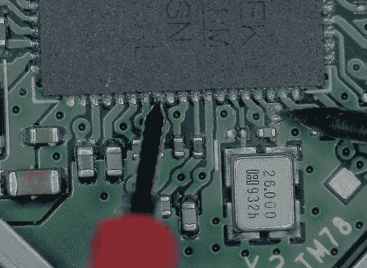

图 A-1：Fluke TP910 测试引线带有 pogo 引脚（左）连接 QFN IC 焊盘，锐利探针刺穿焊接掩膜（右）

在中低端市场，选择范围要广泛得多。一个建议是远离低成本的 Fluke（或其他大品牌）选项，因为它们通常似乎在功能上有限制，以避免与其高端选项相互竞争。一个简单的选择往往是 *EEVBlog* 品牌的万用表，它们通常经过充分测试，性价比高。根据你所在的国家/地区，你可能会发现许多不同的本地可用选项，这使得指定具体型号变得困难，但在当地的 Amazon 网站查看评级是一个不错的起点。

如果你选择预算型万用表，或许仍然值得在更好的引线套件上多花点钱。虽然预算型万用表的电子元件可能足够应付任务，但其引线通常感觉便宜，或者尖端太大，不便于使用。购买带有硅胶绝缘电缆的优质引线是值得投资的，因为引线是你将花费大量实际操作时间的部分。不要因为花在测试引线上的钱比万用表本身还多而感到不安。

## 精细间距焊接：$50 至 $1,500

焊接是你会经常做的一项任务。我们称之为*细间距焊接*，因为除了标准的通孔焊接外，你还需要将电线焊接到测试点以及进行其他需要精细焊接铁头的任务。你需要多种选择，而不仅仅是标准的细头焊接铁头，因为你会发现细头焊接铁头很容易损坏。焊接铁头通常由内部的铜芯和一层不会与焊锡反应或氧化的金属组成（见图 A-2）。

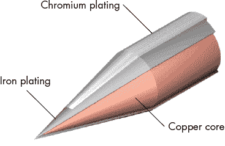

图 A-2：焊接铁头的构造包括一个铜芯和一个更坚固的镀层，选择该镀层是为了能够耐受与焊锡的接触。

一旦镀层有了孔，焊接铁头通常就废掉了，因为它不再能提供良好的热连接。较小（更细）的焊接铁头通常会很快出现孔，尤其是当用来焊接较大的物品时，这可能会导致你推动或摩擦焊接铁头。

最受欢迎的焊接选择之一是 Hakko FX-951，它配有许多非常精细的焊接铁头，适合处理小型表面贴装元件和将电线焊接到微小的元件上。该设备本身大约$400，焊接铁头的耗材相对便宜（起价$10）。这些焊接铁头的加热器和热电偶是集成在一起的，这意味着你能将热量直接传递到焊接铁头附近。

另一个我们喜欢的高端焊接工具是 Metcal 系统，它使用一种叫做“SmartHeat”的技术（见图 A-3）。

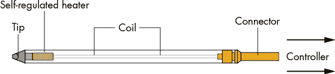

图 A-3：Metcal 使用一种几乎与焊接铁头集成的加热器（SmartHeat）来调节焊接铁头的温度。在这个系统中，焊接铁头的温度是固定的，但它比使用独立温度计的焊接铁头反应要快得多。

这个加热器实际上是一种具有居里点（即改变其磁性特性的温度）的特殊材料，选定为所需的焊接铁头温度。它集成在焊接铁头中，并通过高功率射频信号源驱动，因此焊接铁头可以迅速从焊接小型表面贴装电阻到拆焊大型连接器。

一个常见的起步点是 Metcal MX-5210 基站（$800），然后你需要选择合适的焊接铁头（它甚至不带焊接铁头）。对于焊接铁头，STTC-125 和 STTC-145 零件号是不错的选择（大约$30），并且两者都适用于无铅焊锡。基站和焊接铁头都很贵，而且这些焊接铁头比经典的加热器方案更易损坏。

如果你想以更低的成本得到相似的效果，Thermaltronics 提供了使用相同技术的低成本方案。Thermaltronics TMT-9000S（$400）实际上使用了与 Metcal 系统相同的焊接铁头连接，因此它也可以为 Metcal 基站提供低成本的焊接铁头。

JBC 也开始提供性价比高的焊接站。特别是 CDB 和 CDS 系列的价格低于 Metcal 焊接站，但性能非常出色。根据你所在的国家/地区，你可能会发现某些品牌比其他品牌更容易购买，并且通常进口或运输成本会显著影响一个焊接站的性价比。

Hakko FX-951、Metcal、Thermaltronics 和 JBC 都是相对高端的焊接站。你也可以使用便宜得多的电烙铁，但在低端市场，你的具体需求往往决定了最具性价比的选择。一个不错的选择是 TS100 焊接铁（参见 图 A-4）。

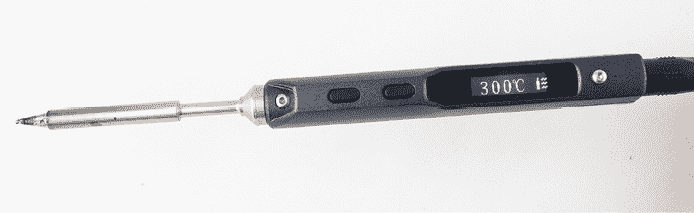

图 A-4：TS100 是一款低成本的电烙铁，与高价电烙铁相比，表现相当出色。

这款焊接电烙铁非常独特，因为它使用直流电输入，这意味着它体积小且便于携带。你可以轻松通过汽车电池或交流-直流电源适配器（比如你的笔记本电源适配器）来运行它。在实际使用中，它表现非常好，且热恢复速度很快，但一定要使用足够强劲的电源，理想的电压范围是 19 至 24 V，以提供最大功率。TS100 提供了不同大小的焊接头的套件，或者你也可以购买带有提供焊接头的 TS100，它的价格低于一些昂贵的 Metcal 替换焊接头（我们说过，Metcal 的东西很贵）。

## 去除通孔焊锡：30 美元至 500 美元

如果幸运的话，你可能永远不需要从印刷电路板（PCB）上移除通孔连接器或类似组件。但有时这是必须的，当即使是少量焊锡残留时，移除它也变得非常棘手。像 *吸锡带* 和 *吸锡器* 这样的基本工具，在面对更复杂的任务时使用起来可能会更加困难。

相反，拥有像 *焊锡去除“枪”* 这样的工具是值得的。这些工具配备了一个加热元件和一个主动吸力装置，可以在加热焊锡的同时将其从组件引脚上吸走。图 A-5 展示了一个独立的例子，Hakko FR-300，但你也可以在各种焊接工作站中找到这种功能的附加装置。

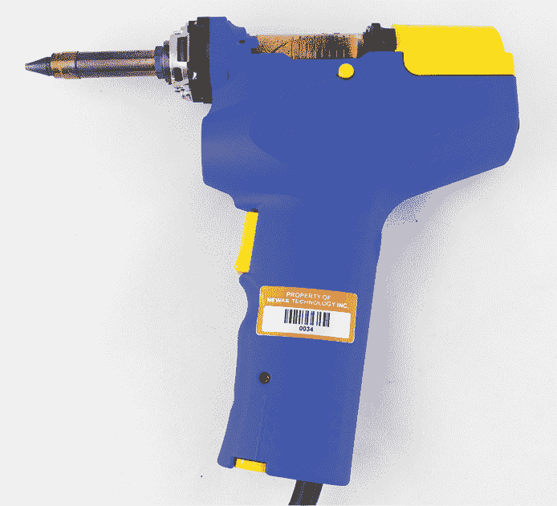

图 A-5：Hakko FR-301 是一款流行的通孔去除工具，它是 FR-300 的直接替代品。

无论你使用什么方式去除电路板上的焊锡，首先在电路板上添加低熔点焊锡会有帮助。例如，如果你在拆焊无铅工艺时，焊锡会保持液态的时间非常短，迅速冷却。如果你先在连接处加入一些含铅焊锡，它会保持液态更久（警告：这意味着如果你想将电路板恢复使用，它就不再符合 ROHS 标准）。你可以通过使用像 Chip Quik 移除合金 SMD1NL（无铅）或 SMD1L（含铅）这样的产品来进一步延长液态时间，这些产品专为加入焊点并使其具有更低的熔点而设计。一旦焊点清理完毕，可以使用“常规”焊锡重新焊接，恢复正常功能。

## 焊接和拆焊表面贴装元件：$100 到 $500

表面贴装焊接有广泛的需求。我们将重点介绍硬件破解中最常见的任务，而不是所有可能的表面贴装工作。

对于表面贴装焊接来说，最重要的设备是*热风枪*。这种设备提供热空气流，帮助焊接元件下面的焊点。你可以找到各种受欢迎的热风工具，涵盖各种价位。截至本文撰写时，一款受欢迎的中档选择是 Quick 861DW（图 A-6），它提供可靠的热风源，并具备良好的设置范围。除了热风枪，你可能还需要*喷嘴*。不用担心要为每个封装购买合适的喷嘴，因为你可以通过在大封装表面上移动较小的喷嘴来适应需求。

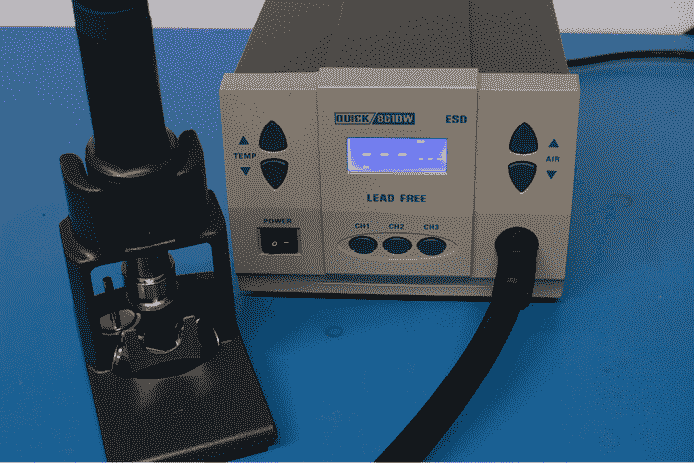

图 A-6：Quick 861DW 是一款中档热风枪。

如果你不确定热风枪的设置，好的起始点是调节温度和流量，使得当你将热风枪在纸上移动时，纸张变为浅棕色。你不想流量过大，否则会把元件吹走。在正式开始使用之前，先拿一台旧笔记本电脑或计算机主板，看看你能轻松拆卸多少个元件。如果你做得很好，试着将它们重新组装回去。

如果你计划处理更大的封装（如 BGA），*电路板预热器*可能会很有用。这个工具可以将热风吹到电路板的另一面，这样热风枪只需要用来将温度“推高”到可以熔化焊锡的最终值。

很多 YouTube 频道更详细地展示了这种返工技术。Louis Rossmann 的频道展示了笔记本电脑（尤其是 MacBook）和手机的维修。这些消费电子设备通常具有非常细密的元件，通过足够的经验，你可以感受到什么是可能的。

如果你有有限的表面贴装需求，你也可以考虑之前提到的 Chip Quik *去除* *合金* SMD1L 或 SMD1NL。这种焊料合金的熔点非常低。它可以与常规电烙铁一起使用，并且在熔化后保持足够长的时间，足以让你用电烙铁绕过整个 SMD 芯片——即使是一些较大的封装，如 TQFP-144！当然，它只适用于可见的焊盘，但它不需要任何额外的工具，只需要你可能已经拥有的设备，而且这种合金本身也很便宜（不到$20）。即使是使用热风设备，它也适用于一些热敏元件附近的情况，这些元件较难掩蔽。

你还可能会遇到带有焊球的*球栅阵列（BGA）*封装，这些焊球可能需要在拆卸后进行“重新焊球”。你可以购买高级的重新焊球夹具，但如果你只是偶尔使用这些封装，可能只需要购买一套低成本的 BGA 模板即可。由于低成本工具的使用说明较难找到，我们将在本书中重新创造一种适合我们的技巧。我们将使用一包便宜的模板，价格仅约$20（见图 A-7）。我们可以将焊膏涂抹到模板上，重新加热后，它将形成完美的焊球。如果你以前没有使用过焊膏，可能需要一些时间才能掌握技巧。大多数焊膏的保质期有限，应该存放在冰箱中。基于这一点，我们将简要介绍使用这些模板时更可靠的技巧。

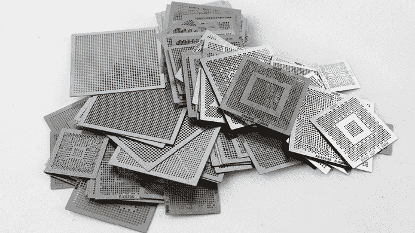

图 A-7：用于 BGA 重新焊球的便宜模板示例

对于这种便宜的模板，最可靠的重新焊球过程如下：

1.  移除旧的焊球并使用除焊带进行焊接。

1.  使用异丙醇（IPA）和/或助焊剂清除剂彻底清洁区域。

1.  将去焊球的芯片粘贴到模板的底部。

1.  用刮刀（如信用卡边缘）将焊膏型助焊剂（例如 MG Chemicals 8341-10ML）涂抹到模板上（模板下方是芯片）。小心不要造成模板错位。

1.  使用适当尺寸的焊球，小心地将球推入每个模板孔中。确保模板表面没有多余的焊球。图 A-8 显示了该过程的开始。

1.  将芯片加热，直到焊球重新流动到芯片表面（见图 A-9），这要求焊球的尺寸与设备的焊盘尺寸相匹配（在此示例中，尺寸已标示在模板上）。你可能会找到带有多种焊球（球体）尺寸的工具包。

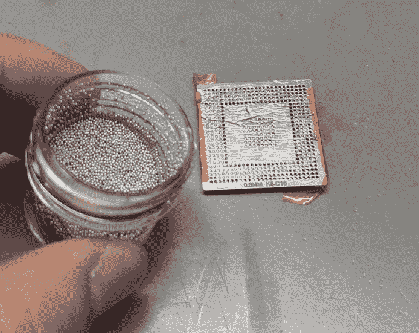

图 A-8：带助焊剂的 IC 粘贴在模板上。请注意，BGA 与模板的匹配不完全，留下了些许没有焊盘的深色孔洞。

由于这些套件很多来自未知来源（如果你在亚马逊上购买的话），你可能希望选择一个更有信誉的来源。Chip Quik 制作了多个焊球套件；例如，如果你使用的是 0.4mm 的焊球，Chip Quik 的零件号 SMD2032-25000 可以通过 Digi-Key 购买，价格不到 $30，提供 25,000 个 0.4mm 的焊球。

最后关于 BGA 的注意事项，建议调查与你感兴趣的零件相关的低成本夹具和模板的可用性。你可以找到几个低成本的*BGA* *返球夹具*，它们适用于更常见的零件，简化了将 BGA 和模板正确对齐并固定的任务。

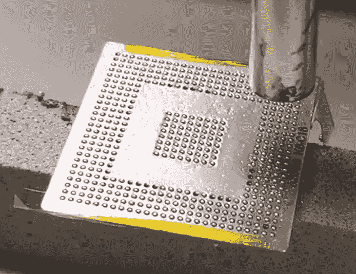

图 A-9：使用热风熔化焊球完成任务。 图 A-8 中丢失的焊盘不应有焊球——额外的焊球无法粘附到焊盘上，容易从模板孔中出来并导致短路。

## 修改 PCB：$5 到 $700

修改 PCB（包括切割线路以插入电阻器进行分流、重新布线或接入数据线）是另一项常见任务。虽然你可以使用简单的 X-Acto 刀来完成大部分工作，但旋转工具可能会更有用。

你在五金店购买的*旋转工具*通常会配有太大尺寸的附件，这些附件不适合在 PCB 上使用。相反，应该寻找类似 Foredom K.1070 高速旋转微型电动工具套件（见 图 A-10）的工具。这款工具的转速最高可达 38,000 RPM，拿在手里时你会感受到差异。这是因为它使用了高质量的轴承，远远超过了你在当地五金店可以买到的普通品牌旋转工具。

如果你购买这款特定的工具，请务必选择带有 3/32 英寸卡盘选项的版本。这样你可以为其购买一些小型旋转头，如 Foredom AK211 套件，这样你就可以从设备的背面钻取一个单独的 BGA 球，甚至可以附着在没有连接到 PCB 的 BGA 球上。

你还会发现轻型*打磨头*，例如 Foredom A-71 非常有用。这款打磨头可以轻松去除 PCB 上的焊料掩膜而不会损坏底下的线路，非常适合你需要接入多个线路时，比如数据总线。

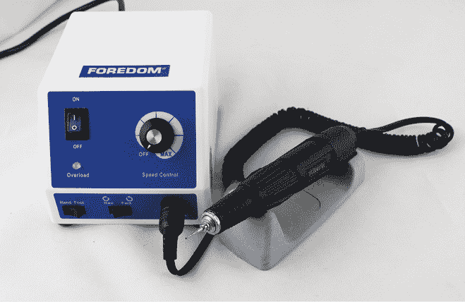

图 A-10：Foredom 高速旋转微型电动工具套件

## 光学显微镜：$200 到 $2,000

根据修改 PCB 的需求，你可能需要观察这些修改。通常的标准是使用*立体显微镜*（见 图 A-11）。这些显微镜提供立体视图，保持了你的深度感知，使你更容易看到当焊接铁或旋转工具接触到 PCB 时。

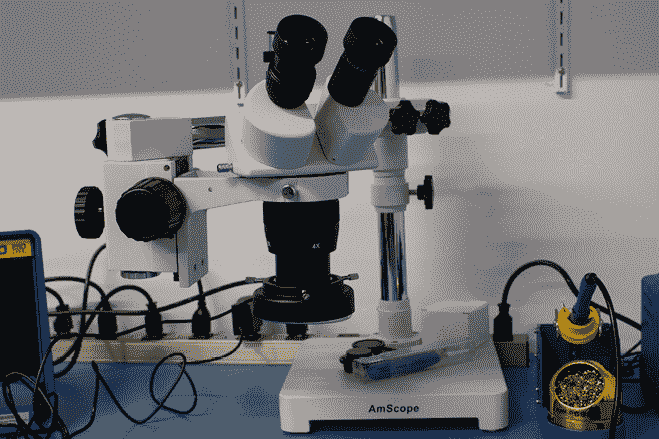

图 A-11：一款低成本的 AmScope 单臂光学显微镜，具有 10× 或 20× 的总放大倍数（可切换）

你也许可以在本地找到一台二手显微镜，但如果是购买新的，低成本选项是 AmScope 品牌，通常可以在亚马逊上找到。在评估不同选项时，请考虑双臂支架显微镜比单臂支架显微镜更不容易自行旋转，这是一些低成本单臂支架显微镜常见的问题。

*总放大倍数*是目镜放大倍数和物镜放大倍数的组合。对于电路板焊接，10×到 30×的总放大倍数是有用的，例如，这可能意味着物镜放大倍数为 1×，目镜为 20×。有些显微镜，你可能会发现需要在物镜阶段添加一个*巴洛透镜*。巴洛透镜可以减少放大倍数（典型值为 0.5×），但它增加了显微镜的焦距，这样你就有更多的空间在显微镜下放置你的电路板和工具。

## 拍摄电路板：$50 到$2,000

如果你在记录工作内容时，你也会想拍摄电路板级别的项目，这需要使用带有视频摄像头的显微镜。较便宜的选项包括亚马逊及类似平台上的多种低成本 USB 或 Wi-Fi 显微镜，它们提供了很高的性价比，价格在$20 到$40 之间（图 A-12 展示了一个例子）。

图 A-12：一款低成本 USB 显微镜

如果你试图将这些 USB 显微镜用于实时焊接（作为视觉显微镜的替代），请注意，由于 USB 连接，它们有时会出现延迟，这可能使得实时使用变得困难。

如果你购买一台*三目显微镜*（而不是仅仅购买立体显微镜），你可以添加相机来拍摄你所看到的图像，并且还可以将相机的图像广播到屏幕上，用于培训或教育环境。你可以从之前提到的低成本 AmScope 制造商那里找到价格合理的三目显微镜，价格在$500 到$1,000 之间。

你还可以找到只包含相机部分的*单目数字显微镜*，通常带有 HDMI 和 USB 输出。通过 HDMI/VGA 输出的延迟通常比 USB 小，这意味着使用外部显示器时，它们也可以提供一个良好的拍照或检查电路板的方法，避免了长时间通过显微镜目镜观看所带来的眼睛疲劳。如果你计划将相机输出用于实时反馈（例如焊接或探针操作），选择一个具有 HDMI 或 VGA 输出的相机将帮助你避免因 USB 延迟而可能引发的困扰。

## 目标电源供应：$10 到$1,000

另一个常见的任务是为目标提供电源，这通常最容易通过*台式电源供应器*来完成。这些设备允许你配置要提供的电压和（最大）电流。各种电源供应器可从常规测试设备供应商处购买，但一个性价比高的选项是 Rigol Technologies 的 DP832。

更复杂（以正面意义而言）的目标电源选择是 EEZ Bench Box 3，它是开源硬件，允许多种计算机控制选项。

在低端市场，许多额外的桌面电源选择可供选择。你当地的商店可能会有低成本的桌面电源。由于许多电源中的重型变压器与不同的本地市场认证要求相结合，全球范围内有各种不同的供应商和解决方案，因此很难推荐特定的型号。

对于只需要简单电源的目标，你可以使用 AC-DC “墙插”电源砖，这些电源砖可以通过废弃电子设备免费获得。它们还可以与低成本的无品牌可调稳压器结合使用，你可以在亚马逊（或类似平台）上找到这些稳压器，从而以极低的成本提供可调电源。这些便宜的选项有一个代价：它们的噪声输出相对较高，可能会对你之后进行的任何旁信道分析产生负面影响。

## 查看模拟波形（示波器）：300 美元到 2.5 万美元

虽然*示波器*有多种用途，通常你需要查看模拟波形，这也是许多任务的一部分，例如查看两个设备之间的 I/O 模式、检查电压水平、观察复位引脚活动或其他任何事情。我们还将它们用于旁信道功率分析测量，但我们会在与更一般的调查用途分开讨论这种用例。

进行一般调查有许多选择。最受欢迎的低成本示波器品牌是 Rigol，特别是 Rigol DS1054Z。Rigol 示波器仍然具有良好的探头质量和合理的性能，因此尽管价格较低，但它们并不会像你预期的那样显得便宜。最近，Rigol 还推出了高性能设备，它们的性价比仍然比更知名的品牌要好。

更常见的品牌，如 Keysight（以前的 Agilent 和 HP）、Tektronix 和 Teledyne LeCroy，也提供相当种类的示波器。这些公司经常推出捆绑各种配件的促销活动，因此即使你预算有限，也不要排斥品牌示波器。注意那些只有“品牌名”部分的型号——也就是说，这些是非常低成本的“版本”，但仍然带有品牌名。这些低端设备通常是其他厂商示波器的重新品牌化版本，这意味着它们并不是内部设计的，也没有实际使用高端型号所涉及的丰富经验。而且，因为供应商不想蚕食高端示波器市场，它们通常在重要方面有限制，这会使它们在“实际”工作中不那么有用（但在大学实验室等地方使用则没问题）。我们将在下一节“内存深度”中通过 Keysight EDUX1002A 示波器的例子来展示这一点，其中 EDUX1002A 的内存深度有限，因此不适合用于功率分析工作。

如果你的预算较高，选择一个知名品牌的设备可能会使未来扩展更加容易，因为你可以利用大量的探头和配件。虽然存在一定的跨平台兼容性，但许多探头和配件通常在原厂品牌的设备上工作最佳。因此，你可能会考虑购买某个特定的示波器或品牌，以便未来使用时需要的探头是 Rigol（或类似品牌）没有提供的。如果有机会，最好亲自试用几款不同的设备（通常在展会时可以这样做）。不同设备的界面确实有所不同，因此你可能会发现自己有个人的偏好。一些公司甚至允许你按天/周/月租用高端示波器。如果你正在为实验室采购设备，花一些租赁时间确保示波器在实际应用中可行，可能会帮你避免一次昂贵的错误。

关于示波器使用的最后一点：另一种选择是使用基于计算机的示波器，其中 PicoScope 是最受欢迎的。我们强烈推荐这些设备，因为你可以在一个小巧的设备中获得大量功能。它们也容易编程，因为有多种语言的 API 可用。不过，有些人更喜欢物理旋钮的操作感，因此使用基于 PC 的示波器有时更多的是个人偏好。

在选择用于一般用途的示波器时，重要的考虑因素包括*采样率*（通常以 MS/s 或 GS/s 为单位）、*模拟带宽*和*内存深度*。我们将简要讨论如何选择示波器，重点考虑一般用途（另外，我们将在其他部分讨论侧信道测量）。

### 内存深度

较大的内存深度使你能够捕获长时间的波形，例如设备的整个启动过程。低端示波器和低成本品牌的示波器通常内存深度有限，即使它们的带宽和采样率看起来不错。例如，Keysight 的 1000-X 系列旨在与 Rigol 的产品竞争。DSOX1102A（大约 700 美元）仅提供 1 Mpts（百万个采样点）的内存深度。其教育版 EDUX1002A（大约 500 美元）提供的内存深度甚至更小，为 100 kpts。相比之下，Rigol 的 DS1054Z 提供 24 Mpts 的内存深度。但这在实际使用中意味着什么呢？

假设你以 1 GS/s 的速度进行采样，即每秒钟写入 10 亿个样本到存储器。虽然 EDUX1002A 在触发后只会存储 0.1 毫秒的波形（计算方式为 100,000 样本存储/1,000,000,000 样本/秒 = 0.0001 秒）。同样的采样率下，Rigol 将提供 24 毫秒的记录波形。如果需要更长的波形记录，你可以降低采样率。如果我们将采样率降低到 100 MS/s，Rigol 会存储 240 毫秒的数据，而 EDUX1002A 仍然只会存储 1 毫秒的波形。Tektronix 低端型号（TBS1000）甚至更差，存储深度仅为 2.5 kpts！稍微升级到中端的 Tektronix，比如 MDO3000 系列，提供了更合理的 10 Mpts，因此在比较设备时需要留意这一点。

PC 基础的示波器在存储深度方面表现出色。低端的 PicoScope 2204A 系列起始时只有 8 kpts，但稍微提升到 2206B（约 350 美元），就能提供 32 Mpts —— 这是一些大品牌的 1 万美元或 2 万美元示波器都没有的较大缓冲区。

对于一般的探索，存储深度很重要，因为我们通常并不知道自己正在寻找什么。到了实际攻击的时候，我们很少需要这么大的存储深度，因为我们测量的是一个非常特定的时刻。但如果我们需要记录整个启动过程的信息，我们可能无法立刻知道 100 毫秒的启动过程中哪一部分才是关键。虽然我们可以通过调整采样率与存储深度之间的平衡来记录更长的时间，但我们推荐至少设置 1 Mpts 的缓冲区。购买缓冲区过小的示波器会让你在观察更复杂的动作序列时感到沮丧，并且会使得本书中描述的一些任务变得困难。

### 采样率

*采样率* 是内部模数转换器（ADC）运行的速度。你通常会看到类似于 1 GS/s 或 100 MS/s 的标识，分别意味着每秒进行 10 亿次转换和 1 亿次转换。对于一般探索，一个好的经验法则是，采样率应比你想要观察的数字信号快 5 到 10 倍。如果你计划探测 50 MHz 的 SPI 流量，那么你可能需要一个 500 到 1000 MS/s 的示波器。这种 5× 到 10× 的采样率意味着你可以真正“感知”波形的形状，这对于查看波形变化的实际速度以及是否存在波形故障是非常有用的。

如果你的采样过于缓慢，实际上会由于一种叫做 *混叠* 的效应而导致错误的波形。你可以找到这种现象的理论图示，但它在现实生活中是什么样的呢？我们生成了一个 60 MHz 的波形并将其输入到示波器中，得到的示波器屏幕如 图 A-13 所示。

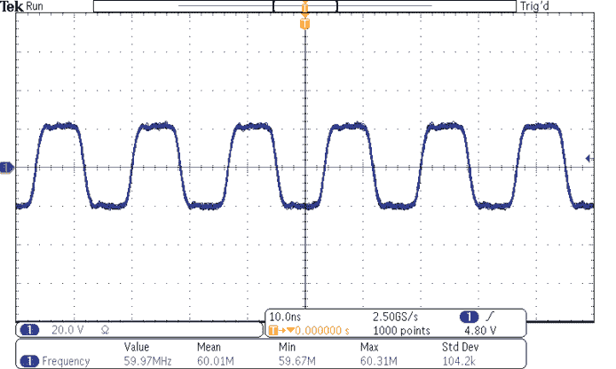

图 A-13：来自信号发生器的 60 MHz 方波，以 2500 MS/s 采样

然后我们将示波器的采样率更改为 100 MS/s（见图 A-14）。你会注意到，示波器捕获到的频率根本不是 60 MHz；你可以在图的底部看到，示波器识别到的是 33.59 MHz 的信号。如果你不知道这实际上是一个 60 MHz 的信号，什么也看不出明显的问题！示波器通常会有抗混叠滤波器，用来消除超过示波器最大采样率的频率，但如果你选择的采样速度太慢（像我们这里做的那样），你仍然会遇到问题。

图 A-15 显示了如果采样频率降到 5 MS/s 会发生什么情况。现在测得的信号频率是 19.88 Hz！

尽管在理论上 60 MHz 是 5 MHz 的整数倍，但我们会期望混叠显示为 0 MHz 信号：一条平直的线。然而，实际上，信号发生器和示波器的频率都会略微偏离基准频率，这会表现为由于混叠导致的（低）频率。

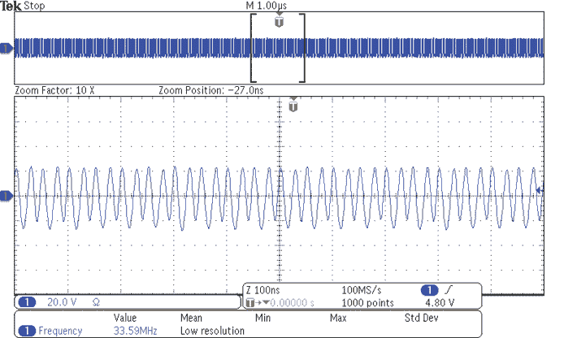

图 A-14：来自信号发生器的 60 MHz 方波，采样率为 100 MS/s；由于混叠，测得的频率是不正确的。

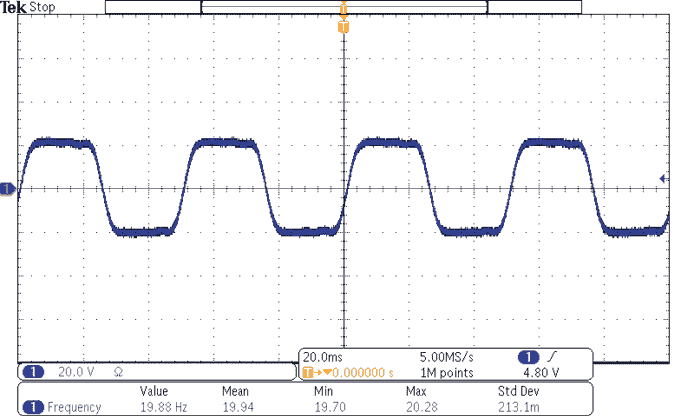

图 A-15：来自信号发生器的 60 MHz 方波，在 5.00 MS/s 采样下；测得的频率是信号发生器时钟和示波器时间基准之间的“拍频”，这是一个混叠问题。

### 带宽

与采样率相关的是*模拟带宽*。示波器的前端会有一个滤波器，防止过高的频率传递到采样电路，带宽表示这个频率开始“衰减”的位置。仍然有一些高频信号会通过，因为滤波器并不完美。表征滤波器的公认方法称为“3 dB”点，这意味着*衰减*后的信号幅度是实际幅度的 70.7%。

当示波器的带宽为 100 MHz 时，这意味着如果你将一个 10 MHz、1 V 的正弦波输入示波器，你会看到一个幅度为 1 V 的 10 MHz 正弦波（如预期）。但是如果你将一个 100 MHz 的正弦波输入示波器，你只会看到一个幅度为 0.707 V 的信号。当你增加正弦波的频率时，正弦波的幅度会减小。

如果你讨论的是数字采样，情况稍有不同。数字方波实际上有“无限”的频率存在。实际上，你不需要如此无限的带宽，但比数字波形高 2.5 倍到 5 倍的带宽可以保持边缘的清晰度。举个例子，图 A-16 显示了一个 18 MHz 的方波，在 2.5 GS/s 的采样率下，用 250 MHz 的模拟带宽进行采样。

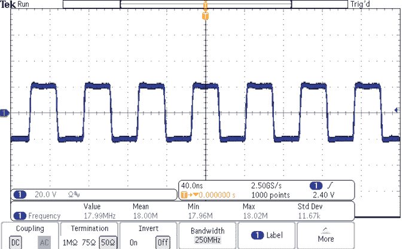

图 A-16：一个 18 MHz 的方波通过 250 MHz 带宽时是干净的。

将图 A-16 与图 A-17 中相同的 20 MHz 模拟带宽的方波进行对比（我们使用的示波器具有切换带宽的能力）。

现在许多示波器的带宽（有时还包括采样率）是“现场可升级”的解决方案，这意味着示波器硬件已经具备更高的带宽，但你需要付费解锁该功能。探头本身可能与型号匹配，因此如果你订购的是 100 MHz 带宽的示波器，它只会配备 100 MHz 带宽的探头。在许多型号中，你可以在线查找到关于如何进行此升级过程的信息，你可能会发现，购买一个较低端的示波器并以后解锁更高的采样率和带宽符合你的预算。

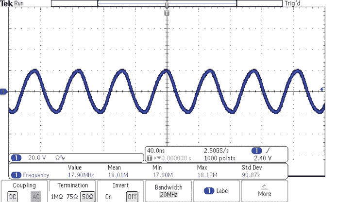

图 A-17：一个 18 MHz 的方波以 20 MHz 带宽的正弦波形式出现，因为没有更高频率的成分。

### 其他功能

本书不是一本“电子学入门”书籍，因此我们不会过多地讨论其他功能。你经常会看到一种功能是能够*解码*某些信号，比如 RS232 和 I2C。这是一个有用的功能，但在实践中，使用逻辑分析仪来完成这个任务通常更为简单（下面将进行讨论）。

*有用*的一个特性是，当解码功能还可以生成触发信号时——也就是说，你可以在数字 I/O 数据字节上触发模拟示波器测量。许多支持解码的示波器也支持这种实时触发功能。你通常也可以将这个触发信号发送到“触发输出”连接器，这样就能触发故障注入设备。

## 逻辑波形查看：$300 到 $8,000

与查看模拟波形相比，查看数字波形通常意味着只能在数据总线上看到零和一。一个典型的数据捕获类似于图 A-18，这是监测 SPI 数据传输及串行接口的一个例子。

有几个主要的*逻辑分析仪*工具供应商，但我们将主要关注基于 PC 的仪器，因为在使用逻辑分析仪时，你更常设置数字解码功能并导出数据。在 PC 上执行这些操作要容易得多，因此逻辑分析仪通常非常适合基于 PC 平台。

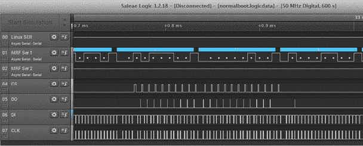

图 A-18：逻辑分析仪捕获示例

对于基于 PC 的平台，最著名的供应商是 Saleae。该公司的产品如此成功，以至于早期版本被广泛仿造并在各种市场上以超低价格（低于$10）出售，作为廉价的逻辑分析仪。Saleae 分析仪的最新版本在每个引脚上都可以进行模拟和数字测量，这使你可以查看“现实生活”中的情况（模拟域），同时尝试将其转化为简单的 1 和 0。这在调查过程中也非常有用，因为有时你不确定实际使用的逻辑电平（是 1.8 V、3.3 V 等吗？）。Saleae 的软件使得解码各种协议变得容易，并能观察整个系统中发生的情况。该软件支持几乎所有你可能遇到的协议，因此它是你工具箱中的关键部分，值得推荐。

Saleae Logic 硬件通过将数据流回计算机来工作，这意味着捕获长度没有实际限制。如果你的计算机能跟得上，你可以捕获数小时的数据。由于数字数据可以轻松压缩（你不需要存储常量状态），与模拟测量采样相比，数字文件要合理得多。

Saleae Logic 的唯一缺点是引脚数量。最大型号的 16 个输入可能不足够。而尽管 Saleae Logic Pro 16 具有 16 个输入，但它只能在 6 个通道上保持 500 MS/s 的采样率；启用所有 16 个通道会将数字采样率降至 125 MS/s。如果你计划监听一个大型总线，Saleae 可能不是最好的选择。

如果你需要更多的信号，Intronix LA1034 LogicPort 是一款相对较旧的设备，但依然具有很强的竞争力。它具有 34 个输入通道，并且在所有 34 个通道上以 500 MS/s 的速率进行采样，提供了市场上最具性价比的选择之一。

我们没有涉及其他工具的几个供应商，而是想提供一些提示。如果你想选择一个高端工具，NCI Logic Analyzers 生产的 GoLogicXL 系列提供了 36 或 72 个通道，采样速率为 4 GS/s。GoLogicXL 还提供硬件触发功能，接下来我们将讨论这一点。

## 串行总线触发：$300 到$8,000

Saleae 逻辑分析仪通过将“原始”比特下载到计算机来工作。逻辑分析仪并不理解它是否是 I2C、UART 或 SPI 流量，这对于分析来说没问题，但如果你需要对特定字节进行触发怎么办？

*触发*特定数据是一个常见的任务。许多广告支持“硬件触发”的逻辑分析仪，仅能在提供给逻辑分析仪输入的特定数字模式上触发。例如，一个 8 输入的逻辑分析仪可以配置为在模式“10010111”上触发，甚至可能在这样模式的序列上触发。它通常设计为支持在并行总线上发生内存访问时触发。但如果我们尝试在串行协议上触发，这种简单的基于模式的触发就远远不够灵活了。

在这种情况下，我们需要一台更智能的逻辑分析仪，因为硬件捕获设备必须足够了解协议，才能在特定的数据字节上触发。也就是说，逻辑分析仪本身需要实时解码串行数据，以产生触发信号。

许多逻辑分析仪不支持此功能，因为它们依赖计算机的灵活性来执行协议分析。一些支持串行总线解码的示波器确实支持在解码后的串行数据上触发，但在投资任何给定的示波器之前，检查该功能是否能够用来在特定数据序列上生成触发信号是非常重要的。

许多专业（昂贵的）逻辑分析仪会支持此类功能。例如，NCI GoLogicXL 就支持这一功能，允许你匹配来自各种协议的特定数据包，包括 SPI、CAN、I2C 等。然后可以将该触发输出路由到其他设备——通常是触发示波器，但我们可以根据需要将其用于故障注入或其他任务。

在低成本的一侧，你会发现一些示波器提供“在串行数据上触发”功能，这可能是一个付费升级，或者是示波器在现场可启用的各种选项的一部分。

## 解码串行协议：$50 到 $8,000

对于 UART 串行 I/O，通常只需要一台 PC 和串行电缆。你可以购买不包含任何电平转换器的*USB 转串口电缆*，它们可以直接与许多嵌入式系统中的 TTL UART 引脚连接。比如基于 FTDI FT232R 芯片的电缆。你可以在 Linux 上使用*GNU Screen*，在 Windows 上使用*PuTTY*，或者使用其他软件应用程序来与接口进行通信，就像它是一个终端一样。

虽然前面的逻辑分析部分假设你想捕获“原始”逻辑电平，但这可能并不必要。你可能只关心例如通过总线传输的 SPI 数据，这是一个更容易完成的任务。这意味着你可以使用一个实现你想嗅探的协议的设备，它将只显示“更高层次”的数据，而不是具体的总线过渡。

一个常见的方法是自行在微控制器上实现协议，然后通过串行接口将数据转发到计算机。Arduino 通常用于这一特定任务。一个优势是，你还可以构建触发逻辑；而不是购买昂贵的逻辑分析仪，你可能能够通过低成本的 Arduino 或类似设备来构建触发逻辑。

一个旨在简化这一过程的开源工具是由 Great Scott Gadgets 开发的*GreatFET*（见图 A-19）。该工具具有一个微控制器，能够暴露许多你可能需要的常用接口，例如 SPI、I2C 和 UART。此外，它还可以作为一个简单的逻辑分析仪，捕捉实际的线路级过渡。

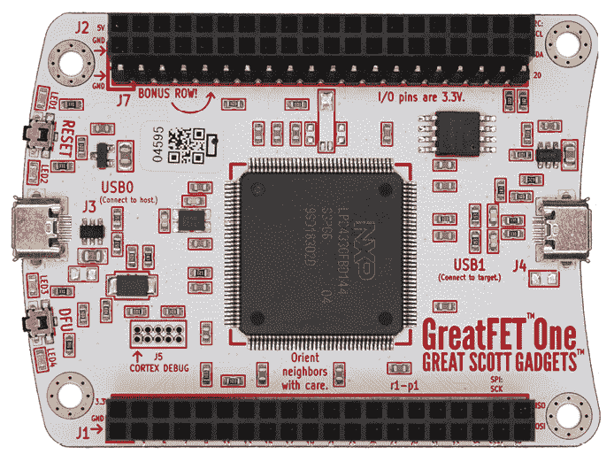

图 A-19：GreatFET One 接口设备，来自 Great Scott Gadgets（图片来源：Great Scott Gadgets）

与 GreatFET 依赖微控制器来处理大部分解码工作不同，另一个开源工具*Glasgow 接口探测器*（[`github.com/GlasgowEmbedded/`](https://github.com/GlasgowEmbedded/)）配有一个小型 FPGA，可重新配置以实现更复杂的解码操作。在撰写时，Glasgow 刚刚发布，但理论上它能够实现几乎完美的定时触发生成，因此它有可能替代昂贵的逻辑分析仪，承担基于协议级数据触发的任务。我们通常不会提及尚未使用过的工具，但这个工具具有独特的功能集，值得作为你工具集的重要补充，值得深入探索。

商业工具也提供协议嗅探器。Total Phase 提供了一款简单的 I2C/SPI 嗅探器，叫做 Beagle I2C/SPI 嗅探器。它配有图形界面，简化了大规模 I2C 或 SPI 事务的监控，这在逆向工程复杂总线时非常有用。

## CAN 总线嗅探与触发：$50 至 $5,000

*控制器局域网络（CAN）*总线在许多汽车应用中得到了广泛使用，并且有许多低成本和专业级的解决方案可供选择。一些工具可以进行 CAN 通信，如 CANtact、CANbadger 以及 Riscure 的 Huracan。后者的设计目的是能够根据特定的 CAN 流量触发外部故障注入。像许多串行协议一样，你可能会在硬件逻辑分析仪或示波器的串行触发模块中找到基本的触发支持。

Linux 也支持 CAN。通过 SocketCAN，你可以在 Linux 中使用你最喜欢的数据包嗅探工具来查看 CAN 流量。如果你想了解更多关于 CAN 的内容，可以参考 Craig Smith 的*Car Hackers Handbook*（2016 年），由 No Starch Press 出版，并且可以在 OpenGarages 网站上找到更多与 CAN 相关的工具。

## 以太网嗅探：$50

你可能认为*以太网嗅探*“不是硬件话题”，但它对嵌入式系统分析确实很相关：那台设备可能正通过网络传输关于自身的各种有趣信息。

以太网可能是最容易与之交互的高速接口，通常不需要硬件改动。许多小型嵌入式设备都有以太网端口，比如带以太网扩展板的 Arduino 控制器、树莓派以及许多其他低于 10 美元的设备。只需安装正确的软件，如 WireShark 用于嗅探，然后插入以太网电缆。如果你试图被动监控以太网，使用 Great Scott Gadgets 的 *Throwing Star LAN Tap* 或一台老式网络集线器（而不是交换机）会更有帮助。

## 通过 JTAG 交互：$20 到 $10,000

JTAG 对于调试和检查设备非常有用。如我们在第二章中讨论的，JTAG 有两个主要用途：*边界扫描* 和 *调试*。这两种用途的工具略有不同。某些工具可以同时用于这两种用途，但软件通常是不同的。

### 通用 JTAG 和边界扫描

使用 JTAG 需要你在板上“找到” JTAG 端口。如果目标使用标准引脚排列，你可能会很幸运，但如果不是，Joe Grand 的 *JTAGulator* 可以自动检测 JTAG 引脚排列。JTAGulator 是一个自包含的工具（不依赖于主机计算机的软件），因此它通常非常可靠，并且还可以执行各种边界扫描和调试任务。它比通用 JTAG 接口硬件稍微更为小众，但其功能集非常适合硬件黑盒工作，它也支持各种低级别的边界扫描选项，甚至在某些情况下可以作为调试接口使用。

对于纯边界扫描工具（切换引脚或检查状态），*TopJTAG* 软件是最佳选择之一，而且其许可证费用合理。许多其他商业边界扫描软件的费用高达数千美元，而且表现不如 TopJTAG。

对于开源边界扫描，*Viveris JTAG Boundary Scanner* ([`github.com/viveris/jtag-boundary-scanner/`](https://github.com/viveris/jtag-boundary-scanner/)) 提供类似的功能，开源 Python 绑定库 ([`github.com/colinoflynn/pyjtagbs/`](https://github.com/colinoflynn/pyjtagbs/))，名为 *pyjtagbs*（其中 *bs* 显然是边界扫描的缩写），允许在 Python 代码中使用该库。

这些库需要一个硬件探针与设备进行连接。最常见的支持选项（包括 TopJTAG 和其他工具）是 SEGGER J-Link 或基于 FTDI FT2232H 的接口电缆。基于 FTDI 的电缆并不特定于任何厂商，但最好的选项之一是 Joe FitzPatrick 的 *Tigard* 板，它提供电压转换，并附带电压选择和接线电缆，使其易于适配你的目标板。

### JTAG 调试

*调试* 意味着与设备上的调试核心进行交互，这至少允许你读取或重新编程设备，但它也意味着你可以查看和修改内部内存和寄存器。这同样需要软件和硬件的解决方案。软件通常涉及两个部分：与硬件接口的程序和你（人类）交互的更高级别调试软件。

对于开源软件，*OpenOCD* 项目是硬件接口部分最著名的选择，支持大量硬件接口和目标芯片。其中许多使用 FTDI FT2232H 芯片（例如 Olimex ARM-USB-OCD-H，你可以通过 Digi-Key/Mouser 购买，或之前提到的 Tigard 板）。

另一个不错的低成本选择是 1BitSquared 的*Black Magic Probe*。这是一款开源工具，支持多种类型的 Arm Cortex-A 或 Cortex-M 设备。务必检查你的特定设备是否在支持列表中。Black Magic Probe 不依赖于 OpenOCD，而是暴露所需的接口给更高级别的调试工具。

再看开源选项，*GNU 调试器（GDB）* 是你最有可能使用的更高级别的接口软件，并且它有许多基于 GDB 的 GUI。GDB 软件将与 OpenOCD 或 Black Magic Probe 进行接口。

请注意，前面提到的开源工具大多与流行核心（如 Arm 设备，未来可能包括 RISC-V）相关。如果你关注的是不太常见的设备，通常出现在汽车或工业处理器中，那么你可能会面临非常有限（或没有）开源和低成本选项。

在商业（高成本）端，提供了多个涉及硬件和软件解决方案的选择，在我们的经验中，它们通常非常值得花钱。大多数情况下，这些工具会在新设备正式发布之前就提供支持，如果你在专业环境中使用工具，这可以节省你大量时间，因为你可能会发现目标设备与 OpenOCD 不兼容，且需要为其添加支持。

SEGGER 制造了流行的*J-Link*工具，支持大量 Arm 设备，特别是在 Cortex-M 系列设备上非常受欢迎（一些型号也支持 Cortex-A）。SEGGER J-Link 有多个型号。如果你是学生，SEGGER J-Link EDU 以比任何其他专业工具都要低的价格（$20）提供。不同的 J-Link 型号通常还提供评估模式，允许你体验某些功能（例如公司工具中提供的实用 Ozone 调试器），这些功能否则是无法使用的。高端 SEGGER 工具（如 J-Trace Pro）支持非常高速的调试和跟踪接口。

Lauterbach 也有多款支持高速跟踪和调试的 JTAG 产品。Lauterbach 工具，如 PowerDebug Pro 和 PowerDebug USB 3，支持多种设备架构，包括 Arm、PowerPC、Intel、AVR、ARC 等。虽然 Lauterbach 工具的价格可能高于其他产品，但其支持的设备种类非常丰富，因此一个工具可能比多个单独的工具更具成本效益。如果你计划使用不同的架构和设备类型，Lauterbach 工具将非常有用。

其他供应商也提供适用于特定架构的工具。如果你使用的是一些汽车电子控制单元（ECU）中常见的 PowerPC 设备，可能会发现 PEmicro Multilink 是一种性价比较高的选择（$200）。在这种情况下，硬件接口工具还需要一个单独的软件许可证来进行调试，尽管你可以自由使用 GDB 及其附带的 GDB 服务器接口进行调试。

## PCIe 通信：$100 到 $1,000

*PCI Express (PCIe)* 在高端嵌入式系统或个人电脑中较为常见。每个供应商都有提供 PCIe FPGA 开发板。有一定 HDL 编程技能的用户，可以配置这些设备来记录内存内容、与其他硬件设备交互，或监控并修改内存中的数据。它们有较高的学习曲线，而且通常价格不菲，但 Lattice 会定期促销其基于 PCIe 的 ECP3 开发板。

*PicoEVB* 是一款小型 FPGA 平台，符合笔记本电脑的 M.2 标准（见 图 A-20）。它是一个相对低成本的解决方案，适用于现代笔记本电脑，并且提供多个示例来使 PCIe 事务工作。

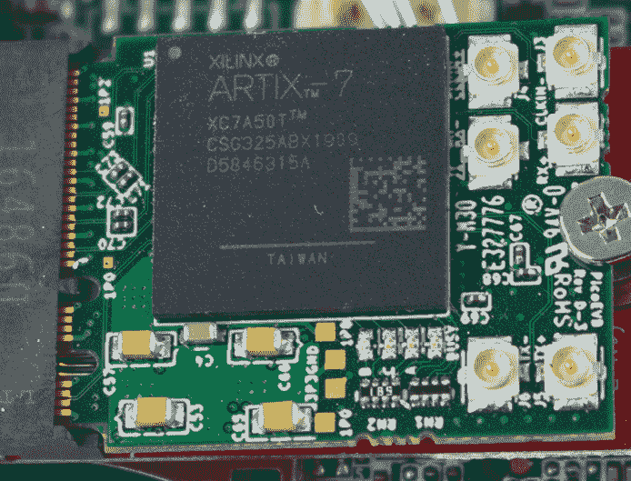

图 A-20：PicoEVB，一款适用于笔记本 M.2 插槽的 FPGA，可以用来探索 PCIe。

Broadcom 有一款“USB 3.0 到 PCIe”桥接芯片，USB3380。它可以作为一个 PCIe 设备连接到系统，但也可以配置为将流量传递到 USB 主机，或根据 USB 主机的命令发起 PCIe 事务。USB3880 参考开发板用于 *SLOTSCREAMER*，这是一款廉价的开源 PCIe DMA 攻击板，用于通过 PCIe 导出和修改系统内存。

## USB 嗅探：$100 到 $6,000

处理计算机外设时的一个常见任务是 *嗅探 USB 流量*。市面上有几款商业化的解决方案，但我们最喜欢的一款是 Total Phase Beagle 480（见 图 A-21）。该设备能够嗅探 USB 2.0 流量（更昂贵的版本也支持 USB 3.0）。虽然相对较贵，但该工具使得处理得到的 USB 数据变得非常简单。由于 USB 协议相对复杂，你支付的更多是分析软件的费用，而非物理硬件。每个 USB 设备至少在 USB 1.1 速度下能够正常工作；因此，一个技巧是插入一个旧款的 USB 1.1 集线器，从而使设备降速到较低的速度。

在开源领域，也有多个选择。如果你需要操控 USB 流量，*FaceDancer* 是 GoodFET 的衍生工具，它允许你在辅助系统上使用 Python 模拟任何任意的 USB 设备，并进行 USB 中间人攻击。

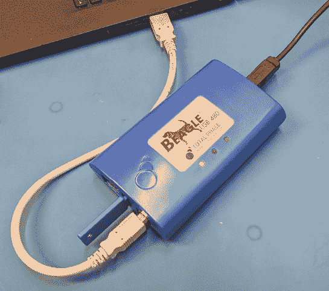

图 A-21：Total Phase Beagle USB 嗅探器配有易于使用的图形界面，使得解码协议变得简单。

Colin 开发了 *PhyWhisperer-USB*，它可以嗅探 USB 2.0 流量。PhyWhisperer-USB 缺少 Total Phase Beagle 480 那样精美的图形界面软件和处理突发流量的缓冲区，因为 PhyWhisperer-USB 首先是为 USB 数据触发而设计的。

最新的 USB 嗅探和破解技术可以在 Kate Temkin 的 *LUNA* 项目中找到，它也可以从 Great Scott Gadgets 购买。根据本书的写作时，工具处于晚期测试阶段，但它采用了独特的架构，允许它用于嗅探、插入和各种 USB 任务，如接下来描述的触发任务。尽管我们自己没有使用过此工具，但由于其独特的架构，值得特别提及。Colin 曾经说过，如果 LUNA 在他开始开发 PhyWhisperer-USB 时就已经上市，他宁愿自己购买 LUNA 板！LUNA 板能够执行远超嗅探之外的各种 USB 任务。

## USB 触发：$250 到 $6,000

除了仅嗅探 USB 数据外，你还可能需要在 USB 数据上进行 *触发*。触发意味着相对于实际传输的 USB 包“经过线缆”的时刻，你需要生成一个触发信号。一些高端的 USB 嗅探器能够执行此任务；例如，Total Phase Beagle 480 就具备基于 USB 包数据进行触发的能力。

一个低成本的选择是 PhyWhisperer-USB，它是开源硬件，由 NewAE Technology, Inc. 销售（见 图 A-22）。

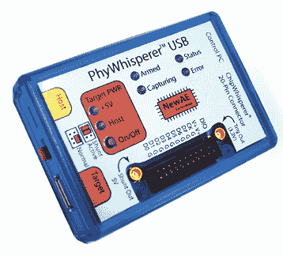

图 A-22：PhyWhisperer-USB 是一个用于 USB 触发和分析的开源硬件工具。

该工具专门为 USB 数据包触发设计，因此支持附加功能，如能够为目标设备重新上电，并且提供 Python 3 API 以允许你编写触发机制脚本。如前所述，你可能也能使用 LUNA 项目执行其中一些任务，因此也请查看该项目的最新文档。

## USB 模拟：$100

前述工具专注于分析 USB 流量，而非修改它。要进行修改，事实上的工具是开源的 *FaceDancer* 项目。虽然有多种硬件选项可用，但 GreatFET One（见 图 A-19）在商业上广泛可得，并且支持大多数功能。LUNA 也可以用于插入和模拟 USB 设备，而且 FPGA 的使用使得它能够执行比微控制器更复杂的操作。

## SPI 闪存连接：$25 到$1,000

另一个常见的任务是读取*SPI 闪存芯片*。根据需要完成的任务，有几种可用的选项。一种商业选项是 SEGGER J-Link Plus（或该系列中的任何高端型号），它主要作为一种强大的调试适配器，用于基于 Arm 的微控制器。如果你正在购买（或已经拥有）J-Link 用于调试任务，它也可以作为一个优秀的 SPI 闪存编程器，使用“J-Flash SPI”软件。

你可能还需要一个*SOIC 夹具适配器*，用于连接 SPI 闪存芯片。这些通常可以从制造商 Pomona 获得，型号为 5250（也有一些来自无名制造商的低价选项）。

有几种方式可以与 SPI 设备进行接口。FTDI FT232H 芯片是 FTDI USB-串行适配器的强化版，也支持 SPI。DediProg 生产 StarProg-A 系列设备，主要用于在电路中编程 EEPROM，而 Minipro TL866II 通用编程器也可以就地刷写一些 SPI 设备。*Flashrom*工具支持通过内置的 SPI 进行编程，例如在 Raspberry Pi 或 BeagleBone Black*上，以及包括 FT232H 芯片在内的外部编程器，如前面提到的 Tigard。对于价格敏感但仍然相对易用的替代方案，可以考虑 FlashcatUSB。

要与除存储设备以外的 SPI 设备进行接口，最好的选择是使用*Bus Pirate*与设备进行交互式通信，或者使用支持 SPI 控制器的硬件或软件微控制器。为了物理连接读卡器和设备，推荐查看*mini-grabber**s*和*SOIC 夹具*。前者适合连接到单个引脚，而夹具可以让你连接到 SOIC 封装的所有引脚。最近，你会发现 Raspberry Pi 是一个很有用的接口工具。它们的优势是速度比可靠的 Bus Pirate 要快得多，后者可能需要几分钟才能读取一个大型 SPI 闪存芯片。

## 功率分析测量：$300 到$50,000

我们终于开始讨论本书特定的设备了。不过，我们不是已经讨论过示波器了吗？这难道不够用于功率分析测量吗？实际上，你可能会发现对于功率分析测量有与更一般的电路探索不同的需求。事实上，你甚至可能会用一台设备进行一般探索，而用另一台设备执行功率分析工作。

在对设备进行功率分析时，我们通常关注的是非常小的变化或非常小的测量。例如，你可能正在测量的波形可能只有几毫伏的峰峰值波形，这与正常的 3.3 V 逻辑电平信号探测任务不同。理解这一点需要检查示波器的*输入灵敏度*规格。该规格通常是以*每格*为单位，这是回溯到示波器显示屏上有固定网格尺寸（格线）的时代。即使现在的格线是通过数字方式绘制的，那个规格仍然被沿用。

你需要弄清楚多少个格线构成完整的输入范围；通常你会发现垂直方向上有八个格线。因此，具有 1 mV/格最灵敏范围的示波器意味着 8 mV 的峰峰值。你通常会期望在最灵敏的端点找到 10 到 100 mV 的峰峰值全量程（或 ±5 到 ±50 mV）。当然，你也可能使用一个*放大器*（或*主动探头*）来提供更大的信号输入到示波器。

另一个进行功率分析测量时至关重要的特性是波形如何下载到计算机。虽然在单纯探索设备时，你不太关心这一点，但在功率分析期间，你将对成千上万甚至数百万（甚至数十亿）个功率轨迹进行统计分析。在这里，附带计算机的设备非常有用，因为像 PicoScope 6000（参见图 A-23）这样的设备具有 USB 3.0 接口，可快速下载大量波形数据。你甚至可以获得基于内置 PCIe 的捕获卡，如 Cobra Express CompuScope 或 AlazerTech 的产品，它们可以直接将数据流传输到计算机内存。

图 A-23：用于功率分析的 PicoScope 6000 USB 示波器。该型号有四个通道，350 MHz 带宽，最大采样率为 5 GS/s，以及 2 GS（千兆样本）的内存缓冲区。

如果你使用的是独立式示波器，你可能会使用网络（以太网）接口。大多数示波器都支持使用该接口通过一个名为*VISA*的系统下载波形数据。不幸的是，仅通过研究数据表，可能很难知道这种方法下的实际有效捕获率。高端型号通常工作良好，允许快速触发和下载，但低端设备可能不会总是进行优化，因为大多数示波器用户并不将数据下载到计算机，因此这不是一个高度优化的使用场景。

讨论功率分析测量的最后一个选项是*ChipWhisperer*捕获硬件，它最初是由 Colin 作为一个开源项目发起的。ChipWhisperer 与示波器略有不同，因为它*仅*支持捕获微弱信号，因为它的前端包含一个低噪声放大器（LNA）。其输入灵敏度范围大约从 10 mV 到 1 V 满刻度，而普通示波器的范围大约是从 50 mV 到 100 V。ChipWhisperer 捕获硬件还始终是*交流耦合*的，这意味着它无法测量恒定的直流电压。我们在进行功率分析时，通常不需要这种恒定的直流电压，因此通过在前端去除它，可以帮助简化捕获硬件。

ChipWhisperer 硬件有多种变体：主要有 ChipWhisperer-Nano（$50）、ChipWhisperer-Lite（起价$250）和 ChipWhisperer-Pro（$3,800）硬件。额外的功能更新包括 ChipWhisperer-Husky 架构更新，增加了更多功能到 ChipWhisperer-Lite。ChipWhisperer-Lite 是最初作为 Kickstarter 项目发布的原始板，它包括了目标设备，且与同一块板一起（参见图 A-24）。这块板的设计理念是，你可以将目标去除，之后再添加你自己的目标，但现在该板已经提供了连接器和外部目标，使得与外部目标的工作更加便捷，通常作为入门套件的一部分，如 NAE-SCAPACK-L1 或 NAE-SCAPACK-L2。

图 A-24：原始的 ChipWhisperer-Lite 包含捕获硬件（板的左三分之二）和目标设备（板的右三分之一）。

与普通示波器的另一个主要区别是 ChipWhisperer 捕获硬件使用了同步采样方法。图 A-25 展示了一个普通示波器的设置，它使用内部时间基准来决定何时进行采样。时间延迟在被测设备的时钟边缘与示波器采样点之间实际上是随机的，而且每次功率轨迹都会发生变化。通常我们可以通过以非常快的速率进行采样来避免这个问题；在旁道功率分析中，以 100 MS/s 到 5 GS/s 的速率采样是很常见的。ChipWhisperer 通过将采样点与目标设备时钟同步，避免了这个问题，这使得你可以以较慢的速度进行采样，但仍然能够进行高成功率的攻击。它*确实*需要访问设备时钟才能成功，但在某些情况下，我们是可以访问的。更安全的设备（如智能卡）将使用内部振荡器，需要时钟提取电路，但更基础的微控制器通常会使用外部晶体，我们可以附加上去。

这引出了一个问题，我们的攻击需要多快的采样率才能成功。如果我们使用类似 ChipWhisperer 捕获板的同步采样，则采样率可以低至设备时钟频率的 1 倍（即以设备时钟频率进行采样）。如果我们使用常规示波器，通常的经验法则是采样频率为设备时钟频率的 5 倍至 10 倍。同时，确保示波器和探头的带宽至少与采样率相当。

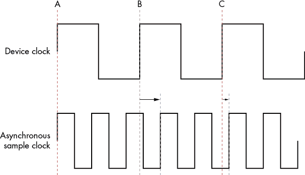

图 A-25：一个异步采样时钟（如常规示波器中使用的）会导致设备采样时钟的上升沿（A、B 和 C）与定义采样时间的下一个上升沿之间存在一些时间抖动。

我们应该添加免责声明，即所需的采样率会随着攻击的算法不同而有很大变化。例如，我们可以在采样率仅为目标设备的 0.0001 倍时攻击一些较慢的算法，因为该算法本身非常慢，以至于泄露的数据并不需要每个时钟周期的信息。同样，硬件加密实现可能仅因意外故障在时钟周期的一个小部分泄露信息，这意味着 5 倍到 10 倍的更高采样率可能不足以捕获此故障，即使是同步采样仍然需要大量过采样才能捕获故障。

## 模拟波形触发：$3,800+

回到*触发*的话题，模拟波形的触发也非常有用。这意味着不仅是对上升沿或下降沿进行触发，而是匹配模拟波形中的确切模式。它通常在通道分析或故障注入中使用，用来在某些敏感操作之前触发。

一些示波器提供这个功能，尽管它比较罕见，通常只在高端示波器中可用，因此你可能需要使用外部硬件来实现这个目标。Riscure icWaves 具有多种功能，专为执行此触发功能而设计。

ChipWhisperer-Pro 还内置了一个简化版本的模式匹配功能，它允许匹配比 icWaves 解决方案更少的采样点。ChipWhisperer-Pro 也可以作为功率测量平台，因此它可以用于执行多个任务。

Riscure icWaves 和 ChipWhisperer-Pro 都使用绝对差值和（SAD）来执行匹配逻辑。它们将波形的最后 *N* 个点存储在缓冲区中，并将这 *N* 个点与某个期望的匹配模式进行比较。如果这些点足够接近（差异足够小），则会生成触发信号。

## 测量磁场：$25 到 $10,000

另一个你会发现有用的任务是测量设备发出的*磁场*强度，这基本上意味着需要一个*H-Field（磁场）探针*。探针的实际设计非常基础——一个简单的环形天线就能拾取磁场。天线通常被屏蔽，以尽可能阻挡*电场*（*E-field*）。图 A-26 展示了几种 H-Field 探针的示例。

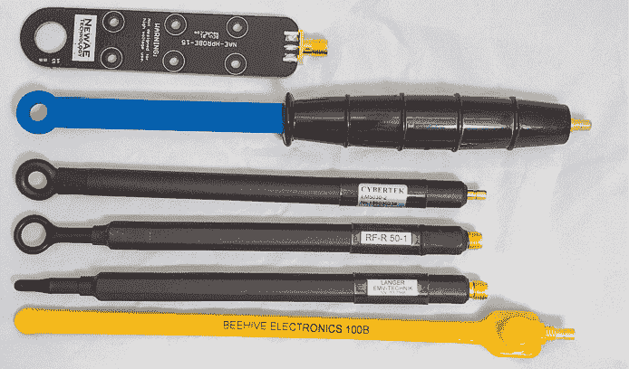

图 A-26：来自不同制造商的 H-Field 探针

购买探针时，你有几个选项需要考虑：

**封装尺寸探针**

在这里，我们将*封装尺寸探针*定义为大致能够探测单个设备，如集成电路（IC）或组件的探针。这些较大的磁场探针可以作为*平面设计*购买，该设计使用 PCB 来降低成本。这些的例子包括 Beehive Electronics 101A 探针组、TekBox TBPS01 和 ChipWhisperer NAE-HPROBE-15。ChipWhisperer NAE-HPROBE-15 还发布了设计信息，要求制作四层 PCB，但如果需要针对特定应用调整设计，它允许你进行修改。

平面设计的缺点是探针必须平放在芯片上，而这在物理上可能无法实现。也有各种其他方向的设计，这些设计较为著名的是 Langer EMV RF1 套件，其中包含几种对不同磁场方向敏感的探针。

由于 Langer EMV RF1 套件的普及，现在有几种低成本的克隆产品可供选择。Rigol NFP-3 套件包含与 Langer EMV 套件相似的探针。一个更低成本的选择是由 Cybertek 制造的 EM5030 探针组。Cybertek 探针的绝缘层稍厚，这会对灵敏度产生负面影响，因为你无法将实际的探针本身物理上靠近磁场源。

还有一些稍小的探针可供选择，来自 Langer EMV 及其他厂商。例如，Morita Tech MT-545 探针，其线圈直径为 1.6 毫米。

**前置放大器**

1.  对于所有这些套件（包括 Langer EMV 套件），你需要一个*前置放大器*来为示波器输入提供合理的信号电平。供应商提供与其套件匹配的放大器，尽管放大器本身的设计与供应商关系不大。各种放大器设计可能在噪声性能上有所不同，但设计一个低噪声放大器并不是特别困难的任务。除了增益（通常应期望为 20 至 30 dB）外，*噪声系数（NF）*也应考虑。NF 衡量的是输入与输出之间信噪比（SNR）的退化，因此较高的 NF 意味着放大器本身会向输出添加额外的噪声。例如，Langer EMV PA 203 SMA 放大器的增益为 20 dB，噪声系数为 4.5 dB。

如果你将放大器的输出连接到示波器，你可能希望选择一个带宽匹配的放大器。例如，Langer EMV PA 203 SMA 放大器指定的可用频率范围为 100 kHz 到 3 GHz。如果你将其连接到 200 MHz 带宽的示波器，3 GHz 放大器通常会比带宽较小的放大器噪声性能差。

提供射频产品的公司之一是 Mini-Circuits，它销售完整的 LNA 设备，如 Mini-Circuits ZFL-1000LN+（100 kHz 到 1 GHz 带宽，20 dB 增益，2.9 dB 噪声系数），价格约为$100。你可以使用 ZFL-500LN+（100 kHz 到 500 MHz 带宽，24 dB 增益，2.9 dB 噪声系数）略微减少带宽，它具有稍高的增益。对于低成本 LNA 的极致选择，可以使用 BGA2801 作为廉价 LNA 的基础（100 kHz 到 2.2 GHz，22 dB 增益，4.3 dB 噪声系数）。基于 BGA2801 的 LNA 设计示例可在 ChipWhisperer 项目中找到（完整放大器的噪声系数将比仅有原始 IC 的噪声系数更差）。

**芯片级及更小探头**

1.  虽然之前的探头大多用于测量整个设备，但我们所说的芯片级探头是指可以用于探测 IC 表面更小部分的探头。有些探头可以使用类似的技术制造，只不过使用更小的线圈。这可以用来制造 300µm（0.3mm）大小的线圈，例如 Langer EMV RF3 迷你套件。

更小的探头也有可能，比如 Langer EMV MFA 01 套件，包含了最小可达 100µm 的探头。使用如此小的探头时要注意：探头必须非常靠近测量源，在这种情况下就是 IC 芯片。你几乎肯定需要去除或部分去除被测 IC 的封装，才能使用这些非常小的探针。

**一体化**

1.  更小的探针尺寸也使得考虑将放大器集成到更靠近探头尖端的位置变得有意义。之前提到的 Langer EMV 套件在 100µm 到 250µm 范围内包含了集成放大器，但也有稍大尺寸的完整解决方案，既包含探头也包含放大器。Riscure 销售的 EM 探头，放大器与探头紧密集成，带宽为 1 GHz。它专门设计用于芯片表面上的 XY 扫描。

## 时钟故障注入：$100 到$30,000

*时钟故障注入*需要生成复杂的时钟波形。图 A-27 展示了一个时钟故障注入波形示例。以合理成本实现这一目标最直接的方式是使用任何基于 FPGA 的 ChipWhisperer 平台中的时钟故障注入功能，如 ChipWhisperer-Lite 或 ChipWhisperer-Pro（ChipWhisperer-Nano 没有 FPGA，因此无法进行时钟故障注入）。

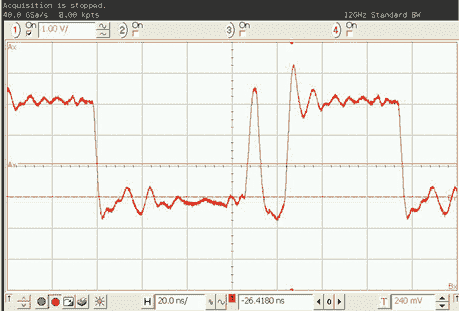

图 A-27：时钟故障波形示例，7.37 MHz 时钟插入窄脉冲

Riscure VC Glitcher 和 Riscure Spider 也可以执行时钟故障注入，并且具有更复杂的电路来以 2ns 的分辨率生成故障波形。对于低成本或 DIY 选项，你将主要局限于自己在 FPGA 板上实现。实现过程超出了本书的范围，但低成本的 FPGA 板（例如 Digilent Arty）是一个很好的起点。虽然你可能会考虑使用任意波形发生器（AWG），但用 AWG 生成非常快速的数字波形可能会比较困难。

## 电压故障注入：$25,000 至$30,000

*电压故障注入*通常需要在短时间内在两个或多个电压源之间切换。与时钟故障注入相比，构建自己的电压故障注入系统更为容易。典型的 DIY 解决方案是使用多路复用器集成电路（如 MAX4619），在每个输入端提供两种不同的电压。你可以在常规电压和故障电压之间切换来插入故障。请参见第六章，或查看 Chris Gerlinsky 的演示文稿《破解 NXP LPC 系列微控制器的代码读取保护》（REcon 布鲁塞尔，2017 年）。

目前，ChipWhisperer 硬件平台使用简单的钳位机制来生成电压故障波形（参见图 A-28）。ChipWhisperer-Lite/Pro 最佳支持此机制，但它也可以与 ChipWhisperer-Nano 一起使用，只是功能更加有限。

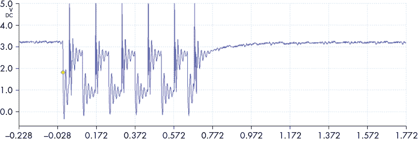

图 A-28：VCC 故障波形示例

对于更完整的解决方案，Riscure VC Glitcher 和 Riscure Spider 可以执行电压故障生成（以及时钟故障生成），并且与 ChipWhisperer 平台相比，它们具有更复杂的触发电路。这些设备允许生成灵活的模拟波形，而与 ChipWhisperer 的限界方法相比，其能力更强。

电压故障注入也可以通过快速函数发生器来实现。这些发生器以合理的价格可得，如 Siglent SDG6022X（$1,500）。你需要一个放大器来驱动任何负载，可以使用高电流运算放大器作为 DIY 解决方案，或者使用 Riscure（故障放大器或故障放大器 2）或 NewAE Technology（ChipJabber）的产品。参见 Claudio Bozzato、Riccardo Focardi 和 Francesco Palmarini 的《塑造故障：优化电压故障注入攻击》，了解在实际设备上使用 DIY 解决方案的示例。因为你可能已经有了函数发生器，构建一个 DIY 放大器可能是你现有实验室的低成本解决方案。

## 电磁故障注入：$100 到$50,000

*电磁故障注入（EMFI）*是一种强大的故障注入方法。EMFI 大致需要将高电压切换到一个小型电感器上，从而生成强大的磁场。除了 DIY 开源解决方案，目前市场上还有几种专门的解决方案。

对于专用设备，Riscure 的 EM-FI 瞬态探头工具是最初的且使用最广泛的 EMFI 工具。该设备配有各种尺寸和极性的注入探头。NewAE Technology 推出了 ChipSHOUTER EMFI 工具，它同样配有多种探头，并附带若干样本目标板。Riscure EMFI 工具和 ChipSHOUTER 都设计用于相对快速的重复操作，例如在系统中插入多个故障时可能需要的操作。

另一个专用工具是 SGZ 21 脉冲发生器（可在 E1 套件中找到），以及 Langer EMV 的 S2 套件 H 场注入探头。该工具是为免疫测试而设计的，而非安全分析，因此目前关于其在故障注入测试中的使用细节较少。

Morita Tech 还制造了 E 场和 H 场注入探头（部件号 MT-676，分别有 MT-676E 和 MT-676H 版本，提供 E 场和 H 场注入）。这些产品在日本制造，并且在日本国内似乎更容易订购。

除了专门为 EMFI 提供的解决方案外，Avtech Electrosystems, Ltd. 还提供了各种脉冲发生器，可用于 EMFI。它们要求你将输出适配到特定的 EMFI 线圈上，这需要验证脉冲发生器在没有任何修改的情况下能够驱动感性负载。

也有低成本和 DIY 解决方案。Red Balloon Security 的一个名为*BadFET*的项目可以使用，但它有一个明显的缺点，就是采用了一种相对危险（但更容易构建）的方法，将高压切换到暴露的注入线圈上。关于与 EMFI 工具相关的架构，请参见第五章。

## 光学故障注入：$1,000 到 $250,000

*光学故障注入*通常指使用激光将特定光点定位到 IC 芯片上。一个更低成本的选项是使用闪光管和镜头，正如 Oscar M. Guillen、Michael Gruber 和 Fabrizio De Santis 在《低成本局部半侵入式光学故障注入攻击设置》中所描述的那样。

对于精确的光学故障注入，需要一个光源（激光）、一个*XY 定位台*，以及一个激光优化的*显微镜*系统。对于光源，*背面攻击*需要红外（1064nm）激光，*前面攻击*则需要更短波长（880nm，532nm 或更短）的激光。

几个附加功能可以让你的工作更加轻松。*额外的 Z 平台*可以帮助自动聚焦激光束，*红外线敏感相机*可以让你通过 PC 来定位激光束。同样，*红外线光源*将允许你透过硅看到金属层，这有助于背面攻击时的定位。最后，一些认证要求必须拥有*双激光系统*，能够在一次故障注入过程中在芯片的两个不同区域上发射激光脉冲。Riscure 提供了包括该功能和上述附加功能的激光站 2。Alphanov 激光解决方案还提供激光故障注入硬件，可以集成到 Riscure 激光系统中，或通过 eShard 的故障注入脚本在 esDynamic 中驱动。

## 定位探针：$100 到$50,000

对于 H-场探针、EMFI 和激光系统，可能需要对目标进行精确的*定位*。通常是使用 XY 或 XYZ 台面来完成这一任务，这些台面是为了显微镜用途而销售的。像 Thorlabs 这样的供应商提供多种 XY(Z)台面，包括手动和电子台面。Riscure 提供了 EM 探针站和激光站，这两者都包含平台。其他 XY(Z)台面供应商可以通过搜索“显微镜定位平台”轻松找到。

为了与 ChipSHOUTER 匹配，NewAE 提供了 ChipShover XYZ 台面和控制器。它基于开源固件，除了与 ChipSHOUTER 一起使用，还可以用于定位 EM 探针或其他工具。

还可以找到一些低成本的手动定位平台，例如 AmScope（GT200 平台）或某些海外供应公司（AliExpress）出售的产品。

一个低成本的 XYZ 台面选项是使用 3D 打印机平台。3D 打印机通常具有足够的精度，能够完成你需要用到的 H-场探针（电磁分析）和 EMFI（注入）等大多数工作。例如，许多 3D 打印机具有 1 到 20µm 的步进分辨率，这使得在芯片表面或目标上能够进行较大的步进。例如，在一个 4×4mm 的芯片上以 10µm 步进分辨率进行步进意味着 3D 打印机在 X 和 Y 方向上各有 400 个步进。前面提到的 ChipShover 工具基于 3D 打印机固件，提供了一个开源 API，你可以与大多数标准打印机一起使用，这些打印机简单地处理*G-code*，例如。G-code 是专门为 3D 打印机设计的语言。

需要关注的重要规格是台面的*步进大小*或*分辨率*，以及*重复误差*，通常以µm 为单位表示。前者指的是台面能够做出的最小步进，后者指的是从任何点 A 到任何点 B 移动时的最大预期误差。你可以想象这个误差对于故障的可重复性是非常重要的。

## 目标设备：$10 到$10,000

在你的研究与开发阶段，你将需要*目标设备*。虽然你可能有一个特定的目标设备作为攻击对象，但从你完全控制的设备开始会更为合理。最显而易见的目标是该设备的开发板。例如，如果你对汽车设备感兴趣，例如 PowerPC MPC5777C（某些 ECU 中使用的芯片），你可以尝试对实际的 ECU 进行探索，但这将会很困难，因为你可能对原理图、运行程序等信息一无所知。相反，找到该部件的开发板，并首先在开发板上进行攻击会更好。一旦你探索了该设备本身，就能更好地理解其在特定板上的工作原理。这一建议即使适用于你自己评估的产品，因为你的产品可能仍然会让评估过程变得比在独立板上复杂。

在低端，你可以使用类似 Arduino 的设备来运行代码，然后修改它进行功耗分析和故障注入。专门为此分析工作设计的目标确实存在。最早的商业可用目标之一是由 Akashi Satoh 开始的 *SASEBO 项目*，该项目现已转变为 *SAKURA 项目*。在查找 SAKURA 板时，不要将其与 Renesas Electronics 后期发布的同名 Sakura 板混淆。

由于各种许可变更，SAKURA 板有时可能会很难找到；请参见 SAKURA 首页了解更多信息。它们目前可从 TROCHE 获取。图 A-29 显示了一个 SAKURA-G 板。大多数 SAKURA 板的目标是 FPGA，这使你能够在可编程硬件中实现算法。SAKURA 板提供了多种 FPGA 大小，包括一些用于复杂算法的非常大的 FPGA。

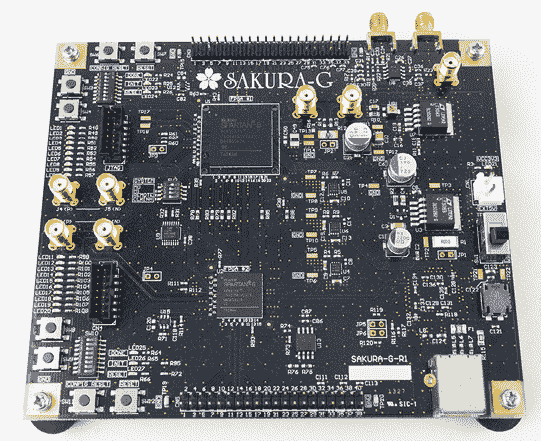

图 A-29：SAKURA-G 是一系列有用的基于 FPGA 的目标系统的一部分。

最常见的目标板是 ChipWhisperer 项目的一部分。这些目标大多数都可以通过 CW308 UFO 板提供，CW308 UFO 板是一个基础板，可以安装许多目标。图 A-30 显示了一个带有目标的示例基础板。

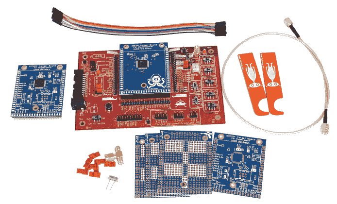

图 A-30：ChipWhisperer UFO (CW308) 提供了多种开源顶级模块，可以用来测试各种设备和算法。

该目标系统允许更换各种测试处理器。可用的测试设备包括 8 位 XMEGA、32 位 Arm、FPGA、PowerPC 等。除此之外，目标部分的原理图和完整设计文件可以在 [`github.com/newaetech/chipwhisperer-target-cw308t/`](https://github.com/newaetech/chipwhisperer-target-cw308t/) 获取，如果你需要修改设计或想要构建自己的目标板。

除了用于 FPGA 目标的 SAKURA 板，ChipWhisperer 项目还拥有 CW305 FPGA 目标，该目标搭载 Artix 7A100 FPGA，可以在其上实现加密算法（见图 A-31）。

Riscure 提供各种智能卡以及一个名为*Piñata*的嵌入式目标，并配有其工具。这些目标允许运行更复杂的算法和测试，适用于 Riscure 工具链，包括多种故障和激光故障注入。

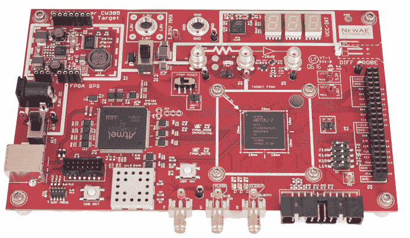

图 A-31：ChipWhisperer CW305 拥有 Artix A35/A100 FPGA 目标，允许您在硬件中实现算法。
