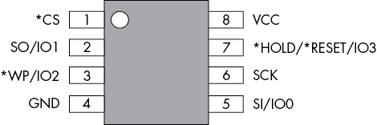
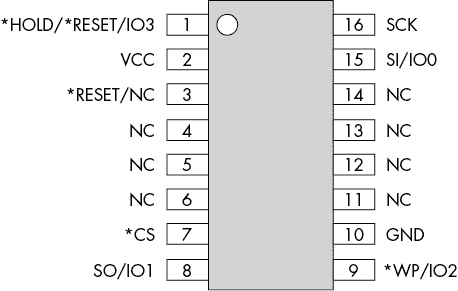
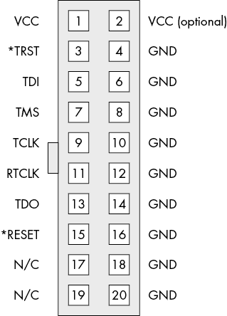
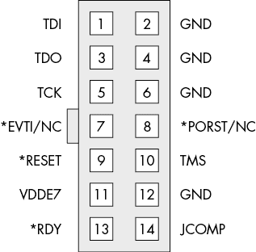
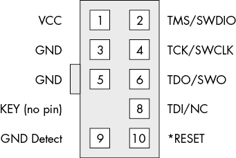
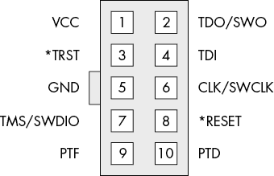

# 第十六章：B

你的所有基地都属于我们：常见的引脚排列

存在太多的头部和接口，无法在此全部涵盖，但当涉及到与嵌入式系统的接口时，我们通常会选择一些常见的引脚排列。我们已经将它们汇总在这里，供您参考。

## SPI 闪存引脚排列

SPI 闪存通常有 8 引脚和 16 引脚版本。图 B-1 显示了一个八引脚*SOIC*（300mil 宽度，600mil 宽度）和八引脚*WSON*。我们在第三章中详细介绍了这些封装的细节。请注意，图中的引脚名中的*表示*低电平*信号。

图 B-1：八引脚 SPI 闪存引脚排列

图 B-2 显示了一个 16 引脚的 SOIC（300mil 宽度，600mil 宽度）。

图 B-2：16 引脚 SPI 闪存引脚排列

尽管引脚排列偶尔有所不同，大多数设备使用这两种。

## 0.1 英寸头部

0.1 英寸的间距是您可能熟悉的“典型”间距。以下头部通常具有 0.1 英寸的间距。

### 20 引脚 Arm JTAG

Arm JTAG 使用一个大约 20 引脚的头部（见图 B-3）。这种头部在实际产品中很少见，但开发板通常使用它。您也通常会在 JTAG 调试适配器上找到这种引脚排列，如 SEGGER J-Link 和 OpenOCD 设备。

图 B-3：20 引脚 Arm JTAG 头部

### 14 引脚 PowerPC JTAG

PowerPC 设备，如汽车 ECU 中的 NXP SPCx 系列，通常使用 14 引脚 PowerPC JTAG 头部（见图 B-4）。

图 B-4：14 引脚 PowerPC JTAG 头部

这里的一些引脚并未被标准 JTAG 使用：*VDDE7*是目标参考电压，**RDY**表示 Nexus 调试接口的就绪状态，*JCOMP*用于启用 TAP 控制器。根据具体的芯片，有些引脚未被使用；例如，在 MPC55xx 和 MPC56xx 板上，第 8 引脚是无连接（NC）。

## 0.05 英寸头部

0.05 英寸的头部比标准的 0.1 英寸头部更精细，通常是表面贴装类型。

### Arm Cortex JTAG/SWD

许多嵌入式设备使用图 B-5 中所示的调试连接器。

图 B-5：Arm Cortex JTAG 头部

该连接器可以提供 JTAG 或串行线调试（SWD）模式。在这种封装形式中，SWD 更为常见。

### Ember 数据包跟踪端口连接器

Ember 数据包跟踪端口连接器，如图 B-6 所示，不常见，但您可能会在基于 Ember 设备（现在已成为 Silicon Lab 设备）的设备上找到它。

图 B-6：Ember 数据包跟踪端口连接器

例如，图 3-28 中的通信板具有使用这种引脚排列的调试头部。我们部分展示这个引脚排列，以显示设备之间的微小差异，即使它们并不试图欺骗您！
