## 1. 中国制造

在我第一次访问中国之前，我坚信东京的秋叶原是购买最新电子产品、小玩意和元件的首选地。直到 2007 年 1 月，我第一次目睹深圳的 SEG 电子市场，才彻底改变了这一看法。SEG 有八层楼，所有硬件爱好者可能需要的元件应有尽有，后来我才知道，这仅仅是华强电子区冰山一角。

当时作为 Chumby 的首席硬件工程师，我与当时的 CEO Steve Tomlin 一起来到中国，旨在搞清楚如何廉价且按时生产 Chumby（一款开源、Wi-Fi 启用的内容传输设备）。有了 SEG 那样的价格，我们无疑来对了地方，至少这个任务的第一部分得以成功。

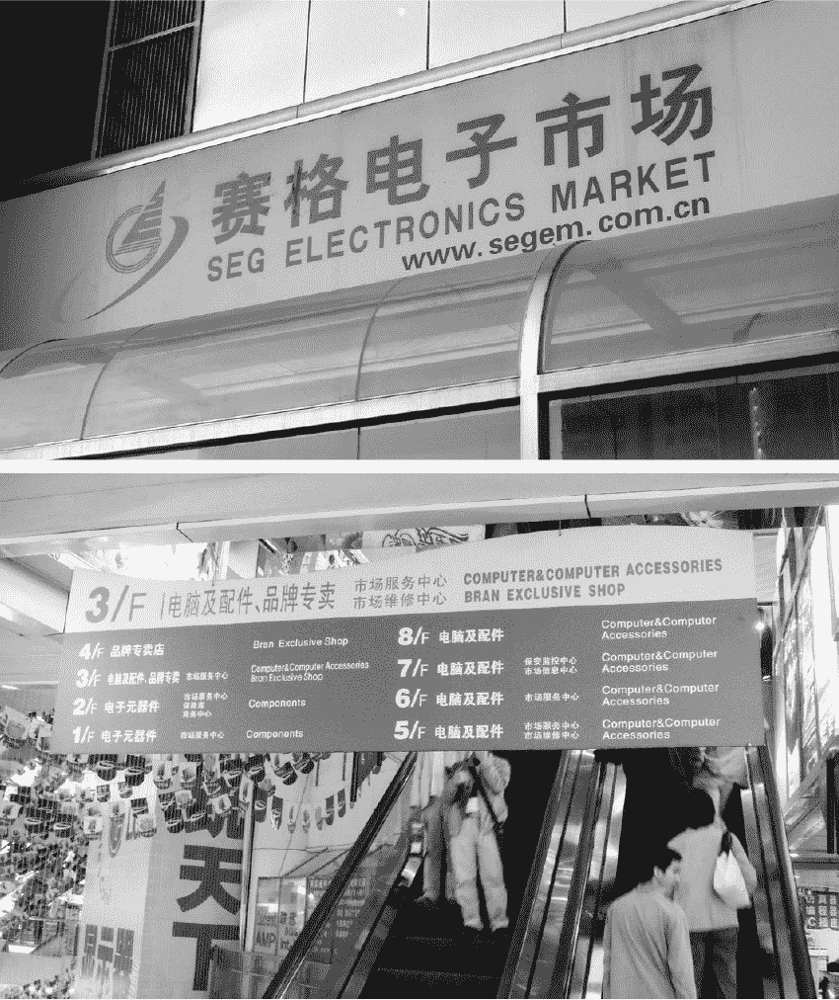

*深圳的 SEG 电子市场，新的电子圣地。秋叶原，你该吃心脏了！*

### **终极电子元件跳蚤市场**

当我第一次走进 SEG 大楼时，我被电子元件的旋风所包围：电阻器和电容器的胶带和卷轴、各种类型的集成电路、 inductors、电磁继电器、Pogo 针测试点、电压表以及内存芯片的托盘。作为一个完全不懂大规模制造的新手，SEG 给我带来的一切让我震惊不已。

所有这些元件都挤进了狭小的六乘三英尺摊位，每个摊位都有一个店主埋头在笔记本电脑前。有些店主在下围棋，有些则在数元件。某些摊位是真正的家庭作坊，母亲们照看着婴儿，孩子们在过道上玩耍。

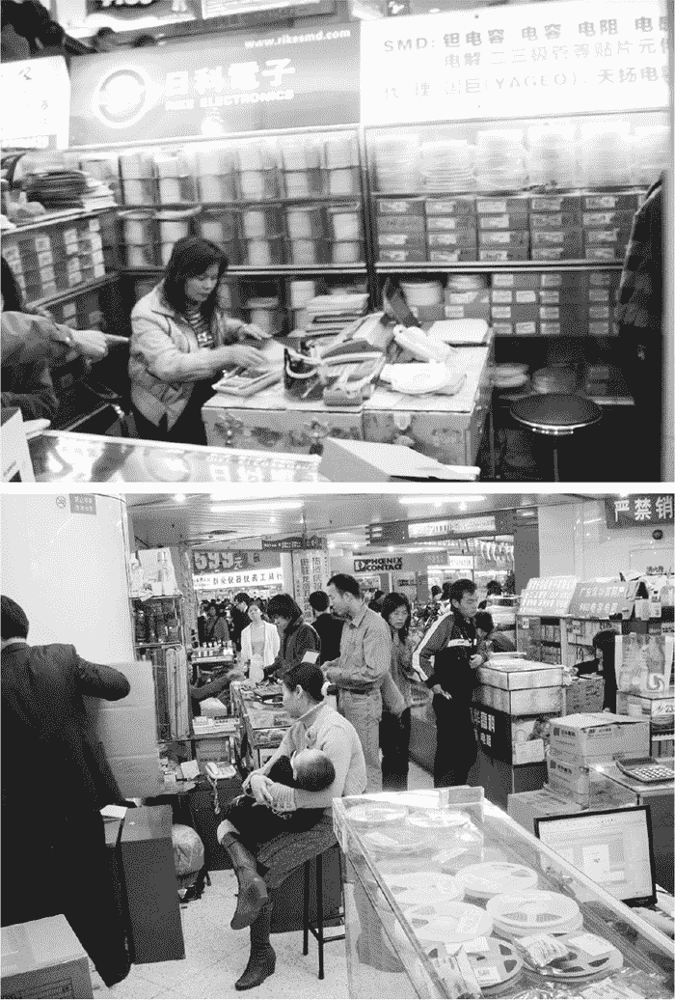

*几家家庭经营的元件店*

其他摊位则是专业的布置，配有穿制服的工作人员，这些摊位就像一个酒吧——配有凳子——专门销售电子元件。

*一位时尚的专业元件卖家*

在 SEG，没人像秋叶原那样说：“哦，你可以买 10 个这些 LED 或几个这些继电器。”不，这些摊位有专业化，如果你看到你喜欢的元件，通常可以购买好几管、好几托盘或卷轴的数量；你能买到足够的量，第二天就能投入生产。

环顾市场，我看到一位女士正在像玩扑克牌一样整理一堆 1GB 迷你 SD 卡。一位男士正在把 1GB 的金士顿内存条放进零售包装中，旁边的女孩则在数电阻器。

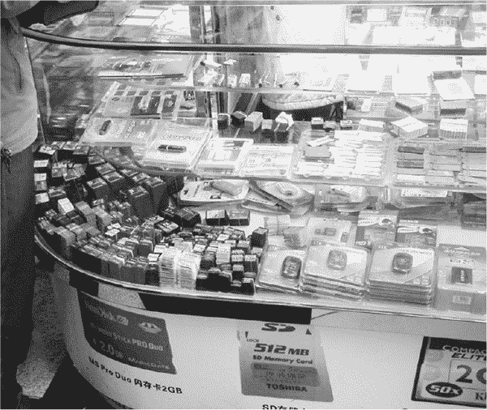

*这个展示的左下角堆满了各种 SD 卡。*

另一个摊位堆满了电源、压敏电阻、电池和 ROM 编程器，还有一个摊位上满是各种芯片：Atmel、Intel、Broadcom、Samsung、Yamaha、Sony、AMD、Fujitsu 等等。有些芯片显然是从旧设备中拆下来的，并被重新标记，有些则是全新的，带有激光标记的 OEM 包装。

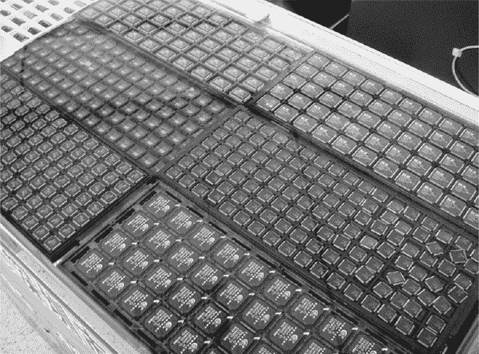

*在 SEG 的一个摊位上，出售的芯片数量真是令人难以置信。*

我看到了我在美国根本买不到的芯片，卷轴上的稀有陶瓷电容器，这些是我只能在夜晚做梦时才能想到的。我感官一阵阵发麻，头脑旋转。当我走到下一个拐角，看到堆得像山一样的商店，满地都是大约 1 亿个电阻和电容时，我忍不住期待地笑了。

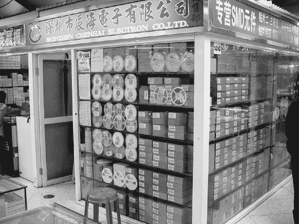

*每家店窗里都有成卷的元件*

索尼 CCD 和 CMOS 摄像头元件！如果我从销售代表那里拔掉牙齿，我在美国也买不到这些。（有些卖家甚至会把数据表放在柜台后面；一定要问问看。）接着，我发现了一堆 Micrel 调节器芯片，随后是一个用于销售的 Blackfin DSP 芯片。附近，一位女士正在数 256Mb DRAM 芯片——每盘 108 个组件，堆得有 20 层，可能有 10 排。

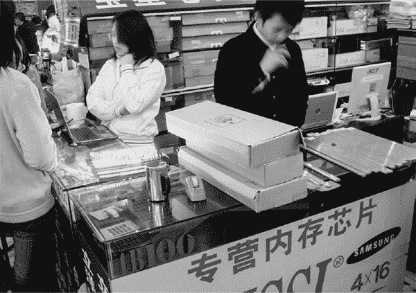

*相当于 Digi-Key 整个库存的 DRAM 芯片就摆在我面前！*

而在她对面，还有六七家小商店，里面也满是和她一样的芯片。在其中一家商店，一名男子骄傲地站在一盘 4Gb NAND 闪存芯片前。所有这一切都可以通过一点讨价还价、几块现金和匆忙的告别来获得。

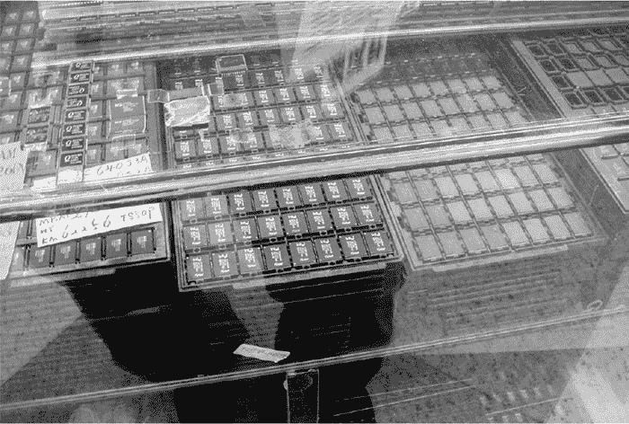

*一盘 4GB 闪存芯片的特写*

这仅仅是 SEG 的前两层楼。还有六层楼的电脑元件、系统、笔记本电脑、主板、数码相机、监控摄像头、U 盘、鼠标、摄像机、高端显卡、平板显示器、碎纸机、台灯、投影仪——你能想到的都有。周末时，穿着闪亮的 Acer 品牌紧身衣的“展位妹子”会在周围游荡，试图吸引你购买他们的商品。这个市场有着一年四季 CES 与 Computex 的能量，除了它不仅仅展示最新科技，重点是把你带入这些展位，购买硬件。交易会总是让人有种脱衣舞的感觉，你的呼吸在玻璃上留下鬼魂般的圈子，而你徘徊在那些无法获得的商品前。

但 SEG 可不是脱衣舞。它是消费类与工业电子元件购买的盛宴，在这里，你可以用足够的*块**从钱包里掏出每一件设备。这里的气味、喧嚣和忙碌，构成了 SEG 最终的电子元件跳蚤市场。就像 DigiKey 疯了，让猴子进了它的明尼苏达仓库， resulting chaos 流淌进了中国的跳蚤市场。

当然，我在 2007 年时惊叹不已的许多零件，现在已经成了古董。例如，4Gb 闪存芯片已经没用了，1GB 闪存盘也过时了。然而，当时这些东西可都是大新闻，而 SEG 依然是获取最新科技零部件的最佳地点。

### **下一个技术革命**

从 SEG 街区往下走三条街就是深圳书城。^(†) 第一个也是最显眼的书架是外文书籍专区，满是像斯坦福大学教授 Thomas Lee 的《CMOS 射频集成电路设计》这样的经典书籍，以及 UCLA 教授 Behzad Razavi 的几本书。我拿起了 Lee 的书，定价 68 元人民币，约合 8.50 美元。天啊！Jin Au Kong 的《麦克斯韦方程组》？5 美元。我曾在 MIT 时，*是 Jin Au Kong*教会了我麦克斯韦方程组。

我一口气买了六七本书，如果是在美国买的话，大概得花 700 美元左右。结账时，我不到 35 美元就买下了这些书，并且还附带了补充的 CD，节省了大约 665 美元。这相当于买了一张经济舱机票飞往香港！

在中国，知识便宜，零部件便宜。深圳书城里的书籍里的知识是真正的“实货”，而使用这些知识的零部件就在街上的 SEG，北边一小时车程内，可能就有 200 家工厂，可以将任何电子产品的想法变成现实并大量生产。这些都不是落后的工厂。我亲眼看到有名品牌的 1,550 纳米单模长途光纤收发器正在那儿组装和测试。深圳是一个沃土，你需要亲眼见识才能真正理解。

深圳有着类似上世纪 80 年代硅谷跳蚤市场的感觉，那时所有大公司刚刚成立并开始起步，只不过经过 25 年的摩尔定律进步和互联网信息流动速度的放大，这种感觉更加浓烈。在这个 1200 万人的城市里，大多数人都从事技术或制造工作，许多人正在学习英语，而他们所有人都愿意努力工作。

在某个地方肯定有像 Jobs 和 Wozniak 那样的人，悄悄地在构建下一个革命。但我也是深圳的一部分，想到自己能成为那场革命的一员，我依然会在恐惧与兴奋中颤抖。这是我的故事，从那次为 Chumby 前往深圳的启发之旅开始。

### **与 Chumby 一起参观工厂**

2006 年 9 月，Chumby 团队只有大约六个人，我们刚刚在由 Tim O'Reilly 主办的 FOO Camp 大会上分发了大约 200 个早期原型的 Chumby 设备。这些设备受到了 FOO Camp 与会者的热烈欢迎，因此我得到了批准，开始建设亚洲供应链。

我和 Steve 在 11 月去了中国，拜访了潜在的工厂。但在出发之前，我们请了一位美国的可信供应商给出了他们的最低报价，作为与中国制造商谈判的基准。然后，我们联系了许多在中国有经验的朋友，安排了大约六次工厂参观。我们去了各种类型的工厂，从小型的 500 人专业工厂到员工超过 4 万人的大型工厂。

没有什么能替代亲自去中国参观工厂的体验。照片只能讲述由摄影师所框定的故事，而你无法通过仅仅看照片就了解一个设施的规模和质量，只有亲眼看到，才能真正感受到。一般来说，工厂都会欢迎你参观，如果有一家工厂不允许参观，我是不会与之合作的。不过，大多数工厂会感谢你提前一周通知，尽管随着你和工厂的关系深入，事情应该会变得更加开放和透明。

说到开放性，Chumby 的开源性质在工厂选择过程中起了很大的帮助作用。首先，我们不怕别人窃取我们的设计（我们已经公开了），因此在分享关键资料如物料清单时，我们避免了签署保密协议（NDA）的繁琐过程。我认为这让我们在中国的工厂中受到了更好的接待；因为我们愿意向他们开放，所以他们也更愿意对我们开放。其次，任何一家工厂都没有疑虑，认为这是一个竞争性的项目。任何人都可以报价并参与投标（实际上，我们收到了几份非常有竞争力的未经请求的报价），这避免了一轮不必要的争执和拖延。

在评估了几家制造商之后，Steve 和我最终决定与一家名为 PCH China Solutions 的公司合作。PCH 本身只拥有少数几家工厂，但它拥有一个广泛的、可信赖的供应商网络，主要集中在中国，同时也涵盖了欧洲和美国。不出所料，PCH 外包的工厂是我们在中国参观过的最好的几家设施之一。实际上，PCH 总部位于爱尔兰——因此他们的大多数工程师都是爱尔兰人——所以我们之间也没有语言障碍。（PCH 的工程师们也非常勤奋、足智多谋且训练有素——另外一个惊喜是，他们似乎总能找到最好的酒吧，无论身处何地。我完全没想到中国有这么多的吉尼斯啤酒龙头！）

参观哪怕只是一个工厂，也有很多东西需要消化，更别提参观六个工厂了，容易让人感到不知所措并迷失在电子制造的种种复杂性中。但在我为 Chumby 参观工厂和与 PCH 合作将 Chumby 付诸实践的过程中，还是有一些关键细节让我感到最为着迷。

#### **深圳的规模**

在中国工作时，一个令人震惊的事实是这里的规模之大。我没去过密歇根的汽车工厂，也没去过西雅图的波音工厂，但我感觉深圳在规模上绝对能与它们一较高下。2007 年，深圳的人口为 900 万。

为了让你了解深圳工厂的规模，新百伦的工厂雇佣了 40,000 人，每月生产超过一百万双鞋。我估计，从原料到成品鞋的整个过程大约需要 50 分钟，每一双完美缝制的塑料和皮革鞋子都是手工用工业缝纫机缝制的。工位设计得很巧妙，每个工序大约需要 30 秒钟完成。

当然，新百伦的工厂与富士康不可同日而语，富士康是生产 iPod 和 iPhone 的地方。

*你知道你够大时，才会有自己从高速公路出口的通道。*

富士康是一个庞大的工厂，显然有超过 250,000 名员工，并且拥有特殊的自由贸易地位。整个工厂被围墙围住，我听说进入工厂需要出示护照并清关。这个场景几乎就像是尼尔·斯蒂芬森的《雪崩》中描述的，国家公司特许经营的核动力机器人犬。

#### **喂养工厂**

有一句中国古话：*民以食为天*。字面翻译是“民众视食物为神圣”或“对人而言，食物如同天”。你也可以将其视为一条治理建议：“政府的指令[等同于天]，只有在民众餐桌上的食物质量足够好时才能有效。”或者，你也可以将其解读为拖延的借口：“先吃饭吧[因为它如同天一样重要]。”

无论从哪个角度看，我认为这句话在中国依然适用。衡量一个工厂如何对待员工的一个重要指标就是食物的质量，因为工厂工人通常会在工厂内住宿、用餐并得到照顾。

一些工厂的食物实际上相当不错。例如，在与制造 Chumby 电路板的工厂工人一起用餐时，我被端上了一道蒸鱼、烤猪肉、春卷、清炒蔬菜和一些腌制蔬菜与肉类的混合菜肴。米饭、汤和苹果也是“自取”式的供应。

*来自制造 Chumby 电路板工厂的一顿饭*

每个我访问过的工厂都有为来访者准备的单独餐具和餐盘。在一家工厂，我的食物被端在一个泡沫塑料盘子里，并配有一次性筷子，而我与其一名工人一起吃饭时，他的食物则是放在钢盘子里，并配有钢筷子。我还没有通过工厂的身体检查，所以他们给了我一次性餐具，以防我带来外来疾病，污染工厂。

回到规模问题，有些工厂的餐饮运作规模令人印象深刻。我听说富士康的工人每天消耗 3000 头猪。从猪到 iPhone，这一切都发生在深圳！

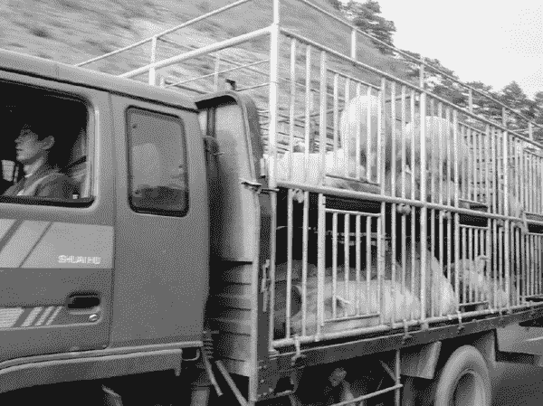

*一车猪，驶离高速公路前往富士康*

#### **对质量的奉献**

在我开始与 PCH 合作生产 Chumby 时，大约在 2007 年 6 月，我遇到了一种情况，这让我深刻感受到深圳工厂工人对工作投入的专注程度。

我已经更新了 Chumby 的主板，加入了一个电容式麦克风，并配备了一个集成的前置放大场效应晶体管（FET）。麦克风需要按正确的方向插入电路，以确保 FET 能接收到合适的偏置电流。

我从 PCH 工厂收到的第一批样品麦克风是装反的，我打电话给工厂让他们把极性倒过来。下周我会去工厂，我想看到修正后的样品。当我到达并测试麦克风时，令我沮丧的是，麦克风*依然*没有正常工作。

怎么可能呢？连接麦克风只有两种方式。

结果发现，生产线上有两位操作员在组装麦克风。一位将红色和黑色的电线焊接到麦克风上，另一位将这两根电线焊接到电路板上。操作员们被要求反过来操作，他们都认真地遵从了指示——结果我得到的麦克风依然是焊接反了，不过电线的颜色换了。（这其实是中国常见的问题故事。）

工厂计划第二天制造 450 块电路板的首批试生产板。为了确保 Chumby 的生产时间表不受影响，一切都必须完美无缺。我们重新制作了焊接模板（我们还在调试 QFN 封装音频 CODEC 的良率问题），并大约中午完成，下午 6 点左右，我拿到了第一批电路板进行测试。我进行最终的工厂测试，设备再次失败——问题出在麦克风上。这对工厂的任何人来说都不是愉快的时刻，因为工厂需要对任何制造缺陷负责。

我穿上工作服，走到生产线上开始调试问题。

接下来的整晚，我都待在工厂，参与 Chumby 制造的每个经理和技术人员也都在场。压力巨大：我们旁边的生产线正在生产 450 块可能有缺陷的电路板，而我不愿意停工，因为我还不知道根本原因，而且我们必须按时完成。

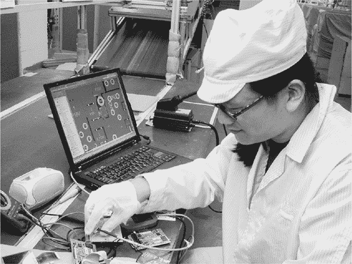

*我在最终工厂测试的当天凌晨 3 点调试电路*。

我几乎整夜都有一组工人随时待命，为我提供任何我需要的东西：电烙铁、测试设备、更多的板子、X 射线机器、显微镜。令人惊讶的是，没有一个人犹豫；没有一个人抱怨；没有一个人对问题失去专注。人们毫不犹豫地取消了与朋友的晚餐计划。任何在特定时刻不需要的人，都忙着监督项目的其他方面。自从我在 MIT 与自主水下机器人团队合作以来，我再也没有见过如此专注的奉献精神。

就这样一直持续到凌晨 3 点。

令人尴尬的是，最后问题并不是 PCH 的错。问题出在我当天从美国团队那里收到的新固件版本。这个固件有一个 BUG，导致麦克风无法使用，因为一个黑客不小心把这个问题提交到了构建树中。

更令人印象深刻的是，当 PCH 发现时，没有人感到生气，也没有人抱怨。（嗯，销售员给了我不少难题，但我活该；她足够友善，陪着我在生产线上整夜工作，并且做我的翻译，因为我的普通话不太好。）他们只是松了一口气，觉得这不是他们的错。

我们各自离开，第二天上午 11 点我在睡了个好觉之后回到了工厂。我见到了 Christy，负责制造 Chumby 主板的工厂项目经理。我问她几点上班，她告诉我她总是必须在早上 8 点之前到岗。我开始感到很愧疚；Christy 因为我们的 BUG 熬夜，而我却睡到中午才来。于是我问她为什么知道自己必须 8 点报到却还这么晚才回去。她完全可以回家休息，第二天继续工作。

她只是笑着说：“确保这个工作完成是我的职责，我想做得好。”

#### **不使用技术来构建技术**

这里有另一个有趣的故事。一天我们离开工厂车间时，小李（我们制造 Chumby 的工厂的质量管理经理）问我：“Chumby 是做什么的？”我的中文说得不好，她的英语也不太好，所以我决定先从几个基本问题开始。

我问她知道什么是万维网吗。她说不知道。

我问她知道什么是互联网吗。她说不知道。我震惊了，不知道该说什么。怎么向盲人描述蓝色？

小李是一个擅长构建和测试计算机的专家。在一些项目中，她可能已经重复了十万次构建 PC 和启动 Windows XP 的过程。（天知道在麦克风事件中，我听到了那个该死的启动音无数次，因为就在我旁边有一排最终测试站，负责华硕主板的测试。）但她不知道什么是互联网。

我曾以为，只要接触过电脑，就等于也拥有了互联网的丰富资源。突然间，我觉得自己像个被宠坏的傲慢人和一个忘记了小李可能连电脑都买不起，更别说宽带上网的人，真是有点自责。如果给她机会，她一定足够聪明能学会这些技术，但她实在太忙了，可能每天都得把赚来的钱寄回家给家人。

最终，我能做的最好的事情就是告诉小李，chumby 是一款用来玩游戏的设备。

#### **熟练工人**

深圳的工人可能对自己做的每一样东西了解不多，但除了他们的敬业精神，他们的技术也非常高超。我曾经看到一个在同一家工厂工作的人，那家工厂生产 chumby 包，我敢发誓，他能以每袋 5 秒的速度缝制化妆品包。而且他甚至没有百分之百专注于工作，他一边缝制，一边听着 iPod。

显然，他并不是他们最快的员工！他们还有一个员工的速度大约是他的两倍，而且那人已经在公司工作了大约七年。我去看那位更快的工人，但他已经去吃午饭了，因为他已经做完了所有工作；在他的工作台旁边放着两个巨大的装满化妆品包的箱子。

类似的事情让我感到惊讶的是，我了解到中国是如何制作橡胶标签（你在衣服上随处可见的那种）的。我一直以为它们是机器压制出来的，但我错了。所有的文字、颜色和字母都是手工绘制的。工作人员将一个徽标模板放在空白标签上，用惊人的精确度在模板上涂色，然后继续下一个标签。如果是多种颜色，每个颜色都有一个人负责，以确保过程迅速。

我问过 PCH 是否有类似的机械化工厂。他们告诉我，确实有这样的设施，但最小订单量非常大（成百上千万），因为产品成本极低，而自动化过程的工具成本相对较高。这与我听说的麦当劳儿童套餐玩具类似。通常这些玩具是用螺丝固定的，因为让人一个个螺丝地组装玩具，比制造一个钢制注塑模具（符合必要的容差来拼接玩具）要便宜得多。*

在 chumby 硬件内部也有类似的权衡。内部电子设备上有四个连接器。使用我能采购到的美国供应商，一个连接器的最低价约为 1 美元，另外三个则分别为 0.40 美元。而 PCH 那位非常有才华的采购专家（她在每个供应商中都声名显赫）设法为我找到了分别为 0.10 美元和 0.06 美元的连接器，节省了将近 2 美元的成本。唯一的缺点是，这些连接器没有牺牲用的塑料拾取和放置垫子，导致它们无法被机器组装。

解决办法？当然是一个人。

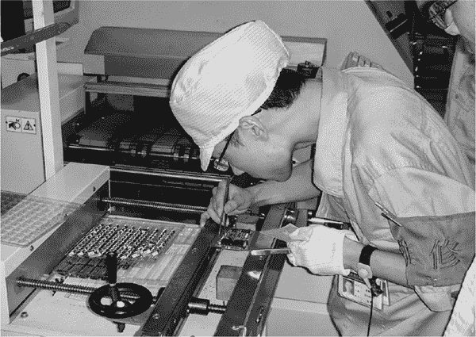

*这位先生手工将便宜的连接器装配到每一个 Chumby 上，每个单元大约节省了五分之一的成本。正是因为他，Chumby 便宜了 2 美元，这为我们消费者提供了更多的资金，可以去星巴克消费。*

#### **对工匠的需求**

我想向你们介绍一位我认识的男人，他就是兆师傅。我在 Chumby 的制造过程中遇见了他，我敢肯定，在你的一生中，你一定使用过或见过他创造的某些东西。

当我进入兆师傅所在工厂的样品室时，我震惊于他们货架上那么多我自己曾在美国购买、使用或在商店里看到的商品。顶级消费品牌的产品就是在这家工厂生产的，据我所知，当时工厂只有一位首席制图师：兆师傅。他曾参与为布劳恩（Braun）设计化妆包，为微软设计配件盒，以及为主要品牌设计药店销售的医疗支架等众多产品的制作。

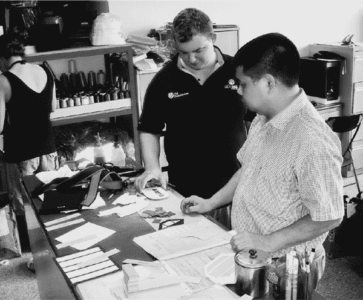

*兆师傅是前景中的那位；背景里是 Joe Perrott，Chumby 的优秀项目工程师，来自 PCH China Solutions。*

兆师傅是传统意义上的工匠。曾几何时，最精致的家具只能依靠工匠的直觉和技艺来设计和建造。如今，我们都去宜家，买到的是经过 CAD 设计、供应链管理、图解式组装的家具套件——尽管如此，这些家具看起来也不差。因此，“工艺”这个词被用来形容你在迈克尔斯（Michaels）购买的某些剪贴簿或十字绣套件，花上一个慢悠悠的周末拼凑起来的物品。我们已经忘记，在没有机器的时代，“工艺”是任何优质物品得以制作的唯一方式。

然而，事实证明，传统工艺仍然至关重要，因为 CAD 工具并未带来在我们犯错之前就能模拟出错误的能力。

纺织品的*平面图案*制作是一个很好的例子，展示了一个需要工匠参与的过程。平面图案是用于指导面料裁剪的二维形状集合。这些形状经过裁剪、折叠和缝合，最终形成复杂的三维形状。将任意三维形状投射到二维表面上，并确保各个部分之间的浪费面积最小，这本身就已经够难的了。更何况，材料会发生拉伸和变形，有时变形方向还不同，而缝合需要足够的公差才能确保产量良好，这使得图案制作成为一个难以自动化的问题。

Chumby 的外壳增加了另一层复杂性，因为它们涉及将一块皮革缝到一个软塑料框架上。在这种情况下，当你缝皮革时，框架会略微变形并拉伸皮革，从而产生依赖于缝制方向和速度的缝制偏差。这个力会在接缝处被捕捉，并影响最终外壳的形状。我挑战任何人制作出一种能够准确捕捉这些力并预测像这样的产品在缝合后会是什么样子的计算机模拟工具。

然而，不知为何，Master Chao 在打版艺术上的精湛技艺使他能够非常快速且通过很少的迭代，制作并调整一个补偿所有这些力的版型。他的成果，全部是用纸板、剪刀和铅笔完成的，聪明且富有洞察力，令人惊叹。要感谢他那种老派技能；它们很可能在你曾经使用过或从中受益的某些产品的生产过程中起到了作用。

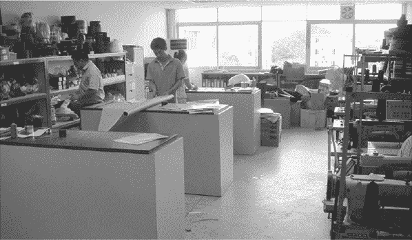

*在 Master Chao 的办公室里没有一台计算机，但我在这里看到的产品却涉及了各种各样的高科技设备。*

#### **电子组装的自动化**

在我加入 Chumby 之前，我几乎认为所有的东西都是由机器制造的。当然，参观纺织厂很快就纠正了我的这个印象；然而像电子组装这样的高科技产品，尽管在中国，仍然往往是高度自动化的。我在参观工厂时唯一看到的例外，讽刺的是，竟然是成本最低的产品，比如玩具。这些车间仍然由一条条工人组成，他们手工塞装和浸焊电路板。

与自动化相关的一个有趣的二分法是采用*芯片直接封装（CoB）*技术的产品的双峰分布。CoB 组装直接将硅芯片与 PCB 焊接在一起。完成的 CoB 组装有着典型的“环氧树脂块”外观，与完成的塑料封装外观不同。高端、密集的电子组装通常采用 CoB 技术。我曾经为一些 10Gb 的光模块设计过几款 CoB 产品，它们可不便宜。

然而，几乎所有玩具也都采用了 CoB 技术，以消除 IC 封装的成本！玩具厂商在成本控制上的坚持令人钦佩，他们甚至会购买自动化线焊机，并将它放置在生产娃娃头和缝制毛绒玩具的生产线上，因为拥有一台内部的线焊机能节省几美分。

一台典型的线焊机将一根细如人类头发的金属丝焊接到硅芯片上，焊接点的大小几乎与金属丝直径相当，而且每秒钟就可以完成好几次焊接。线焊机是非常快速且精确的设备。焊接过程如此迅速，以至于电路板看起来似乎在平滑地旋转，但实际上它在旋转过程中每转 16 次就停一次，每次停下来时，都会有一根金属丝连接芯片和电路板。

然而，在粘接之前，芯片是由人工非常小心地将其粘贴到电路板上的，而在粘接之后，芯片会由人工操作员非常小心地涂抹环氧树脂进行封装。这意味着，线材绑定机是简单玩具生产线中唯一自动化的设备。看到这个过程后，我对那些在 Target 以 10 美元价格出售的会说话的 Barney 娃娃背后的复杂工艺有了全新的认识。

chumby 的制造过程也使用了一些自动化，得益于芯片射手。芯片射手（以及拾放机）将表面贴装元件放置到 PCB 上，以便后续焊接。

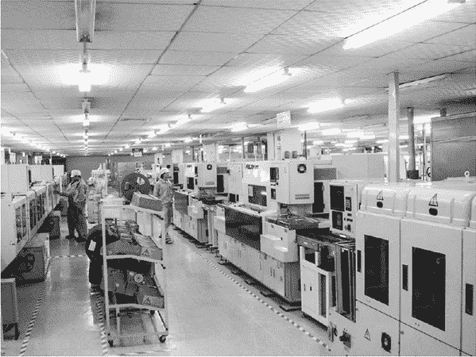

*chumby 的 PCB 组装工厂在中国有数十条线，配备了经过验证的富士芯片射手*

看到芯片射手工作时，真是让人目不暇接。chumby PCB 组装工厂的芯片射手每台机器每小时能放置 10,000 到 20,000 个元件。这意味着每台机器每秒能放下 3 到 6 个元件。机器人组装的速度快得连眼睛都跟不上，所有的动作转瞬即逝，形成一片令人叹为观止的模糊影像。我在 chumby 工厂看到的芯片射手工作原理像是加特林机枪：芯片枪本身是固定的，而电路板在枪下方舞动。芯片射手实际上会“观察”每个元件，并将其旋转到正确的方向后才放置到电路板上。

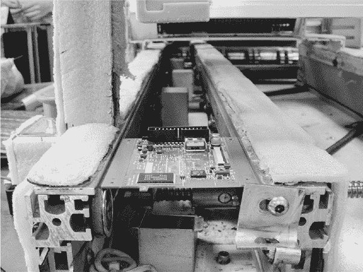

*这就是 chumby 核心板组装的终点！*

我们用于 chumby 的 PCB 组装工厂也生产品牌 PC 主板，似乎毫不费力地每天能推出超过 10,000 个这样复杂的组装件。尽管像元件放置这样的工艺可以实现自动化，但有些事情是机器无法做到的。

#### **精准、注塑成型和耐心**

在工程设计 chumby 的过程中，我还必须了解注塑成型，因为电路板必须装入某种外壳中。对于一个机械背景较少的电子工程师来说，这可不是一座小山要爬。这个概念看起来很简单：你用钢材做一个腔体，把熔化的塑料在高压下推入其中，等待其冷却，然后—完成的零件就出来了，就像小学时的橡皮泥模具一样。

哦，要是过程真的这么简单就好了。

当然，塑料是可以流动的，但它并不特别稀。它流动得很慢，并且在流动的过程中会冷却。塑料的颜色会受到温度变化的影响，如果使用不当设计的模具，你甚至可以在最终产品中看到流纹和接缝痕迹。还有一系列关于如何从模具中拉出成品、模具的制造和完成、如何在模具中设置进料口和通道等问题。

幸运的是，PCH 在中国有专家，熟悉这一切，我主要是通过观察来学习的。

如果让我用一个形容词来总结注塑成型，那就是*精确*。当做得对时，模具的精度能达到比头发丝还要薄的公差，然而它们是由坚硬的钢材制成的。从如此耐用的材料中达到这种精度可不容易，看到一台机器从原钢材中切割出模具真的令人印象深刻。

用于切割 Chumby 外壳模具的机器有一个可移动的工作台，迅速推动一块大约几百磅重的钢块；它快速地对金属进行铣削！

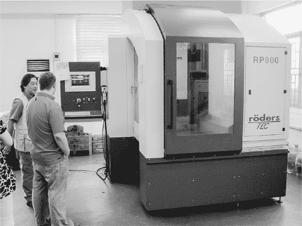

*用于制造 Chumby 的模具切割机。

将其与站在旁边的人进行比较，以便获取尺寸比例。*

但机械加工只是模具制造中的粗加工步骤。粗略的形状切割出来后，模具会被放入*电火花机（EDM）*中，通过电子流的爆发将微小的金属块从钢表面打掉。这是一个非常繁琐的过程：我曾多次观看 EDM 工作，简直就像看油漆干一样慢。然而，EDM 的精度极高，且能够产生卓越且可重复的结果。

从项目管理的角度来看，生产质量的注塑塑料所需的极长交货时间是我最大的震撼。总体而言，Chumby 模具从一块原钢块变成初步成型工具的时间大约是四到六周，而我不得不亲自去中国，看看工具车间的工作，才相信这并不是某种大量虚增的进度。

从风险管理的角度来看，更令人焦虑的是缺乏好的模拟工具来预测塑料如何流过模具。如果我们看到明显的瑕疵，比如流痕和接缝线，我们必须等待四到六周才能看到新的模具是否有所改进。哎呀！

幸运的是，Chumby 在中国的工具制造商预见到了这些问题，他们制作的工具多留了些钢材，因为去除多余的材料来修复问题比增加材料要容易得多。这就像老木匠常说的那样：“量两次，切一次，若切错了，切长点。”

用于制作 Chumby 背面边框的模具非常复杂，因为它涉及到一种叫做*过模*的工艺。如果你恰好拥有一台 Chumby 经典版，看看背面。那里有一圈橡胶质的 TPE 包围着硬质 ABS 边框。许多人以为这是一条粘上的橡胶带。实际上，这个 TPE 是通过模具直接在背部部件上成型的。这需要一个双模模具。

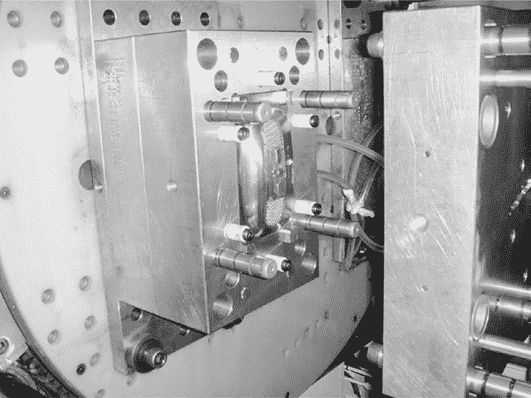

*Chumby 背面边框的最终模具，位于注塑机内*

实际上有两个模具，其中一侧的模具会旋转，以便在合适的时刻将交替的材料系统进行成型。

每天看到的这些不起眼的塑料零件背后，其实凝聚了大量辛勤的工作，这也是创造高质量产品的一部分。但与此同时，也有一个非常现实的需求，那就是满足廉价价格的期望。

#### **质量挑战**

显然，随着中国制造商品的低成本预期，质量管理面临着巨大挑战。看看媒体关于中国制造的玩具铅漆、食品中的工业化学品等问题的报道，你就能看到为了降低价格所做的一些错误决策。

在考虑类似的案例时，我认为有必要应用汉隆剃刀原则。换句话说，“永远不要将可以用无知充分解释的事情归咎于恶意。”英国人也有一个简洁的版本的格言：“先是失误，再是阴谋。”

的确，某些制造商确实为了赚钱不惜一切代价，但我认为大多数错误是由于无知造成的。大多数工厂的普通员工并不知道他们的产品最终是用来做什么的，在巨大的成本压力下，他们做出了那些错误的决定。工厂还不得不应对规格严重不足的产品，以及那些用各种无关紧要的要求压倒他们的客户——而且大多数客户在这两种情况下都不会跟进。最终，工厂只能玩“发货后再看看”的游戏，如果客户没有注意到缺失的规格，那么这个规格就一定不重要。这并不是一个好游戏，也意味着客户需要时刻保持警惕，进行审计并保持质量标准。

##### 美国与中国之间的脱节

这个游戏背后有一个根本问题，那就是许多中国居民并不理解或欣赏我们在美国认为理所当然的基本事物，反之亦然。许多中国工厂工人受过良好教育，但他们并没有在像我们美国那样的“电子产品文化”中长大，所以你不能假设他们能够主观地理解产品规格。

例如，你可以告诉一位美国工程师：“我想在这个面板上加一个按钮”，你可能会得到一个在外观和手感上都相当接近你预期的东西，因为你和工程师对面板上的按钮有着共同的经验和期望。如果你在中国这么说，你可能会得到一个看起来有点笨拙，手感也很笨重的东西，但它便宜得要命，而且很容易制造和测试。虽然后者的特性在实际操作中有其可取之处，但美国的电子产品爱好者根本不会购买那些外观笨拙或者手感笨重的东西。

然而，最终，正是那些消费者希望——甚至是要求——低价商品，而这种需求推动了在中国制造的决策。问题在于，除了产品上的标签写着“中国制造”或“美国制造”之外，消费者其实并不关心制造过程。你愿意为一个标有“美国制造”的小工具支付多少附加费？美国劳动力的成本比中国高出 10 倍。想一想：美国的普通工厂工人的生产力能比中国的普通工厂工人高出 10 倍吗？这是一个很难对抗的倍数。

我并不是说国内供应商没有价值：如果我在美国制造产品，付出的努力和风险都会小得多。事实上，大多数早期原型都在美国制造，因为国内供应商能够提供巨大的价值。然而，价格却无法适应大规模市场产品。没有人会买它，因为它的价格无法匹配其功能。有人甚至可能指责我懒惰，如果我只是选择一个国内供应商并将更高的成本转嫁给消费者的话。

##### 参与制造过程

最终，在中国制造是保持成本低廉的最佳方式，为了维持质量，唯一的办法就是亲自到中国并直接参与。几乎每个工厂在你来访的当天都会“清理”一番，但凭着敏锐的眼光和正确的问题，你可以看穿任何快速修饰过的外表。

当我为 Chumby 评估工厂时，我总是会去质量控制（QC）室。我期待看到整齐摆放、使用过的设计文档和质量控制标准文件夹，以及*金样品*，即产品的生产前样品。我会要求查看某个随机文件夹的内容和相关的金样品，并确认员工是否了解文件夹中的内容。（有些工厂确实会随便填充产品文件夹，放一些随机的数据。）我还认为在设备上的大额投资是一个好迹象：我访问过的最好的制造商都拥有几间配备了先进热、机械和电气极限测试设备的房间，当然，房间里会有操作员正在实际使用这些设备。（我完全可以想象某些中国制造商仅仅为了展示而购买一间设备齐全的房间。）

但我怀疑玩具制造商和食品制造商不会像我这样定期派技术人员到中国的工厂监督生产。与此对比的是苹果公司，它定期派遣一批工程师前往工厂（通常是富士康，苹果内部有人亲切地称之为“魔多”）进行为期两周（或更长时间）的高强度工作。因此，我在深圳的外籍酒吧里常常碰到许多苹果的工程师。

PCH 中国解决方案在中国提供西式管理和质量控制对我们 Chumby 来说非常重要。如果我们遇到供应商问题，PCH 会立刻派人到工厂了解情况——没有电话往返，没有快递拖延。而且在中国，当你亲自上门时，工厂老板通常会非常响应。

因此，Chumby 解决质量难题的方法是全方位的。我们从一开始就让一名工程师（我）驻厂，调查现场情况。了解工厂能做什么，不能做什么是非常重要的。我查看了生产线上的构建情况以及使用的技术方法。然后，在产品设计阶段，我尽量使用那些工厂最熟悉的流程和技术。当我需要做一些新事情时（任何好的创新产品都需要做一些新的事情），我会挑选最重要的部分集中精力攻克，因为任何新事物都会是一个几周的挑战，直到做得正确。这种策略甚至适用于最小的细节：如果工厂习惯用塑料收缩膜包装产品，而你想用纸包装你的产品，那么你需要计划重点开发纸包装的过程，因为很可能你的目标工厂的生产线工人从未见过纸包装的产品。

当然，在为 Chumby 开发新工艺时，我更倾向于亲自到工厂去，我至今依然如此。没有什么能比站在生产线上，亲自向将要组装你设备的工人们展示如何制作它更有效了。例如，我亲自培训了 Chumby 的生产线工人，教他们如何将铜胶带附着到 LCD 组件上，形成适当的 EMI 屏蔽。

很难描述如何将胶带折叠在复杂的金属板上，以确保它与接地表面良好接触，同时避免与其他组件发生短路。像胶带一面粘合剂是较差的绝缘体这样的细节，也需要一定的物理学基础，而这正是生产线工人通常没有的知识。更糟糕的是，解释这些概念需要一些技术术语，可能你的翻译员根本不理解这些词汇。

就我而言，即使有一个很好的 3D 图纸或完成品的照片，也无法完全传达整个概念，因为胶带的刚性要求特定的动作才能正确折叠而不撕裂。远程描述这个过程，通过照片批准样品，最终通过 FedEx 批准一个单元，可能需要几周时间，但站在一群工人面前亲自演示过程，只需几分钟。尽管存在语言障碍，我仍然能从他们的面部表情和肢体语言中看出他们是否理解某个步骤的重要性。根据这些线索，我会立刻回顾那些含糊不清或难以掌握的过程。

通常，当你能够以这种细致入微的方式展示一个过程时，工人们会在几个小时内就能完成，而不是几个星期。这也是我在 Chumby 的制造过程中花费那么多时间在中国的原因之一。

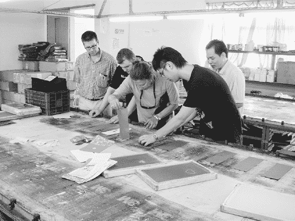

*每个人都参与了 Chumby 的质量过程。这张照片展示了 CEO Steve Tomlin（左侧）和艺术总监 Susan Kare（中间）在缝纺工厂，讨论 logo 丝网印刷的细节。*

##### 自家开发的远程测试

然而，Chumby 并不总是能派人去中国。我个人不太愿意住在中国，所以在 Chumby，我们非常依赖 PCH 来监控质量并确保一切顺利进行，他们做得非常出色。

通常，远程工作意味着如果我不在现场调整和批准，新流程往往需要几周才能逐步推行，因为每一个调整都涉及几乎是通过 FedEx 来回运送某些物品。经过几次这样的过程后，我学会了每次调整都预留两周的时间，而不是我在工厂现场时只需要几个小时。

那两周的时间很快就累积起来了。

由于从美国远程监督中国的操作困难，远程电子监控产品的测试结果变得至关重要。对于 Chumby，我开发了一套测试仪器，它们负责编程、个性化、启动、验证和测量每一台生产线上的设备。所有来自测试过程的数据都会记录在日志中，到了当天结束时，日志会传输到美国的服务器。

这些数据让我能够在车间调试大量问题。我可以判断某个测试员是否在使用条形码扫描仪时遇到问题。我还可以立刻知道当天是否有产量问题，或者生产效率是否低于预期。有这样的自家开发的审计能力非常强大，因为工厂知道我在监控他们。事实上，拥有这样的能力可以使与工厂的关系更加顺畅：工厂承担产量问题的成本（至少最初是这样），因此当设计工程师能够在问题扩大之前提供及时的建议和帮助时，他们会非常感激。

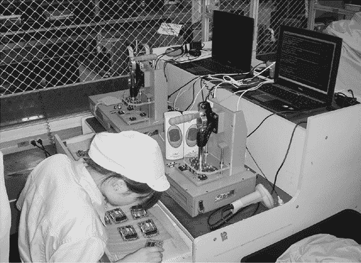

*中国工厂中的一对 Chumby 测试站。我们经历了很多困难才把这些笔记本电脑带入中国，背后有一段不小的故事。*

##### 进一步的工厂测试

一旦你完成了测试过程的设置，它就可以在工厂中自主运行。例如，在 Chumby 的 PCB 工厂，第一次最终检查是手动完成的——一个人检查每一块电路板，然后在一个纸板模板的帮助下，另一位操作员确保没有缺少任何组件。然后这些单元进入了自动化测试。

定期地，PCH 和工厂也会对 chumby 单元进行有害物质限制（RoHS）测试，以确保没有与指定的一系列潜在有害化学物质（包括铅）污染。RoHS 是欧洲要求的有害化学物质安全标准，但具有讽刺意味的是，美国并没有这一要求。工厂通常会对所有产品进行此项测试，即使这些产品仅销往美国，因为生产线上的潜在污染可能会导致其他产品无法运往欧洲。

即使在所有这些测试之后，在美国，Chumby 仍然会定期抽样检查单位以进行质量控制。为此，我们定期订购、表征和剖析设备，以确保所有操作程序都得到了遵循。

##### 错误仍然会发生

尽管有这些保护措施，任何产品在生产过程中仍然会出现一些错误。每个产品都经历过一个阶段，内部 QA 没有发现的 Bug 会被暴露出来并解决。你必须依赖顶尖的客户服务和支持团队，并且必须在这一阶段保持非常灵活和创新，以解决问题并防止它们再次发生。

当我在 Chumby 工作时，如果我听说某个单位在市场上出现了硬件问题，我会直接联系报告问题的客户。我希望了解问题出在哪里，以便修复并确保以后永远不会再次发生，任何人都不会再遇到！

然而，我对 chumby 的最大期望是避免类似于微软 Xbox 360 的“红环死机”事件，当时控制台发生了重大硬件故障，停止工作，并仅在电源按钮周围显示红色指示灯，导致玩家们的巨大沮丧。这个问题直到 Xbox 360 发售多年后，数百万台设备已经出货时才暴露出来。像“红环死机”这样的情况是产品工程师的噩梦。

所以你看，把 chumby（或任何产品）送到消费者手中只是开始。真正的挑战是在之后开始的。

如果你在制造过程中遇到这一点，我祝你好运！

### **结束思考**

这里讲述的故事分享了我一些冒险——和失败——学习如何大规模生产产品的经历。接下来的两章内容更加反思性，故事性较少。下一章将带领我们进行三家工厂的虚拟参观，看看我们能从中学到什么，第三章则试图总结我迄今为止在制造过程中学到的所有经验。
