## 2. 在三个截然不同的工厂内部

很难理解一台计算机是如何工作的，除非你把它打开，看看里面的构造。同样，除非你进入工厂并参观生产线，否则很难理解产品是如何制造的。尽管我们常常认为制造是创新之后必要却枯燥的步骤，实际上，两者是紧密相连的。发明者只思考一次产品；而工厂每天都在思考同一个产品，有时长达数年之久。

在当今互联全球经济中，工厂作为创新节点的重要性日益增加。现实是，没有所谓的“苹果工厂”或“耐克工厂”。更确切地说，是一系列精通某些工艺（如 PCB 制造或拉链生产）的设施，这些设施由知名品牌策划。因此，在同一工厂里看到两个竞争对手的产品并排运行在类似的生产线上并不罕见。这种专业知识的集中意味着，学习如何提升你产品某一方面的最佳地方，往往是生产其他公司产品类似方面的同一个地方。

我对改进产品的一些最深刻的洞察来自于观察技术人员在生产线上的工作，并看到他们在重复做同样的事情多年后所开发出的巧妙优化技巧。

本章将带你参观三个生产日常用品的工厂：PCB（特别是用于阿尔杜伊诺的那些），USB 闪存盘和拉链。通过揭开这些产品背后的设计权衡，你将获得一些有助于改进产品的见解。在 PCB 工厂，我发现了他们如何在每块阿尔杜伊诺的背面打印意大利高分辨率地图的秘密；在 USB 闪存盘工厂，我目睹了高科技与低科技制造技术的奇妙结合；而在拉链工厂，我了解了即使是最不起眼的产品也能为产品设计师提供宝贵的经验教训。

### 阿尔杜伊诺的诞生地

那是 2012 年 7 月，我的前一个创业公司 Chumby 停止运营已经大约六个月了。我决定休息一年，整理思路，并实现一些愿望清单上的项目，其中之一就是去意大利旅行。我的女朋友有个聪明的主意，建议联系阿尔杜伊诺团队，看看是否可以把访问他们位于斯卡尔马尼奥的工厂（那时阿尔杜伊诺/Genuino 还没有分裂）作为我们行程的一部分。Officine Arduino 的成员（特别是执行董事 Davide Gomba）非常友好地抽出时间带我参观他们的工厂。他们耐心地等着我表达我对硬件的热爱和内心的摄影爱好，结果我确实拍了许多精彩的照片。

Scarmagno 是意大利北部的一个小镇，距离米兰大约一个半小时车程，靠近都灵郊区的奥利维 etti 工厂。这个小镇负责所有官方品牌 Arduino 的电路板制造、板材填充和分销。我非常兴奋能参观这些工厂，而我参观的亮点是看到 System Elettronica，这家 PCB 工厂制造了 Arduino 的 PCB 板。

System Elettronica 的一个迷人之处在于，工厂的主人将工厂涂成绿色、白色和红色，以匹配意大利国旗的颜色。在工厂车间，我看到了这种精神的体现，那些沿着厂房长度排列的红色和绿色柱子。

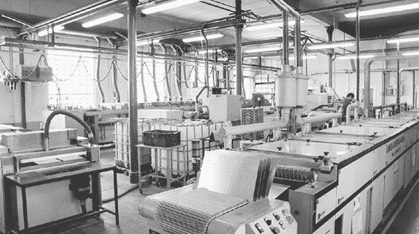

*2012 年 8 月，在 System Elettronica 工厂车间的广角视图*

但我很快就不再关注装饰了，因为那块工厂车间也是我跟踪 Arduino Leonardo 新批次整个生产过程的地方。以下是这些板是如何制作的。

#### 从一片铜开始

Arduino Leonardo 板从巨大的原铜覆层 FR-4 板开始，FR-4 是一种由玻璃纤维和环氧树脂制成的材料，几乎所有的 PCB 都使用它作为基板，作为铜层之间的绝缘和结构层。这些板的厚度为 1.6mm（PCB 最常见的厚度，等同于 1/16 英寸），宽度大约为 1 米，长度大约为 1.5 米。

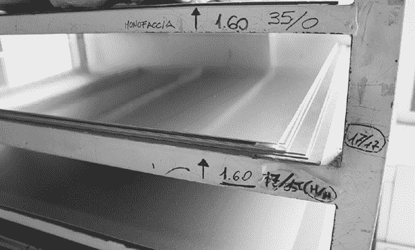

*一堆等待加工成 Arduino 板的铜片*

处理 PCB 的第一步是钻孔——包括焊盘、通孔（连接 PCB 不同层的小孔）、安装孔、电镀槽等等。当制造 PCB 时，钻孔在*图案化*之前进行，图案化是通过掩膜化学物质在铜板上光学定义的阶段，这些化学物质确定了最终板上需要有铜的位置，包括走线、焊盘等。一些钻孔用于对齐掩膜，这些掩膜稍后会在工艺中对走线进行图案化。钻孔还是一个脏乱的过程，如果走线已经放置，可能会损坏电路图案。

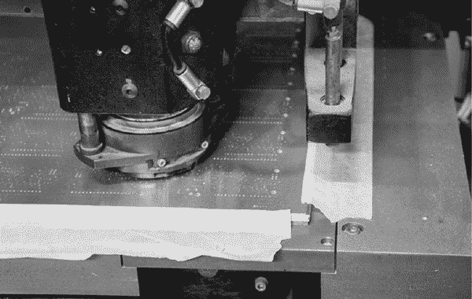

*用于钻孔 Arduino 板的 CNC 钻头*

空白的铜板堆叠成三层，一台 CNC 钻床一次性处理所有三层，让它能够同时钻孔三块基板。

*CNC 钻床使用的钻孔架。如果你曾经需要创建 NC 钻孔文件，这就是所谓的“钻孔架”*

Arduino 板上的每一个孔都是机械钻孔，包括通孔。任何带有通孔的 PCB 都是如此，这也是通孔数量成为计算 PCB 成本时一个重要参数的原因。

请注意，我在 System Elettronica 看到的这台特定钻孔机相对较小。我曾在中国见过巨大的钻孔机，它们将四到六个钻头机械连接在一起，组成一个卡车大小的机器，同时处理几十个面板，而这台钻孔机只能处理三个面板。这种做法的原因是，精确的机器人定位系统是钻孔机中最昂贵的部分，而钻头本身很便宜——只是一个旋转的电动机来驱动钻头。因此，一种提高生产效率的方法是将多个钻头组装在一个大型系统中，同时操作。每个钻头仍然会处理自己的一堆面板，但通过使用一个 X-Y 定位器，你可以达到我在意大利旅行中看到的钻孔机的四到六倍产能。那些更大的机器钻孔速度快且力量大，甚至在几米外都能感觉到每个孔的振动。

一旦面板被打孔、清洗并去毛刺，它们就准备好进入制造过程的下一个步骤。

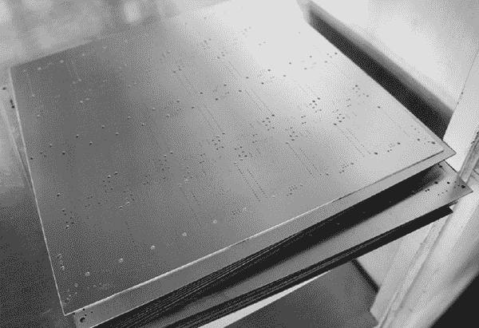

*一堆已完成并打孔的 Arduino Leonardo 电路板面板*

#### 将 PCB 图案应用到铜层

下一步是将*光刻胶*这种光敏化学物质涂覆到面板上，并曝光一个图案。在 System Elettronica，这个过程使用了光箱和高对比度的胶片。我也见过使用直接激光成像——通过栅格扫描激光——将图案应用到 PCB 上。直接激光扫描仪在快速原型制作公司中更为常见，而胶片成像在大规模生产公司中更为常见。

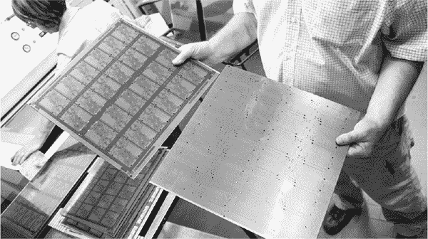

*前后对比：右侧面板显示了曝光前的光刻胶，左侧面板显示了曝光后的光刻胶。*

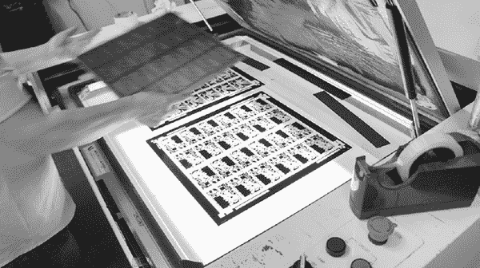

*正在将 PCB 安装到光箱中，光箱将曝光其未处理的背面薄膜*

在图案应用后，每块电路板都会送入机器进行显影。在这种情况下，同一台机器用于显影光刻胶和焊接掩膜。

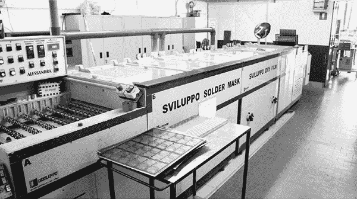

*开发光刻胶的机器*

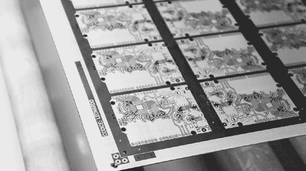

*这张在 System Elettronica 工厂拍摄的已开发光刻胶面板的照片是我最喜欢的照片之一。另外，“Codice: Leonardo”这个名字听起来也很酷。*

#### 蚀刻 PCB

在光刻处理和显影后，面板会通过一系列化学浴，进行蚀刻并镀铜。

电路板在化学浴中轻轻前后摆动，以加速蚀刻过程。该动作还可将已使用的蚀刻液从电路板上循环移走，确保无论要去除的铜量多少，蚀刻速率都保持均匀。在 Scarmagno，电路板的化学浴处理完全实现了自动化。自动化是必要的，因为电路板必须经过一系列强腐蚀性的化学浴，且暴露于氧气的时间要尽可能短。氧气能够在几秒钟内破坏电路板，因此浴液之间的转移需要迅速，电路板在每个浴液中的停留时间必须一致。由于这些化学液体对人类有害，因此由机器人执行此工作要更为安全。

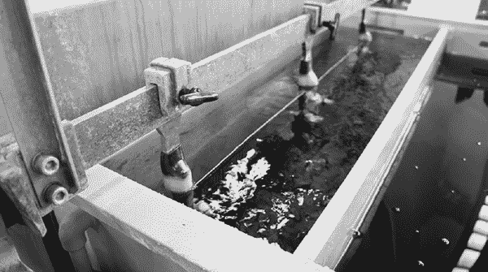

*在蚀刻液中移动电路板的机器*

一旦电路板经过这一系列溶液处理，所有未涂覆光刻胶的电路板表面，包括之前未镀铜的通孔和焊盘，都会形成一层暗白色的镀层（我猜测是镍或锡）。

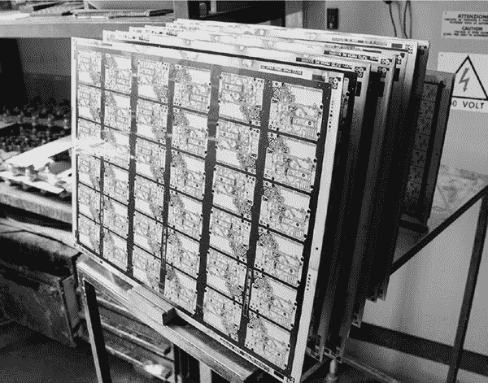

*经过一系列化学浴处理后的 Arduino Leonardo 电路板*

此时，阻焊层和未镀铜的区域会被去除，剩下的只是原始的 FR-4 基板和镀铜部分。最终的处理步骤是产生明亮的铜表面。

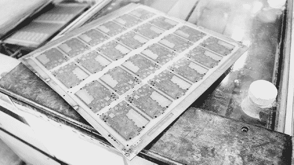

*已经蚀刻去除不需要的铜的电路板*

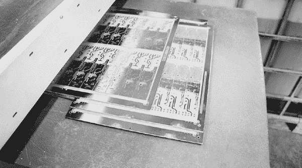

*具有亮丽光泽铜表面的 PCB 电路板。这张照片不是 Arduino 电路板，因为拍摄时这些电路板没有通过这台机器。*

#### 应用阻焊层和丝网印刷层

一旦铜表面被抛光，电路板就可以准备好涂覆*阻焊层*（一种类似清漆的保护层，能隔离下面的铜线路并防止焊料桥接）和*丝网印刷层*（用于标记组件、绘制标志等的油墨）。这些涂层的施加过程与线路图案的制作类似，都是使用光掩膜和显影/剥离机完成的。

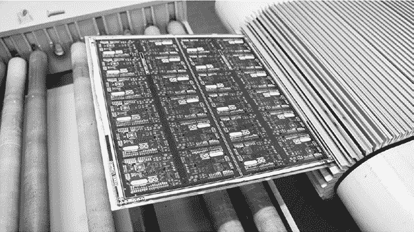

*已经涂覆了阻焊层和丝网印刷层的 Arduino 电路板*

对于 Arduino 电路板来说，丝网印刷层实际上是第二层阻焊层。Arduino 团队为此采购了一种特定配方的干膜白色阻焊层，以创建一个清晰、美观的层次，解决了 Arduino 电路板上的复杂图案——尤其是背面意大利地图的图形。其他我见过的生产丝网印刷层的技术包括高分辨率喷墨打印，这种方法更适合快速生产的电路板制造商，当然，还有传统的刮刀和油漆丝网印刷工艺。

#### 测试和完成电路板

经过所有化学处理后，电路板会通过热风焊接平整机涂上一层保护性的焊料。

在焊料镀层完成后，每块电路板都要经过 100% 测试。每条走线的连通性和电阻都会使用一对飞针进行测量。我看到的过程叫做 *飞头测试*（也叫 *飞针测试*），在这种测试设置中，几对带有针状探头的机械臂快速敲击测试电路板上两条走线之间的连通性。考虑到 Arduino Leonardo 上的所有走线，这需要大量的探测！幸运的是，机器人的机械臂动作迅速，每分钟可以测试数百个点。

**注意**

*飞针测试的替代方法是双夹测试，其中一组 pogo 针被放入一个夹具中，可以通过一次机械操作测试整个电路板。然而，双夹夹具的组装和维护非常费力，并且每次更新描述 PCB 图像的 Gerber 文件时，都需要物理重新接线。所以在低产量情况下，飞针测试比双夹测试更具成本效益和灵活性。*

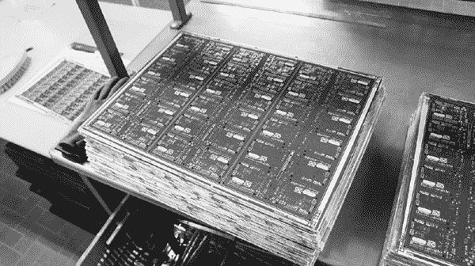

*一堆接近完成的 PCB 面板，准备进行最后一步，切割出单独的电路板*

这个特定的工厂只负责制造面板；另一个工厂则负责元件的安装。在这种情况下，在面板送往下一个工厂之前，必须先切割出单独的 PCB，以便它们能够适配 *表面贴装技术 (SMT)* 机器进行元件放置。面板再次堆叠起来，并通过一台使用铣刀的机器批量处理，切割并释放电路板。之后，电路板就可以准备好运送到 SMT 工厂。

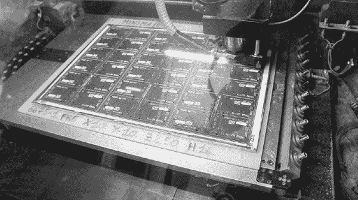

*几块 Arduino 面板，堆叠起来等待切割*

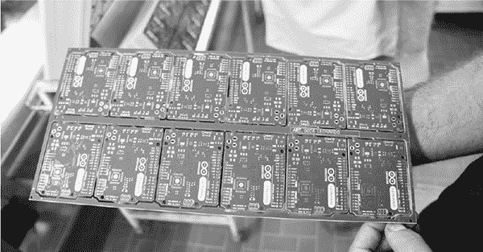

*较小的 2×6 面板使得 SMT 处理更加高效。*

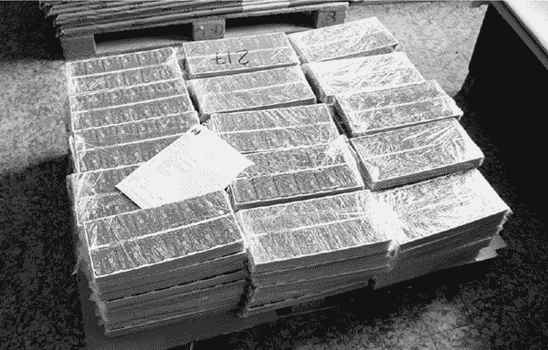

*大约 25,000 块裸 Arduino PCB 堆叠在一起，准备离开 PCB 工厂。从那里，它们被组装、运输并销售给全球的制造者！*

我很高兴能顺便参观 Arduino PCB 工厂。我参观过几家 PCB 工厂，每家都有不同的特点和提高良率的独特技巧，也有一些设计师需要弥补的独特限制。看到那个小技巧——使用额外的一层焊料掩膜代替丝印来实现高的外观质量，实在很有意思。丝印的分辨率受限于丝网的网格，无法容纳更多的油漆，而焊料掩膜的限制则来自于光学质量和化学显影，提供了大约一个数量级的分辨率提升，最终带来了更高的视觉质量。通常情况下，丝印的较低质量是可以接受的，因为最终用户看不到电脑内部的电路板，但对于 Arduino 来说，最终产品 *就是* 电路板。

### USB 闪存盘的诞生地

在参观 Arduino 工厂几个月后，我有幸在 2013 年 Linux 大会（LCA）上做主旨演讲。在我的演讲《肉体中的 Linux：嵌入 Linux 硬件的冒险》中，我讨论了 Linux 如何出现在我们每天看到的各种设备中。这个故事并不是关于 Linux 的，但它确实将我和 LCA 与一个工厂联系了起来。

我从 LCA 组织者那里收到的小纪念品之一是一个小 USB 闪存盘，上面印有 Linux 吉祥物 Tux 企鹅的图案。当我看到这个设备时，我觉得这真是个巧合——大约在会议前一周，我曾参观过一个制造与此完全相同的 USB 闪存盘的工厂。我看到了 USB 闪存盘板装配的整个过程，令人惊讶的是，这个过程比 Arduino 的制造过程要少得多的自动化。

#### USB 闪存盘的起始

USB 闪存盘的起始形态是裸闪存芯片。在安装到电路板之前，这些芯片会被筛选出内存容量和功能。

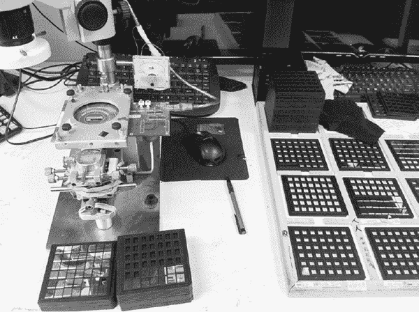

*一个筛选闪存芯片的工作站。*

左侧的金属矩形带有圆形切口的是探针卡。*

在这个工厂的一个工作站上，一堆堆裸闪存芯片等待着测试和分选，使用的是*探针卡*，探针卡上有非常精确定位的小针脚，用于接触硅片表面仅比人类头发宽一点的焊盘。（我喜欢这站的工人用橡皮筋把模拟电流计固定在探针卡上的方法。）

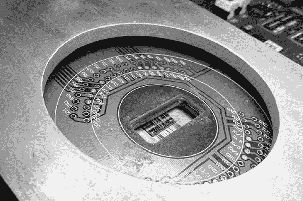

*探针卡，近距离观察*

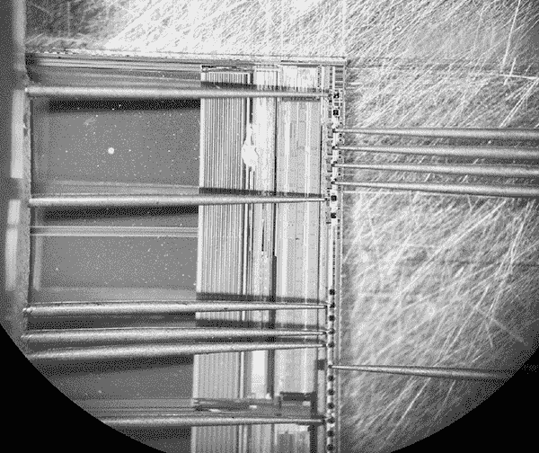

*在微探测站通过显微镜观察。注意到针头接触到闪存芯片表面边缘的方形焊盘。每个焊盘的边长大约为 100 微米——一个人类头发的直径约为 70 微米。*

有趣的是，我看到的芯片根本没有在洁净室环境中进行测试。工人们用镊子和手动吸盘夹具操作芯片，并手动将探针卡安装到夹具中。

#### 手工放置芯片到电路板上

一旦芯片经过功能筛选，它们就会被*手工*放置到 USB 闪存盘电路板上。这并不是一种不常见的做法；我访问过的每一家注重性价比的线键合工厂，都依赖于裸芯片的人工放置。

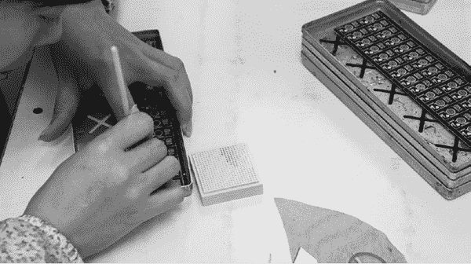

*一个控制器集成电路（IC）被放置在 USB 闪存盘电路板的面板上。右侧是小巧的裸芯片，它们放置在华夫包里。*

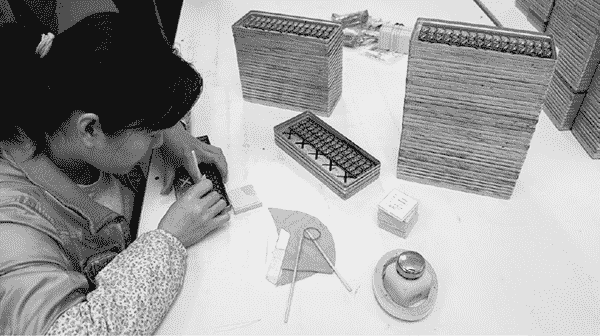

*一个放大视图，展示了芯片放置工作站*

我看到的那位将裸晶片放置到电路板上的女士，使用的是一种类似筷子的工具，它是由手工切割的竹子制成的。我至今还没有完全弄明白这个过程是如何运作的，但我最好的猜测是，竹子棒的表面能量正好适合粘附在硅晶片上，使得硅晶片能粘在竹棒的尖端。裸板上预先涂了一点胶水，当操作员将晶片放到胶水上时，胶水的表面张力会把晶片从竹棒上拉下来。

想到我的 USB 闪存棒内部的芯片是通过改造过的筷子来处理的，真是让人感到有些奇妙。

#### 将芯片焊接到 PCB 上

一旦芯片被放置到 PCB 上，它们就会通过自动化的焊线机*焊接*到电路板上，焊线机使用计算机辅助的图像识别来寻找焊盘的位置（这也是为什么工厂能够通过人工放置晶圆而没有问题的部分原因）。焊线是将集成电路连接到其封装上的过程，自动化焊线机以极快的速度连接电路板上的芯片，不断旋转电路板。当我观看这个过程时，操作员必须手动将一个焊接错误的线头拆除并重新放入机器中。鉴于这些导线比头发丝还要细，而封装和集成电路上的焊接垫是微观尺寸的，这是一项相当高难度的手工技巧。

### 仔细观察 USB 闪存棒的电路板

就像 Arduino 工厂使用包含多个 Leonardo 开发板的面板一样，USB 闪存棒工厂使用的是每个面板包含八个 USB 闪存棒的面板。每个闪存棒面板中的每个闪存棒由一个闪存芯片和一个控制 IC 组成，这个控制 IC 负责 USB 和原始闪存之间的桥接，这是一个相当复杂的任务，涉及坏块映射、错误修正等多个方面。这个控制器可能是一个运行在几十 MHz 的 8051 类 CPU。

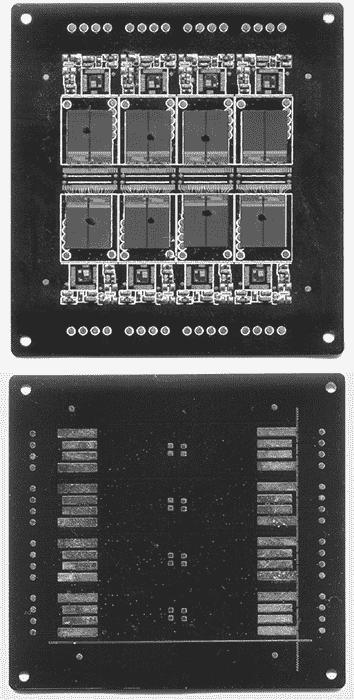

*工厂老板送给我作为纪念品的部分焊接但已完全装载晶片的 PCB。一些焊线在运输过程中被压坏了。*

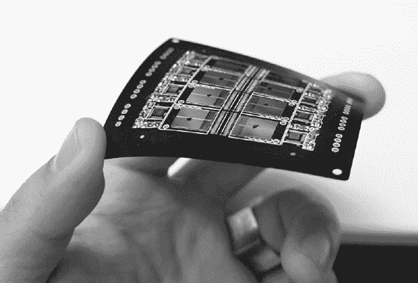

*有趣的是，整个 USB 闪存棒的组装在封装之前是灵活的。*

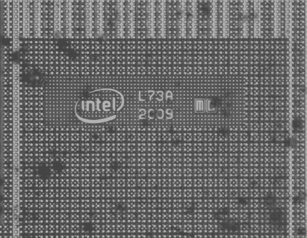

*来自闪存芯片的晶圆标记。显然，它是由英特尔制造的。*

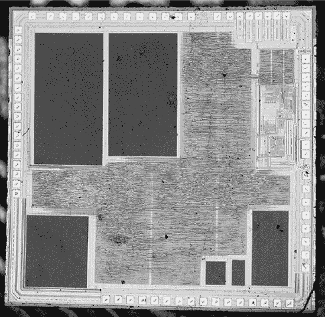

*这是 USB 闪存棒内部控制芯片的晶圆照片*

一旦面板完成焊接并测试合格，它们会被过模处理并涂上环氧树脂，然后切割成单个部分，准备出售。

但关于电子制造的内容就到此为止，接下来我想展示一种不同类型的工厂车间。

### 两条拉链的故事

我的朋友 Chris “Akiba” Wang 与我有类似的背景，只不过他年轻时要酷得多：90 年代，他是 LL Cool J 和 Run DMC 等团体的舞者。在经历了一段为大半导体公司工作的时光后，他最终辞职，追随自己的热情，设计并制造自己的硬件项目。作为短程低功耗无线网络的专家（他合著了一本关于蓝牙低功耗的书，并销售一种名为“Freakduino”的 Arduino + 802.15.4 变种），他现在为联合国和庆应大学等机构提供咨询，经营 FreakLabs，并与各种舞蹈团体合作，如 Wrecking Crew，为舞台表演提供独特且引人注目的灯光解决方案。

我很幸运地在 2013 年与 MIT 媒体实验室的学生一起旅行时，向 Akiba 介绍了大深圳地区——就是那次我们参观 USB 闪存驱动器工厂的旅行。从那时起，他便深入探索该地区。由于他的工作涵盖了表演艺术、可穿戴设备和电子技术等多个领域，他的工厂网络与我的大不相同，因此我总是珍惜有机会了解他世界的机会。

2015 年 1 月，Akiba 带我参观了他朋友的拉链工厂。我对这次参观感到非常兴奋：无论产品多么简陋，我总能通过参观工厂学到新东西。这家工厂与 Arduino 和 USB 闪存驱动器的设施完全不同。员工非常少，而且是一家高度自动化、垂直整合的制造商。为了让你了解这意味着什么，这家工厂将金属铸锭、锯末和大米转化为拉链零件。

*大约 1 吨铸锭，由 93%的锌和 7%的铝合金组成*

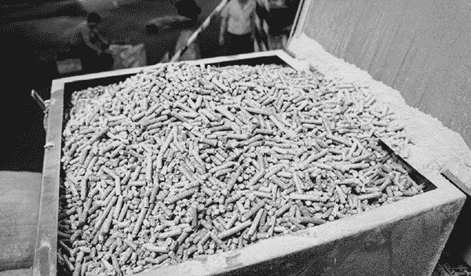

*用于为铸锭冶炼炉提供燃料的压缩锯末颗粒*

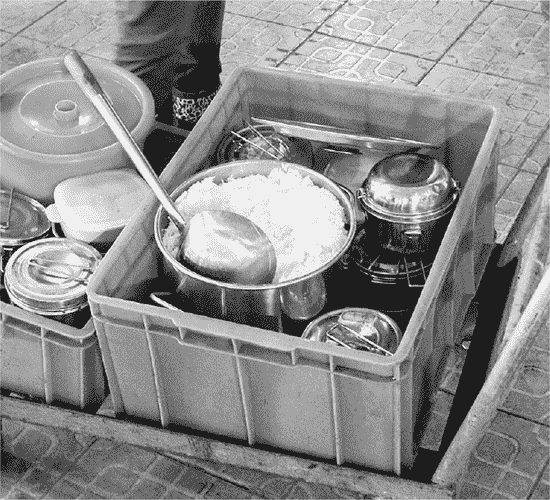

*用于喂养工人的大米*

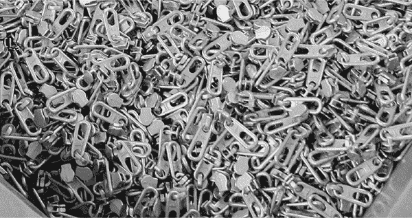

*成品拉链拉头和滑块组件*

让我们看看这个过程的一方面是如何实际运作的。

### 一个完全自动化的过程

在这三种输入材料和输出产品之间，是一条完全自动化的压铸线，用于制造拉链拉头和滑块，还有一套滚筒和振动罐（或者，我喜欢称之为“vibrapots”）用来释放和抛光拉链，还有一套机器用来去毛刺并将每个拉头与其滑块连接。我记得我在工厂里看到的员工不到十个，我猜他们的产能超过了每月百万条拉链。

我被那些将拉链拉头组装在一起的振动锅*迷住了。这里有两个振动锅：一个装着拉头，另一个装着滑块。滑块和拉头都被放置到一个移动的轨道上，我看着这些奇迹般的过程，仿佛滑块和拉头在神奇地自动排成了正确的方向。每个都掉进了自己的轨道，在线的尽头，它们被压在一起，形成了一个熟悉的拉链形状，整个过程完全自动化。

当我把手放进锅里时，我发现没有搅拌器来引发运动；我只感觉到一阵强烈的振动。我放松了手，发现它开始与锅里其他物品一起移动。整个锅呈现出一种偏向性的振动，使得锅里的物品趋向于以圆形轨迹运动。这推动了拉头和滑块进入一组轨道，这些轨道的形状利用了物品的不对称性，仅允许在正确方向上跳上轨道的部件继续进入下一个阶段。

### 半自动化过程

尽管这家工厂的自动化程度很高，但我看到的许多工人仍然在执行某一操作。他们将另一种拉链的拉头送入与另一个包含滑块的振动锅连接的设备中，而设备则将滑块和拉头组合在一起。

当然，我问了，“为什么有些拉链的组装过程是全自动化的，而有些则是半自动的？”

事实证明，答案非常微妙，它归结为形状问题。

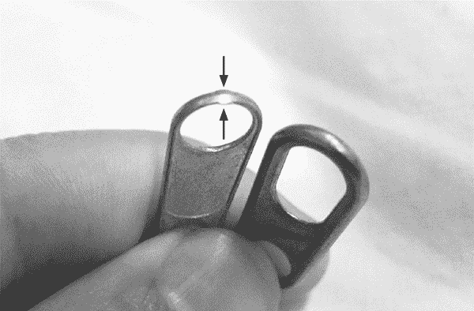

*注意这两个拉头的差异，箭头所指示的位置。*

一个几乎看不见的小标签，成了全自动化和需要人工将成千上万的滑块和拉头组装在一起之间的区别。为了理解为什么，先让我们回顾一下振动锅操作中的一个关键步骤。一位工人善意地暂停了负责将拉头排序到正确方向的振动锅，以便我可以拍摄这个关键步骤的照片。

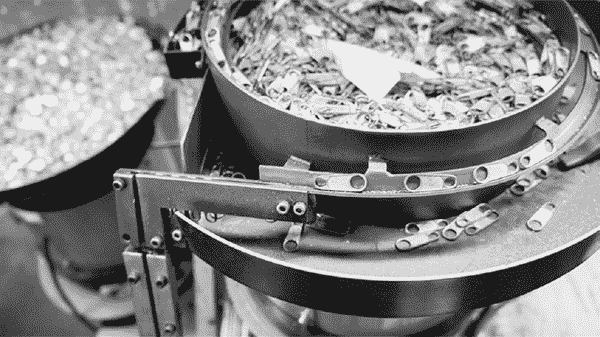

*拉头通过振动锅*

当拉头绕过轨道时，它们的方向是随机的：有的面朝右，有的面朝左。但连接操作必须只将滑块插入两个孔中较小的一个。那个微小的标签让重力使所有拉头以相同的方向挂起，并沿着轨道向左滑落。

半自动化的拉链设计没有这个标签；因此，这种设计对振动锅来说过于对称，无法将拉头对齐。我问工厂老板，是否添加这个微小的标签可以节省人工，他回答说绝对可以。

到这个时候，我恍若顿悟，所有的拉链应该都有这个小标签，但拉链的设计师坚持不这么做。尽管这种标签非常小，消费者却能感受到微妙的凸起，有些人甚至认为这是设计缺陷。因此，设计师坚持要拉链平滑无凸起，结果没有任何特征能够轻松且可靠地让拉链自动对准。

#### 稀缺与需求的讽刺

我想象，大多数人在看到一个人花几分钟将拉链拉头与拉链滑块连接在一起后，应该会很乐意忍受拉链尖端的小小凸起，以节省另一位工人每天下八小时手动将拉头对准滑块的命运。或者，我想工程师可能会花费无数小时，试图设计一种更复杂的方法来对准拉头和滑块，但这有两个问题：

• 拉链的客户可能不会为这种努力买单。

• 可能支付无技能劳动力进行手动排序的成本更低。

这家拉链工厂的老板已经将工厂的其他部分都实现了自动化，所以我猜他们也考虑了这个问题。我猜测机器人建造和维护的成本非常高，而人类是自我复制和大部分自我维持的。还记得工厂的第三个输入——大米吗？任何机器人的备件必须比大米便宜，才能使机器人在这个工厂中占有一席之地。

然而，实际上，将这个概念解释给最终客户听是非常费力的；事实上，市场上正好相反。将光滑拉链装配在一起需要额外的人工，因此拉链的成本更高；因此，它们往往出现在高端产品中。这进一步强化了这样一种观念：没有小标签的非常光滑的拉链一定是质量控制和注重细节的结果。

我的世界充满了这样的微小挫败感。例如，大多数顾客认为镜面处理的塑料比缎面处理的塑料质量更高。其实这两种塑料的结构性能没有功能性的区别，但制作镜面效果的过程要费很多功夫。注塑工具必须仔细地打磨抛光，在工厂的每一步，工人们都必须戴上白手套。为了一丝不苟的质量，很多塑料都被浪费掉，且在运输过程中，为了保护镜面，额外的塑料膜会覆盖在镜面表面上。

为了所有这些努力，为了所有这些浪费，用户做的第一件事是什么？他们把脏手指印弄到镜面处理的表面上。产品从包装盒出来一分钟内，所有的努力都被摧毁了。或者更糟糕的是，用户把保护膜留在了上面，结果反而产生了比缎面效果更糟的外观效果。

将其与缎面处理的塑料进行对比。缎面处理不需要保护膜，更容易让工人和用户操作，使用寿命更长，而且产量更高。在用户手中，它能遮掩小划痕、指纹和灰尘。可以说，缎面效果在长远的客户体验上，比镜面效果更好。

但是那种镜面效果在照片和展厅展示中确实看起来很漂亮！
