## 第三章：3. 工厂车间

前两章充满了我在深圳大湾区制造生态系统中学习、犯错和成长的个人经历故事。2013 年 1 月，当我掌握了基本技能后，麻省理工学院媒体实验室邀请我开始指导研究生们关于供应链和制造方面的内容，我带领他们参观了深圳（就是在这个行程中，我遇到了 Akiba，并参观了 USB 闪存驱动器工厂）。本章试图将我在几周内讲授的所有内容浓缩成几十页。

小批量生产中的挑战和权衡与资金雄厚的企业大规模原型生产有所不同。我是随着时间的推移才学到这一点的，但并非每个人都有六年时间去摸索所有新手错误。如果你已经在一家快速发展的科技创业公司工作，你可能根本没有时间进行任何探索。本章的教训适用于任何希望从初步原型到中等批量（可能是几十万台）打造硬件产品的人。把这份总结当作一个一般性指南，而不是详细的路线图。关键总是在细节中，制作新型创新硬件产品的有趣之处就在于，总是有无尽的新挑战等待解决。

### 如何制作物料清单

大多数想要快速扩大产量的制造者都意识到，唯一可行的前进道路是外包生产。如果外包生产能像电路图 + 现金 = 产品一样简单就好了！

无论你是和街角的组装工厂合作，还是将工作交给中国的厂商，清晰完整的*物料清单（BOM）*是外包生产的第一步。你对电路板的每个假设，甚至是焊盘掩膜的颜色，都必须明确无误地列出，才能让第三方准确地复现你的设计。缺少或不完整的文档是生产延误、缺陷和超预算的主要原因。

### 一份简单的自行车安全灯物料清单

假设你成功发起了一个针对自行车安全灯的 Kickstarter 众筹活动。它包含了一个电路，使用 555 定时器来闪烁一小组 LED 灯。经过一次成功的市场营销活动后，你需要在几个月内完成几百个订单。

最开始，一份由设计工具（如 Altium）自动生成的自行车灯物料清单可能会是这样的：

| **数量** | **备注** | **标识符** |
| --- | --- | --- |
| 1 | 0.1μF | C1 |
| 1 | 10μF | C2 |
| 3 | 白色 LED | D1, D2, D3 |
| 1 | 2N3904 | Q1 |
| 1 | 100 | R1 |
| 2 | 20k | R2, R4 |
| 1 | 1k | R3 |
| 1 | 555 定时器 | U1 |

*一个非常基础的自行车安全灯物料清单*

这个 BOM 和一个原理图可能足够让任何一位美国电气工程专业的毕业生复现原型，但对于制造成本报价来说，远远不够。这个版本的 BOM 仅仅涉及电子元件。一个完整的 LED 闪烁器的 BOM 还需要包括 PCB、电池、塑料外壳部件、透镜、螺丝、任何标签（如序列号）、手册和包装（例如塑料袋加纸箱）。它可能还需要一个主箱，用于一起运输多个 LED 闪烁器，因为单个纸盒的 LED 闪烁器太小，无法单独运输。尽管纸箱便宜，但并不是免费的，如果没有按时订购，库存将会堆放在码头，直到主箱送到并最终包装后才能发货。

以下关键信息也缺失：

• 每个部件的批准制造商

• 被动元件的容差、材料组成和电压规格

• 所有部件的封装类型信息

• 特定于每个制造商的扩展部件号

让我们更详细地看一下每个缺失的项。

#### 批准的制造商

一个合格的工厂会要求你提供一个*批准的供应商列表(AVL)*，指定每个 PCB 部件的允许制造商。制造商不是分销商，而是实际生产该部件的公司。例如，电容器可能由 TDK、村田、太阳诱电、AVX、松下、三星等公司生产。我仍然对我审查过的许多 BOM 感到惊讶，这些 BOM 将 DigiKey、Mouser、Avnet 或其他分销商列为部件的制造商。

看似有些愚蠢，可能会觉得在电容器的制造商上斤斤计较，但实际上在某些情况下，部件的制造商确实很重要——即使是对于普通的电容器也是如此。例如，盲目替换开关调节器上的滤波电容器，即使替代品具有相同的额定电容和电压，也可能导致不稳定的操作，甚至可能导致电路板着火。

当然，设计中的某些部分可能对制造商完全不敏感，在这种情况下，我会在 BOM 中的 AVL 标记为“任何/开放”。（对于像拉高电阻这样的部件尤为如此。）这可以邀请工厂代表你建议他们偏好的供应商。

#### 容差、组成和电压规格

对于标记为“任何/开放”的被动元件，你应该始终指定以下关键参数，以确保购买到正确的部件：

• 对于电阻器，至少需要指定容差和功率。一个 1 kΩ，1%的容差，1/4 W 的碳电阻器和一个 1 kΩ，5%的容差，1 W 的绕线电阻器是完全不同的部件！

• 对于电容器，至少指定公差、电压额定值和介质类型。对于特殊应用，还应指定一些参数，如 ESR 或纹波电流容忍度。一个 10μF 的电解电容器，公差为 10%，额定电压为 50V，在高频下的表现与一个 10μF 的陶瓷电容器（公差为 20%，额定电压为 16V）相比有很大不同。

电感器足够专业化，我不建议在 BOM 中将其标记为“任何/开放”。对于功率电感器，需要指定的基本参数有核心材料、直流电阻、饱和度、温升和电流，但与电阻器和电容器不同，电感器没有标准的外壳。此外，像屏蔽和灌封这样的关键参数，可能会对电路性能产生材料上的影响，通常隐含在部件编号中；因此，最好完全指定电感器。射频电感器同样如此。

#### 电子元件外形尺寸

始终完全指定*外形尺寸*或封装类型。规格不清或规格不足的封装参数可能导致组装错误。除了像电子工业联盟（EIA）或 JEDEC 固态技术协会封装代码（如 0402、0805、TSSOP 等）这样的基本参数外，在创建 BOM 时，还应考虑以下封装信息：

**表面贴装封装** 组件的高度可能有所不同，特别是对于大于 1206 的封装或电感器。要注意电路板是否插入了紧凑的外壳中。

**通孔封装** 始终指定引脚间距和组件高度。

对于集成电路（IC）来说，尽量指定与封装对应的常见名称，而不仅仅是制造商的内部代码。例如，德州仪器的“DW”类型封装代码对应于 SOIC 封装。这种一致性检查有助于防止错误。

#### 扩展部件编号

设计人员通常会用简化的部件编号来思考组件。例如，7404 就是一个典型的例子。久负盛名的 7404 是一个六反相器，已经服役数十年。由于它的普及，*7404*可以作为设计工程师中反相器的通用术语。

然而，在进入生产时，必须指定如封装类型、制造商和逻辑系列等信息。某个特定六反相器的完整部件编号可能是**74**VHCT**04**AMTC，这表示由 Fairchild Semiconductor 生产，来自 VHCT 系列，采用 TSSOP 封装，且以管装形式运输。这些额外的字符非常重要，因为小的变化可能会引起大问题，例如报价和订购错误封装的设备，最终导致无法使用的零件卷轴或微妙的可靠性问题。

例如，在我设计的一个机器人控制器（代号为*Kovan*）中，由于错误地将*VHC*替换为*VHCT*逻辑系列中的某个组件，导致了一个问题。使用 VHC 零件将反相器的输入阈值从 TTL 改为了兼容 CMOS 逻辑，因此有些单元对输入信号的响应不对称。幸运的是，在生产开始之前，我发现了这个问题。所有其他单元都使用了正确的零件，我避免了大量的潜在返工——或者更糟糕的，是客户的退货。幸运的是，这个错误的唯一成本是重新加工我在生产前验证的一些原型。

这是另一个例子，说明零件编号中缺少几个字符可能会导致数千美元的损失。LM3670 开关稳压器的完全指定零件编号可能是 LM3670MFX-3.3/NOPB。如果省略了*/NOPB*，该零件编号仍然有效并可以订购——但该版本使用的是含铅焊料。这对于出口到需要符合 RoHS（即无铅等要求）的地区（如欧盟）来说可能是灾难性的。

零件编号中的*X*是另一个更微妙的问题。带有*X*的零件编号按 3,000 个一卷，而没有*X*的零件编号则按 1,000 个一卷。虽然许多工厂会质疑省略*/NOPB*，因为它们通常在购买零件时会组装 RoHS 文档，但它们很少会将卷轴数量作为问题提出。

但是，*你*应该关注卷轴数量。如果你计划只生产 1,000 个产品，在零件编号中包含*X*意味着你将多出 2,000 个 LM3670。而且，是的，你得为这些多余的部件埋单，因为你的 BOM 已经指定了该零件编号。订购多余部件有许多合理的原因，因此工厂通常不会质疑这种决定。

另一方面，按 1,000 个单位一批订购的零件单价比按 3,000 个单位一批订购的零件要贵一些。所以，如果随着数量增加而省略*X*，你最后将支付比必要的更多的零件费用。不管怎样，工厂会严格按照你指定的 BOM 报价，如果你的数量规格不正确，可能会错失节省成本的机会——或者更糟的是，亏损。

底线是？每一个数字和字符都至关重要，忽视细节可能会带来实际的经济损失！

#### 自行车安全灯 BOM 重新审视

考虑到这四个要点，想一想一个合适、完全指定的自行车安全灯 BOM 可能会是什么样子。

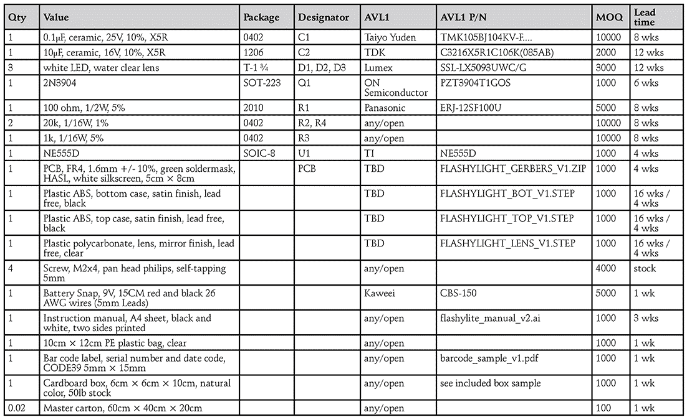

*改进后的自行车安全灯 BOM*

任何工程师都可以用来生产原型的 BOM，比如我之前展示的自行车安全灯 BOM，和像这样的 BOM 之间存在很大差异，后者是任何工厂都可以用来大规模生产产品的 BOM。特别注意 MOQ（最小订购量）和交货时间这两列。对于低量原型的制造来说，这些列是无关紧要的，因为你通常会从分销商那里购买零件，这些分销商的 MOQ 限制少，且能提供次日交货。然而，在扩大生产规模时，通过批发渠道采购可以节省很多成本，从而削减分销商的附加费用。在批发渠道中，MOQ 和交货时间非常重要。

好消息是，工厂会在报价过程中填写 MOQ 和交货时间。但你会发现从一开始就跟踪这些参数非常有帮助。如果某个部件的 MOQ 非常高，工厂可能需要购买大量的多余部件，这会增加项目的实际成本。如果某个部件的交货时间非常长，你可能需要考虑重新设计，以使用交货时间更短的部件。使用交货时间较短的部件不仅能节省时间，还能改善现金流：没有人愿意在销售收入还没到手的四个月前，就把现金压在长交期的部件上。

这个 BOM 还包括一些非电子物品——例如箱子、条形码标签等——这些物品不会出现在工程原型的 BOM 中。这些杂项容易被忽视，但如果初始 BOM 中缺少用户手册，通常要等到最终样品打开进行审批时才会发现，这会导致最后一刻匆忙把手册加入最终产品。许多产品的延迟，仅仅是因为用户手册或盒子艺术未能及时完成并批准，而导致价值十万美金的库存在仓库中闲置，只因缺少一张纸。

除了合适的 BOM 外，向工厂提供产品的黄金样品以及 CAD 文件是另一个最佳做法。这些工作原型使工厂能够更明智地决策，处理你提交的 BOM 中的任何模糊之处。仅仅为工厂再焊接一个单元，可能看起来有些麻烦，但在我看来，几个小时的焊接时间比与工厂交换一周的邮件要好得多。

**注意**

*当你建立商业模型时，部件和包装仍然不是唯一需要考虑的成本。即使是这个详细的 BOM，也没有列出工厂利润、组装劳动力、包装、运输、关税等。我在《选择（并维护）合作伙伴》中讨论了这些“软成本”，详见第 107 页。*

#### 规划与应对变化

当然，即使你的设计完美无缺，BOM 也理想无误，如果供应商*停止生产（EOL）*你选定的零件，你的设计仍然可能需要更改。坦白说，你的设计假设也总有可能在与真实消费者接触后遭遇失败。

在进入生产前，要与工厂正式化设计更改的流程。最佳做法是使用书面、正式的*工程更改订单（ECO）*，在初步报价之后通知工厂任何更改。至少，ECO 模板应该包括以下内容：

• 每个更改零件的详细信息，以及简要说明为什么需要进行更改

• 一个唯一的修订号，便于将来引用该更改

• 一种记录工厂收到 ECO 文件的方法

对 ECO 要细致，而不是依赖随意的邮件，否则你工厂的采购人员可能会采购错误的零件。更糟糕的是，工厂可能会*安装*错误的零件，导致你的产品批次全部需要废弃或返工。即使在与工厂工程师排查问题后，我仍然会写出正式的 ECO 并提交给生产人员，以正式化发现的问题。我和其他工程师一样讨厌文书工作，但在生产中，一点小错误可能会导致数万美元的损失，而这一点让我在 ECO 文档上保持严谨。

下一页是我发布的一个实际 ECO，最终为我节省了时间和金钱。

请注意这个 ECO 的日期：2014 年 2 月 27 日。这个 ECO 是在中国农历新年前发布的，那时工厂将放假几周。假期过后，工厂内部的非熟练工人流动性很大，因此很容易出现工单丢失或被遗忘的情况。担心 ECO 会被遗漏，我在工厂恢复生产后与管理人员咨询，确保 ECO 没有被遗忘。他们向我保证已经应用了该 ECO，但我还是有些模糊的不安，于是我要求提供电路板的照片以确认。果然，第一批生产批次中缺少了我 ECO 中的更改。

多亏了详细的 ECO，工厂很快承认了自己的错误，修复了整个生产批次，并支付了返工费用。但如果我仅仅通过一封快速的邮件发送更改订单，没有具体提到批次或工单，可能会有足够的模糊性让工厂避免支付返工费用。工厂本可以辩称它认为我意图将更改应用于未来的生产批次，或者它也可以简单地否认收到确认的订单，因为邮件是一种相对随意的沟通方式。无论如何，几分钟的文档工作为我节省了数天的谈判时间和几百美元的返工费用。

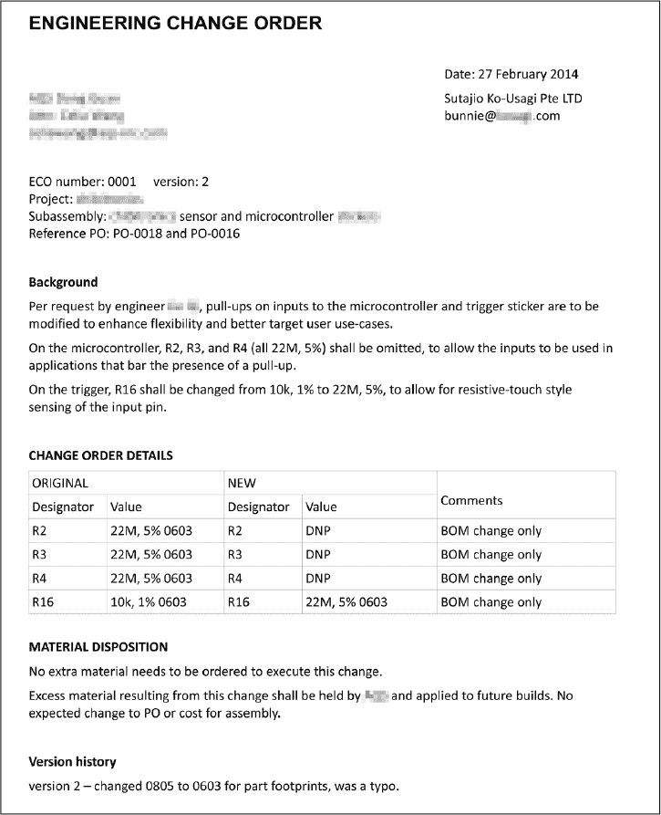

*实际用于生产中的 ECO 示例。多亏了正式的文档流程，与这个 ECO 相关的生产混乱最终得以解决，对我有利。*

### 过程优化：面向制造的设计

在设计最终产品并组装 BOM 时，考虑*良品率*（即从制造过程中获得的合格单元数量）也非常重要。对于许多工程师来说，良品率是一个无聊的话题，但对于企业家而言，成败部分取决于是否能实现合理的良品率。幸运的是，通过在设计时考虑这一点，你可以帮助提高良品率。

#### 为什么选择 DFM？

与软件不同，每个物理商品的副本都有轻微的缺陷。有时这些缺陷会相互抵消；有时它们会积累并降低性能。随着生产量的增加，产品的一部分始终会变得不可销售。在一个稳健的设计中，失败的比例可能非常小，以至于功能测试可以简化，从而进一步降低成本。相比之下，对组件公差敏感的设计需要进行广泛的测试，并且会遭遇严重的良率损失。返工缺陷单元会增加额外的人工和零部件费用，最终侵蚀利润。

因此，在从工程台到大规模生产的过程中，重新设计以提高对正常制造公差的适应性是一个重大挑战。这个过程被称为*面向制造的设计（DFM）*。

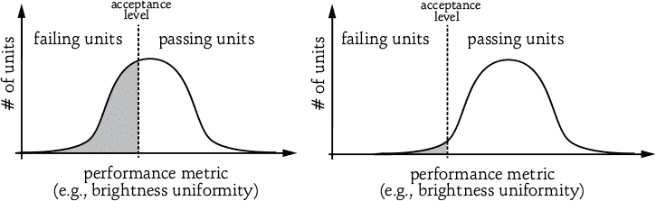

*左侧，在没有进行 DFM 之前，几乎一半的单元不符合接受标准，因此会失败。右侧，在进行 DFM 之后，接受标准保持不变，但平均性能得到了提升，导致大多数单元通过测试*。

为了理解 DFM 的重要性，考虑这些图表。每个图表都描绘了一个*钟形曲线*，它表示某个特定参数的假定统计分布。x 轴表示感兴趣的参数，y 轴表示达到该参数的生产物品数量。例如，在描述成千上万个 LED 的亮度的图表中，x 轴表示亮度，y 轴表示达到某一亮度的 LED 数量。钟形曲线相对于通过/失败标准的位置决定了净生产良率。

在右侧的曲线中，大多数 LED 亮度足够，且大部分生产库存可以发货。在左侧的曲线中，可能只有 40%的 LED 通过测试。考虑到大多数硬件公司大约有 30%到 50%的毛利率，废弃 40%的材料意味着业务的终结。在这种情况下，唯一可行的选择就是花费时间和精力重新加工 LED 直到其通过，或者降低性能要求。产品的质量可能无法达到预期，但至少业务能够继续运营。

#### 需要考虑的公差

DFM 的目标是确保你的产品始终通过验收，不会面临降低利润、降低质量标准或关停业务的令人不快的选择。但是，在应用 DFM 时，有一些组件方面需要考虑。

##### 电子公差

被动元件的公差是设计中最显而易见的公差。如果一个电阻的实际值可能在标称值的±5%之间变化，确保电路的其他部分能够应对这种极限情况。

主动元件的规格参数——如双极型晶体管的电流增益（hFE）、场效应晶体管（FET）的阈值电压（V[t]）以及 LED 的正向偏置电压（V[f]）——也可能有很大差异。始终阅读数据手册，并留意那些最小值和最大值之间差距较大的参数，这种差异通常称为*最小最大范围*。例如，Fairchild 的 2N3904 的 hFE 的最小最大范围是 40 到 300，而 Kingbright 的超亮 LED 的 V[f]范围在 2V 到 2.5V 之间。

除了名义工作电压外，组件的最大电压额定值对于电容器和输入网络尤为重要。我通常会使用额定电压是名义电压两倍的电容器；例如，在可能的情况下，我会为 5V 电源轨使用 10V 电容器，为 3.3V 电源轨使用 6.3V 电容器。要理解为什么这样做，请考虑陶瓷电容器的介质，它们的电容会随着电压的增加而减少。在靠近陶瓷电容器最大电压的设计中，该组件的工作电容将处于其公差范围的负端。此外，*输入网络*（电路中用户可以插入设备的任何部分）容易受到严苛的静电放电和其他瞬态损伤，因此在此处选择电容器时，特别需要注意其额定值，以确保实现所需的可靠性。

最后，在确定了将使用的组件之后，设计 PCB 时要特别注意走线宽度和层叠结构的变化。这些因素会影响需要匹配阻抗或处理大电流的系统。

##### 机械公差

然而，电子元件的公差并不是唯一需要担心的，机械公差同样重要。无论是 PCB 板还是外壳，都不可能完全达到精确的尺寸，因此设计外壳时要留有一些余地。如果外壳设计对 PCB 尺寸的公差为零，工厂在生产时往往会强行将 PCB 安装进外壳中，当 PCB 稍微大一些或外壳稍微小一些时，这会导致电路或外壳的非故意机械损坏。

别忘了外观瑕疵！任何制造的产品都可能有小的瑕疵，比如塑料中困住的灰尘、小刮痕、凹陷和磨损。事先与工厂商定这些缺陷的接受标准非常重要。例如，你可能会告诉工厂，一个产品可以被认为是“合格的”，前提是它没有超过两个直径大于 0.2mm 的点状瑕疵，没有超过 0.3mm 长的刮痕，等等。大多数工厂会有一套标准化系统来描述和执行这些标准。如果你提前讨论好这些参数，工厂就可以根据这些标准调整生产工艺，避免出现这些缺陷，而不是采取更昂贵的方案——制造额外的单位并丢弃那些不符合标准的。

当然，避免缺陷并不是免费的。为了降低产品成本，可以避免使用高光泽表面，而考虑使用哑光或有纹理的表面，这些表面天然可以隐藏瑕疵。

#### 遵循 DFM 有助于你的利润

要在现实场景中想象 DFM，可以回到 “如何制作物料清单” 中的自行车安全闪光灯案例研究，见第 74 页。假设原型设计要求并联三颗 LED，每颗 LED 有一个电阻来设置电流。LED 在给定亮度下的*正向偏置电压*，或*V[f]*，在不同的设备之间可能会有大约 20%的变化；在这个案例中，这个变化范围是从 2.0V 到 2.5V。

使用电阻限制 LED 电流的设计，被称为*电阻性电流限制*，会放大这种变化。这是因为高效电路会将大部分电压降落在电流限制电阻上，使得设置电流的参数（电阻上的电压降）对 V[f]的变化更为敏感。由于 LED 的亮度与电压并非成比例关系，而是与流过它的电流成正比，因此使用电阻性电流限制来设置 LED 亮度可能会导致 LED 亮度出现令人不悦的不一致性。

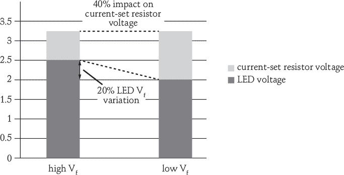

*比较高 V[f]和低 V[f]极限*

在这个例子中，LED V[f]的 20%的变化（从 2.0V 到 2.5V，按照 LED 制造商的规格）会导致在固定 3.3V 电源下，电流设置电阻上的电压变化达到 40%。这将导致流过 LED 的电流变化 40%。由于亮度与电流直接成正比，这种变化会表现为单个 LED 之间高达 40%的亮度差异。这样的设计大多数情况下能正常工作；只有当一个高 V[f]的单元与一个低 V[f]的单元并排观察时，问题才会变得显著。

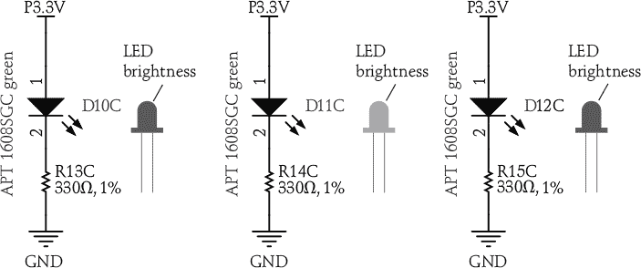

*使用电阻为单个 LED 设置电流可能会导致亮度的剧烈变化。*

在开发阶段，实验室台面上准备的一个或两个单位可能看起来很完美，但在生产过程中，可能有相当一部分单位存在严重的亮度不均问题，导致不得不将其退货。由于大多数大型硬件公司只能依靠精益利润生存，因此即便是损失 10%的不合格品，也会造成严重后果。

一个临时解决方案是重新加工失败的单位。工厂可以在 LED 阵列中识别出过暗或过亮的 LED，并将其替换为与其他 LED 更匹配的组件。但这种返工会推高成本，并在制造程序的最后阶段带来意想不到且不愉快的账单。天真的设计师可能倾向于将质量问题归咎于工厂，并争论应该由谁承担费用，但更好的做法是通过对每个设计进行 DFM 检查，并通过小批量试生产来对良品率进行验证，从而主动避免这些问题。

良品率损失的成本量化了为补偿正常组件变异性而需要投入的额外电路费用。例如，一个单价为 10 美元的*销售成本（COGS）*的产品，如果生产出 80%的合格单位，则每个可销售单位的有效成本为 12.50 美元，计算公式如下：

有效成本 = COGS × 总生产单位数 / 合格单位数

将 COGS 增加 2.50 美元以将良品率提高到 100%可以实现盈亏平衡。但是使用相同的公式，花费 1 美元额外的 COGS 来将良品率提高到 99%实际上会使底线提高 1.38 美元。

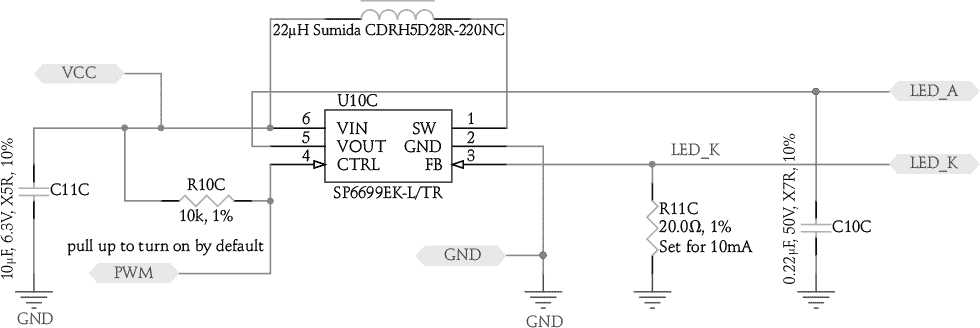

*通过应用 DFM 创建的电路，用于为三颗 LED 设置电流*

以自行车安全灯为例，这 1 美元可以用于购买像 SP6699EK-L/TR 这样的电流反馈升压调节器 IC，使得 LED 可以串联排列而不是并联。与使用单独的电阻器相比，设计会更为复杂且成本更高，但它可以确保每颗 LED 都通过固定电流反馈回路在串联电路中流过一致且相同的电流，从而几乎消除亮度的变化。虽然升压调节器的成本远高于花费在三颗限流 LED 上的一分钱，但生产良品率的提高完全弥补了额外组件的成本。实际上，这种方法是要求 LED 亮度均匀的应用的标准做法，比如 LCD 面板的背光。典型的手机背光使用大约十几个 LED，但得益于像这样的电路，尽管各个 LED 之间的 V[f]差异很大，你从未见过明显的明暗斑块。

#### 产品背后的产品

除了处理公差问题外，另一个常被忽视的设计责任是测试程序。工厂只能检测它被指示去寻找的问题。因此，产品的每个特性都必须经过测试，无论它多么微不足道。例如，在 chumby 设备上，所有用户可见的特性都有明确的工厂测试，包括 LCD 屏幕、触摸屏、音频、麦克风、所有扩展端口（USB、音频）、电池、按钮、旋钮等等。我确保了即使是最简单的按钮也经过测试。虽然跳过测试这些简单组件很有诱惑力，但我保证，任何未经过测试的东西都会导致退货。

我喜欢称工厂测试器为“你产品背后的产品。”因为在某些情况下，工厂测试器比你要销售的产品更复杂、更难以设计。尤其对于简单的产品而言，这种情况尤为明显。

##### 一个真实世界的测试程序

作为案例研究，考虑一下来自 Chibitronics 的这个微控制器贴纸，这是我在第八章中详细讨论的一个项目。

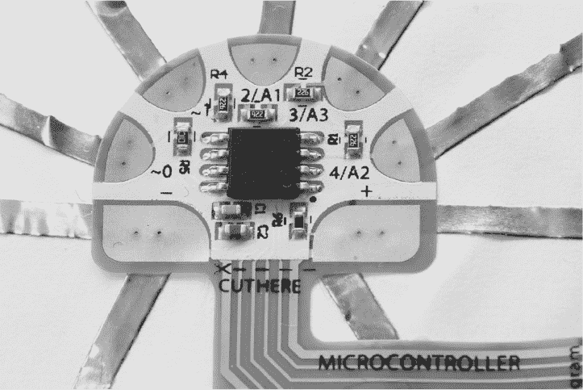

*一个微控制器电路——在一个贴纸上*

该电路非常简单：它仅由一个 8 位 AVR 微控制器和少量电阻与电容组成。（它也是第 84 页中 ECO 示例中提到的同一产品。）我和我的合作伙伴在 Adobe Illustrator 中草绘了大约两天，才得出该产品的最终形状。接着我们花了一天时间在 Altium 中设计电路，并用 Arduino IDE 编写了大约一周的固件代码。总体而言，开发过程大约花了两周时间。在生产中，微控制器与一组传感器配合使用，这些传感器可以处理声音、光线和触摸，因此测试程序同时在所有四个方面运行。

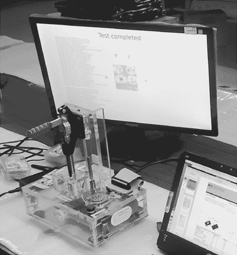

*Chibitronics 微控制器贴纸的测试机*

如图所示的测试设备由一台运行 Linux 的 32 位 ARM 计算机组成，图形界面显示在 HDMI 显示器上。其背后是一个 FPGA，一些适配器电子元件用于生成模拟波形进行测试，以及一个机械的探针引脚组件用于接触贴纸。将该测试设备的设计过程分解为各个部分，我们花费了：

• 几天时间在 Altium 中进行设计

• 一周时间在 Xilinx ISE 中进行 FPGA 编程

• 几周时间在 Linux 驱动程序上进行黑客攻击

• 几个月的时间在 C++ 中进行黑客攻击，以创建 Qt 集成框架

• 几天时间在 SolidWorks 中，创建机械装置将整个系统固定在一起

总的来说，制作微控制器贴纸的测试器花费了超过两个月的时间，而制作产品本身只用了两周时间。

为什么要付出这么多努力？因为时间就是金钱，而缺陷和退货处理成本昂贵。测试员可以在不到 30 秒的时间内处理一块板；在这 30 秒里，测试员需要编程两个微控制器；测试传感器的光、声音和触摸；并确认在 5V 和 3V 下的操作。所有这些操作的手动测试可能需要几分钟的熟练劳动，而且不如自动化测试可靠。多亏了这个测试仪，我们没有因为材料缺陷而退货。此外，测试仪上的图形化 UI 使得工厂能够非常容易地确定电路中哪个点出现故障，从而加快了任何不合格材料的返工速度。

##### 创建测试程序的指南

一般来说，对于你制造的每个产品，你实际上是在制造两个相关的产品：一个是面向终端用户的，另一个是面向工厂的测试程序。在很多方面，工厂的测试程序必须像产品本身一样易于使用和防错；毕竟，测试并不是由电气工程师来执行的。但是，如果在消费品中设计了足够的测试功能，那么相关的测试产品将会更快速、更高效地构建。

不，别把测试程序外包给工厂，即使工厂提供这样的服务。工厂通常不了解你的设计意图，因此他们的测试程序往往低效或者测试了错误的行为。工厂也有尽可能快速通过尽可能多的材料的动机，所以他们的测试程序通常是原始的且不充分的。

设计你自己的程序时，以下是一些指南：

**努力实现 100%的功能覆盖。**

不要忽视一些简单的或次要的功能，比如状态 LED 或内部电压传感器。在创建测试清单时，我采取“外部/内部”方法。首先，从外部看产品：列出消费者可以与之交互的所有方式。你的测试程序是否涵盖了每一种交互方式，即使只是表面上？每个 LED 是否都亮起，每个按钮是否都按下，每个传感器是否都激活，每个存储设备是否都被触及？你的营销材料中的每一个要点都得到了验证吗？承诺“世界级”的射频灵敏度与仅仅宣传有无线电功能是不同的。然后，思考内部：从原理图中，查看每个端口并考虑需要监控的关键内部节点。如果产品有微控制器，检查加载了哪些驱动程序，交叉检查测试清单，确保没有遗忘任何组件。

**尽量减少增量设置工作。**

优化每个单元设置测试所需的时间。这通常通过使用带有 pogo 引脚或预对准连接器阵列的夹具来完成。需要操作员手动用万用表探测十几个测试点或插入十几个连接器的测试，既耗时又容易出错。中国的大多数工厂可以帮助设计夹具，费用不高，但如果设计本身已经包括足够的测试点，夹具设计会更容易且更有效。

**将测试程序自动化为线性流程。**

理想的测试只需按下一个按钮，就能得出通过或失败的结果。实际上，总是会有需要操作员干预的停顿点，但尽量减少这些干预。例如，不要要求操作员在每次 Wi-Fi 连接测试时输入或从列表中选择 SSID。相反，将测试目标的 SSID 固定，并将该值硬编码到测试脚本中，使得连接过程自动进行。

**使用图标和颜色，而不是文本，与操作员进行沟通。**

并非每个操作员都能保证能读懂某种语言。

**使用审计日志。**

通过将条形码扫描仪集成到测试夹具中，记录与设备序列号相关的测试结果。或者，让设备打印带有唯一时间戳代码的凭证或本地存储的审计日志，以证明哪些单元通过了测试。日志有助于你找出当消费者退回故障产品时出现的问题，并能让你快速检查所有产品是否都经过了测试。经过八小时的测试班次后，操作员可能会犯错，比如不小心将有缺陷的单元放入“良品”箱。能够检查每个出货的产品是否经过并通过了完整的测试，可以帮助你识别和隔离此类问题。

**提供简便的更新机制。**

像任何程序一样，测试程序也会有 bugs。随着产品的修补和升级，测试也需要演变。要有一种机制，可以在不亲自访问工厂的情况下更新和修复测试程序。我的许多测试夹具可以通过 VPN “拨打回家”，我可以通过 SSH 进入夹具本身修复 bug。即使是我最简单的夹具，其核心也使用 Linux 笔记本电脑（或类似设备）。部分原因是 Linux 比定制的微控制器更容易更新和维护，因为后者需要特殊适配器来进行固件更新。

如果你的产品在设计时就考虑了可测试性，这些指南很容易实施。我设计的大多数产品运行 Linux，我利用产品内部的处理器来运行大部分测试并帮助管理测试用户界面。对于缺乏用户交互界面的产品，可以使用通过 Wi-Fi 或串行连接的 Android 手机或笔记本电脑来呈现测试用户界面。

#### 测试与验证

生产测试旨在检查组装错误，而不是参数变化或设计问题。如果测试因正常的参数组件变化而筛选掉设备，要么购买更好的组件，要么重新设计。

对于消费级产品，你不需要对每个单元进行五分钟的综合 RAM 测试。理论上，你的产品应该设计得足够好，只要所有组件焊接正确，RAM 就能正常工作。通常，一个简单的测试来检查没有卡住或断开的地址引脚就足够了。大品牌芯片供应商的缺陷率通常很低，因此你并不是在验证硅芯片本身；相反，你是在验证焊接接头和连接器，并检查是否有缺失或交换的组件。（但如果你购买了克隆芯片或低品牌、重标或部分测试过的设备以节省成本，我建议为这些组件做一个小型验证程序。）

##### 验证开关

为了说明生产测试和验证之间的区别，让我们看看这两者在开关测试中的应用。

开关的生产测试可能只是要求操作员按几次开关，验证开关的手感是否正确，并通过简单的数字指示器检查是否有电气接触。相对而言，验证测试可能涉及随机选择几个设备，使用精确到五位有效数字的万用表测量开关的接触电阻（也叫做*五位数万用表*），将设备暴露在较高的湿度和温度下进行几天，然后将设备放入一个自动化夹具中，循环测试开关 10,000 次。最后，可能会使用五位数万用表重新测量开关的接触电阻，并记录闭合状态接触电阻的任何降级。

显然，这种级别的验证不能在每个制造的设备上执行。相反，验证程序评估的是开关在预期使用寿命期间的性能。生产测试则只确保开关的组装没有问题。

**注意**

*在每几千个生产出来的单元中，重新运行验证测试对几个随机抽取的单元是一个很好的做法。你可以使用一些公式和表格来计算需要多少抽样才能达到某个质量水平；只需在线搜索“制造验证测试表格”即可。*

那么，多少测试才算足够呢？你可以通过成本论证得出一个测试的阈值。每进行一次额外的测试都需要支付设备费用、工程费用和测试时间的变动费用。因此，测试具有收益递减的特性：到某个时点，退货的成本可能比进行更多测试要低。自然，医疗或工业级设备的测试标准要高得多，因为与故障设备相关的责任也更大。同样，用于赠送的新品可能需要进行的测试要少得多。

##### 设计你的测试夹具

最后一个想法：始终将扎实的工程设计应用于你的测试夹具设计。当我在开发 chumby 8 时，遇到了一个问题：一个 50 针的扁平柔性电缆适配器出现了随机的冷焊接失效。我要求工厂建立一个测试来验证适配器。工厂的解决方案是将 LED 灯挂在适配器的每个引脚上，对电缆的一侧施加测试电压，然后查看另一侧是否有 LED 没有点亮。冷焊接点不仅仅是开路或闭路；有些仅仅表现为高电阻。足够的电流流动可以点亮 LED，但仍然有足够的电阻导致设计故障。

工厂建议购买 50 台万用表，并将它们连接到每个引脚上以手动检查电阻，这样既昂贵又容易出错。期望操作员每天看着 50 个显示屏数百次，并能可靠地找到不合格的数值是不现实的。于是，我选择了将连接线按串联方式连接在适配器上，并使用一台万用表来检查串联电路的总电阻。通过将连接串联，我可以通过一次数值测量来检查所有 50 个连接，而不是主观地观察 LED 的亮度。

正如这个案例所示，即使是检查电缆适配器上的冷焊接这样简单的测试，也有好方法和坏方法。越来越复杂的组件需要越来越微妙的测试，而利用工程技术制定高效且万无一失的测试方案具有真正的价值。

### 在工业设计中寻找平衡

即使你的产品通过了所有验证测试，表现得非常出色，如果消费者不愿意购买，它仍然可能不会成功。记住：**性别销售**。对于典型消费者来说，一台设备的 CPU 性能或 RAM 大小，最多也只是比设备外观稍微重要一点。苹果设备之所以能够收取高额溢价，部分原因就是它们光滑的工业设计，许多产品设计师也试图在自己的产品中模仿苹果首席设计官乔纳森·艾夫爵士的成功。

在*工业设计*中有很多思潮，工业设计是指在实际生产之前设计产品外观的过程。一种思潮提倡修道院式设计师，设计出一个美丽而纯粹的概念，然后生产工程师在为了功能性调整设计时破坏了这种纯粹性。另一种思潮提倡务实的设计师，他们与生产工程师密切合作，在设计中进行艰难的妥协，以生产出价格低廉且高效益的设计。

根据我的经验，极端的方法都不具备说服力。僧侣式的方法通常会导致无法制造的产品，这些产品要么上市滞后，要么生产成本高昂。而实用主义的方法常常会导致产品看起来廉价、手感差，消费者难以赋予其应有的价值。真正的难题是理解如何在两者之间找到平衡，而这始于进入工厂，了解事物是如何操作的。以下是我从 Chumby 和 Arduino 的经验中学到的一些例子，展示了不同的工艺流程如何影响这种平衡。

#### chumby One 的修整与表面处理

修整和表面处理是比较困难的，因此成为产品外观上的区分点。当我在 Chumby 工作时，我们希望最终的产品具有简约而诚实的表面处理。(*诚实的表面处理*展现了材料系统的自然特性，避免使用油漆和贴纸。)简约的设计非常难以制造，因为特征越少，哪怕是微小的瑕疵也会显得特别突出。诚实的表面处理也很困难，因为所有的毛刺、浇口、沉陷、接缝、划痕和流痕——这些制造中的必然现象都会赤裸裸地展示给消费者。因此，这种设计理念需要精良的制造工具，并且在生产过程中需要不断地检查和维护。

如果你没有足够深的口袋为工厂投资新设备和新能力（也就是说，如果你不是*财富*500 强公司），第一步就是学习现有的术语。*设计词汇*由生产商品的工厂或工厂群体的能力所定义，比如你可以获得哪些材料、可能的表面处理、可达的公差以及现有的紧固技术。这些都与工厂可用的工艺流程密切相关。

因此，我发现，在设计过程中尽早亲自参观工厂能带来更好的设计。参观工厂后，你会摒弃一些设计术语，但你也会发现一些新的术语。那些日复一日在工厂里工作的工程师们，开发了许多工艺创新，能够为设计开辟出新的可能性，除非你亲自去参观，否则是无法发现的。

chumby One 是制造工艺对设计成果产生影响的一个具体例子。在最初的概念图中，前缘加上了蓝色高光，以模仿漫画条中的对话框。这个设计的初衷是希望 chumby 能够用来自互联网的片段来为你的世界加上字幕。

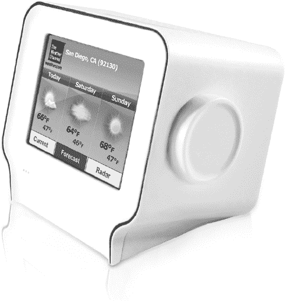

*一台完成的 chumby One 设备*

但是，在一个凸起的表面上施加蓝色修饰条非常困难。第一家工厂使用了油漆，因为前缘不够平坦，无法选择丝网印刷。*垫印*（也叫* tampo 印刷*，是一种将墨水从硅胶垫转印到物体上的工艺）能够处理弯曲的表面，但 chumby One 上的凸脊对齐效果不好，哪怕是微小的墨水溢出都能从侧面看得很糟糕。贴纸和贴花同样无法实现我们想要的对齐。最终，雕刻出一个小通道来容纳油漆，工厂通过模板和喷漆完成了高光处理。

成品率非常低。在某些批次中，由于涂漆错误，超过 40%的 chumby One 外壳被丢弃。幸运的是，塑料很便宜，所以在涂漆后丢掉一半以上的外壳，净成本影响大约为 0.35 美元。

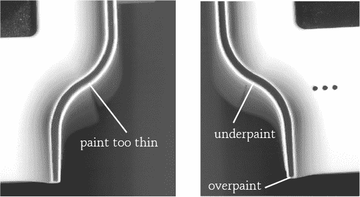

*两台涂漆效果差的 chumby One 产品*

在生产过程中，我们开始在第二家供应商工厂生产 chumby One 单元。第二家工厂拥有不同的塑料成型设备，并且与第一家工厂不同，这家工厂能够进行*双注塑模具*。双注塑模具需要比单注塑模具更多的工具，但它能够在同一个模具中注射两种不同的颜色，甚至是两种不同的材料。在新工厂，我们尝试了双注塑工艺，而不是涂漆处理薄薄的蓝色条纹。

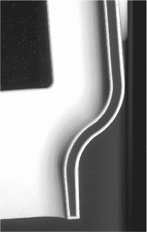

*通过双注塑模具工艺制作的完美 chumby One 凸脊*

最终效果非常惊艳。每一台产品都带有清晰的蓝色线条，没有油漆意味着更加干净和真实的外观。但尽管达到了 100%的成品率，每个外壳的成本依然上涨到了 0.94 美元。即使舍弃超过一半的涂漆外壳会更便宜，但即便是最好的涂漆外壳，也无法与双注塑工具所带来的优质表面效果相提并论。

#### Arduino Uno 的丝网印刷艺术

另一个关于如何通过调整工厂工艺改善产品外观的好例子是 Arduino 主板。背面的精美图案，展示了意大利的轮廓和非常精细的文字，并不是丝网印刷。这些板子由一家公司生产，该工厂实际上为电路板涂上了两层焊盘膜：一层是蓝色的，一层是白色的。

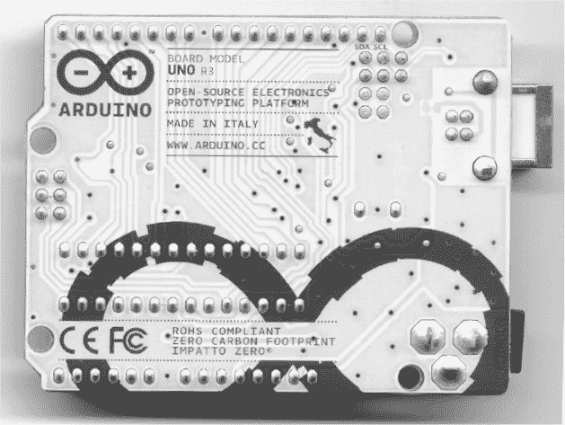

*Arduino Uno R3 的底部*

当 Arduino 主板生产时，焊盘膜是通过我在“Arduino 诞生地”一文中提到的光刻工艺涂覆的，详见第 44 页。这种工艺可以带来比丝网印刷更好的分辨率、一致性和对齐效果。而由于 Arduino 的外观就是电路板，这种艺术设计使得产品具有了独特的高质量外观，这种外观使用传统工艺方法几乎无法复制。

因此，工厂的工艺能力（无论是喷涂与双注塑成型，还是双层焊盘与丝网印刷）对产品感知质量有实际影响，而对成本的影响却很小。然而，工厂可能并未完全认识到其工艺的潜力，直到设计师与工厂直接互动时，产品才能充分发挥这些潜力。

不幸的是，许多设计师直到出现问题才会去工厂参观。到那时，工具已经切割完成，即使你发现了一个能够解决所有问题的酷炫工艺，也常常为时已晚。

#### 我的设计过程

设计是一项高度个人化的活动，因此每个设计师都会发展出自己的过程。然而，如果你需要一个开发自己设计框架的参考，以下是我可能会用来在紧张的创业预算下开发产品的基本过程：

1.  从一本素描本开始。决定设计的灵魂和身份，选择一个适合你概念的材料系统和语言。但不要太过依赖它，因为它可能需要改变。

1.  按材料系统拆解设计，并确定能够生产每个材料系统的工厂。

1.  参观工厂，并注意实际在生产线上的产品。不要根据样品房中的单件产品做假设。实践出真知，从操作员到工程师，工厂工人执行他们每天做的程序要比那些他们不常用的复杂工艺做得更好。

1.  基于对工厂可行性的全新理解重新评估你的设计，并进行迭代。如果小的调整不足以解决问题，回到第 1 步。这是最容易在不牺牲设计纯粹性的情况下做出妥协的阶段。

1.  粗略勾画出设计的细节。根据工厂能够做到的最佳效果，选择滑动表面、分模线（即外壳部件拼接的地方）、表面处理、固定系统等。

1.  将修改后的图纸交给工厂，并与他们合作，最终确定草图角度、固定表面、内部肋条等细节。

1.  使用 3D 打印和广泛的 3D 模型检查来验证设计。

1.  确定容易出现公差误差的特征，并修剪初始制造工具，使公差有利于修改，从而帮助你最小化对工具的昂贵更改。例如，考虑注塑成型，其中钢模具是其成型塑料的负模。从工具中去除钢材（加塑料）比加入钢材（去除塑料）更容易，因此在进行初步试射时，应将关键尺寸上的钢材用量增多，而不是太少。按钮就是一个通过这种方式调整的机制：预测一个按钮在 CAD 或 3D 打印件中的感觉很难，完美的触感通常需要稍微修剪工具。

当然，这个过程并不是一套必须遵循的硬性规则。你可能需要根据自己与工厂的合作经验增加或重复某些步骤，但如果你选择了一个好的工厂，这应该是一个良好的起点。

### 选择（并维持）合作伙伴

就像《哈利·波特》中的魔杖一样，一家好的工厂会像你选择它一样选择你，所以忘掉“供应商”这个词，改用“合作伙伴”。如果你做得对，你不只是单纯地指示工厂工作；而是应该进行坦诚的对话，讨论其中的权衡取舍以及如何改进生产过程。这样才能获得最好的产品。

与工厂建立健康的关系还可以带来更好的付款条件，从而改善你的现金流。在某些情况下，工厂信用可以直接取代筹集风险资本、贷款或获得 Kickstarter 资金。因此，我将优秀的工厂视为与投资者和合作伙伴同等的重要。在此，我为你提供一些选择和与工厂合作的建议。

#### 与工厂建立关系的建议

首先，选择一个适合你产品规模的工厂。如果你和一个过大的工厂合作，你可能会在官僚体制中迷失，或者在关键时刻被更大的客户挤出生产线。如果你与一个太小的工厂合作，它将无法提供你所需的服务。作为一条规则，我会选择一个可以让我定期直接接触到*老板*（工厂老板）的最大工厂，因为如果你无法与老板沟通，那你就不算什么。如果老板能在第一次见面时就带你参观并在午餐时问你一些关于业务的犀利问题，那是一个好兆头。

其次，遵循“阳光是最好的消毒剂”这条格言。如果一家工厂不愿意提供开诚布公的 BOM 报价，明确列出每个组件、工艺和利润的成本，我是不会与他们合作的。成本降低的讨论如果没有透明度是无法进行的，因为没有透明的地方，成本就容易被掩盖。同样，如果成本讨论变成了打地鼠游戏，一项成本降低被莫名其妙地转移到另一项上，那就赶快离开吧。

这个最终的建议主要适用于初创公司。在早期阶段，大家都知道你的现金供应是有限的。即使你刚刚完成了一轮融资，带着大把的钱进入工厂也是不可持续的做法。聪明的工厂知道你的现金供应有限，如果你提议给工厂带来最大的价值只是堆积的资金，那么你的价值是有限的；在最好的情况下，这些资金也不会真正带来回报，直到几年后，产品开始大规模生产时才会有回报。因此，尽量以非金钱的方式向工厂提供价值是很有帮助的。

听起来可能有些傻，但做一个愉快且具有建设性的人在争取工厂的支持上大有帮助。制造业是一个高压力、低利润的行业，工厂中的每个人每天都必须处理各种棘手的问题。我发现，如果我像对待一个友好的熟人一样对待我的工厂，而不是把他们当作奴隶劳动或单纯的分包商，我能获得比那些资金更充裕的客户更好的服务。错误是难免的，能够将不好的情况转化为学习经验，在你犯下愚蠢（也许还很昂贵）错误的那一天会对你有很大帮助。

#### 报价小贴士

坦率地说，如果报价看起来好得不像是真的，那通常确实有问题。在与工厂谈判价格时，退后一步，检查报价是否合理。那些在交易中亏损的工厂，会不择手段地弥补亏损，许多制造业的噩梦故事都与不健康的成本结构有关。工厂的首要任务是生存，即使这意味着在批次中混入缺陷产品以提高利润，或者将新手工程师分配到停滞的项目上，以便更好地利用他们经验丰富的工程师为更有利可图的客户工作。

在评估报价时，确保其包括以下内容：

• 每个零件的价格

• 由于*最小订单数量（MOQ）*而产生的多余材料

• 劳动力成本

• 工厂的管理成本

• *非重复性工程（NRE）*费用

让我们详细看看其中的几个项目。

##### 关注多余材料

*多余*是我所说的“热狗和面包”问题的结果。热狗是以 10 个一包出售，而面包则是 8 个一包。除非你购买 40 份，否则你将剩下多余的热狗或面包。

同样，许多组件只有以 3,000 个一卷的形式出售。一个 10,000 个的生产需求需要 4 卷，共计 12,000 个，剩下 2,000 个为多余部分。工厂可以购买切带或部分卷的零件，但切带的单价要高得多，因为多余材料的风险转移到了分销商那里。

然而，多余并不全是坏事：它可以被融入未来的产品生产中。只要你的产品保持一个相对稳定的生产速率，多余的组件库存应该会定期转化为现金。然而，某个时候，生产可能会结束或暂停，多余的费用账单会到来，影响现金流。如果报价中没有多余部分的列项，工厂可能会向你收取整卷的费用，但把多余部分留作自己使用；这就是深圳灰色市场商品的来源之一。他们也可能在后续发出一张意外的账单，这通常是在最糟糕的时候——产品的收入已经停止，但账单还在继续。无论哪种情况，最好在开始时就了解完整的从摇篮到坟墓的商业模式。

##### 计算劳动成本

劳动力成本的估算非常棘手，但好消息是，对于高科技装配，劳动力通常只是总成本的一小部分。在中国，组装一个简单的、由 200 个零件组成的小批量电路板的劳动力成本可能只有大约 2 美元或 3 美元，而在美国，组装的成本则接近 20 美元或 30 美元。即使中国的劳动力价格在一夜之间翻倍，而美国的劳动力价格减半，中国依然可能具有竞争力。

这与从中国出口的低价值商品（如纺织品）形成对比，低价值商品的原材料基础价值已经很低，因此劳动力成本在最终产品成本中占据了重要部分。我通常不会过多争论劳动力成本，因为过度压低劳动力成本最终可能导致质量下降，而过度压低劳动力成本还可能迫使工厂通过削减福利来降低工人的生活质量。

##### 工厂的间接费用

谈判工厂利润也是一门艺术，并没有固定的规则。我会在这里提供一些指导，但总会有例外情况，每个工厂可以根据具体情况为你提供特殊优惠。最终，在审查工厂报价时，重要的是要看大局，并运用一些常识。

工厂的合理利润率取决于它为你的产品增值的多少，以及生产的数量。利润率的定义也因工厂而异。有些工厂将废料、处理开销，甚至研发费用包括在利润率内，而其他工厂可能会将这些费用单独列出。

一般来说，利润率在个位数到低双位数之间波动，具体取决于产量、附加值和项目复杂性。对于非常小批量的生产（少于 1,000 件），你还可能会被收取每批次的*生产线费用*。这笔费用部分抵消了为短时间内搭建生产线然后又拆除的成本。生产线的吞吐量可能非常快，每天能生产数百到数千个单位，但搭建生产线通常需要几天时间。

##### 非经常性工程费用

非经常性工程费用（NRE 费用）是为了设置生产流程而需要的一次性费用，如模板、SMT 编程、夹具和测试设备。请注意，在不同客户之间重复使用测试设备被认为是不良做法；如果在生产测试中需要万用表，不要惊讶于万用表费用会加到 NRE 费用上。客户在测试设备的维护和使用上有很大的差异，因此优秀的工厂通常不会冒险使用它。

#### 杂项建议

你可以与谁沟通以及工厂对成本的透明程度无疑是关键问题，但随着经验的积累，你将学到更多处理那些不属于特定类别的工厂的技巧。最后，以下是选择工厂时需要牢记的几个重要点。

##### 废料与合格率

理想情况下，你只会为良品支付费用，且工厂会承担不良品的负担。这能激励工厂保持高生产质量，因为每一个不良品的百分比都会侵蚀其利润。但如果你的设计有缺陷，或者产品过于复杂，导致不良品率过高，工厂可能会开始降低质量以满足生产和利润目标。这也可能导致工厂在灰色市场上销售不良品来回收成本，进而在未来造成品牌声誉问题。

为了避免类似的情况，提前与工厂达成协议，明确如何处理废品或异常的良品率损失。这可能包括例如，在报价中增加专门的“废品”项目，明确处理不良品。

##### 订单数量要超过已验证的需求

尽管每个人都在尽最大努力，但错误总会发生，客户会收到坏的设备，你可能需要额外的工作单元来处理退换货。为了完成 1000 件的 Kickstarter 活动而订购 1000 件产品意味着，如果客户想要退换因运输过程中损坏的设备，你唯一能做的就是退款。启动工厂制造几件替换品根本不实际。

一般来说，我会订购比客户所需数量多几个百分点的产品，以备不时之需，用来处理退换货。那些在退货过程中未使用的单元可以转为展示样机或业务发展赠品，以促成下一批订单！

##### 运输需要花费资金

留意运输费用。这些费用通常不包含在工厂的报价中，但它们会影响你的利润，尤其是对于小批量产品而言。通过 FedEx 运输是节省时间的好方法，但它也非常昂贵。快递费用很容易就会吞掉一个小项目的利润，因此需要合理管理这些费用。

**注意**

*快递公司对经常发货的客户提供折扣，但你必须打电话与他们协商特别的费率。*

##### 考虑进口关税

未持有进口许可证的元件进口到中国时，将按其价值征收大约 20%的强制性关税。中国的通行规则是：进口时需要缴纳关税，出口时免税。如果某些货物不小心跨境运输到香港，想要重新进入中国，也需要缴纳关税。

找一个报关代理来寻找省钱的方法；例如，一些代理可以根据货物的重量而不是其价值来征税，对于微电子产品来说，这通常是一个不错的交易。我还没弄明白所有的海关规则，因为它们似乎是不断变化的。每个月似乎都会有新的规则、罚款、特殊费用或关税需要应对。也有不少不太正规的方式可以将货物进口到中国，但我晚上睡得更安稳，因为我尽力遵守每一条规则。

报价不包括关税，因为工厂默认假设你会有进口许可证。进口许可证允许免税进口商品。但进口许可证需要几千美元的费用，处理时间通常要几周，并且没有灵活性，因为它们与产品的具体 BOM（物料清单）绑定。小型工程变更订单可能会使进口许可证失效。我曾知道海关官员会检查 PCB 上的去耦电容数量，如果与许可证中的数量不符，就会处以罚款并使许可证失效。即使是用于装饰盒的材料的偏差也可能导致许可证失效。简而言之，这种进口许可证制度更适合高产量的产品，对低产量生产商不利，因此需要谨慎操作。

### 结语

到中国进行制造显然并不适合每个人。特别是如果你在美国，快递费用、旅行成本、关税和深夜会议的开销会迅速累积。作为经验法则，对于不足 1,000 个单元的生产量，基于美国的小型公司通常更适合在美国组装 PCB，直到生产量达到 5,000 到 10,000 个单元，才会开始看到明显的优势。

当像注塑成型和底盘组装等工艺被引入时，这些对中国有利的因素会出现，因为中国工厂在这些劳动密集型工艺方面具有专业技术。如果你居住在中国或靠近中国，那么盈亏平衡点可能会更低，因为快递费用、旅行成本和时差的影响远远低于从美国发货的情况。这与本地人更擅长利用中国的组件生态系统这一事实相结合，进一步降低了与仅使用美国零件生产的设计相比的成本。

另一方面，使用大量需缴税组件构建的物理上较大的装配或系统，在国内生产可能更便宜，因为它们可以节省运输成本和关税。最终，保持开放的心态，尽量考虑国内与国外制造之间所有可能的间接成本和收益，再决定生产的最佳地点。
