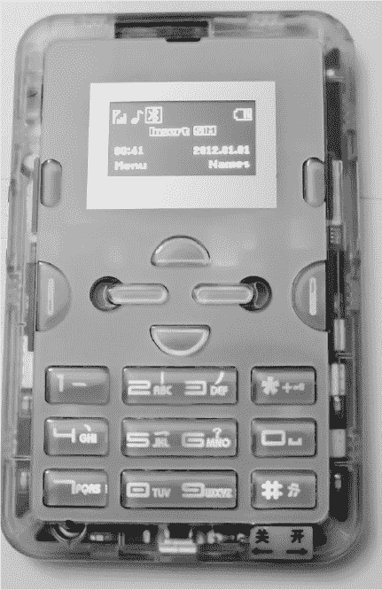
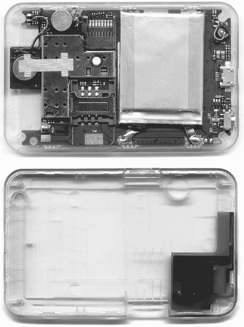
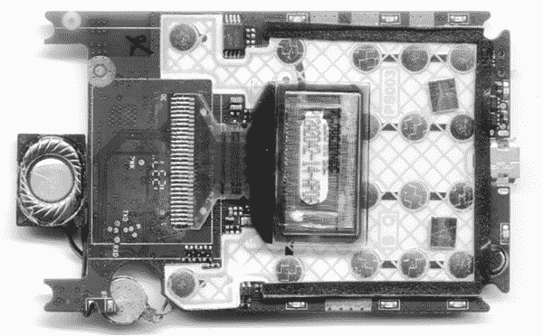
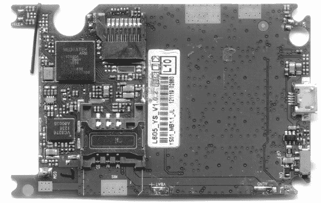
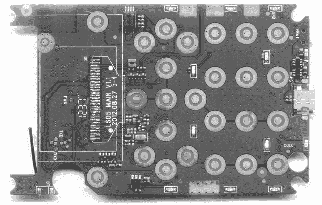
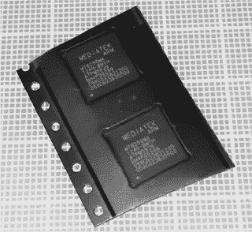
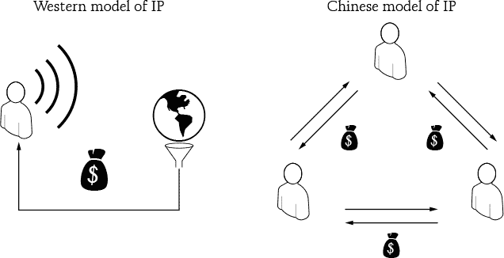
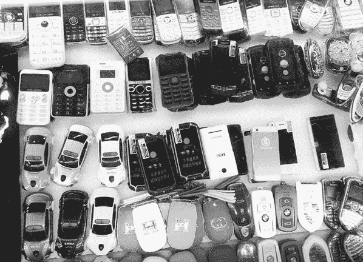

## 4. 公开创新

如果*知识产权*这个词对你来说听起来像个矛盾修饰法，那你不是唯一一个这么觉得的人。如果我给你一个苹果，并说：“这是你的苹果，”那是什么意思很清楚。你可以随意处置这个苹果：吃掉它、卖掉它，甚至用种子种一棵苹果树，结果收获更多苹果，然后再卖掉或用来喂养家人。但如果我给你一部手机，并说：“这部苹果 iPhone 是你的，”你拥有的只是手中那些原子集合，但对于与手机相关的软件、专利和商标——即知识产权——却几乎没有什么权利。不同于苹果，你不能拿到你 iPhone 里的东西，将那些知识当作种子来制造更多的 iPhone。

然而，知识产权在中国的运作方式完全不同。在那里，你可以（而且人们确实这么做）将手机作为你自己原创作品的种子。我在中国的两次经历让我意识到，处理知识产权并没有一种唯一的正确途径。

### **我摔坏了手机的屏幕，结果这真是太棒了**

我的第一个故事像许多我的冒险故事一样，开始于从出租车下车，来到福田口岸进入中国。那是 2014 年 5 月，我正前往深圳敲定 Novena 开放硬件笔记本的生产计划，更多内容将在第七章中讨论。刚下出租车，我的手被背包绳带挂住，手机跌向了水泥人行道。当手机砸在地面上时，我听到了屏幕破裂的干脆“啪”声。

没有什么地方比深圳的边境口岸更适合摔坏手机屏幕了。不到一个小时，我就以仅 25 美元（包括零件和人工费用）在华强北找到了熟练的技工安装了新屏幕。

我原本打算自己更换屏幕。手机仍然能用，于是我匆忙访问了 iFixit 网站，查找如何更换屏幕的详细信息，然后赶往华强北购买替换部件和工具。我去的摊位报价大约 120 美元来换个新屏幕，但店主突然从我手中抢过手机，通过在拨号界面输入 *#0*# 启动了内建的自检程序。

她确认我的 OLED 显示屏没有坏点，触摸屏仍然正常工作，只是摔裂了。然后她提出如果她的店铺能为我更换屏幕，她愿意购买我坏掉的 OLED 和触摸屏模块。我说这没问题，只要我能在旁边看着，确保他们不会换掉其他部件。

当然，他们对此毫不在意。不到 20 分钟，他们就把我的手机拆开，取下坏掉的模块，去除手机机身上的旧胶，重新粘贴新的胶，安装了一个“新的”（大概是翻新的）模块，然后将手机重新组装好。整个过程用了吹风机（当作热风枪）、大量接触清洁剂（用于软化胶水），以及一个很长的指甲（代替撬棒/吉他拨片）。不幸的是，我没法拍下这个过程，因为我本来用来拍照的设备正摊开在我面前。

这就是循环利用和修复的力量。我没有花 $120 去买一个新的屏幕，扔掉一个功能正常的电子零件，而是只付了更换破损玻璃的费用。我曾以为数字化触摸屏的玻璃和 OLED 是不可分离的，但显然深圳华强北的那些聪明人找到了一个高效的办法来回收这些零件。毕竟，模块的大部分成本都在于 OLED 显示屏。而触摸传感器电子元件——同样嵌入模块中的——并没有在摔落中受损。为什么要浪费完全可用的零件呢？

我的手机屏幕坏了整整一个小时，但修好它的费用却比把备用零件运送到新加坡（我的居住国）的运费还要低。像这样的经历让我思考：为什么在每个国家都没有这样的服务？是什么让深圳如此独特，以至于你可以在半小时内把坏掉的屏幕修好，且费用远低于一个月的手机账单？这一现象的出现有多方面的原因，其中大部分可以归因于一个群体——*山寨人*。

### **山寨作为企业家**

中国的山寨最初以生产类似 iPhone 的仿冒产品而闻名，因此历史上它们一直被主流媒体视为“山寨大亨”。但我认为，他们和像休利特和帕卡德，或者乔布斯和沃兹尼亚克这样的团队有某些相似之处，当时他们也在车库里工作。

#### **山寨人是谁？**

要理解我为什么这么想，首先需要理解“山寨”这个词的文化背景。山寨（山寨）源自中文中的“山中堡垒”，但字面翻译有些误导。英文中的“fortress”一词通常指的是一个大型的防御性结构或堡垒，可能让人联想到城堡塔楼和护城河。另一方面，它的含义其实是一个简单的加固地方，这更接近中文原意，指的是像洞穴或游击队风格的藏身之处。

在当代背景下，*山寨*是对那些生活在类似山寨的地方的人的历史性暗示，像宋江和他的 108 位好汉，他们是生活在 12 世纪的群体。我的一位朋友曾把宋江形容为“罗宾汉遇上切·格瓦拉”。他既是一个反叛者，也是一个命运多舛的士兵，但却无私且对需要帮助的人充满善意。这个故事至今仍然广受欢迎；我问我父亲时，他立刻就认了出来。

现代山寨创新者充满叛逆、个性鲜明、地下活动且自我赋能——就像宋江一样。他们的叛逆表现在他们因模仿产品而被称赞。他们的个性表现在他们对大公司有着强烈的反感。（许多山寨公司曾是大公司，既有美国的，也有亚洲的，曾因对雇主低效不满而离开。）他们的地下性表现在一旦某个山寨公司“合法化”并通过传统零售渠道直接做生意时，它们就不再属于山寨的圈子。自我赋能则体现在他们通常都是规模小、依靠最少的资本起步的公司，他们的态度是，“如果你能做到，我也能做到。”

预计到 2009 年，深圳约有 300 家山寨组织在运营。山寨店的规模从几个人到几百名员工不等。有些专注于如工具制作、PCB 设计、PCB 组装或手机外壳定制等工艺，而另一些则具有更广泛的能力。

由于山寨公司规模较小，它们必须高效运作以最大化产出。一家员工不足 250 人的小店每月可以生产超过 20 万部手机，并且产品种类繁多，有时一批产品的生产量仅为几百台。总体来看，2009 年深圳地区的山寨公司每月生产的手机估计达到 2000 万部。这相当于每月接近十亿美元的经济规模。这些手机大多销往印度、非洲、俄罗斯以及东南亚等第三世界和新兴市场。

#### **不仅仅是模仿者**

值得注意的是，山寨的产品组合不仅仅包括仿制手机。他们还会对设计进行创新和改造，制作原创产品。这些原创手机集成了像 7.1 声道立体声、双 SIM 卡、实用的香烟盒、高清镜头，或者内置紫外 LED 用于防伪钞检测等奇特功能。

山寨对硬件的处理方式类似于网络对混合编排的处理。那些既是玩具法拉利又是手表电话组合（配备摄像头！）的手机就是很好的例子：它们并不单纯地复制某个想法，而是将来自多个来源的知识产权混合在一起，创造出一种新的异质性组合，原始素材在最终产品中依然可以明显辨识出来。而且，像许多网络混合编排一样，结果可能对大众市场来说看起来荒谬（比如法拉利手机），但却对特定的小众市场非常相关。从某种程度上来说，一些山寨产品其实是走在时代前面；例如，我看到的那些手表电话，实际上早于智能手表几年来。


*顶部：一款外形像香烟盒的手机的正反面。

左下：一款基于 Android 的智能手表，与 Apple Watch 不同的是，它包含一个能够打电话的手机。右下：一款山寨设计的“婴儿 iPhone”，运行 Android 系统，旁边是为了对比大小放置的 Apple iPhone 6*。

#### **社区执行的知识产权规则**

山寨还采用了一种叫做*开放物料清单（BOM）*的概念：当一个山寨公司开发出新产品时，他们会与其他人共享物料清单和其他设计文档。如果该产品是基于已有的产品开发的，那么他们所做的任何改进也会共享。这些规则通过社区口耳相传来执行，以至于如果有人被发现作弊，他们会被山寨生态圈排斥。

这一系统在中国受到非常积极的看待。例如，我曾听一个本地人说，山寨不仅能复制 iPhone，还能通过为克隆机型提供用户可更换电池来改进原版。这种行为在美国法律中被视为非法和侵权，但鉴于网络上混合编排文化的繁荣，我不禁怀疑硬件混合编排是不是一件坏事。在美国确实有一种观念，如果它很奇怪并且发生在中国，那一定是不好的。这种偏见对客观评估一个可能最终与美国非常相关的文化现象投下了长长的阴影。

从某种意义上讲，山寨和经典的西方黑客创业者有相似之处，但带有鲜明的中国特色。我个人最喜欢的山寨故事是关于一个拥有三层楼房的家伙，他让我非常羡慕。他的卧室在顶楼，中间楼层是完整的 SMT 生产线，底层是零售商店，销售楼上一层生产的、楼上卧室设计的产品。真是一个垂直整合的供应链！拥有这样的基础设施肯定会改变我创新的方式。我可以节省生产成本，缩短原型制作时间，并且迅速周转库存，从而减少库存资本需求。如果我的商店位于高流量的城市区域，我还可以去除美国零售商通常要求的 20%到 50%的最低零售利润。

我有一个理论，认为当深圳的知识量和市场规模达到临界点时，中国人将不再仅仅是工人或模仿者。他们将掌握自己的命运，并最终成为创新的领导者。关于山寨和它们的混搭的故事，仅仅是冰山一角，它们有潜力改变商业运作的方式——或许不会在美国，但肯定会在那个庞大且未开发的市场中，这个市场常被称为“世界其他地方”。

### **12 美元手机**

混搭手机展示了山寨的创新精神和实验意愿。但尽管拥有各种花哨的功能，这些手机仍然非常实惠。那么，你可能会问，一个手机究竟能便宜到什么程度？

向东北角的华强北电子市场走一小段路，就能到达名通数字商城。这里是一个四层的迷宫，充满了各种小商店，售卖各种各样的手机，这些手机具有在缺乏稳定电力或有线网络基础设施的经济体中非常有用的功能。例如，有些手机凭借夸张的大电池可以使用一个月。还有些手机配有模拟电视调谐器、内置手摇充电器和多个用户档案，使得一个家庭或小村庄可以共享一部手机。

在 2013 年访问华强北时，我花了 12 美元买了一部完整的手机，配备了四频 GSM、蓝牙、MP3 播放、OLED 显示屏和用于界面的键盘。与智能手机相比，这些功能微不足道，但如果你外出时担心主力手机被弄湿或被盗，它还是非常有用的。对于几十亿人来说，这可能是他们唯一能够负担得起的手机。

请记住，这是无合约价格。在允许运营商锁定手机的国家，如美国，手机通常会以极低的价格赠送或出售给买家，以换取一份价值通常是手机几倍的订阅合同。我付$12 买到了一部无合约、非促销、解锁、全新带充电器、硅胶保护套和数据线的手机，这意味着手机的生产成本必然低于零售价$12。否则，手机制造商就会亏损。据传闻，它的成本低于$10。



*我这款简单而实用的$12 手机*

这个价格真是太惊人了。大约相当于一大份 Domino’s 芝士披萨的价格，或者在美国城市餐厅里一杯普通的葡萄酒的价格。与 Arduino Uno 相比，这价格甚至显得更便宜。诚然，这种比较有些不公平，但请耐心一下，看看两者的规格比较，见表格 1。

**表格 1：** 比较$12 手机与 Arduino

| **规格** | **这部手机** | **Arduino Uno** |
| --- | --- | --- |
| 价格 | $12 | $29 |
| CPU 速度 | 260 MHz, 32 位 | 16 MHz, 8 位 |
| 内存 | 8MiB | 2.5kiB |
| 接口 | USB, microSD, SIM | USB |
| 无线 | 四频 GSM，蓝牙 | — |
| 电源 | 锂聚合物电池，包含适配器 | 外部电源，无适配器 |
| 显示屏 | 双色 OLED | — |

怎么可能这款手机在规格上比 Arduino 还要好，价格却不到后者的一半？我没有答案，但我正在努力寻找答案。拆解手机后，我们获得了一些线索。

#### **$12 手机内部**

首先，这部手机没有螺丝。整个外壳是通过卡扣拼接在一起的。



*手机背面，拆开后盖*

里面几乎没有连接器。为了运输和存储，你可以切换开关来彻底断开电池。根据我所能判断，电池似乎也没有二次保护电路。不过，这款手机配备了背光键盘和四周的装饰性灯光等配件。



*从显示屏到电池的所有部件都直接焊接在主板上。*



*这块 PCB 板上到处都是小型装饰性 LED。*



*蓝牙天线是位于左下角的一小段电线。*

电子元件主要由两大集成电路组成：联发科 MT6250DA 和 Vanchip VC5276。MT6250 的售价传闻低于 2 美元。我通过向零售经销商购买了几片剪带的 MT6250，每片大约 2.10 美元，从而在某种程度上证实了这一价格*。这个价格打破了我曾经能在用于 Arduino 的 ATMega 芯片上得到的最佳价格。面对这样的价格竞争，西方公司正在提起诉讼以保护自己的市场份额：Vanchip 与 RF Micro 公司发生了一些法律纠纷，联发科也遭遇过几起诉讼。



*两颗联发科 MT6250 IC*

当然，你不能仅仅打电话给联发科去购买这些芯片。通过“正门”与他们合作进行设计是极其困难的。然而，如果你懂一点中文，并知道一些正确的网站，你就可以下载与这款手机相似的电路图、板布局和软件工具，可能还会有一些不同的零部件……而且是“免费的”。*免费的*需要加引号，因为你可以获得源代码，但并不意味着你有明确的法律使用权，因为源代码在没有获得版权持有者明确法律同意的情况下分发。但任何不关心或不熟悉这种法律框架的人都可以以最少的现金投入制造出这款手机的版本。它感觉像开源，但其实并不是：这是一种不同类型的开放生态系统。

#### **介绍 Gongkai**

欢迎来到中国“开放”源代码的加拉帕戈斯。我称之为*gongkai*（公开），这是“open”在“open source”（开源）中的中文音译。虽然有“open source”的字面翻译成中文为*开源*，但*gongkai*实践和西方开源实践唯一相似之处在于，它们都允许你下载源代码；但推动这种共享的法律和文化框架却截然不同。这就像趋同进化，两个物种可能表现出相似的特征，但它们的基因和祖先完全不同。

Gongkai 是指那些带有“机密”和“专有”标签的版权文档，有时被公之于众并公开共享，但并不一定符合法律的字面要求。这种复制并不是像电影或音乐的复制那样单向的价值流动。相反，这些文档是构建使用版权拥有者芯片的手机所需的知识基础，共享这些文档有助于推广他们的芯片销售。最终，版权持有者和复制者之间存在一种互惠互利的关系。



*比较知识产权模式。左边是西方的“广播”模式，由单一所有者控制和传播知识产权，并从社会中获得报酬。右边是中国的“网络”模式，知识产权像商品一样易于交换，支付通常是实物或作为人情回报。*

公司与企业家之间这种灰色的关系只是东西方文化差异的一个体现。西方对知识产权和所有权持有“广播”观念：好的创意和创新归功于明确指定的一组作者或发明者，社会为他们的创新和贡献支付版税。而中国则持有“网络”观念：要想拥有创造好创意和创新的眼光，必须站在他人的肩膀上，而人们通过互相交换这些创意来获取利益。在一个对知识产权态度宽松的体系中，与网络共享是必要的，因为明天你的朋友可能站在你的肩膀上，而你将需要向他们寻求帮助。

然而，在西方，法治使得知识产权能够在长期积累中形成，从而创造出难以攻破的垄断地位。这对处于顶端的人来说是有利的，但对新兴公司却是困难的，导致了像现代西方手机市场这样的局面。像苹果和谷歌这样的公司制造出优秀的手机，质量卓越，而初创公司只能希望为他们的生态系统打造一个“应用配件”。

我已经审阅了超过 100 个硬件初创公司的商业计划，大多数公司的基础都是以过时的工艺技术制造的高价芯片。我自己也不例外；Novena 使用的是 Freescale（现为 NXP，经过收购）i.MX6 处理器，在我设计这款笔记本时，它既不是市场上最便宜的，也不是最快的芯片。但它有两个至关重要的特点：任何人都可以自由下载几乎完整的文档，任何人也可以在 Digi-Key 上购买它。

缺乏前沿技术的文档和供应，迫使西方硬件企业家主要依赖 Arduino、Beaglebone 和 Raspberry Pi 作为他们好创意的起点。而中国的企业家则几乎以惊人的速度推出新的手机。



*这里展示的每一件物品都是一部手机。*

手机型号是季节性变化的。企业家们不断进行实验，把一些古怪的功能集成到手机中，比如香烟点烟器、大容量电池（用于给第二部手机充电）、大按钮（为视力障碍者设计）、仅限紧急呼叫的“回家”按钮（给孩子们用）、手表形式等。这种做法之所以可行，是因为小团队的工程师可以获得完整的手机设计包——包括外壳、主板和固件——让他们能够对设计进行分支，只专注于改变他们真正关心的部分。

作为一名硬件工程师，我希望能够做到这一点。

我希望能够自行修改现有的手机设计。我看到了那款 12 美元的手机，我也想用一个 364 MHz 的 32 位微控制器，配备数兆字节的集成 RAM 和数十个外设，而这款微控制器的单价为 3 美元。相比之下，Arduino Uno 的 ATMega 微控制器，它的主频为 16 MHz，只有几千字节的 RAM 和少量外设，显得相形见绌，但价格却是它的两倍，达到了 6 美元。

#### **从公开到开源**

所以，我决定将对手机的研究从拆解更进一步，尝试制作自己的版本——以山寨风格为基础，但通过西方的视角来解读。这就是我和 Sean “xobs” Cross 启动一个名为*Fernvale*的项目的原因。自从我们在 Chumby 首次相遇以来，Sean 一直是我在多个项目中的冒险伙伴，当时我发现了他作为固件工程师的才华，他向我展示了如何在业余时间将《雷神之锤》移植到 Chumby 上。Sean 一直是个不拘一格的人。他出生在德国，父母是美国人，在大学里学习认知科学，在进入 Chumby 之前，他花了六个月在新西兰和澳大利亚游荡，寻找冒险和工作。在 Chumby，他很容易被认出来，因为他留着马尾辫，穿着苏格兰裙（实际上是 Utilikilt）。

在 Chumby 破产后，我和 Sean 发现我们漂泊到了新加坡的海岸，我在那里创办了一家名为 Sutajio Ko-Usagi 的小型硬件咨询公司，*bunniestudios*是它的日文翻译并经过罗马字母化后转写成英文字符。Sean 卓越的编程能力与我在硬件设计方面的技能相得益彰，从那时起，我们完成了几个重要的开源项目。

我们一开始认为，至少应该尝试“从正门”进入，直接向芯片制造商咨询，看看获取用于这些山寨手机的西方授权嵌入式开发工具包（EDK）需要什么条件。然而，我们的询问遭遇了冷遇。有人告诉我，我们的小实验量太小，或者我们必须签订带有数十万美元巨额现金存款的最小购买协议。

即使是那些愿意通过这些复杂程序的人，这些 EDK 也不包括中国人可以使用的所有参考资料。数据表不完整，而且你被迫使用公司的专有操作系统移植版。这就像是好人总是最后一个到达终点。我们能否找到一种方法，既能领先一步，又能保持公平竞争呢？

#### **工程师也有权利**

因此，Fernvale 有两个部分：技术任务是对手机进行逆向工程和重新设计，法律任务是制定一种通用的方法论，将**公开**知识产权（gongkai IP）吸收到西方生态系统中。我将在第九章中叙述技术任务，并在本章剩余部分专注于法律任务。

在对法律框架和挑战进行一些研究后，我认为我找到了一个途径，可以将 gongkai 的一部分知识产权带回适当的开源领域。然而，我必须声明：我不是律师。我会告诉你我的看法，但请不要将其视为法律建议。*

我与 Fernvale 的基本思路是谨慎而有教育意义地行使逆向工程的权利，以增加如果情况紧急，法院会支持我行动的可能性。但我也觉得，仅仅因为逆向工程有争议就回避它，是一条滑坡路：要拥有自己的权利，必须行使它们。如果女性不投票，黑人因为害怕争议而坐在公交车的后排，美国至今仍会存在种族隔离和没有普选权的问题。虽然逆向工程相对于种族平等和普选权来说是一个微不足道的问题，但先例已经很明确：要拥有权利，你必须勇敢地站出来并主张它们。

##### 处理专利和其他法律问题

开源面临两类广泛的知识产权问题：专利和版权。专利问题非常复杂，最实际的做法似乎就是在这个问题上采取回避的态度。例如，直到目前为止，我所知道的没有人会在提交 Linux 代码之前检查是否存在专利侵权，事实上，许多公司在工程层面也有类似的政策。

为什么？确定哪些专利适用以及产品是否侵犯专利需要大量资源。即使投入了这些资源，也无法百分之百确定。此外，深入了解专利文献会增加任何侵权行为被认为是故意的可能性，从而增加赔偿金额。最后，甚至不清楚侵权的责任到底在哪里，特别是在开源的背景下。

因此，肖恩和我尽力避免与 Fernvale 发生专利侵权，但我们无法百分之百确定不会有人提出侵权指控。然而，我们确实为我们的工作申请了一个许可证，其中包括一个“毒丸”条款，旨在应对那些可能尝试提起诉讼的专利持有者。毒丸条款使任何提出侵权诉讼的各方无法使用整个开源作品。*

对于版权问题，也同样复杂。电子前沿基金会（EFF）的“程序员权利项目”有一个关于逆向工程的常见问题解答^(†)，如果你真想深入了解这些问题，那是一篇值得阅读的文章。简而言之，法院认为，逆向工程用于理解嵌入代码中的思想并实现互操作性属于合理使用。因此，任何人都有权研究 gongkai 风格的知识产权，理解它，创作新作品，并为其申请西方风格的开放知识产权许可。

然而，在我可以解决 Fernvale 的版权问题之前，我必须确保我们不会碰到其他可能妨碍我们公正使用权的法律。首先是数字千年版权法案（DMCA）。DMCA 规定，绕过任何旨在强制执行版权的加密技术基本上是非法的，只有少数未经充分测试的例外情况允许。由于 Sean 和我下载的文件或二进制文件都没有加密，也没有通过任何技术措施进行访问控制，因此我们不需要进行任何绕过操作。没有绕过，就没有 DMCA 问题。

我们获得的所有文件都来自于链接到公共服务器的搜索，因此不会有计算机欺诈和滥用法案（CFAA）的问题。我们在工作中使用的所有设备都没有附带收缩包装、点击协议或其他终端用户许可协议（EULA）、使用条款或可能放弃我们权利的其他协议。

##### 处理版权问题

在解决了 DMCA、CFAA 和 EULA 的顾虑之后，我们终于能够解决核心问题：如何处理版权问题。

我们方法论的基石基于几次法院的判决，法院指出事实不可享有版权。例如，O'Connor 法官在*Feist Publications, Inc.诉 Rural Telephone Service Co., Inc.*（449 U.S. 340, 345, 349 (1991):*案中写道：

常识告诉我们，100 个无法版权保护的事实在聚集在一起时不会神奇地改变它们的状态……解决这种矛盾的关键在于理解为何事实无法享有版权：版权的必要条件是原创性。

而且：

尽管存在有效的版权，后续编译器仍然可以自由使用他人出版物中的事实来帮助准备竞争性作品，只要竞争性作品没有采用相同的选择和排列。

基于这一观点，任何人都有权从专有文档中提取事实，并在自己的选择和安排中仔细重新表达这些事实。就像“John Doe 的电话号码是 555-1212”和“John Doe 的地址是 10 Main St.”这些事实不能享有版权一样，“中断控制器的基地址是 0xA0060000”和“位 1 控制 LCD 的状态报告”等事实也不能享有版权。Sean 和我从数据表中提取了这些事实，并在我们自己的头文件中重新表达它们，在那里，作为新创建的表达性作品的合法所有者，我们应用了自己选择的适当开源许可证。

##### 创建一门编程语言

但情况因硬件模块而变得更加复杂，许多模块我们完全没有文档。在某些情况下，我们甚至无法通过数据手册了解一个模块的寄存器含义或模块如何工作。对于这些模块，我们提取并隔离了负责初始化其状态的代码。然后，我们将这些代码简化成地址和数据对的列表，并用我们自己称之为 *scriptic* 的自定义脚本语言表达。我们发明了自己的语言以避免潜在的无意识抄袭——读一段代码后，从记忆中写出几乎完全相同的代码实在太容易了。通过将代码转换成一种新的语言，我们被迫重新审视所呈现的事实，并以原创的方式表达它们。

Scriptic 本质上是一组汇编宏，语法非常简单。下面是一个 scriptic 脚本的示例：

```
#include "scriptic.h"
#include "fernvale-pll.h"

sc_new "set_plls", 1, 0, 0

  sc_write16 0, 0, PLL_CTRL_CON2
  sc_write16 0, 0, PLL_CTRL_CON3
  sc_write16 0, 0, PLL_CTRL_CON0
  sc_usleep 1

  sc_write16 1, 1, PLL_CTRL_UPLL_CON0
  sc_write16 0x1840, 0, PLL_CTRL_EPLL_CON0
  sc_write16 0x100, 0x100, PLL_CTRL_EPLL_CON1
  sc_write16 1, 0, PLL_CTRL_MDDS_CON0
  sc_write16 1, 1, PLL_CTRL_MPLL_CON0
  sc_usleep 1

  sc_write16 1, 0, PLL_CTRL_EDDS_CON0
  sc_write16 1, 1, PLL_CTRL_EPLL_CON0
  sc_usleep 1

  sc_write16 0x4000, 0x4000, PLL_CTRL_CLK_CONDB
  sc_usleep 1

  sc_write32 0x8048, 0, PLL_CTRL_CLK_CONDC
  /* Run the SPI clock at 104 MHz */
  sc_write32 0xd002, 0, PLL_CTRL_CLK_CONDH
  sc_write32 0xb6a0, 0, PLL_CTRL_CLK_CONDC
  sc_end
```

这个脚本初始化了 Fernvale 项目中目标芯片（MediaTek MT6260）的相位锁定环（PLL，产生时钟波形的电路）。为了对比，下面是该 scriptic 代码片段来源的代码的前几行：

```
// enable HW mode TOPSM control and clock CG of PLL control

*PLL_PLL_CON2 = 0x0000; // 0xA0170048, bit 12, 10 and 8 set to 0
                        // to enable TOPSM control
                        // bit 4, 2 and 0 set to 0 to enable
                        // clock CG of PLL control
*PLL_PLL_CON3 = 0x0000; // 0xA017004C, bit 12 set to 0 to enable
                        // TOPSM control

// enable delay control
*PLL_PLLTD_CON0= 0x0000; // 0x A0170700, bit 0 set to 0 to
                         // enable delay control

// wait for 3us for TOPSM and delay (HW) control signal stable
for(i = 0 ; i < loop_1us*3 ; i++);

// enable and reset UPLL
reg_val = *PLL_UPLL_CON0;
reg_val |= 0x0001;
*PLL_UPLL_CON0 = reg_val; // 0xA0170140, bit 0 set to 1 to
                          // enable UPLL and
                          // generate reset of UPLL
```

原始代码实际上有很多页，甚至这个代码片段周围还包含了条件语句，我们将其去除，因为它们与正确初始化 PLL 无关。

我们的权利知识、一个可以提取事实的文档库以及 scriptic 是我们工具箱中的法宝。借助它们，Sean 和我为我们的 Fernvale 项目提供了足够的功能，最终启动了一个名为 NuttX 的小型 BSD 许可的实时操作系统（RTOS），并运行在我们自己定制的硬件上。我将在第九章中详细讲解我们是如何做到这一点的。

### **结束语**

如果不积极行使，权利会萎缩并被相互竞争的利益挤压。Sean 和我做 Fernvale 是因为我们认为行使我们的合理使用权去逆向工程并创造可互操作的开源解决方案是至关重要的。数十年来，工程师们一直袖手旁观，看到越来越多的专利和版权法缩小了他们自由学习和创新的空间。我为我小时候的创客时光不再是下一代工程师合法选择的现实感到难过。

山寨的崛起以及他们惊人的能力是一个警钟。我认为这是一个证据，表明宽松的知识产权环境能激发创新，尤其是在基层层面。如果更多的工程师了解并积极、故意地行使他们的合理使用权，也许这能催生出对专利和版权系统进行更大规模、急需的改革。我们的 Fernvale 项目希望只是一个路标，指引着更大的努力，弥合公开和开源社区之间的鸿沟。

能够将公共领域（gongkai）的积极方面挑选融入到西方知识产权（IP）生态系统中是一个重要的工具。法治有其应有的地位，而过于宽松的制度也存在自身的问题。下一章将探讨过于宽松的知识产权生态系统的一些负面后果：假冒和伪劣商品。
