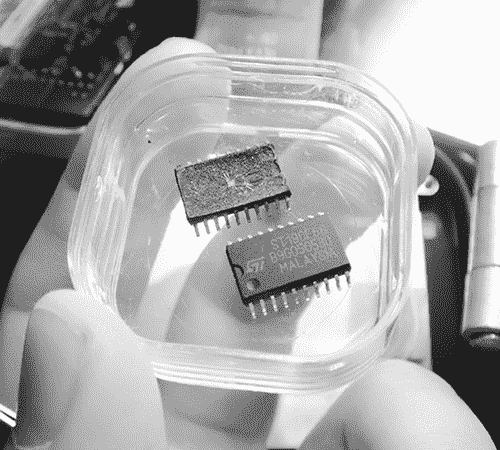
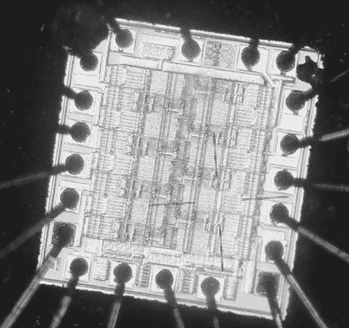
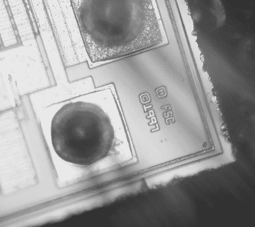
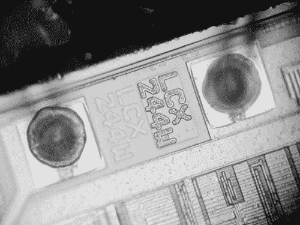
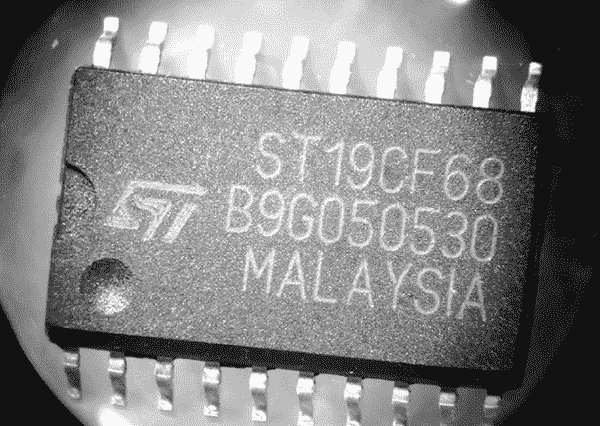
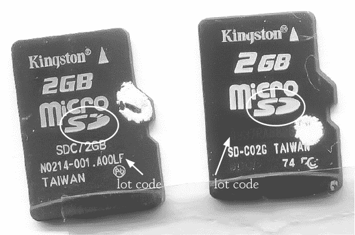
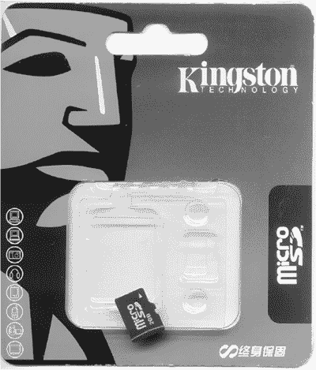
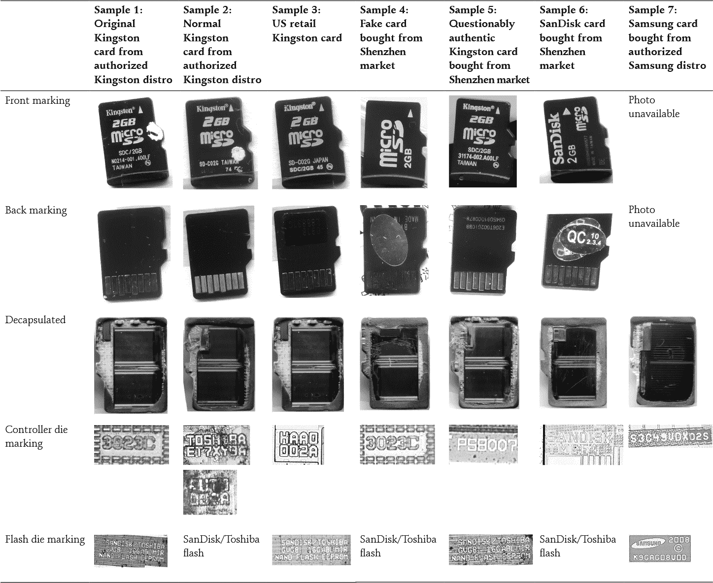
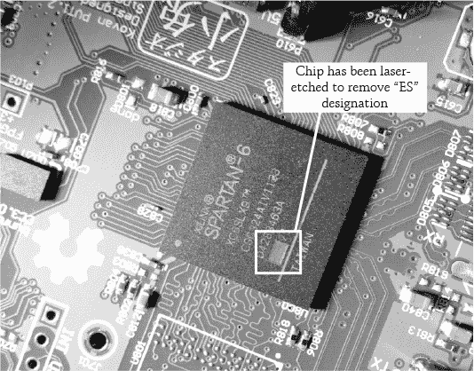
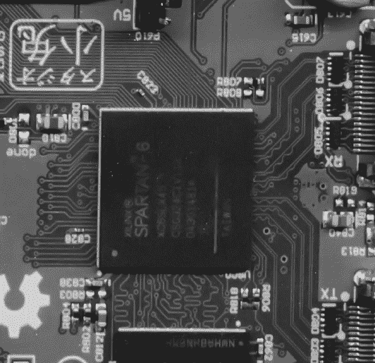

## 第五章：5. 假冒商品

公开系统在中国催生了大量的创新，山寨厂商能够制作有趣的原创产品，就像我在第四章中展示的手机一样。话虽如此，中国确实生产了大量的假冒电子产品，而且并非所有的都是仿制版的 iPhone。巧妙的伪造者能够制造出假冒的集成电路，包括 microSD 卡甚至是 FPGA。

### 精良伪造的芯片

例如，在 2007 年（当时我还在 Chumby 工作）我遇到了一些伪造的芯片，制作得非常精良，直到进行调查，我才确定它们是假货。



*来自亚洲来源的两颗可疑芯片样本*

这些芯片声称是 ST19CF68，是 STMicroelectronics 生产的芯片，在其数据表中描述为“基于 CMOS MCU 的智能卡 I/O，带有模块算术处理器。”ST19CF68 芯片通常以*智能卡*（例如信用卡前面的芯片）或*切割晶圆*（将硅晶圆切割成单独的芯片，但没有其他封装）的形式出售，但奇怪的是，这些芯片是 SOIC-20 封装的。为了找出这种奇怪封装选择的原因，我将其中一颗芯片的黑色环氧树脂封装溶解，以便用显微镜检查内部的硅片。

封装内的芯片片段过于小巧和简单，无法匹配 ST19CF68 所描述的复杂微控制器单元（MCU）。芯片上金色矩形的图案过于粗糙；我在低倍放大下通过光学显微镜能够分辨出单个晶体管。这些特征的尺寸被称为芯片的*工艺几何*。智能卡的工艺几何通常会比最先进的 CPU 落后三到四代，这使得即使在最高倍数的放大下，也很难分辨出晶体管。



*假冒 ST19CF68 芯片内部的硅片*

除了意外粗糙的工艺几何外，为什么这款零件有 20 个可焊接焊盘和 20 个引脚，而根据数据表，它应该只有 8 个焊盘？对芯片进行更高倍放大后，揭示出了一些有趣的细节。



*芯片制造商和版权日期*

结果表明，这款芯片并非由 STMicroelectronics 制造！硅片上的标签显示*FSC*，表明它是由 Fairchild Semiconductor 制造的。当然，我还需要检查硅片上的零件标签。



*发现真实的零件编号*

该芯片内部的芯片片段被证明是 Fairchild 74LCX244，这是一种“低电压缓冲器/线路驱动器，具有 5V 容忍的输入和输出。”74LCX244 是一款比该封装应包含的 ST19CF68 便宜得多的硅片。

当然，脚位数不匹配是可疑的，但制造商已经知道会将芯片放入更大的封装中，特别是在芯片的早期生产阶段，直到它被尺寸优化为止。真正让我感到震惊的是封装和标记的逼真质量。

通常，重标或伪造的芯片看起来比这个更低劣。原始芯片被打磨掉或喷漆以去除之前的标记，新标记通常是用丝网印刷涂料应用上去的。

但这些芯片完全没有显示出任何重标的迹象。标记是首次生产的质量：某人获取了未标记的 74LCX244 芯片，并将生产激光刻录机编程，以便在原本未使用的封装上加上高质量的伪造标记。他们甚至将*ST*徽标的比例做得非常准确。



*伪造的 ST19CF68 外观特写*

重标芯片与首次生产的标记之间的质量差异，就像用喷漆掩盖汽车划痕与汽车原厂新漆之间的质量差异。这款芯片无疑有着“新车”般的外观。

这一发现让我留下了许多未解的问题。某人是如何获得未标记的费尔柴尔德硅片的？那个人是内部人士吗？还是费尔柴尔德粗心大意地丢弃了未标记的废品芯片，没有将它们磨碎或剪掉引脚，以至于它们可以被捡起并转售？用来制作这些标记的激光刻印机也不是便宜的桌面刻录机；它必须是高功率的光栅刻录机，而且图案精确无误。

我仍然难以相信那些伪造芯片是被制造和出售的，但或许我不该这么想。我在 SEG 电子市场看到过肆无忌惮的双列直插内存模块（DIMM，个人电脑中的内存）重标，市场上许多伪造商公开展示着他们的专业级热转印标签打印机和全息贴纸空白标签。

如果这种质量的伪造品变得更加普遍，它们可能会对供应链构成问题。显然，制造伪造 ST19CF68 的人几乎能伪造任何芯片，而且这些伪造品正在逐渐出现在美国市场上。转售商，特别是那些专门购买过剩制造商库存的分销商，通常会默认为芯片上的标记是可信的。

我认为芯片制造商不会在芯片标记上增加防伪措施，但这些伪造品的质量确实让我在发现它们时感到警惕，而且至今仍然如此。并非所有的伪造品在使用前都会被发现，而假冒组件在任何出现的项目中都会带来问题。

### 美国军用硬件中的伪造芯片

假冒芯片在进入军事项目时尤为棘手。美国军方有一个独特的问题：它是全球最大的、最富裕的采购老旧零件的买家之一，因为军事设计的使用寿命可以长达几十年。和其他任何事物一样，零件越旧，越难找到，有时承包商会买到假冒品。例如，2011 年参议院听证会报告透露，部分用于 P-8 海神（美国海军向波音公司订购的飞机）的零件，如《国防技术》网站的一篇文章所称，是“翻新得很差”，导致关键系统发生故障。

美国政府试图通过 2012 财年《国防授权法案》第 1092 号修正案（H.R. 1540）减少供应链中的假冒产品。该修正案是一个出于良好意图，但却有些误导的条款，列出了旨在减少美国军方供应链中假冒芯片流通的措施。

即使在第 1092 号修正案提出之前，《国防授权法案》因一项允许美国军方无限期拘留美国公民且无需审判的条款而受到批评。讽刺的是，该条款还要求对美国联邦政府欠中国的债务进行评估，视其为潜在的“国家安全风险”（H.R. 1540 第 1225 条）。

根据反假冒修正案，首次违法者可能会面临 500 万美元罚款和 20 年监禁的惩罚，个人罚款为 500 万美元，企业则可能面临 1500 万美元罚款——这一处罚与贩卖可卡因的处罚相当。*虽然该修正案明确将*假冒*定义为将翻新零件冒充为全新零件，但其措辞不幸地含糊不清，未明确指出是否只有故意贩卖此类商品的人才会承担如此严厉的惩罚。

如果你拿到一枚脏兮兮但未经伪造的硬币，并把它清洗干净使其看起来像新的一样，没人会指责你伪造。然而，该修正案不仅对伪造用于军事用途的芯片行为施加 20 年监禁和 500 万美元罚款，而且有可能对那些无意中分销翻新芯片的人施加相同的处罚，尽管他们本来是将这些芯片当作全新商品购买的。不幸的是，在很多情况下，电子零件可以使用多年而没有外部磨损的迹象。

该修正案还包含了一项创建“检查计划”的条款：

(b) 进口电子零件的检查 —

(1) ... 国土安全部部长应当建立一个由美国海关和边境保护局加强的检查程序，专门检查来自任何被国防部长认定为假冒电子零件重大来源的国家进口的电子零件 ...

检查水果和蔬菜进入国家时是否有害虫或其他问题是合理的，但要求海关官员成为检测假电子元件的专家似乎是误导性的。在伪造者能够轻松制造出高质量的假货的情况下，把检测假货的责任推给供应商，且失败会面临如此高的处罚，也是错误的。

#### 假冒零件的类型

为了更好地理解芯片伪造问题的严重性，让我们看看假货是如何制造的。我见过的假芯片大致可以分为以下几类。

##### 外部模仿

最简单的假冒芯片仅仅是外观看起来真实的塑料外壳，或者是只有物理特征相同的重新标记的零件。例如，一个简单的晶体管-晶体管逻辑（TTL）芯片可能被放置在同一个包装内，并带有与昂贵的微控制器相同的标记。

我认为外部模仿是微不足道的，因为这种方式生产的假货在工厂测试中很容易被发现。最坏的情况是，你被卖了一些大部分是正品的零件，只有少数是伪造的，因此仅仅测试一根管子或卷盘中的一个零件是无法发现问题的。但大多数产品在系统级别上进行百分之百的测试，所以通常问题在任何东西离开工厂之前就会被发现。

##### 翻新零件

然而，假冒产品并不一定非得是完全假的。翻新零件是从电子废料中拆卸出来的正品芯片，经过再加工后看起来像新的一样。它们非常难以辨别，因为芯片本身确实是正品，且经验丰富的翻新商可以制作出外观如新的芯片，只有通过同位素或元素分析才能识别出它们是曾经使用过的。

这一类别还包括那些“新”的零件，它们从未焊接到电路板上，但可能因为存储不当（例如在潮湿环境中）而变质。此类芯片应该被报废，但有时它们被放入带有较新日期代码的全新铝箔包装中，作为新产品出售。

##### 重新标记的零件

假冒者有时会将从未使用过的正品零件（因此可以归类为新产品）重新标记为更高版本的零件。一个经典的例子是将 CPU 磨光并重新标记为更高的速度等级，或者更简单地，将含铅的零件标记为符合 RoHS 标准。

但是重新标记（rebinning）可以变得更加复杂。供应商可能通过逆向工程和重新编程标记芯片内部的保险丝代码，使得芯片的电子记录与顶部伪造的标记实际匹配。供应商还曾通过黑客技术修改闪存驱动器固件，使主机操作系统将小内存识别为更大的内存。这类黑客技术甚至能够“循环”内存，使得超出设备容量的写入操作看起来像是成功的，从而需要费时的完全读取和比较写入的数据来检测问题。

##### 幽灵零件

一些假冒产品是在与正品相同的制造设施上生产的；它们通常是在深夜由不法员工在未经制造商授权的情况下进行生产，且从未记录在账簿上。这些未记录的生产批次被称为*幽灵班次*。这就像在铸币厂，一名员工在下班后打了额外的硬币。幽灵班次的零件通常会被分配一个与合法生产批次相同的批号，但某些测试步骤被跳过。

幽灵班次通常使用正品生产过程中剩余的边角料，这些材料本该被丢弃，却在送往粉碎机途中被截获。因此，这些材料的标识和特征通常看起来完全正宗。这些假冒产品非常难以察觉。

##### 工厂废料

工厂的次品和原型板可以通过小额贿赂从废料堆中回收，假如它们有正品标记，并重新出售为全新产品。为了避免被发现，工人们通常会将回收的废料替换成外观完全相同的虚假包装，从而使得审计废料的尝试失败。这种用虚假替代品替换可回收废料的做法，推动了“外部模仿”假货市场的形成。一个供应低质量假货的行业，能够规避本应禁止高质量假货的审计，这表明了假冒行业的复杂性和成熟度。

##### 第二来源失败

*第二来源*是业界标准做法，竞争对手为热门产品创建兼容替代品，以推动价格竞争并加强供应链抵御自然灾害等事件。当劣质零件被贴上高端品牌标志时，这种做法就会变坏。

高价值但功能简单的离散模拟芯片，如电源调节器，尤其容易受到这一问题的影响。美国品牌的高端电源调节器有时价格是亚洲品牌替代品的 10 倍。然而，亚洲品牌的部件以质量参差不齐、偷工减料和参数性能差而闻名。显然，假冒者有充足的机会通过购买无标记的芯片，并用看似正品的美国品牌标记重新标记它们，从而赚取大量金钱。在某些情况下，除了对芯片进行去壳处理并比较掩模图案和横截面，就没有便宜或快速的测试方法可以检测到这些假冒产品，就像我为 ST19CF68 所做的那样。

#### 假冒和美国军用设计

假冒方法种类繁多，再加上许多商品零部件的生产周期通常只有几年，这给像美国军方这样的机构带来了大问题，因为这些机构的设计生命周期往往以几十年为单位衡量。这就像要求某人今天使用仅有的全新部件，且不允许使用任何二手或翻新部件，来建造一块 NeXTcube*主板。我认为这是不可能的。

这种情况的不可能性有时可能导致军事承包商在使用假冒零件时变得共谋，产生不良后果。在 P-8 海神号的案例中，人们迅速将责任指向中国，但通过简单的视觉检查，可能就能发现翻新工作不当的问题。问题的部分原因可能是某个分包商在检查进货库存时疏忽了——或者可能是睁一只眼闭一只眼。如果这些零件是世界上最后一批那样的零件，那么还能做什么呢？

我的猜测是，任何二手电子产品经销商的库存中，早已充斥着未经察觉的假冒品。记住，只有那些劣质的假货才会被发现，而芯片包装并没有考虑到反假冒措施。虽然所有灰色市场的零件都值得怀疑，但这不一定是坏事。

灰色市场在电子产品生态系统中发挥着重要作用；使用灰色市场是一个经过计算的，但有时无法避免的风险。事实上，许多灰色市场的商贩非常直率地承认他们的商品是回收的。许多人甚至在摊位上张贴广告标牌，标明这一事实。然而，这些标牌是用中文写的。在这种情况下，责任应该由谁承担——卖家因为出售回收商品，还是买家因为无法读懂标牌？

#### 反假冒措施

假冒芯片的情况混乱不堪，但一些简单的措施可以解决这一问题。

##### 物理标识符

在批准用于军事用途的芯片中嵌入反假冒措施是一种选择。对于宽度大于 1 厘米的芯片，可以通过在芯片包装设施中相对常见的设备激光刻印唯一的二维条形码。尽管条形码的尺寸极小，但它们背后有 100%唯一性的保障。这些技术在生物技术中非常有效，例如 Matrix 2D 系统用于追踪生物实验室中一次性样本管。

另一个潜在的解决方案是将紫外线染料混入组件的环氧树脂中，使其在暴露于*回流*温度时改变荧光特性——回流温度是焊料熔化时的一组一致的、明确的温度。这使得在芯片第一次焊接后，无法将其重新加工成“新”状态。如果染料分布在整个封装体内，仅用表面打磨是无法去除的。

##### 改变电子废物的处理方式

更有效地管理电子废弃物也将缓解假冒问题。电子废弃物大量收集用于二手零件。未经精细拆焊的 MSM 系列芯片——许多安卓智能手机的大脑，由高通生产并以“Snapdragon”品牌销售——按磅购买，价格约为每颗芯片 10 美分。假冒者清理这些芯片，*重新焊球*（即为球栅阵列封装添加新的焊球），有时还会重新标记它们，将其放入带状卷盘中，并作为全新产品出售，售价是原购价的 10 倍。一批翻新的芯片可以赚取数千美元，这使得这一做法成为熟练工人的一个有吸引力的收入来源，他们在工厂做同样的工作时每月可能只能赚 200 美元。*（工厂通常被授权回收那些无法修复的损坏板卡或消费者退货的芯片。）

如果美国停止将电子废弃物运往海外处理，或者至少在运输之前将这些零件粉碎，那么翻新芯片市场的供应将会减少。国内电子废弃物处理还将创造更多就业机会，这是一种与黄金一样宝贵的资源。

另一方面，我认为从长远来看，组件级回收对环境和人类生态系统非常有益。大多数电子零件在消费者丢弃后仍能完美工作多年，新兴经济体则创造了无法负担在主市场购买新零件的技术需求市场。

##### 保持正品零件储备

确保关键军事硬件可信度的最终选择之一可能是建立一个零件的战略储备。军事飞机的生产批次可能只有几百个单元，相较于消费电子产品的生产批次，这是一个较小的数量。我想，某个零件的生命周期需求，包括替换品，可能仅限于几万单元。从物理上讲，零件储备并不难以管理：10,000 颗芯片可以装进一个大鞋盒里。

从财务角度来看，我估计为关键航空电子系统购买替换零件的储备，只会增加飞机成本的一小部分。这甚至可能带来长期的节省，因为制造商可以通过一次性大批量生产来实现更大的规模效益。

显然，防伪措施在民用项目中也将非常有用。我对任何必须处理假冒零件的人深感同情，因为我自己也曾多次遭遇过类似问题。这是我在处理 chumby One 时遇到的一个特别恼人的问题。

### 假冒的 MicroSD 卡

2009 年 12 月，在 chumby One 的生产过程中，我开始进行法医调查，试图找出一些不规则的金士顿内存卡背后的真相。工厂打电话告诉我，有一批 chumby One 的 SMT 良率大幅下降，于是我开车过去看看能做些什么来解决问题。经过一番检查后，我意识到所有出现故障的单元都使用了来自特定批次的金士顿 microSD 卡。我让工厂把整批 microSD 卡从生产线上拉下来，并重新加工那些使用了这些卡的单元。更换卡片后，良率恢复正常。

故事应该就此结束。在这种情况下，我通常会从制造商那里获得退货授权（RMA）以处理有缺陷的零件，交换掉不合格的部件，然后继续进行。但我遇到了几个问题。

首先，金士顿不会接受这些卡片，因为我们已经对其进行了编程。其次，这批卡片有很多缺陷（大约有 1000 张，而 chumby 已经深度缺货），而内存卡并不便宜。当时这种类型的内存卡大约价值 4 到 5 美元，如果我们无法更换它们，将会造成几千美元的废料。Chumby 无法忽视几千美元的损失，所以我开始进入法医模式。

#### 可见的差异

外部标记的不规则性是我注意到的第一个可疑特征。



*不规则 microSD 卡（左）和正常卡（右）。

箭头和圆圈标出了可疑的差异。*

最奇怪的物理差异是，不规则卡片上的批次代码与主标志使用了相同的丝网印刷模板。丝网印刷批次代码并不罕见，但通常情况下，制造商不会使用相同的模板来印刷批次代码和标志。批次代码的颜色、字体或对齐方式应与其他文字有所不同。这批不规则卡片的批次代码也完全相同（N0214-001.A00LF）。通常情况下，批次代码至少会在每几百张卡片中更换一次。与之对比的是正常卡片，它们的批次代码是激光标记的。正常卡片的批次代码在每个 96 单元的托盘中都有所不同。

第二个奇怪的特征则更微妙，也许并不致命：microSD 标志上的不规则性。像金士顿这样的品牌商非常注重标志的准确性：SanDisk 的卡片有一个断开的*D*，但在美国销售的金士顿卡几乎都使用一个完整的*D*。

#### 调查卡片

外部标记的奇异之处只是开始。当我读取两张卡片的电子卡 ID 数据时（通过检查 Linux 中的*/sys*条目），我发现了在不规则卡片中以下内容：

```
cid:41343253443247422000000960400049
csd:002600325b5a83a9e6bbff8016800095
date:00/2000
fwrev:0x0
hwrev:0x2
manfid:0x000041
name:SD2GB
oemid:0x3432
scr:0225000000000000
serial:0x00000960
```

而我在正常卡片中发现了以下内容：

```
cid:02544d5341303247049c62cae60099dd
csd:002e00325b5aa3a9ffffff800a80003b
date:09/2009
fwrev:0x4
hwrev:0x0
manfid:0x000002
name:SA02G oemid:0x544d
scr:0225800001000000
serial:0x9c62cae6
```

首先，注意一下不规范卡上的`date`码。日期是从 00/2000 开始在 CID 字段中计算的偏移量，因此 00/2000 意味着制造商没有指定日期。而且，在 2000 年，2GB 的 microSD 卡根本不存在。另外，故障卡上的序列号非常低：以十进制表示，0x960 是 2400。其他不规范批次中的卡也有类似低的序列号，通常在几百或几千之间。

对于像 microSD 卡这样流行的产品，拿到工厂生产的第一批卡的机会非常小。例如，正常卡的序列号是 0x9C62CAE6（十六进制），或者 2,623,720,166（十进制），这显然是更现实的。而非常低的序列号，像非常低的 MAC 地址，是“鬼班”的标志。

最后，不规范卡上的制造商 ID 是 0x41（ASCII 中的大写*A*），我没有认出来。*原始设备制造商标识（OEMID）号码是 0x3432—一个 ASCII 42，它比制造商 ID 的十六进制值大了 1。制造商 ID 通常是通过十六进制值表示的 ASCII 字符，而不是十六进制值本身。将十六进制和 ASCII 混淆可能表明有人在做不懂这些字段意义的“鬼班”工作，制作这些卡。

#### 这些 MicroSD 卡是真的吗？

有了这些证据，Chumby 与中国的金士顿分销商和金士顿美国的销售代表进行了对质。我们问他们这些卡是否为正品，如果是的话，为什么序列号不规范。经过一段时间，金士顿发誓这些卡是真的，绝非伪造，但它确实改变了原先不换卡的立场。公司回收了那些已编程的卡，并给了我们新的卡，且没有再问任何问题。

然而，金士顿从未解释过为什么卡的 ID 号码不规范。我知道 Chumby 与诺基亚等大公司相比算不上什么大公司，但公司还是应该回答关于质量控制的基本问题，哪怕是面对小公司。我曾经无意中收到了一款过时的 Quintic 零件，一旦我证明了问题，Quintic 公司就给了我世界级的客户服务。公司详细解释了问题，并立刻为我安排了零件的全额交换。这是值得称赞的服务，我对此表示强烈推荐。反观金士顿，它并没有树立值得学习的榜样。

我通常会把金士顿排除在供应商之外，但我坚持不懈。一个知名且有历史的品牌竟然会支持如此不规则的组件，令我感到不安。谁能说 SanDisk 或三星不会做同样的事情？当时闪存厂商面临严重的价格压力，而作为小买家，我可能会被这些公司利用，把边际材料倒卖给我，以改善它们的利润。考虑到 microSD 卡的相对高成本，我需要制定*来料质量控制（IQC）*指导方针，依据这些标准来接受或拒绝来自内存供应商的货物。为了制定这些指导方针，我继续深入挖掘这些卡片背后的真相。

#### 进一步的法医调查

首先，我收集了大量的样本 microSD 卡。我想收集常规的*和*不规则的卡片，因此我去了华强北区域，徜徉在那里的灰色市场。我从小商贩那里买了 10 张内存卡，价格从 30 到 50 元人民币（4.40 到 7.30 美元）。

购买不规则卡片的过程很有趣。在与二十多位商家的交谈中，我了解到，作为一个品牌，金士顿在中国的 microSD 卡市场较为薄弱。SanDisk 进行了更多的营销，因此 SanDisk 卡在市场上更容易找到，而且灰色市场上的 SanDisk 卡质量也相对稳定。

小型供应商也完全无所顾忌地销售精心伪造的卡片。它们将裸卡随意地放在展示柜中的托盘里。（第 11 页在第一章中有照片，展示了 SD 卡商摊的样子。）一旦我与商家商定了价格并决定购买卡片，商家就会把一张松散的卡片放进一个“真实”的金士顿零售包装中，神奇地抽出一张证书——上面有全息图、序列号以及一个[kingston.com](http://kingston.com)网址，可以访问以验证购买——然后就在我眼前将证书贴在零售包装的背面。



*一张新购买的金士顿 microSD 卡。它看起来就像新的一样！*

有一个商家特别吸引了我。摊位里竟然坐着一位妈妈、一位爸爸和一个小孩子，他们正在手机市场的一个小摊位里忙着将数十张非金士顿的卡片装进金士顿的零售包装中。他们并不想卖卡片给我，但我坚持了下来。尤其让我感兴趣的是，这张卡片上也有破损的*D*标志，但没有金士顿的标记。前面这张照片是卡片和它的包装，它是下一部分中的样品 4，你可以看到对我购物之旅中七种不同 microSD 卡的详细分析。

#### 数据收集

在收集完样本后，我通过检查它们在 Linux 下的 */sys* 目录信息，读取了它们的卡片 ID 信息，然后用硝酸将其封装去除（即溶解封装）。正如表 2 中的照片所示，我的去封装技术相当粗糙。卡片大部分的损坏来自用丙酮和棉签去除溶解的封装材料。我不得不稍微粗暴一些，这对连接线并没有什么好处。但对我来说，这已经足够了。

下面是我从这些卡片中提取的所有基本信息：

**样本 1** 这张不规则卡片是引发整个调查的起点。它是通过中国一家经批准的金士顿代理商购买的，据我所知，没有一张是发给 Chumby 最终用户的。MID = 0x000041, OEMID = 0x3432, 序列号 = 0x960, 名称 = SD2GB。

**样本 2** 一张我从与样本 1 相同的金士顿代理商购买的正常卡片。这是第一批 Chumby One 实际发货的 microSD 卡的典型代表。MID = 0x000002, OEMID = 0x544D, 序列号 = 0x9C62CAE6, 名称 = SA02G。

**样本 3** 一张通过美国大型零售商购买的金士顿卡。MID = 0x000002, OEMID = 0x544D, 序列号 = xA6EDFA97, 名称 = SD02G。注意，样本 3 的 MID 和 OEMID 与样本 2 相同，但与样本 1 不同。

**样本 4** 一张非金士顿卡，看到它被塞进金士顿标志的包装中，是在深圳市场上购买的。MID = 0x000012, OEMID = 0x3456, 序列号 = 0x253, 名称 = MS。注意其较低的序列号。

**样本 5** 一款来自深圳市场更有信誉零售商的设备。我购买它是因为它有类似我原始不规则卡片的 XXX.A00LF 标记。MID = 0x000027, OEMID = 0x5048, 序列号 = 0x7CA01E9C, 名称 = SD2GB。

**样本 6** 一张从市场上不太可靠的商店购买的 SanDisk 卡，商店老板是一个抽烟不停、总是发短信的女孩。事实上，我从不同的可疑来源买了三张 SanDisk 卡，但它们的 CID 信息都一样，所以我只打开了其中一张。MID = 0x000003, OEMID = 0x5344, 序列号 = 0x114E933D, 名称 = SU02G。

**样本 7** 一张我从三星批发代理商那里购买的三星卡。去封装前我并没有扫描这张卡，这张卡外面实际上没有任何标记（它是空白的，背面只有一个激光刻印），所以我没有拍照。单从外观来看，它是最可疑的那张，但它的做工却是最好的。你不能只凭外表判断一本书！MID = 0x00001B, OEMID = 0x534D, 序列号 = 0xB1FE8A54, 名称 = 00000。

这些数据量很大，我需要花费不少功夫才能从中得出有用的结论。

**注意**

*有趣的是，样本 6 中的三张 SanDisk 卡中的一张被发现是二手卡，只经过了快速格式化。在一些恢复软件的帮助下，我找到了属于 Navione Careland GPS 的 DLL 文件、WAV 文件、地图文件和 VeriSign 证书。总有一天，我会收集大量翻新的 microSD 卡并从中收集有趣的数据。*

**表 2：** 调查中收集的所有卡片的详细分类



#### 总结我的发现

以下是我从调查中得出的最有趣的高层结论：

• “普通”金士顿卡（样本 2 和 3）由 Toshiba 制造，通过闪存芯片标记和 OEMID 可确认这一点。在 ASCII 中，0x544D 是*TM*，很可能代表*Toshiba Memory*。这些卡片使用 Toshiba 的控制器和内存芯片，质量似乎不错。幸运的是，这些卡片仅限于发送给 Chumby 客户。

• 这张不规则卡（样本 1）使用了与我在市场上购买的完全假冒的卡（样本 4）相同的控制芯片。不规则的金士顿卡和假冒金士顿卡都具有低序列号和奇怪的 ID 信息。在某些情况下，这两张卡都表现出了异常操作。我仍然犹豫是否称金士顿的不规则卡为假卡，因为这是一个非常强烈的指控，但它的结构与另一张明显质量可疑的卡相似，这让我对金士顿选择授权制造商产生了疑问。

• 这张不规则卡是该组唯一没有使用堆叠 CSP 结构的卡。相反，它采用了*并排封装*——即微控制器和内存芯片仅简单地并排放置。堆叠 CSP 将微控制器放在内存芯片的顶部。这比并排放置复杂得多，因为芯片必须先去除其惰性背面材料，以使堆叠的整体高度适应如此纤薄的封装。尽管如此，堆叠芯片仍然很受欢迎，因为它允许厂商将更多的硅晶体放入同一占地面积中。

• 该样本组中发现的两家内存芯片制造厂分别是 Toshiba/SanDisk 和三星。（SanDisk 和 Toshiba 共同拥有生产内存芯片的工厂。）

• 三星的 NAND 闪存芯片是 microSD 卡中最昂贵的部分，其面积比 Toshiba/SanDisk 的芯片大约大 17%。这意味着三星的 microSD 卡应该比 Toshiba/SanDisk 的卡自然贵一点。然而，三星可以通过将原本通常被压缩进 microSD 卡包装内的裸闪存芯片，转而放置到适合板级机器组装的薄型小外形封装（TSOP）中，从而抵消这一差价。如果 microSD 卡的需求下滑，三星可以将多余的裸闪存芯片放入 TSOP 封装中并将其出售给进行常规机器组装的第三方。此外，三星也不像金士顿那样有中介来削弱利润。

我知道（像许多制造业人士一样）金士顿并不是一家半导体制造商，因为它没有自己的制造设施，但这项研究暗示金士顿没有自己的原创设计。我本希望至少能在金士顿卡中找到一个金士顿品牌的控制芯片，即使该芯片是由代工厂制造的。我还期望看到金士顿从更多种类的公司采购内存芯片。能够平衡供应链，并且不依赖于单一的大型竞争对手采购芯片，将是对客户的重大附加值，这可以为金士顿提供谈判更好价格的杠杆，这是其他公司难以做到的。但我购买的每一张金士顿卡里都装有 SanDisk/Toshiba 的内存芯片。我看到的唯一“附加值”就是控制芯片的选择。

奇怪的是，在所有厂商中，金士顿提供了最好的交货时间和价格，尽管 SanDisk 和三星都在生产自己的硅芯片，因此它们的成本本应较低。这告诉我，金士顿的 microSD 卡可能利润非常低，这也许能解释为什么不规则卡会进入它的供应链。金士顿可能也更愿意与像 Chumby 这样的较小客户合作，因为作为一个渠道品牌，金士顿无法与 SanDisk 或三星这样的 OEM 厂商竞争，争夺来自诺基亚和苹果等大客户的大合同。

因此，我从 Chumby One 生产线中提取的那个不规则 microSD 卡可能并非假冒伪劣产品，但它仍然是中国市场中改标生态系统的产物。金士顿更像是一个渠道商，而不是一个技术提供商，可能被 SanDisk 和 Toshiba 视为其生产产出的需求缓冲区。我也不会感到惊讶，如果 SanDisk/Toshiba 将不完美的零件卖给金士顿，把最好的部分保留给自己。因此，我预计金士顿的卡片可能会有稍微更多的坏道，但由于错误修正和备用道的魔力，这一事实对最终用户是隐藏的。

因此，金士顿在稳定 microSD 卡价格和提高晶圆厂利润方面发挥着重要作用。但是，这种潜在的利益冲突似乎非常惊人，我仍然对这个生态系统是如何形成的感到非常好奇。从竞争对手的晶圆厂购买大量竞争对手的技术，却依然以有竞争力的价格销售，这对我来说是反直觉的，也许我在调查那个不规则 microSD 卡时最大的错误就是期待不同的结果。

### 假冒 FPGA

在中国做过一段时间制造业的人，都会有不止一个关于供应链不规范的故事。这是我最喜欢的另一个故事，它突显了驱使代理商作弊的一些核心动机。

#### 白屏问题

这是 2013 年 3 月，我正在完成名为 Kovan 的定制机器人控制板的第一批生产运行。*在每次生产运行结束时，我都会回顾生产过程中遇到的问题，以识别改进的领域。制造是向完美迈进的辛勤努力：每次生产总有一些单元是必须报废的，而盈利和亏损的差距取决于你如何管理报废率。

在这次运行中，一个特别的问题，因其最明显的症状被称为“白屏问题”，是主要问题。大约 4%的总运行中出现了这个问题，占单位故障的近 80%。我让工厂给我寄来了一些故障单元的样本，以便进行更详细的分析。

正如我在分析故障单元时常常发现的那样，问题的最明显症状与根本原因只有间接关系。这些单元的 LCD 屏幕显示为白色，是因为 FPGA 未能配置。FPGA，全称为*现场可编程门阵列*，本质上是一个嵌入在密集电路网络中的逻辑和存储设备块，可以在运行时进行配置，以表现特定的行为。FPGA 的行为通常使用类似于编程语言 C（例如 Verilog）或 Ada（如 VHDL）的高级语言描述，然后被编译成配置比特流。

FPGA 非常适合实现那些软件难以模拟的时间敏感硬件接口。在这个特定的应用中，FPGA 控制了从电机到传感器，甚至是 LCD 屏幕的所有内容。当 FPGA 未能配置时，LCD 没有接收到同步和数据信号，导致它显示一个空白的白色屏幕，而不是预期的工厂测试图案。

FPGA 故障是一个大问题。首先，FPGA 是板上最贵的部分，单芯片价格大约为 11 美元。我也担心这个问题可能指向一个更深层次的设计问题。也许 FPGA 的电源调节器不稳定，或者可能是启动序列存在问题，导致配置时序出现极端情况，随着“良品”生产单位的老化，这个问题可能会显现出来。这种情况肯定需要更深入的调查。

#### 错误的 ID 代码

我连接了调试控制台，深入分析问题，发现故障与 FPGA 未能正确响应 ID 代码有关。ID 代码是通过一种称为*JTAG*的测试访问总线查询的。大多数用户在编程前不会检查 FPGA 的 ID，但我们在 Kovan 中设计了 ID 代码检查功能，因为我们允许客户指定他们希望在特定生产批次中使用的 FPGA 容量。一些应用对性能要求更高，而其他应用则更加注重成本。因此，客户可能拥有混合的 FPGA 库存，我们希望能够检测并保护硬件免受位流与 FPGA 之间不匹配的影响。

但这是一个单一的生产批次，理论上所有的 FPGA 应该是相同的。那么，FPGA 怎么可能报告出一个不匹配的 ID 代码呢？我思考了一会儿，怀疑是我们的 JTAG 实现存在 bug，直到我查看了报告的 ID 代码。那是一个已知的代码——但它是针对 Xilinx 标记为“工程样品”的硅片。工程样品是 Xilinx 销售的预生产单元，虽然有一些已知的小 bug，但对于大多数应用来说，功能足够，甚至大多数客户不会察觉任何区别，*除了*ID 代码。

我仔细查看了 PCB，并第一次注意到在 FPGA 的表面上有一个小的白色矩形被激光蚀刻。这个矩形正好位于部件编号下方，通常会标有“ES”字样，表示工程样品。有人把这些字母去掉，并将工程样品当作正式生产单元卖给了我们！



*Kovan 板上的工程样品 FPGA*



*相比之下，一个未经篡改的同类型 FPGA*

问题显然是一个供应链问题，而不是设计问题。供应链中的某个人把 ES 硅片拿走，去掉字母，并将它们以大约 3%到 5%的比例混入合法单元中。通常情况下，Xilinx 会要求一旦生产单元可用，分销商库存中的所有 ES 硅片都应销毁，但这些 ES 单元几乎完全功能正常，以至于大多数应用不会受到影响。一个生产位流可以无缝加载到 ES 部件中，任何人都不会察觉到区别。唯一区分它们的方法就是通过进行 ID 代码检查，而这，正如我之前提到的，并不常见。

因此，将 ES 硅片投入生产批次可能不会被察觉。以 3%到 5%的比例混入 ES 零件也非常聪明：低比例的混入使得没有 100%预筛选零件的情况下，很难发现替代品。即便是在生产过程中，如果 ES 硅片的质量边际，根本原因也会因为其稀缺性而变得极其难以查明。

事实上，制造难度和使用 FPGA 之间是有一定关联的。通常，如果你的设计需要使用 FPGA，那就意味着你在多个方面都在突破极限，所以几%的废品率是可以预期的。基于 FPGA 的硬件利润通常也足够高，以至于 4%的故障率可能会被最终客户接受。因此，做出这种决策的人完全知道自己在做什么；这几乎是无风险的赚钱机会。

最后，值得注意的是，供应链中的大多数供应商依靠单一的微薄利润生存，所以在一块板子上找到额外的 3 到 5%的“空闲资金”几乎可以让盈利翻倍。这为作弊提供了强大的动力，尤其是当你认为自己不会被抓住时。

#### 解决方案

这个问题的解决过程非常有趣。我和负责生产 Kovan 的 CM 公司 AQS 的经理和 CEO 见面，向他们简要介绍了问题，并展示了我积累的证据。当我的演示结束时，CEO 并没有指责上游供应商或合作伙伴。相反，他立即直视员工的眼睛，问道：“你们当中有谁做了这个？”他比在场的任何人都更清楚，如果某个买家或经理能够在不被发现的情况下作弊，他们本月的收入几乎会翻倍。

换句话说，这个情况的真正值得注意的部分是，考虑到风险和这些问题有多难以发现，我所经历的问题其实非常少见。而虽然我确实有一些关于供应链假货的趣闻可以分享，但请记住，我也曾发运过成千上万件合格的产品。我在中国合作过的大多数人都是勤奋、诚实的人，他们会放弃轻松的作弊机会，以获得正当的利润。重要的是，不要因为少数人的不当行为就对整体情况做出过度泛化。

说到底，卖给我们芯片的供应商并没有承认责任，但他们确实自费更换了所有被标记过的单元。（我们仍然需要支付更换芯片和重新认证电路板的人工费用。）在中国，像我们这样的小客户要达成友好的解决方案几乎只能做到这一点，除非你像苹果或富士康那样是巨头。我确实向赛灵思总部报告了他们授权供应商可能的不当行为，但最终，我是一个小客户，零件的替换可能在供应链的任何环节发生。甚至是送货的快递员也有可能做了更换。

对赛灵思来说，投入人力、关系和精力去调查这个问题并揭露数百个嫌疑人中的一个坏分子并不值得。但我想象，至少应该有一份备忘录在内部流传，而那个替换 ES 部件的人因为害怕被抓住，最终停止了这一行为。

### 结语

归根结底，一个宽容的知识产权生态系统有利有弊。作为一名工程师和设计师，我更喜欢处在一个创意可以自由获取的生态系统中，即使这意味着我必须警惕偶尔会遇到假货问题。换句话说，病毒式传播的一个基本前提是能够复制。硬件创业公司兴趣的爆发，部分得益于只有在重视产品而非专利的文化中才能繁荣的高度竞争制造生态系统。

来到中国的西方人，如果不了解*公开*和*关系*的原则^**，往往会觉得自己被欺骗。但一旦你了解这些规则，并学会如何利用它们来推动自己的利益，你就不会觉得游戏是对你不利的了。

在美国的知识产权体系中，荣誉几乎没有经济价值，法律凌驾于荣誉之上。例如，专利钓鱼是一种完全合法且非常有利可图的谋生方式。然而，在中国的体系中，声誉可以凌驾于法律之上。这为腐败打开了大门，但也让社会和道德价值观的执行得以众包，推动了荣誉的市场价值，尤其是在地方性、紧密联系的社区中。

当然，通过封锁创意并出售其权利来赚钱的方式显然与一个宽容的知识产权生态系统不相容。幸运的是，创意是社区财产的概念与我的开源哲学相契合。在本书的下一部分，我将更多地讲述我在创建开源硬件和建立根植于这些原则的企业方面的经验。
