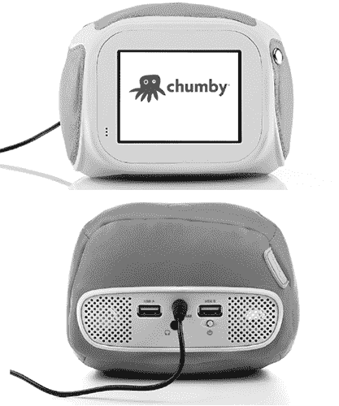
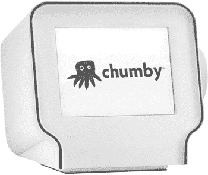
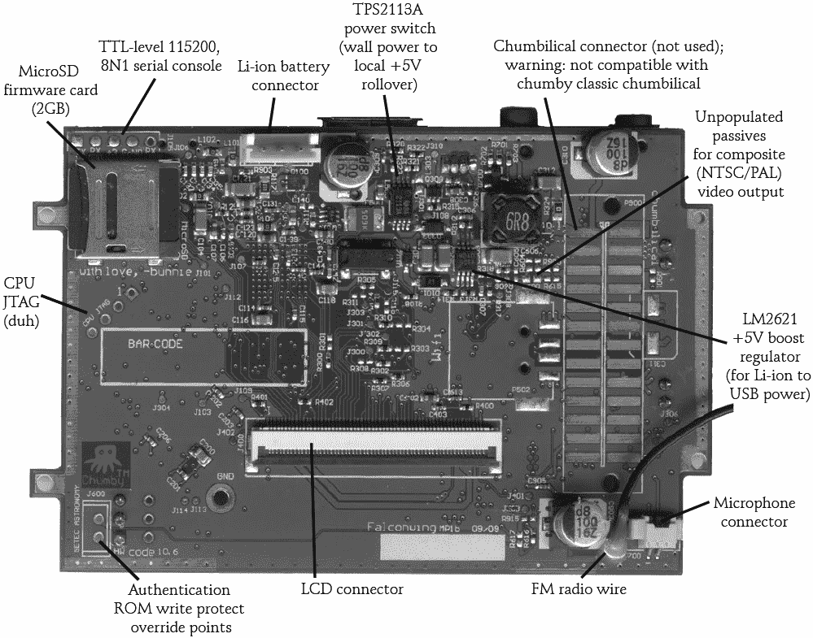
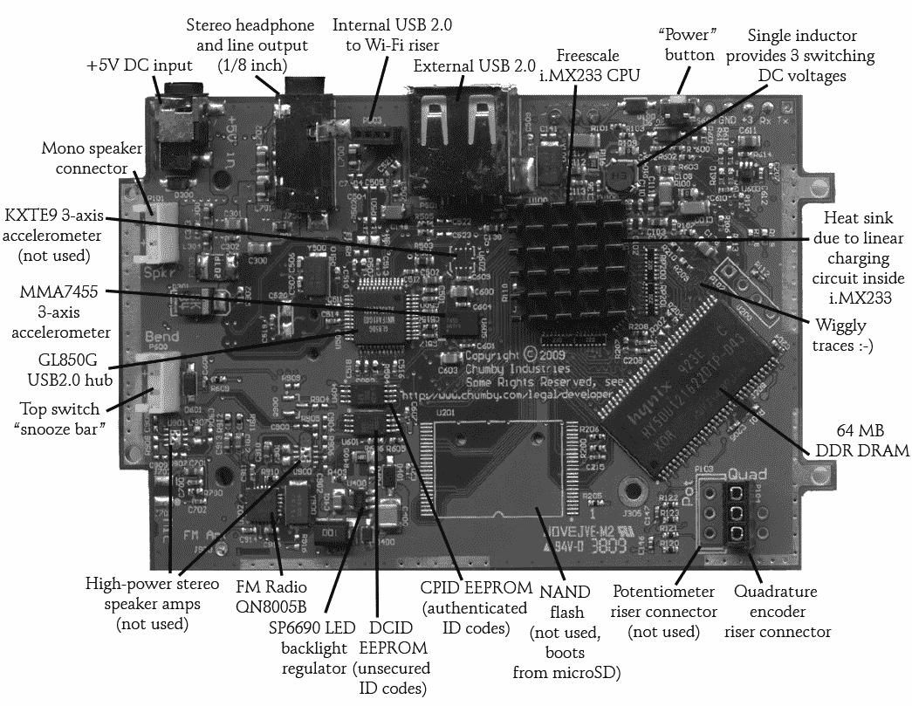
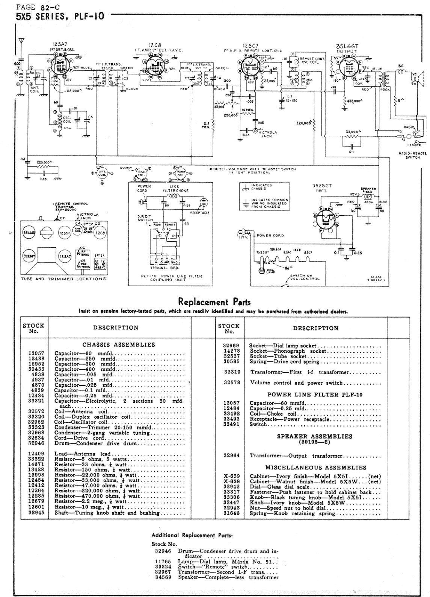
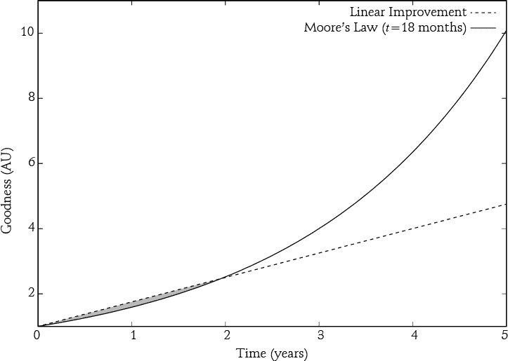
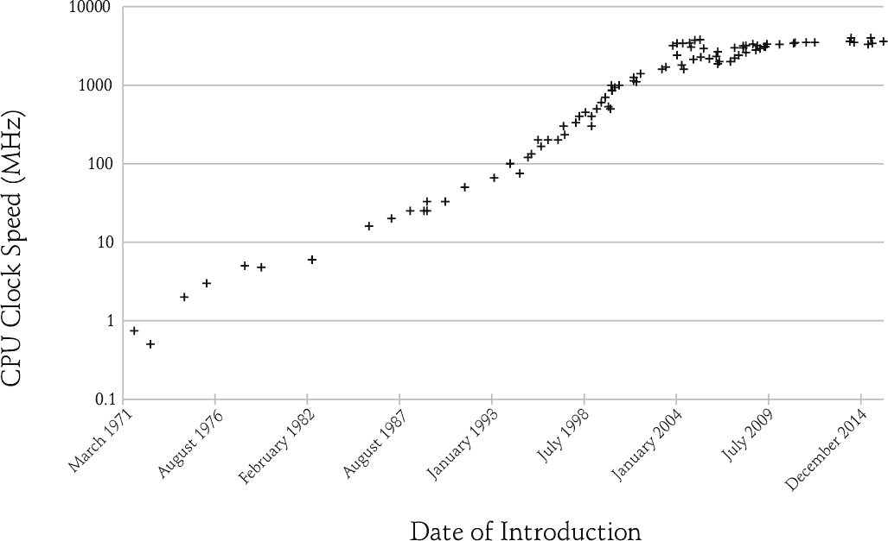
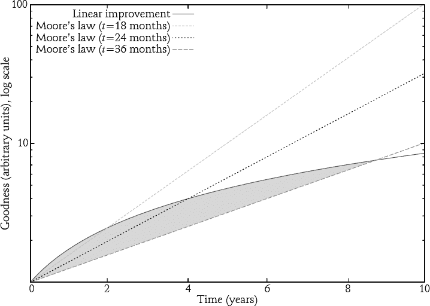

## 6. chumby 的故事

我最早的开源硬件项目之一是 chumby，这是一款支持 Wi-Fi 的内容传输设备，2007 年它带我去中国建立了我的第一个供应链。* 从事 chumby 项目让我个人感到兴奋有两个原因。首先，我有机会构建一款能够以某种方式改善人们生活的产品。对于那些依赖 IM 保持联系、随时在线、随时连接的用户来说，chumby 能够帮助他们更轻松地进行这些连接。同时，chumby 也是我创造一个真正开放平台的机会，它让黑客能够随心所欲地改动和修改设备。

### **一个适合黑客的平台**

黑客有着强烈的愿望去扩展、修改、定制和滥用消费产品，以发现其未预见的功能。在 Chumby，我们希望黑客们能够了解设备的工作原理，并将其转变为我们从未想过的用途，因此我们将 chumby 设计得尽可能开放，欢迎*任何*想要进行黑客行为的人。我们不仅考虑了开源软件黑客，还考虑了硬件黑客、艺术家和工匠——即那些擅长并热衷于非计算机领域的技能的人，比如金属加工、缝纫或木工。为了鼓励并支持 chumby 黑客，我们将源代码、原理图、板布局、材料清单、平面图案和塑料部件的 3D CAD 数据库免费提供。你仍然可以在 chumby wiki 上找到这些资料 (*[`wiki.chumby.com/`](http://wiki.chumby.com/)*).

*原始的软体 chumby*

这个想法是让黑客摆脱对难以理解硬件的点对点解决方案，转而进行可以与几乎任何人共享的黑客行为。例如，想象你为 chumby 加上一个血压计，并把它交给你的祖母。现在，你可以检查祖母的健康状况，她也可以在测量血压时观看孙子孙女的照片。但如果换成 WRT-54G 路由器而不是 chumby 呢？当然，你也可以为 WRT-54G 加上血压计（事实上，从结构上看，它与 chumby 非常相似），但试着教祖母如何设置和使用它。换句话说，我们认为将 chumby 设计成一个简单的产品，能够让黑客的创意更易于使用，并且更容易为他们身边不太懂技术的人所理解。

让 chumby 开放也给黑客带来了其他好处。这一次，假设你的恒温器离你实际想调节温度的地方有些远。你可以通过在 chumby 上添加一个温度传感器，在一个周末就解决这个问题。Chumby 平台有 Wi-Fi，而且我为该设备构建了一个黑客传感器包，所以这个项目所需的硬件工作量非常小：你只需要改装两个 chumby（一个加上温度传感器，另一个加上恒温器接口）并启用这两个设备上的传感器包。这样的设备不仅能帮助你将客厅的温度调节到合适的水平，还能告诉你最新的新闻并帮助你追踪你最喜欢的电视节目。

最令人满意的是，你还可以自由发布你的修改版，甚至转售那些具备自定义功能的改装 chumby。其他人可以受益于你的作品，而你也可以赚些钱。（轻松一点说，原版 chumby 的外壳是由布料制成的，所以你甚至可以将其改装成符合你家装风格的样子！）

原始的 chumby 设计，现在被称为 *chumby classic*，首次亮相于 2006 年的 FOO Camp，并于 2008 年开始销售。不幸的是，chumby classic 在全球经济自大萧条以来最严重的衰退时期正式发布。它那可爱、亲切的外形和定价让许多消费者难以接受，因此我做了任何一个企业家在经济衰退中会做的事：我缩减了规模。

### **演变中的 Chumby**

在 2008 年雷曼兄弟申请 第十一章破产保护后不久，我们开始开发一款可以应对新经济现实的产品。当我为这款产品（我们后来称之为 *chumby One*）绘制第一张餐巾纸草图时，股市正在急剧下跌，每天损失几百点。鉴于这种情况，关键目标就是降低成本。我仔细审视了整个设计，力求打造一款更便宜、更快的产品，以便更好地适应市场。我们希望 chumby One 能赢得新客户，同时保持现有客户的忠诚，并计划在 2009 年圣诞节前推出。

幸运的是，Freescale（后来被 NXP 收购）的一位应用工程师联系了我，告诉我他们计划在 2009 年推出一款新型、价格非常实惠的 CPU（i.MX233）。这款 CPU 看起来非常适合 chumby，所以我做了一些初步的设计草图并进行了成本分析。在 2009 年 1 月的 CES 展会上，我们与一些潜在客户分享了新的设计，获取他们对功能和定价的反馈。这个构想慢慢推进，到三月后，我完成了第一个原型板。

**注意**

*i.MX233 的一个非常酷的特点是它内嵌了电源调节器，而这些调节器不仅仅是线性调节器：它们是开关调节器。但它们不仅仅是普通的开关调节器；它们只用一个电感就能生成三种电压！这有多酷？我必须要为设计这个系统的那个人点赞。*

大约在五月，我们聘请了一位工业设计师来做一些草图，到六月时，我们有了接近最终的工业设计。那时我们做出了第一批 3D 打印原型，但我们负担不起机械工程承包商。我必须学习 SolidWorks，并亲自进行 3D 原型的机械集成。因为我喜欢学习新东西，这段经历非常有意义。

在七月，我们签订了钢铁工具采购订单，到八月，我们有了首批塑料件。九月我花时间优化和调试设计，十月则是进行更多测试、精细调整和加速大规模生产。到 2009 年 11 月，第一批 chumby One 已经飞行了 35,000 英尺，正飞往洛杉矶国际机场。

*完成的 chumby One*

chumby One 的零售价格大约是 chumby classic 的一半，而且它有更多的功能，比如 FM 收音机和支持可充电锂离子电池，这是 squishy 和皮革材质的 chumby classic 用户常常要求的功能。对于 chumby One 中电池的初步反应是一个有趣的消费者心理学研究。出于某种原因，尽管 chumby One 比 chumby classic 更小更轻，而且做的事情完全一样，人们并不认为它应该配有可充电电池。他们并没有内在的欲望去拿起 chumby One 并随身携带。这恰好说明了外形因素如何影响消费者对功能的认知！

无论如何，客户当然喜欢所有这些选项，但对我来说，它们并不是最重要的新特性。

### **更具可黑客性的设备**

让我真正兴奋的是，chumby One 比 chumby classic 更容易被黑客攻击。在 chumby classic 上，我们使用了焊接的 SLC NAND 芯片，这虽然成本较低，但让开发变得相当复杂。开发者直接面对 NAND 闪存的所有缺陷，包括坏块和错误校正，如果系统无法正确启动，也几乎没有恢复的选项。我们在 chumby One 上通过将固件存储在 microSD 卡中来解决了这些问题。

如果你恰好拿到了一个 chumby One，你会注意到你无法从外部更换 microSD 卡。我们做出这个选择是为了防止非黑客用户随意拔出 microSD 卡并疑惑为什么设备无法启动。但如果你拆下背面面板（不像 chumby classic 那样有胶封条），microSD 卡是很容易接触到的。得益于这个关键的变化，黑客们不再需要担心会把他们的 chumby 刷成砖块。如果有人搞砸了固件，他们只需拔出 microSD 卡，将其挂载到开发设备上，然后写入新的镜像。

我们还选择将 chumby One 的 microSD 卡设为*管理式*NAND 设备，这样我们就可以直接将 ext3（一个流行的默认 Linux 文件系统配置）安装到上面。根分区在出厂时仍然被挂载为只读，以防止意外损坏，但管理式 NAND 系统使得将根分区重新挂载为读写并修改 Linux 系统变得非常简单。我们有意将操作系统镜像仅使用 microSD 卡总容量的一小部分，留给黑客超过一 GB 的额外空间来加载自定义应用和库。（记住，在当时，一 GB 可是个大数字。）

在硬件上，对黑客有利的同样也对开发者有利。我们为黑客添加的灵活性使我们能够为操作系统增加大量优秀的功能。例如，chumby One 支持某些 3G 调制解调器，并且能够通过这些 3G 调制解调器作为接入点提供 Wi-Fi 服务。这基本上让该设备成为一个 3G 到 Wi-Fi 的路由器，我在旅行时发现它非常有用，可以为其他设备创建 Wi-Fi 热点。我们最初没有在主流用户层面展示这个功能，但我们知道，只要人们喜欢，它（或者任何人—毕竟这是一个开放项目）可以被包装成一个图形用户界面，变得更易于使用。而且，如果你将 USB 键盘插入 chumby One，它会自动打开一个控制台外壳，你可以在其中输入命令。这在你无法通过 SSH 连接时非常有用，比如在调试网络脚本时。

#### **没有秘密的硬件**

与 chumby 经典版一样，我们也尽可能让 chumby One 的设计保持开放。我们在线发布了原理图、Gerber 文件和 GPL 源代码。在下图中，你可以看到一块预生产的试生产 chumby One 主板。量产主板基本相同，只是在某些地方做了小的调整，以增强与我们在中国使用的 SMT 机器的兼容性。

特别注意在主板背面的照片中，位于左下角的标有*SETEC ASTRONOMY*的那对测试点。你可以利用这些测试点绕过 chumby One 的认证 ROM 的写保护，抹去 Chumby 用来验证设备的密钥。我想不出真正的理由去这么做，但我添加它们的原则是，硬件是你拥有的，应该不会对你保留任何秘密。如果你不喜欢设备上有加密访问代码，你应该能够将它们清除。对于 chumby One 来说，这意味着你将不再有从 Chumby 的服务器获取小部件的代码，但嘿，那是你的硬件。硬件真正属于你时，你可以放弃保修，随心所欲地使用它。当然，我们也公开了 chumby One 用于获取小部件的安全协议。

我还设计了 Chumby One 主板，并加入了安装孔和功能，使其可以重新装入 Chumby 经典款中。虽然 Chumby 从未计划将 Chumby One 主板放入 Chumby 经典款的外壳——手工缝制的意大利皮革实在太贵了，而且集成上也有几个技术问题——但我认为勇敢的黑客们会欣赏自己动手做这个的机会。

*Chumby One 主板（背面）*

*Chumby One 主板（正面）*

我继续在 Chumby 系列上工作了好几年，但最终，我希望能有更多时间投入个人项目，并暂时休息一下，远离创业。

### **CHUMBY 的终结，新的冒险**

2012 年 4 月，Chumby 作为全球所知的品牌走到了尽头。我们已经没钱了，而投资者也没有耐心了。我早在 1 月就已经悄悄离开公司；我有过一段不错的经历，但也到了该离开的时候。听到这个消息后，我的好朋友 Phil Torrone，来自*Make:*，联系了我并要求进行采访，我很高兴答应了他。你可以在网上阅读完整的采访，*，但我在这里摘录了其中的一些部分，如果你对进入硬件行业感兴趣，可能会觉得有用。

**Phil：**你是怎么加入 Chumby 的？你在公司里负责什么工作？

**bunnie：**我最初是公司顾问，负责解决一些硬件战略方面的问题。我们每周都会聚餐，讨论产品可能的方向。最终，我对这个产品越来越感兴趣，便在空闲时间自己动手做了一个初步的原型主板。大约在同一时间，我之前公司里的老板开始让我很烦（他批评我每天早上 9 点前必须坐在办公室，完全忽视了我前一天工作到午夜的事实），所以我当场辞职，加入了 Chumby 的创始团队。

我在公司的角色最初是硬件副总裁，听起来很高大上。但当硬件团队只有一个人的时候，你其实也是焊接工和清洁工。现在回想起来，团队真的是在给我很大的机会。当时我没有供应链管理的经验，也从未去过中国。他们冒了很大的风险，把机会交给了我，让我去搞清楚一切。我真的很感激他们给了我那么多在工作中学习的空间。

**Phil：**制作 Chumby 过程中最棒的部分是什么？

**bunnie：**制作 Chumby 有很多很棒的地方。我认为最棒的一点是，我必须从构想到分销的整个过程中都自己搞清楚。这意味着我能够亲身体验到每一个环节：工业设计、电子设计、工具制造、供应链、零售和逆向物流。一个产品涉及的环节非常多，而满足对如何制造产品的好奇心是一件很棒的事。

另外，我非常珍惜制作 Chumby 时遇到的所有精彩人物。我结交了很多朋友，也有许多优秀的导师。

最后，我认为制作 Chumby 最棒的部分并不是制作过程本身，而是看到人们使用它，看到人们享受和欣赏这款设备。用户脸上的微笑是最终的奖励。

**Phil:** 你能谈谈从头到尾制作一款设备的过程吗，从创意到工厂，再到零售货架？

**bunnie:** 从头到尾制作一款设备的最好部分之一就是，你有一整套完全不受限制的工具来解决眼前的问题。你可以通过电路板布局来解决商业问题，反之亦然。例如，曾经有一个问题，我们如何才能独特且灵活地为设备进行品牌定制，允许更换面板（也就是说，安装 NFL 面板就能看到你的足球比分，安装彭博面板就能看到金融新闻，等等）。这个话题可能需要开几十次会议才能解决。但作为唯一的硬件工程师，我知道嵌入一个 EEPROM 仅需$0.20，而当其他人还在会议中讨论可能的解决方案时，我启动了我的电路板设计工具，添加了一个八脚 EEPROM 到电路板上，放上一个合适的连接器，等到行动项分配时，我已经完成了整个解决方案。实际上，花费我更多时间的是说服他们工作已经完成，而不是实际做这项工作。

我觉得我最终吸收了从头到尾构建产品所需的许多技能，因为沟通需求非常困难。问题总是是否自己做会更快，还是解释给别人听，让他们做，然后可能还得重新解释并让他们修改。这就是我学习机械设计的原因之一；工业设计和塑料模具制作是许多消费品中的“长杆”，能与机械工程团队高效且有效地沟通，使用他们的语言，对于完成工作非常重要。

**Phil:** 零售销售面临的挑战是什么？

**bunnie:** 零售和分销是最困难的挑战。以下是我遇到的一些困难：

**与商家买手打交道。**实体零售商雇佣了专门的买手团队来优化货架空间的盈利。他们通过每单位货架空间的收入来思考产品，而他们并不太关注其他方面。这使得你想要对产品进行改进而导致成本上升时，问题变得尤为突出。商家往往把你的产品看作是若干克的塑料和若干根电线。他们将这些数据与原材料的商品价格相乘，从而设定他们会为把产品放到货架上支付多少费用。虽然有可能谈出更好的协议，但教育商家理解你产品的价值需要付出大量的努力。不幸的是，商家的员工流动性较大，所以你可能会花费数月时间达成协议，却发现与你合作的人已经离开了公司。

**利润。**供应链中的每个环节都有自己的分成：分销商、商家和工厂。除此之外，市场开发资金和其他一些“灰色”资金也需要考虑进去。归根结底，产品的上架成本大约是你的 BOM（物料清单）成本的三倍。这意味着增加一个$0.50 的零件将导致零售价格增加$1.50。

这种情况因为价格被量化为“魔法”数字（如$19.99、$49.99 或$99.99）而变得更加复杂，你必须瞄准这些价格区间。你不可能把一款产品定价为$127.45。如果产品的零售价格超过$99，它就会在心理上与$149 或$199 的产品归为同一类别。当你的产品 BOM 成本接近这些量化点时，你将会进行许多深思熟虑的权衡，考虑是否值得花$0.50 去提升，比如改进扬声器。要么这一小笔成本将来自你自己的利润，要么你就有可能把产品推向更高的价格区间。

**现金流。**零售商在按时付款方面口碑不好。你可能谈好了 60 天付款条件，但常常在 90 天甚至 120 天后才收到款项。如果你的产品没有卖完，零售商必须向你下新订单（此时你有一定的筹码来收回未付的款项），你可能就会被拖延。这可以通过金融工具（如保理保险）部分缓解。保险公司会为任何事情提供保险，包括防止零售商未按时付款或在付款前破产的保险。

**逆向物流与退货。** 许多零售商提供不问原因的退货保证。这对顾客来说是好事，但猜猜谁来处理这些退货？零售商把责任推回给了企业家！这也是支付周期可能很糟糕的原因之一：零售商需要保留现金，以便在顾客退货时退款。一旦退货处理完毕，你就得想办法将退回的物品从他们的码头取走，送到一个可以翻新的地方。通常，大部分退回的商品并不是有缺陷的。它们只是没有达到顾客的预期，或者顾客在冲动购买后产生了购买后悔心理。那些其他方面正常的商品通常缺少配件或者外观有损伤，因此需要进行大量的返工和翻新。

**合同。** 零售商会给你一份默认合同，里面充满了几乎在任何情况下都非常偏向他们的条款。有时候，合同中甚至可能让你承担一些无法预见的责任。例如，我见过这样的条款：如果一个关联的内容网站停机超过指定时间，那么你可能会因为零售商销售你产品时品牌声誉受损而承担责任。这种开放性责任是不可接受的，谈判这些条款可能需要几个月时间。其他苛刻的条款包括迟延发货的罚款或因产品有缺陷而被罚款。合同谈判过程会非常分散高层管理的精力，可能会对组织带来实际的拖累。

**Phil：** 你获得过专利吗？它们在开源世界中是如何运作的？

**bunnie：** 是的，实际上我在 Chumby 任职期间获得了几项专利。专利是保护硬件创意的一种非常自然的方式。就像 F/OSS（自由开源软件）许可证，如 GPL（GNU 通用公共许可证）和 BSD（伯克利软件分发版）依赖版权来保护其力量，开源硬件许可证也可以同样依赖专利来保护其力量。

当我们开始时，没有任何许可证能够解决专利问题，因此 Chumby 创建了自己版本的开源许可证。它基本上是一个自动交叉许可协议，适用于那些创建衍生作品的用户。那些使用我们源代码的人将获得专利许可，前提是任何为衍生作品获得的专利，也必须自动许可回给我们。

该许可协议有一些其他的限制，并不是“真正的”开放式许可，比如要求衍生作品至少要给用户一个选项，让他们能在竞争产品中运行 Chumby 网络（在启动过程中进行一个选择性检查点）。还有一个“如果你想要生产，请向我们咨询”的条款，规定衍生产品进入大规模生产时必须获得 Chumby 的额外授权。我们加入这一条款的主要目的是创建一个检查点来验证与服务器的互操作性，并强制执行适当的商标和品牌规则。将这一条款埋藏在许可中意味着该许可不能被称为开源，因为 Chumby 始终有权说不，尽管实际上它从未这么做过。然而，这种情况突显了开源硬件中的一个持续性问题：如何在一个日益复杂和多样化的生态系统中处理商标和互操作性问题。

此外，我在 Chumby 创办期间创造的专利权都已经转让给了投资者。它们很可能会被卖给出价最高的买家，这个买家很可能是专利流氓。我将这种结果视为不幸，但它是我必须接受的现实。投资者有权通过所有合法途径来收回他们的投资。然而，在理想的情况下，我会以合理的价格回购这些权利，将它们授权给开源社区，并试图建立一个处理开源社区专利的实际先例。

**Phil：** 你有什么建议可以给考虑接受风险投资的创客吗？如果他们正在做开源硬件，有什么不同之处？

**bunnie：** 我认为风险投资（VC）资金只适合加速某些类型的增长。它对于早期阶段的研究与开发，或那些增长缓慢但稳定的商业模式并不太合适。

硬件模型与软件模型截然不同。软件天生具有可扩展性。你可以在一夜之间吸引 100,000 个用户。软件中用户基础的货币化更为复杂，但大多数软件项目都是先追求规模，再考虑如何盈利。

因为硬件需要物质的运动才能获得用户，所以其可扩展性受到你能以经济和可靠的方式组装这些物质并将其运送到客户的速度的限制。另一方面，硬件有一个非常自然的盈利点：你在每个售出单元上所收取的利润。钱更早、更频繁地到来，但增长率受到了物理法则、原材料的可用性以及熟练劳动者的数量等因素的制约。这个规则的显著例外是像 Square 读卡器这样的概念。Square 的硬件巧妙地设计得如此便宜，以至于其成本可以说低于通过其他方式（如平面广告和邮寄活动）获取一个客户的成本，使得这个读卡器便宜到可以直接免费赠送。

因此，在硬件领域，首先要问的是：你的分销渠道是什么？将产品送到最终用户有多困难？最终，这条“管道”的大小以及交易中的货币拖累限制了你想法的增长速度。你还需要考虑*回旋镖*成本，比如退货和客户支持成本。你会惊讶于有多少客户打电话来，是因为他们忘了插上你的产品。

如果你拥有一个出色的分销渠道、稳固的营销活动，并且客户排着队，那么风险投资可能是一个合理的选择。但典型的制造商通常会从在线销售或在精品店销售产品开始。最初，将资金转化为收入所需的时间可能是几个月，而这对风险投资来说是一个残酷的周期。你在供应链上投入的所有资金并没有为你创造任何价值，但你却为了获得这些资金而放弃了公司的一大部分所有权。

我通常会建议制造商首先自掏腰包或通过非常友好的天使贷款来资助研发。一旦你有了原型和生产的稳固计划，借债来资助小批量生产会更聪明，这样你就不会过度扩张，并且可以一步步建立市场。每次周转库存时，你都应该能带回更多的现金，进而投入更多库存的生产。

这样做能培养良好的纪律性。这将帮助你专注于优化供应链，使库存周转更快。最优秀的硬件公司能够在几天内周转库存。如果你每次周转库存时能使资本增长 20%，那么只需要四次周转就能让你的资金翻倍：$100 变成$120，再变成$144，再变成$172，第四次周转后变成$207。这就是复利的魔力。

如果你能每八周完成一次库存周转，并且每次周转时能保持 20%的增长率，那么你的一年内业务就能增长超过 300%。当然，市场从来不是那么理想和可预测的，但你可以通过调整库存周转时间与可用利润来发展你的业务。高利润的业务可能需要更长的时间才能周转库存，但仍能保持可接受的增长率。

这种自筹资金的方式非常辛苦，但到头来，你拥有每一分钱，因为你没有投资者。这种模式的辉煌故事不像 Instagram 或 Google 那样大，但如果做得对，你就能掌控一切，而且你的努力更可能最终得到回报。事实上，许多成功的中国硬件制造企业就是通过这种方式逐步成长起来的。

**Phil：** 你对 Kickstarter 融资有什么看法？

**bunnie:** 我认为通过 Kickstarter 或其他众筹平台资助早期的研发并不是一个好主意，因为你必须在早期做出对客户的硬性承诺。Kickstarter 是一个很好的现象，但你也需要小心从那里筹集资金。在某种程度上，Kickstarter 是最终的“傻钱”。客户被一个愿景所吸引并早早购买，而你必须兑现这个愿景。在众筹资金的同时，你也众筹了你的董事会。但产品开发之路从来不是一帆风顺的。因此，Kickstarter 的资金可能会让你早早锁定承诺，而这些承诺你是无法回头的。

我认为，Kickstarter 可以比风险投资更好，但你应该只有在创意已经成熟，并且你主要是想找一个比风险投资或银行贷款更好的生产融资方式时才使用它。事实上，考虑到从 Kickstarter 提取资金的摩擦成本，几百分点利息的银行贷款可能更具吸引力。但当然，银行贷款没有像众筹平台那样的可见性、市场营销和潜在的增值空间。

**Phil:** 当你为公司提供建议时，你最常建议创始人做什么？

**bunnie:** 交付或者死亡！特别是如果你已经接受了风险投资的资助。一旦风险投资的钱进入你的账簿，你就处于一个有限的倒计时中。如果倒计时结束，而你还没有创造出实质性的价值，那么就会发生“炸弹爆炸”，摧毁你估值的一部分。如果你筹集了 100 万美元，并计划在一年内消耗完，那每一天“花费”你$4,000。我用这个作为价值的标尺来指导决策：如果$30 的加急费用可以让一个长期任务的时间表提前一天，那么这笔钱是值得花的。这也是为什么即使我身在加利福尼亚，在 Chumby 生产期间，我还是保持着“中国产时”的原因。每晚熬夜到凌晨四五点，和工厂翻译邮件，缩短最长的工期，减少了几天的时间表，这就节省了数万美元的烧钱。

面对“交付或者死亡”的局面时，不要追求完美的产品发布。发布一个足够好的产品比发布一个迟到的优秀产品更重要，特别是在消费电子或其他类似的季节性行业中。在消费电子领域，最多 90%的业务可能发生在第四季度。如果错过了圣诞节，你接下来的三个季度将没有收入；错过圣诞节就等于在你的资本化表格上丢掉了一年的资金消耗。更糟的是，在这一年里，竞争对手会继续改进。

Chumby 就正好遭遇了这个问题。我们在 2006 年 8 月首次展示了设备的 Alpha 版，但错过了 2007 年的圣诞节。我们直到 2008 年 2 月圣诞节之后才发布了我们的软性连接闹钟。

考虑一下这些发生在这些日期附近的全球事件：iPhone 于 2007 年 6 月发布，全球经济在 2008 年 10 月崩溃。我们当时不得不忍受将近一整年的艰难时光，从 2008 年 2 月到 2008 年圣诞节，一直烧着风险投资资金来维持生存。但当经济崩溃时，大家对$200 的圣诞袜子礼物的兴趣也随之消失。我们积压了太多库存，不得不为生存而奋斗。

如果我没记错的话，我们本来能在 2007 年圣诞节发布一款产品。那款产品可能没有那么精致，也缺少一些功能。但也许它已经足够好。回头看，2007 年 iPhone 的势头远不如 2008 年，我们可能已经能够清理掉大量库存。另一方面，也许正是因为 iPhone、它的应用程序和出色的触摸屏会让一款联网闹钟过时，才让我们重新考虑了我们的策略，推迟了发布，专注于加强如流媒体音乐集成等功能。

无论如何，这个教训对我来说非常明确：要么发货，要么死！

我给硬件公司的第二条建议是，定价要高一些。若一开始定价过低，几乎不可能提高价格，而且没有什么比促销更能激发人们购买的了。

主要在线销售的硬件创业公司往往会试图将价格定得尽可能低，以此来激发话题和提高初期销售。将你的$35 设备直接在线销售定价为$49 的诱惑非常大。毕竟，这大约是 28%的利润（除非你的物料清单没有计算软成本）。这看起来不错，直到你从 Engadget 的首页掉下来，销售开始暴跌。

与零售商合作可能有助于带来更多、更稳定的销售，但零售商最初会试图以你的建议零售价（MSRP）的 40%到 60%来向你购买产品。这意味着他们希望以$49 购买产品并以$99 销售。如果你已经以$49 卖出了大量产品，零售商就不可能以$99 销售该产品。要进入零售渠道，你需要将你的$35 产品以$25 的价格卖给零售商，这样零售商才能以你设定的$49 价格出售。如果你能够成功实现如此大的降价，你仍然不会赚到钱！

将你的$35 设备定价为$99，起初可能会吸引更少的顾客，但你的初始利润率将非常可观，并且你有空间让零售商参与或自己进行促销以吸引更多顾客。这也是建议零售价（MSRP）通常这么高的原因之一。零售商也喜欢通过促销来推动产品销量，而$99 的设备降价到$69 就显得像是一个明智的购买。但在$69 时，零售商的利润率仅为 29%。

定价过低实际上剥夺了你使用零售作为潜在分销渠道的机会，同时你也失去了进行销售和促销的机会。促销很重要，因为病毒营销最多只能让你在客户面前出现一两次。因此，当你把心血投入到产品中时，要像认真对待一样定价。

**Phil：** 如果你能重新来过，你会如何改变 chumby 的硬件？软件呢？chumby 的制作方式呢？

**bunnie：** 好吧，正如我之前的回答所说，我会更专注于按时发货，也许这意味着要牺牲一些功能。

我学到的一个更反直觉的事情是，配件和包装的开发时间有时比产品本身还要长。那款软绵绵的 chumby 经典版配有一套精美的亚麻和超细纤维袋子以及橡胶挂饰。（我们总共开发了十几种挂饰。）还有一个定制电源适配器，品牌丝带，礼品盒，品牌纸巾……我甚至不得不反复修改硬件设计，并旋转注塑模具，以改善挂饰与设备的连接方式。我至少花了四个月时间，专注于产品的配件和包装。我们的粉丝对这些细节的关注感到疯狂，并且这也帮助推动了销售。

但是回想起来，我在想我们是否可以更好地放弃细节，赶在圣诞节前发货。小公司最痛苦的一个认识就是，他们不是苹果公司。苹果公司每年在工具上花费超过十亿美元。一个注塑模具可能花费约 40,000 美元，并需要两到三个月的时间来制作；而苹果公司通常会同时制作五六个，然后丢弃所有但一个，以便评估多个设计方案。对于苹果来说，花费 20 万美元在工具上，以节省两个月的市场时间根本不算什么。但对于一家融资了一百万美元的初创公司来说，这是难以想象的。苹果公司还拥有数百名员工，而初创公司只有几名成员来做所有事情。苹果产品的精密与精致背后，付出了巨大的成本，而这些成本是初创公司无法承担的。

我并不是说设计不重要。它仍然是产品的一个至关重要的元素，良好的设计和对细节的关注可以让初创公司为产品定价更高，并在竞争中脱颖而出。苹果公司在设计和用户体验方面设定了非常高的标准，用户会据此评判你的产品。但重要的是要记住，你真正的对比标准是其他初创公司，而不是苹果。如果你的主要竞争对手是苹果，要么你需要十亿美元的资金来投资产品设计，要么你需要重新思考你的战略。

这让我想到我可能会改变的另一件事。对于初创公司来说，转型是至关重要的。初创公司必须能够在大公司面前灵活运作。文化上，Chumby 发现自己很难在快速变化的技术环境中保持足够的敏捷性。

当然，事后诸葛亮总是很清晰。我们本可以做得不同，但当我回想起我们所做的所有早期决策以及如何走到今天（电阻式触摸屏、缺少集成电池、使用 Flash 作为核心平台），我并不认为我们当时能做出任何不同的基于事实的决策。

但这确实展示了基于事实的推理的一个缺陷。工程师喜欢基于现有数据和对未来的高度可信模型来做决策。但我认为，真正的远见者要么是因为知识不足，要么是因为拥有足够的信念和勇气，能超越事实，敢于大胆尝试。这可能两者都有。承担风险也意味着幸运的成分在其中。

我确实有一种由事实驱动的近视症。我最近对运营效率、进度和风险管理的专注，消耗了我拥有创意和大胆远见的能力。实际上，我正在暂时休息一年，稍微放松一下，并试图重新发现和发展过去几年中逐渐萎缩的创意部分。

**Phil:** 既然你已经参与了一个完整周期的 VC 资助公司，且该公司生产硬件，你对公司结构有什么建议，从人员到地点再到整体组织？

**bunnie:** 结构真的取决于你想要构建的产品类型。硬件有很多不同的专业领域（如消费类、医疗类和工业类）和市场（如高端精品、爱好者物品和大众市场设备）。这些领域都有良好的商业潜力，但你的地理位置、聚焦点和团队组成需要根据你的产品和能够提供竞争优势的因素来调整。在 Chumby，硬件只是让应用能够在你家中运行的一个门槛，所以它很快就成为了一个低价竞争的局面。公司的硬件部分必须精简（记住，Chumby 只有一名硬件工程师和一名运营总监），并且从一开始就需要采取以中国为中心的战略。

通常，如果你能忍受通过自筹资金来做硬件初创企业，那是值得的。许多种类的硬件产品一开始都可以通过自筹资金启动——然后通过 Kickstarter、债务融资或风险投资来扩展。例如，MakerBot 完全依靠天使资金开发并发货了它的 3D 打印机，之后才完成了风险投资的融资。创始人之一 Bre Pettis 曾提到，他们有一个月的时间就只靠杯面度日。

任何通过了创意阶段并进入扩张阶段的硬件公司，都必须对运营和现金流保持高度关注。维持按需生产模式至关重要，但也很困难：对于任何硬件公司，无论大小，一个关键指标是你能多快地将库存转化为现金。这个问题有两方面。第一是精简供应链并缩短交货时间，这样你不需要持有太多库存，同时能快速满足新订单。第二是优化现金管理，以便能快速向客户开账单，同时尽可能延伸信用额度。这是一个多维度的优化问题，如果没有合适的团队，可能会让你头疼不已，因此你的团队应该包括一位优秀的运营总监和精通半特殊金融工具（如保理保险、担保信贷额度和贸易合同）的人员。

早期有效地进入中国市场为你的初创公司提供了一个颠覆性的优势（很难忽视中国在组装成本上相对于美国的数量级优势），但与中国合作确实会给组织带来巨大的成本和风险。这可能并不适合每个人，特别是在第一天。

我把自己外包到了新加坡，以便更接近中国，因为我知道我永远无法摆脱中国的生态系统。中国在硬件制造上有着如此强大的控制力，我认为他们要失去这一优势可能需要几十年。这种地理多样性也意味着，任何有效的硬件初创公司都必须能够与分散的团队高效合作。

**Phil:** bunnie 接下来有什么计划？你最期待做的是什么？

**bunnie:** 对我来说，*这*就是问题！我其实并不太清楚接下来会做什么。正如我在采访中提到的，我正在休假一年，做一些并非特别创业性的事情。我目前的优先事项是：首先享受我的工作，其次尽量不亏太多钱，第三是通过黑客行动、志愿工作和开源方法做一些对社区有益的事情。我希望在这一年中，我能找回我在路途中失去的一部分灵魂，找到一些新的灵魂，并重新学习生活中魔力的价值。我也在相当大程度上关注自我调整，增强体能，改变饮食习惯，并减肥。你将拥有的最酷硬件就是你的身体，如果它不能正常工作，其他一切都没戏。一旦我完成了这些没有目标的游历，希望我能更清楚地知道接下来该做什么！

在为本书回顾那次采访时，我忍不住笑了。到那时，我休假的一年已经变成了四年。几位关心我的同事问：“你什么时候才能停止中年危机，去找一份真正的工作？”但回头看，不回到公司世界是我做过的最好的决定。

我现在的生活比当时拥有风险资本/企业支持时要简朴得多，但我拥有了更多的独立性。这是一个在黄金手铐和 Aeron 椅子，或者背包和接近地平线的有趣地点之间的选择。我仍然在努力收集我的灵魂碎片，仍然在慢慢重新学习魅力和惊奇的价值。但至少，我有自由去思考除了投资股东财富之外的其他价值观。值得庆幸的是，我在调整饮食习惯和身体健康方面取得了一些成功；调整身体状况是一个痛苦的过程，包括卡路里追踪、肌肉酸痛和起泡的手，但最后得到了丰厚回报。我的母亲曾经告诉我，没有健康，你一无所有；她说得完全对。如果你没有足够的体力去工作，就很难把机会转化为成果。希望我的健康能够维持下去，未来我将有更多故事与大家分享。

### **开放硬件的最佳日子尚未到来**

我进行了一年的灵魂探索，最关键的收获之一就是意识到开放硬件的最佳日子仍然在前方。当我与 Phil 的采访中深思熟虑时，Chumby 的失败并不是因为其开放硬件模式。最糟糕的情况是，这个模式对产品的消费者吸引力几乎没有影响；最好的情况是，它成了一个不错的话题点。在那次采访中，我没有抱怨由于我们宽松的开源政策导致市场上出现廉价克隆品，从而导致销量骤降。

相反，我们面临的最大挑战之一是无法跟上摩尔定律的步伐。作为一个初创公司，Chumby 根本没有足够的资源去跟上这种变化。每次推动一个重要的硬件平台更新都需要两到三年，而到那时，该更新已经过时。我的博士论文*正是围绕摩尔定律及其对计算机架构的影响展开的。最强大的计算机是 1970 年代设计的处理器（Intel 8085）的后代，今天仍作为烤面包机的大脑使用。为什么？因为在向后兼容的 CPU 上运行现有代码几乎总是比将旧代码移植到新的微架构上更快。鉴于这一事实，在我的论文中，我设计了一个当时没人能实现的微架构，但这个架构可能适用于 10 到 15 年后才能建造出来的计算机。一小队研究人员将有充足的时间开发出这种新型计算机所需的基础设施，并且这种计算机在启动的那一天将是切实相关的。我曾在 90 年代末花费数月时间研究摩尔定律的基础原理，试图理解它在哪些方面变得薄弱，在哪些方面依然强大。当时，最强的限制是光速，因此我的论文围绕如何减少通信延迟的架构技巧展开。

在 2011 年，大约在我毕业十年后，恰逢 Chumby 结束时，我有机会在开放硬件峰会上做“愿景”主题演讲。我决定回顾一下我大学时的笔记，看看摩尔定律是否还能再延续十年。答案是否定的，这对开放源硬件的未来有着深远的影响。这一部分是我在 2011 年撰写的一篇博客文章的改编版本，分享了我的想法；幸运的是，到了 2016 年，我仍然没有撤回当时所做的任何声明。

#### **我们的过去：从开放到封闭**

开放硬件是一个利基行业，某些趋势导致硬件行业更倾向于支持大型封闭型企业，而牺牲了小型或个人创新者。然而，展望未来 20 到 30 年，我看到一种基本的趋势转变，这可能使权力的平衡倾向于创新而非规模。

正如我在这一部分的前言中所说：最初，硬件是开放的。早期的消费电子产品，比如真空管收音机，通常会附带包含完整原理图、替换零件清单和服务说明的用户手册。在 80 年代，计算机通常会附带原理图。例如，Apple II 随附的参考手册中包含了主板的完整原理图，这一资料是我非常推崇的，它对我进入硬件领域产生了强烈影响。

*一份真空管收音机原理图*

但现代的用户手册缺乏这样的深度信息。我在 Mac Pro 用户指南中见过的最复杂的图示，是教你如何坐在电脑前：保持“大腿稍微倾斜”，“肩膀放松”等等。

发生了什么？是电子学变得太难和复杂了吗？恰恰相反，电子学的改进变得太*容易*：摩尔定律的速度太快，小规模的创新者跟不上。

#### **我们现在的位置：“坐等”与“创新”**

请看这张摩尔定律的快照，它指出“优秀”（几乎任何衡量标准：性能、晶体管密度、每单位价格等）每 18 个月翻一番。

*摩尔定律：每 18 个月翻一番，与每年线性改进 75%的对比。两条线之间的阴影区域代表了线性改进超过摩尔定律的机会窗口，t < 2 年*

这张图表的特点是纵轴是线性的。大多数展示摩尔定律的图表使用对数纵轴，这会将曲线的急剧上升趋势压平成一条看起来不那么突兀的直线。另一方面，阴影部分代表了时间的线性改善。这可能代表一个小型创新者以每年 75%的恒定、非复合性但可敬的速度，在一个平台上添加或改进特性。被曲线包围的微小（几乎不可见）的空间代表了小型创新者与摩尔定律之间的市场机会。

这两条曲线的并列凸显了小型创新者面临的核心挑战。长时间等待和观望往往比创新更有利可图。如果需要两年时间来使一个系统的性能翻倍，那么你不如等两年后直接升级到最新的硬件。与摩尔定律赛跑是一项辛勤的工作。

这种指数增长机制有利于那些拥有大规模资源的大公司。竞争性企业不仅要一次性开发一个产品，还必须有足够的资源和远见同时开发三到四代产品。要在单一技术代际的时间范围内覆盖全球市场，就需要拥有能够每月生产数百万单位的供应链和分销渠道：以每月 10,000 单位的销售速度，仅在美国，接触到“仅仅”百万用户（大约是美国家庭的 1%）就需要八年的时间。值得注意的是，关闭设计并迫使竞争对手反向工程产品所带来的短暂障碍（几个月时间），可以成为一种优势，尤其是在摩尔定律的节奏下。

因此，随着个体在科技跑步机上努力跟上技术进步，而大公司则不断关闭设计以获得微薄的竞争优势，科技市场已变得对小型创新者难以接近。然而，这一趋势正在发生变化。

#### **我们的未来：传家宝笔记本电脑**

戈登·摩尔（Gordon Moore），观察到摩尔定律的人，是英特尔的共同创始人之一。摩尔定律最著名的是描述晶体管密度，以及由此推导的 CPU 性能，如何随着时间的推移而增加。例如，考虑一下英特尔 CPU 时钟速度与时间的关系图。*

*CPU 时钟速度随时间变化。自 2014 年以来，平台期一直保持稳定*。

注意到时钟速度停止增加的突兀平台期。在那个时刻，CPU 制造商开始使用多核技术来推动性能，但这并非出于选择。CPU 遇到了物理限制，阻碍了时钟频率的实际扩展，主要与功率和线路延迟扩展相关。晶体管密度，以及核心数量，随着时间的推移持续增加，但增速正在放缓。晶体管数量曾经每 18 个月翻一倍；后来放慢到每 24 个月不到翻一倍。最终，晶体管密度扩展将实际上终止。晶体管扩展的绝对终点是一个有争议的话题，但一项研究^(†) 表明，扩展可能会在大约 5 纳米的有效门长度处停止。那大约是 10 个硅原子之间的距离，所以即使这个猜测不准确，偏差也不会太大。

这一点的意义深远。总有一天，你无法再依赖明年买一台更快的电脑。你的手机不会变得更小或更强大。你明年购买的闪存驱动器将与今年购买的相同，价格相同，存储的比特数也相同。今天听起来很荒谬的“传家宝笔记本电脑”一说，或许有一天我们会将我们的电脑视为珍贵且有用的传家宝，作为我们遗产的一部分，传给我们的孩子。

#### **开源硬件的机会**

这种放缓趋势对小型企业以及开源硬件实践来说都是有利的。为什么这么说呢？让我们重新回顾一下摩尔定律与线性改进的图表。这次，我将叠加两个新的情景：技术每 24 个月和 36 个月翻倍一次。

*三种不同的摩尔定律情景。在 t=18 个月情景下，线性改进与情景之间的阴影部分变成了在 t=36 个月情景下的大区域机会。（请注意，纵轴是对数刻度。）*

曲线和底部直线所围成的区域代表了线性改进与摩尔定律相比的市场机会。在 36 个月的情景中，线性改进不仅有超过八年的时间才能被摩尔定律赶超，而且在大约两到三年时，优化后的解决方案明显优于摩尔定律。换句话说，小型企业可以在一个创新解决方案的市场窗口期内，按照自己能应对的节奏进行盈利化。

随着摩尔定律的放缓，平台的标准化潜力也会增加。现在看，创造一个标准化的平板电脑或手机机身，并配有可互换的组件，似乎是荒谬的，但当组件不再急剧缩小和变化时，这就成为一个合理的提案。随着技术的放缓，手机硬件和嵌入式 CPU 模块（如 Arduino）之间会出现融合。看看 2012 年推出的树莓派吧。2016 年发布的型号配备了四核 1.2GHz 的 CPU，其性能与当时的入门级智能手机相当。

创建稳定、性能竞争力强的开放平台将赋能小型企业。当然，小型企业仍然可以选择闭源，但这样做的话，它们必须建立一整套垂直的专有基础设施，而实施这种技术堆栈所带来的焦点分散可能会带来不利影响。

在后摩尔定律时代，FPGAs 可能在性能上与其硬件化的 CPU 同类相较，表现得相当不错，至少有两个原因。首先，FPGA 灵活而又规律的结构可能会赋予它更长的扩展曲线，部分原因在于 FPGA 能够围绕制造公差的小范围波动重新配置电路。其次，为硬件加速优化代码所付出的额外努力，将随着 CPU 性能扩展越来越依赖于像大规模使用并行核心这样的复杂技术而变得更加有利。大规模多核 CPU 架构看起来与 90 年代学术界提出的粗粒度 FPGA 架构非常相似。FPGA 与 CPU 性能的平衡将极大促进开放硬件的深度渗透。

随着技术变得不再是一次性消费品，而是更具永久性的，修复文化将会兴起。五年后更换电脑部件时，如果替换件的规格和价格几乎与旧部件相同，那就不再显得那么荒谬。这种修复文化的兴起将会推动对电路图和备件的需求，从而促进开放生态系统和小型企业的发展。

个人而言，我期待着工艺工程的回归，在那里优雅、优化和均衡比功能膨胀更受重视，我可以使用同一工具十年而不会被视为过时。（大多数人听到我坚持使用 Eudora 7 作为我的邮件客户端直到 2012 年，才转向目前的客户端 Thunderbird 时，都会笑出来。）

摩尔定律的减速已经对那些对性能不那么敏感的市场产生了影响。以 Arduino 的崛起为例，它花了几年的时间才获得流行，而它的核心硬件几乎保持不变。幸运的是，Arduino 的主要市场（物理计算、教育和嵌入式控制应用）的需求没有增长，这使得平台保持了稳定。这种稳定性使得 Arduino 在一个繁荣的用户社区中扎根，并推动了开放和互操作标准的发展。

通过一些努力和一点运气，我相信开放硬件生态系统一定会蓬勃发展。摩尔定律的不可避免减速可能对科技巨头造成麻烦，但也为开放硬件运动提供了一个成长的机会，可能会引发一些非常大的事情。为了抓住这个机会，开放硬件的先驱们需要通过建立一个可扩展的宽松标准和习惯文化来为未来奠定基础。

我期待成为开放硬件光明未来的一部分。

### **结束思考**

尽管 chumby 在 2006 年构思时略显超前，而公司最终也未能逃脱摩尔定律的影响，但我对摩尔定律放缓的思考促使我尝试了另一个开源硬件的实验。下一章关于 Novena 的内容，讲述了我在打造一款定制开源笔记本电脑过程中的不切实际但充满冒险的经历。
