## 7. Novena：打造我自己的笔记本电脑

那是 2012 年，我失业了。我的上一家创业公司失败了，我正在休息一年，思考接下来应该做什么。我的朋友 xobs（在第四章介绍过）和我有一个至今保持的传统：每周五，我们会在午餐时喝几杯啤酒，闲聊一番。在一次“啤酒星期五”的讨论中，我们决定打造属于自己的笔记本电脑。我表达了对自己从未被雇佣去做一个我真正想要每天使用的产品的失望。作为一名设计工程师，你通常是由市场需求驱动的，而不是自己的独特口味。我们开玩笑地谈论了我们会觉得有用的东西，并意识到，由于摩尔定律的逐渐放缓，或许我们并非那么疯狂，能为黑客们打造一款带有一些奇特功能的开放笔记本电脑。于是，我们开始了一个业余项目，打造一台只为我们自己设计的电脑，能够每天使用，且易于扩展和修改——我们自己的电子瑞士军刀。我们给这个项目起了一个代号：Novena，这个名字来源于新加坡的一个地铁站，同时在拉丁语中意为“九”。

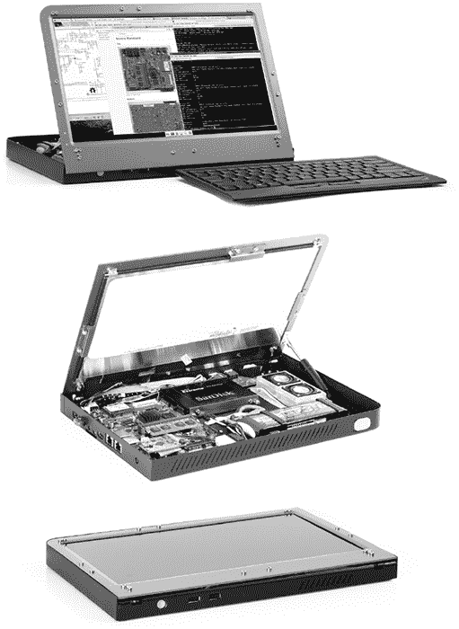

*在 Crowd Supply 上线的第二代 Novena 设计*

完成后的 Novena 是一台 1.2GHz、Freescale（现为 NXP）i.MX6 四核 ARM 架构的计算机，紧密集成了 Xilinx FPGA。它是为那些希望修改和扩展硬件的用户设计的：所有文档和 PCB 都可以公开免费下载*，我们还为它提供了多种促进快速原型制作的功能。

### **不是心脏脆弱者的笔记本**

然而，当我与更多人谈论 Novena 时，我意识到其他人也对拥有这样的笔记本感兴趣，但或许他们不想（或者不知道如何）制作自己的电路板。为了回应我们收到的关于这一主题博客文章的极大积极反馈，xobs 和我在 2014 年发起了一个 Crowd Supply 活动，在设计稳定并经过测试后上线。超过 1000 人支持了这个项目；我很高兴地报告，我们完成了每一项承诺，大多数都在承诺日期的几个月内兑现。活动结束后，我们决定维持完整笔记本配置的供应链将使我们有限的资源过于分散，但我们会在活动启动后的至少五年内销售并支持 Novena 主板硬件。

需要说明的是，Novena 不是一个适合胆小者使用的机器。它是一个开源项目，这意味着这台设备的乐趣（以及挫折感）在于它在不断改进。它也许是唯一一款出厂时带有螺丝刀的笔记本电脑。购买了原始设计版本的用户必须自己安装电池并选择绿色或蓝色的 LCD 边框。扬声器是以套件形式提供的，用户不必使用我们设计的扬声器盒。如果有人有 3D 打印机的使用权限，他们可以制作并微调自己的扬声器盒。

尽管有这些 DIY 选项，我并没有打算用 Novena 打破任何低价记录。它是作为一款低产量、手工制作的笔记本电脑，使用独特的开源组件设计的，成本与设计相匹配。我们提供了三个版本：

• 一个“一体式桌面”版本，售价 1195 美元，开箱即用，配有键盘和鼠标，但需要插电使用

• 一个“笔记本电脑”版本，售价 1995 美元，包含电池控制板，适合外出黑客使用

• 一个“传家宝笔记本电脑”版本，售价 5000 美元，配有精美的手工木铝外壳

在第六章中，我提到随着摩尔定律的放缓，我预测父母将把计算机传给他们的孩子。Heirloom Novena 就是按这种方式设计的，尽管它与其他两种选项有相同的内部硬件。

但这些价格与高端消费类笔记本电脑的价格并没有太大差异。最大的挑战是如何在低量生产的情况下，以这个价格提供如此定制且复杂的产品。我们并不是希望在筹款活动中回收研发成本；那是一个沉没成本，因为任何人都可以自由下载源代码并从我们经过彻底审核的设计中受益。我们的最低筹款目标是 25 万美元，仅为传统笔记本电脑开发和制造所需百万美元投资的一小部分；我和 xobs 通过技术专长、独特的设计和与供应链的强大关系迎接了这一挑战。

### **设计早期的 NOVENA**

我们优化了 Novena 的设计，减少了所需昂贵工具的数量，同时仍然保持它易于破解和修改的主要目标。我们花了一年半的时间，仔细研究了三次 PCBA 修订版，直到我们确信这个复杂的设计既能正常运作，又能实现生产。我们还优化了某些棘手的组件，例如 LCD 和内部显示端口适配器，以确保在低量生产时能够可靠地采购。最后，我花了几个月的时间周游世界，建立了一条能够提供此设计（即使在低量生产下）并且价格与其他高端笔记本电脑相当的供应链。

当然，所有的设计文档都是开放的，因此，凭借足够的技能和资源，你可以从零开始自己构建一台 Novena。我选择了这些硬件及其子组件，使其成为我能够实现的最具实用性的开放硬件笔记本，采用了最先进的技术。你可以下载所有组件的 datasheets，无需签署保密协议，并且关键外围选项的选择使得你可以从源代码构建完整的固件，而不需要使用任何封闭源代码模块。

#### **引擎盖下的内容**

这块主板的尺寸大约为 121 毫米 × 150 毫米；它的大小适合标准尺寸的笔记本键盘下方（尽管图像与安装方向相比有所旋转）。正如本章前面展示的完整笔记本照片所示，端口群位于笔记本的右侧，而不是底部。主板厚度稍低于 14 毫米，这个高度由以太网连接器的厚度决定。我的联想 T520 的底部厚度稍低于 24 毫米，当键盘和塑料部件堆叠在这块主板上时，Novena 的底部厚度大致相同。

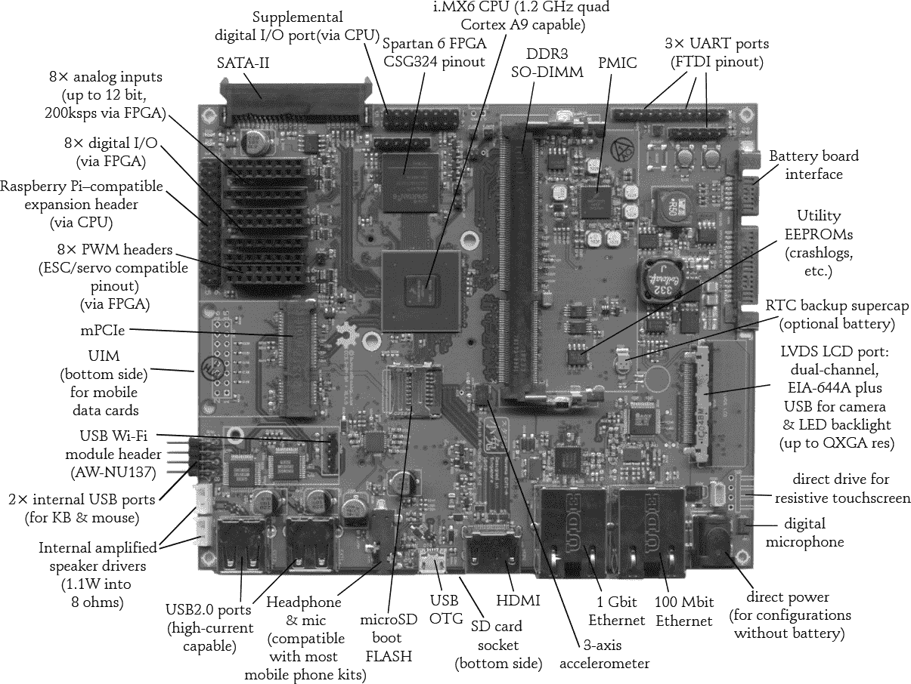

*最早的 Novena 主板*

现在让我们来看一下这块主板的一些特点。

##### 初步特点

Novena 主板的第一次迭代使用了 Freescale iMX6 CPU，它拥有无需保密协议的 datasheet 和编程手册。在接下来的列表中，带有双星号（**）的项目需要一个封闭源代码的固件模块，但系统可以在没有该模块的情况下启动并使用。

我们使用的 CPU 封装支持以下四核和双核版本的 iMX6：

• 四核 Cortex A9 CPU，配备 NEON FPU，主频为 1.2 GHz

• Vivante GC2000 OpenGL ES2.0 GPU，200Mtri/s，1Gpix/s**

这个版本的 Novena 从 microSD 固件启动。至于其他内部存储，它配备了一块 64 位的 DDR3-1066 SO-DIMM，可以升级到 4GB，另外还配有一个 SATA-II（3Gbps）硬盘。

Novena 从一开始就配备了丰富的内部端口和传感器。这些是亮点：

• 一个 Mini PCI-express（mPCIe）插槽，用于无固件模块的 Wi-Fi、蓝牙、移动数据等

• 一个 UIM 插槽，用于 mPCIe 移动数据卡

• 一个双通道 LVDS LCD 连接器，支持高达 QXGA 分辨率（2,048 × 1,536 像素）并支持 60Hz 刷新率，同时还配有 USB 2.0 侧通道，用于显示器侧摄像头

• 一个电阻式触摸屏控制器（而电容式触摸显示器通常配有集成控制器）

• 1.1 瓦，8 欧姆内部扬声器连接器

• 两个 USB2.0 内部连接器，用于连接键盘和鼠标或触控板

• 一个数字麦克风

• 三轴加速度计

• 一个可选的 AW-NU137 Wi-Fi 模块的连接头**

我们使以下端口可以外部访问：

• HDMI

• SD 卡读卡器

• 耳机和麦克风插孔（兼容大多数手机耳机，这些插孔还支持感应内嵌电缆按钮）

• 两个 USB 2.0 端口，支持高电流（1.5A）设备充电

• 一个 1Gb 以太网端口

当然，由于 xobs 和我是在为自己制作 Novena，我们加入了许多其他“有趣”的功能，我们知道这些对于黑客来说会非常有用：

• 100Mb 以太网（双以太网功能使得 Novena 可以作为内联数据包过滤器或路由器使用）

• USB On-the-Go（使得 Novena 可以通过 USB 与其他 USB 主机的设备接口模拟或干扰以太网、串口及其他连接）

• 一个实用的串行 EEPROM，用于存储崩溃日志和其他有用的数据

• 一个 Spartan-6 CSG324 封装的 FPGA，具有多个与 CPU 连接的接口，包括一个 2Gbps（峰值）类 RAM 总线——用于比特币挖矿，或者你可能想要放入 FPGA 的其他应用

• 八个由 FPGA 驱动的 12 位、200ksps 模拟输入

• 八个由 FPGA 驱动的数字 I/O 引脚

• 八个由 FPGA 驱动的 PWM 头，与爱好者的 ESC 和 PWM 引脚兼容（使得与各种 RC 电机/舵机配置以及四旋翼控制器的直接连接成为可能）

• 兼容树莓派的扩展头

• 十三个由 CPU 驱动的辅助数字 I/O

• 三个内部 UART 端口

在进入生产阶段时，我们对这些规格进行了调整，最大的变化发生在 FPGA 扩展连接器上。我们没有选择一组以运动控制为重点的连接头，而是选择了一个能够支持高速数据传输的连接头，xobs 和我在未来的 Novena 相关项目中将其充分利用。

##### 电池板

为了提供最大限度的电源管理灵活性，我将电池接口功能实现到了一块子卡上。我采用了一个便宜且常见的 SATA 样式连接器，将电源和控制信号从主板传输到子卡。为了防止用户将硬盘意外插入电池端口，我将电池-SATA 连接器的插头与实际的 SATA-II 大容量存储连接器性别进行了反转。

第一版 Novena 主板上的电池卡是为了与大多数 RC 爱好者使用的电池包兼容的：从 2S1P 到 4S1P 的 LiPo 电池包（即，从两节到四节电池）。RC 电池包非常适合，因为它们设计用于超快速充电，且价格便宜、易于购买。对于主板端的电池插口，我决定使用经典硬盘驱动器上的 Molex 连接器，因为它们便宜、常见且易于用简单工具组装。我不能使用标准的 RC 连接器，因为绝大多数 RC 连接器设计用于内联使用，而为数不多的具有板载安装功能的连接器要么太厚，要么不适合这个应用。

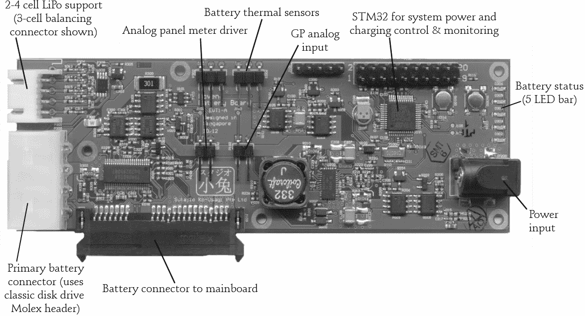

*初步的 Novena 电池板*

电池板可以以超过 4A 的速率为电池充电；例如，给一个三节 45 Wh（4 Ah）的电池充电大约需要一个小时。如果典型的功耗约为每小时 5 到 6 W，那么充电一个小时后，运行时间大约为七到八小时。当然，由于整台笔记本电脑都可以由用户自定义，典型的功耗很难估计。如果用户安装了一个巨大的 LCD 屏幕和一个功耗很大的磁性硬盘，以及大量外设，功耗会更高。

xobs 提出了另一个很有意思的与电源相关的功能，并成功地将其融入了设计中。他认为如果在笔记本电脑的掌托部分嵌入一个复古的模拟指针表，用来实时显示功耗，会非常酷。我觉得这是个好主意，于是我把这个设计加到了电路板中。当然，模拟表是由电池微控制器上的 DAC 驱动的，因此可以配置为执行多种有用（或不那么有用）的模拟读数，例如剩余运行时间、电池电压、温度、时间（以模拟值表示）等。

在花了几个月的时间验证所有功能（那是一长串需要一一验证的功能）之后，我们将驱动程序和 Linux 发行版移植到了这块主板上。这也不是一项小任务，但幸运的是，我得到了 xobs 的高超帮助，我们顺利完成了这项工作。

#### **外壳**

从那时起，我真的很期待设计外壳。对于第一个版本，我考虑制作一个激光切割的亚克力外壳，外形有点像平板电脑，这样可以避免第一次制作机壳时需要处理摩擦离合器问题。最终，我手工制作了我们的第一个原型机壳，由铝和皮革构成，用于验证 Novena 的笔记本电脑使用场景。那个设计很粗糙；正如 Cory Doctorow 在 *Boing Boing* 上所说的，它是“光辉而丑陋的”。*

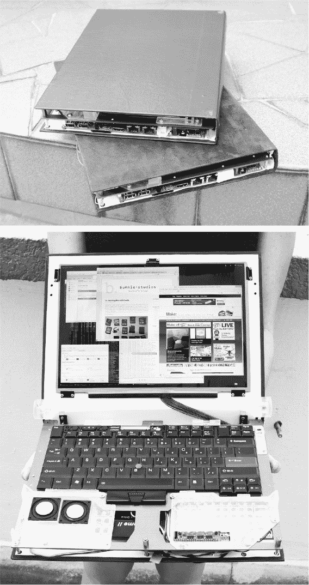

*我喜欢我的笔记本电脑在运行时散发出皮革的气味！*

我之前展示的第二代 Novena 机壳更加简洁。你可能首先注意到的设计特点是，它的开口方向“错了”。这个设计特点使得 Novena 在屏幕关闭时可以作为壁挂单元使用。它还解决了我在原始翻盖原型机中遇到的一个主要问题：由于键盘安装板的阻挡，要访问硬件进行黑客攻击非常麻烦。

在我们通过 Crowd Supply 销售的版本中，屏幕会随着闩锁滑动自动弹开，得益于内部的气弹簧。（Novena 不仅仅是一台开放的笔记本电脑——它是一台自开屏幕的笔记本电脑！）我们故意在这种模式下让内部组件裸露，以便轻松访问，但裸露的内部也清楚地表明，Novena 并不适合普通的家庭用户。

我们还包括了一组安装支撑——我们称之为*Peek 阵列*——以方便黑客使用。通常，笔记本只有为原始设计图中的少数几个功能设计的安装点。但一台可黑客化的笔记本必须容纳大量可能的外设。我们没有要求用户在笔记本外壳上钻孔或粘合物品，而是提供了一个常规的螺纹插口阵列。这有点像面包板，但用于快速的机械原型设计。为了定义这个阵列，我向 MIT 比特与原子中心的研究生 Nadya Peek 请教，她是一位数字制造专家——因此这个阵列被命名为*Peek 阵列*。

第二代设计的另一个特点是，LCD 边框由一整块简单的铝合金板制成。这样，任何能进入一个基本机器加工车间的人都可以修改或制作自己的边框；无需定制工具。我设计这一点的初衷是让 Novena 的黑客们可以更轻松地添加旋钮和连接器，或者更改 LCD。为了鼓励用户进行实验，我们将桌面和笔记本型的 Novena 都配备了两个 LCD 边框，这样如果用户在实验过程中损坏其中一个，便不用担心机器无法使用。

大多数笔记本都有与外壳连接的键盘和鼠标，但 Novena 则配备了独立的键盘和轨迹点，因为这个特性对我个人来说非常吸引。我一直想要一个可以在飞机或公交车上“挂”在前排座位上的显示器：这样对脖子来说轻松得多，而且如果前排座位的人把座椅后仰时，这种布局反而*更好*。

当我还在考虑是做一个贝壳设计还是其他一些有趣的外观设计时，我也想过尝试使用木材和黄铜制作外壳。毕竟，制作自己的笔记本电脑的初衷就是为了尝试一些新奇的想法！如前所述，我们实际上确实推出了一款限量版的木质外壳 Novena，我们称之为*传家宝笔记本*。

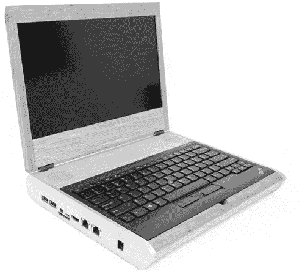

*传家宝 Novena 笔记本*

### **传家宝笔记本的定制木材复合材料**

当 Novena 的主流生产终于在 2015 年 4 月开始顺利推进时，我在俄勒冈州波特兰花了一周时间，与 Kurt Mottweiler（专门制作木质外壳相机的设计师和木工）一起工作，解决传家宝设备的所有最终未决问题。我和 xobs 对传家宝 Novena 的成果感到非常自豪！

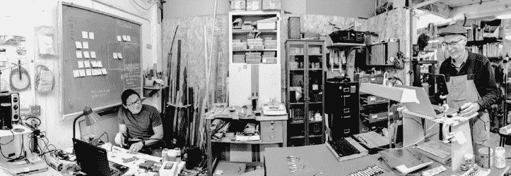

*与 Kurt 一起工作，打造传家宝笔记本*

#### **成长中的 Novena**

从字面意义上讲，Heirloom Novenas 是“生长出来的”。木质外壳意味着重要的结构元素来自树木。制造每台笔记本完全相同是很容易的，但我们认为，为了体现定制产品的意义，更合适的做法是通过挑选最优质的木材，匹配它们的表面处理和颜色，以一种品味十足的方式使每台笔记本都独一无二。因此，所有 Heirloom 笔记本看起来都不相同；每一台都独具美感。

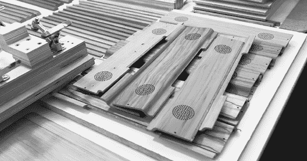

*一些精心挑选的木材，等待成为 Novena 外壳*

Heirloom 笔记本中也投入了大量的科学与工程技术。首先，Kurt 通过将软木、玻璃纤维和木材分层，创造了一种独特的复合材料。为了帮助表征这种新型复合材料，我们将一些材料样本送到比特与原子中心，在那里，纳迪亚·皮克和威尔·兰福德对材料的性能进行了表征。我们取了一些木质复合材料的样本，使用 Instron 4411 电子机械材料测试机进行三点弯曲测试。

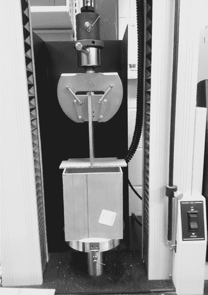

*Heirloom 复合材料加载到测试机中*

#### **机械工程细节**

从测试数据中，我们能够提取出材料的弯曲模量（也叫做杨氏模量）和弯曲强度。我不是机械工程师，所以像*模量*和*比强度*这样的术语我有点不太理解。但纳迪亚非常友好地为我提供了一些见解。她指给我看了阿什比图表，正如一些 xkcd 漫画面板一样，我可以盯着看一个小时，却依然无法完全吸收其中的信息。

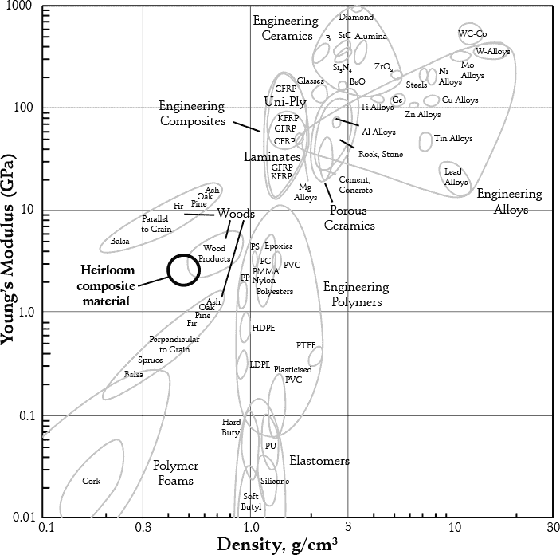

*阿什比图表绘制了杨氏模量与密度之间的关系，标注区域大致显示了 Heirloom 复合材料的位置。*

图表的左下角展示了像软木这样弯曲的轻质材料，而图表的右上角则是刚性较强、较重的材料，如钨（W）。对于笔记本电脑外壳，我们想要一种具有软木密度但具有塑料刚性的材料。木质材料在图表中占据的位置在塑料的左侧，意味着它们的密度较低，但有一个问题：它们在垂直于纹理的方向上较弱。根据应变的方向，木材可以像聚乙烯（用来制造塑料购物袋的材料）一样柔软，或者像聚碳酸酯（用于与玻璃层压制造防弹窗户的材料）一样刚性。复合材料很棒，因为它们允许你将多种材料的特性结合，以达到所需的特性。在 Heirloom 笔记本的案例中，Kurt 结合了软木、玻璃纤维和木材。

Heirloom 复合材料的测量数据显示其弯曲强度约为 33 兆帕，弯曲模量约为 2.2 到 3.2 吉帕。*该材料的密度为 0.49 g/cm³，约为 ABS 塑料的半密度，ABS 塑料是乐高积木的原料。从 Ashby 图表中可以看到，这些数字显示 Heirloom 复合材料在塑料左侧占据了一个很好的位置，并且提供了基于纤维方向的刚性折衷。而且在测试中，该材料并未发生灾难性的失败。

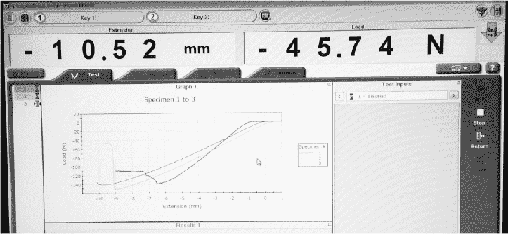

*Heirloom 笔记本复合材料的负载与伸长关系图，由 Instron 测试机绘制*

即使在超过最大负荷的弯曲之后，复合材料仍然大部分完好无损，且提供了一定的抗力。这个结果有点出乎意料。我们本以为材料会像天然木材一样在断裂时折成两半。此外，当我们重置测试后，材料恢复到了原来的形状。我们将复合材料弯曲了超过 10 毫米，但一旦卸下负载，我几乎无法察觉它经历过测试。这种高断裂韧性和恢复力是笔记本外壳所需要的理想特性。

当然，看着机器在材料上运作很有趣，但没有什么比自己亲手拿到它更令人激动。我仍然记得拿起材料，感受它的轻盈，给它一个弯曲，结果被它的刚性和坚固性惊讶到了。

### **成品的变化**

从 Novena 成功完成众筹的那一刻起，一个令人难以置信的团队开始努力将其变为现实。在我们制造合作伙伴 AQS 的工程师和产品经理的帮助下，Novena 的外壳从原型阶段到试生产仅用了四个月时间。

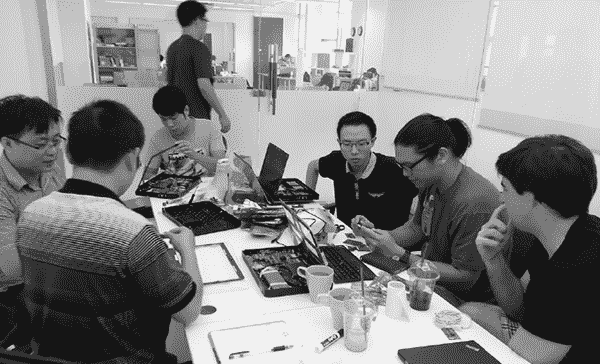

*我们在中国东莞进行 T1 塑料评审的会议室*

当然，xobs 和我在开始众筹之前就做了很多工作，但要制造出如此复杂的产品，必须要有很多人共同努力。没有 AQS 那支敬业且努力工作的团队，我们是不可能做到这一点的。我之前就说过，你的工厂是你的合作伙伴，得益于一个优秀的合作伙伴，我们才能在短时间内完成这项工作。

#### **外壳结构与注塑问题**

到 2014 年夏末，我们手上的 Novena 外壳已经完全由生产过程中的硬件制成——不再是手工制作的原型。为了实现这一点，我们共开设了 10 个注塑模具；作为对比，像 NeTV 或 chumby 这样的产品大约只有 3 到 4 个注塑模具。

正如我在第一章中简要描述的那样，注塑成型是将塑料模制成网状形状的过程。热的、高压的液态塑料被迫注入一个叫做*模具*的硬化钢腔中。钢模具本身就是一项工程杰作：它是一个约重一吨的水冷却块，能够承受类似马里亚纳海沟底部的压力，且其内表面加工的公差精度优于一根人发的宽度。除此之外，模具内部还包含一系列精密的活动部件，包括数十根推出销、滑块、提升器和分模面，这些部件在数千次循环中会顺畅地分离和重新组合。令人惊讶的是，像这样复杂精密的工具竟然能在几个月内制造出来。

由于有这么多的活动部件，工具需要多次迭代以达到完美也就不足为奇了。在模具术语中，这些迭代被称为 T0、T1、T2 等。如果你能在 T2 阶段进入全生产阶段，那就已经做得相当不错了；幸运的是，我们的 T1 塑料已经达到 99%的完美度，这意味着我们可以轻松进入全生产阶段。T1 阶段仅存在一些与流动性和接缝线相关的小问题，以及一些因冷却过程中的变形或在脱模时与模具粘连而导致的变形。这些问题表现为外壳接缝处不如预期紧密，但只需稍作调整，我们就准备好进入生产了。

大多数人只见过成型工具的成品，因此我将分享一个典型的 T0（首次尝试）注塑样品，特别是像 Novena 外壳底座这种大型复杂工具的样品。像这样的测试样品通常使用废料树脂，且颜色较浅以突出缺陷。我们在这里使用了灰色塑料，以便于调整模具，但最终的成品底座是黑色的。

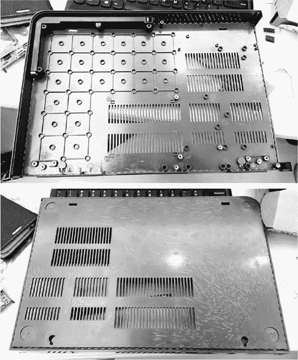

*一些 T0 版本的 Novena 外壳底座照片。顶部照片中左侧的规则圆形阵列构成了 Peek 阵列的基础。为了形成这个阵列，注塑后将带螺纹的黄铜嵌件热铆进了圆形凸台中。*

这块塑料的设计包含了很多细节。让我们聚焦于一些工艺特征。

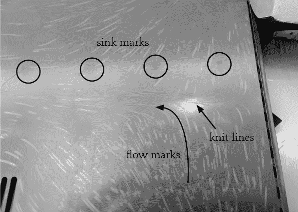

*T0 外壳底座变形的视觉指南*

圆圈标出了*沉陷痕*，这种情况发生在塑料的另一面有特别薄或厚的特征时。这些区域的冷却速度与塑料的大部分区域不同，导致它们略微起皱，形成一种阴影效果。沉陷痕在镜面光泽的部件上特别明显。在这种情况下，沉陷痕是因为 Peek 阵列下方的螺母座部分的塑料比周围的塑料薄得多。为了解决这个问题，我们稍微加厚了该区域，使得外壳的总体内空减少了 0.8 毫米。幸运的是，我在设计外壳时就预留了一些额外的间隙余量，所以这一调整是可行的。

直线箭头指向的是*接缝线*。这是塑料流动在模具内汇合的区域。当塑料被注入模腔时，它通常会从一个或多个注入口流入，而当熔融塑料相遇时，会形成一条细小的疤痕。接缝线通常位于注入口之间的对称点上。在这个模具中，四个注入口位于橡胶脚位置的下方。由于注入口在外观上通常不美观，因此我们将它们策略性地安排在不显眼的地方。

曲线箭头指示的白色羽毛状物质是*流痕*。这些条纹出现是因为塑料在模具内冷却过快。通常可以通过调整注射压力、循环时间和温度来解决这个问题。最好的方法是在模具机上进行试射，以调整这些参数。可以一次调整一个参数，一次一次地测试，直到找到最佳的冷却速度。这个过程有时需要数百次试射，过程中会产生少量废料塑料作为副产品。

这些明显的缺陷大多数已经在 T1 阶段得到了修复，此时塑料的外观更接近于生产级别。我们还开始使用黑色塑料，这种塑料能更好地隐藏缺陷。

当然，仍然存在一些装配和外观上的问题。但是尽管如此，外壳感觉比原型更加坚固，气动活塞机制终于一致且非常顺畅。

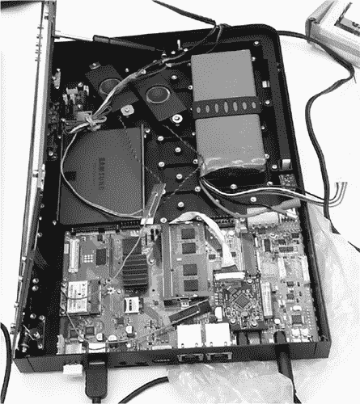

*T1 外壳底座，在将硬件转移到塑料部件后进行的初步测试*

#### **前面板的更改**

Novena 外壳的前面板（不要与铝制 LCD 面板混淆）在众筹之后经历了一些变化。当我们关闭资金时，它有两个朝外的 USB 端口和一个开关。Novena 发货时则配备了两个开关，一个朝外的 USB 端口和一个朝内的 USB 端口。

一个开关用于电源：它直接连接到电源板，可以在主板完全关机时用来开关系统。另一个开关则连接到用户按键，用于方便与键盘的蓝牙配对，一些键盘在连接之前可能需要花费半分钟的时间来循环“某些东西”（大概是与安全相关）。虽然有绕过这个过程的黑客手段，但需要在主机上运行脚本。我们的想法是，通过按下这个按钮，用户可以触发一个便利脚本，从而绕过蓝牙的麻烦。这个开关还可以作为唤醒按钮，唤醒系统从挂起状态。

至于 USB 端口，设计总共有四个，但其配置变更为如下：

• 右侧有两个更高电流承载能力的端口

• 正面有一个标准电流端口

• 一个标准电流端口朝向 Peek 数组

换句话说，我们将一个 USB 端口面朝机器内部。由于 Novena 的一大乐趣在于硬件改装，我认为在内部安装一个 USB 端口至少和外部端口一样有用。

对于不进行硬件改装的用户，内部的 USB 端口也可以作为插入小型适配器的理想位置，这些适配器通常保持连接，例如键盘的无线电收发器。初次插入适配器时稍微有点不方便，但将无线电收发器适配器朝内放置有助于在将笔记本放进旅行包时避免其受损。

### **DIY 扬声器**

我们为 Novena 考虑了多种扬声器选择。设计背后的核心理念是鼓励每个用户选择自己的扬声器。有些人在旅行时确实会在笔记本电脑上听音乐，但其他人则仅依赖扬声器用于通知音效，并且更倾向于使用耳机来播放媒体内容。物理学规定，高质量的声音需要一定的空间和质量。我们希望那些对音质要求较低的用户能够收回更好的扬声器所需的空间和重量。

Kurt Mottweiler 为 Heirloom 选择了一个既好又非常紧凑的现成扬声器 PUI ASE06008MR-LW150-R。当我们发现同款扬声器可以很好地安装在标准 Novena 的 Peek 数组中，且音质在其体积范围内也令人满意时，我们决定将其作为标准音频配置。但我们随产品附赠了一个安装套件，方便拆卸，以便需要回收空间的用户（或想要更换更大扬声器的用户）能够轻松实现。

#### **PVT2 主板**

Novena 主板在量产之前经历了小幅修订。主板的第四个也是最终修订版本被称为 “PVT2” 版本。大部分更改集中在更换或更新那些接近寿命终止的组件。从设计角度来看，两个最重要的新增功能是：一个用于连接前面板集群的内部柔性印刷电路（FPC）接口，以及一个专用的硬件实时时钟（RTC）模块。

我们添加了内部 FPC 接口，以改善从主板到前面板集群的信号传输。我们需要将两个 USB 端口以及一些 GPIO 和电源引出到前面板，而原来的连接方案需要多条电缆。更新后的设计将这些功能压缩成一条 FPC，简化了设计并提高了可靠性。

我们添加了专用的硬件 RTC 模块，因为 i.MX6 内建的 RTC 性能较差。CPU 在 RTC 上的漏电流高于数据手册中报告的值，并且系统关闭时 RTC 的使用寿命，最好的情况也仅能维持几分钟。我们认为继续使用板载 RTC 存在太大风险，因此选择了一个外部的专用 RTC 模块，我们知道它能正常工作。为了提高与其他 i.MX6 平台的兼容性，我们选用了 Solid-Run Hummingboard 使用的相同模块，即 NXP PCF8523T/1。

还需要注意的是，我们在主板的第二次修订中完全重构了 FPGA 扩展接口。本章开头展示的主板版本包含了一组针对运动控制应用优化的接口。我们认为主板的尺寸对于任何人来说都太大，无法将其放入四旋翼飞行器中，而且 FPGA 可能会作为高速数据采集和处理设备使用。为了实现这一功能，我们为 FPGA 配备了专用的 256MB DDR3 内存，并将高速差分信号引出到一个连接器上，该连接器能够以超过每秒一千兆比特的速率传输信号。用户仍然可以将 FPGA 用于运动控制应用，但需要插入一个简单的扩展板（如我接下来讨论的 GPBB）来将我们的信号引导到运动控制系统常用的连接器格式。

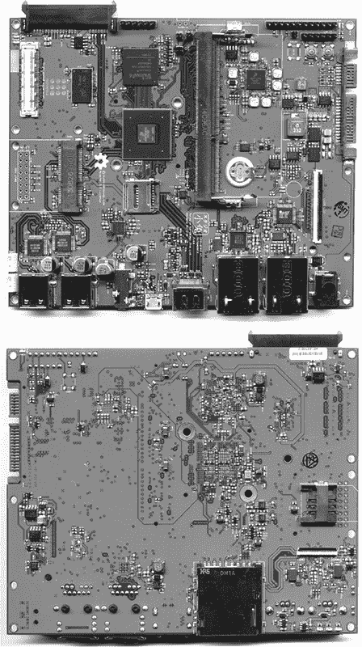

*更新版的 Novena 主板*

### **初学者的扩展板**

每位支持我们的资助者都会收到一个作为感谢的扩展板，我们将其称为*GPBB*，即*通用扩展板*。我们在 Novena 上重新设计了 FPGA 扩展头，以针对高速应用，这也使得入门级黑客在使用设备时更加困难。由于物理学的限制，高速连接器通常有非常密集的引脚排列，对初学者不友好。我们设计了 GPBB，帮助入门级用户与 FPGA 配合使用。GPBB 将 FPGA 上密集的高速信号头转换为适合初学者使用的 0.1 英寸间距、40 针头，并且还包括一些 LED 和模拟数据转换器。

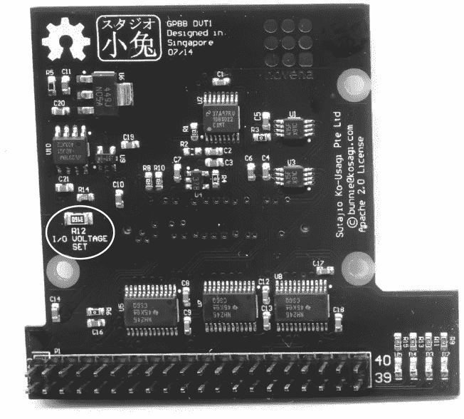

*最终生产版 GPBB*

对于初学者来说，一个日益增长的挑战是摩尔定律不断压低数字 I/O 的允许电压范围。新一代的晶体管在更低电压下运行，这使得它们与大多数入门级项目使用的传统+5 V 标准不兼容。例如，我们的 FPGA 只能处理高达+3.3 V 的信号。因此，我们在 GPBB 中内置了电压转换器，可以安全地处理+5 V 并将其降低到 FPGA 所接受的+3.3 V 水平。

最终版的 GPBB 包括了一项调整，使用户能够调整 I/O 电压，而不是将其固定在+5 V。我们提供了一个软件设置，允许用户选择 GPBB 的外部 I/O 默认是 5 V 还是 3.3 V，我们还设计了该板，使得用户可以通过更换一个单独的电阻（R12）将较低电压调整为 2.5 V 或 1.8 V。我将该电阻标记为“I/O 电压设置”，并将其做成 1206 封装，这样即使是焊接新手也能自行更改。

#### **桌面 Novena 的电源通电板**

“一体化桌面”配置最初仅包含桌面外壳、Novena 主板和前面板扩展。但这种配置使得电源管理变得尴尬，因为我为外壳设计的整体电源管理系统假设会有一个辅助微控制器来管理主切断开关。

复杂性是魔鬼，单单为一个配置启动软件就已经够难的了。最终，我们发现向桌面电源管理系统引入一个新的硬件比处理多种代码配置更为便宜。

因此，桌面系统随附了一个电源通电板。它是一个简单的 PCB 组件，仅包含完整电池板的 STM32 控制器和电源开关。这使得我们能够在桌面和笔记本系统中使用一致的总电源管理架构。

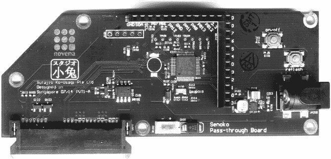

*桌面通电板*

这种方法就像用大锤打苍蝇——但是那把大锤的价格和苍蝇拍一样贵。而且同时携带苍蝇拍和大锤也很不方便。所以，是的，我们用了一个 32 位的 ARM CPU 来读取按钮的状态并切换 GPIO，是的，整个系统底层运行的是一个完整的多线程实时操作系统（ChibiOS）。

不过，这确实有点傻。这就是为什么我们启用了部分未使用的 GPIO 引脚，让 Novena 变得更加可修改。希望某个聪明的用户能发现这些未开发的潜力的应用！

#### **定制电池包问题**

Novena 的电池包无疑是该项目中的一个变数。构建 Novena 是 xobs 和我第一次制作如此高容量的电池系统，而且要处理所有的运输规定以确保电池顺利交付给客户，是一项挑战。

一些国家对于进口锂电池有特别严格的规定。在最糟糕的情况下，我们不得不给一些客户发送没有电池的笔记本电脑，然后我们从专门销售 RC 电池包的供应商（如 Hobby King）处单独按我们自己的成本把电池包邮寄给他们。他们收到了众筹活动中使用的相同电池包，但需要他们自己安装。这是我们最安全的备用方案，因为 Hobby King 每天会向全球发运成千上万的电池包。

然而，运输问题并没有阻止我们开发定制电池包。保持电池包的库存是困难的，因为电池需要定期进行保养，所以只有支持我们的项目的资助者才能获得这个电池包——前提是他们所在的国家允许进口。我们无法在尝试之前确定，但我们确实获得了定制电池包的 UN38.3 认证。从理论上讲，这个认证允许我们通过空运运输电池，但电池运输的规定总是处于不断变化之中。似乎各国和运输公司总是在不断创造新的规则，尤其是在对锂电池作为引火装置的潜在用途的恐惧之下，而我们并没有足够的资源跟上这种变化。

定制电池包的容量为 5000 毫安时，大约是我们在众筹活动中展示的电池包的两倍容量。（那个电池包外标写的是 3000 毫安时，但实际提供的容量大约是 2500 毫安时。）在实际测试中，定制电池包提供了大约六到七小时的运行时间，且启用了最少的电源管理。而且，由于我可以指定电池，我知道它内置了正确的保护电路，并且了解其电池单元的来源，因此我对其长期性能和稳定性充满信心。

#### **选择硬盘**

众筹活动中提到为笔记本和传家宝型号提供 240GiB 的 Intel 530（或等效产品）和 480GiB 的 Intel 720 驱动器。我们将规格描述得有些模糊，因为 SSD 市场变化迅速。我们知道，在制定规格时最好的驱动器可能与我们实际购买时能得到的最好驱动器不同。

经过一些研究后，我们认为在购买时最合适的驱动器是 240GiB 的三星 840 EVO（用于笔记本型号）和 512GiB 的三星 850 Pro（用于传家宝）。xobs 和我个人在自己的设备中使用了 840 EVO 几个月，表现非常出色。

对我们来说，一个重要的指标是驱动器在意外断电时的表现。断电事件发生得相当频繁，例如，当你在做电源管理子系统的开发工作时。一些硬盘在经历了几次意外断电周期后，表现出了相当高的故障率（这算不算自相矛盾？）。

对于传家宝型号，我们使用了三星的 850 PRO 系列。这款驱动器提供了一个适合传家宝的严苛保修：10 年。三星能够提供如此高的可靠性承诺，因为该驱动器使用了公司称之为 V-NAND 的技术，我认为这是首个真正的生产级 3D 晶体管技术。

**注意**

*Intel*声称*它制造 3D 晶体管，但这不过是市场宣传而已。是的，栅极区域有一个凸起的表面拓扑，但你仍然只得到单层设备。从设计角度来看，你依然在使用一个二维的设备图谱。Intel 本应坚持我认为更为“原始”（也更具描述性/不易误导）的名称，FinFET，因为如果将这些称为 3D 晶体管，我不知道如果 Intel 最终制造出*真正的*3D 晶体管阵列，它会如何命名。*

Chipworks，一家专注于专利支持的公司，对 V-NAND 做了出色的初步分析，*，显示这种技术并不仅仅是堆叠几个晶体管。V-NAND 堆栈是一个 38 层的有源晶体管三明治，全部集中在一个地方。这是工艺技术的巅峰之作。这就像是 Neo 解码矩阵，这就像是 Mal 先开枪。这是一个游戏规则改变者，而且它并非虚假宣传。传家宝的支持者收到了包含超过 4 万亿个这种晶体管的笔记本电脑。

#### **固件定稿**

从软件方面来说，下一步是最终确定内核、引导加载程序和发行版的选择，并决定当 Novena 第一次启动时显示什么内容。

Marek Vasut 将 Novena 支持集成到主线 U-Boot（通用引导加载程序）中，U-Boot 是最流行的开源引导加载程序之一。（Marek 是 U-Boot 的维护者之一。）这个过程涉及了大量补丁，部分原因是很少有 ARM 板卡能够像 Novena 那样支持这么多的内存。通过这些补丁，Novena 获得了完整的 U-Boot 支持，包括 USB 和视频。

我们决定将 Debian 作为 Novena 的出厂默认发行版，并使用了带有这些补丁的标准 Linux 内核。任何我们认为可能对其他项目有用的补丁都会提交到上游，并将继续提交。*上游*意味着一个属于衍生操作系统的包成为其衍生来源发行版的一部分。

我们确实保留了一些本地补丁，从专门的黑客手段到实验性特性，包含那些还没准备好推送到上游的特性，或者那些依赖于当时尚未上游的特性。例如，笔记本的显示系统与 ARM 设备上通常看到的显示系统非常不同。在大多数 ARM 设备中，屏幕在启动时是固定的，无法在运行时热插拔显示器。像典型的笔记本电脑一样，Novena 支持同时连接两个显示器，并允许在不重启的情况下插入 HDMI 显示器。对这个特性的支持需要一个仅限本地的内核补丁，因为它依赖于当时尚未上游的 ARM 平台特性。

最后，我们只需决定在 Novena 开机时显示什么。在 Linux 中，首次启动设置界面（用于创建用户、设置时间和配置网络）并不常见。这在预装系统的 Windows 和 OS X 中很常见，但在 Linux 中，安装程序通常会处理这些事情。

我们在打造良好的桌面风格体验和提供实用的嵌入式开发者体验之间左右为难。桌面风格的体验将作为一个空白状态发货，并提示用户通过本地连接的键盘和显示器创建账户。但嵌入式开发者可能永远不会插入显示器，而更倾向于通过控制台或 SSH 连接；对于他们来说，默认的用户名、密码和主机名会更加有用。无论如何，我们希望创建一个在所有平台上都通用的固件，并避免为特定目标发布特别定制的版本。

最终，我们决定创建一个桌面风格的体验，并为高级用户提供跳过用户注册流程的途径。这让我们同时享受了两种体验的优点。它提高了 Novena 对入门级用户的可访问性，同时高级用户仍然可以直接进入工作状态。

### **构建社区**

从一开始，xobs 和我就将 Novena 打造为赋能黑客的工具，因此我很高兴，即使在发货前，Novena 就有了活跃的 alpha 开发者。Jon Nettleton 和 Russell King 负责图形处理，U-Boot 的 Marek Vasut 也提供了帮助，另外几个 alpha 用户组实际上为该系统制作了硬件。

MyriadRF，一个专注于无线技术的开源硬件和软件社区，为 Novena 创建了一个软件定义无线电板。我们购买并将这些板卡与我们首次发货的桌面和笔记本单元集成。

CrypTech 团队也在 Novena 笔记本发货之前就开始将 Novena 应用于他们的项目。CrypTech 项目开发了一个硬件安全模块，提供了一个 BSD 和 CC BY-SA 3.0 许可的参考设计。该团队希望创建一个经过广泛评审、为加密设计的设备，任何人都可以为其应用程序定制，并使用自己可信赖的供应链轻松构建。CrypTech 使用 Novena 原型验证其设计的部分元素。

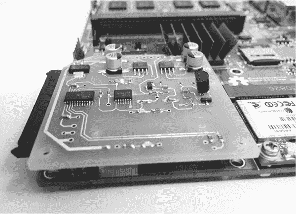

*一个原型 CrypTech 扩展板，插入到 Novena 主板上*

此处展示的扩展板是一个基于板中间晶体管的雪崩噪声的原型噪声源。CrypTech 使用该噪声在 Novena 的 FPGA 中生成熵。然后，将该熵与 FPGA 中由环形振荡器生成的熵结合，并通过例如 SHA-512 进行混合，生成种子。之后，这些种子用于初始化 ChaCha 流密码，最终生成一串具有加密安全性的随机值。其结果是一个高性能、最先进的随机数生成协处理器。

### **结束语**

作为最后一点，如果有一件事是我和 xobs 在硬件行业中学到的，那就是你不能在蛋还没孵出来之前数小鸡。尽管在某个阶段我们取得了良好的进展，但这并不意味着我们会有一条容易的路走向最终的产品。即使我们在筹资结束时有了完全功能的原型，仍然花了数月的时间付出巨大努力，才能将数百个单位交付给最终用户。

现在，Novena 已经完成了发货，我们继续支持我们那群热情但非常耐心的用户群体。这是一项巨大的工作，主要由 xobs 承担，但我们一直在回答用户的问题，推送补丁，并保持 Novena 内核的更新。

我们这么做，尽管从 Novena 销售中没有获得任何新的收入。在回顾我们的众筹后销售数据时，显然没有可行的路径能通过销售 Novena 经营硬件业务；我们每月大约只会卖出几台单位。尽管通过最初的众筹活动我们满足了供应商的最小订单要求，但如果销量少于几百台，和供应商的合作将非常困难。以每月卖几台的最低采购量销售，意味着我们将背负着库存债务大约一百个月。我们将欠供应商几年的债务。几年来无法偿还供应商的债务，也被称为破产。

当然，我们会遵守最初的承诺，至少在初始资助活动后的五年内继续支持 Novena 主板。我们已预留了相当大一部分资金，以确保主板的稳定供应。我们的原始众筹伙伴，现在的在线销售合作伙伴 Crowd Supply，已经接手了剩余的外壳和配件库存。得益于我们的开源硬件模式，Crowd Supply 在最终用户需求出现时，可以选择为 Novena 制造和销售配件。

最终，我非常高兴看到一些新的项目像嫩绿的嫩芽一样萌发，旨在为终端用户提供更好的开源笔记本解决方案。与其与他们竞争，我认为 Novena 最适合做的事是让路，支持那些充满热情的新开发者，帮助他们通过销售自己的解决方案找到机会和财富。毕竟，我们最初开始这项冒险，主要是为了看看是否能够做到。我们想要打造一个很酷的工具，专为我们的日常使用场景量身定制；我们并不想开创一项出售具有可持续大众市场吸引力的笔记本电脑生意。如果 Novena 项目最终的影响是提高开源硬件的标准，甚至可能鼓励新一代与笔记本相关的项目，那么这本身就是一种巨大的回报。
