## 8. chibitronics: 制作电路贴纸

在如今的合同制造和交钥匙服务提供商的世界里，设计师通常会从现有工艺中挑选一套方案来开发产品。大多数消费电子设备是由刚性 PCB、表面贴装焊接（SMT 回流焊）或穿孔波峰焊接、ABS 或 PC 注塑成型、钣金成型以及一些后处理工艺（如喷漆或电镀）等工艺组成的混合体。这些选项涵盖了大多数产品所需的功能。然而，真正出色的产品通常会引入新材料或创新的制造工艺。

开发这些新工艺并不一定要昂贵——只要你愿意亲自走到工厂车间，指导改进过程。换句话说，工艺开发中昂贵的部分通常是支付那些开发和认证工艺的专家费用，而不是设备或材料本身。

为了向自己证明这一点，我开始探索将柔性电路作为设计媒介。与使用 1 毫米或 2 毫米厚的刚性基板（由编织玻璃纤维和刚性环氧树脂组成）不同，柔性电路通常使用厚度只有几分之一毫米的可弯曲聚合物基板。聚酰亚胺是柔性电路中常见的基板材料，因为它能耐受高温焊接。尽管柔性电路技术在消费类产品中应用广泛（比如一部手机可能至少包含六个以上的柔性 PCB，连接按钮、摄像头和显示屏等外设与主板），但这种技术在爱好者和 DIY 产品中的应用仍然较少。但我认为这并非必须如此。

我有预感，设计出合适的柔性电路产品可以启用新的创意应用，但我不完全确定该如何实现，于是我决定进一步了解设计柔性电路的独特优势和挑战。在一个项目中，我深入研究了 SD 卡的内部结构，更多内容将在第九章中讨论，我需要为我的 Novena 开发一个适配器，以便让我能够监听并模拟某些旧款 SD 卡中内置的 NAND 闪存。柔性电路的薄度和可弯曲性非常适合这个工作。

结果适配器非常薄，完美地贴合在 NAND 的 TSOP 封装下。电路板的可弯曲性意味着我还可以适应各种各样的目标板形状，甚至是比典型 SD 卡大得多的板子。尽管这是柔性电路的一个有用应用，但我仍然觉得自己只是触及了可能性的表面。

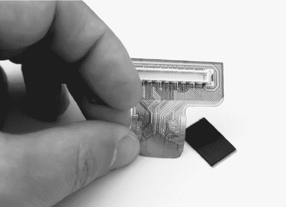

*我的定制柔性适配器*

然后，幸运的时刻来了。在做 SD 卡项目时，我遇到了 Jie Qi，那时她是 MIT 媒体实验室的博士候选人，她正在将纸艺与电子学结合作为她研究的一部分。她是 2012 年 1 月我带领的一组 MIT 媒体实验室学生的成员，我带他们参观了深圳，看到她的纸电路实例让我脑中灵光一闪。

*Jie Qi 的纸电路艺术作品*的最终艺术作品，蒲公英图

*花朵的特写*

*撕开画作揭示电路*

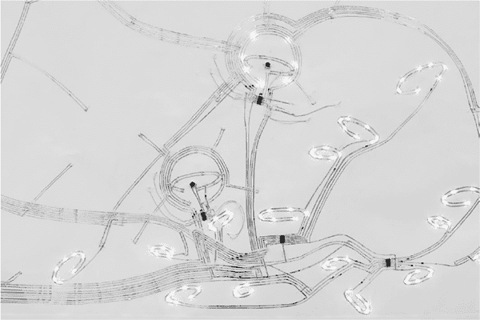

*蒲公英图中的花朵电路*

只使用铜带、纸张和一些焊锡或胶带固定元件，Jie 就能创作出辉煌的艺术作品，这些作品会发光并与观众互动。这些迷人的杰作展示了电子技术不仅可以作为功能性媒介使用，还可以作为表现性媒介，激发惊叹与敬畏。这里的照片展示了她一件著名早期作品的内部，*蒲公英图*，其中电路本身与覆盖在其上的画作一样，都是一件艺术品。

Jie 也非常热衷于教育，她看到纸电子技术在使技术更具相关性并且更易接触到非工程领域观众方面具有巨大潜力。在我们去深圳的旅程中，我们讨论了在柔性电路上构建电路，然后将柔性电路焊接到纸张上的可能性。最终，她觉得那不过是一个微小的改进。虽然焊接并不是一个难以掌握的技能，但涉及的高温、化学物质和专用设备对初学者来说是一个巨大的障碍。真正神奇的是，如果电路能够像贴纸一样粘贴在页面上，那该多好！如果我们能使用柔性电路技术与传统的 SMT 回流工艺相结合，创造出用户可以粘贴到铜带电线上的模块，那该多棒！

这就是我们如何开始合作开发 Chibitronics 的过程。我们在这个项目中设计了一套撕贴式电子电路，用于手工制作和教育。Chibitronics 从一开始就是一个开源硬件项目，你仍然可以通过项目的 wiki 在*[`chibitronics.com/wiki/`](http://chibitronics.com/wiki/)*上找到所有来自*Circuit Sticker Sketchbook*的活动、使用的所有微控制器的源代码以及其他技术细节。

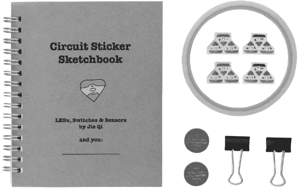

*Chibitronics STEM 入门套件包括* Circuit Sticker Sketchbook，*LED 贴纸，铜带，电池和电池夹*。

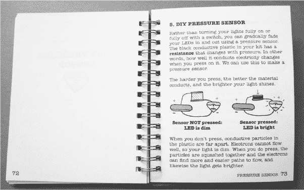

*如何制作 DIY 压力传感器的解释*

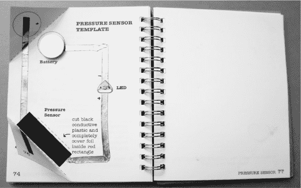

*制作的 DIY 压力传感器*

*带纸覆盖的 DIY 压力传感器*

### 与电路一起创作

我们在 2012 年初找到的解决方案基于麻省理工学院教授 Leah Buechley 的高低技术研究小组的研究成果。我们决定在柔性聚酰亚胺基板上构建电路，并在背面贴上*各向异性胶带*（也叫*Z 胶带*，因为电流仅能垂直通过胶带，而不能横向流动）。

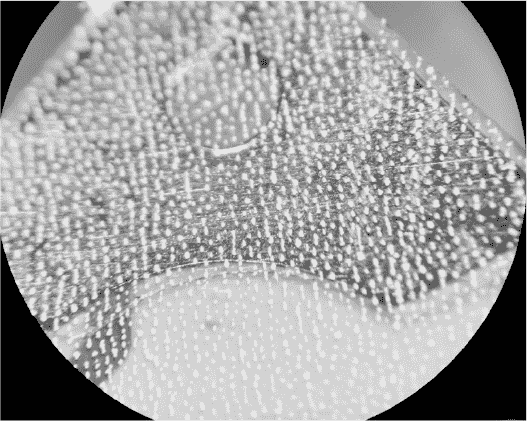

*在显微镜下的 Z 胶带*

使用 Z 胶带可以让终端用户无需高温工艺，如焊接或回流焊，就能组装电路。仅需简单地将元件粘贴到位，对于艺术项目来说，这种方法极为有用，因为艺术项目通常涉及热敏感和/或可弯曲的材料基板，如纸张、织物和塑料。电路贴纸和铜胶带也很灵活，进一步使任何人都能在非传统材料中融入电子元件。这样友好且富有表现力的材料鼓励创作者将电路本身转变为美丽的艺术作品。

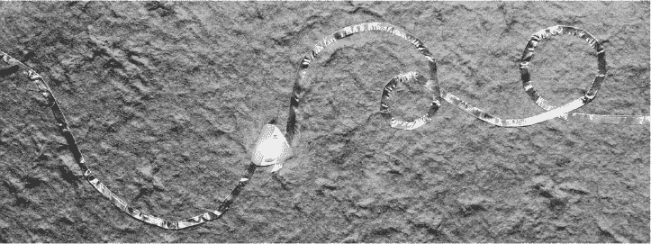

*纸上的电路贴纸*

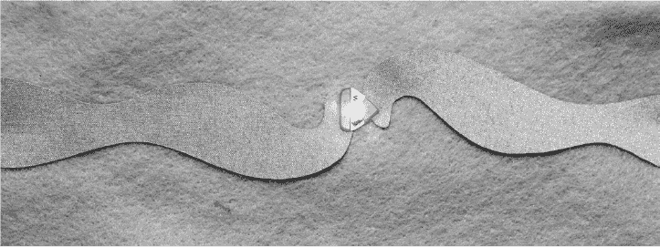

*织物上的电路贴纸*

制作这些电路贴纸的过程主要围绕着 Z 胶带的限制。在这里展示的 Z 胶带附着在聚酰亚胺基板上的放大部分中，银白色的小斑点是微小的金属颗粒，它们根据统计分布从胶粘层的一侧延伸到另一侧。鉴于金属颗粒的分布特性，为了确保良好的电气接触，每个电路贴纸上的焊盘必须相当大。此外，彼此非常接近的电路轨迹可能会被嵌入的金属颗粒短路，所以在设计电路时，我必须小心地在裸露的焊盘之间留出足够的空间。Z 胶带材料的数据表中包含了最小焊盘尺寸和间距的规定，因此我以此为指导。

#### 开发新工艺

设计包含工作电路的贴纸是一回事，实际制造这些贴纸则是完全不同的挑战。我们设想的电路贴纸并没有现成的标准制造工艺可以实现。最终，我有机会亲自验证我的理论——如果你愿意亲自操作，新工艺的开发可以以较低成本完成。所以，我开始了自己的小型研究项目，探索柔性电路介质及其制作电路贴纸的挑战，所有这些都在有限的研发预算下进行。

#### 参观工厂

作为第一步，我参观了生产柔性 PCB 的工厂。这次参观让我大开眼界。

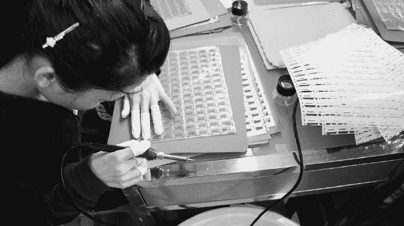

*工人在手动对准盖层到柔性电路材料上*

与焊接掩膜不同，柔性电路的线路由一种称为*盖覆层*的聚酰亚胺薄膜保护。焊接掩膜太脆弱，如果弯曲会破裂，但盖覆层能够在数千次弯曲循环中可靠地保持完整。然而，有时你需要使柔性电路的部分区域变得坚硬；例如，电路的某部分可能需要保持坚硬以便机械安装，且坚硬的电路对于表面贴装技术（SMT）加工也非常有帮助。

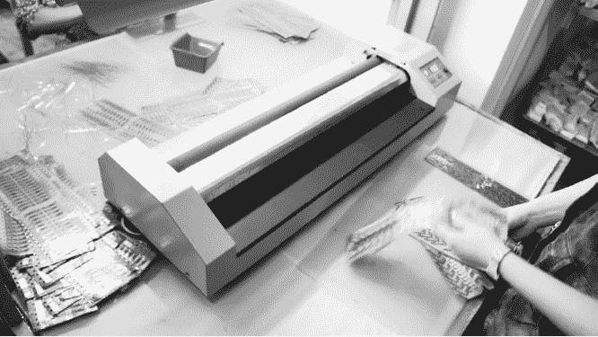

*钢板被层压到柔性电路材料的背面*

我知道聚酰亚胺加固件可以层压到柔性电路上，但事实证明，钢层压也是可能的。如果我没有亲自参观工厂，我可能永远不会知道这一点。亲自参观工厂还让我有机会亲眼见识到通过模切可以生产的各种复杂形状。形状的多样性是关键，因为我们还希望让电路贴纸看起来很酷。像如何切割材料的宽度，或者在模切中允许的最小半径等问题，单纯通过邮件是很难回答的，但在亲眼看到整个过程之后，这些答案变得直观易懂。

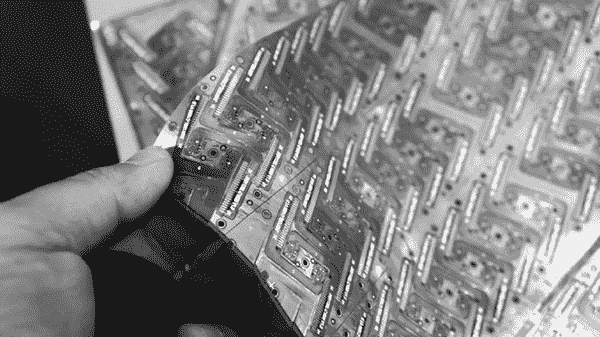

*通过模切技术实现的复杂柔性电路形状*

#### 执行工艺能力测试

参观完工厂后，下一步是进行*工艺能力测试*，以突破制造工艺的极限。我们设计了一种非均匀的贴纸变体，涵盖了各种工艺能力的考验：长的导电孔链、3 毫英寸的线宽、0201 元件（小型表面贴装封装）、0.5 毫米间距的 QFN 元件（所有接触点都在底部的表面贴装元件）、体积较大的元件、使用焊接掩膜代替盖覆层、丝印的精细细节、固定标签、弯曲切口、混合型 SMT 和插孔焊接技术、Z 型胶带层压等。我们的工艺能力测试故意破坏了部分制造过程，目的是发现可能阻碍设计成功的薄弱环节。

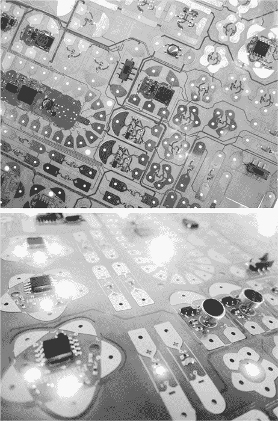

*我们为工艺能力测试制造的电路贴纸设计*

当我第一次提出设计方案时，工厂直接拒绝了，称其无法制造。但在我解释了我的目标后，工厂同意生产该设计，前提是我愿意接受并支付所有生产的单元费用，当然包括不合格的部分。通过分析不合格单元的故障模式，我制定了一套设计规则，以保持高产率（从而降低成本）并成功生产电路贴纸。

根据这些设计规则，Jie 和我创建了我们的第一套“生产候选”贴纸。它们包括四种不同颜色的 LED（白色、红色、蓝色和黄色），以及两套智能贴纸。第一套智能贴纸包含一个预编程的微控制器，可以生成光的图案，例如渐变、心跳、闪烁和眨眼。我们称这些为“效果”贴纸；它们是一种*物理编程*，使非编程人员也能定制他们项目的行为。第二套贴纸包含一个用户可编程的微控制器，并加载了一个有趣的录音和回放功能作为演示，以及三个传感器。我们称这些为“传感器与微控制器”贴纸。

我们运行了少量生产候选批次，以找出在需要扩展时可能遇到的问题，并彻底调查任何会影响可靠性、产量或可用性的问题。特别是，我们必须开发一种新颖的方法，将 Z 胶带层压到贴纸的背面，以便与制造贴纸所需的模切工艺兼容。

在经过两轮生产候选方案后，我们感觉准备好了，想看看其他人能用电路贴纸做些什么。由于这是 Jie 的博士研究的一部分，我们有两种选择进行用户测试。传统的学术方法是向她的导师申请预算，制作有限数量的贴纸，并举行一系列闭门研讨会，研究年轻而富有创意的人们如何与这种新媒体互动。但这发生在 2013 年，所以可行的众筹平台开启了将我们的研究直接提供给感兴趣的用户的可能性，从而使我们能够进行大规模研究。Jie 所研究的麻省理工学院媒体实验室也非常关注通过大规模研究所能带来的可能性，这一点体现在他们的“部署”计划中。2011 年，当 Joi Ito 成为媒体实验室的新主任时，他开始将媒体实验室的文化从“展示或死”转变为“部署或死”，最终简化为不那么具有威胁性的“部署”指令。在旧的“展示或死”制度下，研究小组被鼓励创建炫目的技术演示，以帮助筹集资金。在伊藤的指引下，目标是通过众筹和精益硬件等工具，将技术从实验室带到外部世界，从而进行大规模研究。

2013 年 11 月，我们与 Crowd Supply 启动了一项众筹活动。对于我们来说，保持电路贴纸背后的学术使命是非常重要的，所以我们将资金目标定为仅仅 1 美元。如果即使只有一个人觉得电路贴纸可能有趣，我们也会制作这些贴纸，并与那个人合作收集反馈。当然，我们还会将这些研究成果公开，以便有些人可以分叉这个项目或以其他方式修改他们的电路贴纸。

我们超额完成了谦虚的目标，在不到一个月的筹资时间和非常低调的活动中，募集了接近 $60,000。

### 履行承诺

在我们的众筹活动中，我们声明会在 2014 年 5 月前发货，感谢上帝，我们准时达成了目标。

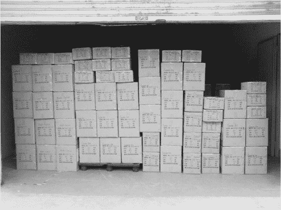

*62 个箱子，里面装有超过一千个 Chibitronics 入门套件，等待提货*

然而，按时交付对任何众筹项目来说都不是一件简单的事。我做出有争议的选择，部分原因是因为 Crowd Supply 在审核硬件产品方面更具经验，而且他们为项目提供的服务（履行、一级客户支持、后期预售支持、根据需求与产能调整交付日期）对硬件初创公司来说是一个福音。将履行、客户支持和持续的电子商务网站作为配套服务意味着我们不必雇人来处理这些事务。无论你的“公司”是由两个人尝试一个学术项目，还是几个人在车库里工作，这都意味着很多。

Crowd Supply 的媒体影响力和品牌实力远不如 Kickstarter，这可能使筹集资金变得更加困难。但归根结底，我认为建立一个可持续的众筹实践示范非常重要，这对企业家和消费者都有好处。这不仅仅是今天为了赚钱；这关乎于打造一个可以信赖的品牌和声誉，让它能够持续多年。

### 为什么按时交付很重要

我为 Chibitronics 设置了一个个人挑战，那就是非常认真地对待我们对支持者的交付承诺。我已经见识过太多表现不佳的众筹项目，我深感担忧硬件众筹正在成为骗局和垃圾邮件的代名词。

Kickstarter 和 Indiegogo 一直被拖欠交付和骗局困扰，而它们对待众筹项目那种轻松的态度，*caveat emptor*（买者自负其责）突显了消费者与众筹网站之间的利益冲突。众筹网站基本上是在对支持者说：“嘿，谢谢你的零钱，但你那美元的去向是你的事。”我真心担心，众筹会因此背上坏名声，最终不再是有意图的企业家和创新者可行的平台。

关键是：如果我不能向当前和未来的支持者证明我能按时交付项目，我将失去一个宝贵的发布未来产品的平台。幸运的是，我们通过 Chibitronics 证明了自己的能力，之后我继续使用 Crowd Supply 进行其他众筹项目。

### 经验教训

我们并不是因为容易而按时交付 Chibitronics 的。当我制定原始的项目时间表时，我的交付时间范围从 2014 年中国春节（2 月）之后一直到 4 月左右。我在时间表的最大时间上多加了一个月以防万一，结果我们确实用尽了这个额外的时间。

在这个过程中，我犯了很多错误，但通过辛勤工作、运气、规划和与工厂的良好关系，我们成功克服了许多困难。以下是我在这个过程中学到的一些经验。

#### 并非所有简单的请求对每个人来说都是简单的

每个 Chibitronics 入门套件都包括了一本 Jie 所写的精彩书籍的实体副本，这本书是一本逐步指导设计电路贴纸的自学指南——*电路贴纸素描本*（见 第 256 页–257 页）。这本书不同寻常，因为它的设计是让你把电子电路贴进去，因此我们需要定制印刷的多个方面。纸张需要具备合适的厚度，以便在 LED 放置在纸张下方时能有良好的光线扩散效果。装订也需要特别关注，以确保更好的电路制作体验，甚至在书籍的后面有一个小口袋，用来存放作为书中项目一部分的工艺材料样品。

印刷商发现大多数请求都相对容易满足，但有一个请求特别让他们感到困惑。书籍的金属螺旋装订需要是非导电的，这样在装订线上放置铜带时就不会意外地造成短路。

对于一个专门设计电路的人来说，检查电线的导电性看起来是个足够简单的请求，但对于一个书籍印刷商来说，这就显得有些奇怪。传统的书籍印刷或装订并不需要这样的知识。印刷商最初表示，他们无法保证装订线的导电性。果然，第一根样品线是非导电的，而第二根则是导电的，印刷商也无法解释为何如此。

面对面的会议在这里是无价的。我们没有通过邮件对印刷商发火，而是在我每月去深圳的行程中安排了一次与他们的会议。我们进行了富有成效的讨论，解决了他们的顾虑，会议结束时，我们为他们订购了一台价值 5 美元的万用表，作为确保书籍脊背不导电的交换条件。最终，印刷商只是因为没有相关的质量控制程序，无法保证这一点，这完全是合理的。我们只是需要教他们如何使用万用表。

这个不寻常的非导电要求确实将我们的交货时间延长了几天，并增加了几分钱的书本成本，但总体来说，我愿意接受这种妥协。

#### 永远不要跳过检查图

电路贴纸的焊盘形状是复杂的折线几何图形，而我使用的 PCB 设计软件 Altium 处理这些形状时不太流畅。我通过艰难的经验发现，在 Altium 中，焊盘的焊膏层有时会因为几何形状复杂而消失。我设计的旧版本中，焊膏层是存在的，但在保存设计文件后，这一层会悄无声息地消失。虽然这种 Bug 比较罕见，但它确实会发生。通常，我会将 Gerber 文件导入第三方工具中作为检查图，在下单之前进行验证，但这次因为时间紧迫，我只是重新订购了一个之前已成功的设计，所以跳过了检查图的步骤。

结果呢？价值数千美元的 PCB 被废弃，我们的进度也因此延误了四周。真是痛啊。

幸好我提前预留了交货日期——而且我也备着一瓶上等威士忌，帮助我更轻松地接受那些因为自满而带来的痛苦提醒。

#### 如果一个组件可以被放置错误，它就会被放置错误

我对零件放置错误非常敏感，因为这个问题曾让我吃过很多亏。Chibitronics 效果贴纸页就是一个典型的“潜在问题”例子。

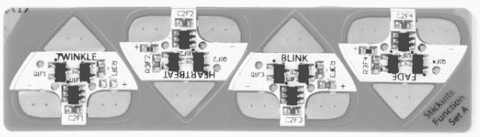

*Chibitronics 效果贴纸*

该贴纸页是四个闪烁不同图案的 LED 贴纸，它们的其他部分是完全相同的。闪烁的图案由软件控制。试图管理四个独立的固件文件，并确保它们正确加载到测试器中的各个位置，简直是一个灾难。为了解决这个问题，我设计了这些贴纸使用完全相同的固件。它们的行为则由一个外部电阻的数值设置，这个电阻在启动时通过微控制器的集成 ADC 进行测量。

我的逻辑是这样的：如果所有贴纸使用相同的固件，就不存在“错误”的编程方式，对吧？

不幸的是，我还设计了主 PCB 面板，使其完美对称。你可以将面板以 pi 弧度的角度旋转后放入组装机器人中，组装程序依然可以完美运行——只不过，设置固件行为的电阻会与丝印标签的顺序相反。尽管 PCB 上有用于提供参考框架的基准孔，并且有中英文文本作为独特的方向标识，这个问题还是发生了。在首批效果贴纸样品中，“心跳”贴纸在“闪烁”，而“闪烁”贴纸在“褪色”，反之亦然。

幸运的是，工厂一贯地将板子加载到反方向，这是这种问题的最佳情况。我急忙发布了一个固件补丁（这也是一个有风险的举动），该补丁反转了电阻值的解释，并通过 FedEx 将一批新的样品寄到了新加坡进行检验。我们还在中国生产线上建造了一个二次测试夹具，用于手动双重检查闪烁行为是否正确。

效果表的问题解决了，但在做那个额外的测试时，我们发现了另一个常见问题。

#### 有些概念在中文中难以翻译

我用中文编写了说明，向工厂描述了渐变（慢速闪烁模式）和闪烁（快速闪烁模式）之间的区别，但结果发现中文中*blink*和*twinkle*的翻译很相似。*Twinkle*翻译为闪烁（“闪烁、闪亮”）或闪耀（“闪光、闪烁、发光”），*blink*翻译为闪闪（“闪烁、发光、闪亮”）或闪亮（“明亮、闪闪发光、闪耀、闪烁”）。

我总是害怕用中文为测试操作员编写主观描述，这也是我尽量将测试自动化的原因之一。正如我一个中国朋友曾经说过的，中文是一个非常适合诗歌和艺术的语言，但对于精确的技术交流来说却相当困难。

所以，挑战就是提出一个万无一失的跨文化解释，清楚地描述渐变和闪烁之间的区别，使用简单的术语，任何人都能理解；也就是说，我必须避免使用*random*、*frequency*、*hertz*和*periodic*这样的技术术语。

我给工厂发了一段不同 LED 模式的视频，我们的工厂建议我们用渐变（“渐变变化”）来表示*fade*，用闪烁（“闪烁、发光”）来表示*twinkle*。我仍然不相信这是一个万无一失的描述，但它比我想到的任何翻译都要好。而且直到今天，我们仍然在为向质量控制人员解释这两种效果的区别而烦恼。结果发现，故障的贴纸*也*能产生相当不错的闪烁效果——至少有一段时间是这样。

有趣的是，杰和我也很难达成一致，关于“闪烁”效果应该是什么样子。她形容我们第一次尝试的效果是“更像雷电风暴，而非闪烁”。我们就这个问题进行了几次长时间的讨论，然后看了些示范视频来明确想要的效果。我们基本上是不断调整代码，直到它看起来对我们两个人来说都差不多合适。鉴于我们在相互描述这个效果时遇到的困难，毫不奇怪我在中文中很难准确描述这个效果。

#### 消除单点故障

当我们制作测试夹具时，我们为每个夹具做了两个副本，尽管通量需求只要求一个。为什么？因为可能会有一个失败。

结果怎么样：一个测试夹具确实失败了。我至今也不知道为什么。幸好我们做了两个副本，否则我就得在短时间内赶到中国去诊断为什么我们唯一的测试夹具不起作用了。

#### 一些临时的更改是值得的

在我们与工厂敲定奇比电子套件的订单大约六周前，杰建议我们在传感器和微控制器套件中加入一张贴纸图案的模板。她认为，对于像微控制器这样有七个接触点的复杂贴纸，如果没有接触点图案的图纸，布置铜箔带的图案会非常困难。我最初拒绝了这个提议；我不想因为没有在最初承诺的范围内增加内容而推迟发货。正如杰所发现的，我的情绪变化很大，尤其是当涉及到延期时。（抱歉，杰！感谢你忍耐我。）

但她的论点是有道理的，所以我指示我们的工厂去寻找模板供应商。两周后，我们还没有找到愿意承担这项工作的供应商，但我们的工厂采购部门并没有放弃。最终，他们找到了一家供应商，这家供应商有足够的原材料来准备模切机，并在两周内完成大约几千个模板——几乎刚好赶上计划的进度。

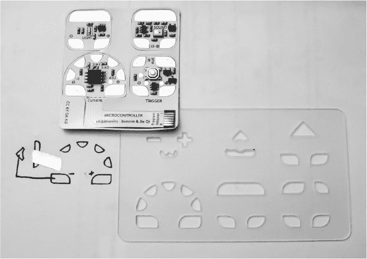

*传感器和微控制器工作表及模板*

当我收到带有模板的传感器和微控制器套件样品时，我试用了它们。杰完全正确地指出了它们的实用性。当我有了一个模板来操作时，尤其是在处理那个有七个紧密排列的接触点的微控制器贴纸时，我发现我的工作效率大大提高，我觉得用户们也会认同。正因为如此，尽管模板在最初的活动中并没有承诺作为一部分，但所有订购传感器和微控制器套件的支持者都收到了一个免费的模板，帮助他们布局设计。

#### 春节影响了供应链

尽管春节假期是为期两周的假期，我们最初的计划几乎已经排除了二月份的时间。现实也与这一预期相符，但我想分享一下春节是如何影响这个项目的，万一你打算在中国制造产品的话，希望你能从中汲取一些经验。

我们的书籍草稿本来在一月份就准备好了，但直到三月我才拿到完整的样品。这并不是因为印刷厂停工一个月；像其他所有人一样，他们的假期大约也只有两周。不过，纸张供应商的假期在印刷厂之前大约提前了 10 天，而装订厂的假期则在印刷厂之后延长了 10 天。尽管每个供应商的假期都只有两周，但定制书籍的整个供应链实际上停工了大约 24 天，或者说几乎整个月的二月。春节假期的错峰安排是因为假期期间的庞大人口流动。

#### 运输昂贵且困难

当我初步计算发货成本时，我意识到我们并不单纯是在卖电路贴纸——考虑到书籍的体积和重量，我们的主要产品其实是印刷纸张。为了优化物流成本，我推动将启动套件（包含书籍）和额外的单独书籍订单通过海运，而不是空运。

实际上，我们几乎在第一个套件发货前四周就准备好了启动套件和书籍，但我们就是无法得到合理的海运报价。我们花了差不多三周的时间与海运公司讨价还价并报价。最后，他们的价格基本和空运差不多，但需要多花三周时间，并且风险更大。显然，海运的运费只是其中的一小部分，真正让你吃亏的是各种附加费，从支付码头工人费到支付所有中介经纪人和仓库处理费用。那些固定成本累加起来，即便我们发货超过 60 个箱子，空运仍然更具成本效益。

**注意**

*作为参考，一个马士基 40 英尺的海运集装箱可以容纳超过 1250 个箱子，每个箱子里装有 40 个启动套件。我们距离能够有效利用海运还差一个数量级。*

#### 直到你发货之前，你还没走出困境

在这个项目的每一个里程碑上，我都不得不提醒自己不要过早地高兴。各种问题， 从常规的 UPS 失误到一场悲剧性的航空事故，再到 Crowd Supply 仓库的物流问题，甚至是海关问题，都可能阻碍按时交付。但至少，我们尽了最大努力确保按时交货。

幸运的是，最终我们的支持者准时收到了他们的订单。从那时起，Chibitronics 一直超出了我最疯狂的预期。虽然我们最初将这个项目作为一个学术实验，但草根用户的采用促使我们将实验发展成了一家完整的公司。由于电路贴纸是一个开源硬件项目，规格可以供精明的黑客玩弄，但大多数用户都是非技术人士，他们从基础使用的支持中能获得更多的帮助。因此，公司努力为用户提供帮助、活动和更多的贴纸，帮助他们继续学习和制作美丽的电子工艺品。

### 总结思考

Chibitronics 对我来说是一次持续的学习经历，因为我从未有过公司像这样成功成熟的经验。我很期待看到公司未来的发展，但作为一名工程师，我也知道自己的局限：我并不适合做生意。当公司足够大，能够以可持续的方式支持自己的员工时，我期待着将公司交给别人，回到我的工作台，继续构思新的开源硬件发明。
