## 9. 硬件破解

破解的最大障碍通常是担心在试探过程中弄坏某些东西。但你必须打破鸡蛋才能做出煎蛋卷；同样，你必须愿意牺牲一些设备才能破解一个系统。幸运的是，获得多台大规模生产的硬件样本非常容易。我经常做一些垃圾桶潜水，或查看分类广告，以获取研究用的样品。我通常会从三台设备开始：一台拆开并永远不再组装， 一台用来探测，还有一台保持相对完好。我使用完好的设备来检查某种行为是否是由于我的探测所引起的，或者仅仅是硬件的正常表现。

我对任何硬件破解的典型方法是，首先打开设备，然后将探针放在正确的位置，而不影响设备的功能。当你研究计算机芯片时，这几乎就是全部挑战。 本章中的第一个破解示例是硅片破解，你将看到，一旦包装去除，裸露的硅片暴露在眼前，攻击者就拥有了巨大的优势。

一些硬件破解需要更多的系统工程，特别是当你想逆向工程并重新利用一个设备时。在这些情况下，我倾向于开发额外的定制工具，让我能够接近实时地调整和观察系统，或者至少在我能输入命令的速度下，尽量减少验证假设所花费的时间。目标是让主要的限制变成你能多快想到要测试的想法，而不是多长时间才能上传一个改变以测试这些想法。本章中的第二个破解讲述了如何逆向工程一种相对简单的系统单芯片（SoC）设备，这种设备常见于 SD 存储卡中，以及我为辅助这一过程而开发的一些工具。

最后，一些破解不可避免地会突破法律的边界。本章中的第三个破解讲述了 NeTV，一个我开发的系统，它对高清内容保护（HDCP）加密标准进行了全新的解读，HDCP 标准用于保护大多数 HDMI 视频连接。NeTV 是一个既涉及法律问题又涉及硬件系统的破解。它通过重新解释 HDCP 标准，绕过了 DMCA 所带来的棘手问题，从而实现了中间人攻击（MITM），可以在不绕过加密的情况下修改视频数据。没有绕过加密，就没有 DMCA 问题。破解经常突破法律和司法判决的边界。就像任何其他系统一样，法律系统也可以被破解，本章的一个重要收获是如何将法律看作是实现某个特定目标时需要应对的另一个约束条件。

本章的最后一个破解结合了硬件渗透、工具创作和法律考量，旨在逆向工程一个复杂的手机 SoC。这是我和 xobs 一起做的另一个项目，再次证明，构建定制的破解工具是非常宝贵的，因为它使我们能够在系统运行时进行实验。

### 破解 PIC18F1320

保守秘密是任何安全系统面临的常见挑战。为了应对这个挑战，安全系统设计师经常将秘密隐藏在硅芯片内部，因为芯片的坚固环氧封装和微小的几何结构很难穿透和检查。

这个理论上听起来不错，但在实际操作中却有问题。芯片设计师会犯错，当芯片出现问题时，设计师需要一种方式来打开芯片并进行调查。这种情况非常普遍，以至于有专门的商业服务，专门为此目的打开芯片。它们被称为*故障分析服务*，已经掌握了多种去除芯片上顽固环氧树脂的技术。

在我开始学习如何搭建中国供应链并与 Chumby 合作之前的几年，我决定展示一下如果知道故障分析服务，破解一个芯片其实有多简单。当时，Microchip 的 PIC 系列微控制器非常普及，所以我决定尝试一个流行的 PIC 型号。PIC 芯片通常有*配置保险丝*，你可以激活它们来防止某些内存区域被读取或写入。但是，通常会有合法的需求需要读取已加密、已编程的 PIC 内容。例如，一家公司如果丢失了产品文档或失去了原来编写加密 PIC 代码的人员，就无法读取芯片。这对需要修订或升级旧款产品线的公司来说是一个问题。

我想弄清楚如何从加密的 PIC 中转储内存。我知道要想做这件事，必须打破一些规则。所以我从朋友那里拿到了四个 PIC18F1320 并开始拆解它们。这是我发现的。

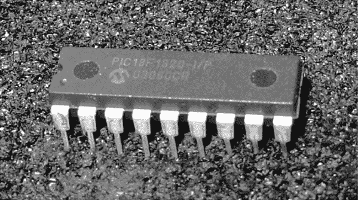

*原始状态下的 PIC18F1320*

#### 去封装 IC

首先，我需要去掉顶部才能看到芯片内部的硅。许多自制的去封装芯片技术通常涉及使用硝酸或硫酸，但这些化学品你不希望在家里存放，而且它们也不容易获得。特别是硝酸，是制造炸药的重要化学品。所以，我发现最简单、最可靠的去封装方式就是直接把芯片送到故障分析实验室。大约 50 美元，你可以在两天内获得一个去封装的芯片。

我为这个项目去掉了三个芯片的封装。其中两个是*功能性去封装*（在保持设备仍在引脚框架中的情况下揭示硅芯片，完全可操作），最后一个是*完全去封装*（只是裸硅芯片，没有封装）。我去掉了一个芯片的封装，因为我的检查显微镜在最高放大倍数下工作距离非常短，封装上剩余的环氧树脂会干扰镜头。

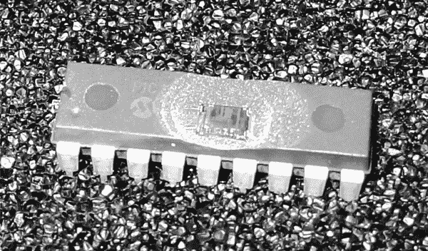

*功能性去封装的 PIC18F1320。

中间的小方块（现实中呈金色）是硅芯片。*

#### 仔细观察

手中拿着已经去掉封装的集成电路（IC），我用显微镜仔细观察了其中一个芯片的表面，注意到了一些显著的特征。由于物理规律在任何地方都是相同的，硅芯片中的大多数精细结构看起来几乎是一样的，不管是哪个厂家制造的。这些限制条件会一直延续到系统层面，通过一点训练，你可以像读书一样阅读硅芯片。

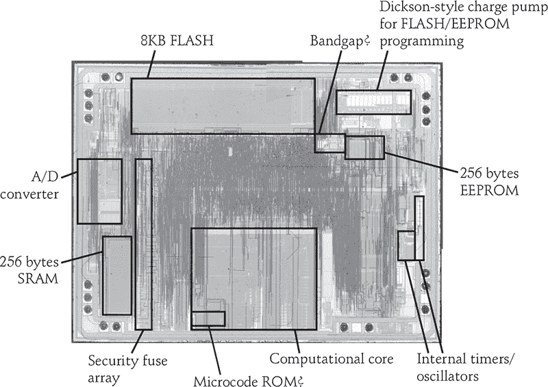

*我对于这个芯片中各种结构的功能的最佳猜测。我可能是错的。*

有一组结构立即吸引了我的注意：一些晶体管上方有金属屏蔽，按照规律的图案排列，正好有足够的设备数量来对应所有的安全位。完全覆盖设备的全金属屏蔽在硅芯片中非常罕见，因此它们像一个大大的 X，标记着存放非常重要内容的地方。

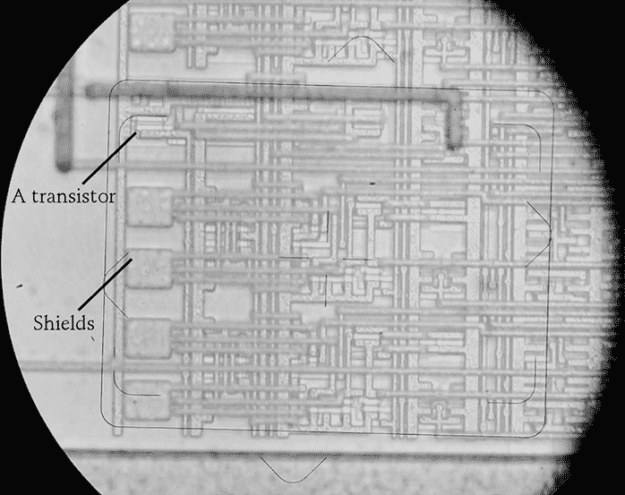

*放大观察金属屏蔽*

#### 擦除闪存

屏蔽层之所以重要，是因为闪存技术的一些有趣事实，这种技术被这款 PIC 设备用来存储安全熔丝信息以及内部程序代码。闪存技术使用的浮动栅极晶体管结构，与老式的*紫外可擦除可编程只读存储器（UV-EPROM）*技术非常相似，比如 1970 年代的陶瓷封装 2716 芯片，这些芯片上有石英窗口，因此可以进行擦除。

在闪存和紫外 EPROM 设备中，数据是在电子隧穿到浮动栅极时写入的，电子会在栅极中停留数十年。浮动栅极中的额外电子会在存储晶体管的特性中产生可测量的偏移。不同之处在于，闪存可以通过电脉冲将存储的电子抽回（擦除设备），而紫外 EPROM 则需要高能光子将电子从浮动栅极中撞出。完成此操作所需的紫外光通常波长大约为 250 纳米。你需要昂贵的石英光学器件来操控这种波长的紫外线，以避免过多的损失，这使得利用这种光源有些困难。

从这些事实中我得出了一个重要结论：闪存设备通常也*可以*通过紫外光擦除，因为它们的晶体管结构与紫外 EPROM 设备相似。闪存设备周围的封装通常会阻止紫外光有效到达芯片表面，但由于这些 PIC 设备的塑料外壳已被去除，我可以尝试施加紫外光并观察发生了什么。

我进行了一次简单的实验，通过为 PIC 设备编程一个逐步变化的模式，反复存储从 0x00 到 0xFF 的十六进制数值。然后，我将 PIC 放进紫外线 EPROM 擦除器中烘烤……大约是洗个长时间的热水澡和查点邮件的时间。当我从擦除器中取出设备时，闪存确实恢复到正常的全 1 状态，安全熔断器则没有受到影响。经过几次烘烤 PIC 设备后，我发现如果我没有烘烤足够长时间，擦除的数据阵列会出现奇怪的读数，例如全 0，这种现象我至今无法解释。

#### 擦除安全位

很明显，覆盖在安全熔断器上的金属屏蔽是为了阻止尝试选择性擦除安全熔断器，同时不影响闪存阵列的操作。

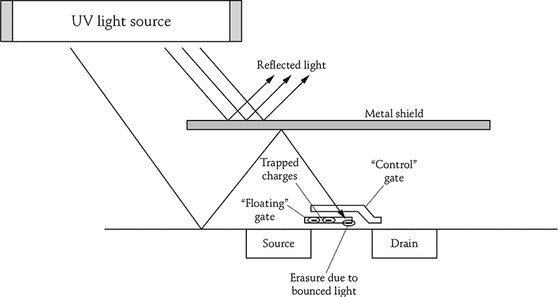

*一张示意图，展示了屏蔽如何妨碍熔断位的操作，以及如何绕过这些屏蔽*

我的难题在于，为了擦除闪存晶体管，必须有高强度的紫外线光照射到浮动栅极。金属屏蔽有效地反射了所有入射光，因此光线无法到达栅极。但我知道，覆盖在芯片上的光学透明保护介电层——二氧化硅与硅本身之间存在折射率不匹配，这意味着光线在某些角度下会从光滑的硅表面反射回来。要了解这种反射效果的例子，你可以跳进游泳池，潜入水下，抬头看水面与空气接触的地方。由于水和空气之间的折射率不匹配，光线在倾斜角度下会发生全内反射，因此水面在这个角度下看起来非常反光。

我计划利用这种反射效应将紫外线反射到氧化层上，再打到金属屏蔽上并反弹回浮动栅极。我认为通过调整 ROM 擦除器内部的 PIC 角度，我可以让足够的光反射到闪存晶体管区域，进而擦除安全位。在用各种小材料调整芯片角度尝试了几次后，我开发了一种意外有效的简单技巧：将芯片按一定角度推入紫外线擦除器的防静电泡沫内。

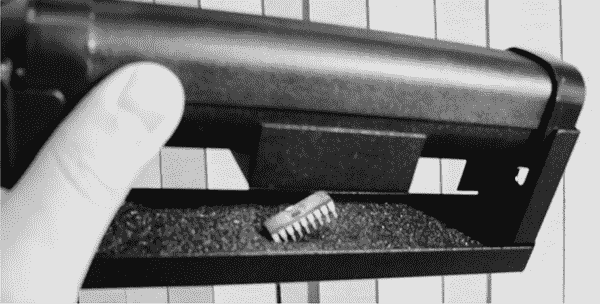

*紫外线擦除器中的芯片与防静电泡沫*

#### 保护其他数据

然而，这种技巧并没有保护我想保留的闪存数据。为了避免擦除这些数据，我用一小块精确裁剪的电气胶带制作了一个硬掩膜，并用稳定的手法、两只镊子和显微镜将掩膜贴在芯片表面。电气胶带阻挡了紫外线直接照射到闪存代码存储区，并且部分从硅基底反弹回来的光线被胶带吸收。

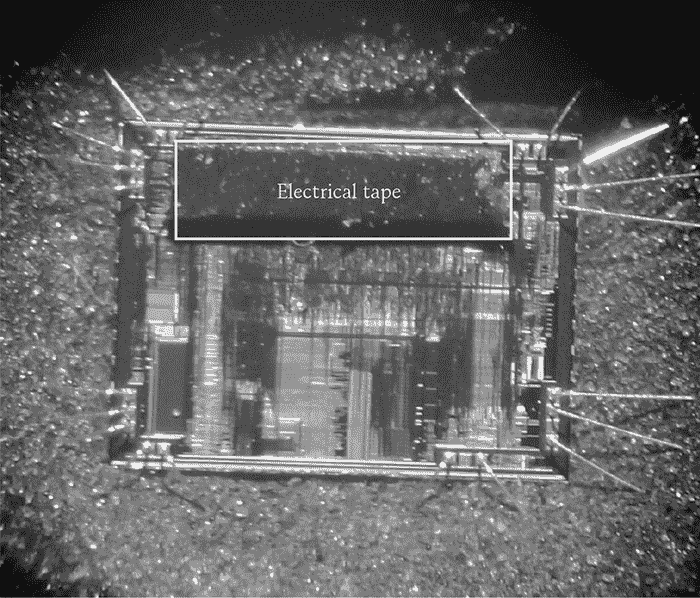

*封装中的芯片，闪存 ROM 数组上覆盖着电气胶带*

这个掩码让我只重置了安全熔丝，而不会对闪存代码阵列造成太大的影响。以下截图展示了我使用的编程和读回工具根据内存阵列的状态。

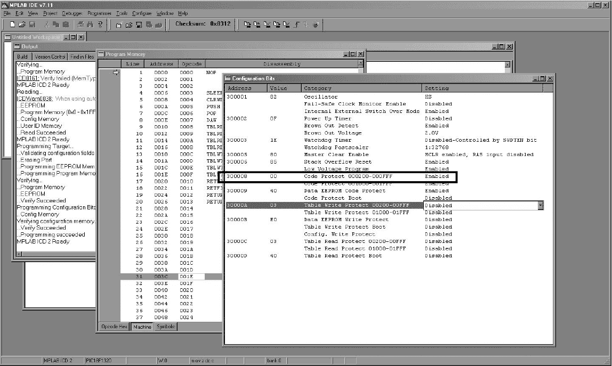

*我的 PIC 编程工作区，显示了擦除前的设备设置 和擦除后的设备设置*

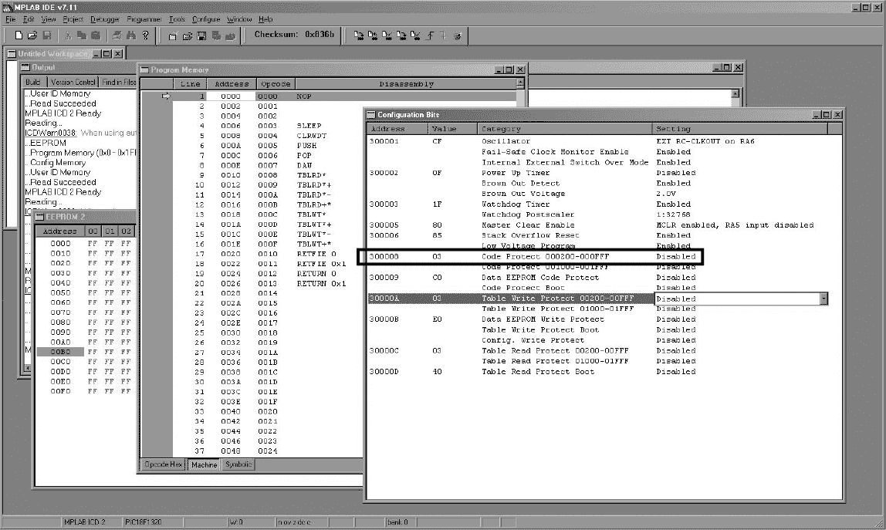

*擦除后的设备设置*

在前图中，请注意配置位窗口中的安全熔丝设置，以及在程序内存窗口中显示的闪存 ROM 中编程的值。在后图中，安全熔丝切换为禁用状态，而程序内存窗口中的闪存 ROM 内容与之前编程的内容完全一致。实际上，代码阵列的另一部分仍然被擦除了，但我可能可以通过剪下一块更大的电气胶带来解决这个问题。

我听说自从这个黑客攻击被公开后，Microchip 开始在代码内存阵列以及熔丝上放置金属屏蔽，使得实施这个攻击变得有些困难。尽管如此，这个攻击仍然突显了硅黑客的一个事实，那就是最难的部分往往是去除外包装，幸运的是，仍然有一些便宜但可能不太为人知的服务可以帮助解决这个问题。

### 破解 SD 卡

几年后，我发现自己又在破解一个有趣的设备——SD 卡。我曾在调查一批可能是伪造的 SD 卡时拆解过 SD 卡，这些卡被发现进入了 Chumby 生产单元，我在《伪造 MicroSD 卡》中对此进行了讨论，见第 156 页。这次，我的目的是弄清楚如何让 SD 卡做一些它原本不应该做的事情。这个黑客攻击是我与我的朋友 xobs 合作的另一个团队项目，资金来自 DARPA 的网络快速跟踪（CFT）计划。CFT 是超级黑客.mudge（L0pht 的原始成员之一）的构思，它是对美国政府的一次黑客攻击，目的是让政府在创新方面变得更聪明，尤其是在与互联网安全相关的问题上。我们在做 Novena 项目时差不多也同时完成了这个任务，而我当时还在与 Jie Qi 合作 Chibitronics 项目。

我和 xobs 发现一些 SD 卡存在漏洞，允许在内存卡上执行任意代码。我们还发现类似的漏洞存在于相关设备中，如 USB 闪存驱动器和固态硬盘。在暗面，这种内存卡上的代码执行使得中间人攻击（MITM）成为可能，其中卡片看起来以一种方式工作，但实际上却做了别的事情，攻击者通过拦截并操纵卡片与设备之间的通信来实现这一点。然而，从积极的方面来看，这个漏洞也为硬件爱好者提供了一个非常便宜且普遍存在的微控制器来源。

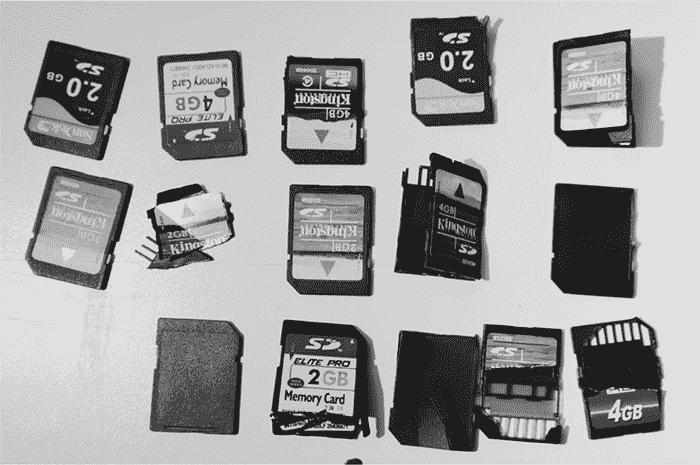

*我们打开的其中一些“蛋”——或者说 SD 卡——找到了漏洞*

#### SD 卡是如何工作的

要理解这个黑客技巧，你需要了解 SD 卡的结构。我接下来要解释的信息适用于所有*受管理闪存*设备，包括 microSD、SD 和 MMC，以及通常焊接在智能手机主板上的 eMMC 和 iNAND 设备，用于存储操作系统和其他私人用户数据。

闪存被宣传为一种连续、可靠的存储介质，而且它非常便宜——便宜到这个前提几乎好得让人难以相信。实际上，所有闪存都充满了缺陷，毫无例外。它通过复杂的错误修正和坏块管理功能制造出了可靠性的假象。这个系统是工程师和大自然之间持续博弈的结果：每次制造过程缩小晶体管尺寸时，内存变得便宜，但也更加不可靠。同样，每一代芯片，工程师都会创造出更加复杂的算法，以弥补大自然在原子尺度上对熵和随机性的倾向。

这些算法过于复杂且设备特定，无法在应用程序或操作系统层面运行，因此每个闪存磁盘都会配备一个相当强大的微控制器来运行一套定制的磁盘抽象算法。即使是微小的 microSD 卡，也包含不止一个，而是*至少*两个芯片：一个控制器和至少一个闪存芯片。（高密度卡会堆叠多个闪存芯片。）

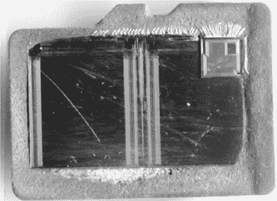

*microSD 卡内部。右上角的小方块是一个微控制器 SoC，它安装在更大的闪存芯片上，负责管理该闪存芯片。*

根据我的经验，集成在存储卡中的闪存芯片质量差异很大。芯片的质量可以从高品质、全新的硅片，到含有超过 80% 坏扇区的材料。如果你关心电子废弃物，可能（或者可能不会）高兴地知道，存储卡供应商通常使用回收的闪存芯片，这些芯片是从废弃的零部件中回收的。较大的供应商往往提供更一致的质量，但即使是最大的厂商，也坚决保留将不同控制器和闪存芯片混合搭配，然后将组装品以相同的零件号出售的权利。如果你正在处理与特定实现相关的错误，这无疑是一场噩梦。

内存卡中的嵌入式微控制器通常是一个经过重度修改的 Intel 8051 或 ARM CPU，接近 100 MHz 的性能水平，并且在芯片上集成了多个硬件加速器。令人惊讶的是，将这些控制器添加到内存卡上的成本仅约为$0.15 到$0.30，特别是对于那些能够在同一业务单元中生产闪存和控制器的公司来说。更有趣的是，由于在晶圆级别测试芯片的高成本，添加一个管理坏块的微控制器可能比彻底测试和表征每个原始闪存芯片的成本还要低。而事实上，尽管功能更多，管理型闪存设备的每位成本往往低于原始闪存芯片。

每种闪存实现都有独特的算法要求，这增加了微控制器必须处理的硬件抽象层的数量。这种复杂性不可避免地会导致漏洞，这意味着将静态代码烧录到片上 ROM 中并不可行，特别是对于第三方控制器而言。

因此，固件加载和更新机制几乎是必须的。最终用户很少接触到这个过程，因为它通常发生在工厂里，但这个机制是存在的。在中国电子市场上，我曾看到店主将固件烧录到卡片上，以“扩展”卡片的容量。换句话说，他们加载的固件报告的卡片容量要远大于实际可用存储。这种在销售时就能做到的事实表明，更新机制可能并没有得到很好的安全保障。

#### 反向工程卡片的微控制器

我和 xobs 在使用 AppoTech 的 AX211 和 AX215 微控制器探索内存卡时，发现了这个漏洞的一个例子。我们发现了一个简单的“敲击”序列，它通过制造商保留的命令（一个名为`CMD63`的命令，后面跟着字节`A`、`P`、`P`、`O`）将控制器置于固件加载模式。收到敲击序列后，卡片接受接下来的 512 字节，并将数据作为代码执行。

**注意**

*我在这里描述的 AppoTech 芯片技术上集成了足够的功能，从学术角度来看，它们不仅仅是微控制器；它们是完整的 SoC。但对我来说，称 AppoTech 为 SoC 有点*奇怪*，所以我不会这么称呼它。对我而言，它永远是一个微控制器！*

这个特定内存卡上的 AppoTech 系统也使用了 8051 微控制器。通过“敲击序列”突击，我们使用了分析代码的工具 IDA（交互式反汇编器）和*模糊测试*（即给微控制器输入无效或随机数据，看看它如何响应）相结合的方法，反向工程了 8051 的大部分功能特定寄存器。这使我们能够在没有制造商专有文档的情况下为控制器开发新型应用。我们大部分工作是使用我在第七章中描述的 Novena 笔记本硬件完成的。

正如我在本章开头提到的，我们开发了几个定制工具来帮助我们逆向工程 SD 卡。我们（严格来说是主要由 xobs）制作的一个更有趣的工具是一个交互式 REPL（读取-评估-打印-循环）外壳，用于在 SD 卡上执行任意代码。以下列出了该环境的外观。

```
root@bunnie-novena:~/ax211-code# ./ax211 -d debug.bin
FPGA hardware v1.26
Debug mode APPO response [6]: {0x3f 0x00 0xc1 0x04 0x17 0xab}
Result of factory mode: 0
00000000  0f 41 1f 0f 0f 0f ff ff                      |.A......|
Expected 0x00 0x00, got 0x0f 0x41
Loaded debugger
Locating fixup hooks... Done
AX211> help
List of available commands:
   hello Make sure the card is there
    peek Read an area of memory
    poke Write to an area of memory
    jump Jump to an area of memory
 dumprom Dump all of ROM to a file
  memset Set a range of memory to a single value
    null Do nothing and return all zeroes
  disasm Disassemble an area of memory
     ram Manipulate internal RAM
     sfr Manipulate special function registers
    nand Operate on the NAND in some fashion
   extop Execute an extended opcode on the chip
   reset Reset the AX211 card
    help Print this help
For more information on a specific command, type 'help [command]'
AX211> help disasm
Help for disasm:
Disassemble a number of bytes at the given offset.
Usage: disasm [address] [bytes]
AX211> disasm 0x200 16
.org 0x0200
        nop
        nop
        reti

        nop
        mov R7, A
        reti

        mov R7, A
        nop
        mov R7, A
        nop
        mov R7, A
        nop
```

在这个环境中，我们可以在调试器中运行程序，通过输入 `help` 获取可用命令及其功能列表，输入 `disasm` 反汇编代码段。虽然开发这样一个功能丰富的交互工具花费了大量时间，但这个努力很快得到了回报，因为我们能够使用自动化模糊测试框架测试复杂的假设。

代码上传的大小限制为 512 字节，这意味着我们必须在主机 Novena 计算机和目标设备之间划分 REPL 环境。* 例如，反汇编某个特定内存区域的操作会分解为在主机端执行的脚本，脚本向 AX211 发出请求，以转储请求的内存部分，接着在主机 ARM CPU 上运行反汇编算法。

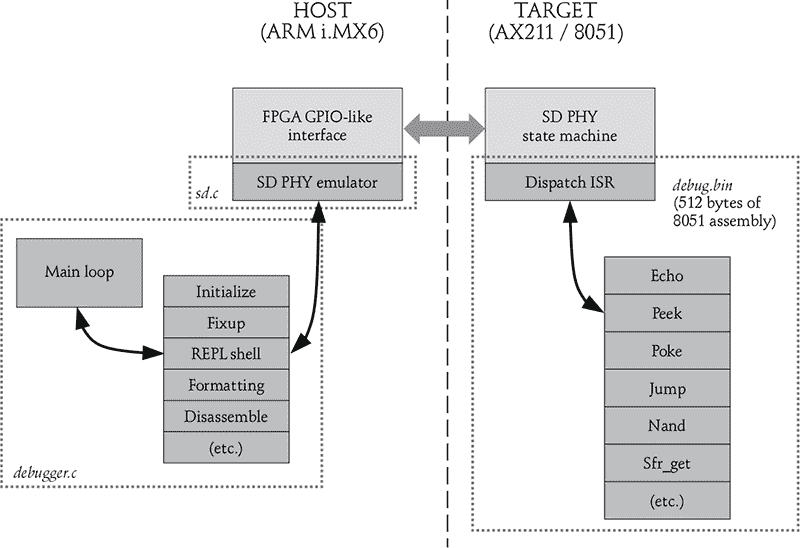

*将 SD 调试功能在主机和目标之间进行分配*

我们构建的工具从 SD 物理仿真层开始，我将其称为 *PHY*。我们使用 Novena 中内置的 FPGA 为 SD 主机 PHY 提供类似 GPIO 的寄存器 API。这里有一个寄存器用于数据输出，一个寄存器用于数据输入，还有一个寄存器用于按位设置数据方向。AX211 卡通过定制的柔性电路适配器连接到 FPGA。*

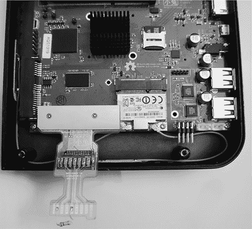

*连接到 Novena 的柔性电路适配器*

SD 命令通过 AX211 接收，并由连接到嵌入式 8051 CPU 的硬件状态机处理。状态机负责接收数据，并计算和检查循环冗余码以进行错误检测。一旦状态机接收到完整的数据包，它会通过中断通知 8051 数据包的到达。

我们劫持了中断处理机制，并将默认处理程序重新映射到我们自己的 512 字节代码存根。这样，我们就能够定义一组新颖的 SD 命令，用于实现 REPL 环境所需的回调函数，例如 `peek`、`poke`、`jump`、NAND 寄存器操作等。这些回调也为实施 MITM 攻击提供了理想的挂钩。

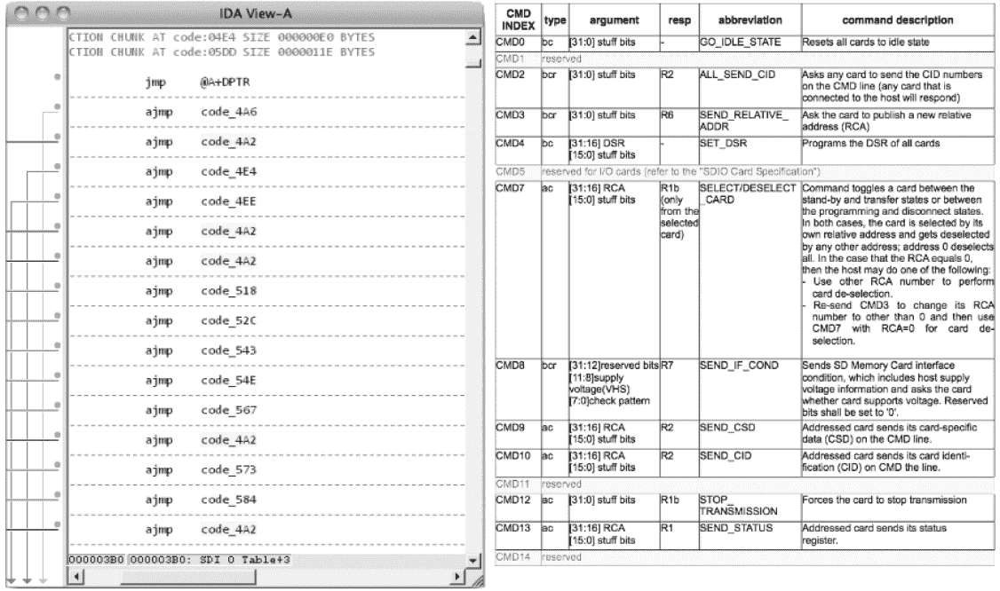

*REPL 的回调函数，显示在 IDA 中*

我不清楚还有多少其他厂商没有保护他们的固件更新过程。AppoTech 是 SD 控制器行业中的一个相对较小的玩家；还有一些你可能从未听说过的公司也生产 SD 控制器，包括 Alcor Micro、Skymedi、Phison 和 SMI。当然，还有 SanDisk 和 Samsung。每家公司都有不同的固件加载和更新机制。但我知道至少有一个使用 ARM 指令集的三星 eMMC 实现存在一个 bug，需要通过固件更新器推送到 Android 设备上，这也暗示着另一个可能的、有前景的探索方向。

### 潜在的安全问题

从安全角度来看，我们的研究表明，虽然存储卡看似无害，但它们运行的代码可以被修改，用来执行难以检测的中间人攻击（MITM）。目前没有标准协议或方法来检查和验证存储卡微控制器上运行的代码内容。如果你在高风险、高敏感度的环境下使用 SD 卡，不要认为运行`security-erase`命令（或其他某些安全擦除工具）就能确保完全擦除敏感数据。如果你真的需要让数据彻底消失，我建议通过完全物理销毁来处理你的存储卡。如果有需要，可以用研钵和杵把它碾碎。

### 爱好者的资源

从 DIY 和黑客的角度来看，我们的研究表明，存储卡可能是一个有趣的来源，可以为简单项目提供便宜而强大的微控制器。一个 8 位、16 MHz 的 Arduino 克隆板大约需要花费$20。而一张带有几 GB 内存的 microSD 卡和性能是其几倍的微控制器则只需花费极小的价格。尽管 SD 卡的输入输出性能的确有限，但通过巧妙地破解 SD 卡上的微控制器，可能会为基于 I2C 或 SPI 的传感器提供一个非常经济且紧凑的数据记录解决方案。

### 破解 HDCP 保护的链接以允许自定义叠加层

“那很酷，但这合法吗？”这是我在破解时经常被问到的问题。就像工程系统有破解一样，法律系统也有漏洞。有些法律漏洞是设计使然；而有些则是无意中产生的。无论是哪种情况，它们都能为创新提供重要的喘息空间。在考虑破解时，我会像考虑工程限制一样考虑法律问题，这就像必须将某个东西装入特定高度的机箱，或者让它在给定的电池上运行特定时间。

大约在 2011 年，当我还在 Chumby 时，我们在思考如何应对 iPhone 和安卓手机占领我们希望进入的市场细分。成本是用户接受的永恒障碍，而 Chumby 中集成的 LCD 屏幕无疑是最昂贵的部分。我们当时的首席执行官 Steve Tomlin 指出，家里最大的屏幕仍然没有以任何有意义的方式连接到互联网。于是，这个问题被抛给了我：我们能否找到一种方法，一举两得，既去掉屏幕这一部件，同时把电视带入互联网时代？那时像 Google Chromecast 和 Logitech Revue 这样的产品还未问世。

我们想到，或许可以把一台便宜的计算机装进一个可以插入 HDMI 端口的棒子里。这样就解决了将 Chumby 显示到电视屏幕上的问题，但当选择 Chumby 时，你就不能看你最喜欢的电影或电视节目了。我们认为人们真正想要的是某种方式，既能看电视，又能在屏幕上弹出比如 Twitter 或 Facebook 的通知。

这个概念非常简单。获取来自机顶盒、蓝光播放器或 AV 接收器的现有输出，传入一个将 Chumby 内容与视频信号融合的盒子，然后将合成后的信号传送到电视上。但由于 HDCP 加密技术在数字视频信号中的广泛应用，如果你采用错误的方法混合内容，从法律上讲是非常危险的。找到正确的方法就是 NeTV 诞生的原因。

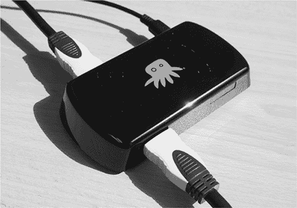

*带有 Chumby 标志的 NeTV*

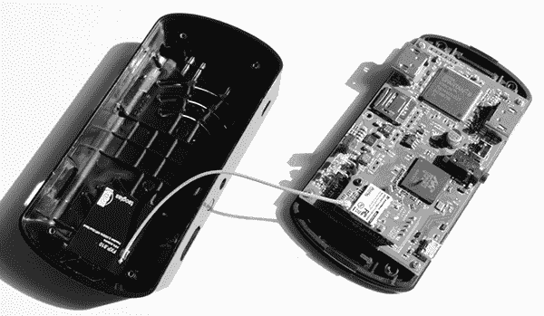

*NeTV 内部*

#### 背景与 context

NeTV 是我对如何在法律框架内将现有视频与互联网内容混合的回应，得益于 2010 年 9 月公开发布的 HDCP 主密钥。为了帮助你理解这个黑客行为，我们先从 HDCP 的背景开始讲起。

高带宽数字内容保护（HDCP）是一种用于加密通过 HDMI 传输的视频信号的像素级加密系统。HDCP 让广播公司和电影公司掌控其内容播放的屏幕，因为这些公司利用加密作为版权控制机制。HDCP 限制了合法的视频内容操作，比如画中画显示、内容叠加、第三方过滤和图像修改。将 HDCP 与数字千年版权法案（DMCA）结合起来后，你会意识到，在观看某些视频时，擅自修改屏幕上的内容是非法的。这也是为什么实际上没有多少 HDMI 视频混合解决方案能够操作广播或电影内容。

回顾一下，我为 NeTV 设定了四个目标：使消费者能够进行内容重混，允许用户消除广告或将其替换为与自己相关的广告，创建互动电视体验，并使其与任何电视兼容。为了实现这些目标，我将 NeTV 设计为中间人，从例如 Blu-ray 播放器获取数据，并应用主密钥以提供自定义叠加效果。视频叠加有许多应用场景，但基本的场景是，当你在享受内容 X 时，你还希望能够了解内容 Y。将这两个内容源结合起来需要一个视频叠加机制。

通过我的 MITM 攻击，NeTV 在任何视频流上叠加了一个 WebKit 浏览器（Safari 和 Chrome 使用的引擎）。这个技术的具体应用案例是将 Twitter 动态作为新闻滚动条覆盖在电视节目上，实时观看社区评论，并且是在你观看节目的同一屏幕上。有些电视节目已经尝试将 Twitter 动态结合进来，但他们仅在源端做了这些；用户只能观看节目显示的标签。然而，通过这个黑客技术，相同的广播节目（例如一场政治辩论）就能根据观众 Twitter 爬虫中输入的标签，提供截然不同的观看体验。

一个简单的事实是，简单的视频叠加是一个有趣的话题，这说明了 DMCA 所带来的对传统权利和自由的扭曲。然而，与人们猜测主密钥发布后可能出现的 HDCP 去除器不同，我的黑客行为从未解密它操作的原始视频数据。因此，它没有绕过版权，DMCA 无法适用。漏洞找到了！

#### NeTV 的工作原理

当然，我将该漏洞作为一个完全开源的项目发布，*，包括硬件以及我用来创建 TMDS 兼容源和接收器的 Spartan-6 FPGA 的 Verilog 实现。TMDS 是 HDMI 和 DVI 使用的信号标准。FPGA 内部的基本流水线将输入的视频进行反序列化，然后再序列化到输出端。在这个简单模式下，NeTV 仅仅是视频的信号放大器：加密的像素输入，加密的像素输出——没有解密，也没有视频处理。

NeTV 可以将用户生成的内容流与加密视频流混合，因为 HDCP 加密时不进行验证。换句话说，如果中间人篡改了加密流，接收器会直接接受篡改后的像素作为有效数据，解密后并将其呈现给用户。缺乏链路验证是有意为之，也是必要的。HD 视频链接的自然比特错误率非常高，但人眼即便在每 10,000 个比特中有 1 个错误时，也无法察觉（在高错误率下，用户会在屏幕上看到“闪烁”或“雪花”效果，但图像基本完好）。允许一些像素级的损坏能保持消费者成本低廉，否则将需要更高质量的电缆并采用 FEC 技术，才能实现与严格的加密验证技术（如全帧哈希）兼容的比特错误率。

因此，NeTV 的主要挑战是生成与发射器密钥流相同并同步的密钥流，使用该密钥流加密用户生成的内容，并在飞行过程中选择性地将发射器的像素交换为用户加密的像素。如果一切对齐，接收器将解密出看似完美的图像，即用户生成的内容叠加在原始视频流之上。

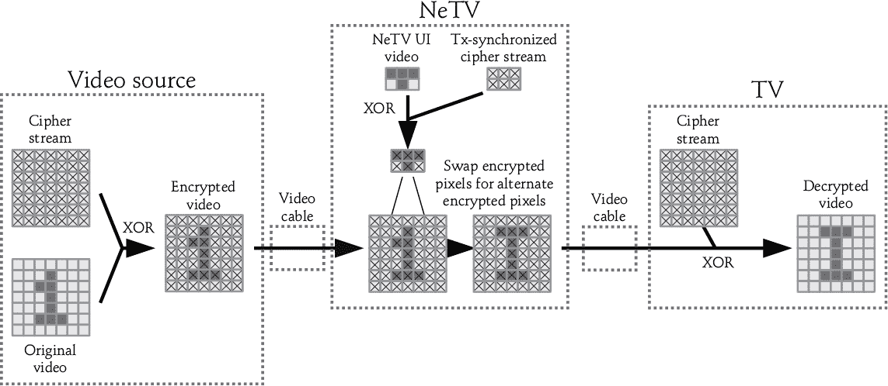

*NeTV 工作原理的高级概念图*

##### 创建覆盖层

为了生成用户覆盖内容，我们将一台小型嵌入式 Linux 计算机连接到 FPGA。从 Linux 计算机的角度来看，FPGA 模拟了一个并行 RGB LCD，可以通过使用帧缓冲区 */dev/fb0*（Linux 中第一个帧缓冲区的文件路径）来访问。Linux 计算机将在启动时自动启动一个全屏的 WebKit 浏览器，从而将 */dev/fb0* 填充为用户的内容。

系统通过观察 WebKit 覆盖层视频的颜色来选择交换哪个像素，这个技巧被称为 *色键技术*。覆盖层视频没有被加密，并且是用户生成的，因此查看覆盖层视频的颜色是完全合法的。然而，其他更具表现力且在美学上更具吸引力的像素合成方法（如 alpha 混合）则需要解密原始视频，这将是非法的。

如果覆盖层视频匹配某个特定的色键颜色（在这种情况下，是特定的亮粉色），则显示传入的视频；否则，显示覆盖层视频。按照这一系统，用户可以在自定义 UI 中创建透明的“孔”，以展示底下的原始视频。由于 UI 是通过 WebKit 浏览器渲染的，用户可以通过简单地在 UI 页面 CSS 中设置背景色为那种魔法粉色来实现色键效果。使用这些设置后，网页的默认状态将是透明的，所有渲染在其上的项都是不透明的，只要 UI 元素避免使用色键颜色并关闭像抗锯齿这样的增强效果。

##### 构建密钥流

当然，色度键控发生在加密域中。因此，FPGA 的第二项任务是窃听 HDMI 连接，并制作一个与发射器完全相同的密钥流。首先，FPGA 观察了 HDMI 上的 I2C 连接，该连接被称为*数据显示通道*（DDC）。DDC 使得显示器能够报告其能力记录（称为*扩展显示识别数据*，或 EDID），并且也是加密密钥交换的地方。

通过观察发射器和接收器之间的密钥交换握手，NeTV 可以借助 HDCP 主密钥数学地提取发射器和接收器的私钥。一旦私钥向量被推导出来，它们可以像源或接收端一样被相乘，以推导出共享的秘密，称为 Km。当共享的秘密写入 FPGA 的 HDCP 引擎时，密码状态就绪，从而使 NeTV 能够加密视频源和视频显示设备之间传输的视频叠加层。

通过将法律约束视为另一种工程约束，我能够创造出一种全新的设备，这证明了一个观点：自动将绕过 DRM 系统的黑客行为与规避版权的尝试等同起来是错误的。NeTV 从不解密之前加密的视频，并且在没有有效的 HDCP 连接的情况下无法操作，这使其成为 HDCP 主密钥的真正合法且商业上有用的应用。

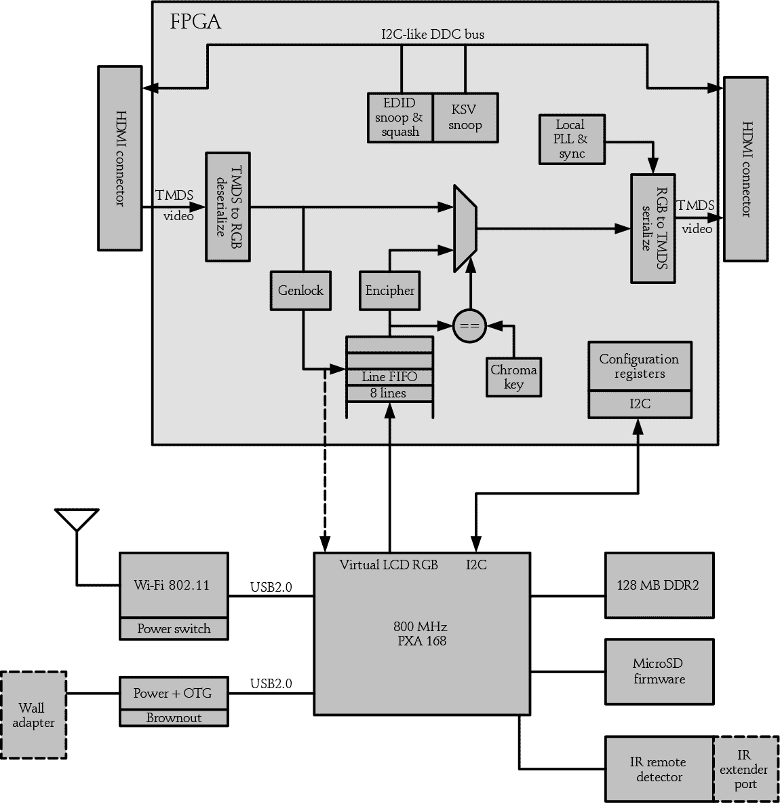

*更详细的框图展示了 NeTV 的 FPGA 如何工作*

到目前为止，在本章中，我们已经看到了不同硬件黑客方法和技巧的示例，从物理渗透到系统级工具构建与分析，再到将法律约束视为工程问题。在“谁是山寨？”一节中，位于第 122 页，我讨论了一个名为 Fernvale 的项目如何采用法律手段逆向工程一个手机芯片。在将法律视为工程问题的同时，我和 xobs 不得不竭尽全力，运用我们掌握的所有技术手段来逆向工程如此复杂的系统。本章的其余部分深入探讨了其中一些技术。

### 破解山寨手机

当我和 xobs 在 Fernvale 项目中工作时，我们的目标是从我那台$12 的公开手机硬件中衍生出一个新平台，并将技术信息重新引入开源 IP 系统。我们对一些芯片的部分内容没有任何文档，但这并没有阻止我们。我们航行在复杂的法律水域中，并创造了自己的自定义脚本语言，以编程芯片的固件，避免无意识的剽窃。

然而，与固件相比，硬件的逆向工程任务相对简单。我们搜集到的文档给了我们芯片引脚布局的概念，且引脚命名方案足够清晰，以至于我可以凭借常识和经验猜测如何连接这些引脚。对于不明确的部分，我使用万用表测试了一些拆解的手机，或者通过显微镜观察它们以确定连接情况。在最糟糕的情况下，我会用示波器探测一个工作中的手机，以确保我正确理解了连接方式。更难的问题是如何设计硬件架构。

#### 系统架构

我们并不是要制造一部手机，而是做一个更接近 Particle 的 Spark Core（现在的 Photon）的产品，即一个为物联网应用设计的通用系统模块型单板计算机。事实上，我们最初的设计和引脚布局是为了兼容 Spark 硬件扩展生态系统的，直到我们意识到公开手机的 MT6260 微控制器有太多有趣的外设，无法在这么小的体积中容纳下。

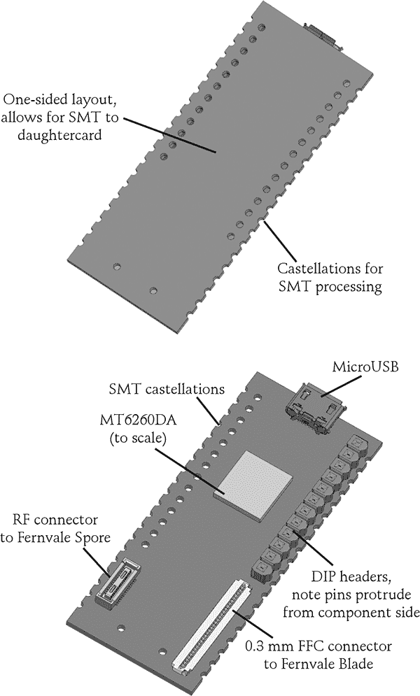

*Fernvale PCB 的早期草图*

最终，我们选择了一个单面核心 PCB，称之为 Fernvale Frond，嵌入了 microUSB、microSD、电池、相机、扬声器和蓝牙功能（以及必备的按钮和 LED）在一块板上。Frond 设计得既薄又小，厚度为 3.5 毫米，长度为 57 毫米，宽度为 35 毫米。我们在板上设置了安装部分引脚头的孔位，孔距适配 Arduino，尽管这块板只能插入 3.3V 兼容的 Arduino 设备。

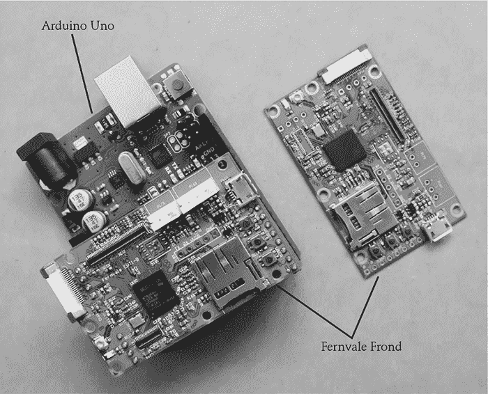

*Fernvale Frond 的实际实现，图中搭配 Arduino Uno 以便对比尺寸*

我们将剩余的外设分开到一对连接器中：一个专门用于 GSM 相关信号（GSM 是 2G 手机网络的协议），另一个用于 UI 相关外设。我们把 GSM 板称为 Fernvale Spore，UI 板称为 Fernvale Blade。我们将 GSM 拆分成一个模块，提供多种 RF 前端选择，使 GSM 成为一个真正由用户安装的功能，从而将监管和排放问题推到用户层面。将 UI 相关功能拆分到另一个板卡也降低了核心模块的成本，让用户在多种场景下尝试 Frond，而不必被限制在特定的 LCD 或按钮布局中。

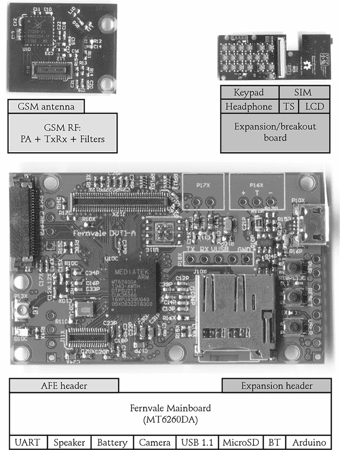

*一张 Fernvale 系统图，展示了三个板卡的各自特点*

**MT6260 内部结构**

我让人对 MT6260 进行了 X 射线检查，帮助我们识别假冒组件。我们不得不从灰色市场采购 MT6260，并且我们希望防止买到空的环氧树脂块或者其他芯片的伪造版本。MT6260 有-DA 和-A 两种变种，区别在于芯片内嵌的闪存大小。

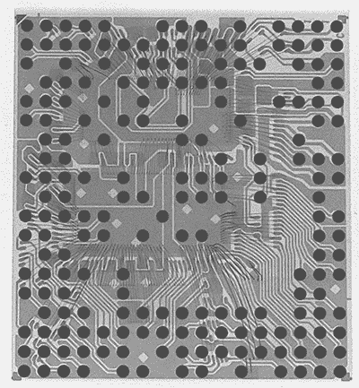

*MT6260 芯片的 X 光图像。

仔细观察，可以发现多个集成电路（IC）在引线焊接之间的轮廓。*

令我们吃惊的是，这款 3 美元的芯片并不包含单个集成电路（IC），而是将至少四个（可能五个）芯片集成在一个包含数百根引线焊接的多芯片模块（MCM）中。我记得 1990 年代末，Pentium Pro 的双芯片封装问世时，曾引发关于 MCM 产量成本与使用单一大芯片的争论；通常认为，MCM 是异国情调且昂贵的。

我还记得在那个时候，Krste Asanović——当时是麻省理工学院人工智能实验室的教授，后来在加利福尼亚大学伯克利分校任教——曾告诉我，电子产品的未来并不是单芯片系统（System-on-a-chip）设备，而是“以芯片为主的系统”（system-mostly-on-a-chip）设备。他主张这一观点的根本原因是，将 DRAM、闪存、模拟、射频和数字功能集成到单一工艺中，增加掩膜层的经济性并不理想；将多个芯片合并成单一封装既更便宜又更容易。

这仍然是一场关于半导体厂商在制造过程中添加更多步骤所带来的成本影响（包括单件成本和非重复工程成本）与组装模块的产量影响、相对可重工性以及更低的非重复工程成本之间的竞赛。在 Krste 提出这一观察时，单芯片系统（System-on-Chip）设备是时代的产物，而且它们至今仍然是，所以看到一个重要的数据点验证了他的洞察力，确实很有意思。

理解芯片的内部结构对于反向工程系统也非常有帮助。得知联发科仅仅是将多个芯片结合在一个封装中，给我们提供了关于其 API 的目的和组织结构的宝贵线索。它还提示我们，系统中的某些元素会在多个产品类别和代际间重复使用，因此我们知道可以从老旧或相关芯片的文档中得出有意义的结论。在拼凑这样复杂的难题时，每一条线索都很重要，包括仅仅通过观察芯片的物理结构得到的线索。

#### 反向工程引导结构

中国的山寨工程师似乎仅仅能接触到足够的文档来组装手机并自定义其用户界面，但却没有足够的资料进行完整的操作系统移植。在拆解了足够多的手机后，我最终意识到，所有基于某一特定芯片组的手机都会有相同的后门代码，并且它们的图形用户界面（GUI）通常与实现的硬件不一致。例如，我在第四章拆解的那款 12 美元的手机就让我不得不把耳机插入耳机插孔才能使用 FM 收音机，然而它根本没有耳机插孔。

为了通过开源许可使 Fernvale 能被西方工程师访问，我们不得不从零开始重建所有内容，包括工具链、固件闪存工具、操作系统和应用程序。但所有中国的手机实现都仅依赖于联发科的专有工具链，这意味着我们不得不进行一些逆向工程，以弄清楚启动过程和固件上传协议。

我逆向工程芯片的第一步通常是尽可能地转储 ROM。我们找到了一款具有外部 ROM 的手机型号，可以将其焊接下来（它使用的是-D 无 ROM 版本的芯片），并通过传统的 ROM 读取器读取其数据。我们在 ROM 中几乎没有看到密文，但却有很多压缩数据。这是我们对 ROM 镜像进行静态分析后记录的一个页面：

```
0x0000_0000        media signature "SF_BOOT"
0x0000_0200        bootloader signature "BRLYT", "BBBB"
0x0000_0800        sector header 1 ("MMM.8")
0x0000_09BC        reset vector table
0x0000_0A10        start of ARM32 instructions
                     – stage 1 bootloader?
0x0000_3400        sector header 2 ("MMM.8")
                     – stage 2 bootloader?
0x0000_A518        thunk table of some type
0x0000_B704        end of code (padding until next sector)
0x0001_0000        sector header 3( "MMM.8") – kernel?
0x0001_0368        jump table + runtime setup (stack, etc.)
0x0001_0828        ARM thumb code start – possibly also
                     baseband code
0x0007_2F04        code end
0x0007_2F05        begin padding "DFFF"
0x0009_F005       end padding "DFFF"
0x0009_F006        code section begin "Accelerated
                     Technology / ATI / Nucleus PLUS"
0x000A_2C1A        code section end; pad with zeros
0x000A_328C        region of compressed/unknown data begin
0x007E_E200        modified FAT partition #1
0x007E_F400        modified FAT partition #2
```

左侧的十六进制数字是内存地址，右侧的文本描述了 xobs 和我认为存储在每个地址上的内容。逆向工程 SoC 时的一个问题是，它有一个在从外部设备加载代码之前始终运行的内部引导 ROM。这个内部 ROM 还可能有签名和安全检查，防止篡改外部代码。

为了快速评估逆向工程这个系统的难度，我们想弄清楚在跳转到外部启动代码之前，CPU 内部运行了多少代码。一台 Tek MDO4104B-6 示波器让我们在短短几个小时内完成了这一任务。

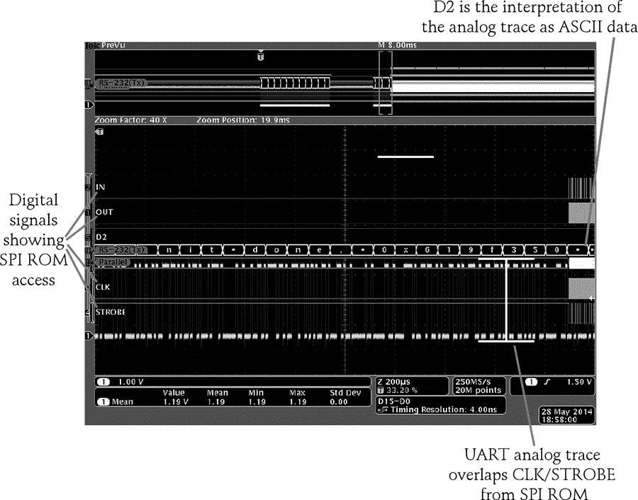

*Tek MDO4104B-6 的截图。

顶部四分之一显示了整个捕获的缩小视图。

注意 SPI ROM 访问时如何通过控制台输出进行标注。*

这款特定的示波器具有一种神奇的能力，可以对深度、高分辨率的模拟波形进行后捕获分析，并将结果输出为数字数据。例如，我们可以在芯片周围用万用表探测，同时反复开关电源，直到看到类似 RS-232 编码信号的东西，然后进行后捕获分析，提取出任何在模拟波形中编码的 ASCII 文本。同样地，如果我们捕获了 SPI 波形，示波器也可以通过类似的方法提取 ROM 访问模式。通过观察文本输出的时序与 SPI ROM 地址模式之间的关系，我们迅速确定，如果内部引导 ROM 进行了任何验证，那也只是非常有限的，远未达到 RSA 加密的计算复杂度。

接下来，我们需要加快度量-修改-测试循环的速度。拆下 ROM、将其放入刻录机并重新焊接到板上，这样的工作很快就会变得枯燥。幸运的是，我们已经在 Novena 上实现了一个 NAND 闪存 ROM 模拟器（我们亲切地将其简称为 ROMulator），之前我们曾用它来逆向工程某些 SD 卡中包含的 AX211 芯片。我们只是重复使用了那个代码库，并制作了一个 SPI ROMulator。我们修改了一个 GPBB 及其对应的 FPGA 代码，增加了在原始引导 SPI ROM 和一个双端口 64KiB 模拟区域之间切换的功能，该模拟区域也被映射到 Novena Linux 主机的地址空间中。然后，我们将手机连接到笔记本电脑，并启动了 ROMulator。

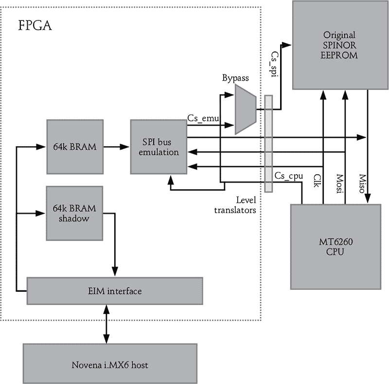

*SPI ROMulator FPGA 的框图*

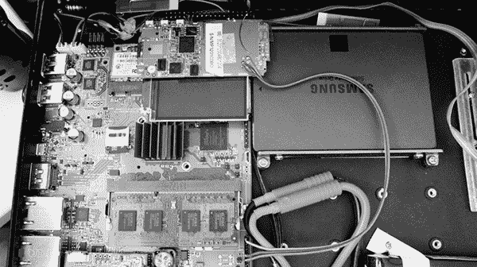

*我的 Novena 里有一部手机！它怎么会在那里？*

通过 Tek 示波器确定的地址流、ROMulator 快速的 ROM 修补以及使用 IDA 进行静态代码分析时发现 ROM 中存在一个 SHA-1 函数的提示，我们确定了初始引导程序（我们称之为 1bl）是通过 SHA-1 附录进行哈希检查的。

**注释**

*哈希函数的汇编代码通常具有非常独特的形状或一组指令，而且给定的哈希值也有一些独特的“魔法数字”。鉴于这些事实，当黑客试图逆向认证方法时，最先做的事情之一就是使用 IDA 在哈希函数附近搜索这样的常量。*

#### 建立立足点

下一步是创建一个小型交互式 shell，我们可以用它作为在目标硬件上运行实验的立足点。正如他在 SD 卡逆向工程项目中所做的那样，xobs 创建了一个紧凑的 REPL 环境，称为 Fernly，支持诸如查看内存、写入数据和转储 CPU 寄存器等命令。

设计 ROMulator 使得模拟的 ROM 呈现为一个 64KiB 的内存映射窗口在 Linux 主机上，从而使得像`mmap()`函数、`open()`函数（通过*/dev/mem*）、`read()`函数和`write()`函数等 POSIX 抽象变得可用，用来访问模拟的 ROM。xobs 利用这些抽象创建了一个 I/O 目标，用于 radare2，一个便携式逆向工程框架。每次我们修改 1bl 代码区时，I/O 目标都会自动更新 SHA-1 哈希。有了这个系统，我们就可以做一些有趣的事情，比如在模拟的 ROM 空间内交互式地修补和反汇编代码。

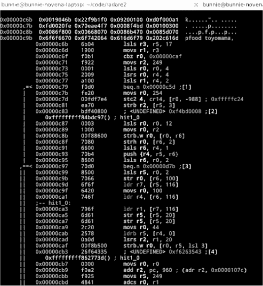

*在 ROM 中修补一些代码*

我们还将手机的电源开关连接到 FPGA 的 I/O 端口。这使我们能够编写自动化脚本，在更新 ROM 内容的同时切换手机的电源，从而自动模糊测试未知的硬件模块。

#### 附加调试器

我们不得不采用一种非常规的方法将调试器附加到 ROM 中的代码，因为定位关键块很困难，而 JTAG 与目标设备上的关键功能是复用的。xobs 模拟了 ARM 核心，并使用 Fernly Shell 将虚拟的加载和存储反射到实际目标上。通过这种方式，我们能够将远程调试器附加到模拟核心，完全绕过了 JTAG 的需求。这也让我们能够使用像 IDA 这样的跨平台工具，在 x86 上进行反向工程的界面操作。

这种调试技术的核心是 QEMU，一个多平台系统模拟器。QEMU 支持模拟 ARM 目标，特别是我们的目标设备使用的 ARMv5 芯片。我们创建了一个新的虚拟机类型，称为 Fernvale，它实现了目标设备上部分硬件的模拟，并将未知的内存访问直接传递到设备上。

Fernly Shell 被简化为只支持三条命令：写、读和零内存。写命令将一个字节、字或双字的数据写入实际目标的 RAM 中。读命令从实际目标中读取一个字节、字或双字的数据。零内存命令是一种优化，操作系统会将大量零写入一个大范围的内存区域。

我们还钩住并模拟了串口寄存器，使得主机系统能够像在目标设备上打印一样显示串行数据。最后，我们模拟了 SPI、IRAM 和 PSRAM 的行为，仿真它们在真实设备上的表现。其他内存区域则被捕获并传送到实际设备，或者保持未映射状态并由 QEMU 报告为错误。

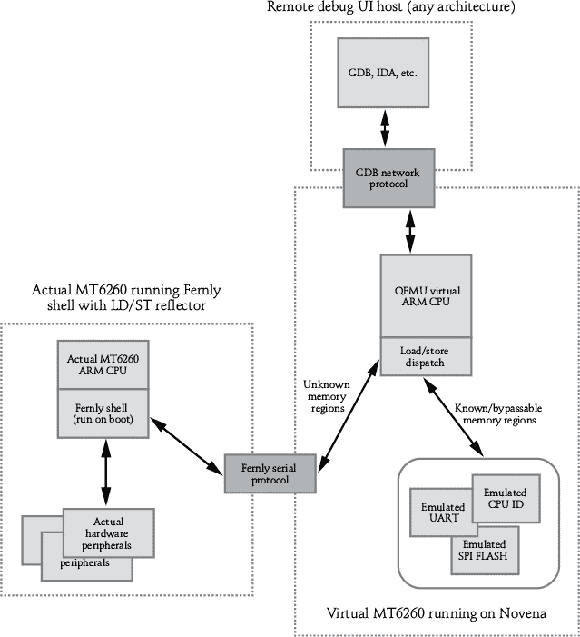

*调试器的架构*

调用调试器是一个多阶段的过程。首先，我们使用 Fernly Shell 环境对实际的 MT6260 目标进行初始化。然后，我们启动了 QEMU 虚拟 ARM CPU，加载了一个经过初始化并处于启动过程中的已知寄存器状态的原厂镜像。在此时，虚拟机开始执行代码，直到发生对未知地址的加载或存储。此时，虚拟机执行暂停，查询通过 Fernly Shell 接口发送到真实的 MT6260。然后，加载或存储操作在真实机器上执行，结果会传回虚拟机，代码执行得以恢复。

我们无法直接从 SPI ROM 运行 Fernly，因为供应商二进制的初始化例程修改了 SPI ROM 的时序。当然，如果存储操作恰好发生在 Fernly 的内存区域内，Fernly 就会崩溃。为了避免加载或存储操作覆盖 Fernly Shell 代码，我们将代码隐藏在一个被捕获并模拟的 IRAM 区域中。模拟目标 CPU 让我们能够通过 GDB 在 TCP 上连接远程调试器，如 IDA。调试器完全控制模拟的 CPU，并可以访问模拟的 RAM。这是混合 QEMU/实际目标调试系统的输出示例。

```
bunnie@bunnie-novena-laptop:~/code/fernvale-qemu$ ./run.sh

~~~ Welcome to MTK Bootloader V005 (since 2005) ~~~
**===================================================**

READ WORD Fernvale Live 0xa0010328 = 0x0000... ok
WRITE WORD Fernvale Live 0xa0010328 = 0x0800... ok
READ WORD Fernvale Live 0xa0010230 = 0x0001... ok
WRITE WORD Fernvale Live 0xa0010230 = 0x0001... ok
READ DWORD Fernvale Live 0xa0020c80 = 0x11111011... ok
WRITE DWORD Fernvale Live 0xa0020c80 = 0x11111011... ok
READ DWORD Fernvale Live 0xa0020c90 = 0x11111111... ok
WRITE DWORD Fernvale Live 0xa0020c90 = 0x11111111... ok
READ WORD Fernvale Live 0xa0020b10 = 0x3f34... ok
WRITE WORD Fernvale Live 0xa0020b10 = 0x3f34... ok
```

该输出显示了控制台上出现的串行写入操作，以及由模拟的 ARM CPU 执行的写入和读取日志，这些操作被转发到运行精简版 Fernly shell 的实时目标。这是我们的登陆点。

从那里，xobs 和我通过搜索内存中已知的前 MediaTek 芯片的“签名”，发现了几个 IP 块的偏移地址。签名可以是像开机默认寄存器值这么简单，或者更复杂一些，比如由于位设置或清除寄存器的副作用，在 IP 块地址空间的偏移处出现的位模式变化。通过追踪这些签名，帮助我们找到了几个外设的寄存器偏移，并生成了内存映射。

| **起始地址** | **结束地址** | **区域大小** | **描述** |
| --- | --- | --- | --- |
| `0x00000000` | `0x0fffffff` | `0x0fffffff` | `PSRAM 映射，在 0x00800000 偏移处重复并镜像` |
| `0x10000000` | `0x1fffffff` | `0x0fffffff` | `内存映射 SPI 芯片` |
| `??????????` | `??????????` | `??????????` | `????????????????????????????????` |
| `0x70000000` | `0x7000cfff` | `0xcfff` | `片上 SRAM（可能是缓存？）` |
| `??????????` | `??????????` | `??????????` | `????????????????????????????????` |
| `0x80000000` | `0x80000008` | `0x08` | `配置块（芯片版本等）` |
| `0x82200000` | `??????????` | `??????????` |  |
| `0x83000000` | `??????????` | `??????????` |  |
| `0xa0000000` | `0xa0000008` | `0x08` | `配置块（镜像？）` |
| `0x10010000` | `??????????` | `??????????` | `(?SPI 模式?) ????????????????????` |
| `0x10020000` | `0xa0020e10` | `0x0e10` | `GPIO 控制块` |
| `0xa0030000` | `0xa0030040` | `0x40` | `WDT 块` |
|  |  |  | `   + 0x08 -> WDT 寄存器 (?)    + 0x18 -> 启动源 (?)` |
| `0xa0030800` | `??????????` | `??????????` | `????????????????????????????????` |
| `0xa0040000` | `??????????` | `??????????` | `????????????????????????????????` |
| `0xa0050000` | `??????????` | `??????????` | `????????????????????????????????` |
| `0xa0060000` | `??????????` | `??????????` | `?? 可能的 IRQ 位于 0xa0060200 ??` |
| `0xa0070000` | `==========` | `==========` | `== 空（全零） ===========` |
| `0xa0080000` | `0xa008005c` | `0x5c` | `UART1 块` |
| `0xa0090000` | `0xa009005c` | `0x5c` | `UART2 块` |
| `0xa00a0000` | `??????????` | `??????????` | `?????????????????????????????????` |

这个内存映射展示了芯片不同地址范围内存储的内容。例如，映射中的第二个地址范围（0x10000000 到 0x1FFFFFFF）由 0x0FFFFFFF 字节组成，对应一个内存映射的 SPI 芯片。

#### 启动操作系统

在找到寄存器偏移后，我们在多个方面迅速取得了进展，但我们的目标（将基于 BSD 的实时操作系统 NuttX 移植到该设备上）依然未能实现。关于中断控制器的文档在山寨数据手册的规范中并不存在。我们通过对二进制文件的静态分析找到了安装中断处理程序的例程，但无法确定中断控制器本身的地址偏移。

我们能做的就是打开联发科技的代码库，参考其中包含中断控制器寄存器偏移和位定义的头文件。这符合我们自己设定的“不侵犯版权”的限制，因为事实是不可版权的。我在第四章中的“处理版权问题”部分，位于第 138 页中描述了这一思想背后的法律推理。在查阅了这些事实后，我们创建了自己的定制脚本语言——Scriptic，以避免无意中抄袭现有代码库中的任何内容。

#### 构建新的工具链

然而，要求用户拥有一个 Novena ROMulator 来破解 Fernvale 并不是一个可扩展的解决方案。为了完成这个故事，我们创建了一个完整的开发工具链。编译器相对简单明了；许多标准编译器支持将 ARM 作为目标，包括 clang 和 GCC。但制作用于刷写 MT6260 的开源工具则要复杂得多。我们知道的所有现有支持 MT6260 所需协议版本的工具都是专有的 Windows 程序。这意味着我们必须逆向工程联发科技的刷写协议，并编写自己的开源工具。

幸运的是，当你将一个空白、未熔断的 MT6260 连接到 Linux 主机时，它会显示为*/dev/ttyUSB0*。换句话说，它作为一个通过 USB 模拟的串口设备出现。这解决了向设备发送和接收字节的低级细节，剩下的就是逆向工程协议层。

xobs 定位了 MT6260 的内部启动 ROM，并进行了静态代码分析以深入了解协议。他还对联发科技的刷写工具进行了静态分析，并使用 USB 协议分析仪捕获了实时数据，以澄清剩余的细节。以下是他提取的命令的总结，这是我们在开源版 USB 刷写工具中使用的。

```
enum mtk_commands {
  mtk_cmd_old_write16 = 0xa1,
  mtk_cmd_old_read16 = 0xa2,
  mtk_checksum16 = 0xa4,
  mtk_remap_before_jump_to_da = 0xa7,
  mtk_jump_to_da = 0xa8,
  mtk_send_da = 0xad,
  mtk_jump_to_maui = 0xb7,
  mtk_get_version = 0xb8,
  mtk_close_usb_and_reset = 0xb9,
  mtk_cmd_new_read16 = 0xd0,
  mtk_cmd_new_read32 = 0xd1,
  mtk_cmd_new_write16 = 0xd2,
  mtk_cmd_new_write32 = 0xd4,
  // mtk_jump_to_da = 0xd5,
  mtk_jump_to_bl = 0xd6,
  mtk_get_sec_conf = 0xd8,
  mtk_send_cert = 0xe0,
  mtk_get_me = 0xe1, /* Responds with 22 bytes */
  mtk_send_auth = 0xe2,
  mtk_sla_flow = 0xe3,
  mtk_send_root_cert = 0xe5,
  mtk_do_security = 0xfe,
  mtk_firmware_version = 0xff,
};
```

这只是一个 C 语言的`enum`结构，因此它是一个非常极客的方式来指定数字与命令含义之间的映射。例如，`mtk_cmd_old_write16`是命令 0xA1，`mtk_command_old_read16`是命令 0xA2，以此类推。

#### Fernvale 结果

在大约一年间，经过在 Novena 和 Chibitronics 项目之间的断断续续努力后，我们成功地在 MT6260 上启动了 NuttX 的移植，支持了一组最基本的硬件外设。这足以让我们大致复现类似 Arduino 环境中使用的 AVR 的功能，但也仅此而已。

xobs 和我在第 31 届混沌通信大会（CCC）上展示了我们的成果，而事件在我们撰写提案时意外发生了转折。在提交前的一周，我们得知联发科技发布了基于 MT2502A 的 LinkIT ONE 开发平台，并与 Seeed Studios 合作。LinkIT ONE 是一个为创业者和爱好者设计的物联网平台。它集成到 Arduino 框架中，拥有一个开放的 API，能够提供芯片的完整功能，包括 GSM 功能。但在 LinkIT ONE 上运行的核心操作系统仍然是专有的，并且在没有通过 Arduino shim 提供的 API 调用的情况下，无法直接访问硬件。

现实来说，我们仍然需要一些时间才能将 MT6260 的部分功能移植到开源领域。我们很可能永远无法实现不依赖二进制代码的 GSM 呼叫功能实现，因为这些功能由一个数字信号处理器（DSP）单元控制，该单元比 MT6260 更为隐晦且没有文档支持。考虑到 LinkIT ONE 相比于 Fernvale 的强大功能，我们决定将是否继续逆向工程 MT6260 的价值问题交给开源社区来判断。最终，尽管这个项目吸引了大量的热情，但行动却并不多。LinkIT ONE 的发布让 Fernvale 项目失去了很多动力，Fernvale 项目也在此后实际上被停用了。

事实上，这正是大多数开源项目的命运。尽管有数十个，甚至数百个开源操作系统，但只有一个 Linux。事实是，比起能够实现这些创意的开发者，实际上有更多有趣的创意。为了让一个开源项目成功并自给自足，它不仅需要通过最小可行产品（MVP）阶段，还要遇到有真正需求的、愿意接受这个项目的受众。有时，你的项目能引起共鸣，成千上万的社区成员会推动它向前发展；而有时，你会得到许多友好、乐于助人的旁观者，他们会欣赏地点头，但却不愿意或太忙于日常工作而无法参与。还有其他时候，你只是对着空洞大喊，或者更糟的是，在某个互联网论坛上被撕得粉碎，指责你的项目多么有缺陷和无意义。

### 结束思考

鉴于开源项目的性质，我倾向于借鉴我在创业时期的一些经验，遵循“快速失败，迅速前进”的理念。尝试不同的事情，看看哪些行得通，从错误中学习，并再次尝试。重要的是不要过于固守某个想法，尤其是当这个想法并未取得成功时。最后，你会发现，重要的是享受过程，而非只专注于结果。Fernvale 无疑是一次史诗般的旅程；xobs 和我学到了很多，磨练了一套工具和技能，这些我们至今还在其他项目中使用，最重要的是，我们玩得非常开心。

在下一章，我们将探讨另一种黑客技术，它将在未来几十年对我们所有人变得越来越相关——即生物系统的黑客技术。
