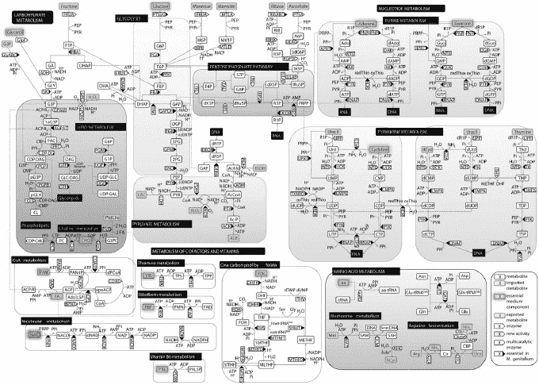
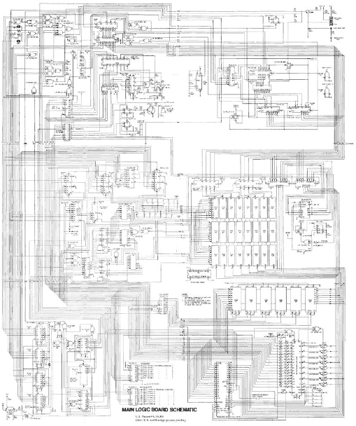
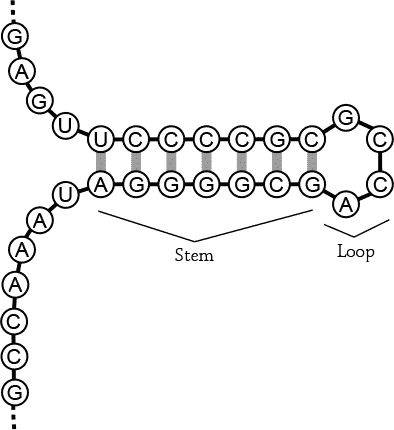

## 第十章：10. 生物学与生物信息学

我曾在*Science**上看到一幅美丽的图表，展示了最小细菌之一——*肺炎支原体*的代谢途径。这让我想起了在不到十岁时凝视 Apple II 原理图的情景。那时，我知道 Apple II 原理图中复杂的线条群是计算机的地图，尽管我还不知道如何利用那张地图。但要点在于，地图是存在的，尽管它看起来很复杂，却让我有希望能够解开这种复杂性。像下一页的生物学“原理图”给了我同样的希望。



肺炎支原体*的代谢途径*



*我墙上的 Apple II 原理图*

*M. pneumoniae*的图表不如 Apple II 原理图那样精确，但从 1 万英尺的高度看，它们在复杂性和细节上有相似之处。代谢图表足够详细，让我能够追踪从葡萄糖到乙醇的路径，而 Apple II 原理图足够详细，让我能够追踪从 CPU 到扬声器的路径。正如生物学家不会对带有 74LS74 的盒子产生太多兴趣一样，电气工程师也不会对内部有 ADH 的盒子产生太多兴趣。（74LS74 包含两个同步电子存储设备，而 ADH 是由基因*MPN564*编码的醇脱氢酶，可以将乙醛转化为乙醇。）

然而，为了进一步推动计算机类比，*Science* 文章的作者们还在他们的补充材料中列出了类似于*肺炎支原体(M. pneumoniae)*物料清单的表格。图中的五边形框表示*酶*，即催化特定化学反应的蛋白质。每个酶都列出了一个功能描述及其基因序列，相当于源代码。

在那个列表的最末端，我看到了一个未表征基因的表格。如果你做过一点反向工程，你可能也做过类似的表格，列出电子系统中的部件或功能调用。这些表格是我遇到瓶颈时寻找新线索的第一站。我发现，看到生物学家和黑客使用类似的技巧去反向工程复杂系统，令人振奋。

### 将 H1N1 与计算机病毒进行比较

将生物系统与计算机系统进行比较，不仅仅停留在代谢层面。我曾在*Nature**上读到一篇令人着迷的文章，文章将*新型 H1N1 病毒*（更广为人知的是*猪流感*）的致病成分与其他流感病毒株进行比较，这篇文章让我开始思考数字病毒与有机病毒之间的异同。例如，有机病毒相对于数字病毒有多大？换句话说，多少比特可以杀死人类，或者至少让人相当生病？在探索这个想法时，我发现绘制一些数字和有机世界之间的类比非常有帮助。

### DNA 和 RNA 作为比特

当 2009 年 H1N1 流感大流行爆发时，病毒被全面测序并记录在国家生物技术信息中心（NCBI）的流感病毒资源数据库中，那里收集的数据令人惊叹。我喜欢这些记录的具体性。例如，一个名为 A/Italy/49/2009(H1N1)的流感实例的完整序列，该病毒是从一名 26 岁女性*智人*的鼻子中分离出来的，她从美国回到意大利，整个序列可以在 NCBI 网站上找到。以下是该 DNA 序列的前 120 位：

```
atgaaggcaa tactagtagt tctgctatat acatttgcaa ccgcaaatgc agacacatta
```

总共 120 位，每个符号（A、T、G 或 C）代表 2 位信息。在基因中，这可以替代地表示为一个氨基酸序列，其中每三个 DNA 符号组成一个*密码子*，对应一个氨基酸。长链的*氨基酸*折叠成复杂的结构，称为*蛋白质*，为细胞提供结构和功能，而那些太短无法成为完整蛋白质的氨基酸链通常被称为*肽*。通过生物学家所称的标准遗传密码翻译查找表，我将之前的序列转换成了以下肽链：`MKAILVVLLYTFATANADTL`。

在这个序列中，每个符号代表一个氨基酸，相当于六位或每个氨基酸三个 DNA 碱基。标准密码子表中有 20 种氨基酸，每个字母对应一种不同的氨基酸。M 代表甲硫氨酸，K 代表赖氨酸，A 代表丙氨酸，依此类推。

现在，考虑 RNA，它将 DNA 中的蛋白质合成信息传递到细胞的其他部分。与 DNA 一样，RNA 中的每个碱基指定四种可能的符号之一（在此为 A、U、G 或 C），因此单个碱基对应于 2 位信息。DNA 和 RNA 在一对一映射下具有信息等价性。可以把 DNA 看作存储在硬盘上的程序，把 RNA 看作是加载到 RAM 中的相同程序。当 DNA 被加载时，蛋白质合成指令被转录到 RNA 中，但所有的 T 碱基都会被 U 碱基替代。

因此，蛋白质是运行 RNA 程序的输出。蛋白质根据 RNA 中的指令通过三比一的映射合成。你可以把蛋白质想象成帧缓冲区中的像素，如下所示：

• 完整的蛋白质就像屏幕上的图像。

• 每个蛋白质上的氨基酸就像一个像素。

• 每个像素的深度为六位，因为这种存储每个碱基有两位的介质采用三比一的映射。

• 最后，每个像素都会通过一个颜色调色板（密码子翻译表）将原始数据转换为最终渲染的颜色。然而，与计算机帧缓冲区不同的是，不同的生物蛋白质在氨基酸的数量上有所不同（类似于像素数量）。

为了将这个概念具体化，假设你硬盘上存储的六个位（ATG）被加载到 RAM（RNA）中时，T 会转录为 U，变成 AUG。当 RAM 中的 RNA 程序执行时，AUG 被翻译成一个颜色为 M 的像素（氨基酸），即甲硫氨酸，它是生物学中的“起始”密码子——也就是每个有效 RNA 程序中的第一条指令。

作为一种简写方式，由于 DNA 和 RNA 是一对一等价的，生物信息学家在表示基因序列时通常使用 DNA 格式，即使生物机制实际上是以 RNA 格式存在。流感病毒的结构是 RNA，而不是 DNA，我之前展示的 120 位 DNA 对应的是流感中的 RNA 子程序。该子程序编码 HA 基因，产生 H1 型血凝素蛋白。这就是猪流感中 H1N1 命名中的*H1*。

#### 生物体具有独特的访问端口

基于这些背景信息，如果你把生物体看作是拥有 IP 地址的计算机，那么生物体中每个功能性细胞组通过自己的活动端口监听环境。就像端口 25 专门映射到计算机上的 SMTP 服务一样，H1 端口专门映射到人的气管区域。有趣的是，相同的 H1 端口在鸟类中映射到肠道。因此，相同的 H1N1 病毒会攻击人的呼吸系统和鸟类的肠道。相比之下，H5——存在于 H5N1 致命禽流感中的血凝素蛋白变体——指定了你内肺的端口。因此，H5N1 比 H1N1 更致命，因为它攻击的是你内脏的肺组织，导致严重的肺炎。H1N1 的致命性较低，因为它攻击的是一个相对无害的端口，只会让你不断流鼻涕和咳嗽。

**注意**

*研究人员仍在发现更多关于 H5 端口的信息。我读过的《自然》杂志文章指出，也许某些人类突变体的肺部不会监听 H5 端口。那些肺部忽略 H5 端口的人在感染禽流感时存活的机会更大，而那些肺部开启 H5 端口的人则无法存活（你的时间到了……所有的碱基对都属于 H5N1）。**

了解一个病毒是否致命，你可以通过计算病毒基因组中的位数来推算它杀死一个人（或至少让人相当生病）所需的位数。那么问题是，这个 H1N1 实例中有多少位？根据我的统计，原始的位数是 26,022；实际编码的位数大约是 25,054。我之所以说“大约”，是因为在某些地方，病毒会做自我修改的代码，将一个基因转换为两个蛋白质。很难说哪些算作代码，哪些算作为了自我修改代码所需要的非执行 NOP 指令。

这意味着大约需要 25Kb 或 3.2KB 的数据来编码一种具有非凡致死几率的病毒。比起像 MyDoom 这样的计算机病毒，它的大小大约是 22KB，这种编码方式更为高效。知道自己可能会被 3.2KB 的基因数据杀死，令人感到震撼。话说回来，考虑到我的基因组大约有 800MB 的数据，肯定会有一两个漏洞。

#### 猪流感黑客攻击

阅读这篇*Nature*文章并且能够访问病毒序列的一个有趣后果是，理论上我现在知道如何修改病毒序列使其更致命。例如，*Nature*文章指出，在序列位置 627 处具有谷氨酸的 PB2 流感基因变体具有*低致病性*，意味着它们并不是非常致命。然而，PB2 变体如果在相同位置具有赖氨酸，则会增加死亡的可能性。

让我们看看 H1N1 的 PB2 序列。回到 NCBI 数据库，我找到了位置 627 附近的以下氨基酸序列：

```
601 QQMRDVLGTFDTVQIIKLLP
621 FAAAPPEQSRMQFSSLTVNV
641 RGSGLRILVRGNSPVFNYNK
```

左侧的数字表示每行序列中第一个符号的位置；在接下来的讨论中，我将遵循这一惯例。查看标记为 621 的那一行，并注意位置 627 的 E。E 是谷氨酸的符号。幸运的是，H1N1 似乎是流感的一种较不致命的版本；也许这就是为什么感染 H1N1 的人比媒体所宣传的要少死亡的原因。

现在，让我们将其逆向回 DNA 编码：

```
621   F   A   A   A   P   P   E   Q   S   R
1861 ttt gct gct gct cca cca gaa cag agt agg
```

注意 GAA 是编码 E 的。要使这个基因组变得更致命，你只需将 GAA 替换为赖氨酸（K）的编码之一。赖氨酸的编码可以是 AAA 或 AAG。因此，一个更致命的 H1N1 变种将具有如下编码序列：

```
621   F   A   A   A   P   P   K   Q   S   R
1861 ttt gct gct gct cca cca aaa cag agt agg
                             ^ changed
```

所以，一个简单的碱基对改变——仅仅翻转两个比特——可能就是将 H1N1 猪流感病毒转变为更致命变种所需要的全部。理论上，我可以应用一系列已知的生物学程序来合成这个菌株，并实际实施这个黑客攻击。作为第一步，我可以访问 DNA 合成网站，订购修改后的序列，花费大约 1000 多美元，启动我的致命小项目。虽然一些公司有筛查程序来防止用于实现生物危害产品的 DNA 序列，但即使他们筛查 HA 变种，仍有一些著名的定点诱变协议可能会用来修改从正常 H1N1 提取的 RNA 的单个碱基。

#### 可变流感

当然，我也得给流感一些赞赏。它在 3.2KB 的大小下就能打出致命一击，尽管科学家们付出了巨大的努力，但我们仍未消除它。流感是否已经能够像我刚才描述的那样自行进行黑客攻击？

简短的答案是“是的”。

实际上，流感病毒进化出了允许这种适应的机制。通常，当 DNA 被复制时，一个错误检查蛋白质会扫描被复制的基因组，以确认没有出现错误。这使得错误率保持在一个较低的水平。但请记住，流感病毒使用的是 RNA 结构。因此，它需要一种不同于 DNA 复制的机制。

流感病毒在其蛋白质外壳内携带着一种名为*RNA 依赖性 RNA 聚合酶*的蛋白质复合体代码，这是一种从 RNA 模板上复制 RNA 的微小机器。通常，RNA 是通过转录 DNA 生成的，而不是通过复制现有的 RNA 片段，因此这一机制对基于 RNA 的流感复制至关重要。值得注意的是，RNA 依赖性 RNA 聚合酶省略了一个错误检查蛋白质，这个蛋白质会阻止突变的发生。结果是，流感每复制 1 万对碱基就会出现一个错误。流感基因组大约有 13,000 对碱基，因此平均而言，每一个流感病毒的拷贝都含有一个随机突变。

其中一些突变没有任何影响；另一些使得病毒变得无害；还有一些可能让病毒变得更加危险。由于病毒以极其庞大的数量被复制和传播，这种小小的“漏洞”自然发生的机会实际上是相当高的。我认为这也是卫生官员对 H1N1 如此担忧的部分原因：人们对其没有免疫力，即使它并不像可能的那样致命，这一株病毒也可能只差几次突变，就能变成一个更大的健康问题。

除了高突变率外，流感病毒 RNA 结构还有另一个重要的细节：该病毒的遗传信息以八个相对较短的 RNA 片段存储。在许多其他病毒和简单生物中，遗传信息通常是以一条连续的长链形式存储的。

为了理解这点为什么重要，可以考虑当宿主同时感染两种类型的流感病毒时会发生什么。如果基因存储为单一的 DNA 或 RNA 片段，那么两种类型的基因之间几乎没有重组的机会。但由于流感病毒将其基因存储为八个独立的片段，这些基因在被感染的细胞内自由混合，并在病毒颗粒形成时随机重新组合。如果你不幸同时感染了两种流感病毒，结果可能会是一个全新的流感株，因为 RNA 链在复制、混合、从“隐喻中的抽奖箱”中挑选出来，然后包装进病毒颗粒。这一过程非常巧妙，因为相同的机制允许在一个宿主中混合任意数量的流感株。如果你能同时感染三种或四种流感病毒，结果将是更加多样化的流感颗粒。

这一机制是新型 H1N1 被称为*三重重组*病毒的部分原因。通过一系列双重感染，或者可能是多种流感品种的单次灾难性感染，新型 H1N1 获得了混合的 RNA 片段，使其具有高传染性，并使人类天生无法免疫。这正是大流行的完美风暴。

如果要用计算机类比这个 RNA 重组模型，那它就像是一个病毒，它以未链接的目标代码文件加上一个小的辅助程序的形式传播，在感染宿主后，重新链接其文件，并以随机顺序复制和重新分发自己。它还会寻找已经可能感染该计算机的相似病毒，并偶尔与其他病毒中匹配功能模板的目标代码链接。这种代码的重新排列和新链接将使基于固定代码模式搜索病毒特征的病毒防护软件失效。它还将使野外产生多种多样的病毒，具有更不可预测的特性。

流感病毒的多层次适应机制非常令人惊讶。该病毒既有缓慢进化的点突变机制，又有通过与其他病毒基因级混合在单代中大幅改变其特性的机制。它的作用方式与性别繁殖不同，但结果可能与性繁殖一样好，甚至更好。令人惊讶的是，这两种病毒的重要特性正是由于使用 RNA 而非 DNA 作为遗传储存介质所导致的。

### 一线希望

由于流感变异种类繁多，没有疫苗能针对所有类型的病毒，但 H1N1 的故事确实有一个希望。显然，在大流行期间感染猪流感的患者创造了一种新型抗体，具有赋予所有 16 种甲型流感亚型免疫能力的非凡能力。一组研究人员筛选了该患者的白血球，并成功分离出四个含有生产这种抗体代码的 B 细胞。他们克隆了这些细胞并生产了抗体，从而促进了对一种可能提供广泛流感防护的疫苗的进一步研究。

我从本能上觉得这个非常有趣，因为它让我有了希望，如果一种致命病毒真的消灭了大部分人类，也许只有一小部分人会幸存下来。

### 逆向工程超级病毒

2011 年，一种名为 EHEC O104:H4 的“超级细菌”菌株（属于*大肠杆菌*，一种可以引起食物中毒的细菌亚种）在欧洲爆发。当我得知位于深圳的 BGI 科学家已经将 O104:H4 的完整序列免费发布到网上供任何人查看时，我对这一情况感到非常好奇。我禁不住想知道，生物信息学家究竟使用什么工具来分析 DNA 序列。手动检查相对简单的流感病毒序列是一回事，但一定有计算工具来帮助解析像*大肠杆菌*这样复杂的生物体。

幸运的是，我的女朋友（`s/perl/girl/`）也是一位著名的生物信息学家。她从忙碌的工作中抽出时间，向我展示了一些行业工具。事实证明，大多数用于分析 DNA 的工具都可以在线免费获取。由于 DNA 仅由 A、T、G 和 C 这四种碱基组成，标准的数据交换格式就是普通的 ASCII 文本，这意味着你可以使用命令行工具，如`grep`、`sed`和`awk`，进行大量的分析。

#### O104:H4 DNA 序列

BGI 提供的原始序列数据是一组过采样的子序列，我们需要通过匹配重叠区域将它们拼接在一起。将子序列拼接在一起有点像从随机拍摄的小照片组成一幅大图。通过足够的采样，最终你会创建一幅几乎完整的图像，但图像仍然会有一些模糊，特别是在具有规律性图案的区域。

O104:H4 的基因组以超过 500,000 个短 DNA 样本的形式提供。拼接过程将这些短 DNA 样本拼接成 513 个连续的 DNA 片段（称为*contigs*），总基因组长度为 530 万碱基对。像*大肠杆菌*这样的生物只有一条大的 DNA 环，因此在 513 个位置上，测序技术的限制（或者仅仅是运气不好）错过了一个未知数量的碱基对，导致我们无法知道完整的、没有中断的序列。值得注意的是，典型的非超级细菌株*大肠杆菌*基因组大约有 460 万碱基对，所以 O104:H4 的基因组可能至少长 15%。同样，这个菌株复制所需的时间也会比非耐药菌株更长。来看一下拼接的 contig 34：

```
AAATGGTATTCCTGTTCACGATACTATTGCCAGAGTTGTATCCTGTATCAGTCCTGC
AAAATTTCATGAGTGCTTTATTAACTGGATGCGTGACTGCCATTCTTCAGATGATAA
AGACGTCATTGCAATTGATGGAAAAACGCTCCGGCACTCTTATGACAAGAGTCGCCG
CAGGGGAGCGATTCATGTCATTAGTGCGTTCTCAACAATGCACAGTCTGGTCATCGG
ACAGATCAAGACGGATGAGAAATCTAATGAGATTACAGCTATCCCAGAACTTCTTAA
CATGCTGGATATTAAAGGAAAAATCATCACAACTGATGCGATGGGTTGCCAGAAAGA
TATTGCAGAGAAGATACAAAAACAGGGAGGTGATTATTTATTCGCGGTAAAAGGAAA
CCAGGGGCGGCTAAATAAAGCCTTTGAGGAAAAATTTCCGCTGAAAGAATTAAATAA
TCCAGAGCATGACAGTTACGCAATTAGTGAAAAGAGTCACGGCAGAGAAGAAA
```

我本可以选择任何一个 contig，它可能对你来说和这段字母一样没有意义。除了做一些无关的流行文化引用（比如*GATTACA*这个词在 O104:H4 的基因组中出现了 252 次），原始 DNA 序列并没有太多启发性。这有点像盯着二进制机器代码。要分析这些数据，你需要“反编译”代码中的“方法”。

在这种情况下，我们正在寻找编码*蛋白质*的 DNA 序列。正如我之前提到的，蛋白质是复杂的、通常交织在一起的分子链，组成这些链的小单元被称为氨基酸。细胞通过蛋白质完成工作：有些蛋白质将糖转化为能量，其他的利用这些能量进行运动或改变细胞的形状，还有一些负责复制和修复细胞。

幸运的是，蛋白质序列在 DNA 中高度保守。大自然倾向于在不同生物之间重复使用蛋白质结构，并做很少的修改。因此，通过生物学实验已知的某种功能，即便是在另一物种中，也常常能够与一段 DNA 序列相关联。例如，确定一个序列功能的常见实验是从细胞中切除一段 DNA，并观察细胞会发生什么变化；缺失的 DNA 导致的功能丧失通常能够表明该蛋白质在细胞中的作用。

生物学家已经将几十年的研究成果关于某些蛋白质功能的知识汇集成了庞大的数据库。因此，要搞清楚一段 DNA 的意义，你可以通过模糊匹配的方法，将你感兴趣的 DNA 序列与已知蛋白质的数据库进行比对。

#### 生物学的逆向工具

我需要两个工具来逆向工程 DNA：一个蛋白质数据库和一个叫做 BLASTX 的软件。两者都可以在线免费下载。

##### UniProt 数据库

我从通用蛋白质资源库（UniProt）下载了已知蛋白质的列表 (*[`www.uniprot.org/`](http://www.uniprot.org/)*)。2011 年，针对“耐药性”并限定在*大肠杆菌*（*E. coli*）种群中的数据库搜索，得到了一个包含 1,378 种蛋白质的列表，这些蛋白质是科学家多年来发现的*大肠杆菌*耐药机制的一部分。每年，新的发现都会被加入到数据库中。

这里是数据库中的一个片段，描述了一种使 O104:H4 对某种你可能认识的药物具有耐药性的蛋白质：

```
>sp|P0AD65|PBP2_ECOLI Penicillin-binding protein 2
OS=Escherichia coli (strain K12) GN=mrdA PE=3 SV=1

MKLQNSFRDYTAESALFVRRALVAFLGILLLTGVLIANLYNLQIVRFTDYQTRSNENRIK
LVPIAPSRGIIYDRNGIPLALNRTIYQIEMMPEKVDNVQQTLDALRSVVDLTDDDIAAFR
KERARSHRFTSIPVKTNLTEVQVARFAVNQYRFPGVEVKGYKRRYYPYGSALTHVIGYVS
KINDKDVERLNNDGKLANYAATHDIGKLGIERYYEDVLHGQTGYEEVEVNNRGRVIRQLK
EVPPQAGHDIYLTLDLKLQQYIETLLAGSRAAVVVTDPRTGGVLALVSTPSYDPNLFVDG
ISSKDYSALLNDPNTPLVNRATQGVYPPASTVKPYVAVSALSAGVITRNTTLFDPGWWQL
PGSEKRYRDWKKWGHGRLNVTRSLEESADTFFYQVAYDMGIDRLSEWMGKFGYGHYTGID
LAEERSGNMPTREWKQKRFKKPWYQGDTIPVGIGQGYWTATPIQMSKALMILINDGIVKV
PHLLMSTAEDGKQVPWVQPHEPPVGDIHSGYWELAKDGMYGVANRPNGTAHKYFASAPYK
IAAKSGTAQVFGLKANETYNAHKIAERLRDHKLMTAFAPYNNPQVAVAMILENGGAGPAV
GTLMRQILDHIMLGDNNTDLPAENPAVAAAEDH
```

PBP2_ECOLI*与青霉素耐药性相关，是一个突变基因，决定了细菌的形状。似乎这种耐药变体在青霉素存在的情况下仍能正常工作；而未耐药的基因型细菌在青霉素的作用下无法正确形成细胞壁，最终被药物杀死。其他基因可能引发更积极的对抗措施，比如将抗生素泵出细胞或修改抗生素使其对细胞的毒性降低。浏览 UniProt 数据库可以让你感受到大自然中各种各样的基因，这些基因能够使细菌对药物产生耐药性。

##### 反编译器

接下来，我需要实际的反编译器。这时 BLASTX（最终更新为 BLAST+）派上了用场。BLASTX 是 BLAST 的一种变体，BLAST 代表*基本局部比对搜索工具*。首先，我让这个分析程序计算所有可能的*大肠杆菌*DNA 到蛋白质序列的翻译。DNA 翻译结果会产生六种可能的蛋白质序列：DNA 可以正向和反向读取（分别称为 5′→3′和 3′→5′），每个方向有三种可能的框架位置。然后，我让程序检查生成的氨基酸序列中与已知能提供药物抗性的序列数据库匹配的模式。（我也可以检查其他类型的模式，只需在数据库查询中输入不同的内容。）结果是一个排序后的已知药物抗性蛋白质列表，连同与这些蛋白质最佳匹配的*大肠杆菌*基因组区域。

以下是青霉素示例的 BLASTX 输出结果。

```
# BLASTX 2.2.24 [Aug-08-2010]

# Query: 43 87880
# Database: uniprot-drug-resistance-AND-organism-coli.fasta
# Fields: Query id, Subject id, % identity, alignment length,
mismatches, gap openings, q. start, q. end, s. start, s. end,
e-value, bit score
43 sp|P0AD65|PBP2_ECOLI 100.00 632 0 0 29076 30971 1 632 0.0 1281
43 sp|P0AD68|FTSI_ECOLI 25.08 650 458 21 29064 30926 6 574 2e-33 142
43 sp|P60752|MSBA_ECOLI 32.80 186 120 6 12144 12686 378 558 6e-17 87.0
43 sp|P60752|MSBA_ECOLI 27.78 216 148 5 77054 77677 361 566 8e-14 76.6
43 sp|P77265|MDLA_ECOLI 27.98 193 133 6 12141 12701 370 555 2e-10 65.5

--snip--
```

Fields 行描述了表格中每一列的内容。在% identity（百分比相似度）列中，你可以看到 PBP2_ECOLI 基因在 O104:H4 基因组中的匹配度为 100%。

##### 用 UNIX Shell 脚本回答生物学问题

有了这个列表，我可以回答一些有趣的问题，比如“已知的抗药性基因有多少在 O104:H4 中？”这是我的女朋友写的回答该问题的一行程序：

```
cat uniprot_search_m9 | awk '{if ($3 == 100) { print;}}' | \
  cut -f2 |grep -v ^# | cut -f1 -d"_" | cut -f3 -d"|" | \
  sort | uniq | wc -l
```

从该脚本的输出结果中，我们得知 O104:H4 中的 1,138 个基因与包含 1,378 个能够赋予药物抗性的基因的数据库中的基因完全匹配。当我们放宽标准，将 99%的匹配也列入其中，允许每个基因有一到两个突变时，列表扩展到 1,224 个基因，出现在 1,378 个基因中。这个“超级细菌”O104:H4 获得了大约 90%的已知抗性基因，名副其实！

我还想回答相反的问题：哪些药物抗性基因肯定不在 O104:H4 中？通过查看超级细菌中缺失的抗性基因，我们或许能够找到哪些治疗方法可能对这种细菌有效的线索。

为了排除药物抗性基因，我们创建了另一个搜索，旨在揭示数据库中与 O104:H4 序列匹配度低于 70%的抗性基因。这个 70%的阈值只是我随便选的一个数字；科学家和临床医生可能使用的是更为严格的标准。

这是在我的终端中显示的列表：

```
A0SKI3 A2I604 A3RLX9 A3RLY0 A3RLY1 A5H8A5 B0FMU1 B1A3K9 B1LGD9
B3HN85 B3HN86 B3HP88B5AG18 B6ECG5 B7MM15 B7MUI1 B7NQ58 B7NQ59
B7TR24 BLR CML D2I9F6 D5D1U9 D5D1Z3 D5KLY6 D6JAN9 D7XST0 D7Z7R4
D7Z7W9 D7ZDQ3 D7ZDQ4 D8BAY2 D8BEX8 D8BEX9 DYR21 DYR22 DYR23
E0QC79 E0QC80 E0QE33 E0QF09 E0QF10 E0QYN4 E1J2I1 E1S2P1 E1S2P2
E1S382 E3PYR0 E3UI84 E3XPK9 E3XPQ2 E4P490 E5ZP70 E6A4R5 E6A4R6
E6ASX0 E6AT17 E6B2K3 E6BS59 E7JQV0 E7JQZ4 E7U5T3 E9U1P2 E9UGM7
E9VGQ2 E9VX03 E9Y7L7 O85667 Q05172 Q08JA7 Q0PH37 Q0T948 Q0T949
Q0TI28 Q1R2Q2 Q1R2Q3 Q3HNE8 Q4HG53 Q4HG54 Q4HGV8 Q4HGV9 Q4HH67
Q4U1X2 Q4U1X5 Q50JE7 Q51348 Q56QZ5 Q56QZ8 Q5DUC3 Q5UNL3 Q6PMN4
Q6RGG1 Q6RGG2 Q75WM3 Q79CI3 Q79D79 Q79DQ2 Q79DX9 Q79IE6 Q79JG0
Q7BNC7 Q83TT7 Q83ZP7 Q8G9W6 Q8G9W7 Q8GJ08 Q8VNN1 Q93MZ2 Q99399
Q9F0D9 Q9F0S4 Q9F7C0 Q9F8W2 Q9L798
```

你可以将这些蛋白质代码输入 UniProt 数据库，了解更多信息。例如，BLR 是β-内酰胺酶，一种导致对β-内酰胺类抗生素产生抗性的酶。UniProt 这样描述它：

对于多种参与肽聚糖生物合成的抗生素的敏感性有影响。与β-内酰胺类药物、D-环丝氨酸和杆菌肽一同作用。对四环素、氯霉素、庆大霉素、福美沙星、万古霉素或喹诺酮类药物的敏感性没有影响。可能通过作为多亚基外排泵的一部分增强药物排出。也可能参与细胞壁的生物合成。

不幸的是，初步检查显示，O104:H4 缺乏的大多数功能只是一些小的、理解不深的药物抗性机制的碎片。因此，在其基因组中并没有明显的超级细菌杀手候选基因。

#### 更多问题而非答案

好消息是，任何人都可以访问分析基因组的工具，并且一些工具，如 grep、awk 和 sed，计算机工程师已经熟悉。坏消息是，尽管我们可以用这些工具提问关于基因组的问题，但我们仍然面临更多问题而非答案。例如，抗生素耐药性看起来对细菌的生存有利，那么为什么不是所有细菌都有这种能力？而细菌是如何获得（或丧失）这些基因的呢？

抗生素耐药超级细菌的崛起是我们热衷于抗生素的产物。由于*大肠杆菌*的 DNA 复制速率大约为每秒十多个碱基对，即使丢失一个未使用的基因，也能在指数增长的竞争中提供有意义的优势；毕竟，在最佳条件下，*大肠杆菌*的种群每 20 分钟就能翻倍。因此，存在选择压力，促使细菌丢弃那些对生存没有必要的基因。O104:H4 的基因组比典型的*大肠杆菌*菌株长 15%，这意味着在七代之后，典型的*大肠杆菌*菌株的数量会是 O104:H4 的两倍。在没有抗生素的最佳生长条件下，半天之内，缺乏抗生素抗性基因的*大肠杆菌*菌株的数量会是 O104:H4 的 20 倍以上。因此，保留抗生素抗性基因的细菌就像是在比赛中穿着防弹背心的短跑运动员。同样，超级细菌最大的天然威胁之一就是一种精简、快速复制的常见细菌，它仅凭数量就能超越超级细菌。

然而，杀菌性和抑菌性抗生素分别通过杀死或抑制非耐药性细菌的生长，从而仅留下耐药性细菌自由生长。随着时间的推移，并暴露于多种抗生素中，可以推测耐药性细菌种群将继续选择性繁殖多重耐药基因，形成超级细菌。

尽管如此，我还是觉得很惊讶，耐药性细菌似乎能够如此迅速地发展出抗性基因。我们被教导进化是一个缓慢的过程，因此细菌能够偶然地进化出一系列抗生素抗性基因，总计数以十万计的碱基对，确实令人感到不可思议。新基因的确需要很长时间才能自发产生（这一点有很少的明确记录，比如理查德·伦斯基的长期进化实验）。相反，大多数抗性基因是通过*水平基因转移*从环境中获得的。

我们的环境中充满了 DNA 片段。生物学的 GitHub 无处不在，从泥土到海洋再到我们呼吸的空气中都有。某些 DNA 片段编码有用的特征；有些则是垃圾。当细菌处于压力下（例如暴露在抗生素中时），它可能开始吸收来自环境中的随机 DNA 片段，并根据这些代码制造蛋白质。如果它反正要死了，那就试试看吧，对吧？大多数时候，吸收的 DNA 片段并没有帮助，但如果某个幸运的细菌从环境中获得了所需的抗性基因，它就能在充满抗生素的环境中迅速超越其他细菌。

因此，尽管没有耐药性的细菌株会迅速超过抗药性细菌株，但那小部分残存的耐药性细菌群体（或许它们已经是漂浮在环境中的尸体）形成了一个基因库，在压力时可以被动员。而且，由于基因代码在所有物种间是可互操作的，抗性基因甚至可以从无关的生物体中获得。

发现 O104:H4 缺失的功能尚未完全理解，实际上本身就是一个有趣的教训。小说作品通常将知道 DNA 序列与知道一个生物可能具有的疾病或特征混为一谈。但即使我们知道许多蛋白质的序列和一般特性，将蛋白质与特定的疾病或特征联系起来却要困难得多。最终，总得有人亲自动手，做涉及实际生物体的实验，才能为给定的蛋白质家族赋予生物学意义。

大众文化中提到 DNA 分析时，往往忽视了这个过程中的缺失环节，这导致了对基因分析的期望过高，尤其是在它诊断和治愈人类疾病以及应用于优生学方面。让我们更仔细地看看这些神话。

### 破除个性化基因组学的神话

在很多方面，我们的确生活在未来。例如，我们有电动汽车！但好莱坞在 60 年代和 70 年代的电影也预测到，到现在我应该是用飞行汽车来代步，而不仅仅是地面上的电动汽车。当然，汽车技术并不是好莱坞炒作的唯一受害者。

电影如*《基因命运》*大大夸大了个性化基因组学的潜在影响，制造出一种神话，认为你的基因组就像水晶球一样，你的命运似乎是由你的基因程序注定的。我之前提到的女朋友共同撰写了一篇在*《自然》*期刊*上发表的论文，研究了 23andMe 的直接面向消费者（DTC）个性化基因组学服务。让我们来看看她的论文，揭开这个神话的面纱吧！

#### 误区：读取你的基因组就像是对你计算机的 ROM 进行十六进制转储

一种查看基因组部分的廉价技术叫做*基因分型*。在这里，基于你的基因组和参考人类基因组进行选择性的差异比对；换句话说，你的基因组仅在可能有趣的地方进行采样，以查找称为*单核苷酸多态性*（SNPs，发音为“snips”）的单点突变。基因分型的概念自然会引出两个问题。首先，你如何决定哪些 SNPs 值得进行采样？其次，你如何确定参考基因组是一个准确的比较基准？这就引出了两个被破除的误区。

#### 误区：我们知道哪些突变预测疾病

人类基因组中的一些突变仅与某些疾病相关，它们并没有被证明具有预测性或因果关系。事实上，我们真的不理解许多遗传性疾病发生的原因。对于那些我们理解不深的疾病，我们能说的就是，患有某种疾病的人往往有某种 SNP 模式。重要的是不要将因果关系与相关性混淆。

因此，尽管科学家可以根据 SNPs 预测疾病，但大多数这些预测都是相关性的，而不是因果关系（而且相关性较弱）。因此，基因型不应被视为预测你未来疾病的水晶球。相反，它更像是一张罗夏墨迹图，你必须眯起眼睛盯着它一会儿，才能说出它的含义。例如，在我女朋友撰写的那篇论文中，她发现不同公司在疾病风险预测上的结果往往不一致，因为他们对突变意义的解读不同。

#### 误区：参考基因组是一个准确的参考

*参考*基因组中的*参考*一词应该让你意识到一个问题：它暗示了存在“参考人群”。实际上，今天的参考基因组是通过对少数几个人进行测序所创建的，而其中大多数人都具有欧洲血统。随着时间的推移，更多的全基因组数据将被收集，参考基因组将被合并和调整，以呈现出更准确的整体人类种群图像，但现在，我们需要记住，基因型研究实际上是与一个源存储库进行的比对，而这个存储库的普遍有效性是值得怀疑的。

例如，一些 SNP 在不同人群中的频率不同。碱基 A 可能在欧洲人群中占主导地位，但在非洲人群的同一位置，碱基 G 可能占主导地位。还需要记住，参考基因组的总体错误率大约为每 10,000 个碱基对中有 1 个错误，尽管公平地说，发现疾病变异的过程通常会清理参考基因组中相关序列区域的任何错误。

在我们完全理解人类基因组中所有序列的意义之前，可能还需要几十年时间，即使那时，这些序列也可能无法真正预测疾病风险或其他健康信息。这里或许包含了最重要的信息，也是我不能过多强调的一点：在大多数情况下，环境对你是谁、你将成为什么样的人以及你将患上哪些疾病的影响，远远大于你的基因。个人基因组学的任何好处，不会来自于水晶球式的预测，而是由于了解自己的遗传倾向可能会鼓励更多人做出生活方式的改变，从而帮助他们保持健康。如果我从和一位杰出的生物信息学家约会中学到了一件事，那就是无论你的基因组成如何，大多数常见疾病都可以通过适当的饮食和锻炼来预防或推迟。

### 基因组修补

到目前为止，在这一章中，我已经给出了基因组排序和分析的示例。这在某种程度上相当于能够将一个程序可执行文件转储并在 IDA 中进行分析。通常，在分析完一个可执行文件后，你可能会想要对其进行修补以实现新的功能。软件修补相对简单且可靠：只需要启动十六进制编辑器并更改文件。在最坏的情况下，你可能需要使用聚焦离子束（FIB）来修改芯片内部掩膜 ROM 的单个电路。

但历史上，修补基因组的能力一直受到严重限制。细胞中的信息以分子级别存储，改变基因的特定部分可能是一个艰巨的过程。正如真空管和晶体管早于集成电路的出现一样，锌指核酸酶（ZFNs）和转录激活因子样效应核酸酶（TALENs）使基因编辑成为可能，但在效率、性能和最终成本上存在显著的局限。2012 年，基因编辑的集成电路问世：CRISPR/Cas*系统。

### 细菌中的 CRISPR

CRISPR，意为*成簇的规则间隔短回文重复*，描述了一种特定的 RNA 结构，而 Cas 则是与 CRISPR 相关的蛋白质。根据生物学家的了解，CRISPR 只在细菌和古菌（例如真菌）中常见，它们是简单生物免疫系统的一个极其巧妙的部分。像人类一样，细菌有可以通过接触病原体来编程的免疫系统。当细菌遇到病毒侵入时，它们有可以剪切出病毒 DNA 短序列的蛋白质，并将这些序列存档为 CRISPR 中的间隔序列。

那些用 TALENs 编辑基因几个月都没有成功的实验室，改用 CRISPR/Cas 后第一次尝试就成功了。他们之所以能够如此迅速成功，是因为这个过程仅涉及设计一个短小的 RNA 片段，并将其插入到 CRISPR 中，这个简单的操作可以完全在计算机上完成，或者我敢说，也可以手工完成。这个 RNA 片段本身大约一周内就能在不到 50 美元的费用下通过几家服务提供商制造出来，用这种方法可以用信息学的工作代替大量湿实验室的复杂操作。

每个 CRISPR 区域都有一个领导序列，紧接着是 CRISPR 本身。一个 CRISPR 由引导 RNA（gRNA）或“间隔”序列组成，该序列被一个明确的 DNA*直接重复*序列所界定，而这个序列是回文的。

**注意**

*“间隔”*这个术语用于讨论免疫系统，而*引导 RNA*用于讨论基因组编辑。称一个感兴趣的区域为间隔是令人困惑的，但在反向工程中误用术语是常有的事。我不能责怪科学家们最初注意到一组重复分隔符的模式，并把这些分隔符之间的内容称为“间隔”。毕竟，物理学家也搞错了电流的流向符号，并且坚持使用它。我们又有什么资格去评判呢？

回文通常意味着一个字符串在简单反转后仍然相同，比如词语*racecar*。当生物学家说一个序列是“回文的”时，他们的意思是该序列在首先互补（A→T，T→A，G→C，C→G）然后反转后仍然相同。例如，GAATTC 被认为是生物学上回文的，尽管它在字面上并不是回文的。

CRISPR/Cas 系统是在 Chumby 死后不久被描述出来的，而那时我正在新加坡基因组研究所 Dr. Swaine Chen 的感染性疾病实验室实习。除了其他工作，我在 Lu Ting Liow 的指导下，研究了诱发尿道感染的各种*大肠杆菌*菌株。在协助调查一些进入*大肠杆菌*的噬菌体病毒 DNA 片段时，我被要求写一个脚本来识别*大肠杆菌*基因组中的回文和重复序列。我的脚本显示基因组中到处都是这些序列；我以为代码有错误，对结果没怎么在意。但也许我看到的一些直接重复序列是 CRISPR 的一部分。

现在让我们来看一个来自 *大肠杆菌* 菌株的 CRISPR。以下是 *大肠杆菌* O104:H4 的 CRISPR 直接重复序列：

```
GAGTTCCCCGCGCCAGCGGGGATAAACCG
```

加粗的碱基对是回文区域。当这段 DNA 序列被转录成 RNA（使得 T→U）时，回文区域可以与自身配对，形成发夹或茎环结构，如图所示。



*茎环结构*

这种形状暗示了 CRISPR 中重复的回文结构的重要性：当翻译成 RNA 时，序列可以自我折叠，形成 *二级结构*。需要记住的是，基因不仅仅是代码的串联，它们是具有物理形状的分子，这种整体结构对其功能有着重要影响。生物学家使用四层次的系统来描述像 DNA、RNA 和蛋白质这样的分子所具有的物理结构，这些结构基于它们的源代码。一级结构只是单体（碱基或氨基酸）的序列。*二级结构*指的是由于单体之间的局部相互作用（如分子间氢键的间距和数量，或者某些单体对水的亲和力）而产生的物理形状。在 RNA 和 DNA 中，这意味着像发夹环这样的结构；在蛋白质中，这意味着像螺旋和片层这样的结构。三级结构指的是分子因主序列中远端部分之间的长距离相互作用而形成的复杂三维形状。三级结构特别适用于蛋白质，因为某些氨基酸（如半胱氨酸）能够在更长距离上交联。四级结构指的是由多个分子相互作用形成的结构。Cas9/RNA 复合物就是一个四级结构的例子。只有当 Cas9 蛋白与 gRNA 合并时，最终的化学活性和靶向分子才会产生，而 gRNA 的茎环二级结构对于 Cas9 识别它是必需的。

#### 确定切割基因的位置

从 CRISPR 区域通过转录得到的 RNA 被整合到一个蛋白质复合物中，和其他 Cas 蛋白一起。特定的 Cas 蛋白（如 Cas9）将 RNA 用作搜索和破坏模板：Cas9/RNA 复合物在细胞中漂浮，当它们找到与 RNA 模板匹配的 DNA 序列时，它们会选择性地在模板位点切割 DNA，有效地中和入侵的病毒。但是你可能注意到一个递归问题：Cas9/RNA 复合物也应该切割宿主生物基因组中的 CRISPR 区域，因为该区域也具有目标模式。这将有效地摧毁 CRISPR 区域，导致它无法用于未来。

为了避免破坏 CRISPR 区域，Cas9/RNA 复合体针对模板 DNA 和一个短的、定义明确的三到五个碱基对序列，称为 *原空间邻接基序*（PAM）。例如，来自 *链球菌* 的 Cas9 蛋白的 PAM 是 [AGTC]GG，用常规表达式格式表示；而生物学家使用不同的约定 NGG 来表示相同的意思。只要 CRISPR 档案中不包含 PAM 序列，它就不会被复合体切割。

PAM 的要求意味着你能切割基因的位置有一些限制。这有点像只针对以 0xC3 结尾的十六进制字符串，或寻找返回导向编程（ROP）小工具。就像黑客寻找 ROP 小工具时，寻找的是以 RET 操作码结尾的短指令序列一样，生物信息学家也必须寻找以 PAM 结尾的短 DNA 序列进行编辑。

尽管存在这些限制，CRISPR/Cas 仍然被证明是一种多功能且可靠的基因编辑工具。它已经被改编成既能切割基因，也能插入新的序列。在 DNA 中任意位置进行精确切割是插入新 DNA 最困难的步骤。但结合像非同源末端连接（NHEJ）或同源定向修复（HDR）等经过充分研究的技术，CRISPR/Cas 可以用于在基因中插入修改。

#### 对人类工程学的影响

尽管 CRISPR/Cas 是一种天然存在于细菌和真菌中的系统，但普遍的遗传密码意味着该系统与所有物种（包括人类）是二进制兼容的。在这一系统被发现之前，基因基本上是只读的，尤其是在活的生物体中。CRISPR/Cas 为我们提供了一种更可靠、更高效的工具，用于修补和修复基因，而不一定会破坏宿主生物体的生存能力。生物学家们已经成功地将 CRISPR/Cas 操作所需的 DNA 包装到病毒中，使它们能够通过活体复杂生物（如小鼠、植物和人类）的细胞壁将这些基因编辑工具悄悄地送入细胞中。CRISPR 的结构还允许科学家在一次实验中进行多次编辑，扩展了该技术在实验和治疗中的多功能性。

这项技术已经在人类细胞，甚至人类胚胎中得到了验证，其影响简直令人难以置信。不管你所在国家的科学和法律界设定了什么样的道德标准，我认为定制设计的孩子，免除曾经困扰父母的遗传疾病，诱惑力实在太强。即使大多数国家禁止这种做法，我觉得总会有某个地方，有人，或许是一个无法拥有自己健康孩子的富有亿万富翁资助的项目，开始尝试定制设计的人类。如果结果是积极的，它很可能会比摩尔定律更深刻地改变人类的未来。而这还得在一个名为 *基因驱动* 的机制抢先实现之前。

#### 利用基因驱动劫持进化

基因驱动重写了性别繁殖的规则，因此也重写了进化的规则，这种变化在自然界中前所未见。你可能知道，每个基因都有两份拷贝：一份来自母亲，一份来自父亲。每份拷贝被称为*等位基因*。如果两份等位基因相同，你被称为*纯合子*；如果两份不同，你是*杂合子*。通常，孩子从每个父母那里继承哪个等位基因是随机的，而孩子在特定环境中的适应性是决定其基因能否传递给下一代的主要因素。

基因驱动消除了这种“硬币抛掷”的不确定性。环境选择被绕过，从而使得可能具有负面副作用的基因能够迅速在种群中传播。这一利用方式得以实现，是通过为目标等位基因配备 CRISPR/Cas 辅助的基因编辑机制，该机制能够针对并转化杂合等位基因为纯合等位基因。例如，如果母亲携带一个带有 CRISPR/Cas 辅助基因驱动机制的基因，那么父亲的基因无关紧要。在孩子体内，母亲的基因副本将表达 CRISPR/Cas 编辑机制，寻找父亲的副本并将其编辑成与母亲相同。

在颠覆性力量方面，如果 CRISPR/Cas 是`rm`命令，那么基因驱动就像调用`rm -r *`命令一样。

这对自然选择产生了深远的影响。忘掉“适者生存”吧；变化不再需要严格地有益于生物的适应性才能在种群中传播。此外，基因驱动的变化可以以指数速度在自然种群中传播（远远快于典型的突变），因为它们不依赖于“硬币抛掷”和自然选择来放大突变。

从积极的一面来看，基因驱动可以用来推动有益的变化，比如创造无疟疾的蚊子。从消极的一面来看，这种以前在自然界中未曾出现的新机制，可能会对进化和生态系统造成严重破坏。虽然我们的改变可能经过精心设计并且有良好的意图，但自然通过突变、自发重排和水平基因转移来“扰乱”事物。如果基因驱动的生物体在负载区域获得了额外的基因，结果可能是无法预测的。

例如，无疟疾的蚊子对人类有益，但蚊子在地球生态系统中也扮演着重要角色，是鱼类和鸟类的食物来源。如果改造过的蚊子无法繁衍生息并占据它们的生态位，可能会产生多米诺效应，伤害到其他物种。这一切可能发生得如此迅速，以至于即便我们想逆转，也可能无能为力。此外，像蚊子这样的生物并不承认地缘政治边界。因此，在大多数地区禁止基因驱动并不能让任何人免受其潜在后果。如果有一个经过精心设计的生物进入野外，所有人都必须应对它。

也许并不是偶然，CRISPR/Cas 只在细菌和古菌中被发现——这些生物是已知的无性繁殖生物。也许能够快速绕过性繁殖中的适应性要求，迅速退化携带 CRISPR/Cas 突变的任何种群的整体适应性，使得该种群在接管整个群体之前就已经灭绝。毕竟，任何意外的基因或自发突变，如果进入 CRISPR/Cas 载体，也会像初始驱动一样迅速传播到整个种群中。

那么问题是，这种退化和灭绝需要多长时间才能发生？如果改造后的蚊子在几年内灭绝与在几千年后灭绝，根除疟疾传播者的结果将会有很大不同。

### 结束语

很明显，生物工程的前沿有许多未解答的问题，而且这一切正在发生。无论是好是坏，今天实验的结果很可能会像摩尔定律和互联网一样深刻地影响人类。电子技术重塑了我们思考和交流的方式，而生物技术将重塑我们的身体和环境。最大的不同在于，在生物技术中，我们尚未发展出备份的能力，但我们正在开发的技术具有`rm -r *`命令的潜在力量。

就个人而言，我是乐观的；我认为这些技术可以并且会被用来改善我们的生活。但要实现这一点，我们需要社会理解其中的利害关系，并进行积极而开放的辩论。即使这些生物技术对我们的健康和安全具有可怕的影响，不披露和讨论其漏洞只会引发零日攻击。谁愿意在某天早晨醒来时，发现自己感染了致命的恶意软件，而且没有可行的补丁呢？

硬件突破已经改变了我们熟知的生活，但摩尔定律正在放缓，而 DNA 测序已经超越了它。谁知道生物技术的进步会创造出什么新的世界呢？就像社会从负责披露和共享漏洞与利用中受益一样，参与科学讨论比试图审查它更具建设性。也许，过去 50 年从口袋计算器到口袋超级计算机的硬件产业的成熟经验和视角，可以帮助引导生物技术走向类似的积极结果。
