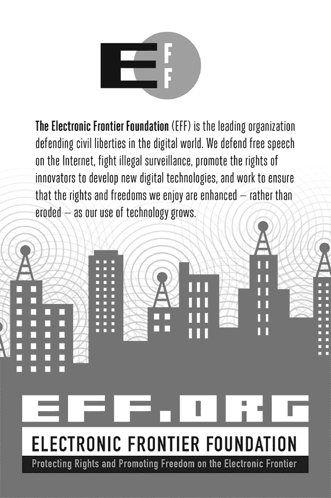
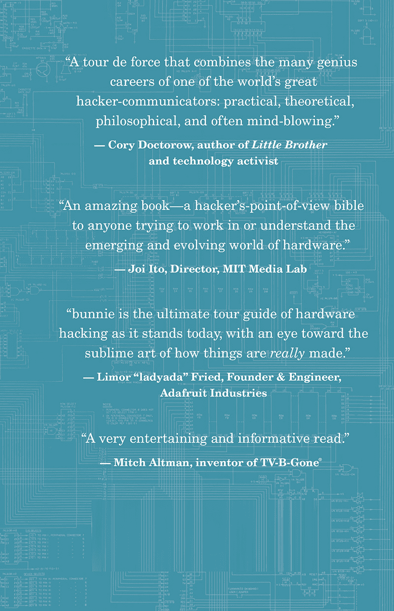

## 第十三章：索引

### A

配件和包装，200–201

适应性，流感，333–335

Akiba，64–65

一体式桌面 Novena，218，242–243

《国家防务授权法案》第 1092 号修正案，149–150

美国与中国制造业的比较，35–36

氨基酸，328–329

各向异性胶带，257–259

抗生素耐药超级细菌，342–343

美国军方的防伪措施，149，154–156

Apple

Apple II，207，326–327，373

富士康，18，20

质量控制，37

精细化成本，202

AppoTech 芯片，293

批准供应商名单（AVL），76

Arduino，213，360

Arduino Uno，104–105，127

制造，44–57

铜片，46–48

蚀刻 PCB，51–53

PCB 图案，应用于铜，49–50

焊接掩膜和丝网印刷，53–54

测试和完成，54–57

手工艺工程，213

Asanović, Krste，310–311

Ashby 图，230

测试程序的审计日志，96

保留正品部件，156

自动化

电子产品组装，29–31

测试程序，96

拉链厂，67–70

AVL（批准供应商名单），76

### B

细菌

CRISPRs 在，347–350

代谢途径，325–327

条形码，嵌入芯片中，154

Novena 电池板，223–224

Novena 电池包，243–244

建立滩头阵地，315–317

自行车安全灯，74–75，79–82

材料清单（BOM），74–84

批准供应商名单，76

自行车安全灯，74–75，79–82

变更，规划，82–84

扩展部件编号，78–79

外形因素，77–78

引用，107–108

公差、组成和电压规格，76–77

生物学与生物信息学，277–278

将 H1N1 与计算机病毒进行比较，327–335

适应性流感，333–335

DNA 和 RNA 作为比特，328–330

攻击猪流感, 331–332

一线希望, 335

独特的访问端口, 330–331

基因组修补, 346–354

CRISPR 在细菌中的应用, 347–350

基因驱动, 352–354

人类工程学, 351–352

如何切割基因, 350–351

个性化基因组学, 344–346

逆向工程超级病毒, 335–344

抗生素抗药性, 342–344

O104:H4 DNA 序列, 336–338

生物学逆向工程工具, 338–340

UNIX Shell 脚本, 340–342

BLASTX 反编译器, 339–340

*蓝图* 访谈, 372–382

BOM. *参见* 物料清单，USB 芯片焊接到 PCB, 61

启动操作系统, 321

自举, 197, 203

启动结构逆向工程, 311–315

底线和 DFM, 88–91

初学者的跳线板, 241–242

构建技术而不使用它, 23–24

商业模式, 363

### C

电容器, 12, 76–77

外壳结构

Chumby, 26–28

Novena, 233–236

现金流, Chumby, 193

手机

黑客技术, 306–324

附加调试器, 317–320

建立滩头阵地, 315–317

启动操作系统, 321

构建新工具链, 321–323

结果, 323–324

逆向工程启动结构, 311–315

系统架构, 306–311

屏幕更换, 120–121

$12 手机, 126–140

工程师权益, 135–140

从公开到开源, 134–135

硬件, 128–131

CFT (Cyber Fast Track)计划, 289

变更, 规划和应对, 82–84

检查图表, 268

Chibitronics, 251–274

背景, 251–259

检查图表, 268

春节, 对供应链的影响, 272–273

简单请求的复杂性, 267–268

交付, 264–266

开发新工艺, 259

组件放置不当, 268–269

临时更改, 271–272

过程能力测试, 261–264

运输, 273–274

单点故障的消除, 271

贴纸图案的模板, 271–272

测试程序, 92–94

翻译问题, 270–271

参观工厂, 260–261

中国。*另见* 工厂；中国深圳

春节, 对供应链的影响, 272–273

中文翻译问题, 270–271

技术增长, 364–366

*中国软件开发者网络 (CSDN)* 面试, 357–372

关于硬件黑客, 367–372

关于开源硬件和创客运动, 358–367

芯片封装技术 (CoB), 29

芯片

与 PCB 的粘接, 61

假冒, 143–148。*另见* 美国军用硬件，假冒芯片

去帽, 282–283

手工放置在 PCB 上, 59–61

SEG 电子市场, 11–14

用于 USB 存储棒, 57–59

芯片射手, 30

Chipworks, 246

色键技术, 303–304

Chumby, 1–2, 181

装配自动化, 29–31

外壳生产, 26–28

现金流, 193

chumby classic, 183–184

chumby One

开发, 184–189

修整和完成, 101–104

连接器放置, 25–26

合同, 193–205

假冒 microSD 卡

真实性, 159–160

电子卡 ID 数据, 158–159

法医调查, 160–162

数据收集, 162–165

总结发现, 166–168

可见差异, 157–158

工厂测试, 41

工厂参观, 16–17

黑客友好的平台, 182–184

注塑成型, 31–34

与 Phil Torrone 的访谈, 189–205

从中学到的经验教训, 374–375

利润率, 192–193

商家买家, 192

麦克风工厂安装, 20–23

主板, 188–189

NeTV。*另见* NeTV 质量控制, 36–39

远程测试, 39–40

逆向物流和退货, 193

测试点, 187–188

电路贴纸, 251–274。*另见* Chibitronics 背景, 251–259

检查图表, 268

春节, 对供应链的影响, 272–273

简单请求中的复杂问题, 267–268

交付, 264–266

开发新工艺，259

组件错误放置，268–269

最后时刻的更改，271–272

过程能力测试，261–264

发货，273–274

消除单点故障，271

模板，271–272

翻译问题，270–271

参观工厂，260–261

*Circuit Sticker Sketchbook*，256–257，267–268

贝壳测试，54

克隆，116

CoB (芯片封装技术)，29

Coders’ Rights Project，137

销售成本 (COGS)，90–92

颜色，通过与操作员的沟通，96

社区强制执行的知识产权规则，124–125

社区对 Novena 的支持，247–249

公司结构，202–203

组成，BOM，76–77

计算机病毒，比较 H1N1 病毒，327–335

适应性，333–335

抗体，335

DNA 和 RNA 作为比特，328–330

黑客攻击 H1N1

病毒，331–332

生物体中的独特访问端口，330–331

配置保险丝，281

合同谈判，193–205

用于 PCB 的铜片，46–50

复制，116

版权，137，138，175–177

外观瑕疵，87–88

销售成本 (COGS)，90–92

假冒商品。*参见* 假货快递，112

覆盖层，260–261

对工匠的需求，26–28

CRISPR/Cas 系统，347–352

Cross, Sean “xobs”，134–135，215–216，289–290。*另见* Novena；SD 卡，黑客众筹，197–198，265，266，382

Crowd Supply，250，264，265

CrypTech，248–249

定制电池组问题，243–244

Cyber Fast Track (CFT) 计划，289

### D

数据显示通道 (DDC)，304

Debian，246

调试器，连接，317–320

去封装 IC，282–283

反编译器，339–340

专用硬件实时钟 (RTC) 模块，238–239

对质量的承诺，20–23

有缺陷单元，支付, 3

电路贴纸的交付, 264–266

设计文件，分享, 363

面向制造设计（DFM）, 84–100. *参见* 测试程序

底线, 88–91

概述, 85–86

测试与验证, 97–100

公差, 86–88

设计过程, 105–106

设计词汇, 101

桌面 Novena, 218, 242–243

DFM. *参见* 面向制造设计 数字千年版权法（DMCA）, 137

直接重复序列, 348

直接面向消费者（DTC）个人基因组学, 344–345

基于突变的疾病预测, 345

分销渠道, 196

DIY 扬声器, 237–238

DMCA（数字千年版权法）, 137

DNA, 328–330. *参见* 基因组双模铸模, 103–104

DRAM 芯片, 12–13

钻孔工艺，PCB 板, 46–48

药物抗性, 338–341

DTC（直接面向消费者）个人基因组学, 344–345

### E

ECO（工程变更订单）, 82–84

*大肠杆菌*，342

EDID（扩展显示识别数据）, 304

EDK（嵌入式开发工具包）, 135

EDM（电火花加工机）, 33

EFF（电子前沿基金会）, 137

效果贴纸, 263

EHEC O104:H4, 335–344

使用 UNIX Shell 脚本回答问题, 340–342

抗生素抗性, 342–344

DNA 序列, 336–338

生物学反向工具, 338–340

电火花加工机（EDM）, 33

电子卡 ID 数据, 158–159

电子前沿基金会（EFF）, 137

电子公差, 86–87

嵌入式开发工具包（EDK）, 135

外壳，Novena, 224–227

生命周期结束（EOL）, 82

工程变更订单（ECO）, 82–84

工程化人类, 351–352

工程样品, 170–172

工程师权益, 135–140

版权, 138

专利及其他法律, 136–137

编程语言, 138–140

EOL（生命周期结束）, 82

擦除

闪存, 284–285

存储卡, 298

安全位, 285–287

蚀刻 PCB，51–53

电子废弃物，处理，155–156

扩展显示识别数据（EDID），304

扩展部件编号，78–79

外部模仿，150–151

### F

工厂，2–3，43–44。*另见* 质量；*按名称列出的特定工厂*

自动化，29–31

在没有使用它的情况下构建技术，23–24

对质量的专注，20–23

有缺陷的单元，支付费用，3

喂养工人，18–20

注塑，31–34

制造中的错误，34，41–42

对工艺人员的需求，26–28

合作伙伴关系，107–113

进口关税，113

订购超过已验证需求的单元，112

报价，108–111

废料和产量，111–112

运输成本，112

成形技巧，107–108

深圳的规模，17–18

废料，152

搜索，378

熟练工人，24–26

测试，41

故障分析服务，281

从失败中学习，368–369

Fairchild 74LCX244，146–147

假货，143–174

芯片，执行良好，143–148

美国军用硬件中的芯片，149–156

反假冒措施，154–156

假冒部件的类型，150–153

美国军用设计，153–154

FPGAs，168–174

错误的 ID 代码，170–172

解决方案，172–174

白屏问题，168–170

microSD 卡，156–168

真实性，159–160

电子卡 ID 数据，158–159

法医调查，160–162

数据收集，162–165

总结发现，166–168

可见差异，157–158

喂养工厂工人，18–20

*Feist Publications, Inc. v. Rural Telephone Service Co., Inc.*，138

Fernly shell, 315–316, 317–319

Fernvale，306

附加调试器，317–320

滩头阵地，建设，315–317

启动操作系统，321

Frond，307–308

法律任务，134–136

外围连接器，308–309

结果，323–324

逆向工程启动结构，311–315

系统架构，306–311

系统图，309

工具链，构建新工具链，321–323

场可编程门阵列。*参见* FPGAs 影片成像，49–50

固件

内存卡，292

Novena，246–247

五位数万用表，98

闪存芯片，用于 USB 闪存盘，57–59

闪存擦除，284–285

平面图案，26–28

柔性电路，252–253

柔性 PCB 工厂，260–261

流痕，236

飞行头测试，54

外形因素，77–78

正向偏置电压，88，89

创始人建议，199

富士康，18，20

FPC（内部柔性印刷电路）插头，238–239

FPGAs（场可编程门阵列）

伪造，168–174

错误的 ID 代码，170–172

解决方案，172–174

白屏问题，168–170

未来趋势，212–213

Novena，239

Freescale/NXP iMX6

CPU，220

前面板，Novena，237–238

完全去壳芯片，282

功能性去壳芯片，282–283

模糊测试，293

### G

基因驱动，352–354

通用突破板（GPBB），241–242

基因组

基于突变的疾病预测，345

基因分型，344–345

补丁，346–354

细菌中的 CRISPRs，347–350

工程人类，351–352

基因驱动，352–354

基因切割位置，350–351

参考，345–346

基因分型，344–345

鬼班，115，152

金样品，36，82

gongkai（公开），117–118，119–120。*参见* shanzhai

手机屏幕更换，120–121

定义，131–134

与 kai fang yuan dai ma（开放源代码）相比，372

$12 手机，126–140

工程师权利，135–140

从 gongkai 到开源，134–135

硬件，128–131

GPBB（通用突破板），241–242

灰色市场，154

### H

H1N1 病毒，与计算机病毒的比较，327–335

适应性，333–335

抗体，335

DNA 和 RNA 作为比特，328–330

黑客 H1N1 病毒 331–332

有机体中的独特接入端口，330–331

H5 端口，330

黑客友好平台，182–184

黑客精神，371

黑客硬件。*参见* 硬件黑客手工将芯片放置在 PCB 上，59–61

硬盘，选择，244–246

硬件黑客，279–281

*CSDN* 采访，367–372

一般讨论，275–278

HDCP 保护链接允许自定义覆盖层，298–306

PI C18F1320，281–289

进一步了解，283–284

去壳 IC，282–283

擦除闪存，284–285

擦除安全位，285–287

保护其他数据，287–289

SD 卡，289–298

潜在的安全问题，298

爱好者资源，298

反向工程微控制器，293–297

山寨手机，306–324

附加调试器，317–320

海滩头，构建，315–317

启动操作系统，321

构建新的工具链，321–323

Fernvale 结果，323–324

反向工程启动结构，311–315

系统架构，306–311

卡片结构，290–293

硬件创业公司，378–380

哈希函数，315

HDCP 保护链接，黑客攻击，298–306

健康，照顾健康，205

传家宝笔记本，210–211

传家宝 Novena，218，227–232

硬盘，245–246

机械工程细节，229–232

外壳用木材，228–229

诚实的表面处理，101

水平基因转移，343

人因工程，351–352

### 我

ID 代码，FPGA，170–172

进口关税和许可证，113

i.MX233，184

进料质量控制（IQC）指南，160

元件在电路贴纸上的错误放置，268–269

工业设计，100–106

Arduino Uno 丝网印刷图案，104–105

chumby One 修整与完成，101–104

个人设计过程，105–106

注射成型

一般讨论，31–34

Novena 制造, 233–236

创新, 359

输入网络, 87

知识产权（IP）。*参见* gongkai; shanzhai

一般讨论, 115–118

西方与中国模式, 131–132

内部柔性印刷电路（FPC）连接器, 238–239

互操作性, 380

访谈, 357–382

*蓝图*, 372–382

*中国软件开发者网络（CSDN）*, 357–372

关于硬件黑客, 367–372

关于开放硬件和创客运动, 358–367

*Make:*, 189–205

库存周转, 196–197

调查假冒 microSD 卡, 158–159, 160–162

参与制造过程, 36–39

IP。*参见* 知识产权

IQC（来料质量控制）指南, 160

伊藤， Joi, 264

### J

日本，经济发展, 365

JTAG, 170

### K

kai fang yuan dai ma（开放源代码）, 372

密钥流, 304–306

Kare, Susan, 39

Kickstarter, 197–198, 377

金士顿 microSD 卡, 156–168

真实性, 159–160

电子卡 ID 数据, 158–159

法医调查, 160–162

收集数据, 162–165

总结发现, 166–168

可见差异, 157–158

编织线, 235

Kovan, 169

### L

劳动力成本, 110

笔记本 Novena, 218

激光成像, 49

临时修改, 271–272

LCA（澳大利亚 Linux 会议）, 57

LCD 边框, Novena, 226

LED, 在自行车安全灯中, 74–75, 79–82

李晓, 23–24

LinkIT ONE, 联发科技, 323–324

Linux 会议澳大利亚（LCA）, 57

测试程序日志, 96

### M

*Make:* 访谈, 189–205

MakerBot, 203

创客运动, 358–367

管理 NAND 系统, 186–187

中间人攻击（MITM），290, 298, 301

制造商 ID, 158–159

制造。*参见* 工厂

边距

chumby, 192–193

工厂, 110–111

Master Chao, 26–28

MCM（多芯片模块）, 310

机械工程，Novena，229–232

机械公差，87–88

联发科技 LinkIT ONE，323–324

联发科技 MT6250DA，130–131

联发科技 MT6260，140，310–311

商家买家，192

金属螺旋装订，*电路贴纸素描本*，267–268

微控制器

存储卡中的假冒，292

逆向工程，293–297

测试程序，92–94

麦克风，chumby，20–23

microSD 卡

chumby One，186

假冒，156–168

真伪认证，159–160

电子卡 ID 数据，158–159

法医调查，160–162

数据收集，162–165

总结发现，166–168

可见差异，157–158

军事硬件中的假冒芯片，149–156

防伪措施，154–156

假冒部件的种类，150–153

美国军事设计，153–154

最小订单量（MOQ），81

最小-最大偏差，86–87

镜面塑料，70–71

制造中的错误，34，41–42

MITM（中间人攻击），290，298，301

MIT 媒体实验室，264

修道院设计，100

穆尔定律，206–212，359

最小订单量（MOQ），81

主板

chumby One，188–189

Novena，221–222，238–239

Mottweiler, Kurt，228，238

多芯片模块（MCM），310

基于突变的疾病预测，345

*肺炎支原体*，325–327

MyriadRF，248

### N

NAND 闪存芯片，13

《国防授权法案》：149–150

NeTV，280

HDCP 背景，300–301

概念图，303

开发，299–300

FPGA 图表，305

目标，301

它的工作原理，302–303

创建密钥流，304–305

创建用户覆盖内容，303–304

新百伦工厂，17–18

Ng, P.C., 344–345

非重复工程（NRE）成本，111

Novena，133，215–250

一体机台式电脑, 218, 242–243

初学者的分离板, 241–242

外壳结构, 233–236

社区支持, 247–249

定制电池包, 243–244

设计, 219–227

电池板, 223–224

外壳, 224–227

主板, 221–222

尺寸, 219

DIY 音响, 237–238

固件, 246–247

前面板变化, 237–238

硬盘，选择, 244–246

Heirloom, 218, 227–232

硬盘, 245–246

机械工程细节, 229–232

外壳木材, 228–229

注塑成型, 233–236

笔记本电脑, 218

主板, 238–239

电力通过板, 242–243

定价, 218

PVT2 主板, 238–240

用户, 217–218

NRE（非重复工程）费用, 111

NuttX, 141

### O

O104:H4 DNA 序列, 336–338

海运, 273–274

ODM（原始设计制造商）, 379–380

在线硬件初创公司, 378–380

按时交付, 266

开放 BOM, 124–125

开源, 117, 134–135

硬件, 176–178, 205–214。*参见* Chibitronics; Chumby; Fernvale; Kovan; NeTV; Novena

*CSDN* 采访关于, 358–367

Heirloom 笔记本, 210–211

盈利化, 195–196

机会, 211–214

趋势, 206–209

软件, 362

订购超过已验证需求的单位, 112

原始设计制造商（ODMs）, 379–380

覆盖层，创建, 303–304

表面包覆, 34

### P

包装类型, 77–78

塑印, 102

回文序列, 348

PAM（临近空间样式），350–351

Particle 的 Spark Core, 306–307

与工厂的合作伙伴关系, 107–113

进口税, 113

订购超过已验证需求的单位, 112

报价, 108–111

废料与良率, 111–112

运费, 112

成型技巧, 107–108

部件编号, 78–79

修补基因组, 346–354

细菌中的 CRISPRs, 347–350

工程化人类, 351–352

基因驱动, 352–354

基因切割位置, 350–351

专利, 136–137, 194–195

图案化, 46

模型制造商, 26–28

PB2 流感基因, 331–332

PCB, 44–57

将图案应用于铜板, 49–50

芯片粘合, 61

电路贴纸, 260–261

铜片, 46–48

蚀刻, 51–53

Fernvale Frond, 307–308

手动放置芯片, 59–61

焊接掩膜和丝网印刷, 53–54

测试与成型, 54–57

PCH 中国解决方案, 17, 37

Peek, Nadya, 226

Peek 阵列, 226

青霉素抗性, 338–339

Perrott, Joe, 27

个人设计过程, 105–106

个性化基因组学, 344–346

锁相环(PLL), 140

光刻胶, 49–50

嵌入物理标识符, 154–155

物理编程, 263

PIC18F1320，黑客攻击, 281–289

进一步观察, 283–284

去封装集成电路, 282–283

擦除闪存, 284–285

擦除安全位, 285–287

保护其他数据, 287–289

塑料表面处理, 70–71

PLL（锁相环）, 140

毒丸, 136–137

聚酰亚胺, 260–261

电源透传板, 242–243

实用设计, 100

精度, 31–34

定价

目标高远, 199–200

Novena, 218

质量控制, 34–35

探针卡, 58

过程能力测试, 261–264

过程几何, 144–145

生产候选贴纸, 263

编程语言, 138–140

黑客攻击时保护数据, 287–289

蛋白质数据库, 338–339

蛋白质, 329, 337

原型空间相邻基序（PAM）, 350–351

### Q

QC（质量控制）室, 36–39

QEMU, 317–318

Qi, Jie, 253–256, 263–264, 270–271. *另见* Chibitronics

质量, 34–35

美国与中国制造, 35–36

致力于, 20–23

工厂测试, 41

参与制造过程, 36–39

错误, 41–42

远程测试, 39–40

质量控制 (QC) 室, 36–39

四级结构, 350

引用, 评估, 108–111

### R

*无线电电子学* (无线电), 369

树莓派, 360

读取-评估-打印循环 (REPL) shell, 293–297

实时时钟 (RTC) 模块, 238–239

返球, 155

重新分配零件, 151–152

回收, 154–155

死亡红圈, 42

参考基因组, 345–346

翻新零件, 150–151, 154

远程测试, 39–40

修复文化, 213

REPL (读取-评估-打印循环) shell, 293–297

电流限制电阻, 88

电阻, 76

有害物质限制 (RoHS) 测试, 41

零售商, 参与, 200, 378

零售中的退货, 193

逆向工程, 137

启动结构, 311–315

一般讨论, 275–278

微控制器, 293–297

超级细菌, 335–344

抗生素抗性, 342–344

O104:H4 DNA 序列, 336–338

逆向工具, 338–340

UNIX shell 脚本, 340–342

逆向物流, 193

RNA, 328–330

RNA 依赖的 RNA 聚合酶, 333

机器人控制器, 78

RoHS (有害物质限制) 测试, 41

ROM, 转储, 312–316

根目录, 用户, 370

路由 PCB, 55

实时时钟 (RTC) 模块, 238–239

橡胶化标签, 25

### S

Samsung microSD 卡, 163–168

SanDisk microSD 卡, 163–168

缎面塑料, 70–71

工厂规模, 17–18

稀缺与需求, 70–71

意大利 Scarmagno, 44–45

废料, 处理, 111–112

脚本语言, 139–140

SD 卡, 黑客攻击, 289–298

潜在安全问题，298

供爱好者使用的资源，298

逆向工程微控制器，293–297

卡片结构，290–293

漏洞，290

二级结构，349–350

第二采购，153

擦除安全位，285–287

安全问题，SD 卡，298

拉链工厂的半自动化过程，68–70

传感器和微控制器贴纸，263

山寨（shanzhai），116–117，121–125，177，371–372。*参见* 公开

手机，2

社区强制执行的知识产权规则，124–125

破解手机，306–324

附加调试器，317–320

滩头阵地，建筑，315–317

启动操作系统，321

构建新工具链，321–323

Fernvale 结果，323–324

逆向工程启动结构，311–315

系统架构，306–311

不仅仅是模仿者，123–124

共享设计文件，363

深圳，中国，1–4。*参见* 工厂

屏幕更换，120–121

SEG 电子市场，8–14

山寨组织，123

深圳书城，14–15

“发货或死”口号，198–199

运输产品，112，273–274

并排粘合，166

存储中的签名，319–320

丝印，53–54，57

单核苷酸多态性（SNPs），345–346

消除单点故障，271

塑料沉降痕，235

技术工人，24–26

智能卡，144–145

智能手表，124

SMT（表面贴装技术），55，77–78

SNPs（单核苷酸多态性），345–346

焊膏，53–54，57

宋江，122

智能手机。*参见* 手机间隔器，348

扬声器，Novena，237–238

SPI ROMulator FPGA，313

ST19CF68

芯片，144–148

堆叠式 CSP，166

平台标准化，212

电路贴纸图案的模板，271–272

超级细菌，逆向工程，335–344

抗生素耐药性, 342–344

O104:H4 DNA 序列, 336–338

反向工具, 338–340

UNIX Shell 脚本, 340–342

供应链, 中国春节对其的影响, 272–273

表面贴装技术（SMT）, 55, 77–78

猪流感. *参见* H1N1 病毒，与计算机病毒的比较

开关

Novena, 237

验证, 98–99

系统架构, 306–311

系统电子, 44–57

将 PCB 图案应用到铜片, 49–50

涂覆焊接掩膜和丝网印刷, 53–54

铜片, 46–48

刻蚀 PCB, 51–53

测试和完成, 54–57

系统级芯片设备, 310–311

### T

Tampo 印刷, 102

技术水平, 在中国, 364–366

Tek MDO4104B-6 示波器, 313

三级结构, 350

测试

闪存芯片, 58–59

PCB, 54–57

与验证的对比, 97–100

测试夹具, 99–100, 271

测试点, chumby One, 187–188

测试程序, 91–95

指南, 94–97

图标，通过与操作员的通信, 96

现实世界, 92–94

设置, 95–96

更新机制, 97

3D 晶体管, 245

通孔封装, 77–78

公差, 76–77, 86–88

Tomlin, Steve, 39, 299

工具链, 构建新工具链, 321–323

工具, 233–234

Torrone, Phil, 189–205

玩具工厂, 29–30

晶体管缩放, 210–211

翻译问题, 270–271

工厂关系中的透明度, 107–108

修整和完成, chumby, 101–104

三重重组病毒, 334–335

$12 手机, 126–140

工程师权益, 135–140

从“公开”到开源, 134–135

硬件, 128–131

### U

U-Boot（通用引导加载程序）, 246

Ubuntu Edge, 382

机体中的独特接入端口, 330–331

通用蛋白质资源（UniProt）, 338–339, 341

UNIX Shell 脚本, 用于回答生物学问题, 340–342

上游, 246

USB 刷写工具，开源版本，320–322

USB 存储棒工厂，57–64

USB 存储棒的起源，57–59

将芯片粘接到 PCB 上，61

仔细查看 USB 存储棒电路板，61–64

手工将芯片放置在 PCB 上，59–61

USB 端口，Novena，237

美国军方硬件中的假冒芯片，149–156

防伪措施，154–156

假冒部件的种类，150–153

美国军方设计，153–154

芯片中的紫外线染料，154–155

紫外线可擦除可编程只读存储器（UV-EPROM），284–285，286

### V

真空管收音机原理图，207

验证与测试，97–100

Vanchip VC5276，130

Vasut, Marek，246，248

风险投资资金，195–196，197–199

振动电位器，67–68

病毒。*另见* H1N1

病毒，与计算机病毒 V-NAND 进行比较，245，246

电压规范，物料清单，76–77

### W

Wang, Chris “Akiba”，64–65

废料处理，155–156

白屏问题，168–170

焊线，29–30，61

Novena 的木质外壳，228–229

### X

Xbox 360，42

Xbox One，369

Xilinx，170–174

xobs，134–135，215–216，289–290。*另见* Novena；SD 卡，黑客攻击

### Y

成品率，84–85，90，111–112

杨氏模量，229–230

### Z

拉链工厂，64–71

全自动化流程，67–68

稀缺性与需求的讽刺，70–71

半自动化流程，68–70

Z 胶带，257–259

## 关于作者

Andrew “bunnie” Huang 一直有个问题，就是中午之前难以起床。加上他总喜欢质疑权威，这意味着他永远无法在财富 500 强公司找到工作。因此，他非常感激从众筹中获得的所有啤酒，因为这意味着他可以通过补充水分来摄取一些卡路里。

