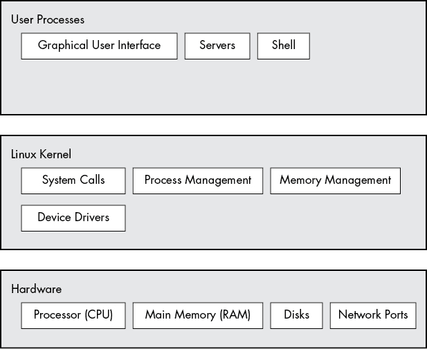
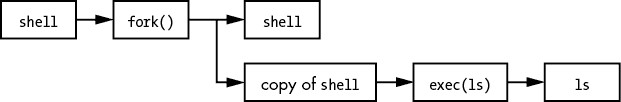
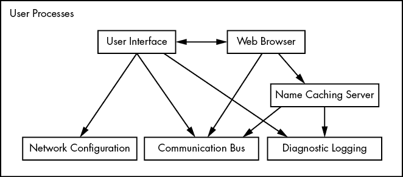

# 第一章：整体视角

一开始，像 Linux 这样的现代操作系统看起来非常复杂，成千上万的组件同时运行并进行通信。例如，一个 Web 服务器可以与一个数据库服务器进行通信，后者又可以使用一个多个其他程序都在使用的共享库。这一切是如何顺利工作的呢？你又该如何理解它呢？

理解操作系统如何工作的最有效方式是通过*抽象*——这是一种高大上的说法，意思是你可以忽略大多数构成你要理解的部分的细节，而专注于它的基本功能和操作。例如，当你乘坐汽车时，通常不需要考虑像固定发动机的安装螺栓或建造和维护道路的人员这些细节。你真正需要知道的是汽车的功能（把你带到别的地方）以及如何使用它的一些基本知识（如何操作车门和安全带）。

如果你只是车上的乘客，这种层次的抽象可能已经足够。但如果你还需要驾驶它，你就必须深入挖掘，并将抽象拆分成几个部分。现在，你的知识扩展到了三个领域：汽车本身（如其大小和功能）、如何操作控制装置（方向盘、油门踏板等）以及道路的特征。

在寻找和修复问题时，抽象化可以是一个很大的帮助。例如，假设你正在开车，车程很颠簸。你可以迅速评估刚才提到的三种基本的与汽车相关的抽象，来确定问题的来源。如果问题不在前两个抽象（你的车或你的驾驶方式），那么你可以迅速排除它们，将问题缩小到路面本身。你可能会发现路面很颠簸。如果你愿意，你可以进一步深入探究路面的抽象，找出为什么路面会破损，或者如果路面是新的，为什么施工人员工作不当。

软件开发者在构建操作系统及其应用程序时，会将抽象作为一种工具。在计算机软件中，有许多用于表示抽象子分区的术语——包括*子系统*、*模块*和*包*——但在本章中我们将使用*组件*这个术语，因为它比较简单。在构建软件组件时，开发者通常不会过多考虑其他组件的内部结构，但他们会考虑能使用的其他组件（这样他们就不需要编写任何额外的、不必要的软件）以及如何使用它们。

本章提供了 Linux 系统组件的高层次概述。虽然每个组件在其内部构造中有大量的技术细节，但我们将忽略这些细节，专注于这些组件在整个系统中的作用。我们将在后续章节中详细探讨这些细节。

## 1.1 Linux 系统中的抽象层次与层级

使用抽象将计算系统划分为多个组件有助于理解，但如果没有组织结构是行不通的。我们将组件安排成*层*或*级别*，根据组件在用户与硬件之间的位置来分类（或分组）。网页浏览器、游戏等处于最上层；在底层，我们有计算机硬件中的内存——0 和 1。操作系统占据了中间的许多层。

一个 Linux 系统有三个主要层级。图 1-1 展示了这些层级以及每个层级中的一些组件。*硬件*处于底层。硬件包括内存，以及一个或多个中央处理单元（CPU），用于执行计算并读写内存。磁盘和网络接口等设备也是硬件的一部分。

下一级是*内核*，它是操作系统的核心。内核是驻留在内存中的软件，告诉 CPU 在哪里查找下一个任务。作为中介，内核管理硬件（特别是主内存），并且是硬件与任何正在运行的程序之间的主要接口。

*进程*——即内核管理的运行程序——共同构成了系统的上层，称为*用户空间*。（进程的一个更具体的术语是*用户进程*，无论用户是否直接与进程交互。例如，所有的网页服务器都作为用户进程运行。）

图 1-1：通用的 Linux 系统组织

内核和用户进程运行方式之间有一个关键的区别：内核运行在*内核模式*下，而用户进程运行在*用户模式*下。运行在内核模式下的代码可以无限制地访问处理器和主内存。这是一个强大但危险的特权，允许内核轻易地破坏并使整个系统崩溃。只有内核可以访问的内存区域称为*内核空间*。

相比之下，用户模式限制了对（通常非常小的）内存子集和安全 CPU 操作的访问。*用户空间*指的是用户进程可以访问的主内存部分。如果一个进程发生错误并崩溃，其后果是有限的，可以由内核进行清理。这意味着，如果你的网页浏览器崩溃，它可能不会影响后台运行了几天的科学计算。

理论上，一个出现故障的用户进程不会对系统的其他部分造成严重损害。实际上，这取决于你对“严重损害”的定义，以及进程的特定权限，因为某些进程被允许做的事情比其他进程更多。例如，一个用户进程能否完全破坏磁盘上的数据？在正确的权限下，答案是肯定的——而你可能认为这相当危险。然而，也有一些安全机制可以防止这种情况发生，大多数进程通常不被允许以这种方式造成破坏。

## 1.2 硬件：理解主内存

在所有计算机硬件中，*主内存*也许是最重要的。从最原始的形式来看，主内存仅仅是一个存储大量 0 和 1 的大区域。每一个 0 或 1 的存储位置被称为*比特*。这是运行中的内核和进程所在的地方——它们只是大量比特的集合。所有来自外围设备的输入和输出都流经主内存，也是以比特的形式传输。CPU 本质上是内存的操作员；它从内存中读取指令和数据，并将数据写回内存。

你常常会听到*状态*一词，通常用来描述内存、进程、内核和计算机系统的其他部分。严格来说，状态是比特的一种特定排列。例如，如果你的内存中有四个比特，0110、0001 和 1011 代表三种不同的状态。

当你考虑到一个单独的进程可能由数百万个比特组成时，谈论状态时通常更容易使用抽象的术语。你不再用比特来描述状态，而是描述某物当前正在做的事情。例如，你可能会说，“进程正在等待输入”或，“进程正在执行启动的第二阶段”。

## 1.3 内核

为什么我们要讨论主内存和状态？几乎所有内核的操作都围绕主内存展开。内核的任务之一是将内存划分为许多子区，并且它必须始终维护关于这些子区的状态信息。每个进程都有自己的一部分内存，内核必须确保每个进程只能使用其分配的内存。

内核负责管理四个主要系统区域的任务：

1.  进程 内核负责确定哪些进程被允许使用 CPU。

1.  内存 内核需要跟踪所有内存——当前分配给某个进程的内存、可能在进程间共享的内存以及空闲内存。

1.  设备驱动程序 内核充当硬件（如磁盘）和进程之间的接口。通常是内核的工作来操作硬件。

1.  系统调用和支持进程通常使用系统调用与内核进行通信。

现在我们将简要探讨这些领域。

### 1.3.1 进程管理

*进程管理*描述了进程的启动、暂停、恢复、调度和终止。启动和终止进程的概念相对简单，但描述一个进程在其正常操作过程中如何使用 CPU 则稍显复杂。

在任何现代操作系统中，许多进程是“同时”运行的。例如，你可能在桌面电脑上同时打开了一个网页浏览器和一个电子表格。然而，事情并不像它们看起来的那样：这些应用程序背后的进程通常不会在*完全*相同的时间运行。

假设一个系统有一个单核 CPU。许多进程可能*能够*使用 CPU，但在任何给定的时间内，只有一个进程可以实际使用 CPU。实际上，每个进程使用 CPU 的时间很短，然后暂停；接着另一个进程使用 CPU 短暂的时间；然后另一个进程轮流使用 CPU，依此类推。一个进程将 CPU 控制权交给另一个进程的行为称为*上下文切换*。

每一段时间——称为*时间片*——为进程提供足够的时间进行重要的计算（实际上，进程通常在一个时间片内完成当前任务）。然而，由于时间片非常短，人类无法察觉它们，因此系统似乎在同时运行多个进程（这种能力被称为*多任务处理*）。

内核负责上下文切换。为了理解这一过程，让我们设想一个场景，其中一个进程正在用户模式下运行，但它的时间片已用完。接下来会发生什么：

1.  CPU（实际硬件）根据内部定时器中断当前进程，切换到内核模式，并将控制权交回内核。

1.  内核记录了当前 CPU 和内存的状态，这对于恢复刚刚被中断的进程至关重要。

1.  内核执行在前一个时间片期间可能发生的任何任务（例如，收集输入输出或 I/O 操作的数据）。

1.  内核现在准备让另一个进程运行。内核分析准备运行的进程列表，并选择一个进程。

1.  内核为这个新进程准备内存，然后为 CPU 做准备。

1.  内核告知 CPU 新进程的时间片将持续多长时间。

1.  内核将 CPU 切换到用户模式，并将 CPU 的控制权交给进程。

上下文切换回答了一个重要问题——*何时*内核运行。答案是，它在上下文切换期间*在*进程时间片之间运行。

在多 CPU 系统的情况下（如大多数当前机器一样），情况会稍微复杂一些，因为内核不需要放弃对当前 CPU 的控制来允许进程在其他 CPU 上运行，并且可能同时有多个进程在运行。然而，为了最大化所有可用 CPU 的使用，内核通常会执行这些步骤（并可能使用某些技巧为自己争取更多的 CPU 时间）。

### 1.3.2 内存管理

内核必须在上下文切换期间管理内存，这可能是一个复杂的任务。必须满足以下条件：

+   内核必须在内存中有自己的私有区域，用户进程无法访问。

+   每个用户进程需要自己的一段内存区域。

+   一个用户进程不能访问另一个进程的私有内存。

+   用户进程可以共享内存。

+   一些用户进程的内存是只读的。

+   系统可以通过使用磁盘空间作为辅助内存，来使用比物理内存更多的内存。

幸运的是，内核并非孤立无援。现代 CPU 包含一个*内存管理单元（MMU）*，它启用了一个名为*虚拟内存*的内存访问方案。使用虚拟内存时，进程不会直接按硬件中的物理位置访问内存。相反，内核为每个进程设置，使其像拥有一台完整的机器一样。当进程访问某些内存时，MMU 会拦截该访问，并使用内存地址映射将进程视角中的内存位置转换为机器中的实际物理内存位置。内核仍然需要初始化并持续维护和修改这个内存地址映射。例如，在上下文切换期间，内核必须将映射从即将退出的进程切换到即将进入的进程。

你将在第八章中学习更多关于如何查看内存性能的内容。

### 1.3.3 设备驱动与管理

内核在设备管理中的角色相对简单。设备通常只能在内核模式下访问，因为不当访问（例如，用户进程要求关闭电源）可能会导致机器崩溃。一个显著的难点是，不同设备的编程接口通常不同，即使它们执行相同的任务（例如，两个不同的网卡）。因此，设备驱动程序通常是内核的一部分，它们努力向用户进程提供统一的接口，以简化软件开发人员的工作。

### 1.3.4 系统调用与支持

还有其他几种内核特性可供用户进程使用。例如，*系统调用*（或 *syscalls*）执行一些用户进程单独无法或不容易完成的特定任务。例如，打开、读取和写入文件的操作都涉及系统调用。

`fork()` 和 `exec()` 两个系统调用对于理解进程如何启动至关重要：

1.  `fork()` 当一个进程调用 `fork()` 时，内核会创建一个几乎完全相同的进程副本。

1.  `exec()` 当一个进程调用`exec(``program``)`时，内核加载并启动`program`，替换当前进程。

除了 init（参见第六章），*所有*新的用户进程在 Linux 系统中都是通过`fork()`启动的，并且大多数情况下，你还会运行`exec()`来启动一个新程序，而不是运行一个现有进程的副本。一个非常简单的例子是你在命令行运行的任何程序，比如`ls`命令，用来显示目录内容。当你在终端窗口中输入`ls`时，终端窗口中运行的 shell 会调用`fork()`来创建一个 shell 的副本，然后新副本的 shell 会调用`exec(ls)`来运行`ls`。图 1-2 展示了启动像`ls`这样的程序时，进程和系统调用的流程。

图 1-2：启动一个新进程

内核还通过支持其他特性来支持用户进程，这些特性不同于传统的系统调用，其中最常见的是*伪设备*。伪设备对于用户进程来说看起来像是设备，但它们完全通过软件实现。这意味着它们在技术上不需要在内核中，但通常出于实际原因，它们还是会在内核中。例如，内核的随机数生成器设备（*/dev/random*）如果用用户进程来实现，安全性会很难保障。

## 1.4 用户空间

如前所述，内核为用户进程分配的主内存称为*用户空间*。因为一个进程只是内存中的一个状态（或镜像），所以用户空间也指的是所有正在运行的进程的内存（你可能会听到更口语化的术语*用户域*来指代用户空间；有时它也指代在用户空间中运行的程序）。

大多数在 Linux 系统上真正发生的操作都是在用户空间中。尽管从内核的角度来看，所有进程本质上是平等的，但它们为用户执行不同的任务。用户进程所代表的系统组件有一个基本的服务层级结构。图 1-3 展示了在 Linux 系统中，一组示例组件是如何组合在一起并相互交互的。基本服务位于最底层（最接近内核），实用服务位于中间，用户接触到的应用程序则位于顶部。图 1-3 是一个大大简化的示意图，因为只显示了六个组件，但你可以看到，最顶部的组件最接近用户（用户界面和网页浏览器）；中间层的组件包括网页浏览器使用的域名缓存服务器；底层则有几个较小的组件。

图 1-3：进程类型与交互

最底层通常由执行单一、简单任务的小组件组成。中间层则包含更大的组件，如邮件、打印和数据库服务。最后，顶层的组件执行复杂的任务，用户通常会直接控制这些任务。组件之间也会相互使用。一般来说，如果一个组件想要使用另一个组件，第二个组件要么在同一服务层级，要么在更低层级。

然而，图 1-3 仅仅是对用户空间排列的近似描述。实际上，用户空间没有固定规则。例如，大多数应用程序和服务会写诊断信息，也就是*日志*。大多数程序使用标准的 syslog 服务来写日志消息，但也有一些程序更倾向于自己完成所有日志记录。

此外，一些用户空间组件很难分类。例如，像网页和数据库服务器这样的服务器组件可以视为高级应用程序，因为它们的任务通常比较复杂，因此你可能会将它们放在图 1-3 的顶层。然而，用户应用程序可能依赖这些服务器来完成它们自己不想做的任务，因此你也可以将它们放在中间层。

## 1.5 用户

Linux 内核支持传统的 Unix 用户概念。*用户*是可以运行进程并拥有文件的实体。用户通常与*用户名*相关联；例如，系统可以有一个名为*billyjoe*的用户。然而，内核并不管理用户名；相反，它通过简单的数字标识符来识别用户，这些标识符称为*用户 ID*。 （你将在第七章了解更多关于用户名与用户 ID 之间的关系。）

用户的存在主要是为了支持权限和边界。每个用户空间进程都有一个用户*所有者*，进程被认为是*以*所有者身份运行的。用户可以终止或修改自己的进程行为（在某些限制范围内），但不能干扰其他用户的进程。此外，用户可以拥有文件并决定是否与其他用户共享这些文件。

一个 Linux 系统通常除了与真实用户对应的用户外，还会有多个其他用户。你将在第三章中详细了解这些内容，但最重要的用户是*root*。root 用户是前述规则的例外，因为 root 可以终止和修改其他用户的进程，并访问本地系统上的任何文件。因此，root 被称为*超级用户*。可以以 root 身份操作的人——也就是拥有*root 访问权限*的人——在传统 Unix 系统中是管理员。

*组*是用户的集合。组的主要目的是允许一个用户与其他组成员共享文件访问权限。

## 1.6 展望未来

到目前为止，你已经了解了构成*运行中*Linux 系统的基本内容。用户进程构成了你直接交互的环境；内核管理进程和硬件。内核和进程都驻留在内存中。

这些是很好的背景信息，但仅仅通过阅读你无法了解 Linux 系统的细节；你需要动手实践。下一章将通过教授一些用户空间的基础知识来开启你的旅程。在此过程中，你将学习到本章没有讨论的 Linux 系统的一个重要部分：长期存储（磁盘、文件等）。毕竟，你需要将程序和数据存储在某个地方。
