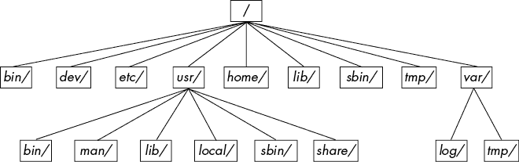

# 第二章：基本命令和目录层次结构


本章是一本指导你了解在本书中会遇到的 Unix 命令和工具的指南。这是初步材料，你可能已经掌握了其中的相当一部分。即使你认为自己已经掌握，也请花些时间浏览一下这一章，确保理解，尤其是关于目录层次结构的内容（见第 2.19 节）。

为什么要学习 Unix 命令？这不是一本关于 Linux 如何工作的书吗？当然是，但 Linux 本质上是一种 Unix 变种。在本章中，你会看到*Unix*这个词比*Linux*出现得更多，因为你学到的内容可以直接应用到 BSD 和其他 Unix 变种系统上。我试图避免讲解过多的 Linux 特有的用户界面扩展，不仅是为了帮助你更好地使用其他操作系统，也是因为这些扩展通常不稳定。如果你掌握了核心命令，你会在面对新的 Linux 版本时更加快速适应。此外，掌握这些命令可以增强你对内核的理解，因为许多命令直接对应于系统调用。

## 2.1 Bourne Shell：/bin/sh

Shell 是 Unix 系统中最重要的部分之一。*Shell*是一个运行命令的程序，类似于用户在终端窗口中输入的命令。这些命令可以是其他程序，也可以是 Shell 的内置功能。Shell 还作为一个小型的编程环境。Unix 程序员通常将常见任务分解为更小的组件，并使用 Shell 来管理任务和将它们拼接起来。

系统的许多重要部分实际上是*Shell 脚本*——包含一系列 Shell 命令的文本文件。如果你以前使用过 MS-DOS，可以把 Shell 脚本看作是非常强大的*.BAT*文件。因为它们很重要，第十一章将完全讲解 Shell 脚本。

随着你在本书中的学习和实践，你会不断增加使用 Shell 操作命令的知识。Shell 的一个最大优点就是，如果你犯了错误，你可以很容易地看到自己输入的内容，找出出错的原因，然后重新尝试。

Unix 有许多不同的 Shell，但所有 Shell 都从 Bourne Shell（*/bin/sh*）中继承了特性，Bourne Shell 是由贝尔实验室为早期版本的 Unix 开发的标准 Shell。每个 Unix 系统都需要一个 Bourne Shell 版本才能正常工作，正如你在本书中将看到的那样。

Linux 使用的是增强版的 Bourne Shell，称为`bash`，即“Bourne-again” Shell。`bash`是大多数 Linux 发行版的默认 Shell，而在 Linux 系统中，*/bin/sh*通常是指向`bash`的链接。在本书中的示例中，你应使用`bash` Shell。

## 2.2 使用 Shell

当你安装 Linux 时，应该至少创建一个普通用户作为你的个人账户。在本章中，你应该以普通用户身份登录。

### 2.2.1 Shell 窗口

登录后，打开一个 shell 窗口（通常称为*终端*）。从 Gnome 或 KDE 这样的图形界面打开的最简单方法是启动一个终端应用程序，它会在新窗口中启动一个 shell。一旦打开了 shell，它应该在顶部显示一个提示符，通常以美元符号（`$`）结尾。在 Ubuntu 中，提示符应该像`name@host:path``$`，而在 Fedora 中，则是`[name@host path]$`，其中`name`是你的用户名，`host`是你的计算机名称，`path`是你当前的工作目录（见 2.4.1 节）。如果你熟悉 Windows，shell 窗口看起来有点像 DOS 命令提示符；在 macOS 中，终端应用程序本质上与 Linux shell 窗口相同。

本书包含了许多你将在 shell 提示符下输入的命令。它们都以单个美元符号`$`开始，用来表示 shell 提示符。例如，输入以下命令（只输入粗体部分，不包括`$`）并按回车：

```
$ **echo Hello there.**
```

现在输入这个命令：

```
$ **cat /etc/passwd**
```

这个命令显示`/etc/passwd`系统信息文件的内容，然后返回你的 shell 提示符。现在不用担心*这个*文件的作用；你将在第七章中详细了解它。

命令通常以要运行的程序开始，后面可能跟着*参数*，这些参数告诉程序要操作的对象以及如何操作。在这里，程序是`cat`，并且有一个参数`/etc/passwd`。许多参数是选项，用来修改程序的默认行为，通常以破折号（`-`）开头。稍后在讨论`ls`时，你会看到这一点。然而，也有一些不遵循这种正常命令结构的例外情况，比如 shell 内建命令和环境变量的临时使用。

### 2.2.2 cat

`cat`程序是 Unix 中最容易理解的程序之一；它只输出一个或多个文件的内容，或者来自其他输入源的数据。`cat`命令的基本语法如下：

```
$ **cat** `file1``file2` **...**
```

当你运行这个命令时，`cat`会打印`file1`、`file2`以及你指定的任何其他文件的内容（在前面的例子中由`...`表示），然后退出。这个程序叫做`cat`，因为当它打印多个文件的内容时，它会执行连接操作。运行`cat`的方法有很多种；让我们用它来探索 Unix 的输入输出（I/O）。

### 2.2.3 标准输入和标准输出

Unix 进程使用 I/O *流*来读取和写入数据。进程从输入流中读取数据，并将数据写入输出流。流是非常灵活的。例如，输入流的来源可以是文件、设备、终端窗口，甚至是另一个进程的输出流。

要查看输入流的工作情况，输入`cat`（不带任何参数）并按回车。这时你不会立即看到输出，也不会看到 shell 提示符，因为`cat`仍在运行。现在输入任何内容，并在每行结束时按回车。以这种方式使用时，`cat`命令会重复你输入的每一行。当你感到足够无聊时，按 ctrl-D 结束空行以终止`cat`并返回到 shell 提示符。

`cat`在这里采用交互行为的原因与流有关。当你没有指定输入文件名时，`cat`从 Linux 内核提供的*标准输入*流中读取，而不是从连接到文件的流中读取。在这种情况下，标准输入连接到你运行`cat`的终端。

*标准输出*类似。内核为每个进程提供一个标准输出流，供其写入输出。`cat`命令始终将输出写入标准输出。当你在终端运行`cat`时，标准输出连接到该终端，因此你会在终端看到输出。

标准输入和输出通常缩写为*stdin*和*stdout*。许多命令的操作方式与`cat`相似；如果你没有指定输入文件，命令就会从 stdin 读取。输出稍有不同。一些程序（如`cat`）仅将输出发送到 stdout，而其他程序则有将输出直接发送到文件的选项。

还有一个第三个标准 I/O 流，称为*标准错误*。你将在第 2.14.1 节中看到它。

标准流的一个最佳特点是你可以轻松地操作它们，将数据读取和写入到终端以外的地方，正如你将在第 2.14 节中学到的那样。特别是，你将学会如何将流连接到文件和其他进程。

## 2.3 基本命令

现在让我们看一下更多的 Unix 命令。以下大多数程序都接受多个参数，有些有如此多的选项和格式，以至于列出所有的细节没有意义。这是一个简化的基础命令列表；你现在不需要所有的细节。

### 2.3.1 ls

`ls`命令列出目录的内容。默认情况下是当前目录，但你可以添加任何目录或文件作为参数，并且有许多有用的选项。例如，使用`ls -l`进行详细（长格式）列出，使用`ls -F`显示文件类型信息。以下是一个示例的长格式列出；它包括文件的所有者（第 3 列）、组（第 4 列）、文件大小（第 5 列）以及修改日期/时间（在第 5 列和文件名之间）：

```
$ **ls -l**
total 3616
-rw-r--r-- 1 juser users 3804    May 28 10:40  abusive.c
-rw-r--r-- 1 juser users 4165    Aug 13 10:01  battery.zip
-rw-r--r-- 1 juser users 131219  Aug 13 10:33  beav_1.40-13.tar.gz
-rw-r--r-- 1 juser users 6255    May 20 14:34  country.c
drwxr-xr-x 2 juser users 4096    Jul 17 20:00  cs335
-rwxr-xr-x 1 juser users 7108    Jun 16 13:05  dhry
-rw-r--r-- 1 juser users 11309   Aug 13 10:26  dhry.c
-rw-r--r-- 1 juser users 56      Jul  9 15:30  doit
drwxr-xr-x 6 juser users 4096    Feb 20 13:51  dw
drwxr-xr-x 3 juser users 4096    Jul  1 16:05  hough-stuff
```

你将在第 2.17 节中进一步了解此输出的第一列。第二列现在可以忽略；它表示文件的硬链接数，详细信息将在第 4.6 节中解释。

### 2.3.2 cp

`cp`命令最简单的形式是复制文件。例如，要将`file1`复制到`file2`，可以输入：

```
$ **cp** `file1``file2`
```

你还可以将文件复制到另一个目录，并保持该目录中的相同文件名：

```
$ **cp** `file``dir`
```

要将多个文件复制到名为`dir`的目录（文件夹）中，可以尝试如下示例，复制三个文件：

```
$ **cp `file1` `file2` `file3`**`dir`
```

### 2.3.3 mv

`mv`（移动）命令的工作方式与`cp`类似。以最简单的形式，它用于重命名文件。例如，要将`file1`重命名为`file2`，请输入：

```
$ **mv** `file1``file2`
```

你也可以使用`mv`命令像`cp`一样将文件移动到其他目录。

### 2.3.4 touch

`touch`命令可以创建一个文件。如果目标文件已经存在，`touch`不会改变文件，但它会更新文件的修改时间戳。例如，要创建一个空文件，请输入：

```
$ **touch** `file`
```

然后对那个文件运行`ls -l`命令。你应该看到类似以下的输出，其中的日期和时间表示你运行`touch`命令的时间：

```
$ **ls -l** `file`
-rw-r--r-- 1 juser users 0  May 21 18:32  `file`
```

要查看时间戳更新，至少等一分钟，然后再次运行相同的`touch`命令。`ls -l`返回的时间戳会更新。

### 2.3.5 rm

`rm`命令删除（移除）一个文件。删除文件后，它通常会从系统中消失，通常无法恢复，除非你从备份中恢复它。

```
$ **rm** `file`
```

### 2.3.6 echo

`echo`命令将其参数打印到标准输出：

```
$ **echo Hello again.**
Hello again.
```

`echo`命令对于查找 shell 通配符（如`*`）和变量（如`$HOME`）的扩展非常有用，你将在本章稍后遇到它们。

## 2.4 导航目录

Unix 目录层级从*/*开始，也称为*根目录*。目录分隔符是斜杠（*/*），*不是*反斜杠（\）。根目录下有几个标准的子目录，如*/usr*，你将在 2.19 节学习到。

当你引用一个文件或目录时，你需要指定一个*路径*或*路径名*。当路径以*/*（例如*/usr/lib*）开始时，它是一个*完整*或*绝对*路径。

一个由两个点（*..*）表示的路径组件指定了目录的父目录。例如，如果你在*/usr/lib*工作，路径*..*将指向*/usr*。类似地，*../bin*将指向*/usr/bin*。

一个点（*.*）表示当前目录；例如，如果你在*/usr/lib*目录中，那么路径.仍然是*/usr/lib*，而*./X11*则是*/usr/lib/X11*。你不需要经常使用*.*，因为大多数命令会默认使用当前目录，如果路径没有以*/*开始（因此你可以在前面的例子中直接使用*X11*而不是*./X11*）。

以*/*开头的路径称为*相对路径*。大多数时候，你会使用相对路径名，因为你通常已经在需要的目录中或靠近该目录。

现在你对基本的目录操作有了了解，下面是一些基本的目录命令。

### 2.4.1 cd

*当前工作目录*是一个进程（如 shell）当前所在的目录。除了大多数 Linux 发行版中的默认 shell 提示符，你还可以使用`pwd`命令查看当前目录，详细信息见 2.5.3 节。

每个进程都可以独立设置自己的当前工作目录。`cd`命令改变 shell 的当前工作目录：

```
$ **cd** `dir`
```

如果省略`dir`，Shell 会返回到你的*主目录*，即你第一次登录时所在的目录。一些程序用`~`符号（*波浪线*）来缩写你的主目录。

### 2.4.2 mkdir

`mkdir`命令创建一个新的目录`dir`：

```
$ **mkdir** `dir`
```

### 2.4.3 rmdir

`rmdir`命令删除目录`dir`：

```
$ **rmdir** `dir`
```

如果`dir`目录不为空，这个命令会失败。然而，如果你急于操作，可能不想先繁琐地删除`dir`内部的所有文件和子目录。你可以使用`rm -r` `dir`来删除一个目录及其内容，但要小心！这是少数几个可能造成严重损害的命令之一，特别是当你以超级用户身份运行它时。`-r`选项指定*递归删除*，它会反复删除`dir`内部的所有内容。不要与像星号（`*`）这样的通配符一起使用`-r`标志。最重要的是，运行命令之前务必三思而后行。

### 2.4.4 Shell 通配符匹配（“通配符”）

Shell 可以将简单模式匹配到文件和目录名称，这个过程叫做*通配符匹配*。这与其他系统中的通配符概念类似。最简单的通配符是`*`，它告诉 Shell 匹配任意数量的任意字符。例如，下面的命令会打印当前目录中的文件列表：

```
$ **echo ***
```

Shell 会将包含通配符的参数匹配到文件名，并用这些文件名替换相应的参数，然后执行修改后的命令行。这个替换过程叫做*扩展*，因为 Shell 会用所有匹配的文件名替换简化的表达式。以下是一些使用`*`来扩展文件名的方法：

+   `at*` 会展开为所有以`at`开头的文件名。

+   `*at` 会展开为所有以`at`结尾的文件名。

+   `*at*` 会展开为所有包含`at`的文件名。

如果没有文件匹配通配符，`bash` Shell 不会进行扩展，命令将以字面字符（如`*.`）运行。例如，可以尝试命令`echo *dfkdsafh`。

另一个 Shell 通配符字符是问号（`?`），它告诉 Shell 匹配恰好一个任意字符。例如，`b?at`可以匹配`boat`和`brat`。

如果你不希望 Shell 扩展命令中的通配符，可以将通配符用单引号（`''`）括起来。例如，命令`echo '*'`会打印一个星号。你会发现这对于接下来章节中描述的某些命令（如`grep`和`find`）非常有用。（你将在第 11.2 节学到更多关于引用的内容。）

Shell 的模式匹配能力还有更多内容，但`*`和`?`是现在需要了解的内容。第 2.7 节描述了包含点（`.`）的特殊文件的通配符行为。

## 2.5 中级命令

本节介绍了最基本的中级 Unix 命令。

### 2.5.1 grep

`grep`命令会打印出文件或输入流中与某个表达式匹配的行。例如，要打印`/etc/passwd`文件中包含文本`root`的行，可以输入以下命令：

```
$ **grep root /etc/passwd**
```

`grep` 命令在同时操作多个文件时非常方便，因为它会在匹配行之外打印文件名。例如，如果你想检查 `/etc` 中的每个文件是否包含 `root` 这个词，可以使用以下命令：

```
$ **grep root /etc/***
```

`grep` 的两个最重要的选项是 `-i`（用于不区分大小写的匹配）和 `-v`（反转搜索——即打印所有 *不* 匹配的行）。还有一个更强大的变体叫做 `egrep`（它只是 `grep -E` 的别名）。

`grep` 理解 *正则表达式*，正则表达式是计算机科学理论中的模式，广泛应用于 Unix 工具中。正则表达式比通配符样式的模式更强大，并且具有不同的语法。关于正则表达式，有三件重要的事需要记住：

+   `.*` 匹配任意数量的字符，包括没有字符（就像通配符中的 `*`）。

+   `.+` 匹配一个或多个任意字符。

+   `.` 匹配任意一个字符。

### 2.5.2 less

`less` 命令在文件非常大或命令输出过长并滚动超出屏幕时非常有用。

要逐页查看像 `/usr/share/dict/words` 这样的大文件，可以使用命令 `less` `/usr/share/dict/words`。运行 `less` 后，你会一次看到文件的一个屏幕内容。按空格键向前翻页，按 b（小写）向后翻页。要退出，按 q。

你也可以在 `less` 中搜索文本。例如，向前搜索一个词，可以输入 `/` `word`，向后搜索可以用 `?` `word`。当找到匹配项时，按 n 继续搜索。

正如你将在 2.14 节中学到的，你可以将几乎任何程序的标准输出直接传递到另一个程序的标准输入。这在你有大量输出需要筛选时特别有用，像 `less` 这样的工具可以帮助你查看输出。以下是将 `grep` 命令的输出传递给 `less` 的示例：

```
$ **grep ie /usr/share/dict/words | less**
```

自己试试这个命令。你可能会发现 `less` 有许多类似的用途。

### 2.5.3 pwd

`pwd`（打印工作目录）程序简单地输出当前工作目录的名称。你可能会想，既然大多数 Linux 发行版在提示符中已设置当前工作目录，为什么还需要这个命令呢？这里有两个原因。

首先，并非所有的提示符都包括当前工作目录，尤其是你可能想在自己的提示符中去掉它，因为它会占用大量空间。如果你这样做了，你需要使用 `pwd`。

其次，你将在 2.17.2 节中学到的符号链接有时会掩盖当前工作目录的真实完整路径。使用 `pwd -P` 可以消除这种混淆。

### 2.5.4 diff

要查看两个文本文件之间的差异，可以使用 `diff`：

```
$ **diff** `file1``file2`
```

有几个选项可以控制输出格式，默认的输出格式通常是最容易理解的。然而，大多数程序员在需要将输出发送给别人时更喜欢使用`diff -u`的输出格式，因为自动化工具在这个格式下处理起来更容易。

### 2.5.5 file

如果你看到一个文件，并且不确定它的格式，可以尝试使用`file`命令查看系统是否能够猜测出它的格式：

```
$ **file** `file`
```

你可能会惊讶于这个看似无害的命令能做这么多事情。

### 2.5.6 find 和 locate

当你知道某个文件在某个目录树中但就是不知道在哪里时，使用`find`命令查找`file`在`dir`中的位置，如下所示：

```
$ **find** `dir` **-name** `file` **-print**
```

和本节中的大多数程序一样，`find`也能执行一些复杂的操作。然而，在你完全掌握并理解为什么需要`-name`和`-print`选项之前，不要尝试使用像`-exec`这样的选项。`find`命令接受特殊的模式匹配字符，例如`*`，但你必须将它们用单引号（`'*'`）括起来，以防止特殊字符被 Shell 的通配符特性所扩展。（回想一下第 2.4.4 节，Shell 会在执行命令之前扩展通配符。）

大多数系统还具有`locate`命令用于查找文件。`locate`不会实时搜索文件，而是搜索系统定期建立的索引。使用`locate`进行搜索比使用`find`要快得多，但如果你要找的文件比索引更新，`locate`将找不到它。

### 2.5.7 head 和 tail

`head`和`tail`命令允许你快速查看文件或数据流的一部分。例如，`head /etc/passwd`显示密码文件的前 10 行，`tail /etc/passwd`显示密码文件的最后 10 行。

要更改显示的行数，请使用`-n`选项，其中`n`是您想要查看的行数（例如，`head -5 /etc/passwd`）。要从第`n`行开始打印行，请使用`tail +``n`。

### 2.5.8 sort

`sort`命令可以快速将文本文件的行按字母数字顺序排列。如果文件的行以数字开头，并且你希望按数字顺序排序，请使用`-n`选项。`-r`选项会反转排序顺序。

## 2.6 更改密码和 shell

使用`passwd`命令更改密码。系统会要求你输入旧密码，然后提示你输入新密码两次。

最佳密码通常是长的“胡言乱语”句子，容易记住。密码越长（字符长度越多），就越好；尝试 16 个字符或更多。（在早期，您可以使用的字符数有限，因此建议添加一些奇怪的字符等。）

你可以使用`chsh`命令更改你的 Shell（例如更换为`zsh`、`ksh`或`tcsh`），但请记住，本书假设你正在使用`bash`，所以如果你进行了更改，某些示例可能无法正常工作。

## 2.7 点文件

如果你不在家目录中，先切换到家目录，输入`ls`查看内容，然后运行`ls -a`。你看到输出的区别了吗？当你运行没有`-a`选项的`ls`时，你看不到以*点文件*（dot files）命名的配置文件。这些是以点（`.`）开头的文件和目录。常见的点文件有*.bashrc*和*.login*，也有点目录，例如*.ssh*。

点文件和点目录没有什么特别之处。有些程序默认不显示它们，这样在列出家目录的内容时你就不会看到一团乱麻。例如，`ls`默认不列出点文件，除非你使用`-a`选项。此外，shell 的通配符默认也不会匹配点文件，除非你显式地使用诸如`.*`这样的模式。

## 2.8 环境变量与 Shell 变量

Shell 可以存储临时变量，称为*shell 变量*，它们包含文本字符串的值。Shell 变量在脚本中非常有用，可以用来跟踪值，并且有些 shell 变量控制 shell 的行为。（例如，`bash` shell 在显示提示符之前会读取`PS1`变量。）

要给一个 shell 变量赋值，可以使用等号（`=`）。这是一个简单的示例：

```
$ **STUFF=blah**
```

上面的例子将名为`STUFF`的变量的值设置为`blah`。要访问这个变量，可以使用`$STUFF`（例如，尝试运行`echo $STUFF`）。你将在第十一章了解更多关于 shell 变量的用法。

*环境变量*就像 shell 变量，但它不是特定于 shell 的。所有 Unix 系统上的进程都有环境变量存储。环境变量和 shell 变量的主要区别在于，操作系统会将你 shell 的所有环境变量传递给 shell 运行的程序，而 shell 变量则无法在你运行的命令中访问。

你可以使用 shell 的`export`命令来赋值环境变量。例如，如果你想将`$STUFF`这个 shell 变量变成环境变量，可以使用以下命令：

```
$ **STUFF=blah**
$ **export STUFF**
```

因为子进程会继承父进程的环境变量，许多程序会读取这些变量来进行配置和选项设置。例如，你可以把自己喜欢的`less`命令行选项放在`LESS`环境变量中，当你运行`less`时，它会使用这些选项。（许多手册页中有一个名为 ENVIRONMENT 的部分，描述了这些变量。）

## 2.9 命令路径

`PATH`是一个特殊的环境变量，包含*命令路径*（简称*路径*），它是一个系统目录的列表，当 shell 尝试定位命令时，它会搜索这些目录。例如，当你运行`ls`时，shell 会在`PATH`中列出的目录中搜索`ls`程序。如果路径中的多个目录有相同名称的程序，shell 会运行第一个匹配的程序。

如果你运行`echo $PATH`，你会看到路径组件通过冒号（`:`）分隔。例如：

```
$ **echo $PATH**
/usr/local/bin:/usr/bin:/bin
```

要让 shell 在更多位置查找程序，可以更改 `PATH` 环境变量。例如，通过使用此命令，可以将目录 `dir` 添加到路径的开头，以便 shell 在查找其他 `PATH` 目录之前，首先查找 `dir`：

```
$ **PATH=**`dir`**:$PATH**
```

或者你可以将目录名附加到 `PATH` 变量的末尾，使得 shell 最后查找 `dir`：

```
$ **PATH=$PATH:**`dir`
```

## 2.10 特殊字符

在与他人讨论 Linux 时，你应该了解一些你将遇到的特殊字符的名称。如果你对这些感兴趣，可以参阅“行话文件”(*http://www.catb.org/jargon/html/*) 或其印刷版，《黑客新字典》第三版，由 Eric S. Raymond 编写（MIT 出版社，1996 年）。

表 2-1 描述了一些常见的特殊字符，你在本章中已经看到了其中很多字符。一些工具，如 Perl 编程语言，几乎使用了所有这些特殊字符！(请记住，这些是字符的美国名称。)

表 2-1：特殊字符

| **字符** | **名称** | **用途** |
| --- | --- | --- |
| `*` | 星号，星形符号 | 正则表达式，通配符 |
| `.` | 点号 | 当前目录，文件/主机名分隔符 |
| `!` | bang | 否定，命令历史 |
| `&#124;` | 管道符号 | 命令管道 |
| `/` | 正斜杠 | 目录分隔符，搜索命令 |
| `\` | 反斜杠 | 字面值，宏（*绝不*是目录） |
| `$` | 美元符号 | 变量，行尾 |
| `'` | 反引号，单引号 | 字面字符串 |
| `` ` `` | 反引号 | 命令替换 |
| `"` | 双引号 | 半字面字符串 |
| `^` | 插入符号 | 否定，行首 |
| `~` | 波浪符，敲击符 | 否定，目录快捷方式 |
| `#` | 井号，尖锐符号，磅符号 | 注释，预处理器，替换 |
| `[ ]` | 方括号 | 范围 |
| `{ }` | 大括号，圆括号 | 语句块，范围 |
| `_` | 下划线，底线 | 当不想或不允许使用空格时，或当自动补全算法混淆时，常用作空格的廉价替代 |

## 2.11 命令行编辑

当你在使用 shell 时，注意到你可以使用左右箭头键编辑命令行，同时也可以使用上下箭头键浏览之前的命令。这在大多数 Linux 系统中是标准配置。

然而，最好忘记箭头键，而改用控制键组合。如果你学会了 表 2-2 中列出的快捷键，你会发现自己能更好地在许多使用这些标准快捷键的 Unix 程序中输入文本。

表 2-2：命令行快捷键

| **快捷键** | **动作** |
| --- | --- |
| ctrl-B | 将光标向左移动 |
| ctrl-F | 将光标向右移动 |
| ctrl-P | 查看上一条命令（或将光标向上移动） |
| ctrl-N | 查看下一条命令（或将光标向下移动） |
| ctrl-A | 将光标移动到行首 |
| ctrl-E | 将光标移动到行末 |
| ctrl-W | 删除前一个单词 |
| ctrl-U | 从光标处删除到行首 |
| ctrl-K | 从光标处删除到行尾 |
| ctrl-Y | 粘贴已删除的文本（例如，从 ctrl-U） |

## 2.12 文本编辑器

说到编辑，到了学习编辑器的时候了。要认真对待 Unix，你必须能够编辑文本文件而不损坏它们。系统的许多部分使用纯文本配置文件（如*/etc*中的文件）。编辑文件并不难，但你会做得如此频繁，以至于需要一个强大的工具来完成这项工作。

你应该尝试学习两种事实上的标准 Unix 文本编辑器之一：vi 和 Emacs。大多数 Unix 大师对于他们选择的编辑器有着宗教般的偏执，但不要听他们的。自己选择一个适合你的工具。如果你选择一个与你的工作方式匹配的编辑器，你会发现学习起来更容易。基本上，选择可以归结为以下几点：

+   如果你想要一个几乎可以做任何事情并且拥有广泛在线帮助的编辑器，而且你不介意额外的打字工作来获得这些功能，可以试试 Emacs。

+   如果速度最重要，试试 vi；它有点像玩视频游戏。

*学习 vi 和 Vim 编辑器：Unix 文本处理*（第七版），作者：Arnold Robbins、Elbert Hannah 和 Linda Lamb（O’Reilly, 2008），可以告诉你关于 vi 的一切。对于 Emacs，可以使用在线教程：启动 Emacs，按 ctrl-H，然后输入 T，或者阅读 *GNU Emacs 手册*（第十八版），作者：Richard M. Stallman（自由软件基金会，2018）。

刚开始时，你可能会想尝试一个更友好的编辑器，比如 nano、Pico 或众多图形界面编辑器之一，但如果你倾向于养成使用第一个工具的习惯，你就不想走这条路。

## 2.13 获取在线帮助

Linux 系统自带大量文档。对于基础命令，手册页（或称*man 页）会告诉你所需的信息。例如，要查看`ls`命令的手册页，可以运行`man`命令，如下所示：

```
$ **man ls**
```

大多数手册页主要集中在参考信息上，可能会包含一些示例和交叉引用，但就这些。不要指望它是教程，也不要指望它有吸引力的文学风格。

当程序有很多选项时，手册页通常会以某种系统化的方式列出这些选项（例如，按字母顺序），但它不会告诉你哪些选项是重要的。如果你有耐心，通常可以在手册页中找到你需要了解的内容。如果你不耐烦，可以请朋友帮忙——或者付钱请个朋友，这样你就可以向他或她请教了。

要按关键词搜索手册页，可以使用 `-k` 选项：

```
$ **man -k** `keyword`
```

这对于你不太确定自己想要的命令名时很有帮助。例如，如果你在寻找一个排序命令，可以运行：

```
$ **man -k sort**
--`snip`--
comm (1) - compare two sorted files line by line
qsort (3) - sorts an array
sort (1) - sort lines of text files
sortm (1) - sort messages
tsort (1) - perform topological sort
--`snip`--
```

输出内容包括手册页的名称、手册章节（见下文）以及对手册页内容的简要描述。

手册页通过编号的章节进行引用。当有人引用手册页时，他们通常会在名称旁边加上章节号，如 ping(8)。表 2-3 列出了章节及其编号。

表 2-3：在线手册章节

| **章节** | **描述** |
| --- | --- |
| 1 | 用户命令 |
| 2 | 内核系统调用 |
| 3 | 高级 Unix 编程库文档 |
| 4 | 设备接口和驱动程序信息 |
| 5 | 文件描述（系统配置文件） |
| 6 | 游戏 |
| 7 | 文件格式、约定和编码（ASCII、后缀等） |
| 8 | 系统命令和服务器 |

章节 1、5、7 和 8 应该是本书的良好补充。第四章可能用处不大，第六章如果再大一点会更好。如果你不是程序员，可能无法使用第三章，但一旦你阅读了更多关于系统调用的内容，第二章的一些材料你可能能理解。

一些常见术语在多个章节中有许多匹配的手册页。默认情况下，`man` 会显示它找到的第一个页面。你可以通过章节选择手册页。例如，要阅读 */etc/passwd* 文件描述（而不是 `passwd` 命令），你可以在页面名称前加上章节号，如下所示：

```
$ **man 5 passwd**
```

手册页涵盖了基本内容，但还有许多其他方式可以获取在线帮助（除了搜索互联网）。如果你只是想找某个命令的选项，可以尝试输入命令名称后加 `--help` 或 `-h`（每个命令的选项不同）。你可能会得到大量的输出（如 `ls --help`），或者你可能找到你需要的信息。

前些时候，GNU 项目决定不再太喜欢手册页，而转向了一种叫做 *info*（或 *texinfo*）的格式。通常这种文档比典型的手册页要深入，但它也可能更复杂。要访问 info 手册，可以使用 `info` 命令加上命令名：

```
$ **info** `command`
```

如果你不喜欢 `info` 阅读器，可以将输出发送到 `less`（只需添加 `| less`）。

一些软件包将它们可用的文档直接转储到 */usr/share/doc* 目录，而不考虑像 `man` 或 `info` 这样的在线手册系统。如果你发现自己在寻找文档时，可以查看此目录——当然，也可以搜索互联网。

## 2.14 Shell 输入与输出

现在你已经熟悉了基本的 Unix 命令、文件和目录，你准备好学习如何重定向标准输入和输出了。我们从标准输出开始。

要将 `command` 的输出发送到文件而不是终端，可以使用 `>` 重定向字符：

```
$ `command` **>** `file`
```

如果文件 `file` 不存在，shell 会创建它。如果 `file` 已经存在，shell 会首先删除（*覆盖*）原始文件。（有些 shell 有防止覆盖的参数。例如，你可以在 `bash` 中输入 `set -C` 来避免覆盖。）

你可以使用 `>>` 重定向语法将输出附加到文件，而不是覆盖文件：

```
$ `command` **>>** `file`
```

这是一种在执行相关命令序列时将输出收集到一个地方的便捷方式。

要将一个命令的标准输出发送到另一个命令的标准输入中，使用管道符号（`|`）。要查看这个是如何工作的，试试下面这两个命令：

```
$ **head /proc/cpuinfo**
$ **head /proc/cpuinfo | tr a-z A-Z**
```

你可以将输出通过任意多的管道命令传输；只需在每个附加命令前添加另一个管道符号。

### 2.14.1 标准错误

偶尔，你可能会重定向标准输出，但发现程序仍然会向终端输出内容。这被称为 *标准错误*（stderr）；它是用于诊断和调试的额外输出流。例如，这个命令会产生一个错误：

```
$ **ls /fffffffff > f**
```

完成后，*f* 应该为空，但你仍然会在终端看到以下作为标准错误的错误信息：

```
ls: cannot access /fffffffff: No such file or directory
```

你可以根据需要重定向标准错误。例如，要将标准输出重定向到 *f* 并将标准错误重定向到 *e*，可以使用 `2>` 语法，如下所示：

```
$ **ls /fffffffff > f 2> e**
```

数字 2 指定了 shell 修改的 *流 ID*。流 ID 1 是标准输出（默认），而 2 是标准错误。

你还可以使用 `>&` 语法将标准错误发送到与标准输出相同的位置。例如，要将标准输出和标准错误都发送到名为 *f* 的文件中，可以使用以下命令：

```
$ **ls /fffffffff > f 2>&1**
```

### 2.14.2 标准输入重定向

要将文件通道到程序的标准输入中，使用 `<` 操作符：

```
$ **head < /proc/cpuinfo**
```

你偶尔会遇到需要这种重定向的程序，但由于大多数 Unix 命令接受文件名作为参数，这种情况并不常见。例如，上面的命令可以写成 `head /proc/cpuinfo`。

## 2.15 理解错误信息

当你在类似 Unix 的系统（如 Linux）上遇到问题时，*必须* 阅读错误信息。与其他操作系统的消息不同，Unix 错误通常会直接告诉你出了什么问题。

### 2.15.1 Unix 错误信息的构成

大多数 Unix 程序生成并报告相同的基本错误信息，但不同程序的输出可能会有细微差别。下面是一个你一定会以某种形式遇到的例子：

```
$ **ls /dsafsda**
ls: cannot access /dsafsda: No such file or directory
```

这个信息包含三个部分：

+   程序名 `ls`。有些程序省略这个标识信息，当你写 shell 脚本时，这可能会很烦人，但其实不算大问题。

+   文件名 `/dsafsda`，这是更具体的信息。这个路径存在问题。

+   错误信息 `No such file or directory` 表示文件名存在问题。

综合来看，你会看到类似“`ls` 尝试打开 `/dsafsda`，但由于该文件不存在，无法打开。”这样的信息。这可能看起来显而易见，但当你运行包含错误命令的 shell 脚本时，这些信息可能会有些混淆。

在排查错误时，始终先解决第一个错误。有些程序在报告其他问题之前，会先报告它们无法执行任何操作。例如，假设你运行了一个虚拟的程序 `scumd`，并且看到以下错误信息：

```
scumd: cannot access /etc/scumd/config: No such file or directory
```

紧接着是一长串看起来像灾难的其他错误信息。不要让那些错误分散你的注意力。你可能只需要创建 */etc/scumd/config*。

### 2.15.2 常见错误

你在 Unix 程序中遇到的许多错误都源于文件和进程可能出现的各种问题。其中许多错误直接源于内核系统调用遇到的情况，因此你可以通过查看这些错误，了解内核是如何将问题反馈给进程的。

#### 没有这样的文件或目录

这是最常见的错误。你试图访问一个不存在的文件。由于 Unix 文件 I/O 系统对文件和目录的区分不大，这条错误信息涵盖了这两种情况。当你试图读取一个不存在的文件时，当你试图切换到一个不存在的目录时，当你试图在一个不存在的目录下写入文件时，等等。这条错误也被称为 ENOENT，表示“没有实体错误”。

#### 文件已存在

在这种情况下，你可能试图创建一个已存在的文件。这通常发生在你尝试创建一个与文件同名的目录时。

#### 不是目录，是目录

当你尝试将一个文件当作目录使用，或者将一个目录当作文件使用时，这些信息会弹出。例如：

```
$ **touch a**
$ **touch a/b**
touch: a/b: Not a directory
```

注意，错误信息仅适用于 `a/b` 中的 `a` 部分。当你遇到这个问题时，你可能需要深入挖掘，找出哪个路径组件被当作目录处理。

#### 设备上没有剩余空间

你已用尽磁盘空间。

#### 权限被拒绝

当你尝试读取或写入一个你没有权限访问的文件或目录时（你没有足够的权限），会出现此错误。如果你尝试执行一个没有设置执行权限的文件（即使你可以读取该文件），也会出现此错误。你将在 2.17 节中了解更多关于权限的信息。

#### 操作不允许

通常发生在你试图结束一个你不拥有的进程时。

#### 段错误，公交错误

*段错误* 本质上意味着你刚刚运行的程序的作者在某个地方出错了。程序试图访问一个它不允许触及的内存区域，操作系统因此终止了它。类似地，*公交错误* 表示程序试图以不应有的方式访问某些内存。当你遇到这些错误时，可能是你向程序输入了它没有预料到的数据。少数情况下，这可能是硬件故障导致的内存问题。

## 2.16 列出和操作进程

回忆一下第一章中，进程是正在运行的程序。系统上的每个进程都有一个数字 *进程 ID* *(PID)*。要快速列出正在运行的进程，只需在命令行中运行 `ps`。你应该会得到如下所示的列表：

```
$ **ps**
  PID TTY STAT TIME COMMAND
  520 p0  S    0:00 -bash
  545  ?  S    3:59 /usr/X11R6/bin/ctwm -W
  548  ?  S    0:10 xclock -geometry -0-0
 2159 pd  SW   0:00 /usr/bin/vi lib/addresses
31956 p3  R    0:00 ps
```

各字段说明如下：

1.  `PID` 进程 ID。

1.  `TTY` 进程正在运行的终端设备。稍后会详细讲解。

1.  `STAT` 进程状态——即进程正在做什么以及其内存的位置。例如，`S` 表示休眠，`R` 表示运行。（有关所有符号的描述，请参见 ps(1) 手册页面。）

1.  `TIME` 进程已使用的 CPU 时间，以分钟和秒为单位。换句话说，这是进程在处理器上运行指令所消耗的总时间。记住，由于进程不会持续运行，这与进程启动以来的时间（或“挂钟时间”）是不同的。

1.  `COMMAND` 这个看起来可能很明显，是用来运行程序的命令，但请注意，进程可以将此字段从原始值更改。此外，shell 可以执行通配符扩展，并且该字段将反映扩展后的命令，而不是你在提示符下输入的命令。

### 2.16.1 ps 命令选项

`ps` 命令有许多选项。为了避免混淆，你可以使用三种不同的样式来指定选项——Unix、BSD 和 GNU。许多人发现 BSD 样式最为舒适（也许是因为它需要输入更少的内容），所以本书中将使用这种样式。以下是一些最有用的选项组合：

1.  `ps x` 显示所有正在运行的进程。

1.  `ps ax` 显示系统上的所有进程，而不仅仅是你拥有的进程。

1.  `ps u` 显示关于进程的更详细信息。

1.  `ps w` 显示完整的命令名称，而不仅仅是适合一行显示的部分。

与其他程序一样，你可以组合选项，例如 `ps aux` 和 `ps auxw`。

要检查特定进程，可以将其 PID 添加到 `ps` 命令的参数列表中。例如，要检查当前的 shell 进程，可以使用 `ps u $$`（`$$` 是一个 shell 变量，它会解析为当前 shell 的 PID）。你可以在第八章找到关于管理命令 `top` 和 `lsof` 的信息。这些命令即使在你进行系统维护之外也可以帮助你定位进程。

### 2.16.2 进程终止

要终止一个进程，你需要通过 `kill` 命令向它发送一个 *信号*——来自内核的消息。在大多数情况下，你只需要执行以下操作：

```
$ **kill** `pid`
```

有许多类型的信号。默认信号（如上所示）是 `TERM`，即终止信号。你可以通过向 `kill` 添加额外选项来发送不同的信号。例如，要冻结一个进程而不是终止它，可以使用 `STOP` 信号：

```
$ **kill -STOP** `pid`
```

一个停止的进程仍然在内存中，准备从停止的位置继续执行。使用 `CONT` 信号可以继续运行该进程：

```
$ **kill -CONT** `pid`
```

内核在收到信号后会给大多数进程一个机会让它们自行清理（通过 *信号处理程序* 机制）。然而，有些进程可能会选择在响应信号时采取非终止的行动，卡在处理信号的过程中，或者根本忽视信号，因此你可能会发现某个进程在你尝试终止它后仍然在运行。如果发生这种情况，如果你真的需要杀死一个进程，最直接的方法是使用 `KILL` 信号。与其他信号不同，`KILL` 无法被忽略；实际上，操作系统甚至不给进程一个机会。内核会直接终止进程并强制将其从内存中移除。只有在最后手段下才使用这种方法。

你不应该随意杀死进程，尤其是当你不知道它们在做什么时。你可能会自作自受。

你可能会看到其他用户在使用 `kill` 时输入数字而不是名称——例如，输入 `kill -9` 而不是 `kill -KILL`。这是因为内核使用数字来表示不同的信号；如果你知道想要发送的信号的数字，可以使用 `kill` 命令。运行 `kill -l` 可以查看信号数字与名称的对应关系。

### 2.16.3 作业控制

Shell 支持 *作业控制*，这是一种通过使用各种按键和命令向程序发送 `TSTP`（类似于 `STOP`）和 `CONT` 信号的方式。这允许你暂停并在正在使用的程序之间切换。例如，你可以通过 ctrl-Z 发送 `TSTP` 信号，然后通过输入 `fg`（将其带到前台）或 `bg`（将其移到后台；见下一节）重新启动进程。但尽管作业控制具有实用性，并且许多经验丰富的用户习惯使用它，它对初学者来说并不必要，甚至可能会令人困惑：用户常常会按错键，按下 ctrl-Z 而不是 ctrl-C，忘记自己正在运行什么程序，最终导致有大量暂停的进程。

如果你想运行多个程序，可以将每个程序运行在单独的终端窗口中，将非交互式进程放到后台（如下一节所述），并学习使用 `screen` 和 `tmux` 工具。

### 2.16.4 后台进程

通常，当你从 shell 执行 Unix 命令时，直到程序执行完成，你才会得到 shell 提示符。然而，你可以通过使用符号 ampersand (`&`) 将进程从 shell 中分离并将其置于“后台”；这样可以立即返回提示符。例如，如果你有一个需要用 `gunzip` 解压的大文件（你将在 2.18 节看到这个），并且希望在运行过程中做其他事情，可以像这样运行命令：

```
$ **gunzip** `file`**.gz &**
```

shell 应该通过打印新后台进程的 PID 来响应，提示符应立即返回，以便你可以继续工作。如果进程需要很长时间，它甚至可以在你注销后继续运行，这在运行需要大量计算的程序时特别有用。如果进程在你注销或关闭终端窗口之前完成，shell 通常会根据你的设置通知你。

运行后台进程的黑暗面在于，它们可能期望与标准输入进行交互（或者更糟糕的是，直接从终端读取）。如果一个程序在后台运行时试图从标准输入读取数据，它可能会冻结（可以尝试`fg`将其恢复）或终止。此外，如果程序向标准输出或标准错误输出写入数据，输出可能会直接出现在终端窗口中，而不会考虑任何其他正在运行的进程，这意味着当你在做其他事情时，可能会出现意外的输出。

确保后台进程不干扰你的最佳方法是重定向它的输出（以及可能的输入），如第 2.14 节所述。

如果后台进程的多余输出妨碍了你的工作，学习如何重新绘制终端窗口的内容。`bash` shell 和大多数全屏交互程序都支持 ctrl-L 来重新绘制整个屏幕。如果程序正在从标准输入读取数据，ctrl-R 通常会重新绘制当前行，但在错误的时机按下错误的组合键可能会让你陷入比之前更糟的情况。例如，在`bash`提示符下输入 ctrl-R 会进入反向搜索模式（按 esc 退出）。

## 2.17 文件模式和权限

每个 Unix 文件都有一组*权限*，决定你是否可以读取、写入或执行该文件。运行`ls -l`可以显示权限。以下是此类显示的示例：

```
-rw-r--r--1 1 juser somegroup 7041  Mar 26 19:34  endnotes.html
```

文件的*模式*表示文件的权限和一些附加信息。模式有四个部分，如图 2-1 所示。


图 2-1：文件模式的组成部分

模式的第一个字符是*文件类型*。如示例中所示，该位置的破折号（`-`）表示一个*常规*文件，这意味着文件没有特别之处，它仅包含二进制或文本数据。这是最常见的文件类型。目录也是常见的，它们通过文件类型位置的`d`来表示。（第 3.1 节列出了其他文件类型。）

文件模式的其余部分包含权限，分为三组：*用户*、*组*和*其他*，按此顺序。例如，示例中的`rw-`字符是用户权限，接下来的`r--`字符是组权限，最后的`r--`字符是其他权限。

每个权限集可以包含四种基本表示形式：

+   `r`表示该文件是可读的。

+   `w`表示该文件是可写的。

+   `x`表示该文件是可执行的（您可以将其作为程序运行）。

+   `-`表示“无”（更具体地说，该位置的权限尚未授予）。

用户权限（第一组）与拥有文件的用户相关。在前面的示例中，用户是`juser`。第二组是组权限，适用于文件的组（示例中的`somegroup`）。该组中的任何用户都可以使用这些权限。（使用`groups`命令查看您所在的组，并参阅第 7.3.5 节了解更多信息。）

系统中的其他所有人根据第三组权限——其他权限，通常称为*全体*权限——进行访问。

一些可执行文件在用户权限列表中显示`s`而不是`x`。这表示该可执行文件是*setuid*，意味着当您执行程序时，它将以文件所有者的身份运行，而不是以您自己的身份。许多程序使用 setuid 位以 root 身份运行，以便获得更改系统文件所需的权限。一个例子是`passwd`程序，它需要更改*/etc/passwd*文件。

### 2.17.1 修改权限

要更改文件或目录的权限，请使用`chmod`命令。首先，选择您要更改的权限集，然后选择要更改的位。例如，要为`file`添加组（`g`）和其他（`o`）用户的读（`r`）权限，您可以执行以下两个命令：

```
$ **chmod g+r** `file`
$ **chmod o+r** `file`
```

或者您也可以一次性完成所有操作：

```
$ **chmod go+r** `file`
```

要移除这些权限，使用`go-r`代替`go+r`。

有时您会看到人们使用数字来更改权限，例如：

```
$ **chmod 644** `file`
```

这称为*绝对*更改，因为它一次性设置*所有*的权限位。要理解这如何工作，您需要知道如何以八进制形式表示权限位（每个数字表示一个 8 进制数，范围从 0 到 7，并对应一个权限集）。更多内容请参阅 chmod(1)手册页或 info 手册。

如果您更喜欢使用绝对模式，实际上并不需要知道如何构建它们；只需记住您最常用的模式。表 2-4 列出了最常见的几种。

表 2-4：绝对权限模式

| **模式** | **含义** | **用途** |
| --- | --- | --- |
| `644` | 用户：读/写；组，其他：读 | 文件 |
| `600` | 用户：读/写；组，其他：无 | 文件 |
| `755` | 用户：读/写/执行；组，其他：读/执行 | 目录，程序 |
| `700` | 用户：读/写/执行；组，其他：无 | 目录，程序 |
| `711` | 用户：读/写/执行；组，其他：执行 | 目录 |

目录也有权限。如果目录可读，您可以列出其内容，但只有当目录是可执行的，您才能访问目录中的文件。在大多数情况下，您需要同时具备这两项；设置目录权限时，人们常犯的一个错误是使用绝对模式时不小心去掉了执行权限。

最后，你可以使用`umask` shell 命令来指定一组默认权限，它会将一组预定义的权限应用于你创建的任何新文件。一般来说，如果你希望所有人都能查看你创建的所有文件和目录，请使用`umask 022`，如果你不希望这样，则使用`umask 077`。如果你希望使你的所需权限掩码适用于新窗口和后续会话，你需要将`umask`命令与所需的模式放入启动文件中，正如第十三章所讨论的那样。

### 2.17.2 使用符号链接

*符号链接*是一个指向另一个文件或目录的文件，有效地创建了一个别名（类似于 Windows 中的快捷方式）。符号链接提供了对隐蔽目录路径的快速访问。

在长目录列表中，符号链接的显示如下（请注意文件模式中的`l`，它表示文件类型）：

```
lrwxrwxrwx 1 ruser users  11 Feb 27 13:52  somedir -> /home/origdir
```

如果你尝试访问此目录中的*somedir*，系统会给你返回*/home/origdir*。符号链接只是指向其他名称的文件名。它们的名称和指向的路径不需要有任何实际意义。在前面的例子中，*/home/origdir*不需要存在。

事实上，如果*/home/origdir*不存在，任何访问*somedir*的程序都会返回一个错误，报告*somedir*不存在（除了`ls somedir`，这个命令愚蠢地告诉你*somedir*就是*somedir*）。这可能会让人困惑，因为你眼前就能看到一个名为*somedir*的东西。

这并不是符号链接可能令人困惑的唯一方式。另一个问题是，你不能仅凭链接的名称就识别链接目标的特征；你必须跟踪该链接以查看它是指向文件还是目录。你的系统中可能还有指向其他链接的链接，这些被称为*链式符号链接*，在你试图追踪它们时可能会很麻烦。

要从*target*创建一个指向*linkname*的符号链接，请使用`ln -s`，如下所示：

```
$ **ln -s `target` `linkname`**
```

`linkname`参数是符号链接的名称，`target`参数是链接*指向*的文件或目录的路径，`-s`标志指定这是一个符号链接（请参阅后面的警告）。

创建符号链接时，请在运行命令之前检查两遍，因为可能会出现几种错误情况。例如，如果你不小心反转了参数的顺序（`ln -s` `linkname target`），如果*linkname*是一个已经存在的目录，你将面临一些麻烦。如果是这种情况（而且这种情况非常常见），`ln`会在*linkname*目录中创建一个名为*target*的链接，而该链接将指向它自己，除非*linkname*是一个完整路径。如果创建符号链接到目录时出现问题，请检查该目录是否有错误的符号链接并将其删除。

当你不知道符号链接存在时，它们也会引起头疼。例如，你可能会不小心编辑一个你认为是文件副本的文件，但它实际上是指向原始文件的符号链接。

在了解了关于符号链接的所有警告之后，你可能会好奇为什么有人会想使用它们。事实证明，它们的缺陷远远被它们在文件组织方面提供的强大功能以及轻松解决小问题的能力所弥补。一个常见的使用场景是，当程序期望在你的系统中某个地方找到特定的文件或目录时，你不想复制它，如果无法更改程序，你可以直接创建一个符号链接，将它指向实际的文件或目录位置。

## 2.18 文件归档与压缩

现在你已经了解了文件、权限和可能的错误，接下来需要掌握`gzip`和`tar`这两个常用工具，用于压缩和打包文件与目录。

### 2.18.1 gzip

程序`gzip`（GNU Zip）是当前标准的 Unix 压缩程序之一。以*.gz*结尾的文件是 GNU Zip 归档文件。使用`gunzip` `file``.gz`来解压*<file>.gz*并移除后缀；要重新压缩文件，请使用`gzip` `file`。

### 2.18.2 tar

与其他操作系统的 ZIP 程序不同，`gzip`并不会创建文件归档；也就是说，它不会将多个文件和目录打包成一个文件。要创建归档，请改用`tar`：

```
$ **tar cvf** `archive`**.tar** `file1``file2` **...**
```

`tar`创建的归档文件通常以*.tar*为后缀（这是惯例，并非强制要求）。例如，在之前的命令中，`file1`、`file2`等是你希望归档的文件和目录的名称，存储为*<archive>.tar*。`c`标志启用*创建模式*。`v`和`f`标志有更具体的作用。

`v`标志启用详细诊断输出，当`tar`遇到文件和目录时，会打印它们的名称。再加一个`v`，`tar`会打印如文件大小和权限等详细信息。如果不想让`tar`告诉你它正在做什么，可以省略`v`标志。

`f`标志表示文件选项。在`f`标志后面的命令行参数必须是`tar`将创建的归档文件（在之前的示例中，它是*<archive>.tar*）。你*必须*每次使用此选项并跟随一个文件名，除非使用磁带驱动器。要使用标准输入或输出，可以将文件名设置为破折号（`-`）。

#### 解包.tar 文件

要使用`tar`解包*.tar*文件，请使用`x`标志：

```
$ **tar xvf** `archive`**.tar**
```

在此命令中，`x`标志将`tar`设置为*提取*（*解包*）*模式*。你可以通过在命令行末尾输入归档部分的名称来提取单独的部分，但你必须知道它们的确切名称。（要确认名称，请参阅接下来介绍的目录列表模式。）

#### 使用目录列表模式

在解包之前，通常最好使用*目录内容模式*来检查*.tar*文件的内容，通过使用`t`标志而不是`x`标志。此模式验证归档的基本完整性，并列出归档中所有文件的名称。如果你在解包前没有测试归档，可能会把大量文件乱七八糟地解压到当前目录中，这样清理起来会非常困难。

当你使用`t`模式检查归档时，确保所有内容都位于合理的目录结构中；也就是说，归档中的所有文件路径名应该都以相同的目录开头。如果不确定，可以创建一个临时目录，切换到该目录，然后再进行解压。（如果归档没有搞乱文件结构，你可以随时使用`mv * ..`来移动文件。）

解包时，可以考虑使用`p`选项来保留权限。在提取模式下使用此选项，以覆盖你的`umask`，并获得归档中指定的精确权限。对于超级用户来说，`p`选项是默认选项。如果你在以超级用户身份解包归档时遇到权限和所有权问题，确保等到命令执行完毕并返回到命令行提示符。尽管你可能只想提取归档的一小部分，但`tar`必须运行整个归档过程，你不能中断它，因为它只有在检查完整个归档后才会设置权限。

将本节中*所有*的`tar`选项和模式都记住。如果你有困难，可以制作一些记忆卡片。听起来可能像是小学的做法，但这对避免在使用此命令时犯粗心错误非常重要。

### 2.18.3 压缩归档（.tar.gz）

许多初学者发现压缩归档文件（以*.tar.gz*结尾）很容易混淆。要解压一个压缩归档，从右到左操作；先去掉*.gz*，然后再处理*.tar*。例如，这两个命令解压和解包*<file>.tar.gz*：

```
$ **gunzip** `file`**.tar.gz**
$ **tar xvf** `file`**.tar**
```

在开始时，可以一步步地进行，先运行`gunzip`来解压，然后再运行`tar`来验证和解包。要创建压缩归档文件，只需反过来做：先运行`tar`，再运行`gzip`。经常这样做，你很快就会记住归档和压缩的过程是如何工作的。但即便你不常这样做，也能体会到所有输入的命令会变得多么繁琐，你会开始寻找快捷方式。让我们现在来看一下这些方法。

### 2.18.4 zcat

刚才展示的方法不是调用`tar`解压压缩归档的最快或最高效的方式，它浪费了磁盘空间和内核 I/O 时间。一种更好的方法是将归档和压缩功能结合在一个管道中。例如，这个命令管道解压*<file>.tar.gz*：

```
$ **zcat** `file`**.tar.gz | tar xvf -**
```

`zcat`命令与`gunzip -dc`相同。`-d`选项用于解压，`-c`选项将结果发送到标准输出（在此情况下为`tar`命令）。

由于使用`zcat`非常常见，Linux 中随附的`tar`版本提供了一个快捷方式。你可以使用`z`作为选项，自动在归档文件上调用`gzip`；这适用于提取归档（使用`x`或`t`模式的`tar`）和创建归档（使用`c`模式）。例如，使用以下命令来验证一个压缩的归档：

```
$ **tar ztvf** `file`**.tar.gz**
```

然而，请记住，当你使用快捷方式时，实际上是在执行两个步骤。

### 2.18.5 其他压缩工具

另外两个压缩程序是`xz`和`bzip2`，它们的压缩文件分别以*.xz*和*.bz2*结尾。虽然它们比`gzip`稍慢，但通常能更紧凑地压缩文本文件。解压缩程序是`unxz`和`bunzip2`，它们的选项与`gzip`相似，所以你不需要学习新的命令。

大多数 Linux 发行版都自带与 Windows 系统上的 ZIP 压缩文件兼容的`zip`和`unzip`程序。它们可以处理常见的*.zip*文件，以及以*.exe*结尾的自解压档案。但如果遇到以*.Z*结尾的文件，那是由曾经是 Unix 标准的`compress`程序创建的遗物。`gunzip`程序可以解压这些文件，但`gzip`不会创建它们。

## 2.19 Linux 目录层次结构要点

现在你已经知道如何检查文件、切换目录和阅读手册页，你可以开始探索系统文件和目录了。Linux 目录结构的详细信息在文件系统层次标准（Filesystem Hierarchy Standard，简称 FHS）中有说明，网址为*https://refspecs.linuxfoundation.org/fhs.shtml*，但现在简要的介绍就足够了。

图 2-2 提供了简化的层次结构概览，展示了*/*、*/usr*和*/var*下的一些目录。注意，*/usr*下的目录结构包含了一些与*/*相同的目录名。



图 2-2：Linux 目录层次结构

这是根目录下最重要的子目录：

1.  ***/bin*** 包含准备运行的程序（也称为*可执行文件*），包括大多数基本的 Unix 命令，如`ls`和`cp`。*/bin*中的大多数程序都是二进制格式的，由 C 编译器创建，但在现代系统中，也有一些是 shell 脚本。

1.  ***/dev*** 包含设备文件。你将在第三章学习更多关于这些文件的内容。

1.  ***/etc*** 该核心系统配置目录（发音为*EHT-see*）包含用户密码、启动、设备、网络和其他设置文件。

1.  ***/home*** 包含普通用户的个人目录。大多数 Unix 安装都遵循这个标准。

1.  ***/lib*** *library*的缩写，此目录存放包含可执行程序可使用代码的库文件。有两种类型的库：静态库和共享库。*/lib*目录应仅包含共享库，但其他 lib 目录（如*/usr/lib*）包含这两种库以及其他辅助文件。（我们将在第十五章详细讨论共享库。）

1.  ***/proc*** 通过可浏览的目录和文件接口提供系统统计信息。Linux 上许多*/proc*子目录的结构是独特的，但许多其他 Unix 变种也具有类似的功能。*/proc*目录包含有关当前正在运行的进程以及一些内核参数的信息。

1.  ***/run*** 包含特定于系统的运行时数据，包括某些进程 ID、套接字文件、状态记录，以及在许多情况下，系统日志。这是根目录的一个相对较新的添加项；在较老的系统中，你可以在*/var/run*找到它。在新系统中，*/var/run*是指向*/run*的符号链接。

1.  ***/sys*** 此目录与*/proc*类似，提供设备和系统接口。你将在第三章中了解更多关于*/sys*的内容。

1.  ***/sbin*** 系统可执行文件所在的地方。/*sbin*目录中的程序与系统管理相关，因此普通用户通常不会在其命令路径中包含/*sbin*组件。这里找到的许多实用程序如果不是以 root 身份运行，则无法工作。

1.  ***/tmp*** 一个用于存储较小临时文件的区域，这些文件你不太在意。任何用户都可以读写*/tmp*，但用户可能没有权限访问其他用户在那里存放的文件。许多程序将此目录用作工作空间。如果某些东西非常重要，不要将其放在*/tmp*中，因为大多数发行版会在机器启动时清空*/tmp*，有些甚至会定期删除其中的旧文件。此外，不要让*/tmp*堆满垃圾文件，因为它的空间通常与某些关键部分共享（例如根目录的其余部分）。

1.  ***/usr*** 尽管发音为“user”，但这个子目录并不包含用户文件。相反，它包含一个庞大的目录层次结构，包括 Linux 系统的大部分内容。*/usr*中的许多目录名称与根目录中的相同（如*/usr/bin*和*/usr/lib*），并且它们包含相同类型的文件。（根目录不包含完整系统的原因主要是历史上的考虑——过去这样做是为了降低根目录的空间需求。）

1.  ***/var*** 变量子目录，用于记录可能随时间变化的程序信息。系统日志、用户跟踪、缓存以及其他系统程序创建和管理的文件都在这里。（你会注意到这里有一个*/var/tmp*目录，但系统在启动时不会清空它。）

### 2.19.1 其他根子目录

根目录下还有一些其他有趣的子目录：

1.  ***/boot*** 包含内核启动加载程序文件。这些文件仅与 Linux 启动过程的第一阶段有关，因此你不会在此目录中找到有关 Linux 如何启动其服务的信息。关于此内容，请参见第五章。

1.  ***/media*** 一个用于可移动媒体（如闪存驱动器）的基础挂载点，许多发行版中都有此目录。

1.  ***/opt*** 此目录可能包含额外的第三方软件。许多系统不使用*/opt*。

### 2.19.2 /usr 目录

*/usr*目录乍一看可能比较干净，但快速查看*/usr/bin*和*/usr/lib*，就会发现这里有很多内容；*/usr*是大多数用户空间程序和数据所在的地方。除了*/usr/bin*、*/usr/sbin*和*/usr/lib*之外，*/usr*还包含以下内容：

1.  ***/include*** 包含 C 编译器使用的头文件。

1.  ***/local*** 管理员可以在此安装自己的软件。其结构应类似于*/*和*/usr*。

1.  ***/man*** 包含手册页。

1.  ***/share*** 包含应在其他类型的 Unix 机器上无功能损失地运行的文件。这些通常是程序和库根据需要读取的辅助数据文件。过去，机器网络会从文件服务器共享这个目录，但如今在现代系统上，使用这种方式的*share*目录已经很少见，因为这些类型的文件在现代系统上没有实际的空间限制。相反，在 Linux 发行版中，你会在此目录下找到/*man*、/*info*和许多其他子目录，因为这是一个易于理解的约定。

### 2.19.3 内核位置

在 Linux 系统中，内核通常是一个二进制文件*/vmlinuz*或*/boot/vmlinuz*。一个*启动加载程序*在系统启动时将这个文件加载到内存并启动它。（你将在第五章中找到关于启动加载程序的详细信息。）

一旦启动加载程序启动了内核，主内核文件将不再被正在运行的系统使用。然而，你会发现许多内核模块，它们在正常系统操作过程中按需加载和卸载。被称为*可加载内核模块*，它们位于*/lib/modules*下。

## 2.20 以超级用户身份运行命令

在继续之前，你应该学会如何以超级用户身份运行命令。你可能会想要启动一个 root shell，但这样做有许多缺点：

+   你没有系统更改命令的记录。

+   你没有记录执行系统更改命令的用户信息。

+   你无法访问你的正常 shell 环境。

+   你需要输入根密码（如果你有的话）。

### 2.20.1 sudo

大多数发行版使用一个名为`sudo`的程序，允许管理员在以自己身份登录时以 root 身份执行命令。例如，在第七章中，你将学习如何使用`vipw`编辑*/etc/passwd*文件。你可以这样做：

```
$ **sudo vipw**
```

当你运行此命令时，`sudo`会通过 syslog 服务在 local2 设施下记录此操作。你还将在第七章中了解更多关于系统日志的内容。

### 2.20.2 /etc/sudoers

当然，系统不会让*任何*用户都可以以超级用户身份执行命令；你必须在你的*/etc/sudoers*文件中配置特权用户。`sudo`包有许多选项（你可能永远不会使用），这使得*/etc/sudoers*中的语法有些复杂。例如，这个文件授予`user1`和`user2`执行任何命令作为 root 的权限，而不需要输入密码：

```
User_Alias ADMINS = `user1`, `user2`

ADMINS ALL = NOPASSWD: ALL

root ALL=(ALL) ALL
```

第一行定义了一个包含两个用户的`ADMINS`用户别名，第二行授予了权限。`ALL = NOPASSWD: ALL`部分意味着`ADMINS`别名中的用户可以使用`sudo`以 root 身份执行命令。第二个`ALL`意味着“任何命令”。第一个`ALL`意味着“任何主机”。（如果你有多台机器，可以为每台机器或机器组设置不同的访问权限，但我们在这里不会讲解这个功能。）

`root ALL=(ALL) ALL`的意思是超级用户也可以使用`sudo`在任何主机上运行任何命令。额外的`(ALL)`意味着超级用户也可以作为其他用户执行命令。你可以通过将`(ALL)`添加到第二行的*/etc/sudoers*中来将这个权限扩展给`ADMINS`用户，如下所示：

```
ADMINS ALL = (ALL) NOPASSWD: ALL
```

### 2.20.3 sudo 日志

尽管我们会在本书后面更详细地讲解日志，但你可以通过以下命令在大多数系统上找到`sudo`日志：

```
$ **journalctl SYSLOG_IDENTIFIER=sudo**
```

在旧系统上，你需要在*/var/log*中查找日志文件，如*/var/log/auth.log*。

这就是目前关于`sudo`的内容。如果你需要使用它的更高级功能，请参阅 sudoers(5)和 sudo(8)手册页。（用户切换的实际机制将在第七章中介绍。）

## 2.21 展望未来

现在，你应该已经知道如何在命令行中执行以下操作：运行程序、重定向输出、与文件和目录交互、查看进程列表、查看手册页，并且大致了解如何在 Linux 系统的用户空间中操作。你也应该能够以超级用户身份运行命令。你可能还不了解用户空间组件的内部细节或内核中的操作，但掌握了文件和进程的基础，你已经在正确的道路上了。在接下来的几章中，你将使用刚刚学到的命令行工具，处理内核和用户空间系统组件。
