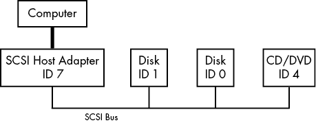
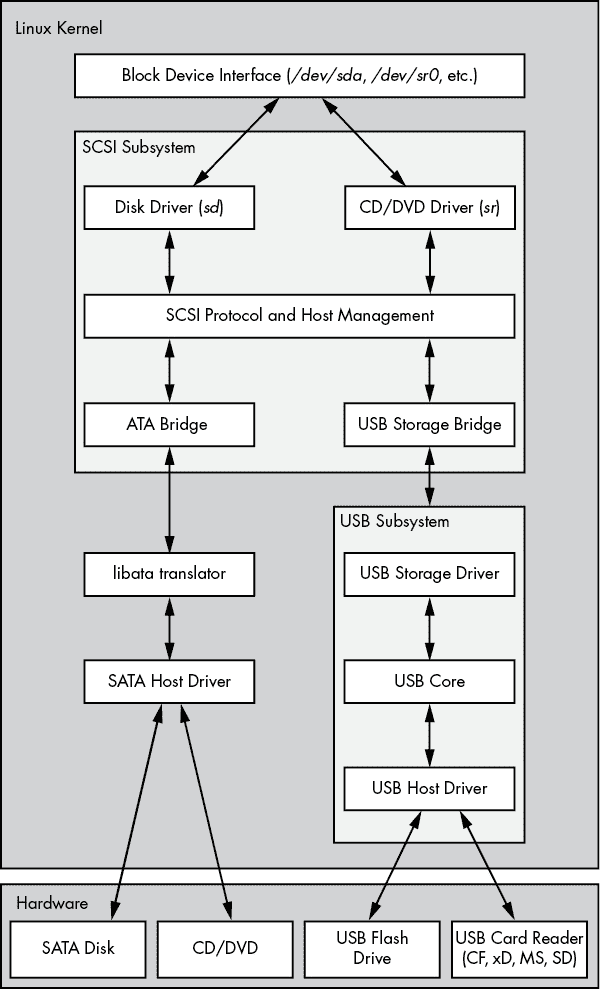

# 第三章：设备


本章是对在一个正常运行的 Linux 系统中内核提供的设备基础设施的基本介绍。Linux 的历史中，内核向用户展示设备的方式经历了许多变化。我们将从传统的设备文件系统入手，看看内核如何通过 sysfs 提供设备配置信息。我们的目标是能够提取系统中设备的信息，以理解一些基本的操作。后续章节将更详细地介绍与特定类型设备的交互。

理解内核在遇到新设备时如何与用户空间交互非常重要。udev 系统使得用户空间程序能够自动配置并使用新设备。你将看到内核如何通过 udev 向用户空间进程发送消息，以及该进程如何处理这些消息。

## 3.1 设备文件

在 Unix 系统中操作大多数设备非常容易，因为内核将许多设备 I/O 接口作为文件呈现给用户进程。这些 *设备文件* 有时也叫 *设备节点*。除了程序员使用常规文件操作与设备交互外，一些设备也可以被标准程序如 `cat` 访问，所以你不必是程序员就可以使用设备。然而，通过文件接口能做的操作是有限的，因此并不是所有设备或设备功能都可以通过标准的文件 I/O 进行访问。

Linux 使用与其他 Unix 系统一样的设备文件设计。设备文件位于 */dev* 目录中，运行 `ls /dev` 会显示 */dev* 中的很多文件。那么，如何与设备交互呢？

要开始，可以考虑以下命令：

```
$ **echo blah blah > /dev/null**
```

像其他重定向输出的命令一样，这会将标准输出的一些内容发送到一个文件中。然而，该文件是 */dev/null*，一个设备，因此内核绕过其常规文件操作，并使用设备驱动程序处理写入该设备的数据。在 */dev/null* 的情况下，内核简单地接受输入数据并将其丢弃。

要识别一个设备并查看其权限，可以使用 `ls -l`。以下是一些示例：

```
$ **ls -l**
brw-rw----   1 root disk 8, 1 Sep  6 08:37 sda1
crw-rw-rw-   1 root root 1, 3 Sep  6 08:37 null
prw-r--r--   1 root root    0 Mar  3 19:17 fdata
srw-rw-rw-   1 root root    0 Dec 18 07:43 log
```

请注意每行的第一个字符（文件模式的第一个字符）。如果这个字符是 `b`、`c`、`p` 或 `s`，那么该文件是一个设备。它们分别代表 *块设备*、*字符设备*、*管道* 和 *套接字*：

**块设备**

1.  程序从块设备中按固定块读取数据。前面的例子中的 *sda1* 是一个 *磁盘设备*，是一种块设备。磁盘可以很容易地分割成数据块。由于块设备的总大小是固定的且易于索引，进程可以借助内核快速随机访问设备中的任何一个块。

**字符设备**

1.  字符设备与数据流一起工作。你只能从字符设备读取字符，或者将字符写入字符设备，正如之前在*/dev/null*中演示的那样。字符设备没有大小；当你从字符设备读取或写入时，内核通常会对其执行读取或写入操作。直接连接到计算机的打印机由字符设备表示。需要注意的是，在字符设备交互过程中，内核无法在将数据传递给设备或进程之后备份并重新检查数据流。

**管道设备**

1.  *命名管道*就像字符设备，其 I/O 流的另一端是另一个进程，而不是内核驱动程序。

**套接字设备**

1.  *套接字*是特殊用途的接口，通常用于进程间通信。它们经常出现在*/dev*目录之外。套接字文件表示 Unix 域套接字；你将在第十章中了解更多关于它们的信息。

在`ls -l`命令列出的块设备和字符设备的文件列表中，日期前面的数字是内核用来标识设备的*主设备号*和*次设备号*。类似的设备通常具有相同的主设备号，例如*sda3*和*sdb1*（它们都是硬盘分区）。

## 3.2 sysfs 设备路径

传统的 Unix */dev*目录是用户进程引用和与内核支持的设备接口的便捷方式，但它也是一个非常简化的方案。*/dev*中的设备名称能告诉你一些关于设备的信息，但通常不足以帮助你。另一个问题是，内核按照设备找到的顺序分配设备，因此设备在重新启动后可能会有不同的名称。

为了根据附加设备的实际硬件属性提供统一的视图，Linux 内核通过一个文件和目录系统提供*sysfs*接口。设备的基本路径是*/sys/devices*。例如，*/dev/sda*上的 SATA 硬盘在 sysfs 中可能具有以下路径：

```
/sys/devices/pci0000:00/0000:00:17.0/ata3/host0/target0:0:0/0:0:0:0/block/sda
```

如你所见，这条路径与*/dev/sda*文件名相比相当长，*/dev/sda*也是一个目录。但你不能真正比较这两条路径，因为它们有不同的用途。*/dev*文件使得用户进程可以使用设备，而*/sys/devices*路径用于查看信息和管理设备。如果你列出一个设备路径的内容，比如前面的路径，你会看到类似以下的内容：

```
alignment_offset  discard_alignment  holders   removable  size       uevent
bdi               events             inflight  ro         slaves
capability        events_async       power     sda1       stat
dev               events_poll_msecs  queue     sda2       subsystem
device            ext_range          range     sda5       trace
```

这里的文件和子目录主要是供程序读取的，而非人类，但你可以通过查看例如/*dev*文件来大致了解它们包含和表示的内容。在这个目录中运行`cat dev`命令会显示数字`8:0`，它恰好是*/dev/sda*的主设备号和次设备号。

在 */sys* 目录中有一些快捷方式。例如，*/sys/block* 应该包含系统上所有的块设备。然而，这些只是符号链接；你可以运行 `ls -l /sys/block` 来显示真实的 sysfs 路径。

在 */dev* 中找到设备的 sysfs 位置可能很困难。使用 `udevadm` 命令如下所示，展示路径及其他几个有趣的属性：

```
$ **udevadm info --query=all --name=/dev/sda**
```

你可以在 3.5 节中找到关于 `udevadm` 和整个 udev 系统的更多细节。

## 3.3 dd 和设备

程序 `dd` 在处理块设备和字符设备时非常有用。它的唯一功能是从输入文件或流中读取数据并写入输出文件或流中，可能会在过程中进行一些编码转换。关于块设备，`dd` 的一个特别有用的功能是，你可以处理文件中间的一块数据，而忽略前后部分。

`dd` 以固定大小的块复制数据。以下是如何在字符设备上使用 `dd`，并使用一些常见选项：

```
$ **dd if=/dev/zero of=new_file bs=1024 count=1**
```

如你所见，`dd` 选项的格式与大多数其他 Unix 命令的选项格式不同；它基于旧版 IBM 作业控制语言（JCL）样式。不是使用破折号（`-`）字符表示选项，而是通过名称指定选项，并用等号（`=`）设置其值。前面的示例将一个 1,024 字节的块从 */dev/zero*（一个连续的零字节流）复制到 *new_file*。

这些是重要的 `dd` 选项：

1.  **`if=``file`** 输入文件。默认是标准输入。

1.  **`of=``file`** 输出文件。默认是标准输出。

1.  **`bs=``size`** 块大小。`dd` 每次读取和写入这么多字节的数据。为了简化大块数据，你可以使用 `b` 和 `k` 来分别表示 512 字节和 1,024 字节。因此，前面的示例可以写作 `bs=1k`，而不是 `bs=1024`。

1.  **`ibs=``size`, `obs=``size`** 输入和输出块大小。如果输入和输出使用相同的块大小，使用 `bs` 选项；如果不同，分别使用 `ibs` 和 `obs` 来指定输入和输出的块大小。

1.  **`count=``num`** 要复制的块总数。当处理一个巨大文件或一个提供无穷数据流的设备时（例如 */dev/zero*），你希望 `dd` 在一个固定位置停止；否则，你可能会浪费大量磁盘空间、CPU 时间，或两者。使用 `count` 配合 `skip` 参数来从大文件或设备中复制一小块数据。

1.  **`skip=``num`** 跳过输入文件或流中的前 `num` 块，并且不将它们复制到输出。

## 3.4 设备名称总结

有时，找到设备的名称可能会很困难（例如，在对磁盘进行分区时）。以下是几种方法来查找设备名称：

+   使用 `udevadm` 查询 udevd（参见 3.5 节）。

+   在 */sys* 目录中查找设备。

+   从 `journalctl -k` 命令的输出（它打印内核消息）或内核系统日志（参见第 7.1 节）中猜测设备名称。这个输出可能包含系统上设备的描述。

+   对于系统中已可见的磁盘设备，你可以查看 `mount` 命令的输出。

+   运行 `cat /proc/devices` 查看系统当前为哪些块设备和字符设备提供驱动。每一行由一个数字和一个名称组成。这个数字是设备的主设备号，如第 3.1 节所描述的。如果你能从名称猜到设备，可以在 */dev* 中查找具有相应主设备号的字符设备或块设备，这样你就找到了设备文件。

在这些方法中，只有第一种方法是可靠的，但它确实需要 udev。如果你遇到 udev 不可用的情况，可以尝试其他方法，但请记住，内核可能没有为你的硬件提供设备文件。

以下章节列出了最常见的 Linux 设备及其命名规范。

### 3.4.1 硬盘：/dev/sd*

目前大多数连接到 Linux 系统的硬盘对应的设备名称带有 *sd* 前缀，例如 */dev/sda*、*/dev/sdb* 等。这些设备代表整个硬盘；内核会为硬盘上的每个分区创建单独的设备文件，如 */dev/sda1* 和 */dev/sda2*。

命名规范需要一些解释。名称中的 *sd* 部分代表 *SCSI 硬盘*。*小型计算机系统接口（SCSI）* 最初被开发为硬件和协议标准，用于在硬盘和其他外设之间进行通信。尽管大多数现代机器不再使用传统的 SCSI 硬件，但由于其适应性，SCSI 协议无处不在。例如，USB 存储设备就使用它进行通信。关于 SATA（串行 ATA，一种常见的 PC 存储总线）硬盘的情况稍微复杂一些，但 Linux 内核在与其通信时仍会使用 SCSI 命令。

要列出系统上的 SCSI 设备，可以使用一个遍历 sysfs 提供的设备路径的工具。最简洁的工具之一是 `lsscsi`。运行它时你可以期待看到以下输出：

```
$ **lsscsi**
[0:0:0:0]1  disk2  ATA     WDC WD3200AAJS-2  01.0  /dev/sda3
[2:0:0:0]    disk    FLASH   Drive UT_USB20    0.00  /dev/sdb
```

第一列 1 标识了设备在系统中的地址，第二列 2 描述了它是什么类型的设备，最后一列 3 指示了在哪里可以找到设备文件。其他内容是厂商信息。

Linux 按照驱动程序遇到设备的顺序将设备分配给设备文件。因此，在之前的例子中，内核首先找到了硬盘，然后是闪存驱动器。

不幸的是，这种设备分配方案通常在重新配置硬件时会引发问题。举个例子，假设你有一个系统，其中有三个磁盘：*/dev/sda*，*/dev/sdb* 和 */dev/sdc*。如果 */dev/sdb* 硬盘损坏并且你必须将其移除以使机器恢复正常，那么原本的 */dev/sdc* 会变成 */dev/sdb*，此时不再有 */dev/sdc*。如果你直接在 *fstab* 文件中引用了设备名称（参见第 4.2.8 节），你需要对该文件进行一些修改才能让系统恢复（基本）正常。为了解决这个问题，许多 Linux 系统使用了通用唯一标识符（UUID；参见第 4.2.4 节）和/或逻辑卷管理器（LVM）稳定的磁盘设备映射。

这次讨论仅仅触及了如何在 Linux 系统上使用磁盘和其他存储设备的皮毛。有关如何使用磁盘的更多信息，请参阅第四章。在本章稍后，我们将研究 SCSI 支持如何在 Linux 内核中工作。

### 3.4.2 虚拟磁盘：/dev/xvd*，/dev/vd*

一些磁盘设备针对虚拟机进行了优化，例如 AWS 实例和 VirtualBox。Xen 虚拟化系统使用 */dev/xvd* 前缀，*/dev/vd* 是类似的类型。

### 3.4.3 非易失性存储设备：/dev/nvme*

一些系统现在使用非易失性存储器快车（NVMe）接口来访问某些类型的固态存储。在 Linux 中，这些设备显示为 */dev/nvme**。你可以使用 `nvme list` 命令来列出系统中的这些设备。

### 3.4.4 设备映射器：/dev/dm-*，/dev/mapper/*

在某些系统中，磁盘和其他直接块存储之上的一层是 LVM，它使用一种名为设备映射器（device mapper）的内核系统。如果你看到以 */dev/dm-* 开头的块设备和在 */dev/mapper* 中的符号链接，那么你的系统可能在使用它。你将在第四章中学习到更多关于这个的内容。

### 3.4.5 光盘和 DVD 驱动器：/dev/sr*

Linux 将大多数光学存储驱动器识别为 SCSI 设备 */dev/sr0*，*/dev/sr1* 等。然而，如果驱动器使用的是较旧的接口，它可能会显示为 PATA 设备，下面会进一步讨论。*/dev/sr** 设备是只读的，仅用于从光盘读取数据。对于光学设备的写入和重写功能，你将使用“通用”SCSI 设备，如 */dev/sg0*。

### 3.4.6 PATA 硬盘：/dev/hd*

PATA（并行 ATA）是较旧的存储总线类型。Linux 块设备 */dev/hda*，*/dev/hdb*，*/dev/hdc* 和 */dev/hdd* 在较旧版本的 Linux 内核和老旧硬件上较为常见。这些是基于接口 0 和 1 上的设备对的固定分配。有时，你可能会发现一个 SATA 硬盘被识别为其中之一。这意味着 SATA 硬盘正处于兼容模式，这会影响性能。检查你的 BIOS 设置，看看是否可以将 SATA 控制器切换到本地模式。

### 3.4.7 终端：/dev/tty*，/dev/pts/* 和 /dev/tty

*终端*是用于在用户进程和输入输出设备之间传输字符的设备，通常用于将文本输出到终端屏幕。终端设备接口可以追溯到很久以前，当时终端是基于打字机的设备，许多终端连接到一台机器。

大多数终端是*伪终端*设备，即模拟终端，能够理解真实终端的输入输出功能。与其直接与硬件交互，内核将输入输出接口提供给一个软件，例如你通常输入大部分命令的 shell 终端窗口。

两种常见的终端设备是*/dev/tty1*（第一个虚拟控制台）和*/dev/pts/0*（第一个伪终端设备）。*/dev/pts*目录本身是一个专用的文件系统。

*/dev/tty*设备是当前进程的控制终端。如果一个程序当前正在读取和写入终端，这个设备就等同于该终端。一个进程不需要附加到终端。

#### 显示模式和虚拟控制台

Linux 有两种主要的显示模式：*文本模式*和图形模式（第十四章介绍了使用此模式的窗口系统）。尽管 Linux 系统传统上在文本模式下启动，但现在大多数发行版使用内核参数和临时的图形显示机制（如 plymouth 引导画面）在系统启动时完全隐藏文本模式。在这种情况下，系统会在启动过程接近结束时切换到完全的图形模式。

Linux 支持*虚拟控制台*来多路复用显示。每个虚拟控制台可以运行图形模式或文本模式。在文本模式下，你可以通过 alt–功能键组合在控制台之间切换——例如，alt-F1 进入*/dev/tty1*，alt-F2 进入*/dev/tty2*，依此类推。许多虚拟控制台可能被`getty`进程占用，运行登录提示，如第 7.4 节所述。

在图形模式下使用的虚拟控制台略有不同。图形环境不会从 init 配置中获取虚拟控制台分配，而是会接管一个空闲的虚拟控制台，除非指定使用特定的控制台。例如，如果你在*tty1*和*tty2*上运行`getty`进程，一个新的图形环境会接管*tty3*。此外，一旦进入图形模式，通常需要按 ctrl-alt–功能键组合才能切换到另一个虚拟控制台，而不是简单的 alt–功能键组合。

所有这些的结果是，如果你想在系统启动后看到你的文本控制台，按下 ctrl-alt-F1。要返回图形环境，按下 alt-F2、alt-F3，以此类推，直到进入图形环境。

如果由于输入机制故障或其他原因在切换控制台时遇到问题，你可以尝试使用`chvt`命令强制系统切换控制台。例如，要切换到*tty1*，以 root 身份运行以下命令：

```
# chvt 1
```

### 3.4.8 串行端口：/dev/ttyS*、/dev/ttyUSB*、/dev/ttyACM*

较旧的 RS-232 类型和类似的串行端口被表示为真正的终端设备。你不能在命令行上对串行端口设备做太多操作，因为有太多设置需要关注，例如波特率和流控，但你可以使用 `screen` 命令通过添加设备路径作为参数来连接到终端。你可能需要设备的读写权限；有时，你可以通过将自己添加到特定的组（例如 `dialout`）来实现这一点。

在 Windows 上被称为 COM1 的端口是 */dev/ttyS0*；COM2 是 */dev/ttyS1*；依此类推。插入的 USB 串行适配器会显示为 *USB* 和 *ACM*，其名称分别为 */dev/ttyUSB0*、*/dev/ttyACM0*、*/dev/ttyUSB1*、*/dev/ttyACM1*，以此类推。

涉及串行端口的一些最有趣的应用是基于微控制器的开发板，你可以将它们插入到 Linux 系统中进行开发和测试。例如，你可以通过 USB 串行接口访问 CircuitPython 开发板的控制台和读-评估-打印循环。你只需插入一个设备，查找该设备（通常是 */dev/ttyACM0*），然后使用 `screen` 连接到它。

### 3.4.9 并行端口：/dev/lp0 和 /dev/lp1

代表一种已经被 USB 和网络取代的接口类型，单向并行端口设备 */dev/lp0* 和 */dev/lp1* 在 Windows 中对应 LPT1: 和 LPT2:。你可以直接使用 `cat` 命令将文件（例如要打印的文件）发送到并行端口，但你可能需要在之后给打印机一个额外的换页符或重置。像 CUPS 这样的打印服务器更擅长处理与打印机的交互。

双向并行端口是 */dev/parport0* 和 */dev/parport1*。

### 3.4.10 音频设备：/dev/snd/*、/dev/dsp、/dev/audio 等

Linux 有两套音频设备。一套是为高级 Linux 声音架构（ALSA）系统接口提供的设备，另一套是为较旧的开放声音系统（OSS）提供的设备。ALSA 设备位于 */dev/snd* 目录中，但直接操作它们是比较困难的。使用 ALSA 的 Linux 系统如果当前加载了 OSS 内核支持，则可以支持 OSS 向后兼容的设备。

使用 OSS 的 *dsp* 和 *audio* 设备可以进行一些基本操作。例如，计算机可以播放你发送到 */dev/dsp* 的任何 WAV 文件。然而，由于频率不匹配，硬件可能无法按照预期工作。此外，在大多数系统上，设备通常会在你登录时变得繁忙。

### 3.4.11 设备文件创建

在任何相对较新的 Linux 系统上，你不需要自己创建设备文件；它们是由 devtmpfs 和 udev 创建的（参见第 3.5 节）。然而，了解如何进行操作是很有帮助的，偶尔你可能需要创建命名管道或套接字文件。

`mknod` 命令用于创建一个设备。你必须知道设备名称以及其主次设备号。例如，创建 */dev/sda1* 就是使用以下命令：

```
# mknod /dev/sda1 b 8 1
```

`b 8 1` 表示一个主设备号为 8、次设备号为 1 的块设备。对于字符设备或命名管道设备，请使用 `c` 或 `p` 替代 `b`（命名管道省略主设备号和次设备号）。

在早期版本的 Unix 和 Linux 中，维护 */dev* 目录是一个挑战。每次进行重大内核升级或添加驱动程序时，内核可能支持更多种类的设备，这意味着需要为设备文件名分配新的主设备号和次设备号。为了解决这个维护难题，每个系统都会在 */dev* 中有一个 `MAKEDEV` 程序来创建设备组。当你升级系统时，会尝试找到 `MAKEDEV` 的更新版本，然后运行它来创建新设备。

这个静态系统变得笨重，因此需要进行替换。修复它的第一个尝试是 devfs，这是 */dev* 的内核空间实现，包含了当前内核支持的所有设备。然而，它存在一些限制，这导致了 udev 和 devtmpfs 的开发。

## 3.5 udev

我们已经讨论过内核中不必要的复杂性是危险的，因为它很容易引发系统不稳定。设备文件管理就是一个例子：你可以在用户空间中创建设备文件，那为什么还要在内核中做这件事呢？当系统检测到新设备（例如，当有人插入 USB 闪存驱动器）时，Linux 内核可以向一个名为 udevd 的用户空间进程发送通知。这个 udevd 进程可以检查新设备的特性，创建设备文件，并执行任何设备初始化。

这就是理论上的方法。不幸的是，这种方法有一个问题——设备文件在启动过程中非常必要，因此 udevd 也必须尽早启动。但是，为了创建设备文件，udevd 不能依赖于它需要创建的任何设备，并且它需要非常快速地完成初始化启动，以便系统的其他部分不会因为等待 udevd 启动而被阻塞。

### 3.5.1 devtmpfs

devtmpfs 文件系统是在启动过程中为了解决设备可用性问题而开发的（有关文件系统的更多细节，请参见第 4.2 节）。该文件系统类似于较旧的 devfs 支持，但进行了简化。内核根据需要创建设备文件，但它还会通知 udevd 有新设备可用。接收到这个信号后，udevd 不会创建设备文件，但会执行设备初始化，并设置权限，同时通知其他进程新设备已经可用。此外，它还会在 */dev* 目录下创建一些符号链接，以进一步标识设备。你可以在目录 */dev/disk/by-id* 中找到示例，其中每个附加的磁盘都有一个或多个条目。

例如，考虑一个典型磁盘（附加在 */dev/sda*）及其分区在 */dev/disk/by-id* 中的链接：

```
$ **ls -l /dev/disk/by-id**
lrwxrwxrwx 1 root root  9 Jul 26 10:23 scsi-SATA_WDC_WD3200AAJS-_WD-WMAV2FU80671 -> ../../sda
lrwxrwxrwx 1 root root 10 Jul 26 10:23 scsi-SATA_WDC_WD3200AAJS-_WD-WMAV2FU80671-part1 ->
../../sda1
lrwxrwxrwx 1 root root 10 Jul 26 10:23 scsi-SATA_WDC_WD3200AAJS-_WD-WMAV2FU80671-part2 ->
../../sda2
lrwxrwxrwx 1 root root 10 Jul 26 10:23 scsi-SATA_WDC_WD3200AAJS-_WD-WMAV2FU80671-part5 ->
../../sda5
```

udevd 进程按接口类型命名链接，然后是制造商和型号信息、序列号，以及分区（如果适用）。

但 udevd 如何知道创建哪些符号链接，并且它是如何创建这些符号链接的呢？下一节将描述 udevd 如何完成其工作。然而，你不需要了解这些内容或本章中剩余的其他内容来继续阅读本书。实际上，如果这是你第一次接触 Linux 设备，强烈建议你跳到下一章开始学习如何使用磁盘。

### 3.5.2 udevd 操作和配置

udevd 守护进程的操作如下：

1.  内核通过一个内部网络链接发送 udevd 一个通知事件，称为 *uevent*。

1.  udevd 加载 uevent 中的所有属性。

1.  udevd 解析其规则，基于这些规则过滤并更新 uevent，并根据需要执行操作或设置更多属性。

从内核接收到的 incoming uevent 可能看起来像这样（你将在 3.5.4 节学习如何通过 `udevadm monitor --property` 命令获得这个输出）：

```
ACTION=change
DEVNAME=sde
DEVPATH=/devices/pci0000:00/0000:00:1a.0/usb1/1-1/1-1.2/1-1.2:1.0/host4/
target4:0:0/4:0:0:3/block/sde
DEVTYPE=disk
DISK_MEDIA_CHANGE=1
MAJOR=8
MINOR=64
SEQNUM=2752
SUBSYSTEM=block
UDEV_LOG=3
```

这个特定事件是设备的变化。在接收到 uevent 后，udevd 知道设备的名称、sysfs 设备路径以及与属性相关的其他多个属性；它现在准备开始处理规则。

规则文件位于 * /lib/udev/rules.d* 和 * /etc/udev/rules.d* 目录中。* /lib* 中的规则是默认规则，* /etc* 中的规则是覆盖规则。对于规则的详细解释会很繁琐，你可以从 udev(7) 手册页中了解更多，但这里是关于 udevd 如何读取规则的一些基本信息：

1.  udevd 从规则文件的开始到结束读取规则。

1.  在读取规则并可能执行其操作后，udevd 继续读取当前规则文件以寻找更多适用的规则。

1.  有一些指令（如 `GOTO`）如果需要，可以跳过规则文件的某些部分。这些通常放在规则文件的顶部，用来跳过整个文件，如果该文件与 udevd 正在配置的特定设备无关。

让我们看一下 3.5.1 节中 * /dev/sda* 示例的符号链接。这些链接是由 * /lib/udev/rules.d/60-persistent-storage.rules* 中的规则定义的。里面，你会看到以下几行：

```
# ATA
KERNEL=="sd*[!0-9]|sr*", ENV{ID_SERIAL}!="?*", SUBSYSTEMS=="scsi", ATTRS{vendor}=="ATA", IMPORT{program}="ata_id --export $devnode"

# ATAPI devices (SPC-3 or later)
KERNEL=="sd*[!0-9]|sr*", ENV{ID_SERIAL}!="?*", SUBSYSTEMS=="scsi", ATTRS{type}=="5",ATTRS{scsi_level}=="[6-9]*", IMPORT{program}="ata_id --export $devnode"
```

这些规则匹配通过内核的 SCSI 子系统（参见 3.6 节）呈现的 ATA 磁盘和光盘介质。你可以看到有一些规则捕获设备可能以不同方式表示的情况，但基本思想是 udevd 会尝试匹配以 *sd* 或 *sr* 开头但没有数字（使用 `KERNEL=="sd*[!0-9]|sr*"` 表达式）的设备，以及一个子系统（`SUBSYSTEMS=="scsi"`），最后是一些其他属性，取决于设备的类型。如果这些条件表达式在任何规则中都为真，udevd 会进入下一个和最终的表达式：

```
IMPORT{program}="ata_id --export $tempnode"
```

这不是一个条件，而是一个指令，用来从*/lib/udev/ata_id*命令导入变量。如果你有这样的磁盘，可以在命令行上试一试。它会像这样显示：

```
# /lib/udev/ata_id --export /dev/sda
ID_ATA=1
ID_TYPE=disk
ID_BUS=ata
ID_MODEL=WDC_WD3200AAJS-22L7A0
ID_MODEL_ENC=WDC\x20WD3200AAJS22L7A0\x20\x20\x20\x20\x20\x20\x20\x20\x20\x20
\x20\x20\x20\x20\x20\x20\x20\x20\x20
ID_REVISION=01.03E10
ID_SERIAL=WDC_WD3200AAJS-22L7A0_WD-WMAV2FU80671
--`snip`--
```

导入操作现在设置了环境，使得输出中所有变量名称的值都被设置为所示的值。例如，接下来的任何规则都会将`ENV{ID_TYPE}`识别为`disk`。

在我们看到的两个规则中，特别需要注意的是`ID_SERIAL`。在每个规则中，这个条件出现在第二位：

```
ENV{ID_SERIAL}!="?*"
```

如果`ID_SERIAL`未设置，则此表达式会评估为 true。因此，如果`ID_SERIAL` *已* 设置，则条件为 false，当前规则不适用，udevd 会移动到下一个规则。

为什么这里会有这个？这两个规则的目的是运行`ata_id`来查找磁盘设备的序列号，然后将这些属性添加到当前工作中的 uevent 副本中。你会在许多 udev 规则中发现这种常见模式。

设置了`ENV{ID_SERIAL}`后，udevd 现在可以在规则文件中的后续规则中评估这个规则，这个规则会查找任何附加的 SCSI 磁盘：

```
KERNEL=="sd*|sr*|cciss*", ENV{DEVTYPE}=="disk", ENV{ID_SERIAL}=="?*",SYMLINK+="disk/by-id/$env{ID_BUS}-$env{ID_SERIAL}"
```

你可以看到这个规则要求设置`ENV{ID_SERIAL}`，并且它有一个指令：

```
SYMLINK+="disk/by-id/$env{ID_BUS}-$env{ID_SERIAL}"
```

这个指令告诉 udevd 为传入的设备添加符号链接。所以现在你知道设备符号链接的来源了！

你可能会想知道如何区分条件表达式和指令。条件表达式由两个等号（`==`）或一个叹号等号（`!=`）表示，指令由一个等号（`=`）、加等号（`+=`）或冒号等号（`:=`）表示。

### 3.5.3 udevadm

`udevadm`程序是 udevd 的管理工具。你可以重新加载 udevd 规则并触发事件，但`udevadm`最强大的功能可能是能够搜索和探索系统设备，以及能够监控 uevent，查看 udevd 如何从内核接收它们。不过，命令语法可能有点复杂。大多数选项有长格式和短格式；我们这里使用的是长格式。

让我们从检查一个系统设备开始。回到第 3.5.2 节中的示例，为了查看与设备如*/dev/sda*相关联的规则使用和生成的所有 udev 属性，请运行以下命令：

```
`$` **udevadm info --query=all --name=/dev/sda**
```

输出如下所示：

```
P: /devices/pci0000:00/0000:00:1f.2/host0/target0:0:0/0:0:0:0/block/sda
N: sda
S: disk/by-id/ata-WDC_WD3200AAJS-22L7A0_WD-WMAV2FU80671
S: disk/by-id/scsi-SATA_WDC_WD3200AAJS-_WD-WMAV2FU80671
S: disk/by-id/wwn-0x50014ee057faef84
S: disk/by-path/pci-0000:00:1f.2-scsi-0:0:0:0
E: DEVLINKS=/dev/disk/by-id/ata-WDC_WD3200AAJS-22L7A0_WD-WMAV2FU80671 /dev/disk/by-id/scsi
-SATA_WDC_WD3200AAJS-_WD-WMAV2FU80671 /dev/disk/by-id/wwn-0x50014ee057faef84 /dev/disk/by
-path/pci-0000:00:1f.2-scsi-0:0:0:0
E: DEVNAME=/dev/sda
E: DEVPATH=/devices/pci0000:00/0000:00:1f.2/host0/target0:0:0/0:0:0:0/block/sda
E: DEVTYPE=disk
E: ID_ATA=1
E: ID_ATA_DOWNLOAD_MICROCODE=1
E: ID_ATA_FEATURE_SET_AAM=1
--`snip`--
```

每行前缀表示设备的某个属性或特征。在这个例子中，顶部的`P:`是 sysfs 设备路径，`N:`是设备节点（即分配给*/dev*文件的名称），`S:`表示 udevd 根据其规则放置在*/dev*中的设备节点符号链接，`E:`是 udevd 规则中提取的其他设备信息。（这个例子中的输出比实际需要展示的更多；你可以自己尝试一下这个命令，感受一下它的作用。）

### 3.5.4 设备监控

要使用`udevadm`监控 uevent，可以使用`monitor`命令：

```
$ **udevadm monitor**
```

输出（例如，当你插入闪存设备时）如下所示的简短示例：

```
KERNEL[658299.569485] add /devices/pci0000:00/0000:00:1d.0/usb2/2-1/2-1.2 (usb)
KERNEL[658299.569667] add /devices/pci0000:00/0000:00:1d.0/usb2/2-1/2-1.2/2-1.2:1.0 (usb)
KERNEL[658299.570614] add /devices/pci0000:00/0000:00:1d.0/usb2/2-1/2-1.2/2-1.2:1.0/host15 
(scsi)
KERNEL[658299.570645] add /devices/pci0000:00/0000:00:1d.0/usb2/2-1/2-1.2/2-1.2:1.0/ 
host15/scsi_host/host15 (scsi_host)
UDEV [658299.622579] add /devices/pci0000:00/0000:00:1d.0/usb2/2-1/2-1.2 (usb)
UDEV [658299.623014] add /devices/pci0000:00/0000:00:1d.0/usb2/2-1/2-1.2/2-1.2:1.0 (usb)
UDEV [658299.623673] add /devices/pci0000:00/0000:00:1d.0/usb2/2-1/2-1.2/2-1.2:1.0/host15 
(scsi)
UDEV [658299.623690] add /devices/pci0000:00/0000:00:1d.0/usb2/2-1/2-1.2/2-1.2:1.0/
host15/scsi_host/host15 (scsi_host)
--`snip`--
```

该输出中有每条消息的两份副本，因为默认行为是同时打印来自内核的传入消息（标记为`KERNEL`）和 udevd 的处理消息。要仅查看内核事件，添加`--kernel`选项；要仅查看 udevd 处理事件，使用`--udev`选项。要查看整个传入的 uevent，包括第 3.5.2 节中显示的属性，使用`--property`选项。`--udev`和`--property`选项一起使用可以显示处理后的 uevent。

你还可以通过子系统来过滤事件。例如，要仅查看与 SCSI 子系统变化相关的内核消息，可以使用以下命令：

```
$ **udevadm monitor --kernel --subsystem-match=scsi**
```

有关`udevadm`的更多信息，请参见 udevadm(8)手册页。

udev 的功能远不止这些。例如，有一个守护进程叫做 udisksd，它监听事件，以便自动挂载磁盘，并通知其他进程新的磁盘已可用。

## 3.6 深入分析：SCSI 与 Linux 内核

本节中，我们将了解 Linux 内核中对 SCSI 的支持，以此来探索 Linux 内核架构的一部分。你不需要了解这些信息就能使用磁盘，所以如果你急于使用磁盘，可以跳过本章。此外，这里的内容比你之前看到的更为高级和理论性，因此如果你更倾向于实践操作，应该跳到下一章。

让我们先了解一些背景知识。传统的 SCSI 硬件配置是一个主机适配器通过 SCSI 总线与一链设备相连，如图 3-1 所示。主机适配器连接到计算机。主机适配器和设备各自都有一个 SCSI ID，每个总线最多可有 8 或 16 个 ID，具体取决于 SCSI 版本。一些管理员可能会使用*SCSI 目标*这个术语来指代设备及其 SCSI ID，因为在 SCSI 协议中，一个会话的一端被称为目标。



图 3-1：带主机适配器和设备的 SCSI 总线

任何设备都可以通过 SCSI 命令集以对等关系与另一个设备通信。计算机并没有直接连接到设备链，因此它必须通过主机适配器与磁盘和其他设备进行通信。通常，计算机会向主机适配器发送 SCSI 命令，主机适配器再将命令转发给设备，设备则通过主机适配器将响应传回。

更新版本的 SCSI，例如串行附加 SCSI（SAS），提供了卓越的性能，但你可能在大多数机器中找不到真正的 SCSI 设备。你更常见到的是使用 SCSI 命令的 USB 存储设备。此外，支持 ATAPI 的设备（例如 CD/DVD-ROM 驱动器）使用 SCSI 命令集的一个版本。

SATA 磁盘也会作为 SCSI 设备出现在系统中，但它们略有不同，因为大多数 SATA 磁盘通过 libata 库中的翻译层进行通信（见第 3.6.2 节）。一些 SATA 控制器（特别是高性能 RAID 控制器）在硬件中执行此翻译。

这些是如何结合在一起的呢？请考虑以下系统中显示的设备：

```
$ **lsscsi**
[0:0:0:0]   disk    ATA       WDC WD3200AAJS-2  01.0  /dev/sda
[1:0:0:0]   cd/dvd  Slimtype  DVD A DS8A5SH     XA15  /dev/sr0
[2:0:0:0]   disk    USB2.0    CardReader CF     0100  /dev/sdb
[2:0:0:1]   disk    USB2.0    CardReader SM XD  0100  /dev/sdc
[2:0:0:2]   disk    USB2.0    CardReader MS     0100  /dev/sdd
[2:0:0:3]   disk    USB2.0    CardReader SD     0100  /dev/sde
[3:0:0:0]   disk    FLASH     Drive UT_USB20    0.00  /dev/sdf
```

方括号中的数字是从左到右依次表示 SCSI 主机适配器号、SCSI 总线号、设备 SCSI ID 和 LUN（逻辑单元号，设备的进一步细分）。在本示例中，有四个附加的适配器（scsi0、scsi1、scsi2 和 scsi3），每个适配器都有一个总线（所有总线号为 0），每个总线下有一个设备（所有目标为 0）。位于 2:0:0 的 USB 卡读卡器有四个逻辑单元——每个插入的闪存卡类型对应一个逻辑单元。内核已为每个逻辑单元分配了不同的设备文件。

尽管 NVMe 设备不是 SCSI 设备，它们有时会在`lsscsi`输出中以`N`作为适配器号出现。

图 3-2 展示了该特定系统配置中内核内的驱动程序和接口层级，从各个设备驱动程序到块设备驱动程序。它不包括 SCSI 通用（*sg*）驱动程序。

虽然这是一个庞大的结构，初看时可能会感到压倒性，但图中的数据流是非常线性的。让我们从分析 SCSI 子系统及其三层驱动程序开始：

+   顶层处理一类设备的操作。例如，*sd*（SCSI 磁盘）驱动程序位于此层；它知道如何将内核块设备接口的请求转换为 SCSI 协议中的磁盘特定命令，反之亦然。

+   中间层调节并路由 SCSI 消息在顶层和底层之间，并跟踪系统中所有附加的 SCSI 总线和设备。

+   底层处理硬件特定的操作。这里的驱动程序将 SCSI 协议消息发送到特定的主机适配器或硬件，并从硬件中提取传入的消息。之所以与顶层分开，是因为尽管 SCSI 消息对于一个设备类（例如磁盘类）是统一的，不同种类的主机适配器在发送相同消息时有不同的程序。

    图 3-2：Linux SCSI 子系统示意图

顶层和底层包含许多不同的驱动程序，但重要的是要记住，对于系统中的任何给定设备文件，内核（几乎总是）使用一个顶层驱动程序和一个底层驱动程序。以我们的示例中的*/dev/sda*磁盘为例，内核使用*sd*顶层驱动程序和 ATA 桥接底层驱动程序。

有时候，你可能会为一个硬件设备使用多个上层驱动程序（参见第 3.6.3 节）。对于真正的硬件 SCSI 设备，如连接到 SCSI 主机适配器或硬件 RAID 控制器的磁盘，底层驱动程序直接与硬件进行通信。然而，对于大多数附加到 SCSI 子系统的硬件情况则不同。

### 3.6.1 USB 存储与 SCSI

为了使 SCSI 子系统能够与常见的 USB 存储硬件进行通信，如图 3-2 所示，内核需要的不仅仅是一个底层 SCSI 驱动程序。一个由*/dev/sdf*表示的 USB 闪存驱动器能够理解 SCSI 命令，但为了实际与驱动器通信，内核需要知道如何通过 USB 系统进行通信。

从抽象层次来看，USB 与 SCSI 非常相似——它具有设备类别、总线和主机控制器。因此，Linux 内核包括一个三层 USB 子系统，这一点也就不足为奇，它与 SCSI 子系统非常相似，设备类别驱动程序位于顶部，总线管理核心位于中间，主机控制器驱动程序位于底部。就像 SCSI 子系统在其各个组件之间传递 SCSI 命令一样，USB 子系统在其各个组件之间传递 USB 消息。甚至还有一个`lsusb`命令，它与`lsscsi`类似。

我们在这里真正感兴趣的部分是最上层的 USB 存储驱动程序。这个驱动程序充当了翻译器。一端，它使用 SCSI 协议，另一端，它使用 USB 协议。由于存储硬件在其 USB 消息中包含 SCSI 命令，因此该驱动程序的工作相对简单：它主要负责重新打包数据。

在 SCSI 和 USB 子系统都就绪的情况下，你几乎拥有与闪存驱动器通信所需的所有东西。最终缺失的环节是 SCSI 子系统中的底层驱动程序，因为 USB 存储驱动程序属于 USB 子系统，而非 SCSI 子系统。（出于组织原因，这两个子系统不应共享驱动程序。）为了使这两个子系统能够互相通信，一个简单的底层 SCSI 桥接驱动程序连接到 USB 子系统的存储驱动程序。

### 3.6.2 SCSI 与 ATA

图 3-2 中所示的 SATA 硬盘和光驱都使用相同的 SATA 接口。为了将内核的 SATA 特定驱动程序与 SCSI 子系统连接，内核使用了桥接驱动程序，和 USB 驱动器一样，但采用了不同的机制，并增加了一些复杂性。光驱使用 ATAPI，它是 ATA 协议中的一种 SCSI 命令编码版本。然而，硬盘不使用 ATAPI，也不对 SCSI 命令进行任何编码！

Linux 内核使用名为 libata 的库的一部分，将 SATA（以及 ATA）驱动与 SCSI 子系统对接。对于使用 ATAPI 协议的光驱，这是一个相对简单的任务——将 SCSI 命令打包到 ATA 协议中，或从 ATA 协议中提取 SCSI 命令。但对于硬盘来说，这个任务要复杂得多，因为该库必须进行完整的命令翻译。

光驱的工作类似于将一本英文书籍输入计算机。你不需要理解这本书的内容，也不需要懂英文，就能完成这项工作。而硬盘的任务更像是将一本德文书籍翻译成英文并输入计算机。在这种情况下，你需要理解两种语言以及书本的内容。

尽管存在这种困难，libata 执行了这一任务，并使得将 ATA/SATA 接口和设备连接到 SCSI 子系统成为可能。（通常涉及的驱动程序比 图 3-2 中显示的一个 SATA 主机驱动程序要多，但为了简洁起见，未显示其余部分。）

### 3.6.3 通用 SCSI 设备

当用户空间进程与 SCSI 子系统通信时，通常是通过块设备层和/或其他位于 SCSI 设备类驱动程序（如*sd* 或 *sr*）之上的内核服务来进行。换句话说，大多数用户进程根本不需要了解 SCSI 设备及其命令。

然而，用户进程可以绕过设备类驱动程序，直接通过其*通用设备*向设备发送 SCSI 协议命令。例如，考虑第 3.6 节中描述的系统，但这次看看当你在 `lsscsi` 中添加 `-g` 选项以显示通用设备时发生了什么：

```
$ **lsscsi -g**
[0:0:0:0]   disk    ATA       WDC WD3200AAJS-2  01.0  /dev/sda 1/dev/sg0
[1:0:0:0]   cd/dvd  Slimtype  DVD A DS8A5SH     XA15  /dev/sr0   /dev/sg1
[2:0:0:0]   disk    USB2.0    CardReader CF     0100  /dev/sdb   /dev/sg2
[2:0:0:1]   disk    USB2.0    CardReader SM XD  0100  /dev/sdc   /dev/sg3
[2:0:0:2]   disk    USB2.0    CardReader MS     0100  /dev/sdd   /dev/sg4
[2:0:0:3]   disk    USB2.0    CardReader SD     0100  /dev/sde   /dev/sg5
[3:0:0:0]   disk    FLASH     Drive UT_USB20    0.00  /dev/sdf   /dev/sg6
```

除了常规的块设备文件外，每一项在最后一列还列出了一个 SCSI 通用设备文件。例如，光驱的通用设备文件是 */dev/sr0* 对应的 */dev/sg1*。

为什么你要使用通用设备？答案与内核中代码的复杂性有关。随着任务的复杂化，最好将它们从内核中剔除。以 CD/DVD 写入和读取为例。读取光盘是一个相对简单的操作，且有专门的内核驱动程序来处理它。

然而，写入光盘比读取要困难得多，并且没有关键系统服务依赖于写入操作。因此，没有必要让内核空间承担这个任务。因此，在 Linux 中要*写入*光盘，你需要运行一个与通用 SCSI 设备（如 */dev/sg1*）通信的用户空间程序。这个程序可能比内核驱动程序稍微低效一些，但构建和维护起来要容易得多。

### 3.6.4 单个设备的多种访问方法

从用户空间访问光驱的两个点（*sr* 和 *sg*）在 Linux SCSI 子系统中的示意图如 图 3-3 所示（SCSI 下层的任何驱动程序已被省略）。进程 A 使用 *sr* 驱动程序从驱动器读取，进程 B 使用 *sg* 驱动程序向驱动器写入。然而，像这样的进程通常不会同时运行以访问同一个设备。


图 3-3：光学设备驱动程序示意图

在图 3-3 中，进程 A 从块设备中读取数据。但是用户进程真的以这种方式读取数据吗？通常，答案是否定的，数据并非直接这样读取。块设备之上有更多层次，硬盘的访问点也更多，正如你将在下一章中学到的那样。
