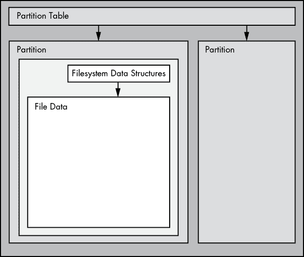
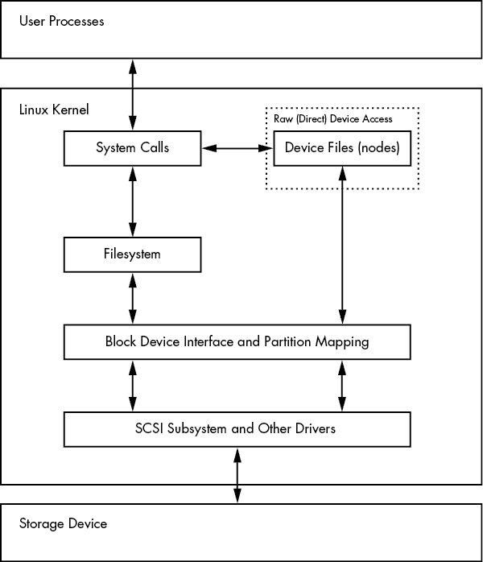
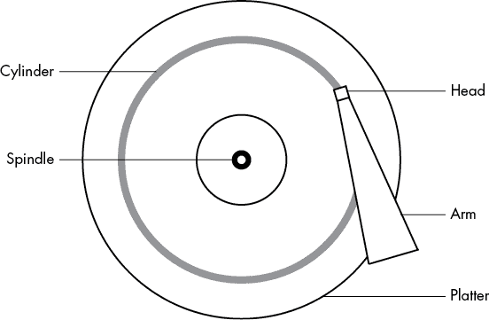
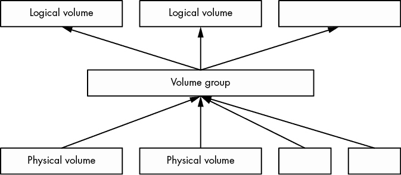
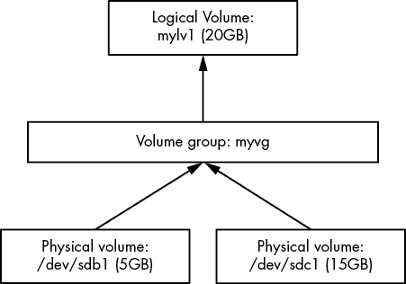
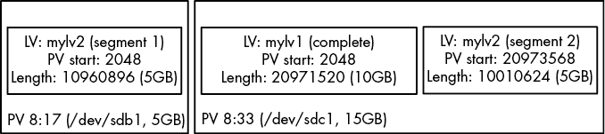
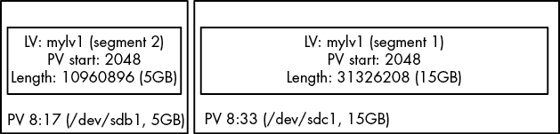
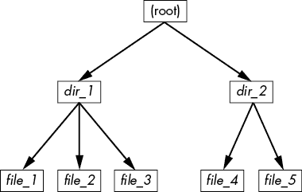
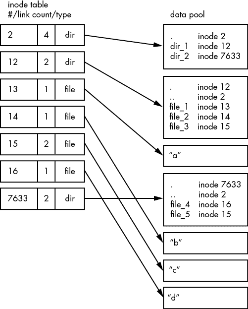

# 第四章：磁盘和文件系统


在第三章中，我们概览了一些内核提供的顶级磁盘设备。在本章中，我们将详细讨论如何在 Linux 系统中操作磁盘。你将学习如何分区、创建并维护磁盘分区内的文件系统，以及如何使用交换空间。

回想一下，磁盘设备有类似*/dev/sda*的名称，这是第一个 SCSI 子系统磁盘。这种类型的块设备代表整个磁盘，但磁盘内部有许多不同的组件和层次。

图 4-1 展示了一个简单 Linux 磁盘的示意图（注意该图并非按比例绘制）。随着你学习本章内容，你将了解每个部分是如何相互配合的。



图 4-1：典型的 Linux 磁盘示意图

*分区*是整个磁盘的子划分。在 Linux 中，分区通过在整个块设备后加上数字来表示，因此它们的名称像*/dev/sda1*和*/dev/sdb3*。内核将每个分区呈现为一个块设备，就像它处理整个磁盘一样。分区定义在磁盘的一个小区域，称为*分区表*（也叫*磁盘标签*）。

内核使你能够同时访问整个磁盘和其某个分区，但除非你是在复制整个磁盘，否则通常不会这样做。

Linux 的*逻辑卷管理器（LVM）*为传统磁盘设备和分区增加了更多的灵活性，现在已被许多系统使用。我们将在第 4.4 节讨论 LVM。

分区之上的下一层是*文件系统*，它是你在用户空间中习惯与之交互的文件和目录的数据库。我们将在第 4.2 节深入探讨文件系统。

如图 4-1 所示，如果你想访问文件中的数据，需要从分区表中使用适当的分区位置，然后在该分区的文件系统数据库中查找所需的文件数据。

要访问磁盘上的数据，Linux 内核使用图 4-2 中所示的层次结构。SCSI 子系统及第 3.6 节中描述的其他内容被表示为一个单独的框。请注意，你可以通过文件系统以及直接通过磁盘设备来操作磁盘。在本章中，你将看到这两种方法如何工作。为了简化，LVM 在图 4-2 中未被表示，但它在块设备接口中有组件，并在用户空间中有一些管理组件。

为了更好地理解各部分如何组合在一起，我们从最底层的分区开始。



图 4-2：磁盘访问的内核示意图

## 4.1 磁盘设备分区

分区表有很多种类型。分区表本身并没有什么特别之处——它只是一堆数据，用来表示磁盘上的块是如何划分的。

传统的分区表可以追溯到 PC 时代，存在于*主引导记录（MBR）*中，并且有许多限制。大多数较新的系统使用*全局唯一标识符分区表（GPT）*。

以下是一些常见的 Linux 分区工具：

1.  `parted` **（“分区编辑器”）** 一款支持 MBR 和 GPT 的基于文本的工具。

1.  `gparted` `parted`的图形化版本。

1.  `fdisk` 传统的基于文本的 Linux 磁盘分区工具。`fdisk`的新版支持 MBR、GPT 以及许多其他类型的分区表，但旧版本仅支持 MBR。

由于`parted`已经支持 MBR 和 GPT 很长时间了，并且可以很容易地通过单个命令获取分区标签，我们将使用`parted`来显示分区表。不过，在创建和修改分区表时，我们将使用`fdisk`。这将展示两种界面，以及为什么许多人更喜欢`fdisk`界面，因为它是交互式的，并且在你有机会查看变更之前，它不会对磁盘做任何修改（我们稍后会讨论这一点）。

### 4.1.1 查看分区表

你可以使用`parted -l`查看系统的分区表。以下是示例输出，展示了两个不同分区表类型的磁盘设备：

```
# parted -l
Model: ATA KINGSTON SM2280S (scsi)
1 Disk /dev/sda: 240GB
Sector size (logical/physical): 512B/512B
Partition Table: msdos
Disk Flags: 

Number  Start   End    Size    Type      File system     Flags
 1      1049kB  223GB  223GB   primary   ext4            boot
 2      223GB   240GB  17.0GB  extended
 5      223GB   240GB  17.0GB  logical   linux-swap(v1)

Model: Generic Flash Disk (scsi)
2 Disk /dev/sdf: 4284MB
Sector size (logical/physical): 512B/512B
Partition Table: gpt
Disk Flags: 

Number  Start   End     Size    File system  Name      Flags
 1      1049kB  1050MB  1049MB               myfirst
 2      1050MB  4284MB  3235MB               mysecond
```

第一个设备（*/dev/sda*）1 使用传统的 MBR 分区表（`parted`称之为`msdos`），而第二个设备（*/dev/sdf*）2 包含一个 GPT。注意，两个分区表类型存储的参数集不同。特别是，MBR 表没有`Name`列，因为在这种方案下没有名字。（我在 GPT 中随意选择了`myfirst`和`mysecond`作为名称。）

#### MBR 基础知识

本示例中的 MBR 表包含主分区、扩展分区和逻辑分区。*主分区*是磁盘的正常子分区；分区 1 就是一个示例。基础的 MBR 最多支持四个主分区，因此如果你需要超过四个分区，你必须将其中一个标记为*扩展分区*。扩展分区可以划分为*逻辑分区*，操作系统可以像使用任何其他分区一样使用这些逻辑分区。在这个示例中，分区 2 是一个扩展分区，它包含了逻辑分区 5。

#### LVM 分区：快速预览

在查看你的分区表时，如果你看到标记为 LVM（分区类型代码为`8e`）、设备名为`/dev/dm-*`，或者提到“设备映射器”的内容，那么说明你的系统使用了 LVM。我们的讨论将从传统的直接磁盘分区开始，这看起来与使用 LVM 的系统稍有不同。

为了让你知道该期待什么，我们先快速看一下在一台使用 LVM 的系统上（在 VirtualBox 中安装全新 Ubuntu 并使用 LVM）运行`parted -l`命令时的输出。首先，是实际分区表的描述，整体看起来和你预期的差不多，唯一不同的是`lvm`标志：

```
Model: ATA VBOX HARDDISK (scsi)
Disk /dev/sda: 10.7GB
Sector size (logical/physical): 512B/512B
Partition Table: msdos
Disk Flags: 

Number  Start   End     Size    Type     File system  Flags
 1      1049kB  10.7GB  10.7GB  primary               boot, lvm
```

然后是一些看起来应该是分区，但被称为磁盘的设备：

```
Model: Linux device-mapper (linear) (dm)
Disk /dev/mapper/ubuntu--vg-swap_1: 1023MB
Sector size (logical/physical): 512B/512B
Partition Table: loop
Disk Flags: 

Number  Start  End     Size    File system     Flags
 1      0.00B  1023MB  1023MB  linux-swap(v1)

Model: Linux device-mapper (linear) (dm)
Disk /dev/mapper/ubuntu--vg-root: 9672MB
Sector size (logical/physical): 512B/512B
Partition Table: loop
Disk Flags: 

Number  Start  End     Size    File system  Flags
 1      0.00B  9672MB  9672MB  ext4
```

一种简单的理解方式是，分区在某种程度上已经与分区表分离。你将在第 4.4 节看到实际发生了什么。

#### 初始内核读取

在最初读取 MBR 表时，Linux 内核会输出类似这样的调试信息（记得你可以通过`journalctl -k`查看）：

```
 sda: sda1 sda2 < sda5 >
```

输出中的`sda2 < sda5 >`部分表示*/dev/sda2*是一个扩展分区，包含一个逻辑分区*/dev/sda5*。通常，你会忽略扩展分区本身，因为你通常只关心访问它包含的逻辑分区。

### 4.1.2 修改分区表

查看分区表是一个相对简单且无害的操作。更改分区表也相对容易，但对磁盘进行这种更改涉及一定的风险。请记住以下几点：

+   更改分区表会使恢复你删除或重新定义的分区上的任何数据变得非常困难，因为这样做可能会删除这些分区上文件系统的位置。如果你正在分区的磁盘包含重要数据，请确保你有备份。

+   确保目标磁盘上的分区当前没有被使用。这是一个重要问题，因为大多数 Linux 发行版会自动挂载任何检测到的文件系统。（关于挂载和卸载的更多内容，请参见第 4.2.3 节。）

当你准备好时，选择你的分区程序。如果你想使用`parted`，你可以使用命令行工具`parted`或图形界面工具，如`gparted`；`fdisk`在命令行中也非常容易使用。这些工具都有在线帮助，且容易学习。（如果你没有备用磁盘，试着在闪存设备或类似设备上使用它们。）

话虽如此，`fdisk`和`parted`的工作方式存在一个主要区别。使用`fdisk`时，你在实际更改磁盘之前先设计好新的分区表，并且只有在退出程序时才会进行更改。但使用`parted`时，分区是在你发出命令时*创建、修改和删除*的。在更改之前，你没有机会查看分区表。

这些差异对于理解这两种工具如何与内核交互也非常关键。`fdisk`和`parted`都完全在用户空间修改分区；不需要提供内核支持来重写分区表，因为用户空间可以读取和修改整个块设备。

然而，在某个时刻，内核必须读取分区表，以便将分区作为块设备呈现，这样你就可以使用它们。`fdisk`工具采用一种相对简单的方法。在修改分区表后，`fdisk`会发出一个系统调用，告诉内核应该重新读取磁盘的分区表（你很快会看到如何与`fdisk`交互的示例）。然后，内核会生成调试输出，你可以通过`journalctl -k`查看。例如，如果你在*/dev/sdf*上创建了两个分区，你将看到如下信息：

```
sdf: sdf1 sdf2
```

`parted` 工具不会使用这种磁盘范围的系统调用；相反，它们在修改单个分区时会向内核发送信号。处理单个分区更改后，内核不会产生前面提到的调试输出。

有几种方法可以查看分区更改：

+   使用 `udevadm` 监视内核事件变化。例如，命令 `udevadm monitor --kernel` 将显示旧的分区设备被移除并添加新的分区设备。

+   检查 */proc/partitions* 获取完整的分区信息。

+   检查 */sys/block/device/* 以查看修改后的分区系统接口，或 */dev* 以查看修改后的分区设备。

### 4.1.3 创建分区表

让我们通过在一个新的空磁盘上创建一个新的分区表来应用你刚刚学到的所有内容。这个例子展示了以下场景：

+   4GB 磁盘（一个小型 USB 闪存设备，未使用；如果你想跟着这个示例操作，可以使用任何你手头的设备）

+   MBR 风格分区表

+   两个分区打算使用 ext4 文件系统：200MB 和 3.8GB

+   磁盘设备位于 */dev/sdd*；你需要使用 `lsblk` 查找自己的设备位置

你将使用 `fdisk` 来完成工作。回想一下，这是一条交互式命令，所以在确保磁盘上没有任何挂载内容后，你会在命令提示符下输入设备名称：

```
# fdisk /dev/sdd
```

你将收到一个介绍性消息，然后是类似这样的命令提示符：

```
Command (m for help):
```

首先，使用 `p` 命令打印当前的分区表（`fdisk` 命令简洁明了）。你的操作大致如下：

```
Command (m for help): **p**
Disk /dev/sdd: 4 GiB, 4284481536 bytes, 8368128 sectors
Units: sectors of 1 * 512 = 512 bytes
Sector size (logical/physical): 512 bytes / 512 bytes
I/O size (minimum/optimal): 512 bytes / 512 bytes
Disklabel type: dos
Disk identifier: 0x88f290cc

Device     Boot Start     End Sectors Size Id Type
/dev/sdd1        2048 8368127 8366080   4G  c W95 FAT32 (LBA)
```

大多数设备已经包含一个 FAT 风格的分区，比如这个位于 */dev/sdd1* 的分区。因为你要为 Linux 创建新分区（当然，你确定不需要这里的任何内容），所以你可以像这样删除现有的分区：

```
Command (m for help): **d**
Selected partition 1
Partition 1 has been deleted.
```

请记住，`fdisk` 在你明确写入分区表之前不会做任何更改，因此你还没有修改磁盘。如果你犯了无法恢复的错误，可以使用 `q` 命令退出 `fdisk` 而不保存更改。

现在，你将使用 `n` 命令创建第一个 200MB 的分区：

```
Command (m for help): **n**
Partition type
   p   primary (0 primary, 0 extended, 4 free)
   e   extended (container for logical partitions)
Select (default p): **p**
Partition number (1-4, default 1): `1`
First sector (2048-8368127, default 2048): **2048**
Last sector, +sectors or +size{K,M,G,T,P} (2048-8368127, default 8368127): **+200M**

Created a new partition 1 of type 'Linux' and of size 200 MiB.
```

在这里，`fdisk` 会提示你选择 MBR 分区风格、分区号、分区的起始位置及其结束位置（或大小）。默认值通常是你需要的。这里唯一变化的是使用 `+` 语法来指定分区的结束位置/大小和单位。

创建第二个分区的方式与此相同，只是你会使用所有默认值，因此我们不再赘述。当你完成分区布局后，使用 `p`（打印）命令进行查看：

```
Command (m for help): **p**
[--snip--]
Device     Boot  Start     End Sectors  Size Id Type
/dev/sdd1         2048  411647  409600  200M 83 Linux
/dev/sdd2       411648 8368127 7956480  3.8G 83 Linux
```

当你准备好写入分区表时，使用 `w` 命令：

```
Command (m for help): **w**
The partition table has been altered.
Calling ioctl() to re-read partition table.
Syncing disks.
```

注意，`fdisk` 不会像安全措施一样询问你是否确定，它会直接执行操作并退出。

如果你对其他诊断信息感兴趣，可以使用 `journalctl -k` 查看之前提到的内核读取信息，但请记住，只有在使用 `fdisk` 时你才能看到这些信息。

到目前为止，您已经掌握了开始分区硬盘的基础知识，但如果您想要更多关于硬盘的细节，请继续阅读。否则，跳到第 4.2 节了解如何在硬盘上放置文件系统。

### 4.1.4 导航硬盘和分区几何

任何带有移动部件的设备都会向软件系统引入复杂性，因为存在抵制抽象的物理元素。硬盘也不例外；即使您可以将硬盘视为具有对任何块的随机访问的块设备，如果系统在如何在硬盘上布局数据方面不小心，可能会导致严重的性能后果。考虑图示的简单单盘硬盘的物理特性图 4-3。



图 4-3：硬盘的俯视图

硬盘由安装在主轴上的旋转盘片和连接到移动臂的磁头组成，臂可以在盘片半径上扫动。当盘片在磁头下旋转时，磁头读取数据。当臂处于一个位置时，磁头只能从一个固定圆圈读取数据。这个圆圈因为较大的硬盘有多个盘片，所有盘片都围绕同一主轴旋转，被称为*柱面*。每个盘片可以有一个或两个磁头，用于盘片的顶部和/或底部，并且所有磁头都连接到同一个臂上并协调移动。由于臂的移动，硬盘上有许多柱面，从中心周围的小柱面到盘片边缘周围的大柱面。最后，您可以将柱面分为*扇区*。这种关于硬盘几何结构的思维方式称为*CHS*，代表*柱面-磁头-扇区*；在旧系统中，您可以通过这三个参数的地址找到硬盘的任何部分。

内核和各种分区程序可以告诉您，硬盘报告的柱面数是多少。然而，在任何半新的硬盘上，*报告的值都是虚构的*！使用 CHS 的传统寻址方案无法与现代硬盘硬件兼容，也不能解释外圈柱面可以存放更多数据的事实。硬盘硬件支持*逻辑块地址寻址（LBA）*通过块编号来寻址硬盘上的位置（这是一个更直接的接口），但 CHS 的遗留物仍然存在。例如，MBR 分区表包含 CHS 信息以及 LBA 等效信息，并且一些引导加载程序仍然愚蠢到相信 CHS 值（不用担心——大多数 Linux 引导加载程序使用 LBA 值）。

### 4.1.5 从固态硬盘读取

没有移动部件的存储设备，如*固态硬盘（SSD）*，在访问特性上与旋转硬盘有根本的不同。对于这些设备，随机访问不是问题，因为没有磁头在盘片上扫过，但某些特性可能会改变 SSD 的性能表现。

影响 SSD 性能的最重要因素之一是*分区对齐*。当你从 SSD 读取数据时，你是按块读取数据（称为*页面*，不要与虚拟内存页面混淆）——例如每次读取 4,096 或 8,192 字节——而且读取必须从该大小的倍数开始。这意味着如果你的分区及其数据不位于边界上，你可能需要做两次读取而不是一次，这对于小的常见操作（例如读取目录内容）来说会增加开销。

较新的分区工具版本包含将新创建的分区放置在磁盘起始位置适当偏移处的逻辑，因此你可能不需要担心分区对齐不当的问题。目前，分区工具不进行任何计算；它们只是将分区对齐到 1MB 边界，或者更精确地说，是 2,048 个 512 字节的块。这是一种相当保守的方法，因为该边界与 4,096、8,192 等页面大小对齐，一直到 1,048,576。

然而，如果你有兴趣或想确保你的分区以边界开始，你可以很容易地在*/sys/block*目录中找到此信息。以下是分区*/dev/sdf2*的一个例子：

```
$ **cat /sys/block/sdf/sdf2/start**
1953126
```

这里的输出是分区相对于设备起始位置的偏移量，以 512 字节为单位（Linux 系统将其混淆地称为*扇区*）。如果这个 SSD 使用 4,096 字节的页面，那么每个页面里有八个这样的扇区。你只需要检查是否能够将分区偏移量除以 8 整除。此时，你不能整除，因此该分区将无法达到最佳性能。

## 4.2 文件系统

磁盘上内核与用户空间之间的最后一个连接通常是*文件系统*；这就是你在运行像`ls`和`cd`这样的命令时与之交互的内容。正如前面提到的，文件系统是一种数据库形式；它提供了将简单的块设备转化为用户可以理解的复杂文件和子目录层次结构的结构。

曾几何时，所有文件系统都存在于磁盘和其他仅用于数据存储的物理介质上。然而，文件系统的树状目录结构和 I/O 接口非常通用，因此文件系统现在执行各种任务，例如在*/sys*和*/proc*中看到的系统接口。文件系统传统上是在内核中实现的，但来自 Plan 9 的 9P 创新（[`en.wikipedia.org/wiki/9P_(protocol)`](https://en.wikipedia.org/wiki/9P_(protocol)))激发了用户空间文件系统的发展。*用户空间文件系统 (FUSE)* 功能允许 Linux 中的用户空间文件系统。

*虚拟文件系统（VFS）*抽象层完成了文件系统的实现。就像 SCSI 子系统通过标准化不同设备类型与内核控制命令之间的通信一样，VFS 确保所有文件系统实现都支持标准接口，使得用户空间应用程序能够以相同的方式访问文件和目录。VFS 的支持使得 Linux 能够支持数量庞大的文件系统。

### 4.2.1 文件系统类型

Linux 文件系统支持包括为 Linux 优化的本地设计；外来类型，如 Windows FAT 系列；通用文件系统，如 ISO 9660；以及许多其他文件系统。以下列表包括用于数据存储的最常见文件系统类型。Linux 识别的类型名称位于文件系统名称旁边的括号内。

+   *第四扩展文件系统*（ext4）是 Linux 本地文件系统系列的最新版本。*第二扩展文件系统*（ext2）曾是 Linux 系统的默认文件系统，灵感来自传统的 Unix 文件系统，如 Unix 文件系统（UFS）和快速文件系统（FFS）。*第三扩展文件系统*（ext3）增加了日志功能（一个在正常文件系统数据结构之外的小缓存）以增强数据完整性并加速启动。ext4 文件系统是在 ext2 和 ext3 的基础上的增量改进，支持比 ext2 或 ext3 更大的文件以及更多的子目录。

    扩展文件系统系列具有一定的向后兼容性。例如，你可以将 ext2 和 ext3 文件系统互相挂载，也可以将 ext2 和 ext3 文件系统挂载为 ext4，但你*不能*将 ext4 挂载为 ext2 或 ext3。

+   *Btrfs，或 B 树文件系统*（btrfs）是一个较新的 Linux 本地文件系统，旨在超越 ext4 的能力。

+   *FAT 文件系统*（msdos, vfat, exfat）属于微软系统。简单的 msdos 类型支持 MS-DOS 系统中的非常原始的单一字母大小写。大多数可移动闪存介质，如 SD 卡和 USB 驱动器，默认包含 vfat（最多 4GB）或 exfat（4GB 及以上）分区。Windows 系统可以使用 FAT 文件系统或更高级的 *NT 文件系统*（ntfs）。

+   *XFS* 是一种高性能文件系统，一些发行版（如 Red Hat Enterprise Linux 7.0 及更高版本）默认使用该文件系统。

+   *HFS+*（hfsplus）是苹果公司在大多数 Macintosh 系统上使用的标准。

+   *ISO 9660*（iso9660）是一个 CD-ROM 标准。大多数 CD-ROM 使用某种变种的 ISO 9660 标准。

### 4.2.2 创建文件系统

如果你正在准备一个新的存储设备，一旦完成了 4.1 节中描述的分区过程，你就可以开始创建文件系统了。与分区一样，你将在用户空间中进行此操作，因为用户空间进程可以直接访问和操作块设备。

`mkfs` 工具可以创建多种类型的文件系统。例如，你可以使用以下命令在 */dev/sdf2* 上创建一个 ext4 分区：

```
# mkfs -t ext4 /dev/sdf2
```

`mkfs`程序会自动确定设备中的块数并设置一些合理的默认值。除非你非常清楚自己在做什么并且愿意详细阅读文档，否则不要修改这些设置。

当你创建一个文件系统时，`mkfs`会在工作过程中打印诊断输出，包括关于超级块的输出。*超级块*是文件系统数据库顶层的一个关键组件，它非常重要，以至于`mkfs`会创建多个备份，以防原始的超级块丢失。考虑在`mkfs`运行时记录一些超级块备份编号，以防在磁盘故障时需要恢复超级块（详见第 4.2.11 节）。

### 4.2.3 挂载文件系统

在 Unix 中，将文件系统附加到运行中的系统的过程称为*挂载*。当系统启动时，内核会读取一些配置数据并根据这些配置数据挂载根目录(`/`)。

要挂载文件系统，你必须知道以下内容：

+   文件系统的设备、位置或标识符（例如磁盘分区——实际文件系统数据所在的地方）。一些特殊用途的文件系统，如 proc 和 sysfs，没有具体的位置。

+   文件系统类型。

+   *挂载点*——当前系统目录层次结构中将附加文件系统的位置。挂载点始终是一个普通目录。例如，你可以使用*/music*作为包含音乐的文件系统的挂载点。挂载点不必直接位于*/*下，它可以位于系统中的任何位置。

挂载文件系统的常用术语是“将设备*挂载*到挂载点”。要查看当前系统的文件系统状态，可以运行`mount`命令。输出（可能相当长）应如下所示：

```
$ **mount**
/dev/sda1 on / type ext4 (rw,errors=remount-ro)
proc on /proc type proc (rw,noexec,nosuid,nodev)
sysfs on /sys type sysfs (rw,noexec,nosuid,nodev)
fusectl on /sys/fs/fuse/connections type fusectl (rw)
debugfs on /sys/kernel/debug type debugfs (rw)
securityfs on /sys/kernel/security type securityfs (rw)
udev on /dev type devtmpfs (rw,mode=0755)
devpts on /dev/pts type devpts (rw,noexec,nosuid,gid=5,mode=0620)
tmpfs on /run type tmpfs (rw,noexec,nosuid,size=10%,mode=0755)
--`snip`--
```

每一行对应一个当前挂载的文件系统，项目顺序如下：

1.  设备，例如*/dev/sda3*。注意，其中一些不是实际的设备（例如`proc`），而是实际设备名称的代替符，因为这些特殊用途的文件系统不需要设备。

1.  单词`on`。

1.  挂载点。

1.  单词`type`。

1.  文件系统类型，通常以简短标识符的形式表示。

1.  挂载选项（在括号中）。更多详情见第 4.2.6 节。

要手动挂载文件系统，可以使用`mount`命令，指定文件系统类型、设备和所需的挂载点：

```
`#` **mount -t** `type device mountpoint`
```

例如，要将位于设备*/dev/sdf2*上的第四扩展文件系统挂载到*/home/extra*，可以使用以下命令：

```
# mount -t ext4 /dev/sdf2 /home/extra
```

通常你不需要提供`-t` `type`选项，因为`mount`通常会为你自动识别。不过，有时需要区分两种相似的类型，例如各种 FAT 样式的文件系统。

要卸载（分离）文件系统，可以使用以下`umount`命令：

```
# umount `mountpoint`
```

你也可以使用设备而非挂载点来卸载文件系统。

### 4.2.4 文件系统 UUID

前面部分讨论的挂载文件系统的方法依赖于设备名称。然而，设备名称可能会发生变化，因为它们取决于内核找到设备的顺序。为了解决这个问题，您可以通过它们的*全局唯一标识符（UUID）*来识别和挂载文件系统。UUID 是一种行业标准，用于为计算机系统中的对象分配唯一的“序列号”。像`mke2fs`这样的文件系统创建程序在初始化文件系统数据结构时会生成 UUID。

要查看系统上设备及其对应的文件系统和 UUID 列表，请使用`blkid`（块 ID）程序：

```
# blkid
/dev/sdf2: UUID="b600fe63-d2e9-461c-a5cd-d3b373a5e1d2" TYPE="ext4" 
/dev/sda1: UUID="17f12d53-c3d7-4ab3-943e-a0a72366c9fa" TYPE="ext4" PARTUUID="c9a5ebb0-01"
/dev/sda5: UUID="b600fe63-d2e9-461c-a5cd-d3b373a5e1d2" TYPE="swap" PARTUUID="c9a5ebb0-05"
/dev/sde1: UUID="4859-EFEA" TYPE="vfat"
```

在此示例中，`blkid`发现了四个包含数据的分区：两个带有 ext4 文件系统，一个带有交换空间标识符（参见第 4.3 节），还有一个带有 FAT 文件系统。Linux 本地分区都有标准 UUID，但 FAT 分区没有。您可以通过其 FAT 卷序列号（在此例中为 4859-EFEA）引用 FAT 分区。

要通过 UUID 挂载文件系统，请使用`UUID`挂载选项。例如，要将前面列表中的第一个文件系统挂载到*/home/extra*，请输入：

```
# mount UUID=b600fe63-d2e9-461c-a5cd-d3b373a5e1d2 /home/extra
```

通常您不会像这样手动通过 UUID 挂载文件系统，因为您通常知道设备，并且通过设备名称挂载比通过 UUID 更简单。然而，理解 UUID 很重要。一方面，它们是自动在启动时通过*/etc/fstab*挂载非 LVM 文件系统的首选方法（参见第 4.2.8 节）。此外，许多发行版在插入可移动媒体时使用 UUID 作为挂载点。在前面的例子中，FAT 文件系统位于闪存介质卡上。当有人登录的 Ubuntu 系统插入该卡时，会在*/media/user/4859-EFEA*处挂载此分区。第三章中描述的 udevd 守护进程处理设备插入的初始事件。

如果需要，您可以更改文件系统的 UUID（例如，如果您将整个文件系统从其他地方复制过来，现在需要将其与原始文件系统区分开）。有关如何在 ext2/ext3/ext4 文件系统上执行此操作，请参阅 tune2fs(8)手册页。

### 4.2.5 磁盘缓冲、缓存与文件系统

Linux 与其他 Unix 变种一样，会缓冲写入磁盘。这意味着内核通常不会立即在进程请求更改时将更改写入文件系统。相反，它将这些更改存储在 RAM 中，直到内核确定一个合适的时机将它们实际写入磁盘。这个缓冲系统对用户是透明的，并提供了显著的性能提升。

当您使用`umount`卸载文件系统时，内核会自动与磁盘进行*同步*，将其缓冲区中的更改写入磁盘。您也可以通过运行`sync`命令强制内核随时执行此操作，默认情况下该命令会同步系统上的所有磁盘。如果由于某种原因您在关闭系统前无法卸载文件系统，请务必先运行`sync`命令。

此外，内核使用 RAM 来缓存从磁盘读取的块。因此，如果一个或多个进程反复访问某个文件，内核就不需要一次又一次地访问磁盘，它可以直接从缓存中读取，从而节省时间和资源。

### 4.2.6 文件系统挂载选项

有许多方法可以改变`mount`命令的行为，这在处理可移动媒体或进行系统维护时经常需要做。实际上，`mount`选项的总数非常庞大。详尽的`mount(8)`手册页是一个很好的参考，但很难知道从哪里开始以及哪些可以安全忽略。在本节中，你将看到最有用的选项。

选项大致分为两类：通用选项和特定于文件系统的选项。通用选项通常适用于所有类型的文件系统，包括早前提到的`-t`，用于指定文件系统类型。相反，特定于文件系统的选项仅适用于某些文件系统类型。

要启用文件系统选项，请使用 `-o` 交换符，后面跟上选项。例如，`-o remount,rw` 将已挂载为只读的文件系统重新挂载为读写模式。

#### 短通用选项

通用选项有简短的语法。最重要的选项包括：

1.  `-r` `-r`选项以只读模式挂载文件系统。它有多种用途，从写保护到引导。访问只读设备（如 CD-ROM）时，你无需指定此选项；系统会自动为你处理（并告知你只读状态）。

1.  `-n` `-n`选项确保 `mount` 不尝试更新系统运行时的挂载数据库 `*/etc/mtab*`。默认情况下，当无法写入此文件时，`mount` 操作会失败，因此在启动时这个选项非常重要，因为根分区（包括系统挂载数据库）初始时是只读的。当你尝试在单用户模式下修复系统问题时，这个选项也很有用，因为此时系统挂载数据库可能不可用。

1.  `-t` `-t` `type`选项用于指定文件系统类型。

#### 长选项

像 `-r` 这样的短选项对于不断增加的 `mount` 选项来说过于有限；字母表中的字母太少，无法容纳所有可能的选项。短选项也很麻烦，因为仅凭一个字母很难确定选项的含义。许多通用选项和所有特定于文件系统的选项都使用更长且更灵活的选项格式。

要在命令行中使用 `mount` 的长选项，可以从 `-o` 开始，后面跟着用逗号分隔的适当关键词。以下是一个完整的示例，长选项紧跟在 `-o` 后面：

```
# mount -t vfat /dev/sde1 /dos -o ro,uid=1000
```

这里的两个长选项是 `ro` 和 `uid=1000`。`ro` 选项指定只读模式，和 `-r` 短选项相同。`uid=1000` 选项告诉内核将文件系统上的所有文件视为用户 ID 为 1000 的所有者。

最有用的长选项如下：

1.  `exec`、`noexec` 启用或禁用在文件系统上执行程序。

1.  `suid`、`nosuid` 启用或禁用`setuid`程序。

1.  `ro` 以只读模式挂载文件系统（与`-r`短选项相同）。

1.  `rw` 以读写模式挂载文件系统。

### 4.2.7 重新挂载文件系统

有时你需要更改当前已挂载文件系统的`mount`选项；最常见的情况是在崩溃恢复期间，你需要将只读文件系统变为可写。在这种情况下，你需要在相同的挂载点重新附加文件系统。

以下命令将根目录以读写模式重新挂载（由于`mount`命令在根目录为只读时无法写入系统挂载数据库，因此你需要使用`-n`选项）：

```
# mount -n -o remount /
```

此命令假定`/*`的正确设备列表已经在*/etc/fstab*中（如下一节所述）。如果没有，你必须将设备作为额外选项指定。

### 4.2.8 /etc/fstab 文件系统表

为了在启动时挂载文件系统并简化`mount`命令，Linux 系统将文件系统及其选项的永久列表保存在*/etc/fstab*中。这是一个非常简单格式的纯文本文件，如清单 4-1 所示。

```
UUID=70ccd6e7-6ae6-44f6-812c-51aab8036d29 / ext4 errors=remount-ro 0 1
UUID=592dcfd1-58da-4769-9ea8-5f412a896980 none swap sw 0 0
/dev/sr0 /cdrom iso9660  ro,user,nosuid,noauto 0 0
```

清单 4-1：*/etc/fstab*中的文件系统及其选项列表

每一行对应一个文件系统，并分为六个字段。从左到右，这些字段分别是：

1.  设备或 UUID 当前大多数 Linux 系统不再使用*/etc/fstab*中的设备，倾向于使用 UUID。

1.  挂载点 指示将文件系统附加到哪里。

1.  文件系统类型 你可能不会在这个列表中识别`swap`，它是交换分区（见第 4.3 节）。

1.  选项 长选项，用逗号分隔。

1.  用于`dump`命令的备份信息 `dump`命令是一个早已废弃的备份工具；该字段不再相关。你应该始终将其设置为`0`。

1.  文件系统完整性测试顺序 为确保`fsck`始终首先在根文件系统上运行，请始终将根文件系统的该值设置为`1`，并将任何其他本地附加的硬盘或 SSD 文件系统的该值设置为`2`。使用`0`可以禁用对其他所有文件系统的启动检查，包括只读设备、交换分区以及*/proc*文件系统（请参见第 4.2.11 节中的`fsck`命令）。

使用`mount`时，如果你想要操作的文件系统已经在*/etc/fstab*中，你可以使用一些快捷方式。例如，如果你使用的是清单 4-1 并且挂载了一个 CD-ROM，你只需运行`mount /cdrom`。

你也可以尝试同时挂载所有在*/etc/fstab*中没有包含`noauto`选项的条目，使用以下命令：

```
# mount -a
```

清单 4-1 介绍了一些新的选项——即`errors`、`noauto`和`user`，因为它们不适用于*/etc/fstab*文件之外。此外，你还会经常看到`defaults`选项。这些选项的定义如下：

1.  `defaults` 这会设置`mount`的默认选项：读写模式，启用设备文件，执行文件，`setuid`位，等等。若不想为文件系统提供任何特别选项，但又想填写*/etc/fstab*中的所有字段，则使用此选项。

1.  `errors` 这是一个特定于 ext2/3/4 的参数，用来设置系统在挂载文件系统时遇到问题时的内核行为。默认值通常是`errors=continue`，意味着内核应返回错误代码并继续运行。若要让内核在只读模式下重新尝试挂载，使用`errors=remount-ro`。`errors=panic`设置则会告诉内核（以及你的系统）在挂载出现问题时停止。

1.  `noauto` 此选项告诉`mount -a`命令忽略此条目。若想防止可移动媒体设备（如闪存存储设备）在启动时挂载，可以使用此选项。

1.  `user` 此选项允许非特权用户对特定条目执行`mount`命令，这对于允许某些类型的可移动媒体访问非常方便。因为用户可以在可移动媒体上放置*setuid-root*文件并用另一个系统访问该媒体，所以此选项还会设置`nosuid`、`noexec`和`nodev`（以禁止特殊设备文件）。请记住，对于可移动媒体和其他一般情况，此选项现在的使用有限，因为大多数系统通过`ubus`及其他机制自动挂载插入的媒体。然而，在某些特殊情况下，若你想授予控制挂载特定目录的权限，此选项仍然有用。

### 4.2.9 /etc/fstab 的替代方案

尽管*/etc/fstab*文件一直是表示文件系统及其挂载点的传统方式，但仍有两种替代方案。第一种是*/etc/fstab.d*目录，其中包含单独的文件系统配置文件（每个文件系统一个文件）。这个想法与本书中将看到的许多其他配置目录非常相似。

第二种替代方案是为文件系统配置*systemd 单元*。你将在第六章了解更多关于 systemd 及其单元的内容。然而，systemd 单元配置通常是从（或基于）*/etc/fstab*文件生成的，因此你可能会在系统中发现一些重叠部分。

### 4.2.10 文件系统容量

若要查看当前挂载的文件系统的大小和利用率，请使用`df`命令。输出可能非常庞大（并且随着专用文件系统的增多而越来越长），但应该包含有关实际存储设备的信息。

```
$ **df**
Filesystem           1K-blocks      Used  Available Use% Mounted on
/dev/sda1            214234312 127989560   75339204  63% /
/dev/sdd2              3043836      4632    2864872   1% /media/user/uuid
```

这是`df`输出字段的简要说明：

1.  `Filesystem` 文件系统设备

1.  `1K-blocks` 文件系统的总容量，以 1,024 字节为单位的块数

1.  `Used` 已占用的块数

1.  `Available` 剩余的空闲块数

1.  `Use%` 已使用的块的百分比

1.  `Mounted on` 挂载点

应该很容易看出，这两个文件系统的大小分别大约为 215GB 和 3GB。然而，容量数值可能看起来有点奇怪，因为 127,989,560 加 75,339,204 并不等于 214,234,312，而且 127,989,560 也不是 214,234,312 的 63%。在这两种情况下，总容量的 5% 没有被计算在内。实际上，空间是存在的，但它隐藏在 *保留* 块中。只有超级用户才能在文件系统开始填满时使用这些保留块。这一功能能防止系统服务器在磁盘空间用尽时立即崩溃。

### 4.2.11 检查和修复文件系统

Unix 文件系统所提供的优化功能得益于一个复杂的数据库机制。为了让文件系统无缝工作，内核必须信任已挂载的文件系统没有错误，并且硬件能够可靠地存储数据。如果存在错误，可能会导致数据丢失和系统崩溃。

除了硬件问题，文件系统错误通常是由于用户粗暴关闭系统（例如拔掉电源线）导致的。在这种情况下，内存中的先前文件系统缓存可能与磁盘上的数据不匹配，且当你给计算机“踢”一脚时，系统可能正在修改文件系统。尽管许多文件系统支持日志功能，从而使文件系统损坏的情况变得不那么常见，但你仍然应该正确关闭系统。无论使用哪种文件系统，定期检查文件系统仍然是必要的，以确保一切正常。

检查文件系统的工具是 `fsck`。与 `mkfs` 程序一样，Linux 支持的每种文件系统类型都有一个不同版本的 `fsck`。例如，当在扩展文件系统系列（ext2/ext3/ext4）上运行时，`fsck` 会识别文件系统类型并启动 `e2fsck` 工具。因此，通常情况下你不需要输入 `e2fsck`，除非 `fsck` 无法识别文件系统类型，或者你需要查阅 `e2fsck` 的手册页。

本节中提供的信息特定于扩展文件系统系列和 `e2fsck`。

要在交互式手动模式下运行 `fsck`，请将设备或挂载点（如 */etc/fstab* 中列出的）作为参数。例如：

```
# fsck /dev/sdb1
```

在手动模式下，`fsck` 会打印详细的状态报告，报告的内容在没有问题时应该类似于以下内容：

```
Pass 1: Checking inodes, blocks, and sizes
Pass 2: Checking directory structure
Pass 3: Checking directory connectivity
Pass 4: Checking reference counts
Pass 5: Checking group summary information
/dev/sdb1: 11/1976 files (0.0% non-contiguous), 265/7891 blocks
```

如果`fsck`在手动模式下发现问题，它会停止并提出一个与修复该问题相关的问题。这些问题涉及文件系统的内部结构，例如重新连接松散的 inode 和清理块（*inode*是文件系统的构建模块；你将在第 4.6 节中了解它们的工作原理）。当`fsck`询问你是否要重新连接一个 inode 时，它已发现一个看起来没有名称的文件。重新连接这样的文件时，`fsck`会将该文件放入文件系统中的*lost+found*目录，并以数字作为文件名。如果发生这种情况，你需要根据文件的内容来猜测文件名；原始文件名可能已经丢失。

通常，如果你只是非正常关闭了系统，坐等`fsck`修复过程是没有意义的，因为`fsck`可能需要修复很多小问题。幸运的是，`e2fsck`有一个`-p`选项，它会自动修复普通问题而不询问，并在遇到严重错误时中止。事实上，Linux 发行版在启动时会运行一个变种的`fsck -p`。（你也可能会看到`fsck -a`，它执行相同的操作。）

如果你怀疑系统出现了重大故障，比如硬件故障或设备配置错误，你需要决定一个行动方案，因为`fsck`在文件系统出现较大问题时，可能会真的破坏文件系统。（一个明显的信号是，如果`fsck`在手动模式下问了*很多*问题，说明系统可能有严重问题。）

如果你认为发生了严重问题，尝试运行`fsck -n`检查文件系统而不修改任何内容。如果你认为设备配置有问题（例如松动的电缆或分区表中的块数量不正确），在真正运行`fsck`之前，先修复它，否则你很可能会丢失大量数据。

如果你怀疑只有超级块损坏（例如，因为某人写入了磁盘分区的开始位置），你可能可以使用`mkfs`创建的超级块备份之一来恢复文件系统。使用`fsck -b` `num`将损坏的超级块替换为块`num`处的备用超级块，并希望一切顺利。

如果你不知道在哪儿找到备份超级块，你可以在设备上运行`mkfs -n`，查看超级块备份号列表，而不会破坏你的数据。（再次提醒，*确保*你使用的是`-n`，否则你会*真的*破坏文件系统。）

#### 检查 ext3 和 ext4 文件系统

通常，你不需要手动检查 ext3 和 ext4 文件系统，因为日志确保了数据完整性（回想一下，*日志*是一个小的数据缓存，尚未写入文件系统中的特定位置）。如果你没有正常关闭系统，你可以预期日志中会包含一些数据。要将 ext3 或 ext4 文件系统中的日志刷新到常规文件系统数据库，运行`e2fsck`，方法如下：

```
# e2fsck –fy /dev/`disk_device`
```

然而，你可能想将损坏的 ext3 或 ext4 文件系统以 ext2 模式挂载，因为内核不会挂载带有非空日志的 ext3 或 ext4 文件系统。

#### 最坏的情况

更严重的磁盘问题会让你面临很少的选择：

+   你可以尝试使用`dd`从磁盘提取整个文件系统镜像，并将其传输到另一个相同大小的磁盘上的分区。

+   你可以尽量修补文件系统，将其挂载为只读模式，并尽可能恢复数据。

+   你可以尝试`debugfs`。

在前两种情况下，你仍然需要修复文件系统，然后才能挂载它，除非你愿意手动浏览原始数据。如果你愿意，你可以选择对所有`fsck`问题回答`y`，通过输入`fsck -y`，但最好作为最后的手段，因为在修复过程中可能会出现你更愿意手动处理的问题。

`debugfs`工具允许你浏览文件系统中的文件并将它们复制到其他地方。默认情况下，它以只读模式打开文件系统。如果你正在恢复数据，最好保持文件的完整性，以避免进一步破坏。

现在，如果你真的绝望——比如在发生灾难性的磁盘故障且没有备份的情况下——你能做的也不多，除了希望专业服务能够“刮取盘片”。

### 4.2.12 特殊用途文件系统

并非所有的文件系统都代表物理媒体上的存储。大多数 Unix 版本都有作为系统接口的文件系统。也就是说，文件系统不仅仅是用来存储数据的工具，它还可以代表系统信息，如进程 ID 和内核诊断信息。这个概念追溯到*/dev*机制，这是早期通过文件作为 I/O 接口的模型。*/proc*的概念来自于第八版的研究 Unix，由 Tom J. Killian 实现，并在贝尔实验室（包括许多原始 Unix 设计者）创建 Plan 9 时得到了加速——这是一个将文件系统抽象提升到全新水平的研究操作系统 ([`en.wikipedia.org/wiki/Plan_9_from_Bell_Labs`](https://en.wikipedia.org/wiki/Plan_9_from_Bell_Labs))。

在 Linux 上常见的一些特殊文件系统类型包括：

1.  `proc`挂载在*/proc*上。`proc`是*进程*的缩写。*/proc*下的每个*编号*目录表示系统上当前进程的 ID；每个目录中的文件表示该进程的各种方面。目录*/proc/self*表示当前进程。Linux 的`proc`文件系统在像*/proc/cpuinfo*这样的文件中包含了大量额外的内核和硬件信息。请记住，内核设计指南建议将与进程无关的信息从*/proc*移动到*/sys*，因此*/proc*中的系统信息可能不是最当前的接口。

1.  `sysfs`挂载在*/sys*上。（你在第三章已经看过这一点。）

1.  `tmpfs`挂载在*/run*和其他位置。使用`tmpfs`，您可以将物理内存和交换空间用作临时存储。您可以根据需要将`tmpfs`挂载到任何位置，并使用`size`和`nr_blocks`长选项控制最大大小。然而，请小心不要不断向`tmpfs`位置写入数据，因为您的系统最终会耗尽内存，程序将开始崩溃。

1.  `squashfs` 一种只读文件系统，其中内容以压缩格式存储，并通过回环设备按需提取。一个典型的应用是 snap 软件包管理系统，它将软件包挂载到*/snap*目录下。

1.  `overlay` 一种将目录合并为复合体的文件系统。容器通常使用 overlay 文件系统；您将在第十七章看到它们的工作原理。

## 4.3 交换空间

磁盘上的并非每个分区都包含文件系统。也可以使用磁盘空间扩展机器的 RAM。如果您的真实内存用尽，Linux 虚拟内存系统可以自动将内存的一部分转移到磁盘存储中。这被称为*交换*，因为空闲的程序部分被交换到磁盘上，以换取磁盘上的活动部分。用于存储内存页面的磁盘区域称为*交换空间*（或简称*交换*）。

`free`命令的输出包括当前的交换使用情况，单位为千字节，如下所示：

```
$ **free**
             total       used       free
--`snip`--
Swap:       514072     189804     324268
```

### 4.3.1 使用磁盘分区作为交换空间

要使用整个磁盘分区作为交换空间，请按照以下步骤操作：

1.  确保分区为空。

1.  执行`mkswap` `dev`命令，其中`dev`是分区的设备。此命令会在分区上放置一个*交换签名*，将其标记为交换空间（而非文件系统或其他用途）。

1.  执行`swapon` `dev`命令将该空间注册到内核中。

创建交换分区后，您可以在*/etc/fstab*文件中添加一个新的交换条目，以便在机器启动时立即使用交换空间。以下是一个示例条目，使用*/dev/sda5*作为交换分区：

```
/dev/sda5 none swap sw 0 0
```

交换签名具有 UUID，因此请记住，现在许多系统使用 UUID 而非原始设备名称。

### 4.3.2 使用文件作为交换空间

如果您处于必须重新分区磁盘以创建交换分区的情况，您可以使用普通文件作为交换空间。这样做时，您不应遇到任何问题。

使用以下命令创建一个空文件，将其初始化为交换，并将其添加到交换池中：

```
# dd if=/dev/zero of=`swap_file` **bs=1024k count=**`num_mb`
# mkswap `swap_file`
# swapon `swap_file`
```

在这里，`swap_file`是新交换文件的名称，`num_mb`是所需的大小（单位为兆字节）。

要从内核的活动池中移除交换分区或文件，使用`swapoff`命令。您的系统必须有足够的剩余内存（物理内存和交换空间总和），以容纳您要移除的交换池部分中的任何活动页面。

### 4.3.3 确定您需要多少交换空间

曾几何时，Unix 的传统观念认为你应该为真实内存至少保留两倍的交换空间。今天，不仅是巨大的磁盘和内存容量让这个问题变得模糊，而且我们使用系统的方式也影响了这一点。一方面，磁盘空间如此充足，以至于人们有时会分配超过两倍内存大小的交换空间；另一方面，可能你永远都不会使用交换空间，因为你拥有如此多的真实内存。

“双倍真实内存”的规则起源于多用户登录同一台机器的时代。当时并非所有用户都在活跃，因此可以方便地将不活跃用户的内存交换出去，以便活跃用户能够使用更多内存。

对于单用户机器来说，这种情况可能仍然成立。如果你正在运行许多进程，通常交换掉不活跃进程的部分内容，甚至是活跃进程的某些不活跃部分也是可以的。然而，如果你频繁访问交换空间，因为许多活跃进程希望同时使用内存，那么你将遭遇严重的性能问题，因为磁盘 I/O（即使是 SSD 的 I/O）也无法跟上系统的其他部分。唯一的解决办法是购买更多内存、终止一些进程或抱怨。

有时，Linux 内核可能会选择交换出一个进程，以腾出更多磁盘缓存。为了防止这种行为，一些管理员会将某些系统配置为完全不使用交换空间。例如，高性能服务器绝不应该使用交换空间，并应尽量避免磁盘访问。

你将在第八章中学习更多关于内存系统如何工作的内容。

## 4.4 逻辑卷管理器

到目前为止，我们已经通过分区直接管理和使用磁盘，指定在存储设备上某些数据应存放的位置。你知道，访问像*/dev/sda1*这样的块设备会根据*/dev/sda*上的分区表将你引导到特定设备的某个位置，即使确切的位置可能由硬件决定。

这种方法通常效果良好，但它也有一些缺点，特别是在安装*之后*对磁盘进行更改时。例如，如果你想升级磁盘，你必须安装新磁盘、分区、添加文件系统、可能还需要做一些引导加载程序的更改以及其他任务，最后切换到新磁盘。这个过程容易出错，并且需要多次重启。当你想安装额外的磁盘以获得更多容量时，情况可能更糟——在这种情况下，你必须为该磁盘上的文件系统选择一个新的挂载点，并希望你能够手动将数据在旧磁盘和新磁盘之间分配。

LVM 通过在物理块设备和文件系统之间增加一层来解决这些问题。其思想是，你选择一组 *物理卷*（通常是块设备，如磁盘分区），将它们包含到 *卷组* 中，卷组充当一个类似于通用数据池的角色。然后，你可以从卷组中分割出 *逻辑卷*。

图 4-4 显示了这些如何在一个卷组中组合的示意图。该图展示了多个物理卷和逻辑卷，但许多基于 LVM 的系统通常只有一个物理卷和两个逻辑卷（分别用于根和交换分区）。



图 4-4：物理卷和逻辑卷如何在卷组中组合

逻辑卷仅仅是块设备，通常包含文件系统或交换分区标记，因此你可以将卷组和其逻辑卷之间的关系比作磁盘和其分区之间的关系。关键的不同之处在于，你通常不会定义逻辑卷在卷组中的布局—LVM 会自动处理这些问题。

LVM 允许一些强大且极为有用的操作，例如：

+   向卷组添加更多的物理卷（如另一个磁盘），以增加其大小。

+   在卷组中，移除物理卷，只要剩余的空间足以容纳现有的逻辑卷。

+   调整逻辑卷的大小（因此，也可以通过 `fsadm` 工具调整文件系统的大小）。

你可以在不重启机器的情况下完成所有这些操作，在大多数情况下，也不需要卸载任何文件系统。虽然添加新的物理磁盘硬件可能需要关闭系统，但云计算环境通常允许你动态添加新的块存储设备，这使得 LVM 成为需要这种灵活性的系统的绝佳选择。

我们将适度详细地探讨 LVM。首先，我们将学习如何与逻辑卷及其组件交互并进行操作，然后我们将更深入地了解 LVM 的工作原理以及它所依赖的内核驱动程序。然而，这里的讨论并不完全必要，理解本书的其余部分，因此如果你觉得内容过于繁琐，可以随时跳到第五章。

### 4.4.2 使用 LVM 进行操作

LVM 提供了一些用于管理卷和卷组的用户空间工具。大多数工具都基于 `lvm` 命令，这是一个交互式的通用工具。还有一些独立的命令（这些命令实际上是 LVM 的符号链接）用于执行特定任务。例如，`vgs` 命令的效果与在 `lvm>` 提示符下输入 `vgs` 相同，你会发现 *vgs*（通常位于 */sbin* 目录）是 *lvm* 的符号链接。在本书中，我们将使用这些独立的命令。

在接下来的几节中，我们将讨论使用逻辑卷的系统组件。第一个示例来自使用 LVM 分区选项的标准 Ubuntu 安装，因此许多名称将包含*Ubuntu*一词。然而，所有技术细节与该发行版无关。

#### 列出和理解卷组

`vgs`命令显示当前在系统上配置的卷组。输出相当简洁。以下是我们示例 LVM 安装中的输出：

```
# vgs
  VG        #PV #LV #SN Attr   VSize   VFree 
  ubuntu-vg   1   2   0 wz--n- <10.00g 36.00m
```

第一行是标题，每一行表示一个卷组。列内容如下：

1.  `VG` 卷组名称。`ubuntu-vg`是 Ubuntu 安装程序在配置 LVM 系统时分配的通用名称。

1.  `#PV` 卷组存储所包含的物理卷数量。

1.  `#LV` 卷组内的逻辑卷数量。

1.  `#SN` 逻辑卷*快照*的数量。我们不会详细讲解这些。

1.  `Attr` 卷组的多个状态属性。这里，`w`（可写）、`z`（可调整大小）和`n`（正常分配策略）是活动状态。

1.  `VSize` 卷组的大小。

1.  `VFree` 卷组中未分配空间的大小。

这个卷组的概述足以满足大多数需求。如果你想更深入地了解卷组，可以使用`vgdisplay`命令，这对于了解卷组的属性非常有用。以下是使用`vgdisplay`查看同一卷组的输出：

```
# vgdisplay
  --- Volume group ---
  VG Name               ubuntu-vg
  System ID             
  Format                lvm2
  Metadata Areas        1
  Metadata Sequence No  3
  VG Access             read/write
  VG Status             resizable
  MAX LV                0
  Cur LV                2
  Open LV               2
  Max PV                0
  Cur PV                1
  Act PV                1
  VG Size               <10.00 GiB
  PE Size               4.00 MiB
  Total PE              2559
  Alloc PE / Size       2550 / 9.96 GiB
  Free  PE / Size       9 / 36.00 MiB
  VG UUID               0zs0TV-wnT5-laOy-vJ0h-rUae-YPdv-pPwaAs
```

你之前见过其中的一些，但也有一些新的项目需要注意：

1.  `Open LV` 当前正在使用的逻辑卷数量。

1.  `Cur PV` 卷组包含的物理卷数量。

1.  `Act LV` 卷组中活动物理卷的数量。

1.  `VG UUID` 卷组的全局唯一标识符。系统上可能会有多个同名的卷组；在这种情况下，UUID 可以帮助你定位特定的卷组。大多数 LVM 工具（如`vgrename`，可以帮助你解决这种情况）接受 UUID 作为卷组名称的替代。请注意，你将看到许多不同的 UUID；LVM 的每个组件都有一个。

*物理区*（在`vgdisplay`输出中缩写为`PE`）是物理卷的一部分，类似于一个块，但规模要大得多。在这个示例中，PE 的大小为 4MB。你可以看到，这个卷组中大多数 PE 都在使用中，但这并不意味着有问题。这仅仅是卷组中分配给逻辑分区（在此案例中为文件系统和交换空间）的空间量；它并不反映文件系统中的实际使用情况。

#### 列出逻辑卷

类似于卷组，列出逻辑卷的命令是`lvs`（简短列表）和`lvdisplay`（详细列表）。以下是`lvs`的示例：

```
# lvs
  LV     VG        Attr       LSize   Pool Origin Data%  Meta%  Move Log Cpy%Sync Convert
  root   ubuntu-vg -wi-ao----  <9.01g
  swap_1 ubuntu-vg -wi-ao---- 976.00m
```

在基础 LVM 配置中，只有前四列对理解是重要的，其余列可能为空，如这里所示（我们不讨论那些）。这里相关的列是：

1.  `LV` 逻辑卷名称。

1.  `VG` 逻辑卷所在的卷组。

1.  `Attr` 逻辑卷的属性。这里它们是`w`（可写）、`i`（继承的分配策略）、`a`（活动）、`o`（打开）。在更高级的卷组配置中，这些槽位中的更多项是激活的，特别是第一、七和第九项。

1.  `LSize` 逻辑卷的大小。

运行更详细的`lvdisplay`有助于揭示逻辑卷在系统中的位置。以下是我们某个逻辑卷的输出：

```
# lvdisplay /dev/ubuntu-vg/root
  --- Logical volume ---
  LV Path                /dev/ubuntu-vg/root
  LV Name                root
  VG Name                ubuntu-vg
  LV UUID                CELZaz-PWr3-tr3z-dA3P-syC7-KWsT-4YiUW2
  LV Write Access        read/write
  LV Creation host, time ubuntu, 2018-11-13 15:48:20 -0500
  LV Status              available
  # open                 1
  LV Size                <9.01 GiB
  Current LE             2306
 Segments               1
  Allocation             inherit
  Read ahead sectors     auto
  - currently set to     256
  Block device           253:0
```

这里有很多有趣的内容，其中大多数都比较自解释（请注意，逻辑卷的 UUID 与其卷组的 UUID 不同）。也许你还没有看到的最重要的内容是：`LV Path`，即逻辑卷的设备路径。一些系统，但不是所有系统，都将其用作文件系统或交换空间的挂载点（在 systemd 挂载单元或*/etc/fstab*中）。

即使你可以看到逻辑卷的块设备的主设备号和次设备号（这里是 253 和 0），以及看起来像设备路径的东西，实际上这并不是内核使用的路径。快速查看*/dev/ubuntu-vg/root*会发现其实有其他事情在发生：

```
$ **ls -l /dev/ubuntu-vg/root**
lrwxrwxrwx 1 root root 7 Nov 14 06:58 /dev/ubuntu-vg/root -> ../dm-0
```

正如你所看到的，这只是一个指向*/dev/dm-0*的符号链接。我们来简要看一下。

#### 使用逻辑卷设备

一旦 LVM 在系统中完成设置，逻辑卷块设备就会出现在*/dev/dm-0*、*/dev/dm-1*等位置，并且可以以任何顺序排列。由于这些设备名称的不确定性，LVM 还会创建指向设备的符号链接，这些链接基于卷组和逻辑卷名称，具有稳定的名称。你在前一节中已经看到了这个，*/dev/ubuntu-vg/root*。

在大多数实现中，还有一个符号链接的额外位置：*/dev/mapper*。这里的名称格式也基于卷组和逻辑卷，但没有目录层级；相反，链接的名称像是*ubuntu--vg-root*。在这里，udev 将卷组中的单个破折号转化为双破折号，并用单个破折号将卷组和逻辑卷的名称分开。

许多系统在它们的*/etc/fstab*、systemd 和引导加载器配置中使用*/dev/mapper*中的链接，以便将系统指向用于文件系统和交换空间的逻辑卷。

无论如何，这些符号链接指向逻辑卷的块设备，你可以像操作其他块设备一样与它们交互：创建文件系统，创建交换分区等等。

#### 使用物理卷

LVM 中需要检查的最后一个主要部分是 *物理卷（PV）*。卷组是由一个或多个 PV 构建的。虽然 PV 可能看起来是 LVM 系统中的一个简单组成部分，但它包含的信息比眼睛所见的要多。像卷组和逻辑卷一样，查看 PV 的 LVM 命令是 `pvs`（用于简短列表）和 `pvdisplay`（用于更深入查看）。这是我们示例系统的 `pvs` 显示：

```
# pvs
  PV         VG        Fmt  Attr PSize   PFree 
  /dev/sda1  ubuntu-vg lvm2 a--  <10.00g 36.00m
```

这里是 `pvdisplay`：

```
# pvdisplay
  --- Physical volume ---
  PV Name               /dev/sda1
  VG Name               ubuntu-vg
  PV Size               <10.00 GiB / not usable 2.00 MiB
  Allocatable           yes 
  PE Size               4.00 MiB
  Total PE              2559
  Free PE               9
  Allocated PE          2550
  PV UUID               v2Qb1A-XC2e-2G4l-NdgJ-lnan-rjm5-47eMe5
```

从之前对卷组和逻辑卷的讨论中，你应该能理解大部分输出内容。这里有一些注释：

+   PV 除了块设备外没有特别的名称。没有必要使用特殊名称——所有引用逻辑卷所需的名称都在卷组层级及其以上。然而，PV 确实有一个 UUID，这是构建卷组所必需的。

+   在这种情况下，PE 的数量与卷组中的使用情况匹配（我们之前看到过），因为这是该组中唯一的 PV。

+   有一小部分空间被 LVM 标记为不可用，因为它不足以填充一个完整的 PE。

+   `pvs` 输出中的 `a` 对应于 `pvdisplay` 输出中的 `Allocatable`，它仅仅意味着，如果你想在卷组中为逻辑卷分配空间，LVM 可以选择使用这个 PV。然而，在这种情况下，只有九个未分配的 PEs（总共 36MB），所以没有多少空间可以用于新逻辑卷。

正如前面提到的，PV 不仅包含有关其对卷组贡献的个人信息。每个 PV 都包含 *物理卷元数据*，即有关其卷组及其逻辑卷的详细信息。我们稍后将深入探讨 PV 元数据，但首先让我们通过实际操作，看看我们学到的内容是如何结合在一起的。

#### 构建逻辑卷系统

让我们看一个如何通过两个磁盘设备创建新的卷组和一些逻辑卷的示例。我们将两个 5GB 和 15GB 的磁盘设备组合成一个卷组，然后将这个空间划分为两个各 10GB 的逻辑卷——如果没有 LVM，这几乎是不可能完成的任务。这里展示的示例使用了 VirtualBox 磁盘。虽然在当代系统中这些容量相当小，但足以用于演示。

图 4-5 显示了卷的示意图。新磁盘位于 */dev/sdb* 和 */dev/sdc*，新卷组将命名为 `myvg`，两个新的逻辑卷分别命名为 `mylv1` 和 `mylv2`。


图 4-5：构建逻辑卷系统

第一个任务是在这些磁盘上创建一个分区，并将其标记为 LVM。使用分区程序（参见第 4.1.2 节）完成此操作，使用分区类型 ID `8e`，这样分区表看起来如下：

```
# parted /dev/sdb print
Model: ATA VBOX HARDDISK (scsi)
Disk /dev/sdb: 5616MB
Sector size (logical/physical): 512B/512B
Partition Table: msdos
Disk Flags: 

Number  Start   End     Size    Type     File system  Flags
 1      1049kB  5616MB  5615MB  primary               lvm
# parted /dev/sdc print
Model: ATA VBOX HARDDISK (scsi)
Disk /dev/sdc: 16.0GB
Sector size (logical/physical): 512B/512B
Partition Table: msdos
Disk Flags: 

Number  Start   End     Size    Type     File system  Flags
 1      1049kB  16.0GB  16.0GB  primary               lvm
```

您不一定需要对磁盘进行分区以使其成为 PV。PV 可以是任何块设备，甚至是整个磁盘设备，例如`/dev/sdb`。但是，分区可以启动磁盘，并且还提供了一种标识块设备作为 LVM 物理卷的手段。

#### 创建物理卷和卷组

拥有新的`/dev/sdb1`和`/dev/sdc1`分区后，LVM 的第一步是将其中一个分区指定为 PV，并将其分配给一个新的卷组。单个命令`vgcreate`完成此任务。以下是如何使用`/dev/sdb1`创建名为`myvg`的卷组的示例：

```
# vgcreate myvg /dev/sdb1
  Physical volume "/dev/sdb1" successfully created.
  Volume group "myvg" successfully created
```

此时，大多数系统会自动检测到新的卷组；运行`vgs`之类的命令来验证（请记住，您的系统可能有现有的卷组，除了您刚创建的卷组之外还会显示出来）：

```
# vgs
  VG   #PV #LV #SN Attr   VSize  VFree 
  myvg   1   0   0 wz--n- <5.23g <5.23g
```

现在可以使用`vgextend`命令将第二个 PV `dev/sdc1` 添加到卷组中：

```
# vgextend myvg /dev/sdc1
  Physical volume "/dev/sdc1" successfully created.
  Volume group "myvg" successfully extended
```

现在运行`vgs`会显示两个 PV，并且大小是两个分区组合后的大小：

```
# vgs
  VG    #PV #LV #SN Attr   VSize   VFree  
  my-vg   2   0   0 wz--n- <20.16g <20.16g
```

#### 创建逻辑卷

在块设备级别的最后一步是创建逻辑卷。如前所述，我们将创建两个大小均为 10GB 的逻辑卷，但可以尝试其他可能性，如一个大的逻辑卷或多个较小的逻辑卷。

`lvcreate`命令在卷组中分配一个新的逻辑卷。创建简单逻辑卷的唯一复杂之处在于在一个卷组中有多个逻辑卷时确定大小，并指定逻辑卷的类型。请记住，PV 被分成 extent；可用的 PE 数量可能不会完全符合您的期望大小。不过，应该足够接近，以至于不会引起担忧，因此，如果这是您第一次使用 LVM，您实际上不需要关注 PE。

使用`lvcreate`时，可以使用`--size`选项按字节指定逻辑卷的大小，也可以使用`--extents`选项按 PE 的数量指定大小。

为了查看它是如何工作的，并完成图 4-5 中的 LVM 示意图，我们将使用`--size`创建名为`mylv1`和`mylv2`的逻辑卷：

```
# lvcreate --size 10g --type linear -n mylv1 myvg
  Logical volume "mylv1" created.
# lvcreate --size 10g --type linear -n mylv2 myvg
  Logical volume "mylv2" created.
```

此处的类型是线性映射，当您不需要冗余或任何其他特殊功能时（我们不会在本书中使用其他类型）。在这种情况下，`--type linear`是可选的，因为它是默认映射。

运行这些命令后，请使用`lvs`命令验证逻辑卷是否存在，然后使用`vgdisplay`查看卷组的当前状态：

```
# vgdisplay myvg
  --- Volume group ---
  VG Name               myvg
  System ID             
  Format                lvm2
  Metadata Areas        2
  Metadata Sequence No  4
  VG Access             read/write
  VG Status             resizable
  MAX LV                0
  Cur LV                2
  Open LV               0
  Max PV                0
  Cur PV                2
  Act PV                2
  VG Size               20.16 GiB
  PE Size               4.00 MiB
  Total PE              5162
  Alloc PE / Size       5120 / 20.00 GiB
 Free  PE / Size       42 / 168.00 MiB
  VG UUID               1pHrOe-e5zy-TUtK-5gnN-SpDY-shM8-Cbokf3
```

注意有 42 个空闲 PE，因为我们选择的逻辑卷大小没有完全使用卷组中所有可用的 extent。

#### 操作逻辑卷：创建分区

拥有了新的逻辑卷后，你现在可以通过在设备上创建文件系统并像操作普通磁盘分区一样挂载它们来使用它们。如前所述，设备会在*/dev/mapper*中创建符号链接，并且（在这个例子中）会为卷组创建一个*/dev/myvg*目录。因此，举个例子，你可以运行以下三个命令来创建文件系统、临时挂载它，并查看逻辑卷上的实际可用空间：

```
# mkfs -t ext4 /dev/mapper/myvg-mylv1
mke2fs 1.44.1 (24-Mar-2018)
Creating filesystem with 2621440 4k blocks and 655360 inodes
Filesystem UUID: 83cc4119-625c-49d1-88c4-e2359a15a887
Superblock backups stored on blocks: 
        32768, 98304, 163840, 229376, 294912, 819200, 884736, 1605632
Allocating group tables: done
Writing inode tables: done
Creating journal (16384 blocks): done
Writing superblocks and filesystem accounting information: done 
# mount /dev/mapper/myvg-mylv1 /mnt
# df /mnt
Filesystem             1K-blocks  Used Available Use% Mounted on
/dev/mapper/myvg-mylv1  10255636 36888   9678076   1% /mnt
```

#### 移除逻辑卷

我们还没有涉及对另一个逻辑卷*mylv2*的操作，所以我们可以用它来使这个例子更有趣。假设你发现自己并没有真正使用第二个逻辑卷。你决定移除它，并调整第一个逻辑卷的大小，以占用卷组中剩余的空间。图 4-6 显示了我们的目标。

假设你已经移动或备份了要删除的逻辑卷上的任何重要数据，并且该卷没有在当前系统中使用（即你已将其卸载），首先使用`lvremove`命令将其删除。在使用此命令操作逻辑卷时，你需要使用不同的语法——通过斜杠（`myvg/mylv2`）来分隔卷组和逻辑卷的名称：

```
# lvremove myvg/mylv2
Do you really want to remove and DISCARD active logical volume myvg/mylv2? [y/n]: **y**
  Logical volume "mylv2" successfully removed
```



图 4-6：重新配置逻辑卷的结果

正如你从这个交互中看到的那样，`lvremove`会通过再次确认你是否真的要删除每个目标逻辑卷，来帮助你避免犯错。它也不会尝试删除正在使用的卷。但不要仅仅假设你应该对任何问题都回答`y`。

#### 调整逻辑卷和文件系统的大小

现在你可以调整第一个逻辑卷`mylv1`的大小。即使该卷正在使用且其文件系统已挂载，你仍然可以进行此操作。然而，重要的是要理解，这个过程有两个步骤。为了使用更大的逻辑卷，你需要同时调整它*和*其内部的文件系统大小（即使文件系统已挂载，你也可以调整）。不过，由于这是一个非常常见的操作，`lvresize`命令提供了一个选项（`-r`），可以在调整逻辑卷大小的同时，也帮你调整文件系统的大小。

为了说明问题，我们将使用两个独立的命令来看这个过程是如何工作的。调整逻辑卷大小有几种方法，但在这种情况下，最简单的办法是将卷组中所有空闲的 PE（物理扩展）添加到逻辑卷中。回忆一下，你可以通过`vgdisplay`命令查找这个数值；在我们当前的示例中，它是 2,602。以下是将所有这些 PE 添加到`mylv1`的`lvresize`命令：

```
# lvresize -l +2602 myvg/mylv1
  Size of logical volume myvg/mylv1 changed from 10.00 GiB (2560 extents) to 20.16 GiB (5162 extents).
  Logical volume myvg/mylv1 successfully resized.
```

现在你需要调整内部文件系统的大小。你可以使用`fsadm`命令来实现。你可以通过开启详细模式（使用`-v`选项）来观察它的工作过程：

```
# fsadm -v resize /dev/mapper/myvg-mylv1 
fsadm: "ext4" filesystem found on "/dev/mapper/myvg-mylv1".
fsadm: Device "/dev/mapper/myvg-mylv1" size is 21650997248 bytes
fsadm: Parsing tune2fs -l "/dev/mapper/myvg-mylv1"
fsadm: Resizing filesystem on device "/dev/mapper/myvg-mylv1" to 21650997248 bytes (2621440 -> 5285888 blocks of 4096 bytes)
fsadm: Executing resize2fs /dev/mapper/myvg-mylv1 5285888
resize2fs 1.44.1 (24-Mar-2018)
Filesystem at /dev/mapper/myvg-mylv1 is mounted on /mnt; on-line resizing required
old_desc_blocks = 2, new_desc_blocks = 3
The filesystem on /dev/mapper/myvg-mylv1 is now 5285888 (4k) blocks long.
```

从输出中可以看到，`fsadm`只是一个脚本，它知道如何将参数转化为文件系统特定工具（如`resize2fs`）使用的参数。默认情况下，如果你没有指定大小，它会自动调整为适合整个设备。

现在你已经看到了调整卷大小的细节，可能在寻找捷径。一个更简单的方法是使用不同的语法来指定大小，并让`lvresize`通过这一条命令为你执行分区调整：

```
# lvresize -r -l +100%FREE myvg/mylv1
```

能够在挂载的状态下扩展 ext2/ext3/ext4 文件系统是相当不错的。不幸的是，它不能反向操作。你*不能*在文件系统挂载时进行缩小。你不仅必须卸载文件系统，而且缩小逻辑卷的过程需要你倒着进行。所以，在手动调整大小时，你需要先调整分区的大小，再调整逻辑卷，确保新的逻辑卷仍然足够大以容纳文件系统。同样，使用带有`-r`选项的`lvresize`来协调文件系统和逻辑卷的大小要*容易得多*。

### 4.4.3 LVM 的实现

在讲解了 LVM 的更多实用操作基础之后，我们现在可以简要地了解它的实现方式。和书中的几乎所有其他话题一样，LVM 包含多个层次和组件，在内核空间和用户空间之间有着相当谨慎的划分。

正如你将很快看到的，找到物理卷（PVs）来发现卷组和逻辑卷的结构有点复杂，Linux 内核更愿意不去处理这一切。其实没有理由让这些操作发生在内核空间；物理卷只是块设备，用户空间对块设备有随机访问的权限。实际上，LVM（更准确地说，当前系统中的 LVM2）本身只是一个用户空间工具的集合，它们知道 LVM 的结构。

另一方面，内核负责将对逻辑卷块设备位置的请求路由到实际设备的真实位置。执行这项任务的是*设备映射器*（有时缩写为*devmapper*），这是一个位于普通块设备和文件系统之间的新层。顾名思义，设备映射器执行的任务就像是跟随地图；你可以把它几乎当作是将街道地址转换为像全球纬度/经度坐标那样的绝对位置。（这是一种虚拟化形式；我们在本书的其他地方看到的虚拟内存概念与此类似。）

LVM 用户空间工具和设备映射器之间有一些连接：一些在用户空间运行的工具，用于管理内核中的设备映射。让我们从 LVM 方面和内核方面一起看，首先从 LVM 开始。

#### LVM 工具和物理卷扫描

在执行任何操作之前，LVM 工具必须首先扫描可用的块设备以寻找物理卷。LVM 在用户空间中必须执行的步骤大致如下：

1.  查找系统上所有的物理卷。

1.  通过 UUID 查找所有物理卷所属的卷组（这些信息包含在物理卷中）。

1.  验证所有内容是否完整（即所有属于卷组的必需物理卷都已存在）。

1.  查找卷组中的所有逻辑卷。

1.  确定从物理卷到逻辑卷的数据映射方案。

每个物理卷的开头都有一个头部，标识该卷以及它的卷组和逻辑卷。LVM 工具可以将这些信息组合起来，确定卷组所需的所有物理卷（及其逻辑卷）是否都存在。如果一切正常，LVM 将能够将信息传递给内核。

任何 LVM 工具，例如`pvscan`、`lvs`或`vgcreate`，都能够执行扫描和处理物理卷的工作。

#### 设备映射器

在 LVM 确定了所有物理卷头部中的逻辑卷结构后，它会与内核的设备映射器驱动程序进行通信，以初始化逻辑卷的块设备并加载其映射表。它通过在*/dev/mapper/control*设备文件上的 ioctl(2)系统调用来实现这一点（这是一个常用的内核接口）。尽管实际上很难监控这一交互，但可以通过`dmsetup`命令查看结果的详细信息。

要查看当前设备映射器服务的已映射设备的清单，请使用`dmsetup info`。以下是你可能会得到的一个逻辑卷的输出，这个逻辑卷是在本章前面创建的：

```
# dmsetup info
Name:              myvg-mylv1
State:             ACTIVE
Read Ahead:        256
Tables present:    LIVE
Open count:        0
Event number:      0
Major, minor:      253, 1
Number of targets: 2
UUID: LVM-1pHrOee5zyTUtK5gnNSpDYshM8Cbokf3OfwX4T0w2XncjGrwct7nwGhpp7l7J5aQ
```

设备的主设备号和次设备号对应于已映射设备的*/dev/dm-**设备文件；该设备映射器的主设备号是 253。由于次设备号为 1，因此设备文件名为*/dev/dm-1*。注意，内核有一个名称以及映射设备的另一个 UUID。LVM 将这些信息提供给内核（内核 UUID 是卷组和逻辑卷 UUID 的拼接）。

你也可以通过执行命令`dmsetup table`来查看 LVM 提供给设备映射器的表。以下是我们之前示例的输出，当时有两个 10GB 的逻辑卷（`mylv1`和`mylv2`），它们分布在两个物理卷上，分别为 5GB（*/dev/sdb1*）和 15GB（*/dev/sdc1*）：

```
# dmsetup table
myvg-mylv2: 0 10960896 linear 8:17 2048
myvg-mylv2: 10960896 10010624 linear 8:33 20973568
myvg-mylv1: 0 20971520 linear 8:33 2048
```

每一行提供一个已映射设备的映射片段。对于设备`myvg-mylv2`，有两个片段，而对于`myvg-mylv1`，只有一个片段。名称后的字段依次为：

1.  映射设备的起始偏移量。单位是 512 字节的“扇区”，这是许多其他设备中常见的标准块大小。

1.  该片段的长度。

1.  映射方案。这里是简单的一对一线性映射方案。

1.  源设备的主设备号和次设备号对——也就是 LVM 所称的物理卷。这里 8:17 是*/dev/sdb1*，8:33 是*/dev/sdc1*。

1.  源设备上的起始偏移量。

有趣的是，在我们的例子中，LVM 选择在*/dev/sdc1*上使用空间为我们创建的第一个逻辑卷（`mylv1`）。LVM 决定要以连续的方式布局前 10GB 的逻辑卷，而做到这一点的唯一方法就是在*/dev/sdc1*上。然而，在创建第二个逻辑卷（`mylv2`）时，LVM 别无选择，只能将其分布到两个 PV 的两个分段中。图 4-7 展示了这种排列。



图 4-7：LVM 如何安排`mylv1`和`mylv2`

作为进一步的结果，当我们移除`mylv2`并扩展`mylv1`以适应卷组中剩余的空间时，原始的启动偏移量仍然保持在*/dev/sdc1*上，但其他所有内容都发生了变化，包含了剩余的 PV 部分：

```
# dmsetup table
myvg-mylv1: 0 31326208 linear 8:33 2048
myvg-mylv1: 31326208 10960896 linear 8:17 2048
```

图 4-8 展示了这种排列。



图 4-8：移除`mylv2`并扩展`mylv1`后的布局

你可以在虚拟机中尽情地实验逻辑卷和设备映射，看看映射结果如何。许多功能，如软件 RAID 和加密磁盘，都是建立在设备映射器上的。

## 4.5 展望未来：磁盘和用户空间

在 Unix 系统的与磁盘相关的组件中，用户空间和内核之间的边界可能很难界定。正如你所看到的，内核处理来自设备的原始块 I/O，而用户空间工具则通过设备文件使用这些块 I/O。然而，用户空间通常仅在初始化操作时使用块 I/O，例如分区、文件系统创建和交换空间创建。在正常使用中，用户空间仅使用内核在块 I/O 之上提供的文件系统支持。同样，内核在处理虚拟内存系统中的交换空间时，也处理大部分繁琐的细节。

本章的其余部分简要探讨 Linux 文件系统的内部结构。这是更高级的内容，你完全不需要了解它就可以继续阅读本书。如果这是你第一次阅读，跳过到下一章，开始学习 Linux 是如何启动的。

## 4.6 传统文件系统内部

一个传统的 Unix 文件系统有两个主要组件：一个用于存储数据的数据块池和一个管理数据池的数据库系统。数据库围绕着 inode 数据结构展开。*inode*是一组描述特定文件的数据，包含其类型、权限，以及—或许最重要的是—文件数据在数据池中的存储位置。inodes 通过 inode 表中的数字来标识。

文件名和目录也作为 inodes 实现。一个目录 inode 包含一个文件名列表和指向其他 inodes 的链接。

为了提供一个现实的例子，我创建了一个新的文件系统，挂载它并切换到挂载点目录。然后，我通过以下命令添加了一些文件和目录：

```
$ **mkdir dir_1**
$ **mkdir dir_2**
$ **echo a > dir_1/file_1**
$ **echo b > dir_1/file_2**
$ **echo c > dir_1/file_3**
$ **echo d > dir_2/file_4**
$ **ln dir_1/file_3 dir_2/file_5**
```

请注意，我创建了 *dir_2/file_5*，它是 *dir_1/file_3* 的硬链接，这意味着这两个文件名实际上代表同一个文件（稍后会详细介绍）。你也可以尝试一下，不一定要在新的文件系统上进行。

如果你探索这个文件系统中的目录，其内容将如 图 4-9 所示。



图 4-9：文件系统的用户级表示

文件系统的实际布局作为一组 inode，如 图 4-10 所示，并不像用户级表示那样整洁。



图 4-10：显示在 图 4-9 中的文件系统的 inode 结构

我们如何理解这一点呢？对于任何 ext2/3/4 文件系统，你从 inode 编号 2 开始，它是 *根 inode*（不要把它与系统根文件系统混淆）。从 图 4-10 中的 inode 表，你可以看到它是一个目录 inode (*dir*)，因此可以跟随箭头到达数据池，在那里你会看到根目录的内容：两个条目，分别是名为 *dir_1* 和 *dir_2* 的目录，它们对应着 inode 12 和 7633。要查看这些条目的内容，可以返回 inode 表并查看这两个 inode 中的任何一个。

要在这个文件系统中查看 *dir_1/file_2*，内核执行以下操作：

1.  确定路径的各个组成部分：一个名为 *dir_1* 的目录，后面是一个名为 *file_2* 的组件。

1.  跟随根 inode 到其目录数据。

1.  在 inode 2 的目录数据中找到名称 *dir_1*，它指向 inode 编号 12。

1.  在 inode 表中查找 inode 12，并验证它是一个目录 inode。

1.  跟随 inode 12 的数据链接到它的目录信息（数据池中的第二个框）。

1.  在 inode 12 的目录数据中找到路径的第二个组件（*file_2*）。这个条目指向 inode 编号 14。

1.  查找目录表中的 inode 14。这是一个文件 inode。

此时，内核已经知道文件的属性，并可以通过跟随 inode 14 的数据链接来打开它。

这种系统，使用 inode 指向目录数据结构，目录数据结构指向 inode，使得你能够创建你所熟悉的文件系统层级结构。此外，请注意，目录 inode 包含 *.*（当前目录）和 *..*（父目录，根目录除外）条目。这使得获取参考点并向下导航文件系统结构变得容易。

### 4.6.1 Inode 详细信息与链接计数

要查看任何目录的 inode 编号，可以使用 `ls -i` 命令。在此示例的根目录下，你会得到如下输出（要查看更详细的 inode 信息，可以使用 `stat` 命令）：

```
$ **ls -i**
  12 dir_1  7633 dir_2
```

你可能在想 inode 表中的*链接计数*。你已经在常见的`ls -l`命令输出中看过链接计数，但你可能忽略了它。链接计数如何与图 4-9 中的文件相关，特别是“硬链接”的*file_5*？链接计数字段是指向一个 inode 的所有目录条目的总数（跨越所有目录）。大多数文件的链接计数为 1，因为它们只出现在目录条目中一次。这是预期的。通常情况下，当你创建一个文件时，你会创建一个新的目录条目和一个新的 inode。然而，inode 15 出现了两次。首先，它被创建为*dir_1/file_3*，然后它被链接为*dir_2/file_5*。硬链接就是手动在目录中创建一个指向已存在 inode 的条目。`ln`命令（不带`-s`选项）允许你手动创建新的硬链接。

这也是为什么删除文件有时被称为*取消链接*。如果你运行`rm dir_1/file_2`，内核会在 inode 12 的目录条目中搜索名为*file_2*的条目。在找到*file_2*对应 inode 14 后，内核会删除该目录条目，然后将 inode 14 的链接计数减 1。因此，inode 14 的链接计数将为 0，内核会知道没有任何名称再指向该 inode。因此，内核可以删除该 inode 及其相关数据。

然而，如果你运行`rm dir_1/file_3`，最终结果是 inode 15 的链接计数从 2 变为 1（因为*dir_2/file_5*仍然指向那里），内核知道不需要删除该 inode。

对于目录，链接计数的工作方式也差不多。请注意，inode 12 的链接计数为 2，因为那里有两个 inode 链接：一个是*dir_1*在 inode 2 的目录条目中的链接，另一个是它自己目录条目中的自引用（`.`）。如果你创建一个新目录*dir_1/dir_3*，inode 12 的链接计数将增加到 3，因为新目录将包括一个指向 inode 12 的父目录（`..`）条目，就像 inode 12 的父链接指向 inode 2 一样。

链接计数有一个小例外。根 inode 2 的链接计数为 4。然而，图 4-10 只显示了三个目录条目链接。这个“第四个”链接位于文件系统的超级块中，因为超级块告诉你在哪里找到根 inode。

不要害怕在你的系统上进行实验。创建一个目录结构，然后使用`ls -i`或`stat`逐步检查每个部分是无害的。你不需要是 root（除非你挂载并创建一个新的文件系统）。

### 4.6.2 块分配

还有一个问题我们还没有讨论。为新文件分配数据池块时，文件系统如何知道哪些块已被使用，哪些是可用的？最基本的方法之一是使用一个额外的管理数据结构，叫做 *块位图*。在这种方案中，文件系统保留一系列字节，每个位对应数据池中的一个块。0 表示该块是空闲的，1 表示该块正在使用。因此，分配和释放块只需翻转位即可。

当文件系统出现问题时，通常是因为 inode 表数据与块分配数据不匹配，或者链接计数不正确；例如，当你没有正常关闭系统时，就有可能发生这种情况。因此，在检查文件系统时，如 4.2.11 节所述，`fsck` 程序会遍历 inode 表和目录结构，生成新的链接计数和新的块分配图（例如块位图），然后将新生成的数据与磁盘上的文件系统进行比较。如果存在不匹配，`fsck` 必须修复链接计数，并确定如何处理在遍历目录结构时没有找到的 inode 和/或数据。大多数 `fsck` 程序会将这些“孤儿”文件放入文件系统的 *lost+found* 目录中。

### 4.6.3 在用户空间中处理文件系统

在用户空间操作文件和目录时，你不需要太担心它们下面的实现细节。进程通过内核系统调用访问已挂载文件系统中的文件和目录内容。值得注意的是，你确实可以访问一些似乎不属于用户空间的文件系统信息——尤其是，`stat()` 系统调用返回 inode 编号和链接计数。

当你不再维护一个文件系统时，是否需要担心 inode 编号、链接计数和其他实现细节？通常不需要。这些内容对用户模式程序的可访问性主要是为了向后兼容。此外，并不是 Linux 中所有的文件系统都有这些文件系统内部结构。VFS 接口层确保系统调用始终返回 inode 编号和链接计数，但这些数字不一定具有实际意义。

在非传统文件系统上，你可能无法执行传统的 Unix 文件系统操作。例如，你不能在已挂载的 VFAT 文件系统上使用 `ln` 创建硬链接，因为它的目录条目结构是为 Windows 设计的，而不是为 Unix/Linux 设计的，因此不支持这个概念。

幸运的是，Linux 系统提供给用户空间的系统调用提供了足够的抽象，便于无痛的文件访问——你无需了解底层实现即可访问文件。此外，文件名格式灵活，支持大小写混合的文件名，使得支持其他层次化文件系统变得更加容易。

记住，特定的文件系统支持不一定需要在内核中。例如，在用户空间文件系统中，内核只需要充当系统调用的中介。
