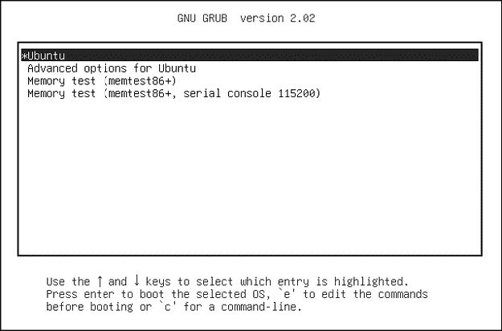
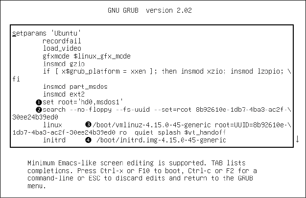

# 第五章：Linux 内核如何引导


你现在了解了 Linux 系统的物理和逻辑结构，了解了内核是什么以及如何处理进程。本章将教你内核是如何启动的，或者说是如何**引导**的。换句话说，你将学习内核如何进入内存，并且它在第一个用户进程启动之前做了什么。

引导过程的简化视图如下所示：

1.  机器的 BIOS 或引导固件加载并运行引导加载程序。

1.  引导加载程序找到磁盘上的内核镜像，加载到内存中并启动它。

1.  内核初始化设备及其驱动程序。

1.  内核挂载根文件系统。

1.  内核启动一个名为 *init* 的程序，进程 ID 为 1。这个点就是 *用户空间启动*。

1.  init 启动其余系统进程。

1.  在某个时刻，init 启动一个进程，允许你登录，通常是在引导过程的末尾或接近末尾时。

本章介绍了引导过程的前几个阶段，重点讲解引导加载程序和内核。第六章继续讲解用户空间的启动，详细介绍了 *systemd*，这是 Linux 系统上最广泛使用的 init 版本。

能够识别引导过程的每个阶段，对解决引导问题和理解系统整体结构是非常宝贵的。然而，许多 Linux 发行版的默认行为常常使得在引导过程中难以甚至无法识别最初的几个引导阶段，因此你可能只能在它们完成并且你登录后才能清楚看到。

## 5.1 启动消息

传统的 Unix 系统在引导时会产生许多诊断消息，告诉你引导过程的情况。这些消息首先来自内核，然后来自 init 启动的进程和初始化程序。然而，这些消息既不美观也不一致，在某些情况下甚至不太有用。此外，硬件的改进使得内核启动比以前更快；消息快速闪过，可能让你很难看清发生了什么。因此，大多数当前的 Linux 发行版都会尽量隐藏引导诊断信息，通过启动画面和其他形式的填充来分散你的注意力。

查看内核引导和运行时诊断信息的最佳方式是通过 `journalctl` 命令检索内核的日志。运行 `journalctl -k` 可以显示当前引导的消息，但你也可以使用 `-b` 选项查看以前的引导。我们将在第七章详细介绍日志。

如果你没有 systemd，你可以检查类似 */var/log/kern.log* 的日志文件，或者运行 `dmesg` 命令查看 *内核环形缓冲区* 中的消息。

这是你可以从 `journalctl -k` 命令中看到的一个示例：

```
microcode: microcode updated early to revision 0xd6, date = 2019-10-03
Linux version 4.15.0-112-generic (buildd@lcy01-amd64-027) (gcc version 7.5.0 (Ubuntu 7.5.0-3ubuntu1~18.04)) #113-Ubuntu SMP Thu Jul 9 23:41:39 UTC 2020 (Ubuntu 4.15.0-112.113-generic 4.15.18)
Command line: BOOT_IMAGE=/boot/vmlinuz-4.15.0-112-generic root=UUID=17f12d53-c3d7-4ab3-943e-a0a72366c9fa ro quiet splash vt.handoff=1
KERNEL supported cpus:
--`snip`--
scsi 2:0:0:0: Direct-Access     ATA      KINGSTON SM2280S 01.R PQ: 0 ANSI: 5
sd 2:0:0:0: Attached scsi generic sg0 type 0
sd 2:0:0:0: [sda] 468862128 512-byte logical blocks: (240 GB/224 GiB)
sd 2:0:0:0: [sda] Write Protect is off
sd 2:0:0:0: [sda] Mode Sense: 00 3a 00 00
sd 2:0:0:0: [sda] Write cache: enabled, read cache: enabled, doesn't support DPO or FUA
 sda: sda1 sda2 < sda5 >
sd 2:0:0:0: [sda] Attached SCSI disk
--`snip`--
```

在内核启动后，用户空间启动过程通常会生成一些消息。由于在大多数系统上你不会在单一的日志文件中找到这些消息，它们可能更难查看和回顾。启动脚本被设计为将消息发送到控制台，消息会在引导过程完成后被清除。然而，这在 Linux 系统上并不是问题，因为 systemd 会捕获启动和运行时的诊断消息，这些消息通常会发送到控制台。

## 5.2 内核初始化和启动选项

在启动时，Linux 内核按照以下一般顺序初始化：

1.  CPU 检查

1.  内存检查

1.  设备总线发现

1.  设备发现

1.  辅助内核子系统设置（如网络）

1.  根文件系统挂载

1.  用户空间启动

前两个步骤并不特别引人注目，但当内核处理设备时，就会出现依赖性的问题。例如，磁盘设备驱动程序可能依赖于总线支持和 SCSI 子系统支持，正如你在第三章中看到的那样。然后，在初始化过程的后期，内核必须挂载根文件系统，然后才能启动 init。

一般来说，你不需要担心依赖关系，除了某些必要的组件可能是可加载的内核模块，而不是主内核的一部分。一些机器可能需要在真正的根文件系统挂载之前加载这些内核模块。我们将在第 6.7 节中讨论这个问题及其初始 RAM 文件系统（initrd）解决方法。

内核发出某些类型的消息，表示它准备开始启动第一个用户进程：

```
Freeing unused kernel memory: 2408K
Write protecting the kernel read-only data: 20480k
Freeing unused kernel memory: 2008K
Freeing unused kernel memory: 1892K
```

在这里，内核不仅清理了一些未使用的内存，还保护了自己的数据。然后，如果你运行的是较新的内核，你将看到内核启动第一个用户空间进程——init：

```
Run /init as init process
   with arguments:
    --`snip`--
```

稍后，你应该能够看到根文件系统被挂载，并且 systemd 开始启动，将一些自己的消息发送到内核日志：

```
EXT4-fs (sda1): mounted filesystem with ordered data mode. Opts: (null)
systemd[1]: systemd 237 running in system mode. (+PAM +AUDIT +SELINUX +IMA +APPARMOR +SMACK +SYSVINIT +UTMP +LIBCRYPTSETUP +GCRYPT +GNUTLS +ACL +XZ +LZ4 +SECCOMP +BLKID +ELFUTILS +KMOD -IDN2 +IDN -PCRE2 default-hierarchy=hybrid)
systemd[1]: Detected architecture x86-64.
systemd[1]: Set hostname to <duplex>.
```

此时，你肯定知道用户空间已经启动。

## 5.3 内核参数

当 Linux 内核启动时，它会接收到一组基于文本的*内核参数*，其中包含一些额外的系统详细信息。这些参数指定了许多不同类型的行为，例如内核应该生成的诊断输出量和设备驱动程序特定的选项。

你可以通过查看*/proc/cmdline*文件来查看传递给当前运行内核的参数：

```
$ **cat /proc/cmdline**
BOOT_IMAGE=/boot/vmlinuz-4.15.0-43-generic root=UUID=17f12d53-c3d7-4ab3-943e-a0a72366c9fa ro quiet splash vt.handoff=1
```

这些参数可以是简单的单词标志，如`ro`和`quiet`，也可以是`key``=``value`对，如`vt.handoff=1`。许多参数并不重要，例如用于显示启动画面的`splash`标志，但一个关键的参数是`root`参数。这个参数是根文件系统的位置；没有它，内核无法正确执行用户空间启动。

根文件系统可以指定为设备文件，如下例所示：

```
root=/dev/sda1
```

在大多数现代系统中，有两种更常见的选择。首先，你可能会看到一个逻辑卷，像这样：

```
root=/dev/mapper/my-system-root
```

你也可能会看到一个 UUID（请参见第 4.2.4 节）：

```
root=UUID=17f12d53-c3d7-4ab3-943e-a0a72366c9fa
```

这两者都是首选，因为它们不依赖于特定的内核设备映射。

`ro`参数指示内核在用户空间启动时以只读模式挂载根文件系统。这是正常的；只读模式确保在执行任何重要操作之前，`fsck`可以安全地检查根文件系统。检查之后，启动过程会将根文件系统重新挂载为读写模式。

当遇到它不理解的参数时，Linux 内核会保存该参数。内核稍后会在执行用户空间启动时将该参数传递给 init。例如，如果你将`-s`添加到内核参数中，内核会将`-s`传递给 init 程序，表示它应该以单用户模式启动。

如果你对基本的引导参数感兴趣，可以查看 bootparam(7)手册页，它提供了概述。如果你在寻找非常具体的信息，可以查看*kernel-params.txt*，这是一个随 Linux 内核一起提供的参考文件。

在掌握了这些基础知识后，你可以跳到第六章，学习用户空间启动、初始 RAM 磁盘以及内核作为第一个进程运行的初始化程序的具体内容。本章的其余部分详细介绍了内核如何加载到内存并启动，包括它如何获取参数。

## 5.4 引导加载程序

在启动过程中，内核和初始化程序启动之前，*引导加载程序*会启动内核。引导加载程序的工作听起来很简单：它从磁盘的某个位置将内核加载到内存中，然后用一组内核参数启动内核。然而，这项工作比看起来复杂。为了理解为什么，考虑引导加载程序必须回答的问题：

+   内核在哪里？

+   启动时应传递给内核哪些内核参数？

答案通常是：内核及其参数通常位于根文件系统的某个位置。听起来内核参数应该很容易找到，但请记住，内核本身还没有启动，通常是内核遍历文件系统来查找必要的文件。更糟糕的是，通常用于访问磁盘的内核设备驱动程序也不可用。可以将其看作是一种“先有鸡还是先有蛋”的问题。情况可能比这更复杂，但现在，我们来看看引导加载程序如何克服驱动程序和文件系统的障碍。

引导加载器确实需要一个驱动程序来访问磁盘，但它并不是内核使用的那个驱动程序。在 PC 上，引导加载器使用传统的*基本输入输出系统（BIOS）*或较新的*统一可扩展固件接口（UEFI）*来访问磁盘。（*可扩展固件接口*，或*EFI*，以及 UEFI 将在第 5.8.2 节中详细讨论。）当代磁盘硬件包括固件，允许 BIOS 或 UEFI 通过*逻辑块寻址（LBA）*访问附加的存储硬件。LBA 是一种通用的、简单的方式来访问任何磁盘上的数据，但其性能较差。然而，这不是问题，因为引导加载器通常是唯一必须使用这种模式来访问磁盘的程序；一旦启动，内核就可以访问其自己的高性能驱动程序。

一旦解决了对磁盘原始数据的访问问题，引导加载器必须完成在文件系统中定位所需数据的工作。大多数常见的引导加载器可以读取分区表，并且内置支持只读访问文件系统。因此，它们可以找到并读取它们需要的文件，将内核加载到内存中。这种能力使得动态配置和增强引导加载器变得更加容易。Linux 引导加载器并不总是具备这种能力；没有它，配置引导加载器会更加困难。

总体来说，内核添加新特性（尤其是在存储技术方面）后，引导加载器会增加这些特性的独立简化版本，以作补充。

### 5.4.1 引导加载器任务

Linux 引导加载器的核心功能包括以下几项：

+   从多个内核中进行选择。

+   在内核参数集之间切换。

+   允许用户手动覆盖并编辑内核镜像名称和参数（例如，进入单用户模式）。

+   提供对启动其他操作系统的支持。

自 Linux 内核诞生以来，引导加载器已经变得相当先进，拥有命令行历史记录和菜单系统等功能，但其基本需求始终是灵活选择内核镜像和参数。（一个令人惊讶的现象是，一些需求实际上已经减少。例如，由于你可以从 USB 存储设备进行紧急或恢复启动，你几乎不需要担心手动输入内核参数或进入单用户模式。）当前的引导加载器比以往更强大，特别是在构建自定义内核或只是想调整参数时，它们非常方便。

### 5.4.2 引导加载器概述

以下是你可能遇到的主要引导加载器：

1.  **GRUB** 在 Linux 系统中几乎是通用标准，具有 BIOS/MBR 和 UEFI 版本。

1.  **LILO** 最早的 Linux 引导加载器之一。ELILO 是其 UEFI 版本。

1.  **SYSLINUX** 可以配置为从多种不同的文件系统中运行。

1.  **LOADLIN** 从 MS-DOS 启动内核。

1.  **systemd-boot** 一个简单的 UEFI 引导管理器。

1.  **coreboot**（前身为 LinuxBIOS） 一种高性能的 PC BIOS 替代品，可以包含内核。

1.  **Linux 内核 EFISTUB** 一个用于直接从 EFI/UEFI 系统分区（ESP）加载内核的内核插件。

1.  **efilinux** 一个 UEFI 引导加载程序，旨在作为其他 UEFI 引导加载程序的模型和参考。

本书几乎完全讨论 GRUB。使用其他引导加载程序的理由是它们比 GRUB 更容易配置，它们的速度更快，或者它们提供其他特定功能。

你可以通过进入一个引导提示符，输入内核名称和参数，从而了解很多关于引导加载程序的信息。要做到这一点，你需要知道如何进入引导提示符或菜单。不幸的是，这有时可能很难弄清楚，因为 Linux 发行版会对引导加载程序的行为和外观进行高度自定义。通常，仅通过观看引导过程无法判断发行版使用的是哪种引导加载程序。

接下来的章节将告诉你如何进入引导提示符，以便输入内核名称和参数。一旦你熟悉了这一点，你将看到如何配置和安装引导加载程序。

## 5.5 GRUB 介绍

GRUB 代表*Grand Unified Boot Loader*。我们将介绍 GRUB 2，但也有一个叫做 GRUB Legacy 的旧版本，目前已不再使用。

GRUB 最重要的功能之一是文件系统导航，它允许轻松选择内核镜像和配置。了解 GRUB 的一种最佳方式是查看它的菜单。这个界面易于导航，但你很可能从未见过它。

要访问 GRUB 菜单，请在 BIOS 启动屏幕首次出现时按住 shift 键，或如果你的系统使用 UEFI 则按 esc 键。否则，在加载内核之前，引导加载程序配置可能不会暂停。图 5-1 显示了 GRUB 菜单。



图 5-1：GRUB 菜单

尝试以下操作以探索引导加载程序：

1.  重启或开机你的 Linux 系统。

1.  在 BIOS 自检期间按住 shift 键，或在固件启动画面按 esc 键以进入 GRUB 菜单。（有时这些画面不可见，因此你必须猜测何时按下按钮。）

1.  按 e 键查看默认引导选项的引导加载程序配置命令。你应该看到类似图 5-2 的内容（你可能需要向下滚动才能看到所有细节）。

    图 5-2：GRUB 配置编辑器

该屏幕告诉我们，对于此配置，根目录是通过 UUID 设置的，内核镜像是*/boot/vmlinuz-4.15.0-45-generic*，内核参数包括 `ro`、`quiet` 和 `splash`。初始 RAM 文件系统是*/boot/initrd.img-4.15.0-45-generic*。但如果你以前从未见过这种配置，可能会感到有些困惑。为什么有多个 `root` 的引用，它们为什么不同？为什么这里有 `insmod`？如果你以前见过这些，你可能会记得这是一个 Linux 内核特性，通常由 udevd 运行。

这种反复思考是有原因的，因为 GRUB 并不*使用* Linux 内核（记住，它的工作是*启动*内核）。你看到的配置完全由 GRUB 内部的特性和命令组成，GRUB 存在于它自己的独立世界中。

这种困惑部分来源于 GRUB 借用了来自多个来源的术语。GRUB 有自己的“内核”和 `insmod` 命令来动态加载 GRUB 模块，完全独立于 Linux 内核。许多 GRUB 命令类似于 Unix shell 命令；甚至有一个 `ls` 命令用来列出文件。

到目前为止，最大的困惑来自于 GRUB 对“root”一词的使用。通常，你会将 root 视为系统的根文件系统。在 GRUB 配置中，这是一个内核参数，位于 `linux` 命令的镜像名称之后的某个位置。

配置中每个其他的 `root` 引用都是指 GRUB 根目录，它仅存在于 GRUB 内部。GRUB 的“根目录”是 GRUB 用来搜索内核和 RAM 文件系统镜像文件的文件系统。

在图 5-2 中，GRUB 根目录首先设置为 GRUB 特定设备（`hd0,msdos1`），这是该配置的默认值 1。接下来的命令中，GRUB 会在一个分区中搜索特定的 UUID 2。如果找到了该 UUID，它将把 GRUB 根目录设置为该分区。

总结一下，`linux` 命令的第一个参数（`/boot/vmlinuz-`. . .）是 Linux 内核镜像文件的位置 3。GRUB 从 GRUB 根目录加载此文件。`initrd` 命令类似，指定了用于初始 RAM 文件系统的文件，详细内容在第六章 4 中。

你可以在 GRUB 内编辑此配置；这样做通常是临时修复启动错误的最简单方法。要永久修复启动问题，你需要更改配置（见第 5.5.2 节），但现在，让我们深入一步，使用命令行界面来检查一些 GRUB 内部的内容。

### 5.5.1 使用 GRUB 命令行探索设备和分区

如你在图 5-2 中所见，GRUB 有自己的设备寻址方案。例如，找到的第一个硬盘被命名为 hd0，接着是 hd1，依此类推。设备名称的分配是有可能变化的，但幸运的是，GRUB 可以搜索所有分区的 UUID，找到包含内核的那个分区，就像你刚刚在图 5-2 中看到的那样，使用 `search` 命令。

#### 列出设备

为了了解 GRUB 如何引用系统上的设备，通过在启动菜单或配置编辑器中按 c 进入 GRUB 命令行。你应该会看到 GRUB 提示符：

```
grub>
```

你可以在这里输入你在配置中看到的任何命令，但为了开始，试试一个诊断命令：`ls`。没有参数时，输出将是 GRUB 已知的设备列表：

```
grub> **ls**
(hd0) (hd0,msdos1)
```

在这种情况下，存在一个主要的磁盘设备，表示为 `(hd0)`，以及一个单独的分区 `(hd0,msdos1)`。如果磁盘上有交换分区，它也会显示出来，如 `(hd0,msdos5)`。分区上的 `msdos` 前缀表示该磁盘包含 MBR 分区表；如果是 GPT 分区表，则会以 `gpt` 开头，出现在 UEFI 系统中。（甚至还可以有更深层次的组合，带有第三个标识符，其中 BSD 磁盘标签映射位于分区内部，但通常除非你在一台机器上运行多个操作系统，否则无需担心这个问题。）

要获取更详细的信息，可以使用 `ls -l`。这个命令特别有用，因为它会显示分区文件系统的任何 UUID。例如：

```
grub> **ls -l**
Device hd0: No known filesystem detected – Sector size 512B - Total size 32009856KiB
        Partition hd0,msdos1: Filesystem type ext* – Last modification time
          2019-02-14 19:11:28 Thursday, UUID 8b92610e-1db7-4ba3-ac2f-30ee24b39ed0 - Partition start at 1024Kib - Total size 32008192KiB
```

这个特定的磁盘在第一个 MBR 分区上有一个 Linux ext2/3/4 文件系统。使用交换分区的系统将显示另一个分区，但你无法从输出中看出它的类型。

#### 文件导航

现在让我们来看看 GRUB 的文件系统导航功能。使用 `echo` 命令确定 GRUB 根目录（记得这是 GRUB 期望找到内核的位置）：

```
grub> **echo $root**
hd0,msdos1
```

要使用 GRUB 的 `ls` 命令列出该根目录中的文件和目录，你可以在分区后加上一个斜杠：

```
grub> **ls (hd0,msdos1)/**
```

由于直接输入实际的根分区不方便，你可以用 `root` 变量来节省时间：

```
grub> **ls ($root)/**
```

输出的是该分区文件系统的简短文件和目录列表，如 *etc/*、*bin/* 和 *dev/*。这现在是 GRUB `ls` 命令的一个完全不同的功能。之前，你是在列出设备、分区表，可能还有一些文件系统头信息。现在，你实际上是在查看文件系统的内容。

你可以以类似的方式深入查看分区上的文件和目录。例如，要查看 */boot* 目录，从以下命令开始：

```
grub> **ls ($root)/boot**
```

你还可以通过 `set` 命令查看所有当前设置的 GRUB 变量：

```
grub> **set**
?=0
color_highlight=black/white
color_normal=white/black
--`snip`--
prefix=(hd0,msdos1)/boot/grub
root=hd0,msdos1
```

这些变量中最重要的之一是 `$prefix`，这是 GRUB 期望找到其配置和辅助支持的文件系统和目录。接下来我们将讨论 GRUB 配置。

完成 GRUB 命令行界面后，你可以按 esc 返回 GRUB 菜单。或者，如果你已设置好所有必要的启动配置（包括 `linux` 和可能的 `initrd` 变量），你可以输入 `boot` 命令以启动该配置。无论如何，启动你的系统。我们将探索 GRUB 配置，最好在你能启动完整系统时进行。

### 5.5.2 GRUB 配置

GRUB 配置目录通常是 */boot/grub* 或 */boot/grub2*。它包含中央配置文件 *grub.cfg*，一个特定架构的目录（如 *i386-pc*），该目录包含带有 *.mod* 后缀的可加载模块，还有一些其他项目，如字体和本地化信息。我们不会直接修改 *grub.cfg*；相反，我们将使用 `grub-mkconfig` 命令（在 Fedora 中为 `grub2-mkconfig`）。

#### 审查 grub.cfg

首先，快速查看 *grub.cfg*，了解 GRUB 是如何初始化其菜单和内核选项的。你会看到该文件由 GRUB 命令组成，通常以一系列初始化步骤开始，接着是不同内核和启动配置的菜单项。初始化部分并不复杂，但开始部分有很多条件语句，可能会让你误以为这很复杂。第一部分只是由一堆函数定义、默认值和视频设置命令组成，例如：

```
if loadfont $font ; then
  set gfxmode=auto
  load_video
  insmod gfxterm
  --`snip`--
```

在配置文件的后面，你会找到可用的启动配置，每个配置都以 `menuentry` 命令开头。你应该能够根据前面部分学到的内容，理解这个示例：

```
menuentry 'Ubuntu' --class ubuntu --class gnu-linux --class gnu --class os $menuentry_id_option 'gnulinux-simple-8b92610e-1db7-4ba3-ac2f-30ee24b39ed0' {
        recordfail
        load_video
        gfxmode $linux_gfx_mode
        insmod gzio
        if [ x$grub_platform = xxen ]; then insmod xzio; insmod lzopio; fi
        insmod part_msdos
        insmod ext2
        set root='hd0,msdos1'
        search --no-floppy --fs-uuid --set=root 8b92610e-1db7-4ba3-ac2f-30ee24b39ed0
        linux   /boot/vmlinuz-4.15.0-45-generic root=UUID=8b92610e-1db7-4ba3-ac2f-30ee24b39ed0 ro quiet splash $vt_handoff
        initrd  /boot/initrd.img-4.15.0-45-generic
}
```

检查你的 *grub.cfg* 文件，查找包含多个 `menuentry` 命令的 `submenu` 命令。许多发行版使用 `submenu` 命令来管理旧版本的内核，以避免它们挤占 GRUB 菜单。

#### 生成新配置文件

如果你想更改 GRUB 配置，不要直接编辑 *grub.cfg* 文件，因为它是自动生成的，并且系统会定期覆盖它。你应该在其他地方设置新的配置，然后运行 `grub-mkconfig` 以生成新的配置。

要了解配置生成是如何工作的，可以查看 *grub.cfg* 的开头部分。应该有这样的注释行：

```
### BEGIN /etc/grub.d/00_header ###
```

经过进一步检查，你会发现 */etc/grub.d* 中几乎每个文件都是一个 shell 脚本，用于生成 *grub.cfg* 文件的一部分。`grub-mkconfig` 命令本身就是一个 shell 脚本，它会执行 */etc/grub.d* 中的所有内容。请记住，GRUB 本身不会在启动时运行这些脚本；我们在用户空间运行这些脚本，以生成 GRUB 运行的 *grub.cfg* 文件。

尝试以 root 身份自己操作。不要担心覆盖当前配置。此命令本身只是将配置打印到标准输出。

```
# grub-mkconfig
```

如果你想向 GRUB 配置中添加菜单项和其他命令该怎么办？简短的回答是，你应该将自定义内容放入 GRUB 配置目录中的一个新的 *custom.cfg* 文件中（通常是 */boot/grub/custom.cfg*）。

长答案稍微复杂一些。*/etc/grub.d* 配置目录为您提供了两个选项：*40_custom* 和 *41_custom*。第一个，*40_custom*，是一个您可以自己编辑的脚本，但它的稳定性最差；软件包升级可能会破坏您所做的任何更改。*41_custom* 脚本较为简单；它只是一系列命令，在 GRUB 启动时加载 *custom.cfg*。如果选择第二个选项，您的更改在生成配置文件时不会显示，因为 GRUB 在启动时会完成所有工作。

自定义配置文件的两个选项并不是特别广泛，而且没有什么能阻止您添加自己的脚本来生成配置数据。您可能会在 */etc/grub.d* 目录中看到一些特定于您特定发行版的附加内容。例如，Ubuntu 会将内存测试引导选项（`memtest86+`）添加到配置中。

要写入并安装新生成的 GRUB 配置文件，您可以使用 `-o` 选项将配置写入 GRUB 目录，像这样使用 `grub-mkconfig`：

```
# grub-mkconfig -o /boot/grub/grub.cfg
```

和往常一样，备份您的旧配置并确保您正在安装到正确的目录。

现在我们将深入讨论一些更技术性的 GRUB 和引导加载程序的细节。如果您厌倦了听引导加载程序和内核的内容，可以跳到第六章。

### 5.5.3 GRUB 安装

安装 GRUB 比配置它要复杂一些。幸运的是，通常您无需担心安装，因为您的发行版应该会为您处理它。然而，如果您试图复制或恢复一个可启动磁盘，或者准备自己的引导顺序，您可能需要自行安装。

在继续之前，阅读第 5.4 节，了解 PC 如何启动，并确定您是使用 MBR 还是 UEFI 启动。接下来，构建 GRUB 软件集并确定您的 GRUB 目录将在哪里；默认情况下是 */boot/grub*。如果您的发行版为您处理了 GRUB，您可能不需要构建它，但如果需要，请参阅第十六章了解如何从源代码构建软件。确保构建正确的目标：MBR 或 UEFI 启动有所不同（32 位和 64 位 EFI 之间甚至存在差异）。

#### 在您的系统上安装 GRUB

安装引导加载程序需要您或安装程序确定以下内容：

+   当前运行系统所看到的目标 GRUB 目录。如前所述，通常是 */boot/grub*，但如果您正在将 GRUB 安装到另一个磁盘以供其他系统使用，它可能会有所不同。

+   GRUB 目标磁盘的当前设备。

+   对于 UEFI 启动，当前的 EFI 系统分区挂载点（通常是 */boot/efi*）。

记住，GRUB 是一个模块化系统，但为了加载模块，它必须读取包含 GRUB 目录的文件系统。你的任务是构建一个能够读取该文件系统的 GRUB 版本，以便它能够加载其余的配置文件 (*grub.cfg*) 和所需的模块。在 Linux 上，这通常意味着构建一个预加载了 *ext2.mod* 模块（可能还包括 *lvm.mod*）的 GRUB 版本。一旦你有了这个版本，你所需要做的就是将其放置在可启动的磁盘部分，并将其余所需的文件放入 */boot/grub* 中。

幸运的是，GRUB 提供了一个名为 `grub-install` 的工具（不要与某些旧系统中可能找到的 `install-grub` 混淆），该工具可以为你完成大部分安装 GRUB 文件和配置的工作。例如，如果你当前的磁盘是 */dev/sda*，并且你想在该磁盘的 MBR 上安装 GRUB，并使用当前的 */boot/grub* 目录，可以使用以下命令：

```
# grub-install /dev/sda
```

#### 在外部存储设备上使用 MBR 安装 GRUB

要在当前系统之外的存储设备上安装 GRUB，你必须手动指定该设备上的 GRUB 目录，因为你当前的系统会看到这个设备的目录。例如，假设你有一个目标设备 */dev/sdc*，并且该设备的根文件系统包含 */boot*（例如，*/dev/sdc1*）已挂载在当前系统的 */mnt* 上。这意味着当你安装 GRUB 时，当前系统将会看到 */mnt/boot/grub* 中的 GRUB 文件。在运行 `grub-install` 时，告诉它这些文件应该放置的位置，如下所示：

```
# grub-install --boot-directory=/mnt/boot /dev/sdc
```

在大多数 MBR 系统中，*/boot* 是根文件系统的一部分，但一些安装将 */boot* 放置在单独的文件系统中。确保你知道目标 */boot* 所在的位置。

#### 使用 UEFI 安装 GRUB

UEFI 安装应该更简单，因为你所需要做的只是将引导加载程序复制到指定位置。但你还需要通过 `efibootmgr` 命令“公告”引导加载程序给固件，也就是将加载程序配置保存到 NVRAM 中。如果 `grub-install` 命令可用，它会自动运行此操作，因此通常你可以像这样在 UEFI 系统上安装 GRUB：

```
# grub-install --efi-directory=`efi_dir` –-bootloader-id=`name`
```

在这里，`efi_dir` 是当前系统中 UEFI 目录所在的位置（通常是 */boot/efi/EFI*，因为 UEFI 分区通常挂载在 */boot/efi*），而 `name` 是引导加载程序的标识符。

不幸的是，在安装 UEFI 引导加载程序时可能会遇到很多问题。例如，如果你要安装到最终会进入另一个系统的磁盘，你必须弄清楚如何将该引导加载程序公告给新系统的固件。而且，针对可移动媒体的安装过程也存在差异。

但其中一个最大的问题是 UEFI 安全启动。

## 5.6 UEFI 安全启动问题

一个影响 Linux 安装的较新问题是处理最近 PC 中发现的*安全启动*功能。当启用时，此 UEFI 机制要求任何启动加载器必须由受信任的机构进行数字签名才能运行。微软要求硬件供应商在提供 Windows 8 及以后版本的系统时，必须使用安全启动。结果是，如果你试图在这些系统上安装未签名的启动加载器，固件会拒绝该加载器，操作系统将无法启动。

主要的 Linux 发行版在安全启动方面没有问题，因为它们包含已签名的启动加载器，通常是基于 UEFI 版本的 GRUB。通常会有一个小的已签名的 shim，它位于 UEFI 和 GRUB 之间；UEFI 运行 shim，shim 再执行 GRUB。如果你的计算机不在可信环境中，或者需要满足某些安全要求，保护防止启动未经授权的软件是一个重要功能，因此一些发行版更进一步，要求整个启动过程（包括内核）都必须被签名。

安全启动系统有一些缺点，特别是对于那些尝试构建自己启动加载器的人来说。你可以通过在 UEFI 设置中禁用它来绕过安全启动要求。然而，这对于双启动系统来说无法干净地工作，因为 Windows 在未启用安全启动的情况下无法运行。

## 5.7 链式引导其他操作系统

UEFI 使得支持加载其他操作系统相对容易，因为你可以在 EFI 分区中安装多个启动加载器。然而，较旧的 MBR 风格不支持此功能，即使你拥有 UEFI，你可能仍然会有一个带 MBR 风格启动加载器的单独分区，你可能希望使用它。GRUB 可以加载并在磁盘的特定分区上运行不同的启动加载器，而不是配置和运行 Linux 内核；这就是所谓的*链式引导*。

要进行链式引导，请在 GRUB 配置中创建一个新的菜单项（使用“生成新配置文件”部分中描述的方法之一）。以下是一个关于在磁盘第三分区上安装 Windows 的示例：

```
menuentry "Windows" {
	insmod chain
	insmod ntfs
	set root=(hd0,3)
	chainloader +1
}
```

`+1`选项告诉`chainloader`加载分区的第一个扇区中的内容。你还可以通过使用类似的命令直接加载一个文件，例如加载*io.sys* MS-DOS 加载器：

```
menuentry "DOS" {
	insmod chain
	insmod fat
	set root=(hd0,3)
	chainloader /io.sys
}
```

## 5.8 启动加载器详细信息

现在我们快速看一下启动加载器的内部工作原理。为了理解像 GRUB 这样的启动加载器是如何工作的，我们首先来了解一下当你打开 PC 时它是如何启动的。由于必须解决传统 PC 启动机制的许多不足，启动加载方案有几种变化，但主要有两种：MBR 和 UEFI。

### 5.8.1 MBR 启动

除了第 4.1 节中描述的分区信息外，MBR 还包括一个 441 字节的小区域，PC BIOS 会在自检（POST）后加载并执行该区域的内容。不幸的是，这个空间不足以容纳几乎任何引导加载程序，因此需要额外的空间，这就导致了有时被称为 *多阶段引导加载程序* 的情况。在这种情况下，MBR 中的初始代码除了加载其余的引导加载程序代码外不做任何事情。引导加载程序的其余部分通常会被塞入 MBR 和磁盘上第一个分区之间的空间中。这并不特别安全，因为任何东西都可以覆盖那里存放的代码，但大多数引导加载程序都这么做，包括大多数 GRUB 安装。

在使用 BIOS 启动的 GPT 分区磁盘上，传统的将引导加载程序代码放在 MBR 之后的方式不起作用，因为 GPT 信息位于 MBR 后面的区域。（GPT 为了向后兼容，保留了传统的 MBR。）GPT 的解决方法是创建一个名为 *BIOS 启动分区* 的小分区，使用特殊的 UUID（`21686148-6449-6E6F-744E-656564454649`）为完整的引导加载程序代码提供一个存放位置。然而，这并不是一种常见配置，因为 GPT 通常与 UEFI 一起使用，而不是传统的 BIOS。它通常只出现在具有非常大磁盘（大于 2TB）的旧系统中，这些磁盘太大，无法使用 MBR。

### 5.8.2 UEFI 启动

PC 制造商和软件公司意识到传统的 PC BIOS 存在严重的局限性，因此他们决定开发一个替代方案，称为可扩展固件接口（EFI），我们在本章的多个地方已经简要讨论过 EFI。虽然 EFI 花了一些时间才在大多数 PC 上得到普及，但如今它已经成为最常见的标准，尤其是在微软要求 Windows 启用安全启动之后。目前的标准是统一 EFI（UEFI），它包括内置 shell、读取分区表和浏览文件系统的能力等功能。GPT 分区方案是 UEFI 标准的一部分。

在 UEFI 系统上，启动过程与 MBR 系统截然不同。大多数情况下，它更容易理解。与其将可执行的引导代码存放在文件系统之外，UEFI 系统总是有一个名为 EFI 系统分区（ESP）的特殊 VFAT 文件系统，该分区包含一个名为 *EFI* 的目录。ESP 通常挂载在你的 Linux 系统的 */boot/efi* 目录下，因此你很可能会在 */boot/efi/EFI* 开始找到大部分 EFI 目录结构。每个引导加载程序都有自己的标识符和相应的子目录，例如 *efi/microsoft*、*efi/apple*、*efi/ubuntu* 或 *efi/grub*。引导加载程序文件具有 *.efi* 扩展名，并位于这些子目录中，与其他支持文件一起。如果你进行探索，可能会发现一些文件，比如 *grubx64.efi*（GRUB 的 EFI 版本）和 *shimx64.efi*。

但是有一个问题：你不能直接把旧的引导加载程序代码放入 ESP 中，因为旧的代码是为 BIOS 接口编写的。相反，你必须提供一个为 UEFI 编写的引导加载程序。例如，使用 GRUB 时，你必须安装 UEFI 版本的 GRUB，而不是 BIOS 版本。而且，正如在《使用 UEFI 安装 GRUB》中解释的那样，你必须将新的引导加载程序宣布给固件。

最后，正如第 5.6 节所述，我们必须应对“安全引导”问题。

### 5.8.3 GRUB 的工作原理

让我们通过看看 GRUB 是如何工作的来总结我们的讨论：

1.  PC BIOS 或固件初始化硬件，并搜索其引导顺序存储设备中的引导代码。

1.  在找到引导代码后，BIOS/固件加载并执行它。这是 GRUB 开始的地方。

1.  GRUB 核心加载。

1.  核心初始化。此时，GRUB 现在可以访问磁盘和文件系统。

1.  GRUB 识别其引导分区并加载配置。

1.  GRUB 给用户一个机会来更改配置。

1.  在超时或用户操作后，GRUB 执行配置（即*grub.cfg*文件中的命令序列，如第 5.5.2 节所述）。

1.  在执行配置的过程中，GRUB 可能会加载额外的代码（模块）到引导分区。一些模块可能是预加载的。

1.  GRUB 执行`boot`命令来加载并执行配置中的`linux`命令所指定的内核。

此序列中的第 3 步和第 4 步，在 GRUB 核心加载时，可能会因传统 PC 引导机制的不足而变得复杂。最大的问题是“GRUB 核心*在哪里*？”有三种基本可能性：

+   部分被填充在 MBR 和第一个分区的开始之间

+   在常规分区中

+   在一个特殊的引导分区中：一个 GPT 引导分区、ESP 或其他地方

除非你有 UEFI/ESP，否则 PC BIOS 从 MBR 加载 512 字节的数据，这就是 GRUB 开始的地方。这一小段（源自 GRUB 目录中的*boot.img*）还不是核心，但它包含了核心的起始位置，并从这里加载核心。

然而，如果你有 ESP，GRUB 核心作为文件存在于那里。固件可以浏览 ESP 并直接执行存放在其中的所有 GRUB 或其他操作系统引导加载程序。（你可能会在 ESP 中有一个 shim，位于 GRUB 之前，用来处理安全引导问题，但基本思想是相同的。）

然而，在大多数系统中，这还不是完整的图景。引导加载程序可能还需要在加载并执行内核之前，将初始 RAM 文件系统镜像加载到内存中。这就是`initrd`配置参数的作用，我们将在第 6.7 节中详细介绍。但在了解初始 RAM 文件系统之前，你应该先了解用户空间启动——这正是下一章的内容。
