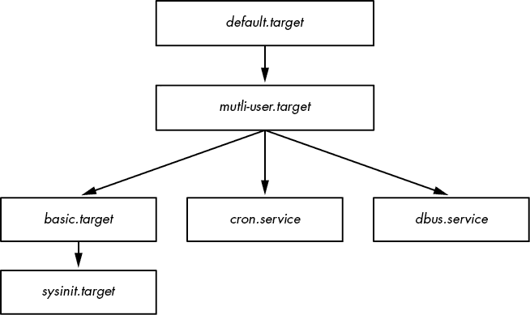
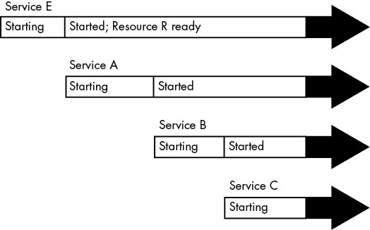
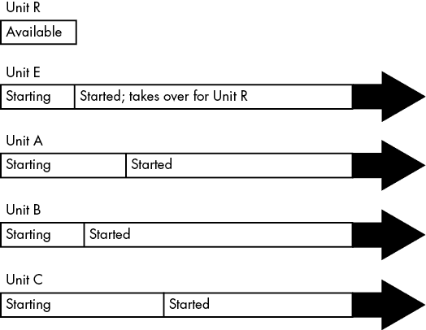

# 第六章：用户空间如何启动


内核启动 init，即它的第一个用户空间进程，具有重要意义——不仅仅是因为内存和 CPU 终于准备好进行正常的系统操作，而且因为在这个时候，你可以看到系统其余部分是如何整体构建起来的。在此之前，内核遵循由少数软件开发人员定义的严格执行路径。用户空间则更加模块化和可定制，也很容易看到用户空间启动和操作的内容。如果你有点冒险精神，你可以利用这一点，因为理解和更改用户空间的启动并不需要低级编程知识。

用户空间大致按以下顺序启动：

1.  init

1.  基本低层服务，如 udevd 和 syslogd

1.  网络配置

1.  中高层服务（cron、打印等）

1.  登录提示、GUI 和高层应用程序，如 Web 服务器

## 6.1 init 简介

*init*是一个用户空间程序，就像 Linux 系统上的其他程序一样，你可以在*/sbin*目录下找到它，以及其他许多系统二进制文件。它的主要作用是启动和停止系统上的基本服务进程。

在当前所有主要 Linux 发行版的版本中，init 的标准实现是 systemd。本章将重点介绍 systemd 是如何工作的，以及如何与之交互。

你可能会在旧系统上遇到两种其他版本的 init。System V init 是传统的顺序化 init（Sys V，通常发音为“sys-five”，起源于 Unix System V），在 Red Hat Enterprise Linux（RHEL）7.0 版本之前和 Debian 8 中使用。Upstart 是 Ubuntu 发行版 15.04 版本之前的 init。

还存在其他版本的 init，尤其是在嵌入式平台上。例如，Android 有自己的 init 版本，名为*runit*的版本在轻量级系统中很受欢迎。BSD 系统也有自己版本的 init，但你不太可能在当代 Linux 机器上看到它们。（一些发行版也修改了 System V init 配置，使其类似于 BSD 风格。）

为了解决 System V init 中的若干缺点，开发了不同实现的 init。为了理解这些问题，可以考虑传统 init 的内部工作原理。它基本上是一系列的脚本，init 按顺序逐一执行每个脚本。每个脚本通常启动一个服务或配置系统的某个部分。在大多数情况下，解决依赖关系相对容易，而且通过修改脚本，具有相当大的灵活性来适应特殊的启动需求。

然而，这种方案存在一些显著的局限性。这些问题可以分为“性能问题”和“系统管理麻烦”两大类。最重要的包括以下几点：

+   性能受到影响，因为引导序列的两个部分通常不能同时运行。

+   管理一个正在运行的系统可能会很困难。启动脚本需要启动服务守护进程。要找到服务守护进程的 PID，你需要使用`ps`，或者某些特定于该服务的机制，或者使用半标准化的 PID 记录系统，如*/var/run/myservice.pid*。

+   启动脚本往往包含大量标准的“模板”代码，有时使得它们的阅读和理解变得困难。

+   对于大多数系统来说，服务和配置的按需加载并不常见。大多数服务在启动时启动；系统配置通常也在此时设定。曾几何时，传统的 inetd 守护进程能够处理按需网络服务，但它已大多不再使用。

当代的 init 系统通过改变服务的启动方式、监督方式以及依赖项的配置方式来解决这些问题。你很快就会看到在 systemd 中是如何实现的，但首先，你应该确保你的系统正在运行 systemd。

## 6.2 确认你的 init

确定系统的 init 版本通常不难。查看 init(1)手册页通常会立刻告诉你，但如果你不确定，可以按如下方法检查你的系统：

+   如果你的系统有*/usr/lib/systemd*和*/etc/systemd*目录，那么你正在使用 systemd。

+   如果你有一个包含多个*.conf*文件的*/etc/init*目录，你可能正在运行 Upstart（除非你正在运行 Debian 7 或更早版本，在这种情况下你可能使用的是 System V init）。本书不会讨论 Upstart，因为它已经被 systemd 广泛取代。

+   如果上述两种情况都不成立，但你有一个*/etc/inittab*文件，那么你可能正在运行 System V init。请参见第 6.5 节。

## 6.3 systemd

systemd init 是 Linux 上最新的 init 实现之一。除了处理常规的启动过程外，systemd 还旨在集成许多标准 Unix 服务的功能，如 cron 和 inetd。它也受到 Apple 的 launchd 的启发。

systemd 相较于其前辈真正脱颖而出的是其先进的服务管理能力。与传统的 init 不同，systemd 在服务启动后能够追踪单个服务守护进程，并将与服务相关的多个进程组合在一起，这使你可以更好地掌握并洞察系统中到底有什么正在运行。

systemd 是目标导向的。在最高层级，你可以将定义一个系统任务的目标称为一个*单元*（unit）。一个单元可以包含常见启动任务的指令，例如启动一个守护进程，它也有依赖项，即其他单元。在启动（或*激活*）一个单元时，systemd 会尝试激活其依赖项，然后继续执行单元的详细内容。

启动服务时，systemd 并不遵循严格的顺序；相反，它会在服务准备好时激活它们。系统启动后，systemd 可以通过响应系统事件（例如第三章中列出的 uevents）来激活其他单元。

我们从一个顶层视图开始，了解单元、激活以及初始启动过程。然后你将准备好查看单元配置的具体细节以及各种单元依赖关系。在这个过程中，你将掌握如何查看和控制正在运行的系统。

### 6.3.1 单元和单元类型

systemd 比之前版本的 init 更为雄心勃勃的一个方面是，它不仅仅管理进程和服务；它还可以管理文件系统挂载、监控网络连接请求、运行定时器等。每个功能被称为*单元类型*，每个具体的功能（如服务）被称为*单元*。当你启动一个单元时，你是在*激活*它。每个单元都有自己的配置文件；我们将在 6.3.3 节中探讨这些文件。

这些是执行典型 Linux 系统启动任务的最重要单元类型：

1.  服务单元控制 Unix 系统中的服务守护进程。

1.  目标单元控制其他单元，通常通过将它们分组来实现。

1.  套接字单元表示传入的网络连接请求位置。

1.  挂载单元表示文件系统与系统的连接。

在这些单位中，服务单元和目标单元是最常见且最容易理解的。我们来看一下它们在系统启动时是如何相互配合的。

### 6.3.2 启动与单元依赖图

当你启动系统时，你激活的是一个默认单元，通常是一个目标单元，称为*default.target*，它将多个服务单元和挂载单元作为依赖项进行分组。因此，了解启动时发生的事情就显得相对容易。你可能会期望单元依赖关系形成一棵树——树顶有一个单元，下面分支出多个单元，用于启动过程的后续阶段——但实际上，它们形成了一个图。启动过程后期的单元可能依赖于前面几个单元，从而使依赖树的早期分支重新汇合。你甚至可以使用 `systemd-analyze dot` 命令创建依赖图。整个图在典型系统上相当庞大（需要大量计算资源来渲染），并且难以阅读，但有一些方法可以过滤单元并专注于某些部分。

图 6-1 显示了在典型系统上找到的 *default.target* 单元的依赖图的一个非常小的部分。当你激活该单元时，所有在其下的单元也会被激活。



图 6-1：单元依赖图

这张图是一个大大简化的视图。在你自己的系统中，你不会发现仅凭查看单元配置文件从顶部向下工作，就能绘制出依赖关系。我们将在 6.3.6 节中更详细地了解依赖关系是如何工作的。

### 6.3.3 systemd 配置

systemd 配置文件分布在系统的多个目录中，因此当你寻找特定文件时，可能需要进行一些查找。systemd 配置有两个主要目录：*system unit*目录（全局配置；通常是*/lib/systemd/system*或*/usr/lib/systemd/system*）和*system configuration*目录（本地定义；通常是*/etc/systemd/system*）。

为了避免混淆，遵循这个规则：避免对系统单元目录进行更改，因为你的发行版会为你维护它。将本地更改应用到系统配置目录。这一通用规则也适用于整个系统。当有选择在*/usr*和*/etc*之间修改时，总是选择修改*/etc*。

你可以使用以下命令检查当前的 systemd 配置搜索路径（包括优先级）：

```
$ **systemctl -p UnitPath show**
`UnitPath=/etc/systemd/system.control /run/systemd/system.control /run/systemd/transient /etc/systemd/system /run/systemd/system /run/systemd/generator /lib/systemd/system /run/systemd/generator.late`
```

要查看系统单元和配置目录，请使用以下命令：

```
$ **pkg-config systemd --variable=systemdsystemunitdir**
/lib/systemd/system
$ **pkg-config systemd --variable=systemdsystemconfdir**
/etc/systemd/system
```

#### 单元文件

单元文件的格式源自 XDG 桌面条目规范（用于*.desktop*文件，它们与 Microsoft 系统上的*.ini*文件非常相似），其中部分名称使用方括号（`[]`），每个部分内包含变量和值的分配（选项）。

举个例子，考虑桌面总线守护进程的*dbus-daemon.service*单元文件：

```
[Unit]
Description=D-Bus System Message Bus
Documentation=man:dbus-daemon(1)
Requires=dbus.socket
RefuseManualStart=yes

[Service]
ExecStart=/usr/bin/dbus-daemon --system --address=systemd: --nofork --nopidfile --systemd-activation --syslog-only
ExecReload=/usr/bin/dbus-send --print-reply --system --type=method_call --dest= org.freedesktop.DBus / org.freedesktop.DBus.ReloadConfig
```

该单元文件包含两个部分，`[Unit]`和`[Service]`。`[Unit]`部分提供了关于该单元的一些详细信息，并包含描述和依赖信息。特别是，该单元需要*dbus.socket*单元作为依赖。

在像这样的服务单元中，你会在`[Service]`部分找到关于该服务的详细信息，包括如何准备、启动和重新加载服务。你可以在 systemd.service(5)和 systemd.exec(5)手册页中找到完整的列表，也可以在第 6.3.5 节的进程跟踪讨论中找到相关内容。

许多其他单元配置文件也同样简单明了。例如，服务单元文件*sshd.service*通过启动 sshd 来启用远程安全 Shell 登录。

#### 变量

你经常会在单元文件中找到变量。以下是来自另一个单元文件的一个部分，这是你将在第十章学习的安全 Shell 的部分：

```
[Service]
EnvironmentFile=/etc/sysconfig/sshd
ExecStartPre=/usr/sbin/sshd-keygen
ExecStart=/usr/sbin/sshd -D $OPTIONS $CRYPTO_POLICY
ExecReload=/bin/kill -HUP $MAINPID
```

以美元符号（`$`）开头的所有内容都是变量。尽管这些变量具有相同的语法，但它们的来源不同。`$OPTIONS`和`$CRYPTO_POLICY`选项是你可以在单元激活时传递给 sshd 的，这些选项在由`EnvironmentFile`设置指定的文件中定义。在这个特定的情况下，你可以查看*/etc/sysconfig/sshd*来确定变量是否已设置，如果已设置，则查看其值。

相比之下，`$MAINPID` 包含服务的 *跟踪进程* 的 ID（见第 6.3.5 节）。在单元激活时，systemd 会记录并存储此 PID，以便你稍后可以使用它来操作特定服务的进程。*sshd.service* 单元文件使用 `$MAINPID` 向 sshd 发送挂起信号（HUP），当你希望重新加载配置时使用此方法（这是处理重新加载和重启 Unix 守护进程的常见技巧）。

#### 说明符

*说明符*是单元文件中常见的类似变量的特性。说明符以百分号（`%`）开头。例如，`%n` 说明符表示当前单元名称，`%H` 说明符表示当前主机名。

你还可以使用说明符从单个单元文件创建多个单元副本。一个例子是控制虚拟控制台登录提示符的 `getty` 进程集，例如 *tty1* 和 *tty2*。要使用此功能，请在单元名称的末尾添加 @ 符号，紧接着单元文件名中的点号之前。

例如，`getty` 单元文件名在大多数发行版中为 *getty@.service*，允许动态创建单元，如 *getty@tty1* 和 *getty@tty2*。@ 后面的部分被称为 *实例*。当你查看其中一个单元文件时，你也可能看到 `%I` 或 `%i` 说明符。通过带有实例的单元文件激活服务时，systemd 会用实例替换 `%I` 或 `%i` 说明符，以创建新的服务名称。

### 6.3.4 systemd 操作

你将主要通过 `systemctl` 命令与 systemd 交互，该命令允许你激活和停用服务、列出状态、重新加载配置等等。

最基本的命令帮助你获取单元信息。例如，要查看系统上活动单元的列表，执行 `list-units` 命令。（这是 `systemctl` 的默认命令，因此从技术上讲，你不需要 `list-units` 参数。）

```
$ **systemctl list-units**
```

输出格式典型于 Unix 信息列出命令。例如，*-.mount*（根文件系统）的标题和行如下所示：

```
UNIT                      LOAD   ACTIVE SUB       DESCRIPTION
-.mount                   loaded active mounted   Root Mount
```

默认情况下，`systemctl list-units` 会产生大量输出，因为典型系统中有许多活动单元，但这仍然是简化的形式，因为 `systemctl` 会截断任何非常长的单元名称。要查看单元的完整名称，使用 `--full` 选项，若要查看所有单元（不仅仅是活动单元），使用 `--all` 选项。

一个特别有用的 `systemctl` 操作是获取特定单元的状态。例如，这是一个典型的 `status` 命令及其输出：

```
$ **systemctl status sshd.service**
· sshd.service - OpenBSD Secure Shell server
   Loaded: loaded (/usr/lib/systemd/system/sshd.service; enabled; vendor preset: enabled)
   Active: active (running) since Fri 2021-04-16 08:15:41 EDT; 1 months 1 days ago
 Main PID: 1110 (sshd)
    Tasks: 1 (limit: 4915)
   CGroup: /system.slice/sshd.service
           ⌙1110 /usr/sbin/sshd -D
```

这段输出后面可能还会跟着一些日志消息。如果你习惯于传统的 init 系统，你可能会对这条命令提供的大量有用信息感到惊讶。你不仅能看到单元的状态，还能看到与服务关联的进程、单元启动时间以及若有日志消息，也会显示出来。

其他单元类型的输出也包括类似的有用信息；例如，挂载单元的输出包括挂载发生的时间、用于挂载的确切命令行及其退出状态。

输出中的一个有趣部分是控制组（cgroup）名称。在上面的示例中，控制组是`/system.slice/sshd.service`，其下显示了该控制组中的进程。然而，你还可能会看到以`systemd:/system`开头的控制组名称， 如果某个单元的进程（例如挂载单元）已经终止。你可以使用`systemd-cgls`命令查看与 systemd 相关的控制组，而不显示其他单元状态。你将在第 6.3.5 节中了解更多关于 systemd 如何使用控制组的信息，在第 8.6 节中了解控制组如何工作。

`status` 命令还仅显示单元的最新诊断日志信息。你可以通过以下方式查看单元的所有消息：

```
$ **journalctl --unit=**`unit_name`
```

在第七章，你将学到更多关于`journalctl`的内容。

#### 作业与启动、停止和重新加载单元的关系

要激活、停用和重启单元，你可以使用命令`systemctl start`、`systemctl stop`和`systemctl restart`。然而，如果你已经更改了单元配置文件，你可以通过以下两种方式之一告诉 systemd 重新加载该文件：

1.  `systemctl reload` `unit` 仅重新加载`unit`的配置。

1.  `systemctl daemon-reload` 重新加载所有单元配置。

在 systemd 中，激活、重新激活和重启单元的请求被称为*作业*，本质上它们是单元状态的变化。你可以使用以下命令查看系统上当前的作业：

```
$ **systemctl list-jobs**
```

如果系统已经运行了一段时间，你可以合理地预期没有活跃的作业，因为启动系统所需的所有激活操作应该都已经完成。然而，在启动时，你有时可以快速登录，看到启动非常慢的单元的作业。例如：

```
 JOB UNIT                      TYPE            STATE  
   1 graphical.target          start           waiting
   2 multi-user.target         start           waiting
  71 systemd-...nlevel.service start           waiting
  75 sm-client.service         start           waiting
  76 sendmail.service          start           running
 120 systemd-...ead-done.timer start           waiting
```

在这种情况下，作业 76，即*sendmail.service*单元的启动，花费了非常长的时间。其他列出的作业处于等待状态，很可能是因为它们都在等待作业 76。当*sendmail.service*启动完成并完全激活后，作业 76 将完成，其他作业也将完成，作业列表将变为空。

请参见第 6.6 节，了解如何关闭和重启系统。

#### 将单元添加到 systemd 中

将单元添加到 systemd 中，主要是创建单元文件，然后激活并可能启用它们。你应该通常将自己的单元文件放在系统配置目录（*/etc/systemd/system*）中，这样你就不会把它们与发行版自带的文件混淆，而且当你升级时，发行版不会覆盖它们。

由于很容易创建实际上不起作用或干扰系统的目标单元，试试看吧。要创建两个目标，其中一个依赖于另一个，请按照以下步骤操作：

1.  在*/etc/systemd/system*中创建名为*test1.target*的单元文件：

    ```
    [Unit]
    Description=test 1
    ```

1.  创建一个依赖于*test1.target*的*test2.target*文件：

    ```
    [Unit]
    Description=test 2
    Wants=test1.target
    ```

    `Wants` 关键字在这里定义了一个依赖关系，当你激活 *test2.target* 时，*test1.target* 会激活。激活 *test2.target* 单元查看其实际效果：

    ```
    # `systemctl start test2.target`
    ```

1.  验证两个单元是否都处于活动状态：

    ```
    # `systemctl status test1.target test2.target`
    · test1.target - test 1
       Loaded: loaded (/etc/systemd/system/test1.target; static; vendor preset: enabled)
       Active: active since Tue 2019-05-28 14:45:00 EDT; 16s ago

    May 28 14:45:00 duplex systemd[1]: Reached target test 1.

    · test2.target - test 2
       Loaded: loaded (/etc/systemd/system/test2.target; static; vendor preset: enabled)
       Active: active since Tue 2019-05-28 14:45:00 EDT; 17s ago
    ```

1.  如果你的单元文件有一个 `[Install]` 部分，在激活之前你需要“启用”该单元：

    ```
    `# systemctl enable` `unit`
    ```

`[Install]` 部分是创建依赖关系的另一种方式。我们将在第 6.3.6 节中更详细地讨论它（以及整体依赖关系）。

#### 从 systemd 中移除单元

要移除一个单元，请按照以下步骤操作：

1.  如有必要，请停用该单元：

    ```
    # `systemctl stop` `unit`
    ```

1.  如果该单元有一个 `[Install]` 部分，请禁用该单元，以移除依赖系统创建的任何符号链接：

    ```
    # `systemctl disable` `unit`
    ```

如果需要，你可以移除单元文件。

### 6.3.5 systemd 进程跟踪与同步

systemd 希望对它启动的每个进程有合理的控制和信息。这在历史上是很困难的。服务的启动方式可以多种多样；它可能会分叉出新的实例，甚至会守护进程并与原始进程分离。还无法预知服务器会启动多少个子进程。

为了便于管理已激活的单元，systemd 使用前面提到的 cgroups，它是 Linux 内核的一个特性，可以更细粒度地跟踪进程层次结构。使用 cgroups 也有助于减少软件包开发者或管理员在创建有效单元文件时需要做的工作。在 systemd 中，你不需要担心考虑每种可能的启动行为；你只需要知道服务的启动进程是否会分叉。使用服务单元文件中的 `Type` 选项来指示启动行为。有两种基本的启动方式：

1.  `Type=simple` 服务进程不会分叉并终止；它保持为主要的服务进程。

1.  `Type=forking` 服务会进行分叉，systemd 期望原始服务进程终止。终止后，systemd 假设服务已准备好。

`Type=simple` 选项没有考虑到服务可能需要一些时间来启动，因此 systemd 无法知道何时启动任何依赖于该服务准备好的单元。一种处理方法是使用延迟启动（见第 6.3.7 节）。不过，某些 `Type` 启动方式可以表明服务会在准备好时通知 systemd：

1.  `Type=notify` 当准备好时，服务会发送一个特定于 systemd 的通知，并进行特殊的函数调用。

1.  `Type=dbus` 当准备好时，服务会在 D-Bus（桌面总线）上注册自己。

另一种服务启动风格是通过`Type=oneshot`指定的；在这种情况下，服务进程在启动后会完全终止且没有子进程。它像`Type=simple`一样，唯一的区别是 systemd 不认为服务已启动，直到服务进程终止。任何严格依赖（你很快就会看到）都不会启动，直到该进程终止。使用`Type=oneshot`的服务还会得到默认的`RemainAfterExit=yes`指令，因此即使服务进程终止，systemd 仍然会认为该服务是活动的。

最终的选项是`Type=idle`。它的作用类似于`simple`风格，但它指示 systemd 在所有活动任务完成之前不启动服务。这里的思路是仅仅延迟服务的启动，直到其他服务已经启动，以防服务之间互相干扰输出。记住，一旦服务启动，启动它的 systemd 任务就会终止，因此等待所有其他任务完成可以确保没有其他任务在启动。

如果你对 cgroups 的工作原理感兴趣，我们将在第 8.6 节中详细探讨它们。

### 6.3.6 systemd 依赖关系

一种灵活的系统启动时和操作时依赖关系需要一定的复杂性，因为过于严格的规则可能会导致系统性能不佳和不稳定。例如，假设你希望在启动数据库服务器后显示登录提示，因此你将登录提示与数据库服务器定义为严格依赖。这意味着如果数据库服务器失败，登录提示也会失败，你甚至无法登录机器来修复问题！

Unix 启动时的任务具有相当高的容错性，通常可以在不造成标准服务严重问题的情况下失败。例如，如果你移除了系统的数据磁盘，但保留了其*/etc/fstab*条目（或者在 systemd 中的挂载单元），那么启动时的文件系统挂载会失败。尽管这个失败可能会影响应用服务器（如 Web 服务器），但通常不会影响标准的系统操作。

为了满足灵活性和容错性的需求，systemd 提供了几种依赖类型和风格。我们首先来看一下基本的类型，它们通过关键词语法进行标记：

1.  `Requires` 严格依赖。当激活一个具有`Requires`依赖项的单元时，systemd 会尝试激活依赖单元。如果依赖单元失败，systemd 也会停用该依赖单元。

1.  `Wants` 仅为激活依赖。在激活一个单元时，systemd 会激活该单元的`Wants`依赖关系，但如果这些依赖失败，systemd 并不关心。

1.  `Requisite` 单元必须已经激活。在激活一个具有`Requisite`依赖关系的单元之前，systemd 会首先检查依赖项的状态。如果依赖项尚未激活，systemd 在激活该单元时会失败。

1.  `Conflicts`  负依赖关系。当激活一个带有 `Conflict` 依赖的单元时，如果对立的依赖关系处于活动状态，systemd 会自动停用它。冲突单元的同时激活会失败。

`Wants` 依赖类型特别重要，因为它不会将失败传播到其他单元。systemd.service(5) 手册页面指出，如果可能的话，应该指定这种依赖关系，原因也很容易理解。这种行为使系统更加稳健，带来了传统初始化系统的好处，即早期启动组件的失败不一定会阻止后续组件的启动。

你可以使用 `systemctl` 命令查看单元的依赖关系，只要你指定依赖关系的类型，例如 `Wants` 或 `Requires`：

```
# systemctl show -p `type unit`
```

#### 排序

到目前为止，你看到的依赖语法并没有明确指定顺序。例如，使用 `Requires` 或 `Wants` 依赖激活大多数服务单元时，这些单元会同时启动。这是最优的，因为你希望尽可能快地启动尽可能多的服务，以减少启动时间。然而，也有一些情况需要一个单元在另一个单元之后启动。例如，在图 6-1 所基于的系统中，*default.target* 单元被设置为在 *multi-user.target* 之后启动（图中未显示这一顺序区别）。

若要按特定顺序激活单元，请使用以下依赖修饰符：

1.  `Before`  当前单元将在列出的单元之前激活。例如，如果 `Before=bar.target` 出现在 *foo.target* 中，systemd 会在 *bar.target* 之前激活 *foo.target*。

1.  `After`  当前单元在列出的单元激活后激活。

当你使用排序时，systemd 会等待一个单元处于活动状态后，才会激活它的依赖单元。

#### 默认和隐式依赖

在探索依赖关系时（尤其是使用 `systemd-analyze` 时），你可能会开始注意到一些单元获得了在单元文件或其他可见机制中没有显式声明的依赖关系。你最可能遇到这种情况的是在带有 `Wants` 依赖的目标单元中——你会发现 systemd 会在任何列为 `Wants` 依赖的单元旁边添加一个 `After` 修饰符。这些额外的依赖关系是 systemd 内部的，在启动时计算出来的，并且不存储在配置文件中。

添加的 `After` 修饰符称为 *默认依赖关系*，它是对单元配置的自动添加，旨在避免常见错误并保持单元文件的简洁。这些依赖关系根据单元类型而有所不同。例如，systemd 为目标单元添加的默认依赖关系与为服务单元添加的不同。这些差异在单元配置手册页面的 DEFAULT DEPENDENCIES 部分列出，例如 systemd.service(5) 和 systemd.target(5)。

你可以通过在配置文件中添加 `DefaultDependencies=no` 来禁用单元的默认依赖关系。

#### 条件依赖关系

你可以使用多个*条件依赖*参数来测试不同的操作系统状态，而不是 systemd 单元。例如：

1.  `ConditionPathExists=p`  如果路径 *p* 在系统中存在，则为真。

1.  `ConditionPathIsDirectory=p`  如果 *p* 是一个目录，则为真。

1.  `ConditionFileNotEmpty=p`  如果 *p* 是一个文件且其长度非零，则为真。

如果系统尝试激活单元时，单元中的条件依赖为假，则该单元不会激活，尽管这仅适用于其中出现的单元。也就是说，如果你激活一个具有条件依赖和一些单元依赖的单元，systemd 会尝试激活这些单元依赖，不管条件是否为真。

其他依赖关系主要是前述依赖关系的变种。例如，`RequiresOverridable` 依赖关系在正常运行时与 `Requires` 相同，但如果单元是手动激活的，它就像 `Wants` 依赖关系。完整的依赖列表请参见 systemd.unit(5) 手册页。

#### `[Install]` 部分和启用单元

到目前为止，我们一直在讨论如何在依赖单元的配置文件中定义依赖关系。也可以“反向”进行操作——即通过在依赖项的单元文件中指定依赖单元。你可以通过在 `[Install]` 部分添加 `WantedBy` 或 `RequiredBy` 参数来实现这一点。这个机制允许你在不修改其他配置文件的情况下更改单元启动的时机（例如，当你不想编辑系统单元文件时）。

为了了解这个是如何工作的，请参考第 6.3.4 节中的示例单元。我们有两个单元，*test1.target* 和 *test2.target*，其中 *test2.target* 依赖于 *test1.target*。我们可以将它们修改为 *test1.target* 看起来像这样：

```
[Unit]
Description=test 1

[Install]
WantedBy=test2.target
```

*test2.target* 如下所示：

```
[Unit]
Description=test 2
```

因为你现在有了一个包含 `[Install]` 部分的单元，在启动之前，你需要使用 `systemctl` 来*启用*该单元。以下是如何通过 *test1.target* 来实现的：

```
# systemctl enable test1.target
Created symlink /etc/systemd/system/test2.target.wants/test1.target → /etc/systemd/system/test1.target.
```

注意这里的输出——启用单元的效果是创建一个符号链接，该链接位于对应于依赖单元的 *.wants* 子目录中（在本例中是 *test2.target*）。现在，由于依赖关系已建立，你可以通过 `systemctl start test2.target` 同时启动两个单元。

要禁用单元（并删除符号链接），可以按如下方式使用 `systemctl`：

```
# systemctl disable test1.target
Removed /etc/systemd/system/test2.target.wants/test1.target.
```

这个例子中的两个单元还为你提供了实验不同启动场景的机会。例如，查看当你仅尝试启动 *test1.target* 时会发生什么，或者当你尝试在没有启用 *test1.target* 的情况下启动 *test2.target* 时会发生什么。或者，尝试将 `WantedBy` 更改为 `RequiredBy`。（记住，你可以通过 `systemctl status` 检查单元的状态。）

在正常操作期间，systemd 会忽略单元中的 `[Install]` 部分，但会注意到它的存在，并默认将该单元视为禁用状态。启用单元后，其状态会在重启后保留。

`[Install]`部分通常负责系统配置目录（*/etc/systemd/system*）中的*.wants*和*.requires*目录。然而，单元配置目录（*[/usr]/lib/systemd/system*）也包含*.wants*目录，你还可以添加与单元文件中的`[Install]`部分不对应的链接。这些手动添加是一种简单的方法，可以在不修改可能在未来被覆盖的单元文件（例如通过软件升级）的情况下添加依赖项，但并不特别推荐，因为手动添加很难追踪。

### 6.3.7 systemd 按需和资源并行启动

systemd 的一个特点是能够延迟单元的启动，直到绝对需要时再启动。通常的设置流程如下：

1.  你为你希望提供的系统服务创建一个 systemd 单元（称为单元 A）。

1.  你确定一个系统资源，比如网络端口/套接字、文件或设备，单元 A 用来提供其服务。

1.  你创建另一个 systemd 单元，单元 R，用来表示该资源。这些单元被分类为不同类型，如 socket 单元、path 单元和 device 单元。

1.  你定义单元 A 和单元 R 之间的关系。通常，这基于单元的名称是隐式的，但它也可以是显式的，正如我们稍后会看到的那样。

一旦设置好，操作过程如下：

1.  当激活单元 R 时，systemd 监控该资源。

1.  当任何东西尝试访问资源时，systemd 会阻塞资源，且对资源的输入会被缓冲。

1.  systemd 激活单元 A。

1.  准备好后，来自单元 A 的服务接管资源，读取缓冲的输入并正常运行。

这里有几个需要注意的点：

+   你必须确保你的资源单元覆盖了服务提供的每个资源。通常这不是问题，因为大多数服务只有一个访问点。

+   你需要确保你的资源单元与它所代表的服务单元绑定在一起。这可以是隐式的或显式的，在某些情况下，许多选项代表了 systemd 为服务单元执行交接的不同方式。

+   并非所有服务器都知道如何与 systemd 可以提供的资源单元进行交互。

如果你已经了解传统的工具如 inetd、xinetd 和 automount 的功能，你会发现它们之间有很多相似之处。事实上，这个概念并不新鲜；systemd 甚至包括对 automount 单元的支持。

#### 示例 Socket 单元和服务

让我们来看一个例子，一个简单的网络回显服务。这些内容有点高级，直到你阅读了第九章关于 TCP、端口和监听的讨论以及第十章关于套接字的内容后，你可能才完全理解，但你应该能够理解基本概念。

一个回显服务的理念是重复网络客户端连接后发送的任何内容；我们的服务将监听 TCP 端口 22222。我们将通过一个*socket 单元*来表示该端口，以下是*echo.socket*单元文件的构建示例：

```
[Unit]
Description=echo socket

[Socket]
ListenStream=22222
Accept=true
```

请注意，在单元文件中没有提到该套接字支持的服务单元。那么，那个对应的服务单元文件是什么呢？

它的名称是*echo@.service*。通过命名约定建立了连接；如果一个服务单元文件与一个*.socket*文件有相同的前缀（在此例中为*echo*），systemd 会在该套接字单元有活动时激活该服务单元。在这种情况下，当*echo.socket*上有活动时，systemd 会创建一个*echo@.service*实例。以下是*echo@.service*单元文件：

```
[Unit]
Description=echo service

[Service]
ExecStart=/bin/cat
StandardInput=socket
```

要运行这个示例单元，你需要启动*echo.socket*单元：

```
# systemctl start echo.socket
```

现在你可以通过像`telnet`这样的工具连接到本地 TCP 端口 22222 来测试该服务。服务会重复你输入的内容；以下是一个示例交互：

```
$ **telnet localhost 22222**
Trying 127.0.0.1...
Connected to localhost.
Escape character is '^]'.
**Hi there.**
Hi there.
```

当你厌倦了这一切，想回到你的 shell 时，按下 ctrl-]单独一行，然后按 ctrl-D。要停止服务，可以像这样停止套接字单元：

```
# systemctl stop echo.socket
```

#### 实例与交接

由于*echo@.service*单元支持多个同时实例，所以名称中有一个`@`（回想一下，`@`修饰符表示参数化）。为什么需要多个实例呢？假设有多个网络客户端同时连接到该服务，并且你希望每个连接都有自己的实例。在这种情况下，服务单元*必须*支持多个实例，因为我们在*echo.socket*中包含了`Accept=true`选项。该选项指示 systemd 不仅要监听端口，还要代表服务单元接受传入的连接并将其传递给它们，为每个连接创建一个单独的实例。每个实例将数据作为标准输入读取，但它不一定需要知道这些数据来自网络连接。

如果一个服务单元可以完成接受连接的工作，就不要在其单元文件名中放置`@`，也不要在套接字单元中放置`Accept=true`。在这种情况下，服务单元将完全控制套接字，不会再尝试监听网络端口，直到服务单元完成工作。

由于交接到服务单元的资源和选项种类繁多，很难提供一个分类的总结。不仅如此，这些选项的文档分散在多个手册页中。对于面向资源的单元，查看 systemd.socket(5)、systemd.path(5)和 systemd.device(5)。一个常常被忽视的文档是 systemd.exec(5)，它包含了有关服务单元如何在激活时接收资源的信息。

#### 使用辅助单元进行启动优化

systemd 的一个总体目标是简化依赖顺序并加快启动时间。像套接字单元这样的资源单元提供了一种类似于按需启动的方法。我们仍然有一个服务单元和代表服务单元提供资源的辅助单元，但在这种情况下，systemd 在激活辅助单元后立即启动服务单元，而不是等待请求。

这种方案的原因是，像 *systemd-journald.service* 这样的重要启动时服务单元需要一些时间来启动，并且许多其他单元依赖于它们。然而，systemd 可以非常快速地提供单元的重要资源（如套接字单元），然后它可以立即激活不仅是该重要单元，还有任何依赖于它的单元。一旦重要单元准备就绪，它就控制该资源。

图 6-2 展示了这在传统顺序系统中可能是如何工作的。在这个启动时间线中，服务 E 提供了一个重要的资源 R。服务 A、B 和 C 依赖于此资源（但彼此之间并不依赖），必须等到服务 E 启动完成。因为系统在启动完前一个服务之前不会启动新的服务，所以启动服务 C 需要相当长的时间。



图 6-2：顺序启动时间线与资源依赖关系

图 6-3 展示了一个可能的等效 systemd 启动配置。服务由单元 A、B、C 和 E 表示，新的单元 R 表示单元 E 提供的资源。因为 systemd 可以在单元 E 启动时为单元 R 提供接口，所以单元 A、B、C 和 E 可以同时启动。准备就绪后，单元 E 接管单元 R。一个有趣的地方是，单元 A、B 或 C 在完成启动之前可能不需要访问单元 R 提供的资源。我们正在做的是尽快为它们提供访问资源的*选择*。



图 6-3：带有资源单元的 systemd 启动时间线

关键在于，尽管在这种情况下您没有创建按需单元启动，但您正在使用使按需启动成为可能的相同功能。对于常见的真实世界示例，请参见运行 systemd 的机器上的 journald 和 D-Bus 配置单元；它们很可能以这种方式并行化。

### 6.3.8 systemd 辅助组件

随着 systemd 的普及，它不仅直接支持启动和服务管理相关的任务，还通过辅助兼容层支持一些与之无关的任务。您可能会注意到 */lib/systemd* 中的众多程序；这些是与这些功能相关的可执行文件。

这里有几个特定的系统服务：

1.  udevd 您在第三章学到了这一点；它是 systemd 的一部分。

1.  journald 是一种日志服务，处理多种不同的日志机制，包括传统的 Unix `syslog` 服务。你将在第七章了解更多。

1.  resolved 是一个 DNS 名称服务缓存守护进程；你将在第九章了解更多。

这些服务的所有可执行文件都以 `systemd-` 为前缀。例如，systemd 集成的 udevd 被称为 `systemd-udevd`。

如果深入了解，你会发现这些程序其实是相对简单的包装器。它们的功能是运行标准的系统工具，并将结果通知 systemd。一个例子是`systemd-fsck`。

如果你在*/lib/systemd*目录中看到一个无法识别的程序，可以查看手册页。很可能它不仅会描述该工具，还会描述它所要增强的单元类型。

## 6.4 System V 运行级别

现在你已经了解了 systemd 及其工作原理，让我们转变一下，看看传统的 System V 初始化的某些方面。在 Linux 系统中，任何给定时刻都会有一组基本的进程（如 crond 和 udevd）在运行。在 System V 初始化中，这种机器的状态被称为*运行级别*，用从 0 到 6 的数字表示。一个系统大多数时间都处于一个运行级别，但当你关闭机器时，init 会切换到另一个运行级别，以便有序地终止系统服务并告诉内核停止。

你可以通过 `who -r` 命令来检查系统的运行级别，如下所示：

```
$ **who -r**
run-level 5  2019-01-27 16:43
```

这个输出告诉我们当前的运行级别是 5，以及该运行级别被设置的日期和时间。

运行级别有多种用途，但最常见的是区分系统启动、关机、单用户模式和控制台模式。例如，大多数系统传统上使用运行级别 2 到 4 来表示文本控制台；运行级别 5 表示系统启动图形用户界面登录。

但是，运行级别正逐渐成为过去式。即使 systemd 支持它们，它也认为运行级别作为系统的结束状态已经过时，更倾向于使用目标单元。对于 systemd 来说，运行级别主要存在是为了启动仅支持 System V 初始化脚本的服务。

## 6.5 System V 初始化

System V 初始化实现是 Linux 上最古老的实现之一；其核心思想是支持有序启动到不同的运行级别，并通过精心构建的启动顺序来实现。System V 初始化在大多数服务器和桌面安装中已经不常见，但你可能会在版本 7.0 之前的 RHEL 版本中遇到它，或者在嵌入式 Linux 环境中遇到，例如路由器和手机。此外，一些旧的软件包可能仅提供为 System V 初始化设计的启动脚本；systemd 可以通过兼容模式处理这些脚本，我们将在 6.5.5 节讨论这一点。在这里我们将介绍基本知识，但请记住，你可能不会实际遇到这一部分中涵盖的内容。

一个典型的 System V init 安装包含两个部分：一个中央配置文件和一组大量的启动脚本，后者通过符号链接构成。配置文件 */etc/inittab* 是一切的起点。如果你使用的是 System V init，查看你的 *inittab* 文件中是否有类似以下的行：

```
id:5:initdefault:
```

这表示默认的运行级别是 5\。

所有 *inittab* 中的行都采取以下形式，字段由冒号分隔，顺序如下：

1.  一个唯一的标识符（一个短字符串，例如前面示例中的 `id`）。

1.  适用的运行级别编号。

1.  init 应该执行的操作（在前面的示例中默认运行级别是 5）。

1.  一个要执行的命令（可选）。

要查看命令如何在 *inittab* 文件中工作，可以参考这一行：

```
l5:5:wait:/etc/rc.d/rc 5
```

这一行特别重要，因为它触发了大多数系统配置和服务。在这里，`wait` 动作决定了 System V init 何时以及如何执行命令：在进入运行级别 5 时运行 `/etc/rc.d/rc 5` 一次，然后等待该命令执行完成后再进行其他操作。`rc 5` 命令按数字顺序执行 */etc/rc5.d* 中以数字开头的所有内容。稍后我们将更详细地讨论这一点。

除了`initdefault`和`wait`之外，以下是一些最常见的 *inittab* 动作：

`respawn`

1.  `respawn` 动作告诉 init 执行后续的命令，并且如果命令执行完毕，就再次运行它。你可能会在 *inittab* 文件中看到如下内容：

    ```
    1:2345:respawn:/sbin/mingetty tty1
    ```

1.  `getty` 程序提供登录提示。前面的这一行用于第一个虚拟控制台（*/dev/tty1*），这是你按下 alt-F1 或 ctrl-alt-F1 时看到的控制台（参见第 3.4.7 节）。`respawn` 动作会在你注销后再次显示登录提示。

`ctrlaltdel`

1.  `ctrlaltdel` 动作控制当你在虚拟控制台上按下 ctrl-alt-del 时系统的行为。在大多数系统中，这通常是某种使用 `shutdown` 命令的重启命令（在第 6.6 节中讨论）。

`sysinit`

1.  `sysinit` 动作是 init 启动时应该首先执行的内容，在进入任何运行级别之前。

### 6.5.1 System V init：启动命令顺序

现在，让我们看看 System V init 是如何启动系统服务的，在允许你登录之前。回想一下之前提到的 *inittab* 行：

```
l5:5:wait:/etc/rc.d/rc 5
```

这一简短的行触发了许多其他程序。事实上，`rc` 代表 *运行命令*，许多人称之为 *脚本*、*程序* 或 *服务*。但是这些命令在哪里呢？

这一行中的 `5` 告诉我们我们正在讨论运行级别 5\。这些命令可能位于 */etc/rc.d/rc5.d* 或 */etc/rc5.d* 目录中。（运行级别 1 使用 *rc1.d*，运行级别 2 使用 *rc2.d*，以此类推。）例如，你可能会在 *rc5.d* 目录中找到以下项目：

```
S10sysklogd     S20ppp          S99gpm
S12kerneld      S25netstd_nfs   S99httpd
S15netstd_init  S30netstd_misc  S99rmnologin
S18netbase      S45pcmcia       S99sshd
S20acct         S89atd          
S20logoutd      S89cron 
```

`rc 5` 命令通过按以下顺序执行命令来启动 *rc5.d* 目录中的程序：

```
S10sysklogd start
S12kerneld start
S15netstd_init start
S18netbase start
--`snip`--
S99sshd start
```

注意每个命令中的`start`参数。命令名中的大写*S*表示该命令应该以*start*模式运行，数字（00 到 99 之间）决定了`rc`在序列中启动命令的位置。*rc*.d*中的命令通常是启动*/sbin*或*/usr/sbin*目录中程序的 shell 脚本。

通常，你可以通过使用`less`或其他分页程序查看脚本来弄清楚特定命令的作用。

你可以手动运行这些命令；然而，通常你会通过*init.d*目录而不是*rc*.d*目录来执行，我们接下来将讨论这一点。

### 6.5.2 System V 初始化链接农场

*rc*.d*目录的内容实际上是指向另一个目录*init.d*中文件的符号链接。如果你的目标是与*rc*.d*目录中的服务进行交互、添加、删除或修改服务，你需要理解这些符号链接。比如，*rc5.d*目录的长列表显示出如下结构：

```
lrwxrwxrwx . . . S10sysklogd -> ../init.d/sysklogd
lrwxrwxrwx . . . S12kerneld -> ../init.d/kerneld
lrwxrwxrwx . . . S15netstd_init -> ../init.d/netstd_init
lrwxrwxrwx . . . S18netbase -> ../init.d/netbase
--`snip`--
lrwxrwxrwx . . . S99httpd -> ../init.d/httpd
--`snip`--
```

这样的多个子目录中的大量符号链接被称为*链接农场*。Linux 发行版包含这些链接，以便它们可以在所有运行级别中使用相同的启动脚本。这是一种约定，而不是要求，但它简化了组织结构。

#### 启动和停止服务

要手动启动和停止服务，使用*init.d*目录中的脚本。例如，手动启动 httpd 网页服务器程序的一种方法是运行`init.d/httpd start`。类似地，要停止正在运行的服务，可以使用`stop`参数（例如`httpd stop`）。

#### 修改启动序列

在 System V 初始化中，通常通过修改链接农场来更改启动序列。最常见的更改是阻止*init.d*目录中的某个命令在特定运行级别下运行。然而，在进行此操作时需要小心。例如，你可能会考虑在适当的*rc*.d*目录中删除符号链接。但如果你需要恢复该链接，可能会很难记住它的确切名称。最好的方法之一是，在链接名称的开头添加一个下划线(`_`)，像这样：

```
# mv S99httpd _S99httpd
```

这个更改导致`rc`忽略了*_S99httpd*，因为文件名不再以*S*或*K*开头，但原始名称仍然表明其用途。

要添加服务，创建一个像*init.d*目录中的脚本，然后在正确的*rc*.d*目录中创建一个符号链接。最简单的做法是复制并修改你理解的*init.d*中现有的一个脚本（有关 shell 脚本的更多信息，请参见第十一章）。

添加服务时，选择启动序列中的合适位置来启动它。如果服务启动得太早，可能因为依赖其他服务而无法正常工作。对于非关键服务，大多数系统管理员更倾向于选择 90 年代的数字，这样服务就会在大多数系统自带的服务之后启动。

### 6.5.3 run-parts

System V init 用于运行*init.d*脚本的机制已被许多 Linux 系统采用，无论它们是否使用 System V init。它是一个名为`run-parts`的工具，唯一的作用就是按照某种可预测的顺序运行给定目录中的一堆可执行程序。你可以把`run-parts`看作是一个人，他在某个目录中输入`ls`命令，然后运行列在输出中的所有程序。

默认行为是运行目录中的所有程序，但你通常可以选择某些程序并忽略其他程序。在一些发行版中，你不需要太多控制正在运行的程序。例如，Fedora 配备了一个非常简单的`run-parts`实用程序。

其他发行版，如 Debian 和 Ubuntu，拥有更复杂的`run-parts`程序。它们的功能包括基于正则表达式运行程序（例如，使用`S[0-9]{2}`表达式来运行*/etc/init.d*中的所有“启动”脚本），以及向程序传递参数。这些功能允许你使用单个命令启动和停止 System V 运行级别。

你不需要真正理解如何使用`run-parts`的细节；事实上，大多数人甚至不知道它的存在。需要记住的主要事项是，它偶尔会出现在脚本中，且它仅用于运行给定目录中的程序。

### 6.5.4 System V init 控制

偶尔，你需要给 init 一点“推力”，告诉它切换运行级别、重新读取配置，或关闭系统。控制 System V init 时，你使用`telinit`。例如，要切换到运行级别 3，输入：

```
# telinit 3
```

切换运行级别时，init 会尝试杀死所有不在新运行级别的*inittab*文件中的进程，因此在更改运行级别时要小心。

当你需要添加或移除作业，或对*inittab*文件进行其他更改时，必须告知 init 进行更改并重新加载该文件。执行此操作的`telinit`命令是：

```
# telinit q
```

你还可以使用`telinit s`切换到单用户模式。

### 6.5.5 systemd System V 兼容性

使 systemd 与其他新一代 init 系统不同的一个特点是，它尝试更完整地跟踪由 System V 兼容 init 脚本启动的服务。其工作方式如下：

1.  首先，systemd 激活*runlevel<N>.target*，其中*N*是运行级别。

1.  对于*/etc/rc<N>.d*中的每个符号链接，systemd 会识别*/etc/init.d*中的脚本。

1.  systemd 将脚本名称与服务单元关联起来（例如，*/etc/init.d/foo*将是*foo.service*）。

1.  systemd 激活服务单元，并根据其在*rc<N>.d*中的名称，使用`start`或`stop`参数运行脚本。

1.  systemd 尝试将脚本中的任何进程与服务单元关联起来。

由于 systemd 与服务单元名称相关联，你可以使用 `systemctl` 来重启服务或查看其状态。但不要指望在 System V 兼容模式下有什么奇迹；它仍然必须按顺序执行 init 脚本，例如。

## 6.6 关闭系统

init 控制系统如何关闭和重启。关闭系统的命令在不同版本的 init 中是相同的。正确的关机方式是使用 `shutdown` 命令。

使用 `shutdown` 有两种基本方法。如果你 *停止* 系统，它将关闭机器并保持关闭状态。要立即停止机器，可以运行以下命令：

```
# shutdown -h now
```

在大多数机器和 Linux 版本上，halt 会切断机器的电源。你也可以 *重启* 机器。若要重启，使用 `-r` 代替 `-h`。

关机过程需要几秒钟。你应该避免在关机过程中重置或关闭机器。

在前面的示例中，`now` 表示关机的时间。包括时间参数是必须的，但有很多种方法可以指定它。例如，如果你希望机器在未来某个时间关机，可以使用 `+n`，其中 `n` 是 `shutdown` 在执行前等待的分钟数。有关其他选项，请参阅 shutdown(8) 手册页。

要使系统在 10 分钟后重启，请输入：

```
# shutdown -r +10
```

在 Linux 上，`shutdown` 告知所有已登录用户机器将关闭，但它本身不会做太多实际工作。如果你指定了除 `now` 以外的时间，`shutdown` 命令会创建一个名为 */etc/nologin* 的文件。当该文件存在时，系统将禁止除超级用户外的任何人登录。

当系统关机时间最终到来时，`shutdown` 告诉 init 开始关机过程。在 systemd 中，这意味着激活关机单元，而在 System V init 中，这意味着将运行级别更改为 0（停止）或 6（重启）。无论是哪个 init 实现或配置，程序大致如下：

1.  init 请求每个进程干净地关闭。

1.  如果进程在一段时间后没有响应，init 会终止它，首先尝试发送 TERM 信号。

1.  如果 TERM 信号不起作用，init 会对任何未结束的进程使用 KILL 信号。

1.  系统将系统文件锁定并为关机做其他准备。

1.  系统卸载除了根文件系统之外的所有文件系统。

1.  系统将根文件系统重新挂载为只读模式。

1.  系统使用 `sync` 程序将所有缓冲数据写入文件系统。

1.  最后一步是通过 `reboot(2)` 系统调用告诉内核重启或停止。这个操作可以由 init 或辅助程序来执行，例如 `reboot`、`halt` 或 `poweroff`。

`reboot` 和 `halt` 程序的行为取决于它们的调用方式，这可能会引起混淆。默认情况下，这些程序会使用 `-r` 或 `-h` 选项调用 `shutdown`。然而，如果系统已经处于停止或重启的运行级别，这些程序会指示内核立即关闭。如果你真的想要快速关闭计算机，不管不规范关机可能带来的任何损坏，可以使用 `-f`（强制）选项。

## 6.7 初始 RAM 文件系统

Linux 启动过程大体上是相当简单的。然而，有一个组件一直让人困惑：*initramfs*，即*初始 RAM 文件系统*。可以把它看作是一个在正常用户模式启动之前的小型用户空间插入。首先，让我们来探讨一下它为何存在。

问题源于多种存储硬件的可用性。请记住，Linux 内核并不直接与 PC BIOS 接口或 EFI 交互来从磁盘获取数据，因此，为了挂载其根文件系统，它需要为底层存储机制提供驱动支持。例如，如果根文件系统在一个通过第三方控制器连接的 RAID 阵列上，内核首先需要该控制器的驱动。不幸的是，由于存储控制器驱动程序种类繁多，发行版无法将所有驱动都包含在内核中，因此许多驱动作为可加载模块发布。但是，可加载模块是文件，如果你的内核本身没有挂载文件系统，它就无法加载所需的驱动模块。

解决方法是将一小部分内核驱动模块和一些其他工具集合到一个归档文件中。引导加载程序在运行内核之前将这个归档文件加载到内存中。启动时，内核会将归档内容读取到一个临时的 RAM 文件系统（initramfs）中，并将其挂载到 */*，然后将用户模式的控制权交给 initramfs 上的 init。接着，initramfs 中包含的工具允许内核加载真实根文件系统所需的驱动模块。最后，这些工具挂载真实的根文件系统并启动真正的 init。

实现方式各不相同，并且不断发展变化。在一些发行版中，initramfs 上的 init 是一个相当简单的 shell 脚本，它启动 udevd 来加载驱动程序，然后挂载真实的根文件系统并在那里执行 init。在使用 systemd 的发行版中，你通常会看到一个完整的 systemd 安装，没有单元配置文件，只有几个 udevd 配置文件。

初始 RAM 文件系统的一个基本特性是自其创建以来（至今）未曾改变过，那就是如果不需要它，可以绕过它。也就是说，如果你的内核已经具备挂载根文件系统所需的所有驱动程序，你可以在启动加载器配置中省略初始 RAM 文件系统。成功时，去除初始 RAM 文件系统会稍微缩短启动时间。你可以在启动时尝试，通过使用 GRUB 菜单编辑器删除 `initrd` 行。（最好不要通过更改 GRUB 配置文件来实验，因为你可能会犯下难以修复的错误。）由于某些特性（如按 UUID 挂载）在通用发行版内核中可能不可用，绕过初始 RAM 文件系统变得越来越困难。

你可以检查初始 RAM 文件系统的内容，但需要做一些侦探工作。现在大多数系统使用 `mkinitramfs` 创建的归档文件，你可以使用 `unmkinitramfs` 解压它。其他系统可能使用较旧的压缩 `cpio` 归档文件（请参阅 cpio(1) 手册页）。

一个特别值得关注的部分是初始 RAM 文件系统中 init 过程接近结束时的“pivot”操作。该部分负责移除临时文件系统的内容（以节省内存），并永久切换到真实的根文件系统。

你通常不会自己创建初始 RAM 文件系统，因为这是一个费力的过程。有许多工具可以用来创建初始 RAM 文件系统镜像，你的发行版可能已经自带了其中之一。最常见的两个工具是 `mkinitramfs` 和 `dracut`。

## 6.8 紧急启动和单用户模式

当系统出现问题时，你的第一个应急措施通常是使用发行版的“实时”镜像或使用专门的救援镜像启动系统，例如你可以放在可移动媒体上的 SystemRescueCD。实时镜像只是一个无需安装过程即可启动和运行的 Linux 系统；大多数发行版的安装镜像也可以作为实时镜像使用。修复系统的常见任务包括以下内容：

+   在系统崩溃后检查文件系统。

+   重置遗忘的密码。

+   修复关键文件中的问题，如*/etc/fstab* 和 */etc/passwd*。

+   系统崩溃后从备份中恢复。

另一个快速启动到可用状态的选项是*单用户模式*。这个方法的思想是系统快速启动到根 shell，而不是经过一系列复杂的服务。在 System V init 中，单用户模式通常是运行级别 1。在 systemd 中，它由*rescue.target*表示。你通常通过在启动加载器中使用 `-s` 参数进入此模式。你可能需要输入 root 密码才能进入单用户模式。

单用户模式的最大问题是它没有提供很多便利功能。网络几乎肯定不可用（即使可以使用，也很难操作），你也不会拥有图形用户界面（GUI），甚至终端可能无法正常工作。因此，实时镜像几乎总是被认为是更好的选择。

## 6.9 展望未来

你现在已经了解了 Linux 系统的内核和用户空间启动阶段，以及 systemd 如何在服务启动后跟踪它们。接下来，我们将更深入地探讨用户空间。首先，我们将查看一些系统配置文件，这些文件是所有 Linux 程序在与用户空间的某些元素交互时使用的。然后，我们将看到 systemd 启动的基本服务。
