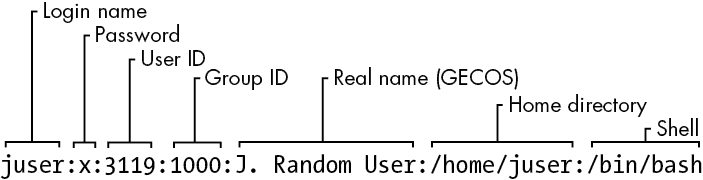
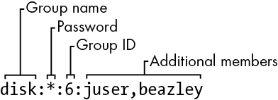
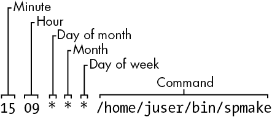
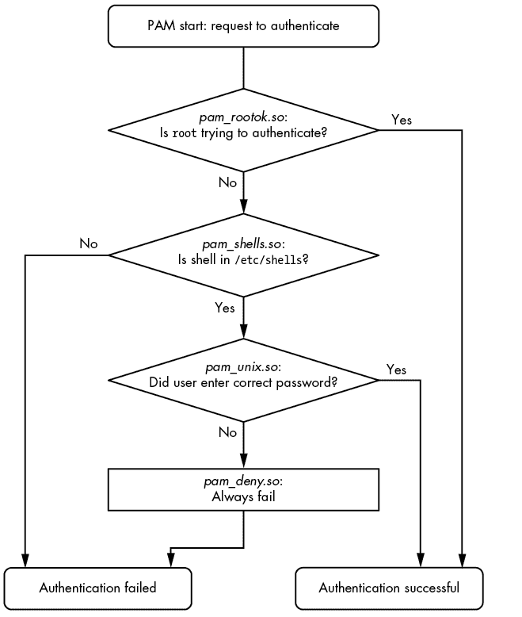

# 第七章：系统配置：日志记录、系统时间、批处理作业和用户


当你第一次查看*/etc*目录以探索系统的配置时，你可能会感到有些不知所措。好消息是，尽管你看到的大多数文件在某种程度上会影响系统的操作，但只有少数文件是基础性文件。

本章介绍了使第四章中讨论的基础设施可供用户空间软件（我们通常使用的工具，例如第二章中介绍的工具）使用的系统部分。具体来说，我们将关注以下内容：

+   系统日志

+   系统库访问的配置文件，用于获取服务器和用户信息

+   一些在系统启动时运行的选定服务器程序（有时称为*守护进程*）

+   可用于调整服务器程序和配置文件的配置实用程序

+   时间配置

+   定期任务调度

systemd 的广泛使用减少了在典型 Linux 系统中发现的基本独立守护进程的数量。一个例子是系统日志（syslogd）守护进程，其功能现在主要由 systemd 内置的守护进程（journald）提供。不过，仍然有一些传统的守护进程存在，比如 crond 和 atd。

与前几章一样，本章几乎没有涉及网络内容，因为网络是系统的一个独立构建模块。在第九章中，你将看到网络如何融入其中。

## 7.1 系统日志

大多数系统程序将其诊断输出作为消息写入*syslog*服务。传统的 syslogd 守护进程通过等待消息并在收到后将其发送到适当的通道（如文件或数据库）来执行此服务。在大多数现代系统中，journald（随 systemd 一起提供）完成了大部分工作。尽管本书将集中讨论 journald，但我们也会涉及传统 syslog 的许多方面。

系统日志记录器是系统中最重要的部分之一。当出现问题而你不知道从哪里开始时，检查日志总是明智的。如果你使用的是 journald，你可以通过`journalctl`命令来完成这项工作，相关内容我们将在 7.1.2 节中介绍。在较旧的系统中，你需要检查日志文件本身。在这两种情况下，日志消息通常如下所示：

```
Aug 19 17:59:48 duplex sshd[484]: Server listening on 0.0.0.0 port 22.
```

一条日志消息通常包含重要信息，如进程名称、进程 ID 和时间戳。还可能包含另外两个字段：*设施*（一个通用类别）和*严重性*（消息的紧急程度）。我们稍后会更详细地讨论这些内容。

由于较旧和较新的软件组件的多种组合，了解 Linux 系统中的日志记录可能会有些挑战。一些发行版，例如 Fedora，已将默认设置为仅使用 journald，而其他发行版则同时运行旧版本的 syslogd（如 rsyslogd）和 journald。较旧的发行版和一些专用系统可能根本不使用 systemd，仅使用其中一个 syslogd 版本。此外，一些软件系统完全绕过标准化的日志记录，直接写入自己的日志。

### 7.1.1 检查你的日志设置

你应该检查自己的系统，了解安装了什么类型的日志记录。以下是如何操作：

1.  检查 journald，如果你正在运行 systemd，几乎可以肯定你有 journald。尽管可以在进程列表中查找 journald，但最简单的方法是直接运行`journalctl`。如果系统中启用了 journald，你将看到一份分页的日志消息列表。

1.  检查 rsyslogd。查看进程列表中是否有 rsyslogd，并查找*/etc/rsyslog.conf*。

1.  如果没有 rsyslogd，请检查是否有 syslog-ng（syslogd 的另一个版本），方法是查找名为*/etc/syslog-ng*的目录。

继续查看*/var/log*中的日志文件。如果你有一个 syslogd 版本，通常该目录应包含许多文件，大部分由你的 syslog 守护进程创建。不过，这里也会有一些由其他服务维护的文件；例如，*wtmp*和*lastlog*，是`last`和`lastlog`等工具访问的日志文件，用来获取登录记录。

此外，*/var/log*中可能还有其他子目录，包含日志文件。这些日志几乎总是来自其他服务。其中一个子目录，*/var/log/journal*，是 journald 存储其（二进制）日志文件的地方。

### 7.1.2 搜索和监控日志

除非你的系统没有 journald，或者你正在查找由其他工具维护的日志文件，否则你将查看日志。`journalctl`工具默认显示所有日志消息，从最旧的开始（就像它们在日志文件中出现一样）。幸运的是，`journalctl`默认使用分页器，如`less`，来显示消息，这样就不会使你的终端被信息淹没。你可以通过分页器搜索消息，并使用`journalctl -r`反转消息的时间顺序，但有更好的方法来查找日志。

通常，你可以通过在命令行中添加单个字段来搜索日志条目；例如，运行`journalctl _PID=8792`来搜索来自进程 ID 8792 的消息。然而，最强大的过滤功能则更为通用。如果你需要多个标准，可以指定一个或多个。

#### 按时间过滤

`-S`（自）选项是缩小到特定时间范围的最有用选项之一。以下是其中一种最简单且最有效的用法示例：

```
$ **journalctl -S -4h**
```

该命令中的`-4h`部分可能看起来像一个选项，但实际上，它是一个时间规范，告诉`journalctl`在当前时区内查找过去四小时的消息。你也可以使用特定的日期和/或时间的组合：

```
$ **journalctl -S 06:00:00**
$ **journalctl -S 2020-01-14**
$ **journalctl -S '2020-01-14 14:30:00'**
```

`-U`（直到）选项以相同的方式工作，指定`journalctl`应检索消息的时间范围。然而，它通常不如有用，因为你通常会翻页或搜索消息直到找到你需要的，然后直接退出。

#### 按单元过滤

另一种快速有效的方法是通过 systemd 单元进行过滤。你可以使用`-u`选项，像这样：

```
$ **journalctl -u cron.service**
```

通常在按单元过滤时，你可以省略单元类型（在本例中是`.service`）。

如果你不知道某个特定单元的名称，可以尝试这个命令来列出日志中的所有单元：

```
$ **journalctl -F _SYSTEMD_UNIT**
```

`-F`选项显示日志中特定字段的所有值。

#### 查找字段

有时你只需要知道要搜索哪个字段。你可以通过以下命令列出所有可用的字段：

```
$ **journalctl -N**
```

任何以下划线开头的字段（如之前示例中的`_SYSTEMD_UNIT`）都是受信任的字段；发送消息的客户端无法更改这些字段。

#### 按文本过滤

一种经典的搜索日志文件的方法是运行`grep`命令查找所有文件中的相关行，或者在文件中找出可能包含更多信息的位置。同样，你可以使用`-g`选项通过正则表达式搜索日志消息，像这个示例一样，它将返回包含`kernel`并且后面跟着`memory`的消息：

```
`$ journalctl -g 'kernel.*memory'`
```

不幸的是，当你以这种方式搜索日志时，你只会得到*仅*匹配该表达式的消息。通常，重要的信息可能在时间上附近。尝试从匹配中提取时间戳，然后使用`journalctl -S`和一个稍早的时间，查看同一时间段内的其他消息。

#### 按启动过滤

通常，你会在日志中查找机器启动或关闭（并重启）时的消息。非常容易获得仅来自一次启动的消息，从机器启动到停止。例如，如果你要查找当前启动的开始时间，只需使用`-b`选项：

```
$ **journalctl -b**
```

你也可以添加偏移量；例如，要从上一次启动开始，使用`-1`的偏移量。

```
$ j**ournalctl -b -1**
```

```
$ `journalctl -r -b -1`
-- Logs begin at Wed 2019-04-03 12:29:31 EDT, end at Fri 2019-08-02 19:10:14 EDT. --
Jul 18 12:19:52 mymachine systemd-journald[602]: Journal stopped
Jul 18 12:19:52 mymachine systemd-shutdown[1]: Sending SIGTERM to remaining processes...
Jul 18 12:19:51 mymachine systemd-shutdown[1]: Syncing filesystems and block devices.
```

除了像`-1`这样的偏移量，你还可以通过 ID 查看启动记录。运行以下命令来获取启动 ID：

```
$ **journalctl --list-boots**
-1 e598bd09e5c046838012ba61075dccbb Fri 2019-03-22 17:20:01 EDT—Fri 2019-04-12 08:13:52 EDT
 0 5696e69b1c0b42d58b9c57c31d8c89cc Fri 2019-04-12 08:15:39 EDT—Fri 2019-08-02 19:17:01 EDT
```

最后，你可以显示内核消息（无论是否选择特定启动）使用`journalctl -k`。

#### 按严重性/优先级过滤

一些程序会产生大量的诊断消息，这些消息可能会掩盖重要的日志。你可以通过指定一个介于 0（最重要）和 7（最不重要）之间的值来过滤严重性级别，使用`-p`选项。例如，要获取级别 0 到 3 的日志，可以运行：

```
$ **journalctl -p 3**
```

如果你只想获取特定严重性级别的日志，可以使用`..`范围语法：

```
$ **journalctl -p 2..3**
```

按严重性过滤日志听起来可能节省很多时间，但你可能不会觉得它很有用。大多数应用程序默认不会生成大量的消息数据，尽管一些应用程序提供配置选项以启用更详细的日志记录。

#### 简单的日志监控

监控日志的传统方法是使用`tail -f`或`less`的跟随模式（`less +F`）来查看系统日志器实时生成的消息。这并不是一个非常有效的常规系统监控方法（因为太容易错过某些信息），但当你尝试查找问题或实时查看启动和操作时，它很有用。

使用`tail -f`不适用于 journald，因为它不使用纯文本文件；相反，你可以使用`journalctl`的`-f`选项，达到打印实时日志的相同效果：

```
$ **journalctl -f**
```

这个简单的调用已经足够满足大多数需求。然而，如果你的系统有一个相对稳定的日志消息流，而这些日志消息与您要查找的内容无关，你可能希望添加一些前述的过滤选项。

### 7.1.3 日志文件轮转

当你使用 syslog 守护进程时，系统记录的任何日志消息都会进入某个日志文件，这意味着你需要偶尔删除旧消息，以防它们最终占满所有存储空间。不同的发行版有不同的做法，但大多数都使用`logrotate`工具。

这个机制被称为*日志轮转*。因为传统的文本日志文件将最旧的消息放在前面，最新的消息放在后面，所以要从文件中删除较旧的消息以释放空间是相当困难的。相反，`logrotate`维护的日志会被分成多个部分。

假设你有一个名为*auth.log*的日志文件，位于*/var/log*目录中，包含最新的日志消息。然后，还有*auth.log.1*、*auth.log.2*和*auth.log.3*，它们分别包含逐渐变旧的数据。当`logrotate`决定是时候删除一些旧数据时，它会像这样“旋转”文件：

1.  删除最旧的文件，*auth.log.3*。

1.  将*auth.log.2*重命名为*auth.log.3*。

1.  将*auth.log.1*重命名为*auth.log.2*。

1.  将*auth.log*重命名为*auth.log.1*。

各个发行版的名称和某些细节会有所不同。例如，Ubuntu 配置指定`logrotate`应该压缩从“1”位置移到“2”位置的文件，因此在前面的示例中，你会看到*auth.log.2.gz*和*auth.log.3.gz*。在其他发行版中，`logrotate`会用日期后缀重新命名日志文件，如*-20200529*。这种方案的一个优势是，更容易找到来自特定时间的日志文件。

你可能会想知道，如果`logrotate`在另一个工具（如 rsyslogd）想要向日志文件添加内容时执行旋转，会发生什么情况。例如，假设日志程序打开日志文件以进行写入，但在`logrotate`执行重命名之前并没有关闭它。在这种不太常见的情况下，日志信息会成功写入，因为在 Linux 中，一旦文件被打开，I/O 系统就无法知道它已被重命名。但请注意，消息出现的文件将是具有新名称的文件，例如*auth.log.1*。

如果`logrotate`在日志程序尝试打开文件之前已经重命名了该文件，那么`open()`系统调用将创建一个新的日志文件（例如*auth.log*），就像`logrotate`没有运行时一样。

### 7.1.4 日志维护

存储在*/var/log/journal*中的日志不需要旋转，因为 journald 本身可以识别并删除旧的消息。与传统的日志管理不同，journald 通常根据日志文件系统上剩余的空间、日志应该占用的空间百分比以及设置的最大日志大小来决定是否删除消息。还有其他日志管理选项，例如日志消息的最大允许年龄。你可以在 journald.conf(5)手册页中找到有关默认值和其他设置的描述。

### 7.1.5 系统日志详解

现在你已经了解了一些 syslog 和日志的操作细节，是时候稍微退后一步，看看为什么以及如何日志以这种方式工作的。这一讨论更倾向于理论性，而非实际操作；你可以直接跳到本书的下一个主题。

在 1980 年代，出现了一个空白：Unix 服务器需要一种记录诊断信息的方法，但当时没有标准的做法。随着 syslog 与 sendmail 电子邮件服务器一起出现，它的设计非常合理，其他服务的开发者也很容易采用它。RFC 3164 描述了 syslog 的演变。

这个机制相当简单。传统的 syslogd 监听并等待 Unix 域套接字*/dev/log*上的消息。syslogd 的另一个强大功能是能够在网络套接字上监听，除了*/dev/log*，这使得客户端机器可以通过网络发送消息。

这使得将整个网络的所有 syslog 消息集中到一个日志服务器成为可能，因此 syslog 在网络管理员中变得非常流行。许多网络设备，如路由器和嵌入式设备，可以作为 syslog 客户端，将它们的诊断消息发送到服务器。

Syslog 采用经典的客户端-服务器架构，并拥有自己的协议（目前在 RFC 5424 中定义）。然而，该协议并不总是标准的，早期版本没有太多结构，仅限于一些基础内容。使用 syslog 的程序员需要为自己的应用程序设计一种描述性、清晰且简短的日志消息格式。随着时间的推移，协议增加了新特性，同时尽可能保持向后兼容性。

#### 设施、严重性和其他字段

因为 syslog 会将来自不同服务的各种类型的消息发送到不同的目的地，所以它需要一种方法来对每条消息进行分类。传统的方法是使用编码的设施和严重性值，这些值通常（但不总是）包含在消息中。除了文件输出，甚至非常旧版本的 syslogd 也能够根据消息的设施和严重性，将重要消息发送到控制台，并直接发送给特定的登录用户——这是一种早期的系统监控工具。

*设施*是服务的一个通用类别，用来标识发送消息的来源。设施包括内核、邮件系统、打印机等服务和系统组件。

*严重性*是日志消息的紧急程度。共有八个级别，编号从 0 到 7。它们通常通过名称来引用，尽管这些名称不太一致，而且在不同实现中有所变化：

| `0: emerg` | `4: warning` |
| --- | --- |
| `1: alert` | `5: notice` |
| `2: crit` | `6: info` |
| `3: err` | `7: debug` |

设施和严重性共同构成了 *优先级*，在 syslog 协议中以一个数字的形式打包。你可以在 RFC 5424 中阅读这些字段的详细信息，学习如何在应用程序中指定它们，可以查看 syslog(3) 手册页面，了解如何在 rsyslog.conf(5) 手册页面中进行匹配。然而，当将它们转换到 journald 时，你可能会遇到一些困惑，在那里，严重性被称为优先级（例如，当你运行 `journalctl -o json` 获取机器可读的日志输出时）。

不幸的是，当你开始检查协议的优先级部分的细节时，你会发现它没有跟上操作系统其他部分的变化和需求。严重性的定义仍然有效，但可用的设施是硬编码的，包含了如 UUCP 等很少使用的服务，并且没有定义新设施的方法（只有一些通用的 local0 到 local7 插槽）。

我们已经讨论了一些日志数据中的其他字段，但 RFC 5424 还包括了 *结构化数据* 的规定，即一组任意的键值对，应用程序开发者可以用它们来定义自己的字段。尽管在使用 journald 时需要做一些额外的工作才能使用它们，但将这些数据发送到其他类型的数据库要常见得多。

#### Syslog 和 journald 之间的关系

journald 已经完全取代了某些系统上的 syslog，这可能会让你产生疑问，为什么 syslog 仍然存在于其他系统上。主要有两个原因：

+   Syslog 有一个明确的跨多台机器聚合日志的方法。当日志仅存储在一台机器上时，监控它们要容易得多。

+   类似 rsyslogd 的 syslog 版本是模块化的，并能够输出到多种不同的格式和数据库（包括 journal 格式）。这使得它们更容易与分析和监控工具连接。

相比之下，journald 强调将单台机器的日志输出收集和组织成单一格式。

当你想做更复杂的事情时，journald 将其日志输出到不同的日志记录器的能力提供了极大的灵活性。尤其是考虑到 systemd 可以收集服务器单元的输出并将其发送到 journald，这让你能够访问比应用程序发送到 syslog 的日志数据更多的信息。

#### 关于日志的最后说明

Linux 系统上的日志记录在其历史中发生了重大变化，并且几乎可以肯定，它将继续发展。目前，在单台机器上收集、存储和检索日志的过程已得到良好的定义，但仍有一些日志记录的其他方面没有标准化。

首先，当你想要在多个机器的网络上聚合和存储日志时，有一系列让人眼花缭乱的选项可供选择。现在，日志不仅仅存储在文本文件中，集中式日志服务器通常会被互联网服务所取代，而日志可以存储在数据库中。

接下来，日志的消费方式发生了变化。曾几何时，日志并不被视为“真实”的数据；它们的主要用途是作为管理员（人类）在出现问题时可以阅读的资源。然而，随着应用程序变得更加复杂，日志需求也随之增长。这些新的需求包括能够搜索、提取、显示和分析日志中的数据。虽然我们有许多将日志存储到数据库中的方法，但在应用程序中使用日志的工具仍处于起步阶段。

最后，确保日志是可信的也是一个问题。最初的 syslog 没有任何身份验证机制；你只是相信任何发送日志的应用程序和/或机器都在说真话。此外，日志没有加密，使其容易被网络中的窃听者监视。这在需要高安全性的网络中是一个严重的风险。现代的 syslog 服务器有标准的方法来加密日志信息并验证其来源的机器。然而，当涉及到单独的应用程序时，情况就变得不那么清晰了。例如，你如何确认自称为你的网站服务器的东西真的是网站服务器？

我们将在本章稍后探讨一些稍微高级的身份验证话题。但现在，让我们继续讨论系统中配置文件的基本组织方式。

## 7.2 /etc 的结构

大多数 Linux 系统的配置文件都位于 */etc* 目录中。历史上，每个程序或系统服务都会在该目录下有一个或多个配置文件，并且由于 Unix 系统组件的数量庞大，*/etc* 会迅速积累大量文件。

这种方法有两个问题：首先，难以在运行的系统上找到特定的配置文件，其次，维护这种配置的系统也非常困难。例如，如果你想更改 `sudo` 配置，你必须编辑 */etc/sudoers*。但在你更改之后，系统升级可能会覆盖你的自定义配置，因为它会覆盖 */etc* 中的所有内容。

多年来的趋势是将系统配置文件放入 */etc* 下的子目录中，正如你已经看到的 systemd，它使用了 */etc/systemd*。虽然 */etc* 下仍然有一些单独的配置文件，但如果你运行 `ls` `-F` `/etc`，你会发现那里大多数内容现在都是子目录。

为了解决覆盖配置文件的问题，现在你可以将自定义配置放入配置子目录中的单独文件中，比如 */etc/grub.d* 中的文件。

在 */etc* 中可以找到什么类型的配置文件？基本的指南是，单台机器的可定制配置，如用户信息（*/etc/passwd*）和网络详情（*/etc/network*），应该放在 */etc* 中。然而，一些通用的应用程序详情，如分发版的用户界面默认设置，则不应放在 */etc* 中。那些不打算定制的系统默认配置文件通常会放在其他地方，像是 */usr/lib/systemd* 中的预打包 systemd 单元文件。

你已经看到了一些与启动相关的配置文件。接下来，让我们继续了解一下系统中如何配置用户。

## 7.3 用户管理文件

Unix 系统支持多个独立的用户。在内核层面，用户仅仅是数字（用户 ID），但是因为记住一个名字比记住一个数字要容易得多，所以在管理 Linux 时你通常会使用 *用户名*（或 *登录名*）。用户名只存在于用户空间中，因此任何与用户名交互的程序都需要在与内核沟通时找到相应的用户 ID。

### 7.3.1 /etc/passwd 文件

纯文本文件 */etc/passwd* 将用户名映射到用户 ID。它的内容如下所示 列表 7-1。

```
root:x:0:0:Superuser:/root:/bin/sh
daemon:*:1:1:daemon:/usr/sbin:/bin/sh
bin:*:2:2:bin:/bin:/bin/sh
sys:*:3:3:sys:/dev:/bin/sh
nobody:*:65534:65534:nobody:/home:/bin/false
juser:x:3119:1000:J. Random User:/home/juser:/bin/bash
beazley:x:143:1000:David Beazley:/home/beazley:/bin/bash
```

列表 7-1：*/etc/passwd* 中的用户列表

每一行代表一个用户，并且有七个字段，通过冒号分隔。第一个字段是用户名。

接下来是用户的加密密码，或者至少曾经是密码字段。在大多数 Linux 系统中，密码不再实际存储在*passwd*文件中，而是存储在*shadow*文件中（请参见第 7.3.3 节）。*shadow*文件的格式与*passwd*相似，但普通用户没有读取*shadow*的权限。*passwd*或*shadow*文件中的第二个字段是加密密码，它看起来像一堆无法读取的乱码，如`d1CVEWiB/oppc`。Unix 密码从不以明文存储；事实上，该字段并不是密码本身，而是密码的衍生值。在大多数情况下，从这个字段中获取原始密码非常困难（假设密码不是容易猜测的）。

在第二个*passwd*文件字段中的`x`表示加密密码存储在*shadow*文件中（该文件应该在你的系统上进行配置）。星号（`*`）表示用户无法登录。

如果此密码字段为空（即你看到两个冒号并排，如`::`），则登录时不需要密码。请小心这种空白密码。你绝不应该允许用户没有密码就能登录。

剩余的*passwd*字段如下：

+   *用户 ID*（*UID*），它是用户在内核中的表示。你可以有两个条目具有相同的用户 ID，但这样会让你困惑——并且可能也会困扰你的软件——因此请保持用户 ID 的唯一性。

+   *组 ID*（*GID*），应为*/etc/group*文件中编号的条目之一。组决定文件权限，除此之外几乎没有其他作用。这个组也称为用户的*主组*。

+   用户的真实姓名（通常称为*GECOS*字段）。有时你会在这个字段中找到逗号，表示房间号和电话号码。

+   用户的主目录。

+   用户的 shell（当用户运行终端会话时执行的程序）。

图 7-1 标识了示例 7-1 中一个条目的各个字段。



图 7-1：密码文件中的一条记录

*/etc/passwd*文件的语法相当严格，不允许有注释或空行。

### 7.3.2 特殊用户

你会在*/etc/passwd*中找到一些特殊用户。*超级用户*（root）总是具有 UID 0 和 GID 0，如示例 7-1 所示。一些用户，如 daemon，没有登录权限。nobody 用户是一个特权较低的用户；一些进程以 nobody 身份运行，因为它（通常）无法在系统上写入任何内容。

无法登录的用户称为*伪用户*。尽管它们不能登录，但系统可以以它们的用户 ID 启动进程。像 nobody 这样的伪用户通常是出于安全原因创建的。

同样，这些都是用户空间的约定。这些用户对内核没有特殊意义；唯一对内核有特殊意义的用户 ID 是超级用户的 ID，0。你可以像其他任何用户一样，给 nobody 用户访问系统上的所有内容。

### 7.3.3 /etc/shadow 文件

Linux 系统上的影子密码文件（*/etc/shadow*）通常包含用户认证信息，包括与*/etc/passwd*中用户对应的加密密码和密码过期信息。

*shadow*文件的引入是为了提供一种更灵活（或许更安全）的存储密码的方法。它包含了一套库和工具，许多工具很快被 PAM（可插拔认证模块）中的组件所取代（我们将在 7.10 节讲解这个高级话题）。为了避免为 Linux 引入一套全新的文件，PAM 使用了*/etc/shadow*，但并没有使用一些对应的配置文件，例如*/etc/login.defs*。

### 7.3.4 操作用户和密码

普通用户通过`passwd`命令和其他一些工具与*/etc/passwd*进行交互。使用`passwd`来更改密码。你可以使用`chfn`和`chsh`分别更改真实姓名和登录 shell（shell 必须在*/etc/shells*中列出）。这些都是 suid-root 可执行文件，因为只有超级用户才能更改*/etc/passwd*文件。

#### 作为超级用户修改/etc/passwd

由于*/etc/passwd*只是一个普通的纯文本文件，从技术上讲，超级用户是允许使用任何文本编辑器进行修改的。添加用户时，可以简单地添加一行并为用户创建一个主目录；删除用户时，可以执行相反操作。

然而，像这样直接编辑*passwd*并不是一个好主意。这样做不仅容易出错，而且如果有其他进程在同时修改*passwd*，你还可能遇到并发问题。使用终端或图形界面提供的独立命令来修改用户信息会更加简单（也更安全）。例如，要设置用户密码，可以以超级用户身份运行`passwd` `user`。使用`adduser`和`userdel`分别添加和删除用户。

然而，如果你确实需要直接编辑文件（例如，如果文件已损坏），可以使用`vipw`程序，它会在你编辑时备份并锁定*/etc/passwd*作为额外的保护措施。如果你需要编辑*/etc/shadow*而不是*/etc/passwd*，请使用`vipw -s`。（希望你永远不需要做这些操作。）

### 7.3.5 与用户组的操作

*用户组*在 Unix 中提供了一种在特定用户之间共享文件的方法。其原理是，你可以为特定组设置读或写权限位，排除其他所有用户。这个功能曾经非常重要，因为许多用户共享一台机器或网络，但近年来随着工作站共享的减少，它的重要性已大大降低。

*/etc/group* 文件定义了组 ID（如在 */etc/passwd* 文件中找到的）。列表 7-2 是一个示例。

```
root:*:0:juser
daemon:*:1:
bin:*:2:
sys:*:3:
adm:*:4:
disk:*:6:juser,beazley
nogroup:*:65534:
user:*:1000:
```

列表 7-2：一个示例 */etc/group* 文件

与 */etc/passwd* 文件一样，*/etc/group* 中的每一行都是由冒号分隔的字段集。每个条目中的字段如下，从左到右：

1.  组名 在你运行类似 `ls -l` 的命令时会显示。

1.  组密码 Unix 组密码几乎从不使用，也不应该使用（大多数情况下的一个不错的替代方案是 `sudo`）。使用 `*` 或任何其他默认值。这里的 `x` 表示在 */etc/gshadow* 中有一个相应的条目，这通常也是一个禁用的密码，用 `*` 或 `!` 表示。

1.  组 ID（一个数字） GID 必须在 `group` 文件中唯一。这个数字会出现在用户的 */etc/passwd* 条目中的组字段里。

1.  一个可选的用户列表，表示属于该组的用户 除了这里列出的用户外，具有相应组 ID 的用户也属于该组，这些用户在其 *passwd* 文件条目中有相应的组 ID。

图 7-2 标识了*group*文件条目中的字段。



图 7-2：*group* 文件中的一条条目

要查看你所属的组，运行 `groups`。

## 7.4 getty 和 login

`getty` 程序连接到终端并显示登录提示。在大多数 Linux 系统中，`getty` 很简单，因为系统仅在虚拟终端登录时使用它。在进程列表中，它通常看起来像这样（例如，在 */dev/tty1* 上运行时）：

```
$ **ps ao args | grep getty**
/sbin/agetty -o -p -- \u --noclear tty1 linux
```

在许多系统上，直到你通过类似 Ctrl-Alt-F1 的方式访问虚拟终端之前，你可能根本看不见 `getty` 进程。这个例子展示了 `agetty`，这是许多 Linux 发行版默认包含的版本。

在你输入登录名后，`getty` 用 `login` 程序替换自己，`login` 程序会要求你输入密码。如果你输入正确的密码，`login` 使用 `exec()` 替换自己，启动你的 shell。否则，你会看到“登录错误”的信息。`login` 程序的大部分实际认证工作是由 PAM 处理的（见第 7.10 节）。

现在你知道了 `getty` 和 `login` 的作用，但你可能永远不需要配置或更改它们。实际上，你很少使用它们，因为大多数用户现在都通过图形界面（如 `gdm`）或远程使用 SSH 登录，而这两者都不使用 `getty` 或 `login`。

## 7.5 设置时间

Unix 系统依赖于准确的时间记录。内核维护着 *系统时钟*，这是你运行像 `date` 这样的命令时参考的时钟。你也可以使用 `date` 命令设置系统时钟，但通常不建议这样做，因为你永远无法完全准确地设置时间。你的系统时钟应尽可能接近正确的时间。

个人电脑硬件有一个电池供电的*实时时钟（RTC）*。RTC 不是世界上最精确的时钟，但比没有时钟要好。内核通常会在启动时根据 RTC 设置时间，你可以通过`hwclock`命令将系统时钟重置为当前硬件时间。为了避免时区或夏令时调整带来的麻烦，建议将硬件时钟设置为协调世界时（UTC）。你可以使用以下命令将 RTC 设置为内核的 UTC 时钟：

```
# hwclock --systohc --utc
```

不幸的是，内核在保持时间的准确性方面比 RTC 更差，而且由于 Unix 系统通常在单次启动后会运行数月或数年，因此它们容易发生时间漂移。*时间漂移*是内核时间与真实时间（由原子钟或其他非常精确的时钟定义）之间的当前差异。

你不应该尝试通过`hwclock`修复时间漂移，因为基于时间的系统事件可能会丢失或被弄乱。你可以运行像`adjtimex`这样的工具，根据 RTC 平滑更新时钟，但通常最好通过网络时间守护进程（参见第 7.5.2 节）保持系统时间的正确。

### 7.5.1 内核时间表示和时区

内核的系统时钟表示自 1970 年 1 月 1 日 00:00 UTC 以来的秒数。要查看此时的数字，可以运行：

```
$ **date +%s**
```

为了将这个数字转换成人类可以读懂的格式，用户空间的程序会将其转换为当地时间，并补偿夏令时以及任何其他特殊情况（比如居住在印第安纳州）。当地时区由文件*/etc/localtime*控制。（不用尝试查看它，它是一个二进制文件。）

你系统上的时区文件位于*/usr/share/zoneinfo*。你会发现这个目录包含了很多时区文件以及时区别名。要手动设置系统的时区，你可以将*/usr/share/zoneinfo*中的某个文件复制到*/etc/localtime*（或者创建一个符号链接），也可以通过你发行版的时区工具来进行更改。命令行程序`tzselect`可以帮助你识别时区文件。

若要在一个 shell 会话中使用与系统默认时区不同的时区，可以将`TZ`环境变量设置为*/usr/share/zoneinfo*中某个文件的名称，并测试更改，如下所示：

```
$ **export TZ=US/Central**
$ **date**
```

与其他环境变量一样，你也可以像这样设置单个命令的时区：

```
$ **TZ=US/Central date**
```

### 7.5.2 网络时间

如果你的机器始终连接到互联网，你可以运行网络时间协议（NTP）守护进程，通过远程服务器来维持时间。这曾经由 ntpd 守护进程处理，但与许多其他服务一样，systemd 已用其自己的包（名为 timesyncd）替代了它。大多数 Linux 发行版都包括 timesyncd，并且默认启用。你通常不需要配置它，但如果你有兴趣了解如何配置，可以参考 timesyncd.conf(5)手册页。最常见的配置覆盖是更改远程时间服务器。

如果你希望运行 ntpd 而不是 timesyncd，则需要禁用已安装的 timesyncd。请访问[`www.ntppool.org/`](https://www.ntppool.org/)查看那里的说明。如果你仍然希望使用 timesyncd 与不同的服务器，也可以参考该站点。

如果你的机器没有持续的互联网连接，可以使用像 chronyd 这样的守护进程，在断网期间保持时间的同步。

你还可以根据网络时间设置硬件时钟，以帮助系统在重启时保持时间的一致性。许多发行版会自动执行此操作，但如果手动执行，请确保系统时间是从网络同步的，然后运行以下命令：

```
# hwclock --systohc –-utc
```

## 7.6 使用 cron 和定时器单元调度定期任务

有两种方法可以按照重复的时间表运行程序：cron 和 systemd 定时器单元。这项功能对于自动化系统维护任务至关重要。一个例子是日志文件旋转工具，确保硬盘不会因旧日志文件而填满（如本章前面讨论的那样）。cron 服务长期以来一直是执行此任务的事实标准，我们将详细介绍它。然而，systemd 的定时器单元是 cron 的替代方案，在某些情况下具有优势，因此我们也会学习如何使用它们。

你可以在任何适合你的时间运行任何程序。通过 cron 运行的程序称为*cron 任务*。要安装一个 cron 任务，你需要在*crontab 文件*中创建一行条目，通常通过运行`crontab`命令来完成。例如，以下 crontab 文件条目安排每天上午 9:15（本地时区）运行`/home/juser/bin/spmake`命令：

```
15 09 * * * /home/juser/bin/spmake
```

这一行开头的五个字段，空格分隔，指定了计划的时间（另见图 7-3）。这些字段的顺序如下：

+   分钟（0 到 59）。此 cron 任务设置为第 15 分钟执行。

+   小时（0 到 23）。此任务设置为第九小时执行。

+   每月的日期（1 到 31 号）。

+   月份（1 到 12）。

+   星期几（0 到 7）。数字 0 和 7 代表星期天。

    图 7-3：crontab 文件中的一条条目

任何字段中的星号（`*`）表示匹配每一个值。前面的例子每天运行`spmake`，因为日期、月份和星期几字段都填充了星号，cron 将其理解为“每天、每月、每周的每一天都运行这个任务”。

如果你只希望在每月的第 14 天运行`spmake`，可以使用如下的 crontab 行：

```
15 09 **14** * * /home/juser/bin/spmake
```

你可以为每个字段选择多个时间。例如，要在每月的第 5 天和第 14 天运行程序，可以在第三个字段中输入`5,14`：

```
15 09 **5,14** * * /home/juser/bin/spmake
```

crontab(5)手册页提供了 crontab 格式的完整信息。

### 7.6.1 安装 Crontab 文件

每个用户都可以拥有自己的 crontab 文件，这意味着每个系统可能有多个 crontab，通常位于 */var/spool/cron/crontabs*。普通用户不能写入这个目录；`crontab` 命令用于安装、列出、编辑和移除用户的 crontab。

安装 crontab 的最简单方法是将你的 crontab 条目放入一个文件中，然后使用 `crontab` `file` 将 `file` 安装为当前的 crontab。`crontab` 命令会检查文件格式，确保你没有犯任何错误。要列出你的 cron 作业，运行 `crontab -l`。要移除 crontab，使用 `crontab -r`。

在你创建了初始的 crontab 后，使用临时文件进行进一步编辑可能会有些混乱。相反，你可以通过 `crontab -e` 命令一步到位地编辑并安装你的 crontab。如果你犯了错误，`crontab` 应该会告诉你错误所在，并询问是否希望再次进行编辑。

### 7.6.2 系统 Crontab 文件

许多常见的 cron 任务是以超级用户身份运行的。然而，Linux 发行版通常会为整个系统提供一个 */etc/crontab* 文件，而不是编辑和维护超级用户的 crontab 来安排这些任务。你不能使用 `crontab` 来编辑这个文件，并且它的格式略有不同：在要执行的命令之前，有一个额外的字段指定应当运行任务的用户。（这使得你即使不是由同一个用户运行所有任务，也能将系统任务归组在一起。）例如，这个在 */etc/crontab* 中定义的 cron 作业会在早上 6:42 作为超级用户（`root` 1）运行：

```
42 6 * * * root1 /usr/local/bin/cleansystem > /dev/null 2>&1
```

### 7.6.3 定时器单元

创建周期性任务的另一种方法是构建一个 systemd 定时器单元。对于一个全新的任务，你必须创建两个单元：一个定时器单元和一个服务单元。之所以需要两个单元，是因为定时器单元不包含任何关于要执行的任务的具体信息；它只是一个激活机制，用来运行服务单元（或从概念上讲，另一种类型的单元，但最常见的用法是服务单元）。

让我们看一下一个典型的定时器/服务单元对，从定时器单元开始。我们将其命名为 *loggertest.timer*；与其他自定义单元文件一样，我们将其放在 */etc/systemd/system* 目录下（参见 Listing 7-3）。

```
[Unit]
Description=Example timer unit

[Timer]
OnCalendar=*-*-* *:00,20,40
Unit=loggertest.service

[Install]
WantedBy=timers.target
```

Listing 7-3: `loggertest.timer`

这个定时器每 20 分钟运行一次，`OnCalendar` 选项类似于 cron 语法。在这个示例中，它会在每小时的开始时，以及每小时的 20 分钟和 40 分钟运行。

`OnCalendar` 时间格式为 `年``-``月``-``日``小时``:``分钟``:``秒钟`。秒字段是可选的。与 cron 类似，`*` 表示一种通配符，逗号允许多个值。周期性 `/` 语法也是有效的；在前面的示例中，你可以将 `*:00,20,40` 改为 `*:00/20`（每 20 分钟）以达到相同效果。

关联的服务单元名为*loggertest.service*（见列表 7-4）。我们在定时器中通过`Unit`选项显式命名了它，但这并非严格必要，因为 systemd 会查找与定时器单元文件同名的*.service*文件。这个服务单元也位于*/etc/systemd/system*，看起来和你在第六章看到的服务单元非常相似。

```
[Unit]
Description=Example Test Service

[Service]
Type=oneshot
ExecStart=/usr/bin/logger -p local3.debug I\'m a logger
```

列表 7-4：`loggertest.service`

其中的核心是`ExecStart`行，即服务激活时运行的命令。这个特定的示例向系统日志发送一条消息。

注意使用`oneshot`作为服务类型，表示该服务预计运行并退出，systemd 直到指定的`ExecStart`命令完成才会认为服务已启动。这对定时器有几个优势：

+   你可以在单元文件中指定多个`ExecStart`命令。我们在第六章看到的其他服务单元样式不允许这么做。

+   在使用`Wants`和`Before`依赖指令激活其他单元时，更容易控制严格的依赖顺序

+   你在日志中可以更好地记录单元的开始和结束时间。

### 7.6.4 cron 与定时器单元

cron 工具是 Linux 系统中最古老的组件之一；它已经存在几十年（早于 Linux 本身），其配置格式多年来变化不大。当某样东西存在这么久时，它就成了替代的目标。

你刚才看到的 systemd 定时器单元可能看起来像是一个逻辑替代方案，实际上，许多发行版现在已经将系统级的定期维护任务移到了定时器单元中。但事实证明，cron 还是有一些优势：

+   配置更简单

+   与许多第三方服务兼容

+   用户更容易安装自己的任务

定时器单元提供以下优势：

+   通过 cgroups 对与任务/单元相关的进程进行更精确的追踪

+   在日志中极好的诊断信息追踪

+   激活时间和频率的附加选项

+   能够使用 systemd 依赖关系和激活机制

也许有一天会为 cron 任务提供一个兼容层，类似于挂载单元和*/etc/fstab*。然而，仅仅配置这一点就足以证明 cron 格式在短期内不太可能消失。正如你将在下一节看到的，名为`systemd-run`的工具确实允许创建定时器单元和相关的服务，而无需创建单元文件，但其管理和实现方式有足够的差异，许多用户可能会更喜欢 cron。你将很快看到这一点，当我们讨论`at`时。

## 7.7 使用 at 调度一次性任务

要在未来某个时间运行一个任务而不使用 cron，可以使用`at`服务。例如，要在晚上 10:30 运行`myjob`，请输入以下命令：

```
$ **at 22:30**
at> **myjob**
```

用 ctrl-D 结束输入。（`at`工具从标准输入中读取命令。）

要检查任务是否已被调度，可以使用`atq`。要删除任务，可以使用`atrm`。你还可以通过在`DD.MM.YY`格式中添加日期来调度几天后的任务——例如，`at 22:30 30.09.15`。

`at` 命令没有太多其他功能。虽然它不常用，但在需要时，它可以是非常宝贵的工具。

### 7.7.1 定时器单元等效项

你可以使用 systemd 定时器单元作为 `at` 的替代。相比于你之前看到的周期性定时器单元，这些单元更容易创建，并且可以像这样在命令行上运行：

```
# systemd-run --**on-calendar='2022-08-14 18:00' /bin/echo this is a test**
Running timer as unit: run-rbd000cc6ee6f45b69cb87ca0839c12de.timer
Will run service as unit: run-rbd000cc6ee6f45b69cb87ca0839c12de.service
```

`systemd-run` 命令创建一个临时定时器单元，你可以通过常规的 `systemctl list-timers` 命令查看它。如果你不关心具体时间，也可以通过 `--on-active` 来指定时间偏移（例如，`--on-active=30m` 表示 30 分钟后的时间）。

## 7.8 以常规用户身份运行的定时器单元

到目前为止，我们看到的所有 systemd 定时器单元都是以 root 身份运行的。也可以作为常规用户创建定时器单元。为此，需要在 `systemd-run` 命令中添加`--user`选项。

但是，如果你在定时器单元运行之前注销，定时器单元将不会启动；如果你在定时器单元完成之前注销，定时器单元将终止。这是因为 systemd 有一个与已登录用户相关联的用户管理器，而这是运行定时器单元所必需的。你可以使用以下命令告诉 systemd 在你注销后保留用户管理器：

```
$ **loginctl enable-linger**
```

作为 root，你还可以为另一个用户启用管理器：

```
# loginctl enable-linger`user`
```

## 7.9 用户访问主题

本章的其余部分涵盖了用户如何获得登录权限、切换到其他用户以及执行其他相关任务的几个主题。这些内容稍微有些高级，如果你准备好深入了解一些进程的内部实现，欢迎跳到下一章。

### 7.9.1 用户 ID 和用户切换

我们已经讨论了如何使用 setuid 程序（如 `sudo` 和 `su`）让你临时更改用户，并且我们已经介绍了像 `login` 这样的系统组件，它们控制用户的访问权限。也许你会好奇这些组件如何协同工作，以及内核在用户切换中的作用。

当你临时切换到另一个用户时，实际上你所做的只是更改你的用户 ID。实现这一点有两种方式，内核处理这两种方式。第一种是通过 setuid 可执行文件，这在第 2.17 节中有介绍。第二种是通过`setuid()`系列系统调用。为了适应与进程相关的各种用户 ID，存在几种不同版本的此系统调用，正如你在第 7.9.2 节中将会了解的那样。

内核对进程可以做什么或不能做什么有基本规则，但这里有三条基本规则，涵盖了 setuid 可执行文件和`setuid()`：

+   进程可以运行 setuid 可执行文件，只要它具有足够的文件权限。

+   以 root（用户 ID 0）身份运行的进程可以使用`setuid()`变成任何其他用户。

+   非 root 用户身份下的进程在使用`setuid()`时受到严格限制；在大多数情况下，它不能使用此功能。

根据这些规则，如果你想从普通用户切换到另一个用户，通常需要结合多种方法。例如，`sudo` 可执行文件是 setuid root，一旦运行，它可以调用 `setuid()` 成为另一个用户。

### 7.9.2 进程所有权、有效 UID、真实 UID 和保存 UID

到目前为止，我们对用户 ID 的讨论是简化过的。实际上，每个进程有多个用户 ID。到目前为止，你已经熟悉了 *有效用户 ID*（*有效 UID，或 euid*），它定义了进程的访问权限（最重要的是文件权限）。第二个用户 ID，*真实用户 ID*（*真实 UID，或 ruid*），指示谁启动了进程。通常，这些 ID 是相同的，但当你运行一个 setuid 程序时，Linux 在执行过程中将 euid 设置为程序的拥有者，但它会将你的原始用户 ID 保留在 ruid 中。

有效 UID 和真实 UID 之间的区别是令人困惑的，以至于很多关于进程所有权的文档都是错误的。

可以把 euid 想象成 *执行者*，而 ruid 是 *拥有者*。ruid 定义了可以与正在运行的进程交互的用户——最重要的是，哪个用户可以终止进程并发送信号。例如，如果用户 A 启动了一个以用户 B 身份运行的新进程（基于 setuid 权限），用户 A 仍然拥有该进程并可以终止它。

我们已经看到，大多数进程的 euid 和 ruid 是相同的。因此，`ps` 和其他系统诊断程序的默认输出只显示 euid。要查看系统上两个用户 ID，可以尝试这样做，但如果发现所有进程的两个用户 ID 列是相同的，也不必惊讶：

```
$ **ps -eo pid,euser,ruser,comm**
```

为了创建一个例外，以便你可以在列中看到不同的值，尝试通过创建一个 setuid 的 `sleep` 命令副本，运行几秒钟，然后在副本终止之前在另一个窗口中运行前面的 `ps` 命令。

更令人困惑的是，除了真实 UID 和有效 UID，还有一个 *保存的用户 ID*（通常不缩写）。在执行过程中，进程可以将其 euid 切换为 ruid 或保存的用户 ID。（为了更复杂，Linux 还有另一个用户 ID：*文件系统用户 ID*，或 *fsuid*，它定义了访问文件系统的用户，但很少使用。）

#### 典型的 Setuid 程序行为

ruid 的概念可能与你以前的经验相矛盾。为什么你不需要频繁处理其他用户 ID？例如，在使用 `sudo` 启动进程后，如果你想终止它，仍然需要使用 `sudo`；你不能作为普通用户终止它。那么在这种情况下，难道你的普通用户不应该是 ruid，从而给你正确的权限吗？

这种行为的原因在于，`sudo` 和许多其他 setuid 程序会显式地使用 `setuid()` 系列系统调用来更改 euid *和* ruid。这些程序这样做是因为当所有用户 ID 不匹配时，常常会产生意外的副作用和访问问题。

有些程序不喜欢将 ruid 设置为 root。为了防止 `sudo` 更改 ruid，可以在你的 */etc/sudoers* 文件中添加这一行（并且要注意对其他你希望以 root 用户身份运行的程序可能带来的副作用！）：

```
Defaults      stay_setuid
```

#### 安全影响

因为 Linux 内核通过 setuid 程序和随后的系统调用处理所有用户切换（因此也包括文件访问权限），所以系统开发者和管理员在处理两件事情时必须格外小心：

+   拥有 setuid 权限的程序的数量和质量

+   这些程序的功能

如果你创建了一个 setuid root 的 `bash` shell 复制品，任何本地用户都可以执行它并完全控制系统。事情就是这么简单。此外，即便是一个特定用途的 setuid root 程序，如果它有漏洞，也可能构成危险。利用运行在 root 用户下的程序的弱点是系统入侵的主要方法，而且这样的漏洞太多，数不胜数。

由于有太多方法可以突破系统，因此防止入侵是一项多方面的工作。保持系统不受不良活动干扰的最基本方式之一就是强制实施用户身份验证，要求使用用户名和强密码。

### 7.9.3 用户身份识别、认证与授权

多用户系统必须在三个领域提供基本的用户安全支持：身份识别、认证和授权。安全中的 *身份识别* 部分回答了“用户是谁”的问题。*认证* 部分要求用户 *证明* 自己就是所声称的身份。最后，*授权* 用于定义和限制用户 *允许* 做什么。

在用户身份识别方面，Linux 内核只知道进程和文件所有权的数字用户 ID。内核知道如何运行 setuid 可执行文件的授权规则，以及如何使用 `setuid()` 系列系统调用将用户从一个 ID 切换到另一个 ID。然而，内核并不知晓任何有关身份验证的内容：如用户名、密码等等。实际上，所有与身份验证相关的操作都发生在用户空间。

我们在第 7.3.1 节中讨论了用户 ID 和密码之间的映射；现在我们将讨论用户进程如何访问这一映射。我们将从一个过于简化的情况开始，其中一个用户进程想知道它的用户名（即与 euid 相对应的名称）。在传统的 Unix 系统上，进程可以通过类似以下的方式来获取其用户名：

1.  进程通过 `geteuid()` 系统调用向内核请求其 euid。

1.  进程打开 */etc/passwd* 文件并从头开始读取。

1.  进程读取 */etc/passwd* 文件的一行。如果没有内容可以读取，说明进程未能找到用户名。

1.  该过程将行解析为字段（分隔所有冒号之间的内容）。第三个字段是当前行的用户 ID。

1.  该过程将步骤 4 中的 ID 与步骤 1 中的 ID 进行比较。如果它们相同，则步骤 4 中的第一个字段就是所需的用户名，过程可以停止搜索并使用此名称。

1.  该过程继续处理 */etc/passwd* 中的下一行，并返回到步骤 3。

这是一个长流程，现实中的实现通常更加复杂。

### 7.9.4 使用库获取用户信息

如果每个需要知道当前用户名的开发者都必须编写您刚刚看到的所有代码，那么系统将是一个令人毛骨悚然、不连贯、错误百出的、臃肿且不可维护的烂摊子。幸运的是，我们通常可以使用标准库来执行这些重复性任务；在这种情况下，通常只需在从 `geteuid()` 获取答案后，调用标准库中的 `getpwuid()` 函数即可获得用户名。（有关如何使用它们的更多信息，请参阅手册页。）

标准库在系统上的可执行文件之间共享，因此您可以在不更改任何程序的情况下，对认证实现进行重大更改。例如，您可以通过只更改系统配置，从使用 */etc/passwd* 作为用户信息转变为使用网络服务如 LDAP。

这种方法对于识别与用户 ID 关联的用户名效果良好，但密码问题更为棘手。第 7.3.1 节描述了传统上加密密码如何存储在 */etc/passwd* 中，因此如果您想验证用户输入的密码，您需要对用户输入的内容进行加密，并与 */etc/passwd* 文件的内容进行比较。

这种传统实现有许多局限性，包括：

+   它不允许您设置系统范围内的加密协议标准。

+   它假设您可以访问加密密码。

+   它假设每次用户想访问需要认证的内容时，都提示用户输入密码（这会很烦人）。

+   它假设您想使用密码。如果您想使用一次性令牌、智能卡、生物识别或其他形式的用户认证，您必须自己添加支持。

其中一些局限性促使了*shadow*密码包的发展，该包在第 7.3.3 节中讨论，迈出了允许系统范围内密码配置的第一步。但解决大部分问题的方案是通过 PAM 的设计和实现。

## 7.10 可插拔认证模块

为了适应用户身份验证的灵活性，1995 年 Sun Microsystems 提出了一个名为 *可插拔认证模块（PAM）* 的新标准，这是一个用于身份验证的共享库系统（Open Software Foundation RFC 86.0，1995 年 10 月）。为了验证用户，应用程序将用户交给 PAM，PAM 决定用户是否能成功进行身份验证。通过这种方式，增加对额外身份验证技术的支持变得相对简单，比如双因素认证和物理密钥。除了身份验证机制支持，PAM 还为服务提供了有限的授权控制（例如，如果你想禁止某些用户使用 cron 服务）。

由于存在多种身份验证场景，PAM 使用了许多动态加载的 *身份验证模块*。每个模块执行特定任务，是一个可以被进程动态加载并在其可执行空间中运行的共享对象。例如，*pam_unix.so* 是一个可以检查用户密码的模块。

这可不是件简单的事。编程接口并不容易，而且也不清楚 PAM 是否能解决所有现有的问题。尽管如此，几乎每个需要身份验证的 Linux 系统程序都支持 PAM，并且大多数发行版都使用 PAM。而且，因为它是在现有的 Unix 身份验证 API 之上工作的，所以将支持集成到客户端中几乎不需要额外的工作。

### 7.10.1 PAM 配置

我们将通过检查 PAM 的配置来探讨其基本工作原理。你通常可以在 */etc/pam.d* 目录下找到 PAM 的应用配置文件（较老的系统可能使用一个单独的 */etc/pam.conf* 文件）。大多数安装都会包含多个文件，因此你可能不知道从哪里开始。一些文件名，如 *cron* 和 *passwd*，对应你已经熟悉的系统部分。

由于这些文件中的具体配置在不同的发行版之间差异很大，可能很难找到一个普遍适用的示例。我们将查看一个你可能会在 `chsh`（更改 shell 程序）中找到的配置行示例：

```
auth       requisite   pam_shells.so
```

这一行表示用户的 shell 必须列在 */etc/shells* 中，才能让用户通过 `chsh` 程序成功进行身份验证。我们来看一下具体如何操作。每个配置行都有三个字段：功能类型、控制参数和模块，依次排列。以下是这个示例中的含义：

1.  功能类型：用户应用程序请求 PAM 执行的功能。在这里是 `auth`，即验证用户的任务。

1.  控制参数：此设置控制 PAM 在当前行的操作成功或失败后的行为（例如本示例中的 `requisite`）。我们稍后会详细介绍。

1.  模块：此行运行的身份验证模块，决定了该行的实际功能。在这里，*pam_shells.so* 模块检查用户当前的 shell 是否列在 */etc/shells* 中。

PAM 配置的详细信息可以在 pam.conf(5) 手册页中找到。让我们来看一下其中的一些要点。

#### 功能类型

用户应用程序可以要求 PAM 执行以下四种功能之一：

1.  `auth` 验证用户身份（检查用户是否为他们声称的身份）。

1.  `account` 检查用户账户状态（例如，查看用户是否被授权执行某些操作）。

1.  `session` 仅为用户当前会话执行某些操作（例如，显示每日信息）。

1.  `password` 更改用户的密码或其他凭证。

对于任何配置行，模块和功能一起决定 PAM 的操作。一个模块可以有多个功能类型，因此在确定配置行的目的时，始终记得将功能和模块作为一对来考虑。例如，*pam_unix.so* 模块在执行 `auth` 功能时检查密码，但在执行 `password` 功能时设置密码。

#### 控制参数和堆叠规则

PAM 的一个重要特性是其配置行指定的规则会*堆叠*，这意味着在执行某个功能时，可以应用多条规则。这就是控制参数重要性的原因：一条规则中操作的成功或失败会影响后续的规则，甚至可能导致整个功能的成功或失败。

控制参数有两种类型：简单语法和更高级的语法。这里是你将在规则中找到的三种主要简单语法控制参数：

1.  `sufficient` 如果此规则成功，认证成功，PAM 不再查看其他规则。如果规则失败，PAM 将继续执行其他规则。

1.  `requisite` 如果此规则成功，PAM 将继续执行其他规则。如果规则失败，认证将失败，PAM 不再查看后续规则。

1.  `required` 如果此规则成功，PAM 将继续执行其他规则。如果规则失败，PAM 仍会继续执行其他规则，但无论后续规则的最终结果如何，都会返回认证失败。

继续前面的例子，下面是 `chsh` 身份验证功能的堆叠示例：

```
auth       sufficient     pam_rootok.so
auth       requisite      pam_shells.so
auth       sufficient     pam_unix.so
auth       required       pam_deny.so
```

在此配置下，当 `chsh` 命令请求 PAM 执行身份验证功能时，PAM 会执行以下操作（见 图 7-4 了解流程图）：

1.  *pam_rootok.so* 模块检查是否是 root 用户在尝试进行身份验证。如果是，它会立即成功并且不再进行进一步的身份验证。这是因为控制参数被设置为 `sufficient`，意味着此操作的成功足以让 PAM 立即向 `chsh` 返回成功。否则，它会继续执行第 2 步。

    图 7-4：PAM 规则执行流程

1.  *pam_shells.so* 模块会检查用户的 shell 是否在 */etc/shells* 文件中。如果不在该文件中，模块将返回失败，并且 `requisite` 控制参数表示 PAM 必须立即将此失败报告给 `chsh`，并且不再尝试进一步的身份验证。否则，模块将返回成功，并执行 `requisite` 控制标志；继续执行步骤 3。

1.  *pam_unix.so* 模块会要求用户输入密码并进行检查。控制参数设置为 `sufficient`，因此该模块的成功（即正确密码）足以使 PAM 向 `chsh` 报告成功。如果密码不正确，PAM 会继续执行步骤 4。

1.  *pam_deny.so* 模块总是失败，因为控制参数设置为 `required`，因此 PAM 会将失败报告返回给 `chsh`。这是当没有其他可以尝试的方法时的默认配置。（请注意，`required` 控制参数不会立即导致 PAM 失败，它会执行堆栈上剩下的所有行，但 PAM 始终会将失败报告返回给应用程序。）

高级控制参数语法以方括号 (`[]`) 表示，允许你根据模块的具体返回值（不仅仅是成功或失败）手动控制反应。详细信息请参见 pam.conf(5) 手册页；理解了简单语法后，你就能轻松应对高级语法。

#### 模块参数

PAM 模块可以在模块名称后面添加参数。你会经常看到以下示例，使用 *pam_unix.so* 模块：

```
auth       sufficient   pam_unix.so   nullok
```

这里的 `nullok` 参数表示用户可以没有密码（默认情况下，如果用户没有密码，则会失败）。

### 7.10.2 PAM 配置语法提示

由于其控制流能力和模块参数语法，PAM 配置语法具有编程语言的许多特性，并且具备一定的强大功能。到目前为止，我们只是触及了表面，但以下是一些关于 PAM 的其他提示：

+   要找出系统上有哪些 PAM 模块，可以尝试 `man -k pam_`（注意下划线）。追踪模块的具体位置可能会比较困难。你可以尝试使用 `locate pam_unix.so` 命令，看看能找到哪里。

+   手册页包含每个模块的函数和参数。

+   许多发行版会自动生成某些 PAM 配置文件，因此直接更改 */etc/pam.d* 下的文件可能不明智。在编辑 */etc/pam.d* 文件之前，请阅读其中的注释；如果它们是生成的文件，注释会告诉你它们的来源。

+   */etc/pam.d/other* 配置文件定义了任何缺乏自身配置文件的应用程序的默认配置。默认情况下通常会拒绝所有操作。

+   在 PAM 配置文件中包含额外配置文件有不同的方式。`@include` 语法加载整个配置文件，但你也可以使用控制参数只加载特定功能的配置。不同的发行版可能会有所不同。

+   PAM 配置不仅仅包括模块参数。一些模块可以访问 */etc/security* 中的附加文件，通常用于配置每个用户的限制。

### 7.10.3 PAM 与密码

由于 Linux 密码验证多年来的演变，存在一些密码配置遗留问题，这些问题有时会引起困惑。首先需要注意的是文件 */etc/login.defs*。这是原始影子密码套件的配置文件。它包含了用于 */etc/shadow* 密码文件的加密算法信息，但在安装了 PAM 的系统中很少使用，因为 PAM 配置中已经包含了这些信息。话虽如此，*`/etc/login.defs`* 中的加密算法应该与 PAM 配置一致，尤其是在你遇到不支持 PAM 的应用程序时。

PAM 是如何获取密码加密方案的信息的？记住，PAM 与密码交互有两种方式：`auth` 函数（用于验证密码）和 `password` 函数（用于设置密码）。追踪设置密码的参数最为简单。最好的方法可能就是直接使用 `grep`：

```
$ **grep password.*unix /etc/pam.d/***
```

匹配的行应包含 *pam_unix.so*，并且类似于以下内容：

```
password        sufficient      pam_unix.so obscure sha512
```

参数 `obscure` 和 `sha512` 告诉 PAM 在设置密码时该如何操作。首先，PAM 会检查密码是否“足够复杂”（也就是说，密码与旧密码是否过于相似，等等），然后 PAM 会使用 SHA512 算法加密新密码。

但是，*只有*在用户 *设置* 密码时才会发生这种情况，而不是 PAM 在 *验证* 密码时。那么，PAM 如何知道在认证时使用哪种算法呢？不幸的是，配置文件不会告诉你任何信息；对于 `auth` 函数的 *pam_unix.so* 并没有加密相关的参数。手册页也没有提供任何信息。

结果显示，（截至本文写作时）*pam_unix.so* 仅仅是尝试猜测算法，通常是通过请求 libcrypt 库来执行一些繁琐的操作，尝试一系列方法直到某个方法有效，或者尝试完所有方法仍然没有结果。因此，通常你不需要担心验证加密算法。

## 7.11 展望未来

我们现在大约已进入本书的中期，已经涵盖了 Linux 系统中的许多重要构建模块。关于 Linux 系统上的日志记录和用户的讨论展示了如何将服务和任务划分为小而独立的模块，同时这些模块仍然能够在一定程度上相互作用。

本章几乎专注于用户空间，现在我们需要进一步完善对用户空间进程及其消耗的资源的理解。为了做到这一点，我们将在第八章回到内核层面。
