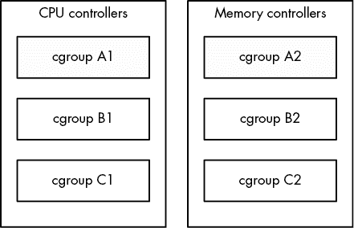
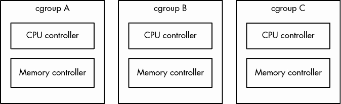

# 第八章：更深入地了解进程和资源利用


本章将深入探讨进程、内核和系统资源之间的关系。硬件资源有三种基本类型：CPU、内存和 I/O。进程争夺这些资源，内核的任务是公平地分配资源。内核本身也是一种资源——一个软件资源，供进程用来执行诸如创建新进程和与其他进程通信等任务。

本章中你看到的许多工具被视为性能监控工具。当你的系统变得非常缓慢，你试图找出原因时，它们特别有用。然而，你不应该过于关注性能。试图优化一个已经正常工作的系统是浪费时间。大多数系统的默认设置已经经过精心选择，因此只有在你有非常特殊的需求时才应该更改它们。相反，应该专注于理解工具实际衡量的*内容*，这样你将深入了解内核的工作方式以及它如何与进程交互。

## 8.1 跟踪进程

在第 2.16 节中，你学会了如何使用 `ps` 命令列出在特定时间运行的系统进程。`ps` 命令列出了当前的进程及其使用统计信息，但它对进程如何随时间变化几乎没有提供帮助。因此，它并不会立即帮助你确定哪个进程占用了过多的 CPU 时间或内存。

`top` 程序提供了一个交互式界面，用于显示 `ps` 命令显示的信息。它展示了当前的系统状态以及 `ps` 列表中的字段，并且每秒更新一次。或许最重要的是，`top` 会将最活跃的进程（默认情况下是当前占用最多 CPU 时间的进程）列在显示的顶部。

你可以通过按键向 `top` 发送命令。其最常用的命令是更改排序顺序或过滤进程列表：

1.  空格键 立即更新显示

1.  M 按当前常驻内存使用量排序

1.  T 按总 (累计) CPU 使用量排序

1.  P 按当前 CPU 使用率排序（默认）

1.  u 显示仅一个用户的进程

1.  f 选择显示不同的统计数据

1.  ? 显示所有 `top` 命令的使用摘要

`atop` 和 `htop` 两个相似的工具提供了增强的视图和功能集。它们的大多数额外功能添加了其他工具中存在的功能。例如，`htop` 共享了许多在下一节中描述的 `lsof` 命令的功能。

## 8.2 使用 lsof 查找打开的文件

`lsof` 命令列出了打开的文件以及使用它们的进程。因为 Unix 非常重视文件，`lsof` 是找出故障点时最有用的工具之一。但是，`lsof` 不仅仅局限于常规文件——它还可以列出网络资源、动态库、管道等。

### 8.2.1 阅读 lsof 输出

在命令行运行 `lsof` 通常会产生大量的输出。以下是你可能会看到的一部分。这些输出（略作调整以提高可读性）包括了来自 systemd（init）进程以及正在运行的 `vi` 进程的打开文件：

```
# lsof

COMMAND  PID   USER   FD    TYPE    DEVICE  SIZE/OFF    NODE NAME
systemd    1   root  cwd     DIR    8,1      4096          2 /
systemd    1   root  rtd     DIR    8,1      4096          2 /
systemd    1   root  txt     REG    8,1   1595792    9961784 /lib/systemd/systemd
systemd    1   root  mem     REG    8,1   1700792    9961570 /lib/x86_64-linux-gnu/libm-2.27.so
systemd    1   root  mem     REG    8,1    121016    9961695 /lib/x86_64-linux-gnu/libudev.so.1

--`snip`--
vi      1994   juser  cwd    DIR    8,1      4096    4587522 /home/juser
vi      1994   juser   3u    REG    8,1     12288     786440 /tmp/.ff.swp

--`snip`--
```

输出在顶部行列出以下字段：

1.  `COMMAND` 持有文件描述符的进程的命令名称。

1.  `PID` 进程 ID。

1.  `USER` 运行进程的用户。

1.  `FD` 该字段可以包含两种元素。在前面的输出中，`FD` 列显示文件的用途。`FD` 字段还可以列出打开文件的 *文件描述符* —— 这是进程与系统库和内核一起用来标识和操作文件的数字；最后一行显示了一个文件描述符为 `3` 的文件。

1.  `TYPE` 文件类型（常规文件、目录、套接字等）。

1.  `DEVICE` 持有文件的设备的主次设备号。

1.  `SIZE/OFF` 文件的大小。

1.  `NODE` 文件的 inode 号。

1.  `NAME` 文件名。

`lsof(1)` 手册页包含了你可能在每个字段中看到的完整列表，但输出应该是自解释的。例如，查看 `FD` 字段中带有 `cwd` 的条目。这些行表示进程的当前工作目录。另一个例子是最后一行，它显示了一个用户的 `vi` 进程（PID 1994）正在使用的临时文件。

### 8.2.2 使用 lsof

运行 `lsof` 有两种基本方法：

+   列出所有内容并将输出管道传输到像 `less` 这样的命令，然后搜索你要查找的内容。由于输出量巨大，这可能需要一些时间。

+   使用命令行选项缩小 `lsof` 提供的列表。

你可以使用命令行选项提供一个文件名作为参数，让 `lsof` 只列出匹配该参数的条目。例如，以下命令显示了在 */usr* 及其所有子目录中打开的文件条目：

```
$ **lsof +D /usr**
```

要列出某个特定进程 ID 的打开文件，请运行：

```
$ **lsof -p** `pid`
```

要简要查看 `lsof` 的众多选项，请运行 `lsof -h`。大多数选项与输出格式有关。（有关 `lsof` 网络功能的讨论，请参见第十章。）

## 8.3 跟踪程序执行和系统调用

我们到目前为止看到的工具检查的是活动进程。然而，如果你根本不知道为什么程序在启动后几乎立即死掉，`lsof` 是帮不上忙的。事实上，你甚至很难在命令失败时同时运行 `lsof`。

`strace`（系统调用跟踪）和 `ltrace`（库跟踪）命令可以帮助你发现程序试图执行的操作。这些工具会产生非常大量的输出，但一旦你知道该查找什么，你将能够获得更多的信息来追踪问题。

### 8.3.1 strace

回想一下，*系统调用*是用户空间进程请求内核执行的特权操作，比如打开文件并读取数据。`strace`工具会打印进程执行的所有系统调用。要查看它的实际操作，运行以下命令：

```
$ **strace cat /dev/null**
```

默认情况下，`strace`将其输出发送到标准错误。如果你想将输出保存到文件中，可以使用`-o` `save_file`选项。你也可以通过在命令行中附加`2>` `save_file`来重定向输出，但这也会捕获你正在检查的命令的任何标准错误。

在第一章中，你学到当一个进程想要启动另一个进程时，它调用`fork()`系统调用来生成自己的副本，然后副本使用`exec()`系列系统调用中的一个来启动新程序。`strace`命令在`fork()`调用之后开始跟踪新进程（即原始进程的副本）。因此，来自此命令的输出的第一行应该显示`execve()`的执行，接着是内存初始化调用`brk()`，如下所示：

```
execve("/bin/cat", ["cat", "/dev/null"], 0x7ffef0be0248 /* 59 vars */) = 0
brk(NULL)                               = 0x561e83127000
```

输出的下一部分主要涉及加载共享库。除非你真的想深入研究共享库系统，否则可以忽略这一部分：

```
access("/etc/ld.so.nohwcap", F_OK)      = -1 ENOENT (No such file or directory)
openat(AT_FDCWD, "/etc/ld.so.cache", O_RDONLY|O_CLOEXEC) = 3
fstat(3, {st_mode=S_IFREG|0644, st_size=119531, ...}) = 0
mmap(NULL, 119531, PROT_READ, MAP_PRIVATE, 3, 0) = 0x7fa9db241000
close(3)                                = 0

--`snip`--
openat(AT_FDCWD, "/lib/x86_64-linux-gnu/libc.so.6", O_RDONLY|O_CLOEXEC) = 3
read(3, "\177ELF\2\1\1\3\0\0\0\0\0\0\0\0\3\0>\0\1\0\0\0\260\34\2\0\0\0\0\0"..., 832) = 832
```

此外，跳过`mmap`输出，直到你看到输出末尾附近的类似如下的行：

```
fstat(1, {st_mode=S_IFCHR|0620, st_rdev=makedev(0x88, 1), ...}) = 0
openat(AT_FDCWD, "/dev/null", O_RDONLY) = 3
fstat(3, {st_mode=S_IFCHR|0666, st_rdev=makedev(0x1, 3), ...}) = 0
fadvise64(3, 0, 0, POSIX_FADV_SEQUENTIAL) = 0
mmap(NULL, 139264, PROT_READ|PROT_WRITE, MAP_PRIVATE|MAP_ANONYMOUS, -1, 0) = 0x7fa9db21b000
read(3, "", 131072)                     = 0
munmap(0x7fa9db21b000, 139264)          = 0
close(3)                                = 0
close(1)                                = 0
close(2)                                = 0
exit_group(0)                           = ?
+++ exited with 0 +++
```

这部分输出展示了命令的执行情况。首先，查看`openat()`调用（`open()`的一个略微变化），它打开了一个文件。`3`是一个表示成功的结果（`3`是内核在打开文件后返回的文件描述符）。在其下方，你可以看到`cat`从*/dev/null*读取数据（即`read()`调用，文件描述符也是`3`）。然后没有更多的内容可以读取，所以程序关闭文件描述符并通过`exit_group()`退出。

当命令遇到错误时会发生什么？尝试运行`strace cat` `not_a_file`并检查结果输出中的`open()`调用：

```
openat(AT_FDCWD, "not_a_file", O_RDONLY) = -1 ENOENT (No such file or directory)
```

因为`open()`无法打开文件，所以它返回`-1`以指示错误。你可以看到`strace`报告了具体的错误，并给出了简短的错误描述。

丢失的文件是 Unix 程序中最常见的问题，因此，如果系统日志和其他日志信息没有提供太多帮助，而且你在追踪丢失的文件时别无他法，`strace`可以发挥很大的作用。你甚至可以在那些会`fork()`或自我分离的守护进程上使用它。例如，要追踪一个名为`crummyd`的虚拟守护进程的系统调用，可以输入：

```
$ **strace -o crummyd_strace -ff crummyd**
```

在这个示例中，`strace`的`-o`选项将`crummyd`产生的任何子进程的操作记录到`crummyd_strace.` `pid`文件中，其中`pid`是子进程的进程 ID。

### 8.3.2 ltrace

`ltrace`命令跟踪共享库调用。它的输出与`strace`类似，因此在这里提到它，但它不会跟踪内核级别的任何内容。请注意，*共享库调用*比系统调用要多得多。你肯定需要过滤输出，`ltrace`本身有很多内建选项可以帮助你。

## 8.4 线程

在 Linux 中，一些进程被划分为称为*线程*的部分。线程与进程非常相似——它有一个标识符（*线程 ID*，或*TID*），并且内核像调度进程一样调度和运行线程。然而，不同于独立进程通常不共享系统资源（如内存和 I/O 连接），同一进程中的所有线程共享其系统资源和部分内存。

### 8.4.1 单线程和多线程进程

许多进程只有一个线程。一个有一个线程的进程是*单线程*的，而一个有多个线程的进程是*多线程*的。所有进程在启动时都是单线程的。这个起始线程通常称为*主线程*。主线程可能会启动新的线程，使进程变为多线程，类似于进程通过调用`fork()`启动一个新进程。

多线程进程的主要优势是，当进程有很多任务需要执行时，线程可以在多个处理器上同时运行，从而可能加速计算。尽管使用多个进程也能实现并行计算，但线程的启动速度比进程快，而且线程之间通常比进程通过网络连接或管道等通道进行通信更容易或更高效，因为它们共享内存。

一些程序使用线程来克服管理多个 I/O 资源的问题。传统上，进程有时会使用`fork()`启动一个新的子进程，以处理新的输入或输出流。线程提供了类似的机制，但没有启动新进程的开销。

### 8.4.2 查看线程

默认情况下，`ps`和`top`命令的输出只显示进程。要在`ps`中显示线程信息，需添加`m`选项。清单 8-1 展示了一些示例输出。

```
$ **ps m**
  PID TTY      STAT   TIME COMMAND
 3587 pts/3    -      0:00 bash1
    - -        Ss     0:00 -
 3592 pts/4    -      0:00 bash2
    - -        Ss     0:00 -
12534 tty7     -    668:30 /usr/lib/xorg/Xorg -core :03
    - -        Ssl+ 659:55 -
    - -        Ssl+   0:00 -
    - -        Ssl+   0:00 -
    - -        Ssl+   8:35 - 
```

清单 8-1：使用`ps m`查看线程

这个清单显示了进程及其线程。PID 列中带有数字的每一行（在 1、2 和 3 的位置）表示一个进程，类似于正常的`ps`输出。PID 列中带有破折号的行表示与进程关联的线程。在这个输出中，1 和 2 位置的进程每个只有一个线程，但 3 位置的进程 12534 是多线程的，有四个线程。

如果你想使用`ps`查看 TID，你可以使用自定义输出格式。清单 8-2 仅显示 PID、TID 和命令：

```
$ **ps m -o pid,tid,command**
  PID   TID    COMMAND
 3587     -    bash
    -  3587    -
 3592     -    bash
    -  3592    -
 12534    -    /usr/lib/xorg/Xorg -core :0
    - 12534    -
    - 13227    -
    - 14443    -
    - 14448    -
```

清单 8-2：使用`ps m`显示 PID 和 TID

本列表中的示例输出对应于列表 8-1 中显示的线程。请注意，单线程进程的 TID 与 PID 相同；这就是主线程。对于多线程进程 12534，线程 12534 也是主线程。

线程在资源监控中可能会引起混淆，因为多线程进程中的各个线程可以同时消耗资源。例如，`top`默认不显示线程；你需要按 H 来启用它。对于你即将看到的大多数资源监控工具，你需要做一些额外的操作才能启用线程显示。

## 8.5 资源监控简介

现在，我们将讨论一些资源监控的话题，包括处理器（CPU）时间、内存和磁盘 I/O。我们将从系统范围和每个进程的角度来检查利用率。

许多人为了提高性能而接触 Linux 内核的内部机制。然而，大多数 Linux 系统在默认设置下已经能够很好地运行，你可以花费几天时间调整机器的性能，但如果你不知道该关注什么，可能得不到有意义的结果。所以，在你实验本章工具时，不要考虑性能，而是要关注观察内核如何在各个进程间分配资源。

### 8.5.1 测量 CPU 时间

要随时间监控一个或多个特定进程，可以使用`top`的`-p`选项，语法如下：

```
$ **top -p** `pid1``[`**-p** `pid2 ...]`
```

要了解一个命令在其生命周期内使用了多少 CPU 时间，可以使用`time`。不幸的是，这里有一些混淆，因为大多数 shell 都有内置的`time`命令，它提供的统计信息并不丰富，而在`/usr/bin/time`中有一个系统工具。你可能首先遇到的是`bash`的内置命令，因此尝试使用`ls`命令运行`time`：

```
$ **time ls**
```

在`ls`终止后，`time`应该打印出类似以下的输出：

```
real    0m0.442s
user    0m0.052s
sys     0m0.091s
```

*用户时间*（`user`）是 CPU 运行程序的*自有*代码所花费的秒数。有些命令执行得非常快，以至于 CPU 时间接近 0。*系统时间*（`sys`或`system`）是内核执行进程工作所花费的时间（例如，读取文件和目录）。最后，真实时间（`real`）（也叫*经过时间*）是从开始到结束运行进程所花费的总时间，包括 CPU 执行其他任务的时间。这个数字通常对性能测量不是很有用，但从经过时间中减去用户时间和系统时间，可以大致了解进程在等待系统和外部资源上的时间。例如，等待网络服务器响应请求所花费的时间会显示在经过时间中，但不会显示在用户时间或系统时间中。

### 8.5.2 调整进程优先级

你可以改变内核如何调度进程，从而使该进程比其他进程获取更多或更少的 CPU 时间。内核根据进程的调度 *优先级* 运行每个进程，优先级是一个介于 –20 和 20 之间的数字，其中 –20 代表最高优先级。（是的，这可能会让人感到困惑。）

`ps -l` 命令列出了进程的当前优先级，但通过 `top` 命令查看优先级的实际效果会更直观，如下所示：

```
$ **top**
Tasks: 244 total,   2 running, 242 sleeping,   0 stopped,   0 zombie
Cpu(s): 31.7%us,  2.8%sy,  0.0%ni, 65.4%id,  0.2%wa,  0.0%hi,  0.0%si,  0.0%st
Mem:   6137216k total,  5583560k used,   553656k free,    72008k buffers
Swap:  4135932k total,   694192k used,  3441740k free,   767640k cached

 PID USER      PR  NI  VIRT  RES  SHR S %CPU %MEM    TIME+  COMMAND           
28883 bri       20   0 1280m 763m  32m S   58 12.7 213:00.65 chromium-browse    
 1175 root      20   0  210m  43m  28m R   44  0.7  14292:35 Xorg               
 4022 bri       20   0  413m 201m  28m S   29  3.4   3640:13 chromium-browse    
 4029 bri       20   0  378m 206m  19m S    2  3.5  32:50.86 chromium-browse    
 3971 bri       20   0  881m 359m  32m S    2  6.0 563:06.88 chromium-browse    
 5378 bri       20   0  152m  10m 7064 S    1  0.2  24:30.21 xfce4-session             
 3821 bri       20   0  312m  37m  14m S    0  0.6  29:25.57 soffice.bin        
 4117 bri       20   0  321m 105m  18m S    0  1.8  34:55.01 chromium-browse    
 4138 bri       20   0  331m  99m  21m S    0  1.7 121:44.19 chromium-browse    
 4274 bri       20   0  232m  60m  13m S    0  1.0  37:33.78 chromium-browse    
 4267 bri       20   0 1102m 844m  11m S    0 14.1  29:59.27 chromium-browse                
 2327 bri       20   0  301m  43m  16m S    0  0.7 109:55.65 xfce4-panel 
```

在这个 `top` 输出中，`PR`（优先级）列列出了内核为该进程分配的当前调度优先级。数字越大，内核在其他进程需要 CPU 时间时调度该进程的可能性就越小。然而，仅凭调度优先级并不能完全决定内核是否分配 CPU 时间给一个进程，内核还可能根据进程消耗的 CPU 时间在程序执行过程中调整优先级。

在优先级列旁边是 `NI`（*nice 值*）列，它向内核调度器提供了一个提示。这是你在尝试影响内核决策时需要关注的内容。内核将 nice 值与当前优先级相加，确定下一个进程的时间片。当你将 nice 值设置得更高时，你是在对其他进程“更友好”，因为内核会优先考虑这些进程。

默认情况下，nice 值为 0。如果你正在后台运行一个大规模的计算任务，而不希望它影响到你的交互式会话，你可以通过 `renice` 命令将该进程的 nice 值更改为 20，使得该进程在其他任务没有工作时才会运行（其中 `pid` 是你要更改的进程的进程 ID）：

```
$ **renice 20** `pid`
```

如果你是超级用户，你可以将 nice 值设置为负数，但这样做几乎总是个坏主意，因为系统进程可能得不到足够的 CPU 时间。事实上，你可能不需要经常更改 nice 值，因为许多 Linux 系统只有一个用户，而这个用户并不进行大量的实际计算。（nice 值在多用户共享单台机器时更为重要。）

### 8.5.3 使用负载平均值衡量 CPU 性能

整体 CPU 性能是最容易衡量的指标之一。*负载平均值* 是当前准备运行的进程的平均数量。也就是说，它是任何给定时刻能够使用 CPU 的进程数量的估计——这包括正在运行的进程以及那些等待使用 CPU 的进程。在考虑负载平均值时，请记住，系统中的大多数进程通常在等待输入（例如来自键盘、鼠标或网络的输入），这意味着它们没有准备好运行，因此不应对负载平均值产生影响。只有那些实际在执行某些任务的进程才会影响负载平均值。

#### 使用 uptime

`uptime` 命令除了显示内核运行的时间外，还会告诉你三个负载平均值：

```
$ **uptime**
... up 91 days, ... load average: **0.08, 0.03, 0.01**
```

这三个加粗的数字分别表示过去 1 分钟、5 分钟和 15 分钟的负载平均值。如你所见，这个系统并不是很繁忙：在过去的 15 分钟里，所有处理器上平均只有 0.01 个进程在运行。换句话说，如果你只有一个处理器，它在过去的 15 分钟里只有 1%的时间在运行用户空间应用程序。

传统上，大多数桌面系统在你进行任何操作时，负载平均值大约为 0，*除了*编译程序或玩游戏以外。负载平均值为 0 通常是一个好兆头，因为这意味着处理器没有受到挑战，你也节省了电力。

然而，当前桌面系统上的用户界面组件通常会占用更多的 CPU 资源，尤其是某些网站（尤其是它们的广告）导致 Web 浏览器变成资源消耗大户。

如果负载平均值上升到大约 1，可能是某个单一进程几乎一直在使用 CPU。要识别这个进程，可以使用`top`命令；该进程通常会出现在显示的顶部。

现代系统大多数都有多个处理器核心或 CPU，因此多个进程可以轻松并行运行。如果你有两个核心，负载平均值为 1 意味着任何给定时刻只有一个核心可能在活动，而负载平均值为 2 则意味着两个核心的工作量恰好足够它们全天候运行。

#### 管理高负载

高负载平均值并不一定意味着你的系统出现问题。如果系统拥有足够的内存和 I/O 资源，它可以轻松地处理许多正在运行的进程。如果你的负载平均值很高且系统响应良好，不要惊慌；系统只是在大量进程共享 CPU 资源。这些进程必须相互竞争处理器时间，因此它们需要比平时更长时间才能完成计算。另一个高负载平均值可能是正常的情况是在 Web 服务器或计算服务器上，进程的启动和终止非常迅速，以至于负载平均值的测量机制无法有效地工作。

然而，如果负载平均值非常高，并且你感觉系统变慢了，可能是遇到了内存性能问题。当系统内存不足时，内核可能会开始*交换*，或者迅速将内存交换到磁盘上并再交换回来。当这种情况发生时，许多进程会变得准备就绪，但是它们的内存可能不可用，因此它们会保持在准备就绪状态（导致负载平均值增高），比正常情况下停留的时间要长得多。接下来，我们将通过更详细地探讨内存，来了解为什么会发生这种情况。

### 8.5.4 监控内存状态

检查系统内存状态的最简单方法之一是运行`free`命令或查看*/proc/meminfo*，看看有多少真实内存用于缓存和缓冲区。如前所述，性能问题可能是由于内存不足引起的。如果没有使用太多缓存/缓冲区内存（而其余的真实内存已被占用），你可能需要更多内存。然而，将每个性能问题归咎于内存不足是过于简单的做法。

#### 内存工作原理

如第一章所解释的，CPU 有一个内存管理单元（MMU），它为内存访问提供灵活性。内核通过将进程使用的内存分解为称为*页面*的较小块来协助 MMU。内核维护一个数据结构，称为*页表*，它将进程的虚拟页面地址映射到内存中的真实页面地址。当进程访问内存时，MMU 根据内核的页表将进程使用的虚拟地址转换为真实地址。

用户进程实际上并不需要所有内存页面立即可用才能运行。内核通常会根据进程的需要加载和分配页面；这种系统被称为*按需分页*，或简称为*需求分页*。为了理解这个过程，考虑程序如何作为新进程启动和运行：

1.  内核将程序指令代码的开头加载到内存页面中。

1.  内核可能会为新进程分配一些工作内存页面。

1.  当进程运行时，它可能会到达一个点，此时其代码中的下一条指令并不在内核最初加载的任何页面中。此时，内核接管，加载必要的页面到内存中，然后让程序继续执行。

1.  同样，如果程序需要比最初分配的更多工作内存，内核会通过寻找空闲页面（或腾出空间）并分配给进程来处理。

你可以通过查看内核配置来获取系统的页面大小：

```
$ **getconf PAGE_SIZE**
4096
```

这个数字是以字节为单位的，对于大多数 Linux 系统，4k 是典型的值。

内核不会随意将真实内存页面映射到虚拟地址；也就是说，它不会把所有可用的页面放入一个大池中并从中分配。真实内存有许多分区，这些分区依赖于硬件限制、内核对连续页面的优化以及其他因素。然而，当你刚开始学习时，不必担心这些细节。

#### 页面错误

如果进程想要使用的内存页面还没准备好，进程会触发一个*页面错误*。在页面错误发生时，内核从进程那里接管 CPU，以准备该页面。页面错误有两种类型：轻微页面错误和重大页面错误。

轻微页面错误

1.  *次要页错误*发生在所需页面实际上已经在主内存中，但内存管理单元（MMU）不知道它的位置。这可能发生在进程请求更多内存时，或者当 MMU 没有足够的空间存储所有进程的页面位置时（MMU 的内部映射表通常很小）。在这种情况下，内核会告知 MMU 页面的位置，并允许进程继续执行。次要页错误不需要担心，许多次要页错误会在进程运行时发生。

重大页错误

1.  *重大页错误*发生在所需的内存页根本不在主内存中时，这意味着内核必须从磁盘或其他较慢的存储机制加载它。大量的重大页错误会拖慢系统速度，因为内核必须进行大量工作才能提供这些页面，剥夺了正常进程的运行机会。

1.  一些重大页错误是不可避免的，例如首次运行程序时从磁盘加载代码时发生的错误。最大的难题出现在内存不足时，内核必须开始将工作内存的页面交换到磁盘，以便为新页面腾出空间，这可能导致频繁的页面交换。

您可以使用`ps`、`top`和`time`命令深入查看单个进程的页错误。您需要使用系统版本的`time`（`/usr/bin/time`），而不是 Shell 内建的版本。以下是`time`命令如何显示页错误的简单示例（`cal`命令的输出无关紧要，因此我们通过将其重定向到*/dev/null*来丢弃它）：

```
$ **/usr/bin/time cal > /dev/null**
0.00user 0.00system 0:00.06elapsed 0%CPU (0avgtext+0avgdata 3328maxresident)k
648inputs+0outputs (**2major+254minor**)pagefaults 0swaps
```

如您从加粗文本中所见，当此程序运行时，共发生了 2 个重大页错误和 254 个次要页错误。重大页错误发生在内核第一次需要从磁盘加载程序时。如果您再次运行此命令，您可能不会遇到任何重大页错误，因为内核会从磁盘缓存这些页面。

如果您希望在进程运行时查看页错误，请使用`top`或`ps`。运行`top`时，使用`f`来更改显示字段，并选择`nMaj`作为其中一个列，以显示重大页错误的数量。如果您正在追踪可能出现问题的进程，选择`vMj`（自上次更新以来的重大页错误数量）可能会有所帮助。

使用`ps`时，您可以使用自定义输出格式查看特定进程的页错误。以下是 PID 为 20365 的示例：

```
$ **ps -o pid,min_flt,maj_flt 20365**
  PID  MINFL  MAJFL	
20365 834182     23
```

`MINFL`和`MAJFL`列显示了次要和重大页错误的数量。当然，您可以结合任何其他进程选择选项，如 ps(1)手册页中所述。

按进程查看页错误有助于您锁定某些问题组件。然而，如果您对系统的整体性能感兴趣，您需要一种工具来总结所有进程的 CPU 和内存活动。

### 8.5.5 使用 vmstat 监控 CPU 和内存性能

在众多用于监控系统性能的工具中，`vmstat`命令是最古老且开销最小的工具之一。你会发现它非常方便，能帮助你从高层次了解内核交换页面的频率、CPU 的繁忙程度，以及 I/O 资源的使用情况。

解锁`vmstat`功能的诀窍是理解其输出。例如，以下是`vmstat 2`的输出，每两秒报告一次统计数据：

```
$ **vmstat 2**
procs -----------memory---------- ---swap-- -----io---- -system-- ----cpu----
 r  b   swpd   free   buff  cache   si   so    bi    bo   in   cs us sy id wa
 2  0 320416 3027696 198636 1072568    0    0     1     1    2    0 15  2 83  0
 2  0 320416 3027288 198636 1072564    0    0     0  1182  407  636  1  0 99  0
 1  0 320416 3026792 198640 1072572    0    0     0    58  281  537  1  0 99  0
 0  0 320416 3024932 198648 1074924    0    0     0   308  318  541  0  0 99  1
 0  0 320416 3024932 198648 1074968    0    0     0     0  208  416  0  0 99  0
 0  0 320416 3026800 198648 1072616    0    0     0     0  207  389  0  0 100  0
```

输出分为几个类别：`procs`表示进程，`memory`表示内存使用情况，`swap`表示交换进出的页面，`io`表示磁盘使用情况，`system`表示内核切换到内核代码的次数，`cpu`表示系统各部分使用的时间。

上述输出典型地反映了一个系统在没有太多活动时的情况。你通常会关注第二行输出——第一行是系统整个运行时间的平均值。例如，这里系统有 320,416KB 的内存被交换到磁盘（`swpd`），大约有 3,027,000KB（3GB）的实际内存是`free`的。即使有一些交换空间正在使用，零值的`si`（swap-in）和`so`（swap-out）列表明内核当前并没有将任何数据从磁盘交换进或交换出。`buff`列显示了内核用于磁盘缓冲区的内存量（参见第 4.2.5 节）。

在最右侧的 CPU 部分，你可以看到`us`、`sy`、`id`和`wa`列中的 CPU 时间分布。这些分别表示 CPU 在用户任务、系统（内核）任务、空闲时间和等待 I/O 上的时间百分比。在前面的示例中，用户进程并不多（它们使用最多 1%的 CPU）；内核几乎没有做任何事情，CPU99%的时间都处于空闲状态。

列表 8-3 显示了一个大型程序启动时的情况。

```
procs -----------memory---------- ---swap-- -----io---- -system-- ----cpu----
 r  b   swpd   free   buff  cache   si   so    bi    bo   in   cs us sy id wa
 1  0 320412 2861252 198920 1106804    0    0     0     0 2477 4481 25  2 72  0 1
 1  0 320412 2861748 198924 1105624    0    0     0    40 2206 3966 26  2 72  0
 1  0 320412 2860508 199320 1106504    0    0   210    18 2201 3904 26  2 71  1
 1  1 320412 2817860 199332 1146052    0    0 19912     0 2446 4223 26  3 63  8
 2  2 34 2791608 200612 1157752  202    0  4960   854 3371 5714 27  3 51 18 2
 1  1 320252 2772076 201076 1166656   10    0  2142  1190 4188 7537 30  3 53 14
 0  3 320244 2727632 202104 1175420   20    0  1890   216 4631 8706 36  4 46 14
```

列表 8-3：内存活动

如列表 8-3 中 1 所示，CPU 开始长时间有一些使用，尤其是用户进程的使用。由于有足够的空闲内存，随着内核使用磁盘的频率增加，缓存和缓冲区的使用量也开始增加。

接下来，我们看到一些有趣的情况：注意第 2 行，内核将一些曾经被交换出去的页面拉回到内存中（`si`列）。这意味着刚刚运行的程序可能访问了一些由其他进程共享的页面，这很常见——许多进程仅在启动时使用某些共享库中的代码。

同时，从`b`列可以看到，有几个进程被*阻塞*（不能运行），因为它们在等待内存页面。总体来看，空闲内存的量在减少，但仍远未耗尽。磁盘活动也相当频繁，正如`bi`（blocks in）和`bo`（blocks out）列中数字的增加所示。

当内存用尽时，输出会有所不同。随着空闲空间的减少，缓冲区和缓存的大小会缩小，因为内核越来越需要这些空间来处理用户进程。一旦没有剩余空间，你会在`so`（已交换出去）列中看到活动，因为内核开始将页面移到磁盘上，这时几乎所有其他输出列都会发生变化，反映出内核正在进行的工作量。你会看到更多的系统时间、更多数据进出磁盘，以及更多进程被阻塞，因为它们想使用的内存不可用（已被交换出去）。

我们还没有探索完`vmstat`输出的所有列。你可以在`vmstat(8)`手册页中深入了解这些列，但你可能需要先通过课堂或像 Silberschatz、Gagne 和 Galvin 的《操作系统概念》第 10 版（Wiley，2018）这样的书籍，学习更多关于内核内存管理的知识，才能理解它们。

### 8.5.6 I/O 监控

默认情况下，`vmstat` 提供一些通用的 I/O 统计信息。尽管你可以通过`vmstat -d`获取非常详细的每个分区的资源使用情况，但这选项的输出可能会让你感到不知所措。相反，尝试使用一个专门用于 I/O 的工具 `iostat`。

#### 使用 iostat

和 `vmstat` 一样，`iostat` 在不带任何选项运行时，会显示机器当前的运行时统计信息：

```
$ **iostat**
[`kernel information`]
avg-cpu:  %user   %nice %system %iowait  %steal   %idle
           4.46    0.01    0.67    0.31    0.00   94.55

Device:            tps    kB_read/s    kB_wrtn/s    kB_read    kB_wrtn
sda               4.67         7.28        49.86    9493727   65011716
sde               0.00         0.00         0.00       1230          0 
```

顶部的`avg-cpu`部分报告了与本章其他工具相同的 CPU 利用率信息，因此跳到底部，底部会显示每个设备的以下信息：

1.  `tps` 每秒的数据传输平均次数

1.  `kB_read/s` 每秒读取的千字节数

1.  `kB_wrtn/s` 每秒写入的千字节数

1.  `kB_read` 读取的千字节总数

1.  `kB_wrtn` 写入的千字节总数

另一个和 `vmstat` 相似的是，你可以提供一个间隔参数，比如 `iostat 2`，以便每两秒更新一次。在使用间隔时，你可能只想通过使用 `-d` 选项显示设备报告（例如 `iostat -d 2`）。

默认情况下，`iostat` 输出省略了分区信息。要显示所有分区信息，可以使用`-p ALL`选项。由于典型系统有许多分区，你会得到大量的输出。以下是你可能看到的部分内容：

```
$ **iostat -p ALL**
--`snip`--
Device:            tps    kB_read/s    kB_wrtn/s    kB_read    kB_wrtn
--`snip`--
sda               4.67         7.27        49.83    9496139   65051472
sda1              4.38         7.16        49.51    9352969   64635440
sda2              0.00         0.00         0.00          6          0
sda5              0.01         0.11         0.32     141884     416032
scd0              0.00         0.00         0.00          0          0
--`snip`--
sde               0.00         0.00         0.00       1230          0
```

在这个例子中，`sda1`、`sda2` 和 `sda5` 都是 `sda` 磁盘的分区，因此读取和写入的列会有一些重叠。然而，分区列的总和不一定等于磁盘列。尽管从 `sda1` 的读取也计为从 `sda` 的读取，但请记住，你可以直接从 `sda` 读取，例如读取分区表时。

#### 每进程 I/O 利用率与监控：iotop

如果你需要更深入地了解各个进程使用的 I/O 资源，`iotop`工具可以提供帮助。使用`iotop`类似于使用`top`。它会生成一个持续更新的显示，展示使用最多 I/O 的进程，并在顶部提供一个概览：

```
# iotop
Total DISK READ:       4.76 K/s | Total DISK WRITE:     333.31 K/s
  TID  PRIO  USER     DISK READ  DISK WRITE  SWAPIN     IO>    COMMAND          
  260 be/3 root        0.00 B/s   38.09 K/s  0.00 %  6.98 % [jbd2/sda1-8]
 2611 be/4 juser       4.76 K/s   10.32 K/s  0.00 %  0.21 % zeitgeist-daemon
 2636 be/4 juser       0.00 B/s   84.12 K/s  0.00 %  0.20 % zeitgeist-fts
 1329 be/4 juser       0.00 B/s   65.87 K/s  0.00 %  0.03 % soffice.b~ash-pipe=6
 6845 be/4 juser       0.00 B/s  812.63 B/s  0.00 %  0.00 % chromium-browser
19069 be/4 juser       0.00 B/s  812.63 B/s  0.00 %  0.00 % rhythmbox
```

除了用户、命令和读/写列外，请注意，有一个 TID 列，而不是 PID 列。`iotop`是为数不多的显示线程而不是进程的工具之一。

`PRIO`（优先级）列表示 I/O 优先级。它类似于你已经看到的 CPU 优先级，但它影响内核调度进程的 I/O 读写的速度。在像`be/4`这样的优先级中，`be`部分是*调度类*，数字表示优先级级别。与 CPU 优先级一样，数字越小越重要；例如，内核允许一个优先级为`be/3`的进程比一个优先级为`be/4`的进程有更多的 I/O 时间。

内核使用调度类来为 I/O 调度提供更多的控制。你将在`iotop`中看到三种调度类：

1.  `be` 最佳努力。内核尽力为这一类别公平地调度 I/O。大多数进程都运行在这个 I/O 调度类别下。

1.  `rt` 实时。无论如何，内核在调度任何其他类别的 I/O 之前，都会首先调度实时 I/O。

1.  `idle` 空闲。内核仅在没有其他 I/O 任务时才会为这一类执行 I/O 操作。空闲调度类没有优先级。

你可以使用`ionice`工具查看和更改进程的 I/O 优先级；有关详细信息，请参见 ionice(1)手册页。不过，你可能永远不需要关心 I/O 优先级。

### 8.5.7 使用 pidstat 进行每个进程的监控

你已经看过如何使用像`top`和`iotop`这样的工具来监控特定进程。然而，这个显示会随着时间刷新，每次更新都会覆盖前面的输出。`pidstat`工具允许你以`vmstat`的风格查看一个进程随时间变化的资源消耗。以下是一个简单的例子，用于每秒更新监控进程 1329：

```
$ **pidstat -p 1329 1**
Linux 5.4.0-48-generic (duplex)         11/09/2020      _x86_64_        (4 CPU)

09:26:55 PM   UID  PID    %usr %system  %guest    %CPU   CPU  Command
09:27:03 PM  1000  1329    8.00   0.00    0.00    8.00     1  myprocess
09:27:04 PM  1000  1329    0.00   0.00    0.00    0.00     3  myprocess
09:27:05 PM  1000  1329    3.00   0.00    0.00    3.00     1  myprocess
09:27:06 PM  1000  1329    8.00   0.00    0.00    8.00     3  myprocess
09:27:07 PM  1000  1329    2.00   0.00    0.00    2.00     3  myprocess
09:27:08 PM  1000  1329    6.00   0.00    0.00    6.00     2  myprocess
```

默认输出显示用户时间和系统时间的百分比，以及 CPU 时间的总体百分比，它甚至会告诉你进程在哪个 CPU 上运行。（这里的`%guest`列有点奇怪——它表示进程在虚拟机中运行的时间百分比。除非你在运行虚拟机，否则不用担心这个。）

虽然`pidstat`默认显示 CPU 使用率，但它可以做更多的事情。例如，你可以使用`-r`选项来监控内存，使用`-d`来开启磁盘监控。试试看，然后查看 pidstat(1)手册页，了解更多关于线程、上下文切换或我们在本章中讨论的其他任何选项。

## 8.6 控制组（cgroups）

到目前为止，你已经了解了如何查看和监控资源使用情况，但如果你想要限制进程的资源消耗，超过 `nice` 命令的作用呢？有几种传统的系统可以做到这一点，比如 POSIX 的 rlimit 接口，但在 Linux 系统中，最灵活的选择是 *cgroup*（控制组）内核特性，它可以用于大多数资源限制类型。

基本思路是，你将多个进程放入一个 cgroup，这样你就可以基于整个组来管理它们消耗的资源。例如，如果你想限制一组进程总共可以消耗的内存量，cgroup 可以实现这一点。

创建 cgroup 后，你可以将进程添加到其中，然后使用 *控制器* 来改变这些进程的行为。例如，`cpu` 控制器允许你限制处理器时间，`memory` 控制器等也可以做到这一点。

### 8.6.1 区分 cgroup 版本

cgroups 有两个版本，1 和 2，不幸的是，这两个版本当前都在使用，并且可以在同一系统上同时配置，可能会引起混淆。除了功能集有所不同外，这两个版本的结构差异可以总结如下：

+   在 cgroups v1 中，每种类型的控制器（`cpu`、`memory` 等）都有自己的一组 cgroup。一个进程可以属于每个控制器中的一个 cgroup，这意味着一个进程可以属于多个 cgroup。例如，在 v1 中，一个进程可以同时属于 `cpu` cgroup 和 `memory` cgroup。

+   在 cgroups v2 中，一个进程只能属于一个 cgroup。你可以为每个 cgroup 设置不同类型的控制器。

为了更好地理解差异，可以考虑三个进程集合 A、B 和 C。我们希望在每个集合上使用 `cpu` 和 `memory` 控制器。图 8-1 显示了 cgroups v1 的示意图。我们总共需要六个 cgroup，因为每个 cgroup 只能使用一个控制器。



图 8-1：cgroups v1。一个进程可能属于每个控制器中的一个 cgroup。

图 8-2 显示了如何在 cgroups v2 中操作。我们只需要三个 cgroup，因为每个 cgroup 可以设置多个控制器。



图 8-2：cgroups v2。一个进程只能属于一个 cgroup。

你可以通过查看进程的 *cgroup* 文件（位于 */proc/<pid>*）来列出 v1 和 v2 的 cgroup。你可以通过以下命令查看你的 shell 的 cgroups：

```
$ **cat /proc/self/cgroup**
12:rdma:/
11:net_cls,net_prio:/
10:perf_event:/
9:cpuset:/
8:cpu,cpuacct:/user.slice
7:blkio:/user.slice
6:memory:/user.slice
5:pids:/user.slice/user-1000.slice/session-2.scope
4:devices:/user.slice
3:freezer:/
2:hugetlb:/testcgroup 1
1:name=systemd:/user.slice/user-1000.slice/session-2.scope
0::/user.slice/user-1000.slice/session-2.scope
```

如果你发现输出比系统上的要短，不必惊慌；这只是意味着你的系统可能只有 cgroups v2。这里的每一行输出都以一个数字开头，并代表一个不同的 cgroup。以下是如何阅读这些输出的一些提示：

+   数字 2-12 是用于 cgroups v1 的。每个数字旁边列出了对应的控制器。

+   数字 1 也是用于版本 1，但它没有控制器。这个 cgroup 仅用于管理目的（在这种情况下是由 systemd 配置的）。

+   最后一行，第 0 行，是 cgroups v2 的部分。这里没有控制器可见。如果系统没有 cgroups v1，这将是唯一的输出行。

+   名称是层级结构的，类似于文件路径的一部分。在这个例子中，你可以看到一些 cgroups 命名为*/user.slice*，而其他则命名为*/user.slice/user-1000.slice/session-2.scope*。

+   名称*/testcgroup* 1 是为了展示在 cgroups v1 中，进程的 cgroups 可以完全独立。

+   在*user.slice*下，包含*session*的名称表示登录会话，由 systemd 分配。当你查看 shell 的 cgroups 时会看到它们。你系统服务的 cgroups 会在*system.slice*下。

你可能已经推测到，cgroups v1 在某些方面比 v2 更具灵活性，因为你可以将不同的 cgroups 组合分配给进程。然而，事实证明，没有人真正以这种方式使用它们，而且这种方法比每个进程只使用一个 cgroup 的设置和实施更为复杂。

由于 cgroups v1 正在逐步淘汰，我们从现在开始将重点讨论 cgroups v2。请注意，如果在 cgroups v1 中使用了某个控制器，那么由于潜在的冲突，该控制器不能同时在 v2 中使用。这意味着我们接下来要讨论的控制器特定部分，如果你的系统仍在使用 v1，将无法正常工作，但如果你查看正确的地方，你仍然能够跟随 v1 的等效部分。

### 8.6.2 查看 cgroups

与传统的 Unix 系统调用接口不同，cgroups 完全通过文件系统访问，通常挂载为*cgroup2*文件系统，位于*/sys/fs/cgroup*下。（如果你同时运行的是 cgroups v1，通常会在*/sys/fs/cgroup/unified*下。）

让我们来探索一下 shell 的 cgroup 设置。打开一个 shell，找到它的 cgroup，路径为*/proc/self/cgroup*（如前所示）。然后查看*/sys/fs/cgroup*（或*/sys/fs/cgroup/unified*）。你会找到一个与之同名的目录；进入该目录并四处查看：

```
$ **cat /proc/self/cgroup**
0::/user.slice/user-1000.slice/session-2.scope
$ **cd /sys/fs/cgroup/user.slice/user-1000.slice/session-2.scope/**
$ **ls**
```

在这里可能会有许多文件，其中主要的 cgroup 接口文件以*cgroup*开头。首先查看*cgroup.procs*（使用`cat`命令查看即可），该文件列出了 cgroup 中的进程。类似的文件*cgroup.threads*也包含线程。

要查看当前为该 cgroup 使用的控制器，查看*cgroup.controllers*：

```
$ **cat cgroup.controllers**
memory pids
```

大多数用于 shell 的 cgroups 有这两个控制器，可以控制 cgroup 中使用的内存量和进程总数。要与控制器交互，查找与控制器前缀匹配的文件。例如，如果你想查看 cgroup 中运行的线程数，请查阅*pids.current*：

```
$ **cat pids.current**
4
```

要查看该 cgroup 可以消耗的最大内存，查看*memory.max*：

```
$ **cat memory.max**
max
```

`max`的值表示该 cgroup 没有特定的限制，但由于 cgroups 是层级结构，子目录链中的某个 cgroup 可能会限制它。

### 8.6.3 操作和创建 cgroup

虽然你可能永远不需要修改 cgroup，但其实这很简单。要将进程放入 cgroup，只需将其 PID 以 root 用户身份写入 *cgroup.procs* 文件：

```
# echo `pid` **> cgroup.procs**
```

这就是许多 cgroup 变更的工作方式。例如，如果你想限制一个 cgroup 的最大 PID 数量（比如 3,000 个 PID），可以按以下方式操作：

```
# echo 3000 > pids.max
```

创建 cgroup 较为复杂。技术上，它就像在 cgroup 树中创建一个子目录一样简单；当你这么做时，内核会自动创建接口文件。如果一个 cgroup 中没有进程，即使接口文件存在，你也可以使用 `rmdir` 删除该 cgroup。可能会让你困扰的是管理 cgroup 的规则，包括：

+   你只能将进程放入外层（“叶子”）cgroup。例如，如果你有名为 */my-cgroup* 和 */my-cgroup/my-subgroup* 的 cgroup，你不能将进程放入 */my-cgroup*，但是可以放入 */my-cgroup/my-subgroup*。（一个例外是如果 cgroup 没有控制器，但我们不再深入讨论这个话题。）

+   一个 cgroup 不能有一个不在其父 cgroup 中的控制器。

+   必须显式指定子 cgroup 的控制器。你可以通过 *cgroup.subtree_control* 文件来实现；例如，如果你希望子 cgroup 拥有 `cpu` 和 `pids` 控制器，可以将 `+cpu +pids` 写入该文件。

这些规则的例外是位于层级结构底部的根 cgroup。你可以将进程放入该 cgroup。你可能希望这么做的一个原因是将进程从 systemd 的控制中分离出来。

### 8.6.4 查看资源利用情况

除了可以通过 cgroup 限制资源外，你还可以查看所有进程在其 cgroup 中的当前资源使用情况。即使没有启用控制器，你也可以通过查看其 *cpu.stat* 文件来看到一个 cgroup 的 CPU 使用情况：

```
$ **cat cpu.stat**
usage_usec 4617481
user_usec 2170266
system_usec 2447215
```

因为这是该 cgroup 在其整个生命周期中的累计 CPU 使用情况，你可以看到一个服务如何消耗处理器时间，即使它启动了许多最终终止的子进程。

如果启用了适当的控制器，你可以查看其他类型的资源利用情况。例如，`memory` 控制器可以访问 *memory.current* 文件，查看当前的内存使用情况，并访问 *memory.stat* 文件，该文件包含 cgroup 生命周期内的详细内存数据。这些文件在根 cgroup 中不可用。

你可以从 cgroup 中获得更多信息。如何使用每个单独控制器的完整细节，以及创建 cgroup 的所有规则，都可以在内核文档中找到；只需在线搜索“cgroups2 文档”即可找到。

不过，目前你应该已经对 cgroup 的工作原理有了较好的了解。理解它们的基本操作有助于解释 systemd 如何组织进程。稍后，当你阅读关于容器的内容时，你将看到它们如何用于截然不同的目的。

## 8.7 进一步的话题

工具如此之多，用来测量和管理资源利用率的一个原因是，不同类型的资源被消耗的方式各不相同。在本章中，你已经看到 CPU、内存和 I/O 作为系统资源被进程、进程内部的线程以及内核消耗。

这些工具存在的另一个原因是资源是*有限的*，为了让系统良好运行，它的组件必须尽力减少资源的消耗。在过去，许多用户共享同一台机器，因此有必要确保每个用户公平地分配资源。如今，尽管现代桌面计算机可能没有多个用户，但它仍然有许多进程争夺资源。同样，高性能的网络服务器也需要密切监控系统资源，因为它们运行多个进程来处理多个请求。

你可能还想探索的资源监控和性能分析的进一步主题包括：

1.  `sar`（系统活动报告器） `sar`软件包具备`vmstat`的许多连续监控功能，但它还记录了资源利用情况随时间的变化。使用`sar`，你可以回顾特定时刻系统的状态，这在你想分析过去的系统事件时非常有用。

1.  `acct`（进程记账） `acct`软件包可以记录进程及其资源利用情况。

1.  配额 你可以通过`quota`系统限制用户使用的磁盘空间。

如果你特别对系统调优和性能感兴趣，布伦丹·格雷格（Brendan Gregg）所著的《系统性能：企业与云计算》（第 2 版，Addison-Wesley 出版社，2020 年）会讲解得更加详细。

我们还没有涉及到许多可以用来监控网络资源利用率的工具。不过，要使用这些工具，首先需要理解网络是如何工作的。这正是我们接下来要探讨的内容。
