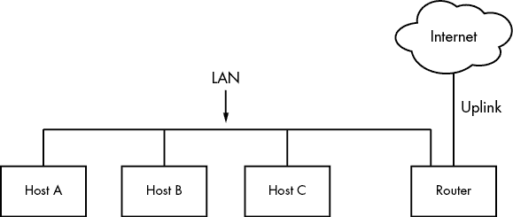
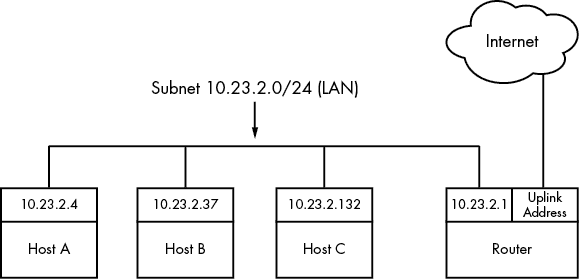
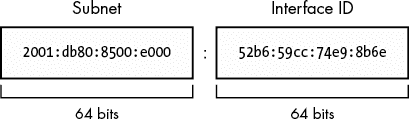
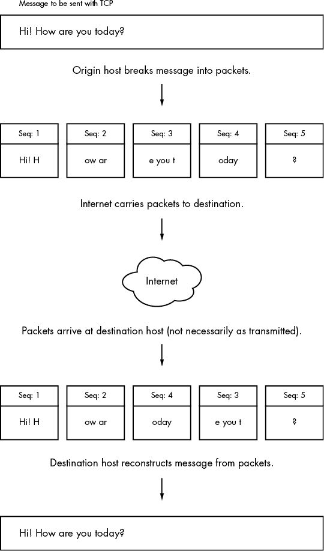
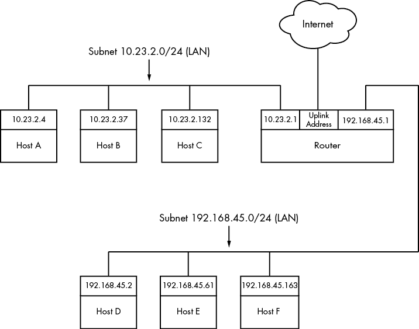
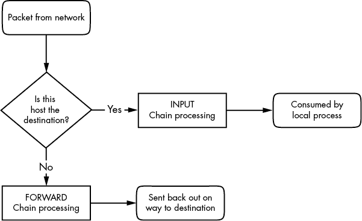

# 第九章：了解你的网络及其配置


网络是连接计算机并在它们之间传输数据的实践。听起来很简单，但要理解它是如何工作的，你需要提出两个基本问题：

+   发送数据的计算机如何知道*把数据发送到哪里*呢？

+   当目标计算机接收到数据时，它如何知道*它刚刚接收到的是什么*呢？

计算机通过使用一系列组件来回答这些问题，每个组件负责发送、接收和识别数据的某个方面。这些组件被组织成多个*网络层*，这些网络层依次堆叠，形成一个完整的系统。Linux 内核处理网络的方式与第三章中描述的 SCSI 子系统类似。

因为每一层往往是独立的，所以可以通过许多不同的组件组合来构建网络。这也是网络配置变得非常复杂的地方。正因如此，我们将从研究非常简单的网络中的层开始。本章将教你如何查看自己的网络设置，当你理解了每一层的基本工作原理后，你就能自己配置这些层。最后，你将进入更高级的主题，比如构建自己的网络和配置防火墙。（如果这些内容让你感到困惑，可以跳过；你总可以回来继续学习。）

## 9.1 网络基础

在深入探讨网络层的理论之前，先看看图 9-1 中展示的简单网络。



图 9-1：一个典型的局域网，路由器提供互联网接入

这种类型的网络是无处不在的；大多数家庭和小型办公室的网络都是这样配置的。每一台连接到网络的计算机称为*主机*。其中之一是*路由器*，它是一个可以将数据从一个网络移动到另一个网络的主机。在这个例子中，这四台主机（主机 A、B、C 和路由器）组成了一个局域网（*LAN*）。局域网中的连接可以是有线的，也可以是无线的。局域网没有严格的定义；局域网上的计算机通常彼此物理接近，且共享相似的配置和访问权限。你很快就会看到一个具体的例子。

路由器也连接到互联网——图中的云。这个连接被称为*上行链路*或广域网（*WAN*）连接，因为它将更小的局域网（LAN）连接到更大的网络。由于路由器同时连接到局域网和互联网，局域网上的所有计算机也可以通过路由器访问互联网。本章的目标之一就是了解路由器是如何提供这种访问的。

你的初步视角将来自一个基于 Linux 的机器，例如图 9-1 中局域网上的主机 A。

## 9.2 数据包

计算机通过网络传输数据时，会将数据分成小块，称为*数据包*，每个数据包由两部分组成：*头部*和*负载*。头部包含标识信息，如源主机和目标主机，以及基本协议。另一方面，负载则是计算机希望发送的实际应用数据（例如 HTML 或图像数据）。

主机可以以任何顺序发送、接收和处理数据包，无论它们来自哪里或将要去往何处，这使得多个主机可以“同时”进行通信。例如，如果一台主机需要同时向两台主机传输数据，它可以在发送的数据包中交替选择目的地。将消息拆分成较小的单元也使得在传输过程中更容易检测并弥补错误。

大部分情况下，你不需要担心在数据包和应用程序使用的数据之间进行转换，因为操作系统会为你处理这个问题。然而，了解数据包在你即将看到的网络层中的角色是很有帮助的。

## 9.3 网络层

一个完全功能的网络包括一组被称为*网络栈*的网络层。任何功能性的网络都有一个栈。典型的互联网栈，从上到下的层级如下：

1.  应用层包含应用程序和服务器用于通信的“语言”——通常是一种高级协议。常见的应用层协议包括超文本传输协议（HTTP，网页使用）、加密协议如 TLS 和文件传输协议（FTP）。应用层协议通常可以组合使用。例如，TLS 常与 HTTP 配合使用，形成 HTTPS。

1.  应用层处理发生在用户空间。

1.  传输层定义了应用层的数据传输特性。该层包括数据完整性检查、源和目标端口、以及在主机端将应用数据拆分为数据包（如果应用层尚未这样做）并在目标端重新组装的规范。传输控制协议（TCP）和用户数据报协议（UDP）是最常见的传输层协议。传输层有时被称为*协议层*。

1.  在 Linux 中，传输层及以下的所有层主要由内核处理，但也有一些例外，数据包会被发送到用户空间进行处理。

1.  网络层或互联网层定义了如何将数据包从源主机传输到目标主机。互联网的特定数据包传输规则集被称为*互联网协议（IP）*。因为本书只讨论互联网网络，所以我们实际上只讨论互联网层。然而，由于网络层旨在硬件独立，你可以在一台主机上同时配置多个独立的网络层——如 IP（IPv4）、IPv6、IPX 和 AppleTalk。

1.  物理层 定义了如何通过物理介质发送原始数据，例如以太网或调制解调器。这有时被称为*链路层*或*主机到网络层*。

理解网络堆栈的结构非常重要，因为你的数据必须至少通过这些层两次才能到达目标程序。例如，如果你从主机 A 向主机 B 发送数据，如图 9-1 所示，你的数据字节会离开主机 A 的应用层，穿过主机 A 的传输层和网络层；然后它们下降到物理介质，通过介质，再通过各个较低层次，最终到达主机 B 的应用层。如果你通过路由器向互联网上的主机发送数据，它会经过路由器的某些（但通常不是全部）层以及任何其他中间设备。

层有时会以奇怪的方式互相重叠，因为按顺序处理所有层可能效率低下。例如，历史上仅处理物理层的设备现在有时会同时查看传输层和互联网层的数据，以便快速过滤和路由数据。此外，术语本身可能会让人困惑。例如，TLS 代表传输层安全性，但实际上它位于更高的层次——应用层。（当你学习基础知识时，不用太担心这些烦人的细节。）

我们将首先看看你的 Linux 机器是如何连接到网络的，以回答本章开头的*where*问题。这是堆栈的底部——物理层和网络层。稍后，我们将查看回答*what*问题的上面两个层。

## 9.4 互联网层

我们将从网络层开始，而不是从网络堆栈的最底层——物理层开始，因为网络层可能更容易理解。我们目前所知道的互联网是基于互联网协议版本 4（IPv4）和版本 6（IPv6）。互联网层的一个最重要方面是，它旨在成为一个软件网络，不对硬件或操作系统提出任何特定要求。其想法是，你可以通过任何类型的硬件，使用任何操作系统，发送和接收互联网数据包。

我们的讨论将从 IPv4 开始，因为它的地址稍微容易阅读（并且理解其局限性），但我们会解释 IPv6 的主要区别。

互联网的拓扑是去中心化的；它由称为*子网*的较小网络组成。这个想法是，所有子网以某种方式相互连接。例如，在图 9-1 中，局域网通常是一个单一的子网。

一台主机可以连接到多个子网。正如你在第 9.1 节看到的，如果主机能够在不同子网之间传输数据，它就被称为路由器（路由器的另一个术语是*网关*）。图 9-2 通过将局域网标识为子网，并为每个主机和路由器指定互联网地址，完善了图 9-1。图中的路由器有两个地址，一个是本地子网 10.23.2.1，另一个是连接到互联网的地址（互联网连接的地址目前并不重要，因此它被标记为上行地址）。我们首先来看看这些地址，然后再看子网表示法。

每个互联网主机至少有一个数字的*IP 地址*。对于 IPv4，它的格式是*a.b.c.d*，例如 10.23.2.37。这样的地址表示法称为*点分四段*序列。如果一台主机连接到多个子网，它在每个子网上至少有一个 IP 地址。每台主机的 IP 地址应该在整个互联网中是唯一的，但正如你稍后会看到的，私有网络和网络地址转换（NAT）可能会让这个问题变得有些复杂。

不用担心图 9-2 中的子网表示法，我们稍后会讨论。



图 9-2：带有 IP 地址的网络

IP 地址在某些方面类似于邮政地址。为了与另一台主机通信，你的机器必须知道另一台主机的 IP 地址。

让我们来看看你机器上的地址。

### 9.4.1 查看 IP 地址

一台机器可以拥有多个 IP 地址，支持多个物理接口、虚拟内部网络等。要查看在 Linux 机器上活动的地址，请运行：

```
$ **ip address show**
```

可能会有大量的输出（按物理接口分组，详见第 9.10 节），但它应该包括如下内容：

```
2: enp0s31f6: <BROADCAST,MULTICAST,UP,LOWER_UP> mtu 1500 qdisc fq_codel state UP group default qlen 1000
    link/ether 40:8d:5c:fc:24:1f brd ff:ff:ff:ff:ff:ff
    inet 10.23.2.4/24 brd 10.23.2.255 scope global noprefixroute enp0s31f6
       valid_lft forever preferred_lft forever
```

`ip`命令的输出包含来自互联网层和物理层的许多详细信息。（有时它甚至根本不会显示互联网地址！）我们稍后会更详细地讨论输出内容，但现在，请关注第四行，它报告主机已配置一个 IPv4 地址（以`inet`表示）为 10.23.2.4。地址后面的`/24`有助于定义该 IP 地址所属的子网。我们来看一下它是如何工作的。

### 9.4.2 子网

如前所述，子网是一个由 IP 地址位于特定范围内的主机组成的连接组。例如，10.23.2.1 到 10.23.2.254 范围内的主机可以组成一个子网，同样，10.23.1.1 到 10.23.255.254 之间的所有主机也可以组成一个子网。通常，子网中的主机位于同一个物理网络中，如图 9-2 所示。

你定义一个子网有两个部分：一个 *网络前缀*（也叫 *路由前缀*）和一个 *子网掩码*（有时叫做 *网络掩码* 或 *路由掩码*）。假设你想创建一个包含 10.23.2.1 到 10.23.2.254 之间 IP 地址的子网。网络前缀是所有子网地址中 *共同* 的部分；在这个例子中，它是 10.23.2.0，子网掩码是 255.255.255.0。让我们看看这些数字是如何来的。

为了了解前缀和子网掩码如何协同工作，从而给出子网上所有可能的 IP 地址，我们将查看二进制形式。子网掩码标记了 IP 地址中与子网共有的位位置。例如，下面是 10.23.2.0 和 255.255.255.0 的二进制形式。

```
10.23.2.0:        00001010 00010111 00000010 00000000
255.255.255.0:    11111111 11111111 11111111 00000000
```

现在，让我们使用粗体标记 10.23.2.0 中在 255.255.255.0 中为 1 的位位置：

```
10.23.2.0:        **00001010 00010111 00000010** 00000000
```

任何包含粗体位配置的地址都在该子网中。查看那些 *不* 是粗体的位（最后一组八个 0），将这些位中的任何数量设置为 1 都会得到该子网中的有效 IP 地址，唯一的例外是全 0 或全 1。

将它们结合起来，你可以看到一个 IP 地址为 10.23.2.1 且子网掩码为 255.255.255.0 的主机，和任何其他 IP 地址以 10.23.2 开头的计算机在同一个子网中。你可以用 10.23.2.0/255.255.255.0 来表示整个子网。

现在让我们看看这如何变成你从工具（如 `ip`）中看到的简写表示法（如 /24）。

### 9.4.3 常见子网掩码和 CIDR 表示法

在大多数互联网工具中，你会遇到一种不同的子网表示法，称为 *无类域间路由（CIDR）表示法*，其中像 10.23.2.0/255.255.255.0 这样的子网会写作 10.23.2.0/24。这种简写方式利用了子网掩码遵循的简单模式。

查看前一节中你看到的二进制形式的子网掩码。你会发现所有子网掩码都是（或者根据 RFC 1812，应该是）一个 1 的块后跟一个 0 的块。例如，你刚刚看到的 255.255.255.0 的二进制形式是 24 个 1 位后跟 8 个 0 位。CIDR 表示法通过子网掩码中的 *前导* 1 位的数量来标识子网掩码。因此，像 10.23.2.0/24 这样的组合包括了子网前缀和其子网掩码。

表 9-1 显示了几个示例子网掩码及其 CIDR 形式。/24 子网掩码是本地终端用户网络中最常见的；它通常与你将在 9.22 节中看到的某个私有网络一起使用。

表 9-1：子网掩码

| **长格式** | **CIDR 格式** |
| --- | --- |
| 255.0.0.0 | /8 |
| 255.255.0.0 | /16 |
| 255.240.0.0 | /12 |
| 255.255.255.0 | /24 |
| 255.255.255.192 | /26 |

更进一步，你可能已经注意到，如果你有 IP 地址和子网掩码，实际上你甚至不需要单独定义网络。你可以将它们组合在一起，就像你在第 9.4.1 节中看到的那样；`ip address show`的输出包括了 10.23.2.4/24。

识别子网及其主机是理解互联网如何工作的第一步。然而，你仍然需要连接这些子网。

## 9.5 路由和内核路由表

连接互联网子网通常是通过连接到多个子网的主机发送数据来实现的。回到图 9-2，考虑一下 IP 地址为 10.23.2.4 的主机 A。该主机连接到 10.23.2.0/24 的本地网络，并且可以直接访问该网络中的主机。为了访问互联网其他主机，它必须通过 10.23.2.1 的路由器（主机）进行通信。

Linux 内核通过使用*路由表*来区分这两种不同的目标，以确定其路由行为。要查看路由表，请使用`ip route show`命令。以下是你可能会看到的简单主机（例如 10.23.2.4）的输出：

```
$ **ip route show**
default via 10.23.2.1 dev enp0s31f6 proto static metric 100 
10.23.2.0/24 dev enp0s31f6 proto kernel scope link src 10.23.2.4 metric 100
```

这个输出可能有些难以阅读。每一行都是一个路由规则；我们从本例的第二行开始，将其拆分成各个字段。

你遇到的第一个字段是`10.23.2.0/24`，它是一个目标网络。和之前的例子一样，这是主机的本地子网。该规则表示主机可以通过其网络接口直接访问本地子网，这由目标后面的`dev enp0s31f6`机制标签指示。（在该字段之后是关于路由的更多细节，包括它是如何设置的。目前你不需要担心这些细节。）

然后我们可以回到输出的第一行，该行的目标网络是`default`。这个规则匹配任何主机，因此也叫做*默认路由*，在下一节中会解释。该机制是`via 10.23.2.1`，表示使用默认路由的流量会被发送到 10.23.2.1（在我们示例网络中，这是一台路由器）；`dev enp0s31f6`表示物理传输将在该网络接口上进行。

## 9.6 默认网关

路由表中`default`条目的意义特殊，因为它匹配互联网中的任何地址。在 CIDR 表示法中，它是 0.0.0.0/0 用于 IPv4。这是默认路由，配置为默认路由中间人的地址被称为*默认网关*。当没有其他规则匹配时，默认路由始终匹配，默认网关就是没有其他选择时发送消息的地方。你可以配置一个没有默认网关的主机，但它将无法访问路由表中目的地之外的主机。

在大多数子网掩码为/24（255.255.255.0）的网络中，路由器通常位于子网的地址 1 处（例如，在 10.23.2.0/24 中是 10.23.2.1）。这只是一种约定，当然也有例外。

## 9.7 IPv6 地址与网络

如果你回顾第 9.4 节，你会看到 IPv4 地址由 32 位或 4 字节组成。这样大约可以提供 43 亿个地址，但对于当前规模的互联网来说，数量是不够的。由于 IPv4 地址不足，造成了几个问题，因此，互联网工程任务组（IETF）开发了下一版本的 IPv6。在查看更多网络工具之前，我们先讨论一下 IPv6 地址空间。

一个 IPv6 地址有 128 位——32 字节，分为八组 4 字节。以长格式表示时，地址写作如下：

```
2001:0db8:0a0b:12f0:0000:0000:0000:8b6e
```

表示是十六进制的，每个数字范围从 0 到 f。有几种常用的缩写表示方法。首先，你可以省略任何前导零（例如，0db8 可以写作 db8），而且可以有一个——且只能有一个——连续零组变为 ::（两个冒号）。因此，你可以将前面的地址写为：

```
2001:db8:a0b:12f0::8b6e
```

子网仍然使用 CIDR 表示法。对于最终用户来说，它们通常覆盖地址空间中一半的可用位（/64），但也有使用更少位的情况。地址空间中对每个主机唯一的部分称为*接口 ID*。图 9-3 显示了一个带有 64 位子网的示例地址的拆解。



图 9-3：典型 IPv6 地址的子网和接口 ID

关于 IPv6 目前需要知道的最后一件事是，主机通常至少有两个地址。第一个是有效的互联网地址，称为*全局单播地址*。第二个是用于本地网络的地址，称为*链路本地地址*。链路本地地址总是具有 fe80::/10 前缀，后面跟着一个全零的 54 位网络 ID，最后是一个 64 位的接口 ID。结果是，当你在系统上看到链路本地地址时，它将位于 fe80::/64 子网中。

### 9.7.1 在您的系统上查看 IPv6 配置

如果你的系统配置了 IPv6，你应该从之前运行的 `ip` 命令中获取了一些 IPv6 信息。要单独查看 IPv6 配置，使用 `-6` 选项：

```
$ **ip -6 address show**
1: lo: <LOOPBACK,UP,LOWER_UP> mtu 65536 state UNKNOWN qlen 1000
    inet6 ::1/128 scope host 
 valid_lft forever preferred_lft forever
2: enp0s31f6: <BROADCAST,MULTICAST,UP,LOWER_UP> mtu 1500 state UP qlen 1000
    inet6 2001:db8:8500:e:52b6:59cc:74e9:8b6e/64 scope global dynamic noprefixroute 
       valid_lft 86136sec preferred_lft 86136sec
    inet6 fe80::d05c:97f9:7be8:bca/64 scope link noprefixroute 
       valid_lft forever preferred_lft forever
```

除了回环接口（我们稍后会讨论）外，你还可以看到另外两个地址。全局单播地址用 `scope global` 表示，而链路本地地址则会标记为 `scope link`。

查看路由类似：

```
$ **ip -6 route show**
::1 dev lo proto kernel metric 256 pref medium
1 2001:db8:8500:e::/64 dev enp0s31f6 proto ra metric 100 pref medium
2 fe80::/64 dev enp0s31f6 proto kernel metric 100 pref medium
3 default via fe80::800d:7bff:feb8:14a0 dev enp0s31f6 proto ra metric 100 pref medium
```

这比 IPv4 的设置稍微复杂一些，因为既配置了链路本地地址，也配置了全局子网。第二行 1 是针对本地附加的全局单播地址子网中的目标；主机知道它可以直接到达它们，下面的链路本地行 2 也类似。对于默认路由 3（在 IPv6 中也写作::/0；记住这是任何未直接连接的东西），该配置安排将流量通过链路本地地址 fe80::800d:7bff:feb8:14a0 的路由器，而不是其在全局子网上的地址。你稍后会看到，路由器通常不关心它如何接收流量，只关心流量应该去哪里。使用链路本地地址作为默认网关的优势在于，如果全局 IP 地址空间发生变化，它不需要改变。

### 9.7.2 配置双栈网络

正如你现在可能已经猜到的那样，配置主机和网络以同时运行 IPv4 和 IPv6 是可能的。这有时被称为*双栈网络*，虽然使用*栈*这个词有些值得商榷，因为在这种情况下，真正被复制的仅仅是典型网络栈中的一层（真正的双栈应该像是 IP+IPX 那样）。抛开这些细节不谈，IPv4 和 IPv6 协议是彼此独立的，并且可以同时运行。在这样的主机上，由应用程序（比如 Web 浏览器）来选择使用 IPv4 还是 IPv6 连接到另一个主机。

原本为 IPv4 编写的应用程序并不会自动支持 IPv6。幸运的是，由于网络层之上的栈层没有改变，与 IPv6 通信所需的代码非常少，且容易添加。现在，大多数重要的应用程序和服务器都已包含 IPv6 支持。

## 9.8 基本的 ICMP 和 DNS 工具

现在是时候看一些基本的实用工具来帮助你与主机互动了。这些工具使用了两个特别重要的协议：互联网控制消息协议（ICMP），它可以帮助你排查连接性和路由问题；以及域名服务（DNS）系统，它将名称映射到 IP 地址，以便你不必记住一堆数字。

ICMP 是一种传输层协议，用于配置和诊断互联网网络；它与其他传输层协议的不同之处在于，它不携带任何真正的用户数据，因此在它之上没有应用层。相比之下，DNS 是一种应用层协议，用于将人类可读的名称映射到互联网地址。

### 9.8.1 ping

`ping`（参见[`ftp.arl.army.mil/~mike/ping.html`](https://ftp.arl.army.mil/~mike/ping.html)）是最基本的网络调试工具之一。它向主机发送 ICMP 回显请求包，请求接收主机将该包返回给发送者。如果接收主机收到该包并配置为回应，它会返回一个 ICMP 回显响应包。

例如，假设你运行`ping 10.23.2.1`并得到以下输出：

```
$ **ping 10.23.2.1**
PING 10.23.2.1 (10.23.2.1) 56(84) bytes of data.
64 bytes from 10.23.2.1: icmp_req=1 ttl=64 time=1.76 ms
64 bytes from 10.23.2.1: icmp_req=2 ttl=64 time=2.35 ms
64 bytes from 10.23.2.1: icmp_req=4 ttl=64 time=1.69 ms
64 bytes from 10.23.2.1: icmp_req=5 ttl=64 time=1.61 ms
```

第一行表示你正在向 10.23.2.1 发送 56 字节的包（如果包括头部的话是 84 字节），默认情况下，每秒发送一个包，剩下的行则显示来自 10.23.2.1 的响应。输出中最重要的部分是序列号（`icmp_req`）和往返时间（`time`）。返回的字节数是发送的包大小加上 8。（包的内容对你来说并不重要。）

序列号之间的间隙，比如 2 和 4 之间的间隙，通常意味着某种连接问题。包不应该乱序到达，因为 `ping` 每秒只发送一个包。如果响应花费超过一秒（1,000 毫秒）才到达，那么连接速度极慢。

往返时间是从请求包发送的时刻到响应包到达的时刻之间的总耗时。如果无法到达目标，最终看到该包的路由器会向 `ping` 返回一个 ICMP “主机不可达” 包。

在有线局域网中，你应该完全不遇到包丢失，并且往返时间应该非常低。（上面的示例输出来自无线网络。）你还应该期望从你的网络到 ISP 之间没有包丢失，并且往返时间保持相对稳定。

你可以使用 `-4` 和 `-6` 选项分别强制 `ping` 使用 IPv4 或 IPv6。

### 9.8.2 DNS 和主机

IP 地址难以记忆且易变，这就是为什么我们通常使用像 *www.example.com* 这样的名称。系统上的域名服务（DNS）库通常会自动处理这种转换，但有时你会需要手动转换名称和 IP 地址之间的关系。要找到域名背后的 IP 地址，可以使用 `host` 命令：

```
$ **host www.example.com**
example.com has address 172.17.216.34
example.com has IPv6 address 2001:db8:220:1:248:1893:25c8:1946
```

注意这个示例中既有 IPv4 地址 172.17.216.34，又有更长的 IPv6 地址。一个主机名可能有多个地址，输出还可能包含其他信息，如邮件交换器。

你也可以反向使用 `host` 命令：输入一个 IP 地址，而不是主机名，尝试发现该 IP 地址背后的主机名。然而，不要指望它能可靠工作。一个单独的 IP 地址可能与多个主机名相关联，DNS 并不知道如何确定应该对应哪个主机名。此外，主机的管理员需要手动设置反向查找，然而管理员通常不会这样做。

DNS 的内容远不止 `host` 命令。我们将在第 9.15 节中讨论基本的客户端配置。

`host` 命令有 `-4` 和 `-6` 选项，但它们的作用可能和你预期的不同。它们强制 `host` 命令通过 IPv4 或 IPv6 获取信息，但因为无论使用哪种网络协议，信息应该是一样的，所以输出可能会同时包含 IPv4 和 IPv6。

## 9.9 物理层与以太网

理解互联网的一个关键点是，它是一个*软件*网络。到目前为止，我们讨论的内容与硬件无关，实际上，互联网之所以成功的一个原因是它可以在几乎任何类型的计算机、操作系统和物理网络上运行。然而，如果你确实想与另一台计算机通信，你仍然需要在某种硬件上方放置一个网络层。这个接口就是物理层。

本书将讨论最常见的物理层类型：以太网网络。IEEE 802 标准族的文档定义了多种不同类型的以太网网络，从有线到无线，但它们都有一些共同点：

+   以太网网络上的所有设备都有*媒体访问控制（MAC）地址*，有时也称为*硬件地址*。该地址与主机的 IP 地址无关，并且是唯一的，专属于主机的以太网网络（但不一定是更大的软件网络，如互联网）。一个示例 MAC 地址为 10:78:d2:eb:76:97。

+   以太网网络上的设备通过*帧*发送消息，帧是数据的封装。一个帧包含源和目标的 MAC 地址。

以太网实际上并不试图在单一网络上超越硬件。例如，如果你有两个不同的以太网网络，并且一个主机连接到这两个网络（并且有两个不同的网络接口设备），你无法直接将一个帧从一个以太网网络传输到另一个，除非你设置了以太网桥。这就是更高层网络（如互联网层）发挥作用的地方。根据惯例，每个以太网网络通常也是一个互联网子网。尽管帧无法离开一个物理网络，但路由器可以将数据从帧中提取出来，重新打包，并将其发送到另一个物理网络上的主机，这正是互联网运作的方式。

## 9.10 理解内核网络接口

物理层和互联网层必须连接，以便互联网层保持其硬件独立的灵活性。Linux 内核在这两层之间保持着自己的分割，并提供了一种称为*(内核)网络接口*的通信标准，用于将它们连接起来。当你配置网络接口时，你将互联网层的 IP 地址设置与物理设备上的硬件标识关联起来。网络接口通常有名称，表示底层硬件类型，如*enp0s31f6*（一个 PCI 插槽中的接口）。这样的名称被称为*可预测的网络接口设备名称*，因为它在重启后保持不变。在启动时，接口有传统的名称，如*eth0*（计算机中的第一个以太网卡）和*wlan0*（无线接口），但在大多数运行 systemd 的机器上，它们会很快被重命名。

在第 9.4.1 节中，你学习了如何使用 `ip address show` 查看网络接口设置。输出按接口组织。这里是我们之前看到的：

```
2: enp0s31f6: <BROADCAST,MULTICAST,UP,LOWER_UP> mtu 1500 qdisc fq_codel state 1 UP group default qlen 1000
    2 link/ether 40:8d:5c:fc:24:1f brd ff:ff:ff:ff:ff:ff
    inet 10.23.2.4/24 brd 10.23.2.255 scope global noprefixroute enp0s31f6
       valid_lft forever preferred_lft forever
 inet6 2001:db8:8500:e:52b6:59cc:74e9:8b6e/64 scope global dynamic noprefixroute 
       valid_lft 86054sec preferred_lft 86054sec
    inet6 fe80::d05c:97f9:7be8:bca/64 scope link noprefixroute 
       valid_lft forever preferred_lft forever
```

每个网络接口都会分配一个编号；这个接口的编号是 2。接口 1 通常是第 9.16 节中描述的回环接口。标志 `UP` 表示该接口正在正常工作 1。除了我们已经讲解的互联网层部分之外，你还会看到物理层上的 MAC 地址，`link/ether` 2。

尽管 `ip` 显示一些硬件信息，但它主要用于查看和配置附加到接口的软件层。要深入了解网络接口背后的硬件和物理层，可以使用类似 `ethtool` 的命令来显示或更改以太网卡的设置。（我们将在第 9.27 节简要讨论无线网络。）

## 9.11 网络接口配置简介

你现在已经了解了构成网络栈底层的所有基本元素：物理层、网络（互联网）层以及 Linux 内核的网络接口。为了将这些部分组合起来将 Linux 机器连接到互联网，你或某个软件必须执行以下操作：

1.  连接网络硬件并确保内核有相应的驱动程序。如果驱动程序存在，即使设备尚未配置，`ip address show` 也会显示该设备的条目。

1.  执行任何额外的物理层设置，如选择网络名称或密码。

1.  为内核网络接口分配 IP 地址和子网，使得内核的设备驱动（物理层）和互联网子系统（互联网层）能够相互通信。

1.  添加任何必要的附加路由，包括默认网关。

当所有机器都是大的固定盒子并通过线缆连接时，这一过程相对简单：内核执行第 1 步，你不需要第 2 步，而你可以通过旧的 `ifconfig` 命令执行第 3 步，通过旧的 `route` 命令执行第 4 步。我们将简要看一下如何使用 `ip` 命令执行这些操作。

### 9.11.1 手动配置接口

现在我们将看到如何手动设置接口，但我们不会深入讨论，因为这种操作很少需要，且容易出错。通常只有在试验系统时才会执行这种操作。即使在配置时，你也可能希望使用诸如 Netplan 这样的工具，在文本文件中构建配置，而不是像接下来所示的那样使用一系列命令。

你可以使用 `ip` 命令将接口绑定到互联网层。要为内核网络接口添加 IP 地址和子网，可以执行如下操作：

```
# ip address add `address/subnet` dev `interface`
```

在这里，`interface` 是接口的名称，例如 *enp0s31f6* 或 *eth0*。这同样适用于 IPv6，唯一不同的是你需要添加参数（例如，指示链路本地状态）。如果你想查看所有选项，请参阅 ip-address(8) 手册页。

### 9.11.2 手动添加和删除路由

在接口启动后，你可以添加路由，通常这只是设置默认网关的问题，像这样：

```
# ip route add default via `gw-address` **dev** `interface`
```

`gw-address` 参数是默认网关的 IP 地址；它 *必须* 是分配给你网络接口的本地连接子网中的一个地址。

要删除默认网关，请运行：

```
# ip route del default
```

你可以轻松地用其他路由覆盖默认网关。例如，假设你的机器位于 10.23.2.0/24 子网，你想要访问 192.168.45.0/24 子网，并且你知道 10.23.2.44 这台主机可以充当该子网的路由器。运行以下命令，将前往 192.168.45.0 的流量发送到该路由器：

```
# ip route add 192.168.45.0/24 via 10.23.2.44
```

删除路由时，你不需要指定路由器：

```
# ip route del 192.168.45.0/24
```

在处理路由之前，你应该知道，配置路由通常比看起来更复杂。以这个特定的例子为例，你还必须确保所有 192.163.45.0/24 网段的主机能够返回到 10.23.2.0/24 网段，否则你添加的第一条路由基本上是无效的。

通常，你应该尽可能保持简洁，设置本地网络，使得它们的主机只需要一个默认路由。如果你需要多个子网并且能够在它们之间路由，通常最好配置作为默认网关的路由器来处理不同本地子网之间的路由工作。（你将在第 9.21 节看到一个示例。）

## 9.12 启动激活网络配置

我们已经讨论了手动配置网络的方法，确保机器网络配置正确的传统方法是通过 init 运行脚本，在启动时执行手动配置。这归结为在启动事件链中的某个地方运行像 `ip` 这样的工具。

在 Linux 中，有许多尝试标准化启动时网络配置文件的方案。`ifup` 和 `ifdown` 工具就是其中之一；例如，启动脚本可以（理论上）运行 `ifup eth0` 来执行正确的 `ip` 命令以设置接口。不幸的是，不同的发行版对 `ifup` 和 `ifdown` 有完全不同的实现，因此它们的配置文件也不同。

由于网络配置元素存在于不同的网络层中，因此存在更深层的差异；其结果是，负责实现网络功能的软件位于内核和用户空间工具的多个部分，由不同的开发者编写和维护。在 Linux 中，普遍的共识是不在不同的工具套件或库之间共享配置文件，因为为一个工具所做的更改可能会破坏另一个工具。

在多个不同位置处理网络配置使得系统管理变得困难。因此，有几种不同的网络管理工具，每种工具都有自己解决配置问题的方法。然而，这些工具通常专门针对 Linux 机器可能扮演的特定角色。某个工具可能在桌面上有效，但在服务器上则不合适。

一个叫做 Netplan 的工具提供了不同的配置方法。与其管理网络，Netplan 仅仅是一个统一的网络配置标准和一个将该配置转换为现有网络管理工具使用的文件的工具。目前，Netplan 支持 NetworkManager 和 systemd-networkd，我们将在本章后面讨论这两者。Netplan 文件使用 YAML 格式，并存储在*/etc/netplan*目录下。

在我们讨论网络配置管理器之前，让我们先深入了解一些它们面临的问题。

## 9.13 手动和引导激活的网络配置问题

尽管大多数系统用于配置网络时会使用启动机制——许多服务器仍然如此——但现代网络的动态特性意味着大多数机器并没有静态（不变的）IP 地址。在 IPv4 中，机器不会将 IP 地址和其他网络信息存储在本地，而是在首次连接到本地物理网络时从网络的某个地方获取这些信息。大多数常见的网络客户端应用程序并不特别关心你的机器使用什么 IP 地址，只要它能够正常工作。动态主机配置协议（DHCP，详见 9.19 节）工具会在典型的 IPv4 客户端上进行基本的网络层配置。在 IPv6 中，客户端能够在一定程度上自我配置；我们将在 9.20 节简要讨论这一点。

然而，事情还有更多内容。例如，无线网络为接口配置增加了更多维度，如网络名称、认证和加密技术。当你从宏观角度来看待这个问题时，你会发现系统需要能够回答以下问题：

+   如果机器有多个物理网络接口（例如一台既有有线以太网又有无线以太网的笔记本），应该如何选择使用哪个接口？

+   机器应该如何设置物理接口？对于无线网络，这包括扫描网络名称、选择一个名称并协商认证。

+   一旦物理网络接口连接上，机器应该如何设置软件网络层，例如互联网层？

+   如何让用户选择连接选项？例如，如何让用户选择一个无线网络？

+   如果机器在网络接口丢失连接时应该怎么做？

解答这些问题通常超出了简单的启动脚本所能处理的范围，手动完成这一切也非常麻烦。解决方案是使用一个系统服务，它可以监控物理网络，并根据一组对用户有意义的规则选择（并自动配置）内核网络接口。该服务还应能够响应用户的请求，而用户应能够在不成为 root 用户的情况下更改所连接的无线网络。

## 9.14 网络配置管理器

在基于 Linux 的系统中，有几种自动配置网络的方式。桌面和笔记本电脑上最常用的选项是 NetworkManager。还有一个附加组件，叫做 systemd-networkd，它可以执行基本的网络配置，适用于不需要太多灵活性的机器（如服务器），但它没有 NetworkManager 的动态功能。其他网络配置管理系统主要针对较小的嵌入式系统，例如 OpenWRT 的 `netifd`、Android 的 ConnectivityManager 服务、ConnMan 和 Wicd。

我们将简要讨论 NetworkManager，因为它是你最有可能遇到的。尽管如此，我们不会深入讨论，因为在了解了基本概念后，NetworkManager 和其他配置系统将更容易理解。如果你对 systemd-networkd 感兴趣，可以查看 systemd.network(5) 手册页，其中描述了相关设置，配置目录为 */etc/systemd/network*。

### 9.14.1 网络管理器操作

NetworkManager 是一个守护进程，系统在启动时会启动它。像大多数守护进程一样，它不依赖于正在运行的桌面组件。它的工作是监听来自系统和用户的事件，并根据一组规则更改网络配置。

在运行时，NetworkManager 保持两个基本的配置层次。第一个是关于可用硬件设备的信息集合，它通常通过内核收集并通过监控 udev 通过桌面总线（D-Bus）进行维护。第二个配置层次是更具体的*连接*列表：硬件设备和额外的物理与网络层配置参数。例如，一个无线网络可以表示为一个连接。

为了激活连接，NetworkManager 通常会将任务委派给其他专用的网络工具和守护进程，例如 `dhclient`，从本地连接的物理网络获取互联网层配置。由于网络配置工具和方案在各个发行版之间有所不同，NetworkManager 使用插件与它们交互，而不是强加自己的标准。例如，Debian/Ubuntu 和 Red Hat 风格的接口配置都有对应的插件。

启动时，NetworkManager 会收集所有可用的网络设备信息，搜索其连接列表，然后决定尝试激活其中一个。以下是它如何为以太网接口做出决策：

1.  如果有有线连接可用，请尝试使用它。如果没有，尝试使用无线连接。

1.  扫描可用的无线网络列表。如果有一个你以前连接过的网络可用，NetworkManager 会再次尝试连接。

1.  如果有多个以前连接过的无线网络可用，选择最近连接的网络。

在建立连接后，NetworkManager 会保持连接，直到连接丢失、出现更好的网络（例如，你在无线连接的同时插入了网络电缆）或用户强制更改。

### 9.14.2 NetworkManager 交互

大多数用户通过桌面上的小程序与 NetworkManager 交互；它通常是位于屏幕右上角或右下角的图标，显示连接状态（有线、无线或未连接）。当你点击该图标时，会出现多个连接选项，如选择无线网络和断开当前网络的选项。每个桌面环境都有自己的版本，所以每个环境中的小程序看起来稍有不同。

除了小程序外，还有一些工具可以让你在 Shell 中查询和控制 NetworkManager。要快速查看当前连接状态，可以使用不带参数的`nmcli`命令。你将看到一个接口和配置参数的列表。在某些方面，这类似于`ip`命令，只不过当你查看无线连接时，`nmcli`会提供更多细节。

`nmcli`命令允许你从命令行控制 NetworkManager。这是一个比较复杂的命令；实际上，除了常规的 nmcli(1)手册页之外，还有一个 nmcli-examples(5)手册页。

最后，工具`nm-online`会告诉你网络是连接还是断开。如果网络连接，命令返回`0`作为退出码；否则，返回非零值。（有关如何在脚本中使用退出码的更多信息，请参见第十一章。）

### 9.14.3 NetworkManager 配置

NetworkManager 的一般配置目录通常是*/etc/NetworkManager*，并且有几种不同类型的配置。通用配置文件是*NetworkManager.conf*。其格式类似于 XDG 风格的*.desktop*文件和 Microsoft 的*.ini*文件，使用键值对参数并分为不同的部分。几乎每个配置文件中都会有一个`[main]`部分，用于定义要使用的插件。以下是一个简单的示例，激活了 Ubuntu 和 Debian 使用的 ifupdown 插件：

```
[main]
plugins=ifupdown,keyfile
```

其他特定发行版的插件包括 ifcfg-rh（适用于 Red Hat 风格的发行版）和 ifcfg-suse（适用于 SuSE）。你在这里看到的 keyfile 插件支持 NetworkManager 的本地配置文件支持。在使用此插件时，你可以在*/etc/NetworkManager/system-connections*中查看系统所有已知的连接。

大多数情况下，你无需更改*NetworkManager.conf*，因为更具体的配置选项通常在其他文件中。

#### 未管理的接口

尽管你可能希望 NetworkManager 管理大多数网络接口，但也会有一些时候你希望它忽略某些接口。例如，大多数用户不需要对 localhost (*lo*；见第 9.16 节) 接口进行任何动态配置，因为它的配置永远不会改变。你还希望在启动过程的早期配置此接口，因为基本的系统服务通常依赖于它。大多数发行版会让 NetworkManager 忽略 localhost。

你可以通过使用插件让 NetworkManager 忽略某个接口。如果你使用的是 ifupdown 插件（例如，在 Ubuntu 和 Debian 中），请将接口配置添加到 */etc/network/interfaces* 文件中，然后在 *NetworkManager.conf* 文件的 `ifupdown` 部分将 `managed` 的值设置为 `false`：

```
[ifupdown]
managed=false
```

对于 Fedora 和 Red Hat 使用的 ifcfg-rh 插件，请在 */etc/sysconfig/network-scripts* 目录中查找类似这样的行，其中包含 *ifcfg-** 配置文件：

```
NM_CONTROLLED=yes
```

如果此行不存在或其值设置为 `no`，NetworkManager 将忽略该接口。在 localhost 的情况下，你会在 *ifcfg-lo* 文件中发现它被停用。你也可以指定一个要忽略的硬件地址，如下所示：

```
HWADDR=10:78:d2:eb:76:97
```

如果你不使用这两种网络配置方案中的任何一种，仍然可以使用 keyfile 插件，通过其 MAC 地址在 *NetworkManager.conf* 文件中直接指定未管理的设备。以下是一个显示两个未管理设备的示例：

```
[keyfile]
unmanaged-devices=mac:10:78:d2:eb:76:97;mac:1c:65:9d:cc:ff:b9
```

#### 分派

NetworkManager 配置的一个最终细节涉及在网络接口启动或停止时指定额外的系统操作。例如，一些网络守护进程需要知道何时开始或停止在接口上监听，以便正确工作（例如下章中讨论的安全外壳守护进程）。

当系统的网络接口状态发生变化时，NetworkManager 会在 */etc/NetworkManager/dispatcher.d* 中运行所有脚本，并传递类似 `up` 或 `down` 的参数。这相对直接，但许多发行版有自己的网络控制脚本，因此不会将单独的分派脚本放在此目录中。例如，Ubuntu 只有一个名为 `01ifupdown` 的脚本，它会在 */etc/network* 的适当子目录中运行所有脚本，例如 */etc/network/if-up.d*。

与其余的 NetworkManager 配置一样，这些脚本的细节相对不那么重要；你需要知道的是如何在需要添加或更改时找到合适的位置（或者使用 Netplan，让它为你找到位置）。像往常一样，不要害怕查看你系统上的脚本。

## 9.15 主机名解析

在任何网络配置中，最基本的任务之一是通过 DNS 进行主机名解析。你已经看到过 `host` 解析工具，它将像 *www.example.com* 这样的名称转换为像 10.23.2.132 这样的 IP 地址。

DNS 与我们迄今为止所讨论的网络元素不同，因为它处于应用层，完全在用户空间内。因此，它在这一章中与互联网和物理层的讨论相比，技术上略显不合适。然而，没有正确的 DNS 配置，你的互联网连接几乎没有价值。正常人不会为网站和电子邮件地址发布 IP 地址（更不用说 IPv6 地址了），因为主机的 IP 地址是会变化的，而且一堆数字也不容易记住。

几乎所有 Linux 系统上的网络应用程序都执行 DNS 查找。解析过程通常是这样展开的：

1.  应用程序调用一个函数来查找主机名背后的 IP 地址。这个函数位于系统的共享库中，因此应用程序无需了解它是如何工作的或实现是否会改变。

1.  当共享库中的函数运行时，它会根据一组规则（这些规则可以在*/etc/nsswitch.conf*中找到；见 9.15.4 节）来决定查找的行动方案。例如，规则通常会说，在去 DNS 之前，先检查*/etc/hosts*文件中是否有手动覆盖。

1.  当函数决定使用 DNS 进行名称查找时，它会查阅一个额外的配置文件来查找 DNS 名称服务器。该名称服务器作为 IP 地址提供。

1.  函数向名称服务器发送 DNS 查找请求（通过网络）。

1.  名称服务器回复主机名的 IP 地址，函数将该 IP 地址返回给应用程序。

这是简化版。在一个典型的现代系统中，通常会有更多的参与者试图加快交易或增加灵活性。暂时忽略这些，先来看一些基本的组成部分。像其他类型的网络配置一样，你可能不需要更改主机名解析，但了解它的工作原理会很有帮助。

### 9.15.1 /etc/hosts

在大多数系统上，你可以通过*/etc/hosts*文件覆盖主机名查找。它通常如下所示：

```
127.0.0.1       localhost
10.23.2.3       atlantic.aem7.net       atlantic
10.23.2.4       pacific.aem7.net         pacific
::1             localhost ip6-localhost
```

你几乎总是会在这里看到 localhost 的条目（或条目）（见 9.16 节）。这里的其他条目展示了一种简单的方式来在本地子网中添加主机。

### 9.15.2 resolv.conf

DNS 服务器的传统配置文件是*/etc/resolv.conf*。在简单的情况下，典型的例子可能如下所示，其中 ISP 的名称服务器地址是 10.32.45.23 和 10.3.2.3：

```
search mydomain.example.com example.com
nameserver 10.32.45.23
nameserver 10.3.2.3
```

`search`行定义了不完整主机名的规则（仅主机名的第一部分——例如，使用`myserver`而不是`myserver.example.com`）。在这里，解析器库会尝试查找`host``.mydomain.example.com`和`host``.example.com`。

通常，名称查找已经不再这么直接。DNS 配置已经做了许多增强和修改。

### 9.15.3 缓存和零配置 DNS

传统 DNS 配置有两个主要问题。首先，本地机器不缓存名称服务器的回复，因此频繁的重复网络访问可能会因为名称服务器请求而变得不必要地慢。为了解决这个问题，许多机器（以及作为名称服务器的路由器）运行一个中间守护进程，用来拦截名称服务器请求并缓存回复，然后在可能的情况下使用缓存的答案。这些守护进程中最常见的是 systemd-resolved；你可能还会在系统上看到 dnsmasq 或 nscd。你也可以将 BIND（标准的 Unix 名称服务器守护进程）设置为缓存。如果你在 */etc/resolv.conf* 文件中看到 127.0.0.53 或 127.0.0.1，或者在运行 `nslookup -debug` `host` 时看到这些，通常说明你正在运行名称服务器缓存守护进程。不过，再仔细看看。如果你正在运行 systemd-resolved，你可能会注意到 *resolv.conf* 甚至不在 */etc* 中；它是一个指向 */run* 中自动生成文件的链接。

systemd-resolved 的功能远不止于此，它能够结合多个名称查找服务，并为每个接口提供不同的呈现方式。这解决了传统名称服务器设置中的第二个问题：如果你想在不进行大量配置的情况下，能够查找本地网络上的名称，传统的设置尤其显得不够灵活。例如，如果你在网络上设置了一个网络设备，你会希望能够立刻通过名称来访问它。这也是零配置名称服务系统（如多播 DNS（mDNS）和链路本地多播名称解析（LLMNR））背后的理念之一。如果某个进程想要通过名称在本地网络上查找主机，它只需广播一个请求到网络上；如果目标主机存在，它会回复自己的地址。这些协议不仅超越了主机名解析，还提供了有关可用服务的信息。

你可以通过 `resolvectl status` 命令查看当前的 DNS 设置（注意，在旧系统上，这个命令可能叫做 `systemd-resolve`）。你将看到一份全局设置列表（通常没什么用处），接着是每个独立接口的设置。它看起来像这样：

```
Link 2 (enp0s31f6)
      Current Scopes: DNS
       LLMNR setting: yes
MulticastDNS setting: no
      DNSSEC setting: no
    DNSSEC supported: no
         DNS Servers: 8.8.8.8
          DNS Domain: ~.
```

你可以在这里看到各种支持的名称协议，以及 systemd-resolved 用来查询它不认识的名称的名称服务器。

我们不会进一步讨论 DNS 或 systemd-resolved，因为这是一个庞大的话题。如果你想修改设置，可以查看 `resolved.conf(5)` 手册页，并继续修改 */etc/systemd/resolved.conf*。然而，你可能需要深入阅读 systemd-resolved 的大量文档，同时也要通过像 *DNS and BIND*（第 5 版，Cricket Liu 和 Paul Albitz 著，O'Reilly，2006 年）这样的资料，熟悉 DNS 的基本概念。

### 9.15.4 /etc/nsswitch.conf

在我们结束关于名称查找的话题之前，还有一个你应该了解的最后一个设置。*/etc/nsswitch.conf* 文件是传统的接口，用于控制系统上多个名称相关的优先级设置，比如用户和密码信息，并且它有一个主机查找设置。你系统中的文件应该有如下的这一行：

```
hosts:          files dns
```

将 `files` 放在 `dns` 前面，确保在查找主机时，系统会首先检查 */etc/hosts* 文件中的主机查找，然后再询问任何 DNS 服务器，包括 systemd-resolved。这通常是一个好主意（特别是对于接下来的本地主机查找），但你的 */etc/hosts* 文件应该尽可能*简短*。不要在里面放入任何东西来提升性能；这么做会在以后给你带来麻烦。你可以在 */etc/hosts* 中放入一个小型私有局域网的主机，但一般规则是，如果一个特定的主机有 DNS 条目，它就不应该出现在 */etc/hosts* 中。（*/etc/hosts* 文件也在启动的早期阶段非常有用，那时网络可能尚未可用。）

所有这一切都通过系统库中的标准调用实现。记住所有名称查找可能发生的地方可能会很复杂，但如果你需要从底层追踪某些东西，首先从 /*etc/nsswitch.conf* 开始。

## 9.16 本地主机

当运行 `ip address show` 时，你会看到 *lo* 接口：

```
1: lo: <LOOPBACK,UP,LOWER_UP> mtu 65536 qdisc noqueue state UNKNOWN group default qlen 1000
    link/loopback 00:00:00:00:00:00 brd 00:00:00:00:00:00
    inet 127.0.0.1/8 scope host lo
       valid_lft forever preferred_lft forever
    inet6 ::1/128 scope host 
       valid_lft forever preferred_lft forever
```

*lo* 接口是一个虚拟网络接口，被称为 *loopback*，因为它“回环”到自身。效果是，连接到 127.0.0.1（或在 IPv6 中的 ::1）就是连接到你当前使用的机器。当发往本地主机的数据到达 *lo* 的内核网络接口时，内核会将其重新封装为入站数据，并通过 *lo* 发送回去，供任何正在监听的服务器程序使用（默认情况下，大多数程序都在监听）。

*lo* 回环接口通常是你在启动时脚本中看到静态网络配置的唯一地方。例如，Ubuntu 的 `ifup` 命令会读取 */etc/network/interfaces*。然而，这通常是多余的，因为 systemd 会在启动时配置回环接口。

回环接口有一个特殊之处，你可能已经注意到了。子网掩码是 /8，任何以 127 开头的地址都会分配给回环接口。这允许你在回环空间中运行不同的服务器，而无需配置额外的接口。利用这一点的一个服务器是 systemd-resolved，它使用 127.0.0.53\。这样，它就不会干扰另一个运行在 127.0.0.1\ 上的名称服务器。到目前为止，IPv6 只定义了一个回环地址，但有提案要对此进行更改。

## 9.17 传输层：TCP、UDP 和服务

到目前为止，我们只看到了数据包如何从主机传输到主机——换句话说，回答了章节开头的*在哪里*的问题。现在我们开始回答*什么*被传输的问题。了解你的计算机如何将从其他主机接收到的包数据呈现给其正在运行的进程非常重要。如果用户空间程序必须像内核那样处理一堆原始数据包，那将会既困难又不方便。灵活性尤其重要：多个应用程序应该能够同时与网络通信（例如，你可能同时运行电子邮件和多个网页客户端）。

*传输层*协议桥接了互联网层的原始数据包和应用程序的精细需求之间的鸿沟。两种最流行的传输协议是传输控制协议（TCP）和用户数据报协议（UDP）。我们将集中讨论 TCP，因为它是使用最广泛的协议，但我们也会快速了解 UDP。

### 9.17.1 TCP 端口和连接

TCP 通过网络*端口*为一台机器上的多个网络应用提供支持，端口只是与 IP 地址结合使用的数字。如果一个主机的 IP 地址像一座公寓楼的邮政地址，那么端口号就像是邮箱号码——它是进一步的细分。

使用 TCP 时，应用程序会在自己机器的一个端口与远程主机的端口之间打开一个*连接*（不要与 NetworkManager 连接混淆）。例如，像网页浏览器这样的应用程序可以在自己机器的 36406 端口和远程主机的 80 端口之间建立连接。从应用程序的角度来看，36406 端口是本地端口，80 端口是远程端口。

你可以通过 IP 地址和端口号对来识别一个连接。要查看当前机器上打开的连接，可以使用`netstat`。下面是一个显示 TCP 连接的示例；`-n`选项禁用主机名解析（DNS），`-t`选项将输出限制为 TCP：

```
$ **netstat -nt**
Active Internet connections (w/o servers)
Proto Recv-Q Send-Q Local Address          Foreign Address         State      
tcp        0      0 10.23.2.4:47626        10.194.79.125:5222      ESTABLISHED
tcp        0      0 10.23.2.4:41475        172.19.52.144:6667      ESTABLISHED
tcp        0      0 10.23.2.4:57132        192.168.231.135:22      ESTABLISHED
```

本地地址和外部地址字段表示从你机器的角度来看连接情况，因此这里的机器在 10.23.2.4 配置了一个接口，本地端的 47626、41475 和 57132 端口都已连接。第一个连接显示端口 47626 连接到 10.194.79.125 的 5222 端口。

要仅显示 IPv6 连接，可以在`netstat`选项中添加`-6`。

#### 建立 TCP 连接

要建立一个传输层连接，一台主机上的进程会通过一系列特殊的包从它的本地端口向第二台主机的端口发起连接。为了识别这个传入连接并作出响应，第二台主机必须有一个进程在正确的端口上*监听*。通常，发起连接的进程被称为*客户端*，而监听的进程被称为*服务器*（第十章会详细介绍）。

关于端口的一个重要知识点是，客户端选择一个本地端口，该端口当前未被占用，并且几乎总是连接到服务器端的某个知名端口。回想一下前一节中`netstat`命令的输出：

```
Proto Recv-Q Send-Q Local Address          Foreign Address         State      
tcp        0      0 10.23.2.4:47626        10.194.79.125:5222      ESTABLISHED
```

通过一些端口编号约定的知识，你可以看出，这个连接很可能是由本地客户端发起到远程服务器的，因为本地端口（47626）看起来像是一个动态分配的端口，而远程端口（5222）是*/etc/services*中列出的知名服务（具体来说是 Jabber 或 XMPP 消息服务）。在大多数桌面机器上，你会看到许多连接到端口 443（HTTPS 的默认端口）。

然而，如果输出中的本地端口是知名端口，那么很可能是远程主机发起了连接。在这个例子中，远程主机 172.24.54.234 已连接到本地主机的 443 端口：

```
Proto Recv-Q Send-Q Local Address          Foreign Address         State      
tcp        0      0 10.23.2.4:443          172.24.54.234:43035     ESTABLISHED
```

如果远程主机连接到你的机器上的知名端口，那么说明你的本地机器上有一个服务器在该端口上监听。为确认这一点，可以使用`netstat`列出你机器上所有正在监听的 TCP 端口，这次使用`-l`选项，显示进程正在监听的端口：

```
$ **netstat -ntl**
Active Internet connections (only servers)
Proto Recv-Q Send-Q Local Address          Foreign Address         State          
1 tcp        0      0 0.0.0.0:80             0.0.0.0:*               LISTEN
2 tcp        0      0 0.0.0.0:443            0.0.0.0:*               LISTEN          
3 tcp        0      0 127.0.0.53:53          0.0.0.0:*               LISTEN     
--`snip`--
```

本地地址为 0.0.0.0:80 的第 1 行显示，本地机器正在监听端口 80，接受来自任何远程机器的连接；端口 443（第 2 行）也是如此。服务器可以限制对特定接口的访问，如第 3 行所示，其中某个进程仅在本地接口上监听连接。在这种情况下，是 systemd-resolved；我们曾在第 9.16 节讨论过它为什么使用 127.0.0.53 而不是 127.0.0.1 来监听。欲了解更多信息，请使用`lsof`命令识别正在监听的特定进程（如第 10.5.1 节所讨论）。

#### 端口号与/etc/services

如何判断一个端口是否为知名端口？没有单一的方法可以确定，但一个好的起点是查看*/etc/services*，该文件将知名端口号转换为名称。这是一个纯文本文件，你应该能看到如下条目：

```
ssh             22/tcp              # SSH Remote Login Protocol
smtp            25/tcp
domain          53/udp
```

第一列是名称，第二列表示端口号和特定的传输层协议（可能是 TCP 以外的协议）。

在 Linux 上，只有以超级用户身份运行的进程才能使用 1 到 1023 号端口，这些端口也称为系统端口、知名端口或特权端口。所有用户进程可以在 1024 及以上端口上监听并创建连接。

#### TCP 的特点

TCP 作为传输层协议非常流行，因为它对应用层要求相对较少。一个应用进程只需要知道如何打开（或监听）连接、从中读取、写入以及关闭连接。对于应用程序来说，似乎存在着传入和传出的数据流；这个过程几乎和处理文件一样简单。

然而，背后有很多工作在进行。首先，TCP 实现需要知道如何将进程中的输出数据流拆分成数据包。然而，更难的部分是如何将一系列传入的数据包转换成进程可以读取的输入数据流，特别是当数据包的到达顺序不一定正确时。此外，使用 TCP 的主机必须检查错误：数据包在通过互联网发送时可能会丢失或损坏，TCP 实现必须检测并修正这些情况。图 9-4 展示了主机如何使用 TCP 发送消息的简化示意图。

幸运的是，除了 Linux 的 TCP 实现主要在内核中，并且与传输层相关的工具往往会操作内核数据结构外，你几乎不需要了解这个复杂的内容。一个例子是第 9.25 节中讨论的 iptables 数据包过滤系统。

### 9.17.2 UDP

UDP 是比 TCP 更简单的传输层协议。它仅定义单一消息的传输；没有数据流。同时，与 TCP 不同，UDP 不会修正丢失或乱序的数据包。实际上，尽管 UDP 有端口，它甚至没有连接！一个主机只需将消息从其某个端口发送到服务器的端口，如果服务器愿意，它可以回复消息。然而，UDP *确实*有数据包内的错误检测；主机可以检测到数据包是否损坏，但它不必对此做任何处理。

如果说 TCP 就像进行电话通话，UDP 就像发送信件、电报或即时消息（只不过即时消息更可靠）。使用 UDP 的应用程序通常关注速度——尽可能快速地发送消息。它们不希望有 TCP 的开销，因为它们假设两个主机之间的网络通常是可靠的。它们不需要 TCP 的错误修正，因为它们要么有自己的错误检测系统，要么根本不在乎错误。



图 9-4：使用 TCP 发送消息

使用 UDP 的一个应用示例是 *网络时间协议（NTP）*。客户端向服务器发送一个简短的请求以获取当前时间，服务器的响应同样简短。由于客户端希望尽快得到响应，UDP 适合这个应用；如果服务器的响应在网络中丢失，客户端可以重新发送请求或放弃。另一个例子是视频聊天。在这种情况下，图像通过 UDP 发送，如果过程中某些部分丢失，接收端的客户端会尽力进行补偿。

## 9.18 再次回顾一个简单的局部网络

现在我们将看一下在第 9.4 节中介绍的简单网络的其他组件。该网络由一个局域网（LAN）作为子网，以及一个将子网连接到互联网其他部分的路由器组成。你将学习以下内容：

+   子网中的主机如何自动获取其网络配置

+   如何设置路由

+   路由器到底是什么

+   如何知道子网应使用哪些 IP 地址

+   如何设置防火墙来过滤来自互联网的不必要流量

在大多数情况下，我们将专注于 IPv4（如果不是因为地址更容易阅读的话），但当 IPv6 有所不同时，你会看到它的变化。

让我们首先看看子网中的主机如何自动获取其网络配置。

## 9.19 理解 DHCP

在 IPv4 下，当你设置网络主机从网络自动获取配置时，你是在告诉它使用动态主机配置协议（DHCP）来获取 IP 地址、子网掩码、默认网关和 DNS 服务器。除了不需要手动输入这些参数外，网络管理员还可以通过 DHCP 获得其他优势，例如防止 IP 地址冲突和最小化网络变化的影响。几乎很少见到没有使用 DHCP 的网络。

为了让主机通过 DHCP 获取其配置，它必须能够向连接网络上的 DHCP 服务器发送消息。因此，每个物理网络应该有自己的 DHCP 服务器，在简单的网络（如第 9.1 节中的网络）中，路由器通常充当 DHCP 服务器。

当一台机器请求 DHCP 服务器分配一个 IP 地址时，它实际上是在请求某个地址的*租约*，并且该租约会持续一段时间。当租约到期时，客户端可以请求续租。

### 9.19.1 Linux DHCP 客户端

尽管有许多不同类型的网络管理系统，但实际上只有两个 DHCP 客户端负责获取租约。传统的标准客户端是互联网软件联盟（ISC）`dhclient`程序。然而，systemd-networkd 现在也包括了一个内置的 DHCP 客户端。

启动时，`dhclient`将其进程 ID 存储在*/var/run/dhclient.pid*中，并将其租约信息存储在*/var/lib/dhcp/dhclient.leases*中。

你可以手动在命令行上测试`dhclient`，但在此之前你*必须*移除任何默认网关路由（参见第 9.11.2 节）。要运行测试，只需指定网络接口名称（这里是 enp0s31f6）：

```
# dhclient enp0s31f6
```

与`dhclient`不同，systemd-networkd DHCP 客户端不能在命令行中手动运行。配置文件位于*/etc/systemd/network*，如 systemd.network(5)手册页所描述，但与其他类型的网络配置一样，可以通过 Netplan 自动生成。

### 9.19.2 Linux DHCP 服务器

你可以将 Linux 机器配置为运行 DHCP 服务器，这样可以很好地控制它分配的地址。然而，除非你在管理一个拥有多个子网的大型网络，否则你可能更倾向于使用内置 DHCP 服务器的专用路由器硬件。

可能最重要的一点是，关于 DHCP 服务器，你只希望在同一子网中运行一个，以避免 IP 地址冲突或配置错误的问题。

## 9.20 自动 IPv6 网络配置

DHCP 在实践中工作得相当好，但它依赖于某些假设，包括必须有一个可用的 DHCP 服务器，服务器需要正确实现且稳定，并且能够跟踪和维护租约。虽然有一种适用于 IPv6 的 DHCP 版本，称为 DHCPv6，但还有一种更为常见的替代方式。

IETF 利用了广阔的 IPv6 地址空间，设计了一种新的网络配置方式，不需要中央服务器。这被称为*无状态配置*，因为客户端不需要存储任何数据，如租约分配。

无状态 IPv6 网络配置从链路本地网络开始。回想一下，这个网络包括以 fe80::/64 为前缀的地址。由于链路本地网络上有大量可用地址，主机可以生成一个不太可能在网络中任何地方重复的地址。此外，网络前缀已经固定，因此主机可以广播到网络，询问网络上是否有其他主机正在使用该地址。

一旦主机拥有了链路本地地址，它就可以确定一个全球地址。它通过监听路由器偶尔在链路本地网络上发送的路由器广告（RA）消息来实现这一点。RA 消息包括全球网络前缀、路由器 IP 地址以及可能的 DNS 信息。有了这些信息，主机可以尝试填写全球地址的接口 ID 部分，类似于它在链路本地地址时所做的。

无状态配置依赖于一个最大为 64 位长的全球网络前缀（换句话说，其子网掩码是/64 或更低）。

## 9.21 配置 Linux 作为路由器

路由器只是具有多个物理网络接口的计算机。你可以轻松地配置一台 Linux 机器作为路由器。

我们来看一个例子。假设你有两个局域网子网，10.23.2.0/24 和 192.168.45.0/24。为了连接它们，你有一台 Linux 路由器机器，具有三个网络接口：两个用于局域网子网，一个用于互联网上行链接，如图 9-5 所示。

如你所见，这看起来与本章其余部分使用的简单网络示例并没有太大区别。路由器在局域网子网中的 IP 地址分别是 10.23.2.1 和 192.168.45.1。当这些地址被配置后，路由表大致如下所示（接口名称在实践中可能有所不同；暂时忽略互联网上行链接）：

```
# ip route show
10.23.2.0/24 dev enp0s31f6 proto kernel scope link src 10.23.2.1 metric 100
192.168.45.0/24 dev enp0s1 proto kernel scope link src 192.168.45.1 metric 100
```

现在假设每个子网中的主机都将路由器作为默认网关（10.23.2.1 对于 10.23.2.0/24，192.168.45.1 对于 192.168.45.0/24）。如果 10.23.2.4 想要发送一个数据包到 10.23.2.0/24 以外的任何地方，它会将数据包传递给 10.23.2.1。例如，为了将数据包从 10.23.2.4（主机 A）发送到 192.168.45.61（主机 E），数据包会通过其 enp0s31f6 接口发送到 10.23.2.1（路由器），然后通过路由器的 enp0s1 接口返回出去。



图 9-5：通过路由器连接的两个子网

然而，在一些基本配置中，Linux 内核并不会自动将数据包从一个子网移动到另一个子网。要启用这一基本路由功能，你需要通过以下命令在路由器的内核中启用*IP 转发*：

```
# sysctl -w net.ipv4.ip_forward=1
```

一旦你输入此命令，机器应该开始在子网之间路由数据包，前提是这些子网中的主机知道将数据包发送到你刚创建的路由器。

为了在重启时使此更改永久生效，你可以将其添加到*/etc/sysctl.conf* 文件中。根据你的发行版，你可能有选择将其放入*/etc/sysctl.d* 文件的选项，这样发行版的更新就不会覆盖你的更改。

当路由器也具有第三个带有互联网上行链路的网络接口时，这种设置允许所有子网中的主机访问互联网，因为它们已配置为使用路由器作为默认网关。但问题在于，这也让事情变得更加复杂。问题在于，某些 IPv4 地址，如 10.23.2.4，实际上并不能被整个互联网看到；它们属于所谓的私有网络。为了提供互联网连接，你必须在路由器上设置一个名为*网络地址转换*（*NAT*）的功能。几乎所有专用路由器的软件都能完成这一点，所以这并不算什么特别的事情，但让我们稍微更详细地研究一下私有网络的问题。

## 9.22 私有网络（IPv4）

假设你决定建立自己的网络。你已经准备好了计算机、路由器和网络硬件。根据你目前对简单网络的理解，你的下一个问题是：“我应该使用什么 IP 子网？”

如果你想要一个全互联网可见的地址块，你可以向你的 ISP 购买一个。然而，由于 IPv4 地址的范围非常有限，这样做成本高昂，且仅适合用于运行一个互联网能够看到的服务器。大多数人并不需要这种服务，因为他们作为客户端访问互联网。

常规的、廉价的替代方法是从 RFC 1918/6761 互联网标准文档中选择一个私有子网地址，如表 9-2 所示。

表 9-2：RFC 1918 和 6761 定义的私有网络

| **网络** | **子网掩码** | **CIDR 形式** |
| --- | --- | --- |
| 10.0.0.0 | 255.0.0.0 | 10.0.0.0/8 |
| 192.168.0.0 | 255.255.0.0 | 192.168.0.0/16 |
| 172.16.0.0 | 255.240.0.0 | 172.16.0.0/12 |

你可以根据需要划分私有子网。除非你计划在单一网络中拥有超过 254 个主机，否则可以选择一个小的子网，如 10.23.2.0/24，就像本章中所使用的那样。（具有这种子网掩码的网络有时被称为*Class C* 子网，虽然这一术语在技术上已经过时，但仍然有用。）

那么问题在哪里？真实互联网中的主机对私有子网一无所知，并且不会向它们发送数据包，因此，如果没有帮助，私有子网中的主机无法与外部世界通信。连接到互联网的路由器（具有真实的、非私有的地址）需要有某种方式来填补该连接与私有网络中主机之间的空白。

## 9.23 网络地址转换（IP 伪装）

NAT 是最常用的方式来与私有网络共享单一的 IP 地址，并且在家庭和小型办公室网络中几乎是普遍使用的。在 Linux 中，大多数人使用的 NAT 变体被称为 *IP 伪装*。

NAT 的基本思想是，路由器不仅仅是将数据包从一个子网移动到另一个子网，它还在移动的过程中转换这些数据包。互联网上的主机知道如何连接到路由器，但它们不知道路由器后面的私有网络。私有网络上的主机不需要特殊配置；路由器是它们的默认网关。

系统大致是这样的工作原理：

1.  内部私有网络上的主机想要连接到外部世界，因此它通过路由器发送连接请求数据包。

1.  路由器拦截连接请求数据包，而不是将其传递到互联网（否则它会丢失，因为公共互联网对私有网络一无所知）。

1.  路由器确定连接请求数据包的目的地，并打开到该目的地的连接。

1.  当路由器获得连接时，它会假装向原始内部主机发送一个“连接已建立”消息。

1.  现在，路由器成为了内部主机和目的地之间的中介。目的地对内部主机一无所知；远程主机上的连接看起来像是来自路由器。

这并不像听起来那么简单。普通的 IP 路由只知道互联网层中的源地址和目的地址。然而，如果路由器仅处理互联网层，内部网络上的每个主机一次只能与单个目的地建立一个连接（还有其他的限制），因为数据包的互联网层部分没有信息来区分同一主机向同一目的地发出的多个请求。因此，NAT 必须超越互联网层，拆解数据包以提取更多的识别信息，特别是来自传输层的 UDP 和 TCP 端口号。UDP 相对简单，因为它有端口但没有连接，而 TCP 传输层则较为复杂。

要将 Linux 机器设置为执行 NAT 路由器，你必须在内核配置中激活以下所有选项：网络数据包过滤（“防火墙支持”）、连接跟踪、iptables 支持、完全的 NAT 以及 MASQUERADE 目标支持。大多数发行版内核都提供这些支持。

接下来，你需要运行一些看起来复杂的`iptables`命令，使路由器对其私有子网执行 NAT。这里有一个例子，适用于 enp0s2 上的内部以太网网络，分享 enp0s31f6 上的外部连接（你将在第 9.25 节学习更多关于 `iptables` 的语法）：

```
# sysctl -w net.ipv4.ip_forward=1
# iptables -P FORWARD DROP
# iptables -t nat -A POSTROUTING -o enp0s31f6 -j MASQUERADE
# iptables -A FORWARD -i enp0s31f6 -o enp0s2 -m state --state ESTABLISHED,RELATED -j ACCEPT
# iptables -A FORWARD -i enp0s2 -o enp0s31f6 -j ACCEPT
```

除非你在开发自己的软件，否则你可能永远不需要手动输入这些命令，尤其是现在有这么多专用路由器硬件可用。然而，各种虚拟化软件可以设置 NAT，用于虚拟机和容器的网络配置。

尽管 NAT 在实际中运行良好，但请记住，它本质上是一种延长 IPv4 地址空间生命周期的技巧。由于 IPv6 的地址空间更大、更复杂，正如第 9.7 节所述，它不需要 NAT。

## 9.24 路由器与 Linux

在宽带的早期，需求较低的用户通常直接将计算机连接到互联网。但很快，许多用户就希望将一个宽带连接共享到他们自己的网络，尤其是 Linux 用户，通常会设置一台额外的机器作为路由器运行 NAT。

厂商通过提供专门的路由器硬件来回应这一新市场，这些硬件通常包括高效的处理器、一些闪存和几个网络端口——足以管理一个典型的简单网络，运行重要的软件如 DHCP 服务器，并使用 NAT。在软件方面，许多厂商选择使用 Linux 来驱动它们的路由器。它们添加了必要的内核特性，精简了用户空间的软件，并创建了基于图形界面的管理界面。

几乎在这些路由器出现的第一时间，许多人就开始对深入挖掘硬件产生兴趣。一个厂商 Linksys 被要求根据其某一组件的许可条款发布软件的源代码，很快，像 OpenWRT 这样的专门针对路由器的 Linux 发行版就出现了。（这些名称中的 “WRT” 来自 Linksys 的型号编号。）

除了爱好者的角度外，安装这些发行版在路由器上也有充分的理由。它们通常比厂商固件更稳定，特别是在老旧的路由器硬件上，并且通常提供更多功能。例如，要通过无线连接桥接网络，许多厂商要求你购买匹配的硬件，但如果安装了 OpenWRT，硬件的品牌和年代并不重要。这是因为你在路由器上使用的是一个真正开放的操作系统，它并不关心你使用什么硬件，只要你的硬件被支持。

你可以使用本书中的大部分知识来检查自定义 Linux 固件的内部结构，尽管你会遇到一些差异，尤其是在登录时。与许多嵌入式系统一样，开源固件通常使用 BusyBox 来提供许多 shell 功能。BusyBox 是一个单一的可执行程序，提供许多 Unix 命令的有限功能，例如 shell、`ls`、`grep`、`cat` 和 `more`。 （这节省了大量的内存。）此外，嵌入式系统上的启动时 init 通常非常简单。然而，你通常不会觉得这些限制有问题，因为自定义 Linux 固件通常包括一个 Web 管理界面，类似于制造商所提供的界面。

## 9.25 防火墙

路由器应始终包含某种类型的防火墙，以防止不需要的流量进入你的网络。*防火墙*是一个软件和/或硬件配置，通常位于路由器上，位于互联网和较小网络之间，试图确保互联网中的任何“坏东西”不会伤害到较小的网络。你也可以在任何主机上设置防火墙功能，筛选所有进出数据包的数据（与在应用层进行的访问控制不同，服务器程序通常会尝试在应用层执行某些访问控制）。在单独的机器上进行防火墙过滤有时被称为*IP 过滤*。

系统可以在接收到数据包、发送数据包或将数据包转发（路由）到另一个主机或网关时进行数据包过滤。

如果没有防火墙，系统只会处理数据包并将它们发送出去。防火墙在刚才提到的数据传输点上设置了数据包的检查点。检查点会丢弃、拒绝或接受数据包，通常根据以下一些标准：

+   源 IP 地址或目标 IP 地址或子网

+   源端口或目标端口（在传输层信息中）

+   防火墙的网络接口

防火墙提供了一个机会，让你可以与处理 IP 数据包的 Linux 内核子系统进行交互。我们现在来看看这个。

### 9.25.1 Linux 防火墙基础

在 Linux 中，你可以通过一系列称为*链*的规则来创建防火墙规则。一组链组成一个*表*。当数据包在 Linux 网络子系统的各个部分中传输时，内核会根据规则将数据包应用到某些链。例如，一个新的数据包从物理层到达时，内核将其分类为“输入”，因此它会激活对应输入链中的规则。

所有这些数据结构都是由内核维护的。整个系统被称为*iptables*，并通过一个 `iptables` 用户空间命令来创建和操作规则。

由于可能有多个表—每个表有自己的一组链，而这些链又可能包含多个规则—数据包流动可能变得相当复杂。然而，你通常主要会处理一个名为*filter*的单一表，它控制基本的数据包流动。过滤表中有三个基本链：用于入站数据包的 INPUT，出站数据包的 OUTPUT，以及路由数据包的 FORWARD。

图 9-6 和 9-7 显示了简化的流程图，展示了在过滤表中应用规则的位置。之所以有两张图，是因为数据包可以通过网络接口进入系统（图 9-6），或者由本地进程生成（图 9-7）。



图 9-6：来自网络的入站数据包的链处理顺序


图 9-7：来自本地进程的入站数据包的链处理顺序

正如你所看到的，来自网络的入站数据包可以被用户进程消耗，并且可能不会到达 FORWARD 链或 OUTPUT 链。用户进程生成的数据包不会到达 INPUT 或 FORWARD 链。

这变得更复杂，因为除了这三条链外，数据包还会经过许多其他步骤。例如，数据包会受到 PREROUTING 和 POSTROUTING 链的影响，链处理也可以在任何一个三层网络层进行。要查看所有发生的步骤的大图，可以在网上搜索 “Linux netfilter packet flow”，但请记住，这些图试图涵盖数据包输入和流动的每种可能场景。通常将图按数据包来源分解，如图 9-6 和 9-7 中所示，会更有帮助。

### 9.25.2 设置防火墙规则

让我们看看 iptables 系统如何在实践中工作。首先使用此命令查看当前配置：

```
# iptables -L
```

输出通常是一个空的链集，如下所示：

```
Chain INPUT (policy ACCEPT)
target     prot opt source               destination

Chain FORWARD (policy ACCEPT)
target     prot opt source               destination

Chain OUTPUT (policy ACCEPT)
target     prot opt source               destination
```

每个防火墙链都有一个默认的*策略*，该策略指定如果没有规则匹配数据包时应该如何处理数据包。此示例中所有三个链的策略都是 ACCEPT，这意味着内核允许数据包通过数据包过滤系统。DROP 策略告诉内核丢弃数据包。要在链上设置策略，可以像这样使用 `iptables -P`：

```
# iptables -P FORWARD DROP
```

假设 192.168.34.63 上的某人让你感到烦恼。为了防止他们与你的机器通信，可以运行此命令：

```
# iptables -A INPUT -s 192.168.34.63 -j DROP
```

`-A INPUT` 参数将规则追加到 INPUT 链中。`-s 192.168.34.63` 部分指定规则中的源 IP 地址，而 `-j DROP` 告诉内核丢弃任何匹配该规则的数据包。因此，你的机器将丢弃来自 192.168.34.63 的任何数据包\。

要查看已应用的规则，请再次运行 `iptables -L`：

```
Chain INPUT (policy ACCEPT)
target     prot opt source               destination
DROP       all  --  192.168.34.63        anywhere
```

不幸的是，192.168.34.63 上的你的朋友已经通知他子网中的每个人打开连接到你的 SMTP 端口（TCP 端口 25）。为了摆脱这些流量，请运行：

```
# iptables -A INPUT -s 192.168.34.0/24 -p tcp --destination-port 25 -j DROP
```

这个示例向源地址添加了一个子网掩码限定符，并且使用`-p tcp`来指定仅允许 TCP 数据包。进一步的限制`--destination-port 25`表示规则应仅适用于端口 25 的流量。现在，INPUT 的 IP 表列表如下所示：

```
Chain INPUT (policy ACCEPT)
target     prot opt source               destination
DROP       all  --  192.168.34.63        anywhere
DROP       tcp  --  192.168.34.0/24      anywhere           tcp dpt:smtp
```

一切都好，直到你听到来自 192.168.34.37 的某个熟人的消息，她说她无法给你发邮件，因为她的机器被你阻止了。认为这是一个快速修复，你运行了这个命令：

```
# iptables -A INPUT -s 192.168.34.37 -j ACCEPT
```

但是，它不起作用。要查看原因，请查看新的链：

```
Chain INPUT (policy ACCEPT)
target     prot opt source               destination
DROP       all  --  192.168.34.63        anywhere
DROP       tcp  --  192.168.34.0/24      anywhere           tcp dpt:smtp
ACCEPT     all  --  192.168.34.37        anywhere
```

内核从上到下读取链，使用第一个匹配的规则。

第一条规则不匹配 192.168.34.37，但第二条规则匹配，因为它适用于从 192.168.34.1 到 192.168.34.254 的所有主机，并且第二条规则指示丢弃数据包。当规则匹配时，内核执行该动作并不再向下查看链中的其他规则。（你可能会注意到，192.168.34.37 可以向你机器的任何端口发送数据包，*除了*端口 25，因为第二条规则*仅*适用于端口 25。）

解决方案是将第三条规则移到顶部。首先，用这个命令删除第三条规则：

```
# iptables -D INPUT 3
```

然后用`iptables -I`将该规则插入链的顶部：

```
# iptables -I INPUT -s 192.168.34.37 -j ACCEPT
```

要在链中其他位置插入规则，请将规则编号放在链名之后（例如，`iptables -I INPUT 4 ...`）。

### 9.25.3 防火墙策略

尽管前面的教程展示了如何插入规则以及内核如何处理 IP 链，但你还没有看到实际有效的防火墙策略。现在让我们来谈谈这个。

防火墙策略有两种基本情况：一种是保护单个机器（你在每台机器的 INPUT 链中设置规则），另一种是保护一组机器的网络（你在路由器的 FORWARD 链中设置规则）。在这两种情况下，如果你使用默认的 ACCEPT 策略，并持续插入规则以丢弃来自开始发送恶意内容的源的数据包，你就无法实现严密的安全。你必须只允许你信任的数据包，通过其他的数据包则一律拒绝。

例如，假设你的机器上有一个 SSH 服务器，使用 TCP 端口 22。没有任何原因让随机主机尝试连接你机器的任何其他端口，而且你不应当给任何这样的主机机会。要设置此功能，首先将 INPUT 链策略设置为 DROP：

```
# iptables -P INPUT DROP
```

要启用 ICMP 流量（用于`ping`和其他工具），请使用这一行：

```
# iptables -A INPUT -p icmp -j ACCEPT
```

确保你能够接收发送到自己网络 IP 地址和 127.0.0.1（localhost）的数据包。假设你的主机 IP 地址是`my_addr`，请执行以下操作：

```
# iptables -A INPUT -s 127.0.0.1 -j ACCEPT
# iptables -A INPUT -s `my_addr` **-j ACCEPT**
```

如果你控制整个子网（并信任子网上的所有内容），你可以用你的子网地址和子网掩码替换`my_addr`，例如，`10.23.2.0/24`。

现在，虽然你仍然希望拒绝传入的 TCP 连接，但你仍然需要确保你的主机能够与外界建立 TCP 连接。因为所有的 TCP 连接都以 SYN（连接请求）数据包开始，所以如果你允许所有不是 SYN 数据包的 TCP 数据包通过，仍然是可以的：

```
# iptables -A INPUT -p tcp '!' --syn -j ACCEPT
```

`!` 符号表示否定，因此 `! --syn` 匹配任何非 SYN 包。

接下来，如果你使用的是基于远程 UDP 的 DNS，你必须允许来自你的域名服务器的流量，这样你的机器才能通过 DNS 查找名称。对*/etc/resolv.conf* 中的 *所有* DNS 服务器执行此操作。使用以下命令（其中域名服务器的地址为 `ns_addr`）：

```
# iptables -A INPUT -p udp --source-port 53 -s `ns_addr` **-j ACCEPT**
```

最后，允许来自任何地方的 SSH 连接：

```
# iptables -A INPUT -p tcp --destination-port 22 -j ACCEPT
```

前面的 iptables 设置适用于许多情况，包括任何直接连接（尤其是宽带连接），在这种情况下，入侵者更有可能对你的机器进行端口扫描。你还可以通过使用 FORWARD 链代替 INPUT，并在适当的地方使用源和目标子网，将这些设置调整为适用于防火墙路由器的情况。对于更高级的配置，你可能会发现像 Shorewall 这样的配置工具非常有用。

本讨论仅涉及了安全策略。记住，关键思想是仅允许你认为可以接受的东西，而不是试图找出并排除坏东西。此外，IP 防火墙仅是安全防护的一部分。（你将在下一章看到更多内容。）

## 9.26 以太网、IP、ARP 和 NDP

在以太网上实现 IP 传输中有一个基本的细节我们还没有涉及。回想一下，主机必须将一个 IP 数据包放入以太网帧中，以便将数据包通过物理层传输到另一台主机。还记得，帧本身不包括 IP 地址信息；它们使用的是 MAC（硬件）地址。问题是：在构建 IP 数据包的以太网帧时，主机如何知道哪个 MAC 地址对应目标 IP 地址？

我们通常不会过多考虑这个问题，因为网络软件包含了一个自动查找 MAC 地址的系统。在 IPv4 中，这叫做 *地址解析协议（ARP）*。使用以太网作为物理层、IP 作为网络层的主机会维护一个叫做 *ARP 缓存* 的小表，它将 IP 地址映射到 MAC 地址。在 Linux 中，ARP 缓存位于内核中。要查看你机器的 ARP 缓存，可以使用 `ip neigh` 命令。（“neigh”部分等你看到 IPv6 对应命令时会更明白。旧的命令是 `arp`。）

```
$ **ip -4 neigh**
10.1.2.57 dev enp0s31f6 lladdr 1c:f2:9a:1e:88:fb REACHABLE
10.1.2.141 dev enp0s31f6 lladdr 00:11:32:0d:ca:82 STALE
10.1.2.1 dev enp0s31f6 lladdr 24:05:88:00:ca:a5 REACHABLE
```

我们使用 `-4` 选项将输出限制为 IPv4。你可以看到内核知道的主机的 IP 和硬件地址。最后一列表示缓存条目的状态。REACHABLE 表示最近与主机发生了通信，而 STALE 表示已经有一段时间没有通信，条目应该被刷新。

当一台机器启动时，它的 ARP 缓存是空的。那么这些 MAC 地址是如何进入缓存的呢？这一切始于机器想要发送数据包到另一台主机时。如果目标 IP 地址不在 ARP 缓存中，将会发生以下步骤：

1.  原始主机创建一个特殊的以太网帧，其中包含一个 ARP 请求包，用于请求与目标 IP 地址对应的 MAC 地址。

1.  源主机将此帧广播到目标子网的整个物理网络。

1.  如果子网中的其他主机知道正确的 MAC 地址，它会创建一个包含该地址的回复包和帧，并将其发送回源主机。通常，回复的主机 *就是* 目标主机，并仅仅是回复自己的 MAC 地址。

1.  源主机将 IP-MAC 地址对添加到 ARP 缓存中，并可以继续操作。

与 ARP 相关的唯一实际问题是，如果你将 IP 地址从一个网卡转移到另一个网卡（因为网卡有不同的 MAC 地址，例如，在测试机器时），系统的缓存可能会过时。Unix 系统会在一段时间后使 ARP 缓存条目失效，因此除了因无效数据而导致的短暂延迟外，不应该有其他问题，但你可以通过以下命令立即删除 ARP 缓存条目：

```
# ip neigh del `host` **dev** `interface`
```

ip-neighbour(8) 手册页解释了如何手动设置 ARP 缓存条目，但你不需要这样做。请注意拼写。

## 9.27 无线以太网

原则上，无线以太网（“Wi-Fi”）网络与有线网络没有太大区别。就像任何有线硬件一样，它们有 MAC 地址，并使用以太网帧来传输和接收数据，因此 Linux 内核可以像与有线网络接口一样与无线网络接口进行通信。网络层及以上的内容是相同的；主要的区别在于物理层的额外组件，比如频率、网络 ID 和安全特性。

与有线网络硬件不同，有线网络硬件非常擅长在物理设置中的细微差别上自动调整而无需过多干扰，无线网络配置则更为开放。为了使无线接口正常工作，Linux 需要额外的配置工具。

让我们快速看一下无线网络的附加组件。

1.  传输细节 这些是物理特征，例如无线频率。

1.  网络识别 由于多个无线网络可以共享同一个基本介质，因此你必须能够区分它们。服务集标识符（SSID，也称为“网络名称”）是无线网络标识符。

1.  管理 尽管可以配置无线网络使主机直接相互通信，但大多数无线网络是由一个或多个 *接入点* 管理的，所有流量都会经过这些接入点。接入点通常将无线网络与有线网络桥接，使得两者看起来像是一个单一的网络。

1.  身份验证 你可能希望限制无线网络的访问。为此，你可以配置接入点，要求在与客户端通信之前输入密码或其他身份验证密钥。

1.  加密 除了限制无线网络的初始访问外，通常还需要加密所有通过无线电波传输的流量。

处理这些组件的 Linux 配置和工具分布在多个领域。有些位于内核中；Linux 具有一套无线扩展，标准化了用户空间对硬件的访问。就用户空间而言，无线配置可能变得复杂，因此大多数人更喜欢使用图形用户界面（GUI）前端，例如 NetworkManager 的桌面小程序，以便使其正常工作。尽管如此，了解一些幕后发生的事情还是值得的。

### 9.27.1 iw

你可以使用一个名为`iw`的工具查看和更改内核空间的设备和网络配置。使用`iw`时，你通常需要知道设备的网络接口名称，如*wlp1s0*（可预测设备名称）或*wlan0*（传统名称）。这里有一个示例，它展示了可用无线网络的扫描结果。（如果你处于城市区域，预计会有大量输出。）

```
# iw dev wlp1s0 scan
```

如果网络接口已连接到无线网络，你可以像这样查看网络详情：

```
# iw dev wlp1s0 link
```

该命令输出中的 MAC 地址来自你当前正在连接的接入点。

使用`iw`将网络接口连接到一个无加密的无线网络，如下所示：

```
# iw wlp1s0 connect `network_name`
```

连接到安全网络是另一回事。对于相当不安全的有线等效隐私（WEP）系统，你可以在`iw connect`命令中使用`keys`参数。然而，你不应该使用 WEP，因为它不安全，而且你不会找到许多支持它的网络。

### 9.27.2 无线安全

对于大多数无线安全设置，Linux 依赖 wpa_supplicant 守护进程来管理无线网络接口的认证和加密。这个守护进程可以处理 WPA2 和 WPA3（WiFi 受保护访问；不要使用较旧的、不安全的 WPA）认证方案，以及几乎所有无线网络上使用的加密技术。当守护进程首次启动时，它会读取一个配置文件（默认情况下是*/etc/wpa_supplicant.conf*），并尝试识别自己并与接入点建立通信，基于给定的网络名称。该系统有很好的文档支持；特别是，wpa_supplicant(8)手册页非常详细。

每次想要建立连接时手动运行守护进程是很繁琐的。实际上，仅仅创建配置文件就很麻烦，因为有许多可选项。更糟糕的是，运行`iw`和 wpa_supplicant 的所有工作仅仅是让你的系统加入一个无线物理网络；它甚至没有设置网络层。正因如此，像 NetworkManager 这样的自动网络配置管理器在整个过程中大大减轻了工作负担。虽然它们不会自己做任何工作，但它们知道每一步所需的正确顺序和配置，以便让无线网络正常运行。

## 9.28 总结

正如你所看到的，理解各个网络层的位置和作用对于理解 Linux 网络如何工作以及如何执行网络配置至关重要。虽然我们只讲解了基础内容，但物理层、网络层和传输层的更高级主题与这里所见类似。各层本身也通常会被细分，就像你刚才看到的无线网络中物理层的各个部分。

本章中你所看到的大量操作发生在内核中，辅以一些基本的用户空间控制工具来操作内核的内部数据结构（例如路由表）。这就是传统的网络工作方式。然而，正如本书讨论的许多主题一样，由于复杂性和对灵活性的需求，一些任务并不适合在内核中完成，这时用户空间工具就会接管。例如，NetworkManager 会监视和查询内核，然后操作内核配置。另一个例子是对动态路由协议（如边界网关协议 BGP）的支持，BGP 广泛应用于大型互联网路由器中。

但你现在可能有些厌倦了网络配置。让我们转向*使用*网络——应用层。
