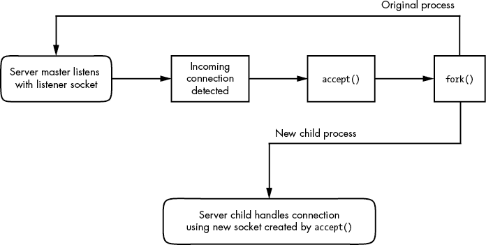

# 第十章：网络应用与服务


本章探讨了基础的网络应用——在用户空间中运行的客户端和服务器，它们位于应用层。因为这一层位于堆栈的顶部，靠近终端用户，你可能会发现这部分内容比第九章的内容更容易理解。实际上，你每天都会与网络客户端应用程序（如 Web 浏览器）进行交互。

为了完成工作，网络客户端会连接到相应的网络服务器。Unix 网络服务器有多种形式。服务器程序可以单独监听某个端口，或者通过一个二级服务器进行监听。我们将了解一些常见的服务器以及帮助你理解和调试服务器操作的工具。

网络客户端使用操作系统的传输层协议和接口，因此理解 TCP 和 UDP 传输层的基础非常重要。让我们通过实验使用一个利用 TCP 的网络客户端来开始了解网络应用。

## 10.1 服务基础

TCP 服务是最容易理解的，因为它们建立在简单、连续的双向数据流之上。也许最好的方法是直接与 TCP 端口 80 上的未加密 Web 服务器进行交互，了解数据是如何通过连接传输的。例如，运行以下命令连接到 IANA 文档示例 Web 服务器：

```
$ **telnet example.org 80**
```

你应该得到像这样的响应，表示成功连接到服务器：

```
Trying `some address`...
Connected to example.org.
Escape character is '^]'.
```

现在输入这两行：

```
**GET / HTTP/1.1**
**Host: example.org**
```

在最后一行后按两次回车。服务器应该会发送一大段 HTML 文本作为响应。要终止连接，请按 ctrl-D。

本练习演示了：

+   远程主机上有一个 Web 服务器进程监听 TCP 端口 80\。

+   `telnet`是发起连接的客户端。

你必须通过 ctrl-D 来终止连接的原因是，由于大多数网页需要多次请求才能加载，保持连接开启是有意义的。如果你从协议层面探索 Web 服务器，你可能会发现这种行为有所不同。例如，如果服务器在连接打开后不久没有接收到请求，许多服务器会迅速断开连接。

## 10.2 更深入的了解

在前面的示例中，你通过`telnet`手动与网络上的 Web 服务器进行了交互，使用了 HTTP 应用层协议。虽然通常你会使用 Web 浏览器来建立这种连接，但让我们从`telnet`稍微向上迈一步，使用一个了解如何与 HTTP 应用层进行通信的命令行程序。我们将使用带有特殊选项的`curl`工具来记录其通信细节：

```
$ **curl --trace-ascii** `trace_file` **http://www.example.org/**
```

你将获得大量的 HTML 输出。忽略它（或者将其重定向到*/dev/null*），而是查看新创建的文件*trace_file*。如果连接成功，文件的第一部分应该类似于以下内容，即`curl`尝试建立与服务器的 TCP 连接时：

```
== Info:   Trying 93.184.216.34...
== Info: TCP_NODELAY set
== Info: Connected to www.example.org (93.184.216.34) port 80 (#0)
```

到目前为止，您看到的一切都发生在传输层或以下。然而，如果这个连接成功，`curl`接着会尝试发送请求（即“头部”）；这就是应用层开始的地方：

```
1 => Send header, 79 bytes (0x4f)
2 0000: **GET / HTTP/1.1**
0010: **Host: www.example.org**
0027: **User-Agent: curl/7.58.0**
0040: **Accept: */***
004d: 
```

第 1 行是`curl`的调试输出，告诉你接下来将做什么。其余行显示了`curl`发送给服务器的内容。粗体文本是发送给服务器的内容；开头的十六进制数字只是调试偏移量，`curl`加上这些偏移量以帮助你跟踪发送或接收的数据量。

在第 2 行，你可以看到`curl`开始向服务器发出`GET`命令（就像你使用`telnet`做的那样），接着是一些额外的信息和一个空行。接下来，服务器发送回复，首先是它自己的头部，显示在这里的粗体中：

```
<= Recv header, 17 bytes (0x11)
0000: **HTTP/1.1 200 OK**
<= Recv header, 22 bytes (0x16)
0000: **Accept-Ranges: bytes**
<= Recv header, 12 bytes (0xc)
0000: **Age: 17629**
--`snip`--
```

与之前的输出类似，`<=`行是调试输出，`0000:`位于输出行前，告诉你偏移量（在`curl`中，头部不会计入偏移量；这就是为什么所有这些行都以 0 开头）。

服务器回复中的头部可能相当长，但在某个时候，服务器会从传输头部切换到发送实际请求的文档，如下所示：

```
<= Recv header, 22 bytes (0x16)
0000: **Content-Length: 1256**
<= Recv header, 2 bytes (0x2)
1 0000: 
<= Recv data, 1256 bytes (0x4e8)
0000: **<!doctype html>.<html>.<head>.    <title>Example Domain</title>.**
0040: **.    <meta charset="utf-8" />.    <meta http-equiv="Content-type**
--`snip`--
```

该输出还展示了应用层的一个重要特性。即使调试输出中显示了`Recv header`和`Recv data`，暗示这些是服务器发送的两种不同类型的消息，但`curl`与操作系统交互以检索这两条消息的方式、操作系统如何处理它们、或网络如何处理这些包都没有区别。区别完全在于用户空间的`curl`应用程序。`curl`知道，在此之前它一直在获取头部，但当它接收到一个空行 1 时，这个空行表示 HTTP 头部的结束，它知道接下来要将其余部分视为请求的文档。

发送这些数据的服务器也是如此。当服务器发送回复时，服务器的操作系统没有区分头部和文档数据；这些区分发生在用户空间的服务器程序内部。

## 10.3 网络服务器

大多数网络服务器就像你系统上的其他服务器守护进程（例如 cron），不同之处在于它们与网络端口进行交互。实际上，syslogd（第七章讨论）在启动时带有`-r`选项，会在 514 端口接收 UDP 数据包。

以下是一些您可能在系统上运行的其他常见网络服务器：

1.  httpd, apache, apache2, nginx 网页服务器

1.  sshd 安全外壳守护进程

1.  postfix, qmail, sendmail 邮件服务器

1.  cupsd 打印服务器

1.  nfsd, mountd 网络文件系统（文件共享）守护进程

1.  smbd, nmbd Windows 文件共享守护进程（见第十二章）

1.  rpcbind 远程过程调用（RPC）端口映射服务守护进程

大多数网络服务器的一个共同特点是，它们通常作为多个进程运行。至少有一个进程监听网络端口，接收到新的连接后，监听进程使用`fork()`创建一个子进程，然后由该子进程负责处理新连接。这个子进程，通常称为*工作*进程，在连接关闭时终止。与此同时，原始的监听进程继续监听网络端口。这一过程使得服务器能够轻松处理多个连接而不会出现太多问题。

然而，这一模型也有一些例外。调用`fork()`会增加大量的系统开销。为了避免这种情况，像 Apache Web 服务器这样的高性能 TCP 服务器可能会在启动时创建多个工作进程，以便根据需要处理连接。接受 UDP 数据包的服务器根本不需要 fork，因为它们不需要监听连接；它们只需接收数据并对其作出反应。

### 10.3.1  安全外壳协议（SSH）

每个网络服务器程序的工作方式略有不同。为了更好地了解服务器的配置和运行情况，让我们仔细研究一下独立的安全外壳（SSH）服务器。作为最常见的网络服务应用之一，SSH 已成为远程访问 Unix 机器的事实标准。SSH 旨在允许安全的 shell 登录、远程程序执行、简单的文件共享等——用公钥加密来进行身份验证，并用更简单的密码算法处理会话数据，取代了不安全的`telnet`和`rlogin`远程访问系统。大多数互联网服务提供商和云服务商要求通过 SSH 进行 shell 访问，而许多基于 Linux 的网络设备（如网络附加存储设备，简称 NAS）也提供通过 SSH 访问的功能。OpenSSH（[`www.openssh.com/`](http://www.openssh.com/)）是一个流行的免费 SSH 实现，适用于 Unix，几乎所有 Linux 发行版都预装了它。OpenSSH 客户端程序是`ssh`，而服务器是 sshd。SSH 协议有两个主要版本：1 和 2。OpenSSH 只支持版本 2，已经由于漏洞和使用率低而放弃对版本 1 的支持。

在其众多有用的功能和特性中，SSH 执行以下操作：

+   加密你的密码和所有其他会话数据，保护你免受窥探者的侵害。

+   隧道其他网络连接，包括来自 X Window System 客户端的连接。（你将在第十四章中了解更多关于 X 的内容。）

+   提供几乎适用于任何操作系统的客户端。

+   使用密钥进行主机身份验证。

SSH 确实有一些缺点。例如，为了建立 SSH 连接，你需要远程主机的公共密钥，而你不一定能以安全的方式获得它（尽管你可以手动检查它，以确保不会被伪造）。要了解几种加密方法的概述，可以阅读 Jean-Philippe Aumasson 所著的《*Serious Cryptography: A Practical Introduction to Modern Encryption*》（No Starch Press, 2017）。关于 SSH 的两本深入书籍分别是 Michael W. Lucas 所著的《*SSH Mastery: OpenSSH, PuTTY, Tunnels, and Keys*》第二版（Tilted Windmill Press, 2018），以及 Daniel J. Barrett、Richard E. Silverman 和 Robert G. Byrnes 所著的《*SSH, The Secure Shell: The Definitive Guide*》第二版（O’Reilly, 2005）。

### 10.3.2  sshd 服务器

运行 sshd 服务器以允许远程连接到你的系统需要一个配置文件和主机密钥。大多数发行版将配置保存在 */etc/ssh* 配置目录中，并在你安装它们的 sshd 包时会为你配置好一切。（服务器配置文件名 *sshd_config* 容易与客户端的 *ssh_config* 设置文件混淆，所以要小心。）

你不需要更改 *sshd_config* 中的任何内容，但检查一下也无妨。该文件由键值对组成，如这个片段所示。

```
Port 22
#AddressFamily any

#ListenAddress 0.0.0.0
#ListenAddress ::
#HostKey /etc/ssh/ssh_host_rsa_key
#HostKey /etc/ssh/ssh_host_ecdsa_key
#HostKey /etc/ssh/ssh_host_ed25519_key 
```

以 `#` 开头的行是注释，许多注释在你的 *sshd_config* 文件中指示了各种参数的默认值，正如你从这个摘录中看到的那样。sshd_config(5) 手册页包含了参数和可能的值的描述，但以下是其中最重要的：

1.  `HostKey` `file` 使用 `file` 作为主机密钥。（主机密钥将在下一节中描述。）

1.  `PermitRootLogin` `value` 如果 `value` 设置为 `yes`，允许超级用户通过 SSH 登录。将 `value` 设置为 `no` 可防止这种情况。

1.  `LogLevel` `level` 使用 syslog 级别 `level` 记录消息（默认值为 `INFO`）。

1.  `SyslogFacility` `name` 使用 syslog 设施 `name` 记录消息（默认值为 `AUTH`）。

1.  `X11Forwarding` `value` 如果 `value` 设置为 `yes`，则启用 X Window 系统客户端隧道。

1.  `XAuthLocation` `path` 指定系统上 `xauth` 工具的位置。如果没有此路径，X 隧道将无法工作。如果 `xauth` 不在 */usr/bin* 中，请将 `path` 设置为 `xauth` 的完整路径。

#### 创建主机密钥

OpenSSH 有多个主机密钥集。每个密钥集都有一个公共密钥（以 *.pub* 为扩展名）和一个私有密钥（没有扩展名）。

SSH 版本 2 使用 RSA 和 DSA 密钥。RSA 和 DSA 是公钥加密算法。密钥文件名列在 表 10-1 中。

表 10-1：OpenSSH 密钥文件

| **文件名** | **密钥类型** |
| --- | --- |
| *ssh_host_rsa_key* | 私有 RSA 密钥 |
| *ssh_host_rsa_key.pub* | 公共 RSA 密钥 |
| *ssh_host_dsa_key* | 私有 DSA 密钥 |
| *ssh_host_dsa_key.pub* | 公共 DSA 密钥 |

创建密钥涉及一个数值计算，生成公钥和私钥。通常你不需要自己创建密钥，因为 OpenSSH 的安装程序或你发行版的安装脚本会为你做这件事，但如果你计划使用像`ssh-agent`这样无需密码的身份验证服务，你需要知道如何创建密钥。要创建 SSH 协议版本 2 的密钥，请使用 OpenSSH 自带的`ssh-keygen`程序：

```
# ssh-keygen -t rsa -N '' -f /etc/ssh/ssh_host_rsa_key
# ssh-keygen -t dsa -N '' -f /etc/ssh/ssh_host_dsa_key
```

SSH 服务器和客户端还使用一个*密钥文件*，叫做*ssh_known_hosts*，用来存储来自其他主机的公钥。如果你打算使用基于远程客户端身份的身份验证，服务器的*ssh_known_hosts*文件必须包含所有受信任客户端的公钥。了解密钥文件是很有用的，特别是当你需要替换一台机器时。从零安装新机器时，你可以从旧机器导入密钥文件，以确保用户在连接新机器时不会遇到密钥不匹配的问题。

#### 启动 SSH 服务器

虽然大多数发行版都自带 SSH，但它们通常默认不会启动 sshd 服务器。在 Ubuntu 和 Debian 上，新的系统不会安装 SSH 服务器；安装其包会创建密钥，启动服务器，并将服务器启动项加入开机配置。

在 Fedora 上，sshd 默认已安装但处于关闭状态。要在启动时启动 sshd，可以使用`systemctl`，像这样：

```
# systemctl enable sshd
```

如果你想在不重启的情况下立即启动服务器，可以使用：

```
# systemctl start sshd
```

Fedora 通常会在第一次启动 sshd 时创建任何缺失的主机密钥文件。

如果你使用的是其他发行版，你可能不需要手动配置 sshd 的启动。然而，你应该知道有两种启动模式：独立模式和按需模式。独立模式服务器更为常见，只需以 root 身份运行 sshd。sshd 服务器进程会将其 PID 写入*/var/run/sshd.pid*（当然，当由 systemd 运行时，它也会被其 cgroup 跟踪，正如你在第六章看到的）。

作为替代方案，systemd 可以通过套接字单元按需启动 sshd。这通常不是一个好主意，因为服务器偶尔需要生成密钥文件，而这个过程可能会很长。

### 10.3.3  fail2ban

如果你在机器上设置了 SSH 服务器并将其开放到互联网，你很快就会发现不断的入侵尝试。这些暴力破解攻击如果你的系统配置正确且密码足够强大，是不会成功的。然而，它们会很烦人，消耗 CPU 时间，并且无谓地增加日志的杂乱。

为了防止这种情况，你需要设置一个机制来阻止重复的登录尝试。截至目前，fail2ban 软件包是最流行的解决方案；它只是一个监视日志消息的脚本。当从某个主机在指定时间范围内出现一定数量的失败请求时，fail2ban 使用`iptables`创建规则来拒绝该主机的流量。经过一段时间（在这段时间内该主机可能已经放弃了连接尝试）后，fail2ban 会删除该规则。

大多数 Linux 发行版提供了带有预配置默认设置的 fail2ban 包，适用于 SSH。

### 10.3.4 SSH 客户端

要登录到远程主机，运行：

```
$ **ssh** `remote_username`**@**`remote_host`
```

如果你的本地用户名与`remote_host`上的用户名相同，可以省略`remote_username``@`。你还可以像以下示例中那样，通过`ssh`命令运行管道，将目录*dir*复制到另一台主机：

```
$ **tar zcvf -** `dir` **| ssh** `remote_host` **tar zxvf -**
```

全局的 SSH 客户端配置文件*ssh_config*应该位于*/etc/ssh*，与*sshd_config*文件的路径相同。与服务器配置文件一样，客户端配置文件也包含键值对，但通常不需要修改它们。

使用 SSH 客户端时最常见的问题是，当你本地的*ssh_known_hosts*或*.ssh/known_hosts*文件中的 SSH 公钥与远程主机上的密钥不匹配时，会导致类似下面的错误或警告：

```
@@@@@@@@@@@@@@@@@@@@@@@@@@@@@@@@@@@@@@@@@@@@@@@@@@@@@@@@@@@
@    WARNING: REMOTE HOST IDENTIFICATION HAS CHANGED!     @
@@@@@@@@@@@@@@@@@@@@@@@@@@@@@@@@@@@@@@@@@@@@@@@@@@@@@@@@@@@
IT IS POSSIBLE THAT SOMEONE IS DOING SOMETHING NASTY!
Someone could be eavesdropping on you right now (man-in-the-middle attack)!
It is also possible that the RSA host key has just been changed.
The fingerprint for the RSA key sent by the remote host is
38:c2:f6:0d:0d:49:d4:05:55:68:54:2a:2f:83:06:11.
Please contact your system administrator.
Add correct host key in /home/`user`/.ssh/known_hosts to get rid of this message.
1 Offending key in /home/`user`/.ssh/known_hosts:12
RSA host key for `host` has changed and you have requested
strict checking.
Host key verification failed.
```

这通常意味着远程主机的管理员更改了密钥（这在硬件或云服务器升级时经常发生），但如果不确定，还是可以联系管理员确认。无论如何，前面的消息告诉你，错误的密钥位于某个用户的*known_hosts*文件的第 12 行 1。

如果你不怀疑有恶意行为，只需删除有问题的行或用正确的公钥替换它。

#### SSH 文件传输客户端

OpenSSH 包含文件传输程序`scp`和`sftp`，它们是较旧的、不安全的程序`rcp`和`ftp`的替代品。你可以使用`scp`将文件从远程机器传输到本地机器，或从一台主机传输到另一台主机。它的使用方法类似于`cp`命令。以下是一些示例。

从远程主机复制文件到当前目录：

```
$ **scp** `user`**@**`host`**:**`file` **.**
```

从本地机器复制一个文件到远程主机：

```
$ **scp** `file``user`**@**`host`**:**`dir`
```

从一台远程主机复制文件到第二台远程主机：

```
$ **scp** `user1`**@**`host1`**:**`file``user2`**@**`host2`**:**`dir`
```

`sftp`程序的工作方式类似于过时的命令行`ftp`客户端，使用`get`和`put`命令。远程主机必须安装有`sftp-server`程序，如果远程主机也使用 OpenSSH，你可以预期它已经安装。

#### 非 Unix 平台的 SSH 客户端

所有流行操作系统都有 SSH 客户端。你应该选择哪一个？PuTTY 是一个很好的基础 Windows 客户端，包含一个安全的文件复制程序。macOS 基于 Unix，并包含 OpenSSH。

## 10.4 系统 d 之前的网络连接服务器：inetd/xinetd

在 systemd 和第 6.3.7 节中提到的 socket 单元广泛使用之前，有一些服务器提供了一种标准的构建网络服务的方式。许多小型网络服务在连接需求上非常相似，因此为每个服务实现独立的服务器可能效率不高。每个服务器都必须单独配置来处理端口监听、访问控制和端口配置。这些操作对于大多数服务来说是以相同的方式执行的；只有当服务器接受连接时，通信才会有所不同。

简化服务器使用的传统方式之一是通过 inetd 守护进程，这是一种旨在标准化网络端口访问和服务器程序与网络端口之间接口的 *超级服务器*。启动 inetd 后，它会读取其配置文件，然后监听文件中定义的网络端口。当新的网络连接到来时，inetd 会将新启动的进程附加到该连接上。

inetd 的一个新版本叫做 xinetd，提供了更简单的配置和更好的访问控制，但 xinetd 几乎完全被淘汰，取而代之的是 systemd。然而，你可能会在较旧的系统或没有使用 systemd 的系统上看到它。

## 10.5 诊断工具

让我们看一些有用的诊断工具，这些工具适合深入应用层。有些工具深入到传输和网络层，因为应用层中的一切最终都会映射到这些较低的层级。

如第九章所述，`netstat` 是一个基本的网络服务调试工具，可以显示许多传输和网络层统计信息。表 10-2 回顾了查看连接的一些有用选项。

表 10-2：netstat 的有用连接报告选项

| **选项** | **描述** |
| --- | --- |
| `-t` | 打印 TCP 端口信息 |
| `-u` | 打印 UDP 端口信息 |
| `-l` | 打印监听端口 |
| `-a` | 打印所有活动端口 |
| `-n` | 禁用名称查找（加速操作；如果 DNS 不工作时也很有用） |
| `-4`, `-6` | 限制输出为 IP 版本 4 或 6 |

### 10.5.1  lsof

在第八章中，你学习到 `lsof` 不仅可以追踪打开的文件，还可以列出当前正在使用或监听端口的程序。要查看所有这样的程序，运行：

```
# lsof -i
```

当以普通用户身份运行此命令时，它只会显示该用户的进程。当以 root 用户身份运行时，输出应该类似于以下内容，显示多种进程和用户：

```
COMMAND     PID     USER   FD   TYPE   DEVICE SIZE/OFF NODE NAME
rpcbind     700     root    6u  IPv4    10492      0t0  UDP *:sunrpc 1
rpcbind     700     root    8u  IPv4    10508      0t0  TCP *:sunrpc (LISTEN)
avahi-dae   872    avahi   13u  IPv4 21736375      0t0  UDP *:mdns 2
cupsd      1010     root    9u  IPv6 42321174      0t0  TCP ip6-localhost:ipp (LISTEN) 3
ssh       14366    juser    3u  IPv4 38995911      0t0  TCP thishost.local:55457-> 4
    somehost.example.com:ssh (ESTABLISHED)
chromium- 26534    juser    8r  IPv4 42525253      0t0  TCP thishost.local:41551-> 5
    anotherhost.example.com:https (ESTABLISHED)
```

此示例输出显示了服务器和客户端程序的用户和进程 ID，从顶部的旧式 RPC 服务 1，到 `avahi` 提供的多播 DNS 服务 2，再到一个支持 IPv6 的打印服务 cupsd 3。最后两个条目显示了客户端连接：一个 SSH 连接 4 和一个来自 Chromium 浏览器的安全网页连接 5。由于输出可能非常庞大，通常最好应用一个过滤器（如下一节所讨论）。

`lsof`程序类似于`netstat`，它尝试将找到的每个 IP 地址反向解析为主机名，这会减慢输出速度。使用`-n`选项禁用名称解析：

```
# lsof -n -i
```

您也可以指定`-P`来禁用*/etc/services*端口名称查找。

#### 按协议和端口过滤

如果您在寻找特定的端口（例如，您知道某个进程正在使用特定的端口，您想知道那个进程是什么），请使用以下命令：

```
# lsof -i:`port`
```

完整的语法如下：

```
# lsof -i`protocol`**@**`host`**:**`port`
```

`protocol`、`@``host`和`:``port`参数都是可选的，并将相应地过滤`lsof`输出。与大多数网络实用程序一样，`host`和`port`可以是名称或数字。例如，如果您只想查看 TCP 端口 443（HTTPS 端口）上的连接，请使用：

```
# lsof -iTCP:443
```

要根据 IP 版本进行过滤，使用`-i4`（IPv4）或`-i6`（IPv6）。您可以将此作为单独的选项添加，也可以将该数字与更复杂的过滤器一起添加（例如，`-i6TCP:443`）。

您可以从*/etc/services*中指定服务名称（如`-iTCP:ssh`），而不是使用数字。

#### 按连接状态过滤

一个特别有用的`lsof`过滤器是连接状态。例如，要仅显示监听 TCP 端口的进程，请输入：

```
# lsof -iTCP -sTCP:LISTEN
```

此命令可以为您提供系统上当前运行的网络服务器进程的良好概览。但是，由于 UDP 服务器不进行监听并且没有连接，因此您必须使用`-iUDP`来查看正在运行的客户端和服务器。通常这不是问题，因为您的系统上可能不会有太多 UDP 服务器。

### 10.5.2  tcpdump

您的系统通常不会处理未地址指向其任何 MAC 地址的网络流量。如果您需要查看究竟是什么内容穿越您的网络，`tcpdump`会将您的网络接口卡置于*混杂模式*，并报告经过的每个数据包。输入`tcpdump`命令而不带任何参数将产生如下输出，其中包括 ARP 请求和 Web 连接：

```
# tcpdump
tcpdump: listening on eth0
20:36:25.771304 arp who-has mikado.example.com tell duplex.example.com
20:36:25.774729 arp reply mikado.example.com is-at 0:2:2d:b:ee:4e
20:36:25.774796 duplex.example.com.48455 > mikado.example.com.www: S 3200063165:3200063165(0) win 5840 <mss 1460,sackOK,timestamp 38815804[|tcp]> (DF)
20:36:25.779283 mikado.example.com.www > duplex.example.com.48455: S 3494716463:3494716463(0) ack 3200063166 win 5792 <mss 1460,sackOK,timestamp 4620[|tcp]> (DF)
20:36:25.779409 duplex.example.com.48455 > mikado.example.com.www: . ack 1 win 5840 <nop,nop,timestamp 38815805 4620> (DF)
20:36:25.779787 duplex.example.com.48455 > mikado.example.com.www: P 1:427(426) ack 1 win 5840 <nop,nop,timestamp 38815805 4620> (DF)
20:36:25.784012 mikado.example.com.www > duplex.example.com.48455: . ack 427 win 6432 <nop,nop,timestamp 4620 38815805> (DF)
20:36:25.845645 mikado.example.com.www > duplex.example.com.48455: P 1:773(772) ack 427 win 6432 <nop,nop,timestamp 4626 38815805> (DF)
20:36:25.845732 duplex.example.com.48455 > mikado.example.com.www: . ack 773 win 6948 <nop,nop,timestamp 38815812 4626> (DF)

9 packets received by filter
0 packets dropped by kernel
```

您可以通过添加过滤器让`tcpdump`更加具体。您可以基于源和目标主机、网络、以太网地址、网络模型中多个不同层次的协议等进行过滤。`tcpdump`识别的许多数据包协议中，包括 ARP、RARP、ICMP、TCP、UDP、IP、IPv6、AppleTalk 和 IPX 数据包。例如，要让`tcpdump`仅输出 TCP 数据包，请运行：

```
# tcpdump tcp
```

要查看 Web 数据包和 UDP 数据包，请输入：

```
# tcpdump udp or port 80 or port 443
```

关键字`or`指定左侧或右侧的条件只要满足一个即可通过过滤器。同样，`and`关键字要求两个条件都为真。

#### 原语

在前面的示例中，`tcp`、`udp`和`port` `80`是被称为*原语*的过滤器基本元素。最重要的原语列在表 10-3 中。

表 10-3：tcpdump 原语

| **原语** | **数据包规格** |
| --- | --- |
| `tcp` | TCP 数据包 |
| `udp` | UDP 数据包 |
| `ip` | IPv4 数据包 |
| `ip6` | IPv6 数据包 |
| `port` `port` | 向或来自端口 `port` 的 TCP 和/或 UDP 数据包 |
| `host` `host` | 向或来自 `host` 的数据包 |
| `net` `network` | 向或来自 `network` 的数据包 |

#### 操作符

前面使用的 `or` 是一个 *操作符*。`tcpdump` 可以使用多个操作符（例如 `and` 和 `!`），你还可以在括号中组合操作符。如果你打算使用 `tcpdump` 进行任何深入工作，一定要阅读 pcap-filter(7) 手册页，特别是描述原始操作符的部分。

### 10.5.3  netcat

如果你需要比 `telnet` `host``port` 命令更多的远程主机连接灵活性，可以使用 `netcat`（或 `nc`）。`netcat` 可以连接到远程的 TCP/UDP 端口，指定本地端口，监听端口，扫描端口，重定向标准输入输出到网络连接等。要通过 `netcat` 打开 TCP 连接到端口，运行：

```
$ **netcat host** `port`
```

`netcat` 在对方断开连接时终止，这可能会让人困惑，尤其是当你将标准输入重定向到 `netcat` 时，因为在发送数据后你可能无法立即看到提示符（这与几乎所有其他命令管道不同）。你可以随时通过按 ctrl-C 来结束连接。（如果你希望程序和网络连接根据标准输入流来终止，可以尝试使用 `sock` 程序。）

要在特定端口上监听，运行：

```
$ **netcat -l** `port_number`
```

如果 `netcat` 成功在端口上监听，它将等待连接，并在建立连接后打印该连接的输出，并将任何标准输入发送到该连接。

这里是一些关于 `netcat` 的附加说明：

+   默认情况下没有太多调试输出。如果某些操作失败，`netcat` 会默默失败，但会设置适当的退出代码。如果你需要更多信息，可以加上 `-v`（“详细”）选项。

+   默认情况下，`netcat` 客户端会尝试使用 IPv4 和 IPv6 连接。然而，在服务器模式下，`netcat` 默认使用 IPv4。要强制指定协议，可以使用 `-4` 来指定 IPv4，使用 `-6` 来指定 IPv6。

+   `-u` 选项指定使用 UDP 而不是 TCP。

### 10.5.4  端口扫描

有时你甚至不知道网络中机器提供了哪些服务，或者哪些 IP 地址正在使用。网络映射器（Nmap）程序扫描机器或一组机器上的所有端口，寻找开放的端口，并列出它找到的端口。大多数发行版都有 Nmap 包，或者你可以在[`www.insecure.org/`](http://www.insecure.org/)下载。（有关 Nmap 可以做的所有功能，请参阅 Nmap 手册页和在线资源。）

在列出自己机器上的端口时，通常建议从至少两个点运行 Nmap 扫描：从自己的机器和另一台机器（可能是在你的本地网络之外）。这样做能让你概览防火墙在阻挡哪些内容。

运行 `nmap``host` 对主机进行通用扫描。例如：

```
$ **nmap****10.1.2.2**
Starting Nmap 5.21 ( http://nmap.org ) at 2015-09-21 16:51 PST
Nmap scan report for 10.1.2.2
Host is up (0.00027s latency).
Not shown: 993 closed ports
PORT     STATE SERVICE
22/tcp   open  ssh
25/tcp   open  smtp
80/tcp   open  http
111/tcp  open  rpcbind
8800/tcp open  unknown
9000/tcp open  cslistener
9090/tcp open  zeus-admin

Nmap done: 1 IP address (1 host up) scanned in 0.12 seconds
```

如你所见，许多服务是开启的，其中很多在大多数发行版中默认并未启用。事实上，唯一一个通常默认开启的是端口 111，即 `rpcbind` 端口。

如果你添加 `-6` 选项，Nmap 也能够扫描 IPv6 上的端口。这是识别不支持 IPv6 的服务的一个方便方法。

## 10.6 远程过程调用

上一节中的 rpcbind 服务扫描结果怎么样？RPC 代表*远程过程调用（RPC）*，它是一个位于应用层底部的系统。它旨在帮助程序员更容易地构建客户端/服务器网络应用程序，其中客户端程序调用在远程服务器上执行的函数。每种类型的远程服务器程序都有一个分配的程序编号。

RPC 实现使用 TCP 和 UDP 等传输协议，并且它们需要一个特殊的中介服务来将程序编号映射到 TCP 和 UDP 端口。这个服务被称为 rpcbind，任何想要使用 RPC 服务的机器都必须运行它。

要查看你的计算机有哪些 RPC 服务，请运行：

```
$ **rpcinfo -p localhost**
```

RPC 是一种始终不愿消失的协议。网络文件系统（NFS）和网络信息服务（NIS）系统使用 RPC，但它们在独立机器上完全不必要。但是，每当你认为已经消除了对 rpcbind 的所有需求时，总会出现一些新的需求，比如 GNOME 中的文件访问监视器（FAM）支持。

## 10.7 网络安全

因为 Linux 是一种在 PC 平台上非常流行的 Unix 变种，特别是因为它在 Web 服务器中广泛使用，所以它吸引了许多试图入侵计算机系统的不法分子。第 9.25 节讨论了防火墙，但这并不是安全的全部内容。

网络安全吸引了极端分子——那些*真正*喜欢入侵系统的人（无论是为了乐趣还是金钱），以及那些想出复杂保护方案并*真正*喜欢打击试图入侵其系统的人。（这也可以非常有利可图。）幸运的是，你不需要知道太多就能保持系统安全。这里有一些基本的经验法则：

1.  尽可能运行最少的服务 入侵者无法攻击系统中不存在的服务。如果你知道某个服务是什么，而你又不使用它，不要因为你可能“以后某个时候”需要它就开启它。

1.  尽可能通过防火墙屏蔽 不同的 Unix 系统可能有一些你不知道的内部服务（例如，RPC 端口映射服务器的 TCP 端口 111），而世界上没有其他系统*应该*知道这些服务。追踪和管理你系统上的服务可能非常困难，因为许多不同类型的程序会监听各种端口。为了防止入侵者发现你系统中的内部服务，请使用有效的防火墙规则，并在路由器上安装防火墙。

1.  跟踪你向互联网提供的服务 如果你运行 SSH 服务器、Postfix 或类似服务，请保持软件更新，并获取适当的安全警报。（请参阅第 10.7.2 节，了解一些在线资源。）

1.  对于服务器，使用“长期支持”发行版 安全团队通常将工作重点集中在稳定、受支持的发行版上。开发和测试版，如 Debian Unstable 和 Fedora Rawhide，受到的关注较少。

1.  不要为系统上不需要账户的任何人创建账户 从本地账户获取超级用户权限比从远程入侵要容易得多。实际上，考虑到大多数系统中可用的大量软件（以及由此产生的漏洞和设计缺陷），一旦获得 shell 提示符，获得超级用户权限相对容易。不要假设你的朋友知道如何保护他们的密码（或者一开始就选择了好的密码）。

1.  避免安装可疑的二进制软件包 它们可能包含木马程序。

这就是保护自己的一项实际操作。那么为什么这样做很重要呢？有三种基本的网络攻击可以针对 Linux 机器进行：

1.  完全妥协 这意味着获得机器的超级用户访问权限（完全控制）。入侵者可以通过尝试服务攻击（例如缓冲区溢出漏洞）来实现这一点，或者通过接管一个保护不力的用户账户，然后尝试利用一个编写不规范的 setuid 程序。

1.  拒绝服务（DoS）攻击 这会阻止机器执行其网络服务，或迫使计算机以其他方式发生故障，而无需使用任何特殊的访问权限。通常，DoS 攻击仅仅是网络请求的洪水，但它也可能是利用服务器程序中的漏洞导致崩溃。这些攻击更难以预防，但响应起来相对容易。

1.  恶意软件 Linux 用户通常对恶意软件（如电子邮件蠕虫和病毒）免疫，原因是他们的电子邮件客户端通常不会傻到去运行附加在消息中的程序。但 Linux 恶意软件确实存在。避免从你从未听说过的地方下载和安装可执行软件。

### 10.7.1 典型漏洞

有两种基本类型的漏洞需要关注：直接攻击和明文密码嗅探。*直接攻击*尝试在不太隐蔽的情况下接管机器。最常见的一种方式是定位系统中未保护或其他易受攻击的服务。这可以是像管理员账户没有密码这样的简单服务，一些服务默认没有身份验证。入侵者一旦访问到系统中的一个服务，就可以利用它尝试攻破整个系统。过去，一种常见的直接攻击是缓冲区溢出漏洞，程序员不小心没有检查缓冲区数组的边界。这个问题在内核中通过地址空间布局随机化（ASLR）技术和其他地方的保护措施有所缓解。

*明文密码嗅探攻击*通过捕获以明文形式发送的密码，或者利用从多个数据泄露事件中获取的密码数据库，来实施攻击。一旦攻击者获取了你的密码，游戏就结束了。从那时起，攻击者必然会尝试在本地获取超级用户权限（如前所述，这比进行远程攻击容易得多），尝试利用该机器作为攻击其他主机的中介，或者两者兼而有之。

一些服务由于糟糕的实现和设计，成为了长期的攻击目标。你应该始终禁用以下服务（它们现在都非常过时，且大多数系统默认不启用）：

1.  ftpd 无论出于什么原因，所有的 FTP 服务器似乎都有漏洞。此外，大多数 FTP 服务器使用明文密码。如果你需要将文件从一台机器转移到另一台机器，考虑使用基于 SSH 的解决方案或 rsync 服务器。

1.  telnetd、rlogind、rexecd 这些服务都以明文形式传输远程会话数据（包括密码）。除非你有启用 Kerberos 的版本，否则应避免使用它们。

### 10.7.2  安全资源

这里有三个不错的安全资源：

+   SANS Institute（[`www.sans.org/`](http://www.sans.org/)）提供培训、服务、每周免费的时事通讯（列出当前的主要漏洞）、样本安全政策等。

+   卡内基梅隆大学软件工程研究所的 CERT 部门（[`www.cert.org/`](http://www.cert.org/)）是查找最严重问题的好地方。

+   Insecure.org 是黑客和 Nmap 创始人戈登·“费奥多尔”·里昂（[`www.insecure.org/`](http://www.insecure.org/)）的一个项目，是了解 Nmap 和各种网络漏洞测试工具的好地方。与许多其他网站相比，它在漏洞方面提供了更多开放且具体的信息。

如果你对网络安全感兴趣，你应该了解传输层安全性（TLS）及其前身安全套接字层（SSL）。这些用户空间的网络层通常被添加到网络客户端和服务器中，以通过使用公钥加密和证书支持网络交易。一本好的指南是戴维斯的*使用密码学和 PKI 实现 SSL/TLS*（Wiley，2011）或让·菲利普·奥马松的*严肃的密码学：现代加密的实用入门*（No Starch Press，2017）。

## 10.8 展望未来

如果你对自己动手操作一些复杂的网络服务器感兴趣，一些常见的服务器包括 Apache 或 nginx Web 服务器和 Postfix 电子邮件服务器。尤其是 Web 服务器容易安装，大多数发行版都提供了相关包。如果你的机器位于防火墙或 NAT 启用的路由器后面，你可以随心所欲地进行配置实验，而不必担心安全问题。

在过去的几章中，我们逐渐从内核空间转向用户空间。本章中讨论的只有少数工具，如`tcpdump`，与内核交互。本章其余部分描述了套接字如何弥合内核的传输层与用户空间应用层之间的差距。这是更高级的内容，特别适合程序员，因此如果你愿意，可以跳到下一章。

## 10.9 网络套接字

接下来，我们将转变话题，看看进程是如何从网络读取数据和写入数据的。对于已经建立的网络连接，进程读取和写入数据是非常简单的：你只需要一些系统调用，相关内容可以在 recv(2)和 send(2)手册页中找到。从进程的角度来看，或许最重要的是如何在使用这些系统调用时访问网络。在 Unix 系统中，进程使用套接字来标识与网络通信的时间和方式。*套接字*是进程通过内核访问网络的接口；它们代表了用户空间和内核空间之间的边界。它们通常也用于进程间通信（IPC）。

存在不同类型的套接字，因为进程需要以不同的方式访问网络。例如，TCP 连接由流式套接字（`SOCK_STREAM`，从程序员的角度来看）表示，UDP 连接由数据报套接字（`SOCK_DGRAM`）表示。

设置网络套接字可能有些复杂，因为你需要在特定的时刻考虑套接字类型、IP 地址、端口和传输协议。然而，在所有初步细节搞定之后，服务器使用某些标准方法来处理来自网络的传入流量。图 10-1 中的流程图展示了许多服务器如何处理传入流式套接字的连接。



图 10-1：接收和处理传入连接的一种方法

请注意，这种类型的服务器涉及两种套接字：一种用于监听，另一种用于读写。主进程使用监听套接字来查找来自网络的连接。当有新连接到来时，主进程使用`accept()`系统调用来接受连接，这会创建一个专门用于该连接的读写套接字。接下来，主进程使用`fork()`创建一个新的子进程来处理该连接。最后，原始套接字仍然作为监听器，继续代表主进程寻找更多的连接。

在进程设置了特定类型的套接字后，它可以以适合该套接字类型的方式与其交互。这就是套接字灵活性的体现：如果你需要更改底层的传输层，你不必重写所有发送和接收数据的部分；你只需要修改初始化代码。

如果你是程序员，并且想学习如何使用套接字接口，*Unix Network Programming, Volume 1*（第 3 版），作者是 W. Richard Stevens、Bill Fenner 和 Andrew M. Rudoff（Addison-Wesley Professional，2003），是一本经典指南。第 2 卷也涵盖了进程间通信。

## 10.10 Unix 域套接字

使用网络功能的应用程序不必涉及两个独立的主机。许多应用程序以客户端-服务器或点对点机制构建，在这种机制中，运行在同一台机器上的进程通过进程间通信来协商需要做什么工作以及由谁来做。例如，回想一下，像 systemd 和 NetworkManager 这样的守护进程使用 D-Bus 来监控和响应系统事件。

进程能够通过本地主机（127.0.0.1 或 ::1）使用常规的 IP 网络进行通信，但它们通常使用一种叫做 *Unix 域套接字* 的特殊类型套接字作为替代。当进程连接到 Unix 域套接字时，它的行为几乎与网络套接字相同：它可以监听并接受套接字上的连接，你甚至可以在不同的套接字类型之间进行选择，使其表现得像 TCP 或 UDP。

开发者喜欢使用 Unix 域套接字进行进程间通信，主要有两个原因。首先，它们允许在文件系统中使用特殊的套接字文件来控制访问，因此任何没有访问套接字文件的进程就无法使用它。而且，由于不与网络交互，这样会更简单，且不容易受到常规网络入侵的影响。例如，你通常会在 */var/run/dbus* 找到 D-Bus 的套接字文件：

```
$ **ls -l /var/run/dbus/system_bus_socket** 
srwxrwxrwx 1 root root 0 Nov  9 08:52 /var/run/dbus/system_bus_socket
```

其次，由于 Linux 内核在处理 Unix 域套接字时不必通过其网络子系统的多个层次，因此性能往往更好。

为 Unix 域套接字编写代码与支持普通网络套接字没有太大区别。由于好处显著，一些网络服务器提供通过网络和 Unix 域套接字进行通信的功能。例如，MySQL 数据库服务器 mysqld 可以接受来自远程主机的客户端连接，但它通常也会在 */var/run/mysqld/mysqld.sock* 提供一个 Unix 域套接字。

你可以使用 `lsof -U` 查看当前系统上使用中的 Unix 域套接字列表：

```
# lsof -U
COMMAND     PID       USER   FD   TYPE     DEVICE SIZE/OFF     NODE NAME
mysqld    19701      mysql   12u  unix 0xe4defcc0      0t0 35201227 /var/run/mysqld/mysqld.sock
chromium- 26534      juser    5u  unix 0xeeac9b00      0t0 42445141 socket
tlsmgr    30480    postfix    5u  unix 0xc3384240      0t0 17009106 socket
tlsmgr    30480    postfix    6u  unix 0xe20161c0      0t0    10965 private/tlsmgr
--`snip`--
```

列表会相当长，因为许多应用程序广泛使用未命名的套接字，这些套接字在 `NAME` 输出列中由 `socket` 表示。
