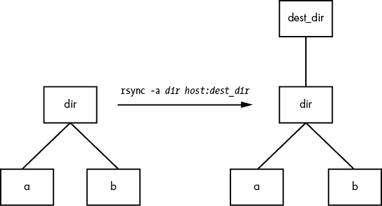

# 第十二章：网络文件传输和共享


本章概述了在网络上分发和共享文件的选项。我们将首先看看除了你已经看到的`scp`和`sftp`工具外的其他文件复制方法。然后我们将讨论真正的文件共享，即将一台机器上的目录附加到另一台机器上。

由于有许多方式可以分发和共享文件，以下是一些场景及其对应的解决方案：

| 将 Linux 机器上的文件或目录临时提供给其他机器。 | Python SimpleHTTPServer（第 12.1 节） |
| --- | --- |
| 在机器之间分发（复制）文件，特别是定期进行。 | rsync（第 12.2 节） |
| 定期将 Linux 机器上的文件共享到 Windows 机器上。 | Samba（第 12.4 节） |
| 在 Linux 机器上挂载 Windows 共享。 | CIFS（第 12.4 节） |
| 在 Linux 机器之间实现小规模共享，设置最小。 | SSHFS（第 12.5 节） |
| 从 NAS 或其他服务器挂载更大的文件系统到你的受信本地网络。 | NFS（第 12.6 节） |
| 将云存储挂载到 Linux 机器上。 | 各种基于 FUSE 的文件系统（第 12.7 节） |

注意，这里没有涉及到多个地点之间、多个用户进行大规模共享的内容。虽然不是不可能，但这种解决方案通常需要大量的工作，并不在本书的范围内。我们将在本章结束时讨论为什么会这样。

与本书中的许多其他章节不同，本章的最后部分并非高级内容。事实上，你可能从中获得最大价值的是那些“理论性”的部分。第 12.3 节和第 12.8 节将帮助你理解*为什么*这里列出了这么多选项。

## 12.1 快速复制

假设你想将一个文件（或多个文件）从你的 Linux 机器复制到你个人网络中的另一台机器上，而且你不关心将它复制回来或其他复杂操作——你只希望快速将文件传输过去。可以通过 Python 实现这种方便的方式。只需进入包含文件的目录，并运行：

```
$ **python -m SimpleHTTPServer**
```

这会启动一个基本的 Web 服务器，使当前目录可以被网络上的任何浏览器访问。默认情况下，它运行在 8000 端口，因此如果你在地址为 10.1.2.4 的机器上运行此服务，访问目标系统的浏览器时，只需访问*http://10.1.2.4:8000*，你就能获取所需的文件。

## 12.2 rsync

当你需要开始复制的不仅仅是一个或两个文件时，可以使用需要目标服务器支持的工具。例如，你可以使用`scp -r`将整个目录结构复制到另一个地方，前提是远程目标支持 SSH 和 SCP 服务器（Windows 和 macOS 都可以支持）。我们在第十章已经看到过这种方法：

```
$ **scp -r** `directory``user`**@**`remote_host[`**:**`dest_dir]`
```

这种方法能够完成任务，但并不非常灵活。特别是，在传输完成后，远程主机可能没有目录的精确副本。如果`directory`在远程机器上已经存在，并且包含一些多余的文件，那么这些文件会在传输后继续存在。

如果你预计要经常进行这种操作（特别是如果你计划自动化这个过程），你应该使用一个专门的同步系统，它还可以执行分析和验证。在 Linux 上，`rsync`是标准的同步工具，提供良好的性能和许多有用的传输方式。在本节中，我们将介绍一些`rsync`的基本操作模式，并探讨一些它的特殊性。

### 12.2.1  开始使用 rsync

要在两个主机之间使用`rsync`，你必须在源和目标主机上都安装`rsync`程序，并且你需要一种从一台机器访问另一台机器的方式。传输文件的最简单方法是使用远程 shell 账户，假设你想通过 SSH 访问来传输文件。然而，请记住，`rsync`即使在单台机器上复制文件和目录之间的位置时也非常有用，例如从一个文件系统复制到另一个文件系统。

从表面上看，`rsync`命令与`scp`没有太大区别。实际上，你可以使用相同的参数运行`rsync`。例如，要将一组文件复制到*host*上的主目录，输入：

```
$ **rsync** `file1``file2` **...** `host`**:**
```

在任何现代系统上，`rsync`假设你使用 SSH 连接到远程主机。

小心这个错误信息：

```
rsync not found
rsync: connection unexpectedly closed (0 bytes read so far)
rsync error: error in rsync protocol data stream (code 12) at io.c(165)
```

这个提示表示你的远程 shell 无法在系统中找到`rsync`。如果`rsync`已安装在远程系统上，但不在该系统用户的命令路径中，请使用`--rsync-path=``path`手动指定其位置。

如果两个主机上的用户名不同，请在命令参数中的远程主机名之前加上`user@`，其中`user`是你在`host`上的用户名：

```
$ **rsync** `file1 file2` **...** `user`**@**`host`**:**
```

除非你提供额外选项，否则`rsync`仅复制文件。事实上，如果你只指定了到目前为止描述的选项，并且提供了一个目录`dir`作为参数，你将看到以下消息：

```
skipping directory `dir`
```

要传输整个目录结构——包括符号链接、权限、模式和设备——使用`-a`选项。此外，如果你想复制到远程主机上不是你主目录的目录，可以将其名称放在远程主机名后面，如下所示：

```
$ **rsync -a** `dir``host`**:**`dest_dir`
```

复制目录可能会比较棘手，所以如果你不完全确定在传输文件时会发生什么，使用`-nv`选项组合。`-n`选项告诉`rsync`以“干跑”模式运行——也就是说，运行一个试验而不实际复制任何文件。`-v`选项用于详细模式，它显示有关传输和文件的详细信息：

```
$ **rsync -nva** `dir``host`**:**`dest_dir`
```

输出看起来像这样：

```
building file list ... done
ml/nftrans/nftrans.html
[more files]
wrote 2183 bytes read 24 bytes 401.27 bytes/sec
```

### 12.2.2  精确复制目录结构

默认情况下，`rsync` 复制文件和目录时不会考虑目标目录中的先前内容。例如，如果你将包含文件 *a* 和 *b* 的目录 *d* 传输到已经有文件 *d/c* 的机器上，那么在 `rsync` 执行后，目标目录将包含 *d/a*、*d/b* 和 *d/c*。

为了精确复制源目录，你必须删除目标目录中不存在于源目录中的文件，例如此示例中的 *d/c*。使用 `--delete` 选项来实现这一点：

```
$ **rsync -a --delete** `dir``host`**:**`dest_dir`
```

### 12.2.3  使用尾部斜杠

在指定目录作为 `rsync` 命令行中的源时，特别需要小心。考虑一下我们迄今为止一直在使用的基本命令：

```
$ **rsync -a** `dir``host`**:**`dest_dir`
```

完成后，你将在 `host` 上的 `dest_dir` 内拥有一个名为 `dir` 的目录。图 12-1 显示了 `rsync` 如何处理一个包含名为 *a* 和 *b* 的文件的目录。



图 12-1：正常的 `rsync` 复制

然而，在源名称后添加一个斜杠（`/`）会显著改变其行为：

```
$ **rsync -a** `dir`**/** `host`**:**`dest_dir`
```

在这里，`rsync` 会将 `dir` 内的所有内容复制到 `host` 上的 `dest_dir`，但不会在目标主机上实际创建 `dir`。因此，你可以将 `dir/` 的传输视为类似于在本地文件系统上执行 `cp` `dir/* dest_dir` 的操作。

例如，假设你有一个包含文件 *a* 和 *b*（*dir/a* 和 *dir/b*）的目录 *dir*。你运行带有尾部斜杠的命令，将它们传输到 `host` 上的 `dest_dir` 目录：

```
$ **rsync -a dir/** `host`**:**`dest_dir`
```

当传输完成后，`dest_dir` 会包含 *a* 和 *b* 的副本，但不包含 *dir*。然而，如果你省略了 *dir* 后面的尾部斜杠，`dest_dir` 会得到一个名为 *dir* 的副本，其中包含 *a* 和 *b*。然后，作为传输的结果，你将在远程主机上看到名为 `dest_dir`*/dir/a* 和 `dest_dir`*/dir/b* 的文件和目录。图 12-2 演示了在使用尾部斜杠时，`rsync` 如何处理来自 图 12-1 的目录结构。

当将文件和目录传输到远程主机时，不小心在路径后加一个 `/` 通常只是一个小麻烦；你可以去远程主机，添加 *dir* 目录，并将所有传输的项目放回 *dir* 中。不幸的是，当你将尾部斜杠与 `--delete` 选项结合使用时，可能会发生更严重的灾难；务必小心，因为这样你很容易删除不相关的文件。


图 12-2：尾部斜杠在 `rsync` 中的作用

### 12.2.4  排除文件和目录

`rsync` 的一个重要特性是它能够从传输操作中排除文件和目录。例如，假设你想将一个名为 *src* 的本地目录传输到 *host*，但你希望排除任何名为 *.git* 的文件。你可以这样做：

```
$ **rsync -a --exclude=.git src** `host`**:**
```

请注意，这条命令排除了所有名为*.git*的文件和目录，因为`--exclude`接受的是模式，而不是绝对文件名。要排除特定项，请指定以`/*`开头的绝对路径，如下所示：

```
$ **rsync -a --exclude=/src/.git src** `host`**:**
```

以下是一些关于如何排除模式的技巧：

+   你可以根据需要添加任意多的`--exclude`参数。

+   如果你重复使用相同的模式，可以将它们放入一个纯文本文件（每行一个模式），并使用`--exclude-from=``file`。

+   要排除名为*item*的目录，但包括具有该名称的文件，可以使用尾部斜杠：`--exclude=``item``/`。

+   排除模式基于完整的文件或目录名称组件，可以包含简单的通配符。例如，`t*s`匹配*this*，但不匹配*ethers*。

+   如果你排除一个目录或文件名，但发现你的模式太严格，可以使用`--include`来专门包括另一个文件或目录。

### 12.2.5  检查传输、添加保障和使用详细模式

为了加速操作，`rsync`使用快速检查来确定传输源中的文件是否已经存在于目标端。该检查结合了文件大小和最后修改日期。当你第一次将整个目录层级传输到远程主机时，`rsync`会发现目标端没有这些文件，因此会传输所有文件。使用`rsync -n`进行传输测试可以验证这一点。

运行一次`rsync`后，再次使用`rsync -v`运行它。这时你应该会看到传输列表中没有文件，因为文件集在两端都存在，且修改日期相同。

当源端的文件与目标端的文件不一致时，`rsync`会传输源文件并覆盖远程端的任何文件。但默认行为可能不够充分，因为你可能需要额外的确认，以确保文件确实相同，或者你可能希望添加一些额外的保障。以下是一些有用的选项：

1.  `--checksum`（缩写：`-c`）计算文件的校验和（通常是唯一的签名），以检查文件是否相同。此选项在传输过程中会消耗少量的 I/O 和 CPU 资源，但如果你处理的是敏感数据或经常具有相同大小的文件，这是必须的。

1.  `--ignore-existing` 不会覆盖目标端已存在的文件。

1.  `--backup`（缩写：`-b`）不会覆盖目标端已存在的文件，而是通过在文件名后添加`~`后缀来重命名这些已存在的文件，然后再传输新文件。

1.  `--suffix=s` 将`--backup`使用的后缀从`~`改为`s`。

1.  `--update`（缩写：`-u`）不会覆盖目标中比源文件更新的文件。

在没有特别选项的情况下，`rsync` 默默运行，只有在出现问题时才会产生输出。然而，你可以使用 `rsync -v` 启用详细模式，或者使用 `rsync -vv` 获取更多的细节。（你可以根据需要添加任意多个 `v` 选项，但通常两个 `v` 就足够了。）要在传输完成后获得综合总结，可以使用 `rsync --stats`。

### 12.2.6  压缩数据

许多用户喜欢将 `-z` 选项与 `-a` 一起使用，在传输前压缩数据：

```
$ **rsync -az** `dir``host`**:**`dest_dir`
```

压缩可以在某些情况下提高性能，例如当你需要通过慢速连接（如慢速上行链路）上传大量数据，或当两个主机之间的延迟较高时。然而，在快速的局域网中，两个端点机器可能会受到压缩和解压数据所需的 CPU 时间的限制，因此未压缩的传输可能更快。

### 12.2.7  限制带宽

当你向远程主机上传大量数据时，很容易堵塞互联网连接的上行链路。尽管在这样的传输过程中你不会使用（通常较大的）下行带宽，如果你让 `rsync` 以最快速度运行，连接仍然会变得相当缓慢，因为如 HTTP 请求等传出的 TCP 数据包将与你的传输竞争上行带宽。

为了避免这个问题，使用 `--bwlimit` 给你的上行链路留一些喘息的空间。例如，要将带宽限制为 100,000Kbps，你可以像这样操作：

```
$ **rsync --bwlimit=100000 -a** `dir``host`**:**`dest_dir`
```

### 12.2.8  将文件传输到你的计算机

`rsync` 命令不仅仅用于将文件从本地机器复制到远程主机。你也可以通过将远程主机和远程源路径作为命令行的第一个参数，来将文件从远程机器传输到本地主机。例如，要将远程系统上的`src_dir`传输到本地主机上的`dest_dir`，请运行以下命令：

```
$ **rsync -a** `host`**:**`src_dir``dest_dir`
```

### 12.2.9  更多 rsync 主题

每当你需要复制大量文件时，`rsync` 应该是你首先想到的工具之一。在批处理模式下运行 `rsync` 对于将相同的文件集复制到多个主机特别有用，因为它能加速长时间的传输并且在中断时能够恢复。

你还会发现 `rsync` 对于制作备份非常有用。例如，你可以将互联网存储（如 Amazon 的 S3）附加到你的 Linux 系统上，然后使用 `rsync --delete` 定期将文件系统与网络存储同步，从而实现一个非常有效的备份系统。

这里描述的命令行选项只是其中的一部分。要获取大致的概览，请运行 `rsync --help`。你还可以在 `rsync` 的手册页和官网（[`rsync.samba.org/`](https://rsync.samba.org/)）找到更详细的信息。

## 12.3 文件共享简介

你的 Linux 机器可能并不是在网络上独自存在，当你网络中有多台机器时，几乎总是有理由在它们之间共享文件。在本章的其余部分，我们将首先探讨 Windows 和 macOS 机器之间的文件共享，你将了解更多关于 Linux 如何与完全不同的环境进行交互的内容。为了共享 Linux 机器之间的文件或访问网络存储设备（NAS）上的文件，我们最后将讨论如何使用 SSHFS 和网络文件系统（NFS）作为客户端。

### 12.3.1  文件共享使用和性能

在使用任何类型的文件共享系统时，你需要问自己一个问题，那就是你最初为什么要这么做。在传统的基于 Unix 的网络中，有两个主要原因：方便和缺乏本地存储。用户可以登录到网络中的一台机器，每台机器都可以访问用户的主目录。将存储集中在少数几个集中式服务器上，比为网络中的每台机器购买和维护大量本地存储要经济得多。

这种模型的优点被一个长期存在的主要缺点所掩盖：与本地存储相比，网络存储性能通常较差。一些数据访问方式是可以接受的；例如，现代硬件和网络没有问题将视频和音频数据从服务器流式传输到媒体播放器，部分原因在于数据访问模式非常可预测。服务器在发送大文件或流数据时，可以有效地预加载并缓冲数据，因为它知道客户端很可能按顺序访问数据。

然而，如果你进行更复杂的操作或同时访问许多不同的文件，你会发现你的 CPU 更常在等待网络响应。延迟是主要的罪魁祸首之一。这是接收任何随机（任意）网络文件访问数据所需的时间。在将数据发送到客户端之前，服务器必须接受并解读请求，然后定位并加载数据。前几个步骤通常是最慢的，几乎每次新的文件访问都要执行。

故事的寓意是，当你开始考虑网络文件共享时，要问自己为什么要这么做。如果是为了存储大量不需要频繁随机访问的数据，你很可能不会遇到问题。但如果你在编辑视频或开发一个大型软件系统时，你会希望将所有文件保存在本地存储中。

### 12.3.2  文件共享安全

传统上，文件共享协议中的安全性并未被视为高优先级。这会影响你如何以及在何处实施文件共享。如果你有任何理由怀疑共享文件的机器之间网络的安全性，你需要在配置中考虑授权/认证和加密。良好的授权和认证意味着只有拥有正确凭证的人员才能访问文件（并且服务器是它所声称的身份），而加密确保没有人能够在文件数据传输到目的地的过程中窃取它。

最容易配置的文件共享选项通常是最不安全的，不幸的是，目前没有标准化的方法来保障这些访问的安全性。然而，如果你愿意付出努力连接正确的组件，像 stunnel、IPSec 和 VPN 等工具可以确保基本文件共享协议下方的安全层。

## 12.4 使用 Samba 共享文件

如果你有运行 Windows 的机器，你可能希望通过标准的 Windows 网络协议 *Server Message Block (SMB)* 允许从这些 Windows 机器访问你 Linux 系统上的文件和打印机。macOS 也支持 SMB 文件共享，但你也可以使用 SSHFS，详见第 12.5 节。

Unix 的标准文件共享软件套件称为 *Samba*。Samba 不仅允许你网络中的 Windows 计算机访问你的 Linux 系统，而且还可以反向操作：你可以通过其 Samba 客户端软件，在 Linux 机器上打印并访问 Windows 服务器上的文件。

设置 Samba 服务器的步骤如下：

1.  创建一个 *smb.conf* 文件。

1.  向 *smb.conf* 中添加文件共享部分。

1.  将打印机共享部分添加到 *smb.conf* 中。

1.  启动 Samba 守护进程 `nmbd` 和 `smbd`。

当你从发行版包中安装 Samba 时，系统应该会执行这些步骤，并为服务器设置一些合理的默认值。然而，它可能无法确定你希望将 Linux 机器上的哪些 *共享*（资源）提供给客户端。

### 12.4.1  服务器配置

中央的 Samba 配置文件是 *smb.conf*，大多数发行版将其放置在 *etc* 目录下，例如 */etc/samba*。然而，你可能需要到处查找才能找到该文件，因为它也可能位于 *lib* 目录下，例如 */usr/local/samba/lib*。

*smb.conf* 文件格式类似于你在其他地方见过的 XDG 风格（例如 systemd 配置格式），并分为几个用方括号表示的部分，如 `[global]` 和 `[printers]`。*smb.conf* 中的 `[global]` 部分包含适用于整个服务器和所有共享的常规选项。这些选项主要涉及网络配置和访问控制。以下是一个示例 `[global]` 部分，展示了如何设置服务器名称、描述和工作组：

```
[global]
# server name
netbios name = `name`
# server description
server string = My server via Samba
# workgroup
workgroup = MYNETWORK
```

这些参数的作用如下：

1.  `netbios name` 服务器名称。如果省略此参数，Samba 将使用 Unix 主机名。NetBIOS 是一种 API，SMB 主机经常使用它进行相互通信。

1.  `server string` 服务器的简短描述。默认值是 Samba 版本号。

1.  `workgroup` Windows 工作组名称。如果你在 Windows 域中，请将此参数设置为你的域名。

### 12.4.2  服务器访问控制

你可以在*smb.conf*文件中添加选项，以限制哪些机器和用户可以访问你的 Samba 服务器。以下是你可以在`[global]`部分和控制单独共享资源的部分中设置的一些选项（本章后面会详细描述）：

1.  `interfaces` 设置此项，使 Samba 在指定的网络或接口上监听（接受连接）。例如：

    ```
    interfaces = 10.23.2.0/255.255.255.0
    interfaces = enp0s31f6
    ```

1.  `bind interfaces only` 当使用`interfaces`参数时，将此设置为`yes`，以将访问限制为仅能直接通过这些接口访问的机器。

1.  `valid users` 设置此项以允许指定用户访问。例如：

    ```
    valid users = jruser, bill
    ```

1.  `guest ok` 将此参数设置为`true`，以使共享资源对网络上的匿名用户可用。仅当你确定网络是私有的时，才这样做。

1.  `browseable` 将此设置为使共享资源可以被网络浏览器查看。如果你将此参数设置为`no`，你仍然可以访问 Samba 服务器上的共享资源，但你需要知道它们的确切名称才能访问。

### 12.4.3  密码

通常，你应该仅允许使用密码认证访问你的 Samba 服务器。不幸的是，Unix 上的基本密码系统与 Windows 上的不同，因此除非你指定明文网络密码或使用 Windows 域服务器进行密码验证，否则你必须设置一个替代的密码系统。本节将向你展示如何使用 Samba 的*简易数据库(TDB)*后端设置替代密码系统，这适用于小型网络。

首先，在你的*smb.conf* `[global]`部分使用以下条目定义 Samba 密码数据库的特性：

```
# use the tdb for Samba to enable encrypted passwords
security = user
passdb backend = tdbsam
obey pam restrictions = yes
smb passwd file = /etc/samba/passwd_smb
```

这些行允许你使用`smbpasswd`命令操作 Samba 密码数据库。`obey pam restrictions`参数确保任何通过`smbpasswd`命令更改密码的用户都必须遵守 PAM（可插拔认证模块，第七章中介绍）对常规密码更改的限制。对于`passdb backend`参数，你可以选择性地在冒号后指定 TDB 文件的路径名，例如，`tdbsam:/etc/samba/private/passwd.tdb`。

#### 添加和删除用户

让 Windows 用户访问你的 Samba 服务器的第一步是使用`smbpasswd -a`命令将用户添加到密码数据库中：

```
# smbpasswd -a `username`
```

`smbpasswd`命令中的`username`参数必须是你 Linux 系统上的有效用户名。

像常规系统的`passwd`程序一样，`smbpasswd`会要求你输入新 SMB 用户的密码两次。密码通过必要的安全检查后，`smbpasswd`会确认已创建新用户。

要删除用户，请使用`smbpasswd`的`-x`选项：

```
# smbpasswd -x `username`
```

要暂时禁用用户，使用`-d`选项；稍后可以使用`-e`选项重新启用该用户：

```
# smbpasswd -d`username`
# smbpasswd -e`username`
```

#### 更改密码

你可以通过使用`smbpasswd`（除了用户名外不带任何选项或关键字）以超级用户身份更改 Samba 密码：

```
# smbpasswd `username`
```

然而，如果 Samba 服务器正在运行，任何用户都可以通过在命令行中输入`smbpasswd`单独更改自己的 Samba 密码。

最后，这是配置中的一个需要注意的地方。如果在你的*smb.conf*文件中看到如下行，请小心：

```
unix password sync = yes
```

这一行导致`smbpasswd`在更改用户的普通密码*同时*更改 Samba 密码。这个结果可能会非常令人困惑，特别是当用户将 Samba 密码更改为与其 Linux 密码不同的内容时，他们会发现无法再登录到 Linux 系统。有些发行版在其 Samba 服务器包中默认设置此参数！

### 12.4.4  手动启动服务器

通常，如果你是从发行版包安装 Samba，应该不需要担心启动服务器。可以通过`systemctl --type=service`查看列表进行验证。然而，如果你是从源代码安装的，运行`nmbd`和`smbd`并传入以下参数，其中`smb_config_file`是你的*smb.conf*文件的完整路径：

```
# nmbd -D -s `smb_config_file`
# smbd -D -s `smb_config_file`
```

`nmbd`守护进程是一个 NetBIOS 名称服务器，而`smbd`则负责处理共享请求。`-D`选项指定守护进程模式。如果在`smbd`运行时修改了*smb.conf*文件，可以通过 HUP 信号通知守护进程这些更改，尽管通常来说，如果让 systemd 管理服务器会更好，在这种情况下，你可以让`systemctl`为你处理这些工作。

### 12.4.5  诊断与日志文件

如果 Samba 服务器启动时出现问题，命令行上会出现错误消息。然而，运行时诊断消息会被写入到*log.nmbd*和*log.smbd*日志文件中，通常位于*/var/log*目录下，例如*/var/log/samba*。你还会在那里找到其他日志文件，比如每个单独客户端的日志。

### 12.4.6  文件共享配置

要将目录导出到 SMB 客户端（即与客户端共享目录），请将以下类似内容添加到你的*smb.conf*文件中，其中`label`是你希望为共享命名的名称（例如`mydocuments`），`path`是完整的目录路径：

```
[`label`]
path = `path`
comment = `share description`
guest ok = no
writable = yes
printable = no
```

这些参数在目录共享中非常有用：

1.  `guest ok` 在此设置为`yes`时，允许来宾访问共享。`public` 参数是其同义词。

1.  `writable` 设置为`yes`或`true`时，表示共享为可读写。不要允许来宾访问可读写的共享。

1.  `printable` 显然，在目录共享上，必须将此参数设置为`no`或`false`。

1.  `veto files` 该参数防止导出与给定模式匹配的任何文件。您必须将每个模式用斜杠括起来（使其看起来像`/pattern/`）。此示例禁止对象文件以及任何名为*bin*的文件或目录：

    ```
    veto files = /*.o/bin/
    ```

### 12.4.7  主目录

如果您希望将用户的主目录导出，可以在您的*smb.conf*文件中添加一个名为`[homes]`的部分。该部分应如下所示：

```
[homes]
comment = home directories
browseable = no
writable = yes
```

默认情况下，Samba 读取已登录用户的*/etc/passwd*条目，以确定其`[homes]`的主目录。然而，如果您不希望 Samba 遵循此行为（即，您希望将 Windows 主目录存放在与常规 Linux 主目录不同的位置），您可以在`path`参数中使用`%S`替代符。例如，您可以通过以下方式将用户的`[homes]`目录切换到*/u/user*：

```
path = /u/%S
```

Samba 将当前用户名替换为`%S`。

### 12.4.8  打印机共享

您可以通过在*smb.conf*文件中添加`[printers]`部分，将打印机导出到 Windows 客户端。当您使用 CUPS（标准 Unix 打印系统）时，该部分如下所示：

```
[printers]
comment = Printers
browseable = yes
printing = CUPS
path = cups
printable = yes
writable = no
```

要使用`printing = CUPS`参数，您的 Samba 安装必须配置并链接到 CUPS 库。

### 12.4.9  Samba 客户端

Samba 客户端程序`smbclient`可以打印和访问远程 Windows 共享。当您处于必须与不提供 Unix 友好通信方式的 Windows 服务器交互的环境中时，这个程序非常有用。

要开始使用`smbclient`，请使用`-L`选项获取名为`SERVER`的远程服务器的共享列表：

```
$ **smbclient -L -U** `username SERVER`
```

如果您的 Linux 用户名与`SERVER`上的用户名相同，则不需要`-U` `username`。

运行此命令后，`smbclient`会要求输入密码。要尝试以访客身份访问共享，请按回车；否则，在`SERVER`上输入您的密码。成功后，您应该会看到如下共享列表：

```
Sharename   Type        Comment
---------   ----        -------
Software    Disk        Software distribution
Scratch     Disk        Scratch space
IPC$        IPC         IPC Service
ADMIN$      IPC         IPC Service
Printer1    Printer     Printer in room 231A
Printer2    Printer     Printer in basement
```

使用`Type`字段帮助您理解每个共享的类型，并仅关注`Disk`和`Printer`共享（`IPC`共享用于远程管理）。此列表包含两个磁盘共享和两个打印机共享。使用`Sharename`列中的名称访问每个共享。

#### 作为客户端访问文件

如果您仅需要偶尔访问磁盘共享中的文件，可以使用以下命令（如果您的 Linux 用户名与服务器上的用户名相同，可以省略`-U` `username`）：

```
$ **smbclient -U** `username` **'\\**`SERVER`**\**`sharename`**'**
```

如果成功，您将看到类似于此的提示，表示现在可以传输文件：

```
smb: \>
```

在此文件传输模式下，`smbclient`类似于 Unix 的`ftp`，您可以运行以下命令：

1.  `get` `file` 将`file`从远程服务器复制到当前本地目录。

1.  `put` `file` 将`file`从本地计算机复制到远程服务器。

1.  `cd` `dir` 将远程服务器上的目录更改为`dir`。

1.  `lcd` `localdir` 将当前本地目录更改为`localdir`。

1.  `pwd` 打印远程服务器上的当前目录，包括服务器和共享名称。

1.  `!``command` 在本地主机上运行`command`。两个特别实用的命令是`!pwd`和`!ls`，用于查看本地的目录和文件状态。

1.  `help` 显示完整的命令列表。

#### 使用 CIFS 文件系统

如果你希望更方便地访问 Windows 服务器上的文件，可以直接使用`mount`将共享连接到你的系统。命令语法如下（注意使用`SERVER``:``sharename`而不是正常的`\\``SERVER``\``sharename`格式）：

```
# mount -t cifs `SERVER`**:**`sharename``mountpoint` **-o user=**`username`**,pass=**`password`
```

为了像这样使用`mount`，你必须在系统上安装通用互联网文件系统（CIFS）工具。大多数发行版将其作为一个单独的包提供。

## 12.5 SSHFS

在解决了 Windows 文件共享系统的问题后，本节将讨论 Linux 系统之间的文件共享。对于一些不特别复杂的场景，SSHFS 是一个方便的选择。这不过是一个用户空间的文件系统，它打开一个 SSH 连接并在你的机器上以挂载点的形式呈现远程端的文件。大多数发行版默认不安装它，因此你可能需要安装对应发行版的 SSHFS 包。

在命令行中使用 SSHFS 的语法在表面上看起来与以前看到的 SSH 命令相似。当然，你需要提供共享目录（在远程主机上）和所需的挂载点：

```
$ **sshfs** `username`**@**`host`**:**`dir` `mountpoint`
```

就像在 SSH 中一样，如果远程主机上的用户名相同，你可以省略`username``@`，如果你只想挂载远程主机的主目录，也可以省略`:``dir`。如果需要，命令会要求输入远程主机的密码。

由于这是一个用户空间的文件系统，如果以普通用户身份运行，你必须使用`fusermount`来卸载它：

```
$ **fusermount -u** `mountpoint`
```

超级用户也可以使用`umount`卸载这些文件系统。为了确保所有权和安全性的一致性，通常最好以普通用户身份挂载此类文件系统。

SSHFS 具有以下优点：

+   它的设置非常简单。远程主机的唯一要求是启用 SFTP，而大多数 SSH 服务器默认启用它。

+   它不依赖于任何特定的网络配置。如果你能够建立 SSH 连接，SSHFS 就能工作，无论是在安全的本地网络还是不安全的远程网络上。

SSHFS 的缺点是：

+   性能较差。加密、转换和传输存在大量开销（但可能没有你想象的那么糟糕）。

+   多用户设置有限。

如果你认为 SSHFS 可能对你有用，它绝对值得一试，因为它非常容易设置。

## 12.6 NFS

在 Unix 系统中，NFS 是最常用的传统文件共享系统之一，而且根据不同的场景，NFS 有许多不同的版本。你可以通过 TCP 和 UDP 提供 NFS，提供大量的认证和加密选项（但不幸的是，默认情况下很少启用）。由于选项繁多，NFS 可能是一个庞大的话题，所以我们这里只讨论最基本的内容。

要在服务器上挂载远程目录，使用与挂载 CIFS 目录相同的基本语法：

```
# mount -t nfs `server`**:**`directory``mountpoint`
```

从技术上讲，你不需要`-t nfs`选项，因为`mount`应该能够自动识别，但你可能需要查看 nfs(5)手册页中的选项。你会发现有几个不同的安全选项可以使用`sec`选项进行配置。许多小型封闭网络的管理员使用基于主机的访问控制。更复杂的方法，如基于 Kerberos 的认证，需要在系统的其他部分进行额外配置。

当你发现自己更多地依赖网络上的文件系统时，设置自动挂载器，这样你的系统只有在你实际尝试使用这些文件系统时才会挂载它们，从而避免启动时由于依赖关系问题导致的故障。传统的自动挂载工具叫做 automount，新的版本叫做 amd，但许多功能现在已经被 systemd 中的自动挂载单元类型所取代。

## 12.7 云存储

说到云备份，另一种网络文件存储选项是云存储，例如 AWS S3 或 Google Cloud Storage。这些系统的性能不及本地网络存储，但它们提供了两个重要的优势：你不必维护它们，而且你不必担心备份。

除了所有云存储提供商提供的网页（和程序接口）之外，还有方法可以在 Linux 系统上挂载大多数类型的云存储。与我们迄今为止看到的大多数文件系统不同，这些几乎都作为 FUSE（用户空间文件系统）接口实现。对于一些流行的云存储提供商，如 S3，甚至有多个选项可供选择。这是有道理的，因为 FUSE 处理程序只不过是一个用户空间的守护进程，充当数据源和内核之间的中介。

本书不涉及设置云存储客户端的具体细节，因为每个客户端的设置方式都不同。

## 12.8 网络文件共享的现状

此时，你可能会觉得关于 NFS 和文件共享的讨论似乎有些不完整——这也许是，因为文件共享系统本身就是如此。我们在第 12.3.1 节和 12.3.2 节讨论了性能和安全性问题。特别是，NFS 的基本安全性较低，需要做大量额外工作来提升。CIFS 系统在这方面稍微好一些，因为必要的加密层已经内置到当代软件中。然而，性能的限制很难克服，更不用说当系统暂时无法访问其网络存储时，它的性能会变得多么糟糕。

已经有多次尝试来解决这个问题。也许最广泛的尝试是 Andrew 文件系统（AFS），它最早在 1980 年代设计，围绕这些问题的解决方案构建。那么，为什么不是每个人都使用 AFS 或类似的系统呢？

这个问题没有唯一答案，但很大程度上归结于设计中的某些部分缺乏灵活性。例如，安全机制需要 Kerberos 身份验证系统。尽管它在全球范围内都有提供，但它从未在 Unix 系统上成为标准，而且需要进行不小的工作才能设置和维护（你必须为其设置一个服务器）。

对于大型机构，满足像 Kerberos 这样的要求并不成问题。这正是 AFS 得以蓬勃发展的环境；大学和金融机构是大型 AFS 站点。但对于小型用户来说，简单的选择如 NFS 或 CIFS 共享更为便捷，因此他们更倾向于不使用这些复杂的选项。即便是 Windows 系统也存在这种限制；从 Windows 2000 开始，微软将 Kerberos 作为其服务器产品的默认身份验证方式，但小型网络通常不会是具有这种服务器的 Windows 域。

除了身份验证的前提条件外，还有一个来自技术原因的问题。许多网络文件系统客户端传统上是内核代码，特别是 NFS。不幸的是，网络文件系统的需求复杂到开始出现问题。仅身份验证就无法放置在内核中。内核客户端实现还严重限制了网络文件系统的潜在开发者基础，从而阻碍了整个系统的发展。在某些情况下，客户端代码位于用户空间，但底层总有一些内核定制。

目前，在 Linux/Unix 世界中，我们没有一种真正标准的网络文件共享方式（至少如果你不是大型站点或者不愿意投入大量精力的话）。然而，这种情况不一定会永远如此。

当提供商开始提供云存储时，很明显传统的网络文件共享方式已经不再适用。在云中，访问方法建立在安全机制之上，例如 TLS，使得无需设置像 Kerberos 这样的大型系统就能访问存储。正如前一部分提到的，通过 FUSE 有许多选项可以访问云存储。我们不再依赖内核来处理客户端的任何部分；任何形式的身份验证、加密或处理都可以轻松地在用户空间完成。

所有这些意味着，未来可能会看到一些文件共享设计在安全性和其他领域（如文件名转换）方面融入更多灵活性。
