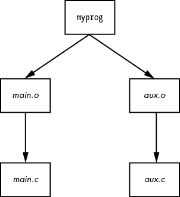

# 第十五章：开发工具


Linux 在程序员中非常受欢迎，不仅仅因为提供了丰富的工具和环境，而且因为该系统的文档非常完善且透明。在 Linux 系统上，你不必是程序员就可以利用开发工具，这个好消息很重要，因为开发工具在管理 Linux 系统方面的作用，比其他操作系统要大得多。至少，你应该能识别出开发工具，并对如何使用它们有个大致了解。

本章在小小的篇幅中包含了大量信息，但你不需要掌握这里的所有内容。示例会非常简单，你不需要知道如何编写代码就能跟得上。你也可以很容易地浏览这些材料，稍后再回来。关于共享库的讨论可能是你需要知道的最重要的内容，但要理解共享库的来源，你首先需要一些关于如何构建程序的背景知识。

## 15.1 C 编译器

了解如何使用 C 语言编译器，可以让你深入理解你在 Linux 系统上看到的程序的来源。大多数 Linux 工具和许多 Linux 系统上的应用程序都是用 C 或 C++ 编写的。本章主要使用 C 语言的示例，但你也可以将这些知识转移到 C++。

C 程序遵循传统的开发流程：你编写程序，编译它们，然后运行它们。也就是说，当你编写 C 程序代码并想要运行它时，你必须 *编译* 可供人类阅读的代码，转化为计算机处理器可以理解的二进制低级格式。你编写的代码叫做 *源代码*，可能包含多个文件。你可以将其与稍后将讨论的脚本语言做对比，后者不需要编译任何东西。

大多数 Unix 系统上的 C 编译器可执行文件是 GNU C 编译器，`gcc`（通常被称为传统名称 `cc`），尽管来自 LLVM 项目的更新版 `clang` 编译器正逐渐获得更多关注。C 源代码文件以 *.c* 结尾。下面是 *The C Programming Language*（第二版，由 Brian W. Kernighan 和 Dennis M. Ritchie 编写，Prentice Hall，1988）中的一个独立的 C 源代码文件 *hello.c*：

```
#include <stdio.h>

int main() {
    printf("Hello, World.\n");
}
```

将此源代码保存为名为 *hello.c* 的文件，然后使用以下命令运行编译器：

```
$ **cc hello.c**
```

结果是一个名为 *a.out* 的可执行文件，你可以像运行系统上的其他可执行文件一样运行它。然而，你可能应该给可执行文件起个更合适的名字（比如 *hello*）。要做到这一点，请使用编译器的 `-o` 选项：

```
$ **cc -o hello hello.c**
```

对于小型程序，编译过程也就这些内容。你可能需要额外添加一个库或包含目录，但在深入这些话题之前，我们先看一下稍大一些的程序。

### 15.1.1  编译多个源文件

大多数 C 程序的规模太大，无法合理地包含在一个源代码文件中。庞大的文件变得过于杂乱，程序员难以管理，编译器有时甚至很难处理大型文件。因此，开发人员通常将源代码拆分成多个组件，每个组件都有自己的文件。

在编译大多数 *.c* 文件时，你不会立即创建一个可执行文件。相反，你需要使用编译器的 `-c` 选项来处理每个文件，生成包含二进制*目标代码*的*目标文件*，这些目标文件最终会被包含到最终的可执行文件中。为了理解这个过程，假设你有两个文件，*main.c*（用于启动程序）和 *aux.c*（用于执行实际工作），它们的内容如下：

*main.c*：

```
void hello_call();

int main() {
    hello_call();
}
```

*aux.c*：

```
#include <stdio.h>

void hello_call() {
    printf("Hello, World.\n");
}
```

以下两个编译命令完成了大部分构建程序的工作：创建目标文件。

```
$ **cc -c main.c**
$ **cc -c aux.c**
```

在这些命令完成后，你将得到两个目标文件：*main.o* 和 *aux.o*。

目标文件是一个二进制文件，处理器几乎可以理解它，除了还有一些松散的部分。首先，操作系统不知道如何启动目标文件，其次，你可能需要将多个目标文件和一些系统库结合起来，才能构建一个完整的程序。

要从一个或多个目标文件构建一个完全可执行的程序，你必须运行*链接器*，即 Unix 系统中的 `ld` 命令。然而，程序员很少直接在命令行上使用 `ld`，因为 C 编译器知道如何运行链接器程序。为了从这两个目标文件创建一个名为 `myprog` 的可执行文件，运行以下命令来链接它们：

```
$ **cc -o myprog main.o aux.o**
```

现在将注意力转回到文件 *aux.c*。如前所述，它的代码完成程序的实际工作，可能会有许多像它生成的 *aux.o* 目标文件一样的文件，这些文件对于构建程序是必要的。现在假设其他程序可能会利用我们编写的例程。我们能否重用这些目标文件？这就是我们接下来要探讨的问题。

### 15.1.2  与库的链接

在源代码上运行编译器通常不会生成足够的目标代码来单独创建一个有用的可执行程序。你需要*库*来构建完整的程序。C 库是常见的预编译组件的集合，你可以将它们集成到你的程序中，它实际上就是一组目标文件（以及一些头文件，我们将在 15.1.4 节中讨论）。例如，有一个标准的数学库，许多可执行文件都需要从中调用，因为它提供了三角函数等功能。

库主要在链接时发挥作用，当链接器程序（`ld`）从目标文件创建可执行文件时。使用库进行链接通常称为*与库链接*。在这里你最有可能遇到问题。例如，如果你有一个使用 curses 库的程序，但忘记告诉编译器去链接那个库，你会看到像这样的链接错误：

```
**badobject.o**(.text+0x28): undefined reference to '**initscr**'
```

这些错误信息中最重要的部分是加粗显示的。当链接器程序检查 *badobject.o* 对象文件时，它找不到加粗显示的函数，因此无法创建可执行文件。在这种情况下，你可能怀疑是忘记了 curses 库，因为缺失的函数是 `initscr()`；如果你搜索这个函数名，几乎总能找到一个手册页或者其他有关该库的参考资料。

为了解决这个问题，你必须首先找到 curses 库，然后使用编译器的 `-l` 选项来链接该库。库文件散布在整个系统中，不过大多数库都位于一个名为 *lib* 的子目录中（*/usr/lib* 是系统默认的位置）。对于前面的例子，基本的 curses 库文件是 *libcurses.a*，所以库名是 `curses`。把所有这些放在一起，你可以这样链接程序：

```
$ **cc -o badobject badobject.o -lcurses**
```

你必须告诉链接器非标准的库位置；这个参数是 `-L`。假设 `badobject` 程序需要在 */usr/junk/lib* 中找到 *libcrud.a*。为了编译并创建可执行文件，可以使用如下命令：

```
$ **cc -o badobject badobject.o -lcurses -L/usr/junk/lib -lcrud**
```

你的系统中有一个名为 C 标准库的库，包含了被认为是 C 编程语言一部分的基本组件。它的基本文件是 *libc.a*。当你编译程序时，这个库总是会被包含进来，除非你特别排除它。你系统中的大多数程序使用的是共享版本，所以我们来讨论一下它是如何工作的。

### 15.1.3 使用共享库

以 *.a* 结尾的库文件（例如 *libcurses.a*）被称为 *静态库*。当你将一个程序与静态库链接时，链接器会将库文件中所需的机器码复制到你的可执行文件中。一旦完成，最终的可执行文件在运行时不再需要原始的库文件，并且因为你的可执行文件已经有了库代码的副本，所以如果 *.a* 文件发生变化，可执行文件的行为也不会受到影响。

然而，库的大小总是在增加，使用的库数量也在增多，这使得静态库在磁盘空间和内存上变得浪费。此外，如果后来发现某个静态库不足或不安全，就无法更改之前链接过该库的可执行文件，除非找到并重新编译每一个可执行文件。

*共享库*解决了这些问题。将程序与共享库链接并不会将代码复制到最终的可执行文件中；它只是将库文件中名称的*引用*添加到代码中。当你运行程序时，系统只会在必要时将库的代码加载到进程的内存空间中。许多进程可以共享相同的共享库代码在内存中。如果你需要稍微修改库代码，通常可以做到，而无需重新编译任何程序。在更新 Linux 发行版的软件时，你正在更新的软件包可能包括共享库。当更新管理器要求你重启机器时，有时是为了确保系统的每个部分都在使用共享库的新版本。

共享库确实有其自身的成本：管理困难且链接过程相对复杂。然而，如果你知道四个关键点，就可以控制共享库。

+   如何列出可执行文件所需的共享库

+   可执行文件如何查找共享库

+   如何将程序与共享库链接

+   如何避免常见的共享库陷阱

以下章节将介绍如何使用和维护系统的共享库。如果你对共享库的工作原理感兴趣，或者想了解链接器的相关知识，可以参考 John R. Levine 的《Linkers and Loaders》（Morgan Kaufmann，1999）；David M. Beazley、Brian D. Ward 和 Ian R. Cooke 的《共享库与动态加载内幕》（《Computing in Science & Engineering》，2001 年 9/10 月）；或者在线资源，如程序库 HOWTO（*https://bit.ly/3q3MbS6*）。ld.so(8) 手册页也值得一读。

#### 如何列出共享库的依赖关系

共享库文件通常与静态库文件位于相同的位置。Linux 系统中的两个标准库目录是*/lib*和*/usr/lib*，尽管许多库可能分布在系统的其他位置。*/lib*目录不应包含静态库。

共享库的后缀名包含*.so*（共享对象），例如*libc-2.15.so*和*libc.so.6*。要查看程序使用了哪些共享库，可以运行`ldd` `prog`，其中`prog`是可执行文件的名称。下面是一个针对 shell 的示例：

```
$ **ldd /bin/bash**
    linux-vdso.so.1 (0x00007ffff31cc000)
    libgtk3-nocsd.so.0 => /usr/lib/x86_64-linux-gnu/libgtk3-nocsd.so.0 (0x00007f72bf3a4000)
    libtinfo.so.5 => /lib/x86_64-linux-gnu/libtinfo.so.5 (0x00007f72bf17a000)
    libdl.so.2 => /lib/x86_64-linux-gnu/libdl.so.2 (0x00007f72bef76000)
 libc.so.6 => /lib/x86_64-linux-gnu/libc.so.6 (0x00007f72beb85000)
    libpthread.so.0 => /lib/x86_64-linux-gnu/libpthread.so.0 (0x00007f72be966000)
    /lib64/ld-linux-x86-64.so.2 (0x00007f72bf8c5000)
```

为了实现最佳的性能和灵活性，单独的可执行文件通常不知道共享库的位置；它们只知道库的名称，可能还有一些关于如何找到它们的提示。一个名为`ld.so`的小程序（*运行时动态链接器/加载器*）在程序运行时查找并加载共享库。前面的`ldd`输出显示了左侧`=>`的库名称；这就是可执行文件所知道的内容。`=>`右侧显示了`ld.so`查找到库的位置。

最后一行输出显示了`ld.so`的实际位置：*/lib/ld-linux.so.2*。

#### 如何 ld.so 查找共享库

共享库的常见问题之一是动态链接器无法找到库。动态链接器通常*应该*首先在可执行文件的预配置的 *运行时库搜索路径* *(rpath)* 中查找共享库，如果该路径存在的话。稍后你将看到如何创建这个路径。

接下来，动态链接器会查看系统缓存 */etc/ld.so.cache*，以查看库是否位于标准位置。这是一个快速缓存，存储了在缓存配置文件 */etc/ld.so.conf* 中列出的目录中找到的库文件的名称。

*ld.so.conf* 中的每一行（或它包含的文件）都是你希望包含在缓存中的目录名。目录列表通常很短，包含类似以下内容的内容：

```
/lib/i686-linux-gnu
/usr/lib/i686-linux-gnu
```

标准库目录 */lib* 和 */usr/lib* 是隐式的，这意味着你不需要将它们包含在 */etc/ld.so.conf* 中。

如果你更改了 *ld.so.conf* 或对某个共享库目录进行了更改，你必须手动通过以下命令重建 */etc/ld.so.cache* 文件：

```
# ldconfig -v
```

`-v` 选项提供有关 `ldconfig` 添加到缓存中的库的详细信息，以及它检测到的任何更改。

`ld.so` 查找共享库的另一个位置是环境变量 `LD_LIBRARY_PATH`。我们很快会讨论这个。

不要养成往 */etc/ld.so.conf* 中添加内容的习惯。你应该知道系统缓存中有哪些共享库，如果你将每个奇怪的共享库目录都放入缓存中，就有可能导致冲突，系统变得极其混乱。当你编译需要一个不常见库路径的软件时，为你的可执行文件设置一个内建的运行时库搜索路径。我们来看看如何做到这一点。

#### 如何将程序链接到共享库

假设你有一个名为 *libweird.so.1* 的共享库，位于 */opt/obscure/lib*，你需要将其链接到 `myprog`。你不应该在 */etc/ld.so.conf* 中包含这个奇怪的路径，因此你需要将该路径传递给链接器。如下所示链接程序：

```
$ **cc -o myprog myprog.o -Wl,-rpath=/opt/obscure/lib -L/opt/obscure/lib -lweird**
```

`-Wl,-rpath` 选项告诉链接器将指定的目录包含到可执行文件的运行时库搜索路径中。然而，即使你使用了 `-Wl,-rpath`，你仍然需要 `-L` 标志。

如果你需要更改现有二进制文件的运行时库搜索路径，你可以使用 `patchelf` 程序，但通常最好在编译时完成此操作。（ELF，执行和可链接格式，是 Linux 系统中可执行文件和库的标准格式。）

#### 如何避免共享库的问题

共享库提供了卓越的灵活性，更不用说一些真正不可思议的技巧了，但你可以滥用它们，导致系统变得一团糟。可能会发生三种特别糟糕的情况：

+   缺失的库

+   糟糕的性能

+   不匹配的库

所有共享库问题的首要原因是环境变量`LD_LIBRARY_PATH`。将此变量设置为由冒号分隔的目录名集合，使得`ld.so`在查找共享库时，会*首先*搜索给定的目录。这是一种廉价的方法，可以使程序在你移动库时仍能正常工作，如果你没有程序的源代码且不能使用`patchelf`，或者只是懒得重新编译可执行文件。不幸的是，你得到的就是你付出的代价。

*永远不要*在 shell 启动文件或编译软件时设置`LD_LIBRARY_PATH`。当动态运行时链接器遇到此变量时，它通常必须多次搜索每个指定目录的所有内容，次数可能比你想知道的还要多。这会导致性能严重下降，但更重要的是，你可能会遇到冲突和不匹配的库，因为运行时链接器会在这些目录中查找*每个*程序。

如果你*必须*使用`LD_LIBRARY_PATH`来运行一些低劣程序，而你没有该程序的源代码（或者你不想重新编译某些应用程序，如 Firefox 或其他某个程序），请使用包装脚本。假设你的可执行文件是*/opt/crummy/bin/crummy.bin*，并且需要在*/opt/crummy/lib*中查找一些共享库。编写一个名为`crummy`的包装脚本，内容如下：

```
#!/bin/sh
LD_LIBRARY_PATH=/opt/crummy/lib
export LD_LIBRARY_PATH
exec /opt/crummy/bin/crummy.bin $@
```

避免使用`LD_LIBRARY_PATH`可以防止大多数共享库问题。但开发人员偶尔会遇到的另一个重大问题是，库的 API 可能会在每个次要版本之间略有变化，从而破坏已安装的软件。解决这一问题的最佳方法是预防性措施：要么使用一致的方法通过`-Wl,-rpath`安装共享库，以创建运行时链接路径，要么干脆使用一些不常见库的静态版本。

### 15.1.4  处理头文件（包含文件）和目录

C *头文件*是额外的源代码文件，通常包含类型和库函数声明，通常是为你刚才看到的库所准备的。例如，*stdio.h*就是一个头文件（参见 15.1 节中的简单程序）。

许多编译问题与头文件有关。大多数此类问题发生在编译器找不到头文件和库时。甚至有些情况下，程序员忘记在代码中添加`#include`指令来包含所需的头文件，从而导致部分源代码无法编译。

#### 包含文件问题

查找正确的头文件并不总是容易的。有时你会很幸运，用`locate`找到它们，但在其他情况下，可能会在不同的目录中找到多个同名的包含文件，且不清楚哪个是正确的。当编译器找不到包含文件时，错误信息看起来是这样的：

```
badinclude.c:1:22: fatal error: notfound.h: No such file or directory
```

此消息报告编译器找不到*notfound.h*头文件，而*badinclude.c*文件引用了它。如果我们查看*badinclude.c*（如错误所示，在第 1 行），我们会发现有一行类似这样的内容：

```
#include <notfound.h>
```

像这样的包含指令并没有指定头文件应该位于何处，只是说明它应该位于默认位置或编译器命令行中指定的位置。这些位置的名称通常包含*include*。Unix 中的默认包含目录是*/usr/include*；编译器总是会在那里查找，除非你明确告诉它不查找。当然，如果包含文件位于默认位置，你不太可能看到上面的错误，那么我们来看看如何让编译器查找其他包含目录。

例如，假设你在*/usr/junk/include*中找到了*notfound.h*。要告诉编译器将该目录添加到搜索路径中，请使用`-I`选项：

```
$ **cc -c -I/usr/junk/include badinclude.c**
```

现在，编译器应该不再在*badinclude.c*中遇到引用头文件的代码行错误。

你还应该注意使用双引号（`"` `"）`而不是尖括号（`< >`）的包含方式，例如：

```
#include "myheader.h"
```

双引号意味着头文件不在系统包含目录中，通常表示包含的文件与源文件位于同一目录。如果你遇到双引号问题，你可能正在尝试编译不完整的源代码。

#### C 预处理器

事实证明，C 编译器并不实际执行查找这些包含文件的工作。这个任务由*C 预处理器*完成，它是编译器在解析实际程序之前对源代码进行处理的程序。预处理器将源代码重写成编译器理解的形式；它是一个使源代码更易读（并提供快捷方式）的工具。

源代码中的预处理命令称为*指令*，并且它们以`#`字符开头。有三种基本类型的指令：

1.  包含文件 `#include`指令指示预处理器包含整个文件。请注意，编译器的`-I`标志实际上是一个选项，它使得预处理器在指定目录中查找包含文件，就像你在前面的章节中看到的那样。

1.  宏定义 像`#define BLAH something`这样的行告诉预处理器将`something`替换为源代码中所有出现的`BLAH`。惯例规定宏应全大写，但程序员有时会使用名称看起来像函数和变量的宏（偶尔这会引起一堆麻烦，许多程序员乐于滥用预处理器）。

1.  条件语句 你可以使用`#ifdef`、`#if`和`#endif`标记出某些代码块。`#ifdef` `MACRO`指令检查预处理宏`MACRO`是否已定义，`#if` `condition`测试`condition`是否非零。对于这两个指令，如果紧随“if”语句的条件为假，预处理器不会将`#if`和下一个`#endif`之间的任何程序文本传递给编译器。如果你计划查看任何 C 代码，最好习惯这个。

    让我们看一个条件指令的例子。当预处理器看到以下代码时，它会检查宏 `DEBUG` 是否已定义，如果已定义，则将包含 `fprintf()` 的行传递给编译器。否则，预处理器跳过这一行，继续处理 `#endif` 后面的文件：

    ```
    #ifdef DEBUG
      fprintf(stderr, "This is a debugging message.\n");
    #endif
    ```

在 Unix 中，C 预处理器的名称是 `cpp`，但你也可以通过 `gcc -E` 来运行它。然而，你很少需要单独运行预处理器。

## 15.2 make

一个有多个源代码文件或需要特殊编译器选项的程序，在手动编译时会非常繁琐。这类问题已经存在多年，解决这个问题的传统 Unix 编译管理工具叫做 `make`。如果你正在运行一个 Unix 系统，你应该了解一些关于 `make` 的知识，因为系统工具有时依赖于 `make` 来操作。不过，本章内容仅仅是冰山一角。关于 `make` 的书籍有很多，比如 Robert Mecklenburg 所著的 *Managing Projects with GNU Make* 第三版（O’Reilly, 2005）。此外，大多数 Linux 软件包都是通过围绕 `make` 或类似工具构建的。世上有许多构建系统；我们将在第十六章了解一个名为 autotools 的系统。

`make` 是一个庞大的系统，但它并不难理解其工作原理。当你看到一个名为 *Makefile* 或 *makefile* 的文件时，你就知道你正在使用 `make`。（试试运行 `make` 看看能否构建出任何东西。）

`make` 的基本思想是 *目标*，即你希望实现的目标。目标可以是一个文件（如 *.o* 文件、可执行文件等）或一个标签。此外，一些目标依赖于其他目标；例如，在链接可执行文件之前，你需要一个完整的 *.o* 文件集。这些要求被称为 *依赖关系*。

要构建一个目标，`make` 遵循一个 *规则*，例如指定如何从 *.c* 源文件生成 *.o* 对象文件的规则。`make` 已经知道了几个规则，但你可以自定义它们来创建你自己的规则。

### 15.2.1  一个示例 Makefile

基于 15.1.1 节中的示例文件，下面这个非常简单的 Makefile 从 *aux.c* 和 *main.c* 构建一个名为 `myprog` 的程序：

```
1 # object files
2 OBJS=aux.o main.o

3 all: 4myprog

myprog: 5$(OBJS)
        6$(CC) -o myprog $(OBJS)
```

这个 Makefile 1 的第一行中的 `#` 表示注释。

下一行仅仅是一个宏定义，它将 `OBJS` 变量设置为两个对象文件名 2。这在后面会很重要。目前，注意如何定义宏以及如何在后面引用它（`$(OBJS)`）。

Makefile 中的下一个项目包含其第一个目标，`all` 3。第一个目标总是默认目标，也就是当你在命令行中单独运行 `make` 时，`make` 想要构建的目标。

用来构建目标的规则位于冒号后面。对于`all`，这个 Makefile 表示需要满足名为`myprog`的目标 4。这是文件中的第一个依赖关系；`all`依赖于`myprog`。注意，`myprog`可以是一个实际文件，也可以是另一个规则的目标。在这种情况下，它既是（`all`的规则也是`OBJS`的目标）。

为了构建`myprog`，这个 Makefile 在依赖关系 5 中使用了宏`$(OBJS)`。这个宏展开为*aux.o*和*main.o*，表明`myprog`依赖于这两个文件（它们必须是实际的文件，因为在 Makefile 中没有任何与这些名称匹配的目标）。

这个 Makefile 假定你在同一目录下有两个 C 源文件，分别是*aux.c*和*main.c*。运行`make`时，将输出以下内容，显示`make`正在运行的命令：

```
$ **make**
cc    -c -o aux.o aux.c
cc    -c -o main.o main.c
cc -o myprog aux.o main.o
```

依赖关系的图示见图 15-1。

### 15.2.2  内置规则

`make`是如何知道从*aux.c*到*aux.o*的转换过程的呢？毕竟，*aux.c*并没有出现在 Makefile 中。答案是`make`有一些内置规则可以遵循。它知道当你想要一个*.o*文件时，要查找一个*.c*文件，而且它知道如何在那个*.c*文件上运行`cc -c`，从而达到创建*.o*文件的目标。



图 15-1：Makefile 依赖关系

### 15.2.3  最终程序构建

到达`myprog`的最后一步有点棘手，但概念相当清晰。在你拥有`$(OBJS)`中的两个目标文件之后，可以按照以下行运行 C 编译器（其中`$(CC)`展开为编译器名称）：

```
 $(CC) -o myprog $(OBJS)
```

如前所述，`$(CC)`前的空白是一个制表符。你*必须*在任何系统命令前插入一个制表符，并且它必须单独占一行。

注意：

```
Makefile:7: *** missing separator.  Stop.
```

这样的错误意味着 Makefile 有问题。制表符是分隔符，如果没有分隔符或有其他干扰，你将看到此错误。

### 15.2.4  依赖关系更新

最后一条需要了解的`make`基本概念是，通常情况下，目标是让目标与其依赖关系保持同步。此外，它被设计为只执行必要的最小步骤，这可以节省大量时间。如果你连续输入两次`make`命令，对于前面的例子，第一次命令构建了`myprog`，但第二次则输出以下内容：

```
make: Nothing to be done for 'all'.
```

第二次运行时，`make`查看了它的规则并发现`myprog`已经存在，所以它没有再次构建`myprog`，因为自上次构建以来，依赖关系没有发生变化。要进行此实验，请执行以下操作：

1.  运行`touch aux.c`。

1.  再次运行`make`。这一次，`make`判断出*aux.c*比目录中已有的*aux.o*更新，因此它重新编译了*aux.o*。

1.  `myprog`依赖于*aux.o*，而现在*aux.o*比已有的`myprog`更新，因此`make`必须重新创建`myprog`。

这种类型的连锁反应是非常典型的。

### 15.2.5  命令行参数和选项

如果你了解 `make` 的命令行参数和选项的工作原理，你可以从中获得极大的效益。

最有用的选项之一是在命令行上指定单个目标。对于前面的 Makefile，如果你只想要 *aux.o* 文件，可以运行 `make aux.o`。

你还可以在命令行上定义宏。例如，要使用 `clang` 编译器，可以尝试：

```
$ **make CC=clang**
```

在这里，`make` 使用你定义的 `CC`，而不是默认的编译器 `cc`。命令行宏在测试预处理器定义和库时特别有用，尤其是在我们稍后讨论的 `CFLAGS` 和 `LDFLAGS` 宏中。

事实上，你甚至不需要 Makefile 就能运行 `make`。如果内置的 `make` 规则匹配目标，你可以直接让 `make` 尝试创建该目标。例如，如果你有一个名为 *blah.c* 的简单程序源代码，可以尝试运行 `make blah`。`make` 执行的过程如下：

```
$ **make blah**
cc   blah.o   -o blah
```

这种使用 `make` 的方法仅适用于最基础的 C 程序；如果你的程序需要库或特殊的包含目录，你可能应该编写一个 Makefile。当你处理像 Fortran、Lex 或 Yacc 这样的工具，并且不知道编译器或工具的工作方式时，运行没有 Makefile 的 `make` 实际上最为有用。为什么不让 `make` 为你尝试弄清楚呢？即使 `make` 未能创建目标，它也很可能给你一个相当不错的提示，帮助你了解如何使用该工具。

有两个 `make` 选项从其他选项中脱颖而出：

1.  `-n` 打印构建所需的命令，但阻止 `make` 实际运行任何命令。

1.  `-f` `file` 告诉 `make` 从 `file` 读取，而不是从 `Makefile` 或 `makefile` 读取。

### 15.2.6  标准宏和变量

`make` 有许多特殊的宏和变量。很难区分宏和变量之间的区别，但在这里，“宏”一词用于表示在 `make` 开始构建目标后通常不会改变的内容。

正如你之前所看到的，你可以在 Makefile 开始时设置宏。这些是最常见的宏：

1.  `CFLAGS` C 编译器选项。在从 *.c* 文件创建目标代码时，`make` 会将其作为参数传递给编译器。

1.  `LDFLAGS` 类似于 `CFLAGS`，但这些选项是用于链接器，在从目标代码创建可执行文件时使用。

1.  `LDLIBS` 如果你使用了 `LDFLAGS`，但不想将库名称选项与搜索路径合并，可以将库名称选项放入此文件中。

1.  `CC` C 编译器。默认是 `cc`。

1.  `CPPFLAGS` C *预处理器* 选项。当 `make` 运行 C 预处理器时，它会将此宏的扩展作为参数传递。

1.  `CXXFLAGS` GNU `make` 用于 C++ 编译器标志。

一个 `make` *变量* 会随着你构建目标而变化。变量以美元符号（`$`）开头。有几种方法可以设置变量，但一些最常见的变量会在目标规则中自动设置。你可能会看到如下内容：

1.  `$@` 当处于规则内部时，此变量扩展为当前目标。

1.  `$<` 当在规则中时，这个变量展开为目标的第一个依赖项。

1.  `$*` 这个变量展开为当前目标的 *基本名* 或主干。例如，如果你正在构建 *blah.o*，它会展开为 *blah*。

下面是一个示例，展示了一种常见的模式——使用 `myprog` 规则从 *.in* 文件生成 *.out* 文件：

```
.SUFFIXES: .in
.in.out: $<
	myprog $< -o $*.out
```

你会在许多 Makefile 中遇到类似 `.c.o:` 的规则，它定义了一个自定义方式来运行 C 编译器生成对象文件。

在 Linux 上，最全面的 `make` 变量列表可以在 `make` 信息手册中找到。

### 15.2.7  常规目标

大多数开发者会在他们的 Makefile 中包含几个常见的额外目标，这些目标执行与编译相关的辅助任务：

1.  `clean` `clean` 目标无处不在；执行 `make clean` 通常会指示 `make` 删除所有对象文件和可执行文件，以便你能够重新开始或打包软件。以下是 `myprog` Makefile 的示例规则：

    ```
    clean:
            rm -f $(OBJS) myprog
    ```

1.  `distclean` 通过 GNU autotools 系统创建的 Makefile 通常会包含一个 `distclean` 目标，用来删除所有非原始发行版的一部分内容，包括 Makefile 本身。你将在第十六章看到更多内容。在极少数情况下，开发者可能选择不通过这个目标删除可执行文件，而是倾向于使用类似 `realclean` 的方法。

1.  `install` 这个目标将文件和编译过的程序复制到 Makefile 认为是系统上适当的位置。这可能是危险的，所以在实际运行任何命令之前，始终先运行 `make -n install` 来查看会发生什么。

1.  `test` 或 `check` 一些开发者提供 `test` 或 `check` 目标，以确保在执行构建后，一切工作正常。

1.  `depend` 这个目标通过使用 `-M` 选项调用编译器来检查源代码，从而创建依赖关系。这个目标看起来有些不寻常，因为它通常会改变 Makefile 本身。虽然这已经不再是常见做法，但如果你遇到一些指示要求你使用这个规则，请务必遵循。

1.  `all` 如前所述，这通常是 Makefile 中的第一个目标。你通常会看到对这个目标的引用，而不是实际的可执行文件。

### 15.2.8  Makefile 组织结构

尽管有许多不同的 Makefile 风格，大多数程序员还是遵循一些通用的经验法则。首先，在 Makefile 的前半部分（宏定义部分），你应该看到按包分组的库和包含文件：

```
MYPACKAGE_INCLUDES=-I/usr/local/include/mypackage
MYPACKAGE_LIB=-L/usr/local/lib/mypackage -lmypackage

PNG_INCLUDES=-I/usr/local/include
PNG_LIB=-L/usr/local/lib -lpng
```

每种类型的编译器和链接器标志通常会像这样使用宏：

```
CFLAGS=$(CFLAGS) $(MYPACKAGE_INCLUDES) $(PNG_INCLUDES)
LDFLAGS=$(LDFLAGS) $(MYPACKAGE_LIB) $(PNG_LIB)
```

对象文件通常按可执行文件进行分组。例如，假设你有一个包，它创建名为 `boring` 和 `trite` 的可执行文件。每个文件都有自己的 *.c* 源文件，并且需要 *util.c* 中的代码。你可能会看到类似这样的内容：

```
UTIL_OBJS=util.o

BORING_OBJS=$(UTIL_OBJS) boring.o
TRITE_OBJS=$(UTIL_OBJS) trite.o

PROGS=boring trite
```

Makefile 的其余部分可能如下所示：

```
all: $(PROGS)

boring: $(BORING_OBJS)
        $(CC) -o $@ $(BORING_OBJS) $(LDFLAGS)

trite: $(TRITE_OBJS)
        $(CC) -o $@ $(TRITE_OBJS) $(LDFLAGS)
```

你可以将这两个可执行目标合并为一个规则，但通常不推荐这样做，因为你将很难将规则移动到另一个 Makefile 中，删除可执行文件或以不同方式分组可执行文件。此外，依赖关系将会错误：如果你只有一个规则处理 `boring` 和 `trite`，`trite` 将依赖于 *boring.c*，而 `boring` 将依赖于 *trite.c*，并且每当你更改其中一个源文件时，`make` 将总是尝试重新构建这两个程序。

## 15.3 Lex 和 Yacc

在编译读取配置文件或命令的程序过程中，你可能会遇到 Lex 和 Yacc。这些工具是编程语言的构建模块。

+   Lex 是一个 *标记化器*，它将文本转换为带有标签的编号标记。GNU/Linux 版本被称为 `flex`。你可能需要与 Lex 一起使用 `-ll` 或 `-lfl` 链接器标志。

+   Yacc 是一个 *解析器*，它根据 *语法* 尝试读取标记。GNU 解析器是 `bison`；为了获得 Yacc 兼容性，请运行 `bison -y`。你可能需要 `-ly` 链接器标志。

## 15.4 脚本语言

很久以前，普通的 Unix 系统管理员几乎不需要关心除了 Bourne shell 和 awk 之外的其他脚本语言。Shell 脚本（第十一章中讨论）仍然是 Unix 的重要组成部分，但 awk 在脚本领域的使用有所减少。然而，许多强大的继任者已经出现，许多系统程序实际上已经从 C 转向了脚本语言（例如 `whois` 程序的合理版本）。让我们来看看一些脚本语言的基础知识。

你需要知道的关于任何脚本语言的第一件事是，脚本的第一行看起来像 Bourne shell 脚本的 shebang。例如，一个 Python 脚本是这样开始的：

```
#!/usr/bin/python
```

或者这个版本，它会运行命令路径中第一个找到的 Python 版本，而不是始终去 */usr/bin* 目录：

```
#!/usr/bin/env python
```

如你在第十一章所见，任何以 `#!` shebang 开头的可执行文本文件都是脚本。此前缀后的路径名是脚本语言解释器的可执行文件。当 Unix 尝试运行以 `#!` 开头的可执行文件时，它会运行 `#!` 后面的程序，并将剩余的文件作为标准输入。因此，甚至这个也是脚本：

```
#!/usr/bin/tail -2
This program won't print this line,
but it will print this line...
and this line, too.
```

一个 shell 脚本的第一行经常包含最常见的基本脚本问题之一：无效的脚本语言解释器路径。例如，假设你将之前的脚本命名为 `myscript`。如果 `tail` 实际上位于 */bin* 而不是 */usr/bin* 目录中呢？在这种情况下，运行 `myscript` 会产生以下错误：

```
bash: ./myscript: /usr/bin/tail: bad interpreter: No such file or directory
```

不要指望脚本第一行中的多个参数能够正常工作。也就是说，上例中的 `-2` 可能有效，但如果你再添加一个参数，系统可能会将 `-2` *和* 新的参数视为一个大参数（包括空格）。这在不同的系统之间可能有所不同；不要为了这种微不足道的事而考验你的耐心。

现在，让我们来看看一些其他的编程语言。

### 15.4.1  Python

Python 是一种脚本语言，拥有强大的用户群体和一系列强大的功能，如文本处理、数据库访问、网络编程和多线程。它具有强大的交互模式和非常有组织的对象模型。

Python 的可执行文件是`python`，通常位于*/usr/bin*。然而，Python 不仅仅通过命令行用于脚本编写，它在从数据分析到 Web 应用程序等各个领域都有应用。*Python Distilled*，由 David M. Beazley（Addison-Wesley，2021 年）所著，是入门的好书。

### 15.4.2  Perl

其中一种较为古老的第三方 Unix 脚本语言是 Perl。它是最初的“瑞士军刀”编程工具。尽管近年来 Perl 在许多方面被 Python 超越，但它在文本处理、转换和文件操作等方面表现尤为突出，你可能会遇到很多用 Perl 编写的工具。*Learning Perl* 第七版，由 Randal L. Schwartz、brian d foy 和 Tom Phoenix（O'Reilly，2016 年）编写，是一本教程式的入门书；更为全面的参考书是 *Modern Perl* 第四版，由 chromatic（Onyx Neon Press，2016 年）编写。

### 15.4.3  其他脚本语言

你可能还会遇到以下脚本语言：

1.  PHP 这是一种超文本处理语言，常见于动态网页脚本中。有些人也会使用 PHP 来编写独立脚本。PHP 的官网地址是 [`www.php.net/`](http://www.php.net/)。

1.  Ruby 面向对象的狂热者和许多 Web 开发者喜欢使用这种语言进行编程 ([`www.ruby-lang.org/`](http://www.ruby-lang.org/))。

1.  JavaScript 这种语言主要用于网页浏览器中操控动态内容。由于其许多缺陷，大多数经验丰富的程序员不推荐将其作为独立脚本语言，但在进行 Web 编程时几乎无法避免。近年来，一种名为 Node.js 的实现已经在服务器端编程和脚本中变得越来越普遍；它的可执行文件名是`node`。

1.  Emacs Lisp 这是一种 Lisp 编程语言的变种，用于 Emacs 文本编辑器。

1.  MATLAB，Octave MATLAB 是一种商业矩阵和数学编程语言及库。Octave 是一个非常相似的自由软件项目。

1.  R 这是一种流行的免费统计分析语言。更多信息请访问 [`www.r-project.org/`](http://www.r-project.org/) 和 *The Art of R Programming*，作者 Norman Matloff（No Starch Press，2011 年）。

1.  Mathematica 这是一种带有库的商业数学编程语言。

1.  m4 这是一种宏处理语言，通常只出现在 GNU autotools 中。

1.  Tcl Tcl（工具命令语言）是一种简单的脚本语言，通常与 Tk 图形用户界面工具包和 Expect 自动化工具相关联。尽管 Tcl 不再像以前那样被广泛使用，但它的强大功能不容小觑。许多资深开发者仍偏爱 Tk，尤其是在其嵌入式功能方面。更多信息请访问 [`www.tcl.tk/`](http://www.tcl.tk/)。

## 15.5 Java

Java 是一种类似于 C 的编译语言，具有更简洁的语法，并且对面向对象编程提供了强大的支持。它在 Unix 系统中有一些特定的应用领域。例如，它常用于作为 Web 应用程序环境，并且在特定应用程序中非常流行。Android 应用通常使用 Java 编写。虽然在典型的 Linux 桌面上不常见 Java，但你应该了解 Java 是如何工作的，至少要了解如何使用它编写独立应用程序。

有两种类型的 Java 编译器：用于生成你系统的机器代码的本地编译器（类似于 C 编译器），以及用于字节码解释器（有时称为*虚拟机*，它与第十七章中描述的超管提供的虚拟机不同）的字节码编译器。你几乎总是会在 Linux 上遇到字节码。

Java 字节码文件的扩展名是*.class*。Java 运行时环境（JRE）包含你运行 Java 字节码所需的所有程序。要运行字节码文件，请使用：

```
$ **java** `file`**.class**
```

你也可能会遇到以*.jar*结尾的字节码文件，它们是已归档的*.class*文件的集合。要运行*.jar*文件，使用以下语法：

```
$ **java -jar** `file`**.jar**
```

有时你需要设置`JAVA_HOME`环境变量为你的 Java 安装目录。如果你运气不太好，你可能需要使用`CLASSPATH`来包含程序期望的类所在的目录。这是一个由冒号分隔的目录集，类似于用于可执行文件的`PATH`变量。

如果你需要将一个*.java*文件编译成字节码，你需要 Java 开发工具包（JDK）。你可以使用`javac`编译器从 JDK 中创建一些*.class*文件：

```
$ **javac** `file`**.java**
```

JDK 还附带了`jar`程序，它可以创建和解压*.jar*文件。它的工作方式类似于`tar`。

## 15.6 展望未来：编译软件包

编译器和脚本语言的世界是庞大且不断扩展的。到目前为止，像 Go（golang）和 Rust 这样的新编译语言在应用程序和系统编程中越来越受欢迎。

LLVM 编译器基础设施集（[`llvm.org/`](http://llvm.org/)）极大地简化了编译器开发。如果你对如何设计和实现编译器感兴趣，有两本很好的书籍：《编译原理：技术与工具》第 2 版，作者 Alfred V. Aho 等人（Addison-Wesley，2006 年）和《现代编译器设计》第 2 版，作者 Dick Grune 等人（Springer，2012 年）。对于脚本语言的开发，通常最好查找在线资源，因为实现方式差异较大。

现在你已经了解了系统上编程工具的基本知识，接下来你可以看到它们能做什么。下一章将介绍如何从源代码在 Linux 上构建软件包。
