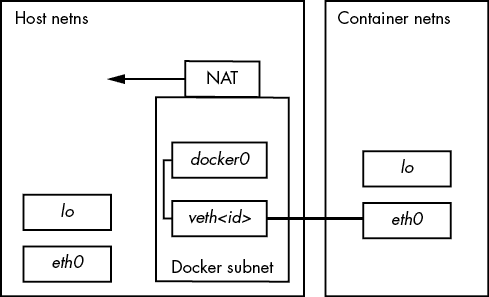

# 第十七章：虚拟化


在计算机系统中，*虚拟*这个词可能比较模糊。它主要用来表示一个中介，翻译复杂或碎片化的底层层次，提供一个可以被多个消费者使用的简化接口。考虑我们已经见过的一个例子——虚拟内存，它允许多个进程像拥有自己隔离的内存块一样访问一个大的内存池。

这个定义还是有点吓人，所以更好的方法可能是解释虚拟化的典型用途：创建隔离的环境，以便你可以让多个系统运行而不会发生冲突。

由于虚拟机在更高层次上相对容易理解，我们将在虚拟化之旅中从这里开始。然而，讨论将仍然停留在更高的层次，旨在解释你在使用虚拟机时可能遇到的众多术语，而不深入实现的细节。

我们将更深入地讨论容器的技术细节。它们是使用本书中已经介绍的技术构建的，因此你可以看到这些组件是如何组合在一起的。此外，交互式探索容器相对容易。

## 17.1 虚拟机

虚拟机基于与虚拟内存相同的概念，只不过是以*整个*机器的硬件为基础，而不仅仅是内存。在这种模型中，你可以借助软件创建一台全新的机器（处理器、内存、I/O 接口等），并在其中运行一个完整的操作系统——包括内核。这样的虚拟机更具体地被称为*系统虚拟机*，它已经存在了几十年。例如，IBM 的大型机通常使用系统虚拟机来创建多用户环境；反过来，用户会得到自己运行 CMS 的虚拟机，CMS 是一个简单的单用户操作系统。

你可以完全通过软件构建一个虚拟机（通常称为*模拟器*），或者尽可能多地利用底层硬件，就像虚拟内存中所做的那样。就我们在 Linux 中的用途而言，我们将重点关注后一种方式，因为它具有更好的性能，但需要注意的是，许多流行的模拟器支持旧的计算机和游戏系统，如 Commodore 64 和 Atari 2600。

虚拟机的世界非常广泛，充满了大量的术语需要了解。我们对虚拟机的探索将主要集中在这些术语与典型的 Linux 用户可能遇到的情况之间的关系。我们还会讨论在虚拟硬件中你可能会遇到的一些差异。

### 17.1.1  虚拟机监控程序

在计算机上管理一个或多个虚拟机的软件叫做*虚拟机监控器*（*hypervisor*）或*虚拟机监视器 (VMM)*，它的工作方式类似于操作系统管理进程的方式。虚拟机监控器有两种类型，虚拟机的使用方式取决于类型。对于大多数用户来说，*第二类型虚拟机监控器*是最熟悉的，因为它运行在像 Linux 这样的普通操作系统上。例如，VirtualBox 就是第二类型虚拟机监控器，你可以在系统上运行它而无需进行大量修改。在阅读本书时，你可能已经使用它来测试和探索不同的 Linux 系统。

另一方面，*第一类型虚拟机监控器*更像是一个操作系统（尤其是内核），专门构建来快速高效地运行虚拟机。这种虚拟机监控器可能偶尔会使用像 Linux 这样的传统伴随系统来帮助管理任务。即使你可能永远不会在自己的硬件上运行一个，你每天都会与第一类型虚拟机监控器交互。所有云计算服务都是在第一类型虚拟机监控器下运行虚拟机，比如 Xen。当你访问一个网站时，几乎可以肯定你在访问一个运行在虚拟机上的软件。在 AWS 等云服务上创建操作系统实例就是在第一类型虚拟机监控器上创建虚拟机。

通常，带有操作系统的虚拟机称为*来宾*。*主机*是运行虚拟机监控器的任何设备。对于第二类型虚拟机监控器，主机就是你的本地系统。对于第一类型虚拟机监控器，主机就是虚拟机监控器本身，可能与一个专门的伴随系统结合使用。

### 17.1.2  虚拟机中的硬件

理论上，虚拟机监控器为来宾系统提供硬件接口应该是直接的。例如，为了提供一个虚拟磁盘设备，你可以在主机的某个位置创建一个大文件，并通过标准的设备 I/O 仿真将其作为磁盘提供访问。这个方法是严格的硬件虚拟机，但效率较低。为了使虚拟机适用于各种需求，需要做一些改动。

你可能会遇到的一些虚拟硬件与真实硬件之间的差异，是因为一种桥接技术使得来宾系统能够更直接地访问主机资源。绕过主机与来宾之间的虚拟硬件的方式被称为*准虚拟化*。网络接口和块设备是最有可能接受这种处理的；例如，在云计算实例上，* /dev/xvd *设备是一个 Xen 虚拟磁盘，使用 Linux 内核驱动程序直接与虚拟机监控器进行通信。有时候，为了方便，准虚拟化被使用；例如，在像 VirtualBox 这样的桌面系统上，驱动程序可以协调虚拟机窗口和主机环境之间的鼠标移动。

无论机制如何，虚拟化的目标始终是将问题简化到足够的程度，使得来宾操作系统可以像对待其他设备一样处理虚拟硬件。这确保了设备上方的所有层都能正常运行。例如，在 Linux 来宾系统上，你希望内核能够将虚拟磁盘视为块设备，以便你可以使用常规工具对其进行分区并创建文件系统。

#### 虚拟机 CPU 模式

虚拟机如何工作的大部分细节超出了本书的范围，但 CPU 需要提及，因为我们已经讨论过内核模式和用户模式的区别。这些模式的具体名称因处理器而异（例如，x86 处理器使用一种叫做*特权环*的系统），但其核心思想始终相同。在内核模式下，处理器几乎可以执行任何操作；而在用户模式下，一些指令是不允许的，且内存访问受到限制。

第一个运行在 x86 架构上的虚拟机是在用户模式下运行的。这就出现了一个问题，因为虚拟机中的内核希望处于内核模式。为了解决这个问题，虚拟机管理程序可以检测并响应（“陷阱”）来自虚拟机的任何受限指令。经过一些工作，虚拟机管理程序能够模拟这些受限指令，从而使虚拟机能够在不支持该模式的架构上以内核模式运行。因为大多数内核执行的指令并不受限，所以这些指令能正常运行，并且性能影响非常小。

在这种类型的虚拟机管理程序（hypervisor）引入后不久，处理器制造商意识到市场上存在可以通过消除指令陷阱和仿真需求来辅助虚拟机管理程序的处理器需求。英特尔和 AMD 分别发布了这些功能集，称为 VT-x 和 AMD-V，大多数虚拟机管理程序现在都支持这些功能。在某些情况下，它们是必需的。

如果你想深入了解虚拟机，可以从 Jim Smith 和 Ravi Nair 的《*虚拟机：系统与进程的多功能平台*》（Elsevier，2005 年）开始阅读。书中还涉及了*进程虚拟机*，例如 Java 虚拟机（JVM），但我们在此不做讨论。

### 17.1.3  虚拟机的常见用途

在 Linux 环境中，虚拟机的使用通常可以分为几种类型：

1.  测试和试验 当你需要在不同于正常或生产操作环境的情况下尝试某些东西时，虚拟机有很多用途。例如，在开发生产软件时，必须在与开发者的机器分开的虚拟机上测试软件。另一个用途是尝试新的软件，比如新的发行版，在一个安全且“可丢弃”的环境中。虚拟机让你可以做到这一点，而无需购买新的硬件。

1.  应用兼容性 当你需要在与常规操作系统不同的操作系统下运行某些软件时，虚拟机是必不可少的。

1.  服务器和云服务 如前所述，所有云服务都是建立在虚拟机技术之上的。如果你需要运行一个互联网服务器，比如 Web 服务器，最快的方式就是付费给云提供商租用一个虚拟机实例。云提供商还提供专用服务器，比如数据库，这些实际上就是运行在虚拟机上的预配置软件集。

### 17.1.4  虚拟机的缺点

多年来，虚拟机一直是隔离和扩展服务的首选方法。因为你可以通过几次点击或 API 创建虚拟机，所以无需安装和维护硬件，就能方便地创建服务器。尽管如此，日常操作中仍然有一些方面令人头疼：

+   *安装和/或配置系统和应用可能既繁琐又耗时*。像 Ansible 这样的工具可以自动化这个过程，但从零开始搭建一个系统仍然需要相当多的时间。如果你正在使用虚拟机来测试软件，你可以预见到这些时间会迅速积累。

+   *即使配置正确，虚拟机的启动和重启速度相对较慢*。虽然有一些方法可以解决这个问题，但你仍然需要启动一个完整的 Linux 系统。

+   *你需要维护一个完整的 Linux 系统，确保每台虚拟机上的更新和安全性*。这些系统有 systemd 和 sshd，以及任何你的应用所依赖的工具。

+   *你的应用可能与虚拟机上的标准软件集存在一些冲突*。有些应用有奇怪的依赖关系，它们并不总是与生产环境中的软件兼容。此外，像库这样的依赖项在机器升级时可能会发生变化，导致以前能正常运行的功能出问题。

+   *将你的服务隔离在单独的虚拟机上可能是浪费资源且成本高昂的*。行业的标准做法是每台系统上只运行一个应用服务，这样更健壮且更易于维护。此外，一些服务可以进一步细分；如果你运行多个网站，最好将它们放在不同的服务器上。然而，这与降低成本的目标相冲突，尤其是当你使用按虚拟机实例收费的云服务时。

这些问题实际上和你在真实硬件上运行服务时遇到的问题没有什么不同，对于小型操作来说，它们不一定是阻碍因素。然而，一旦你开始运行更多的服务，它们就会变得更加明显，消耗时间和金钱。这时候，你可能会考虑为你的服务使用容器。

## 17.2 容器

虚拟机非常适合隔离整个操作系统及其运行的应用程序，但有时你需要一个更轻量级的替代方案。容器技术现在是满足这一需求的流行方式。在我们深入细节之前，让我们回顾一下它的演变。

传统的计算机网络操作方式是将多个服务运行在同一台物理机器上；例如，一个名称服务器也可以充当邮件服务器并执行其他任务。然而，你不应该完全信任任何软件，包括服务器，认为它们是安全或稳定的。为了增强系统的安全性并避免服务之间相互干扰，通常有一些基本的方法来为服务器守护进程设置隔离，特别是当你不太信任其中某些服务时。

一种服务隔离的方法是使用 `chroot()` 系统调用将根目录更改为实际系统根目录以外的路径。一个程序可以将根目录更改为类似 */var/spool/my_service* 的路径，从而无法访问该目录外的任何内容。事实上，存在一个 `chroot` 程序，可以让你在新的根目录下运行程序。这种隔离方式有时被称为 *chroot 监狱*，因为进程通常无法逃脱。

另一种限制是内核的资源限制（rlimit）功能，它限制了一个进程可以消耗的 CPU 时间或文件的最大大小。

这些就是容器构建的基本思想：你正在改变环境并限制进程运行时可用的资源。尽管没有单一的定义特征，*容器*可以宽泛地定义为一组进程的受限运行时环境，意味着这些进程无法接触到该环境外的系统资源。一般来说，这被称为*操作系统级虚拟化*。

需要记住的是，运行一个或多个容器的机器仍然只有一个底层的 Linux 内核。然而，容器内部的进程可以使用与底层系统不同的 Linux 发行版的用户空间环境。

容器中的限制是通过许多内核功能构建的。运行在容器中的进程的一些重要方面包括：

+   它们有自己的 cgroups。

+   它们有自己的设备和文件系统。

+   它们不能看到或与系统中的任何其他进程交互。

+   它们有自己的网络接口。

将这些因素整合在一起是一项复杂的任务。虽然可以手动更改一切，但这可能会很具挑战性；仅仅掌握进程的 cgroups 就很棘手。为了帮助你，许多工具可以执行创建和管理有效容器所需的子任务。最受欢迎的两个工具是 Docker 和 LXC。本章将重点介绍 Docker，但我们也会简要介绍 LXC，看看它与 Docker 的不同之处。

### 17.2.1  Docker、Podman 与权限

要运行本书中的示例，你需要一个容器工具。这里的示例是使用 Docker 构建的，通常你可以通过发行版的包管理器轻松安装 Docker。

有一种替代 Docker 的工具叫做 Podman。两者之间的主要区别是 Docker 在使用容器时需要运行一个服务器，而 Podman 不需要。这影响了两者设置容器的方式。大多数 Docker 配置需要超级用户权限来访问容器所使用的内核功能，dockerd 守护进程负责执行相关工作。相比之下，你可以以普通用户身份运行 Podman，称为 *无根* 操作。以这种方式运行时，它使用不同的技术来实现隔离。

你也可以以超级用户身份运行 Podman，这样它会切换到 Docker 使用的一些隔离技术。相反，较新的 dockerd 版本支持无根模式。

幸运的是，Podman 与 Docker 在命令行上是兼容的。这意味着你可以在这里的示例中将 `podman` 替换为 `docker`，它们仍然会正常工作。然而，它们在实现上有所不同，特别是在你以无根模式运行 Podman 时，所以在适用的地方会特别说明。

### 17.2.2  Docker 示例

熟悉容器的最简单方法是亲自操作。这里的 Docker 示例展示了容器工作的主要特性，但提供一本深入的用户手册超出了本书的范围。阅读完本书后，你应该能轻松理解在线文档，如果你在寻找一份详细的指南，可以尝试 Nigel Poulton 的 *Docker Deep Dive*（作者，2016 年）。

首先，你需要创建一个 *镜像*，它包含文件系统以及一些其他定义容器运行所需特征。你的镜像几乎总是基于从互联网仓库下载的预构建镜像。

在你的系统上安装 Docker（你发行版的附加包应该没问题），然后在某个地方创建一个新目录，进入该目录，创建一个名为 *Dockerfile* 的文件，并将以下内容添加到文件中：

```
FROM alpine:latest
RUN apk add bash
CMD ["/bin/bash"]
```

这个配置使用了轻量级的 Alpine 发行版。我们唯一的更改是添加 bash shell，这不仅是为了提高交互性，还为了创建一个独特的镜像并查看该过程是如何工作的。实际上，使用公共镜像并不做任何更改是可能的（也是常见的），在这种情况下，你不需要 Dockerfile。

使用以下命令构建镜像，它会读取当前目录中的 Dockerfile，并将标识符 `hlw_test` 应用到镜像上：

```
$ **docker build -t hlw_test .**
```

准备好大量的输出信息。不要忽视它；第一次阅读这些输出将帮助你理解 Docker 的工作原理。让我们将其分解为与 Dockerfile 中的行对应的步骤。第一步是从 Docker 注册表中获取最新版本的 Alpine 发行版容器：

```
Sending build context to Docker daemon  2.048kB
Step 1/3 : FROM alpine:latest
latest: Pulling from library/alpine
cbdbe7a5bc2a: Pull complete 
Digest: sha256:9a839e63dad54c3a6d1834e29692c8492d93f90c59c978c1ed79109ea4b9a54
Status: Downloaded newer image for alpine:latest
 ---> f70734b6a266
```

注意到大量使用 SHA256 摘要和更短的标识符。习惯它们吧；Docker 需要跟踪许多小部分。在这一步中，Docker 创建了一个 ID 为`f70734b6a266`的新镜像，用于基本的 Alpine 发行版镜像。你以后可以引用这个特定的镜像，但你可能不需要这么做，因为它不是最终镜像。Docker 会在其上继续构建。一个不是最终产品的镜像被称为*中间镜像*。

我们配置的下一部分是在 Alpine 中安装 bash shell 包。阅读以下内容时，你可能会识别出由`apk add bash`命令生成的输出（以粗体显示）：

```
Step 2/3 : RUN apk add bash
 ---> Running in 4f0fb4632b31
`fetch http://dl-cdn.alpinelinux.org/alpine/v3.11/main/x86_64/APKINDEX.tar.gz`
`fetch http://dl-cdn.alpinelinux.org/alpine/v3.11/community/x86_64/APKINDEX.tar.gz`
`(1/4) Installing ncurses-terminfo-base (6.1_p20200118-r4)`
`(2/4) Installing ncurses-libs (6.1_p20200118-r4)`
`(3/4) Installing readline (8.0.1-r0)`
**(4/4) Installing bash (5.0.11-r1)**
**Executing bash-5.0.11-r1.post-install**
**Executing busybox-1.31.1-r9.trigger**
**OK: 8 MiB in 18 packages**
Removing intermediate container 4f0fb4632b31
 ---> 12ef4043c80a
```

不太明显的是*它是如何发生的*。想一想，你可能并不是在自己的机器上运行 Alpine。那么你怎么能运行已经属于 Alpine 的`apk`命令呢？

关键是那行显示 `Running in 4f0fb4632b31`。你还没有请求容器，但 Docker 已经用上一步的中间 Alpine 镜像设置了一个新的容器。容器也有标识符；不幸的是，它们看起来与镜像标识符没有区别。更混淆的是，Docker 将临时容器称为*中间容器*，这与中间镜像不同。中间镜像在构建后会保留；中间容器则不会。

在设置了 ID 为`4f0fb4632b31`的（临时）容器后，Docker 在该容器内运行了`apk`命令以安装 bash，然后将生成的文件系统更改保存到 ID 为`12ef4043c80a`的新中间镜像中。注意，Docker 完成后也会删除该容器。

最后，Docker 在从新镜像启动容器时做出了运行 bash shell 所需的最终更改：

```
Step 3/3 : CMD ["/bin/bash"]
 ---> Running in fb082e6a0728
Removing intermediate container fb082e6a0728
 ---> 1b64f94e5a54
Successfully built 1b64f94e5a54
Successfully tagged hlw_test:latest
```

在这个例子中，你现在有了一个 ID 为`1b64f94e5a54`的最终镜像，但因为你标记了它（分两步进行），你也可以称它为`hlw_test`或`hlw_test:latest`。运行`docker images`来验证你的镜像和 Alpine 镜像是否存在：

```
$ **docker images**
REPOSITORY          TAG                 IMAGE ID            CREATED             SIZE
hlw_test            latest              1b64f94e5a54        1 minute ago        9.19MB
alpine              latest              f70734b6a266        3 weeks ago         5.61MB
```

#### 运行 Docker 容器

现在你准备好启动一个容器了。使用 Docker 在容器中运行某些东西有两种基本方法：你可以先创建容器，然后在其中运行某些东西（分两步进行），或者你可以直接一步创建并运行。让我们直接开始，使用你刚刚构建的镜像启动一个容器：

```
$ **docker run -it hlw_test**
```

你应该会得到一个 bash shell 提示符，在那里你可以在容器中运行命令。该 shell 将以 root 用户身份运行。

如果你是好奇型的人，可能会想看看容器内部。运行一些命令，如`mount`和`ps`，并大致探索一下文件系统。你会很快注意到，虽然大部分内容看起来像典型的 Linux 系统，但也有一些不同。例如，如果你运行完整的进程列表，你只会看到两个条目：

```
# ps aux
PID   USER     TIME  COMMAND
    1 root      0:00 /bin/bash
    6 root      0:00 ps aux
```

在容器中，shell 是进程 ID 1（记住，在普通系统中，这是 init），而除了你正在执行的进程列表，其他任何东西都没有运行。

这一点很重要，需要记住这些进程仅仅是你在正常（主机）系统上能看到的进程。如果你在主机系统上打开另一个 shell 窗口，你可以在进程列表中找到一个容器进程，尽管这需要稍微查找一下。它应该看起来像这样：

```
root     20189  0.2  0.0   2408  2104 pts/0    Ss+  08:36   0:00 /bin/bash
```

这是我们第一次遇到容器使用的内核特性之一：专门为进程 ID 提供的 Linux 内核*命名空间*。一个进程可以为它自己及其子进程创建一整套新的进程 ID，从 PID 1 开始，然后它们只能看到这些进程 ID。

#### 覆盖文件系统

接下来，探索容器中的文件系统。你会发现它相当简约；这是因为它基于 Alpine 发行版。我们使用 Alpine 不仅是因为它小，还因为它可能与你习惯的系统不同。然而，当你查看根文件系统的挂载方式时，你会发现它与普通的基于设备的挂载方式非常不同：

```
overlay on / type overlay (rw,relatime,lowerdir=/var/lib/docker/overlay2/l/
C3D66CQYRP4SCXWFFY6HHF6X5Z:/var/lib/docker/overlay2/l/K4BLIOMNRROX3SS5GFPB
7SFISL:/var/lib/docker/overlay2/l/2MKIOXW5SUB2YDOUBNH4G4Y7KF1,upperdir=/
var/lib/docker/overlay2/d064be6692c0c6ff4a45ba9a7a02f70e2cf5810a15bcb2b728b00
dc5b7d0888c/diff,workdir=/var/lib/docker/overlay2/d064be6692c0c6ff4a45ba9a7a02
f70e2cf5810a15bcb2b728b00dc5b7d0888c/work)
```

这就是*覆盖文件系统*，一个内核特性，允许通过将现有目录作为层结合起来创建一个文件系统，同时将更改存储在一个位置。如果你查看你的主机系统，你将看到它（并且可以访问组件目录），你还会发现 Docker 在哪里附加了原始挂载。

在挂载输出中，你会看到 `lowerdir`、`upperdir` 和 `workdir` 目录参数。下级目录实际上是一个由冒号分隔的目录序列，如果你在主机系统上查找它们，你会发现最后一个是第一次构建镜像时设置的基本 Alpine 发行版（只需查看其中，你会看到发行版的根目录）。如果你跟随前两个目录，你会看到它们对应的是另外两个构建步骤。因此，这些目录从右到左依次“堆叠”在一起。

上级目录位于这些目录之上，且任何对挂载文件系统的更改都会出现在这里。挂载时，它不必为空，但对于容器来说，一开始把任何东西放在那里没有太大意义。工作目录是文件系统驱动程序在将更改写入上级目录之前进行操作的地方，且挂载时必须为空。

正如你所想，拥有许多构建步骤的容器镜像会有相当多的层。这有时会成为一个问题，针对这一点，有多种策略可以最小化层数，比如合并`RUN`命令和多阶段构建。我们在这里不深入讨论这些细节。

#### 网络

尽管你可以选择让容器在与主机相同的网络中运行，但通常你希望在网络堆栈中实现某种隔离以确保安全。Docker 有几种方式可以实现这一点，但默认（也是最常见的）是桥接网络，使用另一种命名空间——网络命名空间（netns）。在运行任何内容之前，Docker 会在主机系统上创建一个新的网络接口（通常是 *docker0*），通常分配给一个私有网络，如 172.17.0.0/16，因此在这种情况下，接口将被分配给 172.17.0.1。这个网络用于主机和其容器之间的通信。

然后，在创建容器时，Docker 会创建一个新的网络命名空间，该命名空间几乎是完全空的。最初，新的命名空间（即容器中的命名空间）仅包含一个新的私有回环 (*lo*) 接口。为了使命名空间准备好实际使用，Docker 会在主机上创建一个 *虚拟接口*，它模拟了两个实际网络接口之间的连接（每个接口都有自己的设备），并将其中一个设备放置到新的命名空间中。在该命名空间中的设备上配置使用 Docker 网络（在我们的例子中是 172.17.0.0/16）上的地址，进程就可以在该网络上发送数据包，并在主机上接收。这可能会让人困惑，因为不同命名空间中的不同接口可以有相同的名称（例如，容器的接口可以是 *eth0*，主机机器的接口也是如此）。

因为这使用的是私有网络（而且网络管理员可能不希望盲目地将数据路由到这些容器中或从容器中路由），如果保持这种方式，使用该命名空间的容器进程将无法访问外部世界。为了能够访问外部主机，主机上的 Docker 网络配置了 NAT。

图 17-1 显示了一个典型的设置。它包括带有接口的物理层，以及 Docker 子网的互联网层和将该子网与主机的其余部分及其外部连接相连的 NAT。



图 17-1：Docker 中的桥接网络。粗线表示虚拟接口对的绑定。

在 Podman 中，rootless 操作的网络不同，因为设置虚拟接口需要超级用户权限。Podman 仍然使用新的网络命名空间，但它需要一个可以在用户空间操作的接口。这是一个 TAP 接口（通常是 *tap0*），并配合一个名为 slirp4netns 的转发守护进程，容器进程可以访问外部世界。这种方式能力较弱；例如，容器之间无法相互连接。

网络还有很多内容，包括如何暴露容器网络堆栈中的端口供外部服务使用，但网络拓扑是最重要的理解内容。

#### Docker 操作

在这一点上，我们可以继续讨论 Docker 启用的各种隔离和限制，但这会花费很长时间，你大概现在已经明白了。容器并不是由单一功能产生的，而是由多个功能的集合。其结果是，Docker 必须追踪我们创建容器时所做的一切，并且还必须能够清理它们。

Docker 将容器定义为“运行中”，只要它有一个进程在运行。你可以使用 `docker ps` 显示当前运行的容器：

```
$ **docker ps**
CONTAINER ID   IMAGE       COMMAND       CREATED       STATUS      PORTS    NAMES
bda6204cecf7   hlw_test    "/bin/bash"   8 hours ago   Up 8 hours           boring_lovelace
8a48d6e85efe   hlw_test    "/bin/bash"   20 hours ago  Up 20 hours          awesome_elion
```

一旦所有进程终止，Docker 会将容器置于退出状态，但它仍然保留容器（除非你使用 `--rm` 选项启动）。这包括对文件系统所做的更改。你可以使用 `docker export` 容易地访问文件系统。

你需要注意这一点，因为默认情况下，`docker ps` 不会显示已退出的容器；你必须使用 `-a` 选项来查看所有容器。很容易积累大量已退出的容器，如果容器中运行的应用创建了大量数据，你可能会耗尽磁盘空间而不知道原因。使用 `docker rm` 删除已终止的容器。

这同样适用于旧镜像。开发镜像通常是一个重复的过程，当你用与现有镜像相同的标签来标记镜像时，Docker 不会删除原始镜像。旧镜像只是失去了那个标签。如果你运行 `docker images` 来显示系统上的所有镜像，你可以看到所有镜像。下面是一个例子，显示了没有标签的镜像的先前版本：

```
$ **docker images**
REPOSITORY          TAG                 IMAGE ID            CREATED             SIZE
hlw_test            latest              1b64f94e5a54        43 hours ago        9.19MB
<none>              <none>              d0461f65b379        46 hours ago        9.19MB
alpine              latest              f70734b6a266        4 weeks ago         5.61MB
```

使用 `docker rmi` 来删除一个镜像。这也会删除该镜像所依赖的任何不必要的中间镜像。如果你不删除镜像，它们会随着时间的推移逐渐堆积。根据镜像中的内容以及它们的构建方式，这可能会占用系统大量的存储空间。

一般来说，Docker 做了大量细致的版本控制和检查点管理。这种管理方式与像 LXC 这样的工具相比，反映了一种独特的哲学，你很快就会见到。

#### Docker 服务进程模型

Docker 容器的一个可能让人困惑的方面是容器内进程的生命周期。在一个进程完全终止之前，它的父进程应该通过 `wait()` 系统调用来收集（“回收”）它的退出码。然而，在容器中，存在一些情况下死掉的进程仍然存在，因为它们的父进程不知道如何处理。结合许多镜像的配置方式，这可能会让你得出结论：你不应该在 Docker 容器内运行多个进程或服务。这个结论是错误的。

你可以在一个容器内运行多个进程。我们在示例中运行的 shell 在你执行命令时会启动一个新的子进程。真正重要的是，当你有子进程时，父进程会在它们退出时进行清理。大多数父进程都会做到这一点，但在某些情况下，你可能会遇到某些父进程做不到这一点，尤其是当它不知道自己有子进程时。这种情况可能发生在多级进程生成的情况下，容器内的 PID 1 最终会成为一个它不知道的子进程的父进程。

为了解决这个问题，如果你有一个简单的单一服务，它仅仅是启动一些进程，并且即使容器应该终止时，仍然会留下残留的进程，你可以在`docker run`命令中添加`--init`选项。这会创建一个非常简单的初始化进程，在容器内作为 PID 1 运行，并作为父进程，知道在子进程终止时该做什么。

然而，如果你在一个容器内运行多个服务或任务（例如某个工作服务器的多个工作进程），你可能会考虑使用像 Supervisor（supervisord）这样的进程管理守护进程来启动和监控它们，而不是通过脚本启动它们。这样不仅提供了必要的系统功能，还能让你对服务进程有更多的控制。

关于这一点，如果你正在考虑这种模型的容器，有一个不同的选项你可以考虑，它不涉及 Docker。

### 17.2.3  LXC

我们的讨论围绕着 Docker 展开，不仅因为它是构建容器镜像最流行的系统，还因为它让你非常容易开始并跳入容器通常提供的隔离层次。然而，还有其他创建容器的软件包，它们采取了不同的方式。其中，LXC 是最古老的之一。实际上，Docker 的第一个版本就是基于 LXC 构建的。如果你理解了 Docker 是如何工作的，那么理解 LXC 的技术概念就不成问题了，因此我们不会讲解具体的例子，而是会探索一些实际的差异。

*LXC*这个术语有时用于指代使容器成为可能的一组内核功能，但大多数人用它来特指一个包含用于创建和操作 Linux 容器的多个工具的库和软件包。与 Docker 不同，LXC 涉及相当多的手动设置。例如，你必须创建自己的容器网络接口，并且需要提供用户 ID 映射。

最初，LXC 的目的是尽可能在容器内实现一个完整的 Linux 系统——包括初始化（init）。在安装了一个特殊版本的发行版后，你可以安装运行容器内部所需的一切。这部分和你在 Docker 中看到的没有太大区别，但需要做更多的设置；而在 Docker 中，你只需要下载一堆文件就能开始使用。

因此，你可能会发现 LXC 在适应不同需求时更加灵活。例如，默认情况下，LXC 不会使用你在 Docker 中看到的覆盖文件系统，尽管你可以添加一个。因为 LXC 是基于 C API 构建的，所以如果需要，你可以在自己的软件应用程序中使用这种粒度。

一个名为 LXD 的管理工具包可以帮助你处理 LXC 的一些更细致的手动操作（例如网络创建和镜像管理），并提供一个 REST API，您可以使用它来访问 LXC，而不是使用 C API。

### 17.2.4  Kubernetes

说到管理，容器已成为许多类型的 Web 服务器的流行选择，因为你可以从单个镜像在多台机器上启动一堆容器，从而提供出色的冗余。不幸的是，这可能很难管理。你需要执行如下任务：

+   跟踪哪些机器能够运行容器。

+   启动、监控并重启这些机器上的容器。

+   配置容器启动。

+   根据需要配置容器网络。

+   加载新的容器镜像版本，并优雅地更新所有正在运行的容器。

这不是一个完整的列表，也没有准确传达每个任务的复杂性。软件早已开始为此开发，而在出现的解决方案中，Google 的 Kubernetes 已经成为主流。或许其中一个最大的推动因素是它能够运行 Docker 容器镜像。

Kubernetes 有两个基本方面，就像任何客户端-服务器应用程序一样。服务器涉及可用于运行容器的机器，客户端主要是一组命令行工具，用于启动和操作容器集合。容器（以及它们组成的组）的配置文件可能非常庞大，你很快会发现大部分客户端工作是创建适当的配置。

你可以自行探索配置。如果你不想自己设置服务器，可以使用 Minikube 工具在你的机器上安装一个运行 Kubernetes 集群的虚拟机。

### 17.2.5  容器的陷阱

如果你考虑一下像 Kubernetes 这样的服务是如何工作的，你也会意识到，利用容器的系统并非没有其成本。至少，你仍然需要一台或多台机器来运行容器，这些机器必须是完整的 Linux 机器，无论是在真实硬件上还是虚拟机上。尽管维持这一核心基础设施可能比需要许多自定义软件安装的配置更简单，但仍然存在维护成本。

这些成本可以有多种形式。如果你选择自己管理基础设施，那是一项巨大的时间投资，仍然涉及硬件、托管和维护成本。如果你选择使用像 Kubernetes 集群这样的容器服务，你将支付将工作交给别人做的货币成本。

在考虑容器本身时，请记住以下几点：

+   *容器在存储方面可能是浪费的*。为了使应用程序能够在容器内运行，容器必须包含 Linux 操作系统所需的所有支持，如共享库。如果你没有特别注意你为容器选择的基础发行版，这可能会变得非常庞大。然后，考虑你的应用程序本身：它有多大？当你使用叠加文件系统并且多个容器共享同一个基础文件时，这种情况会有所缓解，因为它们共享相同的基础文件。然而，如果你的应用程序生成大量运行时数据，那么这些叠加层的上层可能会变得很大。

+   *你仍然需要考虑其他系统资源，如 CPU 时间*。你可以配置容器的资源限制，但你仍然受到底层系统能承载多少的限制。系统仍然有内核和块设备。如果你超载了系统，那么你的容器、底层系统或两者都会受到影响。

+   *你可能需要重新思考数据存储的位置*。在像 Docker 这样的容器系统中，使用的是叠加文件系统，运行时对文件系统的更改在进程终止后会被丢弃。在许多应用程序中，所有用户数据都会存储在数据库中，然后这个问题就变成了数据库管理。但是，日志怎么办呢？这些对于良好运作的服务器应用程序是必不可少的，你仍然需要一种方法来存储它们。对于任何大规模的生产环境，必须有一个独立的日志服务。

+   *大多数容器工具和操作模型都是针对 Web 服务器设计的*。如果你正在运行一个典型的 Web 服务器，你会发现关于在容器中运行 Web 服务器的大量支持和信息。特别是 Kubernetes，它有许多安全功能可以防止服务器代码失控。这可能是一个优势，因为它弥补了大多数 Web 应用程序（坦率地说）写得很糟糕的问题。然而，当你尝试运行其他类型的服务时，有时会感觉像是在试图将方钉插入圆孔。

+   *粗心的容器构建可能导致膨胀、配置问题和故障*。你创建了一个隔离的环境，但这并不能避免你在该环境中犯错。你可能不必太担心 systemd 的复杂性，但其他许多问题仍然可能发生。当任何系统出现问题时，缺乏经验的用户往往会加入一些东西，试图让问题消失，往往是草率地进行。这种情况可能会持续（常常是盲目地）直到最终有一个相对正常运行的系统——但问题变得更多了。你需要理解你所做的更改。

+   *版本控制可能会出现问题*。我们在本书中的示例使用了 `latest` 标签。这应该是容器的最新（稳定）版本，但这也意味着，当你基于最新版本的发行版或软件包构建容器时，下面的某些东西可能会发生变化，从而破坏你的应用程序。一种标准做法是使用基础容器的特定版本标签。

+   *信任可能是一个问题*。这尤其适用于使用 Docker 构建的镜像。当你将容器基于 Docker 镜像库中的容器时，你就是在将信任交给一个额外的管理层，这些容器没有被修改成引入比通常更多的安全问题，并且当你需要时，它们会在那里。这与 LXC 相对立，后者鼓励你在一定程度上自己构建容器。

在考虑这些问题时，你可能会认为与管理系统环境的其他方式相比，容器有很多缺点。然而，事实并非如此。无论你选择哪种方式，这些问题都会以某种程度和形式存在——而且其中一些问题在容器中更容易管理。只需记住，容器并不能解决所有问题。例如，如果你的应用程序在正常系统上启动缓慢（启动后），它在容器中也会启动得很慢。

## 17.3 基于运行时的虚拟化

另一种虚拟化类型是基于开发应用程序时使用的环境类型。这与我们之前看到的系统虚拟机和容器不同，因为它不使用将应用程序放到不同机器上的概念。相反，它是一种仅适用于特定应用程序的隔离。

这些环境存在的原因是，在同一系统上运行的多个应用程序可能会使用相同的编程语言，导致潜在的冲突。例如，Python 在典型的发行版中使用得很广泛，并且可能包含许多附加包。如果你想在自己的包中使用系统版本的 Python，当你需要不同版本的某个附加包时，可能会遇到麻烦。

让我们看看 Python 的虚拟环境功能如何创建一个仅包含你想要的包的 Python 版本。开始的方式是像这样创建一个新的目录来存放环境：

```
$ **python3 -m venv test-venv**
```

现在，查看新创建的 *test-venv* 目录。你会看到一些类似系统的目录，如 *bin*、*include* 和 *lib*。要激活虚拟环境，你需要源（而不是执行）`test-venv/bin/activate` 脚本：

```
$ **. test-env/bin/activate**
```

源代码执行的原因是激活本质上是设置环境变量，而你无法通过运行可执行文件来完成此操作。在此时，当你运行 Python 时，你会得到位于*test-venv/bin*目录中的版本（该目录本身只是一个符号链接），并且`VIRTUAL_ENV`环境变量会被设置为环境的基础目录。你可以运行`deactivate`来退出虚拟环境。

就这么简单。设置了这个环境变量后，你会在*test-venv/lib*中得到一个新的空的包库，并且你在虚拟环境中安装的任何新内容都会安装到那里，而不是安装到主系统的库中。

并非所有编程语言都像 Python 那样支持虚拟环境，但了解它还是值得的，即使仅仅是为了澄清一些关于*虚拟*一词的误解。

# 参考书目

Abrahams, Paul W., 和 Bruce Larson, *急于上手的 UNIX*，第 2 版。波士顿：Addison-Wesley Professional，1995 年。

Aho, Alfred V., Brian W. Kernighan 和 Peter J. Weinberger, *AWK 编程语言*。波士顿：Addison-Wesley，1988 年。

Aho, Alfred V., Monica S. Lam, Ravi Sethi 和 Jeffery D. Ullman, *编译器：原理、技术与工具*，第 2 版。波士顿：Addison-Wesley，2006 年。

Aumasson, Jean-Philippe, *严肃的加密学：现代加密的实用入门*。旧金山：No Starch Press，2017 年。

Barrett, Daniel J., Richard E. Silverman 和 Robert G. Byrnes, *SSH，安全外壳：权威指南*，第 2 版。塞巴斯托波尔，加利福尼亚州：O'Reilly，2005 年。

Beazley, David M., *Python 精粹*。Addison-Wesley，2021 年。

Beazley, David M., Brian D. Ward 和 Ian R. Cooke，“共享库和动态加载的内幕故事。” *计算机科学与工程* 3，第 5 期（2001 年 9 月/10 月）：90–97。

Calcote, John, *Autotools：GNU Autoconf，Automake 和 Libtool 实践指南*，第 2 版。旧金山：No Starch Press，2019 年。

Carter, Gerald, Jay Ts 和 Robert Eckstein, *使用 Samba：Linux、Unix 和 Mac OS X 的文件和打印服务器*，第 3 版。塞巴斯托波尔，加利福尼亚州：O'Reilly，2007 年。

Christiansen, Tom, brian d foy, Larry Wall 和 Jon Orwant, *编程 Perl：无与伦比的处理和脚本能力*，第 4 版。塞巴斯托波尔，加利福尼亚州：O'Reilly，2012 年。

chromatic, *现代 Perl*，第 4 版。希尔斯伯勒，俄勒冈州：Onyx Neon Press，2016 年。

Davies, Joshua. *使用加密学和 PKI 实现 SSL/TLS*。霍博肯，新泽西州：Wiley，2011 年。

Friedl, Jeffrey E. F., *精通正则表达式*，第 3 版。塞巴斯托波尔，加利福尼亚州：O'Reilly，2006 年。

Gregg, Brendan, *系统性能：企业与云计算*，第 2 版。波士顿：Addison-Wesley，2020 年。

Grune, Dick, Kees van Reeuwijk, Henri E. Bal, Ceriel J. H. Jacobs 和 Koen Langendoen, *现代编译器设计*，第 2 版。纽约：Springer，2012 年。

Hopcroft, John E., Rajeev Motwani 和 Jeffrey D. Ullman, *自动机理论、语言与计算导论*，第 3 版。上萨德尔河，新泽西州：Prentice Hall，2006 年。

Kernighan, Brian W. 和 Rob Pike, *UNIX 编程环境*。新泽西州上萨德尔河：普伦蒂斯·霍尔出版社，1984 年。

Kernighan, Brian W. 和 Dennis M. Ritchie, *C 程序设计语言*，第 2 版。新泽西州上萨德尔河：普伦蒂斯·霍尔出版社，1988 年。

Kochan, Stephen G. 和 Patrick Wood, *Unix Shell 编程*，第 3 版。印第安纳波利斯：SAMS 出版社，2003 年。

Levine, John R., *连接器与加载程序*。旧金山：Morgan Kaufmann 出版社，1999 年。

Lucas, Michael W., *SSH 掌握：OpenSSH、PuTTY、隧道与密钥*，第 2 版。底特律：Tilted Windmill Press 出版社，2018 年。

Matloff, Norman, *R 编程艺术：统计软件设计导览*。旧金山：No Starch Press 出版社，2011 年。

Mecklenburg, Robert, *使用 GNU Make 管理项目*，第 3 版。加利福尼亚州塞巴斯托波尔：O'Reilly 出版社，2005 年。

Peek, Jerry, Grace Todino-Gonguet 和 John Strang, *学习 UNIX 操作系统：新用户简明指南*，第 5 版。加利福尼亚州塞巴斯托波尔：O'Reilly 出版社，2001 年。

Pike, Rob, Dave Presotto, Sean Dorward, Bob Flandrena, Ken Thompson, Howard Trickey 和 Phil Winterbottom, “Plan 9 来自贝尔实验室。” 访问于 2020 年 2 月 1 日，[`9p.io/sys/doc/.`](https://9p.io/sys/doc/)

Poulton, Nigel, *Docker 深度探索*。作者，2016 年。

Quinlan, Daniel, Rusty Russell 和 Christopher Yeoh, 编,“文件系统层次结构标准，版本 3.0。”Linux 基金会，2015 年，[`refspecs.linuxfoundation.org/fhs.shtml`](https://refspecs.linuxfoundation.org/fhs.shtml)。

Raymond, Eric S., 编, *新黑客字典*。第 3 版。马萨诸塞州剑桥：麻省理工学院出版社，1996 年。

Robbins, Arnold, *sed & awk 口袋参考*，第 2 版。加利福尼亚州塞巴斯托波尔：O'Reilly 出版社，2002 年。

Robbins, Arnold, Elbert Hannah 和 Linda Lamb, *学习 vi 和 Vim 编辑器：Unix 文本处理*，第 7 版。加利福尼亚州塞巴斯托波尔：O'Reilly 出版社，2008 年。

Salus, Peter H., *守护进程、Gnu 和企鹅*。华盛顿州塔科马：Reed Media Services 出版社，2008 年。

Samar, Vipin 和 Roland J. Schemers III. “使用可插拔认证模块（PAM）的统一登录，”1995 年 10 月，开放软件基金会（RFC 86.0），[`www.opengroup.org/rfc/rfc86.0.html`](http://www.opengroup.org/rfc/rfc86.0.html)。

Schwartz, Randal L., brian d foy 和 Tom Phoenix, *学习 Perl：让简单的事情更简单，让难的事情成为可能*，第 7 版。加利福尼亚州塞巴斯托波尔：O'Reilly 出版社，2016 年。

Shotts, William, *Linux 命令行*，第 2 版。旧金山：No Starch Press 出版社，2019 年。

Silberschatz, Abraham, Peter B. Galvin 和 Greg Gagne, *操作系统概念*，第 10 版。新泽西州霍博肯：Wiley 出版社，2018 年。

Smith, Jim 和 Ravi Nair, *虚拟机：适用于系统和进程的多功能平台*。马萨诸塞州剑桥：Elsevier 出版社，2005 年。

Stallman, Richard M., *GNU Emacs 手册*，第 18 版。波士顿：自由软件基金会出版社，2018 年。

Stevens, W. Richard, Bill Fenner 和 Andrew M. Rudoff, *Unix 网络编程，第 1 卷：套接字网络 API*，第 3 版。波士顿：Addison-Wesley Professional 出版社，2003 年。

Tanenbaum, Andrew S. 和 Herbert Bos, *现代操作系统*，第 4 版。新泽西州上萨德尔河：普伦蒂斯·霍尔出版社，2014 年。

Tanenbaum, Andrew S., 和 David J. Wetherall, *计算机网络*, 第 5 版. 上萨德尔河, 新泽西州: 普伦蒂斯·霍尔出版社, 2010.
