## **1**

**加密**


我们每天都依赖软件来保护我们的数据，但大多数人对这些保护是如何工作的知之甚少。为什么浏览器角落里的“锁”图标意味着可以安全地输入你的信用卡号码？为你的手机创建密码到底是如何保护里面的数据的？到底是什么防止别人登录你的在线账户？

*计算机安全*是保护数据的科学。从某种程度上来说，计算机安全代表了技术解决技术所带来的问题。不久之前，大多数数据并没有以数字形式存储。我们有办公室里的文件柜和床下的照片鞋盒。当然，那时你不能轻松地与世界各地的朋友分享照片，也不能通过手机查看银行余额，但当时没有人能够在不亲自拿走数据的情况下窃取你的私人信息。今天，不仅可以在远距离被抢劫，而且你可能甚至不知道自己已经被抢劫——直到银行打电话问你为什么要买价值数千美元的礼品卡。

在这前三章中，我们将讨论计算机安全背后的最重要概念。在本章中，我们谈论加密。加密本身为我们提供了将数据锁定的能力，使得只有*我们*才能解锁它。为了提供我们依赖的完整安全套件，接下来两章中将讨论其他技术，但加密是计算机安全的核心。

### **加密的目标**

想象一下你电脑上的一个文件：它可能包含文本、照片、电子表格、音频或视频。你想访问这个文件，但又想让其他人无法看到。 这是计算机安全的基本问题。为了保持文件的秘密性，你可以使用*加密*将其转化为一种新的格式，直到通过*解密*将文件恢复到原始形式之前，它是无法读取的。原始文件是*明文*（即使文件不是文本），而加密后的文件是*密文*。

*攻击者*是试图在未授权的情况下解密密文的人。加密的目标是创建一个对授权用户来说容易解密的密文，同时对攻击者来说几乎不可能解密。“几乎”是安全研究人员头疼的源泉。正如没有任何锁是绝对不可破解的，没有任何加密能够绝对不被解密。只要有足够的时间和计算能力，任何加密方案理论上都可以被破解。计算机安全的目标是让攻击者的工作变得如此困难，以至于成功的攻击在实践中是不可能的，需要超出攻击者能力的计算资源。

我不会直接跳入基于软件的加密复杂性中，而是从一些简单的例子开始，这些例子来自于加密和间谍活动的前软件时代。虽然多年来加密的强度有了巨大的提升，但这些经典技术仍然是所有加密的基础。稍后你将看到这些思想是如何在现代数字加密方案中结合使用的。

### **转置：相同的数据，不同的顺序**

加密数据的最简单方法之一被称为*转置*，它的意思就是“改变位置”。转置是我和朋友们在小学时用来传递纸条时采用的加密方法。因为这些纸条会通过不可信的手传递，所以确保纸条对我们之外的人是无法理解的至关重要。

为了保持信息的机密性，我们使用一个简单、易于反转的方案重新排列字母的顺序。假设我需要传达一个重要信息：“CATHY LIKES KEITH”（名字已更改以保护无辜）。为了加密该信息，我复制了明文中的每第三个字母（忽略空格）。在第一次操作中，我复制了五个字母，如图 1-1 所示。

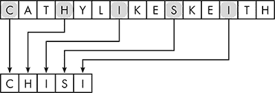

*图 1-1：样本信息转置的第一次操作*

到达信息末尾后，我从头开始，继续选择每第三个剩余字母。第二次操作后，我得到了如图 1-2 所示的结果。

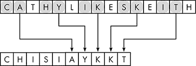

*图 1-2：第二次转置操作*

在最后一次操作中，我复制了剩余的字母，如图 1-3 所示。

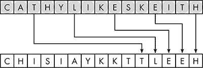

*图 1-3：最终的转置操作*

得到的密文是 CHISIAYKKTTLEEH。我的朋友们可以通过反向转置过程读取这个信息。第一步如图 1-4 所示。将所有字母恢复到原位后，就能还原出明文。

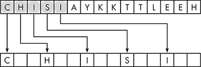

*图 1-4：解密时转置操作的第一次回退*

这种基本的转置方法使用起来很有趣，但它的加密强度非常弱。最大的担忧是泄密——我的一个朋友把加密方法透露给了圈外的人。一旦发生这种情况，发送加密信息就不再安全，反而会变得更麻烦。泄密是不可避免的——不仅仅是在学童之间。每种加密方法都会面临泄密的风险，而且使用某种方法的人越多，泄密的可能性就越大。

正因如此，所有好的加密系统都遵循荷兰早期密码学家奥古斯特·凯尔科夫（Auguste Kerckhoffs）提出的一个规则，称为*凯尔科夫原则*：数据的安全性不应依赖于加密方法本身的保密性。

#### ***密码密钥***

这引出了一个显而易见的问题。如果加密方法并不是秘密的，那我们如何才能安全地加密数据呢？答案在于遵循一种通用的、公开披露的加密方法，但使用*密码钥匙*（或简称*钥匙*）来变化每条消息的加密方式。为了理解什么是钥匙，我们可以先看一个更通用的置换方法。

在这种方法中，发送者和接收者在发送任何消息之前会共享一个秘密数字。假设我和我的朋友们约定使用 374。我们将使用这个数字来改变我们密文中的置换模式。此模式在图 1-5 中展示了消息“CATHY LIKES KEITH”的加密过程。我们秘密数字的每一位都指示应该从明文中复制哪个字母到密文中。因为第一个数字是 3，所以明文中的第三个字母*T*变成密文的第一个字母。下一个数字是 7，因此下一个字母是从*T*往后数七个字母，也就是*S*。接下来我们选择从*S*开始的第四个字母。密文的前三个字母是*TST*。

图 1-6 展示了接下来的两个字母如何被复制到密文中。从我们上次停止的地方开始（图中由圆圈标出的 1），我们数三个位置，当到达末尾时返回到明文的开始处，选择*A*作为密文的第四个字母。接下来选择的字母是从*A*开始往后数七个位置，跳过已经复制的字母：*K*。这个过程继续进行，直到所有明文的字母都被置换完成。

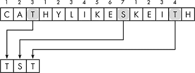

*图 1-5：使用密钥 374 进行置换的第一步*

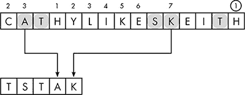

*图 1-6：使用密钥 374 进行置换的第二步*

因此，秘密数字 374 就是我们的密码钥匙。即便有人截获了这条消息，如果没有密钥，他们也无法解密，即使他们知道我们使用的是置换加密方法。密码可以定期更换，以防止泄密者或叛徒泄露加密信息。

#### ***攻击加密***

即使没有密钥，攻击者仍然可以尝试通过其他手段恢复明文。加密数据可以通过*暴力破解*进行攻击，尝试所有可能的加密方法来处理密文。对于使用置换加密的消息，暴力破解攻击会检查密文的所有排列组合。因为暴力破解几乎总是可行的，所以攻击者需要进行的试验次数是衡量加密强度的一个良好基准。在我们的示例中，消息“CATHY LIKES KEITH”大约有 400 亿种排列方式。

这是一个庞大的数字，因此聪明的攻击者会采用一些常识来加速恢复明文的过程，而不是依赖暴力破解。如果攻击者能假设明文是英文，那么在测试之前，大部分排列组合都可以被排除。例如，攻击者可以假设明文不会以*HT*开头，因为没有英文单词以这两个字母开头。这样，攻击者就不需要检查十亿种排列组合了。

了解消息中某些单词的攻击者可以更聪明地推断出明文。在我们的例子中，攻击者可能猜测消息中包含某个同学的名字。他们可以查看密文字母中可以组成哪些名字，然后通过剩余字母推测出可能的单词。

关于明文内容的猜测被称为*字典攻击*。最强的字典攻击形式是*已知明文攻击*。为了实施这种攻击，攻击者必须能够访问一个明文 A，其对应的密文 A，以及一个使用与密文 A 相同的密钥加密的密文 B。虽然这种情况听起来不太可能，但确实会发生。人们经常在文件不再被视为机密时，将其置于无保护状态，而没有意识到这可能会帮助攻击其他文件。已知明文攻击是非常强大的；当你面前同时有明文和密文时，破解置换模式非常容易。

对抗已知明文攻击的最佳防御措施是良好的安全实践，例如定期更改密码。然而，即使采取了最好的安全实践，攻击者几乎总是能大致了解明文的内容（这也是他们为何如此感兴趣于读取它的原因）。在许多情况下，他们会知道大部分明文内容，并且可能拥有已知明文-密文对。一个好的加密系统应该使得明文和已知的密文对对攻击者无效。

### **替代：数据替换**

另一种基本的加密技术对“字典攻击”更具抵抗力。与其移动数据，不如*替代*方法有系统地替换数据的各个部分。对于文本消息，最简单的替代形式是将每个字母替换为另一个字母。例如，将每个*A*替换为*D*，每个*B*替换为*H*，依此类推。该类型加密的密钥如表 1-1 所示。

**表 1-1:** 一种替代密码密钥

| 原始 | A | B | C | D | E | F | G | H | I | J | K | L | M | N | O | P | Q | R | S | T | U | V | W | X | Y | Z |
| --- | --- | --- | --- | --- | --- | --- | --- | --- | --- | --- | --- | --- | --- | --- | --- | --- | --- | --- | --- | --- | --- | --- | --- | --- | --- | --- |
| 替换 | M | N | B | V | C | X | Z | L | K | F | H | G | J | D | S | A | P | O | I | U | Y | T | R | E | W | Q |

尽管这种方法被称为*简单替代*，它比置换加密有所改进，但它也有问题：可能的替代方式是有限的，因此攻击者有时可以通过暴力破解来解密密文。

简单的替代加密同样容易受到*频率分析*的攻击，攻击者通过应用对特定语言中字母或字母组合出现频率的了解来进行攻击。广义而言，了解数据项在明文中出现的频率会给攻击者带来优势。例如，字母*E*是英语写作中最常见的字母，而*TH*是最常见的字母组合。因此，在较长的密文中，最常出现的字母很可能代表明文中的*E*，而最常出现的字母组合则很可能代表明文中的*TH*。

频率分析的威力意味着，随着文本长度的增加，替代加密变得更加脆弱。当已知一组密文是使用相同密钥加密时，攻击也会变得更加容易；因此，避免*密钥重用*是一个重要的安全实践。

#### ***变化的替代模式***

为了加强对频率分析的加密防护，我们可以在加密过程中改变替代模式，因此明文中的第一个*E*可能会被替换成*A*，而第二个*E*则替换成*T*。这种技术被称为*多字母替代*。多字母替代的一种方法使用了一个字母表网格，称为*塔布拉·雷克塔*，如图 1-7 所示。在这个表格中，每一行和每一列都用开始该行或列的字母标记。网格中的每个位置由两个字母定位，例如行 D，列 H，该位置包含字母*K*。

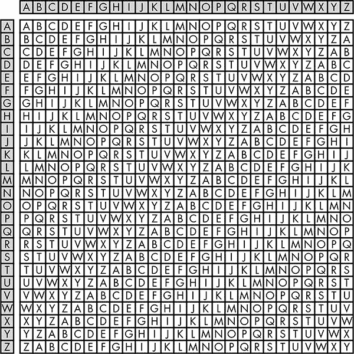

*图 1-7：塔布拉·雷克塔——阴影部分的第一列和第一行是标签。*

使用塔布拉·雷克塔时，密钥是文本形式的——使用字母来变化加密，而不是像我们在置换示例中使用的数字。明文的字母选择塔布拉·雷克塔中的行，密钥的字母选择列。例如，假设我们的明文信息是单词*SECRET*，而我们的加密密钥是单词*TOUGH*。因为明文的第一个字母是*S*，而密钥的第一个字母是*T*，所以密文的第一个字母位于塔布拉·雷克塔的行 S 列 T 的位置：字母*L*。接着我们使用表格中的 O 列来加密第二个明文字母*E*（得到*S*），依此类推，如图 1-8 所示。由于明文比密钥长，我们必须重复使用密钥的第一个字母。

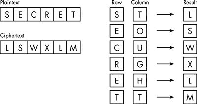

*图 1-8：使用塔布拉·雷克塔和密码密钥* TOUGH

解密过程是逆向操作，如图 1-9 所示。密钥中的字母表示列，扫描列以找到对应的密文字母。找到密文字母所在的行即为明文字母。在我们的示例中，密钥的第一个字母是*T*，密文的第一个字母是*L*。我们扫描塔布拉矩阵的 T 列找到*L*；因为*L*出现在 S 行，所以明文字母是*S*。这个过程对每个密文字母都重复进行。

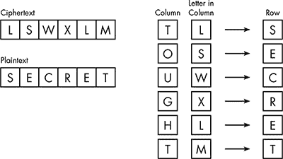

*图 1-9：使用塔布拉矩阵和密码键的解密* TOUGH

多表替代法比简单替代法更有效，因为它在整个消息中变化替代模式。在我们的示例中，明文中两个*E*的出现会变成不同的密文字母，而密文中两个*L*的出现代表了两个不同的明文字母。

#### ***密钥扩展***

尽管多表替代法相对于简单替代法有了很大改进，但只有当密钥不被过于频繁地重复时，它才有效；否则，它就会和简单替代法一样存在问题。例如，当密钥长度为五时，每个明文字母只能由五个不同的密文字母表示，这使得长密文容易受到频率分析和潜文本的攻击。攻击者需要更加努力地工作，但只要有足够的密文，攻击者仍然能够破解加密。

为了最大程度地提高效果，我们需要与明文等长的加密密钥，这种技术被称为*一次性密码本*。但对于大多数情况来说，这并不是一个实用的解决方案。相反，一种叫做*密钥扩展*的方法可以让短密钥完成长密钥的工作。这个思路的一种实现常出现在间谍小说中。两位需要交换信息的间谍并不共享超长的密钥，而是约定使用一个*密码书*，该密码书作为长密钥的存储库。为了避免引起怀疑，密码书是一本普通的文学作品，比如莎士比亚戏剧的某一版。

假设将发送一个 50 个字母的消息，使用此方案。除了密文，消息发送者还附加上未扩展的密钥。以莎士比亚的作品作为密码书，未扩展的密钥可能是 2.2.4.9。第一个 2 表示莎士比亚的第二部戏剧（按字母顺序排列，*如你所愿*）。第二个 2 表示第二幕。4 表示该幕的第四场。9 表示该场的第九句话：“当我在家时，我在一个更好的地方，但旅行者必须知足。” 这句话的字母数超过了明文的字母数，可以像之前一样使用塔布拉矩阵进行加密和解密。通过这种方式，一个相对较短的密钥可以扩展到适应特定的消息。

请注意，这种方案不符合一次性密钥的要求，因为密码本是有限的，因此句子密钥最终必须被重复使用。但这意味着我们的间谍在加密消息时，只需记住较短的密码密钥，同时使用更长的密钥来更安全地加密消息。正如你将看到的，密钥扩展概念在计算机加密中非常重要，因为所需的密码密钥非常庞大，但必须以较小的形式存储。

### **高级加密标准**

现在我们已经看到转置、替换和密钥扩展是如何单独工作的，让我们看看如何通过巧妙地结合这三种技术来实现安全的数字加密。

*高级加密标准（AES）* 是一种开放标准，这意味着任何人都可以在不支付许可费的情况下实现其规范。无论你是否意识到，你的大部分数据都由 AES 保护。如果你在家里或办公室有一个安全的无线网络，如果你曾经在*.zip*压缩文件中设置过密码，或者如果你在商店使用信用卡或从 ATM 机取款，你可能至少在某种程度上依赖于 AES。

#### ***二进制基础***

到目前为止，我一直使用文本加密示例来保持示例简单。然而，计算机加密的数据是以二进制数的形式表示的。如果你以前没有处理过这些数字，这里有一个介绍。

##### **十进制与二进制**

我们从小就使用的数字系统叫做*十进制*系统，*deci*意为“十”，因为该系统使用 10 个数字，从 0 到 9。数字中的每一位表示比右侧数字大 10 倍的单位数量。十进制数字 23,065 的单位和数量如图 1-10 所示。左起第五位的 2 表示我们有 2 个“万”，例如，6 表示 6 个“十”。

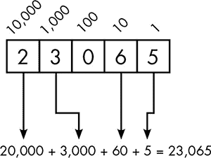

*图 1-10：十进制数字 23,065 中的每一位代表不同的单位数量。*

在*二进制*数字系统中，只有两个可能的数字，0 或 1，它们被称为*位*，即*bi*nary digi*ts*。二进制数字中的每一位代表一个单位，其大小是右边位数的两倍。二进制数字 110101 的单位和数量如图 1-11 所示。如图所示，我们有以下每个单位：32、16、4 和 1。因此，二进制数字 110101 表示这四个单位值的总和，即十进制数字 53。

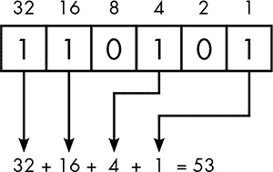

*图 1-11：二进制数字 110101 中的每一位代表不同的单位数量。*

二进制数字通常以固定数量的位表示。二进制数最常见的长度是八位，称为*字节*。虽然十进制数字 53 可以写作 110101 的二进制形式，但将 53 写成字节需要八位，因此前导 0 位填充其他位置，形成 00110101。最小的字节值 00000000 表示十进制 0；最大的字节值 11111111 表示十进制 255。

##### **按位操作**

除了常见的数学运算，如加法和乘法，软件还使用一些独特于二进制数字的操作。这些操作被称为*按位操作*，因为它们是单独应用于每一位，而不是整个二进制数。

按位操作中称为*异或*（*XOR*）的操作在加密中很常见。当两个二进制数字进行 XOR 运算时，第二个数字中的 1 位会反转第一个数字中相应的位，如图 1-12 所示。

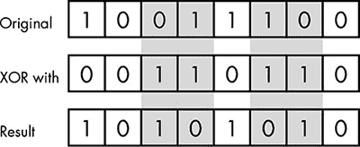

*图 1-12：异或（XOR）操作。第二个字节中的 1 位表示在第一个字节中被“反转”的位，如阴影列所示。*

记住，密码学必须是可逆的。XOR 操作通过改变位模式，使得在不知道参与的二进制数字的情况下，难以预测其结果，但它是可以轻松逆转的。将结果与第二个数字进行 XOR 运算，可以将相同的位反转回原始状态，如图 1-13 所示。

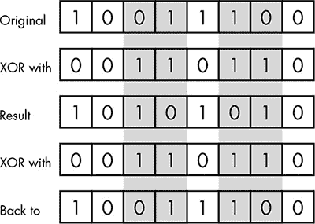

*图 1-13：如果我们将一个字节与相同的字节进行两次 XOR 运算，结果将回到我们开始的地方。*

##### **将数据转换为二进制形式**

计算机使用二进制数字表示各种数据。一个纯文本文件可以是文本消息、电子表格、图像、音频文件或其他任何东西——但最终，每个文件都是字节的序列。大多数计算机数据已经是数字形式，因此可以直接转换为二进制数。但在某些情况下，需要一个特殊的编码系统来将非数字数据转换为二进制形式。

例如，要查看一条文本消息是如何转换成一系列字节的，可以考虑以下消息：

```
Send more money!
```

该消息包含 16 个字符，计算时包括字母、空格和感叹号。我们可以使用像*美国信息交换标准代码*（*ASCII*，发音为“as-key”）这样的系统，将每个字符转换为一个字节。在 ASCII 中，大写字母*A*表示数字 65，*B*表示 66，依此类推，到*Z*的 90。表 1-2 展示了来自 ASCII 表的一些选定条目。

**表 1-2：ASCII 表中的部分条目**

| **字符** | **十进制数** | **二进制字节** |
| --- | --- | --- |
| (space) | 32 | 00100000 |
| ! | 33 | 00100001 |
| , | 44 | 00101100 |
| . | 46 | 00101110 |
| A | 65 | 01000001 |
| B | 66 | 01000010 |
| C | 67 | 01000011 |
| D | 68 | 01000100 |
| E | 69 | 01000101 |
| a | 97 | 01100001 |
| b | 98 | 01100010 |
| c | 99 | 01100011 |
| d | 100 | 01100100 |
| e | 101 | 01100101 |

#### ***AES 加密：大致过程***

在我们详细查看 AES 加密之前，这里是该过程的概述。

AES 中的密码密钥是二进制数字。密钥的大小可以变化，但我们将讨论最简单版本的 AES，使用的是 128 位密钥。通过数学密钥扩展，AES 将原始的 128 位密钥转换为 11 个 128 位的密钥。

AES 将明文数据分为 16 字节的块，并以 4×4 网格的形式呈现；示例消息 *发送更多钱！* 的网格如 图 1-14 所示。重线分隔 16 字节，轻线则分隔字节内部的位。

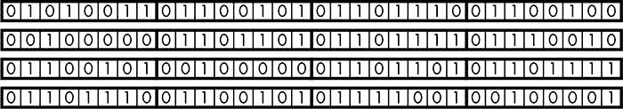

*图 1-14：示例消息* 发送更多钱！*转化为字节网格，准备使用 AES 进行加密*

明文数据被分割为尽可能多的 16 字节块。如果最后一个块不满，剩余部分会使用随机二进制数进行填充。

接着，AES 将每个 16 字节的明文数据块进行 10 *轮* 加密。在每一轮中，字节会在块内进行置换，并使用表格进行替换。然后，使用 XOR 操作，块内的字节与其他字节及 128 位密钥之一进行组合。

这就是 AES 的基本概念；现在让我们更详细地看看这些步骤。

#### ***AES 中的密钥扩展***

数字加密系统中的密钥扩展与我们之前讨论的“密码本”概念有所不同。AES 不仅仅是查找书中的一个更长密钥，而是利用它稍后用于加密的相同工具进行密钥扩展：二进制 XOR 操作、置换和简单替换。

图 1-15 展示了密钥扩展过程的前几个阶段。图中的每个块为 32 位，图中的一行代表一个 128 位的密钥。原始的 128 位密钥构成了前四个块，这些块在图中被着色。每个其他块是通过对两个前一个块进行 XOR 运算得到的；XOR 操作用圆圈中的加号表示。例如，块 6 是通过块 2 和块 5 的 XOR 运算得到的。

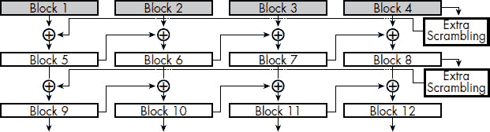

*图 1-15：AES 密钥扩展过程*

正如图右侧所示，每四个块中就有一个通过一个标记为“额外扰乱”的盒子。这一过程包括对块内的字节进行置换，并根据一个叫做 *S-box* 的表进行字节替换。

S-box 表被精心设计，用于加密过程中放大明文之间的差异。也就是说，两个相似的明文字节将趋向于拥有完全不同的 S-box 替代值。表中的前八个条目展示在 表 1-3 中。

**表 1-3：S-Box 表中的摘录**

| **原始位模式** | **替换位模式** |
| --- | --- |
| 00000000 | 01100011 |
| 00000001 | 01111100 |
| 00000010 | 01110111 |
| 00000011 | 01111011 |
| 00000100 | 11110010 |
| 00000101 | 01101011 |
| 00000110 | 01101111 |
| 00000111 | 11000101 |
| 00001000 | 00110000 |
| 00001001 | 00000001 |

#### ***AES 加密轮次***

一旦 AES 获得了所有所需的密钥，真正的加密过程就可以开始了。回想一下，二进制明文存储在一个 16 字节或 128 位的网格中，这与原始密钥的大小相同。这并非巧合。实际加密的第一步是将 128 位的数据网格与原始的 128 位密钥进行异或操作。现在，工作开始真正展开，因为数据网格将经过 10 轮的数值处理。每一轮有四个步骤。

**1\. 替代。**

网格中的每个 16 字节都使用与密钥扩展过程中相同的 S-盒表进行替换。

**2\. 行置换。**

接下来，字节将被移动到网格中它们所在行的不同位置。

**3\. 列组合。**

接下来，对于网格中的每个字节，通过结合该列中的所有四个字节计算出一个新字节。这个计算再次涉及到异或操作，但也涉及到一种二进制形式的置换。为了让你理解这个过程，图 1-16 展示了最左边列的最低行左侧字节的计算方法。最左列的四个字节会先进行异或运算，但列中的最上面和最下面的字节会先进行位置换。这种置换被称为*按位旋转*；字节的位会向左滑动一个位置，最左边的位会移动到右侧。

新网格中的每个字节都通过类似的方式计算，方法是将列中的字节通过异或运算结合起来；唯一的变化是哪些字节在异或之前先进行位旋转。

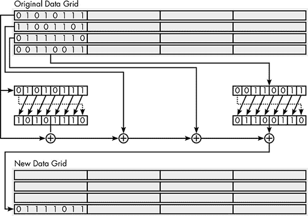

*图 1-16：AES 一轮中列置换步骤的一个部分*

**4\. 与密文密钥进行异或。**

最后，将前一步得到的网格与该轮的密钥进行异或运算。这就是为何需要密钥扩展的原因，以便每一轮都与不同的密钥进行异或。

AES 解密过程执行与加密过程相同的步骤，只不过是反向操作。由于加密过程中的操作只有异或、简单的 S-盒替换以及位和字节的置换，若已知密钥，所有操作都是可逆的。

#### ***块链链接***

AES 加密可以单独应用于文件中的每个 16 字节块，但这会在密文中留下漏洞。正如我们之前讨论过的，密钥使用的次数越多，攻击者发现并利用模式的可能性就越大。计算机文件通常非常庞大，使用相同的密钥加密数百万个块，这是一种大规模的密钥重用形式，会使密文暴露于频率分析及相关技术。

由于这个原因，像 AES 这样的基于块的加密系统经过修改，使得明文中相同的块生成不同的密文块。其中一种修改方法称为*块链式加密*。

在块链式加密中，明文的第一个块在加密前会与一个随机的 128 位数进行异或（XOR）运算。这个随机数称为*起始变量*，并与密文一起存储。由于每次加密都会分配一个随机的起始变量，因此即使两个文件以相同的数据开始，在使用相同密钥加密时，它们的密文也会不同。

每个后续的明文块在加密前都会与前一个密文块进行异或（XOR）运算，从而实现加密的“链式”作用，如图 1-17 所示。链式加密确保了明文中的重复块会生成不同的密文块。这意味着任何长度的文件都可以在不担心频率分析的情况下进行加密。

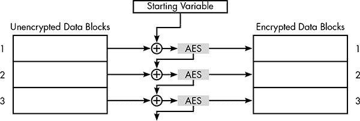

*图 1-17：使用块链式加密的 AES 加密过程*

#### ***为什么 AES 是安全的***

如你所见，尽管 AES 包含许多步骤，但每个步骤都只是置换或简单的替代。为什么 AES 被认为足够强大，能够保护世界的数据？记住，攻击者通常会使用暴力破解、已知明文或利用密文中的模式。AES 在防范这些攻击方法方面表现得非常出色。

对于 AES，暴力破解意味着通过所有可能的密钥将密文传递到解密过程，直到明文被恢复。在 AES 中，密钥长度有 128、192 或 256 位。即使是最小的密钥长度，也有大约 300,000,000,000,000,000,000,000,000,000,000,000,000 个可能的密钥，暴力破解攻击需要尝试其中一半的密钥才能找到正确的密钥。假设攻击者的计算机每秒可以尝试百万个密钥，那么在一天内，攻击者可以尝试 1,000,000 密钥 × 60 秒 × 60 分钟 × 24 小时 = 86,400,000,000 个密钥。在一年内，攻击者可以尝试 31,536,000,000,000 个密钥。虽然这个数字很大，但它甚至不到可能组合数的十亿分之一。即使攻击者获取了更多的计算能力，尝试这么多的密钥仍然不现实——而这仅仅是针对 128 位版本。

AES 还使得使用已知明文或寻找可利用的模式变得困难。在每一轮加密过程中，AES 会旋转每行的字节并合并每列的字节。经过多轮操作后，字节被彻底混合，因此密文网格中任意一个字节的最终值都依赖于网格中所有字节的初始明文值。这种加密特性被称为*扩散*。

此外，经过 S 盒的多轮处理，扩散效果会得到放大，而块链式加密将每个块的扩散效应传递到下一个块。所有这些操作共同赋予了 AES*雪崩效应*，即明文中的微小变化会导致密文中的大范围变化。

无论攻击者对明文的大致布局了解多少，AES 都能抵挡住攻击。例如，一家公司可能基于一个共同的模板向客户发送电子邮件，唯一的变量是客户的账户号码和未结余额。通过扩散、雪崩和块链技术，这些电子邮件的密文将会非常不同。扩散和雪崩还会减少可能通过频率分析被利用的模式。即使是一个包含重复相同 16 字节块的巨大明文文件，通过 AES 加密和块链处理后，也会得到看起来完全随机的比特串。

#### ***可能的 AES 攻击***

AES 看似能有效抵御传统的加密攻击，但是否存在一些隐藏的弱点能提供破解密码的捷径？答案尚不明了，因为证明一个否定命题是很困难的。说没有已知的捷径或*破解*方法是其中一回事，而证明它们*不可能*存在又是另一回事。密码学是一门科学，而科学总是在不断扩展边界。我们对密码学及其基础数学的理解还不到可以断言什么是不可能的程度。

分析像 AES 这样的开放标准的漏洞的困难部分在于，程序员在实现该标准时可能无意中引入安全漏洞。例如，一些 AES 实现容易受到*时间攻击*的影响，攻击者通过测量加密所需的时间来获取关于加密数据的信息。然而，攻击者必须能够访问执行加密的特定计算机，因此这实际上并不是底层加密的缺陷，但如果安全性受到威胁，这也并不能让人安心。

AES 最为人知的漏洞是*相关密钥攻击*。当两个密钥以特定方式数学相关时，攻击者有时可以利用通过一个密钥加密的消息中收集到的信息，恢复使用另一个密钥加密的消息。研究人员发现了一种方法，可以在比暴力破解攻击更短的时间内恢复特定密文的 AES 加密密钥，但该方法要求使用与原始密钥在非常特定的方式上相关联的密钥加密的同一明文的密文。

尽管这一捷径算作一个破解方法，但对攻击者来说可能并没有实际价值。首先，尽管它大大减少了恢复原始密钥所需的工作量，但对现有计算机或计算机网络而言，这可能是不可行的。其次，获取已用相关密钥加密的其他密文并不容易；这需要加密方法或使用方式出现故障。因此，这一破解方法目前被认为是理论性的，而非系统的实际弱点。

也许这种破解方式最令人担忧的一点是，它被认为只对所谓更强的 256 位密钥版本的 AES 有效，而不适用于本章描述的更简单的 128 位密钥版本。这可能展示了现代加密技术的最大弱点：它们的复杂性。即便有专家审查，缺陷可能依然在多年后未被发现；设计中的小变化也可能对安全性产生重大影响；而本应增强安全性的特性，可能会产生相反的效果。

### **私钥加密的局限性**

然而，像 AES 这样的加密方法的真正局限性与潜在的隐藏漏洞无关。

本章中的所有加密方法，包括 AES，都被称为*对称密钥*方法——这意味着加密消息或文件的密钥与解密它所使用的密钥是相同的。如果你想用 AES 加密桌面硬盘上的文件或手机中的联系人列表，这没有问题；只有你自己在加锁和解锁数据。但是，当你需要保护数据传输时，比如在零售网站上输入信用卡号码时会发生什么呢？你可以用 AES 加密数据并发送到网站，但网站上的软件在没有密钥的情况下无法解密密文。

这是*共享密钥问题*，也是密码学的核心问题之一。没有一种安全的方式来共享密钥，对称密钥加密仅对锁定自己的私人数据有用。为了进行数据传输加密，必须采取不同的方法，使用不同的密钥进行加密和解密——你将在第三章中看到这是如何实现的。

但我们首先需要解决另一个问题。AES 需要一个巨大的二进制数作为密钥，但用户不可能记住 128 位的字符串。相反，我们记住的是密码。事实证明，密码的安全存储和使用本身就会带来一些难题。这些将是下章的内容。
