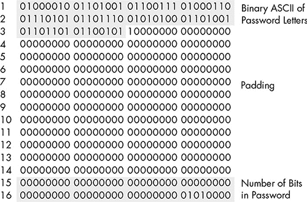
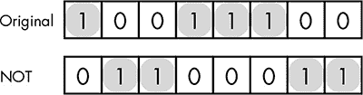
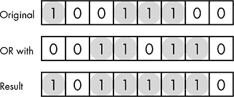
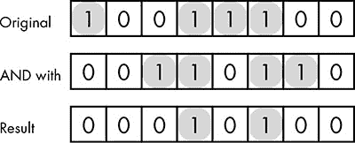
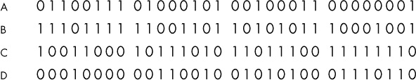
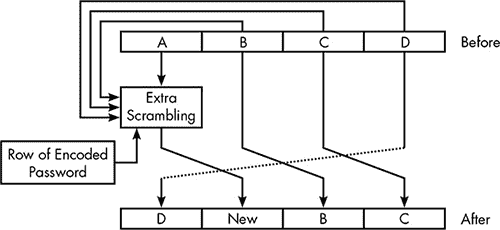
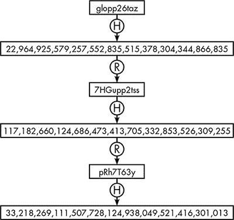
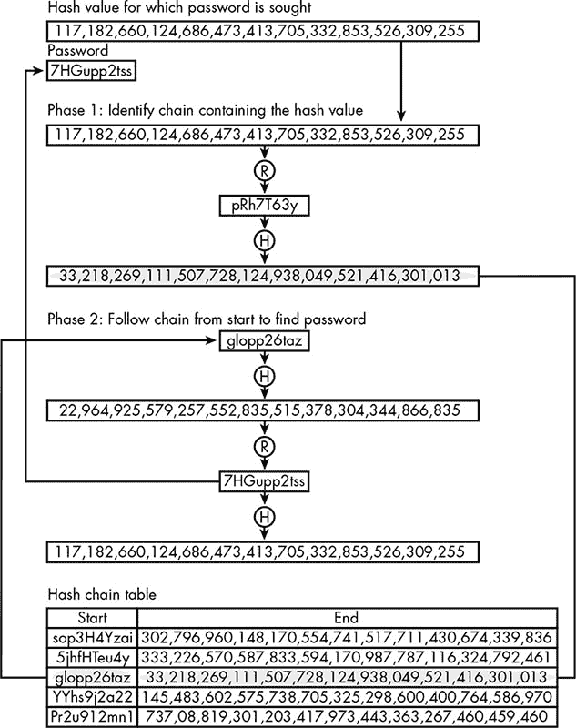
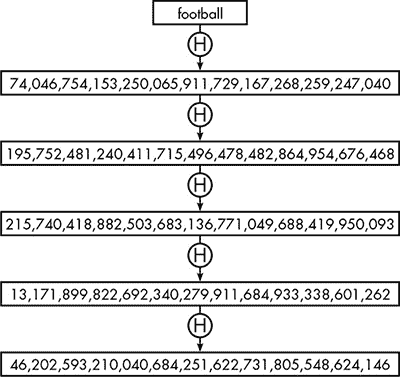

## 第二章：2

**密码**


软件最重要的任务之一就是保护密码。这可能让人吃惊。毕竟，密码不就是用来*提供*保护的吗？难道密码不保护我们的银行账户、网上零售商和在线游戏账户吗？

事实上，尽管密码是计算机安全的基石，但它们也可能成为攻击的目标。如果远程计算机根据密码接受你的身份验证，这个过程被称为*身份验证*，它必须拥有一个用户密码列表来进行比对。这个密码列表成为攻击者诱人的目标。近年来，出现了许多大规模的客户账户数据盗窃事件。到底是怎么发生的，怎样才能减少此类漏洞发生的可能性？这就是本章所探讨的内容。

然而，在你了解密码是如何被保护的之前，你将看到它们是如何被转换为二进制数字的，这个过程对于密码存储和加密都有重要影响。

### 将密码转换为数字

在第一章中，你看到如何将一个单独的字符替换为来自 ASCII 表的数字。在这里，你将看到如何将一串字符替换为一个大数字，例如我们在 AES 中需要的 128 位密钥。在计算机中，将某物转换为一个指定范围内的数字被称为*哈希*，而生成的数字称为*哈希值*、*哈希码*，或者简称*哈希*。

在这里，*哈希*一词意味着将某物切碎后再将这些碎片重新组合在一起，就像做哈希土豆一样。一个特定的哈希方法被称为*哈希函数*。哈希密码总是从将密码中的每个字符转换为数字开始，使用如 ASCII 这样的编码系统。哈希函数在如何组合这些数字上有所不同；用于加密和身份验证系统的哈希函数必须经过精心设计，否则安全性可能会受到威胁。

#### *优秀哈希函数的特性*

开发一个好的哈希函数并非易事。为了理解哈希函数面临的挑战，可以考虑一个简单的密码*dog*。这个单词包含 3 个 ASCII 字节，或者仅仅 24 位数据，而 AES 密钥至少有 128 位。因此，一个好的哈希函数必须能够将这 24 位数据转换成一个 128 位的哈希码，并具有以下特性。

##### 充分利用所有位

像 AES 这样的基于计算机的加密系统的一个主要优点是*密钥长度*，即攻击者面对的可能密钥的数量。然而，如果所有可能的密钥实际上并未被使用，这一优点就会消失。一个好的哈希函数必须在所有可能的哈希码范围内产生结果。即使是我们的短密码*dog*，生成的 128 位哈希码的所有位也必须受到原始 24 位密码的影响。

##### 不可逆性

在第一章中，你学到了一种加密方法必须是可逆的。相比之下，一个好的哈希函数**不应**是可逆的。我将在本章稍后讨论为什么这一点很重要。现在，要知道，对于给定的哈希值，不应该有直接的方式恢复生成它的密码。我说是**一个**密码而不是**这个**密码，因为多个密码可能会生成相同的哈希值，这种现象称为哈希**碰撞**。由于可能的密码比哈希值更多，因此碰撞是不可避免的。一个好的哈希函数应该使得攻击者很难找到生成特定哈希值的**任何**密码。

##### 雪崩效应

对加密至关重要的雪崩效应在哈希中同样重要。密码的微小变化应该导致哈希值发生较大的变化——尤其是因为许多人在需要选择新密码时，通常会选择他们旧密码的轻微变体。对于*dog*生成的哈希值，应该与类似密码如*doge*、*Dog*或*odg*生成的哈希值有很大不同。

### MD5 哈希函数

满足所有这些标准并不容易。好的哈希函数通过巧妙的方法解决了这个问题。它们从一堆杂乱的位开始，并利用密码的位模式进一步修改这些杂乱的位。这就是广泛使用的哈希函数*MD5*的工作原理——它是*消息摘要*哈希函数的第五个版本。

#### *密码编码*

为了开始，MD5 将密码转换为 512 位的块；我将其称为*编码密码*。这个编码的第一部分由密码中每个字符的 ASCII 码组成。例如，如果密码是*BigFunTime*，第一个字符是*B*，它的 ASCII 字节是 01000010，因此编码密码的前 8 位是 01000010；接下来的 8 位是*i*的字节，01101001；以此类推。因此，我们示例中的 10 个字母*BigFunTime*密码将占用 512 中的 80 位。

现在其余的位需要填充。接下来的一个位被设置为 1，直到最后 64 个比特之前的所有位都设置为 0。最后 64 个比特存储的是原始密码的长度（二进制表示），以比特为单位。在这种情况下，密码长度为 10 个字符，或者 80 位。80 的 64 位二进制表示是：

```
00000000 00000000 00000000 00000000 00000000 00000000 00000000 01010000
```

显然，我们不需要 64 位来存储密码的长度。使用 64 位来表示长度，使 MD5 能够对任意长度的输入进行哈希——这个好处我们将在稍后看到。

图 2-1 显示了示例密码的编码，将其组织成 16 行，每行 32 位。



*图 2-1：密码* BigFunTime *转换为用于 MD5 哈希函数输入的 512 位*

这个编码后的密码充满了零，因此不满足一个好的函数“充分利用所有位”的特性，但这没关系，因为这不是哈希值；它只是起始点。

#### *位运算*

MD5 哈希函数使用了一些我之前没有讨论过的操作。我们来简单了解一下这些操作。

##### 二进制加法

第一个新操作是*二进制加法*。二进制加法与你已经知道的十进制加法类似，只不过是使用二进制数。例如，数字 5 的 32 位表示是：

```
00000000 00000000 00000000 00000101
```

46 的 32 位表示是：

```
00000000 00000000 00000000 00101110
```

如果我们将 5 和 46 相加，结果是 51。同样，这两个二进制表示相加的结果也是 51 的二进制表示：

```
00000000 00000000 00000000 00110011
```

然而，与普通加法不同，在普通加法中有时结果的位数会超过操作数的位数，而在二进制加法中，位数是固定的。如果两个 32 位二进制数相加的结果超过了 32 位，我们会忽略结果左侧的“进位”，只保留右侧的 32 位。这就像使用一台便宜的计算器，只有两位数显示屏，因此当你加 75 和 49 时，它不会显示 124，而只会显示最后两位数字 24。

##### 位运算 NOT

接下来的新操作称为“not”，通常写作全大写的*NOT*。如图 2-2 所示，NOT 操作“翻转”所有位，将每个 1 替换为 0，每个 0 替换为 1。



*图 2-2：位运算 NOT。所有位都被翻转，1 位用高亮显示以便清晰显示。*

##### 位或运算（OR）

接下来的操作是*OR*，有时称为*包含性 OR*，用来区分它与第一章中看到的异或（XOR）。OR 操作将两个具有相同位数的二进制数对齐。在结果二进制数的每个位置，如果第一个数或第二个数中有 1，则结果为 1；否则，结果为 0， 如图 2-3 所示。



*图 2-3：位或运算（OR）。如果两个输入中的位之一为 1，结果位为 1。*

注意，与异或（XOR）不同，你不能对 OR 操作应用两次以恢复原始字节。这是一个单向过程。

##### 位与运算（AND）

最后一个新操作是*AND*。将两个二进制数对齐，在每个位置上，如果两个数的该位置位都是 1，结果就是 1；否则，结果为 0。因此，结果中某个位置为 1，意味着该位置在第一个数和第二个数中都是 1，如图 2-4 所示。与 OR 类似，AND 操作是不可逆的。



*图 2-4：位与运算（AND）。如果两个输入中的位都是 1，结果位为 1。*

#### *MD5 哈希轮次*

现在我们准备进行哈希操作了。加密密码的部分数据在 MD5 过程中的出现只是短暂的，但这些出现决定了整个过程的不同。MD5 过程始终以相同的 128 位开始，概念上分为四个 32 位部分，标记为 A 至 D，如图 2-5 所示。



*图 2-5：MD5 哈希码的 128 位初始配置*

从这里开始，整个过程就是不断地移动这些位并对它们进行翻转，这一过程会重复整整 64 次。在这方面，这个过程很像 AES，但轮数更多。图 2-6 是其中一个 64 轮的宽泛示意图。



*图 2-6：MD5 哈希函数的一个轮次。在结果中，三个部分被交换，而所有四个部分被组合成一个新的部分。*

如图所示，B、C 和 D 部分只是被交换，使得一轮的 D 部分成为下一轮的 A 部分。MD5 的主要操作发生在每轮的“额外混乱”中，这一过程利用前一轮所有四个部分的位生成一个新部分。额外混乱使用不可逆操作 AND、OR 和 NOT，将所有四个部分的位与编码密码的一行结合起来。在不同的轮次中使用不同的编码密码行，因此最终所有的编码密码行都会被多次使用。由于有交换操作，这个过程只需四轮就能将四个原始部分中的每一个替换为额外混乱的结果。经过完整的 64 轮过程后，原始的各个部分位将与编码密码彻底交织在一起。

#### *满足良好哈希函数的标准*

由于 MD5 从一组位开始，然后反复改变这些位，逐步加入编码密码的片段，我们可以确保所有的位在过程中都被影响，从而生成真正的 128 位哈希码。大量不可逆的操作——记住，这些操作会重复进行 64 次——意味着整个哈希函数是不可逆的。每一轮中“额外混乱”的位移和改变，再加上各个部分本身的旋转，分散了位和字节，最终创建了预期的雪崩效应。

MD5 满足一个良好哈希函数的所有基本要求。然而，它确实有一些微妙的弱点，正如你很快会看到的那样。

### 数字签名

哈希函数除了从密码生成密钥外，还在安全性中起着其他作用。其中最重要的之一是创建文件的 *签名*。如前所述，MD5 可以处理任何大小的输入。如果输入大于 512 位，首先会将其分割成多个 512 位的块。然后，每个块都会应用一次 MD5 处理。第一个块从初始的 128 位开始，后续每个块都从前一个块生成的哈希码开始。通过这种方式，我们可以将本书的整个文本、一个音频文件、一个视频文件或任何其他数字文件都通过该函数，得到一个单一的 128 位哈希码作为返回值。这个哈希码将成为该文件的签名。

为什么一个文件需要签名呢？假设你决定下载 FreeWrite（一款虚构的免费文字处理软件）。不过，你心存疑虑，因为曾经有过一次糟糕的经历，你下载了一款免费的程序，结果它是假的，充满了恶意软件。为了避免这种情况，你希望确保下载的 FreeWrite 文件和开发者上传的文件是一样的。开发者可以用 MD5 对文件进行哈希处理，并将生成的哈希码——即文件签名——发布在他们的网站[freewrite.com](http://freewrite.com)上。这样，你就可以使用 MD5 哈希程序对文件进行处理，并将结果与开发者网站上的代码进行比对。如果结果不匹配，那么文件、签名或两者之一发生了变化。

#### *身份问题*

不幸的是，匹配发布的哈希码只能证明 FreeWrite 文件是合法的，前提是该哈希码确实是开发者发布的。但如果攻击者复制了开发者的[freewrite.com](http://freewrite.com)网站，改用一个类似的域名，如[free-write.com](http://free-write.com)，然后发布了一个被篡改的文件以及该文件的哈希码呢？数字签名的可信度取决于其提供者。我们将在第三章中进一步探讨这个问题。

#### *碰撞攻击*

即便来自合法来源的哈希码匹配，一个文件仍然可能存在问题。许多不同的文件会产生相同的哈希码，这意味着一个攻击者如果试图修改文件以进行恶意操作，只要修改后的文件产生相同的哈希码，就能避免被检测到。

生成两个具有相同哈希码的文件并不难，这被称为*碰撞攻击*：只需随机生成文件，直到两个哈希码匹配。找到第二个与另一个文件的*特定*哈希码匹配的文件要难得多。为了对攻击者有实际用途，具有匹配哈希码的文件不能只是一些随机字节，它必须是一个能够为攻击者执行恶意操作的程序。

不幸的是，有方法可以生成第二个文件，它与第一个文件非常相似且具有相同的 MD5 哈希码。MD5 哈希函数中发现的这一缺陷促使研究人员建议使用其他哈希函数来进行签名。这些更先进的哈希函数通常拥有更长的哈希码（最多 512 位），更多的哈希轮次，并且在每轮过程中进行更复杂的二进制运算。然而，就像加密一样，不能保证更复杂的哈希函数不会被发现存在缺陷。数字签名的正确使用意味着始终保持在已知设计缺陷之前，因为攻击者会无情地利用这些缺陷。数字安全就像一场猫捉老鼠的游戏，正义的一方是老鼠，尽力避免被吃掉，永远无法打败猫，只能希望活得稍微久一点。

### 身份验证系统中的密码

这种猫捉老鼠的游戏在身份验证系统中尤为明显。每一个需要输入密码的地方都必须有一个密码列表用于对比，而妥善保护这个列表需要极大的小心。

#### *密码表的危险*

让我们来看一下最直接的密码存储方式。在这个例子中，东北钱银银行（NEMB）存储了每个客户的用户名和密码，以及账户号码和当前余额。密码表的一部分如表 2-1 所示。

**表 2-1：** 设计不当的密码表

| **用户名** | **密码** | **账户号码** | **余额** |
| --- | --- | --- | --- |
| richguy22 | ilikemoney | 21647365 | $27.21 |
| mrgutman | falcon | 32846519 | $10,000.00 |
| squire | yes90125 | 70023193 | $145,398.44 |
| burgomeister78 | taco999 | 74766333 | $732.23 |

正如凯尔科夫原理所说，我们不能依赖加密方法保持秘密，我们也不应当依赖密码列表保持秘密。NEMB 信息技术部门的一名不满的员工可能轻易获取包含此列表的文件，或者外部的攻击者可能通过公司的防御渗透进去。

这就是所谓的*单点防御*，意味着一旦有人看到这个表格，游戏就结束了。首先，这个表格展示了所有客户的账户号码和余额，至少这就造成了隐私的重大损失。更糟糕的是，每个密码都以用户输入的原始形式存储。访问这个密码列表将允许攻击者以任何客户的身份登录——这是一场灾难的前兆。

幸运的是，这种存储系统的问题可以很容易地得到修正。知道了这些问题，也了解系统的危险性，你可能会认为这种方式永远不会被使用。可惜，你错了。现实中的一些公司就这样存储用户的密码。有些非常大的公司，可能花费了大量资金来建设其网站，但却仍然在使用这种做法。

#### *哈希密码*

如果表 2-1 展示了错误的做法，那么正确的做法是什么呢？一种改进方法是将密码从表格中移除，而是存储密码的哈希值，如表 2-2 所示。（在接下来的示例中，为了便于管理，我将哈希值以十进制数字的形式展示。）

**表 2-2：** 存储哈希密码的密码表

| **用户名** | **密码哈希值** | **账户号码** | **余额** |
| --- | --- | --- | --- |
| richguy22 | 330,711,060,038,684,200,901,827,278,633,002,791,087 | 21647365 | $27.21 |
| mrgutman | 332,375,033,828,033,552,423,319,316,163,101,084,850 | 32846519 | $10,000.00 |
| squire | 295,149,488,455,763,164,542,524,060,437,757,020,453 | 70023193 | $145,398.44 |
| burgomeister78 | 133,039,589,388,270,767,475,032,770,360,311,206,892 | 74766333 | $732.23 |

当用户尝试登录时，提交的密码会被哈希处理，并将结果与存储的哈希码进行比对。如果匹配，用户即可登录。由于哈希函数是不可逆的，因此获取表格并不等于获取密码。攻击者无法凭借哈希码登录账户。

然而，账号和余额仍然以明文形式存储，最好对它们进行加密，制作一个只包含哈希码和密文的表格。问题是，如果我们使用密码的哈希值作为加密密钥，那么加密数据就无法提供额外的保护，因为任何获取到此表格的人都能解密密文。

解决这个问题有几种方法。一个解决方案是使用一个哈希函数对密码进行认证处理，另一个哈希函数将密码转换为加密密钥，用来加密账号和余额。只要这些哈希函数是不可逆的，即便攻击者获得了表格，依然可以保护账户数据的安全。

#### *字典攻击*

对密码进行哈希处理是防御攻击者的一种有效手段，但仅此还不够。认证系统仍然容易受到*字典攻击*的威胁。

在基本的字典攻击中，攻击者无法访问密码表，只能猜测密码。攻击者可以尝试随机字符组合，但使用*字典*会更加成功，在软件领域中，字典就是一个单词列表。在这个案例中，字典包含了最常见的密码，类似如下：

• password

• 123456

• football

• mypassword

• abcdef

为了防止基本的字典攻击，大多数网站会统计失败登录次数，在达到一定次数（可能是三次）后，暂时阻止来自特定计算机的进一步登录尝试。这通过增加找到正确密码所需的时间，使得攻击变得不切实际。

一种不同形式的字典攻击是攻击者获取了哈希并加密的密码表副本。在这种情况下，攻击者会对字典中的每个密码进行哈希处理，并将其与窃取到的表格中的每个哈希码进行比对。当发现匹配时，攻击者就知道了生成该用户哈希码的密码。为了节省时间，攻击者可以先将字典中的所有密码通过选定的哈希函数处理一次，并将结果存储在一个字典中，就像表 2-3 那样。

**表 2-3:** 带有哈希码的字典

| **密码** | **MD5 哈希码** |
| --- | --- |
| password | 126,680,608,771,750,945,340,162,210,354,335,764,377 |
| 123456 | 299,132,688,689,127,175,738,334,524,183,350,839,358 |
| football | 74,046,754,153,250,065,911,729,167,268,259,247,040 |
| mypassword | 69,792,856,232,803,413,714,004,936,714,872,372,804 |
| abcdef | 308,439,634,705,511,765,949,277,356,614,095,247,246 |

字典展示了为什么用户选择不明显的密码如此重要。密码越晦涩，它出现在攻击者字典中的可能性就越小。

#### *哈希表*

不幸的是，攻击者可以完全放弃字典，构建一个随机生成密码及其对应哈希值的表格，我称之为*预计算哈希表*。当然，潜在密码的数量是巨大的，因此如果攻击者想要有一个合理的匹配机会，哈希表需要非常庞大。构建预计算哈希表需要大量的计算能力和时间，但它只需要构建一次，之后可以反复使用。

这个表格的一个弱点是其庞大的体积会使得查找匹配项变得非常缓慢。当你考虑到文字处理软件在大文档中查找特定单词的速度时，这似乎有些令人吃惊，但这些预计算的表格远大于你计算机上的任何文件。假设攻击者拥有一个包含 10 个或更少的大写字母、小写字母和数字的所有密码的表格。即使有这些限制，潜在密码的数量是 62¹⁰，也就是 839,299,365,868,340,224。预计算哈希表不需要包含每一个潜在密码的条目，但它需要有相当一部分。尽管如此，这个表格也会如此庞大，以至于它无法装进计算机的内存中。它甚至无法放进硬盘——为了直说，它可能需要分布在一百万个硬盘上。而这仅仅是存储问题。如果没有谷歌那样的分布式计算能力，查找如此庞大的表格是不切实际的。（即使是谷歌，搜索海量数据也并不容易；我们将在第七章详细探讨搜索问题。）

#### *哈希链*

由于预计算哈希表太大，无法存储和搜索，攻击者使用了一种巧妙的技术，称为*哈希链*，可以显著减少表格中的条目数，同时不降低其有效性。该技术使用一种称为*还原函数*的不同类型的函数，它执行与哈希函数类似的数学运算，但目的是相反的。它不是从密码创建哈希值，而是从哈希值创建密码——不是生成哈希值的密码，而是生成一个具有有效密码形式的字符序列。

这是哈希链的一个示例。当*glopp26taz*使用 MD5 进行哈希时，它产生了这个哈希值：

22,964,925,579,257,552,835,515,378,304,344,866,835

还原函数将哈希码转化为另一个有效的密码，比如*7HGupp2tss*。然后，将其通过哈希函数处理，生成另一个哈希码，再将其通过还原函数生成下一个密码，以此类推。这样交替生成的密码和哈希码序列，如图 2-7 所示，就是一个*哈希链*。



*图 2-7：在哈希链中，哈希函数（H）与还原函数（R）交替使用，后者从哈希码生成任意密码。*

攻击者不使用密码和哈希码的表格，而是生成一系列哈希链，每个链条长度相同，只存储每个链条的第一个和最后一个链接。图 2-7 中的链条在表 2-4 中作为第三项显示。这个表格有 5 项，但每项都是由 3 对密码/哈希码组成的链条，因此相当于一个包含 15 项的普通表格。

**表 2-4:** 哈希链表

| **Start** | **End** |
| --- | --- |
| sop3H4Yzai | 302,796,960,148,170,554,741,517,711,430,674,339,836 |
| 5jhfHTeu4y | 333,226,570,587,833,594,170,987,787,116,324,792,461 |
| glopp26taz | 33,218,269,111,507,728,124,938,049,521,416,301,013 |
| YYhs9j2a22 | 145,483,602,575,738,705,325,298,600,400,764,586,970 |
| Pr2u912mn1 | 737,08,819,301,203,417,973,443,363,267,460,459,460 |

图 2-8 展示了如何使用该表的一个示例。我们的攻击者正试图恢复目标哈希码 117,182,660,124,686,473, 413,705,332,853,526,309,255 的密码。攻击者必须确定表中的哪个链条（如果有的话）包含目标哈希码。首先，目标哈希码与表中“End”列的每个数字进行比较。在这个案例中，没有找到匹配项，因此攻击者将目标哈希码通过还原函数转换为一个新的密码，将该结果通过哈希函数，再将新的哈希码搜索表格的“End”列。这个过程将持续进行，直到找到匹配项，或者在运行了三次后（表格中链条的长度）。

在这种情况下，初始目标哈希值被转换为密码*pRh7T63y*，然后进行哈希处理，新的哈希值出现在表格的第三项中，与起始密码*glopp26taz*形成链条。这标识了目标密码可能出现的哈希链，但攻击者必须通过迭代这个链条来获取密码。链条中的起始密码被哈希处理；所得哈希值与初始哈希值不匹配，因此它被转化为新的密码*7HGupp2tss*，并再次进行哈希处理。这个哈希值*匹配*，这意味着*7HGupp2tss*就是密码。

哈希码链表显著缩小了表格的大小，同时仍然提供相同量的可搜索数据。例如，如果一个链表有 100 个密码和 100 个哈希码，那么匹配这些哈希码的密码可以通过该链表间接检索，尽管链表中只包含一个密码和一个哈希码。因此，具有如此长链表的表格，其功能相当于一个常规的预计算哈希表，大小是其 100 倍。

但是，也存在一些潜在的问题。首先，使用哈希链表进行搜索需要更多的计算工作。此外，由于碰撞—多个密码产生相同的哈希码—一个匹配的链表不一定包含所查找的哈希码及其对应的密码，这个问题被称为*链表合并*。然而，对于我们这些关心数据安全的人来说，这些问题仍然是一些安慰。虽然有方法可以减少链表合并的问题，但即使没有这些方法，显然对于特定的哈希函数，仍然可以制作有效的预计算表，从而使得使用这些哈希函数的密码变得脆弱。



*图 2-8：使用哈希链表查找产生特定哈希值的密码。表中既不列出密码，也不列出哈希值。*

#### *迭代哈希*

防止创建预计算哈希表的一种方法是多次应用哈希函数。由于哈希函数的输出本身也可以被哈希处理，原始密码可以经过相同的哈希函数任意次数。这个技术同样不太有帮助地被称为*哈希链*，但为了避免混淆，我将其称为*迭代哈希*。图 2-9 展示了对密码*football*进行五次迭代哈希处理的过程。



*图 2-9：重复应用哈希函数*

使用此技术时，密码在存储时和用户登录时都会被反复进行哈希处理。为了破解这一点，攻击者必须基于相同的思想，制作一张表格，运行所选的哈希函数相同次数。根据凯尔克霍夫原则，我们知道加密系统不应依赖于保密其方法。迭代哈希的目标不是掩盖密码被哈希的次数，而是尽可能地增加攻击者预计算哈希表的创建难度。在这个示例中，密码会经过五次哈希处理。这将使得攻击者创建哈希表所需的时间增加五倍。现实世界中，密码可以通过哈希函数运行数百次甚至数千次。这足够防止创建有用的预计算哈希表吗？也许吧。计算机每天都在变得更快。这大多数情况下是件好事，但计算能力不断增强的副作用是，它不断推动实际限制的边界，因此我们的信息安全在很大程度上依赖于这些实际限制。

设置基于迭代哈希的密码系统时，必须选择迭代次数。今天选择一个能提供良好安全性的数字相对容易。难的是预测一年的迭代次数，或者两年、十年后的情况。

你可能认为，最好的选择是某个极大的数字来防止未来计算机的攻击。问题是，现在的计算机在处理合法登录时会遇到很大困难。你愿意等五分钟才能访问你的某个在线账户吗？

#### *密码加盐*

认证系统需要一种方法来加强哈希，但又不会因哈希迭代次数过多而影响性能；也就是说，它们需要一种存储密码的方法，能够让攻击者投入不切实际的时间，而不会对合法访问造成同样不现实的时间负担。这个方法叫做*盐*。盐这个词非常恰当，谁想出这个概念，我真是佩服。用在烹饪中，一小撮盐就能显著改变菜肴的味道。在密码学中，撒在密码上的少量盐会极大地改变其哈希值。

它是如何工作的：当一个新用户注册账户并选择用户名和密码时，系统会自动为该账户生成盐。盐是一串字符，就像一个短的、随机的密码，它与用户的密码结合后再进行哈希。例如，用户*mrgutman*选择了*falcon*作为密码，系统生成了*h38T2*作为盐。

盐和密码可以通过不同的方式结合，但最简单的方式是将盐附加到密码的末尾，在这个例子中就是*falconh38T2*。然后，这个组合被哈希，哈希值与用户名和盐一起存储在认证表中，如表 2-5 所示。

**表 2-5：** 使用盐的密码表

| **用户名** | **盐** | **密码+盐的哈希值** |
| --- | --- | --- |
| richguy22 | 7Pmnq | 106,736,954,704,360,738,602,545,963,558,770,944,412 |
| mrgutman | h38T2 | 142,858,562,082,404,032,402,440,010,972,328,251,653 |
| squire | 93ndy | 122,446,997,766,728,224,659,318,737,810,478,984,316 |
| burgomeister78 | HuOw2 | 64,383,697,378,169,783,622,186,691,431,070,835,777 |

每次用户请求访问时，盐值都会添加到输入的密码末尾，再进行哈希处理。攻击者如果获取到这个认证表的副本，无法从预计算的哈希表中得到太多有用的信息。虽然表中可能有一个密码哈希值与给定的代码匹配，但当该密码与盐值结合时，结果不会产生正确的代码。相反，攻击者需要为特定的盐值创建一个表。虽然这可以做到，但请记住，盐值是随机选择的。如果说，在一个被盗的认证表中有 10 万个用户，并且盐值足够多，以至于没有盐值在表中重复，那么攻击者就需要创建 10 万个表。到这时，我们甚至不能再称它们为预计算的表，因为攻击者需要为每次攻击创建这些表。

#### *密码表安全吗？*

盐值和迭代哈希通常是一起使用的，这给攻击者带来了真正的麻烦。迭代哈希增加了创建一个预计算哈希表所需的时间，而盐值则意味着攻击者需要创建多个表。但这种组合足够安全吗？

对这个问题没有明确的答案。密码学研究人员和安全专家们继续开发新的防御措施以防止未经授权的访问。然而，与此同时，攻击者也在不断找到新的方法突破防御。计算能力和编程理论的进步有利于率先利用它们的一方。

也许本次讨论最重要的教训就是，安全性往往超出了用户的控制范围。总是存在漏洞，但用户无法知道某个特定网站或服务是否采用了最佳的安全措施。例如，盐值技术只对使用它的系统有益，而并非所有系统都使用它。

### 密码存储服务

这就是密码在远程认证系统中的存储方式。那么在用户端呢？我们如何安全地存储我们的密码？

很久以前，我的密码少得可以完全依赖记忆来保管，但最终我意识到我必须把密码存储在脑袋以外的地方。然而，把密码写在纸上又是一种不同的安全隐患。有一段时间，我采用了一种复杂的自制方案，其中涉及一个用 AES 加密的*.txt*文件，存储在一个存放在金属盒中的内存卡上，而这个金属盒可能并非百分之百防火。这个方案有效，唯一的问题是每次需要查找密码时，我都得去取盒子，把内存卡取出来插入电脑，双击文件，输入密码（唯一需要记住的密码），然后在表格中找到所需的条目。

最终，我放弃了，注册了一个基于网页的密码存储服务。当我创建该服务的账户时，我选择了一个主密码。然后我将所有其他的密码和用户名存储在这个网站上。这些信息的存储方式使得即使有人获得了原始数据，对他们也几乎没有用处。因此，如果我在亚马逊的密码是*chickenfat*（实际上不是），那么*chickenfat*这个词就不会存储在密码存储服务器上。相反，这些密码在发送到密码存储站点之前，会通过我浏览器中的程序加密，使用我选择的主密码生成加密密钥。因此，即使服务器被攻破，攻击者也无法在没有主密码的情况下恢复我的各个密码。

主密码本身也不会存储在密码存储网站上。当需要加密或解密某个具体登录信息时，主密码会被加盐然后进行多次哈希处理，哈希的次数由我指定。

尽管使用密码存储服务把所有的“鸡蛋”都放在了一个篮子里，但这让我能够在个人登录中使用最佳实践。以前，我可能会创建一些由我认为能记住的单词和数字组合成的密码，而现在我的密码是长度随机的杂乱字符串。而且它们都不相同，因为我不再需要记住所有密码了。

### 最后的思考

在讨论认证系统时，我忽略了一个至关重要的细节。认证系统将存储的用户密码与登录时提供的密码进行比较，但远程计算机如何在第一次进行认证时获得用户选择的密码呢？安全传输需要加密，这意味着用户必须加密密码——但远程系统如何在没有密码的情况下解密这些加密密码呢？这又回到了共享密钥的问题——如果这个问题没有解决，我们在本章讨论的内容都无法正常工作。所以，接下来我们就来解决这个问题。
