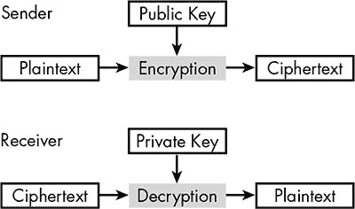
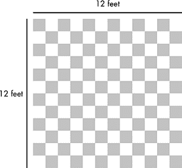
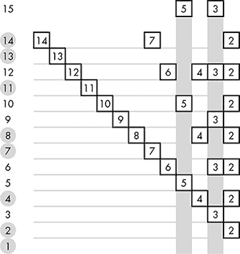
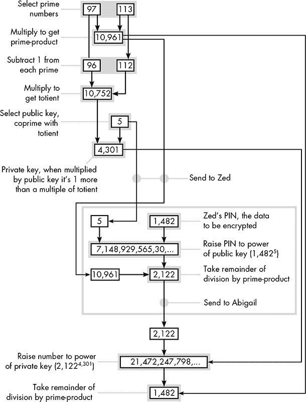
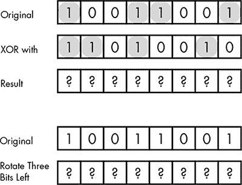
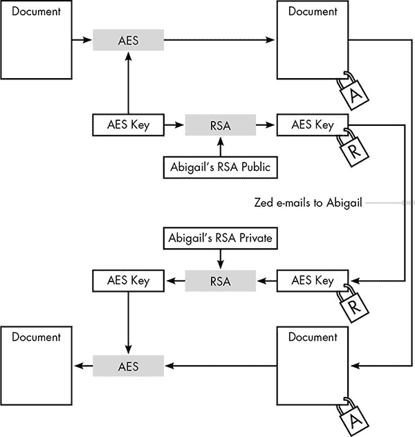
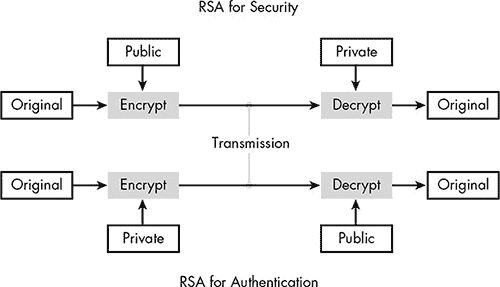
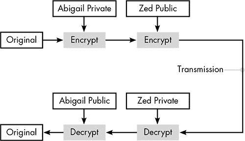
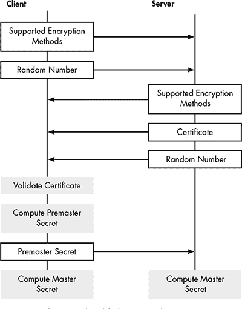

## 3

**Web 安全**

你可能之前没意识到，但我们所知的互联网如果没有解决共享密钥问题，根本无法存在。想象一个典型的情境：你在一个你以前没有购买过东西的在线零售商那里购物。某一时刻，你会被要求提供信用卡数据。浏览器告诉你，你的数据是安全的，可能通过在角落里显示一个“锁”图标来告知你。但要让浏览器通过 AES 保护你的卡号，必须确保你的系统和零售商使用相同的加密密钥。那两个系统如何在不事先交换密钥的情况下安全地传输数据呢？

解决这个共享密钥问题对于提供 Web 安全至关重要。在本章中，我们将探讨解决共享密钥问题的方法，它结合了我们在前两章中看到的所有技术，并添加了一个新的特殊元素：公钥密码学。

### 公钥密码学如何解决共享密钥问题

在物理安全的世界里，共享密钥问题有一个直接的解决方案，因为锁和钥匙是两个独立的物件。假设 A 需要将机密物理文件发送给 B。B 可以购买一个强箱和一把带钥匙的锁，然后将箱子和锁邮寄给 A，同时保留钥匙。然后 A 将文件放入箱子，用 B 的锁把箱子锁好，接着将箱子寄回给 B。由于 B 是唯一拥有锁钥匙的人，这是一种安全的递送方式。

这也是数字传输数据的理想情况。我们需要将数据的加锁和解锁方法分开，这样仅知道如何加密数据的人就无法解密结果的密文。

在第一章中，我们了解了 AES，它是一种对称密钥加密方法，意味着加密和解密使用相同的密钥。对于数据传输，我们需要一种*非对称密钥*加密方法，一种密钥用于加密，另一种用于解密。加密密钥被称为*公钥*，因为即使它落入攻击者手中，公开分发也不会带来不良影响；因此，非对称密钥加密也被称为*公钥密码学*。解密密钥只有接收者知道，因此被称为*私钥*。这些关系如图 3-1 所示。

*图 3-1：非对称密钥加密，使用公钥加密，使用私钥解密。只有接收者拥有私钥。*

### 公钥密码学的数学工具

那么，公钥密码学所需要的，是一种可逆的加密方法，但*不是*使用在加密中的密钥来反转。我们到目前为止所见的加密方法的基本工具，不适用于公钥密码学。例如，AES 中最常用的操作是异或（exclusive-or），之所以使用它，恰恰是因为当某个东西与相同的二进制数字异或两次时，结果会得到你开始时的那个数字。像异或这样的可逆操作不可避免地导致加密和解密使用相同的密钥。

因此，公钥加密需要一种新的技术。事实证明，公钥加密的秘密在于数字之间隐藏的关系。为了说明这些关系是什么以及它们如何用于密码学，我们需要了解一些数学术语。

#### *可逆函数*

广义地说，*函数*描述了任何一种情形，其中每个数值输入都会产生一个唯一的数值输出。例如，当前的摄氏温度是当前华氏温度的一个函数。对于任何特定的华氏温度，总会有一个对应的摄氏温度。

同样，一堆硬币的货币价值是每种类型硬币数量的函数。一个包含三枚 25 美分硬币、两枚 5 美分硬币、一枚 10 美分硬币和四枚 1 美分硬币的堆，货币总值为 99 美分。这个硬币堆不能值其他任何金额。

有时候，一个函数可以被反转来产生另一个函数。如果我们知道一个温度的华氏度数，我们也可以知道它的摄氏度数，反之亦然：如果我们知道一个温度的摄氏度数，我们也能算出它的华氏度数。从数学角度来说，我们可以说摄氏到华氏的转换函数是华氏到摄氏函数的*反转*，而原始函数是*可逆的*。然而，硬币的例子则是不可逆的。相同的总货币价值可以通过多种不同的硬币组合产生。如果我口袋里的硬币总值是 99 美分，我可能有三枚 25 美分硬币、两枚 5 美分硬币、一枚 10 美分硬币和四枚 1 美分硬币，或者我可能有九枚 10 美分硬币和九枚 1 美分硬币，或者其他的组合。

#### *单向函数*

对于一些可逆函数，从一个方向进行计算可能比从另一个方向计算要容易得多。例如，*平方*和*平方根*是互补的数学概念。假设你家里有一个正方形的房间，地板上铺着黑白相间的瓷砖，如图 3-2 所示。要计算地板的总面积，你可以将 12 乘以 12 得到 144。

我们说 144 是 12 的*平方*。反过来，我们说 12 是 144 的*平方根*。这两个都是函数；每个数字都有一个平方和一个平方根。然而，计算这两个函数的难度是截然不同的。算出一个数字的平方很简单：你只需将该数字乘以自身。而算出平方根则很难。除非你有一个数值表来帮助你，否则计算平方根实际上是一个试错过程。你先猜测平方根可能是什么，计算出这个猜测的平方，看它是否太高或太低，然后根据结果调整下一个猜测，重复这一过程直到找到准确的平方根，或者接近得足够可以停止。当一个函数是可逆的，但其逆函数计算起来要困难得多时，它被称为*单向函数*。

*图 3-2：一间墙长 12 英尺的正方形房间总面积为 144 平方英尺。*

#### *陷门函数*

非对称加密需要一个单向函数，使得加密密钥可以公开——加密过程简单，但解密将变得非常困难，几乎不可行。问题在于，我们不应让预定的接收者也无法解密。因此，任何普通的单向函数都不行。我们需要一种被称为*陷门函数*的单向函数，其中逆函数一般很难计算，但如果知道某个秘密值，逆函数就容易计算。

##### 素数

我们将要讨论的特定“陷门”函数涉及素数。一个数字如果大于 1 且只能被自身和 1 整除（没有余数），则被称为*素数*。例如，5 是素数，因为它只能被自身和 1 整除，不能被 2、3 或 4 整除。然而，6 除了可以被 1 和自身整除外，还可以被 2 和 3 整除，因此它是一个非素数或*合成*数。能整除较大数字的小数字被称为较大数字的*因数*。每个数字都能被其自身和 1 整除，但我们称这些为*平凡因数*，并且在讨论因数时通常会忽略它们。一个素数只有平凡因数。

##### 互质数

在一个相关概念中，如果两个数字只有 1 作为公因数，则称它们是*互质*的。无论每个数字本身是否为素数，它们都可以被认为是素数，至少从另一个数字的角度来看是如此。例如，合成数 9 和 4 是互质的，因为除了 1 外，没有其他数字可以同时整除它们。相反，6 与 9 或 4 都不是互质的，因为 6 与两者都有共同的因数。这些关系在表 3-1 中有所展示。

**表 3-1:** 显示 9 和 4 是互质的，但 6 与 9 或 4 都不是互质的

| **因数** | **来自 9 的余数** | **来自 6 的余数** | **来自 4 的余数** |
| --- | --- | --- | --- |
| 9 | (平凡的) |  |  |
| 8 | 1 |  |  |
| 7 | 2 |  |  |
| 6 | 3 | (平凡的) |  |
| 5 | 4 | 1 |  |
| 4 | 1 | 2 | （简单） |
| 3 | 0 | 0 | 1 |
| 2 | 1 | 0 | 0 |
| 1 | （简单） | （简单） | （简单） |

尽管 1 不是质数，但它被认为是与任何其他数字互质的。

##### 质因数

现在我们即将接近使公钥加密能够工作的隐藏关系。如果我们将两个质数相乘，得到的积只有这两个质数作为因数（再次强调，不计算它自身和 1）。例如，5 和 3 是质数。3 和 5 的积是 15，且 15 只有 3 和 5 作为因数，如 表 3-2 所示。

**表 3-2：** 3 和 5 的积是 15，且 15 只有 3 和 5 作为因数

| **除以 15** | **结果** | **余数** |
| --- | --- | --- |
| 15 | 0 | 0 （简单） |
| 14 | 1 | 1 |
| 13 | 1 | 2 |
| 12 | 1 | 3 |
| 11 | 1 | 4 |
| 10 | 1 | 5 |
| 9 | 1 | 6 |
| 8 | 1 | 7 |
| 7 | 2 | 1 |
| 6 | 2 | 3 |
| 5 | 3 | 0 |
| 4 | 3 | 3 |
| 3 | 5 | 0 |
| 2 | 7 | 1 |
| 1 | 15 | 0 （简单） |

这是一个单向函数。如果我给你两个质数，你可以轻松地将它们相乘，尽管如果数字很大，你可能需要使用计算器。这个函数的逆操作意味着从两个质数的积开始，找出原始的两个质数。这要困难得多。

让我们以 18,467 为例。这个数字确实是两个质数的积——但是 *是哪* 两个质数呢？要回答这个问题，你需要将 18,467 除以从 2 开始的每个质数。最终你会发现，18,467 除以 59 得到 313，这意味着 59 和 313 是这两个质因数。

如果只有积，找到质因数是非常困难的。然而，当你拥有积和其中一个因数时，找到另一个因数就很简单，因为你只需将第一个质数除以积。这使得它成为一种陷门函数——在一个方向上容易，在另一个方向上则很难，除非你有额外的信息。如果质数足够大，在没有陷门的情况下，找到因数几乎是不可能的。

### RSA 加密方法

这种陷门函数是 *RSA* 公钥加密系统的核心，该系统以其发明者 Rivest、Shamir 和 Adleman 的首字母命名。在实际应用中，该系统使用非常大的数字来防止简单的暴力破解，但我会在一个简化的示例中使用小数字，以便更容易演示它是如何工作的。

假设兄妹 Zed 和 Abigail 共享一个银行账户，但他们住得分开。Zed 刚刚将账户的四位数字密码更改为 1482，并需要通过电子邮件将这个新号码发送给 Abigail。由于电子邮件传输过程中可能经过许多不安全的计算机，因此必须以某种方式加密密码，但 Zed 和 Abigail 之前并未共享任何可以使用像 AES 这样的加密方法的密码密钥。因此，Zed 将使用 RSA 安全地传输这个新密码。

#### *创建密钥*

尽管在这个示例中 Zed 拥有机密数据需要传输，但 RSA 过程从 Abigail 开始，她必须生成公钥，然后 Zed 才能加密 PIN 码。

##### 步骤 1

Abigail 首先选择两个素数；假设她选择了 97 和 113。

##### 步骤 2

Abigail 将这两个数字相乘得到 10,961。为了清楚起见，我将这个数字称为*素数积*。

##### 步骤 3

接下来，Abigail 必须计算*欧拉函数值*（发音为*TOE-shent*，与*quotient*押韵）。对于一个数字*N*，欧拉函数值是小于*N*并且与*N*互质的数字的数量。例如，数字 15 与 1、2、4、7、8、11、13 或 14 互质，如图 3-3 所示。由于与 15 互质的数字有八个，因此 15 的欧拉函数值是 8。

*图 3-3：这八个圈出的数字与 15 没有共同因子。因此，15 的欧拉函数值是 8。*

计算一个数字的欧拉函数值通常需要检查所有小于该数字的数是否有共同因子，因此这是一个繁琐的过程——对于非常大的数字，计算欧拉函数几乎是不可能的。然而，如果该数字是两个素数的乘积，就有一个快捷方式：只需从这两个素数中各减去 1，然后将结果相乘。例如，15 是两个素数 3 和 5 的乘积。如果我们从这两个素数中各减去 1，得到 2 和 4；如果我们将 2 和 4 相乘，得到 8，这是 15 的欧拉函数值。

这个快捷方式极大地帮助了 Abigail，她的下一步是计算素数积 10,961 的欧拉函数值。由于 10,961 是 97 和 113 的乘积，因此 10,961 的欧拉函数值是 96 × 112，即 10,752。

##### 步骤 4

现在 Abigail 选择一个符合以下标准的数字：

• 大于 1

• 小于欧拉函数值

• 与欧拉函数值互质

假设她选择了 5。这个选择是可以接受的，因为它大于 1，小于 10,752，并且除了 1，没有其他数可以同时整除 5 和 10,752。Abigail 将与 Zed 共享这个数字，所以我们称之为公钥。

##### 步骤 5

选择的公钥决定了 Abigail 的私钥，这是她需要保密的数字。对于给定的公钥和欧拉函数值，只有一个数字可以作为私钥，我们可以通过测试欧拉函数值的连续倍数来找到它。对于每个倍数，我们加 1，看看结果是否能被公钥整除。当能整除时，除法的结果就是私钥。

过程在表 3-3 中进行了演示。10,752 的第一个倍数是 10,752 本身；Abigail 加 1 得到 10,753，然后用 5 除，得到商 2,150，余数为 3。她尝试第二个倍数 21,504，加 1 后除以 5，得到 4,301 且没有余数，因此她的私钥是 4,301。

**表 3-3：** 寻找私钥

| **倍数** | **乘以 10,752** | **加 1** | **除以 5** | **余数** |
| --- | --- | --- | --- | --- |
| 1 | 10,752 | 10,753 | 2,150 | 3 |
| 2 | 21,504 | 21,505 | 4,301 | 0 |

当然，使用更大的数字可能需要更多的倍数来找到私钥，但总有一个数字会通过测试。测试的倍数总是小于公钥（在我们的例子中，Abigail 知道她最多四次尝试就能找到私钥）。无论如何，现在 Abigail 已经得到了她的私钥，实际的加密过程可以开始了。

#### *使用 RSA 加密数据*

Abigail 将她的素数积（10,961）和公钥（5）通过电子邮件发送给 Zed。因为这些数字无法让任何人解密生成的密文，所以在邮件到达 Zed 之前，其他人是否阅读邮件并不重要。

新的 PIN 加密实际只需要两步。

##### 步骤 1

Zed 将 PIN 1,482 提升到公钥 5 的次方——也就是将 1,482 自己乘以五次：

1,482 × 1,482 × 1,482 × 1,482 × 1,482 = 7,148,929,565,430,432

##### 步骤 2

第二步是找出步骤 1 的结果除以素数积的余数。在这种情况下，10,961 可以进入 7,148,929,565,430,432 大约 652 亿次，但 Zed 关心的只是那次除法的余数是 2,122。Zed 将这个余数发送给 Abigail。

##### 步骤 3

在接收端，Abigail 执行两步类似的操作来解密密文。她首先将密文数字 2,122 提升到私钥 4,301 的次方。因为 2,122^(4,301) 非常庞大——超过 14,000 位——我这里不展示它。

##### 步骤 4

Abigail 找到将步骤 3 中得到的巨大数字除以素数积的余数。这个余数正好是 1,482，揭示了 Zed 的 PIN。

#### *RSA 的有效性*

记住，RSA 的目标，像任何加密系统一样，是使加密简单，目标接收者的解密也简单，而其他人解密非常困难。我们 RSA 示例的总结见 图 3-4。

即使使用更大的素数，借助计算机，加密和授权解密也是简单的，回顾我们示例中的步骤就可以看出这一点。

1.   Abigail 选择了两个素数并将它们相乘，得到了她的 *素数积*。相乘两个数字很容易。

2.   Abigail 通过先从两个素数中每个减去 1 然后再相乘来计算 *欧拉函数*。减法和乘法很容易。

3.   Abigail 选择了一个 *公钥*，这个数字与欧拉函数没有任何公因数。对于大数字来说，手工计算这个是不可行的，但对计算机来说，这是容易的。

4.   Abigail 找到了合适的 *私钥*，它应该在与她的公钥相乘时，得到一个比欧拉函数的倍数大 1 的数字。这手动计算很麻烦，但对计算机来说，这也是容易的。

5.   Abigail 发送了素数积和公钥给 Zed。

6.   Zed 将 PIN 提升到公钥的幂。对计算机来说，这是相对简单的。

7.   Zed 将上一步的结果除以素数积并取余。除法很简单。

8.   Zed 将其余部分发送给了 Abigail。

9.   Abigail 将 Zed 发送的数字提升到私钥的幂。很简单。

10. Abigail 将前一步的结果除以素数积并取余，从而得出了 Zed 的 PIN。很简单。

*图 3-4：RSA 示例的总结。中间的框显示了 Zed 的责任；其余的是 Abigail 的。*

对授权方来说，RSA 加密和解密对于计算机而言是轻松的工作，但未经授权的解密则极其困难。要解密，攻击者必须同时拥有素数积（Abigail 会公开给出）和私钥（Abigail 会自己保留）。那么攻击者如何计算私钥呢？找到这个数字意味着首先要找到素数积的欧拉函数，但请记住，Abigail 之所以能快速计算欧拉函数，是因为她知道生成素数积的两个质数。没有这两个质数，攻击者必须通过繁琐的方式来计算欧拉函数——检查所有小于素数积的数字，找到所有互质的数。

在我们的示例中，素数积很小，所以计算机以这种暴力方式找到欧拉函数是可行的。然而，实际上，素数积非常大，根本无法以这种方式找到其欧拉函数。事实上，攻击者更应该去寻找组成素数积的两个质数，利用捷径方法来计算欧拉函数。不过，这仍然需要检查所有小于素数积平方根的数字，所以对于大数字来说，这和通过繁琐方式找到欧拉函数一样不切实际。

因此，RSA 加密方法创造了我们期望的数字“保险箱”对应物。加密和解密不再共享相同的秘密，所以知道如何锁定数据并不能提供解锁它的能力。

#### *RSA 在现实世界中的应用*

我们的简化示例展示了 RSA 加密的基本原理，但在实际应用中，我们还需要考虑其他一些细节。

##### 双向传输

示例中展示的系统允许 Zed 安全地传输给 Abigail，但反过来则不行。如果他们想要双向传输安全信息，Zed 必须像 Abigail 那样，完成所有的步骤，生成自己的素数积、欧拉函数、公共密钥和私有密钥，并将素数积和公钥发送给 Abigail。

##### 密钥大小

在 RSA 中，加密或解密的最后一步是对素数乘积进行取余运算，这意味着明文数字必须小于素数乘积。在 Abigail 和 Zed 的示例中，最大的明文数字为 14,960。这对 Zed 和他的四位数 PIN 码来说不是问题，但对于一般用途来说，需要更大的范围。

同样重要的是，素数乘积的值越大，攻击者找到两个素因子的难度就越大。换句话说，素数乘积的大小直接影响加密的安全性。在当前的实践中，选择素数以产生至少 1024 位的素数乘积。如你所记得，在第一章中描述的高级加密标准（AES）仅使用 128 或 256 位的密钥。所以我们讨论的是一个真正巨大的数字——1024 位相当于一个超过 300 位的十进制数。

##### 长明文与性能

一个 1024 位的密钥可以加密非常大的数字。但典型的文本、图像或音频文件是一长串小数字，而不是一个大数字。我们如何使用 RSA 传输一长串数字呢？对于 AES，长文件会被切分成必要的多个 128 位块。在理论上，我们也可以用 RSA 做到这一点，将文件切分成多个 1024 位块，并对每个块应用 RSA。问题在于 RSA 加密比 AES 慢得多。

AES 的步骤比 RSA 加密标准多，但即便如此，AES 的性能很高，因为这些步骤本身非常简单。最常见的操作是 XOR 和位移，这些操作本身非常简单。你可以通过在脑海中运算这些操作的结果来理解这一点，如图 3-5 所示。

*图 3-5：计算 XOR 或旋转位到新位置是很简单的。*

相比之下，RSA 过程只有几个步骤，但由于依赖指数运算，整体工作量较大。考虑一个相对较小的指数：17¹⁶。写出来是……

17 × 17 × 17 × 17 × 17 × 17 × 17 × 17 × 17 × 17 × 17 × 17 × 17 × 17 × 17 × 17

试着在脑海中计算这个，你就能看出问题所在。现在，想象一下涉及数百位数字的指数。尽管计算机能够处理这些运算，但显然，指数运算要比简单的 XOR 运算费时得多。由于指数运算需要大量时间，使用 RSA 处理大量数据并不实际。

##### 结合系统

解决 RSA 性能问题的方法很简单：不要使用 RSA 传输大量数据。相反，使用 RSA 传输另一个更快方法的加密密钥，例如 AES。

返回到 Abigail 和 Zed，假设 Zed 需要向 Abigail 发送一份他已经用 ASCII 表将其转换为一系列数字的长文档。Zed 会更倾向于使用 AES 加密该文档，而不是采用 RSA 的复杂工作。但要使用 AES，Zed 和 Abigail 都需要共享一个 AES 加密密钥。RSA 提供了安全共享该密钥的方法。Zed 可以自己创建 AES 密钥，然后使用 Abigail 的公钥用 RSA 加密该密钥。然后 Zed 可以用 AES 加密长文档，Abigail 可以使用他们现在共享的密钥解密得到的密文。这个过程在图 3-6 中得到了说明。

*图 3-6：结合 RSA 和 AES 以生成具有高性能的非对称公钥系统*

在此图中，A 锁符号表示“用 AES 加密”，而 R 锁符号表示“用 RSA 加密”。通过发送 AES 加密的文档和用她的公钥 RSA 加密的 AES 密钥，Abigail 拥有解密文档所需的一切，但拦截传输的攻击者无法在没有 Abigail 私钥的情况下解密文档。

通过结合这两种加密方法，我们将它们的优点结合在一起，获得 AES 的高性能和 RSA 的共享密钥。公钥加密通常以这种方式使用，用来启动一个本来无法实现的对称密钥加密过程。

#### *RSA 用于身份验证*

公钥加密技术带来了身份验证问题。因为公钥本身就是公开的，任何人都可以向私钥持有者发送加密信息；因此，接收者无法确定发送者的身份。这一问题在对称密钥加密中不会出现，因为当一个密钥可以共享时，它的保密性不仅确保了信息的安全，还能确保信息来自于持有该密钥的另一方。幸运的是，公钥加密也可以用于身份验证。

##### 使用 RSA 进行身份验证

在我们的 RSA 示例中，Abigail 拥有她的素因子积 10,961 和她的私钥 4,301，而 Zed 拥有素因子积和 Abigail 的公钥 5。这使得 Zed 能够向 Abigail 发送安全信息，同时也使 Abigail 能够向 Zed 发送经过身份验证的信息。

假设 Abigail 想要将相同的 PIN 码 1482 返回给 Zed，以确认已收到信息，并且以 Zed 能够确定该确认来自 Abigail 的方式发送。

Abigail 将 PIN 码 1,482 作为底数，提升到她的私钥的幂（而不是用于加密的公钥）。1,482^(4,301)是另一个巨大的数字——它有超过 13,000 位——所以我不打算在这里写出来，但当这个巨大的数字除以 10,961 的素数积时，余数是 8,742。Abigail 将这个余数通过电子邮件发送给 Zed。Zed 现在将 8,742 提升到 Abigail 的公钥 5 的幂，结果是 51,056,849,256,616,667,232。最后，Zed 将这个数字除以素数积，得到余数 1,482。Zed 认出这个数字是 PIN 码，并知道它一定是用 Abigail 的私钥进行转换的，从而证明这个数字来自 Abigail。RSA 安全性与认证之间的关系如图 3-7 所示。

*图 3-7：RSA 过程提供加密或认证。*

我们可以通过将此认证过程应用于像 AES 这样的系统的加密密钥，来认证整个文件，并将加密文件和认证过的密钥一起发送给接收者。

因此，RSA 过程可以生成经过认证的消息*或*安全的消息，具体取决于我们是使用私钥还是公钥进行加密。理想情况下，我们希望消息既能被认证又能保持安全。我们可以通过将该过程的两种变体应用于同一消息来实现这一目标。在我们的示例中，如图 3-8 所示，Abigail 可以用她的私钥加密她要传输的数字，然后用 Zed 的公钥对结果进行加密。收到后，Zed 将逆转这些步骤，首先使用他的私钥解密，然后再次使用 Abigail 的公钥解密。

*图 3-8：使用发送者的私钥和接收者的公钥应用 RSA 提供认证和安全性。*

##### 身份验证机构

你可能已经注意到，认证引入了一种更微妙的共享密钥问题版本。Zed 知道电子邮件来自 Abigail，因为他认出了用 Abigail 的公钥转换该数字时产生的 PIN 码，这意味着发送者必须拥有匹配的私钥。但如果 Zed 担心有人冒充 Abigail，他如何知道公钥最初是由 Abigail 发送的，而不是一个黑客入侵了 Abigail 的邮箱账号的冒名顶替者？

这个问题的解决方案是一个*权威机构*，一个帮助验证身份的第三方。正如你将看到的，权威机构提供了数字等同于身份证的服务。当两台计算机通过交换公钥启动一个安全的、经过身份验证的传输时，它们会展示各自的身份证明，这样可以确保每台计算机知道对方的身份。当然，这假设每台计算机都信任提供身份验证的权威机构，所以最终，身份验证要求你对某个机构有隐性信任。你要么相信传输确实来自声称发送它的实体，要么相信某个第三方来识别发送者。身份认证权威是本章最终讨论主题——网络安全的一个至关重要的组成部分。

### 网络安全：HTTPS

网页是通过 HTTP 传输的，HTTP 代表*超文本传输协议*。当这些数据被安全传输时，它被称为 HTTPS，其中*S*代表*安全*。这就是为什么当你在浏览器的地址栏中看到*https*时，表明你正在传输敏感数据——或者我希望你能看到。网络安全是大多数人认为理所当然的事情，但要在两个可能刚刚建立联系的自动化方之间立即建立信任和安全，这需要所有你已经看到的技巧和技术，真是一个了不起的成就。

在本讨论中，假设你正在通过计算机或手机从零售网站购买商品。在这种情况下，你的计算机被称为*客户端*。为零售商运行网站的计算机被称为*服务器*。这是你第一次从这家零售商购买商品，所以你必须提供送货和账单信息，比如你的地址和信用卡号。这个情况迫切需要安全保障，但它也需要身份验证。

为了理解其原因，你必须记住，计算机并没有直接连接到服务器。你的数据会通过你的互联网服务提供商（ISP）管理的计算机、零售商的 ISP 管理的计算机，甚至可能通过既不由两者管理的中介系统传递。任何这些系统都可能被攻击者攻破，从而感染系统并拦截原本要传输给零售商的数据，伪装成零售商进行响应。如果发生这种情况，当你下订单时，你实际上是把数据交给了攻击者，而不是零售商。虽然数据是加密的，但它是使用被感染系统提供的密钥加密的，因此加密只确保没有人窃听你发送给攻击者的数据。这种冒充身份的攻击被称为*中间人攻击*，而它可以通过良好的身份验证来防止。

#### *握手过程*

数据的安全传输是在会话中进行的。*会话*是网络中相当于电话通话的过程：当你第一次加载网站页面时开始，且在你一定时间内没有与网站互动时结束。

在传输开始之前，客户端和服务器必须成功执行一个被称为*握手*的过程。这个名字意味着两台计算机仅仅是互相打个招呼，但实际上更像是一场犯罪剧中的紧张场面，一方不愿在另一方拿出公文包里的现金之前，展示面包车后面的“东西”。如果握手成功，客户端就能验证服务器身份，并生成将用于加密整个会话期间数据的密钥。与阿比盖尔和泽德的情况类似，公钥加密系统仅在足够的时间内用于交换所需的密钥，然后切换到性能更好的私钥加密系统。

##### 步骤 1

客户端告知服务器其支持的加密方法。HTTPS 协议允许计算机从一套可接受的加密方法中选择，这意味着不同的安全网站可能使用不同的加密技术，从而提供不同级别的安全性。除了加密支持信息外，客户端还会提供一个随机生成的数字——你很快就会看到这个数字的作用。

##### 步骤 2

服务器返回其支持的加密方法列表，并且还会返回其*证书*。该证书包含多个数据项，包括网站的域名（例如[amazon.com](http://amazon.com)）和证书*颁发机构*的名称（验证网站身份的权威机构）。证书中还包含服务器的公钥。HTTPS 可以使用多种不同的公钥加密系统，但 RSA 是常见的。服务器对每个与其交易的客户端使用相同的证书，因此每个证书只需创建一次公私钥对。虽然这意味着服务器对所有客户端使用相同的 RSA 密钥，但正如你将看到的，RSA 密钥只在握手阶段使用。

服务器证书还包含*签名*。正如在第二章中讨论的，数字签名是哈希码。在这种情况下，服务器对证书数据进行哈希处理，并使用服务器的私钥加密哈希码。

此外，服务器还会向客户端发送一个随机数字，就像客户端向服务器发送了一个随机数字一样。

##### 步骤 3

客户端验证证书。验证过程有两个方面。首先，客户端使用服务器的公钥对证书中的哈希码进行解密，然后对证书本身进行哈希处理，并比较两个哈希码。如果哈希码匹配，则证明证书在内部有效，但这并不意味着这是该站点的实际证书。

现在客户端必须检查证书的颁发者，这个颁发者是与你的浏览器内建信任的认证机构。如果你深入浏览器的选项，你会发现一个名为“受信任的根证书颁发机构”的颁发者列表。颁发者提供站点证书的副本；当该证书与服务器提供的证书匹配时，客户端就能确认服务器的身份。

##### 步骤 4

客户端生成另一个随机数，长度为 48 字节或 384 位，称为*预主密钥*。顾名思义，这个数字必须保持机密。然而，客户端需要将其发送给服务器，因此客户端使用服务器的公钥对其进行加密。

##### 步骤 5

客户端和服务器通过对预主密钥和在前两个步骤中交换的两个随机数进行哈希运算，独立地生成 384 位的*主密钥*。一旦主密钥生成，预主密钥和其他两个随机数就会被丢弃。

请注意，主密钥并未在客户端和服务器之间交换。此时，客户端和服务器已经拥有创建主密钥所需的所有数字。它们独立地将这些数字通过相同的过程处理，以生成相同的结果。

握手过程的总结如图 3-9 所示。

*图 3-9：HTTPS 握手过程*

#### *通过 HTTPS 传输数据*

现在客户端和服务器可以开始传输实际的数据——服务器的网页和媒体，以及客户端的用户数据。384 位的主密钥被分成三个 128 位的部分，每部分提供不同的安全性。

##### 数据加密

主密钥的第一部分被用作私钥加密系统（如 AES）的密钥。在安全会话期间，后续的每次数据传输都将使用此密码密钥进行加密。

##### 区块链

由于网页具有标准的标题格式，这可能为攻击者提供线索，因此采用了诸如区块链（在第一章中讨论）等方法。正如你可能记得的那样，这种系统需要一个起始值来加密传输的第一个数据块；主密钥的中间 128 位部分被用作这个起始值。

##### 消息认证码

主密钥的最后 128 位部分用于为每次传输创建*消息认证码*，或*MAC*。在这种情况下，我们并不是要认证发送者的身份——这一点已经在握手阶段处理过了。相反，MAC 确保数据在传输过程中没有被篡改。

在这个过程中，每个传输都会通过像 MD5 这样的函数进行哈希，但首先，传输数据会与主密钥剩余的 128 位部分组合。这被称为*带密钥哈希*，在这个上下文中，这 128 位部分被称为*MAC 密钥*。使用带密钥的哈希有助于防止中间人攻击。一个希望向接收方传递伪造传输的攻击者需要 MAC 密钥来生成一个哈希值，使接收方接受这个哈希值为真实的。

哈希发生在加密之前，这样原始消息和哈希值都会被加密。

### 共享密钥问题解决了吗？

这就是数据如何在 Web 上安全传输的方式。正如你所看到的，解决共享密钥问题几乎需要用到加密学工具包中的每一个技巧。公钥加密为初始通信创建了安全通道。私钥加密用于保护单独的数据传输。哈希算法验证了会话和单个消息的身份。如果网站使用密码来认证用户，那么第二章中的所有密码技术也会派上用场。

Web 安全是一个复杂的技术体系。正因如此，它也带来一个潜在的问题：计算机安全的复杂性可能掩盖了其中的弱点。就像一台部件更多的机器有更多部件可能出现故障一样，众多精细方法和技术的层叠也可能掩盖了尚未发现的漏洞。有时候，漏洞并非存在于某个单一部分，而是存在于各部分之间的连接方式。尽管像 RSA 和 AES 这样的算法目前被认为是安全的，但聪明的攻击者可能会找到方法，在不破坏底层加密方法的情况下突破安全。

例如，HTTPS 的早期版本曾易受到某种中间人攻击，这种攻击源于观察到大多数安全会话开始时，用户点击了一个链接。假设，例如，你收到了来自发行你信用卡的银行的一封邮件，里面有一个链接指向你最近的账户对账单。该链接是一个 HTTPS 地址，这意味着当你点击它时，你的浏览器会启动并请求与银行服务器建立安全连接。然而，这个请求本身并不安全。攻击者的程序可以拦截这个请求，并将其转发给银行服务器，作为一个普通的未加密 HTTP 连接请求，然后窃听所有随后的未加密流量。用户可能会通过地址栏中的前缀发现异常，但有多少用户会想到检查这一点呢？为了解决这个安全漏洞，Web 服务器现在可以告知浏览器，所有连接必须通过 HTTPS 进行——但这个解决方案并不能防止一个能够拦截公告的攻击者。最终的解决方案可能是要求所有 Web 通信都必须使用 HTTPS。

毫无疑问，未来会发现新的漏洞，这需要发明新的防御措施。计算机安全是一个不断变化的目标。我们永远无法宣称我们的数据完全安全，但依靠最佳实践可能使我们始终领先一步，超越攻击者。
