## 4

**电影 CGI**

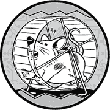

一些软件最令人印象深刻的工作可以在电影院中看到。那些在早期时代通过模型、底片画、复杂的服装和特技摄影制作的图像，现在都可以通过计算机来实现。*计算机生成图像（CGI）*不仅简化了电影制作过程，还创造出了以前无法实现的图像。对许多影迷来说，当他们看到*《侏罗纪公园》*时，电影的历史永远改变了。当斯蒂文·斯皮尔伯格在开发这部电影时，他本打算使用像自动化木偶和动画微型模型这样的传统特效来制作恐龙，但在看到一些计算机动画的测试镜头后，他决定使用 CGI 来制作许多恐龙镜头。结果让观众对图 4-1 中展示的全景画面感到震惊。为对比，用传统方式将恐龙放入电影的效果可以参见图 4-2。

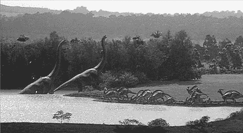

*图 4-1：CGI 恐龙在《侏罗纪公园》中造访水源地*（环球影业/安布林娱乐，1993 年）。

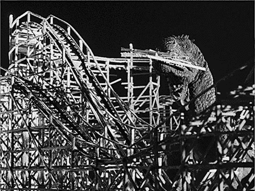

*图 4-2：*《海底两万里》中的怪兽（杰克·迪茨制片公司，1953 年）在康尼岛大吃大喝。

尽管像*《侏罗纪公园》*这样的电影令人惊叹，但它们只是 CGI 革命的开始。现在，像*《阿凡达》*这样的电影利用 CGI 创造出完整的世界，以至于观众无法确定镜头中的哪些部分是物理上真实的。如果有的话。只要有足够的时间和资金，似乎电影制作人可以创作出任何他们能想象的东西。

然而，在计算机通过恐龙和郁郁葱葱的外星行星震撼我们之前，它们已经开始改变传统动画电影的世界。计算机不仅彻底改变了传统动画的制作过程，而且正如你将要发现的那样，所使用的概念和技术构成了计算机图形学几乎所有内容的基础。CGI 的故事从这里开始。

### 传统动画软件

电影是一系列静态图像或*帧*，以快速连续的方式呈现给观众，就像一个高速幻灯片。每一帧图像在消失后会在视网膜上停留片刻，实际上与下一帧图像融合在一起，从而产生连续运动的错觉——这一现象被称为*视觉延续*。传统上，电影以每秒 24 帧（fps）的速度播放。制作电影意味着每秒钟需要制作 24 张图像。

现实电影通过相机实时收集影像。不过，像*《忠犬历险记》*这样的传统动画电影则有些不同：电影的每一帧都是经过单独拍摄的、手工制作的艺术作品。

传统动画是一项庞大的工作，需要一个庞大的艺术团队。通常，每个动画电影中的角色都会指定一个首席动画师，但首席动画师并不会在每一帧中都画出该角色，因为对于一个人来说那样工作量太大了。相反，首席动画师只会绘制足够的*关键帧*来提示动作——也许只是每隔几帧才会绘制一次。这时，其他动画师会绘制中间帧以完成整个动画序列，这一过程称为*tweening*（过渡绘制）。在此阶段，动画仍然只是纸上的一系列铅笔画。这些画必须被转移到透明的纤维素片上，这也是这种风格的动画被称为*cel 动画*的原因。接下来是动画师所称的“墨水和上色”：淡淡的铅笔线会被黑色墨水描摹一遍，然后将纤维素片上色。最后，这些片段被放置在单独绘制的背景前并进行拍摄。

正如你所预料的那样，过渡绘制、描线和上色都是繁琐且耗时的工作。大约从 1990 年开始，计算机图像被用来模仿 cel 动画风格，而且所需的人工劳动要少得多。

#### *数字图像是如何工作的*

在传统动画电影中，每一帧都是一张物理艺术作品的照片，但计算机动画则使用*数字图像*——由数字数据定义的图像。

当你观看电视、智能手机屏幕或数字投影影院屏幕等视频显示时，进入你眼睛的图像是由不同颜色的点组成的，这些点被称为*像素*。图 4-3 展示了一个树木和蓝天的图像，这个图像是由像素网格组成的。这个 10×10 网格中的每个 100 个像素都有一个指定的颜色，颜色通过名称来指定。

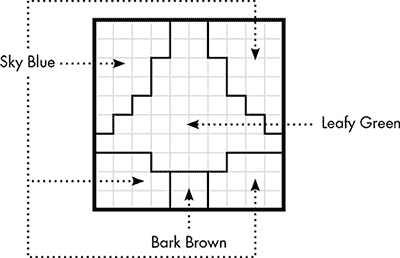

*图 4-3：由像素构成的树*

尽管我们可以将每个像素看作是一个纯色，但实际情况稍有不同。例如，在家里，你可能会在一台普通的*液晶显示器（LCD）*电视上观看电影，在这种电视中，像素颜色由电控晶体决定。在 LCD 屏幕的背面有一个光源，要么是荧光灯，要么是一系列*发光二极管（LED）*。光源本身是白色的。在光源前面是一个半透明的面板，上面有三种原色条——红色、绿色和蓝色，如图 4-4 所示。

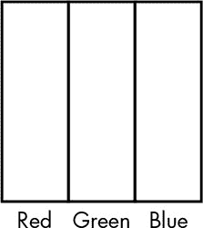

*图 4-4：三种纯原色条形图组成一个 LCD 像素。*

一层液晶位于光源和颜色面板之间，每个半透明条的后面都有一个单独控制的液晶晶体。你可以把这些晶体看作是电控门，每个晶体门的开度决定了光线透过的多少。通过调节红色、绿色或蓝色的量，每个像素可以产生数百万种颜色。这是*加色混合*，即增加颜色会使结果更亮。例如，如果我们希望某个像素呈现明亮的黄色，我们会将红色和绿色的级别设置得较高，而蓝色的级别设置得较低。如果我们想要深灰色，我们会将每种颜色条的强度设置为相同的低值。所有三种颜色在最大强度下会产生纯白色。本章后面我们将看到*减色混合*的例子，这可能是你从美术课上记得的内容，其中添加更多颜色会使结果更暗。

#### *颜色是如何定义的*

定义像素颜色最常用的方法是*RGB*系统，该系统通过三个数字表示像素中红色、绿色和蓝色的强度。这些数字通常在 0 到 255 之间，以匹配 8 位字节的范围。这意味着每个 RGB 像素由三个字节的数据指定。

就软件而言，数字图像（如图 4-3 所示）只是一组颜色数据的字节，每个像素占用三个字节。这组字节称为图像的*位图*。位图中的前三个字节是图像左上角像素的红色、绿色和蓝色级别，依此类推。图像或位图的宽度和高度（以像素为单位）被称为其*分辨率*；例如，图 4-3 的分辨率是 10×10。一个称为*显示缓冲区*的位图存储数字显示器（如液晶电视）每个像素的颜色；最终，计算机图形方法就是设置显示缓冲区中的数字。

位图中某个特定像素的位置通过两个*坐标*来指定，一个是水平位置的*x*-坐标，另一个是垂直位置的*y*-坐标。坐标(0,0)，称为*原点*，可以位于角落或中心；它在不同的坐标系统中有所不同。在物理显示器上定位像素时，我们称坐标为*屏幕坐标*。屏幕坐标系统通常将原点设置在左上角像素，因此 1920×1080 屏幕上像素的位置如图 4-5 所示。在这里，y 轴向下移动时增大，x 轴向右移动时增大，中心位置是(960, 540)。

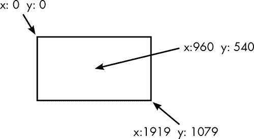

*图 4-5：在 1920×1080 屏幕上定位像素*

坐标系统是计算机图形学中无处不在的一部分，正如你将在本章和下一章看到的那样，制作图形的大部分工作涉及将坐标从一个系统转换到另一个系统。

#### *软件如何制作原子动画*

现在你已经了解了数字图像的构成，你准备好了解软件如何制作看起来像传统原子画的数字图像了。第一步是将艺术家的作品导入计算机。

##### 将图形转化为模型

软件生成的原子动画的起始方式与传统动画相同：艺术家先画出角色。不过，艺术家不是在纸上绘制，而是使用鼠标或电子笔绘制，绘制过程由软件记录。为了最终生成位图图像，我们需要一个系统来数值化艺术家的笔触，生成一个*模型*。模型中的位置被称为*局部坐标*。图 4-6 展示了一个虫人图形，它被放置在一个定义局部坐标空间的框内。

*图 4-6：在定义坐标限制的框内绘制的虫人图形*

该模型中的每一条线和曲线都通过这些局部坐标来定义。像我们角色的天线和腿这样的直线段，可以通过线段两端的点的坐标来定义，如图 4-7 所示。请注意，这里的坐标包含小数部分，以提高精度。

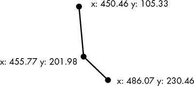

*图 4-7：通过端点坐标定义直线段*

对于曲线，除了端点外，还需要*控制点*来定义曲线的方向和弯曲程度。可以想象控制点是附加在曲线上的，移动它就能控制弯曲程度，如图 4-8 中的简单曲线所示。如果你曾经使用过矢量图形软件，那么你很可能也接触过这种曲线。

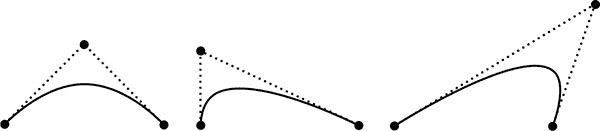

*图 4-8：由两个端点和一个控制点定义的曲线*

简单的曲线可以仅通过两个端点和一个控制点来表示，但较长、较复杂的曲线则由一系列简单的曲线组成，如图 4-9 中虫人鞋子的示例所示。

线条和曲线仅定义了角色或其他图形的轮廓；轮廓内部的颜色则使用像 RGB 这样的系统来定义。因此，角色模型是所有线条、曲线和颜色数据的数值表示。

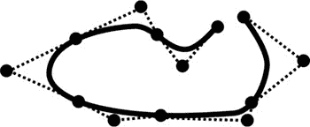

*图 4-9：由简单曲线构成的复杂曲线*

##### 自动过渡

数值定义绘图允许自动过渡。动画师首先绘制角色动画序列中的一帧，然后通过移动前一帧曲线的控制点来创建后续的关键帧。动画软件接着可以通过*插值*生成其他帧。图 4-10 演示了这个概念。这里，中间点的坐标是其他点坐标的平均值。插值点的 x 坐标 20 介于 10 和 30 之间；y 坐标 120 介于 100 和 140 之间。在这个例子中，所有点都位于一条直线上，但插值路径也可以是曲线。

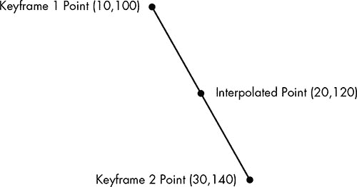

*图 4-10：通过插值计算两个关键帧点之间的中间点*

图 4-11 展示了插值如何创建新的动画帧。最左边的面是原始模型；第二个面显示了一些控制点；第三个面则通过将两个控制点向下移动，形成了一个大嘴巴。最右边的面通过线性插值创建，线性插值将每个控制点放置在两个关键帧位置的中间。动画软件可以根据需要创建任意数量的中间位置，以填补关键帧之间的空隙。

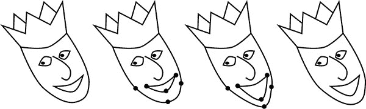

*图 4-11：从左到右：一个模型，选定控制点的模型，移动了两个控制点的模型，以及通过插值生成的过渡模型*

尽管基本的插值过渡可以节省大量时间，但调整大量小点的位置仍然是繁琐的。更先进的动画软件可以将角色绘图视为一个完整的、相互连接的身体，其中定义了刚性连接和关节。这意味着，动画师只需要为每个关键帧定位角色的脚，就能使虫人行走，软件会根据需要自动定位其他部位的腿部。软件甚至可能处理现实世界的物理效果，这样我们虫人跨越树干的动画序列就可以完全由软件自动生成。

##### 定位与缩放

数值建模还允许将图形放置在框架中的任何位置，并可以调整其大小。改变模型的大小称为*缩放*，通过对每个点的坐标进行乘法或除法来完成。图 4-12 展示了图 4-6 中的虫人模型，通过将每个坐标除以二，将其缩小为原始面积的四分之一。模型上的一个天线点被突出显示，以便展示这一思想。

将模型放置在屏幕的特定位置称为*平移*，这一过程通过增加或减少坐标的固定值来实现。在图 4-13 中，来自图 4-12 的缩小版虫人被平移到屏幕中央，方法是将每个 x 坐标增加 700，y 坐标增加 200。

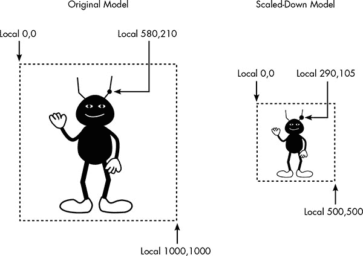

*图 4-12：缩放模型意味着对每个坐标进行乘法或除法操作。*

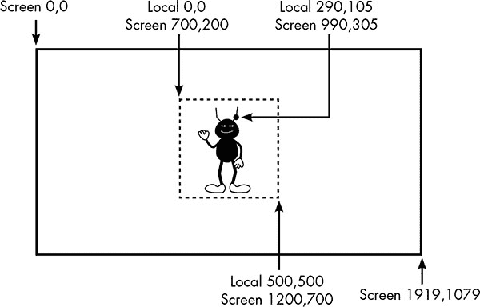

*图 4-13：平移模型意味着在坐标上加减数值。*

##### “数字图像的墨水与上色”

现在，模型上的点已映射到屏幕坐标，接下来是将每一帧转换成位图。这就像是传统手绘动画中的“墨水与上色”过程。为了简单起见，让我们看看当我们的虫人模型的右臂显示在纯白背景上时，如何将其转换为位图，或者说*光栅化*。图 4-14 展示了右臂覆盖在像素网格上，圆圈标记了像素的中心。

在数学上定义了模型后，软件可以将手臂放置在位图的任何位置，然后将指定的颜色——在此案例中为黑色——应用于适当的像素。然而，我们很快就会发现一个问题：手臂的轮廓与像素的边界并不匹配，那么我们该如何确定哪些像素需要上色呢？一个简单的规则是，当像素的中心被覆盖时就进行上色。图 4-15 展示了基于像素中心上色的结果。

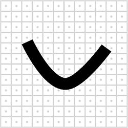

*图 4-14：虫人右臂叠加在像素网格上*

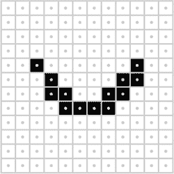

*图 4-15：基于像素中心对像素进行纯黑上色*

然而，正如你所看到的，这个结果相当难看。由于像素是方形的，这个上色规则将模型优雅弯曲的边界替换为锯齿状的边缘，这也是这个问题被称为*锯齿效应*的原因。这个问题的根本在于，模型是平滑连续的，而位图是由方形的黑白像素组成的。位图仅仅是对模型的近似。连续模型与其位图近似之间的差异被称为*别名效应*，它是计算机图形中许多视觉异常的根源。

为了避免锯齿效应，我们需要使用*抗锯齿*技术来上色像素。在我们的例子中，我们将使用一系列灰度值，而不是单纯的黑白，来更好地近似模型。每个像素的颜色将根据其被手臂覆盖的程度来决定。

为了将这个想法付诸实践，我们不再只检查每个像素的中心，而是测试每个像素内的多个点，看看有多少个点位于模型内。在图 4-16 中，10 个散布在像素区域内的测试点中有 7 个被形状覆盖，意味着覆盖率为 70%。

每个像素被模型覆盖的百分比决定了其灰度级别。虫人手臂的结果显示在图 4-17 中。尽管这个例子看起来可能不算特别显眼，但如果你把页面拉远一点并眯起眼睛，边缘应当会平滑地融入白色背景，产生优雅曲线的错觉。

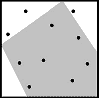

*图 4-16：虫人手臂末端一个像素的特写，散布着 10 个点以估算模型覆盖的区域*

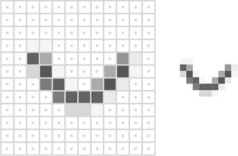

*图 4-17：使用灰度进行抗锯齿，展示了带像素网格和不带像素网格的效果。*

##### 与任何背景的融合

我们需要将刚才描述的技术进行概括，使其能够在其他背景上也能使用。考虑图 4-18。左侧是虫人模型，中间是他将出现的拍摄背景：日落时分的岩石地貌特写。右侧是将模型叠加在背景上的完整图像。

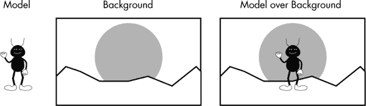

*图 4-18：虫人模型、背景及模型叠加在背景上*

本书是黑白印刷的，但在此图像中，太阳的颜色应为红橙色调，地面的颜色应为棕色调。和之前一样，模型边缘的像素会显得锯齿状，除非我们使用抗锯齿技术。然而，使用之前的技术将像素涂成灰色并不能帮助黑色边缘与红橙色和棕色像素的背景融合。

一种更为通用的抗锯齿技术会根据模型覆盖的像素百分比为每个像素计算一个*alpha 水平*。你可以将 alpha 水平看作是透明度的度量。像颜色级别一样，alpha 水平通常在 0–255 范围内定义。在图 4-19 中，一条黑色条形叠加在树木上，具有不同的 alpha 水平。在 alpha 水平为 255 时，条形完全不透明，而在 25 时条形几乎不可见。alpha 水平为 0 时，条形将完全不可见。

位图中所有像素的 alpha 值统称为*alpha 通道*。为模型制作 alpha 通道的过程类似于我们如何将黑色手臂与白色背景抗锯齿，只不过这次我们不再根据像素覆盖百分比来赋予灰度值，而是为每个像素分配一个 alpha 值。因此，每个模型从概念上来说被转化为一张位图，显示模型覆盖的每个像素的颜色，以及一个 alpha 通道，显示每个像素的不透明度。图 4-20 展示了虫人手臂的颜色位图（这里只有黑色像素）和 alpha 通道。

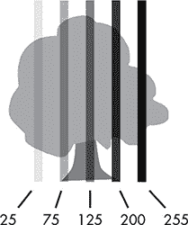

*图 4-19：一棵树上覆盖了五条具有不同 alpha 水平的黑色条形*

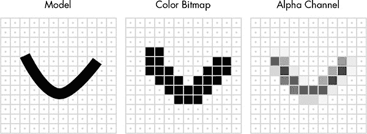

*图 4-20：虫人模型的手臂及其对应的颜色位图和透明通道*

现在，模型可以应用于任何背景。每个像素的最终颜色是背景颜色和模型颜色位图的混合，透明度水平决定了每种颜色在混合中所占的比例。在图 4-18 中的虫人场景中，如果一个黑色的虫人像素具有 30%的透明度，并覆盖在一个红橙色的日落背景像素上，结果将是一个更暗的红橙色，如图 4-21 所示。每个颜色成分的最终比例会在两种混合颜色之间，但由于黑色像素的透明度只有 30%，因此红橙色的背景颜色占主导地位。对于完全被模型覆盖的像素，透明度为 100%，最终图像中的颜色与模型的颜色位图相同。通过这种方式，带有透明通道的位图可以平滑地与任何背景混合。

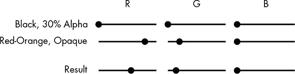

*图 4-21：三种颜色的红、绿、蓝组成部分：模型的黑色，背景像素的红橙色，以及这两种颜色混合后的结果，如果黑色的透明度为 30%*

#### *从卡通动画软件到渲染的 2D 图形*

这些技术现在已经成为制作卡通风格动画的默认方式，而软件在动画工作室中的地位与早期世代中的画笔和纸张一样普及。虽然一些动画工作室使用自己开发的程序，但大多数直接面向视频或电视的动画以及一些电影是使用现成的软件制作的。其中一个这样的程序，Toon Boom，曾被用于《辛普森一家》和《费尼亚斯与费布》这样的电视节目，而吉卜力工作室的艺术家们则使用一款名为 Toonz 的程序制作了《千与千寻》等电影。

这些技术的应用并不限于电影制作。更广泛地说，用于模拟传统卡通风格动画的软件技术被称为二维图形，或*2D 图形*，因为模型的控制点是通过两个坐标 x 和 y 来定位的。将模型转换为最终图像的任务称为*渲染*，执行这一任务的软件被称为*渲染器*。渲染的 2D 图形在计算机中广泛应用。许多视频游戏，如*愤怒的小鸟*，都使用卡通动画风格。这些渲染技术也被用于显示浏览器和文字处理器等应用中的字体和图标。

尽管渲染的 2D 图形在计算机中无处不在，并且可以制作出很棒的卡通风格动画，但像*阿凡达*这样的电影中的震撼视觉效果，要求将这些理念扩展到三维。

### 3D CGI 软件

像《阿凡达》这样的电影中的震撼 CGI 使用了*3D 图形*。这里的“3D”并不指模拟的深度感知（像在 3D 电影中那样），而是指动画模型中每个控制点的三个坐标：x 和 y 坐标用于水平和垂直定位，*z* 坐标用于表示深度。图 4-22 显示了一个三维模型的盒子，其中一个高亮显示的点是通过 x、y 和 z 坐标定义的。

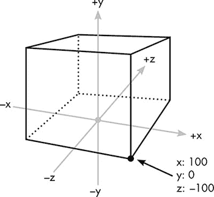

*图 4-22：三维空间中的一个盒子*

和 2D 图形一样，3D 图形的核心是将模型渲染成位图。产生最逼真效果的渲染方法通常需要最长的处理时间。电影 CGI 之所以令人印象深刻，主要是因为渲染器可以对每一帧进行非常长时间的处理，产生出高质量的效果，我称之为*电影级渲染*。本章将讨论电影级渲染的关键。然后，在第五章中，我们将讨论视频游戏的图形，并探讨当图像必须实时生成以响应用户交互时，许多这里展示的技术如何被修改、伪造或完全放弃。

#### *如何描述 3D 场景*

3D 模型和 2D 模型一样，是由线条和曲线构成的，但这些线条和曲线在三维空间中延伸，而不是二维空间。图 4-22 中的盒子是一个由八个点定义的非常简单的模型；而电影 CGI 中使用的模型通常非常复杂，由成百上千，甚至成万个点定义。与 2D 渲染一样，3D 渲染中的模型是通过局部坐标定义的。例如，位于图 4-22 中盒子角落的点，是相对于盒子底部的局部原点来定义的。

虽然 2D 渲染可以直接从局部坐标映射到屏幕坐标，3D 模型首先需要被放置到虚拟世界中的场景里，这个虚拟世界有自己称为*世界坐标*的坐标空间。设计一个 3D 场景就像是制作电影布景。我们可以在虚拟世界中放置任意数量的模型，任意大小和位置，渲染器可以计算出这些模型中所有位置的世界坐标。

引入另一种坐标系统可能看起来是多余的复杂性，但从长远来看，世界坐标实际上使得 3D 图形变得更加简单。例如，艺术家可以独立建模一个餐厅椅子，而不需要考虑它将被使用的场景中的其他模型。然后，艺术家可以复制这个单一的椅子模型，制作出餐厅场景所需的座位数量。此外，一个场景，像电影布景一样，不是为了产生单一的图像，而是为了创造一个将在多个角度的许多图像中展示的空间，正如我们在下一节中将看到的那样。

#### *虚拟相机*

在场景确定之后，接下来需要一个*视点*。在电影拍摄中，摄影师通过摆放摄像机和选择镜头来决定捕捉到的图像。在计算机生成图像（CGI）中，视点决定了如何将三维场景转换为二维渲染图像。

从三维到二维的转换被称为*投影*。为了更好地理解投影，考虑图 4-23，其中一个虚拟的金字塔从观看者的眼睛出发，观看者正在注视着桌子。一个半透明的网格位于观看者与场景之间的金字塔内。通过这个网格观看，观看者可以将三维桌面上每个可见的位置映射到二维网格上的一个特定方格。这就是投影，但不同的是，它不是由方格组成的网格，而是由位图中的像素组成的网格。

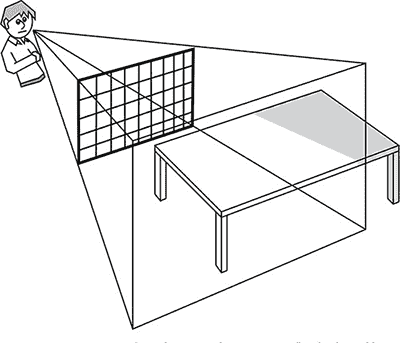

*图 4-23：将三维场景投影到平面显示屏上就像通过一个半透明的网格观看现实世界的场景。*

#### *直接照明*

投影有许多不同的方法，但电影质量的渲染中的投影方法是照明这一更大问题的一部分。虽然我们通常不会意识到，但我们对物体颜色的感知不仅仅取决于物体本身，还取决于我们观看物体时所处的照明条件。意识到这一点后，电影制作者会精心照亮他们的场景，以营造戏剧效果，但 CGI 中的照明问题更为根本。没有准确的场景照明模型，最终渲染的图像就无法显得真实。

为了理解这一点，让我们以一个简单的场景为例：一张黄色金属桌子放在绿色房间中，如图 4-24 所示。

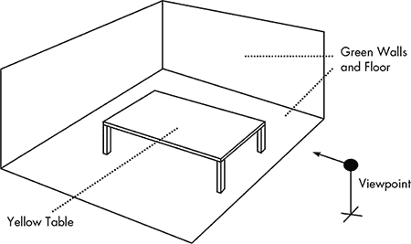

*图 4-24：一个三维场景*

从这个视点来看，一些像素将是“桌子”像素，而其他的将是“墙”或“地板”像素。一个简单的渲染器可能会将每个桌子像素着色为相同的黄色，而将其他所有像素着色为相同的绿色。但由于这种着色忽略了照明的影响，最终的图像将是平面的、不真实的。（这种色块会让图像看起来像动画片中的画格——一个有趣的效果，但不真实。）一个电影级别的渲染器需要一个*照明模型*，使得我们场景中的颜色受虚拟光源的影响。

CGI 渲染器建模的基本现实世界照明效应包括距离效应、漫反射和镜面反射。

##### 距离效应

为了理解距离效应，想象一盏纯白光的灯直接挂在桌子中央上方，正如图 4-25 所示。

光离桌子越近，桌面看起来就越亮。在物理世界中，这种效应是由光束随着远离光源而逐渐扩展造成的。光源越集中，光随距离的衰减越少——这也解释了为什么激光的高度集中光几乎不会衰减。

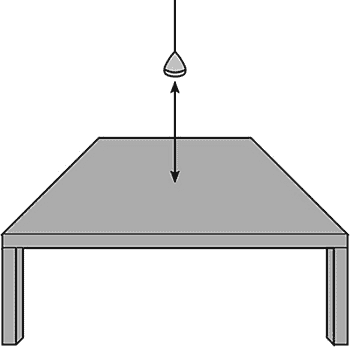

*图 4-25：光离表面越近，表面看起来就越亮。*

渲染器可以逼真地模拟距离效应，但它们也允许不现实的距离效应，以创造特定的外观或氛围。例如，在一个角色拿着火把穿过洞穴的场景中，灯光设计师会决定火把光是照得很远，还是几乎无法穿透黑暗。

我们将讨论的所有光照效应都允许这种类型的调整。虽然故意制造不现实的光照效果看起来可能很奇怪，特别是在光照模型的目的是为了创造一个现实的场景，但现实与观众对现实的预期之间有一个微妙而重要的区别。以不现实的方式使用光照是一种古老的电影技巧。例如，当一个角色在昏暗的卧室里打开台灯时，布景天花板上的舞台灯也会亮起，这样整个场景就被柔和地照亮了。如果没有额外的不现实光源，场景看起来就不对——它会显得太暗。以同样的方式，CGI 光照模型允许对其控制进行微调，产生略显不正确但感觉正确的效果。

##### 漫反射效应

正对着表面照射的光看起来比从锐角照射的光要亮。在图 4-26 中，桌子中央看起来比角落更亮，或者说更偏黄。

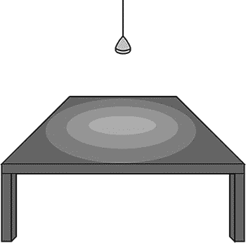

*图 4-26：漫反射光照取决于光线照射表面的角度。*

这部分是由于距离效应——中心离台灯比角落更近——但主要是由于*漫反射*效应，这是由光的*入射角*变化引起的亮度变化。在图 4-27 中，实线表示入射光线，而虚线表示反射光线。正如你所看到的，光线在 B 点的入射角远大于 A 点，因此 B 点看起来比 A 点更亮。但请注意，*观察角度*或*反射角*对漫反射效应没有影响。因此，A 点对两个观察者来说看起来是一样的，B 点也是如此。

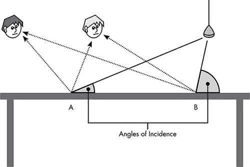

*图 4-27：漫反射光照的亮度会根据光线照射表面的角度变化，但从所有视角来看是一样的。*

##### 镜面反射效应

由于金属桌面具有高度的反射性，它部分地起到了镜子的作用。与任何镜子一样，镜子中看到的内容取决于与观察角度相对的物体位置。图 4-28 显示了桌面上的一个亮点，那里悬挂的灯与我们的视角处于相对角度，大约位于桌子中心和最近边缘之间。由于这个亮点是白色灯泡的镜面反射，这个亮点将是白色的。

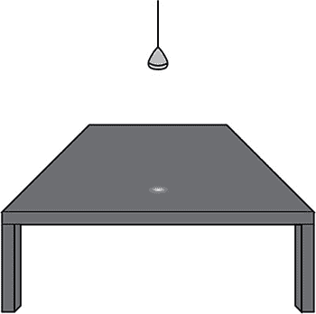

*图 4-28：镜面光照依赖于光线击中表面的角度和观察角度。*

这些闪亮的点被称为*镜面反射*，出现在光线的入射角与反射角匹配的地方。图 4-29 显示了两个不同视角下镜面反射的位置；注意每条光线的反射角与它击中桌面的角度相同。两位观察者都能看到桌面上的亮点，但他们看到的亮点位置不同。

在现实世界中，一些材料的反射方式与其他材料不同。像塑料这样光滑的材料具有较高的镜面反射，而像棉布这样哑光的材料则具有更多的漫反射。CGI 光照模型允许艺术家为模型上的每个表面设置不同的反射属性，以匹配真实世界材料的外观。

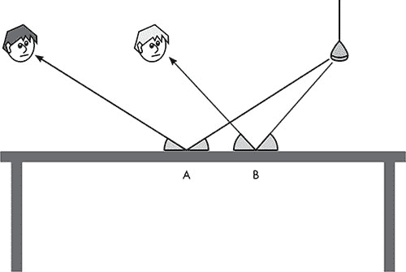

*图 4-29：桌面上的镜面光照在不同视角下出现在不同位置。*

#### *全局光照*

到目前为止，我们讨论的是*直接光照*，即光线直接从光源照射到表面。在现实中，物体的颜色受到周围每个物体颜色的影响。在白色墙壁的房间里，一张浅棕色沙发看起来与蓝色墙壁的房间里的沙发非常不同，因为沙发会从墙壁反射的光线中获得微妙的色调。这就是*间接光照*，为了使计算机生成的图像看起来真实，它必须考虑到这种效果。一个考虑到场景中所有光源，包括直接光和间接光的光照模型，被称为*全局光照模型*。

一个间接光照的例子见于图 4-30。假设灯泡发出纯白色光线。光束首先照射到一面涂成青色（浅蓝色）的墙上。墙面反射的光线同样是青色的，当反射的青色光线照射到黄色地毯上时，反射光的结果变成了绿色。因此，颜色的反射造成了黄色地毯上微妙的绿色调。这一系列颜色变化是由*减色法*引起的，在减色法中，混合颜色会导致更深的色调，就像彩色喷墨打印机通过混合青色、黄色和品红色墨水来制造不同的色调一样。减色法与我们在本章早些时候讨论的加色 RGB 系统相反，在加色法中，混合颜色会产生更亮的颜色。

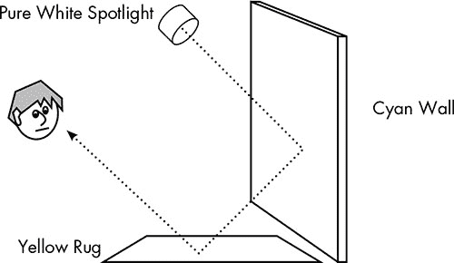

*图 4-30：光线在多个表面上反射影响其表观颜色。*

#### *光线如何被追踪*

全局光照模型似乎要求追踪光束在场景中反弹的路径。那么，一个简单的渲染器可能会使用三维坐标数学来追踪每一束光线从每个光源出发，在表面之间反射的路径。然而，这样做会浪费大量的计算工作，因为它会计算场景中每个表面的颜色——包括那些观察者无法看到的表面，比如那些位于视野之外、被其他物体遮挡或背向观察点的表面。

##### 为什么光线是逆向追踪的

渲染器通过从观察点逆向追踪光线进入场景来避免这种低效的做法，这一技术被称为*光线追踪*。在光线追踪中，一条假想的光线从观察点出发，穿过像素网格中每个方块的中心，如图 4-31 所示。场景中每个模型的几何形状与这条假想的光线进行比较，看它们是否相交。离观察点最近的交点表示该像素的可见表面，并决定该像素的颜色。请注意，这种投影方法与图 4-23 的解释非常相似。

接下来，从这个已知的可见点向外追踪更多的光线。目标是发现哪些光线最终到达光源，可能是直接到达，也可能是经过其他物体反射后到达。如图 4-31 所示，镜面反射只追踪每次撞击后的反弹，且反弹角度与入射角相同，而漫反射则会在随机方向上追踪多条光线。当漫反射光束撞击其他物体时，会产生更多的漫反射，这意味着随着过程的持续，追踪的路径数目会不断增加。渲染器会应用一个截止值来限制每条光线的反弹次数。

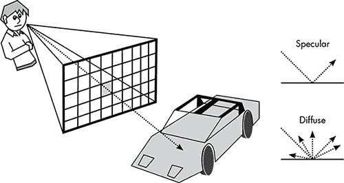

*图 4-31：从观察点出发，沿着阴影像素的中心追踪光束，直到它到达场景中的模型。要确定镜面光照，光线按照与入射角相同的角度反弹；而对于漫反射光照，它会在多个随机角度反弹。*

##### 光线追踪如何模拟现实世界的效果

尽管光线追踪对于计算机网络来说是一项繁重的工作，但该方法能够准确地模拟许多现实世界的视觉效果。

其中一个效果是半透明效果。虽然可以通过为像素分配较低的 alpha 值使位图变得半透明，但对于像玻璃这样的透明材料，这并不是全部。例如，一只玻璃杯不仅仅允许光线通过它，还会扭曲其后面的物体，正如图 4-32 所示。

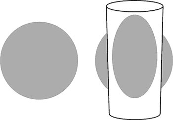

*图 4-32：弯曲玻璃的光学畸变*

光线追踪渲染器可以根据光学定律折射光束，当它们穿过半透明的材料时。这不仅可以让渲染器在计算机生成图像中模拟玻璃，还能帮助再现透明材料和液体（如水）的扭曲效果。

光线追踪还可以扩展到模拟相机镜头。通常，计算机生成的图像中的所有物体都是完美对焦的。然而，在电影镜头拍摄的图像中，只有与相机有一定距离的物体是清晰对焦的，离该距离越远的物体则变得越模糊。虽然有人可能认为将所有物体都对焦是计算机生成图像的*优点*，但熟练的电影摄影师会使用选择性对焦来帮助讲述故事。在图 4-33 中，吉米·斯图尔特和格蕾丝·凯利在前景中是对焦的，而背景中的公寓则模糊不清；观众的注意力被引导到演员身上，但远处的开阔背景则微妙地提醒着观众，这个庭院中的公寓彼此是多么显眼——这是电影中的一个重要细节。因为电影观众已经习惯了通过对焦来获取场景的深度信息，所以计算机生成的图像和电影通常必须模拟摄影镜头的使用，以匹配观众的预期。

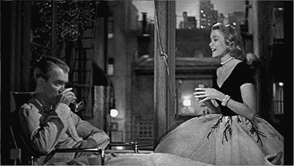

*图 4-33：*《后窗》*中的焦点深度（派拉蒙影业/帕特龙公司，1954 年）*

阴影是现实感强的计算机生成图像的另一个关键组成部分。光线追踪自然地产生阴影，如图 4-34 所示。因为没有光束能够照射到阴影区域，所以从观察视点追溯回来的光束也无法到达光源，因此该区域将保持黑暗。

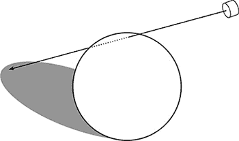

*图 4-34：追踪光束自然地渲染阴影。*

光线追踪还可以通过为材质设置非常高的镜面反射属性，来模拟高度反射的表面。例如，当你站在一个光线充足的房间里，而外面是黑暗的时候，房间的景象就会清晰地反射在窗户上。

因此，尽管光线追踪在计算上要求较高，但添加这些真实世界效果并不会增加太多额外工作，而且这些效果大大增强了最终图像的真实感。在下一章中，你将看到视频游戏如何在实时渲染中渲染反射表面和阴影效果，当光线追踪不可用时。一些效果，比如玻璃扭曲，通常在实时渲染中是无法实现的；时间根本不够。

#### *全场景抗锯齿*

尽管光线追踪渲染的图像可以非常震撼，但它们也可能遭遇我们在 2D 图形中看到的相同的别名问题。每当一个物体位于另一个物体的前面时，每条投射的光束要么会撞击前景物体，要么会错过并撞击位于物体后面的东西。图 4-35 展示了一把椅子和地毯的视图。这个视图中，椅子座位边缘附近投射的光束要么会撞击椅子，要么会撞击地毯，从而将相关像素的颜色赋予椅子或地毯的表面。这导致了我们在 2D 图像中看到的锯齿状边缘。

渲染器可以通过对整张图像应用抗锯齿来避免锯齿现象。有许多*全屏抗锯齿*方法，但在光线追踪中，直接的抗锯齿方式是从视点投射比必要更多的光束。例如，不仅仅在每个像素的中心发送一束光，渲染器还可能向像素中心之间的空隙发送光束。在确定每束光的颜色后，每个像素的最终颜色是通过将中心光束的颜色与邻近角落的光束颜色混合而得到的。图像中沿着边缘的像素因此会被分配中间色，避免了锯齿状的“阶梯”效应。

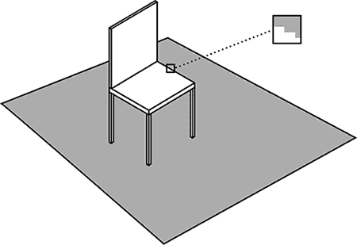

*图 4-35：在高亮区域中，每条光束轨迹要么结束在椅子上，要么结束在地毯上，导致锯齿状的效果。*

图 4-36 展示了这一思想。每个圆圈代表一条投射到场景中的光束。像素的颜色是基于每个像素中心和角落颜色的平均值，这导致了右侧显示的抗锯齿边缘。可以追踪更多的光束以获得更好的效果，但代价是更多的处理时间。

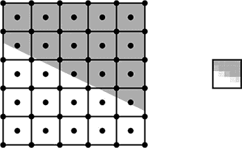

*图 4-36：每个像素的最终颜色是从五条光束追踪到场景中的混合结果，中心一条和四个角落的光束。*

### 结合真实与虚拟

在一部完全由计算机动画制作的电影中，渲染是制作每帧的最后一步，但当计算机生成图像（CGI）融入到真人电影中时，还有更多的工作需要完成。例如，假设有一个场景，其中一只计算机生成的*暴龙*在真实的草地上徘徊。

为了实现这一点，我们首先需要两组数字图像序列。一组显示草地场景，可能是用数字相机拍摄，或者是用传统胶片相机拍摄后再扫描成数字格式。无论哪种方式，摄像机的运动是由计算机控制的，这样可以确保摄像机的运动与另一组序列中虚拟摄像机的运动精确匹配，即计算机生成的恐龙动画。

接下来，两个序列逐帧合成，这个过程叫做*数字合成*。尽管恐龙序列是通过 3D 模型制作的，但此时两个序列都只是二维位图，并通过与在图 4-18 中将我们的“虫人”叠加到日落背景上的方法相同的方式进行合成。通过使用 alpha 混合技术，每一帧中恐龙的边缘与草地背景的边缘平滑融合。如果没有这种融合，恐龙的边缘就会像气象主播站在五天天气预报前一样，出现闪烁的边缘。

数字合成在现代电影制作中被广泛应用，即使没有涉及计算机生成图像的情况下，例如在*溶解效果*（一种场景平滑过渡到下一个场景的过渡效果）中。以前，溶解效果是通过一种叫做*光学打印机*的设备制作的，该设备将相机对准一个屏幕，多个投影仪的图像会被投射到这个屏幕上。相机会拍摄一部新影片，将投影出来的影像结合在一起。通过调节一个投影仪的光线亮度同时调节另一个投影仪的光线亮度，就可以实现溶解效果。虽然效果可接受，但你总能在电影中辨别出光学打印机的镜头，因为第二代影像会比影片其他部分模糊。现在，溶解效果、叠加标题以及各种你可能不会认为是“特效”的电影效果，都通过数字合成来完成。

### 电影级渲染的理想

当本章描述的所有高级渲染技术结合在一起时，效果可以是令人惊叹的现实主义、极具风格化的，或者介于两者之间。CGI 的唯一真正限制是时间，但这是一个巨大的限制。事实上，我所说的电影级渲染即使对于好莱坞来说，也可能是一个难以达到的理想。虽然电影制作可能需要几年时间，但每一帧的时间分配是有限的。以皮克斯的计算机动画电影*WALL-E*为例，这部时长 98 分钟的电影需要渲染超过 14 万张高分辨率的计算机图像。如果皮克斯想在两年内完成*WALL-E*的所有图像制作，那么它平均每 8 分钟就需要渲染一张图像。

即使在一个联网的“渲染农场”中，八分钟也不足以为每一张图像使用光线追踪、全局光照、玻璃折射以及其他所有高端技术。面对这些实际的限制，电影制作人会挑选和选择在每个镜头中使用哪些技术，以最大化视觉冲击力。当需要理想渲染时，时间就会花费，但当最佳效果不影响观感或者预算无法承受时，它们就不会被使用。皮克斯使用的渲染器——一款名为 RenderMan 的程序，最初由卢卡斯影业开发——可以放弃光线追踪及其庞大的计算量，但这意味着许多提升真实感的效果必须通过其他方式来实现。

那么，这是如何做到的呢？在没有光线追踪的情况下渲染图像需要哪些技巧——这些图像可能不完全真实，但依然令人惊叹？为了回答这个问题，我们将从好莱坞转向视频游戏的世界，在那里渲染面临着极端的时间限制。多么极端呢？如果八分钟都不足以产生理想渲染，试想在不到 20 *毫秒*的时间里渲染一张图像。下一章，我们将看到视频游戏是如何在短时间内制作出精彩图形的。
