## 5

**游戏图形**

现代视频游戏就像现代电影一样——一项大型制作，涉及许多不同技术领域的专业知识。程序员团队开发音频、人工智能、网络连接等方面的代码。不过，您在玩视频游戏时首先注意到的还是图形。

早期的视频游戏系统，如雅达利 2600 和世嘉 Genesis，依赖于预制的位图图形；也就是说，没有渲染，甚至没有上一章中提到的 2D 渲染。相反，如果一款视频游戏需要展示游戏中的英雄走路，艺术家会绘制几个位图，并按顺序重复显示。背景也是手绘的。显示分辨率低，且仅提供少量像素颜色选择。

随着显示质量的提高，游戏开发者转向其他技术来生成位图。像*真人快打*这样的格斗游戏会扫描特技演员的服装照，或至少使用这些照片作为参考。在这一时期，一些游戏确实使用了渲染图形，但并非实时渲染；相反，它们会在更强大的系统上花费较长时间预渲染这些位图。我们今天所知道的 3D 游戏在当时是鲜为人知的，只在少数早期实验中存在。

这种情况在 1990 年代中期开始发生变化。像索尼 PlayStation 这样的游戏主机是围绕 3D 图形能力而非位图构建的。PC 玩家开始购买当时被称为*图形加速器*的插件硬件，帮助创建 3D 图形。与今天的游戏相比，那些早期的 3D 游戏在图形和其他方面都显得粗糙。此外，由于微软尚未构建 DirectX——游戏软件和图形硬件之间的标准化接口——这意味着游戏必须包含不同的代码，以适配每个制造商的图形加速器，因此很少有 3D 游戏会为 PC 制作。

尽管如此，玩家们对新兴的 3D 游戏着迷，每一代图形硬件的性能都远远超越了前一代。在*过场动画*——短小的预渲染视频，通常在游戏开始时设置场景，或者在游戏中的关键时刻推动情节发展——这一代际飞跃中，这种变化尤为明显。由于这些视频是在昂贵硬件上预渲染的，就像我们在第四章中讨论的电影 CGI 一样，早期的过场动画比实际游戏中的图形要令人印象深刻得多。然而，随着硬件的进步，游戏画面开始与甚至超越早期游戏的过场动画效果。

如今，很少有游戏使用预渲染的过场动画。虽然游戏仍然可能包含非互动的“电影”场景来设置或推动情节发展，但这些场景更可能是实时渲染的，就像游戏的其余部分一样。这是因为实时渲染效果已经非常好，游戏开发者不再认为做其他处理是值得的。

我认为，这就是为什么我觉得电子游戏图形如此令人惊叹的原因。它们看起来和我在早期视频游戏中看到的预渲染图形一样好，甚至更好，或者说像早期的 CGI 电影一样，而且它们是在实时生成的。这两个词——*实时*——看起来无害，但它们包含了游戏渲染器面临的巨大挑战。用数字来说：如果你的典型玩家希望获得 60 帧每秒的刷新率，那么每一帧图像必须在仅仅¹/[60]秒内渲染完成。

### 实时图形的硬件

实时图形质量的提升与图形硬件的进步密切相关。今天的图形硬件非常强大，并且针对 3D 图形渲染中的任务进行了优化。尽管本书是关于软件的，但简要讨论硬件是必要的，因为这有助于理解为什么游戏图形是以这种方式运作的。

计算机或视频游戏主机中的主要处理器是*中央处理单元（CPU）*。这些处理器可能有多个*核心*，即独立的处理子单元。可以把一个核心想象成一个办公室工作人员。CPU 内部的核心就像是快速且受过广泛训练的工人。它们擅长做几乎任何任务，并且非常迅速。然而，它们的成本太高，因此通常只能拥有少数几个核心，通常是八个或更少，尽管这个数字会继续增加。

相比之下，*图形处理单元（GPU）*会拥有数百个甚至上千个核心。这些核心比 CPU 内的核心更简单，每个核心的速度也更慢。可以把它们看作是只能做少数几项任务并且完成得不特别快的工人，但它们的成本非常低廉，以至于可以拥有大量的它们。这种硬件设计方法被采用，是因为单个核心的速度提升已经有限。尽管每一代核心的原始速度有所提升，但仍然远不足以缩小性能差距，无法支持高质量的实时渲染；唯一的解决方案就是更多的核心。

因此，CPU 擅长那些必须按特定顺序完成的任务，就像填报税表一样。而 GPU 则更适合那些可以轻松分配给许多工人的任务，就像粉刷房子的外墙一样。游戏渲染器的设计就是要尽可能让所有 GPU 核心保持忙碌。

### 为什么游戏不使用光线追踪

我们在前一章中看到，光线追踪可以产生惊人的图形。但游戏不会使用光线追踪，因为它对于实时渲染来说太慢了。其原因有很多。

其中一个原因是光线追踪与“工人军团”GPU 设计不太匹配。例如，光线追踪为每个像素发射一束光线，确定光线的撞击点，然后从撞击点发射更多的光线，继续确定它们的撞击点，依此类推。这个过程更适合由 CPU 来处理，因为渲染器必须在知道接下来要检查哪些光线之前，先确定每个撞击点的位置。

更广泛来说，实时渲染应该把计算资源集中在那些对观众有显著影响的地方。试想一个计算机生成的场景，你站在一个抛光木地板上的椅子前面。一种光线追踪技术会让光线在房间里反弹，从而间接确定椅子背面的每个点的颜色，因为这些数据对于地板的全局光照是必要的。然而，游戏渲染器不可能有这种奢侈，去为一个不会被直接看到的表面上色。

### 只有线条，没有曲线

为了理解视频游戏是如何在没有光线追踪的情况下进行渲染的，我们从游戏图形的基本构建块——三角形开始。在上一章中，我们了解了电影中的 CGI 模型是由线条和曲线构成的。在游戏渲染中，模型通常完全由线条构成。如果你记得高中代数中画抛物线的情景，你会意识到，描述曲线的数学比描述线条的数学复杂得多，而在游戏中根本没有足够的时间来处理曲线。这就是为什么游戏渲染器使用线条，而这意味着由控制点定义的表面是平坦的。最简单的平面表面是三角形，它由空间中的三个点定义。

三角形在游戏中无处不在。在一款游戏中，无论你以为自己看到的是什么，实际上你看到的都是成千上万的三角形，这些三角形通过角度连接在一起，形成表面和形状。渲染中使用的三角形通常被统称为*多边形*，尽管几乎所有的多边形都是简单的三角形。

游戏通过使用大量的三角形来模拟曲面。例如，一个圆形的玻璃杯可以被近似为一个由相互连接的三角形组成的环形，如图 5-1 所示。右侧显示了每个三角形的轮廓，以便更清晰地展示。

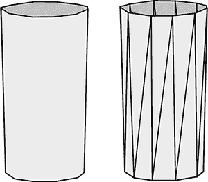

*图 5-1：用三角形近似的圆形玻璃杯*

### 没有光线追踪的投影

为了渲染场景模型中的三角形，渲染器必须将定义三角形的控制点投影到屏幕上。光线追踪通过沿着每个像素中心的虚拟光束进行投影，但在这种情况下，我们必须采取不同的方式。

好消息是，世界坐标和屏幕坐标之间存在直接的数学关系，这使得映射点变得相当简单。我们知道视点的位置信息——x、y 和 z 的世界坐标——以及我们想要投影的模型点的位置。我们还知道虚拟投影屏幕的位置。图 5-2 展示了我们如何利用这些位置信息来确定视线与模型点对准的线穿过投影屏幕时的确切 y 坐标。在这个例子中，投影屏幕的深度（即视点沿 z 坐标的距离）是视点到模型点的深度的四分之三，底部的大块区域就是这种比例的体现。知道这个比例后，我们就能计算出投影点的 x 和 y 坐标。投影点的 y 坐标是视点的 y 坐标与模型点的 y 坐标之间距离的四分之一，如投影屏幕上的阴影框所示。此外，尽管从图 5-2 的角度看不出来，投影点的 x 坐标将是视点和模型点的 x 坐标之间距离的四分之一。

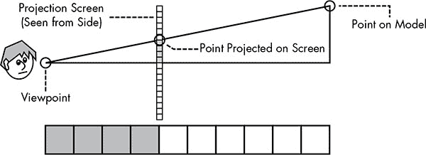

*图 5-2：将虚拟世界中的点投影到屏幕上*

请注意，虚拟世界中假想的投影屏幕的位置会影响最终的投影效果。为了观察这种效果，可以用双手的食指和拇指做一个矩形框，然后看着它，双手靠近眼睛再逐渐远离。双手离眼睛越远，*视野越狭窄*。同理，游戏可以通过改变虚拟世界中视点和投影屏幕之间的距离来调整视野。例如，允许玩家通过望远镜或瞄准镜查看的游戏，通过将投影屏幕移得更深来实现缩放效果。

### 渲染三角形

当三角形的三个顶点都位于屏幕空间时，渲染三角形遵循我们在第四章中看到的相同光栅化过程，将 2D 模型转换为位图。在图 5-3 中，三角形边界内的像素中心被填充为灰色。

从阅读上一章，你可能会对这种简单的三角形渲染方法提出一些异议。首先，为什么我们仅仅把每个像素都填充相同的颜色——那所有的光照效果怎么办？其次，看看那些锯齿状的边缘——我们该如何去除它们？

*图 5-3：通过定位三角形的顶点，可以渲染该三角形。*

这些问题将会得到解答，但首先我们必须处理一个更基本的问题。仅仅确定每个三角形在屏幕上的位置并给它的像素上色是行不通的，因为屏幕上的每个像素可能会位于多个三角形之内。考虑图 5-4 所示的图像。花盆位于一个立方体后面，而立方体又位于一个高杯子后面。像素 A 位于四个不同的三角形内：杯子前面一个、杯子背面一个、立方体前面一个和立方体侧面一个。同样，四个三角形也包围着像素 B。在每种情况下，实际上只有一个三角形应该决定该像素的颜色。为了正确渲染图像，渲染器必须始终将每个像素映射到场景中距离视点最近的模型表面。光线追踪已经找到了光束与场景中模型之间最近的交点，因此这个问题无需额外努力就能处理。然而，如果没有光线追踪，渲染器应该怎么办呢？

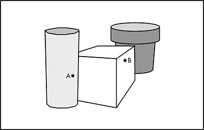

*图 5-4：场景中三个重叠的模型*

#### *画家算法*

一种简单的解决方案被称为*画家算法*。首先，按照距离视点的远近顺序对场景中的所有三角形进行排序。然后，模型按从后到前的顺序“绘制”，就像 Bob Ross 在*《绘画的乐趣》*中绘制风景一样。这个算法对程序员来说很容易实现，但它也有几个问题。

首先，它非常低效：渲染器会一遍又一遍地给相同的像素上色，因为前景模型会覆盖在之前的背景模型之上，这浪费了大量的计算资源。

其次，它不容易进行细分以保持 GPU 上的工作单元忙碌。画家算法要求模型按特定顺序绘制，因此很难将工作有效地分配给不同的处理单元。

第三，通常没有简单的方法来确定两个三角形中哪个离视点更远。图 5-5 显示了两个三角形的透视图，数字表示每个顶点的深度。顶视图清楚地显示了哪个三角形位于前面，但由于一个三角形的顶点深度介于另一个三角形的顶点之间，通过直接比较顶点深度无法轻松确定哪个三角形更接近。

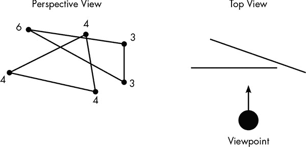

*图 5-5：两个三角形的透视图和顶视图*

#### *深度缓冲*

由于画家算法的种种不足，游戏中最常见的投影解决方案是称为*深度缓冲*的方法。如前一章所介绍，计算机图形需要一个位图，称为显示缓冲，用来存储显示中每个像素的颜色。此技术还使用一个相应的*深度缓冲*来跟踪每个像素的深度——即它离视点的远近。当然，屏幕是平的，所以像素实际上没有深度。深度缓冲实际存储的是用于确定该像素颜色的场景中某一点的深度。这使得渲染器可以按任何顺序处理场景中的物体。

这是深度缓冲如何在图 5-4 的示例场景中工作的。最初，每个像素的深度会被设置为一个大于场景中任何实际物体深度的最大值——假设为 100,000 虚拟英尺。如果杯子首先被绘制，则该像素在深度缓冲中的深度会设置为对应的视点距离。假设花盆接着被绘制，渲染器则设置其像素的深度。我们可以将深度缓冲想象为一幅灰度图像，其中像素离视点越近，颜色越深。此时的深度缓冲如图 5-6 所示。

深度缓冲解决了将正确的点投影到像素上的问题。在渲染一个像素之前，渲染器会检查该像素位置的深度缓冲值，以确定新像素是否在已经显示缓冲中的像素之前或之后。当新像素出现在显示缓冲中的该位置并且位于现有像素后面时，渲染器会跳过该像素并继续处理。继续我们的示例，当立方体被绘制时，立方体左侧与杯子重叠的像素不会被绘制，因为深度缓冲中的值显示杯子的像素在立方体前面。立方体会覆盖花盆的像素，因为花盆像素的深度大于立方体的深度。

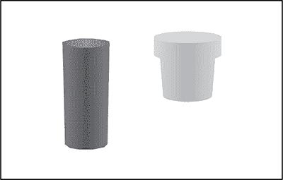

*图 5-6：一个绘制了两个物体的深度缓冲。颜色越深表示离视点越近。*

深度缓冲是一种高效的投影解决方案，因为它减少了不必要的工作。模型可以大致按顺序预排序，使它们大致按照从前到后的顺序进行绘制，以最小化被覆盖的像素。此外，由于深度缓冲允许以任何顺序渲染模型，因此工作可以更容易地在图形处理器的各个核心之间分配。在我们的示例中，不同的核心可以同时处理杯子、立方体和花盆，而最终渲染的图像中每个像素都会正确地投影到相应的模型上。

### 实时光照

现在渲染器已经知道每个像素属于哪个三角形，接下来必须给像素上色。在实时渲染中，这个过程被称为*像素着色*。一旦某个像素通过深度缓冲测试，所有用于给像素上色的数据都会通过一种叫做像素着色器的算法进行处理。因为每个像素都可以独立上色，所以像素着色是保持 GPU 内部大量处理单元忙碌的一个好方法。

着色器所需的数据会根据光照模型的复杂度而有所不同，包括场景中光源的位置、方向和颜色。没有像光线追踪这样的技术，就无法实现完整的全局光照模型，其中近距离表面之间的反射会相互影响。然而，着色器可以包含距离、漫反射和镜面反射的基本效果。

在图 5-7 中，代表光线的实线箭头从三角形上反射。虚线箭头表示该位置的*法线*（或*表面法线*）；法线只是一个指向远离表面的垂直线。在第四章中，我们学到了光线、表面和视点之间的角度如何影响漫反射和镜面反射。像素着色器使用法线进行这些计算；因此，例如，在图 5-7 中，如果深色箭头表示光线，那么由于光线与法线之间的角度较小，它将有较高的漫反射。

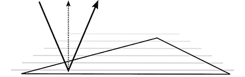

*图 5-7：三角形的表面法线（虚线箭头）与三角形表面垂直，光线（实线箭头）照射到表面。*

在图 5-7 中，法线方向垂直向上，意味着它与三角形平面垂直。每个表面点的法线都垂直向上的三角形是完全平坦的，这使得每个三角形在渲染时都清晰可见。例如，在图 5-8 中，带有垂直向上法线的酒杯看起来像一颗宝石一样棱角分明。

为了获得更圆滑的外观，法线如图 5-9 所示被弯曲。这里，角落处的法线向外弯曲，三角形内部任意位置的法线是角落法线的加权平均。由于光线照射点的法线不再垂直向上，光线的反射变得更加尖锐。如果这属于漫反射光照计算，最终的颜色将会更亮。

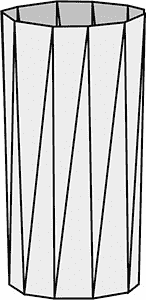

*图 5-8：如果三角形上每个位置的法线方向相同，那么该模型将被渲染为一系列平坦的三角形。*

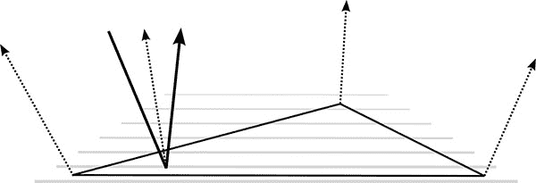

*图 5-9：光照影响点的法线会受到弯曲角法线的影响，从而改变反射角度。*

弯曲法线允许平面三角形像图 5-10 中的弯曲三角形那样反射光线。

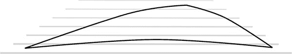

*图 5-10：弯曲法线使得三角形在光照计算中呈现弯曲的形状。*

然而，这种方法仅仅解决了一部分问题，因为底层形状没有改变。弯曲法线并不会影响哪些像素与哪个三角形匹配；它仅影响像素着色器中的光照计算。因此，幻觉会在模型的边缘处崩溃。在我们的杯子模型中，弯曲法线帮助杯子的侧面看起来平滑，但它并不影响杯子的轮廓，杯口依然是由一系列直线组成的。更平滑的模型渲染需要额外的技术，我们将在本章后面看到这些技术。

### 阴影

阴影在通过赋予模型重量和现实感来说服观众接受图像的真实性方面发挥着重要作用。产生阴影需要追踪光线束；毕竟，阴影是位于光源和表面之间的物体轮廓。游戏渲染器没有时间进行完整的光线追踪，因此它们使用巧妙的捷径来产生令人信服的阴影效果。

考虑图 5-11 中显示的场景轮廓。这个场景将在夜间环境中渲染，因此左侧的路灯将投下强烈的阴影。为了正确渲染阴影，渲染器必须确定从这个视角可见的哪些像素会被路灯照亮，哪些则只会被其他光源照亮。在这个例子中，渲染器必须确定标记为 Scene-A 的点不可见于路灯，但 Scene-B 是可见的。

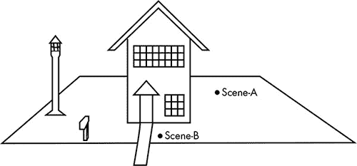

*图 5-11：路灯的光线应该在这个场景中投下阴影。*

游戏中常见的解决方案是*阴影贴图*，这是一种从光源视角快速渲染的图像，仅计算深度缓冲区，而不计算显示缓冲区。图 5-12 是图 5-11 中路灯的阴影贴图，显示了路灯与场景中每个点之间的距离；与深度缓冲区一样，这以灰度显示，距离较近的像素颜色较暗。

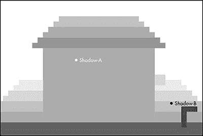

*图 5-12：来自路灯视角的深度缓冲区渲染图*

阴影贴图会为每个光源在场景像素上色之前生成。当为像素上色时，像素着色器会检查每个光源的阴影贴图，以确定被渲染的点是否从该光源可见。考虑图 5-11 中的场景 A 和场景 B 的点。着色器计算每个点到路灯顶部的距离，并将这个距离与投影到阴影贴图上的同一位置的深度进行比较，在图 5-12 中分别标记为阴影 A 和阴影 B。在这个例子中，图 5-12 中阴影 A 的深度小于图 5-11 中场景 A 到路灯的距离，这意味着有东西挡住了光线，光线无法到达场景 A。相比之下，阴影 B 的深度与场景 B 到路灯的距离一致。因此，场景 A 处于阴影中，而场景 B 则没有。

我故意让图 5-12 中的阴影贴图呈现块状外观；为了提高性能，阴影贴图通常会以较低的分辨率生成，从而产生块状阴影。如果一款游戏提供了“阴影质量”设置，这个设置很可能控制阴影贴图的分辨率。

### 环境光与环境遮蔽

实时渲染中的简单光照模型通常会产生过于昏暗的图像。我们很容易忽视周围环境中间接光照的影响。例如，站在白天的户外，即使站在完全的阴影中，你也有足够的光线阅读，因为间接阳光会从附近的表面反射过来。

为了产生自然光照效果，游戏渲染器通常会应用一个简单的*环境光*模型。这种光照是无处不在的，它照亮每个模型的表面，而不考虑光束或入射角度，因此即使是被场景光照遗漏的表面也不会完全黑暗。环境光在游戏中广泛使用，即使是在室内场景中也是如此。这是一种小小的“伪造”能够产生更真实效果的情况。

环境光还可以用来调整场景的氛围。在像*魔兽世界*这样的开放世界游戏中，当你从金黄的秋日田野进入昏暗的森林时，一个重要的效果就是环境光从明亮的黄色变为昏暗的蓝色。

尽管简单的环境光模型使得渲染效果不会太暗，但这种方法并不产生阴影，损害了场景的真实感。*环境遮蔽*方法通过模拟阴影的形成位置来伪造来自环境光的阴影，基于这样的观察：这些阴影应该出现在缝隙、裂缝、洞口等地方。图 5-13 展示了这一关键思路。点 A 的遮蔽程度远低于点 B，因为光线能够照射到该点的角度更大，从而让更多的光线通过。因此，环境光应该对点 A 的影响大于点 B。

然而，为了让渲染器精确测量遮挡，它必须向每个方向发射光线，类似于漫反射光照中的光散射，但我们已经知道，对于实时渲染来说，追踪光线并不是一种可行的选择。相反，一种叫做*屏幕空间环境遮挡（SSAO）*的技术，在主要渲染完成后，利用渲染过程中已计算的数据近似每个像素的遮挡量。

在图 5-14 中，我们可以看到 SSAO 近似的实际应用。请注意，视点是直接向下看表面。虚线箭头表示表面某一点的法线。灰色区域是与该法线对齐的半球，在此二维表示中呈半圆形。着色器检查半球内散布的点。每个点都被投影到屏幕坐标中，就像图 5-2 中所示的模型点投影一样。然后，点的深度与该像素位置的深度缓冲进行比较，这告诉着色器该点是位于模型表面前面（白色）还是后面（黑色）。位于表面后面的点的百分比是环境遮挡量的一个良好近似。

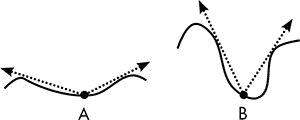

*图 5-13：在给定点测量遮挡情况*

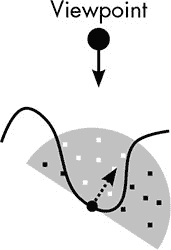

*图 5-14：屏幕空间环境遮挡通过表面后方点的百分比近似遮挡程度*

SSAO 对渲染器来说是一项繁重的工作，因为它需要投影和检查大量额外的点——每个像素至少需要 16 个点才能获得可接受的结果。然而，每个像素的计算是独立的，这使得这些工作能够轻松地分配给大量的工作核心。如果玩家的硬件足够强大，SSAO 可以产生可信的环境阴影效果。

### 纹理映射

在这些关于图形的讨论中，我们一直假设模型的表面是单一的颜色，但实际上这种情况在真实世界中很少见。老虎有条纹，地毯有图案，木材有纹理，等等。为了重现复杂颜色的表面，像素着色器使用*纹理映射*，它从概念上将一张平面图像包裹到模型的表面上，就像城市公交车侧面的广告覆盖一样。需要明确的是，纹理映射不仅仅用于游戏渲染；电影 CGI 也广泛使用它。但纹理映射对于游戏来说是一个特殊的问题，因为纹理必须在毫秒级别内应用。为了渲染一个帧所需的纹理和纹理操作的数量，构成了游戏渲染中的最大挑战之一。

图 5-15 展示了一幅纹理位图（一个锯齿形图案的图像）和一个应用了该图案的场景。用于纹理映射的位图图像称为*纹理*。在这个案例中，地毯矩形的表面覆盖了一个大纹理，尽管对于像地毯上这种规则图案的纹理，也可以使用较小的纹理并重复应用，铺满整个表面。

像素着色器负责使用相关纹理选择像素的基础颜色；这个基础颜色之后会被光照模型修改。由于纹理表面与视点之间的距离和方向是任意的，因此纹理中的像素与模型表面上的像素之间并没有一一对应关系。在纹理区域内根据应用的纹理选择像素颜色的过程被称为*采样*。

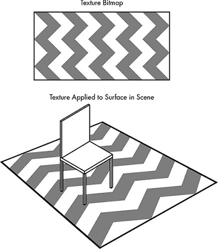

*图 5-15：纹理映射。顶部的锯齿形纹理应用于椅子下的地毯对象。*

为了说明采样过程中涉及的决策，让我们从图 5-16 中显示的戴帽子机器人的位图开始。纹理中的像素称为*纹理元素（texels）*。这个 20×20 的纹理包含 400 个纹理元素。

在这个例子中，这个纹理将作为墙上画框中的一幅画出现，见图 5-17。

假设框架内的区域填充了渲染图像中的一个 10×10 像素块。纹理将直接应用于图像上，而不进行透视调整，这意味着渲染器只需将 20×20 的纹理元素块缩小到适应最终图像中的 10×10 像素块。

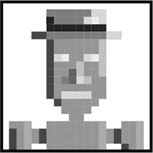

*图 5-16：一个戴帽子的机器人纹理*

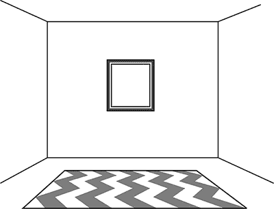

*图 5-17：在这个场景中，图 5-16 中的纹理将应用于墙上画框内。*

#### *最近邻采样*

由于需要 10×10 个像素来填充纹理区域，我们可以想象在纹理上覆盖了一张 100 个采样点的网格。图 5-18 展示了图 5-16 中原始机器人纹理的局部放大部分。这里，纹理元素的中心被显示为方块，而十字标记表示场景中像素的采样点。采样解决了纹理元素与像素之间的这种不匹配问题。

最简单的采样方法是选择最近的纹理元素（texel）的颜色，这种方法被称为*最近邻采样*。这种方法易于实现且计算速度快，但效果通常很差。在这个例子中，四个纹理元素到像素中心的距离相等，因此我任意选择了每个像素中心右下角的纹理元素。图 5-19 展示了这种采样方法选择的纹理元素，以及最终图像中将出现的 10×10 像素块。

正如你所看到的，结果看起来更像是一个骨瘦如柴的有氧操教练，而不是一个戴帽子的机器人。如果你曾经仔细观察过油画，你可能猜到为什么最近邻技术会产生如此不吸引人的结果。近距离观察时，油画展示了丰富的细节，成千上万的笔触。但稍微后退几步，这些笔触就消失了，颜色在眼中融合在一起。同样地，当纹理用更少的像素表示时，邻近纹理元素的颜色应该是混合的。然而，最近邻采样只是简单地选取一个纹理元素的颜色，没有任何混合；在我们的例子中，四个纹理元素中有三个对结果完全没有影响。

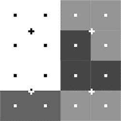

*图 5-18： 图 5-16 纹理的特写部分。方框是纹理元素的中心；十字是采样点。*

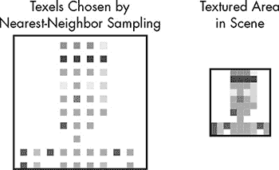

*图 5-19：对图 5-16 进行 10×10 最近邻采样的结果。左侧是原始纹理的选择纹理元素，右侧是结果位图。*

当纹理被扩展到填充更大区域时，结果同样是丑陋的。在这种情况下，一些纹理元素（texel）将简单地在纹理区域内重复，从而产生块状效果。为了看清这个问题，我们从一个三角形和它作为 16×16 反走样纹理的表示开始，如图 5-20 所示。

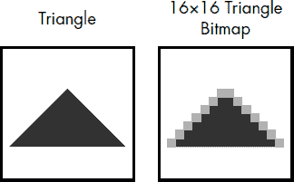

*图 5-20：三角形及其作为 16×16 像素反走样纹理的表示。*

现在假设这个纹理应用在一个 32×32 的区域上。理想情况下，它应该看起来比原来的小纹理更平滑；更高的分辨率提供了更精细边缘的机会。然而，正如图 5-21 所示，最近邻采样将每个纹理元素放置在四个采样点上，因此原始的 16×16 纹理中的每个纹理元素在放大后都变成了四个相同颜色的像素。

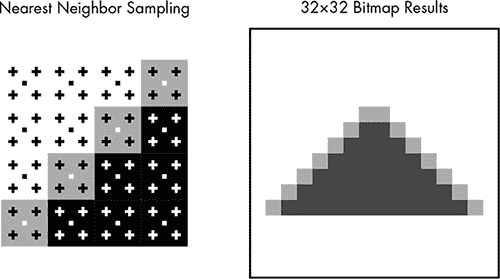

*图 5-21：当用来放大纹理时，最近邻采样仅仅是重复像素。*

#### *双线性过滤*

一种更好看的采样方法是*双线性过滤*。它不是简单地取最近纹理元素的颜色，而是每个纹理样本是四个最近纹理元素的按比例混合。该方法称为双线性，是因为它利用了采样点在由四个最近纹理元素形成的正方形内沿两个轴的位置。例如，在图 5-22 中，采样点位于底部并稍微偏左，产生了所示的混合百分比。该样本的最终颜色是根据给定百分比从纹理元素的颜色中计算得出的。

图 5-23 显示了经过双线性过滤缩小后的机器人纹理。缩小后的版本只有原始像素的四分之一，必然缺乏细节，但如果将原始纹理置于手臂长度处，并将缩小版置于近处进行对比，你会发现缩小效果非常好，比最近邻结果要好得多。

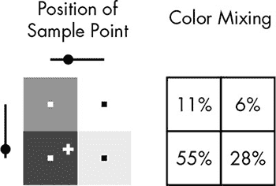

*图 5-22：双线性过滤测量样本点在相邻纹素的正方形内的垂直和水平方向的位置，并利用这些位置来确定每个纹素对样本颜色的影响百分比。*

*图 5-23：通过双线性过滤缩小的机器人纹理*

图 5-24 显示了通过双线性过滤放大的 32×32 区域，这是从 16×16 三角形纹理中获取的—相比块状的最近邻采样，这是一个明显的改进。

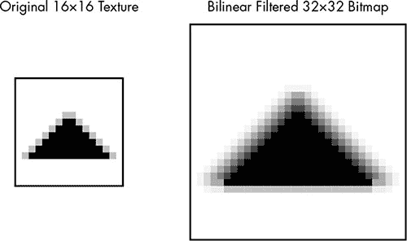

*图 5-24：通过双线性过滤扩展的三角形纹理*

#### *Mipmap*

前一节中的示例展示了双线性过滤的局限性。为了使双线性过滤效果良好，纹理的分辨率需要至少是纹理区域的一半，但不能超过两倍。如果纹理太小，双线性过滤仍然会产生块状效果。如果纹理太大，尽管每个采样使用了四个纹素，但有些纹素不会对任何样本产生影响。

避免这些问题需要为每个纹理准备一组不同大小的位图：一个用于近距离查看的全分辨率版本，以及在纹理区域较小时使用的小版本。这些逐渐变小的纹理集合称为 *mipmap*。一个示例见于 图 5-25。mipmap 中的每个纹理都是下一个较大纹理面积的四分之一。

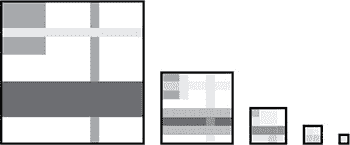

*图 5-25：mipmap 是一个纹理集合，每个纹理的大小是前一个的四分之一。*

使用 mipmap，渲染器总是能够找到一个合适的纹理，通过双线性过滤产生良好的效果。例如，如果需要 110×110 的纹理，就将 128×128 的纹理缩小。如果需要 70×70 的纹理，就将 64×64 的纹理放大。

#### *三线性过滤*

虽然双线性过滤和各级贴图（mipmap）通常能很好地工作，但在从一个 mipmap 贴图过渡到另一个 mipmap 贴图时，它们会引入一种令人分心的视觉异常。假设在一款第一人称游戏中，你正在朝着一堵使用 mipmap 贴图的砖墙跑去。当你靠近墙壁时，较小的贴图会越来越被放大，直到你到达那个点，下一层较大贴图的缩小版本会出现在你面前。不幸的是，通过双线性过滤缩小的较大贴图并不完全与扩展的较小贴图匹配，因此在过渡的那一刻，贴图会“跳动”。这个问题也可能发生在没有任何运动的情况下，比如走廊中铺设的长地毯，地毯上使用了重复的贴图；因为不同距离处的地毯部分被 mipmap 中不同的贴图覆盖，所以在贴图接触的地方会明显看到接缝。

为了平滑贴图过渡，渲染器可以在贴图之间进行混合，除了混合贴图中的纹素外，还可以混合来自不同贴图的样本。假设需要贴图的区域是 70×70，这个尺寸介于 mipmap 中的 64×64 和 128×128 贴图之间。渲染器不仅仅对较近的 64×64 贴图进行双线性过滤，它可以对较大和较小的贴图同时进行双线性过滤，然后混合这两个结果样本。就像双线性过滤本身一样，这一步也是按比例进行的：在我们的例子中，颜色大部分由 64×64 贴图的结果决定，少量 128×128 贴图的结果混合其中。由于我们在每个贴图上都进行了二维过滤，然后再混合结果，这种技术被称为*三线性过滤*。它在图 5-26 中展示。

三线性过滤消除了 mipmap 贴图之间的跳动和接缝，但由于它需要两个双线性样本，然后进行最终的混合，它的工作量是双线性过滤的两倍多。

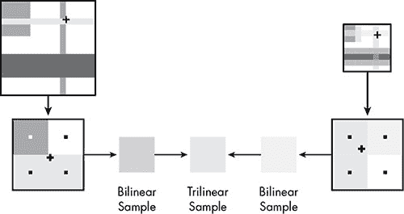

*图 5-26：三线性过滤从 mipmap 中较大和较小的贴图中获取双线性样本，并混合这些结果。*

### 反射

正如在第四章中讨论的，光线追踪自然能够捕捉到光从一个表面反射到另一个表面的所有效果。不幸的是，附近表面颜色的微妙影响几乎无法在没有光线追踪的情况下捕捉到，但游戏渲染器确实有办法伪造我所称之为*清晰反射*的效果：即在抛光的台面、窗户，当然还有镜子本身等表面上，明显的、镜面般的反射。

游戏限制了哪些表面能产生清晰的反射。仅有少数物体具有这种反射能保持场景的真实感，并大大降低计算成本。为了进一步减少工作量，渲染器使用*环境映射*，将光亮物体概念性地放置在立方体内部，并用事先渲染的物体周围环境图像进行纹理映射。

图 5-27 显示了一个示例场景：一辆光亮的跑车在展厅的旋转台上。为了计算清晰反射的效果，渲染器在概念上将汽车放置在一个立方体中；该立方体本身并不被渲染，只是用于映射反射。立方体内部使用展厅内景的图像进行纹理映射，如图 5-28 所示。由于反射图像会因车身表面而有所扭曲，观众不会注意到反射图像与渲染世界中的汽车位置不完全匹配。

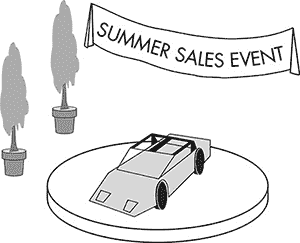

*图 5-27：为了逼真，光亮的汽车车身应该反射展厅的景象。*

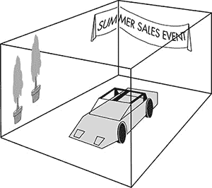

*图 5-28：为了映射反射，汽车被视为处于一个立方体内，立方体内部覆盖着展厅的位图图像。*

与其追踪光线在场景中四处反弹，映射反射变成了一种间接的纹理映射引用，这是一种相对简单的计算。当然，汽车表面可能也已经进行了纹理映射，这意味着增加反射至少是加倍了每个像素的计算工作量，但通常这种真实感的提升是值得额外工作量的。

当反射模型在移动时，工作变得更加困难，例如，如果我们的汽车在驾驶游戏中沿沙漠公路行驶。渲染器不能仅仅将一张静态的沙漠图像粘贴到立方体内部并期望能够欺骗观众。由于视点将随着汽车移动，当汽车沿公路行驶时，反射也必须随之移动——或者至少看起来是这样。

有一个古老的好莱坞技巧，用来传达与相机相关的横向移动假象。演员会站在跑步机上，这样他就可以走路而不离开原地。在他身后，一幅连续卷轴上的景物插图会与跑步机保持相同的速度滑过。只要观众没有注意到相同的树木不断出现，看起来就像演员正在横向移动。

同样的思路可以应用于包围光亮汽车的立方体内部。选择一部分宽广的连续图像，如图 5-29 所示。通过将选定的“窗口”滑动在宽图像上，以匹配汽车的运动，产生出汽车反射场景中干旱山脉的假象。

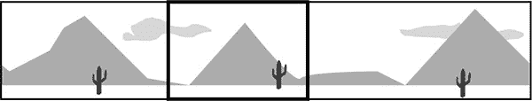

*图 5-29：将一个窗口滑动到一幅宽广的连续图像上，会在映射的反射中创造出运动的效果。*

### 伪造曲线

没有什么能比一个明显可以辨认出三角形的模型更快地破坏视频游戏的真实感了，尤其是当这个模型试图表现一个圆形物体时。早期的 3D 游戏中，汽车轮胎像八边形一样，人物角色看起来像是由玩具积木做成的。我们已经看到了解决这个问题的部分方法——弯曲三角形顶点的法线——但要生产光滑的模型，还需要一整套技巧。

#### *远距离替代模型*

解决平面三角形问题的一个显而易见的方案是将模型拆分为许多小三角形，以至于单独的面无法被识别。理论上是可行的，但即使三角形是简单的形状，渲染的数量仍然受到时间的限制。试图以最高的细节设计每个模型会使渲染速度变得极其缓慢。

然而，渲染器可以使用大量额外的三角形，仅仅平滑那些靠近视点的模型。这就是*远距离替代模型*的思路。在这种方式下，游戏中的每个物体都有两个模型——一个是高度详细的高三角形模型，另一个是简化的低三角形模型。这个简化的模型是原始模型的“替代品”，当模型超出视点的某个距离时，低质量的模型就会替代高质量的模型。

远距离替代模型有效利用了渲染时间，但由于这两种模型差异太大，如果玩家在靠近某个特定模型时进行观察，模型之间的过渡可能会显得视觉上很突兀。理想情况下，你希望让观众感觉到远处的物体在靠近时展现出更大的细节，但实际上这两种模型差异太大，以至于替换的效果看起来像是一个物体神奇地变成了另一个物体。

#### *凸凹贴图*

另一种平滑模型的技术是保持三角形数量不变，但在每个像素的光照计算中进行调整，以呈现不规则的表面外观。

要理解为什么这种*bump mapping*方法如此有效，可以想象一款游戏中有一座带有石膏墙的庄园。为了获得石膏的外观，渲染器可以将一个实际石膏墙的图像作为纹理，应用到庄园模型的墙面上。由于石膏墙是波浪形的，它的起伏应当在场景光照下可见。仅仅将纹理应用到平坦的墙面上并不能让人信服；那看起来就像是一个平坦的墙壁上贴了石膏的图片。

凸凹贴图使得平面表面能够像石膏墙那样呈现波浪状，像爆米花天花板那样颠簸，或者像皱褶、百叶窗等其他形态那样反应光照。该过程从一个与将要应用到模型表面的纹理相同大小的灰度位图开始。这个位图被称为*高度图*，因为每个像素的亮度表示表面的高度。

高度图允许像素着色器在每个像素位置近似表面法线。最容易理解的是在 2D 中。图 5-30 显示了一排 10 个像素。底部的数字表示每个像素的高度。10 个点按比例显示，并附有表面法线。我添加了灰色线条以显示如何计算第 4 和第 7 个点的法线。通过两侧的两个点画一条假想线，然后，选择的点的法线设置为垂直于这条线。

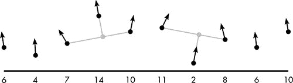

*图 5-30：一排像素，通过凹凸贴图改变了光照计算。数字表示每个像素的人工高度。渲染器根据相邻像素的高度来确定每个像素的法线。*

这些弯曲的法线会影响漫反射和镜面反射光照的计算，使得平面表面能够像粗糙或波动的表面一样响应光线。然而，正如之前涉及弯曲法线的技巧一样，带有凹凸贴图的表面仍然是平面表面。表面上的点实际上并没有被抬高或降低，它们仅仅是以不同的方向响应光线。当玩家在 3D 场景中经过一个带有凹凸贴图的模型时，表面的光照会以逼真的方式变化，但模型的边缘仍然是直的，这可能会暴露出游戏的痕迹。就像图 5-8 中杯缘暴露出模型上的直线一样，我们的凹凸贴图哈西恩达模型的外角将是完全直的，而应该是波浪形的，因为凹凸贴图并没有改变平面墙面的形状。

#### *细分*

假设你正在玩一个幻想游戏，所有注意力都集中在一只慢慢接近的巨大巨魔身上，手里拿着一把斧头。作为玩家，你希望这只巨魔看起来尽可能好，即使它接近到几乎填满整个屏幕，但你不希望它由太多三角形构成，以至于帧率太低，无法有效地与它战斗。

然而，如果渲染器使用远距离替代物（impostor），就会出现突兀的过渡，提醒你这只是一个游戏。如果渲染器对巨魔模型进行凹凸贴图处理，光照会从他的盔甲上的铆钉反射出来，但这种精细的光照效果掩盖不住模型由于三角形数量太少而无法近距离观察的事实。

一种称为*细分*的过程解决了这个问题。首先，哥布林模型中的每个三角形被细分为更多的三角形。这些新三角形的角被独立地向内或向外（即相对于原始三角形向上或向下）使用高度图进行操作。与凹凸贴图仅通过弯曲法线来欺骗光照模型不同，细分实际上生成了一个更复杂、细节更多的模型。图 5-31 展示了单个三角形的过程。

这种方法是掩盖三角形直线的好方法，并且在外观上明显优于凹凸贴图和远程替代模型技术。因为模型实际上被变形为一个新的、更复杂的形状，即使是模型的边缘也会受到适当影响，这不同于凹凸贴图的情况。此外，与远程替代技术不同，模型随着视点距离的减小而逐渐改善，避免了模型切换时的剧烈过渡。

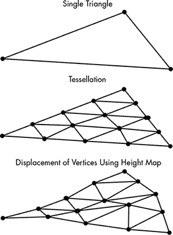

*图 5-31：一个三角形被细分，形成一个由更小的三角形组成的网格。这些新三角形的顶点随后通过高度图进行操作，产生底部的更复杂表面。*

尽管你可能认为细分技术在游戏中被广泛使用，但事实并非如此，因为它带来的性能影响远远大于之前讨论的更简单的方法。实时创建更复杂的模型比访问几个预制的模型（如远程替代模型方法）或调整法线（如凹凸贴图）要费力得多。

因此，细分技术通常用于效果最为显著的地方。例如，在一个设定在户外的游戏中，角色脚下的地面可能延伸得非常远。若要对地面进行精细建模，将需要大量的三角形，这会成为性能瓶颈；但如果地面模型的三角形数量较少，离观众最近的地面将呈现出不真实的棱角感。细分技术能够平滑地面中最接近观众的部分。

### 实时抗锯齿

如果单个像素因锯齿而变得明显可见，渲染器的辛勤工作将毫无意义。与电影 CGI 相似，游戏需要某种形式的全屏抗锯齿来平滑模型和表面的边缘。对于光线追踪，抗锯齿在概念上是简单的：发射比像素更多的光束并融合结果。然而，游戏渲染器必须使用更高效的技术。

#### *超采样*

与发射多束光线的最直接近似方法被称为*超采样抗锯齿（SSAA）*。与其每个像素发射多束光线，超采样会渲染一个比目标最终图像大得多的中间图像。最终图像中每个像素的颜色是来自更大图像中多个像素样本的混合。

请看图 5-32 中被灰色三角形覆盖的两个白色三角形。注意，白色三角形的边缘在渲染图像中不可见，但这里为了清晰起见展示了它们。

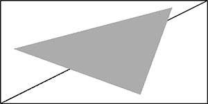

*图 5-32：三个三角形的排列*

图 5-33 展示了这些三角形在 8×4 分辨率下的基本渲染。每个像素根据像素中心是否位于前景中的灰色三角形区域内，分别被着色为灰色或白色。

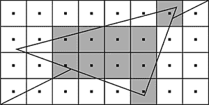

*图 5-33：没有抗锯齿的像素着色*

为了生成 8×4 的超采样图像，首先将三角形以 16×8 分辨率渲染，如图 5-34 所示。

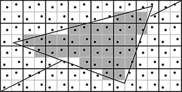

*图 5-34：对三个三角形进行超采样。在这里，最终位图中的每个像素由四个具有分散采样点的子像素表示。*

如你所见，图 5-33 中的每个像素在图 5-34 中变成了四个更小的像素。这些更小的像素称为*子像素*。通过这种高分辨率的渲染，最终渲染中每个像素的颜色是其四个子像素颜色的按比例混合，如图 5-35 所示。

*图 5-35：通过混合子像素来着色每个像素*

超采样能很好地平滑锯齿，但正如你所预料的，使用更高的分辨率渲染图像会带来较大的性能开销。为了在最终图像中生成一个像素，需要对四个像素进行采样，这意味着像素着色器要处理四倍的工作量。在这个例子中，我通过给每个三角形分配一个平面颜色来简化问题，但在典型的游戏渲染中，每个子像素至少代表一个纹理映射样本，接着进行光照计算。尽管早期的电子游戏常常使用 SSAA，但如今这种方法已经很少见了。

#### *多重采样*

在前面的例子中，你可以看到，当所有四个子像素都在同一个三角形内时，超采样并没有起到任何作用。为了减少抗锯齿带来的性能损耗，可以将子像素的处理限制在三角形的边缘，这些边缘正是锯齿出现的地方，这就是一种叫做*多重采样抗锯齿（MSAA）*的技术。

图 5-36 展示了这一概念的一个版本。两个像素位于两个三角形的边缘上。使用超采样时，每个八个子像素都进行纹理采样，并根据场景光照单独着色。使用多重采样时，两个像素仍然有八个子像素，但不是八个样本。相反，渲染器首先确定每个子像素所属的三角形。每个位于同一三角形内的四个子像素被赋予相同的颜色，这个颜色是从子像素采样点之间的中间点采样得到的。因此，虽然超采样为八个子像素 A 到 H 着色，但多重采样只为四个子像素 A 到 D 着色，这意味着在纹理映射和光照方面的工作量大大减少。

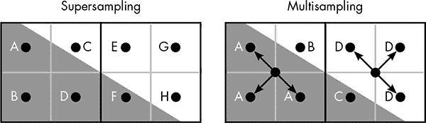

*图 5-36: 比较超采样和多重采样*

当所有四个子像素都位于同一个三角形内部时，多重采样每个最终像素仅对一个子像素进行采样，从而引入很小的计算开销。多重采样将额外的计算资源集中在最需要的地方——减少边缘的锯齿——因此，它是渲染时间的高效利用。

#### *后处理抗锯齿*

通过将抗锯齿延迟到图像渲染完成后再进行处理，可以进一步提高性能，这种方法被称为*后处理抗锯齿*。也就是说，图像首先以所需的最终分辨率正常渲染，然后识别并平滑锯齿。实质上，后处理抗锯齿技术认为图像中的某些像素颜色是错误的，这一判断仅仅基于这些像素自身的颜色。

一种这样的技术叫做*快速近似抗锯齿*，或*FXAA*。（为什么它不是 F*A*AA，也许是一个我们不应该问的问题。）FXAA 的理念是找出可能位于重叠三角形边缘上的像素，然后混合相邻像素的颜色，以平滑突兀的过渡。

FXAA 会单独检查图像中的每个像素——我们将正在检查的像素称为*当前*像素。该过程首先计算当前像素及其四个直接邻居的感知亮度，类似于检查图像的黑白版本。选择邻域中最亮和最暗的像素，如图 5-37 所示，然后将它们的差异与设定的阈值进行比较。此测试确保抗锯齿仅应用于高对比度的像素邻域——即最亮和最暗像素之间差异较大的区域。

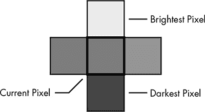

*图 5-37: 检查像素邻域的对比度水平*

这些高对比度区域很可能表示需要平滑的锯齿边缘，每个这样的区域会进一步检查，如图 5-38 所示。以当前像素为中心的 3×3 像素块，既被视为三列像素，也被视为三行像素，从而确定这是水平边缘还是垂直边缘。在这个例子中，因为列之间比较相似，而其中一行与其他两行有较强的对比度，因此这将被归类为水平边缘。

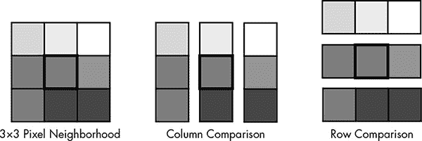

*图 5-38：在像素邻域的列和行中寻找对比度*

因为这是一个水平边缘，下一步是比较当前像素上下方的像素，找出哪个与当前像素的对比度最大。在这种情况下，位于上方的像素比当前像素亮得多，而下方的像素则相似。这意味着检测到的边缘位于当前像素与其上方邻居之间。为了抗锯齿处理这一边缘，当前像素将被替换为两个像素中心之间的双线性采样，显示为图 5-39 中的白色圆圈。FXAA 会检查边缘上其他像素，以确定边缘的锯齿程度，并通过将采样点远离当前像素中心来调整混合的程度。

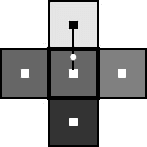

*图 5-39：为了平滑这个边缘，FXAA 会将中心像素的颜色替换为圆点处的双线性采样。*

像 FXAA 这样的后处理抗锯齿方法比超采样甚至多重采样快得多，因为它完全不创建任何子像素。然而，FXAA 的结果并不总是像其他方法那样令人印象深刻。特别是，FXAA 有时会模糊那些实际上并没有锯齿的区域；与超采样不同，像 FXAA 这样的后处理方法只是猜测边缘的位置，因此纹理中的高对比度区域可能会欺骗算法。

### 渲染预算

不同抗锯齿技术的权衡意味着实时图形应用程序的开发人员必须在最佳质量和最佳性能之间做出选择。FXAA 对这种情况足够好吗？还是必须使用 MSAA？然而，这个选择并不是孤立做出的。从更广泛的角度来看，游戏开发人员必须审视所有实时渲染可用的技术——光照、阴影、抗锯齿，还有许多其他我们没有空间讨论的可能性，比如运动模糊和粒子系统——并选择一套最大化图像质量而不超出渲染时间限制的技术。在那 ¹/[60] 秒内，可以完成大量的工作，但并不能使用所有最漂亮的技术，因此必须在某些地方做出妥协。

在控制台或移动游戏中，这些选择通常由游戏设计师做出。在 PC 上，通常会提供一定的选择余地，用户可以调整纹理分辨率，选择纹理过滤方法，选择抗锯齿方法，开启或关闭阴影和反射，甚至可以在多种方式中微调渲染器。部分原因是，给予用户这些控制选项是为了让他们根据系统的性能调整渲染工作负载，因为这台 PC 可能是顶级的，也可能是一台老旧的电脑。

更进一步，详细的渲染选项体现了一个事实：美丽是主观的——某些视觉效果令一个观众印象深刻，而另一个观众可能毫无感觉。例如，有些玩家对锯齿状的边缘感到恐惧，通常会将抗锯齿调整到最大，而另一些玩家则不愿将宝贵的处理器周期浪费在去除锯齿上，而更愿意去优化更具现实感的阴影。某种程度上，视频游戏的核心就是让我们置身于可信的虚拟世界，而我们相信的内容，完全取决于我们自己。

### 游戏图形的未来

那么，游戏图形未来将会如何发展呢？我们可以预见，游戏程序员将继续面临显示技术进步带来的挑战。显示器的分辨率不断提高，逐渐削弱了每一代 GPU 的优势。虚拟现实（VR）头盔将带来一个特殊的挑战，它结合了头盔内置的显示屏和传感器，用于追踪玩家的头部动作。如果显示延迟了运动，VR 头盔可能会带来麻烦——我们的脑袋不喜欢冲突的信息，当我们的眼睛看到一个东西，而内耳感受到另一个时，很多人会感到恶心。在普通平面屏幕上玩游戏时，玩家希望能获得稳定的高帧率，但如果偶尔出现帧率下降，他们通常不会太过在意；而使用 VR 设备时，帧率的稳定性至关重要。

超越满足显示需求，确切预测游戏图形如何发展是困难的。在过去的十年里，每当我玩一个新的 AAA 游戏（业内对最高预算游戏的称呼），我都会认为图形不可能再做得更好了，认为下一代硬件带来的任何改进都将微不足道。而每次，我都被证明是错的。所以我相信，即使我无法确定这些进展会是什么，我仍然会继续为游戏图形的进步感到震撼。

原始硬件性能只是问题的一部分。购买一款核心数量是旧款 GPU 两倍的新 GPU 意味着硬件在相同的时间分配内可以处理两倍的三角形，但一旦三角形的数量足够多，简单地将数量加倍并不会显著改善最终的图像质量。事实上，在某些时候，模型的细节可能会变得非常复杂，三角形的数量如此之高，以至于每个三角形占据的屏幕面积不到一个像素。当这种情况发生时，整个将场景渲染为三角形的概念就会受到质疑。渲染器可能不再使用三角形来确定一个像素的颜色，而是用体积固定的单个点来代替三角形——可以想象用小巧的棉花糖来雕刻一座雕塑。

然而，推动游戏图形发展的最终动力并不是硬件，而是图形程序员的创造力。第四章中介绍的许多技术，都是关于如何精确地，或者至少合理地模拟现实世界中光线和视觉的工作原理。游戏图形的目标仅仅是产生看起来不错的效果。这给程序员提供了极大的发挥空间，去尝试新的方法，找出如何在有限的渲染预算中找到新花样，去为玩家脸上带来傻乎乎的笑容。我不确定游戏开发者们为下一代游戏准备了什么，但我相信他们一定会继续让我的 GPU 在令人激动和惊叹的方式下工作。
