## **6**

**数据压缩**


有时候，软件的辛勤工作对每个人都显而易见，就像电影中的计算机生成图像（CGI）和电子游戏图形一样。你不需要知道计算机是如何工作的，就能为《阿凡达》这样的电影和《孤岛危机》这样的游戏中的视觉效果所惊叹。然而，有时，软件在看似毫不费力的情况下，正完成着最令人惊叹的工作。

如今，通过光盘或互联网流媒体观看高清视频是我们大多数人理所当然的事情。这不就是存储和显示图像吗？为什么这需要特殊的技术？为了理解为什么我们应该对蓝光视频和 Netflix 流媒体感到惊叹，让我们先回顾一下在这些格式出现之前的视频是怎样的。

录像带，最早的家庭视频介质，通过磁带卷录制图像。这些是模拟录音——磁性转录的信号，与电视天线广播的信号相同。视频分辨率甚至低于我们现在称为“标清”的标准，而且与其他模拟录音设备如录音带和黑胶唱片一样，视频质量会随着时间的推移而退化。录像带的唯一优点是它的容量：一部更长的电影只需要一卷更长的磁带。

接着是激光影碟。它的大小约与黑胶唱片相当，这些光盘看起来像是今天的 DVD 和蓝光光盘的更大版本，但与录像带一样，它们仍然存储的是模拟广播格式的信号。然而，激光影碟记录了更高分辨率的图像，接近标准清晰度，并且允许你直接跳到视频中的特定位置，而不需要像使用录像带那样倒带或快进。曾一度，激光影碟看起来是视频的未来，但现在容量成了问题。与磁带卷几乎无限的容量不同，激光影碟每面最多只能存储 60 分钟的视频，因此观看电影意味着在中途翻转光盘，甚至更换光盘。

今天，容量问题变得更加严重。我们的蓝光光盘比激光影碟小得多，但我们的视频分辨率却高得多。让我用数字来说明这个问题。在高清晰度视频中，每一帧是一个 1920×1080 的位图，总共有 2,073,600 个像素。如果每个像素存储为三字节的 RGB 格式，那么一帧高清电影将需要 6,220,800 字节，约为 6.2 兆字节（*兆*意味着“百万”）。电影以每秒 24 或 30 帧的速度录制，每分钟 1,800 帧，每小时 108,000 帧，或者一部两小时的电影需要 216,000 帧。如果每帧需要 6,220,800 字节，那么 216,000 帧就是 1,343,693 兆字节，约为 1,345 千兆字节（*千兆*意味着“十亿”）。

那么所有这些数据如何能存储在一张蓝光光盘上呢？部分原因是“蓝光”本身，它使用的蓝激光比激光唱片或甚至传统 DVD 上使用的激光更窄，从而允许将更多数据压缩到更小的区域，就像更小的字体可以让一页上容纳更多的文字一样。即便如此，一张蓝光光盘最多也只能存储约 50GB 的数据，这还不到所需数据的 4%。

流媒体视频也面临同样的问题。如果一个视频帧是 6.2 兆字节（MB），并且视频以每秒 30 帧的速度播放，那么流媒体就需要每秒 186 兆字节（MBps）的互联网连接。而典型的家庭宽带连接大约只有 4MBps。更糟糕的是，由于网络拥堵和波动，你无法指望在长时间传输过程中保持满负荷带宽。实际上，流媒体视频应该最多使用几兆字节每秒。

那么我们如何将大量的视频数据存储进这些小容器中呢？答案是*数据压缩*——以比原始格式所需更少的字节来存储数据。压缩技术大致可以分为两类。*无损压缩*可以将压缩后的数据恢复到完全原始的状态。而*有损压缩*则接受恢复的数据可能与原始数据略有不同。视频流媒体和存储通常使用这两种压缩方式的结合。在本章中，我们将首先通过简单的例子研究一些通用的压缩技术。接着，我们将看到这些思想如何应用于视频，生成几乎与未压缩的原始图像一样清晰的高度压缩图像序列。

### **游程编码**

我们大多数人都使用过某种形式的无损压缩，虽然我们可能没这么称呼它，因为许多无损压缩的技术其实是常识性的方法。一个这样的例子是*游程编码*。假设我给你展示一个 27 位的数字，让你看一分钟，看看你是否能在一个小时后记住它。听起来可能很难，但看看这个数字：

```
777,777,777,555,555,555,222,222,222
```

我怀疑你不会试图单独记住每个数字。相反，你会统计每个数字的出现次数，并把它记作“九个七，九个五，和九个二”。

这就是游程编码的作用。当相同的数据片段（在这个例子中是数字）重复出现时，这些重复的片段称为*游程*，当游程很常见时，我们可以通过记录游程的长度而不是整个数字来缩短数据。游程编码是无损压缩，因为如果我们记住了简写版本的数字，我们可以在需要时恢复出它的原始形式。

仅仅使用行程编码就可以为某些类型的图像提供极好的压缩效果，例如图标、标志、漫画风格的插图——任何具有大块单一颜色的图像。当像素与相邻像素颜色相同时，我们可以显著减少存储需求。举个例子，我将描述*TGA*图像文件格式使用的系统。TGA 是*Truevision Graphics Adapter*（真视图图形适配器）的缩写，是一款早期的视频编辑硬件。尽管适配器已经不再使用，这种文件格式在视频行业中仍然被广泛应用，它可能是最简单的图像行程编码示例。

TGA 文件中的图像数据是按行进行压缩的。在每一行中，所有两个或更多个完全相同颜色的像素连续块都会被识别出来。其余的像素被称为*原始*像素。考虑图 6-1 中选中的示例图像行。在这一行中，有多个短的像素连续块，以及几个与邻近像素不同的原始像素。

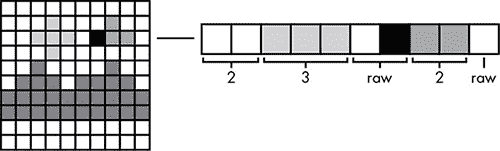

*图 6-1：选中的行包含了连续块和原始像素的混合。*

TGA 格式将连续的像素和原始像素组织成*数据包*。每个数据包以一个字节的头部开始。头部字节的最左侧位确定该数据包是连续块数据包还是原始数据包。其余七个位表示数据包的像素大小。因为最小的数据包包含一个像素，所以 TGA 将数据包的大小编码为比实际大小少 1；即，大小字段为 0000000 表示大小为 1，0000001 表示大小为 2，依此类推。头部后面跟着的是该连续块中所有像素的编码颜色，或者对于原始数据包，则是每个像素的单独颜色。使用 RGB 颜色格式时，图 6-1 中的像素行将按照表 6-1 中的方式进行编码。

**表 6-1：TGA 像素行的编码**

| **行程/原始** | **大小** | **红色** | **绿色** | **蓝色** | **描述** |
| --- | --- | --- | --- | --- | --- |
| 1 | 0000001 | 11111111 | 11111111 | 11111111 | 两个白色像素的连续块 |
| 1 | 0000010 | 11001100 | 11001100 | 00000000 | 三个黄色像素的连续块 |
| 0 | 0000001 | 11111111 | 11111111 | 11111111 | 两个像素的原始数据包；第一个是白色 |
|  |  | 00000000 | 10000000 | 00000000 | 原始数据包中的第二个像素；深绿色 |
| 1 | 0000001 | 00000000 | 00000000 | 11111111 | 两个蓝色像素的连续块 |
| 0 | 0000000 | 11111111 | 11111111 | 11111111 | 一个原始白色像素 |

该编码需要 23 个字节，而未压缩的大小为 30 个字节。这个*压缩比*为 30:23，约为 4:3，虽然不算非常高，但需要注意的是，仅 4 个字节就足以存储每个像素颜色相同的行，例如图 6-1 的顶行。这个 TGA 格式位图的整体压缩比为 300:114，约为 5:2，效果相当出色。

### **字典压缩**

仅仅使用自身，行程编码能够压缩包含大块纯色的图像，但电影中的大多数图像并不是这样。对于照片和其他类型的数字图像，其中有大量颜色变化，软件必须更加努力地寻找可以通过压缩利用的模式。一个关键工具被称为*词典压缩*。

#### ***基本方法***

稍后我们将看到词典压缩如何应用于图像，但最容易理解这一概念的是将其应用于文本文件，因此我们从这里开始。未压缩的文本文件是作为一系列字符代码存储的，例如 ASCII。

我们将压缩这个示例段落：

由计算机创建的图像称为计算机图形。当这些由计算机创建的图像按顺序查看时，这个顺序被称为动画。由动画组成的完整电影，即由计算机创建的一系列图像，称为计算机动画电影。

为了简化这个示例，我将忽略文本中的空格和标点，只关注字母。这个段落中有 234 个字母；如果以未压缩的 ASCII 文本存储，这些字母将需要 234 字节。要对这些文本进行词典压缩，我们首先需要一个*词典*，在这个上下文中，词典是一个编号列表，列出了文档中每个被压缩的单词。表 6-2 就是我们的单词列表，按十进制和二进制编号。请注意，大写字母和小写字母算作不同的条目：*an* 和 *An* 是不同的条目。

**表 6-2：** 词典压缩

| **位置** | **二进制编码位置** | **单词** |
| --- | --- | --- |
| 1 | 00000 | 一个 |
| 2 | 00001 | 一个 |
| 3 | 00010 | 一个 |
| 4 | 00011 | 动画 |
| 5 | 00100 | 动画 |
| 6 | 00101 | 是 |
| 7 | 00110 | 由 |
| 8 | 00111 | 被称为 |
| 9 | 01000 | 计算机 |
| 10 | 01001 | 创建 |
| 11 | 01010 | 整个 |
| 12 | 01011 | 从 |
| 13 | 01100 | 图形 |
| 14 | 01101 | 在 |
| 15 | 01110 | 是 |
| 16 | 01111 | 电影 |
| 17 | 10000 | 的 |
| 18 | 10001 | 图像 |
| 19 | 10010 | 顺序 |
| 20 | 10011 | 那个 |
| 21 | 10100 | 这些 |
| 22 | 10101 | 那些 |
| 23 | 10110 | 查看 |
| 24 | 10111 | 当 |

如图所示，5 位足以表示所使用的位置范围。原文中的每个单词都被替换为该表中的位置。例如，代替每次出现的*计算机*使用八个 ASCII 码（64 位），我们改用 5 位的词典条目。

然而，字典本身需要占用空间，并且必须包含在压缩文档中，因此只有当一个单词出现超过一次时，我们才能节省空间。在这个例子中，字典中所有单词的总字母数为 116，需占用 116 字节。将样本文本中 48 个单词中的每一个替换为一个 5 位字典引用需要 235 位，约为 30 字节。总的压缩存储量是 146 字节，相比原始未压缩的 234 字节，压缩比大约是 8:5。对于较长的文档，节省的空间将会更明显，因为文本增长的速度远快于字典。例如，一本典型的小说大约有 80,000 个单词，但使用的词汇量只有几千个单词。

#### ***哈夫曼编码***

在几乎所有的文本中，某些单词的使用频率远高于其他单词。一种名为*哈夫曼编码*的技术利用了这一事实，以改进基本的字典压缩。

为了创建哈夫曼编码，文档中的单词按频率排序。假设有一个儿童故事，词汇量为表 6-3 中显示的 10 个单词。与基本字典压缩类似，每个单词都会被分配一个二进制编码，但在这里，出现频率最高的单词将被分配更短的编码。

**表 6-3：** 儿童故事的哈夫曼编码

| **单词** | **频率** | **二进制编码** |
| --- | --- | --- |
| the | 25% | 01 |
| a | 20% | 000 |
| 公主 | 12% | 100 |
| good | 11% | 110 |
| 女巫 | 10% | 111 |
| evil | 8% | 0010 |
| ate | 7% | 0011 |
| magic | 4% | 1010 |
| 蘑菇 | 2% | 10110 |
| forevermore | 1% | 10111 |

一旦表格建立，哈夫曼编码压缩与基本字典压缩相同：每个单词都被其对应的二进制编码替换。例如，*the princess ate a magic toadstool*的编码将从*the*的 01 开始，接着是*princess*的 100，依此类推。完整的编码是：

```
011000011000101010110
```

正如你可能已经注意到的，表 6-3 中的二进制编码跳过了一些可能的编码，例如 011 或 0110。跳过编码是必要的，以使其成为一个*前缀编码*，即没有任何二进制编码会出现在另一个编码的开头。例如，由于 01 是*the*的编码，其他以 01 开头的编码，如 011 或 0110，都是禁止的。因为各个编码的长度不同，所以需要使用前缀编码来确定每个编码的结束位置。在我们的示例中，位序列开始的 01 必须是*the*的编码，因为没有其他编码以 01 开头；分割整个序列的唯一方式是：

```
01 100 0011 000 1010 10110
```

如果我们允许一个违反前缀规则的编码，序列可能会变得模糊。假设*forevermore*被分配了编码 00。虽然这是一个较短的编码，但它意味着该示例序列也可能被分解为：

```
01 100 00 110 00 1010 10110
```

这将解码为短语*the princess forevermore good forevermore magic toadstool*。

通过为最常见的单词分配最短的编码，霍夫曼编码在数据能够以相对较小的编码集存储且某些编码比其他编码更常见时，比仅使用字典压缩能获得更大的压缩效果。

### **为了更好的压缩重组数据**

不幸的是，我们在视频中看到的图像并不是霍夫曼编码的理想对象。与我们使用游程编码压缩的色块图像不同，视频图像中的像素颜色覆盖了所有可能的颜色范围。由于 RGB 颜色有 1600 多万种不同的可能性，视频图像很可能没有足够的重复性来使霍夫曼编码有效。然而，有时可以通过改变数据存储方式，在变化的数据中创造出重复性。

#### ***预测编码***

以某种方法为例，考虑一个每小时记录一次温度的气象站，在一天的时间里，记录了以下数据：

```
51, 52, 53, 54, 55, 55, 56, 58, 60, 62, 65, 67, 68, 69, 71, 70, 68, 66, 63, 61, 59, 57, 54, 51
```

**ZIP 文件中的压缩**

字典压缩和霍夫曼编码是大多数通用压缩方案的核心。例如，*.zip*存档格式可以选择多种压缩方法，但通常使用一种叫做*deflate*的算法。与其用一个来自单词列表的参考编号替换重复数据，这个算法使用一种称为*滑动窗口*的字典压缩变体。

使用这种方法，重复的数据被用数字指示符替换，显示数据之前出现的位置。在图 6-2 中的文本示例中，有三个重复的字符序列。每一对数字的第一个数字是回溯的字符数，第二个数字是连续字符的长度。例如，数字对 5, 2 表示“回溯五个字符，并复制两个字符。”

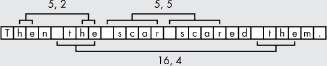

*图 6-2：滑动窗口压缩*

这段文本的压缩版本可以象征性地写成“Then t[5,2] scar[5,5]ed[16,4]m。”不过，这些数字对并不是直接存储的，而是经过霍夫曼编码的，因此最常见的数字对会被分配更短的编码。deflate 方法是一种非常有效的通用压缩方案，能够将托尔斯泰《战争与和平》的原始文本版本中的 3,138,473 个字符压缩成大约 930,000 字节的*.zip*文件，压缩比大约为 10:3。

如果我们假设温度范围从 120 到-50，我们可以用一个 8 位字节存储每个温度，共使用 192 位。不过，这个列表中没有太多重复项，因此霍夫曼编码并不有效。如果我们使用*预测编码*重新编写这个列表，情况就有所改善。对于第一个温度之后的每一个温度，我们记录的不是温度本身，而是它与前一个温度的差值。现在，列表看起来是这样的：

```
(51): 1, 1, 1, 1, 0, 1, 2, 2, 2, 3, 2, 1, 1, 2, -1, -2, -2, -3, -2, -2, -2, -3, -3
```

原始数据重复较少，而预测编码后的数据重复性较强。现在我们可以应用霍夫曼编码，取得非常好的效果。

#### ***量化***

另一种方法是，如果我们愿意接受一定的数据劣化，可以采用*量化*，即以较低的精度存储数据。假设前面例子中的气象站还记录了每日降水量，并在三周内进行了如下读数：

```
0.01, 1.23, 1.21, 0.02, 0.01, 0.87, 0.57, 0.60, 0.02, 0.00, 0.03, 0.03, 2.45,
2.41, 0.82, 0.53, 1.29, 0.02, 0.01, 0.01, 0.04
```

这些读数有两位小数，但我们可能实际上不需要这么高的精度。首先，0.05 以下的任何数值可能代表的是收集器上的冷凝水，而不是实际的降水；同样，1.23 和 1.21 这样的读数之间的差异也可能只是冷凝水的区别。因此，我们可以省略每个数字的小数点后最后一位：

```
0.0, 1.2, 1.2, 0.0, 0.0, 0.8, 0.5, 0.6, 0.0, 0.0, 0.0, 0.0, 2.4, 2.4, 0.8,
0.5, 1.2, 0.0, 0.0, 0.0, 0.0
```

这样一来，数据就被压缩了，因为存储小数点后一个位数所需的位数比存储两个位数所需的位数要少。此外，量化后的数据也有几个零的连续序列，可以通过行程长度编码进行压缩，还有一些重复的数据可以通过霍夫曼编码进行压缩。

这些技术指向了一种通用的多阶段压缩方法。首先，通过存储数字之间的小差异而不是原始数字本身，量化数据，或两者结合，来重新组织数据，从而增加行程和重复的出现。然后，使用行程长度编码和霍夫曼编码来压缩数据。

### **JPEG 图像**

我们现在几乎拥有压缩视频所需的所有工具。压缩视频的逻辑第一步是压缩视频中的单个图像。然而，我们不能直接将预测编码和量化应用于具有大量细微色差的数字照片和其他图像；我们需要先将这些图片转换成另一种格式。

这就是*JPEG*的基本思想，JPEG 是一种专门为数字照片设计的常见压缩图像格式。（这个名字是由开发该格式的*联合摄影专家组*的缩写组成的。）该格式的压缩方法基于对摄影和人类感知的几个关键观察结果。

首先，尽管像素颜色在图像中可能会有很大的变化，但单个像素往往与其邻近像素相似。如果你拍摄一棵树的照片，背景是部分多云的天空，那么许多绿色的叶片像素将与其他绿色像素相邻，蓝色的天空像素将与蓝色天空像素相邻，灰色的云朵像素将与灰色云朵像素相邻。

其次，在相邻的像素之间，亮度的变化会比色调的变化更为显著。以我们的树木照片为例，每个无数的叶片像素都会反射不同数量的阳光，但每个像素的基础颜色大致相同。此外，虽然人类视觉机制尚未完全理解，但测试表明，我们对亮度差异的感知比对色差的感知更加明显。

数字照片的高压缩仅能通过有损压缩实现；我们必须接受图像的某些退化。然而，遵循这些关键观察结果，可以使 JPEG 格式丢弃那些最不容易被察觉的数据。在我们的树木照片中，最重要的区分是树叶和天空之间的广泛差异，或者天空和云朵之间的差异，而不是两颗相邻云朵像素之间的差异。之后，最重要的区分是像素的相对亮度，而非相对颜色。因此，JPEG 格式优先考虑广泛差异而非细微差异，优先考虑亮度而非颜色。

#### ***另一种存储颜色的方式***

JPEG 压缩将图像划分为 8×8 像素块，并对每个块进行独立压缩。为了分别压缩亮度和颜色，每个像素的 R、G 和 B 值会被转换为三个其他数值 *Y*、*Cb* 和 *Cr*。这里，Y 表示像素的 *亮度*，即像素产生的光的强度。Cb 是 *蓝色差值*，Cr 是 *红色差值*。最简单的理解 YCbCr 系统的方法是想象一个黑绿色的视频屏幕，屏幕上有三个旋钮标记为 Y、Cb 和 Cr，初始时都设为零：提高 Y，屏幕变亮；提高 Cb，屏幕变得更蓝且绿色减少；提高 Cr，屏幕变得更红且绿色减少。表 6-4 列出了在两种系统中比较的几种命名颜色。（历史注：YCbCr 来源于电视广播中使用的颜色系统。在早期彩色电视的时代，剩下的黑白电视机通过只解释信号中的 Y 分量就能正确显示彩色图像。）

**表 6-4：** RGB 和 YCbCr 颜色系统中的选择颜色

| **R** | **G** | **B** | **颜色描述** | **Y** | **Cb** | **Cr** |
| --- | --- | --- | --- | --- | --- | --- |
| 0 | 255 | 0 | 青柠绿 | 145 | 54 | 34 |
| 255 | 255 | 255 | 纯白色 | 235 | 128 | 128 |
| 0 | 255 | 255 | 水绿色 | 170 | 166 | 16 |
| 128 | 0 | 0 | 栗色 | 49 | 109 | 184 |

JPEG 分别压缩 Y、Cb 和 Cr 数据，因此我们可以将每个 8×8 像素块看作是由三个 8×8 的 Y、Cb 和 Cr 数据块组成。这种数据分离方式利用了亮度比颜色变化更大的特点。在 YCbCr 系统下，大多数像素之间的差异会集中在 Y 分量中。Cb 和 Cr 数据块的低方差使得它们更容易压缩，而且由于我们对亮度变化的敏感度高于对颜色变化的敏感度，Cb 和 Cr 数据块可以进行更高比例的压缩。

#### ***离散余弦变换***

转换为 YCbCr 遵循亮度比颜色更重要的观察。为了利用宽范围变化相较于窄范围变化更重要的特点，我们需要再次转换每个 8×8 数据块。然而，*离散余弦变换（DCT）* 将绝对亮度和颜色数据转换为这些值如何在像素之间变化的相对度量。尽管这种变换应用于整个 8×8 的数字块，但我首先将通过一个亮度（Y）块中的单行八个数字来说明这个概念，这些数字在 图 6-3 中以灰度表示。

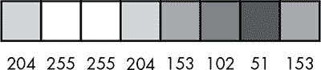

*图 6-3：一行亮度级别*

为了开始 DCT，我们从每个数字中减去 128，这样可以将 0-255 的范围移动到围绕 0 的新范围，因此最大亮度为 127，绝对黑色为 -128。该行的结果亮度级别在 图 6-4 中以折线图表示。

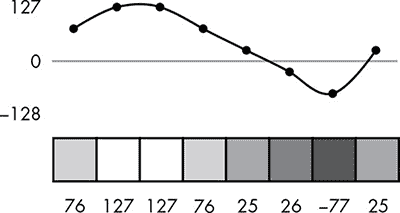

*图 6-4：从每个亮度级别中减去 128，使得可能数字的范围围绕 0 居中。*

离散余弦变换（DCT）生成了八个新数字，每个数字以不同的方式组合了八个亮度级别。图 6-5 显示了上一张图的 DCT。

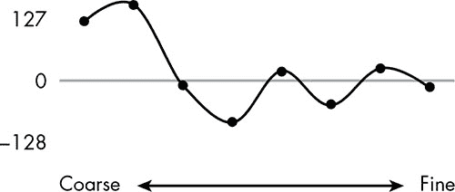

*图 6-5：数据在 图 6-4 中的离散余弦变换。*

请注意，数字按“粗糙”到“精细”的范围标记。DCT 中最左边的数字是亮度级别的最简单组合：它们的总和。因此，第一个数字是像素的总体亮度，对于亮度较高的像素行，它是正数，而对于较暗的像素行，它是负数。第二个数字有效地比较了行左端和右端的亮度级别，在本例中为正，因为我们左边的亮度级别比右边亮。最右边的数字有效地比较了每个亮度值与其邻近的像素，它在这里接近 0，因为 图 6-4 中的数字变化较为平缓。

这些 DCT 数字是由一种叫做 *矩阵乘法* 的操作得出的系数。如果你感到困惑，别担心：这个操作仅仅涉及乘法和加法。我们通过将亮度值与不同的预定向量相乘来生成每个系数。在这个上下文中，*向量* 只是一个有序的数字列表。DCT 中使用的八个向量在 图 6-6 中有示意图。（每个向量中的数字与三角学中的余弦函数相关，这也是离散余弦变换得名的原因，但我们可以忽略这一点，专注于讨论其他内容。）

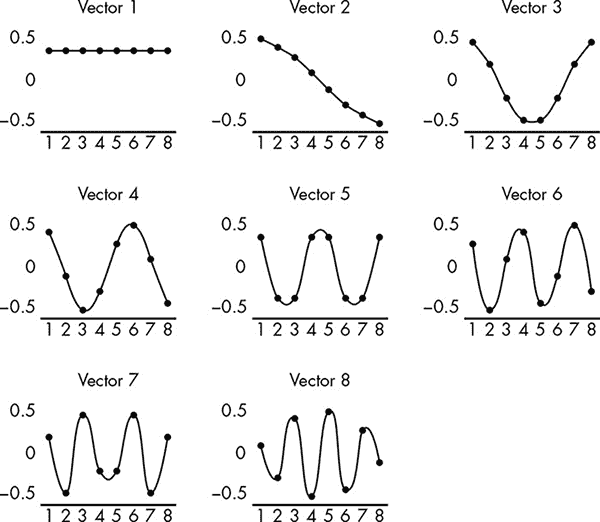

*图 6-6：我们单行 DCT 所需的向量*

为了计算亮度行的系数，我们将向量中每个数字与相同位置的亮度相乘。例如，表 6-5 显示了如何计算亮度行的向量 2 系数。每个亮度行中的数字都与向量 1 中相同位置的数字相乘，然后将这些乘积求和，得到 157.386。

**表 6-5：** 计算向量 2 的系数

| **位置** | **亮度（来自 图 6-4）** | **向量** | **乘积** |
| --- | --- | --- | --- |
| 1 | 76 | 0.49 | 37.24 |
| 2 | 127 | 0.416 | 52.832 |
| 3 | 127 | 0.278 | 35.306 |
| 4 | 76 | 0.098 | 7.448 |
| 5 | 25 | –0.098 | –2.45 |
| 6 | –26 | –0.278 | 7.228 |
| 7 | –77 | –0.416 | 32.032 |
| 8 | 25 | –0.49 | –12.25 |
| 总计 |  |  | 157.386 |

查看 图 6-6 的向量，你可以看到每个向量如何以不同的方式组合亮度级别。由于向量 1 中的每个数值都是相同的正数，因此向量 1 的系数成为整体亮度的度量。由于向量 2 中的数值逐渐从高到低变化，当亮度从左到右在像素行中逐渐下降时，第二个系数为正，而当亮度趋向增加时，系数为负。向量 3 的系数衡量的是行的两端与中间的差异，依此类推。你已经在 图 6-5 中看到了这些结果系数的图示；表 6-6 则通过数字展示了结果。

**表 6-6：** 从样本亮度行的离散余弦变换系数

| **向量编号** | **系数** |
| --- | --- |
| 1 | 124.804 |
| 2 | 157.296 |
| 3 | –9.758 |
| 4 | –87.894 |
| 5 | 18.031 |
| 6 | –49.746 |
| 7 | 23.559 |
| 8 | –13.096 |

这个过程是可逆的：我们可以通过将八个系数与八个不同的向量相乘来恢复原始的亮度数值，这个过程称为 *逆离散余弦变换（IDCT）*。表 6-7 展示了如何从系数中提取第二个亮度值 127。

**表 6-7：** 从系数计算第二个亮度值

| **位置** | **系数** | **向量** | **乘积** |
| --- | --- | --- | --- |
| 1 | 124.804 | 0.354 | 44.125 |
| 2 | 157.296 | 0.416 | 65.393 |
| 3 | –9.758 | 0.191 | –1.867 |
| 4 | –87.894 | –0.098 | 8.574 |
| 5 | 18.031 | –0.354 | –6.375 |
| 6 | –49.746 | –0.49 | 24.395 |
| 7 | –23.559 | –0.462 | –10.833 |
| 8 | –13.096 | –0.278 | 3.638 |
| 总计 |  |  | 127 |

离散余弦变换（DCT）为我们提供了一种不同的方式来存储相同的数字：作为数据之间的关系，而不是数据本身。为什么这很有用？记住，像素之间的细微差别比大范围的差别不那么显眼。稍后你会看到，DCT 如何让 JPEG 格式在压缩细节时比压缩大范围内容更有效。

#### ***二维 DCT***

JPEG 压缩不是在像素行上工作，而是在 8×8 像素块上工作，因此现在让我们来看一下二维 DCT 如何操作。一维 DCT 将八个向量与原始的八个数字相乘，产生八个系数。然而，二维 DCT 需要 64 个 *矩阵*，每个矩阵是一个 8×8 的数字表。像向量一样，每个矩阵将与 8×8 块中的所有 64 个数据相乘。

这些矩阵本身是我们之前看到的向量的二维组合。最容易理解的是通过图示。图 6-7 显示了水平向量 1 与垂直向量 1 的组合。由于向量 1 中的所有数字都是相同的，结果矩阵中的数字也是相同的。在这些矩阵示意图中，较浅的灰色表示较大的数字。

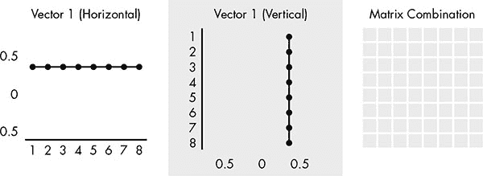

*图 6-7：向量 1 与自身的矩阵组合*

在图 6-8 中，水平向量 1 与垂直向量 2 组合。结果矩阵从上到下逐渐变化，因为向量 2 逐渐变化，但从左到右没有变化，因为向量 1 中的数字没有变化。

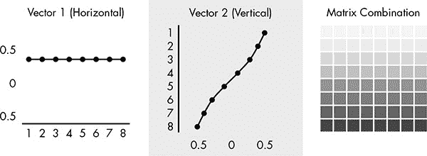

*图 6-8：向量 1 和向量 2 的矩阵组合*

图 6-9 显示了最后一个例子，向量 8 与向量 8 的组合。由于向量 8 在正负之间来回摆动，组合矩阵呈现棋盘格样式。

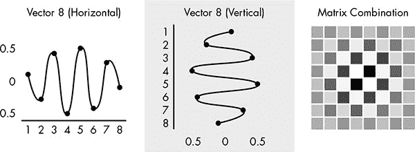

*图 6-9：向量 8 与自身的矩阵组合*

二维离散余弦变换（DCT）将 8×8 块中的每一个 64 个数字替换为一个矩阵系数。图 6-10 显示了用于几个位置的矩阵。与一维 DCT 相似，左上角的系数（在图 6-7 中显示的是相同的）将原始块中的所有数字平均求和。随着我们向下和向右移动，测量的差异变得越来越细。

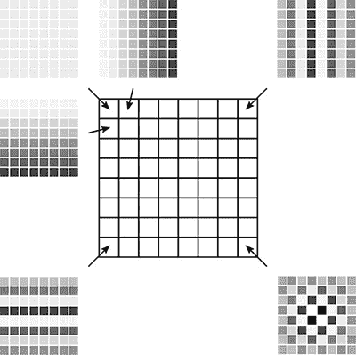

*图 6-10：用于二维离散余弦变换（DCT）的一些矩阵*

为了演示二维 DCT，我将仅使用图 6-11 中显示的像素块的亮度值。

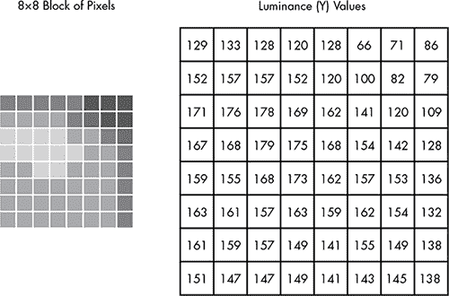

*图 6-11：一个像素块及其关联的亮度（Y）块*

图 6-12 显示了相同的亮度块，其中每个数字都减去 128，使其范围从 –127 到 128，中心为 0。

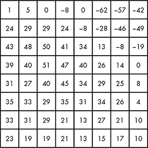

*图 6-12：图 6-11 中的亮度块，值的范围围绕 0 进行居中*

图 6-13 显示了 DCT 后的亮度块。每个数字是通过将图 6-12 中亮度值的矩阵与图 6-10 中的矩阵相乘得到的系数。记住，这些数字也是围绕 0 中心的。例如，左上角的 132 表示整个块的高亮度水平。注意，左上角的数字是最大的（远离 0），这表明广泛的亮度差异比这个像素块中的细微差异要大得多。这一结果是 JPEG 编码照片的典型特征。

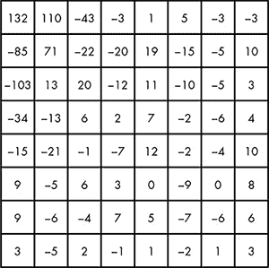

*图 6-13：在图 6-12 中的块的 DCT*

#### ***压缩结果***

现在真正的压缩可以开始，第一步是量化。图 6-14 显示了用于量化亮度块的 8×8 除数块。图 6-13 中系数块中的每个数字都被除以图 6-14 中相同位置的数字，结果四舍五入到最接近的整数。这通过量化误差降低了图像质量，但请注意，图 6-14 中的除数在左上角是最小的。因此，量化误差在测量最细微区别的系数中最为显著，而这些误差最不容易被察觉。除数的实际值根据压缩质量的不同而有所变化，用于量化 Cr 和 Cb 块的除数较大，但除数块始终遵循这一一般模式（左上角的值较低，右下角的值较高）。

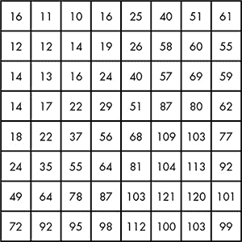

*图 6-14：用于量化亮度块的除数*

我们示例块的量化结果显示在图 6-15 中。

你可以看到这些数字是如何适合于运行长度编码和霍夫曼编码的。大多数系数已经被量化为 0，剩余部分中有许多重复的系数。

量化后，非零结果倾向于聚集在矩阵的左上角，因此量化后的数字以图 6-16 中所示的锯齿形模式列出。

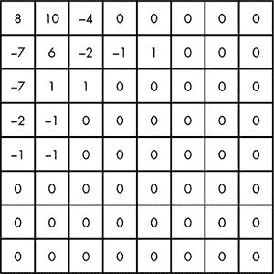

*图 6-15：量化后的亮度块*

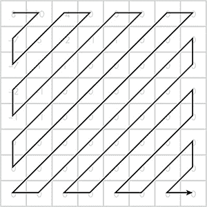

*图 6-16：以锯齿形顺序存储系数*

这种锯齿形模式倾向于在结尾产生非常长的零值运行，正如我们示例中所示：

```
8 10 -7 -7 6 -4 0 -2 1 -2 -1 -1 1 -1 0 0 1 0 0 -1 0 0 0 0 0 0 0 0 0 0 0 0 0 0
0 0 0 0 0 0 0 0 0 0 0 0 0 0 0 0 0 0 0 0 0 0 0 0 0 0 0 0 0 0
```

为了编码零值的运行，我们用一对数字替换列表中的每个非零项：跳过的零的数量（可能没有）和系数本身。例如，列表中的第八个数字是一个 –2，前面有一个 0。它将变成数字对 1, –2。在这一阶段，我们的列表如下所示：

```
0, 8
0, 10
0, -7
0, -7
0, 6
0, -4
1, -2
0, 1
0, -2
0, -1
0, -1
0, 1
0, -1
1, -1
2, 1
2, -1
(all the rest are zero)
```

这些数字对中，例如 0，–1，在这些列表中出现的频率远高于其他对如 0，10。为了实现最大压缩，JPEG 标准为这些列表中的每个可能的数字对定义了霍夫曼编码。例如，常见的 0，–1 对被编码为短霍夫曼码 001，而不常见的 0，10 对则被编码为较长的码 10110010。还有一个特殊的编码 1010，用于表示列表中其余的系数都是 0。我们的列表的霍夫曼编码显示在表 6-8 中。

**表 6-8：** 图 6-15 中系数的霍夫曼编码

| **跳过零值** | **系数** | **霍夫曼编码** |
| --- | --- | --- |
| 0 |   8 | 10110000 |
| 0 | 10 | 10110010 |
| 0 | –7 | 100111 |
| 0 | –7 | 100111 |
| 0 |   6 | 100010 |
| 0 | –4 | 100100 |
| 1 | –2 | 11100110 |
| 0 |   1 | 000 |
| 0 | –2 | 0110 |
| 0 | –1 | 001 |
| 0 | –1 | 001 |
| 0 |   1 | 000 |
| 0 | –1 | 001 |
| 1 | –1 | 11001 |
| 2 |   1 | 110110 |
| 2 | –1 | 110111 |
| (仅剩零值) |  | 1010 |

右侧列中的所有比特串联在一起，表示我们原始亮度块的压缩编码。原始块使用 64 字节或总共 512 位表示亮度级别。而表 6-8 中的编码仅使用 88 位。

两个颜色块 Cr 和 Cb 会表现出更高的压缩率，因为应用于颜色块的除数更大，这产生了更小的数值、较短的霍夫曼编码以及更多的零值进行行程长度编码。总体而言，JPEG 图像通常能够达到 10:1 的压缩比。通过使用比图 6-14 中显示的更小或更大的除数，可以增加或减少压缩量。这些除数通过图像编辑程序中的“质量”滑块进行调整。将滑块移至“低质量”会增加除数，从而减小文件大小，但会增加量化误差。

#### ***JPEG 图像质量***

高压缩比只有在恢复的图像与原始图像无法区分时才有意义，或者几乎无法区分。通常 JPEG 压缩对图像的改变是难以察觉的。为了感受压缩带来的变化，我们可以将原始的亮度值块与压缩和解压缩后的结果进行比较，正如在图 6-17 中所示。

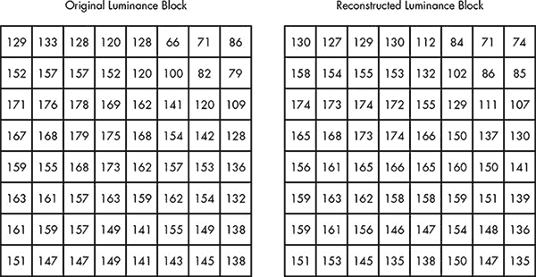

*图 6-17：原始亮度块，以及压缩和解压缩后的结果*

由于很难直观地比较这两个数字块，图 6-18 通过灰度矩阵显示了它们之间的差异。正如你所看到的，矩阵的大部分是中性色灰，表示这些数值与原始值非常接近。


*图 6-19：每个位置的亮度块误差量*

JPEG 图像质量的最佳证据见图 6-19。上方是未压缩的数字照片。由于这张照片是灰度图，我们不需要 RGB 像素颜色，只需要一个字节来表示灰度级别。在 975×731 的分辨率下，这张未压缩的照片需要不到 713 千字节的存储空间。中间是原始照片的压缩 JPEG 版本，仅需 75 千字节的存储空间，几乎无法与原图区分。底部的照片是低质量 JPEG，使用了较大的除数。虽然该照片仅占用大约 7 千字节，但压缩伪影非常明显。许多单独的 8×8 像素块已经变成了相同灰度级别的实心方块。一般来说，JPEG 可以在不牺牲视觉质量的情况下达到 10:1 的压缩比。

### **压缩高清视频**

JPEG 格式在压缩图像方面表现非常出色，几乎没有质量损失，但对于高清视频，我们需要更多的压缩。记住，未压缩的高清视频大约需要 186MBps。单独将每个图像压缩为 JPEG 格式，可以将这一需求降低到约 18MBps——这是一个巨大的改进，但对于流媒体或光盘存储，我们需要将数据压缩到每秒仅几 MBps。

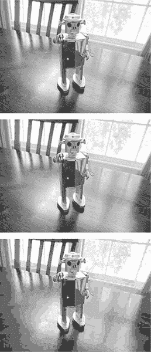

*图 6-18：未压缩照片（上）、高质量 JPEG 压缩（中）、低质量 JPEG 压缩（下）*

#### ***时间冗余***

为了达到这个目标，视频压缩技术利用了图像序列中图像之间的相似性。图 6-20 展示了电影开场字幕的图像序列。


*图 6-20：开场标题序列中的几帧*

这些图像将显示几秒钟；这意味着序列中将包含许多连续的重复帧。此外，即使视频从一张图像过渡到另一张图像，大部分画面保持不变，只有中间区域发生变化。

现在，请参考图 6-21 所示的图像序列。尽管每一帧与下一帧不同，但每一帧中都有相同的元素，只是它们在屏幕上的位置不同。


*图 6-21：带有移动物体的图像序列*

这些示例展示了两种不同形式的*时间冗余*，即从一帧到下一帧的数据连续性。利用这种冗余的压缩称为*时间压缩*，正如我们将在下一节中看到的，它是实现视频流媒体和存储所需压缩比的关键。

#### ***MPEG-2 视频压缩***

*MPEG-2*是一种常见的视频格式，支持蓝光光盘和数字广播电视，它采用了一种时间压缩方法。虽然更先进的技术已经存在，但它们是对这里展示的思想的扩展。

##### **图像组**

MPEG-2 视频被划分为大约 15 帧的序列，称为*图像组（GOPs）*。每个 GOP 中正好有一帧被选为基本的 JPEG 编码图像，称为*内编码帧（I-Frame）*。这帧是整个 GOP 的基石。其他所有帧都使用时间压缩，这意味着它们不是以图像中像素的绝对颜色存储，而是通过这些颜色与 GOP 中其他图像的颜色差异来存储，稍后我们将详细了解。

组内的其他帧被分配为两种类型之一，*预测帧（P-Frames）*和*双向帧（B-Frames）*。P 帧存储其像素与前一帧像素之间的差异，而 B 帧则存储其像素与前一帧*和*后一帧像素之间的差异。

如图 6-22 所示，一个 GOP（图像组）中包含箭头，表示时间压缩所引用的帧。如你所见，一切都依赖于 I 帧。在播放过程中，I 帧必须先于其他任何图像解码，之后，直接引用 I 帧的其他帧才能解码，以此类推。

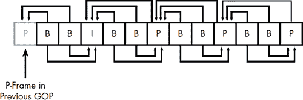

*图 6-22：一个 GOP，或图像组*

以这种方式对图像进行分组简化了编码和解码过程，同时也限制了引用“链条”的长度。就像复印复印件一样，时间压缩的链条越长，图像就越模糊。I 帧的定期出现也是你能够在快进或倒带时看到图像的原因；视频播放器只需提取 I 帧，这些帧可以独立于其所在 GOP 的其他帧进行解码和显示。

MPEG 规范赋予编码软件在形成 GOP 时较大的自由度。I 帧的数量直接决定了 GOP 的大小，由编码器决定，B 帧的数量也由编码器决定，这些 B 帧位于其他帧类型之间。与 JPEG 量化中使用的除数类似，调整三种帧类型的相对数量提供了一种在质量与压缩之间的权衡。在压缩至关重要的应用中，例如视频会议，I 帧较少，而 B 帧较多；而在蓝光光盘中，编码器会尽可能多地使用 I 帧，同时确保所有视频数据能够装入光盘。

##### **时间压缩**

那么 P 帧和 B 帧的时间压缩是如何工作的呢？在这个例子中，我们通过引用 I 帧来压缩 P 帧。首先，P 帧中的像素被划分为 16×16 的*宏块*。对于每个宏块，在 I 帧中搜索与其颜色数据相匹配的像素块。然而，这个匹配的块可能不会出现在 I 帧的完全相同位置，因此它由*偏移量*表示：即 P 帧位置和 I 帧位置之间的差异，表示为屏幕坐标。例如，偏移量为-100, 50 表示该宏块在 I 帧中的位置比在 P 帧中的位置左移 100 像素、下移 50 像素，如图 6-23 所示。

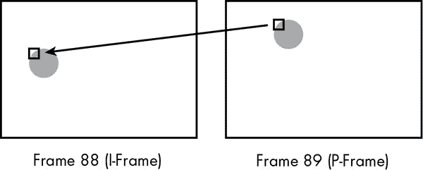

*图 6-23：P 帧中的一个宏块，引用了前一帧中匹配的像素块*

在大多数情况下，无法找到完全匹配，因此除了存储最佳匹配的位置外，还必须存储两个宏块之间的差异。图 6-24 展示了 P 帧中的一个亮度块及其在 I 帧中的最佳匹配。（为了使示例更易于理解，我使用了 8×8 的块，而不是完整的 16×16 宏块。）

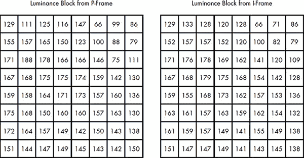

*图 6-24：亮度块及其在前一帧中的最佳匹配*

接下来，计算差异块：将 I 帧块中的每个数值从 P 帧块中相同位置的数值中减去。我们的示例结果如图 6-25 所示。

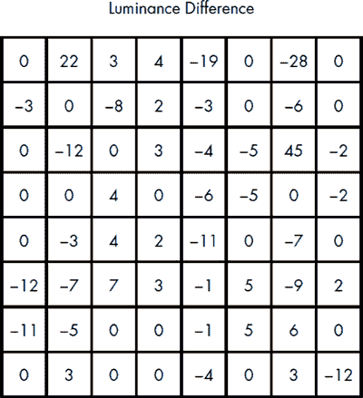

*图 6-25：两个亮度块之间的差异，如图 6-24 所示*

由于这些块非常接近匹配，因此这些值都很小。这是一种预测编码的形式，就像本章前面展示的温度列表一样。通过存储差异，我们大大缩小了数据的范围，因此更容易进行压缩。当我们应用离散余弦变换（DCT）并量化结果时，数字变得极其微小，如图 6-26 所示。

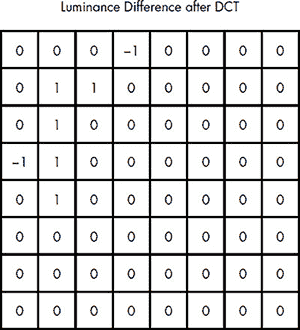

*图 6-26：量化图 6-25 中块并应用离散余弦变换（DCT）的结果*

该块对压缩的最后阶段非常敏感：即行程长度编码和哈夫曼编码的结合。如表 6-9 所示，原始的亮度块已被压缩至仅 39 个比特。

**表 6-9：** 图 6-26 中数字的哈夫曼编码

| **行程长度** | **系数** | **哈夫曼编码** |
| --- | --- | --- |
| 4 |   1 | 1110110 |
| 1 | –1 | 11001 |
| 0 |   1 | 000 |
| 0 |   1 | 000 |
| 0 | –1 | 001 |
| 1 |   1 | 11000 |
| 7 |   1 | 111110100 |
| （只剩下零） |  | 1010 |

并非 P 帧中的每个宏块都以这种方式编码。在某些情况下，一个宏块可能与前一帧中的任何像素块相似度不足，无法通过存储差异来节省空间。这些宏块可以像 I 帧中的宏块一样直接记录。对于 B 帧，匹配的宏块可以在前一帧或后一帧中找到，这提高了匹配的几率。

#### ***带有时间压缩的视频质量***

时间压缩依赖于时间冗余——即变化较少的帧序列。因此，某些视频比其他视频压缩得更好。像《科洛弗档案》或《女巫布莱尔计划》这样的电影，由于镜头运动频繁，压缩较为困难；而像《2001 太空漫游》这类长镜头、摄像机不动的电影则理想适合压缩。

最终，视频压缩既是一门艺术，也是一门科学。如前所述，不同的 MPEG-2 编码器对同一组图像序列可能会产生不同的结果。较短的 GOP（更多 I 帧、较少 B 帧）会产生更好看的视频，而较长的 GOP 则意味着更好的压缩效果。编码器可以根据时间冗余的程度来调整帧的组合，在高时间冗余时使用较长的 GOP，在冗余较低时使用较短的 GOP。此外，优秀的编码器会尽量使 GOP 边界与电影中的明显剪辑对齐；如果你曾看到过在场景切换时视频瞬间变得非常块状，那很可能是因为 GOP 跨越了这个剪辑。

还有一个性能问题，尤其是当视频实时压缩时，比如直播事件。可能没有足够的时间在另一帧中找到宏块的最佳匹配。

播放质量也可能有所不同。例如，由于帧被拆分成单独处理的宏块，可能会在宏块的边界出现接缝。为减少这种效果，解码器可能会应用*去块滤镜*。这通过对像素颜色进行平均来平滑块边界，就像前几章展示的抗锯齿方法一样。滤镜的强度可以根据边界干净的可能性进行调整。例如，在 B 帧中，如果一个宏块引用了前一帧，而相邻的宏块引用了后一帧，那么边界粗糙的可能性更大，这时需要更强的滤镜处理。

在其他情况下，视频的分辨率和显示分辨率可能不匹配。例如，当你在高清电视上播放老电视剧*Adam-12*（不仅仅是我对吧？）时，电视机或播放器必须将原始的 640×480 图像转换为填充 1920×1080 显示屏。这与我们在第五章中解决的纹理映射问题相同——将位图应用到更大的区域——视频设备也可以采用类似的技术。早期的高清播放器实际上使用了最近邻采样，这产生了较差的效果。较新的播放器采用了类似三线性过滤的技术。不同的是，它们不再在 mipmap 中的两个不同级别的双线性样本之间进行混合，而是在连续的帧之间进行混合。这在平滑运动物体方面尤其有效。

尽管播放一个时间压缩视频的计算量不如原始编码那么强烈，但仍然需要处理器进行大量的计算。此外，GOP 的结构要求解码帧的顺序与实际顺序不同。这也意味着需要对帧进行*缓冲*，在显示前将其保存在队列中。对于流媒体视频，使用了更大的缓冲区，以便网络中的小问题不会中断播放。

### **视频压缩的现状与未来**

最新的视频压缩标准，H.264 或 MPEG-4，扩展了 MPEG-2 中使用的技术，但并没有根本性的不同。主要的区别在于改进了宏块匹配的质量。宏块不再仅与一帧或两帧进行匹配，而是可以与 32 帧进行匹配。此外，16×16 的宏块本身还可以分解为单独匹配的 8×8 块。

通过这样的改进，MPEG-4 通常能够在相同的质量下实现 MPEG-2 的两倍压缩比。因此，MPEG-4 已成为流媒体和存储领域的行业标准。大多数蓝光视频都使用它，YouTube 和 Netflix 也在使用它。它的主要竞争对手是名为 Theora 的格式，Theora 使用类似的压缩方法，但它是免费的许可，而不像专有的 MPEG-4。

今天的压缩格式在缩小视频数据方面表现出色，但它们的计算成本非常高。下次你在 YouTube 上观看一个视频片段时，可以想想 GOP，所有宏块如何从一帧到下一帧被复制和更新，以及执行 DCT 时进行的所有数字运算。为了展示一只猫从钢琴上掉下来，进行这些计算是一项令人头晕的工作。

未来将需要更多的计算能力。像彼得·杰克逊的*《霍比特人》*系列电影中所展示的*超高清（UHD）*格式，正在逐渐进入家庭视频领域。UHD 图像的分辨率为 3840×2160，是当前高清分辨率的四倍。帧率也将增加，从今天的 24 或 30 帧每秒提高到 48、60，甚至 120 帧每秒。UHD 视频可能会将比特需求从今天的 1,400Mbps 增加到超过 23,000，这将需要相应增加带宽和磁盘存储容量——除非有聪明的人能提出一种更好的方法，让软件能够压缩数据。
