## **7**

**搜索**

本章讨论的是一个或许比本书中其他任何主题都更为我们所忽视的话题：找到我们想要的数据，也就是*搜索*。搜索如此频繁且迅速，以至于我们常常忽视了其中的“魔法”。当文字处理软件为你刚输入的错别字加上下划线时，背后已经进行了快速的搜索。当你输入文件名的一部分并得到笔记本硬盘上匹配的文件列表时，那也是一次几乎瞬间完成的搜索。而还有终极搜索成就：万维网。万维网庞大到我们只能猜测它的真实规模，然而，网页搜索引擎可以在不到一秒的时间内找到相关的网页。

软件是如何如此快速地找到我们想要的东西的呢？

### **定义搜索问题**

让我们从理清术语开始。一组数据被称为*数据集*。数据集中的每一项被称为*记录*。每条记录通过一个*键*（与密码学术语无关）来唯一标识。搜索会检索出与给定键匹配的记录。举个现实中的例子，当你使用字典时，你查找的单词就是键，而该单词的定义就是记录。

搜索的主要目标是找到正确的记录。但搜索的速度同样重要。如果搜索可以无限进行，搜索就会变得简单。但随着等待时间的增加，我们的沮丧感也会增加。我们愿意等待的搜索时间是有差异的，但通常不会很长，在许多情况下，搜索必须看起来几乎是瞬间完成的。

### **将数据排序**

高效的搜索需要井井有条的数据。当你去书店时，比如说，按作者的姓氏排列书架上的书籍，找到某个特定作者的小说就很容易。首先，你知道从哪里开始寻找。你看到书架上的第一本书，看到它的作者名字按字母顺序离你要找的作者名字有多近，你就能大致知道接下来该去哪里找。

如果书店没有按照任何特定顺序排列书籍，那么找一本书就会变得非常困难。最好的办法是从书架的一端开始，逐本检查，这叫做*顺序搜索*。在最糟糕的情况下，你想要的书甚至不在书架上，但直到你查看完所有书籍之前，你都不会知道这一点。

因此，将数据集按特定顺序排列，也就是*排序*，对于高效的搜索至关重要。有许多不同的排序方法；为了描述不同的排序算法，已经出版了整本书。我们将在这里介绍两种方法。

#### ***选择排序***

如果我让你将一个数字列表排序，你很可能会使用被称为*选择排序*的方法。首先，你会扫描列表找到最小的数字，然后将该数字删除并复制到新列表中。你会重复这个过程，直到所有数字都在新的已排序列表中。

九个数字的选择排序的前三步显示在图 7-1 中。在第一步中，最小的数字被复制到新列表的开头。在接下来的步骤中，剩余的最小数字被复制到新列表中。

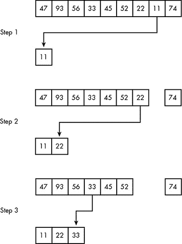

*图 7-1：九个数字的选择排序的前三步*

#### ***快速排序***

虽然选择排序很容易理解，但软件中很少使用它，因为它效率低下。每一步都需要处理未排序列表中的每个数字，而为了这些努力，我们仅仅得到一个数字排到了正确的位置。

一种更好的排序方法叫做*快速排序*，它在每次遍历时部分排序所有处理过的数据，从而减少了后续的工作量和时间。我们不需要扫描整个列表来找到最小的数字，而是选择列表中的一个数字作为*基准*。我们利用基准来*分区*列表，将列表围绕基准进行划分。小于基准的数字移到列表前面，大于基准的数字移到列表后面。

在这个例子中，我们将使用与选择排序相同的数字列表。图 7-2 显示了分区的第一步。快速排序的不同版本选择基准的方式不同；我们为了简便起见，选择列表中的第一个数字 47 作为基准。接下来的数字 93 由于大于 47，因此被复制到新列表的末尾。

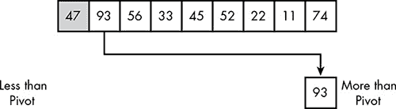

*图 7-2：数字 93 大于基准，因此它移到新列表的末尾。*

在图 7-3 中，56 同样大于 47，因此它被复制到末尾的下一个位置。

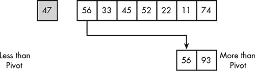

*图 7-3：数字 56 大于基准，因此它移到新列表的末尾。*

在图 7-4 中，33 小于 47，因此它被复制到新列表的前面。

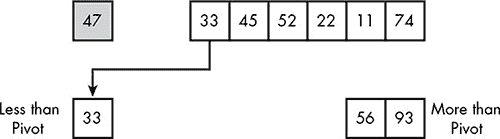

*图 7-4：数字 33 小于基准，因此它移到新列表的前面。*

图 7-5 合并了接下来的五个步骤。剩余的三个数字移到列表前面，两个数字移到列表后面。这留下了一个空位，等待填充一个数字。

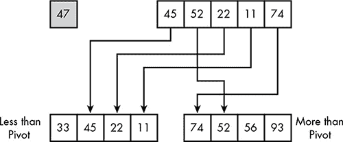

*图 7-5：列表中剩余的数字被分区。*

在图 7-6 中，这个空位被 47 填充，即基准数字。这完成了初始的分区过程。

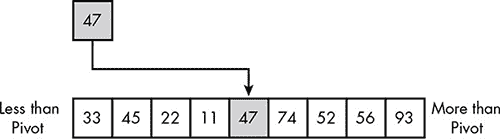

*图 7-6：基准填补了新列表中的空位。*

这个新列表尚未排序，但比之前的状态更好。枢轴已经放在了正确的排序位置，用阴影标识出来。列表中的前四个数字小于 47，而最后四个数字大于 47。一次分区不仅仅是将一个数字放到正确的位置，就像选择排序的一步；它还将剩余的数字划分成子列表，如图 7-7 所示。这些子列表可以独立排序。排序两个较短的列表比排序一个较长的列表需要的努力要少。如果你对此有所怀疑，考虑一个极端的情况：你宁愿排序 50 个包含 2 个数字的短列表，还是一个包含 100 个数字的长列表？

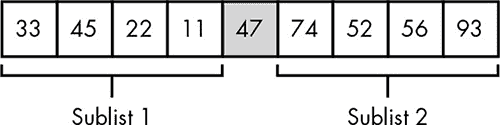

*图 7-7：分区已经将列表转变为两个独立的小列表，可以独立排序。*

现在，两个子列表已经独立分区。在图 7-8 中，子列表中的第一个数字 33 成为新的枢轴，子列表 1 中的四个数字被分区。这将 22 和 11 放在 33 的左侧，将 45 放在右侧。

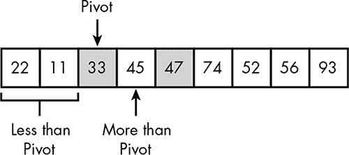

*图 7-8：对图 7-7 的子列表 1 进行分区*

在图 7-9 中，子列表 2 使用 74 作为枢轴进行了分区。

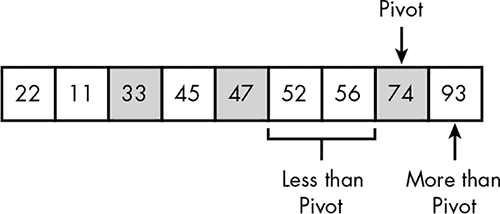

*图 7-9：对图 7-7 的子列表 2 进行分区*

这些分区将它们的两个枢轴放在了正确的排序位置。这些分区还创建了四个新的子列表，如图 7-10 所示。

*图 7-10：现在剩下四个子列表。单一数字的子列表是琐碎的。*

子列表 4 和 6 包含单一数字，这意味着没有需要分区的内容。在图 7-11 中，子列表 3 和 5 已被分区。

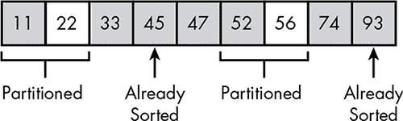

*图 7-11：只剩下两个琐碎的子列表，意味着整个列表已排序。*

现在我们只剩下两个单一数字的子列表，这意味着排序已经完成。

在这个例子中，枢轴均匀地划分了它们的分区，但快速排序并不总是如此幸运。有时分裂是不均匀的，最糟糕的情况是枢轴可能是列表中最小或最大数字，这意味着分区的结果与选择排序的某一步相同。但大多数分区会大致均匀，这通常会导致更快的排序。

更一般来说，快速排序比选择排序*扩展*得更好。对于任何排序方法，排序时间会随着数据集合大小的增加而增加，但选择排序的速度下降比快速排序要快得多。假设一台特定的计算机可以用两种方法在大约一秒钟内排序 10,000 条记录。在同一台计算机上，选择排序 1,000,000 条记录大约需要 3 小时，而快速排序只需要约 11 分钟。

### **二分查找**

当数据是有序时，软件可以轻松找到特定的记录。对于有序数据，一种简单的查找方法是 *二分查找*。在这里，*二分*一词并不是指二进制数字，而是指在两种选择之间做出决策。

图 7-12 展示了二分查找的实际操作。我们要查找的记录的键值为 48。最初，我们知道的是集合中的数据按照键值排序，因此记录可能出现在任何地方。在第一步中，我们检查集合中间的记录。如果这条记录的键值为 48，那我们就完成了查找，但这不太可能。然而，由于这条记录的键值为 62，超过了 48，我们知道目标记录必须出现在前七条记录中。因此，检查这一条记录不仅排除了它本身，也排除了集合中之后的七条记录。

在第二步中，我们检查第四条记录，它是剩余七条记录的中点。这条记录的键值为 23，低于 48。因此，目标记录必须出现在 23 和 62 之间的三条记录中。

在第三步中，我们检查这三条记录中的中间记录，它的键值为 47。这告诉我们目标记录一定是 47 和 62 之间的那一条。如果那条记录的键值不是 48，那就意味着集合中没有键值为 48 的记录。

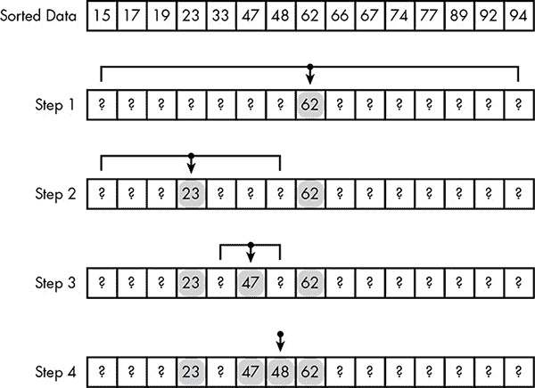

*图 7-12：二分查找通过四步在 15 条记录的集合中找到特定记录*

每一步二分查找都会将一半的记录从考虑范围中排除，这意味着二分查找的扩展性非常好。对于顺序查找来说，数据集合大小翻倍意味着平均查找所需时间也会翻倍。而对于二分查找来说，记录数翻倍只需要多一步。例如，如果我们从 31 条记录开始，检查中间记录后，要么我们运气好找到了目标记录，要么我们知道目标记录是在前 15 条记录还是后 15 条记录。无论哪种情况，我们现在只需要继续查找剩下的 15 条记录，这就相当于回到了 图 7-12 所示的状态。对于庞大的数据集合，二分查找与顺序查找之间的差距是巨大的。顺序查找 1,000,000 条记录平均会检查 500,000 条记录，而二分查找 1,000,000 条记录最多只需检查 20 条。

### **索引**

为了简化示例，我们到目前为止使用的仅仅是记录的键值。然而，实际上，记录的其余部分必须存储在某个地方，这可能会引发问题。为了理解原因，我们需要明白在为数据分配存储空间时，软件所面临的选择，无论是在主存、硬盘，还是其他地方。

*固定大小*存储分配为每个记录分配相同的空间，适用于大小始终相同或有小的最大大小的数据。例如，信用卡号码始终是 16 位数字。另一方面，信用卡持有人的名字长度不一，但卡片上只能容纳有限数量的字母。信用卡号和持卡人姓名都可以存储在固定字节数中。在图 7-13 中，姓氏的最大长度为 15 个字符，正好够 "Hammond-Hammond"。其他名字较短，导致浪费的字节如阴影方块所示。然而，由于存储名字所需的空间很小，这些浪费的空间并不构成大问题。

*图 7-13：固定存储分配导致空间浪费*

*可变大小*存储分配精确适应数据的大小。考虑一组 MP3 文件。粗略地说，歌曲越长，MP3 文件就越大。一首短小的流行歌曲可能是 3 或 4MB，而一首渐进摇滚史诗可能大到 20MB。我们不希望将歌曲数据存储在固定大小的空间中，因为这样会浪费过多空间用于较短的歌曲，同时也会限制歌曲的长度。相反，数据应该存储在正好满足需求的空间中。

可变大小存储分配高效利用空间，但软件需要固定大小存储分配来使用高效的查找方法。当集合中的所有记录大小相同时，软件可以快速找到某个特定位置的记录。

这是因为存储位置是通过数字 *地址* 来标识的。数字存储中的每一个字节——无论是在计算机的主内存中，还是在闪存驱动器或硬盘上——都可以通过其地址精确定位。例如，如果一台计算机有 8GB 的主内存，那么这些字节的编号从零开始，直到超过 8 万亿。固定大小记录的集合是连续存储的，这使得查找记录的地址变得简单。假设一个集合有 100 个记录，每个记录 20 字节，且该集合从地址 1,000 开始。这意味着第一个记录位于地址 1,000，第二个记录位于地址 1,020，第三个记录位于 1,040，以此类推。我们可以通过将记录的位置编号乘以 20 并将结果加到 1,000 来计算任何记录的地址。这样，软件就能快速定位任何固定大小记录集合中的记录。

快速查找记录对于像二分查找这样的算法至关重要。如果没有固定大小的记录，查找某个特定位置的记录唯一的方法是从数据集的开始处开始，并逐一计算记录。这就是顺序查找，完全违背了高效查找的初衷。

选择固定大小或可变大小的存储分配意味着在高效搜索和高效存储之间做出选择。然而，一种叫做*索引*的技术使我们能够同时拥有这两者。索引将键与其余记录分开，就像图书馆卡片目录使读者可以先在卡片上查找书籍，再从书架上取书一样。

索引是记录键和值地址的表。地址本身作为二进制数存储，具有固定的位数。例如，当微软发布“32 位”和“64 位”版本的 Windows 时，这些位数指的是主内存地址的大小。由于地址是固定大小的，我们可以将地址和键一起存储在一个固定大小的索引记录中，并使用类似二分查找的方法高效地进行搜索。每条记录的其余数据存储在一个可变大小的分配区域中。这种方式产生的数据集合在存储*和*搜索上都很高效。

图 7-14 展示了一个包含四首歌曲的索引数据集合。左侧是索引，包含每首歌的歌名和其余数据的地址，如艺术家名称和编码的音乐。右侧是一个从 1 到 400 编号的内存单元块。箭头指向每个地址。

如示例所示，这种分离的数据分配方式允许每条记录根据需要使用多大或多小的空间。它甚至允许索引和剩余数据存储在不同的存储设备上。例如，索引可能保存在计算机的快速主内存中，而编码的音乐数据则存储在相对较慢的硬盘上。由于只需要索引进行搜索，这种安排使得在使用最少主内存的情况下实现高效搜索。

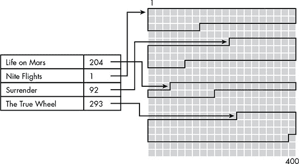

*图 7-14：数字音乐的索引数据集合*

我们也可以为同一数据集合设置多个索引。图 7-14 中的排列方式允许通过歌名快速定位单独的歌曲，但对于根据艺术家名称或专辑标题搜索歌曲没有帮助。数据集合可以有多个索引以满足不同的搜索标准，并且因为主记录数据只是通过地址进行引用，拥有多个索引并不会显著增加数据集合的总存储需求。

### **哈希**

虽然有序数据对高效搜索是必需的，但排序数据需要时间。到目前为止，我们讨论排序时，仿佛数据集合只需要排序一次。有时确实如此；例如，文字处理程序需要一个正确拼写单词的列表用于拼写检查，但该列表只需创建一次，并作为应用程序的一部分提供。拼写检查单词列表是一个 *静态* 数据集合，很少发生变化。然而，我们搜索的许多集合是 *动态的*——记录会频繁地添加或删除。由于高效的搜索需要有序数据，集合必须在每次添加或删除后重新排序。当插入和删除操作很频繁时，重新排序数据集合所花费的时间可能会抵消搜索速度的提升。在这种情况下，更好的做法是构建数据结构，以便频繁的变更操作。

一种简化记录添加和删除的数据结构涉及哈希函数，它们在第二章中有所介绍。以这个例子为例，我们可以想象一个哈希函数，它生成一个仅为 3 位的哈希，相当于 0 到 7 之间的十进制数。我们可以利用它在一个 *哈希表* 中存储记录，哈希表有 8 个槽位。*槽位*是一个可能存放记录的地方。

要将一条记录存储在哈希表中，我们对记录的键进行哈希，以确定使用哪个槽位。假设我们正在存储带有歌曲标题作为键的 MP3 文件。表 7-1 显示了四个标题及其相关的哈希码。

**表 7-1：** 示例歌曲标题的哈希码

| **歌曲标题** | **哈希码** |
| --- | --- |
| Life on Mars | 6 |
| Nite Flights | 4 |
| Surrender | 1 |
| The True Wheel | 4 |

图 7-15 展示了插入 表 7-1 中前三首歌曲后的哈希表。每条记录的第一列是一个比特，如果槽位在使用中则为 1，如果不在使用中则为 0。第二列是标题，第三列保存剩余数据的地址。

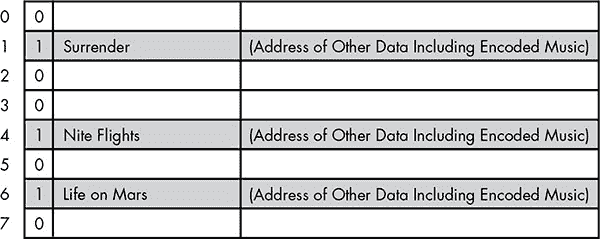

*图 7-15：一个八槽哈希表*

哈希表的优点是搜索实际上并不需要进行查找。我们只需通过哈希函数处理键，结果会告诉我们记录应该存放在哪里。如果该槽位没有记录，我们立即知道集合中没有该键的记录。更好的是，哈希表避免了排序的工作量。这使得哈希表成为一个非常适合频繁添加和删除记录的集合的选择。

然而，我们并没有插入列表中的第四首歌曲。歌曲标题“The True Wheel”哈希到 4，和“Nite Flights”相同。如你在第二章中所记得的，哈希函数并不能保证对每个输入产生不同的哈希值，事实上，一些匹配的哈希值，或者*碰撞*，是不可避免的。由于每个插槽只能放置一个记录，我们需要一个处理碰撞的规则。最简单的规则是使用碰撞点之后的第一个空插槽。因为插槽 4 已经被“Nite Flights”占用，所以我们会将“The True Wheel”放入下一个空插槽，即插槽 5，如图 7-16 所示。

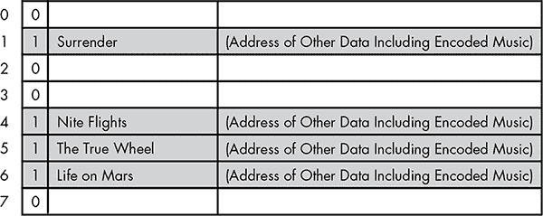

*图 7-16：解决碰撞问题。第二首哈希到 4 的歌曲被放入下一个空插槽，即插槽 5。*

这解决了碰撞问题，但它使得哈希表的使用变得更加复杂。

有了这个碰撞规则，查找记录不再是一个一步的过程。每次搜索仍然从哈希码所指示的插槽开始，但随后会依次检查插槽，直到找到匹配的歌曲标题。如果搜索达到一个空插槽，则说明歌曲不在集合中。

碰撞还可能导致记录被存储在与哈希码所指示的位置相距较远的地方。例如，如果插入一个哈希码为 5 的标题到图 7-16 所示的表中，即使之前没有任何歌曲标题哈希到 5，插槽已经被“The True Wheel”占用，因此新歌曲会移动到插槽 7。随着哈希表的填充，这种情况变得更加常见，导致搜索性能下降；实际上，一些哈希表搜索变成了小型的顺序搜索。

碰撞还使得记录的删除变得复杂。假设“ Nite Flights”从图 7-16 中的哈希表中删除。删除记录的显而易见的方法是将插槽标记为“空”，但那样并不奏效。为了理解原因，请记住，歌曲标题“The True Wheel”曾哈希到 4，并且该歌曲被存储在插槽 5 中，只有当时插槽 4 被占用。搜索“The True Wheel”将从插槽 4 开始，如哈希码所示，找到插槽为空并结束搜索，无法找到该歌曲。该歌曲仍然在索引表中，但通过哈希搜索无法找到。

为了避免这个问题，我们可以删除歌曲数据，但保留插槽标记为已占用，如图 7-17 所示。

插槽 4 现在被称为*墓碑*。通过在删除数据时将插槽标记为已占用，我们确保搜索仍然有效。然而，墓碑会浪费空间。此外，由于表格实际上并没有释放任何记录插槽，因此拥塞的性能问题依然存在。

基于这些原因，哈希表会定期进行*重新哈希*。当表中的某个槽位被占满到一定比例时，便会创建一个新的、更大的表，并且原表中的每个键值都会使用新的哈希函数重新进行哈希，生成一个新的、稀疏的表，并且不再包含任何“墓碑”条目。

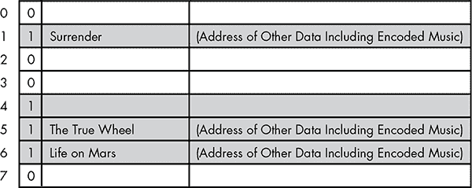

*图 7-17：删除其数据后，保持槽 4 标记为占用*

### **网页搜索**

本章中展示的所有技术都需要高效地搜索大型数据集，而没有比网络更大的数据集了。像 Google 这样的搜索引擎依赖于庞大的索引，其中的关键字是搜索词，地址是 URL，网页是记录。Google 索引的大小估计约为 100 PB（拍字节），即 100,000,000 GB。要在如此庞大的索引中找到某个内容，必须使用所有最佳的搜索技术。尽管这些技术有助于说明如何搜索如此庞大的索引，但它们并没有告诉我们这个索引最初是如何创建的。

搜索引擎使用*机器人*，即无需直接人工干预的程序，来建立它们的索引。这些机器人会遍布整个网络。从某个特定的网页开始，它们会列出该页面上的所有链接。然后，这些链接的页面会被处理，以寻找其他页面的链接，以此类推。最终，机器人会获取到网络上大部分的内容链接。

然而，有些内容更难以定位。有些页面无法从网站的主页访问，而是通过网站自己的搜索引擎找到。例如，新闻网站可能不会链接到较老的文章，但提供了本地搜索功能来查找其存档。这些未链接但有价值的内容被称为*深网*。将深网内容纳入搜索引擎索引通常需要网站的帮助。网站管理员可以通过几种方式为网页爬虫提供“目录”，例如一个叫做*Sitemap*的文档。这个文档得名于一些网站提供给用户快速找到所需内容的*网站地图*页面，但它有一个特定的格式，便于机器人处理。网站地图帮助搜索引擎及时更新内容变化，尤其对那些拥有大量深层内容的网站特别有用，这些内容否则可能会被排除在搜索引擎索引之外。

#### ***排名结果***

当机器人收集页面时，搜索引擎会挖掘页面中的关键词，并统计每个关键词在每个页面上出现的频率。早期的搜索引擎只是简单地列出关键词及其页面计数。如果你搜索*蛋糕*，出现*蛋糕*关键词频率最高的页面将排在返回结果的最前面。这看起来很合逻辑，但仅仅根据字数统计并不能提供我们现在认为的优秀搜索结果。

第一个问题是，系统太容易被某些人利用来谋取个人利益。假设某个售卖假冒药品的网站运营者想要获取大量流量，而不在乎如何实现这一目标。当运营者发现大批人正在搜索*煎蛋卷食谱*时，他可能会尽可能多地将这些词语放在首页上，甚至将这些词语隐藏在后台的格式化代码中。结果，网站可能会出现在煎蛋卷食谱的搜索结果的前几名，尽管网站上根本没有这类食谱。词频并不保证搜索词和内容之间的匹配。

另一个网站运营者可能会建立一个真正与煎蛋卷相关的网站，但网站内容充满了从维基百科偷来的内容，以便通过广告获得零胆固醇蛋替代品的收入。在这种情况下，词频确实将搜索词与匹配内容联系起来，但内容质量很差。

根本的问题在于，网站自我报告其内容的性质和质量。缺失的是一个无偏的观众的意见。理想情况下，搜索引擎可以雇用一支审查员队伍来确定页面的主题以及它们覆盖话题的质量。然而，由于网络庞大且不断变化，这几乎是不可能的。

相反，搜索引擎依赖其他网站的意见。这些意见通过*外部链接*的形式获取。指向某个页面的链接数量是衡量该页面在在线社区中被看作多么有价值的一个良好指标。在图 7-18 中，C 页有四个外链，D 页没有外链，其他页面每个都有一个。仅凭这一点，C 页看起来是最有价值的资源，而 A、B 和 E 则显得同样有用。

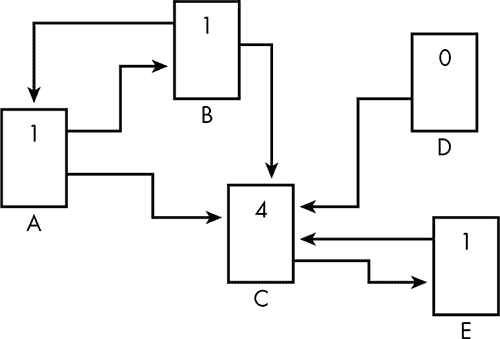

*图 7-18：指向页面的链接数量是搜索引擎用于确定排名的一个因素。*

然而，故事还不止于此。具有大量外链的页面会为它所链接的页面加分。在前面的图中，三页只有一个外链，但每个链接的质量不同。E 页是从 C 页链接过来的，而 C 页有很多外链；而 A 页和 B 页只是相互链接。将每个链接的质量考虑到链接计数中，有助于打破*链接农场*，即大量无意义的网站通过免费的托管服务创建，目的是增加目标网站的外链数。

实际上，这将网络转变为一系列自组织的专家社区。当多个受人尊敬的烹饪网站开始链接到一个新的煎蛋卷网站，而该网站又反向链接到已建立网站中的煎蛋卷相关内容时，新网站便被纳入在线烹饪社区。此后，新网站的链接与老牌网站的链接同样重要。

#### ***有效使用索引***

虽然建立索引是搜索引擎工作的主要部分，但索引在搜索过程中如何使用同样重要。良好的搜索结果需要关注细节。

首先，搜索引擎不能仅仅将提供的搜索词作为关键词。考虑到词形的差异，你可能会在搜索框中输入*frozen rain*，但大多数相关信息的页面使用的是*frozen rain*的变体形式*freezing rain*。通过将不同形式的关键词在其索引中关联起来，搜索引擎能够最大化搜索结果的有效性。这个思路同样适用于同义词。因为*insomnia*和*sleeplessness*的意思相同，搜索任何一个词都会产生相似的结果，尽管有些页面主要使用其中一个词。例如，关于失眠的维基百科条目在这两个搜索词的前几个结果中都会出现，尽管在撰写本文时，*sleeplessness*一词仅出现在文章中两次，而*insomnia*一词出现了 200 多次。

然而，这些搜索词的结果并不完全相同。搜索*insomnia*时还会出现 2002 年电影《*Insomnia*》的链接，但搜索*sleeplessness*时这些链接却不会出现。这一结果是合理的——可以推测，搜索电影的人不会使用电影标题的同义词——但是，搜索引擎怎么知道这两个词在某些情况下相关，而在另一些情况下则无关呢？

跟踪搜索词的组合可以提供宝贵的线索。如果搜索者经常在*insomnia*一词后加上*movie*或*film*等词语，那么仅搜索*insomnia*可能表明搜索者对电影感兴趣，而非对这一医学问题的关注。

此外，搜索结果页面上的链接实际上并不是直接链接到列出的页面。相反，它们是*跳转链接*。例如，如果你在谷歌搜索*insomnia*，然后点击维基百科条目的链接，你首先会被带到 google.com 服务器，然后再被重定向到[wikipedia.org](http://wikipedia.org)。谷歌会追踪你选择了哪个结果，且这些数据是从无数用户身上收集的，能够帮助谷歌不断优化搜索结果，将用户真正觉得有用的链接排在前面。

搜索引擎还可以利用搜索者的位置。例如，当你在某个城市搜索*smiley’s pizza*时，搜索引擎会将该城市的名称附加到搜索中，从而使结果本地化，而不是返回全球范围内最受欢迎的同名披萨店网站。

### **下一步：网络搜索的未来**

尽管当前的网络搜索能力令人印象深刻，但仍有提升空间。

例如，图像为搜索引擎提供了独特的挑战。目前，图像文件是根据附带的文本进行索引的。搜索引擎可能会根据图像文件名收集线索，或者根据页面上图像周围的文本进行推测。

我们很快就能看到*计算机视觉*技术在网页索引中的应用。这种软件技术将图像转化为对图像的描述。从某种程度上来说，这与第四章和第五章中描述的图形技术正好相反，后者是将数学模型转化为图像。而计算机视觉则是将图像简化为数学描述，然后按模式进行分类。这样的软件目前已在自我管理的机器人中使用，以便它们能够识别出被指派去获取的物体。未来的搜索引擎可能会使用这些技术处理网页上的图像，识别出图像中的一般主题（如“晴空”，“小猫”）和特定主题（如“埃菲尔铁塔”，“亚伯拉罕·林肯”）。

索引的更新速度也将加快。目前，网络索引只有在网络爬虫机器人经过时才会更新。未来，索引可能会接近实时更新，这样社交媒体上快速发展的对话可以在发生的同时被索引。最终，实时搜索可能与人工智能结合，自动生成来自社交媒体的基础新闻报道，以应对像自然灾害这样的突发事件。

但这些都是明天的奇迹。今天的奇迹是网络及其搜索引擎，它们是一个信息的强大源泉，几乎是几十年前无法想象的。
