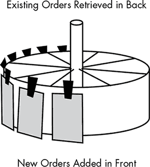
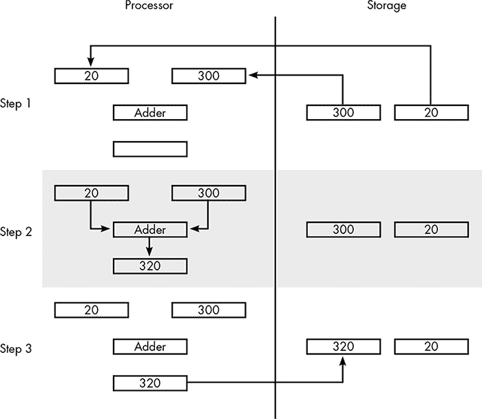
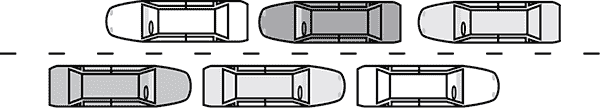

## **8**

**并发**

通常，我们能够察觉软件在做一些有趣的事情，即使我们不知道它是怎么做到的。我们知道计算机会生成图形、加密我们的传输并播放视频。但我们忽视的是，这些任务通常涉及多个程序、多个处理器，甚至是多个通过网络连接的计算机，同时访问相同的数据。

这种数据的重叠访问，被称为*并发*，是现代技术的关键部分。像图形处理和共享资源（如网站）这样的高性能任务，如果没有并发，根本无法实现。但如果并发没有得到妥善管理，就会带来很大的问题。在这一章中，我们将看到当多个处理器访问相同数据时，结果是如何变得混乱的。接着，我们将看看巧妙的软件（和硬件）技术，如何确保处理器不会相互干扰。

### **为什么需要并发**

需要并发的情况可以分为三类：性能、多用户环境和多任务处理。

#### ***性能***

当有更多的工作要做，而单个处理器无法处理时，就需要并发。直到最近，处理器每秒可以执行的指令数量还在稳步增加，但现在这种进步的速度已经放缓。为了在相同的时间内执行更多的指令，处理器必须运行得更快。运行速度越快，电力通过处理器的流动就越多，温度也会越高，最终可能会损坏组件。

为了缓解这个问题，处理器中的组件尺寸不断减小，以便它们消耗更少的电流并保持相对较低的温度。但是，使处理器组件进一步缩小变得越来越困难，这也使得它们的运行速度难以进一步提升。当单个处理器无法完成任务时，唯一的解决方案是使用多个处理核心。我们在第五章中已经看到过视频游戏图形的情况，但不仅仅是高端游戏图形需要多个处理器，即便是今天的一些基本图形任务也可能需要多个处理器核心。

#### ***多用户环境***

并发还使得网络化计算机系统能够协同工作。假设你正在玩一款在线游戏，例如*魔兽世界*。游戏会跟踪每个玩家的动作以及计算机控制的怪物的动作。游戏的服务器会统计每个法术和斧头挥动的次数，并计算造成的伤害、击败的怪物数量以及掉落的战利品。

这里需要并发，因为每个玩家计算机中的处理器必须共享附近玩家和计算机控制的生物的数据。

#### ***多任务处理***

即使只有一个处理器，仍然可以发生并发。现代计算机*多任务处理*，这意味着即使我们认为自己一次只在做一件事情，计算机也在不断地在不同程序之间切换。例如，多任务处理使得你的电子邮件客户端能够在你浏览网页时接收新邮件。在这些情况下，无论计算机是否有多个处理器核心，它都肯定在运行多个*进程*——不同程序的执行是重叠的。

打印是另一个典型的例子。当你从网站打印一个食谱时，管理打印机的软件（称为驱动程序）会按照顺序将打印数据排队，然后按需将其传递给打印机。这就是*打印缓存*。如果没有打印缓存，浏览器只能以打印机处理数据的速度发送数据，这意味着你必须等打印任务完成后，才能继续使用浏览器做其他事情。

打印缓存如果没有并发就无法工作。你可以把打印缓存想象成那种短时餐厅中，位于前台和厨房之间的旋转装置，就像图 8-1 所示的那样。前台的人将新订单放到旋转装置上，后台的人根据完成情况拿下订单。旋转装置的共享数据存储使得点单员和厨师能够独立工作。

*图 8-1：订单票旋转装置*

这种安排被称为*共享缓冲区*，并且在软件的幕后经常使用。例如，假设你正在输入一封邮件，但你的计算机暂时变慢，屏幕上没有显示你输入的内容。然后，系统赶上来了，所有你输入的内容都出现在邮件中。这是因为键盘并不直接与电子邮件程序通信，而是通过操作系统作为中介。操作系统将按键存储在共享缓冲区中，电子邮件程序可以在准备好时访问这些按键。

多任务处理还允许程序在后台运行，并在发生重要事件时打断你。当你在使用文字处理软件时，桌面屏幕角落弹出一封新邮件的提醒，或者你在玩游戏时，手机提醒收到新短信，这就是多任务处理在工作中的体现。

除了多个处理器和分布式处理的性能优势外，多任务处理的重要性意味着必须有某种形式的并发，以提供我们每天依赖的基本计算功能。

### **并发如何失败**

尽管并发是日常计算中的重要部分，但它给软件带来了巨大的麻烦，如果没有适当的保障措施来防止问题的发生，可能会导致严重的故障。

根本问题在于数据在计算中是如何被复制的。本质上，计算机处理器所做的就是从存储中提取数字，然后用它们进行数学运算或比较。然而，要完成这些任务，处理器必须将数字从存储位置复制到处理器内部的某个位置。存储的数据不会直接被修改。相反，计算机会从主存储器、硬盘或通过网络提取值，并将其传输到处理器的最内层。处理器对这个内部副本进行计算，然后将更新后的值送回存储，以替换原始数据。

假设你正在玩一款第一人称射击游戏。当你跑过一个弹药包时，你的备用子弹数量是 300 发，捡起了 20 发子弹。图 8-2 展示了涉及的步骤。为了更新你的子弹数，处理器首先从存储位置获取当前的子弹数量和弹药包中的子弹数，如步骤 1 所示。这些值被输入到处理器中“加法器”电路的输入端，如步骤 2 所示，进行实际的数学运算。然后，结果被送回主存储器，替换掉子弹数存储位置中的旧值，如步骤 3 所示。

*图 8-2：将数字从 300 更新到 320 的三步骤*

这个更新顺序会在多个进程尝试对同一存储位置进行修改时引发问题。例如，考虑一个*大型多人在线游戏（MMO）*。Trina Orcslayer 和 Skylar Rockguardian 是两名玩家。他们都是同一个“公会”的成员，而这个游戏允许公会在多个游戏服务器之间共享银行账户。周五早上，公会账户的余额正好是 10,000 金币，Skylar 和 Trina 各自的个人账户中有 500 金币。在当天的某个时刻，Skylar 从公会账户提取了 300 金币，而 Trina 向公会账户存入了 200 金币。如果只有这两笔交易发生，那么最终的余额应为：公会账户中 9,900 金币（10,000 – 300 + 200），Skylar 账户中 800 金币（500 + 300），Trina 账户中 300 金币（500 – 200）。

如果这些交易被分开处理，那就会发生上述情况。假设 Skylar 在早上进行取款，而 Trina 在下午进行存款。我们不涉及编程部分，但可以考虑游戏软件在执行这些交易时将采取的步骤。让我们从 Skylar 的取款开始：

1.   获取公会账户的余额，称之为**Skylar 的副本**。

2.   从**Skylar 的副本**中减去 300 金币。

3.   向 Skylar 的个人账户增加 300 金币。

4.   更新公会银行余额为**Skylar 的副本**。

假设 Trina 在下午进行存款。她的交易步骤如下：

1.   获取公会账户的余额，称之为**Trina 的副本**。

2.   从 Trina 的个人账户中减去 200 金币。

3.   向**Trina 的副本**增加 200 金币。

4.   将公会银行余额更新为**Trina 的副本**。

在这个例子中，一切正常。但是如果 Skylar 和 Trina 同时进行交易，会发生什么呢？在这种情况下，公会账户的最终余额可能会不正确。如果在两个进程完成交易之前，两个进程都从银行提取了原始公会余额 10,000 金币进行计算，就会发生这种情况。

查看表格 8-1 中显示的详细信息。当 Trina 和 Skylar 同时发起交易时，同样的 10,000 金币余额会被提取到他们各自的余额副本中。Trina 的副本增加到 10,200，而 Skylar 的副本减少到 9,700。然后这两个更新的数字会覆盖公会账户余额。在表格中显示的例子中，Skylar 的更新数字最后到达，这意味着 9,700 成为了新的账户余额，而 200 金币就这样消失了。

结果本可以不同——Trina 的副本本可以在 Skylar 的副本之后到达，从而增加公会的金币余额，但当然无论哪种结果都不正确。唯一正确的最终余额是 9,900 金币，这个余额对应的是两个交易分别发生的情况。

类似于这个例子的情况可能发生在两个或更多进程同时使用相同数据时。这种情况的通用术语是*竞态条件*，因为所有涉及的进程都在竞速，争先完成任务。在这种情况下，最后完成的进程“获胜”，因为它决定了数据的最终值。

虽然这个例子涉及的是两个不同的处理器，Trina 的和 Skylar 的，但需要注意的是，即使只有一个处理器，竞态条件也可能发生。因为多任务处理涉及每秒多次切换处理器到不同的程序，所以多个进程操作相同数据时，可能会交替执行，导致竞态条件。

**表格 8-1：** 重叠银行交易的危险

| **步骤** | **描述** | **Skylar 的副本** | **Trina 的副本** | **公会余额** |
| --- | --- | --- | --- | --- |
| Trina 1 | 从银行提取公会余额。 |  | 10,000 | 10,000 |
| Skylar 1 | 从银行提取公会余额。 | 10,000 |  | 10,000 |
| Trina 2 | 从 Trina 的储备中减去 200 金币。 |  | 10,000 | 10,000 |
| Trina 3 | 向 Trina 的公会余额副本中添加 200 金币。 |  | 10,200 | 10,000 |
| Skylar 2 | 从 Skylar 的公会余额副本中减去 300 金币。 | 9,700 |  | 10,000 |
| Skylar 3 | 向 Skylar 的储备中添加 300 金币。 | 9,700 |  | 10,000 |
| Trina 4 | 将 Trina 的公会余额副本发送到银行。 |  | 10,200 | 10,200 |
| Skylar 4 | 将 Skylar 的公会余额副本发送到银行。 | 9,700 |  | 9,700 |

### **确保并发安全**

为了使并发有意义，我们需要防止竞争条件的发生。这要求对进程如何访问数据进行规则的约束。限制越严格，越容易防止问题发生，但这些限制可能会对性能产生不利影响。

#### ***只读数据***

一种可能的限制是允许进程同时检索数据，但禁止它们修改数据；这被称为*只读*数据。这可以消除竞争条件的可能性，但代价极大。大多数需要共享数据访问的应用程序无法在没有修改数据能力的情况下正常工作。因此，这种方法很少被考虑。然而，正如我们稍后看到的，将想要更改数据的进程与仅仅想读取数据的进程区分开来，可以提高并发性能。

#### ***基于交易的处理***

另一种直接而全面的解决方案完全消除了同时数据访问的问题。示例中的竞争条件发生是因为 Skylar 和 Trina 的交易重叠了。如果我们能防止交易重叠会怎样呢？为了执行这一规则，一旦任何银行交易开始，我们需要等到它发出完成信号之后，才能开始其他交易。例如，Skylar 的流程中的步骤现在可能如下所示：

向银行服务器发出**开始交易**信号。

检索公会账户余额，将其称为**Skylar 的副本**。

从**Skylar 的副本**中扣除 300 金币。

向 Skylar 的个人储备中添加 300 金币。

将公会银行余额更新为**Skylar 的副本**。

向银行服务器发出**结束交易**信号。

Trina 的流程中的步骤也将按类似方式被括起来：

向银行服务器发出**开始交易**信号。

检索公会账户余额，将其称为**Trina 的副本**。

从 Trina 的个人储备中扣除 200 金币。

向**Trina 的副本**中添加 200 金币。

将公会银行余额更新为**Trina 的副本**。

向银行服务器发出**结束交易**信号。

银行服务器流程强制执行交易规则。当没有交易进行时，新的交易开始信号会立即被接受。所以，如果 Trina 的交易在空闲期间开始，它会继续进行。然而，如果 Skylar 的**开始交易**信号在 Trina 的交易正在处理时到达，Skylar 的交易就必须等到 Trina 的交易完成。如果在此期间有其他交易到达，银行服务器会将它们排入队列，按到达顺序处理。

这个规则将公会银行转变成相当于一个只有一个出纳员的大堂。如果客户到达且出纳员空闲，客户将立即得到服务；否则，客户必须等到出纳员空闲。这可以防止竞争条件，但剥夺了系统通过多个处理器带来的性能优势。就像在一个忙碌的银行只有一个出纳员意味着每个客户都要长时间等待一样，每次只允许一个交易通过银行服务器，也意味着每个交易都要相对等待较长时间。

这个规则过于严格。在任何给定时间，银行可能正在处理大量交易，而且其中很少（甚至没有）涉及相同的账户。这个规则通过阻止所有重叠交易来防止竞争条件，即使这些重叠是无害的。

#### ***信号量***

另一个思路利用了大多数交易并不操作相同数据这一事实。如果交易规则像是一个只有一个出纳员的银行，那么更好的规则应该像是一个每个账户都有自己个人出纳员的银行。两个或更多客户同时尝试访问同一个账户时会排队，但访问不同账户的客户不会互相影响。

这种技术背后的秘密成分是称为*信号量*的特殊数据类型。在航海语言中，信号量是船只举起的旗帜，用来向其他船只发信号；在软件中，信号量是旗帜的数字等价物，用于指示是否存在逻辑连接的数据正在使用。最简单类型的信号量只有两个可能的值，0 或 1，称为*二进制信号量*。

##### **信号量如何防止竞争条件**

返回到我们的公会银行账户，我们可以通过在银行服务器上为每个账户余额创建信号量来避免竞争条件。每个信号量的初始值为 1。

在请求账户余额之前，进程必须先*获取*与该账户相关的信号量。此获取操作将检查信号量的值。如果信号量为 1，表示没有其他进程正在使用相关余额；此时，信号量将变为 0，进程将被允许继续执行。

然而，如果信号量已经为 0，意味着另一个进程正在访问相关的余额。在这种情况下，软件将必须等待。

当一个进程完成交易后，它会*释放*信号量，立即将其值恢复为 1。这允许其中一个等待信号量的进程继续执行。

使用信号量时，Skylar 的进程将如下所示：

1.   **获取**公会账户的信号量。

2.   获取公会账户的余额。称之为**Skylar 的副本**。

从**Skylar 的副本**中减去 300 金币。

4.   向 Skylar 的个人存储添加 300 金币。

5.   更新公会银行余额为**Skylar 的副本**。

6.   **释放**公会账户的信号量。

以及 Trina 的：

1.   **获取**公会账户的信号量。

2.   获取公会账户的余额。将其称为**Trina 的副本**。

从 Trina 的个人储备中减去 200 金币。

4.   向**Trina 的副本**中添加 200 金币。

5.   更新公会银行余额为**Trina 的副本**。

6.   **释放**公会账户的信号量。

通过这种方式，Skylar 和 Trina 被防止同时访问公会余额，从而避免了竞态条件。此外，任何不涉及该账户的其他事务也不会受到影响。

##### **信号量是如何创建的**

现在让我们来看看信号量是如何实际创建的。如果信号量实现不小心，它们可能会导致它们本应防止的竞态条件。尽管获取操作对于 Skylar 和 Trina 的进程来说只是一步，但实际上，它本身需要多个步骤：

1.   获取信号量的值。

2.   如果值是 0，返回第 1 步并重试。

3.   将信号量设置为 0。

现在考虑一下如果 Skylar 和 Trina 的进程同时尝试获取公会账户信号量会发生什么。如果信号量的值是 1，两者都能在第 1 步获取到这个初始值，然后才有机会检查这个值并将其设置为 0。在这种情况下，两个进程都会认为自己是唯一获取信号量的进程，因此可以随意操作随附的银行余额。我们又回到了最初的状态。

要创建信号量，软件需要硬件的帮助。银行服务器上的处理器必须能够以一种方式实现获取和释放操作，使得没有任何东西能打断它们。这被称为使操作成为*原子操作*，在这个意义上，原子操作指的是不可分割的。

现代处理器实现了一种硬件操作，称为*测试和设置*。这个操作会将主存中的一个字节设置为特定值，同时检索先前的值进行检查。测试和设置使信号量成为可能。在信号量的步骤列表中，问题出在第 1 步和第 3 步之间的潜在中断。如果两个不同的进程在任何一个进程到达第 3 步之前执行第 1 步，它们都能修改信号量本应保护的数据。然而，通过使用原子测试和设置操作，信号量获取操作可以这样实现：

1.   使用测试和设置，将信号量设置为 0 并获取旧值。

2.   如果旧值为 0，返回第 1 步并重试。

现在竞态条件不会发生。如果两个进程同时尝试获取相同的信号量，它们都会执行第 1 步中的测试和设置操作。两个操作都会将信号量值设置为 0，但只有第一个执行测试和设置的进程会获取到 1，而另一个进程会获取到 0。一个进程会立即继续，另一个进程则必须等待。

### **无限等待的问题**

使用这种两步计划获取信号量的进程——不断检查信号量的值，直到它恢复为 1——被称为*自旋锁*。这是等待信号量变得可用的最简单方法，但它有两个主要问题。首先，它浪费了处理器时间。处于自旋锁中的进程不断执行代码，但这些代码并没有做任何有用的事情。其次，自旋锁可能是不公平的。在某些情况下，一些进程的信号量检查速度可能比其他进程慢。也许进程运行在较慢的处理器上，或者进程正在通过较慢的网络与服务器通信。无论原因如何，如果一个信号量的资源如此受欢迎，以至于总有多个进程在等待，检查信号量较慢的进程可能永远无法获取到信号量。这就是*饥饿*现象；可以想象在一个繁忙餐厅里，最不积极的人面对唯一的服务员，你就能理解这一点。

#### ***有序队列***

避免饥饿现象需要一种更有组织的等待方式。银行通过隔离带组织大厅里的等待，形成有序的排队。信号量也可以设计成做类似的事情。与其浪费时间不断检查信号量的值，许多获取操作在无法立即成功时，会让进程“休眠”，可以这么说。让计算机或手机“休眠”意味着暂停所有正在运行的应用程序，以便应用程序能够迅速恢复。以同样的方式，如果一个进程无法立即获取信号量，它将被挂起并从处理器中清除，但其内部数据将保存在存储中。

为了实现这一点，计算机的操作系统为每个进程分配一个唯一的标识符。当一个获取操作需要等待时，进程标识符会被放置在该信号量的等待队列末尾。当当前持有该信号量的进程释放它时，队列中的第一个进程会被唤醒。通过这种方式，进程会按照请求信号量的顺序获取它。一个进程可能需要等待获取一个热门信号量，但最终会排到队列的最前面——它不会饿死。

#### ***循环等待导致的饥饿现象***

尽管信号量在正确实现和使用时可以防止竞态条件，但当进程需要访问由信号量保护的多个数据时，它们可能会导致饥饿现象。

假设 Skylar 和 Trina 的公会开设了一个二级账户，低级别的公会官员也可以访问这个账户，所以现在公会有一个主账户和一个辅助账户。银行系统为每个账户实施了信号量，消除了任何公会交易中的竞态条件。

但是在某一天，Skylar 和 Trina 每个人都在将 200 金币从一个账户转移到另一个账户，方向相反。两个事务都涉及从一个账户借出并存入另一个账户。Skylar 的事务会有这些步骤：

1.   **获取**主账户余额的信号量。

2.   获取主账户余额。

3.   **获取**次账户余额的信号量。

4.   获取次账户余额。

5.   向次账户余额添加 200 金币。

6.   从主账户余额中减去 200 金币。

7.   更新次账户余额。

8.   更新主账户余额。

9.   **释放**次账户的信号量。

10. **释放**主账户的信号量。

Trina 的事务会像这样运行：

1.   **获取**次账户余额的信号量。

2.   获取次账户余额。

3.   **获取**主账户余额的信号量。

4.   获取主账户余额。

5.   向主账户余额添加 200 金币。

6.   从次账户余额中减去 200 金币。

7.   更新主账户余额。

8.   更新次账户余额。

9.   **释放**主账户的信号量。

10. **释放**次账户的信号量。

因为所有共享值的访问都通过获取和释放相关的信号量得到了适当的括起来，所以这些事务的重叠执行不会发生竞争条件。然而，假设两个事务几乎同时开始，并且前几个步骤交错执行，如表 8-2 所示。

**表 8-2：** 多个信号量导致的无限等待

| **步骤** | **描述** | **主账户信号量** | **次账户信号量** |
| --- | --- | --- | --- |
|  | 初始状态。 | 1 | 1 |
| Skylar 1 | 获取主账户余额的信号量。 | 0 | 1 |
| Skylar 2 | 获取主账户余额。 | 0 | 1 |
| Trina 1 | 获取次账户余额的信号量。 | 0 | 0 |
| Trina 2 | 获取次账户余额。 | 0 | 0 |
| Skylar 3 | 获取次账户余额的信号量。 | 0 | 0 |
| Trina 3 | 获取主账户余额的信号量。 | 0 | 0 |

我只展示了这些步骤，因为这是唯一会发生的步骤。Skylar 和 Trina 的过程都会在步骤 3 停止，因为两者都在尝试获取不可用的信号量。更糟糕的是，它们永远无法变得可用，因为每个信号量都被另一个进程持有。这就像是在一条双车道的路上等待交通清空，好让你左转，但有人从对面要在你后面左转，如图 8-3 所示。

*图 8-3：如果两辆白色汽车都在等待左转，那么交通就会停止。*

因为在这个例子中，任何一个进程都无法继续执行，直到另一个进程完成，这种情况被称为*循环等待*。在这种情况下，循环等待只涉及两个进程，但有时循环等待可能涉及多个进程，因此难以检测或预见。循环等待是*死锁*的一种表现，死锁描述的是一种进程无法继续执行的情况。循环等待是并发导致死锁的一种方式，除非采取预防措施，否则当进程同时持有多个信号量时，就有可能发生循环等待。幸运的是，这类预防措施是相对容易实现的。

一种解决方案是通过规则要求信号量必须按指定的顺序获取。在我们的示例中，游戏的银行管理系统可以为每个账户内部分配一个号码，并要求进程按数字顺序获取账户信号量。或者更广泛地说，进程只能在当前没有持有编号更高账户的信号量时，才可以获取某个账户的信号量。这个规则避免了前面示例中的循环等待。假设主账户是 39785，副账户是 87685。因为主账户的号码较低，Skylar 和 Trina 的进程都会尝试首先获取主账户的信号量。如果两个进程同时尝试，只有一个进程会成功。成功的进程将获取副账户的信号量并完成交易，此时两个账户的信号量都会被释放，允许另一个进程继续执行直到完成。

### **信号量的性能问题**

在适当规则的约束下，信号量能够实现并发，而无需担心竞态条件、死锁或饥饿问题。然而，在我们试图通过让多个处理器共同处理同一任务来提高性能时，强制执行这些信号量规则可能会限制我们希望创造的性能收益。我们没有看到多个处理器一起工作，而是看到大量处理器排队等待工作机会。并发软件可以通过制定额外的规则来缓解这些性能问题。

有时，进程需要访问某一数据项，但不需要更改它。在我们正在运行的公会银行示例中，假设 Skylar 和 Trina 同时检查主公会账户——也就是说，两位玩家都没有进行存款或取款，而只是检查余额。在这种情况下，账户的同时访问不会产生危险。尽管进程可能会有重叠的检索操作，只要它们都没有更新余额，一切都不会出问题。

在“只读”情况下允许同时访问极大地提高了多处理器的性能，这只需要对信号量概念进行修改。我们将不再为每个要共享的数据项设置一个信号量，而是设置两个：一个*读*信号量和一个*写*信号量，并遵循以下规则：

• 获取关联的*写*信号量允许数据被检索或更新，就像前面例子中的信号量一样。

• 获取关联的*读*信号量可以检索数据，但不能更新数据。

• 只有当没有进程持有该数据的信号量（无论是哪种类型）时，才能获取*写*信号量。

• 只有当没有进程持有该数据的*写*信号量时，才能获取*读*信号量。

遵循这些规则意味着在任何给定时刻，要么一个进程已经获取了某个数据项的写信号量，要么一个或多个进程已经获取了该数据的读信号量。乍一看，这似乎是我们想要的。只要进程仅仅是查看数据而不进行修改，它们就可以共享访问。一旦某个进程需要更改数据，所有其他进程都会被锁住，直到更新进程完成工作。

不幸的是，这些规则可能会重新引入饥饿问题。只要只读进程不断到来，可能需要写信号量的进程可能会一直等待下去。为了防止这种情况发生，我们可以按如下方式修改最后一条规则：“只有在没有进程持有或等待写信号量时，才能获取读信号量。”换句话说，一旦进程尝试获取写信号量，所有之后到达的进程必须排队等待。

另一个可能影响性能的问题被称为*粒度*，在这个上下文中，粒度是指我们是锁定单个数据元素还是一组数据。例如，银行系统可以使用信号量来保护单个数据元素，如主公会账户的余额，或者它可以为与特定公会财务相关的所有数据应用一个读/写信号量对，例如所有公会账户的余额、允许访问该账户的公会官员名单等。

作为一个整体保护数据可能会导致更多的等待，因为一个只需要数据组中一两个数字的进程将不得不锁住整个数据组，这可能会阻塞另一个需要从该组中获取其他不重叠数据的进程。过细的粒度也会影响性能。获取和释放信号量需要时间，并且如果信号量过多，进程可能会花费大部分时间来处理它们。因此，开发人员必须仔细确定特定应用程序的最佳粒度。

### **并发的未来**

出于几个原因，我们可以预见并发将在未来成为更为重要的问题。

现在，即使在我们最简单的计算设备中，也可以找到多个处理核心。对更强大处理能力的追求将持续进行，直到量子计算等新的处理范式出现为止，更多的处理能力将意味着更多的处理器核心。

多任务处理现在已经成为常态。我们期望我们的计算设备能够同时运行多个应用程序，并且在后台发生有趣的事情时打断我们的前台任务。

数据和设备之间的连接比以往任何时候都更加紧密。数据和处理正越来越多地从客户端设备转移到服务器或相互连接的服务器云上。在计算机游戏中，社交化已成为新的范式，在某些游戏中，即使是单人游戏模式也需要互联网连接。

简而言之，正确处理并发性在日常计算中变得至关重要。看似只有一个计算机在运行单用户应用程序，实际上可能包含一个多处理器系统，提供一个多任务环境，并共享云存储来存储数据。因此，并发的强大能力往往是隐形的。随着向更大并发性的趋势不断发展，我们可能会理所当然地认为，许多进程能够在不互相干扰的情况下协同工作。但计算机技术的未来进步将依赖于并发控制的进一步发展。目前，我们还不清楚当前防止死锁、饥饿和竞争条件的方法是否能随着并发性的增加而保持足够有效。如果当前的方法无法解决未来的挑战，它们将成为瓶颈，直到开发出更好的方法。
