## 第九章：9

**地图路线**

由于我们可以通过 Google Maps 等网站即时获取方向，我们常常忘记，在不久前，人们常常在前往不熟悉的目的地时迷路。现在，软件为我们规划路线，甚至在途中发生事故或道路封闭时会调整路线。

在计算中，这个任务称为*寻找最短路径*。尽管名字如此，目标并不总是找到最短路径，更广泛地说是最小化*成本*，其中成本的定义是可变的。如果成本是时间，软件会找到最快的路线。如果成本是距离，软件则最小化里程，真正找出最短路径。通过改变成本的定义，相同的软件方法可以找到匹配不同目标的路线。

### 软件看到的地图

尽管软件可以提供路线指引，但它实际上不能读懂地图。相反，它使用数据表格。为了了解我们如何从地图到数据表格的转变，我们从图 9-1 开始，该图显示了一个城市地图的一部分，用于解决一个简单的路径规划问题。目标是找到从 3rd Street 和 West Avenue 交口到 1st Street 和 Morris Avenue 交口的最快路线。街道旁边的编号箭头显示了交叉口之间的平均行驶时间（以秒为单位）。请注意，1st Street 和 Morris Avenue 是单行道。

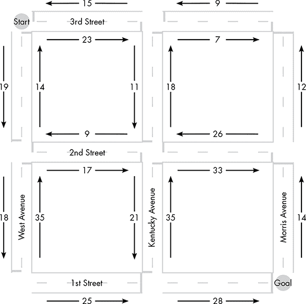

*图 9-1：一个简单的路径规划问题：从 3rd 和 West 找到 1st 和 Morris 的最快路线。*

为了生成可以由软件处理的数据表，我们首先将地图重新构思为图 9-2 所示的*有向图*。在这里，街道交叉点被表示为标记为 A 到 I 的点。图 9-1 中的箭头变成了图中点之间的连接，称为*边*。

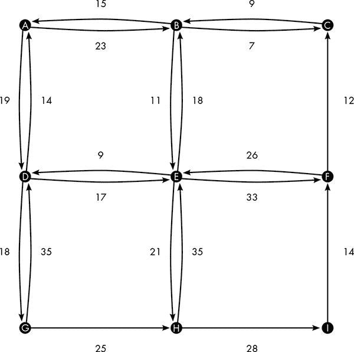

*图 9-2：图 9-1 中的地图作为有向图*

使用有向图，我们将数据输入到表 9-1 所示的表格形式中。该表包含了图 9-2 中地图的所有信息，软件需要这些信息来找到最快的路线。例如，在图 9-2 中，从 A 到 B 的旅行时间为 23 秒；该信息由表格的第一行提供。请注意，不可能的行驶方向（如从 H 到 G）不会列出。

**表 9-1：** 图 9-2 中有向图的数据（以表格形式展示）

| **从** | **到** | **时间** |
| --- | --- | --- |
| A | B | 23 |
| A | D | 19 |
| B | A | 15 |
| B | C | 7 |
| B | E | 11 |
| C | B | 9 |
| D | A | 14 |
| D | E | 17 |
| D | G | 18 |
| E | B | 18 |
| E | D | 9 |
| E | F | 33 |
| E | H | 21 |
| F | C | 12 |
| F | E | 26 |
| G | D | 35 |
| G | H | 25 |
| H | E | 35 |
| H | I | 28 |
| I | F | 14 |

#### *最佳优先搜索*

现在我们准备在地图上找到最短路径，这意味着在我们的图中找到从 A 到 I 的最低成本路径。解决这个问题有很多方法；我将描述的变种是一种叫做*最佳优先搜索*的算法。称这种算法为“搜索”可能有点误导，因为这种方法并不以目的地为目标。相反，在每一步，它会找到从起点到*任何*尚未遍历的点的最佳新路径。最终，这个过程会偶然找到通向目的地的路径，这条路径将是从起点到目标的最便宜路径。

下面是最佳优先搜索如何在我们的示例中工作的。所有从 A 出发的路径必须首先前往 B 或 D。算法首先比较这两个选择，如图 9-3 所示。

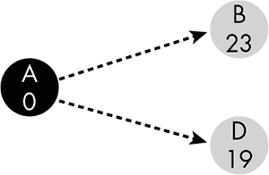

*图 9-3：我们的最佳优先搜索的第一步。从 A 出发，我们可以前往 B 或 D。*

在这些图中，黑色圆圈标记了我们已经找到最佳路径的点，而灰色圆圈表示我们可以直接从某个已标记（黑色）点到达的点。圆圈内的数字表示到达该点的路径成本。在每一步，搜索会检查所有从已标记到未标记点的边，以找到产生最低成本路径的边。在第一步中，选择是 A 到 B 的边还是 A 到 D 的边。由于到 D 的旅行时间比到 B 的时间短，因此最低成本路径是从 A 到 D，如图 9-4 所示。

我们刚刚找到了从 A 到 D 的最便宜路径。不管图的其余部分是什么样子，它都不可能包含比从 A 到 D 的成本更低的路径，因为这是从 A 出发的*所有*路径中的最低成本路径。同样，每一步都会产生一条新路径，这条路径将是从 A 到其他某个点的最低成本路径。

在第二步，有四条边需要考虑：A 到 B 的边和从 D 延伸出去的三条边。同样，算法将选择创建最快新路径的边。在考虑从 D 延伸出去的边时，我们必须包括从 A 到 D 的 19 秒时间。例如，从 A 到 E 通过 D 的时间是 A 到 D 边的时间（19 秒）与 D 到 E 边的时间（17 秒）之和，共 36 秒。

请注意，从 D 出发的一条边回到 A。在图 9-4 中，这条边末端的圆圈是白色的，表示它永远不会被选择。回到起点并没有什么好处。更一般来说，一旦一个点已经包含在某条路径中（在图中用黑色标记），后续出现的该点会被忽略，因为到达它的更好路径已经找到了。

在这个阶段，最低成本的新路线是通过 A 到 B 的边。这将我们带到了图 9-5 所示的阶段。同样，因为我们已经找到了所有剩余路线中的最低成本路线，这使得 A 到 B 的路线成为从 A 到 B 的最快方式。

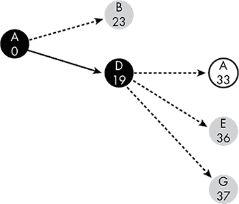

*图 9-4：在搜索的第二步中，最佳的新路线通向 D。标记 D 会暴露出三种新的路径选择，其中一种会回到起点。*

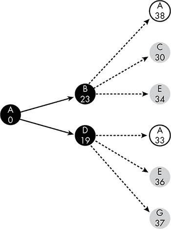

*图 9-5：我们最佳优先搜索的第三步找到了通向 B 的最佳路线。*

我们接下来需要考虑六条边，尽管返回到 A 的边不是候选边。最佳选择是使用 B 到 C 的边，形成一个从 A 到 C 的 30 秒路线，如图 9-6 所示。

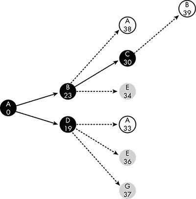

*图 9-6：我们搜索的第四步找到了通向 C 的最佳路线。*

然而，找到通往 C 的最快路线并没有帮助我们达到最终目标。从 C，我们只能返回到 B，而我们已经知道通往 B 的最快路线。

在这个阶段，最快的新路线是经过 B 到 E，如图 9-7 所示。

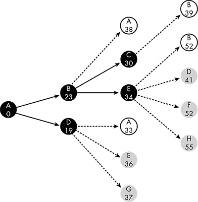

*图 9-7：我们最佳优先搜索的第五步找到了通往 E 的最佳路线。*

该过程持续进行，直到我们达到图 9-8 所示的状态。在这个阶段，最低成本的新路线使用了从 H 到 I 的边，这意味着我们最终确定了从 A 到 I 的最佳路线。

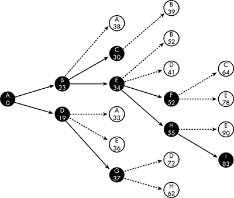

*图 9-8：我们最佳优先搜索的第九步和最后一步到达了 I 点。*

如图所示，从 A 到 I 的最快路线是 A-B-E-H-I。通过查看我们原始地图中的图 9-1 和其图形等效图图 9-2，我们可以看到这对应于沿着 3rd Street 走到 Kentucky Avenue，再左转进入 1st Street，最后驾车行驶一街区到达目的地。

#### *重用先前的搜索结果*

在这个例子中，最佳优先搜索不仅找到了从 A 到 I 的最快路线，还找到了地图上每个其他点的最快路线。尽管这是一个不寻常的结果，最佳优先过程通常会产生过剩的信息。至少，搜索结果将提供起点和目标点之间的中间点的最佳路线。在我们的例子中，从 A 到 I 的最佳路线包含了从 B 到 H、从 E 到 I 的最佳路线，依此类推。因此，最佳优先搜索的结果可以保存以供以后使用。

我们甚至可以在涉及原始地图数据中没有的点的搜索中使用这些数据。为了了解为什么，考虑一下图 9-9。这与图 9-2 中的有向图相同，不同之处在于它包含了一个新的点 J，J 有指向 A 和 B 的边。

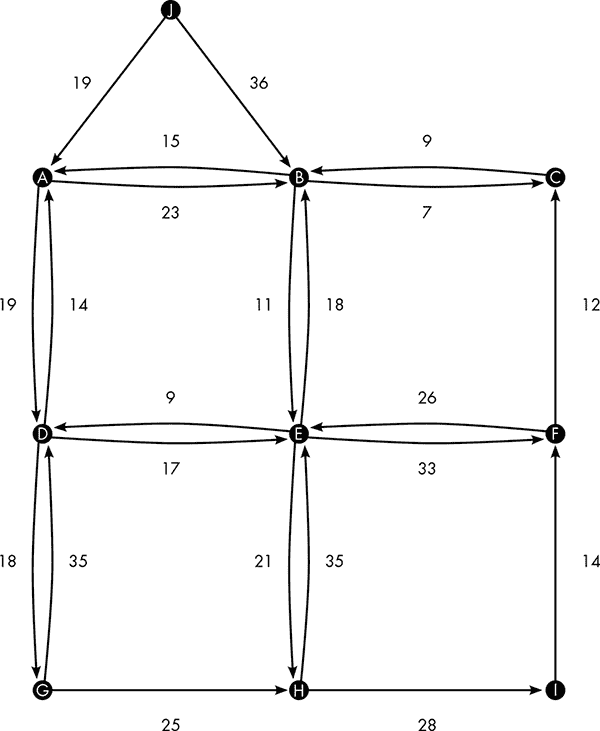

*图 9-9：图 9-2 中的有向图，增加了一个点 J*

假设我们需要找到从 J 到 I 的最快路线。任何从 J 出发的路线都首先经过 A 或 B。我们已经知道从 A 和 B 到 I 的最快路线，结果见于图 9-8。从 A 到 I 的最快路线需要 83 秒。从 B 到 I 的最快路线需要 60 秒；我们通过从 A 到 B 的边的时间 23 秒，减去从 A 到 I 的总时间 83 秒，得出这个结果。

这意味着，从 J 到 I 的路线，如果先经过 A，则需要 102 秒——19 秒到达 A，83 秒从 A 到 I。直接到 B 的路线则需要 96 秒：36 秒到达 B，60 秒从 B 到 I。使用之前的搜索结果使得找到最快的 J 到 I 路线变得更加简单。

### 一次性找到所有最佳路线

一般来说，存储过去的搜索结果有助于未来的搜索。这个思想可以扩展到高效地找到给定地图上任意两点之间的最佳路线，这被称为 *所有点对最短路径* 问题。

#### *弗洛伊德算法*

我们将使用 *弗洛伊德算法*（有时称为 *弗洛伊德-沃肖尔算法*）来解决所有点对最短路径问题，该算法从单一边的简单路线开始，然后通过依次连接地图上的每个点来构建更长的路线。这种方法使用一个网格，网格的初始状态如图 9-10 所示。在每个步骤中，网格包含每对点之间最佳路线的费用。开始时，已知的路线只有直接连接各点的边，这是图 9-2 和表 9-1 中的相同数据。例如，A 行 B 列中的 23 表示从 A 到 B 的旅行费用。当“起点”和“终点”相同时，费用为 0。

*图 9-10：弗洛伊德算法的初始数字网格。此时网格中唯一的路线是各个点之间的直接连接。*

随着过程的继续，这个网格将会被填写并修改。在最初没有路线的地方会新增路线，比如从 A 到 F。成本更低的路线将替代现有的路线；例如，如果我们能以少于 35 秒的时间从 G 到 D，就会替换网格中当前的 35。

我们从考虑 A 点作为路线连接点开始。从图 9-10 中可以看到，B 和 D 都有通往 A 的路线。因为 A 有通往 B 和 D 的路线，A 可以将 B 连接到 D，也可以将 D 连接到 B。这些新路线在图 9-11 中以灰色方块显示。

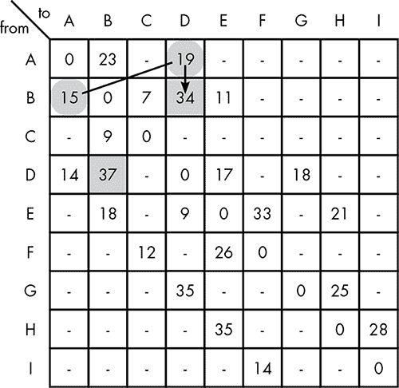

*图 9-11：使用 A 点作为连接点发现新路线*

新路线的成本是我们连接的两条路线成本之和。在图 9-11 中，B 到 D 路线的成本（34）是 B 到 A 路线的成本（15）加上 A 到 D 路线的成本（19），如箭头所示。D 到 B 路线的成本（37）也是如此，它是 D 到 A 路线的成本（14）和 A 到 B 路线的成本（23）之和。

在下一步中，我们使用点 B 来连接现有路线。这将产生 8 条新路线，如图 9-12 所示。

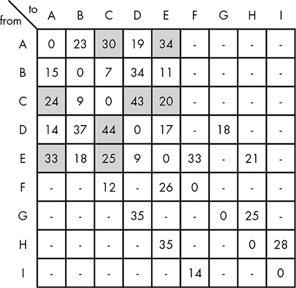

*图 9-12：使用点 B 作为连接器发现新路线*

和前一步一样，每条新路线的成本是我们连接的两条路线成本之和。例如，新 A 到 E 路线的成本（34）是 A 到 B 路线的成本（23）与 B 到 E 路线的成本（11）之和。

在下一步中，使用 C 连接现有路线，揭示了三条新路线，如图 9-13 所示。

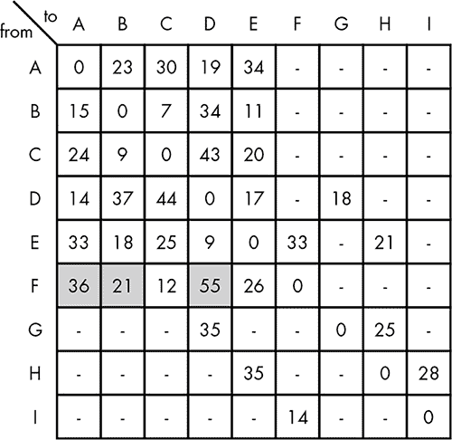

*图 9-13：使用点 C 作为连接器发现新路线*

在下一步中，我们第一次发现了*更好*的路线。之前我们找到了从 E 到 A 的 33 秒路线，而在这一步中，我们发现了一条通过 D 从 E 到 A 的 23 秒路线，并将网格更新为更低的成本。还发现了 9 条新路线，达到了图 9-14 所示的状态。

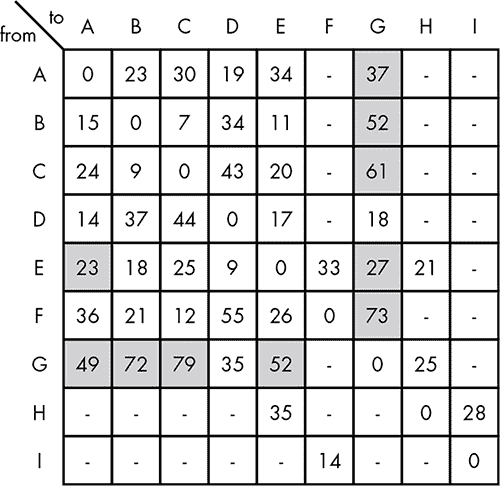

*图 9-14：使用点 D 作为连接器发现新路线*

这个过程不断进行，依次使用点 E 到点 I 连接路线，最终形成完整的网格，如图 9-15 所示。通过将这些点与原始地图上的街道名称对应，路由软件可以利用这个网格计算地图上任意两点之间的最快时间。如果你想知道从 1st 街与 West 街的交汇处到 3rd 街与 Morris 街的交汇处应该需要多少秒，软件会将其转换为关于图表中 G 到 C 路线的查询。然后，答案可以直接从网格中找到：77 秒。

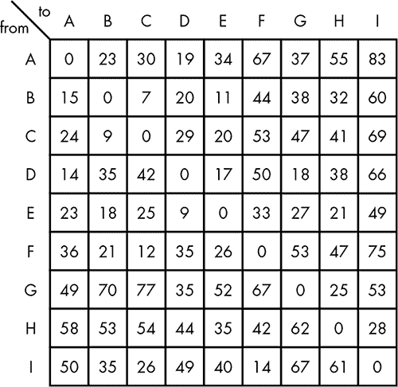

*图 9-15：通过 Floyd 算法生成的完整网格，显示从每个点到其他所有点的最快时间*

#### *存储路线方向*

正如你可能已经注意到的，这个网格*并没有*告诉你最短的路线是什么——它只告诉你所需的时间。例如，你可以看到从 A 到 I 的最快路线需要 83 秒，但这条路线是从东边开始还是从南边开始？你在哪个地方转弯？为了记录具体路线，我们必须在更新网格中的路线时间时，记录每条路线的初始方向。

图 9-16 显示了起始网格。和以前一样，网格将用于存储迄今为止找到的最佳路线的成本，但现在它还将存储每条路线的初始行驶方向。这个起始网格仅包含原图的边。第一行第二列的 23 和 B 表示从 A 到 B 的最佳路线花费 23，并且从 A 开始朝 B 方向行驶。

*图 9-16：Floyd 算法的初始网格，修改为存储每条路线的行驶方向*

在图 9-17 中，我们使用 A 来连接现有的路线，正如我们在图 9-11 中所做的那样。但现在，在网格中添加或更新一条路线也意味着要记录该路线的方向。例如，从 B 到 D 的新路线，首先是前往 A。其逻辑是：“我们刚刚发现了一条从 B 到 D 的路线，它经过 A。已知从 B 到 A 的最快路线直接通往 A。因此，从 B 到 D 的路线也必须从 A 开始。”

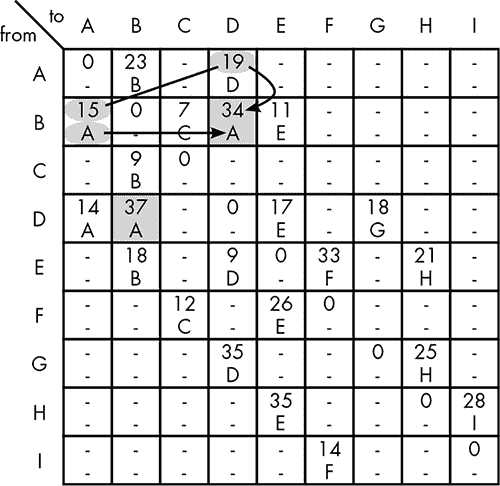

*图 9-17：使用点 A 作为连接器发现新路线*

跳过 B 和 C 的步骤，图 9-18 显示了我们刚刚添加 D 路线后的网格。这里我们发现了一条新的从 B 到 G 的路线，花费了 52 秒。因为这条新路线经过 D，所以该路线必须像前往 D 的路线一样开始——先前往 A。

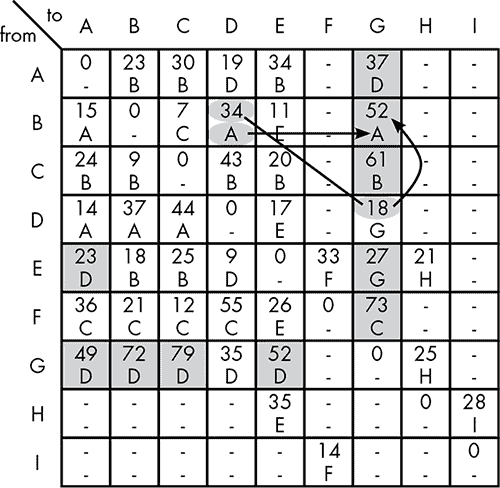

*图 9-18：使用点 D 作为连接器发现新路线*

图 9-19 展示了完整的网格，已删除了时间数据以便更清晰地呈现。

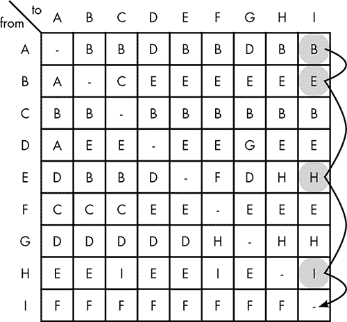

*图 9-19：由 Floyd 算法生成的完整路由网格，显示了行驶方向。最快的从 A 到 I 的路线被高亮显示。*

从 A 到 I 的最快路线在网格中被高亮显示。我们从行 A，列 I 开始，看到从 A 到 I 的最快路线首先是前往 B。然后我们查看行 B，看到从 B 到 I 的最快路线朝 E 走。E 到 H，H 到 I。使用这个网格就像是在每个街角停下，问：“我该往哪个方向走？”

### 路由的未来

今天的软件可以瞬间提供准确的路线，那么明天的地图软件可能做得更好是什么呢？

地图绘制的改进将来自数据的改进。例如，如果软件能够访问每小时的交通数据，它可以根据旅行的时间定制路线。

实时交通数据也可能会被集成到地图软件中。例如，大多数地图程序在用户请求新路线之前并不知道交通问题。在未来，你的地图软件可能会在你之前发现事故和道路封闭情况，并为你规划绕行路线。天气数据也可能被纳入其中，以提供更准确的旅行时间估算，并满足那些希望避免在大雨或其他不利天气条件下驾驶的驾驶员的偏好。

路线规划只是一个更大范围的软件领域的一个小部分，这个领域被称为*地理信息系统（GIS）*，它使用软件回答关于地图和位置标记数据的问题。一些 GIS 任务与路线规划无关，比如确定一个区域是否拥有足够的潜在顾客来支持一个新的杂货店。但许多有趣的 GIS 项目将本章中的地图路线规划概念与关于地图道路沿线建筑物内的内容的数据相结合。例如，通过追踪学童的居住位置，GIS 软件可以规划出最有效的校车路线。

在未来，路线规划软件可能会扩展到包含更多通用地理信息系统（GIS）工具的功能。当你需要规划一条长途的城市外出行车路线时，软件可能不仅仅会提供你需要转弯的地方，还会突出显示你可能想要停留的地点，比如价格最合适的加油站和提供你最爱食物的餐馆。
