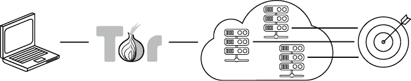
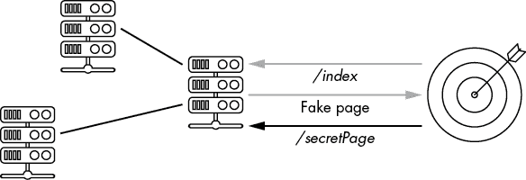

# 第一章：如何实现在线匿名

渗透测试人员和红队成员在搭建和调优自己的基础设施时，兴奋感和写参与报告时一样多；也就是说，完全没有兴奋感。对他们来说，刺激全在于利用、横向移动和特权升级。建立一个安全的基础设施则是无聊的文书工作。如果他们不小心在目标的日志面板中泄露了自己的 IP 地址，那又怎样？他们只需要为搞砸了事情请团队喝一杯啤酒，蓝队会因为发现并揭露攻击而得到表扬，大家可以在第二天重新开始。

现实世界是不同的。例如，黑客和黑客活动分子没有重来的机会。他们没有法律约束力的参与合同这一奢侈品。他们将自由，甚至生命，押注于他们工具的安全性和基础设施的匿名性。这就是为什么在我的每本书中，我都坚持写一些基本的操作安全（OpSec）程序，以及如何构建一个匿名且高效的黑客基础设施：在这个越来越具有威权主义色彩的世界里，一份如何保持安全的快速指南。我们将从如何尽可能做到在线匿名开始，使用虚拟私人网络（VPN）、Tor、跳跃服务器以及一个可替换且便于携带的攻击基础设施。

如果你已经熟悉当前的指挥与控制（C2）框架、容器以及像 Terraform 这样的自动化工具，你可以跳过前面的内容，直接进入第四章，那里才是真正的黑客攻击开始的地方。

## VPN 及其缺陷

我希望到 2021 年，几乎每个人都知道将自己的家庭或工作 IP 地址暴露给目标网站是个大忌。然而，我发现大多数人仍然习惯于通过一个承诺完全匿名的 VPN 服务浏览网站——这个 VPN 是他们用家庭 IP 地址注册的，可能还用了自己的信用卡，附带自己的姓名和地址。更糟糕的是，他们是在家里的笔记本上设置 VPN 连接，一边看着自己最喜欢的 Netflix 节目，一边和朋友在 Facebook 上聊天。

让我们马上澄清一件事。不管他们怎么说，VPN 服务总是会*总是*保留某种形式的日志：IP 地址、DNS 查询、活动会话等等。让我们暂时站在一个天真的互联网用户的角度，假设没有法律强迫每个接入提供商保留出站连接的基本元数据日志——这种法律在大多数国家都存在，而且没有 VPN 提供商会为你那区区 5 美元的月费而违反这些法律，但请你暂时接受这个坦诚的前提。VPN 提供商在全球多个数据中心有成百上千台服务器。他们也有成千上万的用户——有些是 Linux 用户，另一些是 Windows 用户，还有一部分娇惯的 Mac 用户。你真的能相信在没有日志这种基础工具的情况下，管理如此庞大且异构的基础设施是可能的吗？

没有日志的情况下，技术支持就和那些打电话求助的困惑客户一样无用和迷茫。公司里没有人知道如何开始解决一个简单的 DNS 查询问题，更不用说涉及丢包、优先路由和其他网络巫术的神秘路由问题了。许多 VPN 提供商觉得有必要大声辩护他们的无日志服务，以跟上竞争者们做出类似声明的步伐，但这是一种谎言，导致了毫无意义的竞争，推动了公然的谎言——或者“营销”，就像我现在认为他们所称之为的那样。

你能从一个 VPN 服务提供商那里获得的最好的期望就是他们不会将客户数据卖给出价最高的人。甚至不要考虑那些免费的提供商。为你的隐私投资，不论是时间还是金钱。我推荐从 AirVPN 和 ProtonVPN 开始，它们都是这个行业中非常认真的参与者。

这种对匿名性的看法同样适用于 Tor（洋葱路由，[`www.torproject.org`](https://www.torproject.org)），它通过一个隐藏你的 IP 地址的节点和中继网络来保证通过互联网的匿名传输。你有没有理由盲目相信第一个你接触的进入 Tor 网络的节点，和那个未经请求的电话一样，承诺给你一个失散多年的遗产，只要你提供信用卡号？当然，第一个节点只知道你的 IP 地址，但或许这已经是太多的信息了。

## 地点，地点，地点

提高匿名性的一种方式是小心你在黑客行为时的物理位置。别误会我的意思：Tor 非常棒，VPN 是一个很好的替代方案。但是，当你依赖这些服务时，永远要假设你的 IP 地址——因此，你的地理位置和/或浏览器指纹——是这些中介所知道的，并且可以被你的最终目标或任何代表他们调查的人发现。一旦你接受这个前提，结论自然就显现出来了：要在互联网上真正匿名，你需要像关注你的互联网指纹一样关注你的物理痕迹。

如果你恰好住在大城市，可以利用繁忙的火车站、购物中心或类似的公共聚集场所，这些地方有公共 Wi-Fi，悄悄进行你的操作。就像每天成千上万的乘客一样，融入模糊的流动中。然而，要小心不要落入我们那种喜欢模式的人的陷阱。无论如何，尽量避免天天坐在同一个地方。要有意识地去新地点，甚至偶尔更换城市。

世界上一些地方，比如中国、日本、英国、新加坡、美国，甚至法国的某些地区，都有摄像头监控街道和公共场所。在这种情况下，一个替代方案是采用书中最古老的技巧之一：战争驾驶。用车在城市中开来开去，寻找公共 Wi-Fi 热点。普通的 Wi-Fi 接收器可以接收到最多 40 米（约 150 英尺）远的信号，如果使用方向性天线，如 Alfa Networks 的 Wi-Fi 适配器，可以将这个范围增加到几百米（1000 英尺）。一旦找到一个免费的热点，或者一个安全性差的热点（如 WEP 加密和弱的 WPA2 密码，这些是比较常见的，可以通过像 Aircrack-ng 和 Hashcat 这样的工具破解），把车停在附近并开始你的操作。如果你讨厌无目的地开车，可以查看像 WiFi Map 这样的在线项目，[`www.wifimap.io`](https://www.wifimap.io)，它列出了开放的 Wi-Fi 热点，有时还包括它们的密码。

黑客真的可以说是一种生活方式。如果你真心致力于你的事业，你应该全身心投入，避免任何疏忽。

## 操作笔记本电脑

现在我们已经解决了位置问题，让我们理清笔记本电脑的使用情况。人们对他们的笔记本电脑往往很珍惜，上面贴满了贴纸，配置疯狂，还有，天哪，那些大家都说“总有一天会看的”书签列表。这是你在本地会议上展示的电脑，而不是你用来执行操作的那台电脑。任何你用来发 Twitter 或查看 Gmail 收件箱的电脑，都几乎为大多数政府机构所知。即便你使用了再多的 VPN，如果你的浏览器指纹泄露到你的目标上，你的“美好面容”也无法得到拯救。

出于黑客目的，我们需要一个每次重启时都会清除所有数据的临时操作系统（OS）。我们将这个操作系统存储在一个 USB 闪存驱动器上，每当我们找到一个合适的地方安顿下来时，就将其插入电脑中以加载我们的环境。

Tails *(*[`tails.boum.org/`](https://tails.boum.org/)) 是这种用途的首选 Linux 发行版。它会自动更换 MAC 地址，强制所有连接都通过 Tor 进行，并避免将数据存储在笔记本硬盘上。（相反，传统操作系统往往会将部分内存数据存储在磁盘上以优化并行执行，这个操作被称为*交换*。）如果它足够适合斯诺登使用，我敢打赌它对几乎每个人都足够好。我建议在做任何事情之前，先设置 Tails OS 并将其存储在外部硬盘上。

一些人 inexplicably 喜欢 Chromebook。这些是堆叠在廉价硬件上的最小操作系统，仅支持浏览器和终端。听起来很理想，对吧？其实并不是。这是最糟糕的想法之一，仅次于冬天舔金属杆。我们在谈论的是一个由 Google 开发的操作系统，它要求你登录 Google 帐户，同步数据，并将数据存储在 Google Drive 上。还需要我继续说吗？有一些基于 Chromium OS 的衍生系统，像是 NayuOS，禁用了 Google 同步部分，但重点是这些设备并不是为了隐私设计的，绝对不应该用于匿名黑客活动。如果用了，Google 的发布日一定很有趣。

你的操作笔记本应仅包含易失性和临时数据，例如浏览器标签页、复制粘贴的命令等。如果你确实需要导出大量数据，确保将数据以加密方式存储在便携式存储设备上。

## 跳跃服务器

我们的笔记本唯一的目的是将我们连接到一组服务器，这些服务器包含必要的工具和脚本，为我们的冒险做准备：*跳跃服务器*。这些是我们匿名设置的虚拟主机，只通过 Tor 或 VPN 连接，并信任它们与我们更恶意的虚拟机 (VM) 互动并存储我们的战利品。

这些服务器为我们提供了一个可靠且稳定的通道，通向我们未来的攻击基础设施。为了连接到跳跃服务器，我们将在确保 VPN 或 Tor 连接已建立的情况下直接通过 SSH 连接到它。我们可以在一个寒冷且繁忙的火车站的随机机器上发起一个 Secure Shell (SSH) 连接，并找到一个温暖舒适的环境，所有的工具和我们喜爱的 Zsh 别名都在等着我们。

跳跃服务器可以托管在一个或多个云服务提供商上，分布在多个地理位置。显而易见的限制是这些提供商支持的支付方式。以下是一些接受加密货币且价格合理的云服务提供商示例：

+   RamNode ([`www.ramnode.com/`](https://www.ramnode.com/)) 每月大约需要 $5，提供 1GB 内存和两个虚拟 CPU (vCPU) 核心的服务器。只接受比特币。

+   NiceVPS ([`nicevps.net/`](https://nicevps.net/)) 每月大约需要 €14.99，提供 1GB 内存和一个 vCPU 核心的服务器。接受 Monero 和 Zcash。

+   Cinfu ([`www.cinfu.com/`](https://www.cinfu.com/)) 每月大约需要 $4.79，提供 2GB 内存和一个 vCPU 核心的服务器。支持 Monero 和 Zcash。

+   PiVPS ([`pivps.com/`](https://pivps.com/)) 每月大约需要 $14.97，提供 1GB 内存和一个 vCPU 核心的服务器。支持 Monero 和 Zcash。

+   SecureDragon ([`securedragon.net/`](https://securedragon.net/)) 每月大约需要 $4.99，提供 1GB 内存和两个 vCPU 核心的服务器。只接受比特币。

一些服务，比如 BitLaunch ([`bitlaunch.io/`](https://bitlaunch.io/))，可以充当简单的中介。BitLaunch 接受比特币支付，但会使用其自己的账户在 DigitalOcean 和 Linode 上创建服务器（当然，价格是三倍的，简直令人无法接受）。另一种中介服务是 bithost ([`bithost.io/`](https://bithost.io/))，它的交易条件稍好一些，但仍然收取 50% 的佣金。除了显而易见的宰客行为外，选择这两家服务的折衷是，它们都不给你提供 DigitalOcean 的 API 接口，而这个接口可以帮助自动化大部分设置过程。

选择云服务提供商时，可能需要做出这个痛苦的折衷：是否支持加密货币及其提供的伪匿名性，还是更注重易用性和自动化。

所有主要的云服务提供商——AWS、Google Cloud、Microsoft Azure、阿里巴巴等——都要求在批准账户之前提供信用卡信息。根据你所在的地区，这可能不是问题，因为有很多服务提供商可以通过现金兑换预付费信用卡。有些在线服务甚至接受比特币充值的信用卡，但大多数都会要求提供某种政府签发的身份证明。这是一个你应该仔细考虑的风险。

理想情况下，跳板服务器应该用于托管像 Terraform、Docker 和 Ansible 这样的管理工具，这些工具将帮助我们构建多个攻击基础设施。架构的高层概述见图 1-1。

图 1-1：黑客基础设施概述

我们的跳板服务器绝不会与目标互动。一个信号都不会发出。因此，我们可以让它们待得稍久一些再更换——几周或几个月——而不会带来重大风险。然而，专门的调查团队可能会找到方法将这些系统与那些用于与目标互动的系统关联起来，所以定期删除和重建跳板服务器是个好主意。

## 攻击基础设施

我们的攻击基础设施的波动性比我们的跳板服务器高得多，应该只保留几天。如果可能的话，应该针对每次操作或目标保持唯一性。我们最不希望发生的情况是，调查人员通过同一个 IP 将来自不同目标的线索拼凑在一起。

攻击基础设施通常由前端和后端系统组成。前端系统可能发起连接到目标，扫描机器等。它还可以用来——在反向 shell 的情况下——通过网络代理路由传入的数据包，并根据需要将其传递到后端系统，通常是像 Metasploit 或 Empire 这样的 C2 框架。只有一些请求会被转发到 C2 后端；其他页面则返回乏味的内容，如图 1-2 所示。

图 1-2：数据包路由到后端

这个数据包路由可以通过常见的网络代理如 Nginx 或 Apache 来实现，它们充当过滤器：来自感染计算机的请求被直接路由到相应的后台 C2 实例，而其余的请求——例如来自好奇分析师的请求——则显示一个无害的网页。后台 C2 框架实际上是攻击基础设施的脊梁，执行感染机器上的命令，检索文件，传送漏洞利用工具等。

你希望你的基础设施是模块化的，并且可以随时替换。绕过 IP 封禁应该像发送一个命令来启动一个新的代理一样简单。C2 后台出现问题？输入一个命令，你就能启动一个新的 C2 后台，且配置完全相同。

达到这种自动化水平并不是一种试图尝试最流行工具和编程技术的异想天开的方式。攻击服务器配置得越容易，尤其是在压力环境下，我们犯的错误就越少。它是一个进入 DevOps 角色、学习其技能并将其改造为我们自己需求的好理由。希望这能让我们意识到一些不足之处，之后我们可以在黑客冒险中加以利用。下一章将重点讨论如何构建这个后台。

## 资源

+   若想了解 Edward Snowden 的生平以及他在情报界的冒险经历，阅读*Permanent Record*，作者 Edward Snowden（Macmillan，2019）。

+   在这里搜索 darkAudax 关于黑客攻击 WEP 加密通信的教程：[`aircrack-ng.org/`](https://aircrack-ng.org/)。

+   在[`hakin9.org/`](https://hakin9.org/)找到 Brannon Dorsey 关于使用 Aircrack-ng 和 Hashcat 破解 WPA/WPA2 Wi-Fi 路由器的教程。

+   在[`www.howtoforge.com/`](https://www.howtoforge.com/)查找 Muhammad Arul 关于在 Linux 机器上设置 Zsh 的指南。
