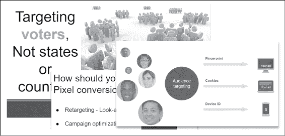
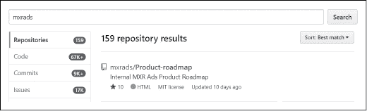
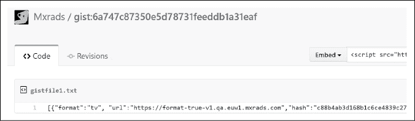
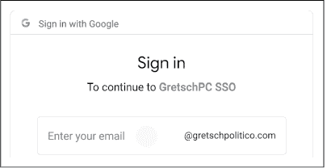
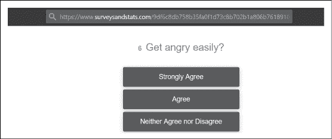
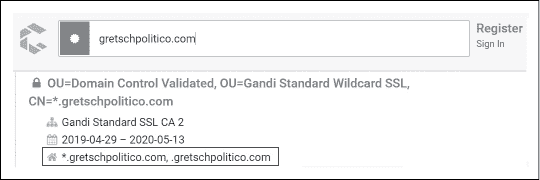

# 第四章：4  

健康的跟踪

  

我们的弹跳服务器正安静地在欧洲某个数据中心低声嗡嗡作响。我们的攻击基础设施正急切等待着我们的第一个命令。在我们释放那些通常充斥着信息安全 Twitter 时间线的攻击工具之前，花几分钟时间了解我们的目标——政治咨询公司 Gretsch Politico——到底是如何运作的。它们的商业模式是什么？提供哪些产品和服务？这些信息将为我们指明方向，帮助我们缩小攻击目标的范围。设定切实可行的目标很可能是我们面临的第一个挑战。他们的主网站（www.gretschpolitico.com）并没有提供太多帮助：它是一个沸腾的、模糊的营销关键词的汤，只有内部人士才能理解。于是，我们将从无害的、面向公众的信息开始。  

## 理解 Gretsch Politico  

为了更好地理解这家公司，让我们挖掘所有提到“Gretsch Politico”（GP）的 PowerPoint 文件和 PDF 演示文稿。SlideShare ([`www.slideshare.net/`](https://www.slideshare.net/))证明在这项任务中是一个无价的盟友。许多人在演讲后忘记删除他们的演示文稿，或者将其设置为“公开访问”，为我们提供了大量的信息来开始我们的理解之旅（见图 4-1）。  

  

图 4-1：一些 Gretsch Politico 的幻灯片  

SlideShare 只是托管文档的一个例子，接下来我们将在网上搜索资源，寻找上传到最流行分享平台的文档：Scribd、Google Drive、DocumentCloud 等等。以下搜索词能帮助你在大多数搜索引擎中缩小搜索结果范围：  

```
# Public Google Drive documents
site:docs.google.com "Gretsch politico"

# Documents on documentcloud.org
site:documentcloud.org "Gretsch politico"

# Documents uploaded to Scribd
site:scribd.com "gretschpolitico.com"

# Public PowerPoint presentations
intext:"Gretsch politico" filetype:pptx

# Public PDF documents
intext:"Gretsch politico" filetype:pdf

# .docx documents on GP's website
intext:"Gretsch politico" filetype:docx
```

Google 可能是你的默认搜索引擎，但你可能会发现，使用其他搜索引擎，如 Yandex、百度、Bing 等，能获得更好的结果，因为 Google 倾向于遵守版权侵权法并对其搜索输出进行审核。  

另一个关于公司业务的重要信息来源是元搜索引擎。像 Yippy 和 Biznar 这样的网站聚合了来自各种通用和专业搜索引擎的信息，提供了公司最近活动的概览。  

从我的初步搜索来看，很多有趣的文档浮现出来，从提到 GP 的竞选基金报告到针对竞选主管的营销推介。手动浏览这些数据清楚地表明，GP 的核心服务是基于多个数据输入建立选民档案。这些选民档案然后会被研究，并输入到一个算法中，决定哪种推介最适合锁定选民。  

## 寻找隐藏的关系  

GP 的算法将数据混合，这一点很清楚，但数据来自哪里呢？要理解 GP，我们需要了解它最紧密的合作伙伴。无论是哪个公司或平台提供了这些数据，必定与 GP 有着紧密的合作。多个文档暗示至少存在两个主要渠道：  

1.  数据经纪人或数据管理平台：这些公司销售从电信公司、信用卡发卡机构、在线商店、本地企业等多个来源收集的数据。

1.  研究调查和问卷：似乎 GP 以某种方式联系到公众，发送问卷并收集意见。

尽管 GP 的主网站几乎没有提到广告作为接触公众的一种方式，但 PDF 文档中充斥着对某一特定广告平台的引用，该平台在社交媒体和传统媒体网站上都具有巨大的覆盖面。虽然没有直接的链接指向这个广告平台，但得益于这些社交媒体网站，它们深受 GP 喜爱，我们通过 GP 市场副总裁 Jenny 的 Twitter 资料挖掘出图 4-2 中显示的转发。


图 4-2：一条揭示性的 GP 转发

这条推文中的链接无意中指向了一个在线广告代理机构：MXR Ads。他们在各种网站上投放广告，按千次展示（CPM）收费，悄悄地忙于增加互联网加载时间的工作。

除了 GP 的 Jenny 发出的这条激动的推文外，几乎没有看到两家公司之间的任何可见链接；甚至在 Google 上也几乎找不到反向链接。那么，是什么联系呢？我们通过查阅两家公司的法律记录，快速解开了这个谜团。我们访问了[`opencorporates.com/`](https://opencorporates.com/)，这是一个全球公司数据库，是挖掘公司旧档案、股东名单、关联实体等的极好资源。结果发现，MXR Ads 和 Gretsch Politico 共享大部分相同的董事和高管——事实上，他们几年前甚至共享了相同的地址。

这种错综复杂的联系对于两家公司来说可以非常有利。MXR Ads 收集有关人们与某类产品或品牌互动的原始数据。例如，他们知道，拥有 cookie 83bdfd57a 的人喜欢枪支和狩猎。他们将这些原始数据传输给 Gretsch Politico，后者分析这些数据并将其归类为一个类似的个人资料数据段，标注为“喜欢枪支的人”。然后，GP 可以设计创意和视频，向被标记为“喜欢枪支的人”的群体宣传，告诉他们，除非投票给正确的候选人，否则他们的持枪权将受到威胁。GP 的客户，某个竞选公职的候选人，感到高兴并开始梦想在国会大厦里泡香槟泡泡浴，而 GP 则在每个有功能网站的媒体平台上投放这些广告。当然，MXR Ads 也会收到分发创意广告的任务，从而完成了这个自我循环的利润与绝望的蛇形结构。令人毛骨悚然。

从这种紧密的联系中，我们可以合理地怀疑，攻破 MXR Ads 或 GP 中的任何一个都可能对*两*家公司造成致命打击。他们的数据共享暗示着某种可以利用的联系或连接，我们可以从一个跳到另一个。我们的潜在攻击面刚刚扩展。

现在我们对公司的运作方式有了初步的了解，虽然这种了解还很不完全，但我们可以开始尝试回答一些有趣的问题：

+   这些数据片段有多精准？它们是在广泛地定位，比如说 18 到 50 岁的所有人群，还是能深入到个人最私密的习惯？

+   GP 的客户是谁？不是他们在幻灯片上宣传的漂亮小马，比如那些试图推广疫苗的健康组织，而是他们在数据库中隐藏的丑陋蛤蟆。

+   最后，这些创意和广告到底是什么样的？这可能看起来是一个微不足道的问题，但由于它们显然是针对每个目标群体定制的，因此很难实现任何形式的透明度和问责制。

在接下来的几章中，我们将尝试回答这些问题。议程相当雄心勃勃，所以我希望你和我一样兴奋，能一起深入探讨这个数据收集与欺诈的奇异世界。

## 搜索 GitHub

在几乎每次展示 Gretsch Politico 和 MXR Ads 方法论时，一个反复出现的主题是他们在研究和设计方面的投入，以及他们独有的机器学习算法。像这样的技术导向公司，可能会在公共代码库中发布一些源代码，目的是为了各种用途，比如作为引诱人才的诱饵，向开源世界做出小贡献，部分的 API 文档，代码示例等等。我们或许能找到一些包含被忽视的密码或敏感链接到他们管理平台的材料。希望好运！

在 GitHub 上搜索公共仓库相当简单；你甚至不需要注册一个免费账户。只需查找像“Gretsch Politico”和“MXR Ads”这样的关键词。图 4-3 展示了我们搜索 MXR Ads 仓库时的结果。



图 4-3：MXR Ads GitHub 仓库

一家公司竟然有 159 个公共仓库？这看起来很多。经过初步检查，明显只有其中少数几个仓库真正属于 MXR Ads 或其员工。剩下的只是一些提到 MXR Ads 的分支（复制的仓库），例如在广告屏蔽列表中。这些分支仓库几乎没有什么价值，所以我们将重点关注这几个原创仓库。幸运的是，GitHub 提供了一些模式来过滤不需要的结果。通过使用 `org:` 和 `repo:` 这两个搜索前缀，我们可以将结果限制在我们认为相关的少数几个账户和仓库内。

我们开始寻找硬编码的秘密，比如 SQL 密码、AWS 访问密钥、Google Cloud 私钥、API 令牌和公司广告平台上的测试账户。基本上，我们想要找到任何可能授予我们首次珍贵访问权限的东西。

我们将这些查询输入 GitHub 搜索，看看能找到什么：

```
# Sample of GitHub queries

org:mxrAds  password
org:mxrAds  aws_secret_access_key
org:mxrAds  aws_key
org:mxrAds  BEGIN RSA PRIVATE KEY
org:mxrAds  BEGIN OPENSSH PRIVATE KEY
org:mxrAds  secret_key
org:mxrAds  hooks.slack.com/services
org:mxrAds  sshpass -p
org:mxrAds  sq0csp
org:mxrAds  apps.googleusercontent.com
org:mxrAds  extension:pem key
```

GitHub 搜索 API 的一个烦人限制是，它会过滤掉特殊字符。当我们搜索“aws_secret_access_key”时，GitHub 只会返回与这四个单词（aws、secret、access 或 key）中的任意一个匹配的代码。这大概是我唯一一次真心怀念正则表达式的时候。

请记住，这一阶段的侦察不仅仅是盲目抓取悬挂的密码；它还涉及到发现 URL 和 API 端点，并了解两家公司的技术偏好。每个团队都有一些信条，决定使用哪个框架和哪种语言。稍后的时候，这些信息可能帮助我们调整我们的 payload。

不幸的是，初步的 GitHub 搜索查询没有找到任何有价值的结果，所以我们决定使出大招，完全绕过 GitHub 的限制。由于我们只针对少数几个仓库，我们将整个仓库下载到本地磁盘，以便释放出 grep 的全部威力！

我们将从 `shhgit` 中定义的几百个正则表达式（regex）模式开始，这个工具专门用于在 GitHub 中寻找秘密信息，从普通密码到 API 令牌（[`github.com/eth0izzle/shhgit/`](https://github.com/eth0izzle/shhgit/)）。这个工具对于防守者也非常有用，因为它会监听 GitHub 的 webhook 事件，标记被推送到 GitHub 的敏感数据——*webhook* 是一种根据特定事件调用 URL 的方式。在这种情况下，每当正则表达式匹配代码中的字符串时，GitHub 会发送一个 POST 请求到预定义的网页。

我们重新整理了正则表达式模式列表，你可以在 [`www.hacklikeapornstar.com/secret_regex_patterns.txt`](https://www.hacklikeapornstar.com/secret_regex_patterns.txt) 找到该列表，并将其调整为适合 grep 使用的格式。然后，我们下载所有的仓库：

```
root@Point1:~/# while read p; do \
**git clone www.github.com/MXRads/$p\**
**done <list_repos.txt**
```

然后开始搜索任务：

```
root@Point1:~/# curl -vs
https://gist.github.com/HackLikeAPornstar/ff2eabaa8e007850acc158ea3495e95f
> regex_patterns.txt

root@Point1:~/# egrep -Ri -f regex_patterns.txt *
```

这个快速且简便的命令将搜索下载仓库中的每一个文件。然而，由于我们处理的是 Git 仓库，`egrep` 会忽略代码的早期版本，这些版本被压缩并隐藏在 Git 的内部文件系统结构中（*.git* 文件夹）。这些旧版本文件当然是最有价值的资产！想想看，所有因疏忽推送的凭证或硬编码在项目早期阶段的代码。那句著名的“这只是一个临时修复”在有版本控制的仓库中再也没有比这更致命了。

`git` 命令提供了我们用来回顾提交历史的必要工具：`git rev-list`、`git log`、`git revert`，以及对我们最有用的 `git grep`。与常规的 `grep` 不同，`git grep` 需要一个提交 ID，我们通过 `git rev-list` 提供这个 ID。将这两个命令使用 `xargs`（扩展参数）串联，我们可以获取所有提交 ID（仓库中的所有修改记录），并使用 `git grep` 搜索每个提交中的有趣模式：

```
root@Point1:~/# git rev-list --all | xargs git grep "BEGIN [EC|RSA|DSA|OPENSSH] PRIVATE KEY"
```

我们也可以使用 bash 循环自动化此搜索，或者完全依赖像 Gitleaks（[`github.com/zricethezav/gitleaks/`](https://github.com/zricethezav/gitleaks/)）或 truffleHog（[`github.com/dxa4481/truffleHog/`](https://github.com/dxa4481/truffleHog/)）这样的工具来处理筛选所有提交文件的工作。

在几个小时内以各种方式扭曲公共源代码后，有一点变得清晰：似乎哪里都没有硬编码的凭证。甚至没有一个假冒的测试账户来提升我们的热情。要么 MXR Ads 和 GP 擅长隐藏，要么我们只是运气不佳。无论如何，我们继续前进！

GitHub 的一个功能是大多数人容易忽视的，它允许在[`gist.github.co`](https://gist.github.co)上分享代码片段，这项服务也由[`pastebin.com/`](https://pastebin.com/)提供。 这两个网站以及其他类似[`codepen.io/`](https://codepen.io/)的网站，通常包含代码片段、数据库提取、桶、配置文件以及开发者希望快速交换的任何内容。我们将使用一些搜索引擎命令从这些站点抓取一些结果：

```
# Documents on gist.github.com
site:gist.github.com "mxrads.com"

# Documents on Pastebin
site:pastebin.com "mxrads.com"

# Documents on JustPaste.it
site:justpaste.it "mxrads.com"

# Documents on PasteFS
site:pastefs.com "mxrads.com"

# Documents on CodePen
site:codepen.io "mxrads.com"
```

一个搜索结果显示了图 4-4 所示的内容。



图 4-4：MXR Ads 日志文件片段

这似乎是一个日志文件的提取，直接挂在公共 Gist 上，任何人都可以看到。是不是很有趣？可惜，暂时没有任何关键信息可用，但我们获得了这些独特的 URL：

+   format-true-v1.qa.euw1.mxrads.com

+   dash-v3-beta.gretschpolitico.com

+   www.surveysandstats.com/9df6c8db758b35fa0f1d73\. . .

我们在浏览器中测试这些链接。第一个链接超时，第二个链接重定向到谷歌认证页面（参见图 4-5）。



图 4-5：在日志文件片段中找到的 Gretsch Politico 登录链接

Gretsch Politico 显然订阅了 Google Workspace（前 G Suite）应用来管理其企业邮件，并可能管理其用户目录和内部文档。我们会在稍后开始寻找数据时记住这一点。

第三个 URL，指向图 4-6，看起来很有希望。



图 4-6：在日志文件片段中找到的 MXR Ad 调查链接

这一定是 MXR Ads 用来收集看似无害信息的调查之一。尝试通过他们的有害表单攻破 MXR Ads 或 Gretsch Politico 很有诱惑力，但我们仍然处于侦察阶段，所以我们只将其记录下来，稍后再尝试。

## 拉取网站域名

到目前为止，主动侦察并未为我们提供太多入口点。我认为是时候认真开始挖掘所有与 MXR Ads 和 Gretsch Politico 相关的域名和子域名了。我相信我们可以找到比那个被遗忘的 Gist 粘贴中的三个微不足道的网站更多的东西。希望我们能够发现一个孤独的站点，里面藏着一个狡猾的漏洞，欢迎我们进入。

我们将通过首先检查证书日志中的子域名来开始搜索。

### 来自证书

Censys ([`censys.io/`](https://censys.io/)) 是一个常规扫描证书日志的工具，用于采集所有新颁发的 TLS 证书，并且它是任何渗透测试人员域名发现工具列表中的第一名。证书一旦由证书授权机构颁发，就会被推送到一个名为*证书日志*的中央仓库。该仓库保留所有证书的二叉树结构，每个节点是其子节点的哈希值，从而保证整个链条的完整性。这个原理与比特币区块链大致相同。理论上，所有颁发的 TLS 证书应当公开发布，以便检测域名欺骗、拼写域名抢注、同形字攻击等恶意方式来欺骗和重定向用户。

我们可以搜索这些证书日志，以筛选出符合特定标准的新注册项，例如“mxr ads”。这个美丽画布的丑陋一面在于，所有的域名和子域名名称都是公开可访问的。那些安全性差、藏匿在模糊域名背后的秘密应用因此很容易被暴露。像 Censys 和*crt.sh*这样的工具探索这些证书日志，并帮助加速子域名枚举，至少能提高一个数量级——这也是一个残酷的提醒，甚至是最甜美的葡萄也能藏着最苦涩的种子。在图 4-7 中，我们使用 Censys 搜索 gretschpolitico.com 的子域名。



图 4-7：使用 Censys 查找子域名

透明化就是这样了。看起来 GP 并没有费心注册子域名证书，而是选择了*通配符证书*：一种适用于任何子域名的通用证书。一个证书来管理所有的子域名。不管这是一个聪明的安全举措，还是纯粹的懒惰，事实是，我们离顶级域名也没有多远。我们在 Censys 中尝试其他顶级域名——gretschpolitico.io、mxrads.tech、mxrads.com、gretschpolitico.news 等——但是同样一无所获。我们的域名列表增长了一个零……但不要绝望！我们还有其他妙招可以使出。

### 通过收集互联网信息

如果证书不是收集子域名的有效途径，那么也许互联网可以为我们提供帮助。Sublist3r 是一个非常好用的工具，可以从各种来源收集子域名：搜索引擎、PassiveDNS，甚至是 VirusTotal。首先，我们从官方仓库获取该工具并安装所需的依赖：

```
root@Point1:~/# git clone https://github.com/aboul3la/Sublist3r
root@Point1:sub/# python -m pip install -r requirements.txt
```

然后我们继续搜索子域名，如清单 4-1 所示。

```
root@Point1:~/# python sublist3r.py -d gretschpolitico.com
[-] Enumerating subdomains now for gretschpolitico.com
[-] Searching now in Baidu..
[-] Searching now in Yahoo..
[-] Searching now in Netcraft..
[-] Searching now in DNSdumpster..
--`snip`--
[-] Searching now in ThreatCrowd..
[-] Searching now in PassiveDNS..

[-] Total Unique Subdomains Found: 12
dashboard.gretschpolitico.com
m.gretschpolitico.com
--`snip`--
```

列表 4-1：使用 sublist3r 枚举域名

我们找到了 12 个子域名，这令人鼓舞。我敢打赌，如果是 mxrads.com，结果会更好。毕竟，他们是一个媒体公司。然而，反复使用相同的工具和方法可能会让人感到厌烦。对于 mrxads.com 域名，我们不妨使用另一种工具，通过经典的暴力破解方式，尝试一些常见的子域名关键词，如 staging.mxrads.com、help.mxrads.com、dev.mxrads.com 等。我们可以选择几种工具来完成这个任务。

来自开放 Web 应用程序安全项目（OWASP）的 Amass（[`github.com/OWASP/Amass/`](https://github.com/OWASP/Amass/)）是用 Golang 编写的，巧妙地使用 goroutines 并行处理 DNS 查询负载。而其他大多数 Python 工具依赖系统的 DNS 解析器，通过调用诸如`socket.gethostname`等函数来获取域名，Amass 则从零开始构造 DNS 查询，并将其发送到不同的 DNS 服务器，从而避免了使用同一本地解析器所带来的瓶颈。然而，Amass 功能庞大，包含许多其他花哨的功能，如可视化和 3D 图表，因此可能会让人觉得像用一个 10 磅重的锤子去抓背上的痒。很诱人，但也有更轻便的替代工具。

我强烈推荐一个不那么被媒体报道，但却非常强大的工具——Fernmelder（[`github.com/stealth/fernmelder/`](https://github.com/stealth/fernmelder/)）。它用 C 语言编写，代码量只有几百行，可能是我最近尝试过的最有效的 DNS 暴力破解工具。Fernmelder 需要两个输入：一个候选 DNS 名称列表和要使用的 DNS 解析器的 IP 地址。这就是我们将要使用的工具。

首先，我们使用一些`awk`魔法对公共子域名词典进行处理，创建一个可能的 DNS 名称列表，如列表 4-2 所示。比如，Daniel Miessler 的 SecLists 是一个不错的起点：[`github.com/danielmiessler/SecLists/`](https://github.com/danielmiessler/SecLists/)*.*

```
root@Point1:~/# awk '{print $1".mxrads.com"}' top-10000.txt > sub_mxrads.txt
root@Point1:~/# head sub_mxrads.txt
test.mxrads.com
demo.mxrads.com
video.mxrads.com
`--snip--`
```

列表 4-2：创建潜在 MXR 广告子域名的列表

这给了我们几千个潜在的子域名候选。至于第二个输入，你可以借用 Fernmelder 仓库中找到的 DNS 解析器，正如列表 4-3 所示。

```
root@Point1:~/# git clone https://github.com/stealth/fernmelder
root@Point1:~fern/# make

root@Point1:~fern/#**cat sub_mxr.txt | ./fernmelder -4 -N 1.1.1.1 \**
**-N 8.8.8.8 \**
**-N 64.6.64.6 \**
**-N 77.88.8.8 \**
**-N 74.82.42.42 \**
**-N 1.0.0.1 \**
**-N 8.8.4.4 \**
**-N 9.9.9.10 \**
**-N 64.6.65.6 \**
**-N 77.88.8.1 \**
**-A**
```

列表 4-3：解析我们的子域名候选，查看哪些是真实的

在添加新的解析器时要小心，因为一些服务器可能会作弊，在解析一个不存在的域名时返回默认的 IP 地址，而不是标准的`NXDOMAIN`回应。命令末尾的`-A`选项会隐藏任何解析失败的域名。

列表 4-3 中的结果开始以惊人的速度涌现。在我们尝试解析的千个子域名中，几十个返回了有效的 IP 地址：

```
Subdomain              TTL Class   Type   Rdata
electron.mxrads.net.   60  IN      A      18.189.47.103
cti.mxrads.net.        60  IN      A      18.189.39.101
maestro.mxrads.net.    42  IN      A      35.194.3.51
files.mxrads.net.      5   IN      A      205.251.246.98
staging3.mxrads.net.   60  IN      A      10.12.88.32
git.mxrads.net.        60  IN      A      54.241.52.191
errors.mxrads.net.     59  IN      A      54.241.134.189
jira.mxrads.net.       43  IN      A      54.232.12.89
--`snip`--
```

看着这些 IP 地址在屏幕上滚动，令人着迷。每一项记录都是一扇门，等待被巧妙地构造或强行入侵，以便让我们获得访问权限。这就是为什么这一步的侦察阶段如此重要：它为我们提供了选择的余地，有超过 100 个域名属于这两个组织！

## 发现使用的网络基础设施

检查这些站点的传统方法是对这些新发现的域名进行 WHOIS 查询，从中我们可以找出属于该公司的 IP 段。然后，我们可以使用 Nmap 或 Masscan 扫描该范围内的开放端口，希望能发现一个未经认证的数据库或保护不当的 Windows 机器。我们尝试对几个子域名进行 WHOIS 查询：

```
root@Point1:~/# whois 54.232.12.89
NetRange:       54.224.0.0 - 54.239.255.255
CIDR:           54.224.0.0/12
NetName:        AMAZON-2011L
OrgName:        Amazon Technologies Inc.
OrgId:          AT-88-Z
```

然而，仔细观察这份 IP 地址列表，我们很快意识到它们与 Gretsch Politico 或 MXR Ads 无关。事实证明，我们收集的大多数子域名都在 AWS 基础设施上运行。这是一个重要的结论。大多数 AWS 上的互联网资源，如负载均衡器、内容分发网络、S3 桶等，都会定期轮换它们的 IP 地址。

这意味着，如果我们将这份 IP 列表传递给 Nmap，并且端口扫描持续超过几个小时，那么这些地址将已经分配给另一个客户，结果将不再相关。当然，公司可以始终将固定 IP 地址附加到服务器并直接暴露其应用程序，但那就像故意把一颗铁球掉在脚趾上。没有人会这么自虐的。

在过去的十年中，我们黑客已经养成了只扫描 IP 地址并跳过 DNS 解析以节省几秒钟的习惯，但在处理云服务提供商时，这可能是致命的。相反，我们应该扫描域名；这样，域名解析会更接近实际扫描，以保证其完整性。

这就是我们接下来要做的。我们对到目前为止收集的所有域名进行快速的 Nmap 扫描，查找开放端口：

```
root@Point1:~/# nmap -F -sV -iL domains.txt -oA fast_results
```

我们使用`-F`选项专注于最常见的端口，使用`-sV`获取组件的版本，并通过`-oA`将结果保存为 XML、RAW 和文本格式。此扫描可能需要几分钟的时间，因此在等待扫描完成时，我们将把注意力转向我们找到的属于 MXR Ads 和 Gretsch Politico 的数百个域名和网站的实际内容。

## 资源

+   通过搜索研究人员在 Starbucks 拥有的代码库中发现 API 令牌的漏洞报告，找到泄露凭据的示例：[`hackerone.com/reports/716292/`](https://hackerone.com/reports/716292/)。

+   如果你不熟悉 Git 的内部工作，可以去[`juristr.com/`](https://juristr.com/)查找 Juri Strumpflohner 的教程。
