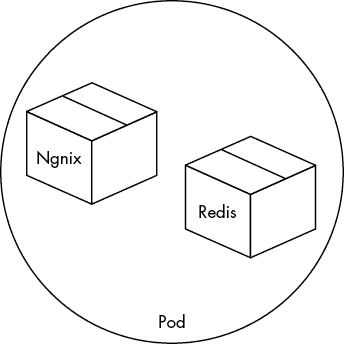
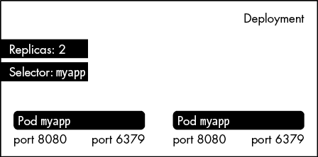
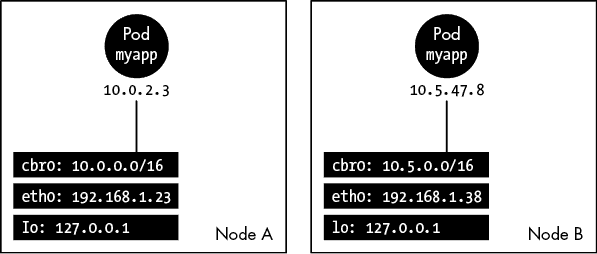
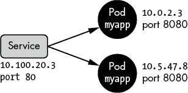
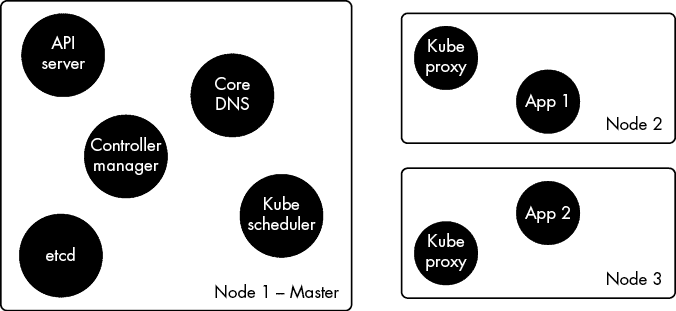

# 7

幕后


也许你总是在市场上最新最潮的技术发布时就跟进。也许你太忙于破解 Windows 域，没时间关注自己领域之外的最新趋势。但无论你这几年是过得像个弃儿，还是在各大会议之间巡回演讲，你一定听过关于某种神奇新生物的传闻和低语——那就是*Kubernetes*，终极容器编排和部署解决方案。

Kube 的狂热者会告诉你，这项技术解决了管理员和 DevOps 面临的所有重大挑战。它号称开箱即用，简直是魔法，他们这么说。是的，给一个无助的人一套翼装，指向远处山脉中的一个小洞，然后把他推下去。Kubernetes 可不是什么魔法。它很复杂。它是由各种不协调的成分交织在一起，像一团乱麻，最终被每个人最头痛的敌人：iptables 和 DNS 绑定在一起。

对我们这些黑客来说，最棒的部分是什么？在首次公开发布后，花了一个非常有才华的工程师团队整整两年时间*才推出安全功能*。有人可能会对他们的优先级提出质疑，但我个人是感激的。如果合格的、高薪的工程师在 2017 年设计了未经认证的 API 和不安全的系统，那我又能说什么呢？任何帮助都非常感激，伙计们。

话虽如此，我相信 Kubernetes 是一项强大且具有颠覆性的技术。它可能会长期存在，并且有潜力在公司架构中扮演至关重要的角色，以至于我觉得有必要为大家呈现一场关于它内部运作的速成课程。如果你已经从零部署过集群，或者编写过自己的控制器，那么你可以跳过这一章。否则，请继续阅读。你可能不会成为 Kube 专家，但我敢保证，你会学到足够的知识来破解它。

黑客们不会满足于“魔法”这一说法。我们将拆解 Kube，探索它的各个组件，学习识别一些常见的错误配置。MXR Ads 将是完美的实践场所。准备好来破解一些 Kube 吧！

## Kubernetes 概述

Kubernetes 是解答“如何高效管理成千上万个容器？”这一问题的答案。如果你在第三章中设置的基础设施上稍微玩一下容器，你很快就会遇到一些令人沮丧的限制。例如，要部署一个新的容器镜像版本，你必须修改用户数据并重启或推出新机器。想想看：为了重置一些进程，这个本应仅需几秒钟的操作，你却需要配置一台全新的机器。同样，唯一的动态扩展环境的方式——比如说，如果你想将容器数量加倍——就是增加机器并将它们隐藏在负载均衡器后面。我们的应用程序以容器形式存在，但我们只能在机器级别进行操作。

Kube 通过提供一个运行、管理和调度容器的环境，解决了这个以及更多问题，使得多个机器之间的容器管理变得高效。想要再添加两个 Nginx 容器？没问题。只需一个命令：

```
root@DemoLab:/# **kubectl scale --replicas=3 deployment/nginx**
```

想要更新生产环境中部署的 Nginx 容器版本吗？现在不需要重新部署机器了。只需请求 Kube 滚动发布新更新，无需停机：

```
root@DemoLab:/# **kubectl set image deployment/nginx-deployment\**
**nginx=nginx:1.9.1 --record**
```

想要立即在 VPC vpc-b95e4bdf 上某个机器 i-1b2ac87e65f15 上运行的容器编号 7543 上获得 shell 吗？忘掉获取主机 IP、注入私钥、SSH、`docker exec` 等等吧。现在可不是 2012 年了！只需从你的笔记本电脑上执行一个简单的 `kubectl exec` 命令即可：

```
root@DemoLab:/# **kubectl exec sparcflow/nginx-7543 bash**
root@sparcflow/nginx-7543:/#
```

难怪这个庞然大物征服了所有 DevOps 社区的心智。它优雅、高效，直到最近，曾经是如此不安全！几年前，你只需指向一个 URL，就可以执行上述所有操作以及更多操作，而无需任何身份验证。*Nichts*，*zilch*，*nada*。而且那只是一个入口点，另外三个入口也提供类似的访问。那真是残酷。

然而，在过去两年左右的时间里，Kubernetes 实现了许多新的安全功能，从基于角色的访问控制到网络过滤。虽然一些公司仍然停留在 1.8 之前的集群版本，但大多数公司都在运行比较现代的版本，因此我们将使用一个完全修补和加固的 Kubernetes 集群来增加难度。

在本章的其余部分，假设我们有一百台由 AWS 提供的机器，完全受 Kubernetes 的支配。这些机器组成了我们常说的 *Kubernetes 集群*。我们将在解构整个过程之前先使用一些基本命令，所以接下来的几段请容忍部分信息。这一切最终都会理顺。

### 引入 Pods

我们的 Kubernetes 之旅从一个运行应用程序的容器开始。这个应用程序严重依赖于第二个容器，后者包含一个小型本地数据库来响应查询。这时，pods 登场了。*Pod* 本质上是一个或多个容器，Kubernetes 将它们视为一个整体。Pod 中的所有容器将一起调度、一起启动、一起终止（参见 图 7-1）。

你与 Kubernetes 交互的最常见方式是提交 *清单文件*。这些文件描述了基础设施的 *期望状态*，例如哪些 pod 应该运行，使用哪个镜像，它们如何相互通信，等等。在 Kubernetes 中，一切都围绕着那个期望状态展开。实际上，Kube 的主要任务就是将这个期望状态变为现实并保持不变。



图 7-1：由 Nginx 和 Redis 容器组成的一个 pod

在清单 7-1 中，我们创建一个清单文件，为由两个容器组成的 Pod 打上标签`app: myapp`：一个 Nginx 服务器监听 8080 端口，另一个是可用 6379 端口的 Redis 数据库。以下是描述此设置的 YAML 语法：

```
# myapp.yaml file
# Minimal description to start a pod with 2 containers
apiVersion: v1
kind: Pod  # We want to deploy a pod
metadata:
  name: myapp # Name of the pod
  labels:
    app: myapp # Label used to search/select the pod
spec:
  containers:
    - name: nginx   # First container
      image: sparcflow/nginx # Name of the public image
      ports:
        - containerPort: 8080 # Listen on the pod's IP address
    - name: mydb   # Second container
      image: redis # Name of the public image
      ports:
        - containerPort: 6379
```

清单 7-1：创建包含两个容器的 Pod 的清单文件

我们使用 kubectl 工具发送这个清单，kubectl 是与 Kubernetes 集群交互的旗舰程序。你需要从[`kubernetes.io/docs/tasks/tools/install-kubectl/`](https://kubernetes.io/docs/tasks/tools/install-kubectl/) 下载 kubectl。

我们更新 kubectl 配置文件*~/.kube/config*，使其指向我们的集群（稍后会详细介绍），然后提交清单 7-1 中的清单文件：

```
root@DemLab:/# **kubectl apply -f myapp.yaml**

root@DemLab:/# **kubectl get pods**
NAME    READY   STATUS         RESTARTS   AGE
myapp   2/2     Running        0          1m23s
```

由两个容器组成的 Pod 现在已成功运行在集群中 100 台机器中的一台上。位于同一 Pod 中的容器被视为一个整体，因此 Kube 使它们共享相同的卷和网络命名空间。结果是，我们的 Nginx 和数据库容器具有相同的 IP 地址（10.0.2.3），该地址从网络桥接 IP 池中选择（有关详细信息，请参见第 119 页的“资源”部分），并且它们可以使用其命名空间隔离的本地主机地址（127.0.0.1）互相通信，如图 7-2 所示。这很方便。


图 7-2：Pod、容器和宿主机（节点）的网络配置

每个 Pod 都有一个 IP 地址，并运行在一个虚拟或裸金属机器上，称为*节点*。我们集群中的每台机器都是一个节点，因此集群有 100 个节点。每个节点都托管着一个带有一些特殊 Kubernetes 工具和程序的 Linux 发行版，用于与集群中的其他节点同步。

一个 Pod 很棒，但两个更好，特别是为了提高弹性，第二个 Pod 可以在第一个失败时作为备份。那么我们该怎么办呢？提交相同的清单两次？不，我们创建一个*部署*对象，可以复制 Pod，如图 7-3 所示。



图 7-3：一个 Kube 部署对象

一个部署描述了在任何给定时间应该运行多少个 Pod，并监督复制策略。如果 Pod 发生故障，它将自动重启；但它的关键特性是滚动更新。例如，如果我们决定更新容器的镜像，并提交一个更新的部署清单，它将以一种策略性方式替换 Pod，确保在更新过程中应用的持续可用性。如果出现问题，新的部署将回滚到之前的期望状态。

让我们删除之前的独立 Pod，以便将其作为部署对象的一部分重新创建：

```
root@DemoLab:/# **kubectl delete -f myapp.yaml**
```

要将 pod 创建为部署对象，我们推送一个新的类型为`Deployment`的清单文件，指定要复制的容器标签，并在清单文件中附加前一个 pod 的配置（参见列表 7-2）。Pod 通常作为部署资源的一部分进行创建。

```
# deployment_myapp.yaml file
# Minimal description to start 2 pods
apiVersion: apps/v1
kind: Deployment # We push a deployment object
metadata:
  name: myapp # Deployment's name
spec:
  selector:
    matchLabels: # The label of the pods to manage
      app: myapp
  replicas: 2 # Tells deployment to run 2 pods
  template: # Below is the classic definition of a pod
    metadata:
      labels:
        app: myapp # Label of the pod
    spec:
 containers:
        - name: nginx   # First container
          image: sparcflow/nginx
          ports:
            - containerPort: 8080
        - name: mydb   # Second container
          image: redis
          ports:
            - containerPort: 6379
```

列表 7-2：将我们的 pod 重新创建为部署对象

现在我们提交清单文件并查看新部署的 pod 详情：

```
root@DemLab:/# **kubectl apply -f deployment_myapp.yaml**
deployment.apps/myapp created
root@DemLab:/# **kubectl get pods**
NAME                READY   STATUS   RESTARTS   AGE
myapp-7db4f7-btm6s  2/2     Running  0          1m38s
myapp-9dc4ea-ltd3s  2/2     Running  0          1m43s
```

图 7-4 展示了这两个 pod 正在运行。



图 7-4：两个正在运行的 pod，每个 pod 由两个容器组成

所有属于同一 Kubernetes 集群的 pod 和节点可以自由通信，而不需要使用像网络地址转换（NAT）这样的伪装技术。这种自由通信是 Kubernetes 网络功能的标志之一。位于 B 机器上的 pod A 应该能够通过机器/路由器/子网/VPC 层定义的正常路由，访问位于 D 机器上的 pod C。这些路由是由设置 Kube 集群的工具自动创建的。

### 流量均衡

现在我们想要将流量均衡到这两个 pod。如果其中一个 pod 停止运行，数据包应自动路由到剩下的 pod，同时重新生成一个新的 pod。描述这个配置的对象叫做*服务*，如图 7-5 所示。



图 7-5：集群服务对象

一个服务的清单文件由元数据组成，这些元数据为服务和其路由规则添加标签，路由规则指定要访问的 pod 和监听的端口（参见列表 7-3）。

```
# myservice.yaml file
# Minimal description to start a service
apiVersion: v1
kind: Service # We are creating a service
metadata:
  name: myapp
  labels:
    app: myapp  # The service's tag
spec:
  selector:
    app: myapp # Target pods with the selector "app:myapp"
  ports:
    - protocol: TCP
      port: 80 # Service listens on port 80
      targetPort: 8080 # Forward traffic from port 80 to port 8080 on the pod
```

列表 7-3：服务清单文件

然后我们提交这个清单文件以创建服务，服务会被分配一个*集群 IP*，这个 IP 只能从集群内部访问：

```
root@DemLab:/# **kubectl apply -f service_myapp.yaml**
service/myapp created

root@DemLab:/# **kubectl get svc myapp**
NAME    TYPE        CLUSTER-IP       EXTERNAL-IP   PORT(S)
myapp   ClusterIP   10.100.166.225   <none>        80/TCP
```

另一个机器上的 pod 如果想与我们的 Nginx 服务器通信，将把请求发送到集群 IP 的 80 端口，然后将流量转发到两个容器中的一个的 8080 端口。

让我们使用 Docker 公共镜像`curlimages/curl`快速启动一个临时容器来测试这个设置，并 ping 集群 IP：

```
root@DemLab:/# **kubectl run -it --rm --image curlimages/curl mycurl -- sh**

/$ curl 10.100.166.225
<h1>Listening on port 8080</h1>
```

很棒，我们可以从集群内访问 Nginx 容器。跟得上吗？太好了。

### 将应用暴露给外部世界

到目前为止，我们的应用仍然对外界封闭。只有内部的 pod 和节点知道如何联系集群 IP 或直接访问 pod。我们所在的计算机位于不同的网络上，缺少必要的路由信息来访问我们刚刚创建的任何资源。本教程的最后一步是通过*NodePort*使该服务能够从外部访问。该对象会在集群的每个节点上暴露一个端口，该端口会随机指向我们创建的两个 pod 之一（我们稍后会详细介绍）。即使是外部访问，我们也保留了弹性功能。

我们在清单文件中的先前服务定义中添加 `type: NodePort`：

```
apiVersion: v1
`--snip--`
  selector:
    app: myapp # Target pods with the selector "app:myapp"
  type: NodePort
  ports:
`--snip--`
```

然后我们再次提交服务清单：

```
root@DemLab:/# **kubectl apply -f service_myapp.yaml**
service/myapp configured

root@DemLab:/# **kubectl get svc myapp**
NAME    TYPE       CLUSTER-IP       EXTERNAL-IP   PORT(S)
myapp   NodePort   10.100.166.225   <none>        80:31357/TCP
```

任何请求到达任何节点外部 IP 上的 31357 端口时，都会随机地到达两个 Nginx Pod 之一。这里是一个快速测试：

```
root@AnotherMachine:/# **curl 54.229.80.211:31357**
<h1>Listening on port 8080</h1>
```

呼……完成了。我们还可以通过创建一个负载均衡器，暴露更多常见的端口，如 443 和 80，将流量路由到此节点端口，从而添加更多网络层次，但暂时就停在这里吧。

## Kube 底层揭秘

我们有一个具有弹性、松散负载均衡、容器化的应用程序正在某处运行。接下来是有趣的部分。让我们拆解一下刚刚发生的事情，揭开每个在线教程似乎匆忙掩盖的肮脏秘密。

当我第一次开始玩 Kubernetes 时，创建服务时得到的集群 IP 地址让我困扰了很久。很多。它是从哪里来的？节点的子网是 192.168.0.0/16。容器们在它们自己的 10.0.0.0/16 池中游泳。那个 IP 是怎么来的？

我们可以列出集群中每个节点的每个接口，但永远也找不到那个 IP 地址。因为它根本不存在。字面上讲。它只是一个 iptables 目标规则。这个规则会被推送到所有节点，指示它们将所有针对这个不存在的 IP 的请求转发到我们创建的两个 Pod 之一。就这样。这就是一个服务对象——一堆由名为 *kube-proxy* 的组件编排的 iptables 规则。

Kube-proxy 也是一个 Pod，但确实是一个非常特殊的 Pod。它运行在集群的每个节点上，默默地编排网络流量。尽管名字是代理（proxy），但实际上它并不转发数据包，至少在近期版本中不是。它悄悄地在所有节点上创建和更新 iptables 规则，以确保网络包能够到达目的地。

当一个数据包到达（或试图离开）节点时，它会自动发送到 `KUBE-SERVICES` iptables 链，我们可以使用 `iptables-save` 命令查看该链：

```
root@KubeNode:/# **iptables-save**
-A PREROUTING -m comment --comment "kube" -j KUBE-SERVICES
`--snip--`
```

这个链尝试根据数据包的目标 IP 和端口（`-d` 和 `--dport` 标志）将其与多个规则匹配：

```
`--snip--`
-A KUBE-SERVICES -d 10.100.172.183/32 -p tcp -m tcp --dport 80 -j KUBE-SVC-NPJI
```

这是我们调皮的集群 IP！任何发送到 10.100.172.183 地址的包都会被转发到链 `KUBE-SVC-NPJ`，该链在稍后的几行中定义：

```
`--snip--`
-A KUBE-SVC-NPJI -m statistic --mode random --probability 0.50000000000 -j KUBE-SEP-GEGI

-A KUBE-SVC-NPJI -m statistic --mode random --probability 0.50000000000 -j KUBE-SEP-VUBW
```

该链中的每条规则会随机匹配包 50% 的时间，并将其转发到一个不同的链，最终将包发送到正在运行的两个 Pod 之一。服务对象的韧性无非是 iptables 统计模块的反映：

```
`--snip--`
-A KUBE-SEP-GEGI -p tcp -m tcp -j DNAT --to-destination 192.168.127.78:8080

-A KUBE-SEP-VUBW -p tcp -m tcp -j DNAT --to-destination 192.168.155.71:8080
```

发送到节点端口的数据包将遵循相同的处理链，只是它将无法匹配任何集群 IP 规则，因此会自动转发到 `KUBE-NODEPORTS` 链。如果目标端口匹配预定义的节点端口，数据包就会被转发到我们看到的负载均衡链（`KUBE-SVC-NPJI`），该链将数据包随机分配到 Pod 中：

```
`--snip--`
-A KUBE-SERVICES -m comment --comment "last rule in this chain" -m addrtype
--dst-type LOCAL -j KUBE-NODEPORTS

-A KUBE-NODEPORTS -p tcp -m tcp --dport 31357 -j KUBE-SVC-NPJI
```

就是这么简单：一串巧妙的 iptables 规则和网络路由。

在 Kubernetes 中，每一个小任务都由一个专门的组件执行。Kube-proxy 负责网络配置。它的特殊之处在于它作为一个 pod 在每个节点上运行，而其余核心组件则在一个特定节点组（称为 *master nodes*）上的多个 pods 中运行。

在我们创建 100 台机器的集群时，100 个节点中有一个主节点将承载一组组成 Kubernetes 脊柱的 pods：API 服务器、kube-scheduler 和 controller manager（参见 图 7-6）。



图 7-6：运行在主节点上的 pods 与运行在普通节点上的 pods

实际上，当我们使用 `kubectl` `apply` 命令发送清单文件时，已经与主节点进行了交互。Kubectl 是一个封装器，它向至关重要的 API 服务器 pod 发送 HTTP 请求，这是获取和持久化集群所需状态的主要入口点。这里是一个典型的配置，可能会用来访问 Kube 集群（*~/.kube/config*）：

```
apiVersion: v1
kind: Config
clusters:
- cluster:
 certificate-authority: /root/.minikube/ca.crt
    server: https://192.168.99.100:8443
  name: minikube
`--snip--`
users:
- name: sparc
  user:
    client-certificate: /root/.minikube/client.crt
    client-key: /root/.minikube/client.key
`--snip--`
```

在这个例子中，我们的 API 服务器 URL 是 *https://192.168.99.100*。你可以这样理解：API 服务器是唯一允许读取/写入数据库中所需状态的 pod。想列出 pods？请询问 API 服务器。想报告 pod 故障？告诉 API 服务器。它是主控者，负责协调 Kubernetes 中复杂的交响乐。

当我们通过 kubectl 向 API 服务器提交部署文件（HTTP）时，它进行了系列检查（身份验证和授权，我们将在第八章讨论），然后将该部署对象写入 *etcd* 数据库，这是一种使用 Raft 共识算法在多个节点（或 pods）之间保持一致和协调状态的键值数据库。在 Kube 中，etcd 描述了集群的所需状态，例如有多少个 pods，它们的清单文件，服务描述，节点描述等。

一旦 API 服务器将部署对象写入 etcd，所需状态就正式改变了。它会通知订阅了此特定事件的回调处理程序：*deployment controller*，这是另一个在主节点上运行的组件。

所有 Kube 交互都基于这种事件驱动的行为，这反映了 etcd 的 watch 功能。API 服务器接收到通知或执行某个操作。它读取或修改 etcd 中的所需状态，这会触发事件并将其传递给相应的处理程序。

部署控制器要求 API 服务器返回新的所需状态，发现部署已初始化，但没有找到它应管理的 pod 群组的任何参考。它通过创建一个 *ReplicaSet* 来解决这个差异，ReplicaSet 是描述一组 pod 复制策略的对象。

这个操作再次经过 API 服务器，后者再次更新状态。不过，这一次，事件被发送到 ReplicaSet 控制器，控制器发现期望的状态（两组 pod）与现实情况（没有 pod）不匹配。它继续创建容器定义。

这个过程（你猜对了）再次经过 API 服务器，服务器在修改状态后触发 pod 创建的回调， kube-scheduler（运行在主节点上的专用 pod）会监控该回调。

调度器在数据库中看到两个处于待处理状态的 pod。无法接受。它运行调度算法以找到合适的节点来托管这两个 pod，更新 pod 的描述并为其分配相应的节点，然后将这批 pod 提交到 API 服务器，存储在数据库中。

这一系列官僚式的疯狂过程的最后一部分是 *kubelet*：一个在每个工作节点上运行的进程（不是 pod！），定期从 API 服务器拉取应该运行的 pod 列表。kubelet 发现它的主机应该运行两个额外的容器，于是它通过容器运行时（通常是 Docker）启动这些容器。我们的 pod 终于活了起来。

复杂吗？我早就说过了。但不可否认，这种同步方案的美妙。虽然我们只讲解了众多可能的交互中的一个工作流，但放心，你应该能跟得上几乎所有关于 Kube 的文章。我们甚至准备将其推向下一个阶段——因为，别忘了，我们在 MXR Ads 还有一个真实的集群等着我们。

## 资源

+   更多关于桥接和桥接池的细节可以在 Docker 文档中找到：[`docs.docker.com/network/bridge/`](https://docs.docker.com/network/bridge/)。

+   亚马逊弹性 Kubernetes 服务（EKS）上的 pod 直接连接到弹性网络接口，而不是使用桥接网络；详情请见 [`amzn.to/37Rff5c`](https://amzn.to/37Rff5c)。

+   更多关于 Kubernetes pod 到 pod 网络的信息，请参见 [`bit.ly/3a0hJjX`](http://bit.ly/3a0hJjX)。

+   这是一个关于从外部访问集群的其他方式的概述：[`bit.ly/30aGqFU`](http://bit.ly/30aGqFU)。

+   更多关于 etcd 的信息，请参见 [`bit.ly/36MAjKr`](http://bit.ly/36MAjKr) 和 [`bit.ly/2sds4bg`](http://bit.ly/2sds4bg)。

+   关于通过未经认证的 API 攻击 Kubernetes，详情见 [`bit.ly/36NBk4S`](http://bit.ly/36NBk4S)。
