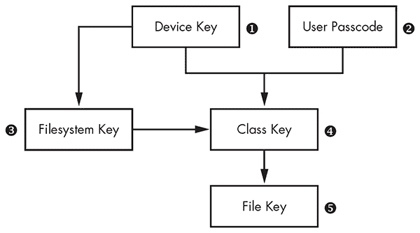
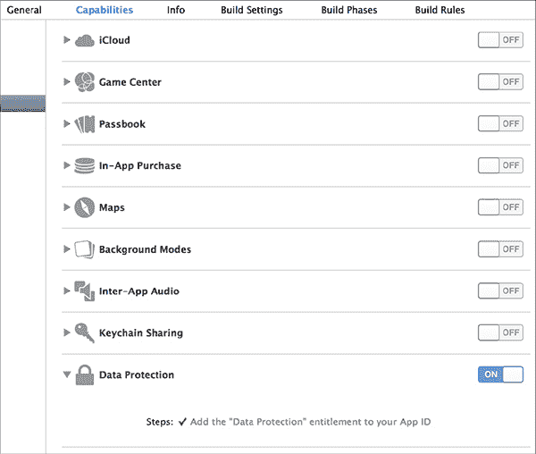
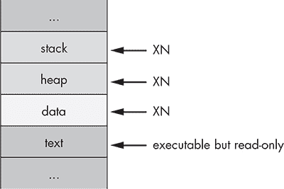

## 第一章：1

**iOS 安全模型**

让我们对苹果的努力表示肯定：苹果在将恶意软件拒之门外方面相当成功（据我所知）。但是，应用审核流程对于开发者来说可能是一个令人沮丧的黑匣子。苹果审核员使用的流程没有公开文档，而且有时很难明确哪些功能是被允许的，哪些是不被允许的。苹果提供了一些不错的指南，^(1) 但有些应用也因一些适用于已通过审核应用的标准而被拒绝。

当然，什么算作恶意行为是由苹果定义的，而不是由用户定义的。苹果通过 App Store 来控制 iOS 平台上可用的功能，这意味着获取某些功能的唯一方式是越狱设备或绕过 App Store 审核流程。一个例子是 Handy Light 应用，它伪装成手电筒应用，但实际上包含了一个隐藏模式，用于启用设备的网络共享功能。^(2)

应用程序审核流程本身无法捕捉所有复杂（或微不足道的）恶意应用，因此需要其他机制来有效防止恶意应用影响更广泛的操作系统环境。在本章中，你将了解 iOS 安全机制的架构；在后续章节中，你将深入学习如何在自己的程序中正确利用这些机制。

让我们快速浏览一下 iOS 实现的基本安全组件，以防止漏洞和保护数据。虽然我将在后续章节中深入探讨这些组件的实际机制，但我首先会给出它们背后的动机及其用途的广泛概述。

### 安全启动

当你启动一台 iOS 设备时，它会从只读启动 ROM 中读取初始指令，从而引导系统启动。启动 ROM 还包含了苹果证书颁发机构的公钥，接着验证低级引导加载程序（LLB）是否由苹果签名，并启动它。LLB 执行一些基本任务，然后验证第二阶段引导加载程序 iBoot。当 iBoot 启动时，设备可以进入恢复模式或启动内核。当 iBoot 验证内核也由苹果签名后，启动过程正式开始：驱动加载，设备探测，系统守护进程启动。

这一信任链的目的是确保系统的所有组件都由苹果编写、签名并分发——而不是由第三方编写，这些第三方可能包括恶意攻击者和针对越狱设备运行的软件作者。该信任链也用于启动单个应用程序签名的检查；所有应用程序必须直接或间接由苹果签名。

攻击这个信任链是越狱工作原理的核心。越狱作者需要在这个链中的某个地方找到一个漏洞，以禁用对链中后续组件的验证。利用 Boot ROM 漏洞是最理想的，因为这是苹果无法通过软件更新改变的唯一组件。

### 通过应用沙盒限制访问

苹果的沙盒，历史上被称为 Seatbelt，是一种基于 FreeBSD TrustedBSD 框架的*强制访问控制（MAC）*机制，主要由 Robert Watson 推动。它使用类似 Lisp 的配置语言来描述程序可以或不能访问哪些资源，包括文件、操作系统服务、网络和内存资源等。

MAC 与传统的访问控制机制，如自主访问控制（DAC）不同，后者允许*主体*（如用户进程）操控*对象*（文件、套接字等）的访问控制。DAC 在其最简单、最常见的形式下，通过 UNIX 系统中的*用户*、*组*和*其他*权限进行控制，这些权限可以被授予读取、写入或执行权限^(3)。在 DAC 系统中，如果用户拥有某个对象的所有权，他们可以改变该对象的权限。例如，如果你拥有一个文件，你可以将其设置为世界可读或世界可写，显然这会破坏访问控制。

虽然 MAC 是一个广泛的术语，在沙盒环境中，它指的是应用程序被限制在一个虚拟容器中，容器内有详细的规则指定了主体（如应用程序）可以访问哪些系统资源，例如网络资源、文件读写、创建进程的能力等^(4)。在 OS X 上，你可以控制一些应用程序的沙盒设置，但在 iOS 上，所有第三方应用程序都在单一的限制性策略下运行。

在文件访问方面，进程通常被限制在自己的应用程序包目录中；它们只能读取和写入存储在该目录中的文件。然而，标准策略略显松散。例如，在某些版本的 iOS 中，位于*/private/var/mobile/Media/Photos/*中的照片可以被第三方应用程序直接访问，尽管它们位于应用程序包目录之外，这使得程序能够在不请求用户许可的情况下偷偷访问照片。对应用程序滥用此类权限的唯一保护措施是苹果的应用审核流程。

这种方法不同于 Android 的实现方式，后者采用更传统的 DAC 模型，其中应用程序被分配自己的用户 ID 和一个由该 ID 所拥有的目录。权限严格通过传统的 UNIX 文件权限进行管理。虽然这两种方法都能实现目标，但 MAC 通常提供更多的灵活性。例如，除了应用目录隔离，MAC 策略还可以用于限制网络访问或限制系统守护进程可以执行的操作。

### 数据保护和全盘加密

iOS 在提供带有文件系统加密的移动设备方面走在前列，这也是其值得称赞的地方。iOS 提供了全盘加密，并额外提供了数据保护 API，以进一步保护开发者的文件。这两种相关机制使得在设备被盗或遭到破坏时，可以远程擦除设备并保护用户数据。

从历史上看，全盘加密的目的是解决一个问题：静态数据被攻击者窃取。在笔记本或台式机领域，这通常涉及将硬盘从机器中取出并连接到另一台机器，或者启动一个可以读取硬盘文件的操作系统。文件系统加密*并不能*防止数据从正在运行的设备中被窃取。如果某个应用能够读取磁盘上的文件，那么文件系统加密就没有任何作用，因为内核会透明地为尝试读取文件的任何进程解密文件。换句话说，文件系统加密工作在比通常用来读取文件的调用更低的层次上。能够对系统进行身份验证的攻击者，可以毫不受阻地读取任何可用的文件。

iOS 设备通常设计为始终运行，并且其内部存储不易拆卸。如果攻击者想要在没有身份验证的情况下读取设备上的敏感数据，他们必须完全拆解设备，并将闪存存储连接到自定义接口上直接读取存储。实际上，还有几种更简单的方法可以从设备中获取数据——例如代码执行漏洞、越狱等——因此没有人会真的去做那种繁琐的事情。

但这并不意味着 iOS 的全盘文件系统加密完全无用。它对于正确实现另外两项关键的安全功能是必要的：安全文件删除和远程设备擦除。传统的安全擦除文件的方法不适用于使用固态硬盘（SSD）的 iOS 设备。这种硬件使用的减少磨损机制，取消了覆盖文件以确保实际上覆盖了文件之前物理位置的所有保证。解决这个问题的办法是确保文件用安全存储的密钥进行加密，以便在需要销毁数据时，可以丢弃这些密钥。iOS 中使用的加密密钥层次结构是分层的。通过丢弃一个加密密钥，整个数据类别甚至整个文件系统都可以被销毁。

#### *加密密钥层次结构*

iOS 上存储数据的文件系统加密密钥是分层的，其中一些密钥加密其他密钥，从而使苹果能够对数据的可用性进行精细控制。基本的层次结构如图 1-1 所示。

*图 1-1：简化版 iOS 加密密钥层次结构*

*文件密钥* ➎是为每个文件生成的单独密钥，并存储在文件的元数据中。*分类密钥* ➍是针对特定数据保护类别的专用密钥，因此具有不同保护级别的文件使用不同的加密密钥。在 iOS 的旧版本中，默认的保护类别是`NSFileProtectionNone`；从第 5 版开始，默认的保护类别是`NSFileProtectionCompleteUntilFirstUserAuthentication`，该类别在第十三章中有更详细的描述。*文件系统密钥* ➌是一个全局加密密钥，用于加密文件的安全相关元数据，且该元数据在由分类密钥加密后再进行加密。

*设备密钥* ➊，也称为 UID 密钥，对于每个设备都是唯一的，且仅能由硬件 AES 引擎访问，而不能由操作系统本身访问。它是系统的主密钥，用来加密文件系统密钥和分类密钥。如果启用，*用户密码* ➋会与设备密钥结合，用于加密分类密钥。

当设置了密码时，这种密钥层级还允许开发者指定他们希望如何保护本地存储的数据，包括是否可以在设备锁定时访问数据，数据是否会备份到其他设备，等等。你将在第十三章中学到更多关于如何使用加密和文件保护功能来保护文件免受设备窃贼的侵害，我将在那里更深入地讲解数据保护 API。

#### *钥匙串 API*

对于小块的敏感信息，iOS 提供了一个专用的钥匙串 API。这允许开发者将密码、加密密钥和敏感的用户数据存储在一个安全的位置，其他应用无法访问。对钥匙串 API 的调用是通过`securityd`守护进程进行的，该进程从 SQLite 数据存储中提取数据。程序员可以指定在什么情况下密钥应该对应用可读，类似于数据保护 API。

#### *数据保护 API*

数据保护 API 利用文件系统加密、钥匙串以及用户的密码，提供一个额外的保护层，供开发者自行选择。这限制了系统进程在何种情况下可以读取这些文件。这个 API 最常用的场景是使数据在设备锁定时无法访问。

实际生效的数据保护程度很大程度上取决于设备运行的 iOS 版本，因为默认的数据保护类别随着时间的推移有所变化。在新创建的 iOS 应用项目中，默认情况下，所有应用数据都会启用数据保护，直到用户首次解锁设备。数据保护在项目设置中启用，如图 1-2 所示。

*图 1-2：为项目添加数据保护权限*

### 本地代码攻击缓解：ASLR、XN 及其他

iOS 实现了两种标准机制来帮助防止代码执行攻击：*地址空间布局随机化（ASLR）*和 *XN 位*（即 *eXecute Never*）。ASLR 在每次执行程序时都会随机化程序可执行文件、程序数据、堆和栈的内存位置；因为共享库需要保持固定位置以供多个进程共享，操作系统每次启动时而不是每次程序调用时随机化共享库的地址。这使得函数和库的具体内存地址难以预测，从而防止了依赖于知道基本 libc 函数内存地址的攻击，如返回到 libc 攻击。我将在第十一章中进一步讨论这些攻击及其工作原理。

XN 位，通常在非 ARM 平台上称为 NX（No-eXecute）位，允许操作系统将某些内存段标记为不可执行，这一操作由 CPU 强制执行。在 iOS 中，默认情况下，这个位被应用于程序的栈和堆。这意味着，如果攻击者能够将恶意代码插入栈或堆中，他们将无法将程序重定向执行他们的攻击代码。图 1-3 展示了进程内存的各个段及其 XN 状态。

只有在用苹果的代码签名权限签名的程序，才能拥有既可写又可执行的内存；这主要用于 Mobile Safari 中的 JavaScript 即时编译器（JIT）。你在自己程序中使用的普通 WebViews 无法访问相同的功能；这是为了防止代码执行攻击。苹果政策的一个不幸后果是，它实际上禁止了第三方 JIT，尤其是阻止了 Chrome 在 iOS 上的表现不如 Safari。Chrome 必须使用内建的 WebViews。

*图 1-3：进程的基本内存段*

### 越狱检测

从根本上来说，*越狱*是任何一种禁用 iOS 代码签名机制的过程，它允许设备运行非苹果直接批准的应用程序。越狱让你能够利用一些有用的开发和测试工具，以及那些永远不会通过 App Store 审核的实用程序。^(5) 越狱功能对于黑箱测试至关重要；我将在第六章进一步探讨黑箱测试。

与普遍的看法相反，越狱并不一定会禁用 iOS 的沙盒。它只是允许你安装沙盒外的应用程序。安装在 *mobile* 用户的主目录中的应用程序（即通过 App Store 安装的应用）仍然会受到沙盒限制。需要更高权限的第三方 iOS 应用会安装在 */Applications* 文件夹中，与苹果的官方应用一起。

越狱检测的历史悠久且充满戏剧性。该过程旨在检测设备是否由于未经签名的第三方程序不太可信而面临更高的安全风险。公平来说，第三方应用库中确实不乏恶意软件和行为异常的程序，但总体来说，越狱检测并不值得花时间去做，因为它无法阻止一个决心坚定的攻击者。

在短短一段时间内，苹果曾推出官方的越狱检测 API，但很快就从后续的 iOS 版本中撤回了。没有了这个 API，开发者们自行实现了许多技巧来尝试检测越狱。尝试越狱检测的最常见技巧大致如下：

• 生成一个新进程，例如使用 `fork()`、`vfork()`、`popen()` 等。这是沙盒明确禁止的操作。当然，在越狱设备上，沙盒依然启用，这使得这种策略几乎没有意义。无论设备是否越狱，这都会导致任何应用商店的应用失败。

• 读取沙盒外的文件路径。开发者常常尝试访问 `ssh`、`bash` 的二进制文件、*Cydia.app* 目录、Cydia 使用的 `apt` 仓库路径等。这些检查非常容易绕过，工具如 Xcon^(6) 可以帮助最终用户自动绕过这些检查。

• 确保越狱检测逻辑的方法名显而易见，比如 `isJailbroken`，这样攻击者可以轻松识别并禁用你的越狱检查。

也有一些更隐蔽的技巧。例如，苹果的 iBooks 应用会尝试运行与应用捆绑包一起分发的未签名代码。^(7) 精明的开发者还会尝试使用 `_dyld_image_count()` 和 `_dyld_get_image_name()` 来检查已加载的动态库（*dylibs*）的总数及其名称，^(8) 并使用 `_dyld_get_image_header()` 检查它们在内存中的位置。^(9) 绕过这些检查通常需要直接修改应用的二进制文件。

如你所见，我通常不看好越狱检测。就像二进制混淆技术和 DRM 一样，越狱检测技术通常只是让你在被绕过时看起来很傻（相信我，我见过一些很傻的混淆技术）。支持者们常常辩称，执行表面上的越狱检测可以减缓盗版者或攻击者的速度。但你的对手的爱好就是破解应用，他们有几周的时间可以用来做这件事——将他们拖延几个小时并不值得。我用混淆二进制文件和一系列测试来绕过越狱检测，最长只花了一天时间——而且我还是这方面的业余爱好者。

### 应用商店评论有多有效？

在开发应用程序或评估应用面临的威胁时，重要的是要评估流氓应用程序可能最终出现在终端用户设备上的风险。任何恶意的第三方应用程序一旦进入设备，就能够通过 IPC 机制与其他应用程序进行交互，还能窃取个人信息。防御这些应用程序的主要手段是苹果的 App Store 审核过程。

苹果并未公开其测试应用程序是否符合 App Store 接受标准的方法，但显然进行了二进制分析和动态测试。这个过程已将大多数显而易见的恶意软件排除在 App Store 之外，代价是也阻止了苹果不喜欢的任何应用（包括许多类型的通讯应用、色情内容、任何娱乐类应用等等）。

尽管苹果做出了努力，但已经证明，一些中等复杂的攻击者可以通过 App Store 审核提交应用，并保持下载新代码的能力。攻击者有几种不同的方式可以实现这一点。

#### *来自 WebKit 的桥接*

有几种通过 JavaScript 访问本地 iOS API 的方法，例如获取用户位置或使用媒体服务，通常是通过基于 WebKit 的桥接来实现。PhoneGap 就是这样的一个典型例子。^(10) 尽管这些桥接可以提供有用的功能和灵活性，但使用它们也意味着大量的应用逻辑最终会在 JavaScript 中实现，而这些逻辑未必一开始就包含在应用程序内。例如，开发者可能实现一个通用的文件打开功能，通过 JavaScript 访问，并在审核过程中避免用它做任何恶意操作。但后来，该开发者可以修改提供给设备的 JavaScript，并尝试访问不应该被访问的设备区域中的数据。

我将在第九章中讨论 JavaScript/本地代码桥接的实现以及一些相关问题。

#### *动态修补*

通常，应用程序不能运行未经苹果签发密钥加密签名的本地代码。如果苹果的签名检查逻辑中存在漏洞或缺陷，可能会允许下载和执行本地代码。一个在实际中显著的例子是 Charlie Miller 利用一个漏洞，允许程序分配没有 NX 保护的内存区域（即可读、可写且可执行的内存区域），并且这些区域不需要代码签名。^(11) 这一机制是苹果为支持 Safari 的 JIT 编译器功能而设置的，^(12) 但实现中的一个漏洞使得第三方应用能够进行相同的操作。

这意味着原生代码可以在不需要任何签名的情况下下载并执行。Miller 通过提交一个名为*InstaStock*的应用程序到 App Store 来演示这一点，该应用声称是一个股票行情查看程序。在应用审查时，该应用并未表现出任何恶意或异常行为；然而，在审查过程完成后，Miller 能够指示程序下载新的未签名代码并顺利执行这些代码。这个问题现已解决，但它确实让你对审查漏洞有所了解。

#### *故意存在漏洞的代码*

绕过 App Store 审查的一个有趣方法是故意使你的应用程序容易受到远程攻击。*Jekyll*^(13)是乔治亚理工大学开发的一个概念验证应用程序，故意在核心应用中引入了缓冲区溢出。恶意代码被包含在应用程序本身中，这样代码会被签名，但应用程序从未调用它。通过审查后，研究人员能够利用缓冲区溢出漏洞改变应用程序的控制流，将恶意代码包含其中，使其能够使用私有的 Apple 框架与蓝牙、短信等进行交互。

#### *嵌入式解释器*

尽管苹果对这种做法的政策多年来有所变化，但许多产品（主要是游戏）使用嵌入式 Lua 解释器来执行大部分内部逻辑。目前，使用嵌入式解释器的恶意行为尚未在野外报告，但一个巧妙的应用程序如果使用类似的解释器，可能会动态下载代码并从内存中执行，当然，这种行为不会出现在审查过程中。这将增加新的恶意功能（或有益功能，如果你有这种倾向的话）。

### 总结思考

最终，应用审查提供了哪些保护呢？嗯，它确实能够筛选掉一些不太复杂的恶意软件。但你可以相当确定地假设，恶意应用程序确实会不时地从审查中漏过。记住这一点，编写防御性的代码；你绝对*不能*假设操作系统上的其他应用程序是无害的。
