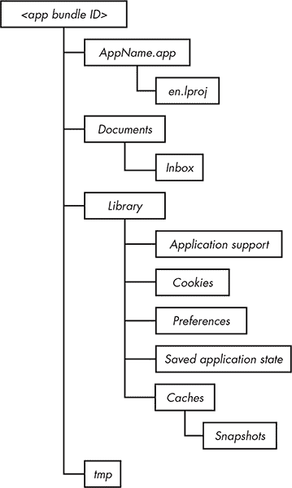
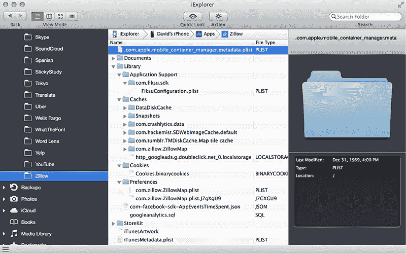
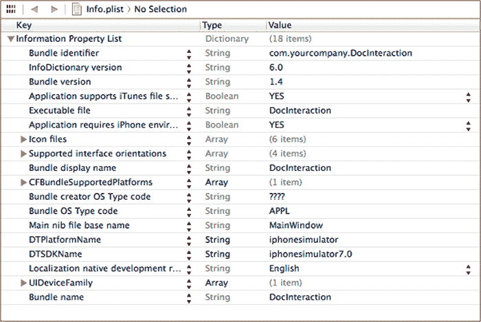

## 3

**iOS 应用程序解剖**

为了了解 iOS 应用程序面临的一些问题，了解不同类型的数据是如何存储和操作的非常有用，这些数据存储在应用程序的私人目录中，该目录存储着所有的配置、资源、二进制文件和文档。在这里，你可以发现各种信息泄露问题，并深入探究你正在检查的程序的内部结构。

找出你的应用程序在 iOS 设备上本地存储了哪些数据的最快方式是查看 *~Library/Developer/CoreSimulator/Devices*。从 Xcode 6 开始，每个设备类型和操作系统版本的组合都会被分配一个 UUID。你的特定应用程序的数据将存储在该目录下的两个位置。你的应用程序的二进制文件和资源，包括 *.nib* 用户界面文件和随应用程序附带的图形文件，存储在 *<设备 ID>/data/Containers/Bundle/Application/<应用包 ID>* 中。你的应用程序存储的更多动态数据则存储在 *~<设备 ID>/data/Containers/Data/Application/<应用包 ID>* 中。系统范围的数据，如全局配置，将存储在 *<设备 ID>* 目录的其余部分。

探索这个目录结构，简化版本见图 3-1，还可以揭示哪些类型的数据由操作系统服务而非你的应用程序处理。



*图 3-1：应用程序目录的布局*

如果你使用的是越狱设备，你可以通过 SSH 连接到设备并探索目录结构；我将在第六章中讨论越狱以及如何连接测试设备。无论你的设备是否越狱，你都可以使用像 iExplorer 这样的工具^(1)，来检查你安装的应用程序的目录结构，如图 3-2 所示。

在本章的其余部分，我将介绍一些 iOS 应用程序常用的目录和数据存储，以及如何通过编程方式与它们交互以及可能从中泄露的哪些数据。



*图 3-2：使用 iExplorer 检查应用程序包*

### 处理 plist 文件

在开始检查目录结构之前，你需要了解如何读取你将会发现的一些内容。iOS 将应用程序配置数据存储在 *属性列表（plist）* 文件中，这些文件使用 Core Foundation 数据类型（如 `CFArray`、`CFString` 等）存储信息。从安全角度来看，你需要检查 plist 文件，查看其中是否包含不应以明文存储的内容，比如凭证，并可能对其进行修改，从而改变应用程序的行为。例如，你可以启用一个被禁用的付费功能。

plist 格式有两种类型：二进制和 XML。如以下示例所示，XML 格式易于人类读取。

```
<?xml version="1.0" encoding="UTF-8"?>
<!DOCTYPE plist PUBLIC "-//Apple//DTD PLIST 1.0//EN" "http://www.apple.com/DTDs/
    PropertyList-1.0.dtd">
<plist version="1.0">
<dict>
<plist version="1.0">
<dict>
  <key>CFBundleDevelopmentRegion</key>
  <string>en</string>
  <key>CFBundleExecutable</key>
  <string>Test</string>
  <key>CFBundleIdentifier</key>
  <string>com.dthiel.Test</string>
  <key>CFBundleInfoDictionaryVersion</key>
  <string>6.0</string>
  <key>CFBundleName</key>
  <string>Test</string>
  <key>CFBundlePackageType</key>
  <string>APPL</string>
  <key>CFBundleShortVersionString</key>
  <string>1.0</string>
  <key>CFBundleSignature</key>
  <string>????</string>
  <key>CFBundleSupportedPlatforms</key>
  <array>
    <string>iPhoneSimulator</string>
  </array>
--snip--
```

这只是一个包含层级键值对的字典，提供了有关应用的信息——它可以运行的平台、代码签名等等（此处没有签名，因为该应用部署在模拟器应用中）。

但是在从命令行检查文件或编程操作 plist 时，你经常会遇到二进制格式的 plist，它并不是特别适合人类读取（或写入）。你可以使用`plutil(1)`命令将这些 plist 转换为 XML 格式。

```
$ plutil -convert xml1 Info.plist -o -
$ plutil -convert xml1 Info.plist -o Info-xml.plist
$ plutil -convert binary1 Info-xml.plist -o Info-bin.plist
```

第一个命令将二进制的 plist 转换为 XML 格式并输出到标准输出（stdout），你可以将其传递给`less(1)`或类似的命令。你也可以使用`-o *filename*`直接输出到文件，就像第二个命令中那样。在第三个命令中，`binary1`转换类型将 XML 格式的 plist 转换为二进制；但由于格式是可互换的，你实际上不需要这么做。

为了让读取和编辑 plist 文件更无缝，你还可以配置你的文本编辑器，自动将 plist 文件转换格式，这样如果你需要读取或写入文件时，可以在一个熟悉的环境中顺畅地进行。例如，如果你使用 Vim，你可以在你的*.vimrc*文件中添加如下配置：

```
" Some quick bindings to edit binary plists
command -bar PlistXML :set binary | :1,$!plutil -convert xml1 /dev/stdin -o -
command -bar Plistbin :1,$!plutil -convert binary1 /dev/stdin -o -

fun ReadPlist()
    if getline("'") =~ "^bplist"
        :PlistXML
        set filetype=xml
    endif
endfunction

augroup misc
    au BufWinEnter *.plist, call ReadPlist()
augroup end
```

该配置将使用`:PlistXML`命令，自动将你编辑的任何二进制 plist 转换为 XML 格式，这样你就可以以人类可读的格式进行更改。在实际写入这些更改之前，配置会再次使用`:Plistbin`命令将文件转换回二进制格式。请注意，无论文件是二进制格式还是 XML 格式，应用程序都能成功读取它。

你可以在 Xcode 中查看任意格式的 plist，如[图 3-3 所示。使用 Xcode 的优点是你将得到一些额外的帮助和下拉菜单，显示你可能用于各种键的潜在值。然而，了解如何在命令行中处理 plist 文件也很重要，因为这样你就能通过 SSH 会话直接与越狱设备上的 plist 文件交互。



*图 3-3：在 Xcode 中查看 plist*

请参阅手册页`plist(5)`和`plutil(1)`，以获取有关查看和编辑 plist 文件的更多信息。如果你在越狱设备上工作，可以使用 Erica Sadun 的 Erica Utilities^(2)（可通过 Cydia 获取）中的`plutil`命令，直接在本地操作 plist 文件。

### 设备目录

从 iOS 8 开始，模拟器平台（如 iPhone、iPad 及其变种）存储在以唯一标识符命名的目录中。这些标识符与启动模拟器时在 Xcode 中选择的设备类型相对应，并结合请求的操作系统版本。每个目录中都有一个 plist 文件，描述了该设备。以下是一个示例：

```
<?xml version="1.0" encoding="UTF-8"?>
<!DOCTYPE plist PUBLIC "-//Apple//DTD PLIST 1.0//EN" "http://www.apple.com/DTDs/
    PropertyList-1.0.dtd">
<plist version="1.0">
<dict>
        <key>UDID</key>
        <string>DF15DA82-1B06-422F-860D-84DCB6165D3C</string>
        <key>deviceType</key>
        <string>com.apple.CoreSimulator.SimDeviceType.iPad-2</string>
        <key>name</key>
        <string>iPad 2</string>
        <key>runtime</key>
        <string>com.apple.CoreSimulator.SimRuntime.iOS-8-0</string>
        <key>state</key>
        <integer>3</integer>
</dict>
</plist>
```

在这个 plist 文件中，哪一个目录对应哪个设备并不立即显现。为了弄清楚这一点，你可以查看*Devices*目录中的*.default_created.plist*文件，或者你也可以通过 grep 搜索所有的*device.plist*文件，如示例 3-1 所示。

```
$ cd /Users/me/Library/Developer/CoreSimulator/Devices && ls
26E45178-F483-4CDD-A619-9C0780293DD4
78CAAF2B-4C54-4519-A888-0DB84A883723
A2CD467D-E110-4E38-A4D9-5C082618604A
AD45A031-2412-4E83-9613-8944F8BFCE42
676931A8-FDA5-4BDC-85CC-FB9E1B5368B6
989328FA-57FA-430C-A71E-BE0ACF278786
AA9B1492-ADFE-4375-98F1-7DB53FF1EC44
DF15DA82-1B06-422F-860D-84DCB6165D3C

$ for dir in `ls|grep -v default`
do
echo $dir
grep -C1 name $dir/device.plist |tail -1|sed -e 's/<\/*string>//g'
done
26E45178-F483-4CDD-A619-9C0780293DD4
        iPhone 5s
676931A8-FDA5-4BDC-85CC-FB9E1B5368B6
        iPhone 5
78CAAF2B-4C54-4519-A888-0DB84A883723
        iPad Air
989328FA-57FA-430C-A71E-BE0ACF278786
        iPhone 4s
A2CD467D-E110-4E38-A4D9-5C082618604A
        iPad Retina
AA9B1492-ADFE-4375-98F1-7DB53FF1EC44
        Resizable iPad
AD45A031-2412-4E83-9613-8944F8BFCE42
        Resizable iPhone
DF15DA82-1B06-422F-860D-84DCB6165D3C
        iPad 2
```

*示例 3-1：通过 grep 命令确定标识符与 iOS 设备模型的对应关系*

进入你在其上测试应用程序的设备相应目录后，你会看到一个名为*data*的目录，其中包含所有模拟器文件，包括与应用程序相关的文件。你的应用程序数据被分为三个主要目录，位于*data/Containers*下：*Bundle*、*Data*和*Shared*。

### Bundle 目录

*Bundle*目录包含一个*Applications*目录，后者包含每个存储在设备上的应用程序的目录，这些目录由应用程序的 bundle ID 表示。在每个应用程序的目录中，*.app*文件夹存储着应用程序的核心二进制文件，以及图像资源、本地化信息和包含应用程序核心配置信息的*Info.plist*文件。*Info.plist*包含 bundle 标识符和主可执行文件，以及有关应用程序 UI 和应用程序运行所需设备功能的信息。

在文件系统中，这些 plist 文件以 XML 或二进制格式存储，后者为默认格式。你可以通过引用`[NSBundle mainBundle]`的字典属性以编程方式获取*Info.plist*中的信息；^(3)这通常用于加载样式或本地化信息。

在*Info.plist*文件中，可能会引起你关注的一个条目是`UIRequiredDeviceCapabilities`，它的内容大致如下：

```
<key>UIRequiredDeviceCapabilities</key>
<dict>
        <key>armv7</key>
        <true/>
        <key>location-services</key>
        <true/>
        <key>sms</key>
        <true/>
</dict>
```

`UIRequiredDeviceCapabilities`条目描述了一个应用程序所需的系统资源。虽然这不是一个强制性机制，但它可以给你一些线索，帮助你了解应用程序将进行何种活动。

### 数据目录

*Data*目录中最主要的关注点是*Applications*子目录。*Data/Applications*目录包含应用程序运行所需的其他数据：首选项、缓存、Cookies 等。这也是你检查大多数数据泄露类型的主要位置。现在，让我们来回顾一下各个子目录以及它们可能包含的数据类型。^(4)

#### *文档和收件箱目录*

*Documents*目录用于存储你的非临时应用程序数据，例如用户创建的内容或允许应用在离线模式下运行的本地信息。如果在应用程序的*Info.plist*文件中设置了`UIFileSharingEnabled`，这里的文件将可以通过 iTunes 访问。

其他应用程序要求您的应用程序打开的数据文件存储在您的应用程序的*Documents/Inbox*目录中。这些文件将通过调用应用程序使用`UIDocumentInteractionController`类来调用。^(5)

您只能读取或删除存储在*收件箱*目录中的文件。这些文件来自无法写入您的应用目录的其他应用程序，因此它们由具有更高权限的系统进程放置在此处。您可能需要定期删除这些文件，或者让用户选择删除它们，因为用户无法明确知道此处存储了哪些文档，以及它们是否包含敏感信息。

如果您正在编写一个应用程序，目标是确保敏感信息不会长时间保留在磁盘上，请将文档从*收件箱*目录复制到可以应用数据保护的单独位置，然后将这些文件从*收件箱*目录中删除。

还值得记住，在某些情况下，您的应用程序请求打开的任何文件可能会在磁盘上*永远*存在。如果您尝试打开一个您的程序没有处理的文件类型，那么该文件将被传递给第三方应用程序，而谁知道其他应用程序什么时候会删除它呢？它可能会被无限期地存储。换句话说，您请求其他应用程序打开的任何文件的清理工作超出了您的控制范围，即使您仅仅使用 Quick Look API 预览文件内容。如果让*收件箱*文件长时间存在是一个问题，考虑让您的应用程序自己查看这些数据（而不是依赖辅助程序），然后确保妥善处理这些文件。

#### *库目录*

*库*目录包含您应用程序的大多数文件，包括由应用程序或特定网络构造缓存的数据。除了*缓存*目录外，这些文件会通过 iTunes 和 iCloud 进行备份。

##### 应用支持目录

*应用支持*目录不是用来存储用户创建或接收的文件，而是用来存储将由您的应用程序使用的附加数据文件。例如，可能包括额外购买的可下载内容、配置文件、高分记录等——正如名称所示，这些是支持应用程序运行和操作的内容。这些文件可以在应用程序首次安装时部署，或者可以由您的应用程序稍后下载或创建。

默认情况下，iTunes 会将该目录中的数据备份到您的计算机和 iCloud 中。但是，如果您对这些数据存储在 Apple 云环境中存在隐私或安全担忧，您可以通过为新创建的文件设置`NSURLIsExcludedFromBackupKey`属性来明确禁止此操作。我将在第十章进一步讨论如何防止数据同步到 iCloud。

请注意，苹果要求应用程序仅将用户数据（包括他们创建的文档、配置文件等）备份到 iCloud，而不是应用程序数据。允许应用程序内容（例如可下载的应用内容）备份到 iCloud 的应用程序可能会被 App Store 拒绝。

##### 缓存和快照目录

*Caches* 目录的功能类似于网页浏览器的缓存：它用于存储为了性能原因而保留的数据，但不用于存储对应用程序功能至关重要的数据。因此，这个目录不会被 iTunes 备份。

虽然苹果声明你的应用程序负责管理 *Caches* 目录，但操作系统实际上会操作该目录及其子文件夹 *Snapshots* 的内容。始终将 *Caches* 目录的内容视为临时的，并且预计它会在程序启动之间消失。如果系统开始空间不足，iOS 会自动清理这些缓存目录，但在应用程序运行时不会进行此操作。

*Caches* 目录有时也会在一个子目录中存储网页缓存内容，例如 *Caches/com.mycompany.myapp*。这是一个敏感数据泄露的地方，因为 iOS 可以将通过 HTTPS 传输的信息缓存很长时间。如果开发者没有特别努力去防止数据被缓存或迅速过期，你通常可以在这里找到一些“好东西”。

最后，当一个应用被放到后台时，操作系统还会自动将该应用的截图存储在 *Snapshots* 子目录中，这可能会在本地存储中留下敏感信息。这样做的原因是：操作系统需要当前屏幕状态来创建当你将应用带到前台时的“嗖”动画。不幸的是，我经常看到一个副作用：iOS 应用的磁盘上存储了人们的社会安全号码、用户详情等信息。我将在第十章讨论如何缓解这个问题（以及许多其他缓存问题）。

##### Cookies 目录

*Cookies* 目录存储由 URL 加载系统设置的 cookies。当你发出一个 `NSURLRequest` 请求时，任何 cookies 都会根据默认的系统 cookie 策略或你指定的策略进行设置。与 OS X 不同，iOS 上的 cookies 不会在应用之间共享；每个应用都会在这个目录中拥有自己的 cookie 存储。

##### 偏好设置目录

iOS 将应用程序的偏好设置存储在 *Preferences* 目录中，但不允许应用程序直接写入该目录中的文件。相反，目录中的文件是通过 `NSUserDefaults` 或 `CFPreferences` API 创建、读取和操作的。

这些 API 以明文形式存储应用程序的首选项文件；因此，你绝对不应该使用它们来存储敏感的用户信息或凭证。当检查应用程序以查看它存储了哪些信息时，务必检查 *Preferences* 目录中的 plist 文件。你有时会发现用户名和密码、API 访问密钥或不应由用户更改的安全控制。

##### 已保存的应用程序状态目录

用户期望应用程序能够记住他们在文本字段中输入的内容、启用了哪些设置等。如果用户切换到另一个应用程序，然后稍后恢复原来的应用程序，应用程序可能在这段时间内被操作系统终止。为了使得在程序启动之间 UI 一致，iOS 的最新版本通过状态保存 API 将对象状态信息存储在 *Saved Application State* 目录中。^(6) 开发者可以标记 UI 中的特定部分，以便在状态保存中包含它们。

如果你不小心存储了应用程序状态的一部分，这里可能会导致数据泄漏。我将在第十章中详细讨论如何避免这种情况。

#### *tmp 目录*

如你所料，*tmp* 目录用于存储临时文件。与 *Caches* 目录类似，存储在该目录中的文件可能会在应用程序未运行时被操作系统自动删除。这个目录的使用方式与 *Caches* 目录相似；不同之处在于，*Caches* 目录用于存放可能需要再次检索或重新创建的文件。例如，如果你从远程服务器下载某些应用数据并希望出于性能原因将其保留，你会将其存储在 *Caches* 目录中，并在数据丢失时重新下载它。另一方面，*tmp* 目录用于存放应用程序生成的严格临时文件——换句话说，就是那些如果在你再次访问之前被删除，你也不会在意的文件。此外，像 *Caches* 目录一样，*tmp* 目录不会备份到 iTunes 或 iCloud。

### 共享目录

*Shared* 目录是一个特殊情况。它用于共享特定应用组的应用程序（在 iOS 8 中引入，以支持扩展），例如那些修改今日视图或键盘行为的应用。苹果要求所有扩展必须有一个容器应用程序，并且该容器应用程序会接收自己的应用 ID。*Shared* 目录是扩展与其容器应用程序共享数据的方式。例如，应用程序可以通过在初始化 `NSUserDefaults` 时指定一个套件名称来访问共享的用户默认设置数据库，示例如下：

```
[[NSUserDefaults alloc] initWithSuiteName:@"com.myorg.mysharedstuff"];
```

虽然 *Shared* 目录在撰写时并不常用，但在查找可能存储在首选项或其他私人数据中的敏感信息时，检查该目录是明智的。

### 总结思考

通过对 iOS 安全模型、Cocoa API 以及 iOS 应用程序布局的基本了解，你现在可以开始进入有趣的部分：剖析应用程序并发现它们的漏洞。在第二部分，我将向你展示如何构建你的测试平台、调试和分析应用程序，以及如何测试那些源代码可用的第三方应用程序。
