## **4**

**构建你的测试平台**

在本章中，我将概述你需要的工具，以便回顾你的代码并测试 iOS 应用程序，并展示如何构建一个强大而有用的测试平台。该测试平台将包括一个正确设置的 Xcode 实例、一个互动的网络代理、反向工程工具，以及绕过 iOS 平台安全检查的工具。

我还会讲解你需要在 Xcode 项目中更改的设置，以便更容易地识别和修复 bug。你将学习如何利用 Xcode 的静态分析器和编译器选项，生成高度保护的二进制文件，并进行更深入的 bug 检测。

### **去掉训练轮**

默认的 OS X 安装中有一些行为会阻止你深入系统内部。要让你的操作系统停止隐藏你需要的内容，在终端提示符下输入以下命令：

```
$ defaults write com.apple.Finder AppleShowAllFiles TRUE
$ defaults write com.apple.Finder ShowPathbar -bool true
$ defaults write com.apple.Finder _FXShowPosixPathInTitle -bool true
$ defaults write NSGlobalDomain AppleShowAllExtensions -bool true
$ chflags nohidden ~/Library/
```

这些设置允许你在 Finder 中查看所有文件，包括那些由于名称前有点（.）而被隐藏的文件。此外，这些更改将显示更多的路径信息和文件扩展名，最重要的是，它们让你能够看到你特定用户的 *Library*，这是 iOS 模拟器存储所有数据的地方。

`chflags` 命令移除苹果公司对某些目录设置的模糊化保护，这些目录被认为对你来说过于复杂，例如 */tmp* 或 */usr*。我在这里使用该命令，以便在不每次都使用命令行的情况下查看 iOS 模拟器目录的内容。

另一件事：考虑将 *$SIMPATH* 添加到 Finder 的侧边栏，以便轻松访问。使用 *$SIMPATH* 来查看 iOS 模拟器的文件系统非常方便，但默认情况下你无法通过 Finder 访问它。要进行此更改，请在终端中浏览到以下目录：

```
$ cd ~/Library/Application\ Support
$ open .
```

然后，在打开的 Finder 窗口中，将 iPhone 模拟器目录拖到侧边栏。一旦你不再依赖训练轮，便可以选择你的测试设备。

### **建议的测试设备**

我最喜欢的测试设备是仅支持 Wi-Fi 的 iPad，因为它价格便宜，且容易越狱，这样就可以测试 iPad、iPhone 和 iPod Touch 应用程序。它缺少基于蜂窝的网络连接，这并不会构成太大障碍，因为大部分时间你都需要截取网络流量。

但这种配置确实有一些小的限制。最显著的是，iPad 没有 GPS 或短信功能，显然也不能打电话。因此，手头有一台实际的 iPhone 作为备用是个不错的主意。

我倾向于为 iOS 测试准备至少两台 iPad：一台越狱设备和一台正常设备。正常设备允许在合法、现实的终端用户环境中进行测试，并且所有平台安全机制仍然保持完好。它还可以正确注册推送通知，而越狱设备过去在这方面经常出现问题。越狱设备则可以让你更深入地检查文件系统布局以及 iOS 的更详细工作原理；它还便于进行黑盒测试，这些测试在仅使用正常设备时是无法实现的。

### **使用设备测试与使用模拟器测试**

与其他一些移动操作系统不同，iOS 开发使用的是 *模拟器* 而非仿真器。这意味着 iOS 设备没有完全的仿真，因为这需要一个虚拟化的 ARM 环境。相反，Apple 与 Xcode 一起分发的模拟器是为 x64 架构编译的，它们直接在你的开发机器上运行，这使得开发过程显著更快、更简单。（试试在虚拟机中启动 Android 仿真器，你就会更能理解这一特点。）

另一方面，有些事情在 iOS 模拟器中并不像在设备上那样工作。它们的差异如下：

**大小写敏感性** 除非你故意更改了这一行为，否则 OS X 系统使用的是不区分大小写的 HFS+ 文件系统，而 iOS 使用的是区分大小写的变种。这通常与安全性无关，但在修改程序时可能会导致互操作性问题。

**库** 在某些情况下，iOS 模拟器的二进制文件链接到 OS X 框架，这些框架的行为可能与 iOS 上的不同。这可能导致稍微不同的行为。

**内存和性能** 由于应用程序在 iOS 模拟器中原生运行，它们将充分利用你开发机器的资源。在衡量诸如 PBKDF2 轮次（参见第十三章）的影响时，你需要考虑到这一点，或者在真实设备上进行测试。

**相机** 截至目前，iOS 模拟器并不使用你开发机器的相机。这通常不会是个大问题，但某些应用程序确实包含例如“拍摄我的支票存根或收据”这样的功能，其中处理这些照片数据可能至关重要。

**短信和蜂窝网络** 你无法在 iOS 模拟器中测试与电话呼叫或 SMS 集成的交互，尽管你可以在技术上模拟某些方面，例如切换“通话中”状态栏。

与旧版本的 iOS 不同，现代版本的 iOS 模拟器实际上模拟了 Keychain API，这意味着你可以管理自己的证书并存储和操作凭证。你可以在 *$SIMPATH/Library/Keychains* 中找到与此功能相关的文件。

### **网络和代理设置**

大多数时候，测试任何 iOS 应用的第一步是通过代理运行它，这样你可以检查并可能修改从设备到远程端点的流量。我认识的大多数 iOS 安全测试人员都使用 BurpSuite^(1) 来执行这项任务。

#### ***绕过 TLS 验证***

在通过代理运行待测试应用时，有一个主要的难点：当 iOS 无法验证服务器的证书时，它会坚决拒绝继续 TLS/SSL 连接，这也是它应该这样做的。当然，这是正确的行为，但如果 iOS 无法验证你的代理证书，你的基于代理的测试很快就会中断。

对于 BurpSuite，具体来说，你可以通过将设备或 iOS 模拟器配置为使用 Burp 作为代理，然后在 Mobile Safari 中浏览 *[`burp/cert/`](http://burp/cert/)* 来获取 CA 证书。这无论是在真实设备还是在 iOS 模拟器中都应该有效。你也可以通过将证书通过邮件发送给自己或通过 web 服务器访问它们来将 CA 证书安装到物理设备上。

对于 iOS 模拟器，一种适用于几乎所有 web 代理的更通用方法是将代理软件的 CA 证书指纹直接添加到 iOS 模拟器的信任存储中。信任存储是一个 SQLite 数据库，因此它比典型的证书包稍微难以编辑。我建议编写脚本来自动化此任务。如果你想看看一个示例来开始，Gotham Digital Science 已经创建了一个 Python 脚本来完成这项工作。你可以在这里找到这个脚本：*[`github.com/GDSSecurity/Add-Trusted-Certificate-to-iOS-Simulator/`](https://github.com/GDSSecurity/Add-Trusted-Certificate-to-iOS-Simulator/)*。

要使用此脚本，你需要获取你想要安装到信任存储中的 CA 证书。首先，配置 Firefox^(2) 使用你的本地代理（127.0.0.1，Burp 的端口是 8080）。然后尝试访问任何 SSL 网站，你应该会看到一个熟悉的证书警告。导航至 **添加例外** → **查看** → **详细信息** 并点击 **PortSwigger CA** 条目，如 图 4-1 所示。

点击 **导出** 并按照提示操作。保存 CA 证书后，打开 *Terminal.app* 并运行 Python 脚本，将证书添加到存储中，如下所示：

```
$ python ./add_ca_to_iossim.py ~/Downloads/PortSwiggerCA.pem
```

不幸的是，在撰写本文时，没有原生的方法可以配置 iOS 模拟器通过 HTTP 代理运行，而不同时将你系统的其他部分也通过该代理。因此，你需要在主机系统的偏好设置中配置代理，如 图 4-2 所示。

如果你将这台机器同时用于测试和其他工作活动，你可以考虑专门配置其他应用程序通过单独的代理进行连接，使用像 FoxyProxy^(3) 这样的工具为浏览器设置代理。

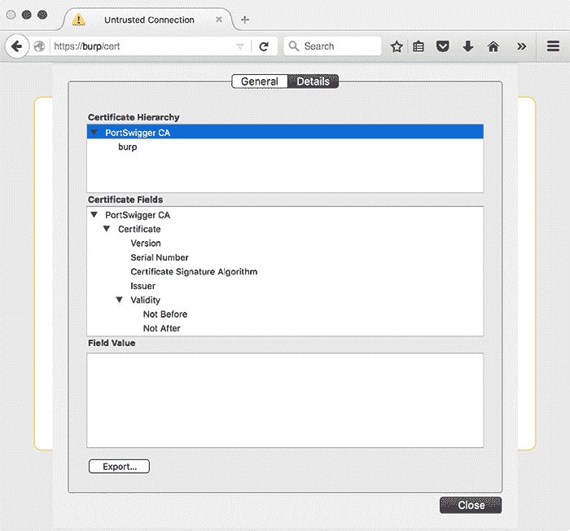

*图 4-1：选择 PortSwigger CA 进行导出*

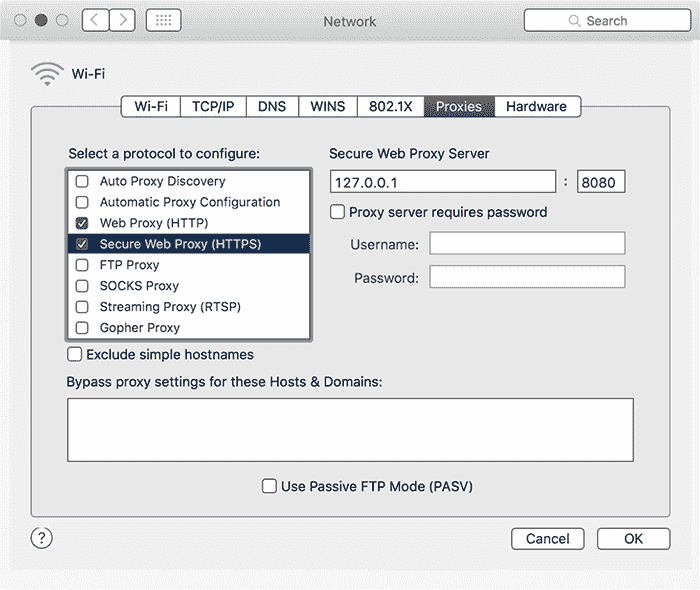

*图 4-2：配置主机系统通过 Burp 连接*

#### ***使用 stunnel 绕过 SSL***

绕过 SSL 端点验证的一种方法是本地设置一个终结点，然后让你的应用程序使用该终结点。通常可以通过修改包含端点 URL 的 plist 文件，而无需重新编译应用程序，来实现这一点。

如果你想通过明文轻松观察流量（例如，使用 Wireshark），但互联网可访问的端点仅通过 HTTPS 提供，那么这个设置特别有用。首先，下载并安装 stunnel，^(4)，它将作为 HTTPS 端点和你的本地机器之间的代理。如果通过 Homebrew 安装，stunnel 的配置文件将在*/usr/local/etc/stunnel/stunnel.conf-sample*。将此文件移动或复制到*/usr/local/etc/stunnel/stunnel.conf*，并编辑以反映以下内容：

```
; SSL client mode
client = yes

; service-level configuration
[https]
accept  = 127.0.0.1:80
connect = 10.10.1.50:443
TIMEOUTclose = 0
```

这只是将 stunnel 设置为客户端模式，指示它在你的回环接口上接受端口 80 的连接，同时通过 SSL 将其转发到远程端点。编辑完该文件后，设置 Burp 以使其使用你的回环监听器作为代理，确保选择**支持隐形代理**选项，如图 4-3 所示。图 4-4 展示了结果设置。

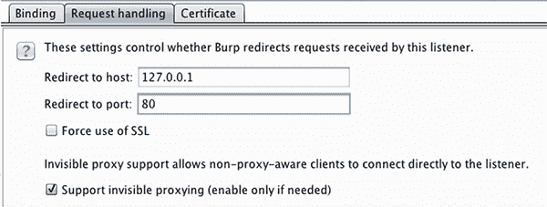

*图 4-3：通过本地 stunnel 端点设置隐形代理*

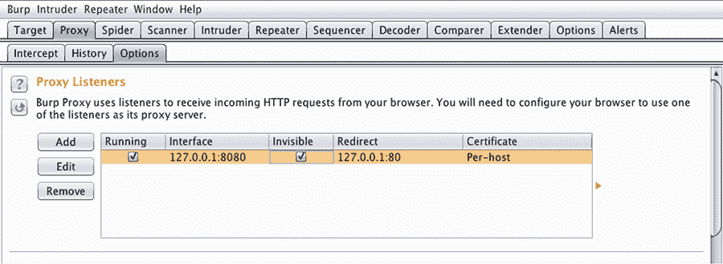

*图 4-4：最终的 Burp/stunnel 设置*

#### ***设备上的证书管理***

要在物理 iOS 设备上安装证书，只需将证书发送到与设备关联的帐户，或将其放在公共 Web 服务器上，然后使用 Mobile Safari 导航到该证书。然后，你可以将其导入设备的信任存储中，如图 4-5 所示。你还可以配置设备通过另一台机器托管的网络代理（即 Burp）。只需将代理的 CA 证书（如前所述）安装到设备上，并配置你的代理在网络可访问的 IP 地址上监听，如图 4-6 所示。

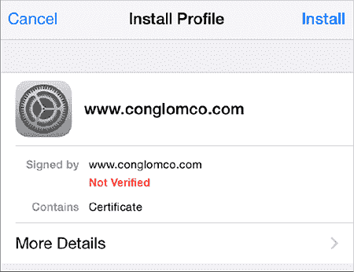

*图 4-5：证书导入提示*

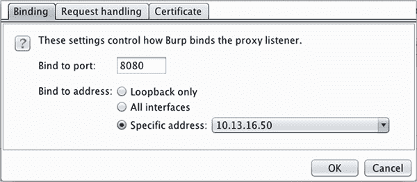

*图 4-6：配置 Burp 使用非 localhost 的 IP 地址*

#### ***设备上的代理设置***

配置好证书颁发机构并设置好代理后，进入**设置** → **网络** → **Wi-Fi**，点击当前选择的无线网络右侧的箭头。在这个界面上，你可以输入代理地址和端口（见图 4-7）。

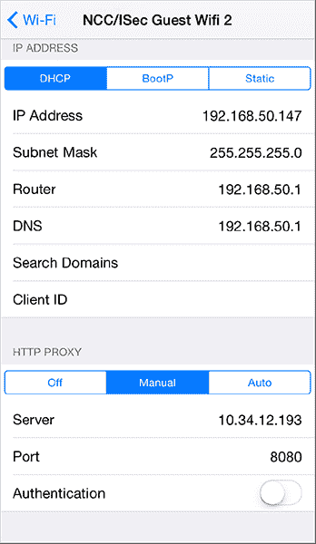

*图 4-7：配置设备在内部网络上使用测试代理*

请注意，当配置设备使用代理时，只有通过`NSURLConnection`或`NSURLSession`发起的连接才会遵循代理设置；其他连接，如`NSStream`和`CFStream`（我将在第七章中进一步讨论），则不会受到影响。当然，由于这是一个 HTTP 代理，它仅适用于 HTTP 流量。如果你有一个使用`CFStream`的应用程序，你可以通过以下代码片段修改代码库，将流量通过与主机操作系统相同的代理路由：

```
CFDictionaryRef systemProxySettings = CFNetworkCopySystemProxySettings();

CFReadStreamSetProperty(readStream, kCFStreamPropertyHTTPProxy, systemProxySettings
    );

CFWriteStreamSetProperty(writeStream, kCFStreamPropertyHTTPProxy,
    systemProxySettings);
```

如果你正在使用`NSStream`，可以通过将`NSInputStream`和`NSOutputStream`转换为其 Core Foundation 对应物来完成相同的操作，如下所示：

```
CFDictionaryRef systemProxySettings = CFNetworkCopySystemProxySettings();

CFReadStreamSetProperty((CFReadStreamRef)readStream, kCFStreamPropertyHTTPProxy, (
     CFTypeRef)systemProxySettings);

CFWriteStreamSetProperty((CFWriteStreamRef)writeStream, kCFStreamPropertyHTTPProxy,
      (CFTypeRef)systemProxySettings);
```

如果你正在进行黑盒测试，并且有一个应用程序不遵循系统代理设置进行 HTTP 请求，你可以尝试通过在设备的*/etc/hosts*文件中添加一行，将名称查找指向你的代理地址，从而将流量通过代理转发，如清单 4-1 所示。

```
10.50.22.11    myproxy api.testtarget.com
```

*清单 4-1：添加 hosts 文件条目*

你还可以配置设备使用由你控制的 DNS 服务器，这不需要越狱你的测试设备。做到这一点的一种方式是使用 Tim Newsham 的 dnsRedir，^(5) 这是一个 Python 脚本，它将为特定域的 DNS 查询提供伪造的答案，同时将其他域的查询传递给另一个 DNS 服务器（默认是 8.8.8.8，但你可以通过`-d`标志更改此设置）。可以按如下方式使用该脚本：

```
$ dnsRedir.py 'A:www.evil.com.=1.2.3.4'
```

这应该使用 IP 地址 1.2.3.4 来回答* [www.evil.com](http://www.evil.com) *的查询，其中该 IP 地址通常应为你正在通过其代理数据的测试机器的 IP 地址。

对于非 HTTP 流量，事情就有些复杂了。你需要使用 TCP 代理来拦截流量。前面提到的 Tim Newsham 编写了一个程序，可以简化这一过程——它的名字恰如其分，叫做 tcpprox。^(6) 如果你使用清单 4-1 中的`hosts`文件方法将设备指向你的代理机器，那么你可以让 tcpprox 动态创建 SSL 证书，并将连接代理到远程端点。为此，你需要创建一个证书颁发机构证书并将其安装在设备上，如清单 4-2 所示。

```
$ ./prox.py -h
Usage: prox.py [opts] addr port

Options:
  -h, --help    show this help message and exit
  -6            Use IPv6
  -b BINDADDR   Address to bind to
  -L LOCPORT    Local port to listen on
  -s            Use SSL for incoming and outgoing connections
  --ssl-in      Use SSL for incoming connections
  --ssl-out     Use SSL for outgoing connections
  -3            Use SSLv3 protocol
  -T            Use TLSv1 protocol
  -C CERT       Cert for SSL
  -A AUTOCNAME  CName for Auto-generated SSL cert
  -1            Handle a single connection
  -l LOGFILE    Filename to log to

$ ./ca.py -c
$ ./pkcs12.sh ca
  (install CA cert on the device)
$ ./prox.py -s -L 8888 -A ssl.testtarget.com ssl.testtarget.com 8888
```

*清单 4-2：创建证书并使用 tcpprox 拦截流量*

*ca.py*脚本创建签名证书，*pkcs12.sh*脚本生成要安装在设备上的证书，如图 4-5 所示。运行这些脚本并安装证书后，即使是 SSL 连接，你的应用程序也应该通过代理连接到远程端点。完成一些测试后，你可以使用 tcpprox 附带的*proxcat.py*脚本读取结果，方法如下：

```
$ ./proxcat.py -x log.txt
```

一旦你的应用程序通过代理连接，你就可以开始设置 Xcode 环境了。

### **Xcode 和构建设置**

Xcode 包含一个错综复杂的项目配置选项迷宫——几乎没有人真正理解每个选项的作用。本节将更深入地探讨这些选项，讨论你为什么要或不应该使用它们，并向你展示如何让 Xcode 在问题变成真正的麻烦之前帮助你找到错误。

#### ***让生活变得艰难***

首先，最重要的是：将警告视为错误。clang 生成的大多数警告，作为 Xcode 的编译器前端，值得关注。它们不仅有助于减少代码复杂性和确保语法正确，还能捕捉一些可能难以发现的错误，例如符号问题或格式字符串缺陷。例如，考虑以下代码：

```
- (void) validate:(NSArray*) someTribbles withValue:(NSInteger) desired {

    if (desired > [someTribbles count]) {
        [self allocateTribblesWithNumberOfTribbles:desired];
    }
}
```

`NSArray`的`count`方法返回一个无符号整数（`NSUInteger`）。如果你期望从用户输入中得到所需的 tribbles 数量，提交的值可能是-1，这大概意味着用户希望拥有一个反 tribble。因为`desired`是一个整数，与一个无符号整数进行比较，编译器会把它们都当作无符号整数来处理。因此，这个方法会意外地分配一个荒谬数量的 tribbles，因为-1 在转换为无符号整数时会变成一个极大的数字。我将在第十一章进一步讨论这类整数溢出问题。

你可以通过启用大多数警告并将其视为错误来让 clang 标记这类错误，在这种情况下，构建会失败，并显示一条消息：“不同符号的整数比较：'int'和'NSUInteger'（即'unsigned int'）”。

**注意**

*通常，你应该在项目构建配置中启用所有警告，并将警告提升为错误，这样你就能尽早处理开发周期中的 bug。*

你可以在项目和目标构建设置中启用这些选项。首先，在警告策略下，将“将警告视为错误”设置为**是**（图 4-8）。然后，在警告部分，启用所有所需的选项。

请注意，并非所有 clang 支持的构建警告都有一个在 Xcode UI 中暴露的切换开关。要在“困难模式”下开发，你可以像在图 4-9 中那样添加`-Wextra`或`-Weverything`标志。并非所有警告都会有用，但最好在禁用它们之前先理解一个选项的意图。

`-Weverything`，如图 4-9 所示，可能是过度使用，除非你对 clang 的内部结构感到好奇；通常`-Wextra`就足够了。为了节省一些时间，表 4-1 讨论了两种几乎肯定会妨碍你开发的警告（或者是那些纯粹奇怪的警告）。

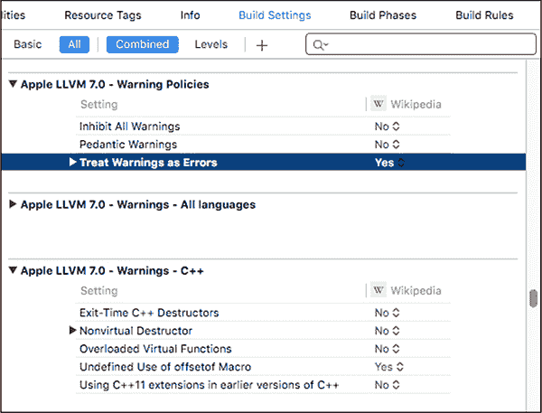

*图 4-8：将所有警告视为错误*

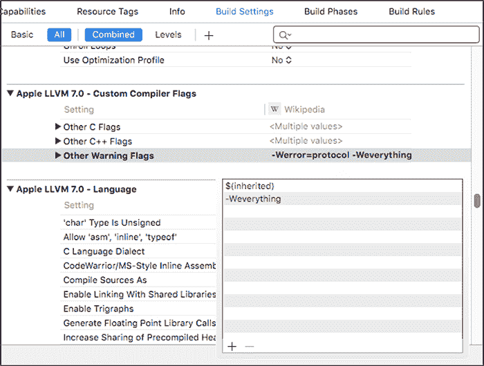

*图 4-9：此设置启用了所有警告，包括没有暴露 UI 的选项。*

**表 4-1：** 在 Xcode 中禁用的令人讨厌的警告

| **编译器警告** | **禁用的理由** |
| --- | --- |
| 隐式合成属性 | 由于属性合成现在是自动的，除非你的开发规范要求显式合成，否则这不算是一个错误。 |
| 未使用的参数/函数/变量等 | 当编写代码时，这些会非常让人烦恼，因为显然你的代码还没有完全实现。考虑仅在非调试构建中启用这些。 |

#### ***启用完整的 ASLR***

在 iOS 4.3 中，Apple 引入了*地址空间布局随机化（ASLR）*。ASLR 确保程序及其数据（库、主可执行文件、堆栈和堆、以及内存映射文件）在虚拟地址空间中加载到不那么可预测的位置。这使得利用代码执行漏洞变得更加困难，因为许多漏洞依赖于引用特定库调用的虚拟地址，以及引用堆栈或堆上的数据。

然而，为了使这一切完全生效，应用程序必须构建为*位置独立可执行文件（PIE）*，这指示编译器生成可以无论内存中的位置如何都能正常运行的机器代码。如果没有这个选项，即使重启后，基础可执行文件和堆栈的位置也将保持不变，^(7) 使攻击者的工作变得更容易。

为了确保启用了完整的 ASLR 和 PIE，请检查目标的设置中的 Deployment Target 至少设置为 iOS 版本 4.3。在项目的构建设置中，确保生成位置相关代码（Generate Position-Dependent Code）设置为 No，并且那项奇怪命名的选项“不要创建位置独立可执行文件”（Don’t Create Position Independent Executable）也设置为 No。所以，不要创建位置独立可执行文件。明白了吗？

要进行黑盒测试，或者确保你的应用程序正确启用了 ASLR，你可以在二进制文件上使用 otool，方法如下：

```
$ unzip MyApp.ipa
$ cd Payload/MyApp.app
$ otool -vh MyApp

MyApp (architecture armv7):
Mach header
      magic cputype cpusubtype caps   filetype ncmds sizeofcmds              flags
    MH_MAGIC    ARM         V7 0x00    EXECUTE    21       2672  NOUNDEFS DYLDLINK
                                                                      TWOLEVEL PIE

MyApp (architecture armv7s):
Mach header
      magic cputype cpusubtype caps   filetype ncmds sizeofcmds              flags
   MH_MAGIC     ARM        V7S 0x00    EXECUTE    21       2672  NOUNDEFS DYLDLINK
                                                                      TWOLEVEL PIE
```

在每一行 `MH_MAGIC` 结束时，如果你的设置正确，你应该看到 `PIE` 标志，并且该标志会以粗体显示。（注意，这必须在为 iOS 设备编译的二进制文件上执行，在 iOS 模拟器的二进制文件上不起作用。）

#### ***Clang 和静态分析***

在计算机安全中，*静态分析*通常指使用工具分析代码库并识别安全漏洞。这可能涉及识别危险的 API，或者包括分析程序中的数据流，识别潜在的不安全处理程序输入。作为构建工具链的一部分，clang 是嵌入静态分析语言的好地方。

从 Xcode 3.2 开始，clang 的静态分析器^(8)已经与 Xcode 集成，提供了一个用户界面来跟踪逻辑错误、编码缺陷以及 API 滥用等问题。虽然 clang 的静态分析器非常方便，但 Xcode 中默认禁用了它的几个重要功能。特别地，经典的危险 C 库函数检查，例如`strcpy`和`strcat`，是没有启用的。你可以在你的项目或目标设置中启用这些检查，正如在图 4-10 所示。

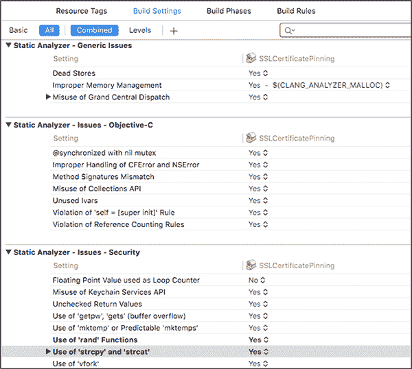

*图 4-10：在 Xcode 中启用所有 clang 静态分析检查*

#### ***地址清理器与动态分析***

Xcode 的最新版本包含了一个支持地址清理器（ASan）的 clang/llvm 版本。ASan 是一个动态分析工具，类似于 Valgrind，但 ASan 运行得更快，且具有更好的覆盖性。^(9) ASan 可以检测栈溢出、堆溢出、以及使用后释放等错误，帮助你追踪关键的安全漏洞。它确实会带来性能影响（程序执行速度大约会变慢两倍），因此不要在发布版本中启用它，但它在测试、质量保证或模糊测试中应该是完全可用的。

要启用 ASan，请将`-fsanitize=address`添加到调试版本的编译器标志中（见图 4-11）。在出现任何不安全崩溃时，ASan 应该会向控制台写入额外的调试信息，帮助你确定问题的性质和严重性。结合模糊测试^(10)，ASan 对于定位可能具有安全风险的严重问题并评估其可利用性非常有帮助。

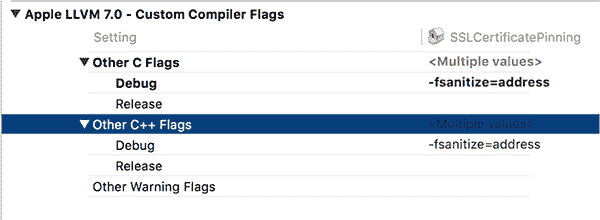

*图 4-11：设置 ASan 编译器标志*

### **使用 Instruments 监控程序**

无论你是在分析别人的应用程序，还是想要改进自己的应用，DTrace 驱动的 Instruments 工具都非常有助于在细粒度层面观察应用的活动。这个工具对于监控网络套接字使用、查找内存分配问题以及观察文件系统交互非常有用。Instruments 还是一个很好的工具，用于发现应用程序在本地存储中存储的对象，从而找出可能泄露敏感信息的地方；我经常用它来做这件事。

#### ***激活 Instruments***

要在 Xcode 中使用 Instruments 分析应用程序，请按住**运行**按钮并选择**用于性能分析构建**选项（见图 4-12）。构建完成后，你将看到一系列预配置的模板，专门用于监控某些资源，例如磁盘读写、内存分配、CPU 使用等。

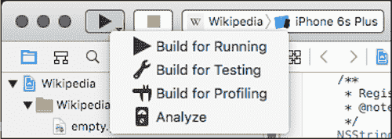

*图 4-12：选择“用于性能分析构建”选项*

文件活动模板（如图 4-13 所示）将帮助你监控应用程序的磁盘 I/O 操作。选择模板后，iOS 模拟器应该会自动启动应用程序并开始记录其活动。

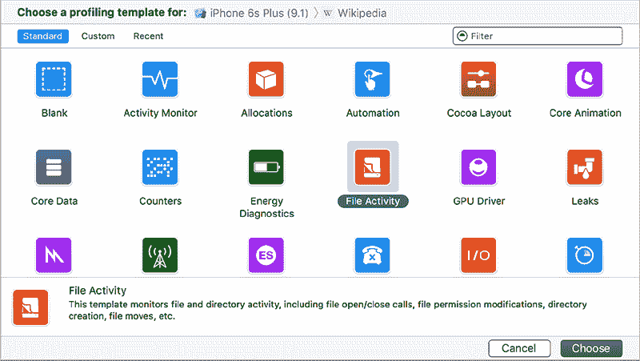

*图 4-13：选择文件活动分析模板*

Instruments 中有几个预设视图用于监控文件活动。一个好的起点是目录 I/O，它会捕捉所有文件创建或删除事件。按你平常的方式测试应用程序，并观察这里的输出。每个事件都会列出其 Objective-C 调用者、底层的 C 函数调用、文件的完整路径，以及如果该事件是重命名操作，文件的新路径。

你可能会注意到这里写入了几种类型的缓存文件（见图 4-14），以及应用程序被要求打开的 cookies 或文档。如果你挂起应用程序，你应该能看到应用程序的截图被写入磁盘，关于这一点，我将在第十章中进行讨论。

若想查看更详细的视图，你可以选择读取/写入视图，如图 4-15 所示。该视图将展示所有文件或套接字的读写操作，并显示读取或写入的数据量统计。

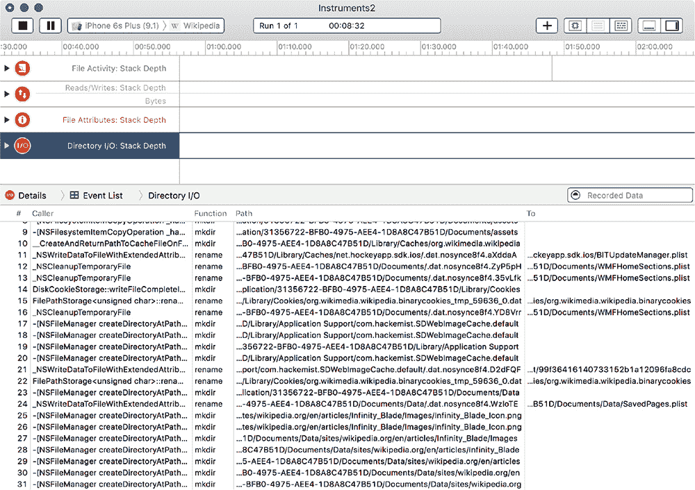

*图 4-14：目录 I/O 视图，显示已创建或删除的文件*

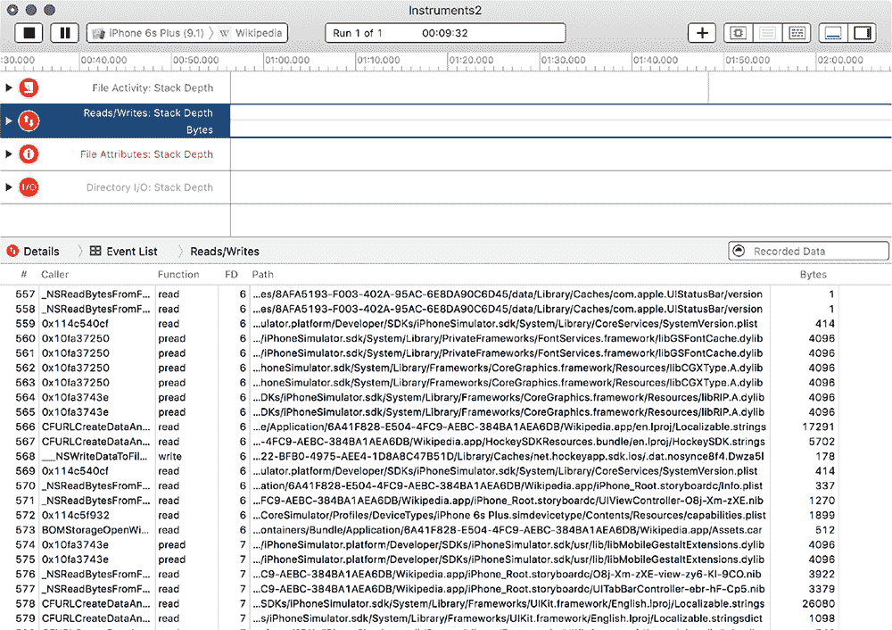

*图 4-15：显示详细文件读写的分析结果*

#### ***使用 Watchdog 监控文件系统活动***

Instruments 应该能够捕捉大部分 iOS 模拟器的活动，但有些文件写入或网络调用可能由其他系统服务执行，从而未被工具捕捉到。手动检查 iOS 模拟器的目录树是个好主意，这可以帮助你更好地了解 iOS 及其应用程序的结构，并捕捉到你可能会错过的应用程序活动。

一种简单的自动化方法是使用 Python 的 watchdog 模块。^(11) Watchdog 将使用 kqueue 或 FSEvents API 来监控目录树中的文件活动，并可以在这些事件发生时记录事件或采取特定的行动。要安装 watchdog，请使用以下命令：

```
$ pip install watchdog
```

你可以编写自己的脚本来使用 watchdog 的功能，但你会发现 watchdog 已经包含了一个不错的命令行工具，叫做 watchmedo。如果你打开一个终端窗口并导航到模拟器目录，你应该能够使用 watchmedo 监控 iOS 模拟器目录树下的所有文件更改，如下所示：

```
$ cd ~/Library/Application\ Support/iPhone\ Simulator/6.1
$ watchmedo log --recursive .
on_modified(self=<watchdog.tricks.LoggerTrick object at 0x103c9b190>, event=<
    DirModifiedEvent: src_path=/Users/dthiel/Library/Application Support/iPhone
    Simulator/6.1/Library/Preferences>)
on_created(self=<watchdog.tricks.LoggerTrick object at 0x103c9b190>, event=<
    FileCreatedEvent: src_path=/Users/dthiel/Library/Application Support/iPhone
    Simulator/6.1/Applications/9460475C-B94A-43E8-89C0-285DD036DA7A/Library/Caches
    /Snapshots/com.yourcompany.UICatalog/UIApplicationAutomaticSnapshotDefault-
    Portrait.png>)
on_modified(self=<watchdog.tricks.LoggerTrick object at 0x103c9b190>, event=<
    DirModifiedEvent: src_path=/Users/dthiel/Library/Application Support/iPhone
    Simulator/6.1/Applications/9460475C-B94A-43E8-89C0-285DD036DA7A/Library/Caches
    /Snapshots>)
on_created(self=<watchdog.tricks.LoggerTrick object at 0x103c9b190>, event=<
    DirCreatedEvent: src_path=/Users/dthiel/Library/Application Support/iPhone
    Simulator/6.1/Applications/9460475C-B94A-43E8-89C0-285DD036DA7A/Library/Caches
    /Snapshots/com.yourcompany.UICatalog>)
on_modified(self=<watchdog.tricks.LoggerTrick object at 0x103c9b190>, event=<
    DirModifiedEvent: src_path=/Users/dthiel/Library/Application Support/iPhone
    Simulator/6.1/Library/SpringBoard>)
```

以`on_modified`开头的条目表示文件已被更改，而以`on_created`开头的条目表示新文件的创建。你可能还会看到 watchmedo 的其他更改指示符，你可以在 Watchdog 文档中阅读有关它们的更多信息。

### **结束语**

现在你应该已经配置好了用于运行、修改和检查 iOS 应用的构建和测试环境。在第五章中，我们将更深入地探讨如何动态调试和检查应用，以及如何在运行时改变它们的行为。
