## **5**

**使用 LLDB 调试和其他工具**

调试 iOS 应用被认为是 Xcode 的强项之一。除了 DTrace 的有用分析功能外，Xcode 还提供了一个带有相对易用图形界面的命令行调试器。作为苹果公司逐步放弃 GNU 工具的部分内容，默认的调试器现在是 lldb，^(1) 它为 Objective-C 提供了一级支持。多线程调试得到了很好的支持，你甚至可以从调试器中检查对象。唯一的缺点是，你需要将你通过 gdb 获得的经验知识转移到新的环境中。

调试是一个广泛的主题，关于这一主题有许多书籍可供参考。^(2) 本章涵盖了 Xcode 新手的基础知识，并提供了与安全测试和安全开发相关的技巧。我假设你对 gdb 和调试器有一定的了解。

### **lldb 中的有用功能**

Xcode 内置的调试器界面功能非常强大。它不仅有命令行界面，还可以使用 GUI 查看和与当前线程状态、注释的汇编代码及对象细节进行交互。GUI 中还包括一个中央断点浏览器，你可以在其中查看、启用和禁用断点。

**注意**

*如果你非常熟悉使用 gdb，LLVM 项目有一份常用 gdb 命令到 lldb 命令的映射表；请参见* [`lldb.llvm.org/lldb-gdb.html`](http://lldb.llvm.org/lldb-gdb.html)。

#### ***使用断点***

你可以通过 Xcode 的 lldb 界面（见图 5-1）图形化设置断点，也可以通过命令行进行设置。除了在程序访问特定内存地址或 C 函数时设置断点外，你还可以在特定的 Objective-C 方法上设置断点。

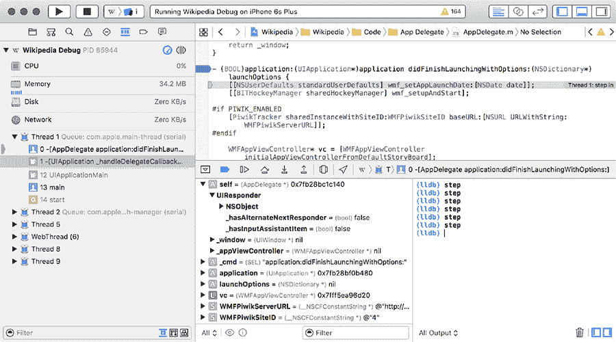

*图 5-1：Xcode 的 lldb 界面*

以下是设置断点的一些方法：

```
➊ (lldb) breakpoint set --name myfunction --name myotherfunction
➋ (lldb) breakpoint set --name "-[myClass methodCall:]"
➌ (lldb) breakpoint set --selector myObjCSelector:
➍ (lldb) breakpoint set --method myCPlusPlusMethod
```

➊处的命令会在多个函数上设置一个断点，这个功能可以让你同时启用和禁用一组函数。正如➋所示，你也可以在特定的 Objective-C 实例和类方法上设置断点——这些方法也可以像➊处的 C 函数调用一样进行分组。如果你想在所有调用特定选择器/方法时设置断点，可以使用`--selector`选项➌，这会在任何调用该名称的选择器时断开，不管它们是在哪个类中实现的。最后，要在特定的 C++方法上设置断点，只需在定义断点时指定`--method`而不是`--name`，如➍所示。

实际上，在 lldb 中设置断点的操作如下所示：

```
(lldb) breakpoint set --name main
Breakpoint 2: where = StatePreservator`main + 34 at main.m:15, address = 0x00002822

(lldb) breakpoint set -S encodeRestorableStateWithCoder:
Breakpoint 2: where = StatePreservator`-[StatePreservatorSecondViewController
    encodeRestorableStateWithCoder:] + 44 at StatePreservatorSecondViewController.
    m:25, address = 0x00002d5c
```

设置断点后，lldb 会显示你所设置的断点代码。如果你愿意，可以让它更简洁：像 gdb 一样，lldb 会通过最短的匹配文本来识别关键字。因此，`*breakpoint*`可以缩写为`*break*`，甚至缩写为`*b*`。

在 GUI 中，你可以通过点击行号左侧的空白区域来在特定代码行设置断点（见图 5-2）。再次点击将禁用该断点。或者，你也可以使用 `--file *filename.m* --line *66*` 语法通过 lldb CLI 在某一行设置断点。

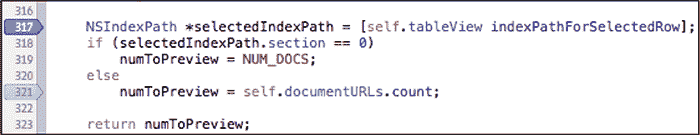

*图 5-2：使用鼠标设置特定行的断点。禁用的断点以浅灰色显示。*

当你想创建多个断点时，使用命令行中的 `-r` 标志来设置匹配特定正则表达式的函数断点非常方便，例如：

```
(lldb) break set -r tableView
Breakpoint 1: 4 locations.
(lldb) break list
Current breakpoints:
1: source regex = "tableView", locations = 4, resolved = 4
  1.1: where = DocInteraction`-[DITableViewController tableView:
     cellForRowAtIndexPath:] + 695 at DITableViewController.m:225, address = 0
     x000032c7, resolved, hit count = 0
  1.2: where = DocInteraction`-[DITableViewController tableView:
     cellForRowAtIndexPath:] + 1202 at DITableViewController.m:245, address = 0
     x000034c2, resolved, hit count = 0
  1.3: where = DocInteraction`-[DITableViewController tableView:
     cellForRowAtIndexPath:] + 1270 at DITableViewController.m:246, address = 0
     x00003506, resolved, hit count = 0
  1.4: where = DocInteraction`-[DITableViewController tableView:
     cellForRowAtIndexPath:] + 1322 at DITableViewController.m:247, address = 0
     x0000353a, resolved, hit count = 0
```

这将设置一个带有多个*位置*的单一断点。每个位置可以被启用或禁用，如下所示：

```
(lldb) break dis 1.4
1 breakpoints disabled.
(lldb) break list
Current breakpoints:
1: source regex = ".*imageView.*", locations = 4, resolved = 3
    --snip--
  1.4: where = DocInteraction`-[DITableViewController tableView:
     cellForRowAtIndexPath:] + 1322 at DITableViewController.m:247, address = 0
     x0000353a, unresolved, hit count = 0 Options: disabled
(lldb) break en 1.4
1 breakpoints disabled.
```

请注意，启用和禁用位置的方式与常规断点相同；只需使用 `break disable` 和 `break enable` 并引用正确的数字标识符。

#### ***浏览帧和变量***

一旦你到达了断点，你可以使用 lldb 来检查程序的状态。你可以通过命令行完成此操作，正如我之前展示的其他 lldb 示例，或者通过可视化的 lldb 浏览器，如图 5-3 所示。

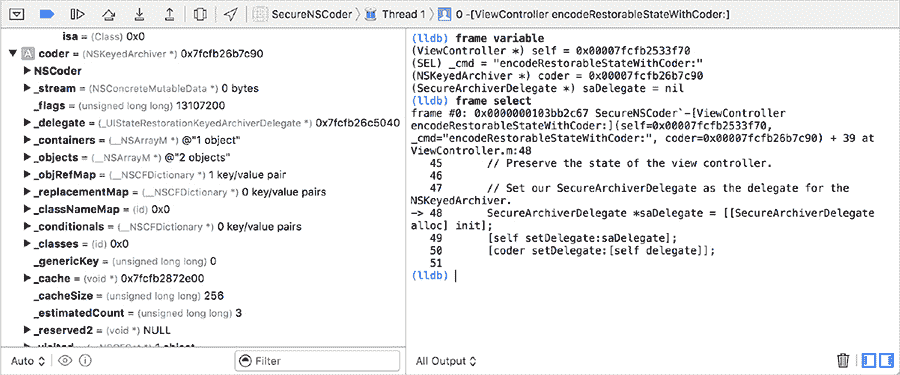

*图 5-3：从命令行和 GUI 检查帧变量*

除了查看和操作当前帧的变量外，你还可以使用调试导航器浏览程序线程和调用堆栈中的帧，如图 5-4 所示。


*图 5-4：使用调试导航器切换帧和线程*

类似于使用 gdb，你可以使用 `bt`（*backtrace* 的缩写）命令检查当前线程的调用堆栈（参见列表 5-1）。通常，你还可以使用典型的 `up`、`down` 和 `frame select` 命令导航帧。然而，在某些版本的 Xcode 中，存在一个 bug，导致帧立即恢复为在调试导航器中选择的帧。在这种情况下，你必须在调试导航器中手动切换帧，以便单独检查它们。

```
(lldb) bt
* thread #1: tid = 0x11804c, 0x00002c07 StatePreservator`-
     StatePreservatorSecondViewController encodeRestorableStateWithCoder: + 55 at
     StatePreservatorSecondViewController.m:25, queue = 'com.apple.main-thread,
     stop reason = breakpoint 1.1
    frame #0: 0x00002c07 StatePreservator`-StatePreservatorSecondViewController
     encodeRestorableStateWithCoder: + 55 at StatePreservatorSecondViewController.m:25
    frame #1: 0x000277e7 UIKit`-[UIApplication(StateRestoration)
     _saveApplicationPreservationState:] + 1955
    frame #2: 0x00027017 UIKit`-[UIApplication(StateRestoration)
     _saveApplicationPreservationStateIfSupported] + 434
    frame #3: 0x0001b07b UIKit`-[UIApplication _handleApplicationSuspend:eventInfo
     :] + 947
    frame #4: 0x00023e74 UIKit`-[UIApplication handleEvent:withNewEvent:] + 1469
    frame #5: 0x00024beb UIKit`-[UIApplication sendEvent:] + 85
    frame #6: 0x00016698 UIKit`_UIApplicationHandleEvent + 9874
    frame #7: 0x01beddf9 GraphicsServices`_PurpleEventCallback + 339
    frame #8: 0x01bedad0 GraphicsServices`PurpleEventCallback + 46
    frame #9: 0x01c07bf5 CoreFoundation`
     __CFRUNLOOP_IS_CALLING_OUT_TO_A_SOURCE1_PERFORM_FUNCTION__ + 53
    frame #10: 0x01c07962 CoreFoundation`__CFRunLoopDoSource1 + 146
    frame #11: 0x01c38bb6 CoreFoundation`__CFRunLoopRun + 2118
    frame #12: 0x01c37f44 CoreFoundation`CFRunLoopRunSpecific + 276
    frame #13: 0x01c37e1b CoreFoundation`CFRunLoopRunInMode + 123
    frame #14: 0x01bec7e3 GraphicsServices`GSEventRunModal + 88
    frame #15: 0x01bec668 GraphicsServices`GSEventRun + 104
    frame #16: 0x00013ffc UIKit`UIApplicationMain + 1211
    frame #17: 0x0000267d StatePreservator`main(argc=1, argv=0xbffff13c) + 141 at
     main.m:16
```

*列表 5-1：使用 backtrace 命令获取当前调用堆栈*

要检查当前帧的变量，你可以使用 `frame variable` 命令，如在列表 **??** 中所示。

```
(lldb) frame variable
(StatePreservatorSecondViewController *const) self = 0x0752d2e0
(SEL) _cmd = "encodeRestorableStateWithCoder:"
(NSCoder *) coder = 0x0d0234e0
```

*列表 5-2：使用 `frame variable` 命令*

这将显示局部栈帧的变量名称和参数，以及它们的类型和内存地址。你还可以在图形调试器中使用上下文菜单打印或编辑变量内容；参见图 5-5。

如果你单独使用 `frame select`，你还可以看到程序在调用堆栈中的位置，以及相关的周围代码行，如以下示例所示：

```
(lldb) frame select
frame #0: 0x00002d5c StatePreservator`-StatePreservatorSecondViewController
     encodeRestorableStateWithCoder: + 44 at StatePreservatorSecondViewController.m:25
   22
   23   -(void)encodeRestorableStateWithCoder:(NSCoder *)coder
   24   {
-> 25       [coder encodeObject:[_myTextView text] forKey:@"UnsavedText"];
   26       [super encodeRestorableStateWithCoder:coder];
   27   }
   28
```

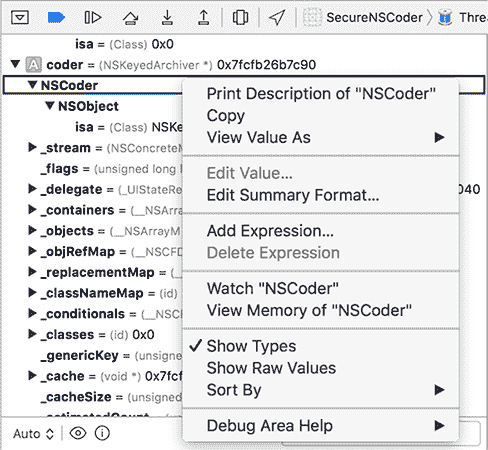

*图 5-5：变量上下文菜单，显示打印变量内容、设置观察点和查看内存内容的选项*

`frame select` 命令还可以接受一个数字参数，用于指定你想要检查的栈帧，如果你希望查看更上层的调用栈（见示例 5-3）。

```
(lldb) frame select 4
frame #4: 0x00023e74 UIKit`-[UIApplication handleEvent:withNewEvent:] + 1469
UIKit`-[UIApplication handleEvent:withNewEvent:] + 1469:
-> 0x23e74:  xorb   %cl, %cl
   0x23e76:  jmp    0x24808
                         ; -[UIApplication handleEvent:withNewEvent:] + 3921
   0x23e7b:  movl   16(%ebp), %ebx
   0x23e7e:  movl   %ebx, (%esp)
```

*示例 5-3：检查栈帧时显示的汇编代码*

请注意，对于当前项目之外的代码，例如 Cocoa API 的其他部分，通常无法获得源代码；lldb 会显示相关的汇编指令。^(3)

你还可以使用 lldb 的 `po`（即 *print object* 的缩写）命令检查对象的值。例如，考虑以下内容：

```
(lldb) po [self window]
$2 = 0x071848d0 <UIWindow: 0x71848d0; frame = (0 0; 320 480); hidden = YES; layer =
      <UIWindowLayer: 0x71849a0>>
```

使用 `po` 在主窗口中获取该窗口的地址和属性。

#### ***可视化检查对象***

如果你使用的是 Xcode 5 或更高版本，你还可以将鼠标悬停在对象上，以检查其内容，如图 5-6 所示。如果你深入查看各个子对象，可以通过点击 **i** 按钮直接查看其内存内容（如图 5-7 所示），或者使用快速查看“眼睛”按钮查看该对象的内容，这些内容将作为完全渲染的图像、文本或其他任何 OS X 的 Quick Look API 支持的数据类型呈现（见图 5-8）。在我看来，这相当酷。

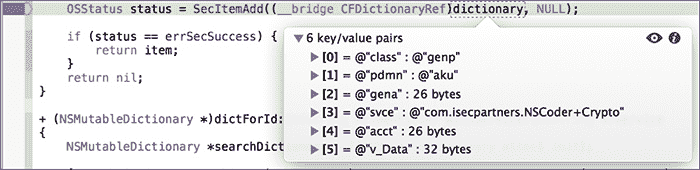

*图 5-6：在断点处检查对象*

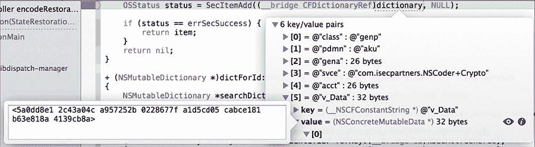

*图 5-7：检查对象在内存中的内容*

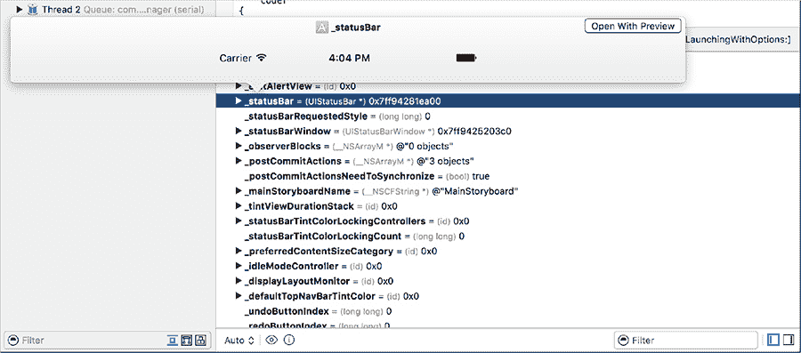

*图 5-8：使用 Quick Look 按钮检查变量当前状态。在此示例中，你查看的是* `_statusBar` *，它是 UIApplication 委托窗口的属性，Xcode 会将其显示为实际的图像。*

#### ***操作变量和属性***

你不仅可以查看变量和对象的内容，还可以使用 lldb 来执行更多操作。例如，让我们尝试在示例 5-2 中测试 `frame variable` 命令时所使用的相同代码行。

```
[coder encodeObject:[_myTextView text] forKey:@"UnsavedText"];
```

当调试器到达这一行时，假设你想检查 UITextView 的 *text* 属性的内容并在程序继续执行前修改其值。你可以使用 `expr` 命令，采用传统的 Objective-C 语法来做到这一点，如下所示：

```
(lldb) po [_myTextView text]
$0 = 0x08154cb0 Foo
(lldb) expr (void)[_myTextView setText:@"Bar"]
(lldb) po [_myTextView text]
$1 = 0x0806b2e0 Bar
(lldb) cont
```

当执行恢复时，UI 中该文本框的值应该已经改变。因为 lldb 无法知道以这种方式调用的方法的返回类型，所以你需要使用 `(void)` 指定类型并配合 `expr` 命令来进行操作。类似地，如果你调用的是返回 `int` 的方法，也需要显式地将其转换为该类型。对于简单的赋值操作，例如 `myInteger = 666` 或类似操作，不同于方法调用，你只需输入 `expr` 和赋值命令即可。

**注意**

*在 Xcode 的命令行中使用 lldb 时，图形界面会自动补全对象方法名称，并提供简要描述和返回类型。请参见图 5-9 中的示例。*

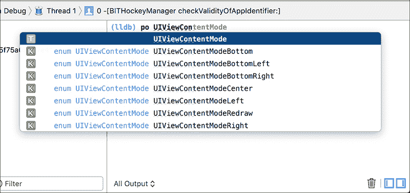

*图 5-9：Xcode 中巧妙的 lldb 方法名称自动补全*

请记住，您不仅仅限于操作在代码中声明的对象。您还可以操作框架类。

```
(lldb) expr (void)[[UIPasteboard generalPasteboard] setString:@"my string"]
(lldb) po [[UIPasteboard generalPasteboard] string]
$5 = 0x071c6e50 my string
```

对于这种交互式操作和查询，我通常发现将断点设置在应用程序代理的 `didReceiveMemoryWarning` 方法上非常有用，因为这个方法在每个应用程序中都会存在。当我想在 iOS 模拟器中运行程序时检查其状态时，我选择硬件 → 模拟内存警告。完成调整后，我只需通过 `cont` 继续应用程序。您也可以通过 Xcode 界面上的暂停执行按钮来执行此操作。

#### ***断点动作***

*断点动作* 文档不多，但非常有用。它们允许您创建仅在特定条件下触发的断点，并且在这些断点被命中时可以执行复杂的操作。您可以设置它们在执行这些操作后自动恢复执行，或者甚至在某行代码被命中特定次数后才触发。记录信息和使用语音合成展示程序信息是您可以为断点设置的最简单操作，但您还可以查询对象、读取和操作变量等。基本上，断点动作能够做任何您能通过 lldb 命令行做的事情，并且还能做一些额外的操作。

让我们一步步地演示如何创建一个断点动作。

1.  通过点击断点区域创建一个断点。

1.  按住 CTRL 键点击断点并选择**编辑断点**。

1.  点击**添加动作**。

1.  勾选**评估后自动继续**框。

1.  对于最简单的断点动作类型，只需选择**记录信息**动作。在这里，您可以打印简单的消息，以及断点名称和命中次数（参见图 5-10）。您可以忽略表达式选项，因为它并不特别直观。

1.  添加了简单的日志消息后，您可以点击**+**按钮添加另一个动作。这次，选择**调试器命令**。

1.  在这里，您可以输入基本的 lldb 表达式——最常见的是使用 `po` 命令来打印对象的描述。示例请参见图 5-11。

    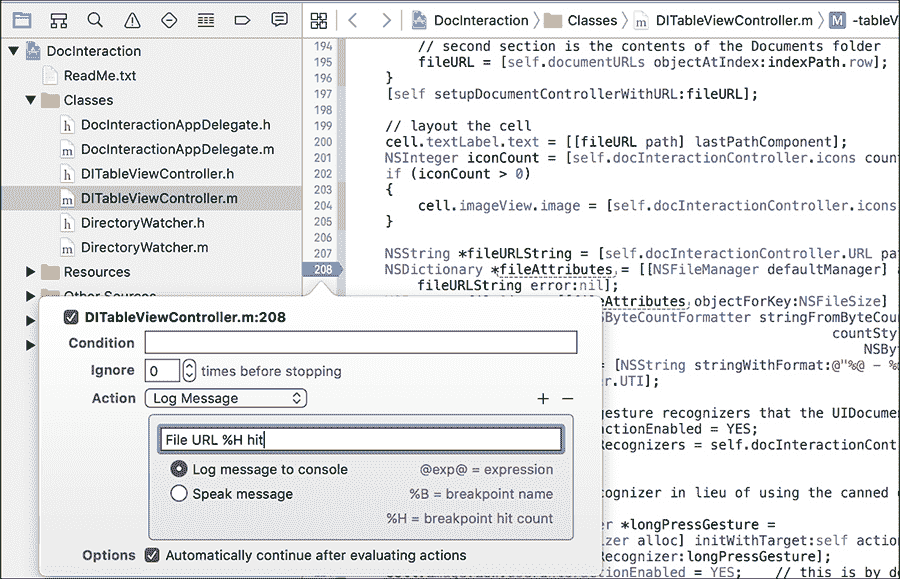

    *图 5-10：使用断点动作进行简单的日志记录。在此示例中，您将记录一条消息，并使用* `%H` *占位符记录断点被命中的次数。*

    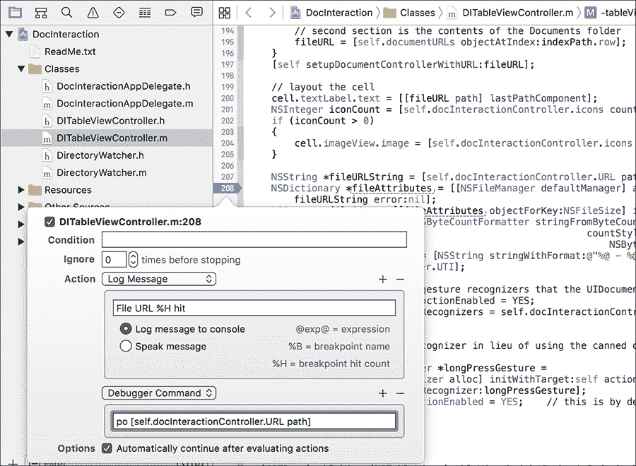

    *图 5-11：除了简单的记录之外，您还可以执行任意 lldb 命令。在这种情况下，您将使用* `po` *命令打印由* `path` *方法返回的对象描述。*

1.  可选地，添加断点条件以指定何时执行您定义的动作（图 5-12）。

    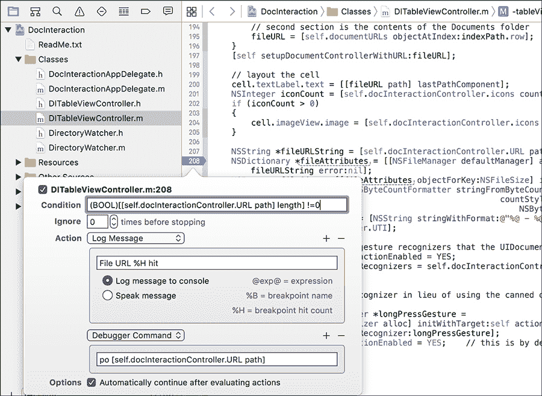

    *图 5-12：两个操作和一个断点条件。对于条件，你需要确保路径的长度不为零，然后才执行断点操作，指定返回值* `(BOOL)`。

尝试按照这些步骤操作，直到你熟悉使用断点操作，然后继续下一个部分，了解如何在安全环境中应用 lldb 的一些具体方法。

### **使用 lldb 进行安全分析**

这些都是有用的技巧，但如何将它们结合起来，找到新的安全问题或测试安全断言呢？让我们看几个示例，看看使用调试器如何帮助你发现更具体的问题。

#### ***故障注入***

假设你有一个应用程序，它使用自定义二进制网络协议在客户端和远程服务器之间传输数据。这可能会使得使用现成的代理拦截和修改数据变得困难，但你想确定在某些参数中，格式错误的数据是否会导致程序崩溃。你还可以操作数据，以便将来的测试变得更容易。

由于你可以更改数据，你可能想要替换一个随机生成的密钥，换成你选择的密钥。你可以在调试器中执行这一操作，如清单 5-4 所示。这样，数据就会使用你选择的已知密钥进行加密，而不是一个可能无法打印的二进制数据块。以下示例在数据保存到 Keychain 之前修改了应用程序的加密密钥，以便后续的通信使用不同的密钥：

```
➊ (lldb) frame var
   (Class) self = SimpleKeychainWrapper
   (SEL) _cmd = "addToKeychain:forService:"
   (NSString *) identifier = 0x00005be4 @"com.isecpartners.CryptoKey"
   (NSString *) service = 0x00005bf4 @"com.isecpartners.NSCoder+Crypto"
   (NSMutableDictionary *) dictionary = 0x08b292f0 6 key/value pairs
   (NSMutableData *) item = 0x08b2cee0
   (OSStatus) status = 1
➋ (lldb) po item
   <9aab766a 260bb165 57675f04 fdb982d3 d73365df 5fd4b05f 3c078f7b b6484b7d>
➌ (lldb) po dictionary
   {
       acct = <636f6d2e 69736563 70617274 6e657273 2e437279 70746f4b 6579>;
       class = genp;
       gena = <636f6d2e 69736563 70617274 6e657273 2e437279 70746f4b 6579>;
       pdmn = aku;
       svce = "com.isecpartners.NSCoder+Crypto";
       "v_Data" = <9aab766a 260bb165 57675f04 fdb982d3 d73365df 5fd4b05f 3c078f7b
       b6484b7d>;
   }
➍ (lldb) expr (void)[dictionary setObject:@"mykey" forKey:(__bridge id)kSecValueData
       ];
➎ (lldb) po dictionary
   {
      acct = <636f6d2e 69736563 70617274 6e657273 2e437279 70746f4b 6579>;
      class = genp;
      gena = <636f6d2e 69736563 70617274 6e657273 2e437279 70746f4b 6579>;
      pdmn = aku;
      svce = "com.isecpartners.NSCoder+Crypto";
      "v_Data" = mykey;
   }
```

*清单 5-4：检查和更改内存中的对象值*

在➊，代码打印出当前帧的变量，注意到传递给`addToKeychain:forService:`选择器的参数。这个示例关注的键存储在`item`参数中，并被添加到字典中。检查这些（➋和➌）会显示键的值。然后，代码使用`expr`命令 ➍ 修改了 Keychain 字典。在➎，程序验证新的`NSString`现在是该键的当前值。

#### ***数据跟踪***

如果你有一个使用主密码加密数据的应用程序，可能有必要在数据被加密之前检查它。默认情况下，数据是否会进入加密例程并不总是显而易见。请参考清单 5-5：

```
➊ (lldb) frame variable
   (CCCryptHelper *const) self = 0x07534b40
➋ (SEL) _cmd = "encrypt:"
➌ (NSString *) data = 0x0000c0ec @"PasswordManager"
   (NSData *) encData = 0x07534b40 0 byte

   (lldb) frame select
   frame #0: 0x00006790 PasswordManager `-CCCryptHelper encrypt: + 48 at CCCryptHelper.m:82
   80 - (NSData *)encrypt:(NSString *)data {
   -> 81 NSData *encData = [self AES128EncryptData:[data dataUsingEncoding: NS
       UTF8StringEncoding]
   82                                      withKey:masterPassword];
```

*清单 5-5：使用 lldb 检查帧变量*

如果你在`encrypt:`选择器 ➋ 设置断点，你可以使用`frame variable`命令 ➊ 检查局部变量。注意，输出中显示了`data`和`encData`。前者 ➌ 是这个示例中感兴趣的部分，因为它是将被加密并由例程返回的数据。这种跟踪技术还可以用于检查和修改将通过网络发送的数据，在它到达加密例程之前。

#### ***检查核心框架***

lldb 在深入研究 Apple 的 API 的奇怪行为时也非常有用——当你对某个 API 的行为感到困惑时，我建议你使用它。例如，在查看`NSURLCache`时，我注意到在清单 5-6 中的行为：

```
   (lldb) expr (int)[[NSURLCache sharedURLCache] currentMemoryUsage]
   (int) $0 = 158445

   (lldb) expr (int)[[NSURLCache sharedURLCache] currentDiskUsage]
   (int) $1 = 98304

➊ (lldb) expr (void)[[NSURLCache sharedURLCache] removeAllCachedResponses]

   (lldb) expr (int)[[NSURLCache sharedURLCache] currentMemoryUsage]
   (int) $3 = 0

   (lldb) expr (int)[[NSURLCache sharedURLCache] currentDiskUsage]
➋ (int) $4 = 98304
```

*清单 5-6：`NSURLCache` API 的某些奇怪行为*

在这里，尽管我调用了`removeAllCachedResponses`方法➊，当前的磁盘使用量仍然是 98304 字节➋。唉，似乎清除缓存是无效的。别担心——你将在第九章看到一些解决方案。与此同时，你可能想自己尝试一些内部机制。这可以帮助你了解 iOS 平台的一些工作原理，并对你的应用程序行为有更深入的理解。

### **结束语**

所有这些调试和检查技巧在调试你自己的应用程序或快速了解一个新代码库时都很有用。然而，你可能并不总是能访问到你正在使用的产品的源代码。在这些情况下，你需要了解一些基本的黑箱测试技巧，我将在第六章中介绍这些技巧。
