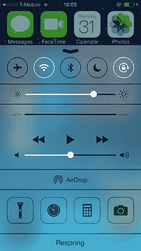
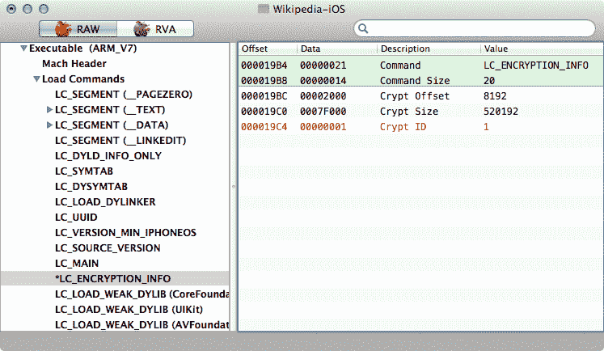
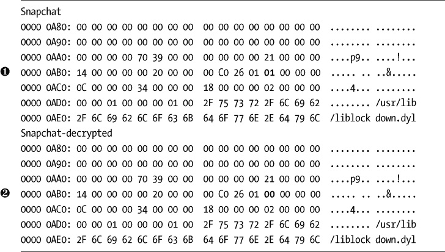
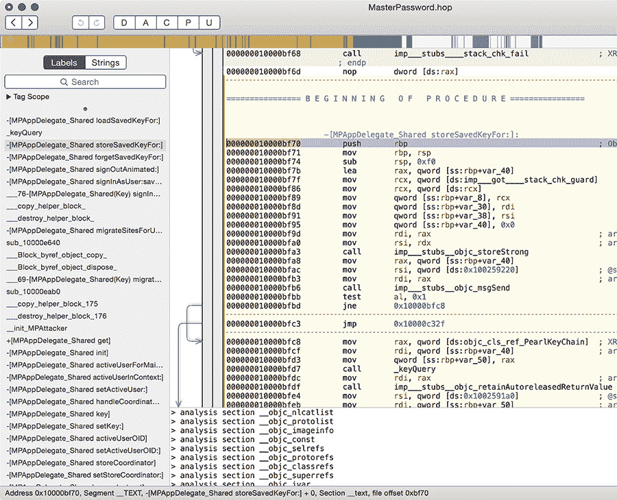
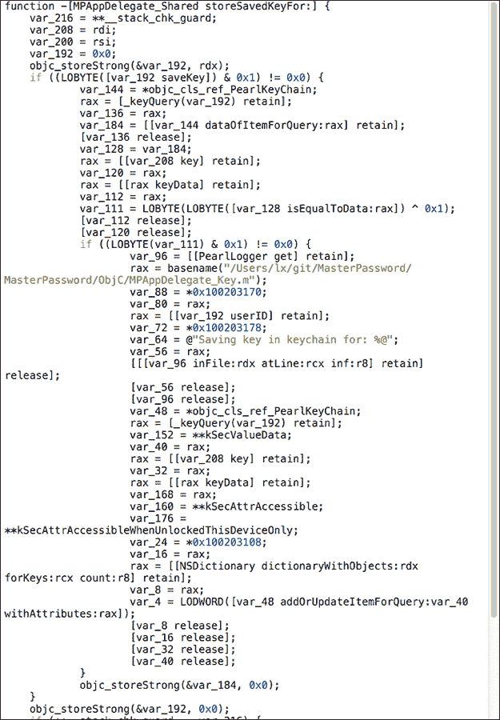
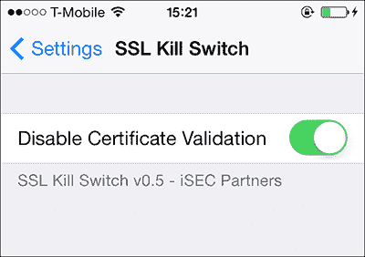
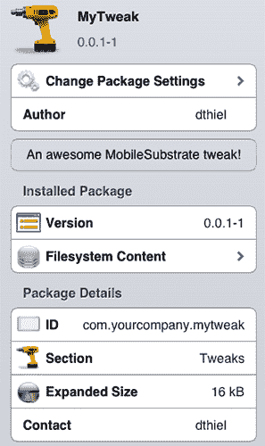
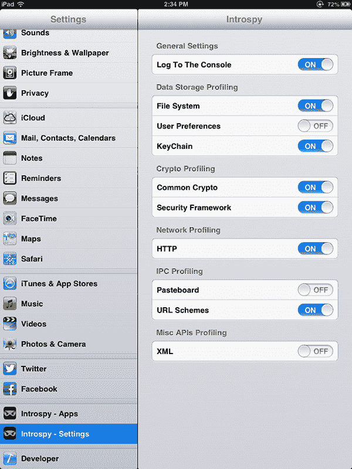
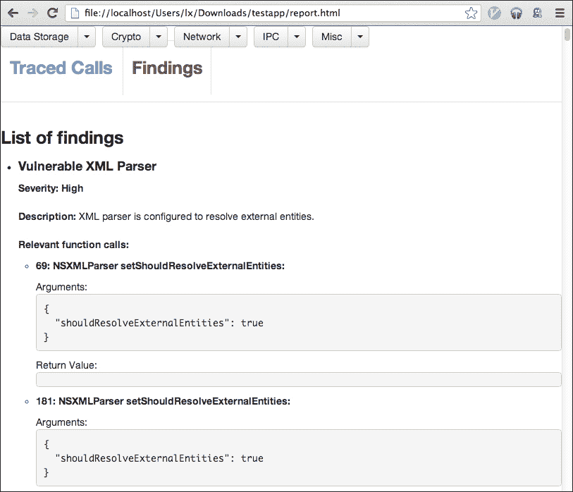

## 6

**黑盒测试**

虽然白盒测试几乎总是进行安全测试时最好的方式，但有时候你只能在没有源代码或对程序设计的了解的情况下进行测试。在这些情况下，你需要深入了解 iOS 的内部，特别是 Objective-C 和 Mach-O 二进制格式的领域。

iOS 上的黑盒测试是一个快速变化的目标——它依赖于越狱的持续发展，以及强大的第三方工具和调试工具。我尽力将本章中描述的技巧和工具尽可能地做成未来-proof，以为你提供一个坚实的基础。

为了有效地进行 iOS 应用程序的黑盒测试，你首先需要获得一个越狱设备，这样你才能侧载应用程序并安装你的测试工具链。越狱的细节变化太快，我无法在这里记录，但你通常可以从 iPhone Dev Team^(1)或 iClarified.^(2)找到最新信息。

一旦你越狱了你的设备，启动 Cydia，选择**开发者**模式，然后更新你的软件包列表（在“更改”选项卡下）。

现在你可以在设备上加载一些测试工具，主要来自 Cydia 应用商店。以下是必备工具：

**odcctools** 包括 otool、lipo 以及其他开发工具。

**OpenSSH** 你需要这个工具来实际访问设备。务必使用`passwd(1)`命令*立即*更改`root`和`mobile`账户的密码。

**MobileTerminal** 这将允许你在设备本地使用命令行，必要时使用。

**cURL** 你会需要这个工具来通过 HTTP 或 FTP 下载远程文件。

**Erica Utilities** 这个工具包包括了 Erica Sadun 的一些有用工具。可以在*[`ericasadun.com/ftp/EricaUtilities/`](http://ericasadun.com/ftp/EricaUtilities/)*查看详细列表。

**vbindiff** 这是一个二进制差异程序，用来验证二进制文件的变化。

**netcat** 这是一个通用的网络监听工具。

**rsync** 你可以安装这个工具来同步整个目录树到设备或者从设备同步。

**tcpdump** 你可以安装这个工具来捕获网络流量数据包进行分析。

**IPA 安装控制台** 这个工具将允许你直接安装复制到设备上的*.ipa*文件。

**Cydia Substrate** 这个工具用于挂钩和修改应用程序的行为。

现在，让我们来看一下如何将这些测试工具安装到你的设备上。

### 安装第三方应用

根据你是如何获得应用程序文件的，有几种方法可以将它们侧载到你的设备上。

#### *使用 .app 目录*

如果你获得了一个*.app*目录，你可以进行如下操作：

首先，用`tar`命令打包你的*.app*包，并使用`scp`将压缩包复制到你的测试设备上，如下所示：

```
$ tar -cvzf archive.tar.gz mybundle.app}
$ scp archive.tar.gz root@dev.ice.i.p:
```

然后通过`ssh`连接到你的设备，并将压缩包解压到*/Applications*目录：

```
$ cd /Applications
$ tar -xvzf ~/archive.tar.gz
```

这样应该能将应用程序放置在与苹果官方应用程序相邻的位置。为了使其出现在主屏幕上，您需要重新启动 SpringBoard 或重启设备。要重启 SpringBoard，您可以使用`killall`命令，像这样：

```
$ killall -HUP SpringBoard
```

如果您发现自己经常需要“重新启动 SpringBoard”，可以使用像 Cydia 中的 CCRespring 这样的工具，如 Figure 6-1 所示。



*Figure 6-1：CCRespring 在控制中心添加的简单重启按钮*

像 CCRespring 这样的工具添加了一个按钮，您可以按下它来重新启动 SpringBoard，这样您就不需要每次都去命令行了。

**注意**

*有些人报告说，仅仅重新启动设备并不会导致应用程序出现在 SpringBoard 上。在这种情况下，您可以选择重新启动设备或作为`*mobile*`用户运行`*uicache*`命令。*

#### *使用.ipa 包文件*

如果您已经获得（或通过其他方式获取）一个*.ipa*包文件，您可以使用`scp`将其复制到设备中，并使用`installipa`命令进行安装，方法如下：

```
$ installipa ./Wikipedia-iOS.ipa
Analyzing Wikipedia-iOS.ipa...
Installing Wikipedia (v3.3)...
Installed Wikipedia (v3.3) successfully.

$ ls Applications/CC189021-7AD0-498F-ACB6-356C9E521962
Documents  Library  Wikipedia-iOS.app  tmp
```

### 解密二进制文件

在您检查二进制文件的内容之前，您需要先解密它们。有几种方法可以实现这一点。最简单的方法是使用预打包的工具，如 Stefan Esser 的 dumpdecrypted。^(3) 这是一个共享库，在执行您的应用程序时动态加载。您可以按如下方式使用它：

```
$ git clone https://github.com/stefanesser/dumpdecrypted
$ cd dumpdecrypted
$ make
$ scp dumpdecrypted.dylib root@your.dev.ice:
$ ssh root@your.dev.ice
$ DYLD_INSERT_LIBRARIES=dumpdecrypted.dylib /var/mobile/Applications/(APP_ID)/
     YourApp.app/YourApp
```

这将输出一个解密后的二进制文件，存放在应用程序的*.app*包的*tmp*目录中。

因为已经有很多自动化工具可以用于提取解密二进制文件，其中大多数已经无法使用，最好有一个备份方法。为了更稳健和（理想情况下）更具未来兼容性地解密二进制文件，并帮助您理解一些应用加密和解密的内部工作原理，您可以使用命令行工具和 lldb。^(4)

要创建解密后的二进制文件，您将遵循以下基本步骤：

1.  分析二进制文件，确定其加密部分的位置。

1.  在 lldb 下运行应用程序。

1.  将未加密的部分转储到磁盘。

1.  复制原始二进制文件作为目标文件使用。

1.  移除目标二进制文件中的`cryptid`标志。

1.  将未加密的部分移植到目标二进制文件中。

让我们更详细地讨论这个解密过程。

#### *在设备上启动 debugserver*

在您获取内存转储之前，您需要将 Apple 的 debugserver 放到设备上。debugserver 位于*DeveloperDiskImage.dmg*中，深藏在 Xcode 内。通过命令行，您可以挂载磁盘镜像并将 debugserver 提取到本地目录，如 Listing 6-1 所示。

```
$ hdiutil attach /Applications/Xcode.app/Contents/Developer/Platforms/iPhoneOS.
     platform/DeviceSupport/7.1\ \(11D167\)/DeveloperDiskImage.dmg

Checksumming whole disk (Apple_HFS : 0)
..................................................................
      disk (Apple_HFS : 0): verified CRC32 $D1221D77
      verified   CRC32 $B5681BED
      /dev/disk6         /Volumes/DeveloperDiskImage

$ cp /Volumes/DeveloperDiskImage/usr/bin/debugserver .
```

*Listing 6-1：从 Developer Disk Image 提取 debugserver*

一旦你复制了调试服务器，你需要编辑二进制文件的权限。通常，当 Xcode 本身使用调试服务器时，它会直接启动应用程序；你需要更改它的权限，以便它可以附加到设备上的任意运行程序。首先，使用二进制文件的当前权限生成一个 plist，如下所示：

```
$ codesign --display --entitlements entitlements.plist debugserver
```

这应该会生成一个 XML 格式的 plist 文件，内容如下：

```
<?xml version="1.0" encoding="UTF-8"?>
<!DOCTYPE plist PUBLIC "-//Apple//DTD PLIST 1.0//EN" "http://www.apple.com/DTDs/
     PropertyList-1.0.dtd">
<plist version="1.0">
<dict>
        <key>com.apple.backboardd.debugapplications</key>
        <true/>
        <key>com.apple.backboardd.launchapplications</key>
        <true/>
        <key>com.apple.springboard.debugapplications</key>
        <true/>
        <key>run-unsigned-code</key>
        <true/>
        <key>seatbelt-profiles</key>
        <array>
                <string>debugserver</string>
        </array>
</dict>
</plist>
```

这个文件需要更新，以包含`get-task-allow`和`task_for_pid-allow`权限，并删除`seatbelt-profiles`权限。这些更新将导致一个像下面这样的 plist：

```
<!DOCTYPE plist PUBLIC "-//Apple//DTD PLIST 1.0//EN" "http://www.apple.com/DTDs/
     PropertyList-1.0.dtd">
<plist version="1.0">
<dict>
    <key>com.apple.springboard.debugapplications</key>
    <true/>
    <key>run-unsigned-code</key>
    <true/>
    <key>get-task-allow</key>
    <true/>
    <key>task_for_pid-allow</key>
    <true/>
</dict>
</plist>
```

更新*entitlements.plist*文件后，你需要使用它来对应用进行签名（从而覆盖二进制文件的现有权限），并将调试服务器复制到设备上，如下所示：

```
$ codesign -s - --entitlements entitlements.plist -f debugserver
debugserver: replacing existing signature
$ scp debugserver root@de.vi.ce.ip:
```

现在你终于可以调试应用程序了。确保你想要调试的程序当前在设备上运行，然后启动调试服务器以附加到它，像这样：

```
$ ssh root@de.vi.ce.ip
$ ./debugserver *:666 --attach=Snapchat

debugserver-310.2 for arm64.

Attaching to process Snapchat...
Listening to port 666 for a connection from *...
```

这个调试服务器现在正在等待来自另一台运行 lldb 的机器的网络连接。接下来，在你的本地机器上，你可以按以下方式连接到设备：

```
$ lldb
(lldb) platform select remote-ios
  Platform: remote-ios
 Connected: no
  SDK Path: "/Users/lx/Library/Developer/Xcode/iOS DeviceSupport/8.0 (12A4265u)"
 SDK Roots: [ 0] "/Applications/Xcode.app/Contents/Developer/Platforms/iPhoneOS.
     platform/DeviceSupport/4.2"
 SDK Roots: [ 1] "/Applications/Xcode.app/Contents/Developer/Platforms/iPhoneOS.
     platform/DeviceSupport/4.3"
 SDK Roots: [ 2] "/Applications/Xcode.app/Contents/Developer/Platforms/iPhoneOS.
     platform/DeviceSupport/5.0"
 SDK Roots: [ 3] "/Applications/Xcode.app/Contents/Developer/Platforms/iPhoneOS.
     platform/DeviceSupport/5.1"
 SDK Roots: [ 4] "/Applications/Xcode.app/Contents/Developer/Platforms/iPhoneOS.
     platform/DeviceSupport/6.0"
 SDK Roots: [ 5] "/Applications/Xcode.app/Contents/Developer/Platforms/iPhoneOS.
     platform/DeviceSupport/6.1"
 SDK Roots: [ 6] "/Applications/Xcode.app/Contents/Developer/Platforms/iPhoneOS.
     platform/DeviceSupport/7.0"
 SDK Roots: [ 7] "/Applications/Xcode.app/Contents/Developer/Platforms/iPhoneOS.
     platform/DeviceSupport/7.1 (11D167)"
 SDK Roots: [ 8] "/Users/lx/Library/Developer/Xcode/iOS DeviceSupport/5.0.1
     (9A405)"
 SDK Roots: [ 9] "/Users/lx/Library/Developer/Xcode/iOS DeviceSupport/6.0.1
      (10A523)"
 SDK Roots: [10] "/Users/lx/Library/Developer/Xcode/iOS DeviceSupport/7.0.4
     (11B554a)"
 SDK Roots: [11] "/Users/lx/Library/Developer/Xcode/iOS DeviceSupport/8.0
     (12A4265u)"
 SDK Roots: [12] "/Users/lx/Library/Developer/Xcode/iOS DeviceSupport/8.0
     (12A4297e)"

(lldb) process connect connect://de.vi.ce.ip:666
Process 2801 stopped
* thread #1: tid = 0x18b64b, 0x0000000192905cc0 libsystem_kernel.dylib`
     mach_msg_trap + 8, stop reason = signal SIGSTOP
    frame #0: 0x0000000192905cc0 libsystem_kernel.dylib`mach_msg_trap + 8
libsystem_kernel.dylib`mach_msg_trap + 8:
-> 0x192905cc0:  b      0x19290580c

libsystem_kernel.dylib`mach_msg_overwrite_trap:
   0x192905cc4:  .long  0x0000093a                ; unknown opcode
   0x192905cc8:  ldr    w16, 0x192905cd0          ; semaphore_signal_trap
   0x192905ccc:  b      0x19290580c
```

在这个例子中，正在运行的程序被中断，此时你可以在本地机器上使用 lldb 对其进行操作。要提取解密后的程序数据，接下来你需要确定二进制文件中加密段所在的部分。

请注意，你可能会发现网络连接不稳定，无法成功完成内存转储。如果是这种情况，你可以使用`iproxy`命令（usbuxmd 自带的命令）作为 USB 端口和 TCP 端口之间的代理，如下所示：

```
$ brew install usbmuxd
$ iproxy 1234 1234 &
$ lldb
(lldb) process connect connect://127.0.0.1:1234
```

这些命令连接到一个网络套接字并使用 lldb，但实际上是通过 USB 端口进行通信的。

#### *定位加密段*

要定位加密段，你需要使用 odcctools 和 lldb。首先，运行`otool -l *myBinary*`并在你喜欢的分页器中查看输出。你可以在设备上或者本地机器上执行此操作。OS X 自带的版本包含一个更新的 otool，可以提供更清晰的输出。以下是一个示例：

```
$ otool -fh Snapchat
Fat headers
fat_magic 0xcafebabe
nfat_arch 2
architecture 0
    cputype 12
    cpusubtype 9
    capabilities 0x0
    offset 16384
    size 9136464
    align 2¹⁴ (16384)
architecture 1
    cputype 12
    cpusubtype 11
    capabilities 0x0
    offset 9158656
    size 9169312
    align 2¹⁴ (16384)
Snapchat (architecture armv7:
Mach header
      magic cputype cpusubtype  caps   filetype ncmds sizeofcmds      flags
 0xfeedface      12          9  0x00          2    47       5316 0x00218085
Snapchat (architecture armv7s):
Mach header
      magic cputype cpusubtype  caps   filetype ncmds sizeofcmds      flags
 0xfeedface      12         11  0x00          2    47       5316 0x00218085
```

Mach-O 二进制格式允许创建所谓的*fat*文件，这些文件可以包含针对多个架构编译的程序（这就是 OS X 通用二进制文件的工作方式）。为了简化逆向工程，你需要处理将在目标设备上运行的二进制部分；在我的例子中，我使用的是 iPhone 5s 作为测试设备，因此我需要 armv7s 架构。

确定架构后，你有几个选择。你可以使用`lipo(1)`命令将二进制文件*瘦身*，仅包含一个架构（`thin`标志指定你感兴趣的架构），像这样：

```
$ lipo -thin armv7 myBinary -output myBinary-thin
```

但为了本章的目的，我将展示如何处理 fat 二进制文件。首先，你需要使用 otool 来确定二进制文件中 *文本* 段的基址——这是实际的可执行指令将被加载到内存中的位置——正如在示例 6-2 中所示。

```
$ otool -arch armv7s -l Snapchat
Snapchat:
Load command 0
      cmd LC_SEGMENT
  cmdsize 56
  segname __PAGEZERO
   vmaddr 0x00000000
   vmsize 0x00004000
  fileoff 0
 filesize 0
  maxprot 0x00000000
 initprot 0x00000000
   nsects 0
    flags 0x0
Load command 1
      cmd LC_SEGMENT
  cmdsize 736
  segname __TEXT
   vmaddr 0x00004000
   vmsize 0x007a4000
  fileoff 0
 filesize 8011776
  maxprot 0x00000005
 initprot 0x00000005
   nsects 10
    flags 0x0
```

*示例 6-2：查找文本段的基址*

你可以看到文本段从 0x00004000 开始。记下这个地址，因为稍后你会用到它。下一步是确定二进制文件加密部分的起始和结束位置。你可以通过 otool 来完成此操作——注意你需要指定 `-arch armv7s` 命令（或者根据你使用的架构来指定），以确保你查看的是正确的部分。输出应该像示例 6-3 所示。

```
$ otool -arch armv7s -l Snapchat
--snip--
Load command 9
      cmd LC_VERSION_MIN_IPHONEOS
  cmdsize 16
  version 5.0
      sdk 7.1
Load command 10
        cmd LC_UNIXTHREAD
    cmdsize 84
     flavor ARM_THREAD_STATE
      count ARM_THREAD_STATE_COUNT
            r0  0x00000000 r1     0x00000000 r2  0x00000000 r3  0x00000000
            r4  0x00000000 r5     0x00000000 r6  0x00000000 r7  0x00000000
            r8  0x00000000 r9     0x00000000 r10 0x00000000 r11 0x00000000
            r12 0x00000000 sp     0x00000000 lr  0x00000000 pc  0x0000a300
           cpsr 0x00000000
Load command 11
          cmd LC_ENCRYPTION_INFO
      cmdsize 20
cryptoff 16384
cryptsize 7995392
cryptid 1
```

*示例 6-3：otool 显示二进制文件的加载命令*

这里需要关注的值是 `cryptoff` 和 `cryptsize`（`cryptid` 仅表示这是一个加密的二进制文件）。^(5) 它们分别表示应用程序加密段的起始地址和段的大小。它们之间的范围将帮助你在转储内存时使用。这些值是十六进制的——获取十六进制值的一种快速方法是执行以下命令：

```
$ printf '%x\n' 16384
4000
$ printf '%x\n' 7995392
7a0000
```

在这种情况下，数字是 0x00004000 和 0x007a0000。也请将这些记下来。现在，回到示例 6-2，已经确定二进制文件中的文本段从 0x00004000 开始。然而，文本段在程序实际运行时可能不会停留在这里，因为 ASLR 会随机移动内存中的某些部分。^(6) 所以，请检查文本段实际加载的位置，使用 lldb 的 `image list` 命令，如下所示：

```
(lldb) image list
[  0] E3BB2396-1EF8-3EA7-BC1D-98F736A0370F 0x000b2000 /var/mobile/Applications/
     CCAC51DD-48DB-4798-9D1B-94C5C700191F/Snapchat.app/Snapchat
     (0x00000000000b2000)
[  1] F49F2879-0AA0-36C0-8E55-73071A7E2870 0x2db90000 /Users/lx/Library/Developer/
     Xcode/iOS DeviceSupport/7.0.4 (11B554a)/Symbols/System/Library/Frameworks/
     AudioToolbox.framework/AudioToolbox
[  2] 763DDFFB-38AF-3444-B745-01DDE37A5949 0x388ac000 /Users/lx/Library/Developer/
     Xcode/iOS DeviceSupport/7.0.4 (11B554a)/Symbols/usr/lib/libresolv.9.dylib
[  3] 18B3A243-F792-3C39-951C-97AB416ED3E6 0x37fb0000 /Users/lx/Library/Developer/
     Xcode/iOS DeviceSupport/7.0.4 (11B554a)/Symbols/usr/lib/libc++.1.dylib
[  4] BC1A8B9C-9F5D-3B9D-B79E-345D4C3A361A 0x2e7a2000 /Users/lx/Library/Developer/
     Xcode/iOS DeviceSupport/7.0.4 (11B554a)/Symbols/System/Library/Frameworks/
     CoreLocation.framework/CoreLocation
[  5] CC733C2C-249E-3161-A9AF-19A44AEB1577 0x2d8c2000 /Users/lx/Library/Developer/
     Xcode/iOS DeviceSupport/7.0.4 (11B554a)/Symbols/System/Library/Frameworks/
     AddressBook.framework/AddressBook
```

你可以看到文本段加载到了 0x000b2000。掌握了这个地址后，你终于可以提取二进制文件的可执行部分了。

#### *转储应用程序内存*

让我们来看点数学运算来确定最终的偏移量。第一步是将基址与 `cryptoff` 的值相加；在这种情况下，两者都是 0x00004000，所以起始数字将是 0x00008000。结束数字将是起始数字加上 `cryptsize` 的值，在这个例子中，`cryptsize` 位于 0x007a0000。这些数字相加起来比较简单，但如果你遇到无法轻易计算的偏移量，你可以使用 Python 来为你计算，如示例 6-4 所示。

```
$ python
Python 2.7.10 (default, Dec 14 2015, 19:46:27)
[GCC 4.2.1 Compatible Apple LLVM 6.0 (clang-600.0.39)] on darwin
Type "help", "copyright", "credits" or "license" for more information.
>>>
>>> hex(0x00008000 + 0x007a0000)
'0x7a8000'
```

*示例 6-4：添加起始数字和 `cryptsize` 的十六进制值*

好了，这个例子真的差不多完成了，别担心。从这里，你只需要将你的数字插入以下 lldb 命令中：

```
(lldb) memory read --force --outfile /tmp/mem.bin --binary 0x00008000 0x007a8000
8011776 bytes written to '/private/tmp/mem.bin'
```

当然，这并不会给你一个完整、可用的二进制文件——只是一个内存转储。这个映像缺少 Mach-O 头部的元数据。为了解决这个问题，你需要将内存转储移植到一个有效的二进制文件中，为此，你首先需要复制原始二进制文件，并使用`scp`将其复制到你的开发机上。

然后，你需要将未加密的内存转储内容复制到捐赠二进制文件中，替换掉加密的部分。你可以使用`dd`命令来完成此操作，并指定`seek`参数来确定数据开始写入的位置。`seek`参数应该是`vmaddr`加上`cryptoff`的值，在这个例子中是 0x8000。以下是这个例子中的`dd`命令：

```
$ dd bs=1 seek=0x8000 conv=notrunc if=/tmp/mem.bin of=Snapchat-decrypted
```

接下来，你需要将捐赠二进制文件的`cryptid`值更改为 0，表示未加密的二进制文件。这个操作有几种方法。你可以使用 MachOView^(7)（见图 6-2），它提供了一个易于使用的界面来检查和修改 Mach-O 二进制文件，或者你也可以使用你选择的十六进制编辑器。如果你使用十六进制编辑器，我发现最简单的方法是首先通过搜索`2100 0000 1400 0000`来找到`LC_ENCRYPTION_INFO`命令。^(8) 接下来的 16 个数字将是偏移量和大小，后面跟着`0100 0000`。那个字节就是`cryptid`，将其更改为`0000 0000`。

一旦你禁用了`cryptid`标志，你需要将修改后的二进制文件复制回设备。将修改后的二进制文件放置好后，你可以使用`vbindiff`验证更改，`vbindiff`可以通过 Homebrew 安装。`vbindiff`的输出应该如下所示，见清单 6-5。



*图 6-2：使用 MachOView 查看`encrypted`标志*



*清单 6-5：使用 vbindiff 验证更改后的`cryptid`值*

➊和➋处的行分别显示了启用和禁用的`cryptid`位（加粗显示）。现在，如果一切顺利，你就可以开始认真地解剖这个二进制文件了。

### 从解密二进制文件进行逆向工程

由于 Mach-O 二进制格式结构相对透明，在 iOS 上进行基本的逆向工程是一个相当简单的任务——至少在你获得解密后的二进制文件后。几种工具可以帮助你理解类定义、检查汇编指令，并提供有关二进制文件构建的详细信息。最有用且容易获得的工具是 otool 和 class-dump。你还可以查看 Cycript 和 Hopper，作为逆向特别顽固应用程序的工具。

#### *使用 otool 检查二进制文件*

otool 长期以来一直是基本 OS X 工具包的一部分，用于检查 Mach-O 二进制文件。它的当前版本支持 ARM 和 amd64 架构，并可以选择使用 llvm 来反汇编二进制文件。要查看程序的基本内部结构，你可以使用`otool -oV`命令查看数据段，如清单 6-6 所示。

```
$ otool -oV MobileMail

MobileMail:
Contents of (__DATA,__objc_classlist) section
000c2870 0xd7be8
           isa 0xd7bd4
    superclass 0x0
         cache 0x0
        vtable 0x0
          data 0xc303c (struct class_ro_t *)
                    flags 0x0
            instanceStart 80
             instanceSize 232
               ivarLayout 0x0
                     name 0xb48ac MailAppController
              baseMethods 0xc3064 (struct method_list_t *)
                   entsize 12
                     count 122
                      name 0xa048e toolbarFixedSpaceItem
                     types 0xb5bb0 @8@0:4
                       imp 0x40c69
                      name 0xa04a4 sidebarQuasiSelectTintColor
                     types 0xb5bb0 @8@0:4
                       imp 0x40ccd
                      name 0xa04c0 sidebarMultiselectTintColor
                     types 0xb5bb0 @8@0:4
                       imp 0x40d75
                      name 0xa04dc sidebarTintColor
                     types 0xb5bb0 @8@0:4
                       imp 0x130f5
                      name 0xa04ed updateStyleOfToolbarActivityIndicatorView:
    inView:
                     types 0xb5c34 v16@0:4@8@12
                       imp 0x18d69
```

*清单 6-6：otool 显示`__OBJC`段的内容*

这让你能够查看类名和方法名，以及 ivars 的信息，前提是这些是在 Objective-C 中实现的，而不是纯 C++。要查看程序的文本段，可以使用 `otool -tVq`。`-q` 表示你希望使用 llvm 作为反汇编器，而不是 otool 内置的反汇编器，后者通过 `-Q` 指定。输出的差异不大，但 llvm 看起来最适合执行此任务，因为它很可能最初就负责将二进制文件汇编起来。它还提供了稍微更易读的输出。清单 6-7 展示了 `otool -tVq` 的示例输出。

```
MobileMail:
(__TEXT,__text) section
00003584            0000       movs    r0, r0
00003586            e59d       b       0x30c4
00003588            1004       asrs    r4, r0, #32

--snip--

000035ca            447a       add     r2, pc
000035cc            6801       ldr     r1, [r0]
000035ce            6810       ldr     r0, [r2]
000035d0        f0beecf0       blx     0xc1fb4 @ symbol stub for: _objc_msgSend
000035d4        f2417128       movw    r1, #5928
000035d8        f2c0010d       movt    r1, #13
000035dc            4479       add     r1, pc
000035de            6809       ldr     r1, [r1]
000035e0        f0beece8       blx     0xc1fb4 @ symbol stub for: _objc_msgSend
000035e4            4606       mov     r6, r0
```

*清单 6-7：otool 的反汇编输出*

在这里，你可以看到方法的实际反汇编，以及一些基本的符号信息。要获取所有符号的转储，可以使用 `otool -IV`，如 清单 6-8 所示。

```
$ otool -IV MobileMail

MobileMail:
Indirect symbols for (__TEXT,__symbolstub1) 241 entries
address    index name
0x000c1c30     3 _ABAddressBookFindPersonMatchingEmailAddress
0x000c1c34     4 _ABAddressBookRevert
0x000c1c38     5 _ABPersonCopyImageDataAndCropRect
0x000c1c3c     7 _CFAbsoluteTimeGetCurrent
0x000c1c40     8 _CFAbsoluteTimeGetGregorianDate
0x000c1c44     9 _CFArrayAppendValue
0x000c1c48    10 _CFArrayCreateMutable
0x000c1c4c    11 _CFArrayGetCount
0x000c1c50    12 _CFArrayGetFirstIndexOfValue
0x000c1c54    13 _CFArrayGetValueAtIndex
0x000c1c58    14 _CFArrayRemoveValueAtIndex
0x000c1c5c    15 _CFArraySortValues
0x000c1c60    16 _CFDateFormatterCopyProperty
0x000c1c64    17 _CFDateFormatterCreate
```

*清单 6-8：使用 otool 检查符号*

#### *使用 class-dump 获取类信息*

class-dump^(9) 工具用于从 Objective-C 2.0 二进制文件中提取类信息。最终输出基本上相当于给定二进制文件的头文件。这可以为程序的设计和结构提供极好的洞察，使 class-dump 成为逆向工程中不可或缺的工具。Steve Nygard 最初的 class-dump 仅在 OS X 上运行，但它支持 armv7 架构，因此你可以将文件复制到桌面进行分析。还有一个修改版本，class-dump-z，^(10) 可以在 Linux 和 iOS 上运行。到目前为止，class-dump 似乎更新更为及时且功能更全，因此我建议继续使用它。

你可以将 class-dump 测试应用于任何未加密的 iOS 二进制文件。最简单的方式是将 */Applications* 中的内建 Apple 应用复制过来，并对其二进制文件运行 class-dump，如 清单 6-9 所示。

```
$ class-dump MobileMail

--snip--
@interface MessageHeaderHeader : _AAAccountConfigChangedNotification <
     MessageHeaderAddressBookClient, UIActionSheetDelegate>
{
    MailMessage *_lastMessage;
    id <MessageHeaderDelegate> _delegate;
    UIWebBrowserView *_subjectWebView;
    DOMHTMLElement *_subjectTextElement;
    UILabel *_dateLabel;
    unsigned int _markedAsUnread:1;
    unsigned int _markedAsFlagged:1;
    unsigned int _isOutgoing:1;
    UIImageView *_unreadIndicator;
    UIImageView *_flaggedIndicator;
    WorkingPushButton *_markButton;
    id _markUnreadTarget;
    SEL _markUnreadAction;
    ABPersonIconImageView *_personIconImageView;
    SeparatorLayer *_bottomSeparator;
    SeparatorLayer *_topSeparator;
    float _horizontalInset;
    unsigned int _allowUnreadStateToBeShown:1;
}

- (id)initWithFrame:(struct CGRect)fp8;
- (void)dealloc;
```

*清单 6-9：class-dump 显示 MobileMail 的接口详情*

令人愉快，不是吗？一旦你有了已解密的二进制文件，大多数 Objective-C 应用程序都会很快变得透明。

#### *使用 Cycript 从运行中的程序提取数据*

如果你不想经历解密二进制文件以获取其内部信息的麻烦，可以使用 Cycript^(11) 从正在运行的可执行文件中提取一些信息。使用 Cycript 与运行中的应用程序进行交互有许多技巧，但你可能最感兴趣的是使用 *weak_classdump.cy*^(12) 来模拟 class-dump 的功能。在 Contacts 应用程序运行时，你可以这样提取 class-dump 信息：

```
$ curl -OL https://raw.github.com/limneos/weak_classdump/master/
     weak_classdump.cy
$ cycript -p Contacts weak_classdump.cy
'Added weak_classdump to "Contacts" (3229)'
$ cycript -p Contacts
cy# weak_classdump_bundle([NSBundle mainBundle],"/tmp/contactsbundle")
"Dumping bundle... Check syslog. Will play lock sound when done."
```

这将把每个类的头文件写入 */tmp/contactsbundle* 目录。

请注意，为了通过 cURL 安全地获取数据，你需要在设备上安装 CA 证书包。如果你使用 MacPorts 且本地已安装 cURL，请执行以下操作：

```
$ scp /opt/local/share/curl/curl-ca-bundle.crt \
    root@de.vi.c.e:/etc/ssl/certificates/ca-certificates.crt
```

或者，如果你使用 Homebrew 并安装了 OpenSSL 配方，可以使用以下命令：

```
$ scp /usr/local/etc/openssl/cert.pem \
    root@de.vi.c.e:/etc/ssl/certificates/ca-certificates.crt}
```

#### *使用 Hopper 进行反汇编*

在没有源代码的情况下，可能会有一些需要更深入查看程序实际逻辑的情况。虽然 IDA Pro^(13)对于此类情况很有用，但它的价格相当高。我通常使用 Hopper^(14)来进行反汇编、反编译，并在黑箱测试过程中制作流程图。虽然汇编语言和反编译超出了本书的范围，但让我们快速看一下 Hopper 如何展示程序逻辑。查看 Hopper 中的一个基本密码管理器（图 6-3），你会发现一个名为`storeSavedKeyFor:`的方法，看起来很有前景。



*图 6-3：`storeSavedKeyFor:`函数的反汇编*

如果你在这段代码中调用反编译器（`if(b)`按钮），Hopper 会生成伪代码，帮助你理解程序的实际流程，如图 6-4 所示。



*图 6-4：反编译器生成的代码*

注意，`PearlLogger`类正在实例化，并且有一个引用当前正在存储的用户名。`var_64`显示该用户名被传递给日志功能，可能是传递给 NSLog 功能——这是不好的，原因我将在第十章中进一步解释。然而，你也可以看到该项正在被存储在具有限制性保护属性的钥匙串中（`kSecAttrAccessibleWhenUnlockedThisDeviceOnly`，在第十三章中有进一步详细说明），这是程序的一个优点。

汇编语言和反编译是广泛的领域，但 Hopper 为你提供了一种非常好的方式，以相对较低的价格开始通过汇编进行逆向工程。如果你想开始培养阅读 ARM 汇编的技能，可以查看 Ray Wenderlich 的教程：*[`www.raywenderlich.com/37181/ios-assembly-tutorial/`](http://www.raywenderlich.com/37181/ios-assembly-tutorial/)*。

### 击败证书钉扎

证书钉扎旨在防止恶意的 CA 为你的网站签发伪造（但看起来有效）的证书，从而拦截你的网络端点和应用程序之间的通信。这是一个很好的想法（我将在第七章中讨论如何实现它），但它确实使得黑箱测试变得稍微困难一些。

我和我的同事们经常遇到这个问题，以至于我们编写了一个工具来帮助我们解决它：iOS SSL Killswitch^(15)。Killswitch 工具钩取通过 URL 加载系统的请求，防止验证任何 SSL 证书，确保你可以通过代理运行任何黑箱应用，无论它是否使用证书钉扎。

要安装 Killswitch 工具，复制预编译的 *.deb* 文件到你的设备，并使用 dpkg 工具进行安装。

```
# scp ios-ssl-kill-switch.deb root@192.168.1.107
# ssh root@192.168.1.107
(and then, on the test device)
# dpkg -i ios-ssl-kill-switch.deb
# killall -HUP SpringBoard
```

然后，你可以在设置应用中找到 iOS SSL Killswitch（参见 图 6-5），在这里你可以切换开关。



*图 6-5：从设置应用程序中启用 SSL Killswitch 工具*

### 使用 Cydia Substrate 进行 Hook

在越狱设备上（你将在这些设备上执行黑盒测试），你可以使用 Cydia Substrate^(16)（以前称为 Mobile Substrate）来修改基础系统的行为，从而获取有关应用程序活动的更多信息或改变应用程序行为。你的目标可能是禁用某些安全或验证机制（就像 iOS SSL Killswitch 所做的那样），或者仅仅是当某些 API 被使用时通知你，并显示它们传递的参数。Cydia Substrate 钩取被称为 *tweaks*。

开始开发 Cydia Substrate 修改的最简便方法是使用 Theos 工具包。^(17) 要创建一个新的修改，使用 Theos 中包含的 *nic.pl* 脚本。请注意，Theos 默认是面向调整 SpringBoard 应用程序的行为，以便自定义用户界面元素。不过，鉴于本书中的目的，你将需要影响所有应用程序，因此你需要指定一个 `com.apple.UIKit` 的 Bundle 过滤器。这个过滤器将配置 Mobile/Cydia Substrate，在任何链接到 UIKit 框架的应用程序中加载你的修改（也就是说，显示用户界面的应用程序），但不会影响像系统守护进程或命令行工具等其他程序。

首先，你需要获取 Link Identity Editor，ldid，^(18) 这是 Theos 用来生成修改的签名和授权的工具。下面是获取 ldid 的方法：

```
$ git clone git://git.saurik.com/ldid.git

$ cd ldid

$ git submodule update --init

$ ./make.sh

$ sudo cp ./ldid /usr/local/bin
```

然后，你可以克隆 Theos 仓库并继续生成一个修改模板，具体步骤如下：

```
$ git clone git://github.com/DHowett/theos.git ~/git/theos

$ cd /tmp && ~/git/theos/bin/nic.pl
NIC 2.0 - New Instance Creator
------------------------------
  [1.] iphone/application
  [2.] iphone/library
  [3.] iphone/preference_bundle
  [4.] iphone/tool
  [5.] iphone/tweak
Choose a Template (required): 5
Project Name (required): MyTweak
Package Name [com.yourcompany.mytweak]:
Author/Maintainer Name [dthiel]:
[iphone/tweak] MobileSubstrate Bundle filter [com.apple.springboard]: com.apple.
     UIKit
Instantiating iphone/tweak in mytweak/...
Done.
```

这将创建一个 *Tweak.xm* 文件，默认情况下其所有内容都被注释掉。包括了钩取类方法或实例方法的存根，可以带参数也可以不带参数。

你可以编写的最简单的 Hook 类型就是仅记录方法调用和参数；这里有一个例子，它钩取了 `UIPasteboard` 的两个类方法：

```
%hook UIPasteboard

+ (UIPasteboard *)pasteboardWithName:(NSString *)pasteboardName create:(BOOL)create
{
        %log;
        return %orig;
}

+ (UIPasteboard *)generalPasteboard
{
        %log;
        return %orig;
}

%end
```

这段代码使用了 Logos^(19) 指令，如 `%hook` 和 `%log`。Logos 是 Theos 的一个组件，旨在使方法钩取代码的编写变得简单。然而，实际上也可以仅使用 C 语言来编写具有相同功能的修改。

你还需要提供完整的方法签名，可以通过 API 文档或框架头文件获得。一旦你对修改进行了满意的自定义，你可以使用 *nic.pl* 提供的 Makefile 来构建它。

要构建适合安装到越狱设备上的 Debian 包，你还需要安装 dpkg 工具。你可以通过 MacPorts^(20)的`port`命令或 Homebrew^(21)的`brew`命令来安装。此示例使用`port`：

```
$ sudo port install dpkg
    --snip--
$ make
Bootstrapping CydiaSubstrate...
 Compiling iPhoneOS CydiaSubstrate stub... default target?
 Compiling native CydiaSubstrate stub...
 Generating substrate.h header...
Making all for tweak MyTweak...
 Preprocessing Tweak.xm...
 Compiling Tweak.xm...
 Linking tweak MyTweak...
 Stripping MyTweak...
 Signing MyTweak...
$ make package
Making all for tweak MyTweak...
make[2]: Nothing to be done for `internal-library-compile'.
Making stage for tweak MyTweak...
dpkg-deb: building package `com.yourcompany.mytweak' in `./com.yourcompany.
     mytweak_0.0.1-1_iphoneos-arm.deb'.
```

运行这些命令应该会生成一个可以安装到 iOS 设备上的包。首先，你可以使用`scp`命令将文件复制到设备，并手动加载它。之后，你可以直接在命令行使用`dpkg -i`（如下代码所示）或设置自己的 Cydia 仓库。^(22)

```
$ dpkg -i com.yourcompany.mytweak_0.0.1-1_iphoneos-arm.deb
Selecting previously deselected package com.yourcompany.mytweak.
(Reading database ... 3551 files and directories currently installed.)
Unpacking com.yourcompany.mytweak (from com.yourcompany.mytweak_0.0.1-1_iphoneos-
     arm.deb) ...
Setting up com.yourcompany.mytweak (0.0.1-1) ..
```

当此过程完成后，你可以通过`dpkg`命令进一步管理该包（使用`dpkg -P`删除）或通过 Cydia 进行管理，如图 6-6 所示。



*图 6-6：你自己的插件在 Cydia 管理界面中的展示*

安装一个插件后，如果你查看系统日志，你会看到 Cydia Substrate 动态库在启动所有应用时被加载。你还会看到插件记录的钩取方法调用日志。以下是一个示例日志：

```
May  2 14:22:08 my-iPad Maps~ipad[249]: MS:Notice: Loading: /Library/
     MobileSubstrate/DynamicLibraries/MyTweak.dylib
May  2 14:22:38 lxs-iPad Maps~ipad[249]: +[<UIPasteboard: 0x3ef05408>
     generalPasteboard]
```

当然，插件除了记录之外，还有许多其他功能；参见 iOS SSL Killswitch 工具的*Tweak.xm*文件，了解如何修改方法行为以及如何设置自己的首选项切换。^(23)

### 使用 Introspy 自动化钩取

虽然插件对于一次性钩取场景非常有用，但我的同事 Alban Diquet 和 Tom Daniels 使用 Cydia Substrate 框架开发了一个名为 Introspy^(24)的工具，可以帮助自动化黑盒测试中的钩取过程，而无需深入挖掘 iOS 或 Cydia Substrate 的底层。Introspy 直接使用 Cydia Substrate 框架（而不是通过 Theos）来钩取安全敏感的函数调用，并记录它们的参数和返回值，之后可以用来生成报告。要安装 Introspy，下载最新的预编译*.deb*包，地址为*[`github.com/iSECPartners/Introspy-iOS/releases/`](https://github.com/iSECPartners/Introspy-iOS/releases/)*，将其复制到你的设备上，并在设备上输入命令`dpkg -i *filename*`来添加该包。

安装完成后，使用以下命令重新启动设备：

```
$ killall -HUP SpringBoard
```

对于任何你想测试的应用程序，如果它已经在运行，进行相同的操作。现在，你可以告诉 Introspy 你想要钩取的应用程序，以及你希望记录的 API 调用（见图 6-7）。测试完成后，如果你正在测试 Apple 内建应用或 Cydia 应用，一个 SQLite 数据库文件会被保存在*/var/mobile*目录下；如果你正在测试来自 App Store 的应用，则会保存在*/User/Applications/<AppID>*目录下。



*图 6-7：Introspy 设置屏幕。你可以在“应用”选项卡中选择要分析的应用程序。*

若要分析这个数据库，你需要使用 Introspy 分析器，^(25)，它将生成 Introspy 发现的 HTML 报告（见图 6-8）。



*图 6-8：Introspy HTML 报告输出，显示与指定签名匹配的发现列表*

如果你将这个数据库复制到你的测试机器上，你可以使用*introspy.py*生成关于调用的 API 的报告，如下所示：

```
$ python ./introspy.py --outdir report mydatabase.db
```

Introspy 的新版还允许通过指定设备的 IP 地址，自动复制和解析数据库。

```
$ python ./introspy.py -p ios -o outputdir -f device.ip.address
```

运行 Introspy 将评估调用与潜在问题 API 的签名数据库，帮助你追踪潜在的关注点。为了减少噪音，你可以使用`--group`和`--sub-group`标志过滤掉特定的 API 类别或签名类型。安装 Introspy 后，在命令行中输入`introspy.py --help`获取详细信息。

### 总结思考

尽管黑盒测试面临一些挑战，但开发社区已经做出了很大的努力，使其变得可行，黑盒测试的某些元素将帮助你，无论你是否拥有源代码。现在你将把主要精力重新集中在白盒测试上；在第七章，我将引导你了解 iOS 中一些最具安全敏感性的 API，包括 IPC 机制、加密功能以及数据如何在应用程序中无意间泄漏的多种方式。
