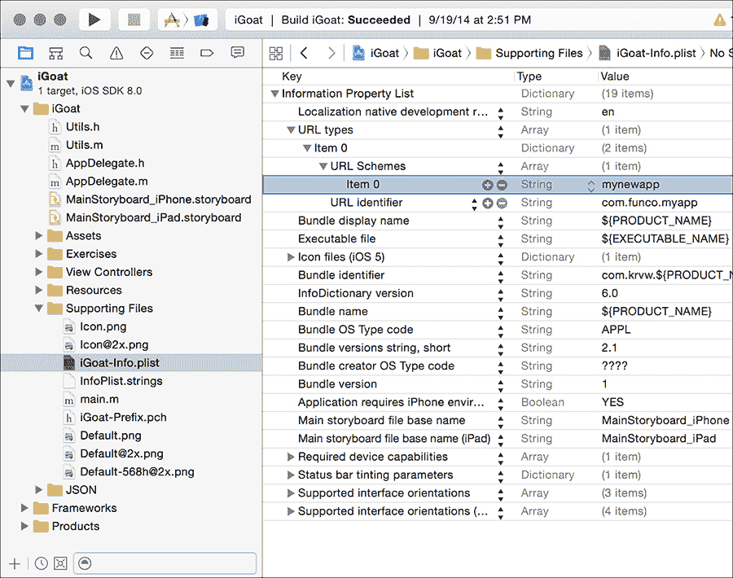
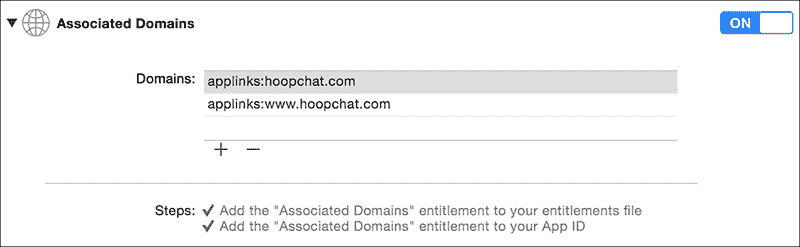
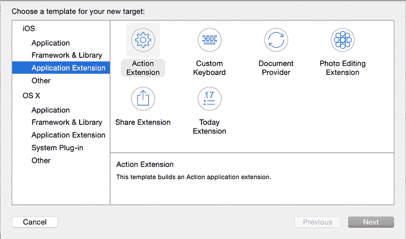
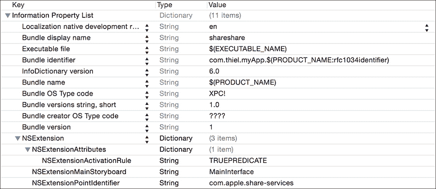

## 第八章：8

**进程间通信**

在 iOS 上，进程间通信（IPC）从不同的角度看，可以是令人耳目一新简单，也可以是极为有限的。我个人更倾向于认为它是前者。尽管 Android 拥有灵活的 IPC 机制，如 Intents、Content Providers 和 Binder，但 iOS 的系统则较为简单，基于两种组件：通过 URL 传递消息和应用程序扩展。消息传递帮助其他应用程序和网页通过外部提供的参数调用您的应用程序。应用程序扩展旨在扩展基础系统的功能，提供诸如共享、存储以及改变“今日”屏幕或键盘功能的服务。

在本章中，您将学习如何在 iOS 上实现进程间通信（IPC）的各种方法，了解人们常犯的 IPC 错误，以及如何在不妥协用户安全的前提下，规避系统的一些限制。

### URL 方案和 openURL 方法

iOS 提供的官方 IPC 机制是通过 URL 方案，这与桌面系统上的协议处理程序（如 `mailto:`）类似。

在 iOS 上，开发者可以定义一个 URL 方案，指示他们的应用程序响应该方案，其他应用程序（或网页，尤其重要）可以通过将参数作为 URL 参数传递，来调用该应用程序。

#### *定义 URL 方案*

自定义 URL 方案在项目的 *Info.plist* 文件中描述。要添加新方案，您可以使用 Xcode 的 plist 编辑器，如图 8-1 所示。



*图 8-1：在 Xcode plist 编辑器中定义 URL 方案*

首先，您需要添加 URL 类型键，这将创建一个名为 Item 0 的子键。URL 标识符的子键将自动创建，应该用反向 DNS 标记的字符串填充，例如 `com.mycompany.myapp`。然后，您在 Item 0 下创建一个新的子键，即 URL Schemes 键。在 Item 0 下的 URL Schemes 下，输入您希望其他应用程序调用您的应用程序的方案。例如，在这里输入 `mynewapp`，您的应用程序就会响应 *mynewapp://* 的 URL。

您还可以通过使用外部编辑器手动在 plist 文件中定义这些 URL 方案，如示例 8-1 所示。

```
<?xml version="1.0" encoding="UTF-8"?>
<!DOCTYPE plist PUBLIC "-//Apple//DTD PLIST 1.0//EN" "http://www.apple.com/DTDs/
     PropertyList-1.0.dtd">
<plist version="1.0">
<dict>
  <key>CFBundleDevelopmentRegion</key>
  <string>en</string>
  <key>CFBundleURLTypes</key>
  <array>
    <dict>
      <key>CFBundleURLSchemes</key>
      <array>
        <string>com.funco.myapp</string>
      </dict>
    </array>
    <key>CFBundleDisplayName</key>
    <string>${PRODUCT_NAME}</string>
    <key>CFBundleExecutable</key>
    <string>${EXECUTABLE_NAME}</string>
```

*示例 8-1：在 plist 中显示的 URL 方案*

粗体部分表示在图 8-1 中创建 URL 方案后对原始 plist 文件所做的修改。了解这个文件中的内容，以便在检查一个新的陌生代码库时，能快速使用 grep 查找所需的信息。当您寻找自定义 URL 方案时，应该查找 `CFBundleURLSchemes` 键。

一旦您定义了一个 URL 方案或发现了一个您想要交互的 URL 方案，您就需要实现代码来进行或接收 IPC 调用。幸运的是，这相对简单，但仍然有一些陷阱需要注意。接下来，我们将看看它们。

#### *发送和接收 URL/IPC 请求*

要通过 URL 协议发送消息，只需创建一个包含你希望调用的 URL 的 `NSString` 对象的 `NSURL` 对象，然后调用 `openURL:` 方法 `[UIApplication sharedApplication]`。以下是一个示例：

```
NSURL *myURL = [NSURL URLWithString:@"someotherapp://somestuff?someparameter=avalue
     &otherparameter=anothervalue"];

[[UIApplication sharedApplication] openURL:myURL];
```

接收应用程序的键和值通过类似于 HTTP URL 的方式传递，使用 `?` 表示参数，`&` 分隔键值对。唯一的例外是，在 `?` 前不需要任何文本，因为你并不是在与远程站点进行通信。

接收应用程序随后可以使用标准的 `NSURL` 对象属性提取 URL 的任何组件，（^(1)）如 `host`（在我的示例中是 `somestuff`），或者 `query`（你的键值对）。

#### *验证 URL 和认证发送者*

当接收应用程序通过其自定义 URL 协议被调用时，它可以选择验证是否希望首先打开该 URL，使用 `application:didFinishLaunchingWithOptions:` 方法或 `application:will-FinishLaunchingWithOptions:` 方法。应用程序通常使用前者，如在 清单 8-2 中所示。

```
- (BOOL)application:(UIApplication *)application didFinishLaunchingWithOptions:(NS
     Dictionary *)launchOptions {

    if ([launchOptions objectForKey:UIApplicationLaunchOptionsURLKey] != nil) {
        NSURL *url = (NSURL *)[launchOptions valueForKey:UI
     ApplicationLaunchOptionsURLKey];
        if ([url query] != nil) {
            NSString *theQuery = [[url query]
     stringByReplacingPercentEscapesUsingEncoding:NSUTF8StringEncoding];
            if (![self isValidQuery:theQuery]) {
                return NO;
            }
            return YES;
        }
    }
}
```

*清单 8-2：在* `didFinishLaunchingWithOptions` 中验证 URL

如果返回 YES，`openURL` 方法将使用提供的 URL 被调用。在 `openURL` 方法中，传递的数据（如果有）将被解析，并且 `openURL` 会根据应用程序的反应做出决策。该方法也是你可以根据调用你应用程序的应用程序做出决策的地方。清单 8-3 显示了一个可能的 `openURL` 方法的示例。

```
   - (BOOL)application:(UIApplication *)application openURL:(NSURL *)url
        sourceApplication:(NSString *)sourceApplication annotation:
        (id)annotation {

➊     if ([sourceApplication isEqualToString:@"com.apple.mobilesafari"]) {
           NSLog(@"Loading app from Safari");
           return NO; // We don't want to be called by web pages
       }
       else {
➋         NSString *theQuery = [[url query]
        stringByReplacingPercentEscapesUsingEncoding:NSUTF8StringEncoding];
➌         NSArray *chunks = [theQuery componentsSeparatedByString:@"&"];
           for (NSString* chunk in chunks) {
➍              NSArray *keyval = [chunk componentsSeparatedByString:@"="];
➎              NSString *key = [keyval objectAtIndex:0];
               NSString *value = [keyval objectAtIndex:1];
➏              // Do something with your key and value
               --snip--
               return YES;
           }
       }
   }
```

*清单 8-3：解析由* `openURL` 接收到的数据

在 ➊，该方法检查源应用程序是否来自标识 Mobile Safari 的捆绑 ID；由于该应用程序仅用于接收来自其他应用程序的输入，因此它返回 `NO`。如果你的应用程序只希望由特定应用程序打开，你可以将其限制为一个有效的捆绑 ID。

在 ➋，输入内容被解码，以防其中包含 URL 编码字符（如 `%20` 代表空格）。在 ➌ 和 ➍，单独的键值对被分开，并进一步分解成键值对。在 ➎，获取第一个键值对，并对其进行解析，以告知任何可能编写的逻辑，在 ➏ 处进行处理。

实际查询字符串的解析和验证将取决于你接收到的数据类型。如果你期待的是一个数字值，你也可以使用正则表达式来确保字符串只包含数字。以下是你可能会在 `openURL` 方法中添加的检查示例：

```
NSCharacterSet* notNumeric = [[NSCharacterSet decimalDigitCharacterSet] invertedSet
     ];
if ([value rangeOfCharacterFromSet:notDigits].location != NSNotFound) {
    return NO; // We didn't get a numeric value
}
```

只验证通过基于 URL 的 IPC 接收到的任何参数，确保它们仅包含你预期的数据类型。如果你使用这些参数来构建数据库查询或更改 HTML 内容，务必确保你在清理数据并正确集成内容。我将在 第十二章 中详细讲解。

##### 注意过时的验证代码

请注意，你有时会在某些代码库中看到过时的（但命名更合理的）`handleOpenURL` 方法；参见示例 8-4 了解示例。

```
- (BOOL)application:(UIApplication *)application handleOpenURL:(NSURL *)url
```

*示例 8-4：处理接收到的 URL 的过时方法*

在许多情况下，使用`handleOpenURL`并不理想，因为该方法会盲目地打开任何给定的 URL，且没有提供任何方法来识别该 URL 的来源。当然，验证源应用程序只能提供有限的保障。

##### 发送者验证有多安全？

鉴于我在本节中讨论的内容，你可能会想知道是否能够完全信任`sourceApplication`参数的值。好问题！虽然发送者检查只是字符串比较，并不直接涉及加密，但 Apple 确保所有提交到 App Store 的应用程序 ID 都是唯一的：先到先得。然而，在越狱设备上，你无法保证这种唯一性，因此不要盲目信任声称来自某个特定应用的 URL。

#### *URL Scheme 劫持*

我描述的相对简单的 URL scheme 定义系统有一个潜在的问题。如果另一个应用程序尝试注册你的 URL scheme 会怎么样？对于 Apple 内建的应用程序，其他应用程序无法成功注册重复的 scheme。然而，对于其他应用程序，结果行为是...未定义的。你可以问问 Apple：

如果多个第三方应用注册了相同的 URL scheme，目前没有办法确定哪个应用会处理该 scheme。^(2)

换句话说，你面临两种不愉快的可能性。首先，安装在你应用程序之前的恶意应用可能会注册你的 URL scheme，并在你应用程序安装后仍然保留它。或者，安装在你应用程序之后的恶意应用可能会成功注册你的 URL scheme，实际上劫持了你的应用程序的 URL scheme。这两种情况都可能导致原本应该发送给你应用程序的数据被发送到恶意的第三方应用。你能做什么？等我想明白了再告诉你。

然而，在 iOS 的最新版本中，已经提供了用于应用程序之间传递数据的替代机制，每种机制适用于不同的情况。对于你的应用来说，这些可能比`openURL`更合适。现在让我们来看一下这些较新的方法。

### 通用链接

URL 协议劫持是苹果在 iOS 9 中引入*通用链接*的原因之一。通用链接是一种有效提供 iOS 应用深度链接的方式，并且可以实现网站与移动应用的集成。例如，假设你发布了一款即时通讯应用叫做 HoopChat。如果用户访问一个网站，上面有一个“在 HoopChat 中给我发消息！”的按钮，这个按钮可以链接到一个像 *[`www.hoopchat.com/im/send/?id=356372`](https://www.hoopchat.com/im/send/?id=356372)* 的 URL。如果用户点击这个链接并且安装了你的应用，链接将直接在应用中打开，应用可以为用户 ID 为 356372 的人创建一条新消息。如果用户没有安装应用，同样的 URL 会在移动 Safari 中打开，带你到一个基于 Web 的界面来发送消息。

在幕后，这一工作方式是应用具有一个权限，指定它如何处理指向特定域的链接，如 图 8-2 所示。



*图 8-2：在 Xcode 中启用与关联域的通用链接*

当访问这些域中的一个时，在移动 Safari 中会从 Web 服务器下载一个名为 *apple-app-site-association* 的文件。这个文件是一个已签名的 JSON 数据块，如 列表 8-5 所示。

```
   {
      "applinks": {
         "apps": [],
         "details": {
➊          "FAFBQM3A4N.com.hoopchat.messenger": {
➋            "paths": [ "*" ]
            }
         }
      }
   }
```

*列表 8-5：* apple-app-site-association *文件格式*

该文件指定了开发者团队 ID、捆绑标识符（在 ➊ 处显示）以及应由应用处理的 URL 路径（与主网站不同）。在这种情况下，如果应用已安装，则所有 URL 应由应用处理，因此文件在 ➋ 处给出了 `*` 的值。

如前所述，这个二进制文件需要签名；签名密钥实际上是你的生产 SSL 证书的私钥。如果你拥有网站的私钥和公钥，你可以通过命令行签署 JSON 文件，如 列表 8-6 所示。

```
   openssl smime \
       -sign \
       -nodetach \
➊     -in "unsigned.json" \
➋         -out "apple-app-site-association" \
       -outform DER \
➌         -inkey "private-key.pem" \
➍         -signer "certificate.pem"
```

*列表 8-6：签署* apple-app-site-association *文件*

这个示例使用 `openssl` 工具，将未签名的 JSON 文件提供给 ➊ 处，并提供输出文件名 ➋。在 ➌ 和 ➍ 处提供密钥对。如果你的密钥受到密码保护，系统会提示你输入密码，你将获得一个有效的 *apple-app-site-association* 文件作为输出。然后，这个文件会上传到你网站的根目录，iOS 会通过 HTTPS 获取它，确定是否将 URL 传递给你的应用。在应用内，应用在接收到通用链接后采取什么操作，将取决于你在应用代理的 `application:continueUserActivity:restorationHandler:` 方法中实现的逻辑。

这种通用链接方式比自定义 URL 处理方案更为优越，原因有几个。首先，通用链接不受 URL 方案劫持的影响；只有你的网站（通过 HTTPS 认证）可以指定哪些 URL 将在你的应用程序中打开，而且这些调用不能被发送到其他的 Bundle ID。其次，无论应用是否安装，链接都应该能正常工作。在 iOS 的早期版本中，如果应用未安装，你会得到一个错误提示，表示该方案无法识别。而通过通用链接，如果应用未安装，你会被重定向到相应的网站。最后，通用链接提供了一些隐私保护，防止应用程序枚举设备上有哪些应用程序（以前应用可以通过`canOpenURL`方法枚举已安装的应用；而使用通用链接后，不再存在这种机制）。

现在你已经了解了如何控制与你自己的应用程序的交互，让我们看看如何通过`UIActivity`更深入地将你的应用程序与流行的应用和服务进行集成。

### 通过 UIActivity 共享数据

在 iOS 6 中，苹果开始允许第三方应用通过一组预定义的方法共享信息，如通过电子邮件发送数据或发布到 Facebook。这个有限的进程间通信（IPC）形式让开发者能够实现最基本的共享功能。你可以通过检查以下`UIActivity`类型，了解这种方法适用于哪些类型的数据：

• `UIActivityTypePostToFacebook`

• `UIActivityTypePostToTwitter`

• `UIActivityTypePostToWeibo`

• `UIActivityTypePostToTencentWeibo`

• `UIActivityTypePostToFlickr`

• `UIActivityTypePostToVimeo`

• `UIActivityTypeMessage`

• `UIActivityTypeMail`

• `UIActivityTypePrint`

• `UIActivityTypeCopyToPasteboard`

• `UIActivityTypeAssignToContact`

• `UIActivityTypeSaveToCameraRoll`

• `UIActivityTypeAddToReadingList`

• `UIActivityTypeAirDrop`

要通过`UIActivity`进行分享，只需创建一个`UIActivityViewController`并传递数据，如文本、URL、图片等，具体请参见清单 8-7。

```
NSString *text = @"Check out this highly adequate iOS security resource";
NSURL *url = [NSURL URLWithString:@"http://nostarch.com/iossecurity/"];

UIActivityViewController *controller = [[UIActivityViewController alloc]
                            initWithActivityItems:@[text, url]
                            applicationActivities:nil];

[navigationController presentViewController:controller animated:YES completion:nil
     ];
```

*清单 8-7：实例化一个* `UIActivityViewController`

这里，`UIActivityViewController`被传递了一些文本和一个 URL。如果某些分享方式不适用于该数据，你可以排除它们。例如，如果你希望确保用户只能通过邮件或打印内容，而不能分享到社交网络，你可以告诉`UIActivityViewController`排除所有其他已知的分享类型，如清单 8-8 所示。

```
[controller setExcludedActivityTypes:@[UIActivityTypePostToFacebook,
                                       UIActivityTypePostToTwitter
                                       UIActivityTypePostToWeibo
                                       UIActivityTypePostToTencentWeibo
                                       UIActivityTypePostToFlickr
                                       UIActivityTypePostToVimeo
                                       UIActivityTypeMessage
                                       UIActivityTypeCopyToPasteboard
                                       UIActivityTypeAssignToContact
                                       UIActivityTypeSaveToCameraRoll
                                       UIActivityTypeAddToReadingList
                                       UIActivityTypeAirDrop];
```

*清单 8-8：排除某些类型的共享活动*

不幸的是，这种排除方法并不方便或彻底，未来版本的 iOS 中新增的任何共享类型都会默认包含在内。如果禁用某些共享 UI 部分很重要，请确保在这些版本正式发布之前，使用最新版本的 iOS 进行测试。

除了 URL 方案和`UIActivity`方法外，在 iOS 中还有另一种处理 IPC 的方式：通过扩展。

### 应用扩展

在 iOS 8 及更高版本中，开发者可以编写各种*扩展*，它们表现得像是专门的进程间通信（IPC）形式。这些扩展允许您向其他应用程序展示数据，或者通过您的应用程序共享数据，或更改系统行为。表 8-1 显示了您可以为其编写的各种*扩展点*。扩展点定义了扩展将访问操作系统的哪个组件以及如何进行编码。

**表 8-1：** 扩展点

| **类型** | **功能** |
| --- | --- |
| 今日 | 操作通知中心今日视图中的小部件 |
| 分享 | 允许通过分享按钮将数据发送到您的应用程序 |
| 动作 | 读取或操作要返回给主机应用程序的数据 |
| 照片 | 提供在“照片”应用中操作照片的方法 |
| 文档提供者 | 允许访问文件库 |
| 键盘 | 提供自定义键盘 |

虽然应用扩展不是独立的应用程序，但它们必须与一个应用程序捆绑在一起，称为*容器应用程序*。使用扩展的第三方应用程序（称为*主机应用程序*）可以与捆绑在容器应用程序中的扩展进行通信，但容器应用程序本身不会直接与扩展通信。苹果公司还明确排除了某些功能不允许通过扩展访问，例如使用 HealthKit API、接收 AirDrop 数据或访问摄像头或麦克风。

扩展可以通过多种方式实现，它们也可以被视为独立的应用程序。如图 8-3 所示，扩展作为独立的应用程序在 Xcode 中创建。



*图 8-3：将新的扩展目标添加到项目中*

然而，在本书中，我们将重点关注从安全角度检查最重要的方面。

#### *检查应用是否实现了扩展*

首先，您可以通过在属性列表中搜索`NSExtensionPointIdentifier`来轻松判断您正在检查的应用程序是否实现了扩展。要搜索该属性，您可以在项目的*根*目录中执行以下命令：

```
$ find . -name "*.plist" |xargs grep NSExtensionPointIdentifier
```

这会在目录中搜索所有*.plist*文件以查找`NSExtensionPointIdentifier`。您还可以通过在 Xcode 中检查*.plist*文件来查找该属性，如图 8-4 所示。



*图 8-4：新创建的扩展的*Info.plist*文件，在 Xcode 中查看*

扩展的*Info.plist*文件将包含正在使用的扩展类型，以及可选的扩展设计来处理的数据类型定义。如果您发现定义了`NSExtensionPointIdentifier`属性，您应该深入项目，找到该扩展的视图控制器。

#### *限制和验证可共享数据*

对于分享和操作扩展，您可以定义一个`NSExtensionActivationRule`，其中包含一个数据类型字典，限制您的应用程序只能处理这些数据类型（参见图 8-5）。


*图 8-5：扩展的激活规则，位于 Xcode 中查看的*.plist *文件*

这个字典将被评估，以确定您的扩展允许哪些数据类型，以及您将接受这些项的最大数量。但是，应用程序不仅限于接受预定义的数据类型；它们还可以实现自定义`NSPredicate`来定义它们自己的接受规则。如果是这种情况，您将看到`NSExtensionActivationRule`以字符串形式表示，而不是数字值。

如果你知道自己正在处理预定义的数据类型，请记住以下预定义的激活规则：

• `NSExtensionActivationSupportsAttachmentsWithMaxCount`

• `NSExtensionActivationSupportsAttachmentsWithMinCount`

• `NSExtensionActivationSupportsFileWithMaxCount`

• `NSExtensionActivationSupportsImageWithMaxCount`

• `NSExtensionActivationSupportsMovieWithMaxCount`

• `NSExtensionActivationSupportsText`

• `NSExtensionActivationSupportsWebURLWithMaxCount`

• `NSExtensionActivationSupportsWebPageWithMaxCount`

由于扩展通常会接收未知和任意类型的数据，因此确保扩展在其视图控制器的`isContentValid`方法中执行正确的验证非常重要，尤其是在分享或操作扩展中。检查应用程序在实现该方法时的逻辑，确定应用程序是否执行了所需的验证。

通常，扩展会检查`NSExtensionContext`（这是当主机应用调用`beginRequestWithExtensionContext`时传递的），如示例 8-9 所示。

```
NSExtensionContext *context = [self extensionContext];
NSArray *items = [context inputItems];
```

*示例 8-9：从`NSExtensionContext`创建`NSExtensionItem`数组*

这将提供一个`NSExtensionItem`对象数组，每个对象将包含主机应用程序传递的不同类型数据，例如图像、URL、文本等。在使用这些数据执行操作或允许用户发布数据之前，应该对每个项目进行检查和验证。

#### *防止应用程序与扩展交互*

键盘扩展具有独特的特点，它们会读取用户输入的每个按键。不同的第三方键盘可能会有不同程度的按键记录功能，以帮助自动完成或将数据发送到远程 Web 服务进行处理。也有可能会分发恶意键盘，作为纯粹的按键记录器。如果您的应用程序通过键盘接受安全敏感数据，您可能希望阻止在您的应用程序中使用第三方键盘。您可以通过`shouldAllowExtensionPointIdentifier`代理方法来实现这一点，如示例 8-10 所示。

```
- (BOOL)application:(UIApplication *)application
     shouldAllowExtensionPointIdentifier:(NSString *)extensionPointIdentifier {
    if ([extensionPointIdentifier isEqualToString:UI
     ApplicationKeyboardExtensionPointIdentifier]) {
        return NO;
    }
    return YES;
}
```

*清单 8-10：* `shouldAllowExtensionPointIdentifier` *委托方法*

这段代码简单地检查`extensionPointIdentifier`的值，如果它与常量`UIApplicationKeyboardExtensionPointIdentifier`匹配，则返回`NO`。请注意，目前只有第三方键盘是可以通过这种方式禁用的扩展。

你已经看到了实现 IPC 的最佳方法，为了结束这一章，我将带你了解一种可能在实际应用中出现的 IPC 方法，但它并不太成功。

### 一个失败的 IPC 黑客：粘贴板

偶尔会有报告提到有人滥用`UIPasteboard`机制作为一种 IPC 通道。例如，有些人尝试使用它将用户的数据从应用程序的免费版本转移到“专业”版本，因为新安装的应用程序无法读取旧应用程序的数据。不要这样做！

设计用于与 Twitter 一起工作的 OAuth 库^(3)使用通用粘贴板作为一种机制，将身份验证信息从网页视图传递到应用程序的主部分，如下例所示：

```
   - (void) pasteboardChanged: (NSNotification *) note {
➊     UIPasteboard *pb = [UIPasteboard generalPasteboard];

       if ([note.userInfo objectForKey:UIPasteboardChangedTypesAddedKey] == nil)
        return;
       NSString *copied = pb.string;

       if (copied.length != 7 || !copied.oauthtwitter_isNumeric) return;
➋     [self gotPin:copied];
   }
```

在➊读取通用粘贴板的数据后，该库会验证数据并将其发送到➋处的`gotPin`方法。

但是通用粘贴板是所有应用程序共享的，并且设备上的任何进程都可以读取它。这使得粘贴板成为存储任何类似私密数据的地方特别不安全。我将在第十章中详细讲解粘贴板，但现在，请确保你正在检查的应用程序不会把任何你不希望其他应用程序知道的东西放到粘贴板上。

### 结语

虽然 iOS 中的 IPC 看似有限，但开发者往往会遇到无法解析外部输入、创建新的数据泄露，甚至可能将数据发送到错误的应用程序的情况。确保分享被适当限制，接收到的数据经过验证，发送的应用程序经过验证，并且不要仅仅相信接收 URL 处理程序就是你预期的那个，从而避免传递未加密的数据。
