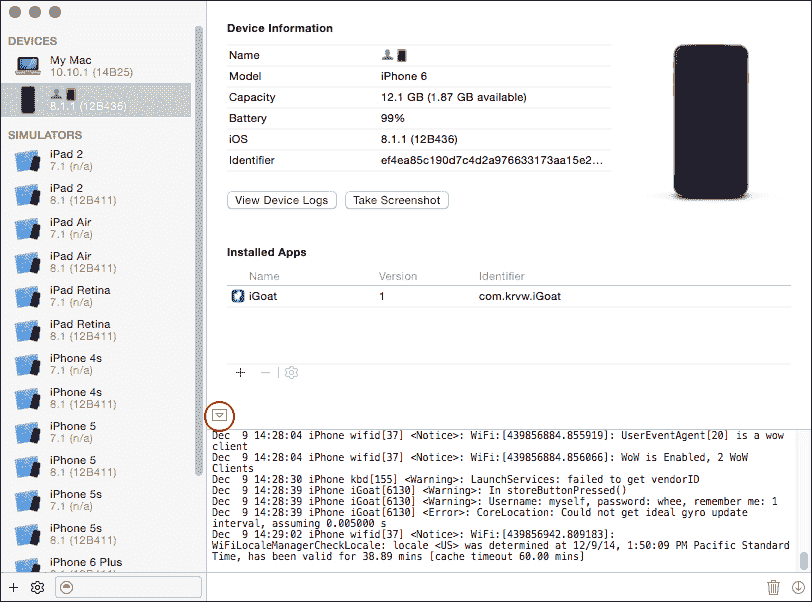
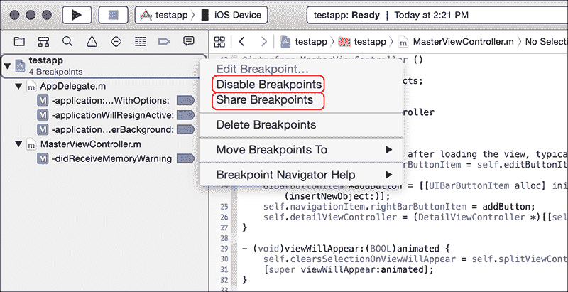
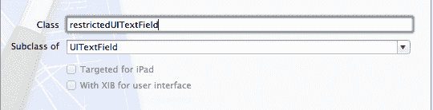
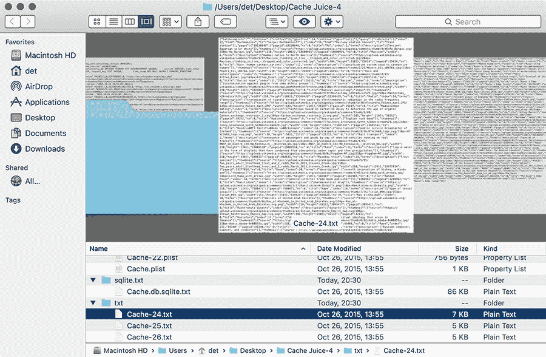
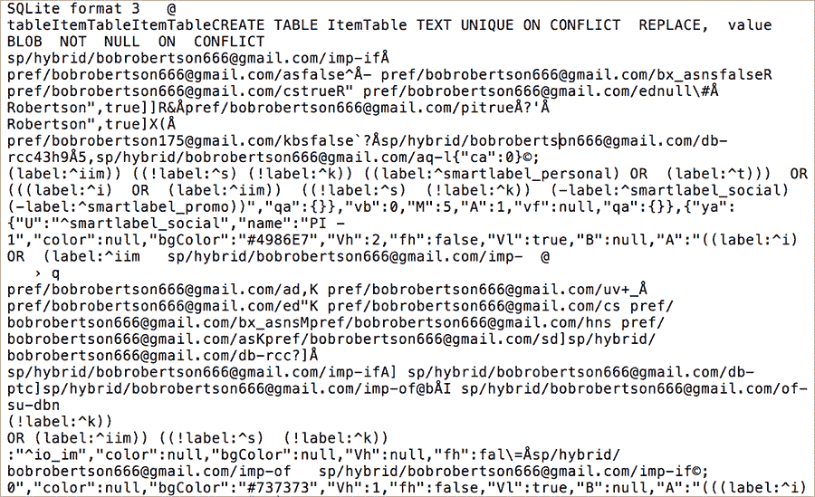
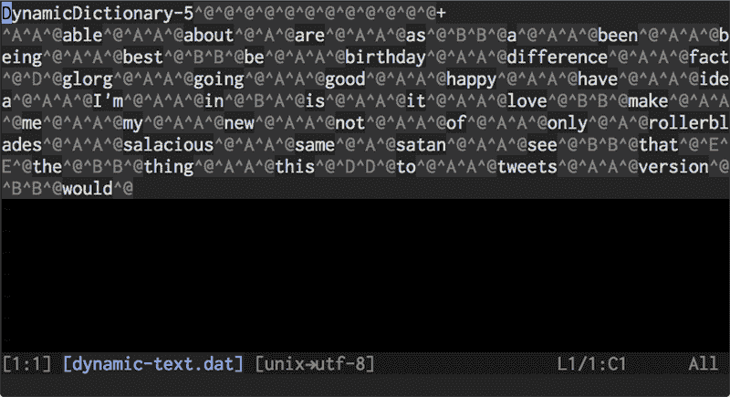
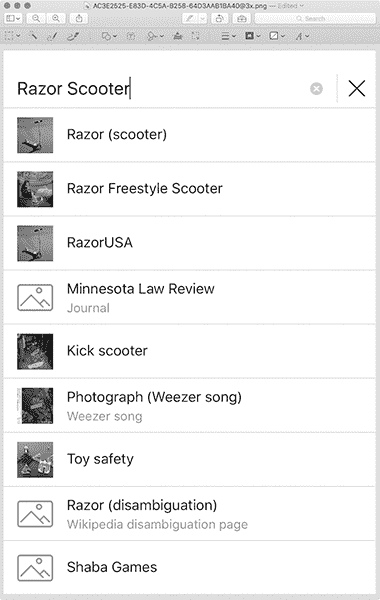
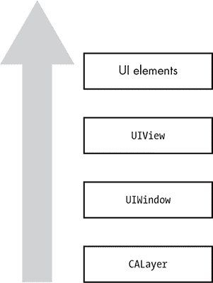
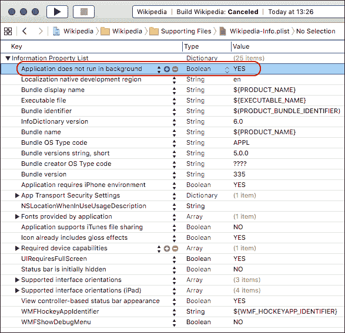

## 第十章：10

**数据泄露**

数据盗窃在移动设备领域是一个严重的隐患，因为包含重要个人和商业数据的设备常常会丢失或被盗。这里需要关注的主要威胁是取证攻击者，因此请特别小心，确保这些数据以无法被物理攻击者或被攻击的设备轻易提取的格式保存。不幸的是，对于哪些 API 实际上会存储敏感数据，存在很多混淆，这是可以理解的，因为很多行为并未文档化。

在本章中，我将探讨数据如何从您的应用程序泄露到设备的隐秘角落——甚至可能不小心同步到像 iCloud 这样的远程服务。您将学习如何在设备或自己的模拟器应用程序目录结构中搜索泄露的数据，以及如何防止这些泄露的发生。

### NSLog 和 Apple 系统日志的真相

多年来，开发者一直使用 `printf` 来输出基本的调试信息。在 iOS 中，`NSLog` *看起来* 是等效的，并且经常被这样使用。然而，`NSLog` 并不仅仅是将输出写入 Xcode 控制台，正如大多数人认为的那样。它的目的是将错误信息记录到 Apple 系统日志（ASL）设施中。以下是 Apple 的说法：

服务器接收到的消息会保存在数据存储中（受到输入过滤约束）。这个 API 允许客户端创建查询，并在消息数据存储中搜索匹配的消息。^(1)

所以，也许 `NSLog` 最好被视为 `printf` 和 `syslog` 之间的混合体，当调试时，它会在 Xcode 控制台中输出消息，并且在设备上时会将消息发送到全局系统日志。因此，可以推断，`NSLog` 记录的数据将可以被任何物理接触到设备的人检索，类似于其他缓存的应用数据。

阅读日志不需要特殊的工具。只需将 iOS 设备连接到 Mac，打开 Xcode，选择 **窗口** → **设备**，然后点击您的设备。设备的系统日志可能最初在控制台中不可见。如果不可见，点击面板左下角的那个小箭头。图 10-1 显示了如何通过设备窗口查看控制台日志的示例。



*图 10-1：Xcode 中的设备窗口*

苹果的系统日志设施有一个独特之处，使其与传统的 UNIX syslog 设施不同：你可以创建查询来搜索 ASL 中的现有数据。在 iOS 7 之前的版本中，这个功能无论是哪个应用最初提交了数据都能工作，这意味着任何一个应用记录的信息都可以被设备上的其他应用读取。任何应用程序也可以通过编程方式读取 ASL，正如 Oliver Drobnik 在 Cocoanetics 博客中所描述的那样^(2)。事实上，有几个应用程序使用这个 API 充当系统日志查看器。

在 iOS 7 及更高版本中，这一缺陷的影响已大大减轻，因为应用程序只能访问自己的日志。然而，所有应用程序的日志仍然可以通过物理访问设备读取，只要该设备与另一台计算机建立了信任关系（或者攻击者越狱了设备）。

由于在某些情况下日志信息可能会泄漏，你需要格外小心，以确保敏感信息不会出现在系统日志中。例如，我曾见过包含类似清单 10-1 中那种可怕代码的应用程序。

```
NSLog(@"Sending username \%@ and password \%@", myName, myPass);
```

*清单 10-1：请不要这么做。*

如果你将用户名、密码等信息发送到`NSLog`，实际上是在泄露用户的私密信息，这种行为是不道德的。为了弥补这一点，请停止滥用`NSLog`；在发布应用给用户之前，将其从代码中去除。

#### *在发布版本中禁用 NSLog*

去除`NSLog`输出的最简单方法是使用一个变参宏（清单 10-2），它会使得`NSLog`在 Xcode 的 Debug 模式之外变为无操作（no-op）。

```
#ifdef DEBUG
#   define NSLog(...) NSLog(__VA_ARGS__);
#else
#   define NSLog(...)
#endif
```

*清单 10-2：在非调试版本中禁用 NSLog*

尽管`NSLog`看起来很糟糕，但包含`NSLog`的应用程序*确实*可以进入 App Store。虽然这一情况可能会在某个时刻发生变化，但你不能依赖苹果来检测应用程序是否在记录你不打算公开的信息，也不能依赖苹果阻止其他应用读取这些日志数据。

#### *改用断点操作进行日志记录*

另一种选择是使用断点操作进行日志记录，正如我在第五章中提到的那样。在这种情况下，你实际上是通过调试器进行日志记录，而不是程序本身。这在某些情况下更为方便，并且在部署时不会将数据写入系统日志，从而减少了将启用日志记录的代码发布到生产环境中的风险。掌握如何使用这些操作，对未来的调试工作也会有帮助。

断点操作存储在项目中，而不是源代码本身中。它们也是用户特定的，因此你只会看到你关心的断点和日志操作，而不会让团队中的每个人都用日志语句弄乱代码库。但在需要时，Xcode 允许你与其他用户共享你的断点，使它们成为主项目的一部分（见图 10-2）。

你还可以轻松启用或禁用操作，并指定它们在断点被触发一定次数之前不输出。你甚至可以指定复杂的断点条件，定义何时执行相关的操作。

如果你想禁用项目中的所有断点，可以通过几种方式在 Xcode 中实现。你可以打开断点导航器，右键点击工作区图标（图 10-2），或使用快捷键 -Y。



*图 10-2：与其他用户共享断点并禁用 Xcode 中的所有断点*

虽然 `NSLog` 会将信息泄漏到磁盘上，供物理攻击者（以及在某些版本的 iOS 中的恶意应用）读取，但数据也可以通过更为瞬时的机制在应用之间泄漏，例如 iOS 粘贴板。让我们现在来看一下它们。

### 敏感数据如何通过粘贴板泄漏

iOS 粘贴板是一个灵活的机制，用于在应用之间或应用内部共享任意数据。通过粘贴板，你可以在应用之间共享文本数据或序列化对象，并可以选择将这些粘贴板持久化到磁盘上。

#### *无限制的系统粘贴板*

系统有两个默认的粘贴板：`UIPasteboardNameGeneral` 和 `UIPasteboardNameFind`。前者是几乎所有应用在使用剪切、复制或粘贴菜单项时默认读取和写入的粘贴板，也是你希望在第三方应用之间共享数据时选择的粘贴板。后者是一个特殊的粘贴板，用于存储最后一次在 `UISearchBar` 中输入的搜索字符串的内容，因此应用可以自动识别用户在其他应用中搜索的内容。

**注意**

*与官方描述的`*UIPasteboardNameFind*`相反，这个粘贴板在现实中从未被使用过。这个错误已被苹果承认，但尚未修复，也没有更新文档。作为一名安全顾问，我只能希望它会被修复，这样我就可以抱怨它是一个安全漏洞。*

重要的是要记住，系统剪贴板 *没有* 访问控制或限制。如果你的应用程序将某些内容存储在剪贴板上，任何应用都可以访问、删除或篡改这些数据。这种篡改可能来自后台运行的进程，定期轮询剪贴板内容以窃取敏感数据（参见 Osamu Noguchi 的 UIPasteBoardSniffer^(3)，展示了这种技术）。因此，你需要特别小心，特别是在 `UIPasteboardNameGeneral` 和其他剪贴板中存储的内容。

#### *自定义命名剪贴板的风险*

自定义命名的剪贴板有时被称为 *私有* 剪贴板，这其实是一个不恰当的称呼。虽然应用程序可以创建自己的剪贴板供内部使用或与其他特定应用共享，但在 iOS 7 之前的版本中，自定义剪贴板是 *公共的*，只要名称已知，任何程序都可以使用它们。

自定义剪贴板通过 `pasteboardWithName` 创建，在 iOS 7 及更高版本中，`pasteboardWithName` 和 `pasteboardWithUniqueName` 是特定于应用组内所有应用的。如果应用组外的其他应用尝试创建一个已经在使用的名字的剪贴板，它们将被分配一个完全独立的剪贴板。然而，值得注意的是，两个系统剪贴板仍然可以被任何应用访问。鉴于许多设备无法升级到 iOS 6，更不用说 iOS 7，你应当仔细检查在不同版本的 iOS 中如何使用自定义剪贴板。

使用自定义剪贴板的一件事是，可以通过将 `persistent` 属性设置为 `YES` 来标记它在重启后仍然存在。这将导致剪贴板内容被写入 *$SIMPATH/Devices/<设备 ID>/data/Library/Caches/com.apple.UIKit.pboard/pasteboardDB*，与其他应用程序的剪贴板一起存储。列表 10-3 显示了你可能会在 *pasteboardDB* 文件中看到的一些数据。

```
<?xml version="1.0" encoding="UTF-8"?>
<!DOCTYPE plist PUBLIC "-//Apple//DTD PLIST 1.0//EN" "http://www.apple.com/DTDs/
     PropertyList-1.0.dtd">
<plist version="1.0">
<array>
        <integer>1</integer>
        <dict>
                <key>bundle</key>
                <string>com.apple.UIKit.pboard</string>
                <key>items</key>
                <array/>
                <key>itemsunderlock</key>
                <array/>
                <key>name</key>
                <string>com.apple.UIKit.pboard.find</string>
                <key>persistent</key>
                <true/>
        </dict>

    --snip--

        <dict>
                <key>bundle</key>
                <string>com.apple.UIKit.pboard</string>
                <key>items</key>
                <array>
                        <dict>
                                <key>Apple Web Archive pasteboard type</key>
                                <data>
                                bigbase64encodedblob==
                                </data>
                                <key>public.text</key>
                                <data>
                                aHR0cDovL2J1cnAvY2VydA==
                                </data>
                        </dict>
                </array>
                <key>itemsunderlock</key>
                <array/>
                <key>name</key>
                <string>com.apple.UIKit.pboard.general</string>
                <key>persistent</key>
                <true/>
        </dict>
</array>
</plist>
```

*列表 10-3：com.apple.UIKit.pboard/pasteboardDB 文件的可能内容*

base64 编码的二进制数据 `bigbase64encodedblob`（太大，无法完整包含）和 `aHR0cDovL2J1cnAvY2VydA` 保存了剪贴板内容，任何能够读取 *pasteboardDB* 的应用程序都可以访问这些内容。还需要注意的是，剪贴板有不同类型：Apple Web Archive 剪贴板允许将整个网页存储，而 `public.text` 剪贴板则是一般剪贴板的文本内容。^(4)

#### *剪贴板数据保护策略*

为了最小化信息泄露的风险，最好仔细分析你希望通过使用剪贴板实现的行为。以下是一些你可以问自己的问题：

• 我是否希望用户将信息复制到其他应用程序中，还是他们仅需要在我的应用程序内移动数据？

• 剪贴板数据应该保留多久？

• 是否有应用程序中某些地方永远不应复制数据？

• 是否有应用程序部分永远不应接收粘贴的数据？

这些问题的答案将指导你在应用程序中如何处理剪贴板数据。你可以采用几种不同的方式来最小化数据泄露的风险。

##### 切换应用时清空剪贴板

如果你希望用户仅在你的应用程序内进行复制和粘贴，你可以在适当的事件中清空剪贴板，以确保当用户切换应用时数据不会留在剪贴板上。为此，可以在 `applicationDidEnterBackground` 和 `applicationWillTerminate` 事件中通过设置 `pasteBoard.items = nil` 来清空剪贴板。这样做不会阻止后台运行的应用程序读取剪贴板，但会缩短剪贴板上数据的存活时间，并阻止用户将数据粘贴到不应该粘贴的应用程序中。

请记住，清空剪贴板可能会干扰最终用户或其他应用程序出于不同目的使用的数据。你可能希望创建一个标志，指示是否有潜在敏感数据已写入剪贴板，并仅在特定条件下清空剪贴板。

##### 选择性禁止复制/粘贴

即便你确实希望允许用户复制和粘贴，有时也会有特定的地方需要禁止这一选项。例如，你可能想要防止用户粘贴 PIN 码或安全问题的答案（此类数据本不应出现在剪贴板上），但又允许用户从电子邮件中粘贴电子邮件地址。

**注意**

*这并不是说你应该使用安全问题，因为安全问题往往通过使用公开可得的信息作为认证工具，容易导致账户劫持。你将在《键盘记录与自动修正数据库》中详细了解这一点，见第 175 页。*

官方的方法是使用 `canPerformAction:withSender` 响应者方法来允许用户粘贴某些信息，并防止他们粘贴其他信息。^(5) 如图 10-3 所示，在 Xcode 中创建一个新类。



*图 10-3：创建* `restrictedUITextField` *子类*

然后，编辑 *restrictedUITextField.m* 并添加 `canPerformAction` 方法。

```
   #import "restrictedUITextField.h"

   @implementation restrictedUITextField

   - (id)initWithFrame:(CGRect)frame {
       self = [super initWithFrame:frame];
       if (self) {
           // Initialization code
       }
       return self;
   }

➊ -(BOOL)canPerformAction:(SEL)action withSender:(id)sender {
➋     if (action == @selector(cut:) || action == @selector(copy:))
           return NO;
       else
           return YES;
   }
   @end
```

*清单 10-4：将* `canPerformAction` *添加到* restrictedUITextField.m

在➊处，`canPerformAction`方法接收一个`action`选择器，可以检查该选择器以查看在➋处请求的操作类型。你可以使用`UIResponderStandardEditActions`协议中指定的任何方法。如果你希望完全禁用上下文菜单，当然可以在任何情况下都返回`NO`。

### 查找并修补 HTTP 缓存泄漏

你还会发现 URL 加载系统的缓存数据被存储在*<app ID>/Library/Caches/com.mycompany.myapp/Cache.db*文件中，这些文件对每个应用都是私有的，并且没有加密。HTTP 缓存可能包含通过 HTTP 获取的图像、URL 和文本，因此，如果被检查，可能会将敏感数据暴露给第三方。一个简单的办法是使用 File Juicer 将数据库拆解为普通的可读文件，这样你可以大致了解应用暴露的数据类型。你可以在*[`echoone.com/filejuicer/`](http://echoone.com/filejuicer/)*下载 File Juicer，图 10-4 展示了它提供的输出类型。



*图 10-4：检查缓存数据库的内容，按文件类型和目录分割，由 File Juicer 提供*

File Juicer 根据特定的文件类型将数据拆分为多个目录，这样你可以调查存储的图像、plist 文件、SQLite 数据库或其他二进制文件类型的纯文本转换。

一旦你了解了应用通过缓存数据暴露的数据类型，就可以考虑如何最佳地管理这些数据。

#### *缓存管理*

iOS 上的缓存管理有些复杂。有很多配置设置以及看似无穷无尽的方式来影响缓存策略。除此之外，平台尽力缓存并复制它能获取到的所有内容，以尝试改善用户体验。开发者需要判断哪些方法可以实现安全的缓存管理，但很容易让自己产生虚假的安全感。渗透测试者必须知道，哪些看似正确的做法实际上可能将敏感信息泄露到磁盘上。我们来谈谈所有不正确的缓存管理方式。

如我在第五章中提到的，文档化的移除缓存数据的方法`[NSURLCache removeAllCachedResponses]`仅仅从内存中移除缓存项。这对于安全目的来说基本没用，因为相同的信息仍然会保存在磁盘上，并且不会被移除。也许有更好的方法。

理想情况下，你永远不需要删除缓存，因为删除缓存意味着你一开始就进行了缓存操作。如果响应数据如此敏感，那为什么不干脆不缓存它呢？我们不妨试试看。

限制缓存响应的第一个地方是在`NSURLCache`配置中，如清单 10-5 所示。这个 API 允许你控制平台为缓存分配的内存和磁盘容量。

```
NSURLCache *urlCache = [[NSURLCache alloc] init];
[urlCache setDiskCapacity:0];
[NSURLCache setSharedURLCache:urlCache];
```

*清单 10-5：将磁盘缓存存储限制为零字节*

这个策略的问题在于，容量管理 API 并不打算作为安全机制。相反，这些配置是为了在内存或磁盘空间不足时为系统提供信息。`NSURLCache`文档^(6) 指出，只有在必要时，磁盘和内存中的缓存才会被缩减到配置的大小。

所以你不能完全相信配置缓存容量。那么，设置缓存策略为`NSURLRequestReloadIgnoringLocalCacheData`，强制 URL 加载系统忽略任何缓存响应并重新获取数据怎么样？下面是这种方法的实现：

```
NSURLRequest* req = [NSURLRequest requestWithURL:aURL
              cachePolicy:NSURLRequestReloadIgnoringLocalCacheData
          timeoutInterval:666.0];
   [myWebView loadRequest:req];
```

但是这个策略并没有隐含地阻止响应被缓存；它只是阻止了仅在后续请求中*检索*缓存响应的 URL 加载系统。任何先前缓存的响应将继续保存在磁盘上，这会导致问题，尤其是如果你的初始应用实现允许缓存的话。没有办法。

正如我所尝试演示的那样，如果你依赖系统默认的 Web 视图缓存管理，你可能只是在实施许多实际上并不能保护用户的预防措施。如果你想可靠地控制应用程序缓存的内容，你需要自己来做。幸运的是，这其实并不困难。

Cocoa Touch API 允许开发者在响应被缓存之前，按请求逐个操作响应，可以使用`[NSURLConnection connection:willCacheResponse:]`方法。如果你不想缓存数据，可以实现委托方法，如列表 10-6 所示。

```
-(NSCachedURLResponse *)connection:(NSURLConnection *)connection
                   willCacheResponse:(NSCachedURLResponse *)cachedResponse {
  NSCachedURLResponse *newCachedResponse = cachedResponse;
  if ([[[[cachedResponse response] URL] scheme] isEqual:@"https"]) {
    newCachedResponse=nil;
  }
  return newCachedResponse;
}
```

*列表 10-6：防止通过安全连接提供的响应被缓存*

该委托的实现只是返回`NULL`，而不是响应数据的`NSCachedURLResponse`表示。

类似地，对于使用`NSURLSession`类获取的数据，你需要实现`[NSURLSessionDataDelegate URLSession:dataTask:willCacheResponse:completionHandler:]`委托方法。然而，要小心完全依赖这个方法，因为它仅在数据和上传任务中调用。下载任务的缓存行为仍将仅由缓存策略决定，应该像列表 10-6 一样解决。^(7)

总结来说，iOS 上的缓存是不可靠的。要小心，并在长时间使用后再次检查你的应用，确保它没有留下敏感信息。

#### *移除缓存数据的解决方案*

删除本地缓存数据的文档方式是使用共享 URL 缓存的`removeAllCachedResponses`方法，如列表 10-7 所示。

```
[[NSURLCache sharedURLCache] removeAllCachedResponses];
```

*列表 10-7：删除缓存数据的文档 API*

有一个类似的方法，`removeCachedResponseForRequest`，它可以仅删除特定网站的缓存数据。然而，正如你在第四章中发现的那样，它只会从内存中删除缓存数据，而不会从你真正关心的磁盘缓存中删除数据。如果 Apple 的 bug 跟踪系统不是一个无法逃逸任何光线和信息的无限炙热点的话，我真想提交一个 bug。^(8) 无论如何，你可以通过几种方式绕过这个缓存问题；如果你不幸需要报告一个 bug，那就得自己解决了。

##### 直接不缓存

在大多数情况下，最好完全禁止缓存，而不是事后逐个清理。你可以主动将磁盘和内存的缓存容量设置为零（示例 10-8），或者如果你对内存中的缓存比较放心，也可以仅禁用磁盘缓存。

```
- (void)applicationDidFinishLaunching:(UIApplication *)application {
    [[NSURLCache sharedURLCache] setDiskCapacity:0];
    [[NSURLCache sharedURLCache] setMemoryCapacity:0];
    // other init code
}
```

*示例 10-8：通过限制允许的存储空间来禁止缓存存储*

另外，你可以实现 `NSURLConnection` 的 `willCacheResponse` 委托方法，返回 `nil`，如示例 10-9 所示。

```
   -(NSCachedURLResponse *)connection:(NSURLConnection *)connection
                    willCacheResponse:(NSCachedURLResponse *)cachedResponse {
       NSCachedURLResponse *newCachedResponse=cachedResponse;
➊     if ([cachedResponse response]) {
➋         newCachedResponse=nil;
       }
     return newCachedResponse;
   }
```

*示例 10-9：示例缓存丢弃代码*

这只是检查在 ➊ 处是否已发送缓存响应，如果找到了，则在 ➋ 处将其设置为 `nil`。你还可以通过检查响应的属性，在返回对象到缓存之前有条件地缓存数据，如示例 10-10 所示。

```
   -(NSCachedURLResponse *)connection:(NSURLConnection *)connection
                    willCacheResponse:(NSCachedURLResponse *)cachedResponse {
       NSCachedURLResponse *newCachedResponse=cachedResponse;
➊     if ([[[[cachedResponse response] URL] scheme] isEqual:@"https"]) {
           newCachedResponse=nil;
       }
     return newCachedResponse;
   }
```

*示例 10-10：条件缓存丢弃代码*

这几乎与示例 10-9 中的代码相同，但它额外检查在 ➊ 处被缓存的响应，以确定其是否通过 HTTPS 传输，并在这种情况下丢弃它。

如果你使用的是 `NSURLSession`，你还可以使用临时会话，这些会话不会将任何数据存储到磁盘，包括缓存、凭据等。创建一个临时会话非常简单，只需为你的 `NSURLSession` 实例化一个配置对象，如下所示：

```
NSURLSessionConfiguration *config = [NSURLSessionConfiguration
     ephemeralSessionConfiguration];
```

你可以在第七章中找到更多关于如何使用 `NSURLSession` 的信息和示例。

##### 通过服务器禁用缓存

假设你控制着你的应用程序与之通信的服务器，你可以通过 `Cache-Control` HTTP 头来指示客户端不要缓存请求。这允许你要么禁用整个应用程序的缓存，要么仅对特定请求应用缓存。实现该机制的方式依赖于服务器端的编程语言，但你需要返回的头部是以下内容：

```
Cache-Control: no-cache, no-store, must-revalidate
```

遗憾的是，至少在某些版本的 iOS 中（已验证到 6.1 版本），这些头部并没有得到遵守。尽管如此，最好仍然为敏感资源设置这些头部，但不要完全依赖这种方法来解决问题。

##### 使用核选项

之前的方法会阻止数据被缓存，但有时你可能希望缓存数据，然后稍后清理它。这可能是出于性能考虑，或者是因为你在修复应用程序新版本中缓存问题，而该版本已经在本地磁盘上缓存了数据。无论原因是什么，按照文档中的方式清理缓存不起作用，因此你只能像在示例 10-11 中那样强制移除缓存数据。

```
NSString *cacheDir=[NSSearchPathForDirectoriesInDomains(NSCachesDirectory,
    NSUserDomainMask, YES) objectAtIndex:0];

[[NSFileManager defaultManager] removeItemAtPath:cacheDir
                                           error:nil];
```

*示例 10-11：手动移除缓存数据库*

没有保证系统的其他部分在你手动清理缓存数据时不会出问题。然而，这种方法是我发现的唯一可靠方式，用来在缓存数据已经写入磁盘后移除它。

#### *HTTP 本地存储和数据库中的数据泄露*

HTML 5 规范允许网站在客户端存储和检索大量数据（比 cookie 能存储的更多）。这些机制有时用于本地缓存数据，使主要基于 Web 的应用程序能够在离线模式下运行。你可以在设备或模拟器上的多个位置找到这些数据库，包括以下位置：

• */Library/Caches/*.localstorage*

• */Library/Caches/Databases.db*

• */Library/Caches/file__0/*.db*

你可以像处理 HTTP 缓存一样，将这些位置提供给 File Juicer，以便访问纯文本数据。对于更大的本地存储和 SQL 数据库，一个明显的应用场景是存储关于通信的结构化信息，例如电子邮件，这样即使用户没有手机信号，也能访问这些通信。这可能会在存储数据库中留下痕迹，如图 10-5 所示。

这种暴露可能是元数据可以接受的风险，但将其存储在加密的 SQLite 存储中可能更好，特别是当存储完整的消息内容时。我将在“数据保护 API”中详细讲解如何实现这一点，见第 219 页。



*图 10-5：邮件客户端中留下的电子邮件元数据*

### 键盘记录与自动修正数据库

每个人都熟悉 iOS 的自动完成功能，它是源源不断的娱乐和有趣的打字错误（当试图输入脏话时，尤其令人沮丧）。这个系统的一个方面在媒体中引起了一些关注，即自动完成功能充当了一个意外的键盘记录器，记录用户键入的部分文本，基本上是一个纯文本文件，用来帮助未来的自动补全。一个取证攻击者可以从中检索到这个补全数据库。

这种行为已经在密码字段中被禁用——也就是说，对于设置了`setSecureTextEntry:YES`的`UITextField`对象——但应用程序中的许多其他表单也可能包含敏感数据。因此，开发人员必须考虑用户体验和安全性之间常见的权衡。对于某些应用程序，存储任何未加密的数据到磁盘都是不可接受的。其他应用程序处理敏感数据，但涉及大量文本输入，因此禁用自动更正将变得非常麻烦。

但是，处理少量敏感数据的字段，毫无疑问是简单明了的。例如，考虑一下安全问题的答案。对于这些字段，你需要通过将`autocorrectionType`属性设置为`UITextAutocorrectionTypeNo`来禁用自动更正功能，适用于`UITextField`和`UITextView`对象。这对于`UISearchBar`对象同样适用（也是个不错的主意），因为搜索内容泄露到磁盘通常是不希望的。查看清单 10-12 了解如何禁用此属性的示例。

```
UITextField *sensitiveTextField = [[UITextField alloc] initWithFrame:CGRectMake(0,
     0, 25, 25)];
[sensitiveTextField setAutocorrectionType:UITextAutocorrectionTypeNo];
```

*清单 10-12：禁用* `UITextField` *的自动更正功能*

当然，注意我说的是，“你将想要禁用这个行为。”你*想要*禁用，但你做不到。在 iOS 5.1 左右，一个 bug 悄悄出现，即使你禁用了自动更正、自动大写、拼写检查等，磁盘上的单词缓存仍会被更新。目前有两种绕过这种情况的方法，从非常傻到完全荒谬。

傻乎乎的做法（如清单 10-13 所示）是使用`UITextView`（注意是`View`，而不是`Field`），并发送消息`setSecureTextEntry:YES`。`UITextView`类实际上并没有正确实现`UITextInputTraits`协议^(9)，因此文本不会像在配置为密码输入的`UITextField`中那样被圆圈遮挡。然而，它确实可以防止文本写入磁盘。

```
-(BOOL)twiddleTextView:(UITextView *)textView {
    [textView setSecureTextEntry:YES];
}
```

*清单 10-13：设置* `SecureTextEntry` *属性在* `UITextView` *上的应用*

可笑的方法，适用于`UITextView`和`UITextField`对象，显示在清单 10-14 中。

```
-(BOOL)twiddleTextField:(UITextField *)textField {
[textField setSecureTextEntry:YES];
[textField setSecureTextEntry:NO];
}
```

*清单 10-14：在* `UITextField` *上摆弄* `setSecureTextEntry` *功能*

是的，真的。只需开启按键记录，然后再关闭它。

这些类的实现方式是，如果你只是简单地切换它，它会忘记重新开启按键记录。遗憾的是，`UISearchbar` *也*没有正确实现协议，因此你无法在搜索框上使用这个技巧。如果防止搜索框数据泄露至关重要，你可能想要用一个适当样式的文本框来替代搜索框。

当然，这个 bug 可能会在未来的操作系统版本中得到修复，所以你应该谨慎，确保你的应用运行在你已经测试过行为的操作系统版本上，然后再执行这种“是/否切换”技巧。清单 10-15 展示了如何做到这一点。

```
UITextField *sensitiveTextField = [[UITextField alloc] initWithFrame:CGRectMake(0,
     0, 25, 25)];
[sensitiveTextField setAutocorrectionType: UITextAutocorrectionTypeNo];

if ([[[UIDevice currentDevice] systemVersion] isEqual: @"8.1.4"]) {
    [sensitiveTextField setSecureTextEntry:YES];
    [sensitiveTextField setSecureTextEntry:NO];
}
```

*清单 10-15：检查 iOS 版本*

为了帮助验证您的应用程序是否泄露了任何意外信息，您还可以检查模拟器或越狱设备上的*<device ID>/data/Library/Keyboard/dynamic-text.dat*。(图 10-6 显示了一个示例 *dynamic-text.dat* 文件。) 这并不能捕捉到可能被提交到数据库的所有边缘情况，但该文件应该能为您提供合理的线索。请注意，数据库可能直到按下 Home 按钮后才会实际更新。



*图 10-6：使用键盘输入消息内容后的 dynamic-text.dat 内容。请注意，单词的顺序并不反映它们被输入的顺序。*

在 iOS 8 及更高版本中，额外的信息被存储在键盘缓存中。这些数据用于帮助快速输入预测系统（QuickType），但它也泄露了关于对话和与设备所有者交流过的人更多的信息。在*<device ID>/data/Library/Keyboard/en-dynamic.lm* 目录中，^(10) 您将找到四个额外的数据文件：*dynamic.dat*、*lexicon.dat*、*meta.dat* 和 *tags.dat*。请检查所有这些文件中是否有您应用程序输入的数据。因为 QuickType 会根据接收者进行适应，*tags.dat* 文件还包含过去的消息接收者列表，以便完成系统为正确的接收者使用正确的缓存。

### 误用用户偏好设置

正如我在第三章中简要提到的，用户偏好设置通常包含敏感信息。但实际上，用户默认设置的目的是定义诸如应用程序的 API 应该使用哪个 URL 或其他非敏感的偏好信息。

用户偏好设置通过`NSUserDefaults` API 或较少使用的`CFPreferences` API 进行操作，许多开发者显然并不清楚这些数据在设备上的处理方式。这些文件的限制相对宽松，用户的偏好设置可以很容易地被读取和修改，使用常见的工具（如 iExplorer）即可实现。

清单 10-16 显示了来自 iGoat 项目的一个故意糟糕的`NSUserDefaults`使用方式。^(11)

```
NSUserDefaults *credentials = [NSUserDefaults standardUserDefaults];

[credentials setObject:self.username.text forKey:@"username"];
[credentials setObject:self.password.text forKey:@"password"];
[credentials synchronize];
```

*清单 10-16：使用`NSUserDefaults`的最糟糕方式*

这本质上是数据泄露的最坏情况：凭证以明文存储在属于应用的 plist 文件中。许多实际应用程序就是以这种方式存储用户凭证的，且许多因此受到了批评。

一个较不常见的问题是，`NSUserDefaults` 可能被开发者用来存储一些实际上不应该由用户控制的信息。例如，有些应用会交出控制权，允许用户决定是否可以下载和存储文件，或是否需要在使用应用之前输入 PIN 码。为了保护用户，尽可能让服务器来执行这些决策。

在审核应用程序时，请检查每次使用`NSUserDefaults`或`CFPreferences` API 的情况，以确保存储的数据是合适的。那里不应存储任何机密信息或用户不希望被修改的信息。

### 处理快照中的敏感数据

正如我在第三章中所讨论的，iOS 会在将应用发送到后台之前拍摄当前屏幕的快照，这样在重新打开应用时就可以生成动画。这导致潜在的敏感信息散布在磁盘上，有时即使用户并未故意将应用送入后台也会发生。例如，如果某人在输入敏感信息时接了电话，那么该屏幕状态将被写入磁盘，并一直保留，直到被另一个快照覆盖。我见过许多应用程序在这种方式下记录用户的社会安全号码或信用卡号码。

一旦这些快照被写入磁盘，物理攻击者可以使用常见的取证工具轻松地恢复它们。你甚至可以使用模拟器观察文件被写入的过程，如图 10-7 所示。



*图 10-7：用户在 Wikipedia 上搜索尴尬材料的快照，已保存到本地存储*

只需挂起应用程序并打开*UIApplicationAutomaticSnapshot Default-Portrait.png*，你可以在应用程序的*Library/Caches/Snapshots/com.mycompany.myapp*目录下找到该文件。不幸的是，应用程序不能直接手动删除快照。然而，还是有几种其他方法可以防止这些数据泄露。

#### *屏幕清理策略*

首先，你可以在实际截取屏幕截图之前改变屏幕状态。你应该在`applicationDidEnterBackground`委托方法中实现这一点，这是当应用程序即将挂起时系统发送给你的消息，给你几秒钟时间来完成任何任务。

这个委托与`applicationWillResignActive`或`applicationWillTerminate`事件不同。前者在应用程序暂时失去焦点时触发（例如，当被来电覆盖时），后者则在应用程序被强制终止或选择退出后台操作时触发。^(12)有关 iOS 应用生命周期中接收到的事件的简化示例，请参见图 10-8。


*图 10-8：简化的 iOS 应用生命周期。可以在应用委托中定义处理这些事件的代码。*

在完成这些任务后，应该拍摄快照，并且应用程序应该消失，伴随着轻微的“嗖”声动画。但你如何清理用户的屏幕呢？

最简单且最可靠的屏幕内容遮掩方法，也是我主要推荐的方法，就是在所有当前视图上方放置一个包含一些 logo 艺术的启动画面。你可以按照 Listing 10-17 所示来实现。

```
- (void)applicationDidEnterBackground:(UIApplication *)application {

    application = [UIApplication sharedApplication];

    self.splash = [[UIImageView alloc] initWithFrame:[[UIScreen mainScreen]
     bounds]];
    [self.splash setImage:[UIImage imageNamed:@"myimage.png"]];
    [self.splash setUserInteractionEnabled:NO];
    [[application keyWindow] addSubview:splash];
}
```

*Listing 10-17：应用启动画面*

在添加了这段代码后，当应用程序进入后台时，你应该将存储在*myimage.png*中的图像设置为启动画面。或者，你可以设置相关容器对象的`hidden`属性——例如，`UITextField`，它的内容可能是敏感的。你也可以用这种方法隐藏整个`UIView`。这种方法不太好看，但在紧急情况下能轻松完成任务。

一个稍微复杂一点的选项是执行你自己的动画^(13)，如 Listing 10-18 所示。这只是做了一个渐变消失的动画，然后再从视图中移除内容。

```
- (void)fadeMe {
    [UIView animateWithDuration:0.2
                     animations:^{view.alpha = 0.0;}
                     completion:^(BOOL finished){[view removeFromSuperview];}
                     ];
}
```

*Listing 10-18：动画渐变到透明*

我甚至看到有一个应用程序会自动截图当前屏幕状态，并将截图通过模糊算法处理。它看起来很漂亮，但处理所有角落情况非常棘手，而且你需要确保模糊效果足够强烈，以至于攻击者无法还原它。

不管你采用哪种混淆方法，你还需要在`applicationDidBecomeActive`或`applicationWillEnterForeground`委托方法中撤销这些更改。例如，为了移除 Listing 10-17 中放置的屏幕上的启动画面，你可以在`applicationWillEnterForeground`方法中添加类似 Listing 10-19 的内容。

```
- (void)applicationWillEnterForeground:(UIApplication *)application {

    [self.splash removeFromSuperview];
    self.splash = nil;
}
```

*Listing 10-19：移除启动画面*

在你完成之前，通过反复将应用程序置于不同的状态，同时监控应用程序的*Library/Caches/Snapshots/com.mycompany.myapp*目录，确保你的清理技术有效。检查保存在该目录中的 PNG 图片，确保窗口的所有部分都被启动画面遮盖。

**注意**

*com.mycompany.myapp*目录在每次应用程序挂起时都会重新创建。如果你通过终端监视该目录中的文件创建，你需要重新进入该目录，使用`*cd $PWD*`或类似的命令才能看到文件。

#### *这些屏幕清理策略为什么有效？*

人们常常误解我刚才描述的修复方法，因为他们没有理解 iOS 是如何布局视图和窗口的，所以我制作了一个流程图（图 10-9），展示了你需要知道的一切。



*图 10-9：iOS 视图层级*

每个在屏幕上显示内容的应用程序都由一个*图层*支持，默认情况下是`CALayer`。在图层之上是一个`UIWindow`类的实例，它管理一个或多个*视图*，即`UIView`类的实例。`UIView`是层次结构的，因此一个视图可以有多个子视图，包括按钮、文本框等等。

iOS 应用程序通常只有一个`UIWindow`，但多个窗口也是完全可能的。默认情况下，窗口的`windowLevel`属性值为 0.0，表示该窗口处于`UIWindowLevelNormal`级别。其他定义的级别包括`UIWindowLevelAlert`和`UIWindowLevelStatusBar`，这两个级别优先于`UIWindowLevelNormal`，意味着它们会出现在其他窗口之上。最明显的场景是弹出警告框，在这种情况下，`UIAlertView`默认会在所有其他窗口之上创建一个新窗口，但不包括状态栏。

当前接收用户事件的窗口被称为关键窗口，可以通过`UIApplication`中的`keyWindow`方法来引用它。

#### *常见的清理错误*

不理解 iOS 窗口和视图的开发者经常会错误地清理屏幕。我见过一些应用程序需要经过几次开发迭代才能正确实现。我看到的一个问题是只将关键窗口的`rootViewController`设置为`hidden`，如下所示：

```
UIApplication *application;
application = [UIApplication sharedApplication];
[[[[application] keyWindow] rootViewController] view] setHidden:YES];
```

这个错误是可以理解的，因为大多数开发者在编写图形界面时习惯使用`UIView`。虽然代码看起来*像*是正常工作的，但它仍然会让根视图的任何子视图保持可见。一个改进的方法是隐藏整个关键窗口，如下所示：

```
UIApplication *application;
application = [UIApplication sharedApplication];
[[[application] keyWindow] setHidden:YES];
```

但是隐藏关键窗口也不是一种万无一失的选择，因为任何`UIAlertView`窗口都会出现在其他内容之上并成为关键窗口；实际上，您将只会隐藏警告框。

由于几种隐藏内容的方法容易出错，我几乎总是建议开发者使用启动画面方法。然而，对于某些使用场景，还有一种更简单、万无一失的方法：完全防止挂起。

#### *通过防止挂起来避免快照*

如果您的应用程序根本不需要挂起和恢复（也就是说，如果您希望每次启动应用时都有一个全新的开始），那么可以使用 Xcode 的 plist 编辑器将“应用程序在后台不运行”项添加到您的 plist 文件中，并将其值设置为`YES`，如图 10-10 所示。您还可以在您喜欢的文本编辑器中，将`UIApplicationExitsOnSuspend`设置为`YES`，以便在*Info.plist*文件中实现。

添加该项将使应用程序跳转到`applicationWillTerminate`事件，而不是停留在`applicationDidEnterBackground`事件，该事件通常会紧接着屏幕截图的捕捉过程。



*图 10-10：将“应用程序在后台不运行”项添加到 plist 文件中*

### 由于状态保存导致的内存泄漏

iOS 6 引入了*状态保存*的概念，这为在应用程序调用之间保持状态提供了一种方法，即使在此过程中应用程序被终止。当触发状态保存时，调用每个可保存对象的`encodeRestorableStateWithCoder`委托方法，其中包含如何将各种 UI 元素序列化到磁盘的指令。然后，在应用程序重新启动时调用`decodeRestorableStateWithCoder`方法。该系统存在一个可能性，即敏感信息可能会从用户界面泄露到磁盘存储中，因为文本字段的内容和其他界面数据将被存储在本地存储中。

当你检查一个新的代码库时，你可以通过在代码库中查找`restorationIdentifier`，快速判断是否有状态保存发生，而不需要逐个点击所有 Storyboard UI 元素。

如果启用了状态保存功能，你应该在**.storyboard**文件中找到像这样的结果：

```
<viewController restorationIdentifier="viewController2" title="Second" id="3"
    customClass="StatePreservatorSecondViewController" sceneMemberID=
    "viewController">
    <view key="view" contentMode="scaleToFill" id="17">
      <rect key="frame" x="0.0" y="20" width="320" height="499"/>
      <autoresizingMask key="autoresizingMask" widthSizable="YES" heightSizable=
      "YES"/>
      <subviews>
         <textView clipsSubviews="YES" multipleTouchEnabled="YES" contentMode=
      "scaleToFill" translatesAutoresizingMaskIntoConstraints="NO" id="Zl1-tO-jGB">
           <textInputTraits key="textInputTraits" autocapitalizationType=
      "sentences"/>
         </textView>
```

注意，有一个视图控制器具有`restorationIdentifier`属性，并且该控制器包含一个子视图，其中有一个`textView`对象。如果应用程序代理实现了`encodeRestorableStateWithCoder`方法，它可以指定一个`encodeObject`方法，以保存`UITextView`的`.text`属性以供后续恢复。这个方法可以用来确保在应用程序被终止时，输入框中的文本不会丢失，^(14) 如示例 10-20 所示。

```
-(void)encodeRestorableStateWithCoder:(NSCoder *)coder {
    [super encodeRestorableStateWithCoder:coder];

    [coder encodeObject:_messageBox.text forKey:@"messageBoxContents"];
}
```

*示例 10-20：一个`encodeRestorableStateWithCoder`方法示例*

完成功能测试后，你还可以检查应用程序的*Library/Saved Application State/com.company.appname.savedState*目录，在那里你会找到命名描述性的*data.data*文件。这个文件包含了具有`restorationIdentifiers`的对象的序列化状态。检查这个文件以确定是否有来自用户界面的敏感数据被编码。如果你正在进行黑盒测试，也可以在设备上执行此操作。

### 安全状态保存

如果一个产品需要状态保存的用户体验和便捷性，但需要将数据安全地存储在磁盘上，你可以在将敏感对象内容传递给`encodeObject`方法之前对其进行加密。我在第十三章中详细讨论了加密，但这里是如何加密这种特定类型的数据的。

当应用程序安装时，生成一个加密密钥并通过`secItemAdd`将其存储在钥匙串中。然后，在`encodeRestorableStateWithCoder`方法中，从钥匙串中读取密钥，并将其作为加密操作的密钥。^(15) 获取生成的数据并使用`NSCoder`的`encodeObject`方法进行序列化。最后，在`decodeRestorableStateWithCoder`方法中，执行相同的操作来恢复应用程序的状态。

你可以使用 SecureNSCoder 项目^(16)来帮助实现该功能。SecureNSCoder 可以为你的应用自动生成一个密钥，存储在钥匙串中，并用它来编码和解码你的程序状态。在接下来的部分中，我将带你通过一个示例项目，展示如何在你的程序中使用这个工具。

首先，将*SecureArchiveDelegate*和*SimpleKeychainWrapper*文件包含到你的项目中。然后，在你的视图控制器的*.h*文件中包含*SecureArchiverDelegate.h*，如示例 10-21 所示。

```
#import <UIKit/UIKit.h>
#import "SecureArchiverDelegate.h"

@interface ViewController : UIViewController

// Some simple properties, adding one for the delegate
@property (weak, nonatomic) IBOutlet UITextField *textField;
@property (weak, nonatomic) SecureArchiverDelegate *delegate;

@end
```

*示例 10-21：一个基础的* ViewController.h

接下来，按照示例 10-22 中的内容实现`initWithCoder`方法。

```
- (id)initWithCoder:(NSKeyedUnarchiver *)coder {
    if (self = [super initWithCoder:coder]) {
        return self;
    }
    return nil;
}
```

*示例 10-22：`initWithCoder`* 在 ViewController.m 中

然后实现示例 10-23 中显示的`awakeFromNib`方法。

```
- (void)awakeFromNib {
    self.restorationIdentifier = NSStringFromClass([self class]);
    self.restorationClass = [UIViewController class];
}
```

*示例 10-23：`awakeFromNib`* 在 ViewController.m 中

最后，按照示例 10-24 中的内容实现两个状态保存方法。

```
- (void)encodeRestorableStateWithCoder:(NSKeyedArchiver *)coder {
    // preserve state
    SecureArchiverDelegate *saDelegate = [[SecureArchiverDelegate alloc] init];
    [self setDelegate:saDelegate];
    [coder setDelegate:[self delegate]];
    [coder encodeObject:[[self textField] text] forKey:@"textFieldText"];
    [super encodeRestorableStateWithCoder:coder];
}

- (void)decodeRestorableStateWithCoder:(NSKeyedUnarchiver *)coder {
    // restore the preserved state
    SecureArchiverDelegate *saDelegate = [[SecureArchiverDelegate alloc] init];
    [self setDelegate:saDelegate];
    [coder setDelegate:[self delegate]];
    [[self textField] setText:[coder decodeObjectForKey:@"textFieldText"]];
    [super decodeRestorableStateWithCoder:coder];
}
```

*示例 10-24：在* ViewController.m 中的编码与解码方法

你已经看到了数据如何从设备上的应用程序中泄漏，但备份到 iCloud 的数据怎么样？如果你处理的是敏感数据，实际上我只能推荐一个方法：完全避免将其存储在 iCloud 上。

### 离开 iCloud 避免泄漏

在 iOS 的最新版本中，应用程序的大部分数据可以同步到用户的 iCloud 账户，并可以在多个设备之间共享。默认情况下，只有三个应用程序目录能够免受 iCloud 的控制。

• *AppName.app*

• *Library/Caches*

• */tmp*

如果你希望其他任何文件仅保留在设备上，你需要自行负责这些文件的管理。^(17) 使用`NSURLIsExcludedFromBackupKey`属性来标记这些文件，并使用`NSURL`作为文件路径，以防止文件备份到 iCloud，如示例 10-25 所示。

```
   - (BOOL)addSkipBackupAttributeToItemAtURL:(NSURL *)URL {
       NSError *error = nil;

➊     [URL setResourceValue:[NSNumber numberWithBool:YES]
                      forKey:NSURLIsExcludedFromBackupKey
                       error:&error];

       return error == nil;
   }
```

*示例 10-25：设置文件属性以排除文件备份*

你可以使用`setResourceValue NSURL`方法设置`NSURLIsExcludedFromBackupKey`，如➊所示。

### 结束语

移动设备上的数据泄漏是一个广泛且不断变化的领域，构成了在移动应用进行安全审计时发现的大量问题。理想情况下，本章中你所检查的内容将帮助你发现有用的漏洞，并帮助你识别在 iOS 更新版本发布时可能出现的变化。接下来，我将介绍一些基本的 C 语言和内存腐败攻击，这些攻击在 iOS 上通常较少见，但潜在的危害却大得多。
