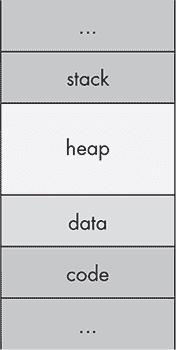
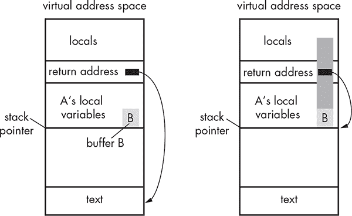

## 第十一章：11

**来自 C 的遗留问题和负担**

Objective-C 和 Cocoa 帮助缓解了许多你在 C 或 C++ 中可能遇到的安全问题。然而，Objective-C 仍然是 C 的一种变体，根本上不是一种“安全”的语言，某些 Cocoa API 仍然容易受到你在 C 程序中可能遇到的数据窃取或代码执行攻击的威胁。C 和 C++ 也可以与 Objective-C 自由混合。许多 iOS 应用程序使用大量的 C 和 C++ 代码，无论是因为开发者想要使用熟悉的库，还是试图尽可能保持代码在不同平台之间的可移植性。虽然有一些缓解措施来防止代码执行攻击，如第一章中讨论的内容，但这些措施可能会被更熟练的攻击者绕过。因此，熟悉这些漏洞和攻击是个好主意。

在本章中，你将学习一些需要注意的攻击类型、C 错误如何渗透到 Objective-C 中以及如何修复这些问题。原生 C 代码问题的主题非常广泛，因此本章是这些问题的“精华”，旨在为你提供理解这些缺陷背后的理论以及利用这些缺陷进行攻击的基础知识。

### 格式字符串

格式字符串攻击^(1)利用了错误使用那些期望 *格式字符串*（即定义字符串所组成数据类型的字符串）API。在 C 中，最常用的接受格式字符串的函数属于 `printf` 系列；还有许多其他函数，比如 `syslog`，也接受格式字符串。在 Objective-C 中，这些方法通常具有 `WithFormat` 或 `AppendingFormat` 等后缀，尽管也有一些例外。以下是三者的示例：

• `[NSString *WithFormat]`

• `[NSString stringByAppendingFormat]`

• `[NSMutableString appendFormat]`

• `[NSAlert alertWithMessageText]`

• `[NSException raise:format:]`

• `NSLog()`

攻击者通常利用格式字符串漏洞来做两件事：执行任意代码和读取进程内存。这些漏洞通常源自两个古老的 C 格式字符串操作符：`%n` 和 `%x`。很少使用的 `%n` 操作符用于将目前打印的字符数量存储在栈上的一个整数中。然而，它可以被利用来覆盖内存的部分内容。`%x` 操作符用于以十六进制打印值，但当没有传入要打印的值时，它会从栈中读取值。

不幸的是，对于我们这些漏洞猎人来说，Apple 在接受格式化字符串的 Cocoa 类中禁用了 `%n`。但在常规的 C 代码中，`%n` 格式化字符串*是*允许的，因此格式化字符串攻击仍然可能导致代码执行^(2)。之所以 `%n` 会导致代码执行，是因为它会写入堆栈，而格式化字符串本身也存储在堆栈上。利用方式因特定漏洞而异，但主要的结果是，通过构造一个包含 `%n` 的格式化字符串，并且提供一个要写入的内存地址，你可以将任意整数写入内存的特定位置。结合一些 shell 代码，这种攻击可以像缓冲区溢出攻击一样被利用^(3)。

`%x` 运算符则在 Objective-C 方法和 C 函数中都活跃且有效。如果攻击者能够将 `%x` 传递给一个缺少格式化字符串说明符的输入，输入将被解释为格式化字符串，并且堆栈的内容将以十六进制形式显示在原本应该显示字符串的地方。如果攻击者能够查看这个输出，他们可以从进程的内存中收集潜在的敏感信息，如用户名、密码或其他个人数据。

当然，这两种漏洞都依赖于程序未能正确控制用户输入。让我们看看在这种情况下，攻击者可能如何滥用格式化字符串，并且应用程序可以如何防止这种情况发生。

#### *防止经典的 C 格式化字符串攻击*

格式化字符串漏洞的典型示例是当程序直接将一个变量传递给 `printf`，而没有手动指定格式化字符串。如果这个变量的内容是由外部输入提供，并且攻击者能够控制这些输入，那么攻击者可能会在设备上执行代码或窃取其内存中的数据。你可以在 Xcode 中测试一些人为设计的易受攻击的代码：

```
char *t;
t = "%x%x%x%x%x%x%x%x";
printf(t);
```

这段代码简单地向 `printf` 函数传递一个包含一堆 `%x` 说明符的字符串。在一个真实的程序中，这些值可能来自许多地方，例如用户输入字段或 DNS 查询结果。当代码执行时，你应该看到一串十六进制输出写入控制台。这个输出包含了存储在堆栈上的变量的十六进制值。如果应用程序在堆栈上存储了一个密码或加密密钥，并且解析了一些攻击者提供的数据，攻击者可能导致这些信息泄露到某个他们能够读取的地方。如果你将前面的示例改成包含 `%n` 说明符，行为会有所不同。以下是它的表现：

```
char *t;
t = "%n%n%n%n%n";
printf(t);
```

在 Xcode 中运行此示例时，应该会导致 Xcode 跳转到 `lldb` 并出现 `EXC_BAD_ACCESS` 错误。每当你看到这个消息时，表示程序正在尝试读取或写入不应该访问的内存。当然，在精心设计的攻击中，你不会看到这样的错误；代码将直接执行。

但是，你可以通过控制用户输入轻松防止攻击者劫持字符串。在这种情况下，只需将 `printf` 改为指定自己的格式字符串，如下所示：

```
char *t;
t = "%n%n%n%n%n";
printf("%s", t);
```

在 Xcode 中运行这个，你应该能看到字面上的 `%n%n%n%n%n` 被无害地写入控制台。当然，这些示例都是纯 C，但了解它们的工作原理将帮助你探索带有 Objective-C 扩展的格式字符串攻击。

#### *防止 Objective-C 格式字符串攻击*

类似于纯 C 语言，你可以将任何 `printf` 格式操作符传递给多个不同的 Objective-C API。你可以通过将虚假的格式字符串传递给 `NSLog` 在 Xcode 中轻松测试这一点：

```
NSString *userText = @"%x%x%x%x%x%x%x%x%x%x%x%x%x%x%x%x%x%x%x%x";
NSLog(userText);
```

就像之前的 `%x` 示例一样，这将把内存内容以十六进制形式打印到控制台。我在实际的 iOS 应用中遇到过的一个格式字符串漏洞是，代码将用户提供的输入传递给一个“格式化”函数，该函数进行一些处理并返回一个 `NSString` 对象，如 列表 11-1 所示。

```
   NSString *myStuff = @"Here is my stuff.";
   NSString *unformattedStuff = @"Evil things %x%x%x%x%x";
➊ myStuff = [myStuff stringByAppendingFormat:[UtilityClass formatStuff:
        unformattedStuff.text]];
```

*列表 11-1：完全错误的将数据传递给格式字符串的方法*

这个示例假设在 ➊ 处存储在 `myStuff` 中的 `NSString` 是安全的；毕竟，*unformattedStuff.text* 的内容已经被“格式化”了。但是除非 `formatStuff` 方法有某种特殊的方式来清理输入文件，否则结果字符串可能包含格式字符串说明符。如果发生这种情况，你仍然会面临格式字符串问题，且结果字符串将包含来自栈的值。

`NSString` 对象并不是天生安全的，不能免受格式字符串攻击。正确的方式是使用 `%@` 说明符来输出传递给需要格式字符串的方法的 `NSString`，如 列表 11-2 所示。

```
NSString myStuff = @"Here is my stuff.";
myStuff = [myStuff stringByAppendingFormat:@"%@", [UtilityClass formatStuff:
     unformattedStuff.text]];
```

*列表 11-2：正确使用期望格式字符串的方法*

在 `%@` 说明符前，无论 *unformattedStuff.text* 中包含多少 `%x` 和 `%n` 操作符，`myStuff` 应该会输出为一个无害的字符串。

`%x` 和 `%n` 说明符对攻击者来说是最有用的，但即使它们不存在，攻击者仍然可以在尝试读取无法访问的内存时引发不良行为，例如崩溃，即使是使用基本的 `%s` 说明符。现在我已经讲解了格式字符串攻击的原理以及如何防止它们，接下来我会展示一些其他执行恶意代码的方法。

### 缓冲区溢出与栈

缓冲区溢出长期以来困扰着 C 语言的世界，允许来自不信任来源的构造输入崩溃程序或在易受攻击程序的进程内执行第三方代码。尽管缓冲区溢出从 1970 年代就已知，但它们被首次广泛利用是在莫里斯蠕虫中，其中包括对 UNIX `finger` 守护进程的缓冲区溢出攻击。

缓冲区溢出从覆盖内存的部分开始。进程的基本内存布局包括程序代码、程序运行所需的任何数据、堆栈和堆，如图 11-1 所示。



*图 11-1：进程内存的布局*

*代码*段（通常称为*文本*段）是程序的实际可执行文件被加载到内存的地方。*数据*段包含程序的全局变量和静态局部变量。*堆*是程序运行时动态分配内存的地方，存储大部分非可执行程序数据。*栈*是存储局部变量的地方，以及函数的地址，重要的是，它还包含指向下一条程序执行指令的地址。

溢出有两种基本类型：一种是覆盖程序堆栈的部分内容，另一种是覆盖堆区的部分内容。现在让我们来看一下缓冲区溢出漏洞。

#### *一个 strcpy 缓冲区溢出*

栈基缓冲区溢出的经典例子见清单 11-3。

```
#include <string.h>

uid_t check_user(char *provided_uname, char *provided_pw) {
    char password[32];
    char username[32];

    strcpy(password, provided_pw);
    strcpy(username, provided_uname);

    struct *passwd pw = getpwnam(username);

    if (0 != strcmp(crypt(password), pw->pw_passwd))
        return -1;

    return pw->uid;
}
```

*清单 11-3：容易发生溢出的代码*

`username`和`password`都分配了 32 个字节。在大多数情况下，程序应正常运行，并将用户提供的密码与存储的密码进行比较，因为用户名和密码通常不超过 32 个字符。然而，当输入的值超过 32 个字符时，额外的字符会开始覆盖堆栈上相邻变量的内存，如图 11-2 所示。这意味着攻击者可以覆盖函数的返回地址，指定下一个要执行的是攻击者在当前输入或内存的其他地方放置的恶意代码块。



*图 11-2：溢出前后的内存布局*

由于这个例子硬编码了字符限制，并且没有检查输入是否在限制范围内，攻击者控制的输入可能会比接收数据结构允许的长度还要长。数据会溢出缓冲区的边界，覆盖内存的部分内容，从而可能允许代码执行。

#### *防止缓冲区溢出*

有几种方法可以防止缓冲区溢出，而且大多数方法都相当简单。

##### 在使用输入之前检查其大小

最简单的解决方法是在将输入加载到数据结构之前进行合理性检查。例如，像清单 11-3 中的脆弱程序通常通过自己计算传入数据的大小来防御缓冲区溢出，而不是信任外部提供的大小是正确的。这种修复可以像用`if`语句替换清单 11-3 中的`strcpy`函数那样简单：

```
if (strnlen(provided_pw, 32) < strnlen(password, 32))
    strcpy(password, provided_pw);
```

使用 `sizeof` 检查提供的密码的大小应该确保任何超过缓冲区大小的数据被拒绝。理想情况下，当然你根本不应使用静态大小的缓冲区——像 `NSString` 或 `std::string` 这样的高级类及其相关方法应该能为你处理这些问题。

##### 使用更安全的字符串 API

另一种能够保护你免受缓冲区溢出的编码最佳实践是避免使用“已知不安全”的 API，例如 `strcpy` 和 `strcat` 系列。这些函数会将数据复制到目标缓冲区，而不检查目标是否能够处理如此多的数据，这也是上一节中为什么添加大小检查如此重要的原因。示例 11-3 展示了 `strcpy` 的一种错误用法；这里有一个更简单的例子：

```
void copythings(char *things) {
    char buf[32];
    strcpy(buf, things);
}
```

在这种简单且明显的缓冲区溢出漏洞中，`buf` 缓冲区只有 32 字节长，而参数 `things` 被复制到其中。但这段代码在尝试将 `things` 复制到 `buf` 之前并没有检查 `things` 缓冲区的大小。如果任何调用此函数的缓冲区大于 32 字节，结果将是缓冲区溢出。

更安全的字符串复制和拼接方式是使用 `strlcpy` 和 `strlcat` 函数，^(4) 它们将目标缓冲区的大小作为参数，示例如下：

```
void copythings(char *things) {
    char buf[32];
    length = strlcpy(buf, things, sizeof(buf));
}
```

在这里，`strlcpy` 函数只会复制源字符串中的 31 字节，加上一个空字符终止符。这样可能导致字符串被截断，但至少不会导致静态大小缓冲区溢出。`strl` 系列并不是所有平台都支持，但在基于 BSD 的系统上可用，包括 iOS。

除了这些类型的溢出，执行整数操作时也可能发生错误，这可能导致服务拒绝或代码执行。

### 整数溢出与堆

*整数溢出* 是由执行一个计算，得到的值超出了平台上整数的最大值。当你了解 C 语言（因此也包括 Objective-C）时，你会知道有两种类型的整数：有符号整数和无符号整数。有符号整数可以是正数或负数，而无符号整数总是正数。如果你尝试执行一个超出任一类型整数值的计算，就会发生错误。无符号整数将会绕过整数的最大值，从零重新开始。如果整数是有符号的，它将从一个负数开始，这是无符号整数的最小值。以下是一个例子：

```
NSInteger foo = 9223372036854775807;
NSLog(@"%li", (long)foo);
foo++;
NSLog(@"%li", (long)foo);
```

这从一个有符号整数 `foo` 开始，使用 iOS 上有符号整数的最大大小。当该数字递增时，控制台输出应会回绕到一个负数，`-9223372036854775808`。

如果你像下面的例子中那样使用无符号整数，你会看到整数溢出，控制台上的输出将是 `0`：

```
NSUInteger foo = 18446744073709551615;
NSLog(@"%lu", (unsigned long)foo);
foo++;
NSLog(@"%lu", (unsigned long)foo);
```

当缓冲区溢出会覆盖栈时，整数溢出则会让攻击者访问堆内存，我接下来会向你展示这一点是如何发生的。

#### *一个 malloc 整数溢出*

整数溢出通常会在计算传递给`malloc()`调用所需空间时发生，导致分配的空间远远不足以容纳要存储的值。当数据被加载到新分配的空间中时，无法容纳的数据将被写入分配空间的末尾，进入堆内存。这就会导致堆溢出：如果攻击者向`malloc()`提供恶意构造的数据并覆盖堆中的正确指针，代码执行就可能发生。

整数溢出漏洞通常呈现以下形式：

```
   #define GOAT_NAME_LEN 32

   typedef struct Goat {
     int leg_count;    // usually 4
     bool has_goatee;
     char name[GOAT_NAME_LEN];
     struct Goat* parent1;
     struct Goat* parent2;
     size_t kid_count;
     struct Goat** kids;
   } Goat;

   int ReadInt(int socket) {
     int result;
     read(socket, &result, sizeof(result));
     return result;
   }

   void ReadGoat(Goat* goat, int socket) {
     read(socket, goat, sizeof(Goat));
   }

   Goat* ReadGoats(int* count, int socket) {
➊   *count = ReadInt(socket);
➋   Goat* goats = malloc(*count * sizeof(Goat));
➌   for (int i = 0; i < *count; ++i) {
       ReadGoat(&goats[i], socket);
     }
     return goats;
   }
```

这段代码创建了一个类型为`Goat`的对象，以及`ReadGoats`函数，该函数接受一个套接字和需要从该套接字读取的山羊数量。在➊处，`ReadInt`函数从套接字本身读取将要处理的山羊数量。

如果这个数字足够大，在➋处的`malloc()`操作将导致一个非常大的大小，以至于整数会环绕到负数。当`count`的值合适时，攻击者可以使得`malloc()`尝试分配零字节或一个非常小的数值。当在➌处的循环执行时，它将从对应于非常大`count`值的套接字读取山羊的数量。由于`goats`很小，这可能会溢出分配的内存，允许数据写入堆内存。

#### *防止整数溢出*

防止整数溢出的方式有几种，但基本的思路是在操作整数之前检查它们的值。我建议采纳苹果编程指南中的基本结构。^(5) 这是一个例子：

```
if (n > 0 && m > 0 && INT_MAX/n >= m) {
    size_t bytes = n * m;
    foo = malloc(bytes);
}
```

在计算`bytes`的值之前，这个`if`语句检查`n`和`m`是否大于 0，并将其中一个因子除以最大值，以确保结果大于另一个因子。如果两个条件都成立，那么你就知道`bytes`能够适应一个整数，使用它来分配内存应该是安全的。

### 总结思考

本章列出的 C 语言编码缺陷远不全面，但了解这些缺陷有助于你开始在 iOS 应用中识别与 C 相关的问题。还有很多其他资源可以帮助你提高 C 语言安全技能。如果你对深入了解 C 语言的复杂性以及可能出现的问题感兴趣，我建议你阅读 Peter van der Linden 的《*Expert C Programming: Deep C Secrets*》（Prentice Hall, 1994）。

现在我已经把 C 语言的一些“脏衣服”晾晒出来了，我们回到 Cocoa 领域，看看那些主要来源于 Web 应用安全领域的现代攻击：注入攻击。
