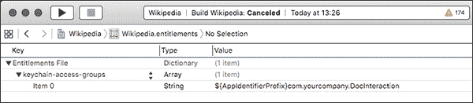
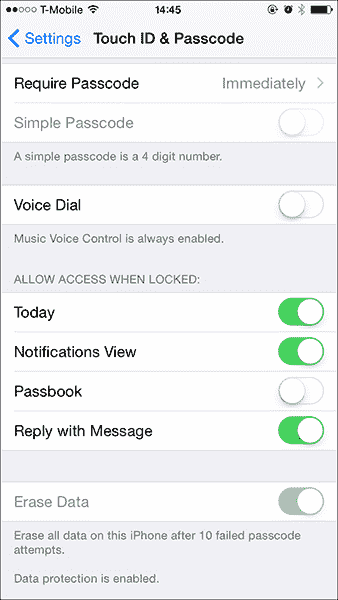
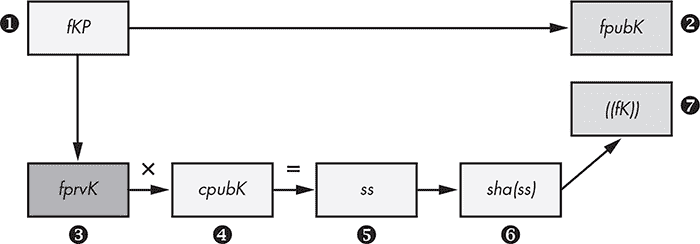
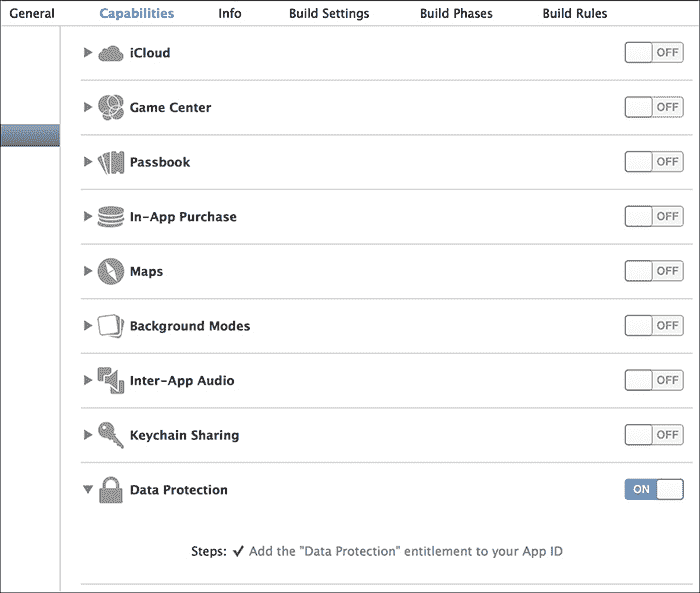

## 第十三章：13

**加密与身份验证**

尽管苹果的加密 API 相当强大，但许多开发者不知道如何有效使用它们。你可以控制两个主要的内建加密组件：钥匙串和数据保护 API。这些组件共享一些相同的加密密钥，并具有类似的保护属性，本章将介绍它们。我还将探讨低级加密原语及其（有限的）使用场景。

### 使用钥匙串

钥匙串用于存储少量敏感数据，包括密码、个人数据等。钥匙串本身使用设备密钥进行加密，并结合用户密码（如果有的话）。钥匙串的 API 包括四个主要操作：`SecItemAdd`、`SecItemUpdate`、`SecItemCopyMatching`和`SecItemDelete`。这些操作分别用于将项目添加到钥匙串、更新现有项目、检索项目和从钥匙串中删除项目。

话虽如此，我*真的*希望我永远不再看到 GenericKeychain^(1)示例代码。每个人似乎都将他们的钥匙串代码建立在这个基础上（这是合理的），但这段代码早于任何现代的钥匙串保护措施，这些保护措施实际上可以防止物理攻击者从你的设备上窃取机密数据。在本节中，你将了解这些保护措施以及如何利用它们。

#### *用户备份中的钥匙串*

当用户执行设备的完整备份时，他们有两个与安全相关的选项：未加密和加密。*未加密*备份只能还原到其原始设备。*加密*备份允许用户选择一个密码来加密备份数据。这使得备份可以还原到任何设备（除了标记为`ThisDeviceOnly`的项目），并且会备份钥匙串的完整内容。如果不希望将钥匙串项目存储在备份中，可以使用钥匙串的数据保护属性。

#### *钥匙串保护属性*

*钥匙串保护属性*指定何时可以将钥匙串数据存储在内存中，并由操作系统或应用程序请求。将密码或个人数据等项目添加到钥匙串时，指定保护属性非常重要，因为这明确说明了数据应该何时可用。未指定保护属性应视为一个错误。

在首次将项目存储到钥匙串时，通过使用`SecItemAdd`方法来指定属性。你需要传递预定义值集中的一个（见表 13-1）作为`kSecAttrAccessible`的值。

可以通过此属性指定三种主要的访问类型：

**始终可访问** 无论手机是否锁定，密钥始终可用。

**解锁时可访问** 当设备解锁时，密钥是可访问的；否则，访问尝试将失败。

**第一次解锁后可访问** 密钥在设备启动并第一次解锁后可访问。

对于三种主要的密钥链保护类型，每种类型都有一个额外的后缀为 `ThisDeviceOnly` 的对应项。这意味着密钥链项将不会备份到 iCloud，只会在使用加密备份时备份到 iTunes，并且不能恢复到其他设备上。

**表 13-1：** 密钥链保护属性及其相关含义

| **密钥链保护属性** | **含义** |
| --- | --- |
| `kSecAttrAccessibleAfterFirstUnlock` | 设备启动后，密钥在用户第一次输入密码之前不可访问。 |
| `kSecAttrAccessibleAlways` | 密钥始终可访问，只要设备已启动。请注意，在 iOS 9 中此项已被弃用，因为它相较于 `kSecAttrAccessibleAfterFirstUnlock` 并没有实际优势。 |
| `kSecAttrAccessibleAlwaysThisDeviceOnly` | 密钥始终可访问，但无法移植到其他 iOS 设备上。 |
| `kSecAttrAccessibleAfterFirstUnlockThisDeviceOnly` | 这与前一个密钥相同，但该密钥仅保留在此设备上。 |
| `kSecAttrAccessibleWhenUnlocked` | 每当设备解锁（即用户输入密码后），密钥可访问。 |
| `kSecAttrAccessibleWhenUnlockedThisDeviceOnly` | 这与前一个密钥相同，但该密钥仅保留在此设备上（除非是完整的加密备份）。 |
| `kSecAttrAccessibleWhenPasscodeSetThisDeviceOnly` | 这与前一个密钥相同，但此密钥仅对设置了密码的用户可用，如果取消设置密码，该密钥将从设备中移除，并且不会包含在任何备份中。 |

在密钥链保护首次引入时，默认值为 `kSecAttrAccessibleAlways`，这会产生明显的安全问题。在这种情况下，*可访问* 应理解为“对物理攻击者可用”：如果有人偷了你的设备，他们将能够读取密钥链中的内容。通常，这通过执行临时越狱并提取密钥来完成；改用 `kSecAttrAccessibleAfterFirstUnlock` 通常可以防止这种情况，因为通常需要重启设备才能执行越狱。然而，代码执行攻击（例如有人利用 Wi-Fi 驱动程序中的漏洞）可以在设备仍然运行时获得访问权限。在这种情况下，需要使用 `kSecAttrAccessibleWhenUnlocked` 来防止密钥泄露，这意味着攻击者需要确定用户的密码才能提取秘密。

**注意**

*不幸的是，在 iOS 上暴力破解四位数 PIN 码的速度快得惊人。不仅可以通过临时越狱实现此操作，*^(2) *而且我的同事们已经成功制造了可爱的机器人，在不到一天的时间内通过物理暴力破解 PIN 码。*^(3)

当前，默认属性是`kSecAttrAccessibleWhenUnlocked`，这是一个相对限制性的默认值。然而，苹果的公开文档对于默认属性应该是什么存在分歧，因此，为了保险起见，你应该在所有钥匙串项目中显式设置该属性。对于你自己的代码，考虑在合适的情况下使用`kSecAttrAccessibleWhenUnlockedThisDeviceOnly`；在检查第三方源代码时，确保使用限制性的保护属性。

在 iOS 8 中，添加了`kSecAttrAccessibleWhenPasscodeSetThisDeviceOnly`保护属性。开发者长期以来一直要求提供一个需要用户设置密码的 API。这个新属性并不能直接实现这一要求，但开发者可以利用它来根据是否设置了密码来做出决策。当你尝试向钥匙串中添加指定`kSecAttrAccessibleWhenPasscodeSetThisDeviceOnly`属性的项目时，如果用户没有设置密码，操作将失败。你可以利用这个失败作为一个决策点，决定是否回退到另一个钥匙串保护属性、提醒用户，或者只是将不太敏感的数据存储在本地。

如果用户设置了密码，添加操作将成功；然而，如果用户决定禁用密码，解密该项目所用的类密钥将会被丢弃，从而阻止应用程序解密该项目。

#### *基本钥匙串使用*

有几种类别的钥匙串项目，如表 13-2 所列。除非你在处理证书，否则通常可以使用`kSecClassGenericPassword`来存储大多数敏感数据，接下来我们将看看该类别中一些有用的方法。

**表 13-2：**钥匙串项目类别

| **项目类别** | **含义** |
| --- | --- |
| `kSecClassGenericPassword` | 一个普通的密码 |
| `kSecClassInternetPassword` | 专用于互联网服务的密码 |
| `kSecClassCertificate` | 一个加密证书 |
| `kSecClassKey` | 一个加密密钥 |
| `kSecClassIdentity` | 一个密钥对，包括公钥证书和私钥 |

列表 13-1 展示了如何使用钥匙串通过`SecItemAdd`添加基本密码项目的示例。它设置了一个字典来保存钥匙串*查询*，该查询包含了识别密码的适当键值对，设置了密码策略，并指定了密码本身。

```
NSMutableDictionary *dict = [NSMutableDictionary dictionary];
NSData *passwordData = [@"mypassword" dataUsingEncoding:NSUTF8StringEncoding];

[dict setObject:(__bridge id)kSecClassGenericPassword forKey:(__bridge id)
     kSecClass];
[dict setObject:@"Conglomco login" forKey:(__bridge id)kSecAttrLabel];
[dict setObject:@"This is your password for the Conglomco service." forKey:
     (__bridge id)kSecAttrDescription];
[dict setObject:@"dthiel" forKey:(__bridge id)kSecAttrAccount];
[dict setObject:@"com.isecpartners.SampleKeychain" forKey:(__bridge id)
     kSecAttrService];
[dict setObject:passwordData forKey:(__bridge id)kSecValueData];
[dict setObject:(__bridge id)kSecAttrAccessibleWhenUnlocked forKey:(__bridge id)
     kSecAttrAccessible];

OSStatus error = SecItemAdd((__bridge CFDictionaryRef)dict, NULL);
if (error == errSecSuccess) {
    NSLog(@"Yay");
}
```

*列表 13-1：向钥匙串添加项目*

在这里，`kSecClassGenericPassword`类别被设置为钥匙串项目，另外还包括一个用户可读的标签、长描述、账户（用户名）以及服务标识符（用于防止重复）。代码还设置了密码和访问控制属性。

`SecItemUpdate`的工作方式类似。列表 13-2 展示了`SecItemUpdate`的使用示例，其中更新了存储在`kSecValueData`中的用户密码。

```
NSString *newPassword = @"";
NSMutableDictionary *dict = [NSMutableDictionary dictionary];

[dict setObject:(__bridge id)kSecClassGenericPassword forKey:(__bridge id)
     kSecClass];
[dict setObject:@"dthiel" forKey:(__bridge id)kSecAttrAccount];
[dict setObject:@"com.isecpartners.SampleKeychain" forKey:(__bridge id)
     kSecAttrService];

NSDictionary *updatedAttribute = [NSDictionary dictionaryWithObject:[newPassword
     dataUsingEncoding:NSUTF8StringEncoding] forKey:(__bridge id)kSecValueData];
OSStatus error = SecItemUpdate((__bridge CFDictionaryRef)dict, (__bridge
     CFDictionaryRef)updatedAttribute);
```

*列表 13-2：使用* `SecItemUpdate` *更新钥匙串项目*

在使用`SecItemUpdate`更新钥匙串条目时，你必须设置两个字典。一个字典应指定基本的钥匙串标识信息（至少包括类、账户和服务信息），另一个字典应包含要更新的属性。

`SecItemCopyMatching`可以用来查询钥匙串，查找符合给定条件的一个或多个条目。通常，你会使用类、账户和服务属性来构建一个搜索字典，这些属性在创建或更新钥匙串条目时使用。然后，你将实例化一个`NSDictionary`，该字典将保存搜索结果，并执行实际的`SecItemCopyMatching`调用，传入搜索字典和结果字典的引用。可以在列表 13-3 中找到示例。

```
[dict setObject:(__bridge id)kSecClassGenericPassword forKey:(__bridge id)
     kSecClass];
[dict setObject:@"dthiel" forKey:(__bridge id)kSecAttrAccount];
[dict setObject:@"com.isecpartners.SampleKeychain" forKey:(__bridge id)
     kSecAttrService];

[dict setObject:(id)kCFBooleanTrue forKey:(__bridge id)kSecReturnAttributes];

NSDictionary *result = nil;
OSStatus error = SecItemCopyMatching((__bridge CFDictionaryRef)dict, (void *)&
     result);
NSLog(@"Yay %@", result);
```

*列表 13-3：使用`SecItemCopyMatching`查询钥匙串*

在`result`字典中获取到钥匙串数据后，你可以使用这些信息执行诸如向远程服务认证或解密数据等安全敏感的任务。请注意，如果你构建的查询没有包含账户和服务属性（这两个属性唯一标识钥匙串条目），你可能会得到一个包含多个钥匙串条目的返回字典。这个字典可以通过`kSecMatchLimit`来限制（即将其设置为 1），但如果你正在尝试搜索像密码这样的单个数据，这可能会导致不可预测的行为。

你现在可能已经猜到，`SecItemDelete`调用的样子是什么——可以在列表 13-4 中看到实际代码。

```
NSMutableDictionary *searchDictionary = [NSMutableDictionary dictionary];

[searchDictionary setObject:(__bridge id)kSecClassGenericPassword forKey:
     (__bridge id)kSecClass];
[searchDictionary setObject:@"dthiel" forKey:(__bridge id)kSecAttrAccount];
[searchDictionary setObject:@"com.isecpartners.SampleKeychain" forKey:(__bridge id)
     kSecAttrService];

OSStatus error = SecItemDelete((__bridge CFDictionaryRef)searchDictionary);
```

*列表 13-4：使用`SecItemDelete`删除钥匙串条目*

请注意，如果你没有唯一地标识你的钥匙串条目，所有你的应用程序可以访问的匹配项都会被删除。

#### *钥匙串封装器*

在使用钥匙串时，你可能最终会写许多封装函数，以使其更方便，因为大多数应用程序只使用钥匙串 API 功能的一个子集。事实上，第三方已经提供了许多预写的钥匙串封装器；我倾向于使用 Lockbox^(4)，因为它简单且功能强大。Lockbox 提供了一组类方法，用于存储字符串、日期、数组和集合。你可以查看在列表 13-5 中存储秘密字符串的过程。

```
#import "Lockbox.h"

NSString *keyname = @"KeyForMyApp";
NSString *secret = @"secretstring";

[Lockbox setString:secret
             forKey:keyname
     accessibility:kSecAttrAccessibleWhenUnlocked];
```

*列表 13-5：使用 Lockbox 设置钥匙串条目*

键名将自动以你的应用程序的包 ID 为前缀，并且这个值将作为账户和服务键的值。检索钥匙串中的数据的过程如列表 13-6 所示。

```
NSString *result = [Lockbox stringForKey:secret];
```

*列表 13-6：使用 Lockbox 从钥匙串中检索字符串*

无论你选择或编写哪个封装器，请确保它具有设置`kSecAttrAccessible`属性的能力，因为许多现有的示例代码忽略了这个功能。

#### *共享钥匙串*

iOS 具有通过使用 Keychain 访问组在同一开发者的多个应用程序之间共享 Keychain 数据的能力。例如，如果你有一个“买家”应用和一个“卖家”应用，用于在线市场，你可以让用户在这两个应用之间共享相同的用户名和密码。不幸的是，这种机制被广泛误解，导致人们做出一些可怕的事情，比如使用命名的剪贴板共享应该专属于 Keychain 的项目。

**注意**

*要使用 Keychain 访问组，你的应用程序*必须*共享相同的包种子 ID。这只能在创建新的 App ID 时指定。*^(5)

为了让你的应用程序利用访问组，你需要创建一个 Entitlements 属性列表（参见 图 13-1），其中包含一个名为 `keychain-access-groups` 的数组，每个共享的 Keychain 项目都有一个字符串条目。



*图 13-1：定义一个由你的包种子 ID 和公司前缀组成的 Keychain 访问组，后跟 Keychain 项目的通用名称。*

Keychain 项目将由包种子 ID、你的反向 DNS 标注开发者标识符以及两个应用程序都能引用该权限的符号名称组成（参见 列表 13-7）。

```
[dict setObject:@"DTHIELISEC.securitySuite" forKey:(id)kSecAttrAccessGroup];
```

*列表 13-7：设置 Keychain 项目的访问组*

在这里，`DTHIELISEC`是包种子 ID。你的包 ID 也将是一个 10 个字符的字母数字字符串。在通过 `SecItemAdd` 函数创建 Keychain 项目时，你需要将新权限的值作为 `kSecAttrAccessGroup` 键的值传入。请注意，一个 Keychain 项目只能有一个 Keychain 访问组。

**注意**

*从技术上讲，如果你创建了一个 Keychain 访问组，但在创建 Keychain 项目时没有指定该组，则会使用`*keychain-access-groups*`数组中的第一个字符串作为默认权限。因此，如果你只使用一个访问组，在执行`*SecItemAdd*`时无需指定该组——但最好还是指定。*

#### *iCloud 同步*

iOS 7 引入了一种机制，允许 Keychain 项目与 iCloud 同步，使用户能够在多个设备间共享 Keychain 项目。默认情况下，应用程序创建的 Keychain 项目并未启用此功能，但可以通过将 `kSecAttrSynchronizable` 设置为 true 来启用。

```
[query setObject:(id)kCFBooleanTrue forKey:(id)kSecAttrSynchronizable];
```

因为此项现在可能会在多个钥匙串之间同步，所以对该项的更新（包括删除）将传播到所有其他位置。确保你的应用能够处理系统删除或更改钥匙串项的情况。还需注意，使用此选项时不能指定不兼容的 `kSecAttrAccessible` 属性。例如，指定 `kSecAttrAccessibleWhenUnlockedThisDeviceOnly` 是不行的，因为 `ThisDeviceOnly` 指定该项永远不应备份，无论是备份到 iCloud，还是备份到笔记本或桌面电脑，或任何其他同步提供商。

### 数据保护 API

作为额外的保护层，苹果引入了数据保护 API（与微软的 Data Protection API 不同），该 API 允许开发者指定何时可以访问文件解密密钥。它允许你控制对文件本身的访问，类似于钥匙串项的 `kSecAttrAccessible` 属性。数据保护 API 使用用户的密码和类密钥结合来加密每个受保护文件的特定密钥，并在这些文件不应被访问时（即设备锁定时）将类密钥丢弃在内存中。当启用了 PIN 时，密码设置界面会显示数据保护已启用，如 图 13-2 所示。



*图 13-2：启用数据保护的密码设置*

#### *保护级别*

开发者可以通过数据保护 API 请求多个保护级别，这些级别大致类似于在钥匙串项上设置的`kSecAttrAccessible`属性。现在让我们来探讨这些级别。

##### CompleteUntilFirstUserAuthentication 保护级别

`CompleteUntilFirstUserAuthentication` 是 iOS 5 及更高版本的默认文件保护属性。除非明确指定了其他属性，否则它将应用于所有适用的文件。其功能上类似于 `FileProtectionComplete`，但文件在用户首次解锁设备（重启后）后始终可用。如果有人获得了在运行设备上执行远程代码的权限，或者发生了沙盒绕过，那么它的保护作用就不大，但它确实能防止一些需要重启才能进行的攻击。

##### 完全保护级别

`Complete` 是可用的最安全的文件保护类，如果你能使用它的话。完全保护确保在短暂延迟后，锁定设备会将类密钥从内存中丢弃，使文件内容无法读取。

此保护级别通过 `NSFileManager` 的 `NSFileProtectionComplete` 属性以及 `NSData` 对象的 `NSDataWritingFileProtectionComplete` 标志来表达。对于 `NSData` 对象，你可以从设置 `NSDataWritingFileProtectionComplete` 标志开始，如 示例 13-8 所示。

```
NSData *data = [request responseData];

if (data) {
    NSError *error = nil;
    NSString *downloadFilePath = [NSString stringWithFormat:@"%@mydoc.pdf", NS
     TemporaryDirectory()];
    [data writeToFile:downloadFilePath options:NSDataWritingFileProtectionComplete
     error:&error];
```

*示例 13-8：在* `NSData` *对象上设置* `NSDataWritingFileProtectionComplete` *标志*

一旦您在 `NSData` 对象上设置了 `NSDataWritingFileProtectionComplete`，您可以使用 `NSFileManager` 来设置 `NSFileProtectionComplete` 标志。

```
NSArray *searchPaths = NSSearchPathForDirectoriesInDomains(NSDocumentDirectory, NS
     UserDomainMask, YES);
NSString *applicationDocumentsDirectory = [searchPaths lastObject];
NSString *filePath = [applicationDocumentsDirectory stringByAppendingPathComponent:
     @"mySensitivedata.txt"];

NSError *error = nil;
NSDictionary *attr =
      [NSDictionary dictionaryWithObject:NSFileProtectionComplete
                                  forKey:NSFileProtectionKey];

[[NSFileManager defaultManager] setAttributes:attr
                                 ofItemAtPath:filePath
                                        error:&error];
```

*清单 13-9：使用 `NSFileManager` 设置* `NSFileProtectionComplete` *标志*

您还可以为您创建的 SQLite 数据库添加文件保护属性，使用长得奇怪的 `SQLITE_OPEN_READWRITE_SQLITE_OPEN_FILEPROTECTION_COMPLETEUNLESSOPEN` 参数，如 清单 13-10 所示。

```
NSString *databasePath = [documentsDirectory stringByAppendingPathComponent:@"
     MyNewDB.sqlite"];

sqlite3_open_v2([databasePath UTF8String], &handle, SQLITE_OPEN_CREATE|
     SQLITE_OPEN_READWRITE_SQLITE_OPEN_FILEPROTECTION_COMPLETEUNLESSOPEN,NULL);
```

*清单 13-10：为 SQLite 数据库设置保护属性*

在尝试使用完整保护之前，请先考虑一下您的应用程序如何工作。如果您的进程需要持续的读/写访问文件，那么这种保护模式将不适用。

##### 完整保护级别（除非打开）

`CompleteUnlessOpen` 保护级别稍微复杂一些。使用 `NSFileManager` 时，您会设置 `NSFileProtectionCompleteUnlessOpen` 标志，操作 `NSData` 存储时则设置 `NSDataWritingFileProtectionCompleteUnlessOpen`。它并不像名字所示那样在文件被应用程序打开时禁用文件保护。`CompleteUnlessOpen` 实际上确保即使设备被锁定，已打开的文件仍可以写入，并且允许新的文件写入磁盘。任何已经具有此类保护的文件，在设备锁定时无法打开，除非它们之前已经被打开。

其工作原理是通过生成一对密钥，并使用它来计算和派生共享密钥，从而包裹文件密钥。图 13-3 展示了这一过程。



*图 13-3：密钥生成和包装。请注意，文件私钥 ➌ 是暂时的，在包裹的文件密钥存储在文件元数据中后会被丢弃。*

让我们一步一步地走过这个文件保护过程：

1.  与所有文件一样，会生成文件密钥 ➊ 用于加密文件内容。

1.  生成另一个密钥对^(6)来生成文件公钥 ➋ 和文件私钥 ➌。

1.  文件私钥 ➌ 和受保护除非打开类公钥 ➍ 用于计算共享密钥 ➎。

1.  该共享密钥 ➏ 的 SHA-1 哈希用于加密文件密钥。

1.  这个加密文件密钥 ➐ 被存储在文件的元数据中，以及文件公钥一起。

1.  系统会丢弃文件私钥。

1.  关闭文件时，未加密的文件密钥会从内存中删除。

1.  当文件需要重新打开时，受保护除非打开类私钥和文件公钥将用于计算共享密钥。

1.  该密钥的 SHA-1 哈希值随后用于解密文件密钥。

这一过程的结果是，您仍然可以在设备锁定时写入数据，而无需担心攻击者能够读取这些数据。

#### *数据保护类权限*

如果你的应用程序在后台或设备锁定时不需要读取或写入任何文件，可以为项目添加一个值为`NSFileProtectionComplete`的授权。这将确保所有写入磁盘的可保护数据文件仅在设备解锁时可访问，这等同于在每个适用的文件上设置`kSecAttrAccessibleWhenUnlocked`。

**注意**

*尽管这将影响通过* `*NSFileManager*`、`*NSData*`、SQLite 和 Core Data 文件管理的文件，但其他类型的文件（例如，plist 文件、缓存等）将不会受到保护。*

在 Xcode 5 及以后的版本中，数据保护授权在新项目中默认启用；然而，旧项目不会自动迁移。启用授权本身相当简单——只需按照图 13-4 所示切换开关。



*图 13-4：在 Xcode 5 中启用数据保护授权。*

请注意，在 iOS 7 之前安装的应用程序默认未启用数据保护。它们要么需要更新，要么过去曾明确请求过数据保护属性。

#### *检查受保护数据的可用性*

对于在前台执行所有操作的应用程序，数据保护应该能透明地工作。对于需要在设备锁定时在后台运行的应用程序，你的应用程序需要在使用受保护数据之前确定其可用性。可以通过三种不同的机制来实现。

##### 实现委托方法

为了在数据可用性变化时接收通知并采取相应的措施，你的应用程序应该实现`applicationProtectedDataWillBecomeUnavailable`和`applicationProtectedDataDidBecomeAvailable`委托方法，正如清单 13-11 所示。

```
- (void)applicationProtectedDataWillBecomeUnavailable:
    (UIApplication *)application {

    [self [theBodies hide]];
}

- (void)applicationProtectedDataDidBecomeAvailable:
    (UIApplication *)application {

    [self [theBodies exhume]];
}
```

*清单 13-11：检测数据保护可用性变化的委托方法*

使用这些委托方法来确保需要受保护数据文件的任务能够优雅地清理，并在文件重新激活时通知你。

##### 使用通知中心

`NSNotificationCenter` API 本质上提供了一种应用内广播机制，应用的一部分可以监听事件通知，而这些事件通知可以从代码的其他地方调用。要使用通知中心检测这些状态变化，你可以注册接收`UIApplicationProtectedDataWillBecomeUnavailable`和`UIApplicationProtectedDataDidBecomeAvailable`通知，正如清单 13-12 所示。

```
   - (BOOL)application:(UIApplication*)application didFinishLaunchingWithOptions:
       (NSDictionary*)launchOptions {

➊ NSNotificationCenter *nc = [NSNotificationCenter defaultCenter];

➋ [nc addObserver:self
          selector:@selector(dataGoingAway:)
              name:UIApplicationProtectedDataWillBecomeUnavailable
            object:nil];
   }

➌ - (void)dataGoingAway {

       [self [theBodies hide]];

   }
```

*清单 13-12：使用通知中心检测数据可用性变化*

在 ➊，实例化了默认的通知中心实例，然后添加了一个观察者 ➋，该观察者指定了当 `name:` 所指定的事件发生时要调用的选择器。然后你可以简单地在同一类中实现该选择器 ➌，并在接收到事件时执行任何你想要的逻辑。

##### 使用 UIApplication 检测数据保护

你还可以轻松检测是否启用了数据保护，如 Listing 13-13 所示。

```
if ([[UIApplication sharedApplication] isProtectedDataAvailable]) {

    [self [theBodies hide]];
}
```

*Listing 13-13: 使用* `protectedDataAvailable` *属性*

只需检查 `UIApplication` 实例方法 `isProtectedDataAvailable` 的布尔结果。

### 使用 CommonCrypto 进行加密

首先要说明的是：你（可能）不是加密专家。^(7) 我也不是加密专家。很容易认为自己理解加密算法的细节，或者从网上复制粘贴加密代码，但如果你自己尝试进行加密，一般都会出错。

话虽如此，你应该了解 CommonCrypto 框架，即使仅仅是为了能够分辨其他开发者是否在尝试扮演加密专家。这个框架提供了一些低级的加密和解密原语，但唯一可以玩弄的就是 CCCrypt。Listing 13-14 展示了一个可能的使用示例。

```
CCCrypt(CCOperation op, CCAlgorithm alg, CCOptions options,
   const void *key, size_t keyLength, const void *iv, const void *dataIn,
   size_t dataInLength, void *dataOut, size_t dataOutAvailable,
   size_t *dataOutMoved);
```

*Listing 13-14: CCCrypt 方法签名*

`CCCrypt` 方法有 11 个参数：控制算法、密钥长度、初始化向量、操作模式等等。每一个都可能成为加密错误的源头。根据我的经验，开发者在使用 CCCrypt 时常常会遇到几个常见的陷阱，我将在这里描述。不要犯同样的错误！

#### *应避免的破坏性算法*

CCCrypt 支持已知的糟糕加密算法，例如 DES，如果你使用其中之一，你的应用几乎肯定会受到加密攻击和暴力破解的威胁。即使你使用的是更现代的 AES，CCCrypt 也会让你通过 CCOptions 将默认的密码块链接（CBC）模式切换为电子密码本（ECB）模式，这也是一个糟糕的选择。使用 ECB 模式会导致相同的明文块加密成相同的密文块。^(8) 这是一个问题，因为如果攻击者知道一块加密数据，他们就能推测出其他数据块的内容。通常可以通过盐值或初始化向量来解决这个问题，但它们也可能存在问题。

#### *破坏性的初始化向量*

AES 的 CBC 模式规范要求向算法提供一个非机密的初始化向量（IV）。IV 帮助随机化加密，即使相同的明文被多次加密，也能产生不同的密文。这样，你就不需要每次生成新的密钥来防止相同数据块的泄露。

然而，重要的是永远不要在相同的密钥下重用 IV，否则两个以相同字节开始的明文消息将会有相同的密文开头，这将向攻击者泄露加密消息的信息。因此，为每次加密操作使用随机 IV 是非常重要的。

你还应该始终确保调用 AES CBC 模式加密函数时，不传递空的初始化向量。如果传递了空 IV，那么多个消息集将使用相同的密钥和 IV 进行加密，导致我刚才描述的情况。

如你所见，使用静态 IV 或空 IV 的结果是相同的：包含相同数据的小块密文将显得相同。一个可能出现问题的例子是密码管理器，在其中存储加密密钥；如果攻击者能够读取这些数据并确定一些密文相同，他们就会知道多个网站使用了相同的密码。

#### *损坏的熵*

在最坏的情况下，你可能会遇到使用`rand`来尝试获取随机字节的代码（`rand`在密码学上不安全，不适用于加密操作）。官方的 Cocoa 获取熵的方式是通过`SecRandomCopyBytes`。

```
uint8_t randomdata[16];
int result = SecRandomCopyBytes(kSecRandomDefault, 16, (uint8_t*)randomdata);
```

这段代码实际上充当了*/dev/random*的封装器，从内核的内建熵池中读取熵。请注意，`kSecRandomDefault`常量在 OS X 上不可用，因此，如果你正在编写可移植的代码，只需将第一个参数指定为`NULL`。 （在 iOS 下，这相当于使用`kSecRandomDefault`。）

#### *低质量密钥*

人们常常错误地将用户提供的密码用作加密密钥，特别是在移动设备上，这会导致一个相当弱、低熵的加密密钥。有时，这甚至和一个四位数的 PIN 一样糟糕。当使用用户输入来确定加密密钥时，应该使用像 PBKDF2 这样的密钥派生算法。CommonCrypto 框架通过`CCKeyDerivationPBKDF`提供了这个功能。

PBKDF2 是一种密钥派生函数，它使用一个密码短语以及重复的哈希算法迭代来生成合适的加密密钥。重复的迭代故意让该过程需要更长的时间完成，从而使离线暴力破解密码短语的攻击变得不可行。`CCKeyDerivationPBKDF`支持以下迭代算法：

• `kCCPRFHmacAlgSHA1`

• `kCCPRFHmacAlgSHA224`

• `kCCPRFHmacAlgSHA256`

• `kCCPRFHmacAlgSHA384`

• `kCCPRFHmacAlgSHA512`

如果可能的话，你应该使用至少 SHA-256 或更高版本。SHA-1 应该被视为过时，因为近年来已经取得进展，能够加速破解 SHA-1 哈希。

### 执行哈希操作

在某些情况下，你可能需要执行哈希操作，以判断两个数据块是否匹配，而无需比较整个内容。这通常用于验证文件是否与“已知的良好”版本相符，或验证敏感信息而不存储信息本身。要对字符串执行简单的哈希操作，可以使用 `CC_SHA` 系列方法，如下所示：

```
   char secret[] = "swordfish";
   size_t length = sizeof(secret);
   unsigned char hash[CC_SHA256_DIGEST_LENGTH];

➊ CC_SHA256(data, length, hash);
```

这段代码简单地定义了一个密钥和它的长度，并创建了一个 char 类型的 `hash` 来保存哈希操作的结果。在 ➊ 处，调用 `CC_SHA_256` 会将 `data` 中的数据进行哈希计算，并将结果存储在 `hash` 中。

你可能已经习惯了使用 OpenSSL 来进行哈希运算。iOS 没有包含 OpenSSL，但它包括了一些兼容层，用来支持 OpenSSL 依赖的哈希代码。这些在*CommonDigest.h*中定义，如列表 13-15 所示。

```
#ifdef COMMON_DIGEST_FOR_OPENSSL

--snip--

#define SHA_DIGEST_LENGTH        CC_SHA1_DIGEST_LENGTH
#define SHA_CTX                    CC_SHA1_CTX
#define SHA1_Init                  CC_SHA1_Init
#define SHA1_Update                CC_SHA1_Update
#define SHA1_Final                 CC_SHA1_Final
```

*列表 13-15：OpenSSL 兼容的 CommonCrypto 哈希函数挂钩*

因此，只要你定义了 `COMMON_DIGEST_FOR_OPENSSL`，OpenSSL 风格的哈希操作应该能够透明地工作。你可以在列表 13-16 中看到一个示例。

```
#define COMMON_DIGEST_FOR_OPENSSL
#include <CommonCrypto/CommonDigest.h>

SHA_CTX ctx;
unsigned char hash[SHA_DIGEST_LENGTH];

SHA1_Init(&ctx);
memset(hash, 0, sizeof(hash));
SHA1_Update(&ctx, "Secret chunk", 12);
SHA1_Update(&ctx, "Other secret chunk", 18);
SHA1_Final(hash, &ctx);
```

*列表 13-16：OpenSSL 风格的分块 SHA 哈希*

列表 13-16 使用了 `SHA1_Update` 和 `SHA1_Final`，这更适合用于哈希大文件，在这种情况下，分块读取文件可以减少整体内存使用。

### 通过 HMAC 确保消息的真实性

确保加密后的消息数据没有被篡改或损坏，并且是由持有密钥的方生成的，这一点非常重要。你可以使用带有密钥的*哈希消息认证码（HMAC）*作为机制，来保证消息的真实性和完整性。在 iOS 应用中，你可以使用 HMAC 来验证应用间发送的消息的真实性，或者让远程服务器验证请求是否由正确的应用生成。（只需要确保密钥的生成和存储方式能确保它是设备唯一的并且得到妥善保护。）

要计算 HMAC，你只需要一个密钥和一些数据，传递给 `CCHmac` 函数，如列表 13-17 所示。

```
   #include <CommonCrypto/CommonDigest.h>
   #include <CommonCrypto/CommonHMAC.h>

➊ NSData *key = [@"key for the hash" dataUsingEncoding:NSUTF8StringEncoding];
➋ NSData *data = [@"data to be hashed" dataUsingEncoding:NSUTF8StringEncoding];
➌ NSMutableData *hash = [NSMutableData dataWithLength:CC_SHA256_DIGEST_LENGTH];
➍ CCHmac(kCCHmacAlgSHA256, [key bytes], [key length], [data bytes], [data length],
         [hash mutableBytes]);
```

*列表 13-17：计算 HMAC*

注意，列表 13-17 被简化了，只展示了基本的机制；将静态密钥嵌入源代码中并不是推荐的做法。在大多数情况下，这个密钥应该是动态生成的，并存储在钥匙串中。操作过程相对简单。在 ➊ 处，哈希的密钥以 UTF-8 编码的字符串形式传入（这部分应存储在钥匙串中）。在 ➋ 处，将要哈希的数据作为 UTF-8 字符串传入。然后创建一个 `NSMutableData` 对象 ➌ 用来存储哈希结果，最后将三个组件一起传递给 `CCHmac` 函数，在 ➍ 处进行处理。

### 包装 CommonCrypto 与 RNCryptor

如果你需要使用 CommonCrypto 提供的加密功能，RNCryptor 是一个不错的框架。^(9) 它封装了 CommonCrypto，并帮助执行最常用的功能：通过用户提供的密钥使用 AES 加密数据。RNCryptor 还通过提供合理的默认设置来帮助你。说明中给出的基本示例应该足以应对大多数使用场景。有关基本用法，请参见 清单 13-18。

```
NSData *data = [@"Data" dataUsingEncoding:NSUTF8StringEncoding];
NSError *error;
NSData *encryptedData = [RNEncryptor encryptData:data
                                    withSettings:kRNCryptorAES256Settings
                                        password:aPassword
                                           error:&error];
```

*清单 13-18：使用 RNCryptor 加密*

只需将数据传递给 `encryptData` 方法，并提供一个常量，指定你想要使用的加密设置、一个密钥（可以从钥匙串中获取或由用户输入）以及一个 `NSError` 对象来存储结果。

解密数据（清单 13-19）几乎是加密的反向操作，只是你不需要提供 `kRNCryptorAES256Settings` 常量，因为该常量已从加密数据的头部读取。

```
NSData *decryptedData = [RNDecryptor decryptData:encryptedData
                                    withPassword:aPassword
                                           error:&error];
```

*清单 13-19：解密 RNCryptor 加密的数据*

在加密流或大量数据的同时保持内存使用合理要稍微复杂一些（请参见 *[`github.com/rnapier/RNCryptor`](https://github.com/rnapier/RNCryptor)* 获取当前示例），但这里展示的示例涵盖了你可能遇到的最常见用例。

**注意**

*RNCryptor 的旧版本存在一个漏洞*^(10) *，攻击者可以通过修改密文来篡改解密后的部分数据，因此请确保你的代码使用的是最新版本的 RNCryptor。*

### 本地认证：使用 TouchID

在 iOS 8 中，苹果开放了本地认证 API，使第三方应用可以将指纹识别器作为身份验证工具。本地认证 API 通过实例化 `LAContext` 类并传入一个认证策略来评估；目前，只有一种策略可用，即通过生物特征识别身份。清单 13-20 详细展示了这个过程。请注意，使用此 API 并不会让开发者访问指纹数据，它只是提供一个来自读卡器硬件的成功或失败结果。

```
➊ LAContext *context = [[LAContext alloc] init];
➋ NSError *error = nil;
➌ NSString *reason = @"We use this to verify your identity";

➍ if ([context canEvaluatePolicy:LAPolicyDeviceOwnerAuthenticationWithBiometrics
       error:&error]) {
➎     [context evaluatePolicy:LAPolicyDeviceOwnerAuthenticationWithBiometrics
              localizedReason:reason
                        reply:^(BOOL success, NSError *error) {
                          if (success) {
➏                             NSLog(@"Hooray, that's your finger!");
                          } else {
➐                 NSLog(@"Couldn't read your fingerprint. Falling back to PIN or
       something.");
              }
          }];
   } else {
       // Something went wrong. Maybe the policy can't be evaluated because the
       // device doesn't have a fingerprint reader.
➑     NSLog(@"Error: %@ %@", error, [error userInfo]);
   }
```

*清单 13-20：通过指纹认证用户*

首先，代码创建一个 `LAContext` 对象 ➊ 和一个 `NSError` 对象 ➋ 来保存操作结果。还需要为用户展示指纹界面时提供一个理由 ➌。创建这些之后，代码会检查是否可以在 ➍ 处评估 `LAPolicyDeviceOwnerAuthenticationWithBiometrics` 策略。

如果可以进行评估，则会评估该策略 ➎；评估的原因和一个处理评估结果的块也会传递给`evaluatePolicy`方法。如果指纹验证成功，您可以允许应用程序继续执行当前操作 ➏。如果指纹无效，那么根据您编写应用程序的方式，它可能会回退到其他身份验证方法，或者身份验证可能完全失败 ➐。

如果在 ➍ 调用`canEvaluatePolicy`失败，则执行会进入 ➑。这种情况最有可能发生在用户的设备不支持指纹识别器、指纹功能被禁用，或者没有注册指纹时。

#### *指纹有多安全？*

与大多数其他生物识别身份验证形式一样，指纹身份验证是一种不完美的方法。它很方便，但由于你随处留下指纹，因此很容易重建一个模具，有效地模拟你的手指。在美国，执法部门有法律权利使用指纹解锁设备，而不能强迫某人透露他们的密码。

开发人员可以做几件事来解决这些不足之处。最明显的是提供一个选项，让用户可以使用 PIN 码代替 TouchID，或者可能在 TouchID 之外同时使用 PIN 码。另一个有助于减轻指纹克隆攻击的方法是实施一个类似于苹果用于处理锁屏的系统：在三次失败尝试后，恢复使用 PIN 码或要求用户输入密码。由于成功获取克隆指纹是一个不可靠的过程，这可能有助于防止成功的欺诈指纹认证。

### 结束语

加密和身份验证功能并不总是最简单易用的，但考虑到用户数据隐私的重要性，无论从法律还是声誉角度来看，正确部署这些功能至关重要。本章应当已经让你对可能遇到或需要部署的策略有了合理的了解。然而，保护用户隐私是一个比加密更广泛的话题——你将在下一章中关注这一点。
