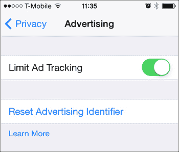
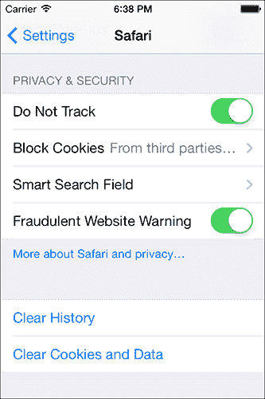
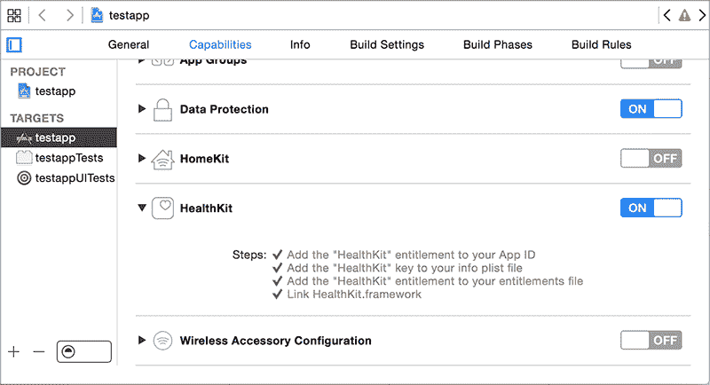
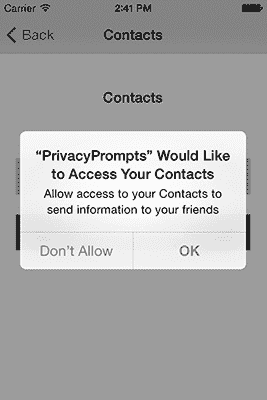
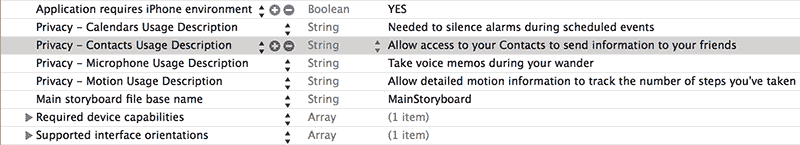

## 14

**移动隐私问题**

人们往往随身携带具有定位功能的移动设备，并在这些设备上存储大量个人数据，这使得隐私成为移动安全中的一个持续关注点。现代 iOS 设备允许应用程序（经请求）读取用户的位置信息、使用麦克风、读取联系人、访问 M7 运动处理器等。负责任地使用这些 API 对用户来说非常重要，也有助于减少责任风险，并增加应用被顺利接受进入 App Store 的可能性。

我在第十章中讨论了很多与隐私相关的内容；这主要是关于意外的数据泄露。在本章中，我将讨论在故意收集和监控用户数据时，影响用户和应用作者的隐私问题，以及一些潜在陷阱的应对措施。

### 唯一设备标识符的危险

iOS 的 *唯一设备标识符 (UDID)* 是一个警示性的例子。在 iOS 的大多数历史时期，UDID 被用来唯一标识一台 iOS 设备，许多应用程序随后使用该标识符来追踪用户活动或将用户 ID 与特定硬件关联。许多公司将这些标识符用作远程服务的访问令牌，结果证明这是一个极其糟糕的想法。

由于许多组织拥有设备的 UDID，而 UDID 又不被认为是敏感信息，因此那些确实将 UDID 用作身份验证工具的公司，突然间面临一个局面——数千个第三方拥有了其用户的凭证。软件开发者还普遍认为 UDID 是不可变的，但早已有工具能够伪造 UDID，无论是全局伪造还是针对特定应用。

#### *来自苹果的解决方案*

由于这些问题，苹果现在拒绝新提交的使用 `uniqueIdentifier` API 的应用，并建议开发者改用 `identifierForVendor` API。该 API 返回一个 `NSUUID` 类的实例。`identifierForVendor` 机制应当为同一 iOS 设备上的同一供应商开发的所有应用返回相同的 UUID，且该 UUID 将通过 iTunes 进行备份和恢复。然而，它并非不可变的，用户可以重置它。

在 App Store 中，使用 `uniqueIdentifier` 的旧版应用会返回以 `FFFFFFFF` 开头的字符串，后跟通常由 `identifierForVendor` 返回的字符串。同样，使用 `gethostuuid` 的应用现在会被拒绝上架 App Store，现有应用在调用此功能时会返回 `identifierForVendor` 值。

使用`NET_RT_IFLIST` sysctl 或`SIOCGIFCONF` ioctl 读取设备 MAC 地址的应用程序现在会收到`02:00:00:00:00:00`。当然，使用 MAC 地址作为任何类型的令牌或认证器一直是个糟糕的主意；MAC 地址会在你连接的每个网络中泄露，而且它们很容易被更改。这种不具体的返回值适当地惩罚了那些采取这种方法的开发人员。

为了进行广告和追踪，苹果引入了`ASIdentifierManager`类的`advertisingIdentifier`属性。该属性返回一个 NSUUID，所有应用程序开发者都可以使用，但像`uniqueIdentifier`一样，这个 NSUUID 可以被擦除或更改（如图 14-1 所示）。



*图 14-1：指示* `advertisingIdentifier` *仅应用于有限目的的用户界面*

这个系统与原始的`uniqueIdentifier` API 的区别在于，`advertisingIdentifier`是显式的。

• 仅用于广告和追踪；

• 不是不可变的；并且

• 受用户偏好设置的影响。

`advertisingIdentifier`的这些方面表面上赋予了用户对广告商使用该机制的跟踪控制权。苹果表示，应用程序必须检查`advertisingTrackingEnabled`的值，如果设置为`NO`，该标识符只能用于“频率限制、转化事件、估算唯一用户数量、安全和欺诈检测以及调试。”^(1) 不幸的是，这个列表几乎可以涵盖广告商希望对`advertisingIdentifier`做的任何事情。

你可以通过列表 14-1 中的方式来确定`advertisingTrackingEnabled`的值。

```
➊ BOOL limittracking = [[ASIdentifierManager sharedManager]
        advertisingTrackingEnabled];

➋ NSUUID *advid = [[ASIdentifierManager sharedManager] advertisingIdentifier];
```

*列表 14-1：确定是否启用了有限广告追踪并获取* `advertisingIdentifier`

在➊调用`advertisingTrackingEnabled`时，它会读取用户的广告追踪 ID 的偏好设置，然后在➋读取`advertisingIdentifier`本身。

#### *处理唯一标识符的规则*

在处理任何类型的唯一标识符时，有几个基本规则需要遵循。首先，永远不要假设标识符是不可变的。任何设备提供的标识符都可以被持有设备的人更改。其次，永远不要假设设备和标识符之间有 1:1 的关系。标识符可以从一个设备转移到另一个设备，因此不能依赖它们唯一地标识单个设备。因为标识符可能会更改、并非唯一且可能被广泛分发，所以你也不应该使用它们来认证用户。最后，尽可能保持标识符的匿名性。它们可能对追踪用户行为的总体趋势有用，但除非有充分的理由，否则不要将标识符与用户身份绑定。

### 移动 Safari 和“请勿追踪”头部

从 iOS 6 开始，Mobile Safari 包含启用 Do Not Track 机制的选项，^(2) 该选项通知远程服务器用户希望选择退出某些方的跟踪。该选项通过 `HTTP_DNT` 头部表示。当设置为 1 时，表示用户同意仅被当前访问的网站跟踪；当设置为 0 时，表示用户不希望任何方进行跟踪。用户可以在 Safari 设置中启用此模式（图 14-2）。



*图 14-2：启用 Do Not Track 的用户界面*

至少可以合理假设，用户希望保护其活动细节，免受第三方广告商或分析公司的侵犯。这是由 `HTTP_DNT` 值为 1 指定的行为，即 iOS 默认发送的头部。

但是，跟踪的定义各不相同。Do Not Track 机制本身的规范指出了以下内容：

工作组尚未就跟踪的定义和 DNT 的范围达成共识。因此，一个站点实际上无法自信地说是否在进行跟踪，更不用说描述跟踪状态资源中的详细内容了。^(3)

根据规范，网站可以使用 `storeSiteSpecificTrackingException` JavaScript API 提示用户选择参与特定的跟踪场景，但在本文撰写时，这一功能尚未广泛实现。

### Cookie 接受政策

iOS 上的 cookies 通过 `NSHTTPCookieStorage` API 进行管理。`sharedHTTPCookieStorage` 方法返回 cookie 存储，但尽管该方法的名称如此，iOS 的 cookie 存储是针对每个应用特定的。cookies 实际存储在应用程序主包目录下的一个数据库中。

**注意**

*名称* `*sharedHTTPCookieStorage*` *源自 OS X，操作系统使用一个全局 cookie 存储库，所有应用都可以共享。*

URL 加载系统使用的 cookies 会根据系统范围内共享的 `cookieAcceptPolicy` 来接受，任何应用都可以指定此政策。此政策可以设置为以下任意一种：

`**NSHTTPCookieAcceptPolicyAlways**` 接受并存储所有接收到的 cookie。这是默认设置。

`**NSHTTPCookieAcceptPolicyOnlyFromMainDocumentDomain**` 仅接受第一方 cookies。

`**NSHTTPCookieAcceptPolicyNever**` 永不接受 cookies。

请注意，在运行任何低于 iOS 7 的设备上，cookie 接受政策是应用之间共享的，这可能会导致您的应用出现问题。在这些设备上，当另一个正在运行的应用改变其接受政策时，您的应用的政策也会随之改变。例如，依赖第三方 cookie 进行广告收入的应用，可能会反复将其 cookie 政策设置为`NSHTTPCookieAcceptPolicyAlways`，并在此过程中将您的政策更改为相同的政策。

幸运的是，你可以使用像 `didFinishLaunchingWithOptions` 这样的事件来指定首选的 `cookieAcceptPolicy`，并在程序运行时监控 cookie 接受政策的变化，如列表 14-2 所示。

```
➊ [[NSNotificationCenter defaultCenter] addObserver:self selector:@selector
       (cookieNotificationHandler:)
      name:NSHTTPCookieManagerAcceptPolicyChangedNotification object:nil];

   - (void) cookieNotificationHandler:(NSNotification *)notification {
       NSHTTPCookieStorage *cookieStorage = [NSHTTPCookieStorage
        sharedHTTPCookieStorage];

➋     [cookieStorage setCookieAcceptPolicy:NS
       HTTPCookieAcceptPolicyOnlyFromMainDocumentDomain];
   }
```

*列表 14-2：注册接收当 cookie 接受政策变化时的通知*

列表 14-2 在 ➊ 注册一个 `NSNotificationCenter`，它监听 `NSHTTPCookieManagerAcceptPolicyChangedNotification`。如果政策发生变化，在 ➊ 中标识的选择器 `cookieNotificationHandler` 将被调用。在 `cookieNotificationHandler` 中，你将在 ➋ 设置政策为 `NSHTTPCookieAcceptPolicyOnlyFromMainDocumentDomain`。

在 iOS 7 及更高版本中，cookie 管理政策的变化只影响正在运行的应用程序。应用程序还可以通过 `NSURLSession` 为不同的 HTTP 会话指定不同的 cookie 管理政策。有关更多信息，请参见 “使用 NSURLSession”，见第 117 页。

### 监控位置和运动

移动平台的最有用的功能之一是能够根据用户当前的物理位置和运动方式提供相关的信息和功能。iOS 设备主要通过 Wi-Fi 和 GPS 确定位置，并通过 M7 运动处理器监控身体运动。

获取位置和运动数据是有风险的。不过，在这一部分，我将讨论获取这两种数据是如何运作的，以及为什么你在存储此类信息时需要小心。

#### *地理定位如何工作*

Wi-Fi 地理定位扫描可用的无线接入点，并查询一个包含接入点及其 GPS 坐标的数据库。这些数据库由第三方构建，第三方有效地进行“驾车探测”整个城市，并记录每个发现的接入点的坐标。当然，在某些情况下，这可能会导致不准确的结果。例如，如果有人携带网络设备旅行或重新安置设备，位置数据可能一段时间内没有更新。

GPS 能够提供更具体的导航信息，以及运动信息，以追踪用户的移动。这需要能够与 GPS 卫星进行联系，但并非总是可行，因此 GPS 经常作为备用，或者在需要高精度时使用。GPS 还被用于确定速度或海拔等信息。

#### *存储位置数据的风险*

在移动隐私方面，极少有问题像通过定位数据追踪用户一样引发如此多的负面报道。虽然地理位置数据对于各种位置感知服务非常有用，但当定位数据被记录和存储一段时间后，许多问题会随之而来。最明显的就是隐私问题：用户可能会反对他们的定位数据被长期存储并与其他个人信息关联。^(4) 除了公关问题外，一些欧洲国家有严格的隐私和数据保护法律，必须考虑到这些法律。

一个不太明显的问题是，存储与特定用户关联的定位数据可能会使你在法律上处于不利地位。当你将定位数据与可以将其链接到特定个人的数据存储在一起时，这些数据可能会被执法机关或诉讼方传唤。这种情况经常出现在离婚案件中，律师们试图通过展示某一方在关系中的身体出入来证明不忠；长期以来，使用电子追踪的收费公路管理部门不得不应对这些调查。

#### *限制定位精度*

由于精确的历史定位数据会引发隐私和法律责任的担忧，因此重要的是只使用满足目的的最低精度。例如，如果你的应用程序旨在确定用户所在的城市或社区，以便进行晚餐预订，你只需要获得用户大约一公里范围内的位置。如果你的目的是找到离用户最近的 ATM 机，你将需要使用更窄的范围。以下是通过 Core Location API 提供的定位精度常量：

• `kCLLocationAccuracyBestForNavigation`

• `kCLLocationAccuracyBest`

• `kCLLocationAccuracyNearestTenMeters`

• `kCLLocationAccuracyHundredMeters`

• `kCLLocationAccuracyKilometer`

• `kCLLocationAccuracyThreeKilometers`

将定位精度限制在必要的最小程度不仅是出于隐私和法律原因的最佳实践，而且还可以减少电池消耗。这是因为较低精度的方法使用相对快速的 Wi-Fi 检测机制，并且更新频率较低，而最高精度设置通常会使用 GPS 并频繁更新。

如果确实需要随着时间存储用户的多次定位数据，确保有适当的程序来最终修剪这些数据。例如，如果你只需要参考一个月的定位数据，确保旧数据已被妥善清理或删除。如果你使用定位数据进行分析，而这些分析不需要与特定用户关联，应该省略或删除任何唯一标识用户的数据。

#### *请求定位数据*

定位数据的请求是通过`CLLocationManager`来完成的，该工具指定了精度常量，并且可以设置当应用程序处于后台时是否需要定位数据。示例 14-3 展示了一个调用示例。

```
➊ [self setLocationManager:[[CLLocationManager alloc] init]];
➋ [[self locationManager] setDelegate:self];
➌ [[self locationManager] setDesiredAccuracy:kCLLocationAccuracyHundredMeters];

   if ([[self locationManager] respondsToSelector:
        @selector(requestWhenInUseAuthorization)]) {
➍     [[UIApplication sharedApplication] sendAction:
        @selector(requestWhenInUseAuthorization)
                                                 to:[self locationManager]
                                               from:self
                                           forEvent:nil];
➎     [[self locationManager] startUpdatingLocation];
   }
```

*清单 14-3：请求位置数据权限*

在这里，首先分配一个 `CLLocationManager` ➊，并将其代理设置为 `self` ➋。然后设置约 100 米的期望精度 ➌。接着在 ➍ 发送权限请求，这会导致向用户显示授权提示。最后，在 ➎，请求管理器开始监控用户的位置。

请注意，从 iOS 8 开始，位置管理器实际上不会启动，除非你提供为什么需要位置数据的描述。这个描述在你的 *Info.plist* 文件中指定，如果你只需要在应用程序使用时访问位置数据，则使用 `NSLocationWhenInUseUsageDescription`，如果你还需要从后台获取位置信息，则使用 `NSLocationAlwaysUsageDescription`。将其中之一添加到你的 plist 文件中，并提供简明但具体的理由，以便在提示用户授予位置数据权限时显示给他们。

### 管理健康和运动信息

应用程序可以处理的最敏感信息之一就是用户的健康信息。在 iOS 上，可以使用 HealthKit API 和设备的 M7 运动处理器提供的 API（如果有的话）来检索这些数据。你将简要了解如何读取和写入这些数据，以及如何请求应用程序正常运行所需的最小权限。

**注意**

*从 iOS 9 开始，HealthKit 仅在 iPhone 上可用，iPad 上不可用。*

#### *从 HealthKit 读取和写入数据*

可以请求 HealthKit 信息用于读取或同时用于读取和写入（Apple 称之为*共享*，有些令人困惑）。根据只请求绝对必要的权限的原则，如果可能的话，请请求只读访问权限。清单 14-4 显示了如何请求特定健康数据的权限。

```
   if ([HKHealthStore isHealthDataAvailable]) {
       HKHealthStore *healthStore = [[HKHealthStore alloc] init];
➊     HKObjectType *heartRate = [HKObjectType quantityTypeForIdentifier:
        HKQuantityTypeIdentifierHeartRate];
➋     HKObjectType *dob = [HKObjectType characteristicTypeForIdentifier:
        HKCharacteristicTypeIdentifierDateOfBirth];
➌     [healthStore requestAuthorizationToShareTypes:
       [NSSet setWithObject:heartRate]
                   readTypes:[NSSet setWithObject:dob]
➍                 completion:^(BOOL success, NSError *error) {
                                              if (!success) {
                                                  // Failure and sadness

                                              } else {
                                                  // We succeeded!
                                              }
                                          }];
   }
```

*清单 14-4：请求健康数据权限*

在 ➊ 和 ➋，你指定了两种你希望访问的数据类型，即心率和出生日期。 在 ➌，你请求授权访问这些数据，并提供一个 `completion` 块来处理成功或失败。请注意，`requestAuthorizationToShareTypes` 正在请求读写访问权限，推测这是因为该应用程序旨在跟踪和记录用户的心率。`readTypes` 参数指定你希望监控用户的心率，但不进行写入操作。在这种情况下，你请求用户的出生日期（这通常不太可能改变）来推断他们的年龄。最后，为了让你能够分发该应用程序，你需要在 Xcode 中启用 HealthKit 权限，如 图 14-3 所示。

虽然 HealthKit 展示了如何记录步数，但还有更详细的方法可以获取运动数据，以帮助猜测用户到底在进行哪种活动。这些更详细的数据可以通过 M7 运动追踪器来获取。



*图 14-3：在 Xcode 中启用 HealthKit 权限*

#### *M7 运动处理器*

iPhone 5s 引入了 M7 运动追踪处理器，可以记录关于微小运动的详细信息，同时减少了过去所造成的电池消耗。健身应用可以利用这些数据来确定用户当前进行的运动类型以及他们走了多少步。监控睡眠质量的应用也可以利用这些数据，基于细微的运动判断用户的睡眠深度。显然，能够判断用户何时入睡以及他们在使用手机之外的活动是一项重大责任。Apple 详细说明了 M7 在跟踪用户时的程度如下：

M7 知道你何时在走路、跑步，甚至是开车。例如，当你停车并继续步行时，地图会自动从驾驶模式切换到步行的逐向导航。由于 M7 能够识别你是否在移动的车辆中，iPhone 5s 不会要求你连接经过的 Wi-Fi 网络。如果你的手机长时间未移动，例如当你在睡觉时，M7 会减少网络请求以节省电池。^(5)

M7 处理器的使用方式与基本的地理位置权限相似。但 M7 有一个其他地理位置数据访问中不存在的特殊情况：应用在被授权访问位置信息之前，仍然可以访问已经记录的数据。如果你打算使用这些历史数据，请在权限提示中告知用户，并最好让他们选择是否使用或忽略这些数据。

### 请求数据收集权限

当尝试访问敏感数据，如用户的联系人、日历、提醒事项、麦克风或运动数据时，用户将会收到一个提示，要求授予或拒绝此访问权限。为了确保用户了解你需要这些访问权限的原因，请定义一段文字，在访问提示中向用户展示。确保这些解释简洁而描述性，如图 14-4 所示。



*图 14-4：向用户发送请求*

你可以通过 Xcode 在应用的 *Info.plist* 文件中设置这些消息，如图 14-5 所示。



*图 14-5：描述在 Info.plist 中请求不同类型访问权限*

此外，确保你的应用能够优雅地处理拒绝这些权限的情况。与 Android 不同，Android 的权限授予是全有或全无的，而 Apple 期望 iOS 应用能够处理某些权限被授予而其他权限被拒绝的情况。

### 使用 iBeacons 进行定位追踪

Apple 的 iBeacons 旨在衡量您与硬件的距离，并在您处于有效范围内时执行某些操作。例如，应用程序可以使用信标来跟踪您在商场或商店中的移动，或指示刚刚停在您旁边的汽车是您请求的 Uber 车。iBeacon 功能是 Core Location API 的一部分，该 API 在兼容设备上使用低功耗蓝牙（BTLE）来管理接近度监控。

在本节中，我将首先讨论一些应用程序如何检测 iBeacons，以及 iOS 设备如何成为 iBeacons。最后，我将讨论使用 iBeacons 时需要考虑的隐私问题。

#### *监测 iBeacons*

通过实例化 Core Location `CLLocationManager` 并将 `CLBeaconRegion` 传递给管理器的 `startMonitoringForRegion` 方法来实现对 iBeacons 的监控，参考 示例 14-5。

```
➊ NSUUID *myUUID = [[NSUUID alloc] initWithUUIDString:
        @"CE7B5250-C6DD-4522-A4EC-7108BCF3F7A4"];
   NSString *myName = @"My test beacon";

   CLLocationManager *myManager = [[CLLocationManager alloc] init];
   [myManager setDelegate:self];

➋ CLBeaconRegion *region = [[CLBeaconRegion alloc] initWithProximityUUID:myUUID
➌                                                             identifier:myName];
   [myManager startMonitoringForRegion:region];
```

*示例 14-5：启动对特定区域（由 UUID 定义）的监控*

在 ➊ 生成的 NSUUID 被分配给 `CLBeaconRegion` ➋，并将用于唯一标识该信标。标识符 ➌ 将指定信标的符号名称。请注意，您可以注册以监控多个具有相同 `CLLocationManager` 的区域。

**注意**

*您可以在终端中使用* `*uuidgen(1)*` *命令生成一个唯一的 UUID，作为信标标识符。*

您还需要实现一个 `locationManager` 委托方法，如 示例 14-6，以处理位置更新。

```
- (void)locationManager:(CLLocationManager *)manager
         didEnterRegion:(CLRegion *)region {
  if ([[region identifier] isEqualToString:myName]) {
    [self startRangingBeaconsInRegion:region];
  }
}
```

*示例 14-6：一个示例的* `locationManager` *委托方法*

每当运行您的应用程序的设备进入 iBeacon 注册区域时，此方法将被调用；然后，您的应用可以在进入该区域后执行相应的逻辑。应用程序一旦收到设备已进入信标范围的通知，就可以开始进行*范围测量*，即测量设备与信标之间的距离。

在应用程序开始对信标进行范围测量后，`locationManager:didRangeBeacons:inRegion` 委托方法（示例 14-7）将定期被调用，允许应用程序根据信标的接近度做出决策。

```
- (void)locationManager:(CLLocationManager *)manager didRangeBeacons:
     (NSArray *)beacons inRegion:(CLBeaconRegion *)region
{
  CLBeacon *beacon = [beacons objectAtIndex:0];

  switch ([beacon proximity]) {
    case CLProximityImmediate:
      //
      break;
    case CLProximityNear:
      //
      break;
    case CLProximityFar:
      //
      break;
    case CLProximityUnknown:
      //
      break;
  }
}
```

*示例 14-7：* `locationManager` *回调用于检查信标*

有四个常量表示接近度：`CLProximityImmediate`、`CLProximityNear`、`CLProximityFar` 和 `CLProximityUnknown`。请参见 表 14-1 了解这些值的含义。

**表 14-1：** 区域接近度（范围）测量

| **项目类** | **含义** |
| --- | --- |
| `CLProximityUnknown` | 范围未确定。 |
| `CLProximityImmediate` | 设备紧挨信标。 |
| `CLProximityNear` | 设备位于信标的几米范围内。 |
| `CLProximityFar` | 设备在范围内，但接近区域的边缘。 |

#### *将 iOS 设备变成 iBeacon*

BTLE iOS 设备也可以充当 iBeacons，向外界广播它们的存在，这可以用来检测和衡量 iOS 设备之间的距离。通过 CoreBluetooth 框架来完成这一操作，使用`CBPeripheralManager`实例并给它一个包含选择的 UUID 的`CLBeaconRegion`（Listing 14-8）。

```
➊ NSUUID *myUUID = [[NSUUID alloc] initWithUUIDString:
        @"CE7B5250-C6DD-4522-A4EC-7108BCF3F7A4"];
➋ NSString *myName = @"My test beacon";

➌ CLBeaconRegion *region = [[CLBeaconRegion alloc] initWithProximityUUID:myUUID
                                                              identifier:myName];

➍ NSDictionary *peripheralData = [region peripheralDataWithMeasuredPower:nil];

➎ CBPeripheralManager *manager = [[CBPeripheralManager alloc] initWithDelegate:self
                                                                        queue:nil];

➏ [manager startAdvertising:peripheralData];
```

*Listing 14-8: 将你的应用程序变成 iBeacon*

代码在➊处生成 UUID，在➋处生成符号名称，然后在➌处定义一个区域。在➍处，`peripheralDataWithMeasuredPower`方法返回一个字典，其中包含广告信标所需的信息（`nil`参数仅告诉代码使用设备的默认信号强度参数）。在➎处，实例化`CBPeripheralManager`，最后将`peripheralData` ➏传递给管理器，以便它可以开始广播。

现在你已经了解了如何管理 iBeacons，让我们看看实现它们的一些隐私影响。

#### *iBeacon 注意事项*

显然，iBeacons 提供了关于用户位置的极为详细的信息。信标不必只是简单的发射器；它们也可以是可编程设备或其他 iOS 设备，能够记录位置更新并将其发送到中央服务器。用户可能会反对长期追踪这些数据，因此，像其他地理定位数据一样，避免将任何信标日志保存超过必要的时间。另外，不要将时间和信标信息关联在一起，以便它们可以长期与特定用户相关联。

你的应用应该谨慎地将其安装的设备转变为一个信标。成为信标使设备变得可被发现，因此务必以一种能够传达这一事实的方式告知用户你的意图。如果可能，限制蓝牙广告的时间窗口，在必要的数据交换完成后停止广告。

现在你已经了解了应用如何收集用户信息的多种方式，让我们看看一些政策指南，这些指南将决定应用如何处理个人数据。

### 建立隐私政策

为了自身的保护，始终在你的应用中明确声明隐私政策。如果你的应用是为儿童设计的，那么隐私政策不仅是 App Store 的要求，也是法律上的要求，依据《儿童在线隐私保护法》（COPPA）。

我不是律师，所以当然不能为你提供具体的法律建议关于你的政策应如何实施。然而，我建议你在隐私政策中包括以下内容：

• 你的应用收集的信息，以及这些信息是否具有身份识别性（即，是否可以追溯到特定用户）

• 信息收集的机制

• 收集每种数据的原因

• 这些数据是如何处理和存储的

• 数据的保留政策（即，数据存储多久）

• 你收集的信息是否以及如何与第三方共享

• 用户如何更改数据收集设置（如果需要）

• 用于保护用户数据的安全机制

• 隐私政策更改的历史记录

电子前沿基金会（EFF）提供了一个很好的模板，用于制定有效且富有信息性的隐私政策，你可以在*[`www.eff.org/policy`](https://www.eff.org/policy)*找到。

请注意，苹果公司对如何在应用程序中实施隐私政策以及如何提供该政策有一些特定要求。特别是，所有提供自动续订或免费订阅的应用程序，以及被分类为“为儿童设计”的应用程序，都必须包含隐私政策的 URL。如果应用程序设置为“为儿童设计”，则该政策需要根据应用程序内的每种本地化进行本地化。^(6)

### 结束语

鉴于关于美国及海外大规模政府监控的披露，消费者对公司收集并关联其个人信息和习惯的关注和担忧可能会增加。同时也越来越清楚，收集的用户信息越多，公司暴露的风险就越大。那些掌握用户最详细信息的公司，也是最容易受到政府干预的目标，无论是通过传票、监控，还是通过情报机构的黑客攻击。

总结来说，始终清晰地定义你的意图，并尽量减少收集的数据，以限制暴露风险，并与消费者建立和维持信任。
