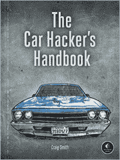
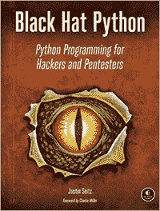
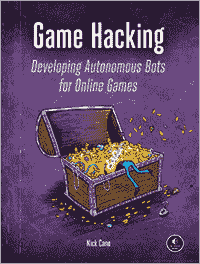
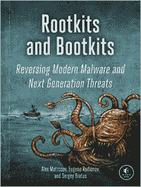
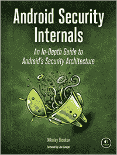
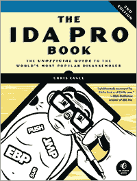

**更新信息**

访问 *[`www.nostarch.com/iossecurity`](https://www.nostarch.com/iossecurity)* 获取更新、勘误和其他信息。

*更多实用书籍请访问*  **NO STARCH PRESS**

**汽车黑客手册**

*作者* CRAIG SMITH

2016 年春季，352 页，$49.95

ISBN 978-1-59327-703-1

**黑帽 Python**

**黑客与渗透测试的 Python 编程**

*作者* JUSTIN SEITZ

2014 年 12 月，192 页，$34.95

ISBN 978-1-59327-590-7

**游戏黑客**

**为在线游戏开发自主机器人**

*作者* NICK CANO

2016 年春季，384 页，$44.95

ISBN 978-1-59327-669-0

**Rootkit 与 Bootkit**

**逆向分析现代恶意软件与下一代威胁**

*作者* ALEX MATROSOV, EUGENE

RODIONOV, *以及* SERGEY BRATUS

2016 年春季，304 页，$49.95

ISBN 978-1-59327-716-1

**安卓安全内部解析**

**安卓安全架构深入指南**

*作者* NIKOLAY ELENKOV

2014 年 10 月，432 页，$49.95

ISBN 978-1-59327-581-5

**IDA PRO 书籍，第 2 版**

**世界上最流行的反汇编器非官方指南**

*作者* CHRIS EAGLE

2011 年 7 月，672 页，$69.95

ISBN 978-1-59327-289-0

**电话：**

800.420.7240 或 415.863.9900

**电子邮件：**

SALES@NOSTARCH.COM

**网站：**

[WWW.NOSTARCH.COM](http://WWW.NOSTARCH.COM)
