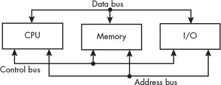

## 第一章：**设置环境**


我们将首先简要概述计算机硬件如何组织成三个子系统。 本章的目标是确保我们有一个共同的框架来讨论事物是如何组织的以及它们是如何相互配合的。在这个框架内，你将学习到如何创建和执行程序。

本书中有相当一部分编程内容。为了帮助你做好准备，本章结尾部分将描述如何设置编程环境，以我的系统为例进行讲解。

### **计算机子系统**

你可以将计算机硬件视为由三个独立的子系统组成：*中央处理单元 (CPU)*、*内存*和*输入/输出 (I/O)*。这些子系统通过*总线*连接，如图 1-1 所示。



*图 1-1：计算机的子系统*

让我们逐一介绍这些元素：

**中央处理单元 (CPU)**   控制数据在内存和 I/O 设备之间的流动。CPU 对数据执行算术和逻辑操作。它可以根据算术和逻辑操作的结果决定操作的顺序。它包含少量非常快速的内存。

**内存**   为 CPU 和 I/O 设备提供便于访问的存储空间，用于存储指令和处理的数据。

**输入/输出 (I/O)**   与外部世界和大容量存储设备（例如磁盘、网络、USB 和打印机）进行通信。

**总线**   是一条物理通信路径，具有指定如何使用该路径的协议。

如图 1-1 中的箭头所示，信号可以在总线上双向流动。*地址总线*用于指定内存位置或 I/O 设备。程序数据和程序指令通过*数据总线*流动。*控制总线*传输指定如何使用其他总线上的信号的控制信号。

图 1-1 中的总线显示了必须在三个子系统之间传递的信号的逻辑分组。给定的总线实现可能没有为每种类型的信号提供物理上独立的路径。例如，如果你曾经在计算机中安装过显卡，它可能使用了外设组件互联快速（PCI-E）总线。PCI-E 总线上的相同物理连接同时传输地址和数据，但在不同的时间传输。

### **创建和执行程序**

一个*程序*由一系列存储在内存中的机器指令组成。*机器指令*使计算机执行特定操作，可以将其视为计算机的原生语言。

当我们创建一个新程序时，我们使用*编辑器*编写程序的*源代码*，通常使用高级语言如 Python、Java、C++或 C。Python 仍然是最流行的编程语言之一，也是编程树莓派时最常用的语言。

要在 Python 中创建一个程序，我们使用编辑器编写程序并将其存储在源代码文件中。然后，我们使用`python`命令来执行我们的程序。例如，要执行名为*my_program.py*的 Python 程序，我们会使用以下命令：

```
$ python my_program.py
```

该命令调用 Python 程序，它是一个*解释器*，将每条 Python 语言语句翻译成机器指令，并告诉计算机执行它。每次我们想要执行程序时，都需要使用`python`命令来解释源代码并执行它。

Python 和其他解释型语言做得很好，它们将机器语言隐藏在我们面前。然而，本书的目标是让我们了解程序如何使用机器语言来控制计算机，因此我们将使用 C 语言进行编程，这样更容易让我们看到机器代码。

和 Python 一样，我们使用编辑器编写 C 语言程序并将其存储在源代码文件中。然后，我们使用*编译器*将 C 源代码翻译成机器语言。与逐条翻译和执行每条语句不同，编译器会在翻译之前考虑源代码文件中的所有语句，以找出最优的机器码翻译方式。最终的机器代码会存储在*目标*文件中。一个或多个目标文件可以链接在一起，生成一个*可执行*文件，这就是我们用来运行程序的文件。例如，我们可以使用以下命令编译名为*my_program.c*的程序：

```
$ gcc -o my_program my_program.c
```

为了执行我们的程序，我们使用：

```
$ ./my_program
```

如果你不懂 C 语言也不用担心，我会在本书中逐步解释我们所需要的功能。

无论它们来自解释器程序还是可执行文件，组成程序的机器指令都会被加载到内存中。大多数程序还包含一些常量数据，这些数据也会被加载到内存中。CPU 通过读取或*获取*每条指令来执行程序，并执行它。数据也会根据程序需要被获取。

当 CPU 准备执行程序中的下一条指令时，它会将该指令在内存中的位置放到地址总线上。CPU 还会在控制总线上放置*读取*信号。内存子系统会响应，通过将指令放到数据总线上，CPU 可以从中复制指令。如果 CPU 被指示从内存中读取数据，也会发生相同的事件顺序。

如果 CPU 被指示将数据存储到内存中，它会将数据放到数据总线上，将数据要存储的位置放到地址总线上，并将*写入*信号放到控制总线上。内存子系统会通过将数据总线上的数据复制到指定的内存位置来响应。

大多数程序还会访问 I/O 设备。其中一些是与人类互动的设备，如键盘、鼠标或屏幕；另一些是机器可读的 I/O 设备，如磁盘。与 CPU 和内存相比，I/O 设备的速度非常慢，并且它们的时序特性差异很大。由于这些时序特性，I/O 设备与 CPU 和内存之间的数据传输必须显式编程。

编程 I/O 设备需要深入了解设备的工作原理以及它如何与 CPU 和内存交互。我们将在书的后面部分探讨一些通用概念。同时，我们在本书中编写的几乎每个程序都会使用至少一个终端屏幕，它是一个输出设备。操作系统包括执行 I/O 的功能，C 运行时环境提供了一个库，其中包含访问操作系统 I/O 功能的应用程序功能。我们将使用这些 C 库函数执行大部分 I/O 操作，并将 I/O 编程留给更高级的书籍。

这几段旨在为你提供计算机硬件组织的总体概述。在深入探索这些概念之前，下一节将帮助你设置你在本书其余部分编程所需的工具。

### **编程环境**

在这一节中，我将描述如何设置我的树莓派，以便进行本书中描述的所有编程。如果你正在设置树莓派，我还建议你阅读树莓派文档中的“设置你的树莓派”一节，网址是*[`www.raspberrypi.com/documentation/computers/getting-started.html`](https://www.raspberrypi.com/documentation/computers/getting-started.html)*。

我使用的是官方支持的操作系统——树莓派操作系统（Raspberry Pi OS），它基于 Debian Linux 发行版。你必须使用 64 位版本来进行本书中的编程，32 位版本将无法使用。其他可用于树莓派的操作系统可能不支持我们将要进行的编程。

树莓派（Raspberry Pi）使用的是 micro SD 卡作为辅助存储，而不是硬盘或固态硬盘。我使用了树莓派映像器（Raspberry Pi Imager）来设置我的 micro SD 卡（可以在*[`www.raspberrypi.com/software/`](https://www.raspberrypi.com/software/)* 下载，并附有简短的视频教程）。运行树莓派映像器时，选择**Raspberry Pi OS (其他)**，然后选择**Raspberry Pi OS 完整版（64 位）**。

完整版本包括你进行本书编程所需的软件工具。你应当使用最新版本，并保持系统更新。这可能会安装比本书编写时可用的版本更新的软件开发工具。你可能会看到与书中的代码列表略有不同，但任何差异应该很小。

Raspberry Pi OS 使用 `bash` shell 程序来接受键盘命令并将其传递给操作系统。如果你对命令行不熟悉，随着本书的进行，我会向你展示你需要的基本命令。如果你花时间熟悉命令行的使用，你将更加高效。欲了解更多内容，我推荐 William Shotts 的 *The Linux Command Line*，第二版（No Starch Press，2019）。

你还应该熟悉 Linux 为我们将要使用的编程工具提供的文档。最简单的是大多数程序内置的帮助系统。你可以通过输入程序名称并仅使用 `--help` 选项来访问帮助。例如，`gcc --help` 会列出你可以与 `gcc` 一起使用的命令行选项，并简要描述每个选项的功能。

大多数 Linux 程序都包含手册，通常称为 *man 页*，它提供比帮助功能更完整的文档。你可以通过使用 `man` 命令并跟随程序名称来查看。例如，`man man` 会显示 `man` 程序的 man 页。

GNU 程序附带更完整的文档，可以使用`info`程序进行阅读。你可以通过以下命令在你的系统上安装 Raspberry Pi OS `info` 包：

```
$ sudo apt install info
```

安装完成后，你可以通过以下命令查看有关 `info` 的信息，命令将生成如下所示的输出：

```
$ info info 
Next: Stand-alone Info,  Up: (dir) 

Stand-alone GNU Info 

** 
This documentation describes the stand-alone Info reader which you can 
use to read Info documentation. 
   If you are new to the Info reader, then you can get started by typing 
'H' for a list of basic key bindings.  You can read through the rest of 
this manual by typing <SPC> and <DEL> (or <Space> and <Backspace>) to 
move forwards and backwards in it. 

* Menu: 

* Stand-alone Info::            What is Info? 
* Invoking Info::               Options you can pass on the command line. 
* Cursor Commands::             Commands which move the cursor within a node. 
* Scrolling Commands::          Commands for reading the text within a node. 
* Node Commands::               Commands for selecting a new node. 
* Searching Commands::          Commands for searching an Info file. 
* Index Commands::              Commands for looking up in indices. 
* Xref Commands::               Commands for selecting cross-references. 
* Window Commands::             Commands which manipulate multiple windows. 
* Printing Nodes::              How to print out the contents of a node. 
* Miscellaneous Commands::      A few commands that defy categorization. 
* Variables::                   How to change the default behavior of Info. 
* Colors and Styles::           Customize the colors used by Info. 
* Custom Key Bindings::         How to define your own key-to-command bindings. 
* Index::                       Global index. 
-----Info: (info-stnd)Top, 31 lines --All------------------------------------- 
--snip--
```

以`*`开头并以`::`结尾的项目是指向手册中其他页面的超链接。你可以使用键盘上的箭头键将光标放置在这些项目的任何位置，然后按下 ENTER 键以打开该页面。

为了获得我们将要使用的编程工具的`info`文档，我需要安装以下 Raspberry Pi OS 包：

binutils-doc   这为 GNU 汇编器 `as`（有时称为 `gas`）添加了有用的文档。

gcc-doc   这为 GNU `gcc` 编译器添加了有用的文档。

你需要的这些功能的包可能会根据你使用的操作系统版本有所不同。

在大多数情况下，我编译程序时没有进行优化（使用了`-O0`选项），因为目标是学习概念，而不是创建最高效的代码。这些示例应适用于安装了 Raspberry Pi OS 的大多数版本的 `gcc`、`g++` 和 `as`。然而，编译器生成的机器代码可能会有所不同，具体取决于编译器的配置和版本。在本书进行到一半时，你将开始看到编译器生成的汇编语言。任何差异应在接下来的章节中保持一致。

你需要使用文本编辑器进行编程，而不是使用文字处理软件。文字处理软件会在文本中添加许多隐藏的控制字符来格式化文本。这些隐藏字符会干扰编译器和汇编器，导致它们无法正常工作。

Raspberry Pi 上有几款优秀的文本编辑器，每款编辑器都有自己的特色。我建议你尝试几款，并决定你最喜欢哪一款。Raspberry Pi OS 预装了一些选项。如果你右键点击一个文本文件，你可以选择以下编辑器之一：

**Geany**  这是默认的编程编辑器。你只需双击一个源代码文件，它就会自动打开。Geany 编辑器在集成开发环境（IDE）中提供了许多有用的功能。

**文本编辑器**  实际的编辑器是 Mousepad。这是一个非常简洁的编辑器，缺少许多对编写程序代码有用的功能。

**Vim**  Vim 编辑器是 Vi 编辑器的改进版，Vi 编辑器是为 1976 年的 Unix 系统创建的。它提供了一种面向模式的命令行用户界面。文本通过键盘命令进行操作。若干命令将 Vim 切换到“文本插入”模式。按 ESC 键可以返回到命令模式。

Raspberry Pi OS 还预装了 Thonny IDE。它所包含的工具主要用于 Python 编程。

另一个流行的编辑器是 Emacs。你可以使用以下命令在 Raspberry Pi 上安装它：

```
$ sudo apt install emacs
```

你可以通过命令行或图形用户界面使用 Emacs。

我最喜欢的编辑器是 Visual Studio Code（VS Code）。VS Code 是免费的，适用于所有常见平台；你可以在 *[`code.visualstudio.com`](https://code.visualstudio.com)* 了解更多信息。它也包含在 Raspberry Pi OS 的软件包库中，可以通过以下命令进行安装：

```
$ sudo apt install code
```

安装后，右键点击一个文本文件时会显示 Visual Studio Code。VS Code 使用图形用户界面进行编辑，同时允许你打开终端窗口使用命令行。

这里提到的程序名称包括 `geany`、`mousepad`、`vim`、`thonny`、`emacs` 和 `code`。要通过命令行启动这些编辑器中的任何一个，输入程序名称后跟你想要打开的文件名。例如，你可以使用 VS Code 创建“轮到你了”练习 1.1 中的 Python 程序，命令如下：

```
$ code hello_world.py
```

如果文件 *hello_world.py* 尚不存在，VS Code 在你保存工作时会创建它。如果文件已经存在，VS Code 会打开它供你继续编辑。

我在我的 Windows 11 笔记本上安装了 VS Code。它允许我登录到我的 Raspberry Pi，在编辑面板中完成所有编辑工作，并打开终端面板来编译和执行我的程序。你不需要在 Raspberry Pi 上安装 VS Code。

Geany、Vim 和 VS Code 都是本书中涉及的编程的不错选择。如果你已经习惯使用 Raspberry Pi 上的某个文本编辑器，我建议你继续使用它。不要花太多时间去选择“最佳”编辑器。

**轮到你了**

1.1    确保你了解本书中将使用的树莓派。它使用什么 CPU？它有多少内存？有哪些 I/O 设备连接到它？你将使用哪个编辑器？

1.2    在一个名为 *hello_world.py* 的文件中创建以下 Python 程序并执行它：

```
# Hello, World program
print("Hello, World!")
```

在这个练习中创建了哪些文件？

1.3    在一个名为 *hello_world.c* 的文件中编写以下 C 程序，然后编译并执行它：

```
// Hello, World program 
#include <stdio.h> 
int main(void) 
{ 
    printf("Hello, World!\n"); 
    return 0; 
}
```

在这个练习中创建了哪些文件？

### **你学到的内容**

**中央处理单元（CPU）**  控制计算机大多数活动的子系统。它还包含少量非常快速的内存。

**内存**  提供程序和数据存储的子系统。

**输入/输出（I/O）**  提供与外部世界和大容量存储设备通信的子系统。

**总线**  CPU、内存和 I/O 之间的通信通道。

**程序执行**  了解在程序运行时，三个子系统和总线是如何使用的概况。

**编程环境**  设置进行本书编程所需工具的示例。

在下一章，你将开始学习数据如何存储在计算机中，了解 C 语言编程，并开始学习如何将调试器作为学习工具使用。
